### Direct Answer

**To start a mobile ADAS windshield calibration business in 2027, you (1) decide which of three operating models fits your skill + capital + market — solo mobile calibration tech serving 8-25 auto-glass and body shops within a 40-mile radius at $200-$600 per static-or-dynamic calibration ($35K-$75K startup all-in: one calibration platform, a scan-tool bench, a cargo van or box truck, and insurance), multi-tech regional calibration company running 2-5 mobile units plus a fixed indoor calibration bay for vehicles requiring climate-controlled static targets ($150K-$400K startup), or hybrid sublet-plus-mobile operation that contracts in-shop at high-volume Safelite-network and MSO (multi-shop-operator) body-shop accounts while also serving driveway and dealership overflow ($90K-$200K startup), (2) clear the certification + insurance stack — there is no state license to perform ADAS calibration in any US state, but credible 2027 operators carry [I-CAR ProLevel 1/2/3](https://www.i-car.com/) ($300-$1,500 in coursework) including the I-CAR ADAS-specific curriculum, [ASE A6 Electrical + ASE L1 Advanced Engine Performance + the newer ASE Advanced Driver Assistance Systems (ADAS) Specialist L4 certification](https://www.ase.com/) ($40-$95 per exam), [Auto Glass Safety Council (AGSC) auto-glass technician certification](https://www.agsc.org/) for operators who also do glass replacement, and equipment-maker training from [Bosch](https://www.boschdiagnostics.com/), [Autel](https://www.autel.com/), [Hunter Engineering](https://www.hunter.com/), and [Snap-on John Bean](https://www.snapon.com/) — plus general-liability + garage-keepers + commercial-auto + a critical **errors-and-omissions / professional-liability policy** because a mis-calibrated automatic-emergency-braking camera on a $55K ADAS-equipped vehicle is a genuine bodily-injury exposure, (3) build the calibration equipment + OEM-procedure stack — a primary calibration platform ([Bosch DAS 3000 / ADAS Calibration system](https://www.boschdiagnostics.com/), [Autel MaxiSys IA900WA wheel-alignment + ADAS combo](https://www.autel.com/), [Hunter Engineering Ultimate ADAS](https://www.hunter.com/), [Snap-on John Bean Tru-Point](https://www.snapon.com/), [Texa RCCS 3](https://www.texa.com/), [Hella Gutmann CSC-Tool SE](https://www.hella.com/), [OPUS IVS / Autologic](https://www.opusivs.com/), [TopDon Phoenix](https://www.topdon.com/), [Launch X-431 ADAS Pro](https://www.launchtechusa.com/) — $18K-$90K depending on platform and target set), an OEM-capable scan-tool bench ([Autel MaxiSys Ultra](https://www.autel.com/), [Snap-on Zeus](https://www.snapon.com/), [Bosch ADS 625X](https://www.boschdiagnostics.com/), plus OEM software subscriptions to [GM ACDelco TDS](https://www.acdelcotds.com/), [Ford / Lincoln motorcraftservice.com](https://www.motorcraftservice.com/), [Toyota techinfo.toyota.com](https://techinfo.toyota.com/), [Honda techinfo.honda.com](https://techinfo.honda.com/), [Subaru STIS](https://techinfo.subaru.com/)), an OEM-repair-procedure subscription ([ALLDATA](https://www.alldata.com/), [Mitchell 1 ProDemand](https://mitchell1.com/), [OEC RepairLogic](https://www.oeconnection.com/), [I-CAR Repairability Technical Support (RTS) portal with OEM position statements](https://rts.i-car.com/)), and a remote-diagnostic / OEM-programming fallback ([asTech](https://www.astech.com/), [Repairify](https://www.repairify.com/), [OPUS IVS](https://www.opusivs.com/)) for procedures the in-house tools cannot complete, plus an indoor space with **level floor, controlled lighting, and the OEM-specified clear-floor envelope** because most static calibrations cannot be done legitimately in a sloped driveway, and (4) build the customer-acquisition engine — auto-glass shop and body-shop B2B account development is the entire game (a single busy MSO body shop or Safelite-affiliated glass shop can be 100-400 calibrations/month of demand), with shop-facing positioning around **documented OEM-procedure compliance, fast turnaround, and audit-proof pre/post scan reports** built on top of the structural 2027 reality — **(a)** ADAS hardware is now near-universal: per [IIHS](https://www.iihs.org/) and the [NHTSA / IIHS 2016 voluntary commitment](https://www.nhtsa.gov/) automatic emergency braking became effectively standard on the vast majority of new US light vehicles by September 2022, **(b)** the [NHTSA FMVSS No. 127 final rule (published 2024)](https://www.nhtsa.gov/) mandates AEB with pedestrian detection on essentially all new light vehicles with a compliance phase-in running toward September 2029, which permanently expands the calibrated-vehicle parc, **(c)** every windshield replacement, every front-bumper repair, and most suspension or alignment jobs on a forward-facing-camera or radar-equipped vehicle now require an OEM-defined recalibration per published OEM position statements aggregated by the [I-CAR RTS portal](https://rts.i-car.com/), and **(d)** insurance carriers — [State Farm](https://www.statefarm.com/), [Progressive (NYSE:PGR)](https://www.progressive.com/), [Allstate (NYSE:ALL)](https://www.allstate.com/), [GEICO (Berkshire Hathaway NYSE:BRK.B)](https://www.geico.com/), [Travelers (NYSE:TRV)](https://www.travelers.com/) — increasingly require, audit, and pay for documented calibration on glass and collision claims, which converts calibration from an optional add-on into a billable, insurer-reimbursed line item. Year-1 solo mobile tech doing 6-14 calibrations/day across shop accounts at a $250-$450 blended rate runs **$180K-$520K Year-1 revenue with $90K-$240K owner take-home** at 55-70% gross margin once the van and platform are paid down; a 2-3 unit regional operation reaches **$600K-$1.8M revenue** by Year 2-3; a mature 4-6 unit operation with a fixed bay reaches **$1.5M-$4M revenue and $300K-$900K owner profit** at 18-30% net. The three things that kill new mobile ADAS calibration businesses: (a) **doing static calibrations in non-compliant conditions** — sloped driveways, bad lighting, no clear-floor envelope — which produces calibrations that pass the tool but fail the OEM procedure and create catastrophic liability, (b) **under-pricing against the dealer** instead of competing on turnaround + documentation — a race-to-the-bottom $99 calibration cannot fund proper equipment, training, and E&O coverage, and (c) **skipping the pre/post scan report** — without documented, time-stamped, OEM-procedure-referenced reports the operator has no defense in an insurance audit or a post-collision lawsuit.**

The mobile ADAS windshield calibration business in 2027 is a **high-skill, high-liability automotive technical service** sitting at the intersection of three converging structural forces: the near-universal deployment of camera-and-radar driver-assistance hardware on the US vehicle fleet, a regulatory environment ([NHTSA FMVSS 127](https://www.nhtsa.gov/), OEM position statements aggregated by [I-CAR RTS](https://rts.i-car.com/)) that makes recalibration mandatory after routine glass and collision work, and an auto-glass + collision-repair industry that mostly does not want to own the calibration capability in-house. The operator who wins is **(a) procedure-compliant, (b) documentation-disciplined, (c) shop-account-driven, and (d) equipment-and-training-credible** — not the cheapest mobile unit in the market.

**TL;DR:** Pick a model — solo mobile tech ($35K-$75K, 8-25 shop accounts), multi-unit regional company ($150K-$400K, fixed bay + mobile fleet), or hybrid sublet-plus-mobile ($90K-$200K). Clear the credential stack (no state license, but [I-CAR](https://www.i-car.com/) ProLevel + ASE L1/L4 + [AGSC](https://www.agsc.org/) + equipment-maker training are table stakes) and bind real **E&O / professional-liability** insurance. Buy a calibration platform ([Bosch DAS 3000](https://www.boschdiagnostics.com/), [Autel IA900](https://www.autel.com/), [Hunter Ultimate ADAS](https://www.hunter.com/), [John Bean Tru-Point](https://www.snapon.com/) — $18K-$90K), an OEM-capable scan bench, an OEM-procedure subscription ([ALLDATA](https://www.alldata.com/), [Mitchell 1](https://mitchell1.com/), [I-CAR RTS](https://rts.i-car.com/)), and a remote-diagnostic fallback ([asTech](https://www.astech.com/), [Repairify](https://www.repairify.com/)). Build B2B accounts with auto-glass shops and MSO body shops — a single busy account is 100-400 calibrations/month. Price on turnaround + audit-proof documentation, never on being the cheapest. Solo Year-1: **$180K-$520K revenue, $90K-$240K owner take-home**; mature multi-unit operation: **$1.5M-$4M revenue, $300K-$900K profit**. The killers: non-compliant static-calibration conditions, race-to-the-bottom pricing, and skipping the pre/post scan report.

This entry is structured into H2 banner sections covering the 2027 calibration landscape, the certification + capital + structure stack, the equipment + OEM-procedure + service-delivery model, customer acquisition + pricing + insurance billing, the numbers and tables, and a counter-case + exit reality section. A Mermaid 90-day launch flowchart visualizes the build-out sequence.

---

## 1. The 2027 Mobile ADAS Calibration Landscape

### 1.1 ADAS Hardware Is Now Near-Universal On The Serviceable Parc

The single most consequential 2027 operating reality. Per **[IIHS (Insurance Institute for Highway Safety)](https://www.iihs.org/)**, **[NHTSA](https://www.nhtsa.gov/)**, and **[I-CAR Repairability Technical Support](https://rts.i-car.com/)**:

- **Automatic emergency braking is effectively standard.** Per the [2016 NHTSA-IIHS voluntary commitment](https://www.iihs.org/) in which 20 automakers representing the overwhelming majority of US new-vehicle sales agreed to make AEB standard, [IIHS](https://www.iihs.org/) reported that participating manufacturers met the September 2022 target on the large majority of their volume — meaning nearly every model-year-2023-and-newer vehicle carries a forward-facing camera, radar, or both.
- **The calibrated parc compounds every year.** Forward-facing cameras and front radar started appearing in volume on mass-market models around 2017-2019 ([Toyota Safety Sense](https://www.toyota.com/), [Honda Sensing](https://www.honda.com/), [Subaru EyeSight](https://www.subaru.com/), [Hyundai SmartSense](https://www.hyundaiusa.com/), [Ford Co-Pilot360](https://www.ford.com/)). By 2027 the *serviceable* fleet — vehicles old enough to need windshield replacement and collision repair but new enough to carry ADAS — is dominated by camera-equipped vehicles.
- **The structural implication.** A windshield-replacement or collision job that 10 years ago was a glass-and-urethane transaction is now a **glass-and-urethane-plus-calibration** transaction. The calibration step did not exist as a service category at meaningful volume before roughly 2018; by 2027 it is a mandatory, billable line item on a large share of glass and front-end collision jobs.
- **Why "mobile" specifically.** Auto-glass replacement is overwhelmingly a mobile service — [Safelite](https://www.safelite.com/) and most independents come to the customer's driveway or workplace. The calibration must follow the glass. But many static calibrations cannot be done in a driveway, which creates the central tension this business resolves: a mobile-dispatched, procedure-compliant calibration capability that the glass and body shops do not want to build themselves.

### 1.2 The Regulatory Tailwind — FMVSS 127 And OEM Position Statements

The structural force expanding the addressable market:

- **NHTSA FMVSS No. 127.** The [final rule published by NHTSA in 2024](https://www.nhtsa.gov/) requires automatic emergency braking — including pedestrian-detection capability — on essentially all new light vehicles, with a compliance phase-in extending toward **September 2029**. This permanently locks AEB hardware (and therefore the calibration requirement) into every new vehicle for the foreseeable future.
- **OEM position statements are the operative rulebook.** Calibration is not governed primarily by a federal statute about *aftermarket service* — it is governed by **OEM repair-procedure documents and position statements**. Per the [I-CAR Repairability Technical Support (RTS) portal](https://rts.i-car.com/), most automakers publish position statements specifying that windshield replacement, front-bumper R&I, and certain suspension or alignment work require a defined recalibration of the affected ADAS sensors. These documents — not a single law — are what an operator must follow and document.
- **Insurer behavior converts requirement into revenue.** Carriers including [State Farm](https://www.statefarm.com/), [Progressive (NYSE:PGR)](https://www.progressive.com/), [Allstate (NYSE:ALL)](https://www.allstate.com/), and [GEICO (Berkshire Hathaway NYSE:BRK.B)](https://www.geico.com/) increasingly recognize, audit for, and reimburse documented calibration on glass and collision claims. Estimating platforms — [CCC Intelligent Solutions (NYSE:CCCS)](https://www.cccis.com/), [Mitchell (Enlyte)](https://www.mitchell.com/), and [Audatex (Solera)](https://www.solera.com/) — carry calibration operations and labor lines.
- **The strategic implication.** The operator who can produce a clean, OEM-procedure-referenced, time-stamped pre/post scan report is selling *insurance audit protection* to the glass and body shop, not just a calibration. That documentation is the moat.

### 1.3 Static Versus Dynamic — Why The Service Splits In Two

The technical reality that shapes the whole operating model:

- **Static calibration** uses physical targets — printed boards, panels, or doppler/radar reflectors — placed at OEM-specified distances and heights in front of the vehicle while the vehicle is stationary. It requires a **level floor, controlled and even lighting, a clear-floor envelope free of reflective clutter, and precise target placement**. This is the calibration type that *cannot* legitimately be done in a sloped, sunlit, cluttered driveway.
- **Dynamic calibration** is performed by driving the vehicle on well-marked roads at OEM-specified speeds while the scan tool runs the calibration routine. It requires suitable roads, clear lane markings, daylight, and dry conditions — and is far more "mobile-friendly," though weather and road quality still gate it.
- **Many vehicles require both.** A large share of forward-camera systems require a static *and* a dynamic procedure, and the OEM procedure dictates the sequence. The operator must be able to deliver both.
- **The operating consequence.** A pure-driveway mobile model can only honestly serve the dynamic-only and combo-dynamic portion of demand. The serious 2027 operator either carries a portable static rig deployed inside the *shop's* bay (sublet model) or runs a fixed indoor calibration bay and dispatches mobile units for dynamic work — see Section 3. This is why "mobile ADAS calibration" almost always evolves into a hybrid mobile-plus-bay operation. (See the equipment-driven model split in (q2073) and the mobile-service economics in (q1147).)

### 1.4 Who The Customer Actually Is — The B2B Account Map

This is a B2B business; the vehicle owner is rarely the buyer:

- **Auto-glass shops.** [Safelite](https://www.safelite.com/)-network and independent glass shops generate enormous calibration demand because every camera-equipped windshield replacement triggers a calibration. Many glass shops sublet 100% of calibration rather than buying $50K+ of equipment.
- **Collision / body shops and MSOs.** Multi-shop operators — [Caliber Collision](https://www.calibercollision.com/), [Gerber Collision & Glass (Boyd Group, TSX:BYD)](https://www.gerbercollision.com/), [Crash Champions](https://www.crashchampions.com/), [Classic Collision](https://www.classiccollision.net/) — plus thousands of independent body shops generate calibration demand on front-end collision repairs. MSO accounts are the highest-volume, most-consistent revenue.
- **New-car dealerships.** Dealers can calibrate in-brand vehicles but frequently sublet off-brand or overflow work, and used-car / recon departments are steady demand.
- **Fleet operators, municipalities, and rental.** Fleet glass and collision events generate calibration demand with predictable, contract-style billing.
- **The account-concentration math.** A single busy MSO body shop or high-volume glass shop can represent **100-400 calibrations/month**. Three to six solid accounts can fully load a solo operator. This is the opposite of a consumer service: the entire growth motion is account development, not retail marketing.

### 1.5 The Competitive Field — Dealers, Aftermarket Networks, And National Players

Who the new operator is competing against:

- **Franchise dealers.** Brand-captive, expensive, slow turnaround, and uninterested in off-brand work. The independent mobile operator wins on speed and on serving every brand.
- **National calibration networks and franchises.** Calibration-specialist networks and franchised concepts have expanded since 2019; they bring brand, training, and equipment-financing support but take royalties and constrain the operator.
- **In-house shop capability.** Some large MSOs and big glass operations have built their own calibration centers. The independent's opening is everyone *below* that scale — the thousands of shops for whom in-house calibration never pencils.
- **asTech / Repairify and remote diagnostics.** [asTech](https://www.astech.com/) and [Repairify](https://www.repairify.com/) provide remote OEM-tool diagnostic and programming support; they are partly a competitor and partly a *supplier* — the smart operator uses them as a fallback for procedures the in-house tools cannot complete rather than treating them as a rival.
- **The strategic position.** The winning 2027 independent is the **fast, every-brand, fully-documented, procedure-compliant** local option that the glass and body shops trust enough to make their default calibration partner. (Adjacent every-brand independent-service positioning is covered in (q9682) and (q2065).)

### 1.6 The 2027 Risk Picture — Liability Is The Defining Constraint

Why this business is not a low-stakes mobile-service play:

- **A mis-calibrated AEB or lane-keep system is a bodily-injury exposure.** If a forward-facing camera is calibrated outside OEM tolerance and the vehicle later fails to brake or steers incorrectly, the calibration provider is squarely in the liability chain. This is the single most important reason the business demands real **errors-and-omissions / professional-liability** coverage and disciplined documentation.
- **Insurance audits claw back undocumented work.** Carriers audit calibration line items; an operator who billed for a calibration but cannot produce a procedure-referenced pre/post scan report can face chargebacks and account loss.
- **OEM procedures change.** Position statements and procedures are revised; an operator working from a stale procedure is non-compliant even if the tool reports success. A live [I-CAR RTS](https://rts.i-car.com/) / [ALLDATA](https://www.alldata.com/) / [Mitchell 1](https://mitchell1.com/) subscription is not optional.
- **The honest framing.** This is a *technical professional service* with malpractice-style exposure, not a detailing or oil-change van. The operators who treat it that way — credentialed, insured, documented — build durable account relationships; the ones who treat it as a cheap mobile side-hustle get pruned out fast.

### 1.7 The Sensor Stack — What Actually Gets Calibrated

The technical map of the work, because pricing and procedure flow from it:

- **Forward-facing camera.** Mounted behind the windshield near the rearview mirror; drives lane-keep assist, lane-departure warning, traffic-sign recognition, and the camera half of automatic emergency braking. **This is the sensor a windshield replacement most directly disturbs** — the camera bracket is bonded to or clipped near the glass, and a new windshield changes the optical path. A forward camera almost always requires recalibration after glass replacement.
- **Front radar.** Mounted behind the grille or front bumper; drives adaptive cruise control and the radar half of AEB. Disturbed by front-bumper R&I, grille work, and front-end collision repair — and increasingly by suspension or alignment work that shifts the vehicle's thrust line.
- **Corner / blind-spot radar.** Mounted in the rear bumper corners; drives blind-spot monitoring and rear cross-traffic alert. Disturbed by rear-bumper work.
- **Ultrasonic parking sensors.** Mounted in front and rear bumpers; disturbed by any bumper R&I.
- **Surround-view / 360-degree cameras.** Mounted in mirrors, grille, and tailgate; disturbed by mirror, grille, or tailgate work.
- **The pricing consequence.** Most calibration jobs are *forward-camera-after-windshield* and *front-radar-after-collision*, which is why a calibration provider's bread-and-butter is camera and front-radar work. Multi-sensor collision jobs — front camera plus front radar plus corner radar — are the highest-revenue tickets because each sensor is a separately priced procedure.
- **The brand-variation reality.** Two vehicles with "the same" forward camera can have completely different OEM procedures — one requires static-only, one requires static-then-dynamic, one requires a specific target at a specific distance. This is why a live OEM-procedure subscription, not technician memory, governs every job. (The per-procedure pricing logic this drives is detailed in Section 4.2 and parallels the menu-pricing approach in (q2073).)

### 1.8 The 90-Day Launch Flowchart

The integrated build-out sequence:

```mermaid
flowchart TD
    A[Day 0 Decision to Start] --> B[Day 1-30 Foundation]
    B --> B1[LLC formation plus EIN]
    B --> B2[GL garage-keepers commercial-auto plus E&O bind]
    B --> B3[I-CAR ProLevel plus ADAS curriculum enroll]
    B --> B4[ASE A6 L1 L4 exam scheduling]
    A --> C[Day 1-45 Equipment and Procedure Stack]
    C --> C1[Calibration platform purchase Bosch Autel Hunter John Bean]
    C --> C2[OEM-capable scan bench plus OEM software subs]
    C --> C3[OEM-procedure subscription ALLDATA Mitchell1 I-CAR RTS]
    C --> C4[Remote-diagnostic fallback asTech Repairify account]
    C --> C5[Van or box truck plus indoor bay or sublet plan]
    A --> D[Day 15-60 Account Targeting]
    D --> D1[Map glass shops MSO body shops dealers fleets]
    D --> D2[Capability sheet plus sample scan report]
    D --> D3[Pricing tiers static dynamic combo plus diag]
    D --> D4[Scan-report template OEM-procedure referenced]
    A --> E[Day 30-75 Account Development]
    E --> E1[Glass shop and body shop walk-ins and demos]
    E --> E2[CCC Mitchell Audatex billing-line setup]
    E --> E3[Turnaround SLA commitment per account]
    E --> E4[First sublet trials at 2-3 anchor accounts]
    A --> F[Day 60-90 First Production and Cadence]
    F --> F1[First 20-50 calibrations completed and documented]
    F --> F2[Dispatch and routing workflow established]
    F --> F3[Equipment-maker certification completion]
    F --> F4[Pre-post scan report QA every job]
    B4 --> G[Day 90 Operational Cadence]
    C5 --> G
    D4 --> G
    E4 --> G
    F4 --> G
    G --> H[Year 1 Target 8-25 shop accounts 6-14 calibrations per day]
```

### 1.9 The Service-Delivery Cadence — The Weekly And Daily Rhythm

The operational rhythm of a running calibration operation:

- **Daily: dispatch + routing.** Calibration requests come in from shop accounts; the operator batches by geography and by static-versus-dynamic type to minimize windshield-time. **6-14 jobs/day** is a realistic loaded solo target once accounts are mature.
- **Per job: procedure pull + setup + calibration + documentation.** Pull the live OEM procedure from [I-CAR RTS](https://rts.i-car.com/) / [ALLDATA](https://www.alldata.com/), run a pre-scan, perform the static and/or dynamic calibration, run a post-scan, and produce the referenced pre/post report. **45-150 minutes per vehicle** depending on brand and procedure.
- **Weekly: account check-ins + billing.** Confirm volume with anchor accounts, submit calibration line items into [CCC](https://www.cccis.com/) / [Mitchell](https://www.mitchell.com/) / [Audatex](https://www.solera.com/), and chase any documentation gaps before insurer audit windows close.
- **Monthly: equipment + procedure maintenance.** Software/firmware updates on the calibration platform and scan tools, target-set inspection and re-leveling, and a review of newly published OEM position statements.
- **Quarterly: certification + capability expansion.** Renew and extend [I-CAR](https://www.i-car.com/) and equipment-maker credentials, and evaluate adding brand coverage or a second mobile unit.

---

## 2. Certification, Capital, And Business Structure

### 2.1 The Credential Stack — No License, But Real Certifications Are Table Stakes

What an operator actually needs to be credible:

- **No state license exists** to perform ADAS calibration in any US state. Anyone can buy a platform and start. That is precisely why **voluntary certification is the trust signal** that wins shop accounts and survives insurer scrutiny.
- **[I-CAR (Inter-Industry Conference on Auto Collision Repair)](https://www.i-car.com/)** — the collision-industry training body. I-CAR ProLevel 1/2/3 plus the I-CAR ADAS-specific curriculum is the most-recognized credential among body shops and MSOs. Budget **$300-$1,500** in coursework.
- **[ASE (National Institute for Automotive Service Excellence)](https://www.ase.com/)** — ASE A6 (Electrical/Electronic Systems) and ASE L1 (Advanced Engine Performance) are baseline; the newer **ASE ADAS Specialist (L4) certification** directly validates calibration competence. Each exam is roughly **$40-$95**.
- **[Auto Glass Safety Council (AGSC)](https://www.agsc.org/)** — auto-glass technician certification, relevant for operators who also perform windshield replacement rather than calibration-only.
- **Equipment-maker training.** [Bosch](https://www.boschdiagnostics.com/), [Autel](https://www.autel.com/), [Hunter Engineering](https://www.hunter.com/), [Snap-on John Bean](https://www.snapon.com/), [Texa](https://www.texa.com/), and [Hella Gutmann](https://www.hella.com/) all provide platform-specific certification — essential for using the equipment correctly and for warranty support.
- **The strategic point.** Certifications do not legally gate entry, but they gate *trust*. A body shop subletting calibration is buying audit protection; an I-CAR-and-ASE-credentialed provider is far easier to defend in an insurer review than an uncertified one.

### 2.2 The Insurance Stack — E&O Is Not Optional

The coverage that makes the business legitimate:

- **General liability (GL).** Standard premises-and-operations coverage. Foundational and inexpensive.
- **Garage-keepers / on-hook coverage.** Covers customer vehicles in the operator's care, custody, and control — essential when vehicles sit in a calibration bay or are road-driven for dynamic procedures.
- **Commercial auto.** Covers the cargo van or box truck and any dynamic-calibration test drives.
- **Errors-and-omissions / professional-liability.** **The critical and most-overlooked policy.** A calibration performed outside OEM tolerance that contributes to a later crash is a professional negligence claim. E&O coverage specific to ADAS calibration is the single most important risk transfer in the business — and uninsured operators are uninsurable accounts for serious MSOs.
- **Workers' comp.** Required once the operator hires technicians.
- **The framing.** Insurance is a meaningful annual cost line, but it is also a *sales asset* — sophisticated MSO accounts ask for proof of E&O coverage before they will sublet, so carrying it both protects the operator and qualifies the operator for the best accounts.

### 2.3 The Three Operating Models

The structural choice that drives capital and trajectory:

- **Model A — Solo mobile calibration tech.** One operator, one calibration platform, one scan bench, one van, serving 8-25 shop accounts within roughly a 40-mile radius. **$35K-$75K startup all-in.** Lowest risk, fastest to cash flow, capped by the owner's hours and by the static-calibration-conditions constraint.
- **Model B — Multi-tech regional calibration company.** 2-5 mobile units plus a **fixed indoor calibration bay** with proper floor, lighting, and clear-floor envelope for static procedures. **$150K-$400K startup.** Higher overhead, but solves the static-conditions problem cleanly and scales past the owner-hours ceiling.
- **Model C — Hybrid sublet-plus-mobile.** Contracts in-shop at high-volume glass and MSO body-shop accounts (deploying portable static rigs inside the *shop's* clean bay) while also serving driveway, dealership, and fleet overflow. **$90K-$200K startup.** Captures the static volume without the cost of building a dedicated bay, at the cost of dependence on shop facilities.
- **The recommended path.** Most successful 2027 operators start at **Model A or C**, prove account relationships and volume, then graduate to **Model B** by adding a fixed bay once two or three anchor accounts are locked. (The mobile-first then fixed-footprint progression mirrors the path in (q2065) and (q2068).)

### 2.4 Entity, Structure, And The Capital Stack

The formation and funding mechanics:

- **Entity.** An **LLC** is the standard choice — liability separation matters acutely in a business with bodily-injury exposure, and the LLC plus E&O plus garage-keepers form the layered defense. An S-corp election makes sense once owner profit is consistently strong.
- **Capital sources.** [SBA 7(a) and SBA Express loans](https://www.sba.gov/) finance equipment-heavy service startups well; equipment-specific financing from [Bosch](https://www.boschdiagnostics.com/), [Autel](https://www.autel.com/), [Snap-on](https://www.snapon.com/), and [Hunter](https://www.hunter.com/) (or third-party lessors) lets the operator spread the $18K-$90K platform cost; a HELOC or owner cash typically covers the van and working capital.
- **The capital-allocation reality.** The calibration platform plus scan bench is the dominant cost line. The temptation is to buy the cheapest platform; the correct discipline is to buy the platform with the **brand coverage, target sets, and OEM-procedure integration** the local account base actually demands.
- **Working capital.** Insurance bills are mostly annual or quarterly; subscriptions ([ALLDATA](https://www.alldata.com/), [Mitchell 1](https://mitchell1.com/), OEM software, [I-CAR RTS](https://rts.i-car.com/)) are recurring; and B2B accounts pay on 30-60 day terms — so plan **3-6 months of operating runway** before account receivables stabilize.

### 2.5 The Hiring Path — From Owner-Operator To A Bench Of Techs

When and how the operator adds people:

- **The first hire is usually a second calibration tech, not an admin.** The constraint a solo operator hits first is *hours* — accounts want more turnaround than one person can deliver. A second technician with a second mobile unit roughly doubles capacity.
- **The technician profile.** The ideal hire has an automotive-electrical or collision background ([ASE A6](https://www.ase.com/), [I-CAR](https://www.i-car.com/) coursework) and either calibration experience or strong diagnostic instincts. Calibration is teachable to a good auto-electrical tech; it is hard to teach to someone with no automotive base.
- **The training liability.** Because a mis-calibration is a bodily-injury exposure, a new tech cannot be turned loose unsupervised. Budget a **ride-along and shadowed-job period** before a new tech runs solo, and keep a documented QA review of their early jobs.
- **The compensation model.** Calibration techs are skilled labor; pay reflects it — hourly plus a per-job or per-revenue incentive aligns the tech with both speed and documentation quality. Underpaying produces turnover, and turnover in a liability business is dangerous.
- **The dispatcher / coordinator hire.** Once there are 2-3 trucks, a coordinator who handles scheduling, account communication, and CCC/Mitchell billing-line follow-up frees the technicians to stay billable. This is typically the second non-technician hire.
- **The supervisor layer.** At 4-6 units, a lead technician or operations manager owns QA, procedure-update training, and equipment maintenance — the function that keeps the liability discipline intact as the owner steps back from the van. (This owner-to-bench progression mirrors the staffing path in (q9682) and (q2065).)

### 2.6 Coverage Strategy — How Many Brands, How Deep

The make-or-break equipment-and-training decision:

- **Brand coverage is the product.** A shop account wants one calibration partner who can handle whatever rolls in. Patchy brand coverage — strong on Toyota and Honda, blind on European marques — sends the account to a competitor for the gaps and erodes the relationship.
- **The platform-coverage tradeoff.** Multi-brand platforms ([Autel](https://www.autel.com/), [Bosch](https://www.boschdiagnostics.com/), [Hunter](https://www.hunter.com/), [John Bean](https://www.snapon.com/), [Texa](https://www.texa.com/), [Hella Gutmann](https://www.hella.com/)) cover a wide range; the gaps are typically newer European procedures and brand-specific routines that require OEM software or a remote-diagnostic partner.
- **The remote-diagnostic backstop.** [asTech](https://www.astech.com/), [Repairify](https://www.repairify.com/), and [OPUS IVS](https://www.opusivs.com/) let the operator complete OEM-tool procedures the in-house equipment cannot — preserving the "every brand" promise without owning every OEM scan tool.
- **The decision rule.** Survey the local account base *first* — what brands do the target glass and body shops actually see? Buy the platform and target sets that cover that mix at depth, then use remote diagnostics for the long tail. Coverage breadth, matched to local demand, is the durable competitive position.

---

## 3. Equipment, OEM Procedures, And Service Delivery

### 3.1 The Calibration Platform — The Core Capital Asset

The equipment decision that defines the business:

- **What a calibration platform is.** A frame or stand system plus the OEM-pattern static targets (camera target boards, radar reflectors, doppler simulators, corner reflectors) and the software that positions them at OEM-specified distances and heights relative to the vehicle's thrust line.
- **The major platforms.** [Bosch DAS 3000 / ADAS Calibration system](https://www.boschdiagnostics.com/); [Autel MaxiSys IA900WA](https://www.autel.com/) (combines wheel alignment with ADAS calibration); [Hunter Engineering Ultimate ADAS](https://www.hunter.com/) (alignment-integrated); [Snap-on John Bean Tru-Point](https://www.snapon.com/); [Texa RCCS 3](https://www.texa.com/); [Hella Gutmann CSC-Tool SE](https://www.hella.com/); [OPUS IVS / Autologic](https://www.opusivs.com/); [TopDon Phoenix](https://www.topdon.com/); [Launch X-431 ADAS Pro](https://www.launchtechusa.com/).
- **Price range.** Roughly **$18K-$90K** depending on platform, the breadth of target sets included, and whether wheel-alignment integration is bundled.
- **The alignment-integration argument.** Platforms that combine wheel alignment with ADAS calibration ([Hunter Ultimate ADAS](https://www.hunter.com/), [Autel IA900](https://www.autel.com/)) reflect a real technical truth: ADAS sensors are referenced to the vehicle's thrust line, so alignment and calibration are linked procedures. For an operator who can also offer alignment, the combined platform expands the service menu.
- **The portability question.** Some target rigs are genuinely portable for in-shop sublet use; full static setups generally are not driveway-deployable. This is the equipment fact that forces the hybrid or fixed-bay model.

### 3.2 The Scan-Tool Bench And OEM Software

The diagnostic layer that surrounds the calibration:

- **Aftermarket scan tools.** [Autel MaxiSys Ultra](https://www.autel.com/), [Snap-on Zeus](https://www.snapon.com/), and [Bosch ADS 625X](https://www.boschdiagnostics.com/) are the broad-coverage workhorses for pre-scan, post-scan, and many calibration routines.
- **OEM software subscriptions.** For procedures the aftermarket tools cannot complete, OEM software access is needed — [GM ACDelco TDS](https://www.acdelcotds.com/), [Ford / Lincoln motorcraftservice.com](https://www.motorcraftservice.com/), [Toyota techinfo.toyota.com](https://techinfo.toyota.com/), [Honda techinfo.honda.com](https://techinfo.honda.com/), [Subaru STIS](https://techinfo.subaru.com/), and equivalents for European marques.
- **The pre/post scan discipline.** Every job runs a **pre-scan** (documents the vehicle's diagnostic-trouble-code state before work) and a **post-scan** (confirms the calibration completed and no faults remain). These scans are the spine of the documentation package.
- **The bench cost.** A credible scan-tool-and-OEM-software bench runs roughly **$8K-$45K** depending on brand depth.

### 3.3 OEM Repair Procedures — The Operative Rulebook

The subscription stack that keeps the operator compliant:

- **[I-CAR Repairability Technical Support (RTS)](https://rts.i-car.com/)** — aggregates OEM position statements and repairability information; the first place to check whether and how a given vehicle must be calibrated.
- **[ALLDATA](https://www.alldata.com/)** and **[Mitchell 1 ProDemand](https://mitchell1.com/)** — comprehensive OEM repair-procedure databases used to pull the exact, current calibration procedure for the specific year/make/model.
- **[OEC RepairLogic](https://www.oeconnection.com/)** — OEM-procedure delivery integrated into the collision-repair workflow.
- **Why a live subscription is mandatory.** OEM procedures and position statements are revised. A calibration performed to a stale procedure is non-compliant even if the tool reports a pass. The subscription cost is trivial against the liability of working blind.
- **The documentation linkage.** The scan report should *reference the specific OEM procedure document* used — that reference is what converts a generic "calibration completed" note into audit-proof, litigation-defensible documentation.

### 3.4 The Remote-Diagnostic Fallback

How the operator credibly promises "every brand":

- **[asTech](https://www.astech.com/)** and **[Repairify](https://www.repairify.com/)** — provide remote access to genuine OEM scan tools and OEM-trained technicians, completing diagnostics, programming, and calibration-adjacent procedures the in-house tools cannot.
- **[OPUS IVS](https://www.opusivs.com/)** — remote diagnostic and programming support with OEM-tool depth.
- **The strategic use.** The operator does *not* need to own every OEM scan tool. For the long tail of brand-specific or newer procedures, the remote-diagnostic partner fills the gap — preserving the "we calibrate everything" promise to shop accounts without unbounded equipment spend.
- **The cost model.** Remote-diagnostic services are typically billed per-event, so they are a variable cost incurred only on the jobs that need them — which protects margin while extending coverage.

### 3.5 The Facility — Why Static Calibration Needs A Real Space

The physical-space requirement that shapes the model:

- **The static-calibration envelope.** OEM static procedures specify a **level floor** (within tight tolerance), **even, controlled lighting** (no direct sun, no harsh shadows on targets), a **clear-floor area** of defined dimensions in front of the vehicle, and the absence of reflective or patterned surfaces that confuse camera targets.
- **Why driveways fail.** A typical residential or shop driveway is sloped, sunlit, and visually cluttered — conditions under which a static calibration may *report* success on the tool while being **invalid against the OEM procedure**. This is the central honesty issue of the business.
- **The space options.** (a) A **fixed indoor bay** the operator builds or leases (Model B); (b) the **shop account's own clean bay**, used under the sublet model (Model C); or (c) restricting the mobile unit to **dynamic-only and combo work** and routing pure-static jobs to a partner bay.
- **The non-negotiable.** An operator who advertises mobile static calibration and performs it in non-compliant conditions is generating liability with every job. The procedure-compliant operator is explicit with accounts about which calibrations can be done where.

### 3.6 The Documentation Package — The Real Deliverable

What the operator is actually selling:

- **The pre-scan report.** Time-stamped record of all diagnostic trouble codes present before calibration work began.
- **The procedure reference.** The specific [ALLDATA](https://www.alldata.com/) / [Mitchell 1](https://mitchell1.com/) / OEM document and revision used for this vehicle.
- **The calibration record.** Which sensors were calibrated, static and/or dynamic, target placement confirmation, and the tool's completion confirmation.
- **The post-scan report.** Time-stamped record confirming the calibration completed successfully and no related faults remain.
- **The conditions attestation.** For static work, a record that the floor, lighting, and clear-floor envelope met OEM requirements.
- **Why this is the product.** When an insurer audits a calibration line item — or when a post-collision lawsuit reaches the calibration provider — this package is the operator's entire defense. Shops sublet to providers who produce it cleanly; that is the competitive moat. (The documentation-as-moat principle parallels the inspection-record discipline in (q9682).)

### 3.7 The Common Failure Modes — Where Calibrations Go Wrong

What a credible operator builds quality control around:

- **Target misplacement.** A target board placed at the wrong distance, height, or lateral offset produces a calibration that the tool may accept but that is wrong against the OEM procedure. Precise measurement, the platform's positioning aids, and a documented setup checklist guard against this.
- **Non-level floor.** A floor out of level — common in driveways and older shops — throws off the geometric reference for static calibration. The fixed-bay floor is leveled and verified for exactly this reason.
- **Ambient lighting and reflections.** Direct sunlight, harsh shadows on a camera target, or a reflective surface in the camera's field can cause a static calibration to fail or, worse, to complete incorrectly. Controlled lighting is part of the compliant envelope.
- **Tire pressure and vehicle load.** Many OEM procedures specify correct tire pressure and an unloaded vehicle, because ride height affects sensor aim. Skipping the pre-procedure vehicle-prep checklist is a quiet source of bad calibrations.
- **Stale procedure.** Working from a printed or remembered procedure instead of the current [I-CAR RTS](https://rts.i-car.com/) / [ALLDATA](https://www.alldata.com/) / [Mitchell 1](https://mitchell1.com/) revision. A procedure changed last quarter makes today's calibration non-compliant.
- **"Tool says pass" complacency.** A calibration platform can report success while the underlying setup was wrong. The disciplined operator treats the tool's pass as necessary but not sufficient — the OEM procedure, conditions, and documentation all have to be right.
- **Incomplete documentation.** A technically perfect calibration with no pre/post scan and no procedure reference is, for insurance-audit and litigation purposes, indistinguishable from no calibration. The documentation step is not optional.
- **The QA answer.** The credible operator runs a **setup checklist before** every static calibration and a **documentation QA after** every job. This discipline is the difference between a durable account relationship and a chargeback-and-liability spiral. (The QA-checklist discipline parallels the inspection-record approach in (q2073).)

### 3.8 Workflow Integration With Estimating Platforms

How calibration revenue actually gets billed:

- **The estimating platforms.** [CCC Intelligent Solutions (NYSE:CCCS)](https://www.cccis.com/), [Mitchell (Enlyte)](https://www.mitchell.com/), and [Audatex (Solera)](https://www.solera.com/) are the estimating and claims systems body shops and insurers use; calibration appears on the estimate as an operation with associated labor and sublet lines.
- **The sublet relationship.** When a body shop sublets calibration, the calibration provider's invoice flows back into the shop's estimate as a sublet line item, which the shop bills to the insurer.
- **Getting paid right.** The operator must document the calibration so the shop can defend the line item to the carrier — incomplete documentation gets the line short-paid or denied, which strains the account relationship.
- **The takeaway.** Smooth integration into the shop's CCC/Mitchell/Audatex billing flow is part of being an easy account partner — operators who make the shop's billing harder lose accounts to operators who make it easier.

---

## 4. Customer Acquisition, Pricing, And Insurance Billing

### 4.1 The B2B Account-Development Engine

The growth motion that drives the entire business:

- **Direct shop outreach is the #1 channel.** This is not a consumer-marketing business. The operator walks into auto-glass shops and body shops, meets the owner or production manager, and demonstrates capability with a **capability sheet plus a sample scan report**.
- **The demo close.** Offering to handle a few trial calibrations — fast, fully documented — at an anchor account is the most effective conversion tool. Shops switch calibration partners based on turnaround and documentation quality, not on a sales pitch.
- **MSO and network accounts.** [Caliber Collision](https://www.calibercollision.com/), [Gerber (Boyd Group)](https://www.gerbercollision.com/), [Crash Champions](https://www.crashchampions.com/), and [Classic Collision](https://www.classiccollision.net/) locations are high-volume; landing even one location can transform a solo operator's loaded volume.
- **Glass-network accounts.** [Safelite](https://www.safelite.com/)-affiliated and independent glass shops generate windshield-driven calibration demand at high frequency.
- **The economics.** B2B account development has near-zero per-lead cost compared to consumer advertising — the cost is the operator's *time* in shop relationships, and the payoff is recurring, predictable volume from a small number of accounts.

### 4.2 The Pricing Model

How calibration work is priced:

- **Per-procedure pricing.** A static calibration, a dynamic calibration, and a static-plus-dynamic combo each carry a price; a luxury or European vehicle requiring a longer procedure prices higher. Blended per-vehicle revenue commonly lands in the **$200-$600** range, with combo jobs on premium vehicles reaching higher.
- **Diagnostic / scan add-ons.** Pre/post scans and any required diagnostic time can be separate line items.
- **Account pricing tiers.** High-volume MSO accounts negotiate volume pricing; lower-volume or one-off accounts pay rack rate.
- **The pricing discipline.** The temptation is to undercut the dealer with a $99-$149 calibration. That price cannot fund a $50K platform, recurring OEM-procedure subscriptions, E&O insurance, and proper static-calibration conditions. The durable operator prices on **turnaround speed and audit-proof documentation**, not on being cheapest.
- **The value frame.** A shop subletting calibration is buying *risk transfer and speed*. Priced and positioned that way, calibration is a healthy-margin professional service — priced as a commodity, it is a money-losing trap. (The premium-over-commodity positioning mirrors the pricing logic in (q2073) and (q2072).)

### 4.3 Insurance Billing And Audit Readiness

How the work converts to paid revenue:

- **Carriers pay for documented calibration.** [State Farm](https://www.statefarm.com/), [Progressive (NYSE:PGR)](https://www.progressive.com/), [Allstate (NYSE:ALL)](https://www.allstate.com/), [GEICO (Berkshire Hathaway NYSE:BRK.B)](https://www.geico.com/), and [Travelers (NYSE:TRV)](https://www.travelers.com/) recognize calibration as a legitimate, reimbursable operation on glass and collision claims.
- **The audit reality.** Carriers audit calibration line items and claw back payment on undocumented or improperly documented work. The operator's pre/post scan package and OEM-procedure reference are what survive an audit.
- **The sublet billing path.** The operator invoices the shop; the shop carries the cost as a sublet line in its [CCC](https://www.cccis.com/) / [Mitchell](https://www.mitchell.com/) / [Audatex](https://www.solera.com/) estimate; the insurer reimburses the shop.
- **The strategic implication.** An operator who makes the shop's insurer interaction smoother — clean documentation, correct line items, fast turnaround — becomes the shop's default. Audit-readiness is not back-office hygiene; it is the core of the value proposition.

### 4.4 The Marketing And Reputation Layer Around The B2B Engine

Account development is the engine, but a thin marketing layer supports it:

- **A capability sheet, not a brochure.** Shop owners and production managers want one page that answers: what brands do you cover, what is your turnaround, do you carry E&O, can I see a sample scan report. That sheet does more than any advertising.
- **The sample scan report is the strongest sales asset.** Showing a prospective account a real, OEM-procedure-referenced, time-stamped pre/post report communicates competence faster than any pitch — it shows the account exactly what audit protection they are buying.
- **A credible web presence.** A simple, professional site and a [Google Business Profile](https://www.google.com/business/) let a shop verify the operator is real and find the phone number. This is verification infrastructure, not lead generation — the leads come from shop relationships.
- **Industry-event presence.** Regional collision-repair association meetings, [I-CAR](https://www.i-car.com/) training events, and glass-industry gatherings put the operator in front of the exact decision-makers who control sublet decisions.
- **Reputation travels in a small world.** The local collision and glass community is tight; production managers move between shops and talk. A reputation for fast, documented, compliant work spreads on its own — and so does a reputation for slow turnaround or short-paid documentation.
- **Referral from non-competing trades.** Mobile mechanics, PDR techs, and detailers who serve the same shops can refer calibration work; reciprocal relationships with adjacent mobile-automotive operators are low-cost lead flow. (The reputation-driven, small-community marketing dynamic parallels (q2072) and the adjacent-trade referral logic in (q2065).)

### 4.5 Turnaround As The Decisive Competitive Weapon

Why speed wins accounts:

- **Calibration is a cycle-time bottleneck.** A body shop's or glass shop's vehicle cannot be delivered until calibration is complete. A slow calibration partner extends the shop's cycle time, ties up its space, and delays its cash.
- **The dealer's weakness is speed.** Dealers are slow and brand-captive; the independent mobile operator's entire opening is **same-day or next-day** turnaround across every brand.
- **SLA commitments.** Mature operators commit explicit turnaround SLAs to anchor accounts — and meeting them consistently is what makes the account stick.
- **Routing discipline.** Batching jobs by geography and by static-versus-dynamic type minimizes windshield-time and is what lets a solo operator credibly hit 6-14 jobs/day while still meeting SLAs.

### 4.6 Service-Line Expansion And The Growth Path

How the operator grows beyond a single van:

- **Add wheel alignment.** Because ADAS sensors reference the thrust line, alignment is a natural adjacent service — and platforms like [Hunter Ultimate ADAS](https://www.hunter.com/) and [Autel IA900](https://www.autel.com/) make it a one-platform expansion.
- **Add diagnostics and programming.** Pre/post scan capability extends naturally into general module programming and diagnostic work for the same shop accounts.
- **Add a second mobile unit.** Once account demand exceeds one operator's hours, a second technician and unit doubles capacity — the first true step past the owner-hours ceiling.
- **Add a fixed calibration bay.** Graduating from Model A/C to Model B with a fixed bay solves the static-conditions constraint permanently and supports a multi-unit fleet.
- **The recurring-volume reality.** Unlike a consumer service, this business's growth compounds through *account depth* — every new MSO or glass account locked is durable, repeating monthly volume. (The mobile-to-fixed-footprint scaling path parallels (q2068) and the multi-unit progression in (q9682).)

---

## Sources

1. [NHTSA — Federal Motor Vehicle Safety Standards and the FMVSS No. 127 automatic emergency braking final rule](https://www.nhtsa.gov/)
2. [IIHS (Insurance Institute for Highway Safety) — ADAS and automatic emergency braking research](https://www.iihs.org/)
3. [I-CAR — collision-repair training and ProLevel certification](https://www.i-car.com/)
4. [I-CAR Repairability Technical Support (RTS) — OEM position statements portal](https://rts.i-car.com/)
5. [ASE (National Institute for Automotive Service Excellence) — A6, L1, and ADAS Specialist L4 certification](https://www.ase.com/)
6. [Auto Glass Safety Council (AGSC) — auto-glass technician certification](https://www.agsc.org/)
7. [Bosch — DAS 3000 ADAS calibration system and diagnostics](https://www.boschdiagnostics.com/)
8. [Autel — MaxiSys IA900WA ADAS and alignment platform](https://www.autel.com/)
9. [Hunter Engineering — Ultimate ADAS alignment-integrated calibration](https://www.hunter.com/)
10. [Snap-on / John Bean — Tru-Point ADAS calibration and Zeus scan tool](https://www.snapon.com/)
11. [Texa — RCCS 3 ADAS calibration system](https://www.texa.com/)
12. [Hella Gutmann — CSC-Tool SE ADAS calibration](https://www.hella.com/)
13. [OPUS IVS / Autologic — remote diagnostics and calibration support](https://www.opusivs.com/)
14. [TopDon — Phoenix ADAS calibration equipment](https://www.topdon.com/)
15. [Launch Tech USA — X-431 ADAS Pro](https://www.launchtechusa.com/)
16. [ALLDATA — OEM repair-procedure database](https://www.alldata.com/)
17. [Mitchell 1 — ProDemand OEM repair procedures](https://mitchell1.com/)
18. [OEC (OEConnection) — RepairLogic OEM-procedure delivery](https://www.oeconnection.com/)
19. [asTech — remote OEM diagnostics and programming](https://www.astech.com/)
20. [Repairify — remote diagnostic services](https://www.repairify.com/)
21. [CCC Intelligent Solutions (NYSE:CCCS) — collision estimating and claims platform](https://www.cccis.com/)
22. [Mitchell (Enlyte) — estimating and claims solutions](https://www.mitchell.com/)
23. [Audatex (Solera) — estimating platform](https://www.solera.com/)
24. [Safelite — auto-glass replacement network](https://www.safelite.com/)
25. [Caliber Collision — MSO body-shop network](https://www.calibercollision.com/)
26. [Gerber Collision & Glass (Boyd Group, TSX:BYD)](https://www.gerbercollision.com/)
27. [Crash Champions — MSO collision-repair network](https://www.crashchampions.com/)
28. [Classic Collision — MSO body-shop network](https://www.classiccollision.net/)
29. [State Farm — auto insurance and claims](https://www.statefarm.com/)
30. [Progressive (NYSE:PGR) — auto insurance and claims](https://www.progressive.com/)
31. [Allstate (NYSE:ALL) — auto insurance and claims](https://www.allstate.com/)
32. [GEICO (Berkshire Hathaway NYSE:BRK.B) — auto insurance](https://www.geico.com/)
33. [Travelers (NYSE:TRV) — auto and property insurance](https://www.travelers.com/)
34. [US Small Business Administration — 7(a) and Express loan programs](https://www.sba.gov/)
35. [Toyota — Safety Sense ADAS and techinfo.toyota.com repair information](https://techinfo.toyota.com/)
36. [Honda — Honda Sensing ADAS and techinfo.honda.com repair information](https://techinfo.honda.com/)
37. [Subaru — EyeSight ADAS and STIS technical information](https://techinfo.subaru.com/)
38. [GM ACDelco TDS — OEM technical and diagnostic software](https://www.acdelcotds.com/)
39. [Ford / Lincoln — motorcraftservice.com OEM repair information](https://www.motorcraftservice.com/)

---

## Numbers and Tables

### Table 1 — The Three Operating Models

| Model | Startup capital | Footprint | Static-calibration solution | Best for |
|---|---|---|---|---|
| A — Solo mobile tech | $35K-$75K | One van, one platform | Dynamic + combo mobile; sublet pure static | Fastest cash flow, owner-operator |
| B — Multi-tech regional company | $150K-$400K | Fixed bay + 2-5 mobile units | Dedicated compliant indoor bay | Scaling past owner-hours ceiling |
| C — Hybrid sublet-plus-mobile | $90K-$200K | Portable rigs + van, no owned bay | Deploy in shop accounts' clean bays | Capturing static volume without bay cost |

### Table 2 — Startup Cost Breakdown (Solo Model A)

| Cost line | Low | High | Notes |
|---|---|---|---|
| Calibration platform + target sets | $18,000 | $90,000 | Bosch / Autel / Hunter / John Bean / Texa |
| OEM-capable scan-tool bench | $8,000 | $45,000 | Autel Ultra / Snap-on Zeus / Bosch ADS |
| Cargo van or box truck | $20,000 | $55,000 | New or low-mileage used |
| OEM-procedure + software subscriptions | $2,000 | $8,000 | ALLDATA, Mitchell 1, I-CAR RTS, OEM software (annual) |
| Insurance (GL + garage-keepers + auto + E&O) | $4,000 | $14,000 | Annualized; E&O is the critical line |
| Certifications + equipment-maker training | $1,000 | $4,000 | I-CAR ProLevel, ASE exams, platform training |
| LLC formation + legal + branding | $500 | $3,000 | Entity, contracts, capability materials |
| Working capital (3-6 months) | $10,000 | $40,000 | Covers 30-60 day B2B receivables lag |

### Table 3 — Per-Calibration Revenue By Job Type

| Job type | Typical price range | Time per vehicle | Notes |
|---|---|---|---|
| Dynamic-only calibration | $150-$350 | 30-75 min | Road-driven; weather-gated |
| Static-only calibration | $200-$500 | 45-120 min | Requires compliant floor + lighting |
| Static + dynamic combo | $300-$700+ | 60-150 min | Common on forward-camera systems |
| Premium / European vehicle combo | $450-$1,000+ | 75-180 min | Longer OEM procedures |
| Pre/post diagnostic scan add-on | $40-$150 | 10-25 min | Separate billable line |

### Table 4 — Revenue Trajectory By Stage

| Stage | Volume | Annual revenue | Owner take-home | Gross margin |
|---|---|---|---|---|
| Year 1 — solo, ramping accounts | 6-14 jobs/day | $180K-$520K | $90K-$240K | 55-70% |
| Year 2-3 — 2-3 mobile units | 2-3 units loaded | $600K-$1.2M | $150K-$350K | 45-62% |
| Year 3-4 — fixed bay added | Bay + 3-4 units | $1.0M-$2.5M | $220K-$600K | 35-55% |
| Year 5 — mature multi-unit | 4-6 units + bay | $1.5M-$4.0M | $300K-$900K | 18-30% net |

### Table 5 — The Recurring Operating Cost Stack

| Cost category | Frequency | Typical range | Notes |
|---|---|---|---|
| OEM-procedure subscriptions | Annual / monthly | $2,000-$8,000/yr | ALLDATA, Mitchell 1, I-CAR RTS, OEM software |
| Platform + scan-tool software updates | Annual | $1,500-$6,000/yr | Firmware and coverage updates |
| Insurance renewal (incl. E&O) | Annual / quarterly | $4,000-$14,000/yr | E&O premium scales with revenue |
| Remote-diagnostic services | Per event | Variable | asTech / Repairify, billed per job |
| Vehicle fuel + maintenance | Monthly | $600-$2,500/mo | Scales with route density |
| Certification renewal | Annual | $300-$1,500/yr | I-CAR, ASE, equipment-maker |

### Table 6 — Customer Account Types And Volume Potential

| Account type | Volume potential | Pricing posture | Relationship driver |
|---|---|---|---|
| MSO body shop location | 100-400 calibrations/mo | Volume-negotiated | Turnaround SLA + documentation |
| Independent body shop | 20-120 calibrations/mo | Rack to mid-tier | Trust + brand coverage |
| Auto-glass shop (Safelite / independent) | 40-300 calibrations/mo | Volume-negotiated | Speed; windshield-driven demand |
| New-car dealership (overflow / off-brand) | 10-80 calibrations/mo | Mid-tier | Off-brand coverage |
| Fleet / municipal / rental | 10-60 calibrations/mo | Contract pricing | Predictable scheduled volume |

### Table 7 — Required Equipment, Subscriptions, And Credentials Checklist

| Item | Category | Why it is required |
|---|---|---|
| Calibration platform + target sets | Equipment | Core asset — performs the calibration |
| OEM-capable scan-tool bench | Equipment | Pre/post scans, fault diagnosis, routines |
| ALLDATA / Mitchell 1 / I-CAR RTS | Subscription | Current OEM procedures and position statements |
| asTech / Repairify account | Service | Fallback for procedures in-house tools cannot do |
| I-CAR ProLevel + ADAS curriculum | Credential | Body-shop and MSO trust signal |
| ASE A6 / L1 / L4 ADAS Specialist | Credential | Validates calibration competence |
| E&O / professional-liability policy | Insurance | Covers mis-calibration bodily-injury exposure |
| Garage-keepers + commercial auto + GL | Insurance | Covers customer vehicles and the fleet |

---

## Counter-Case: When Starting A Mobile ADAS Windshield Calibration Business In 2027 Is Wrong

A real cluster of practitioners, equipment dealers, and recent failed founders argues that **starting a mobile ADAS calibration business in 2027 is a tougher entry than it looks** — and the counter-arguments deserve direct engagement.

**Counter 1 — The "mobile" promise is half-fiction because static calibration needs a real bay.** Most forward-camera systems require a static procedure with a level floor, controlled lighting, and a clear-floor envelope — conditions a driveway cannot meet. So a pure mobile model can only honestly serve dynamic-only and combo work, and the operator who advertises "mobile static calibration" is either turning jobs away or doing them non-compliantly. **The counter to the counter:** this is true, and it is exactly why the serious 2027 model is hybrid (Model C — portable rigs deployed in the shop account's own clean bay) or fixed-bay (Model B). The honest operator is explicit with accounts about where each calibration type can be done, and routes static work to a compliant space. The constraint is real; it shapes the model rather than killing it. Operators who pretend it does not exist are the ones who fail.

**Counter 2 — Equipment cost and obsolescence make the capital math brutal.** A platform costs $18K-$90K, OEM procedures and target patterns change as automakers revise systems, and the equipment maker keeps selling coverage updates. A solo operator can sink $60K-$100K into a stack that needs continuous reinvestment. **The counter to the counter:** the capital is real, but it is *financeable* (SBA, equipment lessors, maker financing) and it is the **barrier to entry that protects the operator** — the same cost that scares the founder away is what stops every glass shop from doing calibration in-house and what creates the sublet demand. The discipline is to buy the platform matched to the local account base's brand mix and to treat coverage updates as a normal recurring cost, not a surprise.

**Counter 3 — National networks and franchises will roll up the category and squeeze independents.** Calibration-specialist networks and franchised concepts have expanded since 2019 with brand, training, and equipment-financing leverage; an independent solo van competes against organized capital. **The counter to the counter:** calibration demand is intensely *local and relationship-driven* — body shops and glass shops choose the calibration partner who is fast, every-brand, and well-documented, and who their production manager trusts. A national brand does not deliver the truck faster than a credible local operator with a tight route. The networks compress the *generic* end of the market; the differentiated local operator with deep accounts is not the target they take.

**Counter 4 — OEMs and dealers will reclaim calibration to protect the work.** As ADAS systems get more complex, automakers may tighten procedures so that only dealer or OEM-authorized tools can complete them, pulling calibration back to the franchise channel. **The counter to the counter:** the trend has run the other way — OEMs publish position statements and procedures, aftermarket platforms ([Bosch](https://www.boschdiagnostics.com/), [Autel](https://www.autel.com/), [Hunter](https://www.hunter.com/)) keep coverage current, and remote-diagnostic services ([asTech](https://www.astech.com/), [Repairify](https://www.repairify.com/)) provide genuine OEM-tool access for the hard cases. Dealers remain slow and brand-captive; the volume of off-brand and overflow work the independent serves is structural. A full reclamation would also collide with right-to-repair pressure.

**Counter 5 — Liability exposure is uninsurable or ruinously expensive for a small operator.** A mis-calibrated AEB camera that contributes to a crash is a bodily-injury claim against a one-van business. The E&O premium, the legal exposure, and the reputational risk may simply be too much for a solo operator. **The counter to the counter:** the exposure is real and is precisely why the business demands E&O coverage, disciplined OEM-procedure documentation, and procedure-compliant conditions — the operator who carries proper E&O, references the OEM procedure on every report, and never does non-compliant static work is *insurable and defensible*. The risk is managed by professionalism, not avoided by staying out; and the same liability that scares casual entrants is what lets the disciplined operator command non-commodity pricing.

**Counter 6 — Software-defined vehicles and over-the-air calibration could erase the service category.** If future vehicles can self-calibrate cameras and radar via software after a windshield change, the mobile calibration trade evaporates. **The counter to the counter:** physical sensor *aim* — the camera's literal mounting angle behind a newly bonded windshield, the radar's physical position after a bumper repair — is a mechanical reality that software cannot fully resolve; a camera looking at the wrong physical point cannot be fixed by code alone. Even as routines become more automated, the *serviceable parc through 2035* is overwhelmingly vehicles that require physical, procedure-driven calibration. The category has a long runway even on a pessimistic technology forecast.

**The honest verdict.** The **uncertified, uninsured, driveway-static, race-to-the-bottom-priced** mobile ADAS calibration operator is **materially exposed** — non-compliant work, no E&O defense, and pricing that cannot fund proper equipment is a path to liability and account loss. **The 2027 mobile ADAS calibration business that builds around (a) real certification ([I-CAR](https://www.i-car.com/) ProLevel + ADAS, [ASE](https://www.ase.com/) L1/L4, equipment-maker training), (b) genuine E&O / professional-liability coverage, (c) procedure-compliant static-calibration conditions via a fixed bay or in-shop sublet, (d) audit-proof pre/post scan documentation referencing the live OEM procedure, (e) B2B account development with glass shops and MSO body shops, and (f) pricing on turnaround + documentation rather than on being cheapest is real and structurally advantaged**. Choose between (1) **solo mobile tech** building toward $90K-$240K Year-1 owner take-home with 8-25 shop accounts, (2) **multi-unit regional company** with a fixed bay building toward $1.5M-$4M revenue, or (3) **hybrid sublet-plus-mobile** capturing static volume inside shop accounts' bays without the cost of building one. Avoid the cold-start uninsured driveway operator competing on a $99 calibration price.

---

## Related Pulse Library Entries

- **q9682** — How do you start an auto repair shop in 2027? (Adjacent every-brand independent automotive service + technician-credential + equipment-capital + insurance-billing operations comparison.)
- **q2073** — How do you start a windshield repair business in 2027? (Closest sister business — auto-glass adjacent, same Safelite-network and insurance-claim demand environment; calibration is the downstream service to glass replacement.)
- **q2065** — How do you start a mobile mechanic business in 2027? (Adjacent mobile-dispatched automotive technical service + scan-tool + routing-and-turnaround operating-model comparison.)
- **q2072** — How do you start a paintless dent repair (PDR) business in 2027? (Adjacent mobile collision-adjacent service + body-shop and dealer B2B account development + insurance-claim billing comparison.)
- **q2066** — How do you start a mobile tire repair business in 2027? (Adjacent mobile automotive service + fleet and shop B2B accounts + routing-and-dispatch operating comparison.)
- **q2071** — How do you start an auto wrap shop business in 2027? (Adjacent automotive specialty service + equipment-capital + skilled-technician operating-model comparison.)
- **q2140** — How do you start a window tinting business in 2027? (Adjacent automotive specialty service + skilled-application + dealer and shop account-channel comparison.)
- **q1147** — How many cars per day can a one-truck mobile detailer realistically do? (Adjacent mobile-automotive route-density and daily-throughput math; informs the 6-14 jobs/day calibration capacity model.)
- **q2145** — How do you start a mobile RV repair business in 2027? (Adjacent mobile-dispatched technical service + diagnostic-capability + scheduling operating comparison.)
