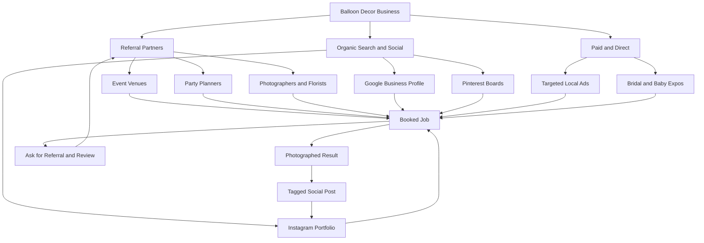

### Direct Answer

Start a balloon decor business in 2027 by registering an LLC and getting general liability insurance ($350-$600/year), investing $2,500-$5,000 in a starter kit (a sizer set, a low-pressure inflator, a 200-balloon working stock, and a hand pump), and booking your first three jobs at a deliberate loss to build a portfolio. The business model that wins is **organic balloon garlands and grab-and-go installs sold as a productized package** — a 6-foot garland priced at $150-$250 and a full backdrop at $400-$900 — not custom one-off "whatever you can dream up" quotes. Expect to reach $4,000-$8,000/month in revenue within nine to twelve months working solo, with 55-70% gross margins once you stop over-ordering balloons and standardize three to five repeatable designs.

> **TL;DR**
> - **Capital to start:** $2,500-$5,000 solo (inflator, sizers, 2-3 balloon brands, transport bins, a website). You do not need a storefront, a vehicle wrap, or a helium tank to begin.
> - **The money is in productization:** sell three fixed packages, not custom quotes. Garland-by-the-foot pricing ($25-$40/linear foot installed) kills the "how much for a thing?" negotiation.
> - **Where leads come from:** event venues, party planners, and photographers refer 50-70% of repeat work. Instagram and Google Business Profile carry the rest. Wedding-fair booths convert poorly relative to cost.
> - **Margin discipline:** balloon cost is only 8-15% of a job's price. Your real cost is time (2-5 hours of build + install per job) and waste from over-ordering. Standardize designs to fix both.
> - **Realistic year-one:** $35,000-$70,000 revenue solo, 55-70% gross margin, 18-22% net after a part-time assistant and mileage. Year two with one trained installer: $90,000-$160,000.
> - **The 2027 shift:** clients now expect "organic" asymmetric garlands and Pinterest-grade color stories; the flat "arch over the door" look reads as dated and is hard to sell above $200.

Balloon decor sits in an unusual spot among home-based businesses: the raw materials are cheap and universally available, the skill ceiling is real but learnable in 60-90 days of deliberate practice, and demand is recurring because every birthday, gender reveal, corporate launch, and wedding is a fresh booking. It is one of the few creative-service businesses where a disciplined operator can hit a five-figure month without employees, a lease, or a franchise fee. The catch — and the reason most balloon businesses stall at $1,500/month as an expensive hobby — is that the work *feels* like art and *behaves* like manufacturing. The winners treat it like a small production shop with a tight catalog. This guide walks the full path: legal setup, the real starter-kit math, design skill acquisition, pricing systems that hold margin, the referral engine that replaces ad spend, the operational mechanics of build-and-install days, and the honest failure modes.

## 1. Why Balloon Decor Is a Real Business in 2027

The instinct to dismiss balloons as a kids'-party novelty is exactly the gap a serious operator exploits. The category professionalized over the back half of the 2020s, and three structural forces make 2027 a strong entry year.

### 1.1 The Demand Picture Is Broad and Recurring

Balloon decor is not one market — it is a stack of overlapping ones, and that diversification is what makes the revenue stable.

- **Children's parties** are the entry point: predictable, price-sensitive, $150-$400 per job, and high-volume on weekends.
- **Gender reveals and baby showers** carry a higher emotional budget and convert at $300-$700; the client almost never haggles because the moment is irreplaceable.
- **Corporate events** — product launches, grand openings, holiday parties, conference photo moments — are the margin engine at $800-$3,500 per install, booked on a business card not a personal one.
- **Weddings** are the prestige tier: balloon installations have moved from "tacky" to "editorial" as organic garlands replaced latex arches, and a wedding balloon scope now lands at $600-$2,500.
- **Seasonal spikes** — graduation (May-June), back-to-school promos, Halloween, the December corporate-party crush, and Valentine's grab-and-go bouquets — create four to five predictable revenue surges a year.

The U.S. Bureau of Labor Statistics classifies event-decoration work within the broader event-services and personal-services economy, which it projects to grow faster than the all-occupations average through the decade [BLS Occupational Outlook Handbook, bls.gov]. The party-supplies and event-decor market has been tracked by IBISWorld as a multi-billion-dollar U.S. category with steady post-pandemic recovery [IBISWorld, Party Supply Stores in the US]. You do not need the macro number to be precise — you need to know that the demand is not a fad and is not concentrated in one fragile segment.

The diversification point deserves a closer look, because it is the single most underappreciated structural advantage of the model. A florist who specializes in weddings is exposed to one seasonal pattern and one economic sentiment — when discretionary wedding spend dips, the whole book dips with it. A balloon decorator who books children's parties, gender reveals, corporate launches, school events, and weddings has five revenue streams that do not move together. Corporate spend is strongest in Q4; children's parties are steady year-round; weddings cluster in late spring and fall; school events peak around graduation and homecoming. When you map a year of bookings, the troughs of one segment are filled by the peaks of another. That is why an operator who deliberately courts all five segments has a far smoother revenue line than one who only chases the prestige wedding work — and a smoother revenue line is what lets you survive the slow months without dipping into savings.

There is also a referral cross-pollination effect that compounds across segments. The corporate client who hires you for a product launch has children and will remember you for a birthday; the bride whose wedding garland goes viral on Instagram has friends planning baby showers. Because the *craft* is identical across all five segments — the same garland technique, the same color discipline, the same install skill — every job you do markets you to every other segment simultaneously. Few small businesses get that kind of free lateral reach.

### 1.2 The Skill Ceiling Is Real but Crossable

The reason balloon decor is not winner-take-all is that the visible quality gap between a beginner and a pro is large, obvious in photos, and the thing clients actually pay for. A lopsided garland with mismatched balloon sizes photographs badly and gets shared badly. A tight, asymmetric "organic" garland with intentional color clustering photographs like a magazine spread and becomes the client's own marketing. That gap is your moat — but it is a moat you build with 60-90 days of deliberate practice, not a credential anyone can buy.

The economic logic here is worth being explicit about. In a business with zero skill barrier — say, generic flyer delivery — price collapses to the cost of labor because no customer can tell one provider from another. In a business with an *insurmountable* skill barrier — say, neurosurgery — only a tiny credentialed elite competes at all. Balloon decor sits in the productive middle: the barrier is real enough that 80% of casual entrants never cross it, but low enough that a committed person can cross it in three months. That middle zone is exactly where a disciplined operator earns outsized returns, because the skill is scarce relative to demand but achievable relative to effort. The amateurs who flood the bottom of the market are not your competition once you have crossed the barrier — they are, in fact, your best advertising, because every client who got a sad lopsided garland from a hobbyist becomes a motivated buyer for the operator whose portfolio looks like a magazine.

### 1.3 The 2027 Aesthetic Shift Changes What Sells

The look the market wants has moved decisively, and an operator who does not track that shift will price into a ceiling. Through the mid-2020s the dominant balloon product was the **geometric arch** — a uniform-size repeat of balloons bent over a doorway or stage. It is fast to build, easy to teach, and now reads as dated; clients see it as the "default" look and resist paying above $150-$200 for it.

What sells at a premium in 2027 is the **organic garland** — an asymmetric composition that mixes balloon sizes (5-inch, 11-inch, 16-inch, sometimes 36-inch focal balloons), clusters them irregularly, and uses intentional color "movement" so the eye travels across the piece. Layered on top are the elements that turn a garland into an *installation*: greenery and floral accents woven through, custom vinyl lettering, oversized number balloons, and "balloon mosaics" (a frame filled in like pixel art). The market also rewards specific, nameable color stories — sage and terracotta, dusty blue and cream, jewel-tone "moody" palettes — pulled straight from the Pinterest boards clients are already curating.

| Aesthetic | Market perception | Realistic ceiling | Build difficulty |
|-----------|-------------------|-------------------|------------------|
| Geometric arch (uniform repeat) | Dated, "default" | $150-$250 | Low |
| Classic latex spiral column | Functional, generic | $100-$200 | Low |
| Organic garland (asymmetric) | Current, "designer" | $350-$1,200 | Medium |
| Organic install + florals/greenery | Premium, editorial | $700-$2,500 | Medium-high |
| Full balloon mosaic / sculpture | Statement, bespoke | $1,000-$4,000+ | High |

The strategic read of this table is simple: the same hour of your labor is worth two to four times more when it goes into the organic-install tier than into a geometric arch. The skill chapter (Chapter 4) is therefore not optional polish — it is the difference between a $200 ceiling and a $1,200 ceiling on the identical block of time.

### 1.4 The Capital Wall Is Low — Which Is a Blessing and a Trap

You can start for the price of a used laptop. That is the blessing: no franchise fee, no $40,000 buildout, no inventory loan. It is also the trap, because low barriers mean a crowded amateur tier. Your competitive position is **not** "I do balloons" — that is everyone. It is "I deliver a specific, photographable look on a fixed-price package with reliable on-time installs." The professionalism, not the balloons, is scarce.

| Business model | Startup capital | Time to first $4K month | Gross margin | Main risk |
|----------------|-----------------|--------------------------|--------------|-----------|
| Balloon decor (solo, home-based) | $2,500-$5,000 | 6-12 months | 55-70% | Amateur price competition |
| Balloon decor + storefront/studio | $25,000-$60,000 | 12-18 months | 45-55% | Lease overhead before demand |
| Party rental business | $15,000-$50,000 | 9-15 months | 40-55% | Inventory storage + damage |
| Photo booth rental | $6,000-$15,000 | 6-12 months | 60-75% | Equipment obsolescence |
| Event florist | $4,000-$12,000 | 9-15 months | 35-50% | Perishable inventory waste |

The table makes the strategic point: balloon decor has the *lowest* capital wall in the event-decor neighborhood and a competitive gross margin, but it pays for that with the *highest* exposure to amateur price competition. Every chapter below is, in some sense, about converting that weakness into a defensible position. For adjacent models, compare the party-rental path (q1965), the photo booth rental path (q1967), and the bounce house rental path (q1966).

## 2. Legal Setup, Insurance, and Money Plumbing

This chapter is unglamorous and it is also where amateurs quietly expose themselves to ruin. A latex balloon in a venue with an open flame, a child with an undisclosed latex allergy, or a garland that falls on a guest are all real, insurable events. Set the structure up properly in week one.

### 2.1 Entity Choice: Form the LLC

For a solo balloon operator, a single-member **LLC** is the near-universal right answer. It separates your personal assets (home, savings) from business liability, costs $50-$500 to register depending on state, and is taxed as a pass-through by default so you avoid corporate double taxation. A sole proprietorship is simpler but offers zero liability shield — unacceptable for a business that physically installs heavy decor above guests. The U.S. Small Business Administration's guidance on choosing a business structure is the canonical free reference [SBA, sba.gov, Choose a business structure].

- **Register the LLC** with your Secretary of State, then file for an **EIN** with the IRS — it is free at irs.gov and takes ten minutes [IRS, irs.gov, Apply for an EIN].
- **Open a dedicated business checking account** the same week. Co-mingling personal and business money is the single most common bookkeeping mistake and it weakens your liability shield if you are ever sued.
- **Check local licensing.** Most jurisdictions require a basic business license; some require a home-occupation permit. A few cities regulate helium handling. Confirm with your city clerk — do not assume.

### 2.2 Insurance Is Not Optional

You need two policies before your first paid job:

1. **General liability insurance** — covers bodily injury and property damage. For a solo balloon business this runs roughly **$350-$600/year** for a $1M/$2M policy. Most venues will not let you load in without a certificate of insurance (COI), and many require being named as an "additional insured" — a free endorsement your insurer adds on request.
2. **Inland marine / equipment coverage** — optional early, sensible once your kit and balloon stock exceed a few thousand dollars in value, especially if you transport gear in a personal vehicle.

If you ever hire even a part-time installer, **workers' compensation** becomes legally required in most states. Treat the COI as a sales asset, not a chore: venues maintain preferred-vendor lists, and being the decorator who emails a clean COI within an hour of request is how you get onto them.

A few practical insurance details that catch new operators off guard. First, **the venue, not you, sets the coverage minimum** — most require $1M per occurrence and $2M aggregate, and some upscale venues ask for $2M/$4M. Buy the policy your target venues require, not the cheapest one, because re-quoting mid-season is a hassle. Second, the **additional-insured endorsement is per-venue** at some insurers and blanket at others; a blanket additional-insured policy is worth a slightly higher premium because it means you never wait on an endorsement to confirm a booking. Third, latex is a named exclusion on some general-liability policies — confirm in writing that **latex allergy claims are covered**, because that is the single most likely bodily-injury claim in this trade. Fourth, if you store inflated stock and an inflator in a personal vehicle, your auto policy generally will not cover the business contents — that is what inland marine coverage is for.

| Insurance type | Typical year-1 cost | When you need it | What it covers |
|----------------|---------------------|------------------|----------------|
| General liability ($1M/$2M) | $350-$600 | Before first paid job | Guest injury, venue property damage |
| Additional-insured endorsement | $0-$50 | When a venue requires it | Names the venue on your policy |
| Inland marine / equipment | $100-$250 | Once kit value > ~$3,000 | Theft/damage to gear in transit |
| Workers' compensation | Varies by payroll | When you hire anyone | Employee injury, legally mandated |
| Commercial auto add-on | $150-$400 | Heavy vehicle use for business | Business use of a personal vehicle |

### 2.3 Sales Tax, Bookkeeping, and the Quarterly Rhythm

Balloon decor usually counts as a taxable sale of tangible goods plus a service; many states tax the full invoice. Register for a sales-tax permit with your state revenue department and collect from day one — back-paying uncollected sales tax out of pocket is a brutal, avoidable lesson.

| Money task | Tool / cadence | Why it matters |
|------------|----------------|----------------|
| Bookkeeping | QuickBooks or Wave, weekly | Clean books = real margin visibility, easy taxes |
| Estimated taxes | IRS Form 1040-ES, quarterly | Avoids underpayment penalty on profitable months |
| Sales tax | State portal, monthly/quarterly | Collected, never "borrowed" for cash flow |
| Mileage log | MileIQ or a notebook, per trip | Standard mileage deduction is real money |
| Separation | Business-only bank + card | Protects the LLC liability shield |

Intuit (INTU) dominates the small-business accounting tool market with QuickBooks; for a sub-$100K balloon business, the free tier of Wave is genuinely sufficient until volume justifies upgrading. The discipline matters more than the software. For the deeper bookkeeping mechanics that apply to any home-based service business, the rental-property bookkeeping breakdown (q9629) covers the chart-of-accounts logic in depth.

Two tax mechanics deserve specific mention because they meaningfully change a balloon operator's take-home. The first is the **home-office deduction**: if you use a dedicated space in your home exclusively for the business — a corner of the garage for balloon storage and pre-build, a room for the inflator and bins — you can deduct a proportional share of housing costs, either by the simplified per-square-foot method or by actual expenses [IRS, irs.gov, Home Office Deduction]. For a home-based balloon business this is real money and it is fully legitimate when the space is genuinely exclusive-use. The second is the **standard mileage deduction**: deliveries, installs, supply runs, and venue scouting all generate deductible miles, and at a meaningful per-mile rate across a weekend-heavy schedule, the annual total is substantial. The catch on both is documentation — the IRS expects a contemporaneous mileage log and a defensible home-office measurement, not a year-end guess. Set up the logging in week one and it costs you nothing; reconstruct it in April and you will either underclaim or expose yourself in an audit.

A third item: **set aside 25-30% of every payment for taxes the moment it lands.** Self-employment tax plus income tax on a profitable balloon business is not optional, and the most common cash-flow disaster in any solo service business is spending the gross and discovering the tax bill in April. Open a separate savings account, move the tax reserve immediately, and file quarterly estimates with Form 1040-ES so there is no underpayment penalty.

## 3. The Starter Kit: What You Actually Need to Buy

Here is where new operators waste the most money — not on too little gear, but on the *wrong* gear and far too many balloons. Build the kit in the order below.

### 3.1 The Non-Negotiable Core (~$700-$1,400)

- **A dual-action electric inflator** — a low-pressure, two-speed unit ($120-$250). This is the single best purchase you will make; hand-inflating a garland is slow, exhausting, and inconsistent. Conwin and Premium are the recognized brand tier among pros.
- **A balloon sizer box or set of sizing templates** — $20-$60. Consistent balloon diameter is the difference between an amateur garland and a professional one. Non-negotiable.
- **Balloon decorating strip / garland tape** — the backbone of every organic garland; buy a bulk roll.
- **Glue dots (low-temp) and a glue gun** — for clustering and attaching balloons to surfaces.
- **Fishing line, command hooks, zip ties, a step ladder** — the rigging that gets installs onto walls and ceilings.
- **Transport bins** — large, lidded, clear bins so inflated stock survives the drive without dust or pops.

### 3.2 Balloon Stock — Buy Brands, Not the Cheapest (~$300-$900 to start)

This is the most important purchasing lesson in the business: **balloon quality is visible in every photo, and cheap balloons cost you more in waste, oxidation, and pops than premium ones cost up front.** Qualatex (a Pioneer Balloon Company brand) and Sempertex are the two professional standards; "double-stuffing" (one balloon inside another) creates the rich, opaque designer colors clients pull from Pinterest.

Start with a deliberately *small* curated palette — two or three signature color stories — rather than one of everything. You will throw away less and your portfolio will look intentional.

The over-ordering instinct is worth naming directly because it quietly destroys margin. A new operator walks into a job thinking "I need every color in case the client changes their mind," buys a thousand balloons across thirty colors, and a year later has drawers of oxidized, brittle stock that photographs poorly and pops on inflation. Latex balloons are a perishable input — they age, they oxidize when exposed to light and air, and old stock has a measurably higher pop rate. The disciplined approach is to **order to the booked job, plus a modest standing stock of your two or three signature palettes.** When you sell from a fixed palette (see Chapter 5), you can forecast balloon demand accurately, order fresh, and keep waste under 10%. When you sell "anything you can imagine," you cannot forecast anything and waste runs 25-40%. Inventory discipline is downstream of pricing discipline.

| Balloon spend behavior | Typical waste rate | Effect on margin | Root cause |
|------------------------|--------------------|--------------------|------------|
| Order to booked job + fixed palette | Under 10% | Protects 55-70% gross | Sells productized packages |
| Modest standing stock, fresh top-ups | 10-15% | Mild margin drag | Reasonable middle ground |
| "Buy everything in case" speculative | 25-40% | Quietly halves net profit | Sells unconstrained custom |

### 3.3 Helium: Rent the Capability, Don't Own the Liability

Helium deserves its own subsection because new operators routinely make an expensive mistake here: buying a tank early. Helium is a globally traded commodity with a genuinely volatile price and periodic supply tightness, and an owned tank is a fixed cost that sits idle most weeks because the dominant 2027 product — the air-filled organic garland — uses no helium at all. The right model is to **rent helium per job from a local supplier (party-supply store or welding-gas distributor) only when a specific booking needs floating elements**, and to bill that rental straight into the quote. You get the capability without the carrying cost, the storage hassle, or the exposure to a helium price spike. Buy a tank only once you are running enough helium-dependent jobs that ownership clearly beats per-job rental on the math — and even then, run the numbers, do not assume.

### 3.4 Optional and Deferred — Do Not Buy These Yet

| Item | Cost | Buy it when... |
|------|------|----------------|
| Helium tank/rental | $80-$300/refill | A specific job needs floating balloons — rent, don't own early |
| Backdrop stands / frames | $80-$300 | You book a backdrop-heavy job — bill it into that quote |
| Vehicle wrap | $1,500-$3,500 | After ~$40K revenue; a magnet sign works fine first |
| Studio / storage unit | $150-$400/mo | Home storage genuinely overflows |
| Branded merch / packaging | $200-$800 | You have repeat corporate clients to impress |

Note the recurring theme: defer every fixed cost until a *specific paying job* justifies it, and bill one-off gear into that job's quote. A grand-opening client paying $1,800 will not notice an $80 helium-rental line; you eat that cost if you bought the tank speculatively.

### 3.5 The Realistic Startup Budget

| Category | Lean start | Comfortable start |
|----------|-----------|-------------------|
| LLC + permits + EIN | $100 | $400 |
| General liability insurance (year 1) | $350 | $600 |
| Inflator + sizers + core tools | $400 | $900 |
| Starting balloon stock | $300 | $800 |
| Transport bins + ladder + rigging | $150 | $400 |
| Website + Google Business Profile | $0-$150 | $500 |
| Branding / logo / business cards | $50 | $400 |
| **Total** | **~$1,350-$1,500** | **~$4,000-$5,000** |

You can genuinely begin under $1,500. The "comfortable" column buys margin for error and a faster path to looking professional. What you should *not* do is spend $10,000 — that money buys gear you cannot yet use skillfully and balloons that will oxidize before you book the jobs to use them.

## 4. Learning the Craft: From Lopsided to Editorial

Capital and legal setup take a week. Skill takes 60-90 days, and it is the actual barrier to a sustainable price point. Treat practice as a funded, scheduled project, not something you do "when you have time."

### 4.1 The Three Skills That Separate Pro from Amateur

1. **Consistent sizing.** Every balloon in a cluster sized with the box. Inconsistent sizing is the number-one tell of an amateur, and it is purely a discipline problem, not a talent problem.
2. **Organic clustering.** The 2027 look is asymmetric — clusters of two-, four-, and five-balloon groups in varied sizes, with intentional color "movement" rather than a uniform repeat. This is learnable from structured tutorials and then drilled.
3. **Color theory and the double-stuff.** Knowing which Qualatex/Sempertex colors to nest to hit a client's Pinterest palette. This is where a designer eye earns its premium.
4. **Clean, fast rigging.** A garland that is built beautifully but installed crooked, sagging, or unsafely fails the client and exposes you to a claim. Rigging — anchoring to walls, ceilings, and frames so the piece holds for the full event — is a skill on its own, and it is the one most often skipped in tutorials.
5. **Speed under deadline.** A skill that only works without a clock is not a professional skill. The real test is producing the tight, organic look at booking-day pace, because event times do not move.

The double-stuffing technique deserves a specific note because it is the single highest-leverage craft skill in the trade. By inflating one balloon inside another, an operator turns a small set of base balloon colors into a vastly larger palette of rich, opaque, custom shades — the exact "designer" tones clients pull from inspiration boards. Standard single-layer balloons in saturated colors often look translucent and cheap in photos; a double-stuffed balloon reads as a deliberate, magazine-grade color. Mastering a working library of perhaps fifteen to twenty double-stuff color recipes — which two stock colors nest to produce which final shade — is what lets you say "yes" to a client's specific palette without buying every color in existence. It is craft skill and inventory strategy in one move.

### 4.2 A 90-Day Practice Plan

- **Weeks 1-3:** Build ten 3-foot garland sections. Photograph each. The goal is muscle memory for sizing and taping, not beauty yet.
- **Weeks 4-6:** Build three full 6-foot garlands in distinct color stories. Install each on a wall in your home and photograph in good light. These become portfolio seeds.
- **Weeks 7-9:** Do three "real" jobs for friends and family at material cost only — a birthday, a baby shower, a small office event. The constraint of a deadline and a real space is the lesson.
- **Weeks 10-12:** Refine your three signature packages, shoot proper portfolio photography, and build the booking page. You are now ready to charge full price.

The reason this plan is structured as a *funded, scheduled* project rather than casual practice is that the in-between state — competent enough to take money, not good enough to photograph well — is the most dangerous place to be. An operator who starts charging before the portfolio is strong locks in low-tier pricing, attracts only price shoppers, and never builds the photo library that would let them climb. The three months feel slow, but they are the cheapest months you will ever spend, because they are the months that set your price ceiling for years. Budget for them the way you would budget for a tool: a known cost that buys a known capability.

| Practice phase | Weeks | Primary output | What "done" looks like |
|----------------|-------|----------------|------------------------|
| Mechanics drill | 1-3 | 10 garland sections, photographed | Consistent sizing without thinking |
| Composition | 4-6 | 3 full 6-ft garlands, installed + shot | An asymmetric look you can repeat |
| Real-deadline reps | 7-9 | 3 jobs at material cost | Built on time, in a real space |
| Portfolio + systems | 10-12 | 3 packages, photo set, booking page | Ready to charge full price |

### 4.3 Where to Learn — and What Not to Pay For

Free and low-cost YouTube tutorials from established balloon artists will take you 80% of the way. A paid online course ($100-$400) from a recognized balloon educator can compress the timeline and is worth it if it includes structured organic-garland and color modules. What is **not** worth it early: expensive multi-day in-person certifications, "balloon business in a box" franchise-style programs, and anything promising "six figures in 90 days." The skill is real and the shortcut is practice volume, not a certificate. The same portfolio-building logic applies across creative-service businesses — the pet photography path (q2060) and wedding photography path (q1949) describe the identical "work three jobs at cost to build a book" sequence.

## 5. Pricing: The System That Holds Your Margin

Pricing is where balloon businesses live or die. The amateur quotes custom every time, gets dragged into "can you do it cheaper," and ends up working for $12/hour. The professional sells **fixed packages** and prices garlands **by the linear foot**. Adopt the system below before your first paid client.

### 5.1 The Core Pricing Insight: Balloons Are Cheap, You Are Not

A 6-foot organic garland might use $15-$30 of balloons. If you price that garland at $200, the balloon cost is well under 15% of the price. So what are you charging for? **Design time, build time, transport, install time, rigging risk, and the photographable result.** New operators anchor their price to the balloon cost and destroy their own margin. Anchor to the *value and the hours* instead.

| Cost component | Typical share of a $400 job | Notes |
|----------------|----------------------------|-------|
| Balloons + consumables | $35-$60 (9-15%) | The cheap part — never the anchor |
| Your design + build time | $80-$140 (2-3.5 hrs) | The real product |
| Transport + install + teardown | $50-$90 (1-2 hrs) | Often underbilled |
| Overhead allocation (insurance, gear, web) | $30-$50 | Must be priced in |
| **Gross profit retained** | **$120-$180** | Your actual pay + reinvestment |

### 5.2 Garland-by-the-Foot — The Anti-Haggle Weapon

Price installed organic garland at a clear per-linear-foot rate — commonly **$25-$40/foot** depending on your market and balloon density (double-stuffed and specialty balloons push to the top of the range). This single move changes the sales conversation: instead of "how much for a balloon thing?" the client tells you the footage and the price is arithmetic. It is transparent, it scales, and it ends the negotiation.

There is a deeper reason the per-foot model wins beyond ending the haggle: it makes you **estimable**. When a referral partner — a venue, a planner — wants to recommend you, they need to be able to tell a client roughly what to expect. "She does great work, call her for a quote" is a weak referral; "she's about $30 a foot, a typical setup runs $400-$700" is a strong one, because it lets the partner pre-qualify the client and pre-frame the price. Transparent, formula-based pricing turns every referral partner into an effective salesperson for you. Opaque custom quoting forces every lead through a slow back-and-forth that you personally have to run.

### 5.3 Three Productized Packages

Sell three named packages, not infinite custom quotes:

1. **"Grab & Go" garland** — a 6-foot organic garland, client picks up or local delivery, no install. $120-$220. The volume product and the easiest weekend money.
2. **"Signature" install** — a 9-12 foot installed garland plus a small accent cluster, delivered and rigged. $350-$650. The bread-and-butter.
3. **"Statement" build** — a full backdrop, large garland, balloon arch or organic ceiling moment, full install and same-day or next-day teardown. $700-$2,000+. The margin and portfolio piece.

### 5.4 Pricing Rules That Protect You

- **Take a 50% non-refundable deposit** to book; balance due before or on install day. This single rule eliminates most no-shows and cancellations.
- **Charge a delivery/install fee** by mileage zone — do not absorb a 40-minute drive.
- **Add a peak-date surcharge** for graduation weekends, Valentine's, and December — demand is inelastic on those dates and your time is genuinely scarcer.
- **Price teardown** when the venue requires same-night strike; that is a second trip and a second labor block.
- **Quote specialty work — custom vinyl lettering, themed characters, large numbers — as add-ons**, never bundled into the base.

A productized-package mindset is the through-line across every event-decor business; the corporate catering pricing breakdown (q9600) and the wedding venue revenue model (q1968) both lean on the same "named tiers, not custom every time" discipline.

### 5.5 The Discounting Trap and How to Hold the Line

Every balloon operator will face the same pressure: a prospect who loves the work, then asks for "a better price." Holding the line is not stubbornness — it is arithmetic. Because your gross margin is 55-70%, a 20% discount does not cost you 20% of profit; it cuts deeper, because the discount comes entirely out of the margin, not the cost. A $500 job discounted to $400 keeps the same $50 of balloon cost and the same hours, so the $100 discount is $100 straight off your pay. Two discounted jobs can erase the profit of a third full-price one.

The professional responses are not "no" — they are structured alternatives that protect the per-foot rate:

- **Offer a smaller scope, not a lower rate.** "I can absolutely fit your budget — let's do an 8-foot garland instead of 12." The rate holds; the deliverable shrinks. The client gets a real choice and you keep your margin intact.
- **Move them to an off-peak date.** A modest, transparent weekday or off-season concession is legitimate because your time genuinely is less scarce then. A discount on a Saturday in June is not.
- **Bundle, don't discount.** Add a small grab-and-go bouquet or an accent cluster rather than cutting the headline number. A $40-cost add-on feels generous and costs you far less than a $100 price cut.
- **Walk away from the bottom 10%.** Some prospects only want the cheapest possible balloons. They are not your client; they are the amateur tier's client. Referring them elsewhere politely is a margin-protecting decision, not a lost sale.

The mindset to internalize: a fully booked calendar of full-price jobs always beats an over-booked calendar of discounted ones, because the discounted calendar burns the same hours and the same body for materially less money.

### 5.6 Unit Economics: What a Realistic Year Actually Looks Like

It helps to walk a concrete year-one model rather than wave at "$35,000-$70,000." Assume a solo operator who has crossed the skill barrier, sells the three packages, and is roughly a year into building referrals. A realistic steady-state month might be eight to twelve jobs at a blended average of $400-$550 — a mix of grab-and-go volume, signature installs, and the occasional statement build. The model below traces one such month and the year it implies.

| Line item | Per representative $475 job | Monthly (10 jobs) | Annualized |
|-----------|------------------------------|---------------------|------------|
| Revenue | $475 | $4,750 | $57,000 |
| Balloons + consumables | -$55 (12%) | -$550 | -$6,600 |
| Mileage / delivery cost | -$25 | -$250 | -$3,000 |
| Insurance + software + web (allocated) | -$30 | -$300 | -$3,600 |
| Marketing (organic-first, modest) | -$15 | -$150 | -$1,800 |
| **Gross margin retained** | **$350 (74%)** | **$3,500** | **$42,000** |

That $42,000 is the owner's pre-tax pay in a modest year-one — solo, no employees, organic-first marketing. It is a real income for a home-based business built for under $5,000, but notice what it is *not*: it is not passive, and it is not the headline "six figures" that hype merchants promise. The path to six figures runs through the next year — adding a trained install assistant lifts job capacity, the referral engine matures and raises the blended average toward $600+, and the statement-build tier becomes a larger share of the mix. A year-two operator with one assistant doing $90,000-$160,000 in revenue is realistic; the leap is real but it is *operational*, earned through delegation and a maturing pipeline, not through a marketing trick.

## 6. Getting Clients: The Referral Engine vs. The Ad Treadmill

You can pay for every customer forever, or you can build a referral engine that compounds. The professionals build the engine. Here is the architecture.

### 6.1 The Three-Channel Lead Mix

The diagram makes the strategic point visible: **referral partners and the photographed-result loop are the compounding parts of the system; paid channels are the leaky parts.** Every finished job should feed two things back into the top of the funnel — a tagged social post and a referral ask.

### 6.2 Referral Partners Are the Whole Game

Fifty to seventy percent of a mature balloon business's revenue comes from a handful of referral relationships. The partners worth cultivating:

- **Event and wedding venues** keep preferred-vendor lists. Getting on three or four local lists can fill a calendar. Approach with a clean COI, professional photos, and an offer to do a free install for the venue's own marketing photos.
- **Party and event planners** subcontract decor constantly. One good planner relationship can be worth $15,000-$40,000 a year.
- **Photographers and florists** are not competitors — they are in the same rooms you want to be in. Cross-referral with a wedding photographer is mutually free money.
- **Bakeries, party-supply stores, and rental companies** round out the network; a party-rental company (q1965) that does not do balloons is an ideal partner.

The mechanics: show up in person, bring photos, be reliable, and reciprocate every referral you receive. This is a relationship business and it cannot be automated.

A concrete partner-outreach playbook, because "network with venues" is uselessly vague advice. Build a list of every event venue, planner, photographer, florist, and bakery within your service radius — typically thirty to sixty businesses in a mid-size metro. Prioritize venues first, because a single venue's preferred-vendor list can feed you for years. For each venue, the approach is: visit in person during a quiet weekday, bring a printed mini-portfolio and a stack of clean COIs, and lead with what you can do *for them* — specifically, offer to install a garland for free for the venue's own marketing photos. A venue with great photos of your work on their walls has an incentive to recommend you, because your decor makes *their* space look bookable. That is a referral relationship built on aligned interest, not on you asking for favors.

| Referral partner | Why they refer you | What you offer them | Realistic annual value |
|------------------|--------------------|--------------------|------------------------|
| Event / wedding venue | Your decor sells their space | Free marketing-photo install, reliability | $10,000-$40,000 |
| Party / event planner | They subcontract decor constantly | Consistent quality, on-time delivery | $15,000-$40,000 |
| Wedding / event photographer | Better decor = better portfolio shots | Reciprocal referrals, tagged posts | $5,000-$20,000 |
| Florist | They get asked for balloons, you for florals | Cross-referral, joint installs | $4,000-$15,000 |
| Bakery / party-supply store | Same client, different product | Cross-referral, co-marketing | $3,000-$12,000 |

The discipline that makes the network compound is reciprocity tracking. Keep a simple log of who sent you what, and make sure referrals flow both directions. A photographer who sends you three brides and gets nothing back will stop. A photographer you tag in every shared install and refer your own clients to becomes a permanent, free, motivated channel.

### 6.3 The Organic Digital Layer

- **Google Business Profile** is free, ranks you in the local map pack, and is where "balloon decor near me" searches land. Fill it completely, post photos weekly, and request a review after every job.
- **Instagram** is your portfolio and your proof. Post finished installs in good light, use local hashtags, and tag the venue and other vendors so their audiences see your work. The platform is owned by Meta (META) and remains the default discovery surface for visual event services.
- **Pinterest** is underrated: it is a search engine for exactly the inspiration phase of event planning, and a well-tagged board drives bookings months later. It is owned by Pinterest (PINS).
- **A simple website** with your three packages, a booking/inquiry form, and the per-foot pricing logic converts the traffic the other channels send.

### 6.4 Paid Channels — Use Sparingly

Targeted local social ads can work to seed the early portfolio, but treat them as a bridge, not a destination. Bridal and baby expos are expensive booth fees with mediocre conversion relative to a venue-partner relationship; do at most one or two to test, and only if the booth cost is genuinely recoverable from a single booking. The wedding photography client-acquisition guide (q1949) reaches the same conclusion: referral partners beat expo booths on cost per booked job.

The way to think about channel mix is **cost per booked job and durability**, not raw lead volume. A paid ad might generate ten inquiries cheaply, but if they are price shoppers who never book the organic-install tier, the cost per *booked, full-price* job is high. A venue relationship costs you a free install and some hours of relationship maintenance, but the jobs it sends are pre-qualified, pre-warmed by the venue's endorsement, and they recur for years. The table below frames the trade-off honestly.

| Channel | Cost to acquire | Lead quality | Durability | Best use |
|---------|-----------------|--------------|------------|----------|
| Venue / planner referral | Time + free install | High, pre-qualified | Years | Core engine |
| Past-client referral | Near zero | Very high | Compounding | Core engine |
| Google Business Profile | Free | Medium-high, local intent | Ongoing | Always-on |
| Instagram / Pinterest portfolio | Time | Medium, builds slowly | Compounding | Always-on |
| Targeted local ads | Real $ per lead | Medium-low, price shoppers | Stops when you stop paying | Early bridge only |
| Bridal / baby expo booth | High booth fee | Low-medium, broad | One-time burst | Test once, maybe |

The strategic instruction is unambiguous: spend your scarce early energy on the top two rows. They are slow to start and impossible for a competitor to copy, which is exactly what makes them a durable advantage.

## 7. Operations: Running the Build-and-Install Day

A booked job is a promise to show up, on time, with a clean, photographable install, and to not damage the venue. The operational discipline below is what makes that promise repeatable.

### 7.1 The Job Lifecycle

| Stage | Timing | Key actions |
|-------|--------|-------------|
| Inquiry | Day 0 | Respond within hours; send package menu + per-foot logic |
| Booking | Day 0-3 | 50% deposit, signed simple agreement, color story locked |
| Sourcing | 1-2 weeks out | Order balloons; confirm palette and footage |
| Pre-build | Day before / morning of | Inflate and cluster garland sections in bins |
| Install | Event day | Arrive early, rig, photograph your own work |
| Strike | Same night or next day | Remove cleanly; leave venue spotless |
| Follow-up | Day +1 to +3 | Request review, post tagged photo, ask for referral |

### 7.2 The Inflation-Timing Problem

Latex balloons oxidize and slowly deflate. Air-filled balloons hold for days; helium-filled balloons hold hours. The operational rule: **build air-filled garland sections the day before in transport bins, and reserve helium for elements that genuinely must float, inflated as close to the event as possible.** Misjudging this is how an amateur shows up with a sad, deflated garland. Pre-building also lets you batch your time efficiently rather than racing the clock on event morning.

### 7.3 Transport, Install, and Venue Etiquette

- **Transport** inflated sections in large lidded bins; a popped balloon during the drive is a re-build you did not bill for.
- **Arrive early.** Venues run tight schedules; the decorator who is still rigging when guests arrive does not get the referral.
- **Rig safely.** Command hooks, fishing line, and proper anchoring — a garland that falls is a liability claim and a destroyed reputation.
- **Leave it cleaner than you found it.** Venue staff talk to each other; being the tidy, low-drama vendor is how you get onto the preferred list.
- **Photograph your own work** before guests arrive — your camera, good light, the venue empty. That photo is next month's marketing.

### 7.4 Capacity, Scheduling, and the Solo Ceiling

Solo, you can realistically execute roughly **two to four jobs on a busy weekend** depending on size, because build and install are time-bound and weekends are when demand concentrates. That is the structural ceiling on a one-person balloon business — and it is why the growth path runs through hiring.

| Stage | Team | Realistic monthly revenue | Constraint |
|-------|------|---------------------------|------------|
| Solo, building | You only | $1,500-$4,000 | Skill + portfolio |
| Solo, established | You + occasional helper | $4,000-$9,000 | Your weekend hours |
| Small team | You + 1-2 trained installers | $9,000-$20,000 | Training + scheduling |
| Studio operation | 3-5 staff + studio space | $20,000-$45,000 | Overhead + management |

### 7.5 The Sustainable Schedule

Balloon decor is weekend-heavy and seasonally spiky. Protect against burnout by batching builds, blocking real recovery time after the December and graduation surges, and saying no to jobs that do not fit your packages. A balloon business that burns out its founder is not a business — it is a bad job you created for yourself.

### 7.6 The First Hire: When and How to Scale Past Solo

Because the solo ceiling is structural — two to four jobs on a busy weekend, capped by your own hands — growth past roughly $8,000-$9,000/month requires a second pair of hands. The mistake most operators make is hiring too late, in a panic, during a peak season, and then handing a stranger an unscripted job. The disciplined version: hire *before* you are desperate, in a slow month, and bring the person up through the same 90-day skill progression you used yourself.

The first hire is almost never a full design partner — it is an **install assistant** who handles the physical, teachable parts: inflating to your sized spec, transporting bins, holding ladders, anchoring rigging, and tearing down. That frees you to do the design composition and the client relationship, which are the parts that do not transfer easily. Pay them as a properly classified employee with workers' comp in place, not as a misclassified contractor — the misclassification shortcut is a real legal exposure. As the assistant's skill grows, you can delegate the simpler grab-and-go and geometric jobs entirely and reserve your own hours for the high-margin statement builds. That delegation is the lever that takes a balloon business from a five-figure month to a six-figure year (q1968 walks the same solo-to-team transition on the venue side).

## 8. Counter-Case: When Balloon Decor Is the Wrong Choice

An honest guide names the cases where this business fails or where you should not start it. Walk through these before committing capital.

### 8.1 The Failure Modes Are Real

- **The "expensive hobby" trap.** The most common outcome is not bankruptcy — it is stalling at $1,000-$1,500/month forever because the operator never productized, never built referral partners, and competes only on being cheap. This is a strategy failure, not a market failure, and it is avoidable, but it is the default if you drift.
- **Underpricing into exhaustion.** Anchor to balloon cost instead of value, skip the deposit, absorb delivery, and you will work 25 hours for $300 and quit within a year.
- **The amateur flood.** Low barriers mean a crowded bottom tier. If you are not visibly better in photographs and not productized, you are competing on price against teenagers, and you will lose.
- **Physical and seasonal toll.** This is ladders, repetitive inflation, weekend work, and four or five exhausting demand surges a year. It is more physically demanding than it looks.
- **Latex allergy and safety liability.** Latex allergies are real and serious; a fallen install above guests is a genuine claim. This is why the insurance in Chapter 2 is non-negotiable.

### 8.2 Who Should Not Start This

- **If you cannot fund 60-90 days of practice** before earning, your portfolio will be weak and you will be stuck in the amateur tier from day one.
- **If you will not do in-person referral-partner outreach,** you are signing up for a permanent paid-ad treadmill that erodes your margin.
- **If you need predictable Monday-to-Friday daytime income now,** the weekend-and-spike revenue rhythm will frustrate you.
- **If you are physically unable to do ladder work and repetitive inflation,** the job's physical reality will wear you down.

### 8.3 The Macro Risks Worth Watching

Two external risks deserve a clear-eyed mention. The first is **balloon material cost and supply.** Latex is an agricultural commodity and helium is a finite, periodically tight industrial gas; both have seen real price movement over the past decade. A balloon business is not catastrophically exposed — materials are only 8-15% of a job's price, so even a sharp input-cost spike is a single-digit hit to margin that a small price adjustment absorbs. But an operator who priced on the assumption of permanently cheap inputs, and who never built a pricing buffer, will feel it. The defense is the per-foot pricing model, which lets you adjust the rate cleanly when input costs move.

The second is **environmental and regulatory pressure.** Latex balloon releases — the mass release of helium balloons into the sky — face growing restrictions and outright bans in some jurisdictions because of wildlife and litter concerns. This matters less than it sounds for a decor business, because the modern product is the *air-filled installed garland*, which is never released, is taken down and disposed of responsibly, and increasingly uses balloons marketed as biodegradable latex. But the savvy operator gets ahead of it: emphasize installed (not released) decor, dispose of latex properly, and be ready to speak credibly to an eco-conscious client. Turning the sustainability question into a confident, informed answer is a small competitive edge, not a threat.

### 8.4 Honest Alternatives in the Same Neighborhood

If the counter-case resonates, the event-decor economy has adjacent models with different trade-offs. A photo booth rental business (q1967) is more equipment-dependent but less physically demanding and more passive once set up. A bounce house rental business (q1966) trades creative skill for inventory and logistics. A party rental business (q1965) is inventory-and-storage heavy but creatively lighter. A catering business (q1980) or corporate catering business (q9600) is a larger undertaking with bigger tickets. And a wedding venue business (q1968) is the capital-heavy, high-ceiling end of the same event economy. None is strictly better — they are different bets on capital, skill, and physical labor.

### 8.5 The Honest Bottom Line

Balloon decor is a genuinely viable small business for a specific person: someone who can fund a short skill-building runway, will treat the craft as standardized production rather than freeform art, will do the unglamorous work of building referral relationships, and will hold pricing discipline against the temptation to discount. For that person, a five-figure month solo and a six-figure year with one trained installer are realistic, not hype. For the person who wants to "just do balloons" without the systems, it becomes an expensive, exhausting hobby. The balloons were never the business — the systems are.

## 9. Frequently Asked Questions

### 9.1 How much money do I need to start a balloon decor business?

A lean, genuinely functional start is **$1,350-$1,500** — LLC and permits, general liability insurance, an electric inflator, sizers, core tools, a starting balloon stock, transport bins, and a basic website. A comfortable start with branding, a larger balloon palette, and a margin for error runs **$4,000-$5,000**. You do not need a storefront, a vehicle wrap, or a helium tank to begin; defer every fixed cost until a specific paying job justifies it.

### 9.2 How long until a balloon decor business is profitable?

Because startup costs are low, many operators are cash-flow positive within the first few months of paid work. Reaching a *sustainable* $4,000-$8,000/month solo typically takes **nine to twelve months** — roughly three months to build skill and a portfolio, then six to nine months to build the referral relationships that produce repeat bookings. Year-one revenue solo of $35,000-$70,000 is realistic; year two with one trained installer can reach $90,000-$160,000.

### 9.3 Do I need a license or special certification?

You need a basic **business license** in most jurisdictions and possibly a **home-occupation permit**; a few cities regulate helium handling — confirm with your city clerk. You also need **general liability insurance** before your first paid job, since most venues require a certificate of insurance. There is **no required artistic certification** — paid balloon courses can compress your learning curve but no credential is legally mandated. The real qualification is a strong photographed portfolio.

### 9.4 What is the hardest part of running a balloon decor business?

Two things. First, **pricing discipline** — resisting the pull to anchor your price to cheap balloon cost instead of to your design and install time, and holding the line against discount-seekers. Second, **building referral partners** — venues, planners, and photographers — through in-person outreach, because that network is what replaces expensive advertising. Operators who solve only the craft and not these two stall as an expensive hobby.

### 9.5 Can I run a balloon decor business part-time?

Yes, and many operators start exactly that way. Demand concentrates on weekends and around predictable seasonal spikes (graduation, Valentine's, December corporate parties), which fits part-time scheduling well. The constraints are that pre-builds and installs are time-bound, and that part-time capacity caps your monthly revenue. It is a strong side business that can be deliberately scaled into a full-time one once a referral pipeline and a trained installer are in place.

---

**Sources and further reading:** U.S. Small Business Administration (sba.gov) — choosing a business structure, business licenses and permits, writing a business plan; Internal Revenue Service (irs.gov) — applying for an EIN, Form 1040-ES estimated taxes, self-employment tax, home-office deduction; U.S. Bureau of Labor Statistics (bls.gov) — Occupational Outlook Handbook, event and personal-services sector projections; IBISWorld — Party Supply Stores in the US industry profile; SCORE (score.org) — free small-business mentoring and event-services startup guidance; state Secretary of State offices — LLC registration; state departments of revenue — sales-tax permits and remittance; Insurance Information Institute (iii.org) — small-business general liability and inland marine coverage; Pioneer Balloon Company / Qualatex (qualatex.com) and Sempertex — professional balloon material standards and double-stuffing technique; Google Business Profile (business.google.com) — local search optimization for service businesses; The Knot and WeddingWire — event-vendor marketplace and preferred-vendor list dynamics; QuickBooks (Intuit, INTU) and Wave — small-business bookkeeping; Meta (META) Instagram and Pinterest (PINS) — visual discovery channels for event services. Cross-referenced Pulse Knowledge Library entries: party rental business (q1965), photo booth rental business (q1967), bounce house rental business (q1966), catering business (q1980), corporate catering business (q9600), wedding photography business (q1949), wedding venue business (q1968), pet photography business (q2060), and rental-property bookkeeping (q9629).
