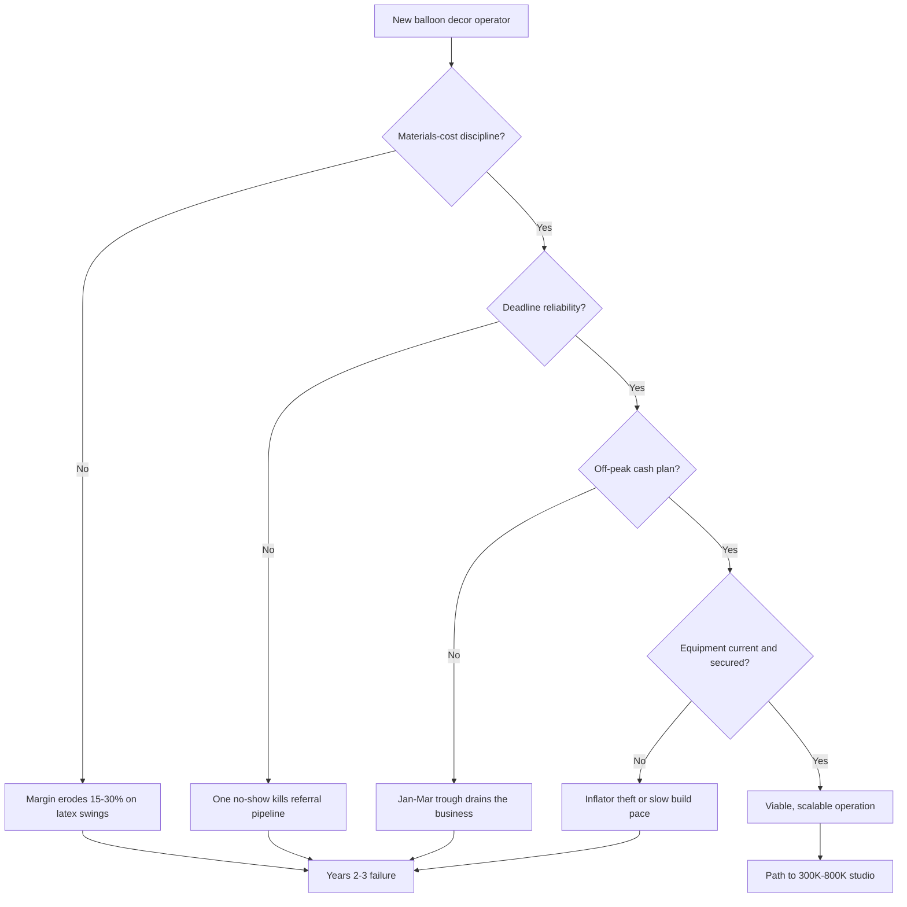

### Direct Answer

You start a balloon decor business in 2027 by building a **mobile event-decor service** around the post-2019 organic-garland aesthetic — designing, fabricating, and installing balloon installations for weddings, birthdays, brand activations, and corporate events. The fast path is solo and home-based: $500-$3,000 buys a Conwin electric inflator, garland strips, and a starter latex inventory from a B2B wholesaler like Burton + Burton, and you book your first jobs through an Instagram and TikTok video portfolio plus wedding-vendor cross-referrals. The business lives or dies on three disciplines — current equipment, materials-cost awareness against latex and Mylar price swings, and absolute deadline reliability, because no wedding or child's birthday can be rescheduled. Done right, a solo operator nets $35K-$95K on $80K-$240K of revenue; a 2-3 builder operation reaches $300K-$800K.

**TLDR**

- **It is a design service, not a helium business.** Modern balloon decor sells the organic-garland centerpiece aesthetic that exploded post-pandemic; 2027 installs are air-first, with helium mostly avoided on cost and sustainability grounds.
- **Capital is low, the gate is skill.** $500-$3K starts a solo home-based operator; $15K-$45K funds a van-and-showroom operation. The real barrier is technique and a portfolio, not money.
- **Margins are strong but volatile.** 65-78% gross margin on materials, 35-55% net at the operator level — but bulk latex cost can swing 15-30% in a year and Mylar carries tariff exposure.
- **Deadlines are unforgiving.** Every booking is a hard date; one no-show destroys the referral pipeline. Vehicle reliability, team backup, and weather contingency are non-negotiable.
- **Discovery is visual and vendor-driven.** Instagram and TikTok portfolio plus DJ/photographer/planner/venue cross-referrals drive bookings; The Knot and WeddingWire listings convert wedding work.
- **Seasonality is brutal.** Demand peaks April-October and November-December; January-March runs a 35-55% trough that demands cash-flow discipline or an off-peak service mix.

---

## 🎯 What a Balloon Decor Business Actually Is in 2027

A balloon decor business in 2027 is a **mobile, styled event-decor service** that designs, fabricates, and installs balloon-based installations at client venues — backyards, hotel ballrooms, country clubs, restaurants, corporate offices, retail storefronts, brand-activation pop-ups, schools, and churches. The product is the modern **organic balloon garland** and its relatives: arches, columns, ceiling installations, sculptures, photo-op walls, grand-opening displays, and themed setups for weddings, birthdays, baby showers, gender reveals, corporate parties, and brand activations. This is not the clown-with-a-helium-tank trade of decades past. It is a visual-first design business whose centerpiece aesthetic clients happily pay $400-$15,000 for.

The category confuses outsiders because the word "balloon" still carries the connotation of a cheap child's party favor. That mental model is a decade out of date, and it is exactly why the opportunity exists for a disciplined operator. The modern client is not buying balloons; they are buying a designed visual moment, a backdrop their guests photograph and post, a brand activation that earns media. The operator who understands they are selling design and reliability — not latex by the bag — prices, presents, and earns like a designer. The operator who still thinks of themselves as "the balloon person" prices like a party-supply store.

### 1.1 The Aesthetic That Created the Category

The organic-garland look — clustered balloons of mixed size and finish strung along a strip into an irregular, "grown" shape — emerged roughly 2016-2019 and then exploded during the pandemic-era backyard-birthday and micro-wedding boom. When large gatherings were restricted, families and couples redirected event budgets into smaller, highly photographed celebrations, and the organic garland became the signature centerpiece of that era. That single design shift converted balloons from a cheap afterthought into a centerpiece line item that clients budget for deliberately.

The aesthetic has proven durable in a way trend-driven categories rarely are. Across weddings, birthdays, brand activations, and corporate events it remains the dominant event-decor expectation in 2027 with no near-term replacement emerging. For a new operator that durability matters — the technique you learn today still sells in three years, and a portfolio built now does not date the way a fashion-driven business would. The look endures because it is endlessly customizable to any palette, venue, and budget tier, photographs well from every angle for a social-media-driven event culture, and scales from a $400 backdrop to a $15,000 ceiling takeover on the same core technique. A design language that flexes that widely does not get replaced quickly. The operator is entering a steady local-service trade, not betting on a viral fad.

### 1.2 What the Business Sells

Revenue is a stack of installation pricing plus add-ons plus retainers, and a healthy business deliberately diversifies across all three:

| Revenue line | Typical price | Notes |
|---|---|---|
| Organic garland (installed) | $20-$45 / linear ft | Core product; most common booking |
| Columns | $75-$250 each | Entrance and stage framing |
| Arches | $250-$800 | Backdrop and ceremony framing |
| Ceiling installations | $400-$2,500 | High-labor, high-margin |
| Full event takeover | $1,500-$15,000 | Weddings, large corporate |
| Brand activation / grand opening | $2,000-$25,000 | B2B, contract-driven |
| Storefront window retainer | $385-$1,485 / month | Recurring, off-peak smoothing |
| Rental add-ons (backdrops, neon, letters) | $45-$485 / rental | Acrylic backdrops, marquee letters |

The mix matters as much as the prices. A business that is 90% kid birthdays is a weekend-only, seasonal, low-ticket grind with a customer base that rarely rebooks. A business that adds corporate retainers and brand activations smooths cash flow, lifts average ticket, and builds a B2B client list that repeats predictably. The same weekday-versus-weekend balance question that defines a party venue's economics (q1163) applies directly here — the operator who consciously manages the revenue mix builds a business; the one who takes whatever inquiry arrives builds a job. The three revenue layers also hedge each other: installation revenue is high-margin but lumpy, add-on rentals are pure margin but small in absolute dollars, and retainers are lower-margin but recurring and counter-seasonal. An operator who builds all three has a business that does not collapse when any single layer has a slow quarter.

### 1.3 Who It Suits and Who It Does Not

The business fits a design-minded operator comfortable with physical labor, weekend-and-evening work, and client-facing sales. The ideal entrant has an eye for color and proportion, enough sales comfort to hold a price, the physical capacity for repetitive overhead work, and the organization to run production scheduling, contract discipline, and inventory — all as important as artistic talent.

It is a poor fit for anyone who underestimates the realities: 95% of installations land Friday-Sunday plus weekday evenings, inverting the operator's social calendar; a single ceiling install can require 4-8 hours of arm-above-head construction; latex allergies require customer screening; and the January-March cash-flow trough is brutal for anyone without reserves. It is a service business with a creative veneer — not a creative hobby with incidental revenue. The operator who enters expecting "I'll get paid to make pretty things" and finds a logistics-and-deadline business underneath burns out fast.

---

## 🎯 Market Size, Demand, and the 2027 Operating Reality

### 2.1 The Demand Base

Balloon decor demand rides on the US event economy, which is large and resilient. The wedding market alone has stabilized post-COVID at roughly 2.0M-2.3M US weddings annually per The Wedding Report and The Knot industry data, with an average wedding budget around $33,000-$38,000, of which $1,500-$8,000 is typically allocated to floral and balloon decor combined. Birthdays, baby showers, gender reveals, corporate parties, holiday events, school functions, and retail activations stack on top of that base, and many recur annually for the same household or company.

The category is large, fragmented, and overwhelmingly served by solo operators and small studios — no dominant national brand, no franchise consolidation, no platform intermediary that owns the customer. That fragmentation is exactly why a disciplined local operator can win: the competition in any metro is a scattered field of hobbyists, and a professional with insurance, a contract, a reliable vehicle, and a maintained portfolio immediately stands out. The market does not need to grow for a new operator to succeed; it only needs to be served better locally than the incumbents serve it.

Balloon decor is also partly discretionary and partly not. A corporate grand opening is a marketing expense that gets cut in a downturn, but a child's first birthday, a wedding, and a baby shower happen regardless — families reallocate rather than cancel. That blend gives the category a recession profile softer than pure luxury and harder than pure necessity: demand bends in a downturn but does not break.

### 2.2 The Post-Party-City Supply Shift

The single biggest structural change of the 2024-2025 period was the bankruptcy and wind-down of Party City Holdco, the mass-market party-goods retailer that for decades was the default balloon source for casual buyers and many small operators. Its collapse fragmented retail supply but **benefited operators with direct wholesale relationships**. A decorator buying from Burton + Burton or Sempertex USA on a reseller account was insulated; a hobbyist relying on retail-store balloon walls was not, and many such hobbyists were quietly pushed out of the market when their supply chain evaporated.

The lesson is direct: open a true B2B wholesale account early, and do not build a business on retail-shelf sourcing. A wholesale account is not merely cheaper — it is more stable, gives access to the professional color range and sizes retail never carries, and is the practical prerequisite for the margin structure the business depends on. The Party City exit also removed a low-end self-serve option; price-sensitive customers now either go without or hire a professional, which modestly expands the addressable market for serious operators. A disruption that looked like industry bad news was, for the disciplined direct-wholesale operator, a competitive tailwind.

### 2.3 Helium's Retreat

Event-grade helium reached roughly $0.20-$0.35 per cubic foot in 2025-2026, up about 40% since 2022, on top of recurring supply scarcity from concentrated production and periodic facility outages. Combined with sustainability pressure — balloon-release bans now exist in California, Florida, Virginia, Tennessee, and other states — the industry has moved decisively toward **air-first installations**.

Modern garlands, arches, and columns are air-filled and structurally mounted to frames, walls, and ceilings rather than floated. Helium is reserved for the occasional bouquet, and many operators have stopped offering it entirely. This is genuinely good news for a new operator: helium was historically the most volatile input cost, the most logistically painful (tanks are heavy, regulated in transport, and require deposits and refill trips), and the most environmentally fraught. Removing it eliminates an unpredictable cost line, drops the DOT compressed-gas compliance burden from routine operations, and lets the operator market a sustainability story to ESG-conscious clients. The air-first shift made the business simpler, cheaper, and easier to sell — a rare case where an industry-wide change benefits the new entrant more than the incumbent.

### 2.4 The Four Things That Decide Year 2-3 Survival

Most balloon decor businesses that fail do not fail in year one — year one runs on enthusiasm, savings, and friends-and-family bookings. They fail in years two and three, when the structural pressures of the business compound. Four factors decide that outcome:

The four survival factors are: **(a) latex and Mylar price volatility** — bulk latex is a petroleum-derivative natural-rubber product subject to commodity swings of 15-30% a year, and imported Mylar carries 8-22% tariff exposure, so an operator who sets a price once watches margin silently erode; reprice at least twice a year. **(b) Hard-deadline discipline** — no wedding or birthday reschedules, so a missed install is a public failure on the most important day of someone's year and ends the referral relationship with that client and their whole network; redundant team backup, vehicle reliability, and weather contingency are mandatory. **(c) Seasonal concentration** — the April-October and November-December peaks fund the January-March trough only if cash is managed deliberately. **(d) Equipment theft** — $700-$2K Premium Conwin inflators are targeted in van break-ins at venue loading docks, so secure parking, inland-marine coverage, and GPS tracking are part of the operating model.

A business that manages all four reaches the multi-builder stage; one that mismanages any single factor is a candidate for the year 2-3 failure cluster. None of the four is difficult — all four require treating the business as a business rather than a creative side project.

---

## 🎯 Compliance, Insurance, and Permits

Balloon decor sits inside a **manageable compliance perimeter** — there is no specialized occupational license like a general contractor's license or a food handler's permit — but venues and contracts impose real requirements that a new operator must meet before the first professional job.

### 3.1 Business Registration and Entity

Most operators form an LLC for two reasons: liability separation that protects personal assets if an installation fails or injures someone, and a clean legal entity for the wholesale-account application distributors require. A solo operator can begin as a sole proprietorship, but the LLC is inexpensive — a few hundred dollars in most states — and worth filing before the first venue contract.

You will also need a state sales-tax permit, and this is where many new operators get the tax treatment wrong. The rental component of your service — backdrops, neon signs, marquee letters — is generally taxable as tangible personal property in most states even when the pure installation labor is not. The taxability split between labor, rental, and consumable materials is state-specific and worth confirming with a local accountant, because collecting the wrong amount for two years is expensive to discover in an audit. The entity, sales-tax, and bookkeeping setup mirror any low-capital local-service startup such as a catering business (q1980) — none of it is balloon-specific.

### 3.2 Insurance: The Real Gate

Insurance, not licensing, is the practical barrier to professional work in this business. Wedding venues, hotels, country clubs, and corporate clients will require a Certificate of Insurance naming them as additionally insured before they let you load in — and they will enforce it. An operator without coverage is locked out of exactly the high-ticket venue and corporate work that makes the business worthwhile.

| Coverage | Typical cost | When required |
|---|---|---|
| General Liability $1M / $2M | $400-$900 / year | Mandatory at venues, weddings, corporate contracts |
| Inland marine (equipment in transit) | $150-$400 / year | Covers inflator and inventory in the van |
| Commercial auto | $1,500-$4,500 / year | Required once a cargo van is used commercially |
| Workers comp (NCCI class 9519) | Varies by payroll | Required when W-2 builders are added |
| IP / photo-release waivers | Minimal | Protects use of installation photos |

General Liability at $1M per occurrence and $2M aggregate is the non-negotiable starting point and the single most important purchase before the first venue job — and it is affordable, often well under $1,000 a year for a solo operator. Inland marine matters more than operators expect: standard GL and personal auto policies do not cover business equipment stolen from a vehicle, so a stolen inflator is a fully uninsured loss without it. Commercial auto is the line many new operators wrongly skip, running a cargo van on a personal policy until a claim is denied. Workers comp under NCCI class 9519 becomes mandatory the moment W-2 builders are added, and IP and photo-release language protects the operator's right to use installation photos in marketing.

### 3.3 Permits, Helium Transport, and Worker Classification

Most cities require no special permit for delivery-and-setup work beyond a general business license, because the installation happens on private property at the client's invitation. Some municipalities require a home-occupation permit for the fabrication space; check the local rules once, early.

If you transport helium tanks, US DOT compressed-gas regulations apply — another reason the all-air model is operationally simpler. The sharpest compliance risk, though, is **worker misclassification**. Builders hired as 1099 contractors who in practice function as employees — scheduled, trained, directed, and equipped by the operator — expose the business to back-tax, penalty, and benefit-liability claims under the DOL 2024 independent-contractor Final Rule, California's AB5, and New Jersey's ABC test, the most aggressive standard in the country. The honest rule: a builder you schedule, train, direct, and equip is functionally an employee and should be a W-2 hire with workers comp, however convenient the 1099 treatment looks.

### 3.4 The Environmental Perimeter

Balloon-release bans in California, Florida, Virginia, Tennessee, and other states do not affect installation work — intentional releases were never part of the decor model. But the bans shape client conversations and disposal practice. Responsible operators deflate and dispose of latex and Mylar properly at teardown and increasingly market a "no-release, responsibly disposed" practice as a selling point to ESG-conscious clients. What looks like a constraint is, handled well, a small marketing differentiator that costs nothing, since responsible teardown was always part of professional practice.

---

## 🎯 Startup Capital and Business Structure

### 4.1 The Three Capital Tiers

| Tier | Capital | What it buys | Realistic revenue |
|---|---|---|---|
| Solo home-based | $500-$3,000 | Hand pump or entry inflator, garland strips, starter latex, Command hooks, ladder | $80K-$240K |
| Van operator | $15K-$45K | Used cargo van, dual-tip inflator, full inventory, basic showroom | $200K-$500K |
| Studio | $45K-$120K | Sprinter van, Premium Conwin inflators, retail showroom, builder payroll | $650K-$2.4M |

The defining feature of this business — and the reason it is genuinely accessible — is that **the entry tier is cheap**. Unlike a wedding venue (q1968) that requires real estate, or a party-rental operation (q1965) that requires a warehouse of inventory before the first booking, a balloon decorator can start with a few hundred dollars of supplies and a hand pump, fabricate in a spare room, and install from a personal vehicle. The capital barrier is low; the skill, portfolio, and reliability barriers are the real gates. Capital does not protect an incompetent entrant, and lack of capital does not stop a skilled one.

Progression between tiers should be demand-led, not ambition-led. An operator buys a Sprinter van and a showroom because booking volume has outgrown a personal vehicle, not to look like a studio. Buying ahead of demand converts a low-risk business into a high-risk one, because the studio tier's fixed costs — lease, payroll, vehicle financing — must be carried through the January-March trough whether or not the bookings are there. Let each tier's revenue prove itself before funding the next tier's fixed costs.

### 4.2 Bootstrapping the First 90 Days

The recommended path: start solo and home-based, take small birthday and baby-shower jobs at modest prices to build a portfolio fast, and reinvest every dollar of early profit into an electric inflator — which roughly doubles build speed and weekend capacity — and into inventory depth. The first 90 days are about portfolio and proof, not profit; an operator who underprices the first dozen jobs to build a body of photographed work is making a sound investment, provided they raise prices deliberately as the portfolio fills out.

Most operators avoid debt entirely at the solo tier, because the cash-flow timing is favorable. Clients pay a 50% deposit at booking and the balance before install, so the customer's deposit funds the materials for their own job before the operator has spent anything — the business is customer-financed at the job level. This is the same cash-flow advantage that makes photo-booth rental (q1967) and Etsy-style handmade businesses (q1953) approachable without financing: the operator is never far out of pocket on any single job, so a slow month is survivable.

### 4.3 Pricing the Business In, Not Just the Job

The most common first-year mistake is pricing each job to cover its materials plus a markup and forgetting to price in the business itself. The materials cost of an organic garland is small, so an operator who marks up materials 3-4x can feel like they are charging plenty while losing money once the real costs are counted: insurance, vehicle fuel and maintenance, marketing and listing fees, software, the operator's own labor at a fair wage, the unbillable hours of quoting and travel, and the January-March trough that peak-season jobs must subsidize.

The disciplined method works backward: set a target annual net, add the full annual cost base, divide by the realistic number of billable installs a solo operator can complete — perhaps 80-160 a year given the weekend ceiling and the trough. The result is a per-install floor, and any job that cannot clear it after its own materials and labor should be declined or repriced, not accepted out of fear of an empty calendar. The operator who reviews pricing math twice a year is the operator still solvent in year three.

---

## 🎯 Equipment and Inflator Selection

### 5.1 The Inflator Progression

The inflator is the single most important equipment decision in the business because it sets build speed, and build speed sets how many jobs a weekend can physically hold. Since weekend hours are the binding constraint on a solo operator's revenue, the inflator is, indirectly, a revenue-ceiling decision.

| Tier | Cost | Capability | Best for |
|---|---|---|---|
| Hand pump | $8-$25 | Backup, tiny jobs | Always carry as redundancy |
| Conwin single-tip electric | $100-$400 | Entry electric pace | First 6-12 months solo |
| Conwin dual-tip professional | $600-$1,200 | Professional pace | Steady solo or first builder |
| Premium Conwin auto-tier | $700-$2,000 | Auto-sizing, reduced tying labor | Studio or multi-builder pace |

Conwin is the dominant professional brand and the practical default at every tier. The progression should be demand-led: start with a single-tip electric unit, enough for the first 6-12 months of solo work; upgrade to a dual-tip once weekend volume justifies the spend; and reserve the Premium auto-tier — which sizes automatically and reduces the manual tying labor that bottlenecks large garlands — for the studio stage. Always keep a hand pump in the kit. An electric inflator failure mid-load-in is, without a backup, a missed deadline and a destroyed referral relationship; the $15 hand pump is the cheapest insurance the business buys.

### 5.2 The Rest of the Build Kit

Beyond the inflator the kit is inexpensive: balloon ties, sizers (boxes or templates for consistent diameter), clippers, garland strips and balloon tape, fishing line, 3M Command hooks for damage-free mounting, step ladders, and pipe-and-drape backdrop frames. Most of this is a few hundred dollars total, replenished as it wears.

Sizers matter more than they look. The organic-garland aesthetic depends on controlled size variation — a designed mix of 5", 11", and 16" balloons in a repeating rhythm. Eyeballing diameters produces sloppy work that does not photograph well, and since the portfolio photo is the marketing, sloppy work is a marketing failure. Command hooks similarly punch above their cost: they let the operator mount installations on venue walls without damage, which is what makes venues willing to have the operator back.

### 5.3 Equipment Security

Premium Conwin inflators and dual-tip units are genuine theft targets — compact, valuable, easy to resell, and frequently left in vehicles overnight near venues. Balloon decor's load-in pattern, which often involves overnight parking at a venue loading dock before an early install, exposes the operator directly.

The discipline is part of the operating model, not optional caution: never leave high-value equipment in a van parked overnight at a venue dock; garage the van or move inflators indoors; carry inland-marine coverage so a theft is a claim rather than a total loss; and put GPS trackers on the most expensive units. A stolen $1,500 inflator on a Friday night is two disasters at once — a financial loss and a Saturday-wedding crisis with no time to replace it. The prevention costs little; the failure costs a great deal.

---

## 🎯 Materials and Wholesale Supplier Setup

### 6.1 The Latex Brands

The professional latex brands are **Qualatex** (the quality benchmark, made by Pioneer Balloon Company), **Sempertex** (a Colombian specialist prized for color depth and an extensive palette), **Tuf-Tex** (a durable workhorse line), and **Kalisan** (a Turkish brand favored for the muted, designer-friendly tones that suit upscale weddings). Latex comes in 5", 11", 16", 24", and 36" sizes and standard, pearl, metallic, Chrome, Confetti, and jewel-tone finishes; a competent operator carries a working range so they can match almost any client palette.

The **double-stuffed technique** — nesting a translucent or accent balloon inside a base color to create depth and custom blends retail balloons cannot achieve — is a core professional skill and a visible marker of a professional installation versus an amateur one, and it lets the operator advertise the custom color matching corporate clients need. Mylar and foil shapes — letters, numbers, characters — come mainly from Anagram, now owned by Amscan, and round out the kit for jobs calling for words or licensed characters.

### 6.2 The Cost Structure

| Material | Wholesale cost | Retail / billed value |
|---|---|---|
| 11" latex, 100-bag pricing | $0.08-$0.18 each | $0.45-$1.85 installed value |
| 11" latex, 500+ bag volume | $0.05-$0.12 each | Same billed value, better margin |
| Mylar / foil shapes | $1-$6 each | Tariff-exposed, reprice often |
| Garland strip / balloon tape | Pennies per ft | Consumable, buy in bulk |

The gap between wholesale latex cost and the installed value the client pays is where the 65-78% gross margin lives — an 11" balloon that costs the operator roughly a dime at wholesale carries an installed value many times that once it is part of a designed garland. That spread is the financial engine of the business, and it is why the operator's product is design and labor, not balloons by the bag.

The risk is that the wholesale cost side of that spread is not stable. Latex is a petroleum-adjacent natural-rubber product, and bulk pricing moves with rubber commodity markets and with production conditions in the major latex-producing regions; Colombian production disruptions in particular have moved Sempertex and similar pricing in recent years. Industry experience is that bulk latex cost can shift 15-30% within a single year. Mylar carries a different but equally real exposure: most foil shapes are imported, and changes to US import tariffs have added meaningful cost — on the order of 8-22% in the 2024-2025 tariff updates — to imported Mylar goods. The operator who sets prices once and forgets watches a 70% gross margin quietly compress as input costs climb underneath an unchanged price. The operator who reprices on a fixed twice-a-year cadence keeps the margin. Repricing discipline is not optional polish; it is one of the four survival factors.

### 6.3 The Wholesale Distributors

| Distributor | Role | Account note |
|---|---|---|
| Burton + Burton (Bogart, GA) | Dominant US decor wholesaler | B2B-only; reseller license required |
| Pioneer Balloon Company (Wichita, KS) | Qualatex parent | Brand source |
| Anagram / Amscan | Mylar / foil specialist | Mass-market foil |
| Sempertex USA | Colombian latex distribution | Color-depth specialist |
| Karl's Balloons (Pittsburgh) | Decorator-focused wholesaler | Strong decorator service |
| Mr B Balloons / Balloons.com | Online wholesale | Same-day shipping options |

The first concrete supplier move for any new operator is opening a true B2B wholesale account — Burton + Burton, the dominant US decor wholesaler, is the natural anchor — which requires a reseller business license and therefore a registered business entity. A second account with an online wholesaler that offers fast shipping, such as Mr B Balloons or Balloons.com, is worthwhile as a backup for the inevitable job where a color runs short late in the week.

Sourcing from retail shelves is a hobbyist habit that quietly destroys the business. Retail balloons cost several times the wholesale price, come in a limited consumer color range, and tie the operator's supply chain to whatever a local store happens to stock — a dependency the Party City wind-down showed to be fragile. An operator who has not opened a wholesale account has not really started the business; they are running a hobby with worse margins and a more fragile supply chain than the professionals they are competing against.

---

## 🎯 Certification, Training, and Technique

### 7.1 The CBA Credential

The recognized credential in the trade is the **Qualatex Certified Balloon Artist (CBA)**, administered through Pioneer Balloon Company with regional CBA exams that test design and technical competence; a **CBA-D** decorator specialization focuses specifically on installation and decor work rather than sculpture or twisting. The **International Balloon Association (IBA)** provides membership, education, and a professional community.

The CBA is not legally required — anyone can install balloons without a credential — but it is genuinely useful to a new operator for three reasons. First, preparing for the exam imposes a structured curriculum on what is otherwise a self-taught skill, which compresses the learning curve and exposes gaps. Second, the credential functions as a marketing differentiator with corporate and venue clients who value verifiable competence and who are choosing between several local operators. Third, the process plugs the operator into a professional network of other CBAs who become sources of overflow referrals, technique help, and on-call builder support. The credential is not a gate the operator must pass; it is a tool that pays back the operator who chooses to use it.

### 7.2 Where Professionals Train

Beyond formal certification, the balloon trade has an unusually strong convention culture, and a new operator should plan to use it. The **Halloween & Party Expo (HPE)** in Las Vegas is the major annual industry gathering; the **Pioneer European Convention** and regional **Twist & Shout** balloon conventions across the US offer advanced technique training, hands-on workshops, and dense vendor and community connections. There is also a deep well of online instruction — recorded courses, technique videos, and operator communities — that fills the gap between conventions.

A new operator who attends even one in-person event in their first year compresses the learning curve substantially. The difference between self-taught garlands assembled from scattered online clips and convention-taught technique learned hands-on from working professionals is visible in the finished installation, and since the finished installation is the portfolio and the portfolio is the marketing, that visible quality difference converts directly into bookings. Convention attendance is a marketing investment disguised as an education expense.

### 7.3 The Technique Ladder

Skill in this business builds in a clear sequence, and an operator should respect the order rather than skip ahead. The ladder runs: a clean basic single-color garland, then the mixed-size organic garland that is the category's signature, then the double-stuffed color-depth technique, then arches and columns as freestanding structural pieces, then ceiling installations, and finally sculptures and custom shapes. Each rung depends on reliable mastery of the one below it.

Ceiling work is the high-margin, high-labor frontier — it commands premium pricing precisely because it is physically demanding and technically unforgiving — and sculptures and custom shapes are where an operator builds an artistic reputation that justifies top-of-market pricing. But the operator should not chase ceiling jobs before garland technique is genuinely reliable. A failed or sagging install at a wedding is unrecoverable: the client cannot reschedule, the photos are permanent, and the referral relationship is gone. The disciplined path is to take only the work the operator can execute flawlessly, build the portfolio one reliable rung at a time, and let the harder, higher-margin work follow proven competence rather than precede it.

---

## 🎯 Pricing, Packages, and Service Mix

### 8.1 The Pricing Model

The dominant pricing model in professional balloon decor is **per-linear-foot for garland** — typically $20-$45 per installed linear foot depending on market, finish complexity, and design density — combined with **fixed pricing for discrete elements** such as columns, arches, and ceiling pieces, and **rental pricing for add-ons**. Linear-foot pricing is transparent to the client, easy to quote, and scales cleanly with job size, which makes it the practical default.

The operator should publish a starting-price anchor — a "garlands from $X per foot" figure — to filter inquiries and set expectations, but should quote every job custom rather than booking off the published number alone. The reason is that the published rate captures the design but not the labor variables, and the labor variables move the real cost substantially: venue access and load-in distance, install height and whether ladders or lifts are needed, indoor versus outdoor, the teardown obligation, and travel time all change how many hours the job actually consumes. A custom quote that accounts for those variables protects the operator's effective hourly rate; a flat per-foot quote that ignores them means the easy jobs subsidize the hard ones and the operator's income is a coin flip.

### 8.2 Package Tiers

| Package | Typical price | Contents |
|---|---|---|
| Birthday / baby shower | $400-$900 | 8-15 ft garland, 1 backdrop element |
| Premium party | $900-$2,500 | Garland + arch + columns + photo-op wall |
| Wedding | $1,500-$15,000 | Multi-area takeover, ceremony + reception |
| Brand activation | $2,000-$25,000 | Branded color match, contract terms, multi-day |
| Storefront retainer | $385-$1,485 / month | Monthly window rotation |

Productizing the offer into named tiers does real work for the business. It makes the operator's range legible to a client who has no idea what balloon decor should cost; it anchors the conversation so a buyer who came in expecting a $400 backdrop can be shown the $1,200 premium-party option and often trades up; and it speeds quoting, since most jobs map onto a tier with modest customization rather than being priced from scratch. The brand-activation tier deserves particular attention from a growth-minded operator: it is the highest-ticket, least price-sensitive, and least seasonal work in the stack, and it is won through B2B relationships and a corporate-ready portfolio rather than through consumer channels.

### 8.3 The Off-Peak Service Mix

Because demand collapses 35-55% in the January-through-March window, the operator who survives the trough builds an off-peak service mix deliberately rather than simply enduring a lean quarter. The strongest off-peak components are **corporate-storefront retainers** that bill a fixed amount monthly regardless of season, **indoor-only winter events** that are unaffected by weather, **Valentine's-season and corporate-kickoff work in February**, and **brand activations** that follow corporate marketing calendars rather than the wedding calendar and therefore spread more evenly across the year.

The retainer line is the single most valuable off-peak component because it converts a purely seasonal, lumpy business into a partly recurring one with a predictable monthly floor. A handful of storefront-window retainers can cover an operator's fixed costs through February — turning the trough from a survival threat into a manageable slow patch. This is the same recurring-revenue logic that stabilizes a corporate-catering operation (q9600): a base of contracted, repeating revenue underneath the variable project work is what makes the whole business durable, and an operator should start courting retainer clients well before the first winter, not after the trough has already begun to bite.

### 8.4 Add-On Margin

Rental add-ons — acrylic backdrops at roughly $85-$285 per rental, neon signs at $85-$185, marquee letters at $50-$125, balloon-stuffed gift boxes at $45-$185 — carry exceptional margin because the asset is purchased once and rented many times over. After the first six to ten rentals an acrylic backdrop has paid for itself and every subsequent rental is very close to pure margin, with only minimal cleaning and transport cost against it.

The discipline in building a rental inventory is to buy versatile, neutral, durable pieces that work across many color schemes and event types rather than trend-specific items that will look dated within a season and sit unrented. A clean white or clear acrylic backdrop suits weddings, baby showers, and corporate events alike; a novelty piece tied to a passing aesthetic is dead inventory within a year. Disciplined add-on buying also lifts the average ticket on every booking, since a client purchasing a garland will often add a backdrop and letters once they are offered. Per-event pricing and the choice of which add-ons drive the highest margin follow the same logic that governs other event-rental categories (q1161) — the operator who treats add-ons as a deliberate margin strategy rather than an afterthought meaningfully improves the economics of the whole business.

---

## 🎯 Bookings, CRM, and Client Workflow

### 9.1 The Booking Stack

| Tool | Cost | Role |
|---|---|---|
| Honeybook | $45-$95 / month | Wedding-industry CRM, contracts, invoicing |
| Dubsado | $35-$70 / month | CRM alternative |
| Goodshuffle Pro | $150-$295 / month | Event-rental inventory + quoting |
| Aisle Planner | $45-$95 / month | Wedding CRM with planner portals |
| Square / Stripe | Per-transaction | Deposit and final payment |

Honeybook is the practical default for a new balloon decor operator because the wedding industry already runs on it — planners and venues recognize it, its inquiry-to-contract-to-invoice flow is built for exactly this kind of project work, and it handles the deposit-and-balance payment structure cleanly. Dubsado is a comparable alternative at a slightly lower price point. Goodshuffle Pro is a more specialized event-rental platform that becomes worthwhile only once the rental inventory is large enough that double-booking the same physical backdrop on two jobs is a real operational risk; below that threshold it is more software than the business needs. Square or Stripe handle the actual payment processing for deposits and final balances and integrate with the CRM.

The deeper point is that the booking system is not optional overhead — it is the machinery that turns Instagram inquiries into signed contracts and collected deposits without the operator losing leads in a chaotic mix of texts, DMs, and email. An operator running bookings out of a phone's messaging apps will eventually double-book a date, miss a deposit, or lose an inquiry, and any of those is expensive. The CRM subscription pays for itself the first time it prevents one of those failures.

### 9.2 The Contract and Deposit Discipline

Every job, without exception, should run on a written contract carrying a 50% deposit at booking and the balance due before the install date. The contract must specify the install date and a delivery window, the exact deliverables and their colors and dimensions, a weather-contingency clause for any outdoor work, a latex-allergy acknowledgment, venue access and parking details, the teardown responsibility and timing, and a clear cancellation and rescheduling policy.

The deposit is not a formality and should never be waived to win a price-sensitive booking. It funds the materials for the job, so the operator is never out of pocket; it filters non-serious inquiries, since a buyer unwilling to put down a deposit is a buyer likely to cancel; and it is the operator's only real protection against a last-minute cancellation on a date that could have been sold to another client. Putting venue access, parking, install window, and teardown terms in writing up front also prevents the day-of disputes that otherwise erupt — the operator who finds out at the loading dock that the venue charges for parking, or that teardown must happen at midnight, has lost money to a gap the contract should have closed. The "surprise at contract" problem familiar from any deal cycle (q512) is avoided the same way here: by surfacing every contestable term in writing before the booking is confirmed, so nothing material is discovered on the day.

### 9.3 Production Scheduling

The operator runs a production calendar — Google Calendar, Notion, or the scheduling view inside the CRM — that tracks not only install dates but two pieces of hidden labor that a naive calendar misses entirely: **fabrication windows**, because garlands are very often pre-built in the studio the day before the install, and **teardown obligations**, because many venues require the installation removed the same night or by the following morning.

The hidden labor of balloon decor is concentrated in fabrication and teardown, not in the install itself, and a schedule that books only install slots will systematically overbook the operator's actual available hours. A Saturday with two installs is really a Friday of fabrication, a Saturday of two installs, and possibly a late-Saturday or early-Sunday teardown for each — and an operator who treats it as "two Saturday jobs" will run out of time, arrive unprepared, or miss a teardown deadline and damage a venue relationship. The production calendar must reflect the full job, front to back, or it is not a real schedule.

---

## 🎯 Installation Cadence and Weekend Operations

### 10.1 The Friday-to-Sunday Reality

Roughly 95% of installations land Friday through Sunday plus a scatter of weekday evenings, because that is when events happen. This concentration is the single most important operational fact about the business, and it has two consequences a new operator must internalize. First, it caps solo revenue hard: a solo operator's realistic ceiling is two to four installs per weekend depending on job size, complexity, and travel between sites, and no amount of marketing demand can push past that physical limit. Second, it inverts the operator's life relative to people with conventional jobs — weekends are the busiest work time, indefinitely.

The weekend ceiling is the primary structural reason operators eventually hire builders: a builder roughly doubles weekend capacity and is therefore the lever that breaks the revenue cap. Until that hire, the operator's growth is bounded not by demand or skill but by the number of hours in a weekend, and recognizing that early helps the operator price correctly — if weekend slots are genuinely scarce, they should be priced like the scarce resource they are.

### 10.2 The Install-Day Sequence

A well-run install follows a consistent sequence, and the discipline of running it the same way every time is what prevents day-of failures. The sequence: pre-build garland strips in the studio the day before; load the van against a written checklist, because a single missing color discovered on site is a genuine crisis with no easy fix; depart with deliberate buffer time built in for traffic and parking; on arrival, mount backdrop frames and Command hooks first; drape and secure the garland; place columns, arches, and discrete elements; **photograph the finished work for the portfolio**; and confirm teardown logistics with the venue before leaving.

Two steps in that sequence are routinely undervalued. The loading checklist is unglamorous but it is the difference between a smooth install and a panicked mid-job supply run. And the portfolio photograph is, in effect, a billable step disguised as a courtesy — it produces the single most important marketing asset the business has, the image that wins the next booking. An operator who skips the photo because they are tired at the end of a long install has skipped the marketing for their next month of work. Every finished installation should be photographed well, before guests arrive and before any element shifts.

### 10.3 Deadline Redundancy

Because every deadline in this business is absolute — a wedding date and a child's birthday simply cannot move — the operator must build redundancy into the operating model rather than hope nothing fails. The concrete redundancies are: a backup electric inflator plus the always-carried hand pump, so an equipment failure does not become a missed install; a reliable primary vehicle and a known-good backup option, since a van breakdown on a Saturday is otherwise catastrophic; a builder or trusted fellow operator on call for the largest jobs and for emergencies; and a written weather-contingency plan for every outdoor installation, agreed with the client in advance.

The cost of all this redundancy is real and ongoing, and a new operator may be tempted to skip it to protect thin early margins. That temptation should be resisted. The expected cost of redundancy is small and predictable; the cost of a single missed wedding is the end of that client's referral pipeline, a likely negative review on the platforms where future clients shop, and lasting reputational damage in a business where reputation is the entire marketing engine. Redundancy is not overhead; it is the price of being the reliable operator, and reliability is the product.

---

## 🎯 Marketing, Instagram, and Vendor Referrals

### 11.1 The Visual-First Channel

Balloon decor is a visual-first business, and **Instagram and TikTok are the primary discovery channels** — prospective clients choose a decorator by scrolling a portfolio and deciding whether the work looks like what they want for their event. This makes the marketing model refreshingly simple to state: show beautiful, well-photographed work consistently, and the channel does much of the selling. Short-form video — an install time-lapse, a finished-reveal clip, a before-and-after of a venue transformed — consistently outperforms static photos on both platforms, because motion shows craft and scale in a way a single image cannot.

There is a strategic comfort in this channel that a new operator should appreciate. A business whose marketing is fundamentally "publish photographs of real finished work" is not exposed to the algorithmic disruption that threatens businesses dependent on paid acquisition or on gaming a platform; there is no plausible near-term change that makes beautiful visual work stop converting on visual platforms. The same portfolio-driven discovery dynamic defines wedding photography as a business (q1949): the work itself, well-documented, is the advertisement, and the operator's job is simply to keep producing and publishing it.

### 11.2 The Vendor Referral Network

The highest-quality, highest-margin bookings rarely come from cold social-media discovery — they come from **wedding-vendor cross-referrals**. DJs, photographers, planners, venue coordinators, and florists all work the same weddings and events the decorator does, and each of them is regularly asked by clients to recommend a trusted decorator. A decorator who is on those vendors' shortlists receives a steady flow of pre-qualified, ready-to-book leads at no acquisition cost.

Building that network is deliberate relationship work, not luck. It means attending venue open houses and styled shoots, offering a small collaboration to a photographer who needs decor for a portfolio shoot, being genuinely easy to work with on shared jobs, and reliably making the other vendors look good rather than competing with them for the client's attention. A decorator who is punctual, clean, communicative, and drama-free on a wedding gets referred again; one who is late, messy, or difficult does not, regardless of design talent. The referral network compounds over time the way any well-run reference program does (q491) — each well-executed shared job adds to a reputation that generates the next referral — and for that reason a new operator should invest in vendor relationships from the very first event, treating every other vendor on site as a potential long-term referral source.

### 11.3 The Wedding Listing Platforms

For wedding work specifically, paid listings on **The Knot, WeddingWire, and Zola** convert well because engaged couples actively shop those platforms with intent to book. The listings cost money and require maintained photos and a steady flow of recent reviews to perform, but they place the business directly in front of buyers at the precise moment of decision, which is exactly what makes them worth the spend for an operator targeting weddings.

**Etsy** plays a different and smaller role: it is a useful side channel for renting backdrops by mail and for selling DIY garland kits to the do-it-yourself segment of the market. The revenue is modest, but it monetizes inventory and skills that would otherwise sit idle — the same way any handmade-goods seller monetizes a catalog of products (q1953). A new operator should not over-invest in Etsy, but treating it as a low-effort secondary income stream that uses spare capacity is sound.

### 11.4 Reviews and Referral Proof

Reviews on Google Business Profile, The Knot, and WeddingWire are the trust currency that converts a portfolio viewer into a paying client. A beautiful portfolio shows that the operator can do the work; a steady stream of recent five-star reviews shows that the operator reliably does the work for real clients — and reliability is the anxious question every event client is really asking.

The practical discipline is to ask for a review at the moment of peak client happiness, which is the reveal — when the client first sees the finished installation — and to make leaving the review as frictionless as possible with a direct link sent immediately afterward. Recency matters as much as volume: a cluster of reviews from the last few months signals an active, currently-good business, while a wall of three-year-old reviews signals decline. A consistent flow of fresh, positive reviews does more for booking conversion than almost any paid advertising, and it costs the operator nothing but the discipline of asking.

---

## 🎯 Scaling: Hiring Builders and Studio Expansion

### 12.1 The First Builder

The first hire in a growing balloon decor business is a **builder** — someone who can fabricate garland strips in the studio and assist with installs and teardowns on site. This is the specific move that breaks the weekend-hours ceiling described earlier, and it is therefore the most important growth decision the operator makes.

The classification discipline is critical and was flagged earlier as the sharpest compliance risk in the business. A builder whom the operator schedules, trains, directs on site, and equips is functionally an employee under the prevailing legal tests, and should be hired as a W-2 employee with workers compensation under NCCI class 9519. Treating that person as a 1099 independent contractor to save on payroll taxes and workers-comp premium is the misclassification shortcut, and it exposes the business to back taxes, penalties, and benefit-liability claims under the DOL 2024 Final Rule, California's AB5, and the New Jersey ABC test. The convenience is not worth the exposure. Beyond the legal point, the first builder should be hired and trained well before the operator is desperate — a builder rushed onto a wedding job without proper training is a quality risk on a job that cannot be redone.

### 12.2 The Scale Milestones

| Stage | Revenue | Team | Defining constraint |
|---|---|---|---|
| Solo home-based | $80K-$240K | Operator only | Weekend hours |
| First builder | $200K-$400K | Operator + 1 | Training and quality consistency |
| Multi-builder | $300K-$800K | Operator + 2-3 | Scheduling and van capacity |
| Regional studio | $650K-$2.4M | Studio team + showroom | Brand, systems, management |

The milestone table is useful mainly for what it says about the changing nature of the constraint at each stage. At the solo stage the constraint is purely the operator's weekend hours. With the first builder the constraint shifts to training and quality consistency — can the operator's standards be reliably reproduced by someone else's hands? At the multi-builder stage the constraint becomes scheduling and van capacity — coordinating several builders and several jobs across a weekend without conflicts. At the studio stage the constraint becomes management itself: brand, systems, hiring, and the operator's own ability to run a team rather than do the work. Each transition requires the operator to let go of a piece of the craft they may love, and the operators who cannot make that handoff are the ones who plateau.

### 12.3 The Studio Stage

The studio stage adds a set of real fixed assets and overheads: a retail or design showroom that converts walk-in inquiries and gives corporate clients a professional place to meet, a Sprinter-class van or a small fleet, Premium Conwin auto-tier inflators that lift per-builder throughput, and a payroll with multiple W-2 builders and possibly an office or coordination hire.

At this stage the operator's job changes character entirely. The founder who reaches the studio stage must shift from being the lead installer to being the manager — owning scheduling, training and quality control, sales and key client relationships, marketing direction, and the financial discipline that carries the fixed costs through the trough. The operator who cannot or will not make that shift will cap out at the multi-builder stage, because a business of that size cannot run on the founder's own hands. The build-out economics and the fixed-cost discipline of the studio stage closely resemble the growth path of a party-rental operation (q1965) — both businesses cross from owner-operator to managed-team at roughly the same point, and both reward the founder who treats systems and delegation as the year-three priority.

### 12.4 Exit Math

Balloon decor businesses are bought and sold, but the valuation multiple is modest, and an honest answer says why. So much of the value in a typical operation is tied to the founding operator's personal skill, taste, and vendor relationships that a buyer is, in effect, buying something that may walk out the door with the seller. A studio-stage business with genuinely documented systems, a builder team that can execute without the founder present, a maintained and contactable client list, and a base of recurring retainer revenue can sell for a low single-digit multiple of seller's discretionary earnings — the recurring revenue and the transferable systems are what give a buyer confidence the business survives the handover.

A solo operator, by contrast, is essentially selling equipment, inventory, and a client list — that is closer to an asset sale than the sale of a going concern, and it is priced accordingly. The practical lesson for any operator who wants a meaningful exit someday is to start building transferability early: document the processes, hire and train a team that can run the work, and develop recurring revenue, because a business that is entirely the founder is a business that is very hard to sell. Building for a possible exit and building a more durable, less founder-dependent business are the same project.

---

## 🎯 Counter-Case: When a Balloon Decor Business Is the Wrong Move

A rigorous answer has to name the conditions under which this business fails, underperforms, or should not be started at all. Enthusiasm for the craft is not, by itself, a reason to enter.

### 13.1 When the Market Is Saturated

In some metropolitan areas the organic-garland boom has already produced a glut of solo decorators, many of them part-timers and hobbyists, all competing on price and all advertising a nearly identical "garlands from $X per foot" offer. A new operator should test for this before committing: a scan of local Instagram and the wedding-listing platforms quickly reveals whether the metro is thinly served or crowded.

If the entry tier is genuinely saturated, the honest options are two. The operator can enter at a differentiated level — corporate work, brand activations, large weddings, and the studio-quality end of the market, which is consistently less crowded because it requires skills and reliability the hobbyist field lacks — or the operator can choose a different local-service business entirely. What an operator should not do is enter a price-saturated market as an undifferentiated solo decorator competing on price; that path leads to a low-wage weekend job, not a business, because price competition in a fragmented service market drives margins toward zero.

### 13.2 When Seasonality Breaks the Operator

The January-through-March demand trough is not a minor inconvenience to be ridden out; it is a 35-55% revenue collapse that lasts a full quarter. An operator who enters without savings, without an off-peak service mix, and without a retainer base can be financially drained by the trough before the spring peak arrives to refill the account — and a business that runs out of cash in February does not survive to enjoy the April recovery.

This counter-case is specifically about cash-flow temperament and circumstances, not about the business model. Someone who needs steady, predictable monthly income, who has limited financial reserves, and who cannot or will not do the work of building counter-seasonal retainer revenue should think hard before committing to balloon decor. A different local-service business with flatter year-round demand may genuinely suit that person better, and recognizing that before investing is wisdom, not defeat.

### 13.3 When the Physical Demands Do Not Fit

Balloon decor is physically demanding work that is easy to underestimate from the outside. Ceiling installations require hours of sustained arm-above-head construction; load-in and teardown involve repetitive lifting and carrying; ladders and occasional lifts are routine; and the schedule is weekends and evenings, indefinitely. The pretty finished product conceals genuinely hard labor.

An operator who has a physical limitation that makes overhead work difficult, who cannot sustain the repetitive labor over a full weekend, or who is unwilling to permanently give up free weekends, is mismatched to the business regardless of how strong their design eye is. Design talent is necessary but not sufficient; the body has to be able to do the work, or the operator has to be capitalized enough to hire builders from day one — which removes the low-capital advantage that made the business attractive in the first place.

### 13.4 When Materials Volatility Is Mispriced

The operator who sets prices once at launch and never reprices is running a slow-motion failure. In a year where bulk latex moves 25% and Mylar tariffs add another 15%, an unchanged price quietly compresses a healthy 70% gross margin toward break-even, and the operator may not even notice until the year-end numbers come in disappointing.

The honest framing of this counter-case is precise: the business is not unviable because of input volatility; it is unviable for an operator who is unwilling to treat repricing as a recurring, scheduled discipline. The same is true of any service business whose key inputs are commodity-linked and tariff-exposed — the model works for operators who actively manage input costs and fails for operators who treat pricing as a set-and-forget decision. A prospective entrant who knows themselves to be the set-and-forget type, and who will not build the twice-a-year repricing habit, should weight this risk heavily.

### 13.5 When It Should Be a Different Business Entirely

If the genuine appeal is "a low-capital local-service business" rather than balloon design specifically, the prospective operator owes themselves an honest comparison of the alternatives. Photo-booth rental (q1967) targets the same event economy but with a single durable asset and far less per-job physical labor. Party rental (q1965) scales on inventory rather than on the operator's weekend hours, which removes the weekend-ceiling constraint. Catering (q1980) addresses a larger total market, though at higher capital intensity and with much heavier food-safety regulation. A wedding venue (q1968) is a real-estate play with different economics entirely.

Balloon decor is the right choice for someone who genuinely wants to do the design work — who finds the craft itself rewarding and will still find it rewarding on the two-hundredth garland. It is the wrong choice for someone who merely wants any event-adjacent business and has landed on balloons because the entry cost looked low. The low entry cost is real, but it is not a sufficient reason to choose this particular trade over its neighbors.

### 13.6 The Honest Posture

The credible, durable way to enter this business is with eyes fully open: a portfolio built quietly before quitting other income, a written off-peak plan in hand before the first January arrives, insurance bound before the first venue job, prices set with a built-in buffer and a calendar reminder to review them twice a year, and a clear-eyed acceptance of the weekend-and-evening, physically demanding nature of the work. A balloon decor business started on enthusiasm alone — on the appeal of the pretty product and the low entry cost — tends to fail in the first trough or after the first missed deadline. A balloon decor business started on these disciplines reliably reaches the multi-builder stage and a genuine middle-class-to-comfortable income. The difference between the two outcomes is not talent; it is operational seriousness.

---

## 🎯 Implementation Roadmap

### 14.1 The First 12 Months

| Phase | Months | Actions |
|---|---|---|
| Skill + portfolio | 1-3 | Learn garland technique, take low-priced jobs, photograph everything |
| Formalize | 2-4 | Form LLC, open Burton + Burton wholesale account, bind GL insurance |
| Equip | 3-6 | Buy electric inflator, build inventory depth, set up Honeybook |
| Market | 4-9 | Build Instagram/TikTok portfolio, list on The Knot, court vendor referrals |
| Stabilize | 6-12 | Add storefront retainers, write the off-peak plan, reprice for year two |

The phases overlap deliberately rather than running strictly in sequence — an operator is building the portfolio while formalizing the entity, and courting vendor referrals while still equipping. The sequencing principle is that the cheap, reversible, learning-oriented work comes first (skill and a starter portfolio), the legal and supply foundations come early enough to support real bookings (entity, wholesale account, insurance), and the fixed-cost and growth investments come only once revenue is proving itself (better equipment, paid listings, eventually retainers and a builder). The single most important timing rule embedded in the table is that insurance must be in place before the first venue or corporate job, full stop.

### 14.2 The First Three Moves

For an operator starting from zero, the first three moves, in order, are: **(1)** learn the organic-garland technique well enough to produce genuinely portfolio-quality work — take a class or attend a convention rather than self-teaching slowly from scattered clips, because the quality of the early portfolio sets the price the business can charge for years; **(2)** open a true B2B wholesale account and bind General Liability insurance before quoting any venue job, because without the account the margins do not work and without the insurance the venue work is simply unavailable; and **(3)** build a visual portfolio on Instagram and TikTok from the very first paid job onward, photographing every finished installation well, because in this business the portfolio is the marketing and the marketing is the business. Everything else — the cargo van, the showroom, the builders, the studio — follows demand and should not be funded ahead of it.

### 14.3 Tooling Reality

It is worth stating plainly, because it counters a common stalling pattern: this business runs on a phone camera, an electric inflator, a CRM subscription such as Honeybook, and a wholesale account. It does not require specialized software, a warehouse, or significant capital to start, and an operator who is waiting to buy more equipment or another tool before they have the skill and the portfolio has the order of operations exactly backward.

The correct sequence is skill first, portfolio second, equipment and tooling as revenue justifies it. The operators who stall in this business are almost never the ones who lacked capital; they are the ones who treated capital and gear as prerequisites for starting, when in fact the only true prerequisites are competent technique and the discipline to photograph and publish the work. Start with what a few hundred dollars buys, do excellent work, document it, and let the business fund its own growth.

---

## 🎯 Bottom Line

A balloon decor business in 2027 is a low-capital, skill-gated, mobile event-decor service built on the durable post-2019 organic-garland aesthetic. You can start solo and home-based for $500-$3,000, fund materials with client deposits, and book your first jobs through an Instagram and TikTok portfolio plus wedding-vendor cross-referrals. The economics are genuinely strong — 65-78% gross margin on materials, 35-55% net at the operator level, $80K-$240K of revenue solo and $300K-$800K with a builder team — but those numbers hold only for an operator who treats three things as non-negotiable discipline rather than optional polish: equipment that is current and physically secured, prices that are reprised at least twice a year against latex and Mylar cost volatility, and absolute deadline reliability on event dates that cannot move. The business is air-first now rather than helium-driven, which has made it cheaper and simpler to run; its supply chain rewards operators who built direct wholesale relationships after the Party City collapse; and its single hardest structural constraint is the January-through-March cash-flow trough, which only a deliberate off-peak service mix and a base of monthly retainers can solve. Start with skill and a portfolio, formalize the entity and bind insurance before the first venue job, court vendor referrals from the first event, and scale builders and a studio only as demand — not enthusiasm — justifies it. Done with that operational seriousness, balloon decor is a viable, scalable, genuinely profitable small business; done on enthusiasm alone, it is a casualty of the first slow quarter.

---

**Sources & further reading:** The Wedding Report annual US wedding statistics and budget data; The Knot Real Weddings Study on wedding spend and decor allocation; WeddingWire industry and vendor benchmarks; Qualatex and Pioneer Balloon Company Certified Balloon Artist (CBA) program documentation; International Balloon Association (IBA) membership and education materials; Burton + Burton wholesale-account and reseller-requirement documentation; Sempertex USA and Anagram/Amscan product and distribution materials; Conwin inflator product specifications and professional-tier comparisons; Halloween & Party Expo (HPE) exhibitor and education programming; US DOT compressed-gas transport regulations for helium; US Department of Labor 2024 Independent Contractor Final Rule; California AB5 and the New Jersey ABC worker-classification test; NCCI workers-compensation classification code 9519; state balloon-release legislation in California, Florida, Virginia, and Tennessee; US Bureau of Labor Statistics data on event and personal-services occupations; SBA guidance on LLC formation and small-business insurance; IBISWorld and industry reports on the US party-goods and event-services sectors; Party City Holdco bankruptcy filings and 2024-2025 wind-down coverage; US helium-market pricing and supply analyses 2022-2026; Honeybook, Dubsado, Goodshuffle Pro, and Aisle Planner product documentation; The Knot, WeddingWire, and Zola vendor-listing materials; Twist & Shout balloon convention programming; trade-press coverage in event and party-industry publications; small-business advisory guidance on seasonal cash-flow management; commodity-pricing analyses of natural-rubber latex; US Customs tariff schedules affecting imported Mylar and foil goods; event-industry benchmarks on wedding-vendor referral economics; Square and Stripe payment-processing documentation; Etsy seller-policy and handmade-marketplace guidance; Notion and Google Workspace scheduling-tool documentation; small-business exit-valuation literature on owner-dependent service businesses; SCORE and Small Business Development Center guidance for service-business startups.

**Related reading:** (q1949) how to start a wedding photography business in 2027 and the portfolio-driven discovery model · (q1965) how to start a party rental business in 2027 and inventory-led scaling · (q1967) how to start a photo booth rental business in 2027 as a deposit-funded event business · (q1968) how to start a wedding venue business in 2027 and fixed-asset event economics · (q1980) how to start a catering business in 2027 and event-service entity structure · (q1953) how to start an Etsy shop business in 2027 and monetizing a handmade catalog · (q9600) how to start a corporate catering business in 2027 and recurring B2B revenue · (q1163) the right weekday-corporate versus weekend-private event mix · (q1161) per-event pricing and high-margin add-ons for event rentals · (q512) preventing the surprise-at-contract problem in a deal cycle · (q491) building a referral cadence without burnout.
