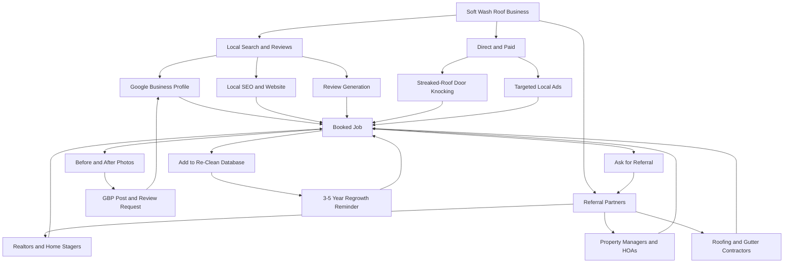

### Direct Answer

Start a soft wash roof cleaning business in 2027 by registering an LLC, carrying general liability insurance with a roof/height endorsement ($1,200-$2,800/year), and investing $6,000-$14,000 in a properly specified soft wash rig — a 12V or air-driven chemical pump, a dedicated 100-200 gallon mix tank, low-pressure tips, and the right sodium hypochlorite and surfactant supply chain. The model that wins is **a productized, square-footage-priced exterior cleaning service centered on roofs but bundled with house washing and gutter brightening**, not a one-off "we'll quote it when we see it" pressure-washing generalist. Soft washing — applying a low-pressure chemical solution that kills the *Gloeocapsa magma* algae causing black roof streaks, rather than blasting shingles with high-pressure water — is the only roof-cleaning method endorsed by major shingle manufacturers and the ARMA (Asphalt Roofing Manufacturers Association). Expect $8,000-$18,000/month solo within nine to fourteen months at 55-70% gross margins once routing, chemical mixing, and pricing are standardized.

> **TL;DR**
> - **Capital to start:** $6,000-$14,000 for a real soft wash rig (12V pump system, dedicated mix tank, hose reels, low-pressure tips, ladders, a used truck or trailer). A pressure washer alone is *not* a soft wash setup and will void shingle warranties.
> - **The method is the moat:** soft washing is manufacturer-approved and ARMA-recommended; high-pressure roof "cleaning" strips granules and voids warranties. Selling the *correct* method is your differentiation against pressure-washing generalists.
> - **The money is in productization:** price by roof square footage ($0.20-$0.60/sq ft for soft wash roofs; $0.10-$0.20/sq ft for house washing) and sell three fixed bundles, not custom quotes.
> - **Where leads come from:** Google Business Profile and local SEO drive 40-60% of residential work; realtors, property managers, and roofing contractors refer the recurring commercial volume. Door-knocking a streaked-roof neighborhood still converts.
> - **Chemistry is the daily skill:** sodium hypochlorite (SH) concentration, surfactant ratio, dwell time, and plant protection separate a safe, effective job from a lawn-killing, callback-generating disaster.
> - **Realistic year-one:** $90,000-$180,000 revenue solo-to-two-person, 55-70% gross margin, 18-25% net after fuel, chemical, and a part-time helper. Year two with a second truck: $250,000-$450,000.
> - **The 2027 shift:** insurers and HOAs increasingly *require* algae remediation before renewal or sale; "curb appeal" has become "compliance," widening the addressable market beyond aesthetics-only buyers.

Soft wash roof cleaning occupies an unusually favorable spot in the home-services economy: the equipment cost is modest relative to the ticket size, the core skill is a learnable chemistry-and-safety discipline rather than a years-long trade apprenticeship, and demand is structurally recurring because algae regrows on the same roofs every three to five years. It is one of the few exterior-cleaning niches where a careful solo operator can clear six figures without employees, a yard, or a franchise fee. The catch — and the reason most entrants stall as an undifferentiated pressure-washing generalist charging $200 a job — is that the work *looks* like spraying water and *behaves* like a specialized chemical-application trade with real liability. The winners treat it as a routed, productized service business with a tight method and a tighter price book. This guide walks the full path: the method and why it matters, legal and insurance setup, the real rig-building math, the chemistry skill, pricing systems that hold margin, the lead engine that compounds, the operational mechanics of a wash day, and the honest failure modes.

## 1. Why Soft Wash Roof Cleaning Is a Real Business in 2027

The instinct to lump roof cleaning in with generic pressure washing is exactly the gap a serious operator exploits. The category professionalized over the back half of the 2020s, and three structural forces make 2027 a strong entry year.

### 1.1 The Method Itself Is the Market — and the Differentiation

Most homeowners with black-streaked roofs believe they need a "pressure wash." They are wrong, and that misunderstanding is the entire business opportunity. The black streaks are not dirt — they are a living colony of *Gloeocapsa magma*, a cyanobacteria (blue-green algae) that feeds on the limestone filler in asphalt shingles and on airborne nutrients. High-pressure water does remove the visible staining, but it also blasts away the protective ceramic-coated granules that give a shingle its UV resistance and lifespan. The result is a roof that looks clean for a season and then ages years faster.

Soft washing solves the actual problem. It applies a low-pressure (typically under 100 PSI, often closer to garden-hose pressure) solution of sodium hypochlorite and a surfactant that *kills the organism at the root*, so the roof not only looks clean but stays clean far longer because the colony is dead rather than merely displaced. This is the method explicitly recommended by the **Asphalt Roofing Manufacturers Association (ARMA)** in its technical bulletin on algae staining, and it aligns with the cleaning guidance published by major shingle makers such as GAF and Owens Corning (OC) [ARMA, asphaltroofing.org, Technical Bulletin on roof algae]. Pressure washing an asphalt roof can void the shingle manufacturer's warranty; soft washing does not. Selling the *correct, warranty-safe method* is your single strongest differentiation against the pressure-washing generalist who will happily destroy a roof for $250.

### 1.2 The Demand Picture Is Broad, Recurring, and Compliance-Driven

Roof cleaning is not one market — it is a stack of overlapping ones, and that diversification is what makes the revenue stable.

- **Aesthetic residential** is the entry point: a homeowner sees black streaks, wants curb appeal back, pays $400-$1,200 for a roof soft wash, and is a candidate for a recurring three-to-five-year cycle.
- **Pre-sale and real estate** work is fast-converting and realtor-referred — a streaked roof reads as "deferred maintenance" to buyers, so a clean roof is a small spend that protects a large list price.
- **HOA and insurance compliance** is the fastest-growing segment: a rising number of HOAs cite homeowners for algae staining, and a growing number of insurers require algae remediation as a condition of policy renewal or will non-renew over roof condition. This converts "want" into "must," and the homeowner rarely haggles a compliance deadline.
- **Commercial and property management** — apartment complexes, strip-mall roofs, HOA common buildings — are the routed, repeatable margin engine, booked on a contract not a personal whim.
- **Bundled exterior work** — house washing, gutter brightening, driveway and walkway cleaning, deck and fence cleaning — turns a single roof lead into a $1,500-$3,500 whole-property ticket.

The U.S. Bureau of Labor Statistics tracks janitorial and building-exterior cleaning within the broader services economy, a category it projects to grow with housing stock and the aging of the existing roof inventory [BLS Occupational Outlook Handbook, bls.gov]. The exterior-cleaning and pressure-washing services market has been profiled by IBISWorld as a steadily growing, highly fragmented U.S. category dominated by small operators [IBISWorld, House Cleaners / Building Exterior Cleaners in the US]. The U.S. Census Bureau's housing data shows the bulk of the owner-occupied housing stock is now decades old, which matters because algae staining is a function of roof age, humidity, and tree coverage — the older the roof inventory, the larger the addressable pool of streaked roofs [U.S. Census Bureau, census.gov, American Housing Survey]. You do not need the macro number to be precise — you need to know the demand is structural, regrowth-driven, and increasingly mandated rather than optional.

Geography compounds the demand picture. Algae growth tracks humidity: the U.S. Southeast, the Gulf Coast, the Mid-Atlantic, and the Pacific Northwest produce streaked, moss-covered, and lichen-covered roofs at a far higher rate than the arid Southwest. An operator in a humid market has a near-inexhaustible supply of visibly streaked roofs within a short drive; an operator in a dry market may need to lean harder on moss and dust-and-pollution cleaning and on the bundled house-wash work. Knowing your local climate's effect on demand is part of the market sizing — it is the difference between a route you can fill in a five-mile radius and one that requires forty-minute drives between jobs.

The diversification point deserves a closer look, because it is the single most underappreciated structural advantage of the model. An operator who only chases aesthetic residential roof jobs is exposed to one sentiment — discretionary curb-appeal spend — that softens whenever household budgets tighten. An operator who also books pre-sale work, HOA-compliance work, insurance-driven remediation, and routed commercial contracts has five revenue streams that do not move together. Real estate work tracks the housing market; compliance work is non-discretionary and recession-resistant; commercial contracts are scheduled and predictable; aesthetic work is seasonal and weather-sensitive. When you map a year of bookings, the troughs of one segment are filled by the peaks of another. That is why an operator who deliberately courts all five segments has a far smoother revenue line than one chasing only the homeowner who "wants the streaks gone."

There is also a regrowth flywheel that compounds the way few service businesses do. Algae returns to the same roof on a roughly three-to-five-year cycle. Every roof you clean in 2027 is a warm, pre-qualified, address-known lead in 2030-2032. A disciplined operator who simply keeps a customer database and runs a re-marketing reminder converts a one-time job into an annuity. The exterior-cleaning siblings share this dynamic — the pressure washing business (q9585) and house washing routes (q2052) describe the same recurring-revenue logic.

### 1.3 The Skill Ceiling Is Real but Crossable

The reason soft wash roof cleaning is not winner-take-all is that the visible quality gap between a careless operator and a professional is large, obvious, and the thing clients pay for. A roof "cleaned" with too weak a mix shows streaks again within months; a roof done with too strong a mix or careless overspray kills $4,000 of landscaping and generates a claim. A roof done by a professional comes out uniformly bright, the algae is dead at the root, the plants are untouched, and the result holds for years. That gap is your moat — but it is a moat you build with a few weeks of deliberate chemistry-and-safety practice, not a credential anyone can buy.

The economic logic is worth being explicit about. In a business with zero skill barrier, price collapses to the cost of labor because no customer can tell one provider from another. In a business with an *insurmountable* barrier, only a credentialed elite competes at all. Soft wash roof cleaning sits in the productive middle: the barrier — chemistry control, ladder and roof safety, plant protection, and clean uniform application — is real enough that most casual entrants never cross it, but low enough that a committed person crosses it in a few focused weeks. That middle zone is exactly where a disciplined operator earns outsized returns, because competent application is scarce relative to demand but achievable relative to effort. The pressure-washing generalists who flood the bottom of the market are not your competition once you have crossed the barrier — they are, in fact, your best advertising, because every homeowner who got a striped, re-greening, or warranty-voiding result from a generalist becomes a motivated buyer for the operator who does it right.

### 1.4 The Capital Wall Is Low — Which Is a Blessing and a Trap

You can build a real soft wash rig for the price of a used car. That is the blessing: no franchise fee, no $80,000 buildout, no commercial lease. It is also the trap, because low barriers mean a crowded generalist tier. Your competitive position is **not** "we clean roofs" — that is everyone with a pressure washer. It is "we deliver the warranty-safe, manufacturer-recommended soft wash method, on a fixed square-footage price, with documented plant protection and a multi-year result." The method and the professionalism, not the spraying, are scarce.

| Business model | Startup capital | Time to first $8K month | Gross margin | Main risk |
|----------------|-----------------|--------------------------|--------------|-----------|
| Soft wash roof cleaning (solo) | $6,000-$14,000 | 6-14 months | 55-70% | Generalist price competition + chemical liability |
| Pressure washing generalist | $3,000-$8,000 | 4-10 months | 50-65% | Commoditized, low differentiation |
| Gutter cleaning / installation | $2,500-$10,000 | 5-12 months | 45-60% | Seasonal, weather-bound |
| Window cleaning route | $2,000-$6,000 | 4-10 months | 55-70% | Low ticket, high job count |
| Full exterior cleaning company | $15,000-$45,000 | 12-18 months | 50-65% | Overhead before route density |

The table makes the strategic point: soft wash roof cleaning has a moderate capital wall — higher than a bare pressure washer because the rig is purpose-built and the chemical supply chain matters — and a competitive gross margin, but it pays for that with real exposure to generalist price competition and to chemical-handling liability. Every chapter below is, in some sense, about converting those two weaknesses into a defensible position. For adjacent models, compare the pressure washing business path (q9585), the gutter installation path (q9616), the residential window cleaning path (q9584), and the lawn care route (q9612).

## 2. Legal Setup, Insurance, and Money Plumbing

This chapter is unglamorous and it is also where generalists quietly expose themselves to ruin. You are climbing ladders, working on roofs, and applying a powerful oxidizing chemical near landscaping, pets, and water sources. A fall, a dead garden, a chemically damaged vehicle finish, or a stained walkway are all real, insurable events. Set the structure up properly in week one.

### 2.1 Entity Choice: Form the LLC

For a solo or small soft wash operator, a single-member **LLC** is the near-universal right answer. It separates your personal assets — home, savings — from business liability, costs $50-$500 to register depending on state, and is taxed as a pass-through by default so you avoid corporate double taxation. A sole proprietorship is simpler but offers zero liability shield — unacceptable for a business that does ladder and roof work and handles industrial chemicals. The U.S. Small Business Administration's guidance on choosing a business structure is the canonical free reference [SBA, sba.gov, Choose a business structure].

- **Register the LLC** with your Secretary of State, then file for an **EIN** with the IRS — it is free at irs.gov and takes ten minutes [IRS, irs.gov, Apply for an EIN].
- **Open a dedicated business checking account** the same week. Co-mingling personal and business money is the single most common bookkeeping mistake, and it weakens your liability shield if you are ever sued.
- **Check local licensing.** Most jurisdictions require a basic business license; some require a contractor registration once you exceed a job-value threshold. A few states regulate the application of cleaning chemicals — confirm with your city clerk and state contractor board. Do not assume.

### 2.2 Insurance Is Not Optional — and Roof Work Changes the Quote

You need real coverage before your first paid job, and the height-and-chemical nature of the work materially changes what you must buy:

1. **General liability insurance** — covers bodily injury and property damage. For a soft wash operator this runs roughly **$1,200-$2,800/year** for a $1M/$2M policy, *materially higher than a flat-work-only pressure washer* because rooftop work and chemical application are higher-risk classifications. Do not buy a policy that excludes roof work or chemical application — confirm both are covered in writing.
2. **A height / roof-work endorsement.** Many general-liability policies exclude work above a certain height or on roofs unless specifically endorsed. The streaked roof you are there to clean is, by definition, work at height — make sure the policy says yes.
3. **Chemical-application / pollution coverage.** Sodium hypochlorite overspray that kills a neighbor's prize landscaping or damages a vehicle's clear coat is the most likely property claim in this trade. Confirm chemical drift and application damage are covered, not excluded.
4. **Commercial auto.** Your truck or trailer hauling a 100-200 gallon chemical load is a business vehicle; a personal auto policy generally will not cover it.
5. **Workers' compensation** becomes legally required in most states the moment you hire even a part-time helper — and roof-work payroll is a high-rate class code.

A few practical details that catch new operators off guard. First, **commercial and HOA clients set the coverage minimum** — many require $1M per occurrence and $2M aggregate, some property managers ask for $2M/$4M, and you will be asked for a certificate of insurance (COI) naming them as additional insured before you can bid. Second, the additional-insured endorsement is sometimes per-client and sometimes blanket — a blanket policy is worth a slightly higher premium because you never wait on paperwork to confirm a contract. Third, treat the COI as a sales asset, not a chore: property managers maintain preferred-vendor lists, and the operator who emails a clean, correctly endorsed COI within the hour is the one who gets the contract.

| Insurance type | Typical year-1 cost | When you need it | What it covers |
|----------------|---------------------|------------------|----------------|
| General liability ($1M/$2M, roof + chemical) | $1,200-$2,800 | Before first paid job | Injury, property damage, on roof and ground |
| Height / roof-work endorsement | Bundled or $100-$400 | Before any roof work | Confirms above-height work is covered |
| Chemical / pollution application | $0-$600 | Before first SH application | Overspray damage to plants, vehicles, surfaces |
| Commercial auto | $1,000-$2,500 | Truck/trailer hauling the rig | Business use of the vehicle and chemical load |
| Workers' compensation | Varies by payroll | When you hire anyone | Employee injury — high rate for roof work |

### 2.3 Sales Tax, Bookkeeping, and the Quarterly Rhythm

Soft wash roof cleaning is generally a taxable service in many states; some tax the labor, some only the materials, and the rules vary widely. Register for a sales-tax permit with your state revenue department and confirm the treatment before your first invoice — back-paying uncollected sales tax out of pocket is a brutal, avoidable lesson.

| Money task | Tool / cadence | Why it matters |
|------------|----------------|----------------|
| Bookkeeping | QuickBooks or Wave, weekly | Clean books = real margin visibility, easy taxes |
| Estimated taxes | IRS Form 1040-ES, quarterly | Avoids underpayment penalty on profitable months |
| Sales tax | State portal, monthly/quarterly | Collected, never "borrowed" for cash flow |
| Mileage / route log | Routing app or notebook, per job | Standard mileage deduction is real money |
| Chemical cost tracking | Per-job material log | The single biggest variable cost — must be visible |
| Separation | Business-only bank + card | Protects the LLC liability shield |

Intuit (INTU) dominates the small-business accounting tool market with QuickBooks; for a sub-$150K soft wash business, the free tier of Wave is genuinely sufficient until volume justifies upgrading. The discipline matters more than the software.

Two tax mechanics deserve specific mention because they meaningfully change a soft wash operator's take-home. The first is the **vehicle and equipment deduction**: a work truck, a trailer, the pump rig, tanks, and reels are depreciable business assets, and Section 179 expensing can let you deduct a substantial share of qualifying equipment in the year you buy it rather than over many years [IRS, irs.gov, Section 179 deduction guidance]. For a business whose startup cost is concentrated in a rig and a truck, this is real money. The second is the **standard mileage deduction**: a routed exterior-cleaning business generates heavy, fully deductible business miles every working day, and across a season the annual total is substantial. The catch on both is documentation — the IRS expects a contemporaneous mileage log and clean asset records, not a year-end reconstruction. Set up the logging in week one and it costs you nothing.

A third item: **set aside 25-30% of every payment for taxes the moment it lands.** Self-employment tax plus income tax on a profitable soft wash business is not optional, and the most common cash-flow disaster in any solo service business is spending the gross and discovering the tax bill in April. Open a separate savings account, move the tax reserve immediately, and file quarterly estimates with Form 1040-ES so there is no underpayment penalty. The bookkeeping discipline here is identical to every routed home-service business — the lawn care startup guide (q9612) covers the chart-of-accounts logic in depth.

## 3. The Soft Wash Rig: What You Actually Need to Buy

Here is where new operators waste the most money — not by buying too little, but by buying the *wrong* thing. The single most expensive mistake is assuming a pressure washer is a soft wash rig. It is not. A pressure washer applies water at 2,000-4,000 PSI; a soft wash system applies a chemical solution at low pressure — often under 100 PSI — through a pump designed to move chemical, not to blast. Build the rig in the order below.

### 3.1 The Non-Negotiable Core (~$3,000-$8,000)

- **A soft wash pump system.** The two standard approaches are a **12V chemical pump system** (a battery-driven diaphragm pump that moves the mix at controllable low pressure) or an **air-driven / dedicated soft wash pump**. The 12V system is the common solo starting point: controllable, quiet, and built specifically to handle sodium hypochlorite. Expect $800-$2,500 for a quality pump-and-controller setup.
- **A dedicated chemical mix tank** — typically a 100-200 gallon poly tank, plumbed so you can batch-mix SH, surfactant, and water. Sodium hypochlorite degrades pump and tank components not rated for it, so every wetted part must be chemical-resistant. $300-$900 for the tank and fittings.
- **Hose and a hose reel** — enough chemical-rated hose to reach a two-story roofline from a truck-mounted rig, on a reel so it does not tangle. $200-$600.
- **Low-pressure soft wash tips / nozzles and a shooter assembly** — the application end that produces the gentle fan or stream that lays solution on a roof without granule damage. $100-$400.
- **Ladders and roof-access gear** — a quality extension ladder, a stabilizer, and ladder-safety accessories. Most soft washing is done *from the ladder and the ground*, not by walking the roof, but you still need solid, rated access equipment. $300-$800.
- **Personal protective equipment** — chemical-resistant gloves, eye protection, a face shield, dedicated work clothing. SH is an oxidizer; it bleaches clothing and irritates skin and eyes. Non-negotiable, and cheap relative to an injury.

### 3.2 The Vehicle: Truck or Trailer (~$2,000-$8,000 to start)

You need a way to haul a loaded chemical tank, which at 100-200 gallons of water-based solution weighs 800-1,700+ pounds. The lean start is a used pickup truck with the rig mounted in the bed; the alternative is a small enclosed or open trailer towed behind an existing vehicle. Either works. What does *not* work is improvising — a chemical tank shifting in an unsecured bed is a genuine hazard. Secure the tank, plumb it cleanly, and make sure the vehicle is rated for the load.

### 3.3 Chemical Supply — The Variable Cost That Decides Your Margin

This is the most important purchasing lesson in the business: **your chemical supply chain is the single biggest variable cost, and sourcing it wrong quietly destroys margin.** The core chemical is **sodium hypochlorite (SH)** — the same active ingredient as household bleach, but bought at *commercial strength* (often 10-12.5% concentration) from a chemical or pool supplier, far cheaper per active gallon than retail jugs. You also need a **surfactant** (a "soaping" agent that helps the solution cling to a sloped roof and dwell long enough to work) and often a fragrance or masking agent.

Buying retail bleach by the jug from a big-box store will work for your first job and then bankrupt your margin. Establish a relationship with a local pool-chemical or janitorial-supply distributor and buy SH in bulk. Note that SH degrades over time, especially in heat and light — buy to your forecast job volume, not speculatively, and store it cool and shaded.

| Chemical sourcing behavior | Cost per active gallon | Effect on margin | Root cause |
|----------------------------|------------------------|------------------|------------|
| Bulk SH from a pool/chemical distributor | Lowest | Protects 55-70% gross | Buys to forecast, bulk pricing |
| Mid-volume from a janitorial supplier | Moderate | Mild margin drag | Reasonable middle ground |
| Retail bleach jugs from a big-box store | Highest by far | Quietly halves net profit | No supply chain, speculative buying |

### 3.4 Optional and Deferred — Do Not Buy These Yet

| Item | Cost | Buy it when... |
|------|------|----------------|
| Second truck + rig | $10,000-$25,000 | A crew is fully booked and turning away routed work |
| Vehicle wrap | $1,500-$4,000 | After ~$80K revenue; a magnet sign works fine first |
| Yard / storage with chemical containment | $200-$600/mo | Home storage genuinely overflows or is unsafe |
| CRM + routing software (paid tier) | $50-$150/mo | Job volume makes manual scheduling error-prone |
| Surface cleaner attachment | $200-$600 | You add driveway/flatwork to the bundle |
| Telescoping water-fed pole system | $400-$1,200 | You add reach-and-rinse house washing volume |

Note the recurring theme: defer every fixed cost until a *specific paying job or proven route* justifies it. A second truck before route density is overhead with no revenue behind it.

### 3.5 The Realistic Startup Budget

| Category | Lean start | Comfortable start |
|----------|-----------|-------------------|
| LLC + permits + EIN | $100 | $500 |
| Insurance (year 1, roof + chemical) | $1,200 | $2,800 |
| Soft wash pump system | $800 | $2,500 |
| Mix tank + plumbing + reels + hose | $600 | $1,800 |
| Ladders + roof-access gear + PPE | $500 | $1,400 |
| Used truck or trailer | $2,000 | $4,500 |
| Starting chemical stock | $300 | $700 |
| Website + Google Business Profile | $100 | $700 |
| Branding / logo / signage | $100 | $600 |
| **Total** | **~$5,700-$6,500** | **~$13,000-$15,000** |

You can genuinely begin around $6,000 if you already have a truck. The "comfortable" column buys reliability, a faster path to looking professional, and margin for error. What you should *not* do is spend $40,000 on a fully decked dual-axle trailer with hot-water and surface-cleaner attachments before you have proven a route — that capital buys capability you cannot yet keep busy.

## 4. Learning the Craft: Chemistry, Safety, and a Streak-Free Result

Capital and legal setup take a week or two. The craft — chemistry control, plant protection, ladder and roof safety, and uniform application — takes a few focused weeks, and it is the actual barrier to a sustainable price point. Treat practice as a funded, scheduled project.

### 4.1 The Skills That Separate Pro from Generalist

1. **Mix ratio control.** Soft washing is a dilution problem. Too weak and the algae survives and the roof re-streaks within months; too strong and you risk damage and unnecessary chemical cost. A professional knows the working SH concentration for a roof versus a house versus a stubborn north-facing slope, mixes deliberately, and gets a uniform kill.
2. **Surfactant and dwell-time discipline.** The surfactant lets the solution cling and dwell on a sloped surface long enough to do its work. Knowing how much to add, how long to let it sit, and when *not* to apply (high heat and direct sun flash off the solution too fast) is core craft.
3. **Plant and property protection.** This is the skill most often skipped and most likely to generate a claim. Before any application you pre-wet surrounding landscaping, tarp or bag sensitive plants, divert and rinse, and protect vehicles and walkways from drift. SH overspray kills a garden in hours.
4. **Ladder and roof safety.** Most soft washing is done from the ladder and ground, but you still work at height, on stabilized ladders, sometimes near power lines, on wet surfaces. OSHA's fall-protection guidance for ladder and roof work is the canonical free reference [OSHA, osha.gov, ladder and fall-protection standards]. A fall ends the business.
5. **Uniform, streak-free application.** A roof done in patchy passes comes out blotchy. Working in consistent, overlapping sections and reading the roof as it lightens is a learnable visual skill — and it is what photographs well and earns the referral.

The mix-control skill deserves a specific note because it is the single highest-leverage craft discipline in the trade. Sodium hypochlorite is sold at varying commercial strengths, and your effective application strength is a function of how much water you cut it with. A professional thinks in terms of *target application concentration* and works backward to a recipe — so many gallons of SH, so many gallons of water, so much surfactant — and mixes the same way every time. A generalist eyeballs it, gets inconsistent results, and either re-greens roofs (too weak) or generates damage claims (too strong). Standardizing a small set of repeatable recipes — roof mix, house-wash mix, heavy-organic mix — is what lets you deliver a predictable result and forecast chemical cost per job.

### 4.2 A Focused Practice Plan

- **Week 1:** Read the ARMA technical bulletin and the shingle-manufacturer cleaning guidance. Learn the SH strengths your supplier carries. Build and plumb your rig; test the pump and tips on water only until the spray pattern and reach are dialed in.
- **Week 2:** Practice mixing to target concentration and run controlled tests on a small, low-risk surface — a section of your own roof, a shed, a fence panel. Practice the full plant-protection routine: pre-wet, tarp, divert, rinse.
- **Week 3:** Do two or three full jobs for friends and family at material cost only. The lesson is the whole sequence under real conditions — a real two-story roof, real landscaping to protect, a real time constraint.
- **Week 4:** Refine your three productized packages, shoot proper before-and-after photography, and build the booking page and Google Business Profile. You are now ready to charge full price.

The reason this plan is structured as a *funded, scheduled* project rather than casual practice is that the in-between state — competent enough to take money, not careful enough to be safe — is the most dangerous place to be, both for your liability and for your reputation. An operator who starts charging before the plant-protection routine is automatic will eventually kill a customer's landscaping, and one bad review about a dead garden costs more than the month of practice would have. Budget for the runway the way you would budget for a tool: a known cost that buys a known capability. The same "work a few jobs at cost to build a portfolio and a routine" sequence applies across exterior services — the pressure washing path (q9585) and house washing route (q2052) describe the identical sequence.

| Practice phase | Week | Primary output | What "done" looks like |
|----------------|------|----------------|------------------------|
| Knowledge + rig build | 1 | Working, plumbed rig; method knowledge | Spray pattern and reach dialed in on water |
| Chemistry + protection drill | 2 | Repeatable mix recipes; protection routine | Same mix every time; automatic plant protection |
| Real-deadline reps | 3 | 2-3 jobs at material cost | Streak-free result, zero plant damage, on time |
| Portfolio + systems | 4 | 3 packages, photo set, GBP, booking page | Ready to charge full price |

### 4.3 Where to Learn — and What Not to Pay For

Free manufacturer and ARMA technical documents, plus the deep library of process tutorials from established soft wash operators, will take you most of the way. The Safety Data Sheet (SDS) for the sodium hypochlorite you buy — which your chemical supplier is legally required to provide — is itself essential reading, because it documents the handling, storage, and first-aid information you need to operate safely [OSHA Hazard Communication Standard, osha.gov, Safety Data Sheets]. A paid online course ($150-$600) from a recognized soft wash educator can compress the timeline and is worth it if it includes structured chemistry, plant-protection, and safety modules. What is **not** worth it early: expensive multi-day in-person certifications before you have run a single job, "soft wash business in a box" franchise-style programs with ongoing royalties, and anything promising "six figures in 90 days." There is no government-mandated artistic certification; the real qualification is a documented, streak-free, damage-free track record and a strong before-and-after portfolio.

One more learning note that saves a real callback: different roof substrates behave differently. An asphalt shingle roof, a clay or concrete tile roof, a metal roof, and a cedar shake roof each respond to soft washing differently and tolerate different mix strengths and dwell behavior. Moss and lichen — common on tile and cedar in damp, shaded conditions — are not the same problem as the *Gloeocapsa magma* black streaking on asphalt, and they often need a longer dwell and gentle physical removal rather than a stronger chemical hit. Learn the substrate before you quote it; the EPA's guidance on the responsible use and disposal of cleaning chemicals near storm drains and landscaping is the relevant environmental reference and should inform how you rinse and divert runoff [U.S. Environmental Protection Agency, epa.gov, stormwater and cleaning-product guidance].

## 5. Pricing: The System That Holds Your Margin

Pricing is where exterior-cleaning businesses live or die. The generalist quotes custom every time, gets dragged into "the other guy said $250," and ends up working for $15/hour. The professional sells **fixed packages** and prices **by roof square footage**. Adopt the system below before your first paid client.

### 5.1 The Core Pricing Insight: Chemical Is Cheap, Your Method and Risk Are Not

A typical residential roof soft wash might use $30-$90 of chemical. If you price that job at $700, the chemical cost is well under 15% of the price. So what are you charging for? **The warranty-safe method, the chemistry expertise, the height risk, the plant-protection labor, the equipment, the insurance that covers all of it, and the multi-year result.** Generalists anchor their price to the chemical cost and destroy their own margin. Anchor to the *method, the risk, and the value* instead.

| Cost component | Typical share of a $700 roof job | Notes |
|----------------|----------------------------------|-------|
| Chemical + consumables | $40-$90 (6-13%) | The cheap part — never the anchor |
| Labor: setup, application, protection, rinse | $180-$300 (3-5 hrs) | The real product |
| Travel + truck + fuel | $40-$80 | Routed efficiency matters here |
| Overhead (insurance, equipment, software, web) | $80-$140 | Roof + chemical insurance is significant |
| **Gross profit retained** | **$200-$320** | Your actual pay + reinvestment |

### 5.2 Square-Footage Pricing — The Anti-Haggle Weapon

Price the roof soft wash by **roof square footage** at a clear rate — commonly **$0.20-$0.60 per square foot** depending on your market, roof pitch, height, and algae severity, with steeper and harder-access roofs at the top of the range. Price **house washing at $0.10-$0.20 per square foot** of wall area. This single move changes the sales conversation: instead of "what's your price to clean a roof?" the job becomes arithmetic from a measurement you can take off satellite imagery or a quick site visit. It is transparent, it scales with the work, and it ends the negotiation.

There is a deeper reason the square-footage model wins beyond ending the haggle: it makes you **estimable and routable**. When a realtor or property manager wants to recommend you, they need to be able to tell a client roughly what to expect. "He does good work, call for a quote" is a weak referral; "he's about forty cents a square foot, a typical roof runs $500-$900" is a strong one, because it lets the partner pre-qualify and pre-frame the price. Formula-based pricing turns every referral partner into an effective salesperson for you, and it lets you build accurate routed estimates for multi-building commercial bids.

### 5.3 Three Productized Bundles

Sell three named packages, not infinite custom quotes:

1. **"Roof Refresh"** — a soft wash roof clean only, with full plant protection and a streak-free guarantee. $400-$1,200 depending on size and access. The volume product and the lead-in offer.
2. **"Whole-House Exterior"** — roof soft wash plus house washing (siding) and gutter face brightening, delivered in one routed visit. $900-$2,200. The bread-and-butter, and the one to upsell every roof lead toward.
3. **"Full Curb Appeal"** — roof, house wash, gutters, plus driveway, walkway, and deck or fence cleaning — the complete exterior reset, ideal for pre-sale and HOA-compliance jobs. $1,500-$3,500+. The margin and portfolio piece.

### 5.4 Pricing Rules That Protect You

- **Take a deposit or scheduled card on file** for larger jobs; collect the balance on completion. This eliminates most no-shows.
- **Charge for roof pitch and access difficulty.** A steep, three-story, hard-access roof is genuinely more labor and more risk than a single-story ranch — price the difficulty, do not absorb it.
- **Price the bundle, sell up from the roof.** The roof is the lead; the whole-property bundle is the margin. Quote the bundle on every roof inquiry.
- **Build a routed minimum.** A $300 roof forty minutes away in the wrong direction is a money-loser; set a minimum that respects your route.
- **Quote add-ons — gutter cleaning, driveway sealing referrals, recurring maintenance plans — separately**, never bundled invisibly into the base.

A productized-package mindset is the through-line across every routed home-service business; the lawn care startup guide (q9612) and the residential window cleaning route (q9584) both lean on the same "named tiers, not custom every time" discipline.

### 5.5 The Discounting Trap and How to Hold the Line

Every soft wash operator will face the same pressure: a prospect who got a $250 quote from a guy with a pressure washer and asks you to match it. Holding the line is not stubbornness — it is arithmetic, and it is also a safety and ethics issue. Because your gross margin is 55-70%, a discount does not come out of the chemical cost — it comes straight out of your pay and your overhead recovery. A $700 job dropped to $500 keeps the same $70 of chemical and the same hours of labor, so the $200 discount is $200 off your margin. Two discounted roofs can erase the profit of a third full-price one.

The professional responses are not "no" — they are structured re-frames that protect the square-foot rate:

- **Sell the method gap.** The $250 quote is almost always a high-pressure wash that voids the shingle warranty and re-streaks within a year. Explain — calmly, with the ARMA reference — that you are quoting a different, warranty-safe product. You are not overpriced; the other quote is for a different and damaging service.
- **Offer a smaller scope, not a lower rate.** "I can fit your budget — let's do the roof now and the house wash next season." The rate holds; the deliverable shrinks.
- **Bundle, don't discount.** Add a gutter face brightening to a roof job rather than cutting the headline number. A low-cost add-on feels generous and costs you far less than a price cut.
- **Walk away from the bottom 10%.** Some prospects only want the cheapest possible spray and do not care about method or warranty. They are the generalist's client. Referring them elsewhere politely is a margin-protecting decision, not a lost sale.

The mindset to internalize: a fully booked route of full-price jobs always beats an over-booked route of discounted ones, because the discounted route burns the same fuel, the same chemical, the same body, and the same risk for materially less money.

## 6. Getting Clients: The Lead Engine vs. The Ad Treadmill

You can pay for every customer forever, or you can build a lead engine that compounds. The professionals build the engine. Here is the architecture.

### 6.1 The Three-Channel Lead Mix

The diagram makes the strategic point visible: **local search, the re-clean regrowth database, and referral partners are the compounding parts of the system; paid ads are the leaky part.** Every finished job should feed three things back into the funnel — a before-and-after post with a review request, an entry in the re-clean database for the three-to-five-year cycle, and a referral ask.

### 6.2 Local Search Is the Residential Engine

Forty to sixty percent of residential roof work comes from a homeowner searching "roof cleaning near me" or "remove black streaks from roof." Winning that search is mostly free, mechanical work:

- **Google Business Profile** is free, ranks you in the local map pack, and is where those searches land. Fill it completely, post before-and-after photos every week, list your service area, and request a review after every job. Reviews are the single biggest local-ranking lever.
- **A simple website** with your three bundles, the square-footage pricing logic, an explanation of why soft washing beats pressure washing, and an inquiry form converts the traffic. The method-education page is itself a sales tool — it pre-frames every lead.
- **Review generation** is a system, not luck: ask every satisfied customer, at the moment the roof transformation is visible, with a direct link. Alphabet (GOOGL) owns the search and maps surface that this entire channel runs on; treat the GBP as a core business asset.

### 6.3 Referral Partners Drive the Recurring Volume

The routed, predictable, high-margin work comes from a handful of referral relationships. The partners worth cultivating:

- **Realtors and home stagers** need streaked roofs cleaned fast before listing photos and showings. A realtor who lists thirty homes a year and trusts you is a steady channel; the pre-sale job converts quickly because the seller has a deadline.
- **Property managers and HOA boards** control multi-building, recurring, contract-based volume — apartment complexes, common buildings, whole subdivisions cited for algae. One property-management relationship can be worth $20,000-$80,000 a year.
- **Roofing and gutter contractors** are not competitors — a roofing company (q9675) that replaces roofs does not want low-margin cleaning work and is glad to refer it; in return you refer the customers whose roofs are genuinely past cleaning. The gutter installation business (q9616) is a natural cross-referral partner on the same houses.
- **Insurance agents** increasingly deal with policyholders facing non-renewal over roof condition; an agent who can hand a homeowner a soft wash referral solves their problem and yours.

The mechanics: show up in person, bring before-and-after photos and a clean COI, be reliable, and reciprocate every referral. This is a relationship business and it cannot be automated.

| Referral partner | Why they refer you | What you offer them | Realistic annual value |
|------------------|--------------------|--------------------|------------------------|
| Realtor / home stager | Clean roof protects the list price | Fast turnaround, reliable scheduling | $8,000-$30,000 |
| Property manager / HOA | Multi-building recurring contracts | Routed pricing, COI, consistency | $20,000-$80,000 |
| Roofing contractor | They don't want low-margin cleaning | Reciprocal referral of true re-roofs | $6,000-$25,000 |
| Gutter contractor | Same houses, different service | Cross-referral, joint bundled jobs | $4,000-$15,000 |
| Insurance agent | Solves a policyholder's renewal problem | A fast, documented remediation referral | $5,000-$20,000 |

The discipline that makes the network compound is reciprocity tracking. Keep a simple log of who sent what, and make sure referrals flow both directions. A realtor who sends you five listings and gets nothing back will stop; a realtor you actively refer buyers and sellers to becomes a permanent, free, motivated channel.

A concrete partner-outreach playbook, because "network with realtors" is uselessly vague advice. Build a list of every active real estate brokerage, property-management company, roofing contractor, gutter company, and insurance agency within your service radius — typically forty to eighty businesses in a mid-size metro. Prioritize property managers and HOA management companies first, because a single management company's portfolio can feed you routed, recurring contract work for years. For each prospect, the approach is the same: visit in person during a quiet weekday, bring a printed before-and-after mini-portfolio and a stack of clean, correctly endorsed COIs, and lead with what you can do *for them* — specifically, offer a free demonstration soft wash on a streaked building they manage so they can see the result and the documented plant protection firsthand. A property manager who has seen your work and holds your COI on file has a concrete reason to add you to the approved-vendor list, because a clean common-building roof reduces the algae-citation complaints they field from owners. That is a referral relationship built on aligned interest, not on you asking for favors.

### 6.4 Direct and Paid Channels — Use Deliberately

Streaked roofs are *visible from the street* — which makes targeted door-knocking unusually effective in this trade. When you finish a job, the neighboring roofs with the same streaks are warm leads you can see; a polite door-knock with a before-and-after photo and a same-day offer converts. Targeted local social and search ads can seed the early customer base, but treat them as a bridge, not a destination — once the GBP, reviews, and referral partners are working, paid cost-per-job is the worst of your channels. The residential window cleaning guide (q9584) reaches the same conclusion: search presence and referral partners beat the paid-ad treadmill on cost per booked job.

## 7. Operations: Running the Wash Day

A booked job is a promise to show up, on time, deliver a uniform streak-free result, protect the property, and leave no damage. The operational discipline below is what makes that promise repeatable.

### 7.1 The Job Lifecycle

| Stage | Timing | Key actions |
|-------|--------|-------------|
| Inquiry | Day 0 | Respond within hours; send bundle menu + sq-ft logic |
| Estimate | Day 0-2 | Measure (satellite or site visit); quote the bundle |
| Booking | Day 0-5 | Confirm date, deposit if large, set weather contingency |
| Prep | Job morning | Mix to recipe; load and secure the rig; route confirmed |
| On site: setup | Job day | Pre-wet and protect landscaping; tarp; brief the homeowner |
| Application | Job day | Apply uniformly, observe dwell, rinse as needed |
| Wrap | Job day | Final rinse of plants and surfaces; walk the property |
| Follow-up | Day +1 to +3 | Before/after post, review request, re-clean database entry |

### 7.2 The Weather and Dwell-Time Problem

Soft washing is weather-bound. The solution must dwell on the roof to work; in high heat and direct sun it flashes off too fast, and rain shortly after application washes it off before the kill is complete. The operational rule: **schedule with a weather buffer, apply in moderate conditions, and avoid the hottest part of the day on dark roofs.** Build a weather-contingency clause into every booking so a rescheduled job is expected, not a conflict. Misjudging this is how an operator does the work, collects the money, and gets a callback when the roof re-greens.

### 7.3 Property Protection and Site Etiquette

- **Pre-wet and protect every plant and surface** in the drift zone before a drop of solution is applied — this is the non-negotiable routine.
- **Brief the homeowner.** Tell them what you are doing, that there will be a chlorine smell, to keep pets and kids inside during application, and how long until everything is rinsed and safe.
- **Protect vehicles and walkways** from overspray and runoff; move what can be moved, cover what cannot.
- **Rinse thoroughly at the end** — landscaping, siding, windows, driveways — so no concentrated solution is left to do damage after you leave.
- **Photograph before and after** in good light — that before-and-after pair is next week's marketing and the proof behind the next referral.

### 7.4 Capacity, Routing, and the Solo Ceiling

Solo, you can realistically execute roughly **two to four jobs per working day** depending on size, access, and drive time. That is the structural ceiling on a one-person soft wash business — and it is why the growth path runs through routing density first and then a second crew.

| Stage | Team | Realistic monthly revenue | Constraint |
|-------|------|---------------------------|------------|
| Solo, building | You only | $3,000-$8,000 | Skill + reviews + lead flow |
| Solo, established | You + occasional helper | $8,000-$18,000 | Your working hours + weather |
| Two-truck operation | You + a trained crew | $18,000-$40,000 | Hiring, training, scheduling |
| Multi-crew company | 2-4 crews + office | $40,000-$90,000+ | Management + route density |

### 7.5 The Sustainable Schedule

Soft wash work is seasonal and weather-bound — strong in the warm, dry stretches, slow in deep winter and wet seasons depending on climate. Protect against burnout by routing tightly to minimize windshield time, batching jobs by neighborhood, building the off-season into the annual cash plan, and using slow weather to do marketing, equipment maintenance, and re-clean-database outreach. A soft wash business that exhausts its founder chasing every scattered job is not a business — it is a bad job you created for yourself.

## 8. Counter-Case: When Soft Wash Roof Cleaning Is the Wrong Choice

An honest guide names the cases where this business fails or where you should not start it. Walk through these before committing capital.

### 8.1 The Failure Modes Are Real

- **The "undifferentiated generalist" trap.** The most common outcome is not bankruptcy — it is stalling as one more pressure-washing guy competing only on price, never productizing, never selling the method, never building referral partners. This is a strategy failure, not a market failure, and it is the default if you drift.
- **Chemical damage claims.** Careless plant protection or an over-strong mix kills landscaping, etches glass, or damages a vehicle's finish. One bad claim and one bad review about a dead garden can outweigh a month of revenue. This is why the chemistry skill in Chapter 4 and the insurance in Chapter 2 are non-negotiable.
- **Falls and height injury.** This is ladder work, sometimes near power lines, on wet surfaces. A fall ends the business and possibly worse. The risk is real and it is why the safety discipline cannot be skipped.
- **Weather and seasonality.** Revenue is genuinely weather-dependent and seasonal; an operator who does not plan cash flow around slow, wet, and cold stretches will hit a winter crunch.
- **Re-greening callbacks.** Get the mix wrong — too weak — and roofs re-streak within months, generating warranty callbacks that cost you a second free job and your reputation.

### 8.2 Who Should Not Start This

- **If you cannot fund a few weeks of practice** and a proper rig before earning, you will be improvising chemistry and safety on paying customers' roofs — the most expensive place to learn.
- **If you are uncomfortable working at height,** the daily reality of ladders and roof-edge work will wear you down or, worse, get you hurt.
- **If you will not do in-person referral-partner outreach,** you are signing up for a permanent paid-ad treadmill that erodes your margin.
- **If you need predictable income in every month of the year now,** the weather-bound seasonal revenue rhythm will frustrate you.
- **If you will not maintain the discipline of plant protection and mix control,** the liability will eventually find you.

### 8.3 Honest Alternatives in the Same Neighborhood

If the counter-case resonates, the exterior-services economy has adjacent models with different trade-offs. A pressure washing business (q9585) is lower-capital and flat-work focused — less height risk, but more commoditized. A residential window cleaning route (q9584) is low-capital and low-risk but trades for smaller tickets and higher job counts. A gutter installation business (q9616) and gutter cleaning route (q1977) involve height work but a different skill and a more seasonal pattern. A lawn care business (q9612) or lawn care route (q2050) is a different routed home service with steadier weekly recurring revenue. A solar panel cleaning business (q2141) is a closely adjacent niche with similar equipment and the same routed-residential model. A roofing company (q9675) is the higher-capital, higher-ticket trade on the same buildings, and a chimney sweep business (q1979) is another recurring-cycle home service. None is strictly better — they are different bets on capital, height risk, seasonality, and ticket size.

### 8.4 The Honest Bottom Line

Soft wash roof cleaning is a genuinely viable small business for a specific person: someone who can fund a short skill-building runway and a proper rig, will treat the work as a precise chemistry-and-safety discipline rather than "spraying a roof," will do the unglamorous work of building reviews and referral partners, and will hold pricing discipline by selling the warranty-safe method against the temptation to match a generalist's destructive lowball. For that person, a strong five-figure month and a low-six-figure-to-mid-six-figure year with a second truck are realistic, not hype. For the person who wants to "just spray roofs" without the method, the chemistry, and the systems, it becomes an undifferentiated, liability-exposed grind. The spraying was never the business — the method, the safety, and the systems are.

## 9. Frequently Asked Questions

### 9.1 How much money do I need to start a soft wash roof cleaning business?

A lean, genuinely functional start is about **$5,700-$6,500** if you already own a truck — that covers an LLC and permits, roof-and-chemical general liability insurance, a real soft wash pump system, a mix tank with plumbing and reels, ladders and PPE, a starting chemical stock, and a basic website. A comfortable start including a used work truck or trailer, branding, and a margin for error runs **$13,000-$15,000**. The critical point: a pressure washer alone is *not* a soft wash rig — the purpose-built low-pressure chemical system is the non-negotiable core spend.

### 9.2 How long until a soft wash roof cleaning business is profitable?

Because ticket sizes are large relative to chemical cost, many operators are cash-flow positive within the first months of paid work. Reaching a *sustainable* $8,000-$18,000/month solo typically takes **nine to fourteen months** — a few weeks to build skill and a rig, then most of a year to build the Google reviews and referral relationships that produce steady bookings. Year-one revenue solo-to-two-person of $90,000-$180,000 is realistic; year two with a second truck and crew can reach $250,000-$450,000.

### 9.3 Is soft washing really better than pressure washing a roof?

Yes, and this is the core of the business. High-pressure water blasts away the protective granules on asphalt shingles, shortening the roof's life and potentially voiding the manufacturer's warranty. Soft washing applies a low-pressure sodium hypochlorite and surfactant solution that kills the *Gloeocapsa magma* algae at the root, so the roof both looks clean and stays clean far longer. Soft washing is the method recommended by the Asphalt Roofing Manufacturers Association and aligns with major shingle-maker cleaning guidance. Selling that distinction is your differentiation against pressure-washing generalists.

### 9.4 Do I need a license or special certification?

You need a basic **business license** in most jurisdictions, and some states require a **contractor registration** above a job-value threshold; a few states regulate the commercial application of cleaning chemicals — confirm with your city clerk and state contractor board. You also need **general liability insurance with roof-work and chemical-application coverage** before your first paid job, since HOA and commercial clients require a certificate of insurance. There is **no government-mandated soft wash certification** — paid courses can compress your learning curve, but the real qualification is a documented, streak-free, damage-free track record.

### 9.5 Is soft wash roof cleaning seasonal, and can I run it part-time?

It is genuinely weather-bound and seasonal — strongest in warm, dry stretches and slow in deep winter or prolonged wet weather depending on your climate. Many operators do start part-time and scale up; the work fits a part-time schedule, but you must plan cash flow around slow seasons. The recurring-revenue advantage helps: because algae regrows on a three-to-five-year cycle, a customer database built early becomes a steady stream of re-clean reminders, smoothing the revenue line as the business matures into a full-time operation with a second crew.

---

**Sources and further reading:** U.S. Small Business Administration (sba.gov) — choosing a business structure, business licenses and permits, writing a business plan; Internal Revenue Service (irs.gov) — applying for an EIN, Form 1040-ES estimated taxes, self-employment tax, Section 179 equipment deduction, standard mileage deduction; U.S. Bureau of Labor Statistics (bls.gov) — Occupational Outlook Handbook, building-cleaning and services sector projections; U.S. Census Bureau (census.gov) — American Housing Survey, age of the owner-occupied housing stock; Occupational Safety and Health Administration (osha.gov) — ladder safety and fall-protection standards, Hazard Communication Standard and Safety Data Sheets; U.S. Environmental Protection Agency (epa.gov) — stormwater runoff and responsible cleaning-product use and disposal guidance; Asphalt Roofing Manufacturers Association (asphaltroofing.org) — technical bulletin on roof algae staining and recommended cleaning methods; GAF, CertainTeed, and Owens Corning (OC) — shingle-manufacturer roof-cleaning guidance and algae-resistant shingle technology; IBISWorld — Building Exterior Cleaners / House Cleaning Services in the US industry profiles; SCORE (score.org) — free small-business mentoring and home-services startup guidance; state Secretary of State offices — LLC registration; state departments of revenue — sales-tax permits and remittance; state contractor licensing boards — exterior-services registration thresholds; Insurance Information Institute (iii.org) — small-business general liability, pollution, and commercial auto coverage; QuickBooks (Intuit, INTU) and Wave — small-business bookkeeping; Google Business Profile and Search (Alphabet, GOOGL) — local search optimization for service businesses. Cross-referenced Pulse Knowledge Library entries: pressure washing business (q9585), house washing route (q2052), residential window cleaning business (q9584), gutter installation business (q9616), gutter cleaning business (q1977), lawn care business (q9612), lawn care route (q2050), roofing company (q9675), solar panel cleaning business (q2141), and chimney sweep business (q1979).
