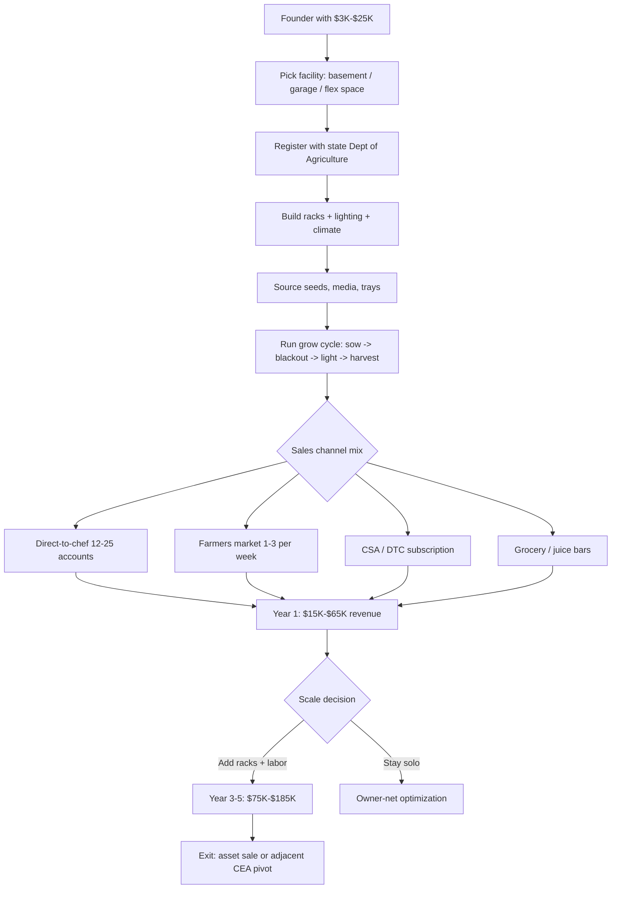

### Direct Answer

Starting a microgreens farming business in 2027 means building a **controlled-environment-agriculture (CEA) micro-operation** that grows 7-21-day-old seedlings on vertical racks and sells them fresh within 7-10 days of cut — primarily to restaurant chefs, farmers markets, CSA boxes, juice bars, and grocery. You can start in a basement for **$3K-$25K** or build a real commercial grow room for **$40K-$120K**, earning **65-80% gross margin** at **$20-$60+/lb**. The decisive truth: this is a **B2B sales operation that happens to grow plants** — finding and keeping 12-25 chef accounts is harder than growing the product, and treating it as a "passive grow business" is the fastest way to lose $20K in spoiled trays.

> ### Bottom Line
> - **[Capital]** $3K-$25K to start in a basement / spare room; $40K-$120K for a commercial grow room with racks, lighting, and climate control; SBA microloan ($50K cap) is the typical path beyond bootstrap.
> - **[Margins]** Microgreens sell **$20-$45/lb wholesale to chefs, $35-$60/lb direct-to-consumer**; gross margin **65-80%** at scale; net **20-35%** once labor and waste shrink hit.
> - **[Hardest part]** The restaurant sales cycle plus perishability — you have **7-10 days from cut**, chefs change menus weekly, and bad-batch loss (mold, Pythium) routinely kills 5-20% of weekly output.
> - **[Realistic outcome]** Year 1 single-operator revenue lands at **$15K-$65K** ($5K-$28K owner net); Year 3-5 mature scale reaches **$75K-$185K** ($28K-$85K owner profit) at a 200-1,500 sq-ft facility.

**TL;DR:** A microgreens farming business in 2027 is a CEA micro-operation that grows seedlings of vegetables, herbs, and grains — sunflower, pea shoots, radish, broccoli, cilantro, basil, amaranth — on stacked vertical racks under LED grow lights, in soilless media on 10x20 trays, harvested fresh and sold within 7-10 days. The structural appeal is real: microgreens compress the seed-to-sale cycle from 60-180 days for traditional vegetables down to 7-21 days, deliver $20-$60+ per pound (vs $1-$3/lb for mature vegetables), and grow in 200-1,500 square feet with no farmland or growing season. The hard truth: the sales cycle dominates the economics. Net payment terms run 30-90 days, chef turnover hits 15-30% annually, weekly menu changes invalidate standing orders, and disease pressure regularly destroys 5-20% of production. PE-backed giants — Bowery Farming, Plenty, AeroFarms, Fresh Origins — proved the high end, but the microgreens-only segment stays a craft small-business format. Viable in 2027 as a disciplined, sales-driven, restaurant-relationship-anchored craft food business; a money pit for anyone who skips the chef-account pipeline.

---

## PART 1 — FOUNDATIONS

### 1.1 What microgreens are and the 2027 market

A microgreens farming business in 2027 is a **controlled-environment-agriculture (CEA) micro-operation** producing **7-21-day-old seedlings of vegetables, herbs, grains, and edible flowers** — sunflower, pea shoots, radish, broccoli, cilantro, basil, amaranth, beets, kohlrabi, mustard, arugula, kale, chard, fenugreek, dill, fennel, sorrel, nasturtium, marigold — grown in stacked vertical racks under T5 fluorescent or LED grow lights, in **coco coir, hemp mat, jute, biostrate, Sure-To-Grow, or Pro-Mix soilless** medium on standard **10x20 (10.5"x20.5") nursery trays**, harvested at the first-true-leaf stage and sold fresh within **7-10 days of cut**.

**The distinction from sprouts and baby greens matters legally and operationally.** Sprouts — germinated seeds eaten whole including the root, like alfalfa or mung bean — are regulated as **high-risk produce under the FDA Produce Safety Rule Subpart M** because sprouts have caused 46+ outbreaks per CDC data. **Microgreens are explicitly not sprouts**: they are cut above the growing medium, you eat only the stem and cotyledons, and they fall under the general FDA Produce Safety Rule rather than the sprout-specific subpart. **Baby greens** (lettuce, spinach, arugula harvested at 4-6 weeks at the 2-4" leaf stage) are larger, sold by the bag in grocery, and require longer grow cycles plus more space — distinct from microgreens, which are smaller, sold by the ounce or clamshell, and target chef-driven culinary use.

**Bold market context:** The 2027 US microgreens market sits in the **$150M-$280M direct retail-wholesale range**, with variance depending on whether one includes the vertical-farming giants whose microgreens lines overlap with broader leafy-greens portfolios. The category splits into three structural tiers shown below.

| Tier | Representative operators | Scale | Backing |
|------|--------------------------|-------|---------|
| PE / VC-backed CEA giants | Bowery Farming, Plenty, AeroFarms, Square Roots, Smallhold | $20M-$300M+ ARR | Venture / private equity |
| Microgreens pure-play mid-tier | Fresh Origins (San Marcos CA) | $25M-$45M est. revenue | Founder-owned |
| Independent small-business segment | Donny Greens, Greens-Fix, Living Earth Farm, ~1,500-4,500 operators | $15K-$1.5M | Bootstrap / SBA |

The **PE-backed vertical-farming giants** — **Bowery Farming** (founded 2015 NYC, raised $700M+, vertical leafy greens including microgreens, Whole Foods national distribution), **Plenty Inc.** (founded 2014 SF, raised $940M+ including a Walmart partnership, vertical farms in Compton CA and Richmond VA), **AeroFarms** (founded 2004 Newark NJ, aeroponic vertical farms, filed Chapter 11 in June 2023 and emerged August 2023), **Square Roots** (founded 2016 Brooklyn, container-farm model in 320 sq-ft repurposed shipping containers, partnerships with Gordon Food Service and Whole Foods), and **Smallhold** (founded 2017, mushroom-focused but operates an adjacent CEA model serving chefs and Whole Foods) — operate at scale with hundreds of employees. **Fresh Origins** (founded 1998 by the Sosnowski family in San Marcos CA, 150+ varieties, ships nationally through distributors like Chefs' Warehouse and Greenleaf) is the largest microgreens pure-play. The **independent small-business segment** spans from $15K hobby operations to $1.5M+ regional brands — including **Donny Greens** (Brooklyn NY, founded by Don Schwartz, a major YouTube educator on the format), Greens-Fix, Living Earth Farm, and thousands of metro-area operators.

The honest 2027 demand reality: microgreens consumption has grown from a chef-niche garnish in 2010-2015 to a mainstream culinary input plus a growing DTC health-food category in 2020-2027, driven by chef-driven plating in fine-dining and casual-upscale segments, post-pandemic menu refreshes emphasizing fresh and local ingredients, plant-based and functional-food trends pushing microgreens into smoothie shops and juice bars, home-cook discovery via TikTok and YouTube content, and the structural cost-and-space advantage versus traditional produce. The opportunity for a 2027 entrant: the chef, farmers-market, CSA, and DTC channels remain **fragmented at the local-supplier level** because microgreens have a **7-10 day shelf life from cut**, requiring local delivery and inherently favoring nearby producers over national shipping. This creates defensible local-supplier economics for disciplined small operators — much the way local presence anchors a food truck business (q9669) or a corporate catering business that lives or dies on same-day freshness.

**The public-market context worth understanding.** No pure-play microgreens company trades publicly, but the broader CEA and fresh-produce universe sets the price ceiling and the cautionary tale. **AppHarvest**, the Kentucky-based controlled-environment tomato grower that went public via SPAC in 2021 under ticker APPH, filed for Chapter 11 bankruptcy in July 2023 — a stark warning that capital-intensive indoor farming has destroyed enormous shareholder value. **Local Bounti Corporation (NYSE: LOCL)**, a Montana-based CEA leafy-greens company, also went public via SPAC and has traded down sharply. On the buy side, the grocery chains that purchase microgreens at scale — **Sprouts Farmers Market (NASDAQ: SFM)**, **The Kroger Co. (NYSE: KR)**, and **Costco Wholesale (NASDAQ: COST)** — dictate the $15-$28/lb wholesale ceiling a small operator faces in the grocery channel. **Whole Foods Market**, owned by **Amazon.com (NASDAQ: AMZN)** since 2017, is the single most coveted natural-grocery placement for a microgreens brand. The takeaway for a 2027 founder: the small-footprint, sales-anchored, locally-delivered microgreens micro-business sidesteps the exact cost structure — massive facilities, automation capex, national logistics — that bankrupted AppHarvest. The micro-format wins precisely because it stays small.

### 1.2 Regulatory and food-safety landscape

The microgreens regulatory stack is **lighter than meat, dairy, or value-added foods but heavier than most founders expect**, and the 2024-2027 FDA Produce Safety Rule enforcement intensification has caught operators who skipped the food-safety registration step.

**The federal baseline.** The **FDA Produce Safety Rule under the Food Safety Modernization Act (FSMA)** — codified at 21 CFR Part 112 — applies to growers of "covered produce" including microgreens. Exemptions and tiers break down as follows.

| Status | Threshold | Requirements |
|--------|-----------|--------------|
| Full exemption | Under $25K in produce sales | None (still must follow state rules) |
| Qualified exemption | Under $500K total food sales, majority direct-to-end-user | Modified labeling (name + address) + basic recordkeeping |
| Fully covered | Above qualified-exemption threshold | Full Produce Safety Rule: water testing, sanitation SOPs, FSMA training, 2-year record retention |

Most microgreens operators above $25K revenue land in either qualified-exempt or fully-covered status. **Qualified-exempt farms** must comply with modified labeling and basic recordkeeping but are not subject to full Subpart B agricultural water, Subpart F biological soil amendments, or Subpart M sprouts requirements. **Fully covered farms** must comply with the full rule including water-testing protocols, sanitation SOPs, employee training under FSMA Subpart C, and record retention for two years. The **FDA Produce Safety Network** and state Departments of Agriculture provide compliance resources; FDA inspectors are not actively inspecting small qualified-exempt operations as of 2027, but state extension and ag inspectors conduct routine educational outreach plus complaint-driven inspections.

**State and local food-safety registration.** Most states require microgreens operators to register as a **food establishment, farm, or wholesale food producer** with the state Department of Agriculture (or Department of Health), with annual fees from $25 to $400 depending on revenue tier and product mix. Examples: **California Department of Food and Agriculture** registration as a wholesale food producer plus a county environmental-health permit; **New York State Department of Agriculture and Markets** Article 20-C food-processor license ($400-$800/year) for sales beyond direct-to-consumer; **Texas Department of State Health Services** food-handler permit plus county health department; **Florida Department of Agriculture and Consumer Services** food-establishment permit; **Massachusetts Department of Public Health** wholesale food permit. Many states have **cottage food laws** that exempt direct-to-consumer sales at farmers markets and DTC from food-establishment permitting up to revenue thresholds ($25K-$50K typical) but restrict sales channels to direct-only — no wholesale to restaurants or grocery.

**The disciplined operator path:** register with the state Department of Agriculture as a farm or food producer from Day 1, obtain any required county environmental-health permits, comply with applicable cottage food law restrictions if going DTC-only, and graduate to full food-establishment permitting when expanding to restaurant wholesale or grocery channels.

**The most common regulatory mistake** is the founder who starts selling to restaurants under a cottage food law that explicitly restricts sales to direct-to-consumer. Cottage food laws were written for jams, baked goods, and farmers-market sales — they almost never permit wholesale to a restaurant or grocery store, even though the operator is selling the identical product. A microgreens farmer who lands three chef accounts while still operating under cottage food cover is technically operating an unlicensed wholesale food business, and a single complaint-driven inspection or a foodborne-illness investigation will surface the gap. The second common mistake is **skipping the state Department of Agriculture registration entirely** because "it's just microgreens in my basement." The registration is cheap ($25-$400/year), fast, and the single most important piece of paper for credibility when a chef or grocery buyer asks for food-safety documentation. The third mistake is **assuming organic certification is automatic**. A grow room using non-organic seed, conventional Pro-Mix, or municipal water cannot legally label or market product as "organic" without USDA NOP certification — and the word "organic" on a clamshell without certification is a labeling violation that draws enforcement attention. Operators who want the organic premium must build the practice from Day 1 with certified-organic seed and approved inputs, then complete certification before using the term.

**Traceability** is both a regulatory requirement and a business asset. Every tray should carry a lot code tied to seed lot, sow date, and variety, and that lot code should follow the product onto the clamshell or delivery bin. In a recall scenario, the operator must be able to identify within minutes which customers received product from the affected lot — a clean traceability log turns a potential business-ending event into a contained, professional recall, and signals competence to grocery buyers who increasingly require lot-level traceability.

**Organic certification under the USDA National Organic Program (NOP)** is optional but valuable for restaurant-channel premium pricing. **USDA Certified Organic** requires certification through a USDA-accredited agency (CCOF, OEFFA, Oregon Tilth, MOSA, Pennsylvania Certified Organic, and 50+ others) with annual inspection, $400-$1,500/year cost, and a 3-year transition period for soil-based operations — not applicable to soilless or hydroponic systems, which are provisionally allowed under NOP rules per 2017 National Organic Standards Board guidance, though the policy remains contested by soil-organic advocates. Most fine-dining chef accounts prefer organic; most farmers-market and CSA customers value it. Other certifications include **Real Organic Project** (soil-based-only, not applicable to soilless microgreens), **Demeter Biodynamic** (rare), and **GAP (Good Agricultural Practices) certification through USDA AMS** ($800-$3,500/year, often required for grocery-chain placement).

**Food-handler and food-manager certifications.** **ServSafe Food Manager** ($150-$200, 8-hour course, 5-year cert) or **National Registry of Food Safety Professionals** certifications are required for the operator and any food-handling employee. A **HACCP plan** (Hazard Analysis Critical Control Points) becomes relevant at larger scale or when supplying institutional or grocery accounts — typically not required for small microgreens-to-restaurant operations but increasingly demanded by grocery chains. **Labeling:** packaging must include producer name and address, net weight, country of origin for retail-channel sales, and a lot code or grow-date for traceability; organic-labeled product requires NOP-compliant labeling. **Water testing** under Subpart E requires periodic testing for fully-covered farms — most indoor microgreens operations use municipal water (which generally meets requirements) or reverse-osmosis filtered water.

### 1.3 Business structure, insurance, and licensing

**Entity structure.** Most microgreens operators form an **LLC** taxed as a disregarded entity (default for single-member, profits flow through to Schedule C) or elect **S-corporation** status for owner-operators paying themselves a reasonable salary plus distributions. The S-corp election typically becomes advantageous around **$40K-$80K of net business income** because of FICA tax savings on distributions. A **sole proprietorship** is workable for hobby-tier farmers-market-only operations but exposes the owner to personal liability on food-illness lawsuits, slip-and-fall at the market booth, or delivery-vehicle accidents. A **multi-member LLC with an operating agreement** is standard for husband-wife teams or co-founder partnerships.

**Insurance stack components specific to microgreens / CEA farms** are itemized below — the load matters, because under-insuring a food business is a single-event bankruptcy risk.

| Coverage | Year 1 premium | What it covers |
|----------|---------------|----------------|
| Commercial General Liability ($1M/$2M) | $485-$1,800 | Slip-and-fall, customer claims, delivery accidents |
| Product Liability (food-specific) | $385-$1,500 | Foodborne illness, contamination, allergen, recall |
| Inland Marine / Equipment | $285-$985 | Racks, lights, climate gear, trays, inventory |
| Commercial Auto | $485-$1,800 | Delivery vehicle or business-use endorsement |
| Property Insurance | $385-$2,500 | Grow facility, building or renter's commercial |
| Workers Compensation | $985-$3,500 | Required with W-2 employees; NCCI 0008/0083 class |
| Business Interruption | $385-$985 | Lost income from damage or contamination |
| Umbrella Liability ($1M-$2M) | $385-$985 | Layered above CGL |

**Total Year 1 insurance load** runs **$2,500-$8,500** for a hobby-to-startup-tier single-operator farm doing $15K-$65K revenue, scaling to **$8,500-$22,500** for an established small commercial operator at $75K-$185K with 1-3 employees, and **$22,500-$65,000+** for a mid-scale regional operator at $200K-$1.5M with a dedicated facility. **Personal-guarantee reality:** any equipment-financing line, facility lease, or vendor-credit agreement will require a personal guarantee from the founder regardless of LLC structure — the entity does not insulate the founder from those obligations.

**Where insurance gaps bite hardest.** Two coverage gaps are most dangerous: **food-product-specific liability** and **commercial auto**. General liability policies often exclude or sub-limit foodborne-illness claims, so the operator must confirm the policy explicitly covers contamination, allergen, and recall costs — not just generic premises liability. A single foodborne-illness claim, even a meritless one, can generate $25K-$150K in defense costs alone. The commercial-auto gap is subtler: a founder delivering in a personal vehicle under a standard personal auto policy is **not covered** for a business-use accident, exposing personal assets directly. A business-use endorsement ($200-$600/year) or a dedicated commercial-auto policy closes it. **Workers compensation** is the third trap — the moment an operator hires a part-time harvest helper as a W-2 employee, most states require coverage, and a harvest helper working set hours under the operator's direction with the operator's tools is, by IRS and state-labor tests, an employee, not a 1099 contractor.

**Local licensing and zoning.** Beyond state food-establishment registration, operators must comply with **local zoning** — most municipalities allow microgreens production in agricultural, industrial, or commercial-mixed-use zones but may restrict it in residential zones without a specific home-occupation permit. Home-based operations in basements, spare rooms, or garages may operate under home-occupation permits but must comply with state cottage food laws restricting sales channels. Wholesale to restaurants or grocery typically requires a commercial facility with food-establishment permitting. **Farmers market permits** are issued by the market manager (annual fee $185-$1,500 plus per-market fee $25-$185); **CSA box sales** typically need no permitting beyond food-establishment registration; **grocery-chain placement** requires GAP certification plus chain-specific vendor agreements. **Sales tax:** microgreens sold for human consumption are generally exempt under grocery food exemptions, but operators should confirm state by state.

**The home-occupation permit trap** catches operators who scale faster than their permits allow. A home-occupation permit typically caps the percentage of the residence used, restricts customer and delivery traffic, prohibits non-resident employees, and bans signage. An operation that grows from 5 racks in a spare bedroom to 25 racks across basement, garage, and shed — with a part-time harvest helper and a delivery van leaving three mornings a week — has outgrown that permit. The disciplined move is to **plan the commercial-facility transition before a zoning complaint forces it**, typically around 15-20 racks or the first non-resident employee. Light-industrial flex space cleanly resolves zoning, food-establishment permitting, and the cottage-food-to-wholesale transition in one move — and the per-square-foot calculus mirrors the site decision a self-storage facility business (q9663) faces, where lease cost compounds over every month.

---

## PART 2 — BUILD-OUT AND CAPITAL

### 2.1 Facility, racks, and vertical grow systems

Facility selection drives the entire operation because **square footage available x rack vertical density x lighting / climate / water capacity = total weekly production capacity**, and the facility cost stack typically represents **25-45% of Year 1 capital investment**. The three tiers map directly to the revenue ladder, as shown below.

| Facility tier | Footprint | Racks | Annual revenue | Space type & cost |
|---------------|-----------|-------|----------------|-------------------|
| Hobby / startup | 200-500 sq ft | 1-15 | $15K-$45K | Basement / garage; +$85-$285/mo utilities |
| Single-operator commercial | 500-1,500 sq ft | 15-45 | $45K-$185K | Light-industrial flex; $0.85-$2.85/sq ft/mo NNN |
| Regional commercial | 1,500-5,000 sq ft | 45-150 | $185K-$685K | Dedicated warehouse; $1.25-$3.85/sq ft/mo NNN |

The **hobby / startup tier** typically uses basement, spare room, garage, or heated shed at $0 incremental rent. The **single-operator commercial tier** uses light-industrial, commercial-condo, or warehouse space — Class C industrial flex in secondary markets, or basement and mezzanine space in urban markets. The **regional commercial tier** requires a dedicated warehouse with HVAC mini-split installation, electrical upgrades (200A-400A service for lighting load), and water/drain plumbing modifications. The same flex-space economics that govern a self-storage facility business (q9663) or a microbrewery (q9664) apply here — rent per square foot is a permanent drag, so vertical density is the lever.

**Vertical rack systems** are the operational core because **rack density determines square-foot productivity**. A 4'x2' (8 sq ft) floor-footprint rack with 5-tier shelves produces 40 sq ft of grow surface (5x leverage); 6-tier produces 48 sq ft (6x); 7-tier produces 56 sq ft (7x). **Major rack manufacturers serving the microgreens market:** **Bootstrap Farmer** (food-grade stainless or coated-steel racks at $385-$1,485 per rack), **Microgreens Farmer** (formerly Donny Greens systems, $485-$1,250 per rack), **Spec Farms** (light-industrial rack systems for mid-scale operators), **MetroMax / InterMetro** (commercial NSF-certified stainless steel widely used in restaurant supply at $285-$985 per rack), **Eagle Group / Quantum Storage Systems** (commercial wire shelving at $185-$685), **Vertical Tech** (custom CEA rack systems with integrated lighting and irrigation at $1,485-$4,850), and **AmHydro** (commercial NFT / DWC hydroponic systems). The **used rack market** via Facebook Marketplace, restaurant-supply liquidations, and CEA-operator-exit auctions yields adequate small-operator racks at $85-$485 each.

**Tray standards.** The dominant format is the **10x20 nursery tray (10.5"x20.5", also called 1020)**, which fits standard rack widths and accepts all major media — drainage trays for bottom-up watering, no-drainage trays for top-watering and root-rot prevention. Smaller **5x5 trays** serve premium specialty microgreens. Sourcing options: **Bootstrap Farmer 1020 trays** (food-safe, BPA-free, durable at $4.85-$8.85 each — durability drives lower per-cycle cost vs commodity $1.25-$2.85 trays), **Greenhouse Megastore** ($2.85-$4.85), **Hummert International**, and **A.M. Leonard / Growers Supply**. Initial tray inventory for a 15-45 rack operation: 200-800 trays at $485-$3,850 total.

**The tray-quality false economy** is one of the most common Year 1 capital mistakes. Commodity 1020 trays at $1.25-$2.85 each look like the obvious savings — until they crack, warp under the weight of a saturated medium, or develop micro-fissures that harbor pathogen biofilm no sanitizer fully reaches. A cracked tray is not just a $2 loss; it is a contamination vector and a re-buy. Heavy-duty food-safe trays (Bootstrap Farmer 1020s and equivalents) survive 50-150+ grow-and-sanitize cycles versus 8-20 for commodity trays, which makes the **per-cycle cost** of the premium tray lower despite the higher sticker price. A disciplined operator amortizes tray cost across cycles, not units. **Tray inventory math:** an operation running 30 racks at 5 tiers needs roughly 150 active grow shelves, and at any moment trays are in soak, blackout, light, harvest, wash, and dry stages — so the working tray count is typically **2.5-3.5x the active shelf count**, meaning a 30-rack operation needs 375-525 trays in rotation, not 150. Under-buying trays creates a production bottleneck where freshly harvested trays cannot be re-sown until washed, stalling the entire cadence.

**Build-out sequencing matters.** The disciplined order of capital deployment is: secure and prep the space, install climate control and electrical capacity first (retrofitting HVAC and 200A-400A service around fully-loaded racks is far more expensive), then racks and lighting, then trays and media, and buy seed last — only for the first 4-6 weeks, since the variety mix shifts as chef feedback comes in. Founders routinely invert this, buying racks and bulk seed first because those feel like "the farm," then discover the panel cannot carry the lighting load. Climate and power are the foundation.

### 2.2 Lighting, climate, and water systems

**Lighting is the second-largest capital decision after racks** because light quality, photoperiod, and intensity determine growth rate, color, flavor profile, and yield per tray. Two technologies dominate:

1. **T5 fluorescent grow lights** — 4' length, 54W per bulb, 2-4 bulbs per fixture, **$45-$185 per fixture**. Popular for legacy small-operator installations because of low capital cost; they produce **150-280 micromol/s/m2 PPFD** (Photosynthetic Photon Flux Density) at 6-12" above canopy, adequate for most microgreens varieties at 12-16 hour photoperiods.
2. **LED grow lights** — have dominated new installations since 2018-2020 because of **2.5-4.5x energy efficiency vs T5**, longer fixture lifespan (50,000-80,000 hours vs 15,000-25,000 for T5), and tunable spectrum.

**Major LED grow light brands serving microgreens:** **Mars Hydro** (budget tier $85-$485 per fixture, TS and FC series), **Spider Farmer** (mid-tier $185-$685, SF and G series), **Fluence by OSRAM / Signify** (premium commercial $485-$1,850, RAY / VYPR / SPYDR series used by commercial vertical farms), **California Lightworks** (premium commercial $685-$2,485, MegaDrive series), **Black Dog LED** ($385-$1,485, PhytoMAX series), **HLG / Horticulture Lighting Group** (DIY-friendly Quantum Board fixtures $185-$685), **Gavita** (Hawthorne Gardening Co subsidiary, professional commercial $485-$1,850), and **Iluminar Lighting** (commercial LED for vertical farms). **Microgreens-specific requirements:** 150-300 micromol/s/m2 PPFD is the sweet spot (far lower than the 600-900 required for flowering plants), a 12-16 hour photoperiod is standard with most operators running 16/8, and **full-spectrum white LED** is preferred over the magenta-blue ratio common in cannabis cultivation because microgreens are sold visually — color matters for chef plating. **Lighting capital for a 15-rack, 5-tier (75 grow shelves) operation:** 75-150 fixtures at $85-$485 each = $6,375-$72,750; mid-tier LED at $185 per fixture totals roughly **$13,875-$27,750**.

**Climate control.** Microgreens prefer **65-75 degrees F ambient temperature** and **40-60% relative humidity** with consistent air circulation to prevent mold, Pythium, and damping-off. **HVAC mini-split systems** are the standard solution — Mitsubishi, Fujitsu, Daikin, or LG ductless units at **$1,485-$4,850 per 12,000-24,000 BTU unit installed** typically handle 200-1,500 sq-ft grow rooms. **Air circulation:** Hurricane, Active Air, or Vivosun oscillating fans at $45-$285 each, typically 4-12 per room. **Dehumidifiers** (Ideal-Air, Quest, Anden) at $385-$2,485 per unit for high-humidity climates; **humidifiers** at $185-$685 for low-humidity climates. **CO2 enrichment** is uncommon for microgreens. **Climate capital for a 500-1,500 sq-ft operation:** $2,500-$12,500 for mini-split, fans, and dehumidifier baseline.

**Water systems.** Most operations use **bottom-watering** rather than top-watering to prevent disease; flood-and-drain ebb-and-flow systems automate this at mid-scale. Municipal water is generally acceptable but contains chlorine and chloramine that can affect germination — many operators use reverse-osmosis filtered water ($385-$1,485 for a residential/light-commercial RO system) or carbon-filtered municipal water ($85-$385). **pH monitoring** with a handheld meter ($45-$185) targets the slightly acidic 5.8-6.5 range microgreens prefer; **EC monitoring** ($85-$285) measures dissolved nutrient concentration, though most microgreens are grown without added fertilizer because the seed carries enough energy for the short cycle.

**The electricity bill is the operating cost founders underestimate most.** Lighting and climate together dominate the utility line, and the math is concrete: an LED grow shelf running 16 hours a day at roughly 100-200W per fixture, across 75-150 fixtures in a 15-30 rack operation, draws meaningful power. At a national average commercial electricity rate of roughly $0.11-$0.18 per kWh, a 30-rack operation typically runs **$300-$900/month in lighting and climate electricity** — a number that scales linearly with rack count and bites hardest in summer when air conditioning load spikes. T5 fluorescent installations run 2.5-4.5x higher energy cost than equivalent LED, which is the core reason new builds standardize on LED despite the higher fixture price; the LED energy savings typically pay back the fixture premium within 14-30 months. Operators should model the electricity bill at full rack count before signing a lease, confirm the panel can carry the load (a common surprise: a residential 100A or 200A panel cannot support a 30-rack LED installation plus a mini-split), and budget for the summer-peak month rather than the average.

**Water-cost reality** is the opposite — water is cheap. A microgreens operation uses far less water than field agriculture because the crop cycle is short and bottom-watering is efficient; municipal water cost rarely exceeds $50-$150/month even for a large operation. The discipline around water is about quality, not cost — chlorinated municipal water can suppress germination by a few percentage points, which compounds into measurable yield loss over thousands of trays per year, so filtration pays for itself even though the water is nearly free.

### 2.3 Seeds, media, trays, and input sourcing

**Seeds are the largest recurring operational input (typically 20-40% of weekly production cost)** and seed selection drives crop diversity, flavor, color, and grow-time consistency. The dominant commercial varieties and their economics:

| Variety | Cycle | Seed cost | Yield per 10x20 tray |
|---------|-------|-----------|----------------------|
| Sunflower | 7-12 days | $4.85-$18.50/lb | 0.85-1.45 lb |
| Pea shoots | 10-14 days | $3.85-$12.50/lb | 0.95-1.65 lb |
| Radish | 7-10 days | $8.85-$28.50/lb | 0.45-0.85 lb |
| Broccoli | 8-12 days | $18.50-$45.85/lb | 0.35-0.65 lb |
| Cilantro | 14-21 days | $24.85-$65.85/lb | 0.25-0.45 lb |
| Basil | 12-21 days | $28.85-$85.85/lb | 0.18-0.35 lb |
| Amaranth | 8-12 days | $18.85-$45.85/lb | 0.25-0.45 lb |

Other commercial varieties include **beet** (red stems, earthy, 10-14 day cycle), **kohlrabi** (mild brassica), **mustard** (spicy, multiple varieties — green, red, mizuna, komatsuna), **arugula** (peppery), **kale**, **chard** (rainbow stems for visual appeal), and the specialty chef-driven group — **dill, fennel, sorrel, shiso, fenugreek** — that command $28.85-$85.85/lb premium pricing.

**Major commercial microgreens seed suppliers:** **Johnny's Selected Seeds** (Maine-based, comprehensive microgreens catalog with detailed germination and yield data, the dominant US small-commercial supplier), **True Leaf Market** (Utah-based microgreens-specialty supplier with bulk-pricing tiers), **Mountain Valley Seed Company** (Utah-based bulk supplier related to True Leaf Market), **High Mowing Organic Seeds** (Vermont-based USDA Certified Organic, popular with organic-certified operators), **Kitazawa Seed Company** (Bay Area-based, Asian and specialty varieties), **Baker Creek Heirloom Seeds** (Missouri-based heirloom-only), and **Botanical Interests**. **Bulk-buying discipline:** ordering seeds in 5-25 lb sacks drops per-pound cost 35-65% versus 1 oz-to-1 lb retail packages; disciplined operators track germination rate (target 85%+) and rotate seed inventory within 12-18 months because germination degrades over time.

**Growing medium options.** **Coco coir** (compressed coconut husk, sustainable, sterile, $0.85-$2.85 per tray); **hemp grow mats** (Terrafibre brand, biodegradable, clean-cut harvest, $2.85-$8.85 per tray); **jute mats** ($2.50-$6.85 per tray); **biostrate** (synthetic biodegradable mat, popular for consistency and clean harvest, $1.85-$5.85 per tray); **Sure-To-Grow** (synthetic non-degradable, very clean harvest, $1.85-$4.85 per tray); and **Pro-Mix BX/HP soilless mix** (peat-based, the legacy choice at $0.45-$1.85 per tray). Most operators settle on one or two media types — hemp, biostrate, or Sure-To-Grow for "clean harvest" varieties going to chef accounts, and coco coir or Pro-Mix for higher-volume, lower-margin varieties. **Tray inputs cost per cycle:** $1.50-$4.85 per tray for seed, medium, tray amortization, water, electricity, and labor allocation at small-operator scale.

**Choosing a medium is a channel decision, not a horticulture decision.** Chef accounts at the fine-dining tier care intensely about a clean cut with no soil or medium contamination on the microgreen — a single fleck of Pro-Mix on a finishing garnish is a plating defect a serious chef will not tolerate. For those accounts, hemp mat, biostrate, or Sure-To-Grow is effectively mandatory because the microgreen cuts cleanly above a mat with no loose particles. For higher-volume, lower-margin channels — juice bars, smoothie shops, grocery — where the product is blended or bagged rather than plated, the cheaper coco coir or Pro-Mix is fine and the per-tray savings matter. The disciplined operator runs **two media in parallel**: a premium clean-harvest mat for the chef-channel varieties and a cheaper medium for the volume varieties. Running a single medium for "simplicity" either overpays on the volume varieties or underdelivers on the chef varieties.

**Seed storage discipline** is a quiet profit lever. Seed germination rate degrades with time, heat, and humidity exposure — and a drop from 90% to 75% germination is a direct 15% yield hit on every affected tray. Seed should be stored in **sealed containers in a cool, dry, dark space** (many operators use a dedicated refrigerator or a climate-controlled closet), with seed lots dated on receipt and rotated first-in-first-out. Less-stable varieties — onion, leek, and some herbs — degrade fastest and should be bought in smaller quantities and used within 6-12 months; stable varieties like sunflower and pea can hold 18-24 months under good storage. An operator who buys a 25 lb sack of cilantro seed to capture the bulk discount, then uses it slowly over two years in a warm garage, is quietly losing yield on every tray and will not connect the gradual decline to the storage failure.

---

## PART 3 — OPERATIONS

### 3.1 Growing cycle: seed, blackout, light, harvest

The microgreens growing cycle is the **operational heartbeat of the business**, and the discipline of consistent execution drives the **5-20% bad-batch loss rate that separates profitable operators from money-losing ones**. The standard four-phase cycle:

**Phase 1 — Soak / pre-germination (24-48 hours, optional).** Larger seeds (sunflower, pea shoots) benefit from an 8-24 hour cool-water soak before sowing to improve germination consistency and reduce mold risk. Smaller seeds (cilantro, basil, broccoli, radish) are typically sown dry.

**Phase 2 — Sowing (Day 0).** Seeds are spread evenly across the medium at variety-specific density: **sunflower at 8-12 oz per 10x20 tray, pea shoots at 8-14 oz, radish at 1-2 oz, broccoli at 0.85-1.5 oz, cilantro at 1-2 oz**. Seeds are pressed lightly into medium, then trays are **bottom-watered** to fully saturate without disturbing seed placement. **Sowing-rate discipline:** under-sowing produces a sparse tray with low yield; over-sowing produces a dense tray with mold, damping-off risk, and uneven growth.

**Phase 3 — Blackout (Days 1-3 to Days 1-7 depending on variety).** Sown trays are covered to simulate underground germination, which drives root development before shoot emergence. Sunflower and pea shoots use a **2-4 day blackout with 5-15 lbs of weight** on top of the cover tray to encourage strong rooting. Brassicas (broccoli, kale, cabbage, mustard, radish) use a **2-3 day blackout without weight**. Cilantro, basil, and herbs use a **3-7 day blackout** because they germinate slowly. Any mold detection during blackout triggers immediate tray discard and disinfection of nearby trays.

**Phase 4 — Light (Days 3-7 to harvest, typically Days 7-21 total).** Trays move into a lighted environment at **150-300 micromol/s/m2 PPFD on a 12-16 hour photoperiod**. Light triggers chlorophyll production (greens turn from yellow/white to green over 24-72 hours) and develops final color, flavor, and nutritional profile. Daily checks cover water needs, pest and mold inspection, and growth-stage monitoring. **Harvest readiness** is the **first-true-leaf stage** — cotyledons fully expanded with the first set of true leaves emerging. Variety-specific harvest timing: sunflower at 7-10 days (2-4" tall), pea shoots at 10-14 days (3-5" tall), radish at 7-10 days (1.5-3" tall), broccoli at 8-12 days (1.5-3" tall), cilantro at 14-21 days, basil at 12-21 days.

**Harvest mechanics.** Most operators harvest with sharp food-grade scissors or a chef's knife, cutting above the medium and leaving roots in the tray for compost. Some use electric scissors or specialty harvesters (Quick-Cut Greens Harvester) at $185-$985 per unit for higher volume — manual scissors are adequate up to 25-45 trays per cut day. Cut microgreens move immediately to post-harvest processing: visual inspection, gentle spin-drying or paper-towel blotting to remove excess moisture, and packaging. **Critical post-harvest discipline:** microgreens stored at **34-38 degrees F** in a walk-in cooler maintain a **7-10 day shelf life from cut**; temperature abuse above 45 degrees F during transport accelerates decay and cuts effective shelf life by 30-65%.

**The wash-or-no-wash decision** is a genuine fork with food-safety and shelf-life consequences. Washing microgreens after cut removes any surface debris and visually freshens the product, but **introduced moisture is the enemy of shelf life** — wet microgreens decay dramatically faster than dry-harvested ones. Many experienced operators **do not wash** clean-harvest varieties grown on hemp or biostrate mats, because a clean cut above a clean mat produces a product that needs no washing, and skipping the wash preserves the full 7-10 day shelf life. Operators who do wash must spin-dry thoroughly (salad-spinner mechanics, scaled up) and ensure the product is genuinely dry before packing, or they are shipping decay. The food-safety nuance: washing with potable water does not sterilize, and washing can actually **spread** a localized contamination across an entire batch — which is why the strongest food-safety position is prevention upstream (clean seed, clean medium, clean trays) rather than a post-harvest wash that creates a false sense of safety while shortening shelf life.

**Yield consistency** separates operators who can make commitments from those who cannot. A chef account placing a standing weekly order for 8 oz of pea shoots needs that 8 oz every week — not 11 oz one week and 4 oz the next. Yield variance comes from seed-lot germination differences, sowing-density inconsistency, environmental drift, and bad-batch loss. The disciplined operator runs a **production buffer** — sowing 10-20% more trays than the committed order book requires — so a partial bad batch does not break a customer commitment. The buffer trays, when not needed to backfill, become farmers-market or DTC product. An operator with no buffer who promises chefs more than guaranteed capacity will eventually under-deliver, and a chef who gets shorted on a Friday before a busy weekend service remembers it.

### 3.2 Pest, mold, and sanitation discipline

Sanitation is the **single most consequential operational discipline in microgreens** because **mold (Aspergillus, Penicillium, Botrytis), Pythium root rot, damping-off, and Fusarium contamination regularly destroy 5-20% of weekly production** for undisciplined operators, with single bad-batch events at 25-65% loss not uncommon when protocols fail. The disease pressure stems from the warm, humid, organic-medium environment microgreens require — the same conditions that grow the crop also grow pathogens.

**The four common diseases:**

| Disease | Symptom | Cause |
|---------|---------|-------|
| Pythium (water mold) | Yellowing, wilting, stem rot at soil line | Over-watered trays, poor air circulation |
| Damping-off | Seedlings collapse at stem base post-germination | Non-sterile medium, over-sowing |
| Botrytis (gray mold) | Gray fuzzy growth on stems and leaves | Cool, wet conditions |
| Aspergillus / Penicillium | Fuzzy colored growth on medium surface | Seed contamination, unsanitized trays |

**Integrated Pest Management (IPM) protocol for CEA microgreens:** (1) **Sanitation first** — trays, racks, tools, and sinks washed and sanitized with a food-grade peroxide-based sanitizer (Oxine AH, BioSafe Storox 2.0, SaniDate 5.0) or a chlorine bleach solution (1 tablespoon per gallon = 100-200 ppm available chlorine) between every cycle. (2) **Sterile medium** — buy fresh from a reputable supplier, never reuse medium between cycles, store in sealed containers. (3) **Seed quality** — purchase from suppliers with quality control; some operators rinse seeds in a 1% hydrogen peroxide solution for 5-10 minutes before sowing. (4) **Air circulation** — oscillating fans running 24/7 to keep the canopy dry. (5) **Humidity management** — hold RH at 40-60%; above 70% dramatically increases mold pressure. (6) **Water discipline** — bottom-water only, never over-saturate. (7) **Inspection protocol** — daily visual check of every tray with prompt removal of any showing disease symptoms; affected trays go into a sealed bag in outdoor trash, never composted on-site. (8) **Beneficial insects** are rare in CEA microgreens because pest insects rarely establish in a 7-21 day cycle.

**Bad-batch protocols.** When 25%+ of weekly production fails, an immediate **root-cause analysis** (medium contamination, seed-lot issue, environmental excursion, sanitation failure) is required to prevent recurrence. Failed batches are **never sold** — protecting customer trust and food-safety position is non-negotiable. Operators document incidents in a production log with date, variety, batch size, loss percentage, suspected cause, and corrective action. Bad batches require **emergency reorder communication** to affected customers with partial-shipment, credit-on-next-order, or substitute-variety offers — chefs value transparency over excuses.

**Mold versus root hairs — the single most common rookie panic.** New microgreens growers routinely mistake the fine white fuzz of healthy root hairs for mold and discard perfectly good trays. The distinguishing test: **root hairs are localized to the stem base and disappear when misted** (they lie flat against the stem when wet, reappearing as fuzz when dry), while **mold spreads as a web across the medium surface and stays fuzzy when misted**. Mold also frequently has an off color (gray, blue-green, black) and a musty smell. An operator who cannot reliably tell the difference either throws away healthy product (lost revenue) or ships moldy product (a food-safety and reputation disaster). This is a learnable skill, and it is worth a deliberate training period — sowing extra trays purely to observe the healthy-versus-diseased progression — before the operation is committed to customer orders.

**The sanitation discipline that actually fails** is not the dramatic deep-clean; it is the **routine between-cycle wash that gets rushed on a busy harvest day**. An operator running 30 racks under chef-account deadline pressure is tempted to re-sow a tray that "looks fine" without a full sanitize. That shortcut is exactly how a localized Pythium or Botrytis problem becomes a facility-wide one — pathogen biofilm survives on un-sanitized trays and racks and reinfects the next crop. The defense is a **non-negotiable standard operating procedure**: every tray is washed and sanitized between every cycle, no exceptions, with the operation's tray inventory sized large enough (the 2.5-3.5x buffer noted earlier) that the operator never faces the choice between meeting a deadline and skipping a sanitize. Sanitation that depends on the operator "having time" will fail on the exact day it matters most.

### 3.3 Sales channels: chefs, CSA, markets, grocery

Sales-channel mix dominates microgreens economics because **price per pound varies 4-7x between channels** and **labor per pound delivered varies 5-10x**. The five channels:

| Channel | Pricing | Margin | Effort profile |
|---------|---------|--------|----------------|
| Direct-to-chef | $20-$45/lb wholesale | High | Relationship-heavy, recurring |
| Farmers market | $35-$60/lb retail | Highest gross | Linear time, weather-sensitive |
| CSA / DTC subscription | $20-$45 per box | High | Customer acquisition + delivery labor |
| Grocery / retail | $15-$28/lb wholesale | Low | Vendor-compliance overhead |
| Juice bars / meal-prep | $18-$32/lb wholesale | Mid | Growing 2024-2027 |

**Channel 1 — Direct-to-chef (restaurants).** The dominant channel for commercial-tier operations. Chef accounts purchase **2-15 oz per restaurant per week** of 3-8 varieties, typically delivered Tuesday-Friday for weekend menu use. Pricing runs **$20-$45/lb wholesale, $1.25-$3.85 per ounce, or $5-$15 per clamshell**. Account acquisition is cold outreach to executive chefs, sous chefs, and kitchen managers — drop off a 4 oz sample of 3 varieties for tasting, follow up within 5-10 days. Account economics: a typical chef account buys 6-15 oz per week at $1.50-$3.50/oz = $9-$52/week; a profitable single operator runs 12-25 chef accounts for $110-$1,300/week from the chef channel. **Account turnover runs 15-30% annually** from chef job changes, menu changes, and restaurant closures. **Net 30-90 payment terms are common** — operators should require net-15 or COD for new accounts and graduate to net-30 only after 6+ months of payment history, because restaurant bankruptcies are common and carrying $2K-$15K of restaurant receivables can absorb meaningful loss. The same receivables discipline governs a corporate catering business (q9600).

**Channel 2 — Farmers markets.** Direct-to-consumer sales at weekly markets. Pricing is **$4-$8 per clamshell (2-3 oz) = $35-$60/lb** at upscale metro markets. Operator commitment is 4-8 hours per market for $185-$1,250 revenue, with profitable operators running 1-3 markets per week. Pros: highest gross margin, direct feedback, builds local brand. Cons: linear time-for-money, weather sensitivity, seasonality (May-October in northern states), and a low ceiling on per-customer transaction ($8-$25). Market access requires an annual booth fee of $185-$1,500 plus per-market fees.

**Channel 3 — CSA / subscription boxes.** Weekly or bi-weekly delivery to home customers via the operator's own program or a third-party aggregator. Pricing is **$20-$45 per box** with 4-8 oz of mixed microgreens — a recurring-revenue model. Farmers markets are the dominant CSA-acquisition channel. Retention runs 65-85% quarter-to-quarter for engaged customers; economics reach $1,250-$5,000/week from 50-200 customers, though self-delivery limits scale to 25-65 boxes per route day. Software options: **Local Line, Tend, Harvest Hub, Barn2Door, GrazeCart** at $35-$185/month.

**Channel 4 — Grocery / retail.** Placement in independent natural-foods stores (Erewhon), regional chains (Bristol Farms, Mom's Organic Market, Sprouts Farmers Market, New Leaf Community Markets, Gelson's), and national chains (Whole Foods Market). Pricing is **$15-$28/lb wholesale** because chains take a 35-55% margin. GAP certification is typically required for chain placement. Cons: longest payment terms (net 30-60), strict packaging and barcode requirements, high vendor-compliance overhead, lowest margin.

**Channel 5 — Juice bars, smoothie shops, and meal-prep companies.** Wholesale to bowls, smoothies, and meal-prep operations at **$18-$32/lb wholesale** — mid-margin between chef and grocery. Less common but growing — a natural cross-sell into a juice bar business (q2001) or a niche meal prep delivery business (q9599).

**The channel-mix strategy that actually works.** No single channel is correct; the durable Year 1-3 operation runs a **deliberate blend** that balances margin, recurring revenue, and labor. A representative healthy mix for a maturing single-operator farm: **40-55% direct-to-chef** (the volume anchor with predictable weekly orders, moderate margin), **20-35% CSA/DTC subscription** (the recurring-revenue stabilizer that smooths cash flow), **15-25% farmers market** (the highest-margin channel and the primary CSA-acquisition funnel), and **0-15% grocery or juice-bar wholesale** (volume offload for excess production, lowest margin, used opportunistically). The strategic logic: the chef channel pays the rent, the CSA channel provides predictable cash flow and customer lifetime value, and the farmers market both earns the top margin and feeds the CSA. A founder who concentrates 90% in one channel carries that channel's specific risk undiluted — all-chef means every restaurant closure or chef departure hits hard; all-farmers-market means every rained-out Saturday is a lost week. **Diversification across channels is risk management, not just revenue mixing.**

**Why the chef channel is worth the difficulty.** Chef accounts are harder to win and slower to pay than DTC, but they offer something no other channel does: **predictable, repeating, low-marketing-cost volume**. Once a chef account is established and the relationship is solid, it generates 6-15 oz of weekly orders for months or years with near-zero ongoing marketing spend — the operator just keeps delivering. That recurring B2B volume is the closest a microgreens business gets to a stable revenue base, and it is why the operators who push through the early sales discomfort build more durable businesses than those who stay comfortable in the farmers-market-only model. The chef channel rewards persistence the way a corporate catering business (q9600) does — the first accounts are the hardest, and the book compounds once a reputation forms.

### 3.4 Pricing, packaging, and delivery logistics

**Pricing discipline.** Most operators price by the ounce or clamshell rather than the pound because customer psychology favors smaller-unit pricing. Standard 2026-2027 tiers: chef wholesale **$1.25-$3.85 per ounce / $20-$45/lb**; CSA/DTC retail **$5-$15 per clamshell (2-3 oz) = $35-$60/lb**; farmers-market retail **$5-$8 per clamshell**; grocery wholesale **$15-$28/lb**; and premium specialty (cilantro, basil, specialty for high-end chefs) **$60-$95/lb**. Pricing pressure from PE-backed CEA giants selling at lower per-pound prices in grocery channels forces small operators to differentiate on **freshness** (24-hour-from-cut delivery vs 3-5 day shipping), **variety selection** (15-45 varieties vs 5-10 from the giants), **chef relationship**, and **locality**.

**Packaging.** **Clamshells** (transparent plastic, 2-8 oz, $0.15-$0.45 each from Greenhouse Megastore, Uline, or Amazon) are standard for retail and CSA; **bulk delivery in food-grade bins or paper bags** serves chef accounts; **branded labels** carry operator name, address, variety, weight, organic certification, and a lot code or grow date. **Cold-chain packaging** uses insulated coolers with ice packs for small operators, refrigerated vans for larger operations.

**Delivery logistics.** Most small operators **self-deliver** using a personal vehicle with a business-use endorsement or an operator-owned cargo van (Ford Transit Connect, Mercedes Metris, Nissan NV200). Larger operators contract with regional delivery services or use Roadie for last-mile at $4.85-$15.85 per delivery. **Delivery cadence:** chef accounts Tuesday-Friday, CSA customers Friday-Saturday, grocery accounts twice weekly. **Route efficiency:** dense urban routes (NYC, SF, LA) hit 8-15 chef accounts per day; suburban routes 4-8; rural routes 2-5 with longer drive times.

---

## PART 4 — GROWTH AND EXIT

### 4.1 Marketing and customer acquisition

Marketing for microgreens operators is **B2B-relationship-driven for chef and grocery channels** and **direct-to-consumer for CSA, farmers-market, and DTC subscription channels** — very different tactics and conversion economics.

**Chef account marketing** runs on **cold outreach via direct restaurant visits** with sample delivery (drop 4 oz of 3 varieties to the executive chef, sous chef, or kitchen manager, follow up 5-10 days later), **chef trade events** (StarChefs ICC, Pebble Beach Food & Wine, James Beard Foundation events), **chef-to-chef referrals**, and **Instagram / TikTok content** featuring the product in chef-plated dishes. Conversion economics: **15-35% sample-to-first-order conversion** at upscale chef accounts and **25-65% first-order-to-recurring conversion** at 30-90 days. Retention runs on weekly check-in calls or texts for the next-week order, prompt response to special requests, transparent communication during quality issues, and consistent on-time delivery.

**DTC marketing** for CSA, farmers-market, and subscription channels runs on **farmers-market presence as the primary acquisition funnel** (customers try at the booth, sign up for the CSA on the spot), **local SEO and Google Business Profile** (capturing "microgreens near me" searches), **Instagram / TikTok** showing the grow room and recipes, **referral incentives** for existing CSA members, and **email marketing** to the subscriber list. The marketing playbook overlaps heavily with a landscaping company (q1939) — local-search visibility plus referral flywheel beats paid advertising for a service-radius-limited business.

**Marketing budget reality:** Year 1 marketing spend is typically **$500-$3,500** — mostly farmers-market booth fees, sample-product cost (4 oz samples to 20-40 chefs at $0.50-$2.00 each in COGS), business cards, branded labels, and basic website hosting. Customer acquisition cost is low because the dominant channels (chef sampling, farmers-market discovery, referral) are time-intensive rather than capital-intensive.

**The chef sampling playbook in detail.** The single highest-ROI marketing activity for a microgreens operator is the structured chef sample drop, and most founders execute it poorly. The disciplined version: research 30-50 target restaurants within the delivery radius (fine-dining, farm-to-table, casual-upscale, and hotel restaurants — not fast-casual or chains), identify the executive chef or sous chef by name where possible, and **time the visit for mid-afternoon** (roughly 2-4 pm) when the kitchen is between lunch and dinner service and the chef can actually talk. Bring a small, beautifully presented sample of 3 varieties — ideally including one striking visual variety like amaranth or red rambo radish — in clean clamshells with a simple labeled card showing variety, price per ounce, and contact information. Keep the interaction short, leave the sample, and **follow up in person or by text within 5-10 days** — not by email, which kitchens ignore. The conversion math (15-35% sample-to-first-order, 25-65% first-order-to-recurring) means a founder who samples 40 chefs should expect roughly 6-14 first orders and 3-9 durable recurring accounts — enough to anchor a Year 1 chef channel. The founders who fail at this almost always fail on **follow-up**, not on the sample itself.

**Local digital presence** compounds slowly but durably. A simple website with the variety list, pricing, service area, and a CSA signup form; a complete Google Business Profile that surfaces on "microgreens near me" searches; and consistent Instagram or TikTok content showing the grow room, harvest, and chef-plated dishes — these cost almost nothing and build a referral and discovery flywheel over 12-24 months. The content strategy that works is **process transparency**: people find the grow-room footage genuinely interesting, and that interest converts to farmers-market visits and CSA signups. This is the same local-SEO-plus-referral flywheel that drives a landscaping company (q1939) — for a business limited to a delivery radius, dominating local search beats any paid-advertising spend.

### 4.2 Scale milestones and unit economics

The microgreens revenue ladder is well-defined, and the realistic numbers below should anchor any business plan against the optimism that floods YouTube microgreens content.

| Stage | Revenue | Owner net | Racks | Accounts |
|-------|---------|-----------|-------|----------|
| Year 1 startup | $15K-$65K | $5K-$28K | 5-20 | 5-15 chef + 50-150 DTC |
| Year 2-3 establishing | $45K-$120K | $18K-$55K | 20-40 | 12-30 chef + 150-400 DTC |
| Year 3-5 mature solo | $75K-$185K | $28K-$85K | 40-80 | 15-45 chef + 200-800 DTC |
| Regional (3-8 employees) | $185K-$685K | $55K-$185K | 80-200 | 25-80 chef + grocery |

**Unit-economics breakdown at single-operator mature scale ($120K revenue example):** gross margin lands at **65-80%** — a tray costing $1.50-$4.85 in inputs yields 0.4-1.5 lb of product worth $12-$60. The margin compression from gross to net comes from **labor** (the single largest cost — sowing, harvesting, packing, and delivery consume 25-50 hours per week at scale), **facility rent** ($425-$4,275/month), **utilities** (lighting and climate at $185-$985/month), **insurance** ($2,500-$22,500/year), **vehicle and delivery** ($385-$1,200/month), and **bad-batch shrink** (5-20% of production). Net owner income lands at **20-35% of revenue** for a disciplined operator.

**The labor ceiling is the central scaling constraint.** A single operator can physically manage roughly 40-80 racks and 25-65 delivery stops per week. Beyond that, the business must either **hire W-2 labor** (triggering workers comp, payroll tax, and management overhead) or **stay solo and optimize owner net income** rather than top-line revenue. Many of the best microgreens operators consciously choose the second path — a $150K-revenue solo operation netting $50K-$70K with no employees is a better lifestyle business than a $400K operation netting the same after payroll.

**The realistic failure mode:** the operator who builds a beautiful grow room, masters the growing cycle, produces gorgeous trays — and never builds the chef-account pipeline. Production capacity with no sales pipeline is just an expensive way to compost microgreens. Sales come first.

### 4.3 Exit math and adjacent CEA paths

**Exit reality.** Standalone microgreens-only businesses **rarely command venture-scale exits** — the segment is a craft small-business format, not a roll-up category. Exit paths for a small operator: (1) **asset sale** of racks, lighting, and climate equipment at 25-50 cents on the dollar of original cost, plus a modest goodwill premium for transferable chef accounts; (2) **owner-operator sale** of the going concern at roughly **1.5-3.0x annual owner net income** (SDE — Seller's Discretionary Earnings) for a business with documented recurring revenue and transferable customer relationships; or (3) **wind-down** — simply ceasing operations, which is common because the equipment has limited resale value and the customer relationships are personal to the operator. A $150K-revenue operation netting $55K SDE might sell for **$80K-$165K** to a buyer who values the established chef accounts and operating systems.

**Adjacent CEA paths** offer more upside than scaling microgreens alone:

1. **Indoor vertical farming** at larger scale — leafy greens, herbs, and lettuce on the same rack-and-light infrastructure, a natural expansion (q9564).
2. **Mushroom farming** — gourmet mushrooms (oyster, lion's mane, shiitake) use adjacent CEA discipline and serve the same chef accounts (q9565).
3. **Specialty crop farming** — Christmas tree farms and other niche agricultural formats for operators drawn to the land-based side (q2144).
4. **Value-added processing** — microgreen powders, dehydrated blends, and packaged garnish mixes that extend shelf life beyond the 7-10 day fresh window.
5. **Education and content** — the Donny Greens model: monetize expertise through courses, YouTube, and rack-system sales rather than (or alongside) the farm itself.

The most durable strategy is to treat microgreens as the **anchor of a multi-format CEA operation**, layering mushrooms or vertical greens onto the same facility and chef relationships, much as a food truck business (q9669) evolves into a catering or brick-and-mortar concept once the customer base exists.

### 4.4 Counter-Case: when a microgreens business is the wrong move

The honest counter-argument deserves a full section, because the microgreens category is **heavily romanticized by YouTube and TikTok content** that systematically understates the difficulty.

**The "passive income" framing is false.** Microgreens are sold as a low-effort, high-margin "grow money in your basement" business. The reality: it is a **physically demanding, sales-intensive, time-bound operation**. Trays must be sown, watered, monitored, harvested, packed, and delivered on a relentless 7-21 day cadence with no pause button — a missed harvest day is lost revenue, and a skipped sanitation cycle is a contamination event. There is no version of this business that runs itself.

**The sales cycle is the real product.** A founder who loves growing plants but hates B2B sales will fail. Finding and keeping 12-25 chef accounts means cold-walking into restaurant kitchens, handling rejection, chasing net-60 invoices, absorbing the 15-30% annual account churn, and rebuilding the pipeline every year. If the founder will not do that work, the business does not exist regardless of how good the trays look.

**Perishability is unforgiving.** A 7-10 day shelf life from cut means there is no inventory buffer — you cannot build stock, you cannot store through a slow week, and a single bad delivery week wipes out that production. A bad batch is total loss, not discounted clearance.

**Competitive pressure from PE-backed giants is real in major metros.** Bowery Farming, Plenty, and AeroFarms have proven the high end at $100M+ scale and compete directly for grocery placement and metro chef accounts in NYC, LA, SF, and Chicago. A small operator in those markets must win on freshness and locality or lose on price.

**When microgreens IS the right move:** the founder has $3K-$25K of capital and a basement, genuinely enjoys (or at least tolerates) B2B sales, lives in a metro with a healthy fine-dining and farmers-market scene, treats it as a disciplined craft business rather than a passive-income scheme, and is satisfied with a $50K-$85K owner-net-income lifestyle business rather than a venture-scale exit. **When it is the wrong move:** the founder wants passive income, hates sales, lacks the discipline for daily sanitation and harvest cadence, expects a quick exit, or is counting on numbers from YouTube creators who make more money selling courses than selling microgreens. For a capital-light operator who wants a service business with less perishability risk, a bookkeeping firm (q9679) or a laundromat business (q2153) may be a structurally calmer path.

**Net:** Microgreens farming is viable in 2027 as a disciplined, sales-driven, restaurant-relationship-anchored craft food business — and a fast way to lose $20K in spoiled trays for anyone who treats it as a passive grow business without a chef-account pipeline.

---

## Sources and citations

1. FDA — Produce Safety Rule, 21 CFR Part 112 (FSMA): fda.gov/food/food-safety-modernization-act-fsma/fsma-final-rule-produce-safety
2. FDA — Sprouts regulation under Produce Safety Rule Subpart M: fda.gov/food/buy-store-serve-safe-food/selecting-and-serving-produce-safely
3. CDC — Sprout-associated foodborne illness outbreak data: cdc.gov/foodsafety/communication/sprouts.html
4. USDA National Organic Program (NOP) — organic certification standards: ams.usda.gov/about-ams/programs-offices/national-organic-program
5. USDA AMS — GAP (Good Agricultural Practices) audit program: ams.usda.gov/services/auditing/gap-ghp
6. USDA Risk Management Agency — Whole-Farm Revenue Protection: rma.usda.gov/policy-procedure/insurance-plans/whole-farm-revenue-protection
7. SBA — Microloan program ($50K cap): sba.gov/funding-programs/loans/microloans
8. FDA Produce Safety Network — compliance resources: producesafetyalliance.cornell.edu
9. California Department of Food and Agriculture — wholesale food producer registration: cdfa.ca.gov
10. New York State Department of Agriculture and Markets — Article 20-C food processor license: agriculture.ny.gov
11. Texas Department of State Health Services — food establishment licensing: dshs.texas.gov/food-establishments
12. Florida Department of Agriculture and Consumer Services — food permits: fdacs.gov
13. Massachusetts Department of Public Health — wholesale food permits: mass.gov/orgs/department-of-public-health
14. Johnny's Selected Seeds — microgreens seed catalog and germination data: johnnyseeds.com
15. True Leaf Market — microgreens seed and supply: trueleafmarket.com
16. High Mowing Organic Seeds — certified organic seed: highmowingseeds.com
17. Bootstrap Farmer — racks, trays, and microgreens supplies: bootstrapfarmer.com
18. Microgreens Farmer (formerly Donny Greens systems): microgreensfarmer.com
19. Fresh Origins — specialty microgreens supplier profile: freshorigins.com
20. Bowery Farming — vertical farming company profile: boweryfarming.com
21. Plenty Inc. — vertical farming company profile: plenty.ag
22. AeroFarms — aeroponic vertical farming, Chapter 11 (June 2023) and emergence (Aug 2023): aerofarms.com
23. Square Roots — container-farm CEA model: squarerootsgrow.com
24. Fluence by OSRAM / Signify — commercial horticultural LED lighting: fluence.science
25. ServSafe — Food Manager certification program: servsafe.com
26. National Organic Standards Board — 2017 guidance on hydroponic / soilless organic eligibility: ams.usda.gov/rules-regulations/organic/nosb
27. Local Line — CSA and farm e-commerce software: localline.ca
28. Barn2Door — direct-to-consumer farm sales platform: barn2door.com
29. USDA — Noninsured Crop Disaster Assistance Program (NAP): fsa.usda.gov/programs-and-services/disaster-assistance-program/noninsured-crop-disaster-assistance
30. NCCI — workers compensation classification codes 0008 (Farm Vegetable) and 0083 (Farm Greenhouse): ncci.com
31. Cornell University Controlled Environment Agriculture program — CEA research: cea.cals.cornell.edu
32. US OSHA — small-farm agricultural exemptions and state-plan coverage: osha.gov/agricultural-operations
