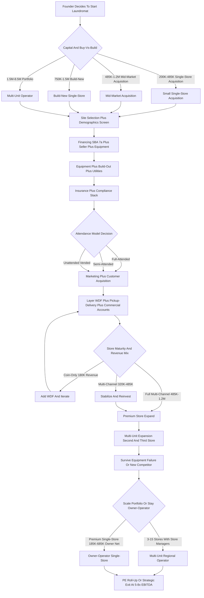

### Direct Answer

Starting a laundromat business in 2027 means acquiring or building a **brick-and-mortar self-service laundry** — buying an existing turnkey store for **$200K-$1.5M** (the dominant path, 75-85% of new operator deals) or building new for **$750K-$1.5M** — and operating it as a **semi-absentee, recurring-revenue business at 25-35% net margin**. The single biggest profit lever is **layering wash-and-fold, pickup-delivery, and commercial accounts** on top of coin/card self-service, which lifts revenue 30-60% over coin-only. Success is set the day you sign the lease: **renter density, household income $35K-$75K, no nearby competition, and utility-efficient equipment** determine whether you net $30K or $300K.

> **TL;DR**
> - **Capital:** $200K-$485K small turnkey acquisition, $485K-$1.2M mid-market, $750K-$1.5M new build. SBA 7(a) is the dominant financing path; **Live Oak Bank, Newtek, Celtic Bank, Byline Bank, ReadyCap, Pursuit Lending** actively lend to laundromats.
> - **Economics:** Mature store does $180K-$485K gross at 25-35% net ($45K-$170K SDE); WDF + pickup-delivery + commercial accounts push to $485K-$1.2M gross at 28-38% net.
> - **Hardest part:** Water bill ($1,500-$8,500/mo) is the largest variable expense after rent; site selection makes or breaks the business.
> - **Industry:** ~29,500 US laundromats, ~$5B annual revenue, ~$3.6B real estate value per the Coin Laundry Association.
> - **Biggest lever:** Wash-and-fold + pickup-delivery + commercial accounts — the difference between a $180K coin-only store and a $480K multi-channel store on the same site.

---

## Part 1 — Foundations: Market, Site, and Structure

A laundromat in 2027 is one of the last **truly semi-absentee, brick-and-mortar, recurring-revenue businesses** that still works at small-operator scale. The structural demand floor is the **renter population that lacks in-unit washer/dryer hookups** — still roughly **35-40% of US renters** per the US Census American Community Survey — plus tip-economy workers, multi-family residents, college students, RV/van-life travelers, and the growing **pickup-and-delivery convenience segment**. This section covers the market opportunity, the site-selection discipline that determines 70-85% of long-term profitability, and the legal and insurance structure every operator needs before deploying capital.

### 1.1 Market Size and Opportunity

A laundromat is a **brick-and-mortar self-service laundry** that owns or leases retail space (typically **1,500-3,500 sqft**), installs **20-60 commercial-grade washers and dryers**, and monetizes through **per-load coin/card revenue** plus increasingly through **wash-and-fold (WDF) drop-off**, **app-driven pickup-and-delivery**, and **commercial accounts**. Per the **Coin Laundry Association (CLA, coinlaundry.org)** — the dominant US trade body — the universe sits at approximately **29,500 stores generating ~$5B annual revenue on ~$3.6B of underlying real estate value**.

**The category is structurally durable.** Roughly **35-40% of US renters lack in-unit W/D hookups**, multi-family construction has held in-unit-W/D penetration below 60% in major metros, and the tip-economy workforce, students, immigrants, and Airbnb hosts create steady recurring demand. The honest 2027 demand reality is **bifurcated**: single-family suburban demand is shrinking as new builds default to in-unit W/D, while urban and dense renter demand is stable to growing.

**Revenue tiers** per CLA 2023-2024 data, plus *American Coin-Op* and *Planet Laundry* reporting:

| Operator profile | Annual gross revenue | Net margin | Annual SDE |
|---|---|---|---|
| Average mature coin/card store (1,500-2,500 sqft, 25-45 machines) | $180K-$485K | 25-35% | $45K-$170K |
| Strong operator (WDF + pickup-delivery + commercial accounts) | $485K-$1.2M | 28-38% | $135K-$455K |
| Multi-unit chain (per-store, centralized infrastructure) | $300K-$650K | 22-32% | varies |

**The WDF / pickup-delivery layer is the fastest-growing segment.** Apps like **2ULaundry, Rinse, Hampr, Mulberrys, Press, Tide Cleaners, WaveMAX, and SudShare (now Poplin)** have pulled the convenience segment from $0 to a multi-billion-dollar adjacent market in under a decade, and operators report a **30-60% revenue lift** from layering pickup-delivery on top of coin/card self-service. A coin-only store doing $180K and the same store doing $320K with WDF and commercial accounts share an identical site and equipment — the only difference is the service layer. This is why the 2027 entrant should never model coin-only economics: the durable, defensible store is the **multi-channel store**, and coin-only is best understood as the starting point of an upgrade path rather than a destination.

**The 2027 deal market is active.** Turnkey listings churn weekly on **BizBuySell, LoopNet, Laundromat Resource Marketplace, Crexi, Sunbelt Business Brokers, and Restaurant Brokers** at **$200K-$1.5M** asking prices. The four operators every new entrant studies: **Dave Menz** ("Laundromat Millionaire" book + podcast), **Jordan Berry** (Laundromat Resource podcast + community), **Brian Wallace** (Laundromat Resource founder), and **Wash Cycle Laundry** (B-Corp, Philadelphia). The PE consolidation thesis is real but slow — **Stewards Coin Laundry** and regional family offices pay **5-7x EBITDA** for mid-market multi-unit operators, but the fragmented small-operator universe (29,500 stores, ~90% single-owner) creates limited exit liquidity for sub-$80K-SDE single stores.

**Why the laundromat model still works in 2027.** The honest case rests on four structural facts. **First**, the renter base without in-unit W/D is large and slow-moving — even aggressive in-unit-W/D adoption in new construction takes decades to shift a metro's installed base of pre-2000 apartments. **Second**, the business is recession-resilient: laundry is non-discretionary, and downturns push renters toward laundromats rather than away. **Third**, the revenue is genuinely recurring — a customer who washes weekly is a 52-visit-per-year annuity, and WDF/commercial customers are contracted or habituated. **Fourth**, the business is utility-heavy but labor-light at the unattended end of the spectrum, which gives the operator a real choice between a high-margin/low-revenue and a high-revenue/lower-margin configuration. Operators who study adjacent recurring-revenue brick-and-mortar models — **self-storage (q9663)** and **co-working space (q9573)** — recognize the same fundamentals: location-bound demand, a heavy fixed-cost base, and slow PE roll-up. The difference is that a laundromat carries a far heavier variable utility load, which is precisely why utility efficiency dominates the margin equation.

### 1.2 Site Selection and Demographics

Site selection is the **single most consequential decision** in the laundromat business because **70-85% of long-term store profitability is set the day you sign the lease**. A great location with mediocre operations beats a mediocre location with great operations every time. The disciplined operator runs **15 specific demographic and physical screens** before committing capital.

**Demographic screens (1-8):**

| # | Screen | Target |
|---|---|---|
| 1 | Renter household density within 1 mile | 40%+ renter occupancy (US Census ACS, census-tract level) |
| 2 | Household income | $35K-$75K sweet spot |
| 3 | Population density | 3,000-15,000 per square mile |
| 4 | Competing laundromat radius | None within 0.75-1.5 miles |
| 5 | Daytime + evening foot traffic | Strong walk-by and drive-by |
| 6 | Immigrant / tip-economy population | High density |
| 7 | Multi-family complexes without in-unit W/D | Apartments built before 2000, rent under $1,800/mo |
| 8 | Proximity to college/university | Dorms or off-campus apartments nearby |

A competing laundromat within 0.75 mile cuts addressable demand by **30-55%** depending on operator strength, equipment vintage, and service hours. Below $35K income constrains discretionary WDF spend; above $75K shifts toward in-unit-W/D ownership or full-service convenience players. The sweet spot is **multi-family rental dominance** — apartment complexes, duplexes, triplexes, fourplexes, garden apartments, and mid-rise rental stock — rather than single-family ownership. First-generation immigrant communities and tip-economy workers (restaurant, hospitality, ride-share) skew heavily laundromat-dependent, and university students concentrated in dorms or off-campus housing create predictable weekly volume during the academic year.

**Physical screens (9-15):**

| # | Screen | Requirement |
|---|---|---|
| 9 | Footprint | 1,500-3,500 sqft |
| 10 | Visibility | High from arterial road; corner with stoplight + monument signage |
| 11 | Parking | 15-35 spaces near the door (customers carry multi-bag loads) |
| 12 | Access | Ground-floor street access (no second-floor or basement) |
| 13 | Water service | 2-4 inch incoming line, 80-110 PSI, adequate hot-water capacity |
| 14 | Gas service | Medium- or high-pressure gas line for gas-fired dryers |
| 15 | Electric service | 400-amp 3-phase 208V or 480V |

**Tools and discipline.** Use **Esri Business Analyst, PlacerAI, SafeGraph** for foot-traffic and demographic overlays, **CoStar and Crexi** for off-market sourcing, county GIS parcel data, municipal zoning maps, and the city planning department's residential development pipeline. The disciplined operator **walks the neighborhood at 6am, 11am, 4pm, 8pm, and 10pm**, **buys 6-12 loads at the nearest 3 competing laundromats** to assess equipment, cleanliness, WDF pricing, and payment systems, and **interviews 8-15 current customers** at competing stores to identify dissatisfaction signals (broken machines, dirty facility, no WDF, no card payment, poor parking).

### 1.3 Business Structure and Insurance

**Entity structure** follows small-business norms: a **single-member or multi-member LLC taxed as an S-corporation** dominates for owner-operators at $80K-$200K+ net business income (the S-corp election saves FICA on distributions). Multi-member LLCs need an operating agreement covering capital contributions, draw vs distribution mechanics, buy-sell, deadlock resolution, and exit triggers.

**Personal guarantee reality:** virtually every laundromat **SBA 7(a) loan, equipment financing (Eastern Funding, Live Oak Bank, North Mill Equipment Finance), commercial lease, utility deposit, and merchant-services agreement** will require a **personal guarantee** from the founder. The LLC does **not** insulate the founder from these obligations regardless of entity structure.

**The laundromat-specific insurance stack:**

| Coverage | Purpose | Year 1 annual premium |
|---|---|---|
| Commercial General Liability ($1M/$2M) | Slip-and-fall, customer injury | $2,500-$8,500 |
| Property / Building (if owned) | Replacement cost, 1,500-2,500 sqft | $3,500-$15,500 |
| Equipment / Business Personal Property | Washers, dryers, payment systems ($185K-$485K insured) | $4,500-$18,500 |
| **Water-Damage / Sewer Backup Rider** | **Broken hoses, drain backups — $15K-$185K events** | $1,500-$5,500 |
| Business Interruption | Revenue loss during equipment failure or fire | $2,500-$8,500 |
| Commercial Auto + Workers Comp + EPLI | Vehicles, attendants, employment claims | $5,100-$22,500 |
| Crime/Theft + Cyber + Umbrella + Product | Coin theft, PCI breach, garment damage | $5,700-$22,500 |

**Total Year 1 insurance load: $22,500-$85,500** for a single-store operator, scaling to **$55,000-$185,000** for a multi-unit operator. The **water-damage rider is non-negotiable** — broken washer hoses, drain backups, and water-heater failures cause catastrophic damage that standard property policies often exclude or sub-limit.

**Worker classification:** attendants, WDF workers, delivery drivers, and cleaning staff should almost always be **W-2 employees**. The **DOL 2024 Final Rule, IRS 20-factor test, and CA AB5** have produced **$25K-$150K+ back-tax assessments** for misclassified laundromat labor. Workers comp class codes: **NCCI 7421 (Laundry & Dry Cleaning)** for attendants and WDF workers, **NCCI 9014 (Building Service)** for cleaning crews, **NCCI 8810 (Clerical)** for admin. Operators who layer pickup-delivery face the same 1099-vs-W-2 risk as **short-term rental management (q9624)** and **commercial cleaning (q9610)** businesses — the safer path is W-2 with mileage reimbursement.

---

## Part 2 — Build-Out and Capital: Buy, Build, Equip, Power

The capital phase splits into four decisions: **buy an existing turnkey store or build new**, **which equipment brands to install**, **how to set up utilities** (the margin-defining variable), and **which payment system to deploy**. Each decision compounds — utility-efficient equipment plus a modern payment system can swing net margin by 8-12 points over a poorly equipped legacy store.

### 2.1 Buy Existing vs Build New

The buy-vs-build decision is the **single largest capital-allocation question** for new operators.

**Buy existing turnkey** is the dominant path (an estimated **75-85% of new operator deals**) at **$200K-$1.5M acquisition cost**. Pricing in 2027:

| Deal size | Multiple | Typical financing |
|---|---|---|
| Small store (under $80K SDE) | 3-5x SDE | SBA 7(a) + seller financing |
| Mid-market store ($80K-$200K SDE) | 5-7x SDE | SBA 7(a) + seller financing |
| Multi-unit portfolio (documented systems) | 5-8x EBITDA | SBA 7(a) + bank LOC + equity |

**SBA 7(a) financing dominates** because laundromats are SBA-friendly — collateralizable real estate or equipment, stable cash flow, and demonstrated owner SDE. Active SBA 7(a) laundromat lenders include **Live Oak Bank (a laundromat-specialty lender), Newtek, Celtic Bank, Byline Bank, ReadyCap Lending, Pursuit Lending, and TMC Financing** (a CDC for SBA 504). Terms run **10-25 years for real estate, 7-10 years for equipment + working capital, SBA-prime + 2.75-3.0%, 10-20% down**, plus SBA guarantee fees of 2.0-3.75%. **Seller financing** appears in an estimated **40-60% of small-store transactions**, typically **15-30% of purchase price at 7-9% over 5-10 years** behind the SBA primary lien.

**Buy-existing advantages:** immediate cash flow, an existing customer base, installed equipment, existing utility hookups, and demonstrated SDE for SBA underwriting. **Buy-existing risks:** deferred maintenance on aging equipment (10-15 year typical lifespan), legacy utility inefficiency, lease-assignment friction, and possible ADA/Title 24/OSHA non-compliance requiring capital cure post-close. The disciplined buyer runs **180-day due diligence** including a machine-by-machine condition assessment with a manufacturer-certified technician, a 12-24 month financial review (tax returns, bank statements, utility bills, payment-processor statements), a lease-assignment review, and an environmental Phase I.

**Build new** runs **$750K-$1.5M all-in:**

| Component | Cost range |
|---|---|
| Equipment (25-45 machines + hot water + payment systems + signage) | $200K-$485K |
| Build-out (HVAC, plumbing, 400-amp electrical, gas, finishes, ADA restroom) | $185K-$485K |
| Permitting + impact fees + plan review + utility hookup | $25K-$85K |
| Signage + branding + opening marketing | $25K-$85K |
| 6-12 months pre-opening + ramp working capital | $45K-$185K |

**Build-new advantages:** modern energy-efficient equipment (30-50% lower utility cost per load), cardless/coinless payment, modern customer experience, full ADA/Title 24/OSHA compliance, and 10-15 years of remaining useful life. **Build-new risks:** a 6-18 month build-out timeline during which capital earns no revenue, demographic risk on an unproven location, and a 12-24 month customer-awareness ramp. The honest 2027 default: **most first-time operators buy existing turnkey with an SBA 7(a) + seller-financing structure**, while multi-store operators selectively build new in demographic gap markets where no acquisition target exists. The buy-vs-build math mirrors what operators of **microgreens farms (q2152)** and **self-storage facilities (q9663)** face — proven cash flow versus a ramp risk.

### 2.2 Equipment Selection and Sourcing

Equipment selection drives **40-60% of long-term store profitability** because **water, gas, and electric per load is set by equipment efficiency**. The dominant commercial laundromat equipment brands:

| Brand | Parent / location | Positioning | New price per machine |
|---|---|---|---|
| **Dexter Laundry** | Dexter Apache Holdings (employee-owned ESOP), Iowa | Gold-standard build quality, T-Series washers/dryers | $4,500-$12,500 |
| **Speed Queen** | Alliance Laundry Systems, Wisconsin | Dominant global workhorse, Quantum Touch washers | $4,500-$12,500 |
| **Continental Girbau** | Girbau Group (Spain), Wisconsin | Dominant soft-mount washer-extractor | $4,500-$15,500 |
| **Huebsch** | Alliance Laundry Systems | Premium-distributor brand, longer warranties | $4,500-$12,500 |
| **Maytag/Whirlpool Commercial** | Whirlpool, Michigan | Lower-cost / lighter-duty | $2,500-$5,500 |
| **Wascomat / Electrolux Professional** | Electrolux Professional (Sweden) | Larger-capacity industrial + upscale builds | $4,500-$25,500 |

**Front-load vs top-load:** virtually all new commercial laundromats install **front-load washers** for their **30-50% lower water consumption** (10-18 gallons per load vs 25-45 for top-load), 40-60% higher G-force extraction (reducing dryer time and gas), and longer lifespan. **Soft-mount vs hard-mount:** soft-mount washers (Continental Girbau, Electrolux) allow upper-floor installation without reinforced foundations and reduce vibration; hard-mount washers cost 15-25% less but require concrete-slab installation. **Gas vs electric dryers:** gas dominates (~85-95% of new builds) because of **40-55% lower operating cost per load** at typical commercial utility rates.

**Ozone laundry systems** (Eco Laundry, Hydro Engineering) inject ozone into wash water to cut hot-water demand, claiming **20-35% water and gas savings** at $3,500-$8,500 per system. **Hot water heater capacity** is critical: a 25-45 machine store needs a **120-300 gallon commercial gas-fired heater** (A.O. Smith, Bradford White, Rheem, Lochinvar) at **$8,500-$25,500 installed**, plus a **water softener** (Culligan, Kinetico, Watts) at **$2,500-$8,500** to reduce limescale.

**Sourcing channels:** regional distributors dominate — including the publicly-traded **EVI Industries (NYSE AMERICAN: EVI)**, a commercial laundry equipment distributor for Dexter and Continental, plus the Alliance Laundry Systems and Continental Girbau distributor networks. Equipment can be sourced **new** (preferred for warranty and 10-15 year life), **reconditioned** (50-70% of new price, 1-3 year warranty), or **used** (25-45% of new price, no warranty — risky for primary operating equipment). **Total Year 1 equipment investment: $185K-$485K** for a 25-45 machine starter store, scaling to **$385K-$685K** for a premium 35-55 machine store with ozone, water softener, and modern payment systems.

### 2.3 Utilities: Water, Gas, and Electric Setup

Utilities are the **single largest variable expense after rent** and the **#1 lever for operating margin**. The honest reality every operator must model:

| Utility | Typical monthly consumption | Monthly bill | Key driver |
|---|---|---|---|
| **Water + sewer** | 2,500-15,500 gallons/day | **$1,500-$8,500** | Front-load efficiency, ozone, reclamation |
| Gas | 600-3,500 therms/month | $800-$3,500 | High-efficiency dryers + condensing heaters |
| Electric | 3,500-12,500 kWh/month | $500-$2,500 | LED lighting, smart-thermostat HVAC |

**Water is the dominant cost.** At $8-$18 per 1,000 gallons combined supply + sewer, and with some municipalities adding a **separate sewer-impact fee** on high-volume consumption, water alone can run $500-$2,500/month above baseline for a busy store. Disciplined operators install **front-load high-efficiency washers**, **ozone systems (20-35% reduction)**, **water reclamation systems (Aqua Recycle, $25K-$85K installed, 30-50% reduction)**, and **submetering on each washer** for per-machine utilization tracking.

**Utility hookup capacity requirements for new builds:**

| Service | Requirement | Upgrade cost from retail-grade |
|---|---|---|
| Water | 2-4 inch incoming, 80-110 PSI, backflow preventer (RPZ) | $15K-$85K |
| Gas | Medium- or high-pressure line for combined dryer + heater load | $15K-$45K |
| Electric | 400-amp 3-phase 208V or 480V | $25K-$85K |
| HVAC | 5-15 ton commercial RTU sized for moisture + heat load | $15K-$45K |

**Energy-efficiency incentives:** many utilities offer **Demand-Side Management (DSM) rebates** — typically $50-$485 per high-efficiency washer, $25-$185 per dryer, $1,500-$8,500 for a high-efficiency hot water heater, and $25K-$85K for a water reclamation system. **Energy Star Commercial Laundry Equipment** ratings (energystar.gov) identify rebate-eligible models. The disciplined operator works with a **utility account representative** during build-out to capture every available rebate and uses **utility-monitoring platforms (EnergyCAP, Hatch Data)** to catch equipment failures — a broken inlet valve, dirty dryer venting, worn motor bearings — before they generate runaway bills.

### 2.4 Payment Systems and Coin/Card Infrastructure

Payment systems are the **operational backbone** and the **single biggest customer-experience differentiator** in 2027. The category has shifted from coin-only (through 2010-2015) to coin + card (2015-2022) to **coin + card + app (the current 2022-2027 standard)**, with leading operators going **cardless/coinless via app + QR + tap-to-pay** in select markets.

**Dominant US payment-system vendors:**

| Vendor | Notes |
|---|---|
| **CCI / Card Concepts (Setomatic SpyderWash)** | Historically dominant card-system vendor; reader + kiosk + back-office portal |
| **ESD / Esd Magnetek** | Competing card-system vendor with similar architecture |
| **PayRange** | Bluetooth retrofit adapter — pay via app on existing coin machines at $185-$485/machine |
| **Kiosoft (CleanPay)** | Modern cloud-based card + app + back-office system |
| **FasCard** | Card + app retrofit system competing with PayRange |
| **Cantaloupe (NASDAQ: CTLP)** | ePort cashless processor expanding into laundry from vending |

**Payment architecture decisions:** coin-only has zero install cost but maximum customer friction and theft risk (rare in 2027 new builds). Coin + card costs **$1,500-$3,500/machine plus a central system** and reduces friction. **Coin + card + app** — the 2022-2027 new-build standard — delivers the lowest friction (app payment, value reload from phone, push-notification on cycle completion) and broadest customer base. Cardless/coinless via app is growing in upscale, brand-driven concepts.

Disciplined operators default to **coin + card + app** with **PayRange, Kiosoft, or CCI** as the central platform. **PCI compliance** is handled by the vendor via tokenization and encrypted processing. Card/app payments route through a **merchant processor (Stripe, Square, Worldpay, Heartland)** at **1.8-3.2% per transaction** plus a monthly platform fee. Modern systems include a **cloud back-office portal** for real-time machine utilization, revenue reporting, fault alerts, refund processing, and loyalty programs — letting operators identify underutilized machines to relocate, high-utilization machines to replicate, and broken machines to service before customers complain.

---

## Part 3 — Operations: Staffing, Revenue Layers, Marketing, Compliance

Once the store is built and powered, day-to-day economics turn on four operational systems: the **attendance model** (the labor-cost decision), the **WDF/pickup-delivery/commercial-accounts layer** (the revenue and margin lever), **local marketing**, and the **compliance posture** that keeps ADA lawsuits and OSHA citations off the P&L.

### 3.1 Attendance Models and Staffing

The attendance model is the **biggest operational decision beyond site and equipment** — it dictates labor cost, customer experience, security posture, WDF capability, and operator time commitment.

| Model | Hours staffed | Annual labor cost | Typical gross revenue | Net margin |
|---|---|---|---|---|
| **Full-attended** | All operating hours (6am-10pm or 24/7), 1-3 attendants | $45K-$185K | $285K-$1.2M | 22-32% |
| **Semi-attended** | Peak hours only (8am-2pm, 5pm-9pm), 1 attendant | $25K-$65K | $185K-$485K | 25-35% |
| **Unattended / vended** | No attendant; 24/7 keycard/app access + cameras | $5K-$15K | $165K-$385K | 30-40% |

**Full-attended** delivers the strongest customer experience, security posture, and WDF capability — an attendant deters theft and processes drop-off orders — but labor becomes the dominant expense after rent and utilities. **Semi-attended** balances peak-hour service with off-peak technology coverage. **Unattended** delivers the highest margin per revenue dollar through labor savings, but lower absolute revenue per store and higher theft/loitering risk mitigated by camera coverage, signage, and visible alarms.

**Staffing reality:** attendant labor is a high-turnover, low-wage segment. Disciplined operators **pay above local market rate ($16-$22/hour vs $13-$15)**, provide consistent scheduling, offer light benefits, and treat attendants as **front-line customer ambassadors** rather than commodity labor. Hiring channels include Indeed, ZipRecruiter, local Facebook groups, and employee referral programs. Training runs 1-2 weeks on machine operation, customer service, WDF processing, cash handling, opening/closing, and emergency response. Multi-store operators promote attendants to **store manager at $40K-$65K** plus a bonus tied to store revenue and margin.

### 3.2 Wash-and-Fold, Pickup-Delivery, and Commercial Accounts

WDF + pickup-delivery + commercial accounts are the **single biggest revenue and margin lever** — the difference between a **$180K coin-only store and a $480K multi-channel store** on the same equipment and site.

**Wash-and-fold (WDF):** the customer drops off dirty laundry; the store washes, dries, folds, and bags within a typical 24-hour turnaround. Pricing in 2027 runs **$1.25-$2.25/lb** at small-store pricing, **$1.85-$2.95/lb** urban/premium, and **$2.50-$4.50/lb** for same-day rush. **Margins run 20-40% gross** depending on folder productivity (25-65 lbs/hour) and utility efficiency. Disciplined operators capture **15-35% of total store revenue from WDF**.

**Pickup-and-delivery:** the customer schedules a pickup via app; a driver collects, the store processes WDF, and the driver returns it. Pricing runs **$1.75-$3.25/lb plus a $5-$25 pickup fee**, or a **subscription model at $85-$185/month**. **Margins run 15-30% gross** after delivery overhead, but absolute revenue per customer is higher — a pickup-delivery customer spends **$185-$485/month** vs a walk-in WDF customer at **$45-$185/month**. Dominant operator software: **CleanCloud** (UK-based, dominant global POS + customer app), **Curbside Laundries** (US POS + delivery management), and **Cents** (modern cloud POS + back-office). The pickup-delivery driver is typically **W-2 at $16-$22/hour + mileage**, with classification risk if treated as 1099.

**Commercial accounts:** stable recurring revenue from **gyms, salons, spas, Airbnb hosts, small hotels, restaurants, sports teams, medical offices, dog groomers, and barber shops**. Pricing runs **$0.85-$1.85/lb** at commercial volume tiers with **3-12 month contracts** and scheduled pickup-delivery 1-3 times per week. **Margins run 18-32% gross** with **higher predictability than retail WDF** because of contracted volume. Acquisition runs through direct sales to property managers, partnerships with **commercial cleaning companies (q9610)** and **short-term rental managers (q9624)**, and chamber-of-commerce networking.

**The blended multi-channel model** disciplined operators target:

| Revenue layer | Share of revenue | Gross margin |
|---|---|---|
| Self-service coin/card/app | 60-75% | 30-40% |
| Walk-in WDF | 15-25% | 20-40% |
| Pickup-delivery | 5-15% | 15-30% |
| Commercial accounts | 5-15% | 18-32% |

### 3.3 Marketing and Local Customer Acquisition

Marketing for a laundromat is **dominantly local, repeat, and walk-in driven** with minimal advertising spend for the self-service business, but meaningful B2B/B2C marketing for WDF, pickup-delivery, and commercial accounts.

**Local SEO and Google Business Profile** is the dominant channel — **"laundromat near me" search dominates discovery**. The disciplined operator maintains a GBP with accurate hours, interior/exterior/equipment photos, review responses within 24 hours, and weekly posts highlighting WDF and pickup-delivery. **Google Reviews drive 75-90% of new walk-in customer decisions** — operators with **75+ reviews at 4.5+ stars** dominate local search. Cultivation tactics: in-store QR codes linking to a review form, attendant verbal requests at WDF pickup, and post-transaction text messages via the Kiosoft/PayRange/Cents app.

**Paid channels:** Google Local Service Ads ($3.50-$12.50 per lead), standard Google Ads ($2.50-$8.50 CPC for "wash and fold delivery" intent), and Facebook Local Awareness Ads ($15-$45/day to a 1-3 mile radius). **Apartment-complex partnerships** put first-load-free coupons in new-resident welcome packets (50-200 units per property). **School partnerships** secure Greek-life laundry contracts and dorm pickup-delivery. **Loyalty and referral programs** ("10th load free," $10 referral credit) integrated through PayRange/Kiosoft/Cents systematize word-of-mouth — the dominant acquisition driver for laundromats. **Typical marketing spend: $500-$1,500/month** for a single store — far lower than service-business spend because of local walk-in dominance and repeat recurring revenue. Operators expanding into pickup-delivery study local-services marketing playbooks shared with **junk removal (q9586)** and **soft wash roof cleaning (q2151)** businesses, where Google Business Profile is similarly decisive.

### 3.4 Compliance: ADA, Title 24, OSHA, and Safety

Compliance covers **federal accessibility, state energy codes, local zoning, fire/life safety, OSHA workplace safety, EPA dryer venting, and consumer-finance payment regulations**.

**ADA (Americans with Disabilities Act)** is the most consequential federal regime. The **2010 ADA Standards for Accessible Design** require accessible parking (1 per 25 spaces, plus van-accessible), 32-inch clear-door-width entry, a 36-inch circulation path through machines with a 60-inch turning radius, at least one front-loading machine with controls in the 15-48 inch reach range, accessible folding tables (28-34 inch height with knee clearance), an accessible restroom, and raised-character/Braille signage. **ADA Title III private-right-of-action lawsuits target laundromats aggressively** in California, New York, and Florida with **$5K-$50K settlement demands**. The disciplined operator uses a **Certified Access Specialist (CASp) inspection** (California) or an ADA consultant (other states) during pre-purchase due diligence and before opening.

**Title 24 California Energy Code** imposes stringent California-specific efficiency requirements on lighting, HVAC, water heating, and ventilation — California builds must engage a Title 24 energy consultant during permitting. **Local zoning** typically requires a commercial/retail permit, sometimes a conditional use permit, parking-minimum compliance, a signage permit, and a business license. **Fire/life safety:** dryer venting and lint-trap management fall under fire-marshal inspection for the occupancy permit.

**OSHA workplace safety** (29 CFR 1910) covers employee exposure to laundry chemicals, lint, heat stress in a high-humidity environment, noise (washer/dryer operation can exceed 85dB), ergonomic safety from lifting heavy loads, and lockout-tagout for equipment service. **EPA compliance** covers Clean Air Act dryer venting and Clean Water Act wastewater discharge — high-volume operations may need an EPA NPDES permit. **Reg E** governs card/app payment surcharge disclosure. Disciplined operators engage a local commercial real estate attorney, an ADA consultant, an insurance broker, an accountant, and a payroll service (Gusto, ADP, Paychex) to maintain compliance across every dimension.

---

## Part 4 — Growth, Exit, and the Counter-Case

The final stage covers how single-store operators scale into multi-unit portfolios, what laundromats actually sell for, and — critically — when the laundromat model fails and who should not buy one.

### 4.1 Multi-Unit Expansion and Scale Milestones

Single-store operations cap at a typical **$185K-$685K annual SDE** for a strong multi-channel operator. **Multi-unit expansion** is the path to **$685K-$3.8M+ annual EBITDA** at 3-15 store scale.

| Phase | Years | Operator role | Structure |
|---|---|---|---|
| Single-store | Year 1-3 | Founder operates store | Develop standardized SOPs |
| Second store | Year 3-5 | Founder splits time | Promote store manager at first store |
| Third-fifth store | Year 4-7 | Multi-unit operator | Store managers + regional ops + centralized back-office |
| 6+ store scale | Year 6-10 | CEO / portfolio operator | VP Operations, VP Sales, Director of Marketing, Director of Finance |

**Scale economics** capture cost advantages on equipment purchasing (5-15% bulk discounts), insurance (10-20% below per-store equivalents), centralized accounting/payroll/HR (50-70% savings), centralized marketing, and full-time executive talent. **Common multi-unit models:** an independent regional operator (3-15 stores in one metro, the most common path); a multi-market regional operator (8-35 stores); a **franchise operator** (WaveMAX, Spin Laundry Lounge — franchise fee $25K-$85K, royalty 4-8%, marketing contribution 1-3%); or a **PE-backed roll-up** (Stewards Coin Laundry, family-office aggregators acquiring at 5-7x EBITDA). Capital comes from **SBA 7(a) loans up to $5M**, regional bank CRE loans, **equipment lease lines from Eastern Funding** (the dominant laundromat equipment finance lender), and working-capital lines of credit at SOFR + 2-4%. Disciplined operators reinvest **50-70% of cash flow** during the Year 3-7 scale phase, then shift toward distributions at mature 8+ store scale.

### 4.2 PE and Strategic Exit Math

Exit multiples vary by scale, location quality, equipment vintage, revenue mix, and growth profile:

| Operator profile | Exit multiple | Typical buyer |
|---|---|---|
| Single-store small (under $80K SDE) | 3-5x SDE | First-time operator, family office, local competitor |
| Mid-market single-store ($80K-$200K SDE) | 5-7x SDE | Mid-market buyer, 2-5 store local operator |
| Small multi-unit (2-5 stores) | 5-7x EBITDA | Regional PE-backed roll-up |
| Mid-market multi-unit (6-15 stores) | 6-8x EBITDA | PE platform, strategic operator |
| Large multi-unit (15+ stores) | 6-9x EBITDA | Major PE, public laundry-services consolidator |

There are **few pure public-market comparables** — most public laundry exposure is **Alliance Laundry Systems** (parent of Speed Queen, Huebsch, UniMac), **EVI Industries (NYSE AMERICAN: EVI)** as an equipment distributor, and **Cintas (NASDAQ: CTAS)** as an adjacent uniform/linen services player rather than a direct laundromat operator.

**Exit valuation drivers:** store count and geographic density; **revenue mix diversification** (WDF + pickup-delivery + commercial accounts command a higher multiple than coin-only); equipment vintage and remaining useful life; lease term and renewal options; compliance posture and audit history; financial reporting quality (cash-only undocumented operations create a significant discount); modern WDF/pickup-delivery technology; and staff continuity with documented SOPs. The honest 2027 reality: **most laundromat operators choose owner-operator continuation** rather than exit, because a 5-7x EBITDA multiple at small-mid scale — net of capital gains tax and transition friction — is often less attractive than continued **$45K-$685K annual owner net income** at 25-35% net margin.

### 4.3 Counter-Case: When a Laundromat Fails and Who Should Not Buy One

A laundromat is **not a passive ATM**, and the failure modes are concrete and predictable. Do not buy or build a laundromat if any of the following describe you or the deal:

| Failure mode | What goes wrong |
|---|---|
| **Underestimating the water bill** | A $4K-$8K/month water bill on legacy top-load equipment crushes margin; many buyers model coin revenue but never pull 12 months of utility bills before closing. |
| **Bad location** | A competing laundromat within 0.75 mile, declining renter density, or a market shifting to in-unit W/D cuts demand 30-55% — and a lease cannot be undone. |
| **Equipment failure shock** | Replacing a single 60lb washer costs $8K-$15K; a store of aging machines can need $50K-$150K of capex in the first two years. |
| **The operational grind** | Broken machines, loitering, coin/card theft, 24/7-access security incidents, vandalism, and 6am attendant call-outs are constant — this is a hands-on business, not mailbox money. |
| **In-unit W/D trend** | Single-family suburban demand is structurally shrinking; a suburban location betting on coin-only volume is fighting the demographic tide. |
| **Thin due diligence** | Buying on a broker's pro forma without tax returns, bank statements, payment-processor data, a machine-by-machine inspection, and a lease-assignment review routinely produces a 30-50% revenue surprise post-close. |

**When NOT to do this:** if you cannot personally cover a **$25K-$50K unplanned capex event** in Year 1, if you are unwilling to walk competing stores at 6am and 10pm before signing, if you expect zero operational involvement, or if the only available locations are in suburban single-family markets without renter density — a laundromat is the wrong business. A higher-throughput, lower-fixed-cost local-services model such as **junk removal (q9586)**, **commercial cleaning (q9610)**, or **mobile bike repair (q9587)** may fit better. Conversely, operators who want a destination-venue model with similar real-estate intensity sometimes pivot toward **wine bars (q9607)** or **barcades (q9644)** — different demand drivers, similar location discipline. **Net:** a laundromat is viable in 2027 as a disciplined, location-rigorous, utility-efficient, WDF-layered, real-numbers-tracked recurring-revenue business — and a poor fit for anyone who underestimates water bills, equipment failure, the in-unit-W/D trend, or the operational grind.

---

## The Operating Journey: From Site Selection to Stabilized Multi-Channel Laundromat

---

## Sources

1. **Coin Laundry Association (CLA)** — Dominant US trade association; ~29,500 US stores, ~$5B annual revenue, ~$3.6B real estate value. https://www.coinlaundry.org
2. **American Coin-Op Magazine** — Major US industry trade publication for laundromat operators. https://americancoinop.com
3. **Planet Laundry Magazine** — Coin Laundry Association industry publication. https://planetlaundry.com
4. **Laundromat Resource (Brian Wallace, Jordan Berry)** — Major laundromat education, community, podcast, and marketplace platform. https://laundromatresource.com
5. **Dave Menz "Laundromat Millionaire"** — Industry book, podcast, and community on acquisition, operations, and scaling. https://laundromatmillionaire.com
6. **Dexter Laundry (Dexter Apache Holdings)** — Iowa-based employee-owned commercial laundry equipment manufacturer; gold-standard T-Series washer-extractors. https://www.dexter.com
7. **Speed Queen (Alliance Laundry Systems)** — Wisconsin-based dominant global commercial laundry manufacturer; Quantum Touch washers. https://www.alliancelaundry.com
8. **Continental Girbau** — Wisconsin-based commercial laundry manufacturer (Girbau Group, Spain); dominant soft-mount washer-extractor brand. https://www.continentalgirbau.com
9. **Huebsch (Alliance Laundry Systems)** — Premium-distributor commercial laundry brand with strong dealer support and longer warranties. https://www.huebsch.com
10. **Whirlpool Commercial Laundry / Maytag Commercial** — Michigan-based commercial laundry brand at the lower-cost / lighter-duty end. https://www.whirlpoolcommerciallaundry.com
11. **Wascomat (Electrolux Professional)** — Swedish-parent commercial laundry brand; Crossover and Encore series. https://www.wascomat.com
12. **Electrolux Professional** — Premium European-engineered commercial laundry equipment. https://www.electroluxprofessional.com
13. **CCI / Card Concepts (Setomatic SpyderWash)** — Dominant card-payment-system vendor; reader + kiosk + back-office portal. https://www.cardconceptsinc.com
14. **ESD / Esd Magnetek** — Competing card-payment-system vendor with similar architecture. https://www.esdcard.com
15. **PayRange** — Bluetooth retrofit adapter enabling app payment on legacy coin machines. https://www.payrange.com
16. **Kiosoft (CleanPay)** — Modern cloud-based card + app + back-office payment system. https://www.kiosoft.com
17. **FasCard** — Card + app retrofit payment system. https://www.fascard.com
18. **CleanCloud** — UK-based dominant POS and customer app for laundromats globally. https://www.cleancloud.com
19. **Curbside Laundries** — US-based POS, customer app, and delivery management for pickup-delivery WDF. https://www.curbsidelaundries.com
20. **Cents** — Modern cloud POS, customer app, and back-office for laundromats. https://www.trycents.com
21. **2ULaundry** — Major US laundromat pickup-and-delivery operator and service network. https://www.2ulaundry.com
22. **Rinse** — Major US laundromat pickup-and-delivery operator across multiple metros. https://www.rinse.com
23. **Hampr** — Pickup-and-delivery laundry service operator. https://www.hampr.com
24. **SudShare / Poplin** — Peer-to-peer pickup-and-delivery laundry marketplace. https://www.poplin.co
25. **WaveMAX** — Laundromat franchise network with brand, system, and supply-chain support. https://www.wavemaxlaundry.com
26. **Spin Laundry Lounge** — Portland upscale laundromat concept with premium customer-experience design. https://www.spinlaundrylounge.com
27. **Stewards Coin Laundry** — PE-backed regional laundromat roll-up consolidator acquiring at 5-7x EBITDA. https://www.stewardscoin.com
28. **Eastern Funding** — Dominant laundromat equipment finance lender for new and used equipment. https://www.easternfunding.com
29. **Live Oak Bank** — Major SBA 7(a) lender with a dedicated laundromat industry team. https://www.liveoakbank.com
30. **Newtek SBA Lending** — Major SBA 7(a) lender for laundromat acquisitions and builds. https://www.newtekone.com
31. **Celtic Bank** — Major SBA 7(a) lender for laundromat financing. https://www.celticbank.com
32. **Byline Bank** — SBA 7(a) preferred lender active in laundromat financing. https://www.bylinebank.com
33. **ReadyCap Lending** — SBA 7(a) lender for small-business and laundromat acquisitions. https://www.readycapital.com
34. **Pursuit Lending** — SBA 7(a) and small-business lender for laundromat financing. https://www.pursuitlending.com
35. **EVI Industries (NYSE AMERICAN: EVI)** — Publicly-traded commercial laundry equipment distributor for Dexter, Continental, and other brands. https://www.eviind.com
36. **Cantaloupe (NASDAQ: CTLP)** — Cashless payment processor expanding from vending into laundry. https://www.cantaloupe.com
37. **Cintas (NASDAQ: CTAS)** — Public commercial uniform and linen services company, adjacent to laundromat operations. https://www.cintas.com
38. **US Census American Community Survey (ACS)** — Federal demographic data for renter density, household income, and population density screens. https://www.census.gov/programs-surveys/acs
39. **BizBuySell** — Dominant US business-for-sale marketplace with active laundromat listings at $200K-$1.5M typical pricing. https://www.bizbuysell.com
40. **2010 ADA Standards for Accessible Design** — Federal accessibility requirements for laundromat parking, entry, circulation, machines, restroom, and signage. https://www.ada.gov/law-and-regs/design-standards/2010-stds
41. **US Small Business Administration — SBA 7(a) Loan Program** — Federal loan-guarantee program; the dominant laundromat acquisition and build financing path. https://www.sba.gov/funding-programs/loans/7a-loans
42. **Energy Star Commercial Laundry Equipment (EPA)** — Federal efficiency ratings identifying rebate-eligible commercial washers and dryers. https://www.energystar.gov/products/commercial_laundry
43. **California Energy Code — Title 24** — California-specific commercial energy-efficiency standards for lighting, HVAC, water heating, and ventilation. https://www.energy.ca.gov/programs-and-topics/programs/building-energy-efficiency-standards
44. **OSHA 29 CFR 1910 General Industry Standards** — Federal workplace-safety standards covering chemical, lint, heat, noise, and ergonomic exposure in laundry operations. https://www.osha.gov/laws-regs/regulations/standardnumber/1910
