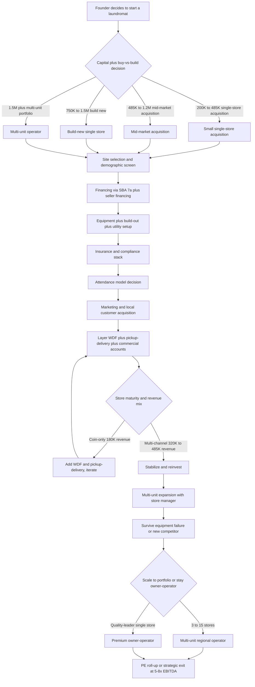

### Direct Answer

Starting a laundromat in 2027 means buying an existing turnkey store for **$200K-$1.5M** (the dominant path, 75-85% of new-operator deals) or building new for **$750K-$1.5M**, financed mainly through an **SBA 7(a) loan** plus seller financing, in a location chosen for renter density, $35K-$75K household income, and no nearby competition. A disciplined operator runs a 1,500-2,500 sqft store with 25-45 commercial washers and dryers at **25-35% net margin on $200K-$1M annual revenue**, and the single biggest profit lever is layering **wash-and-fold, app-driven pickup-delivery, and commercial accounts** on top of coin/card self-service to grow revenue 30-60% over coin-only. Site selection and utility efficiency — the **$2K-$8K monthly water bill is the largest variable expense after rent** — make or break the business.

> **TL;DR**
> - **Capital:** $200K-$1.5M to buy a turnkey laundromat; $750K-$1.5M to build new with Dexter, Speed Queen, Continental Girbau, or Huebsch equipment. SBA 7(a) is the dominant financing path via Live Oak Bank, Newtek, Celtic Bank, Byline Bank, ReadyCap, and Pursuit Lending.
> - **Economics:** A mature store does $200K-$1M annual revenue at 25-35% net margins. WDF plus pickup-delivery plus commercial accounts add 30-60% revenue over coin-only and are the #1 profit lever.
> - **Hardest part:** Site selection (renter density, $35K-$75K income, no competition within 1 mile, parking, visibility) and the water bill. A great location with mediocre operations beats a mediocre location with great operations every time.
> - **Best fit:** Operators who want a semi-absentee, recurring-revenue, brick-and-mortar business and who treat utility math, equipment reliability, and demographic rigor as the core discipline.
> - **Worst fit:** Anyone who underestimates water bills, equipment failure ($8K-$15K to replace one 60lb washer), in-unit-W/D trends in new construction, or the grind of broken machines, loitering, and coin/card theft.

A laundromat in 2027 is one of the last **truly semi-absentee, brick-and-mortar, recurring-revenue businesses** that still works at small-operator scale. The **Coin Laundry Association (CLA)** tracks roughly **29,500 US laundromats generating about $5B in annual revenue on roughly $3.6B of underlying real estate value**. The structural demand floor is the renter population that lacks in-unit washer/dryer hookups — still about **35-40% of US renters** per the US Census American Community Survey — plus tip-economy workers, students, immigrants, RV and van-life travelers, and the fast-growing pickup-and-delivery convenience segment. This guide walks the full operating journey from site selection through stabilized multi-channel operations and exit.

---

## PART 1 — FOUNDATIONS

### 1.1 Market Size and Opportunity

A laundromat in 2027 is a **brick-and-mortar self-service laundry business** that owns or leases retail space — typically **1,500-3,500 sqft** — installs commercial-grade washers and dryers — typically **20-60 machines** — and monetizes through **per-load coin/card/app revenue** plus increasingly through wash-and-fold (WDF) drop-off, app-driven pickup-and-delivery, and commercial accounts. Per the **Coin Laundry Association (CLA, coinlaundry.org)**, the dominant US trade association, the laundromat universe sits at roughly **29,500 stores generating about $5B annual revenue on roughly $3.6B of real estate value**, with the typical store generating **$200K-$1M per year gross revenue at 25-35% net margins** under a disciplined owner.

**The category is structurally durable.** About **35-40% of US renters lack in-unit washer/dryer hookups** per US Census American Community Survey data; multi-family construction has held in-unit-W/D penetration below 60% of new builds in major metros; and the tip-economy workforce, students, immigrants, RV travelers, and Airbnb short-term-rental hosts create steady recurring demand. The WDF and pickup-delivery layer — driven by apps like **2ULaundry, Rinse, Hampr, Mulberrys, Press, Lapels, Tide Cleaners, WaveMAX, SudShare, and Poplin** — has pulled the convenience segment from near zero to a multi-billion-dollar adjacent market in under a decade.

**The honest 2027 demand reality is bifurcated.** Single-family suburban demand is shrinking as new construction defaults to in-unit W/D and middle-income families buy homes with hookups. Urban and dense renter demand is stable to growing as multi-family construction continues without universal in-unit W/D. WDF plus pickup-delivery is the fastest-growing segment, with operators reporting **30-60% revenue lift** from layering it on top of coin/card self-service.

**The category's defining strength is recession and inflation resilience.** Laundry is a non-discretionary need — clothes must be washed regardless of the economic cycle — and a downturn that pushes households to delay buying a home or moving into cheaper rental housing actually *expands* the laundromat customer base. Inflation flows through to the operator as well: per-load and per-pound prices can be raised to track utility-cost increases, and with modern card-and-app pricing those increases can be implemented instantly. This combination of stable demand and pricing power is why laundromats hold their value through cycles that devastate discretionary retail, and it is the core of the investment thesis for the disciplined operator and the PE consolidator alike.

| Store Type | Footprint | Machines | Annual Gross Revenue | Net Margin | Annual SDE |
|---|---|---|---|---|---|
| Average coin-only laundromat | 1,500-2,500 sqft | 25-45 | $180K-$485K | 25-35% | $45K-$170K |
| Strong WDF + pickup-delivery store | 1,500-2,500 sqft | 30-50 | $485K-$1.2M | 28-38% | $135K-$455K |
| Multi-unit chain store (per store) | 1,500-3,000 sqft | 30-50 | $300K-$650K | 22-32% | $80K-$210K |

**The 2027 turnkey-acquisition market is active.** Listings on **BizBuySell, LoopNet, Laundromat Resource Marketplace, Crexi, Sunbelt Business Brokers, and local commercial brokers** show **$200K-$1.5M asking prices** for single-store deals priced at **3-5x SDE for small stores, 5-7x SDE for mid-market, and 5-8x EBITDA for multi-unit portfolios**. The PE consolidation thesis is real but slow: roll-up players pay **5-7x EBITDA for mid-market multi-unit operators**, but the fragmented small-operator universe — 29,500 stores, roughly 90% single-owner — creates limited exit liquidity for sub-$80K-SDE single stores.

**The unit economics are best understood as a fixed-cost business with a variable-cost overlay.** Rent, insurance, the base attendant schedule, and equipment debt service are largely fixed once the store opens; water, gas, electric, supplies, and incremental WDF labor scale with volume. This structure means the store has a hard breakeven — typically **$110K-$210K of annual revenue** for a small single-store operation — below which it loses money every month, and strong operating leverage above breakeven where each incremental dollar of revenue drops 45-65% to the bottom line. The disciplined operator models the breakeven explicitly before closing, because a store priced on optimistic seller projections that actually runs near breakeven will not service SBA debt. The honest framing for a first-time operator: a laundromat is a real estate and utility-arbitrage business wearing a retail storefront, and the operator who treats it as a passive coin-counting exercise rather than a margin-management discipline will underperform the category badly.

**Demand is not uniform across the country.** Dense coastal and Sun Belt metros with large renter populations, high immigration, and a strong tip economy support healthy laundromat demand; aging Midwestern small towns with falling population and rising homeownership do not. The operator who buys a store must underwrite the *trajectory* of the surrounding neighborhood over a 10-year hold, not just its current snapshot, because a store bought into a gentrifying neighborhood where renters are being displaced by condo conversion will see its customer base erode no matter how well it is run. The starting-a-business decision rhymes with adjacent location-driven concepts such as a vending machine route (q1937), a self-storage facility (q1969), and a thrift store (q1957).

### 1.2 Site Selection and Demographics

Site selection is the **single most consequential decision** in the laundromat business because **70-85% of long-term store profitability is set the day you sign the lease or close on the real estate**. A disciplined operator runs 8-15 specific demographic and physical screens before committing capital.

**Demographic screens** target the renter-dependent customer base. The sweet spot is multi-family rental dominance — apartment complexes, duplexes, triplexes, fourplexes, garden apartments, mid-rise rental — rather than single-family ownership. **Physical screens** confirm the building can actually house a commercial laundry without crippling utility-upgrade costs.

| # | Screen | Target Threshold |
|---|---|---|
| 1 | Renter household density within 1 mile | 40%+ renter occupancy (US Census ACS tract data) |
| 2 | Household income | $35K-$75K sweet spot |
| 3 | Population density | 3,000-15,000 per square mile |
| 4 | Nearest competing laundromat | None within 0.75-1.5 miles |
| 5 | Footprint | 1,500-3,500 sqft, ground-floor street access |
| 6 | Parking | 15-35 near-door spaces |
| 7 | Visibility | Corner / arterial with monument signage |
| 8 | Water service | 2-4 inch incoming line, 80-110 PSI |
| 9 | Gas service | Medium- or high-pressure commercial line |
| 10 | Electric service | 400-amp 3-phase 208V or 480V |

**A competing laundromat within 0.75 mile cuts addressable demand by 30-55%** depending on operator strength, equipment vintage, and service hours. Tools for site selection include **Esri Business Analyst, PlacerAI, and SafeGraph** for demographic and foot-traffic overlays; **CoStar, LoopNet, and Crexi** for listings; **county GIS parcel data and municipal zoning maps**; and the **Laundromat Resource Site Selection Toolkit**. Disciplined operators **walk the neighborhood at 6am, 11am, 4pm, 8pm, and 10pm** to observe real foot traffic, competing-store utilization, parking, and safety; **buy 6-12 loads at the nearest three competing laundromats** to assess condition, cleanliness, service, and pricing; and **interview 8-15 current customers** at competitors to surface dissatisfaction signals — broken machines, dirty facility, no WDF, no card payment, poor security, limited hours.

**Lease structure is as consequential as the location itself.** A laundromat is a heavy build-out tenant — utility upgrades, plumbing, and equipment installation can sink $300K-$700K of immovable improvements into a leased space — so the operator needs a **lease term plus renewal options totaling 15-25 years** to amortize that investment safely. A 5-year lease with no options is a trap: at renewal the landlord holds all the leverage and can extract a rent increase that erases the store's margin, or refuse to renew and strand the build-out. The disciplined operator negotiates **fixed or capped annual escalators (2-3%, not CPV-uncapped), an exclusivity clause barring a competing laundromat in the same shopping center, a co-tenancy provision tied to anchor occupancy, an assignment clause that permits a future sale of the business, and a personal-guarantee burn-off** after 24-36 months of demonstrated performance. Landlords sometimes contribute a **tenant improvement allowance** for utility upgrades; this should always be requested.

**The competition radius deserves a deeper read than a simple count of nearby stores.** A weak, dirty, cash-only competitor with 1990s top-load equipment within 0.5 mile is barely competition at all — a well-run modern store will pull its customers within 6-12 months. A strong, clean, attended, WDF-equipped competitor with modern front-load machines is a genuine moat that should make the operator walk away from the site. The customer-interview step is the single most undervalued part of due diligence: customers at a competing store will tell a prospective operator exactly what is wrong with the incumbent and exactly what would make them switch, which is effectively free market research that de-risks the entire site decision.

### 1.3 Business Structure and Insurance

Entity structure follows small-business norms. The **LLC taxed as an S-corporation** dominates for owner-operators at $80K-$200K+ net business income, because the S-corp election saves FICA on distributions. A **multi-member LLC with an operating agreement** is standard for partnerships, covering capital contributions, sweat equity, draw-versus-distribution mechanics, buy-sell terms, deadlock resolution, and exit triggers. Sole proprietorship is workable for a very small single store but exposes the owner to personal liability on slip-and-fall, equipment fire, water damage, employee injury, and ADA claims.

**The personal-guarantee reality is unavoidable.** Virtually every SBA 7(a) loan, equipment financing agreement, commercial lease, utility deposit, and merchant-services agreement requires a **personal guarantee** from the founder. The LLC entity does **not** insulate the founder from personal liability on those obligations regardless of structure.

| # | Coverage | Annual Premium (single store) | Why It Matters |
|---|---|---|---|
| 1 | Commercial General Liability ($1M/$2M) | $2,500-$8,500 | Slip-and-fall, customer injury |
| 2 | Property / Building (if owned) | $3,500-$15,500 | Replacement cost of structure |
| 3 | Equipment / Business Personal Property | $4,500-$18,500 | $185K-$485K of insured machines |
| 4 | Water-Damage / Sewer Backup Rider | $1,500-$5,500 | Broken hoses cause $15K-$185K losses |
| 5 | Business Interruption | $2,500-$8,500 | Revenue loss during equipment failure |
| 6 | Commercial Auto | $1,800-$8,500 | Service and pickup-delivery vans |
| 7 | Workers Compensation | $1,800-$8,500 | NCCI 7421 Laundry & Dry Cleaning |
| 8 | Employment Practices Liability (EPLI) | $1,500-$5,500 | Harassment / wrongful termination |
| 9 | Crime / Theft | $1,500-$8,500 | Coin and currency theft, employee dishonesty |
| 10 | Cyber Liability + Umbrella + Product Liability | $4,200-$14,500 combined | Card-data breach, excess limits, garment damage |

**Total Year 1 insurance load runs $22,500-$85,500** for a typical single-store operator, scaling to **$55,000-$185,000** for a multi-unit operator with WDF, pickup-delivery, and commercial accounts. **Worker classification matters.** Attendants, WDF workers, delivery drivers, and cleaning staff should almost always be **W-2 employees**; the **DOL 2024 Final Rule, IRS 20-factor test, and California AB5** have produced **$25K-$150K+ back-tax assessments** for misclassified laundromat labor. A pickup-delivery driver can be 1099 only if they use their own vehicle and operate as a genuine independent business across multiple platforms — but W-2 with mileage reimbursement is the safer path.

**The water-damage rider deserves special emphasis** because it is the coverage most often missing from a laundromat policy and the one most likely to be catastrophic. A burst supply hose on an unattended overnight, a failed water heater, or a drain backup can flood the store and adjacent tenants, producing a six-figure loss that a standard property policy may sub-limit to $25K or exclude entirely. The disciplined operator confirms in writing that water damage and sewer backup are covered at a limit matching the realistic worst case — typically $250K-$500K — and installs **automatic water shutoff valves with leak detection** as both a risk-reduction measure and a premium-credit qualifier.

**Tax structure should be set before the first dollar of revenue.** The LLC-taxed-as-S-corp election lets the owner pay themselves a reasonable W-2 salary and take the remaining profit as a distribution exempt from the 15.3% self-employment tax — a meaningful saving once net income clears roughly $80K. The operator should also plan for **bonus depreciation and Section 179 expensing** on equipment, which can shelter a large fraction of Year 1 income, and should keep WDF and self-service revenue cleanly separated in the books because buyers and SBA underwriters scrutinize cash-handling controls closely. A bookkeeping discipline as rigorous as a dedicated bookkeeping practice (q1959) is the difference between a clean exit multiple and a steep cash-only discount.

---

## PART 2 — BUILD-OUT AND CAPITAL

### 2.1 Buy Existing Versus Build New

The buy-versus-build decision is the **single largest capital-allocation and risk question** for new operators. **Buying an existing turnkey store is the dominant path** — an estimated 75-85% of new-operator deals — and runs **$200K-$1.5M acquisition cost** for a single store. Acquisition pricing in 2027 sits at **3-5x SDE for small stores under $80K SDE, 5-7x SDE for mid-market stores at $80K-$200K SDE, and 5-8x EBITDA for multi-unit portfolios** per BizBuySell market data and the IBBA Business Reference Guide.

| Factor | Buy Existing Turnkey | Build New |
|---|---|---|
| All-in capital | $200K-$1.5M | $750K-$1.5M |
| Time to revenue | Immediate | 6-18 month build-out + ramp |
| Equipment | Installed, possibly aging | Modern, energy-efficient |
| Customer base | Exists day one | Built over 12-24 months |
| SBA underwriting | Demonstrated SDE | Projection-based, harder |
| Key risk | Deferred maintenance, hidden inefficiency | Timeline, demand, ramp risk |

**The SBA 7(a) loan dominates acquisition financing** because laundromats are SBA-friendly: collateralizable real estate or equipment, stable cash flow, demonstrated owner SDE, and a brick-and-mortar nature that reduces lender risk versus pure service businesses. Active SBA 7(a) laundromat lenders include **Live Oak Bank (a laundromat specialty lender), Newtek, Celtic Bank, Byline Bank, ReadyCap Lending, Pursuit Lending, TMC Financing, and CDC Small Business Finance**. Terms typically run **10-25 years for real estate, 7-10 years for equipment and working capital, SBA-prime plus 2.75-3.0%, 10-20% down payment, plus SBA guarantee fees of 2.0-3.75% of the guaranteed portion**. The **SBA 504 loan** is used for real-estate-heavy deals via a 50% bank first-lien, 40% CDC second-lien, 10% borrower-down structure. **Seller financing** appears in an estimated 40-60% of small-store transactions, typically **15-30% of purchase price at 7-9% interest over 5-10 years** behind the SBA primary.

**The disciplined buyer runs a 180-day due-diligence process** including a machine-by-machine condition assessment with a certified Dexter, Speed Queen, Continental Girbau, or Huebsch technician; a 12-24 month financial review of tax returns, bank statements, utility bills, lease, and payment-processor statements; a demographic and competition site review; lease-assignment review; an environmental Phase I; and a Title V air-quality review where applicable. Building new makes sense only when demographics, zoning, 30+ year ground-lease economics, and competition radius all align.

**Verifying seller-reported revenue is the hardest and most important part of buying a turnkey laundromat.** Self-service coin and card revenue is notoriously easy to inflate and hard to confirm, because a coin-only store leaves no third-party paper trail. The disciplined buyer triangulates the claimed number from at least three independent angles: **water-bill back-calculation** (gallons consumed divided by gallons per load, times the per-load price, yields an independent revenue estimate that should roughly match the seller's claim), **utility-bill seasonality** (12-24 months of water and gas bills reveal the real volume curve and any suspicious gaps), and **a multi-week mystery-shop count** sitting in or near the store to observe actual customer traffic against the seller's claimed daily volume. A seller who reports revenue 40% above what the water bill can support is either running a side business or padding the number, and either way the deal should be repriced or abandoned. Card and app revenue is easier — the payment-processor statements are third-party verified — which is one more reason modern stores with documented POS systems command a higher multiple.

**The build-new timeline is the most underestimated risk in the build path.** Permitting, utility-upgrade scheduling, equipment lead times, and contractor availability routinely push a projected 6-month build to 12-18 months, during which the operator is paying rent and debt service against zero revenue. The build-new operator must capitalize a **6-12 month pre-opening and ramp working-capital reserve** of $45K-$185K, and should treat any contractor or utility-company timeline estimate with skepticism. The default 2027 outcome: **most first-time operators buy existing turnkey with an SBA 7(a) plus seller-financing structure**, while multi-store operators selectively build new in demographic gap markets. This buy-versus-build math also drives adjacent property businesses like vacation-rental operations (q1960) and Airbnb management (q1948).

### 2.2 Equipment Selection and Sourcing

Equipment selection drives **40-60% of long-term store profitability** because water, gas, and electric per load are locked in by equipment efficiency, machine reliability is set by build quality, and customer satisfaction is set by capacity, cycle time, and payment integration.

| Brand | Parent | Position | New Price per Machine |
|---|---|---|---|
| Dexter Laundry | Dexter Apache Holdings (ESOP) | Gold-standard build quality | $4,500-$12,500 |
| Speed Queen | Alliance Laundry Systems | Global workhorse, strong dealers | $4,500-$12,500 |
| Continental Girbau | Girbau Group (Spain) | Soft-mount specialist | $4,500-$15,500 |
| Huebsch | Alliance Laundry Systems | Premium-distributor brand | $4,500-$12,500 |
| Maytag / Whirlpool Commercial | Whirlpool | Budget / top-load placement | $2,500-$5,500 |
| Wascomat | Electrolux Professional | Larger-capacity, upscale builds | $4,500-$15,500 |

**Three core equipment decisions define the build.** First, **front-load versus top-load**: virtually all new commercial laundromats install front-load washers because of 30-50% lower water consumption per load (10-18 gallons versus 25-45), 40-60% higher G-force extraction that cuts dryer time and gas use, longer lifespan, and larger capacity per footprint. Second, **soft-mount versus hard-mount**: soft-mount washers — Continental Girbau, Electrolux Professional, and select Dexter and Speed Queen models — allow upper-floor installation without reinforced foundations and reduce vibration, while hard-mount washers cost 15-25% less but require a concrete slab. Third, **gas versus electric dryers**: gas dryers dominate 85-95% of new builds because of 40-55% lower operating cost per load.

**Ozone laundry systems** inject ozone into wash water to cut hot-water demand, claiming 20-35% water and gas savings at $3,500-$8,500 per system. **Hot water heater capacity** is critical — a 25-45 machine store needs a **120-300 gallon commercial gas-fired heater (A.O. Smith, Bradford White, Rheem Commercial, Lochinvar) at $8,500-$25,500 installed**, plus a **water softener (Culligan, Kinetico, Watts) at $2,500-$8,500** to reduce limescale. Equipment is sourced new (preferred for the 10-15 year service life and warranty), reconditioned (50-70% of new price with a 1-3 year warranty), or used (25-45% of new price, no warranty, risky for primary equipment).

**The machine mix is a revenue-optimization decision, not just a capacity decision.** Large-capacity washers — 40lb, 60lb, and 80lb machines — carry a higher per-load price ($6-$14 versus $3-$5 for a 20lb machine) and attract the high-value customer washing comforters, bedding, and multiple loads at once. The disciplined operator over-weights large-capacity machines relative to a legacy store, because large machines generate more revenue per square foot of floor space and per gallon of water, and because they pull WDF-adjacent customers who would otherwise drive to a competitor. A common modern mix for a 35-machine store is roughly 40% small (20-30lb), 40% mid (40lb), and 20% large (60-80lb), with dryer capacity sized at roughly a 1.2-to-1 ratio to washers so customers are never waiting for a dryer. Under-provisioning dryers is a frequent build mistake that creates customer-frustrating bottlenecks and depresses turns per machine.

**Equipment reliability is a customer-retention issue, not just a maintenance cost.** A laundromat with three broken machines on a busy Saturday loses customers to the competitor permanently, not just for that visit. The disciplined operator maintains a **machine-replacement reserve** funded from monthly cash flow, keeps a relationship with a fast-response service technician, stocks common wear parts (valves, belts, drain pumps), and tracks fault rates per machine through the payment-system back office so a failing machine is replaced before it strands customers. **Total Year 1 equipment investment runs $185K-$485K** for a 25-45 machine starter store, scaling to **$385K-$685K** for a premium 35-55 machine store. Equipment-heavy concepts like a 3D printing service (q1985) face the same new-versus-used capital tradeoff.

### 2.3 Utilities — Water, Gas, and Electric Setup

Utilities are the **single largest variable expense after rent** and the **#1 lever for operating margin**, because water, gas, and electric per load are locked in by equipment efficiency, utility rate structure, and facility setup.

| Utility | Typical Monthly Consumption | Typical Monthly Bill | Efficiency Lever |
|---|---|---|---|
| Water + sewer | 2,500-15,500 gallons/day | $1,500-$8,500 | Front-load HE washers, ozone, reclamation |
| Natural gas | 600-3,500 therms/month | $800-$3,500 | Energy Star dryers, condensing water heaters |
| Electric | 3,500-12,500 kWh/month | $500-$2,500 | LED lighting, smart HVAC, ventilation upgrades |

**Water is the dominant variable cost.** Municipal water and sewer rates run $8-$18 per 1,000 gallons combined, and some municipalities add a separate sewer-impact fee on consumption above a residential threshold, adding $500-$2,500/month for high-volume stores. Disciplined operators install front-load HE washers (10-18 gallons per load), ozone systems (20-35% reduction), water-reclamation systems such as **Aqua Recycle (30-50% reduction at $25K-$85K installed)**, and submetering on each washer for per-machine tracking.

**Utility hookup capacity for new builds is a major hidden cost.** Upgrading water service from a typical 1-1.5 inch retail line to a commercial 2-4 inch line runs **$15K-$85K** depending on distance from the main and municipal impact fees. Upgrading gas from residential-grade to commercial-grade runs **$15K-$45K**. Upgrading electric from a 200-amp single-phase retail panel to **400-amp 3-phase** runs **$25K-$85K** including a transformer upgrade. A commercial rooftop HVAC unit sized for the moisture and heat load runs **$15K-$45K installed**.

**Energy-efficiency incentives offset some of this.** Many utilities offer rebates under Demand-Side Management programs: typically $50-$485 per high-efficiency washer, $25-$185 per high-efficiency dryer, $1,500-$8,500 for a high-efficiency hot water heater, and $25K-$85K toward a water-reclamation system. The disciplined operator works with a **utility account representative** during build-out to capture every available rebate and uses utility-monitoring platforms to catch equipment failures — a broken inlet valve, dirty dryer venting, worn motor bearings — before they generate runaway bills.

**Utility-rate structure analysis should precede the site decision, not follow it.** Two stores with identical machines and identical volume can have water bills that differ by 50% purely because of municipal rate design. Some cities bill water and sewer at a flat combined rate; others impose a tiered structure that penalizes high consumption, or a separate industrial sewer surcharge on any account whose water use exceeds a residential threshold — which every laundromat does. The disciplined operator pulls the **commercial rate sheet from the water, gas, and electric utilities** for any candidate location and models the realistic monthly bill at projected volume *before* signing, because a high-surcharge municipality can quietly remove five to ten points of net margin. Where a city offers an alternative **sewer-deduct meter** — a second meter measuring water that goes into the washers and evaporates rather than down the drain — installing one can cut the sewer portion of the bill materially.

**Dryer venting is both a utility issue and a fire-safety issue.** Lint accumulation in dryer ducting is the leading cause of commercial laundry fires and also throttles airflow, forcing dryers to run longer and burn more gas to dry the same load. The disciplined operator schedules **professional duct cleaning quarterly**, installs lint screens that attendants clear daily, and treats a dryer that suddenly takes longer to dry as both a margin leak and a fire risk demanding immediate service. A clean venting system can cut dryer gas consumption 10-20% relative to a neglected one.

### 2.4 Payment Systems and Coin/Card Infrastructure

Payment systems are the **operational backbone** of a laundromat and the **single biggest customer-experience differentiator** in 2027. The category has shifted from coin-only (dominant through 2010-2015) to coin-plus-card (2015-2022) to **coin-plus-card-plus-app (the current 2022-2027 standard)**, with leading operators going cardless and coinless via app, QR, and tap-to-pay in select markets.

| Vendor | Architecture | Notes |
|---|---|---|
| CCI / Card Concepts Inc. | Reader + kiosk + back-office portal | Historically dominant card system |
| ESD / Esd Magnetek | Reader + kiosk + software | Competing card-system vendor |
| PayRange (NASDAQ-adjacent CTLP ecosystem) | Bluetooth retrofit adapter | $185-$485/machine, no rip-and-replace |
| Kiosoft (CleanPay) | Card + app + cloud back-office | Modern newer entrant |
| FasCard | Card + app | Competes in the retrofit market |
| Speed Queen Insights / Dexter Centurion | Brand-integrated analytics | Equipment-locked |

**Payment architecture is a four-way choice.** Coin-only has the lowest install cost but the highest customer friction, cash-handling labor, and theft risk — rare in 2027 new builds. Coin-plus-card carries moderate install cost ($1,500-$3,500 per machine plus a central system) and was the 2015-2022 standard. **Coin-plus-card-plus-app is the dominant 2022-2027 new-build standard**, delivering the lowest customer friction — app-driven payment, value reload from a phone, transaction history, and cycle-completion push notifications. Cardless and coinless via app is growing in upscale and brand-driven concepts. Disciplined operators default to coin-plus-card-plus-app with **PayRange, Kiosoft, or CCI** as the central platform.

**Compliance and processing run in the background.** All card and app systems must comply with **PCI DSS**; vendor-managed systems handle PCI on the operator's behalf via tokenization. Card and app payments route through a merchant processor — **Stripe, Square, Worldpay, Heartland, or Elavon** — at a typical **1.8-3.2% per-transaction fee** plus a monthly platform fee. Modern systems include a cloud back-office portal for real-time machine-utilization tracking, revenue reporting, fault alerts, refund processing, and loyalty programs. Operators use machine-level analytics to identify underutilized machines to relocate, high-utilization machines to replicate, broken machines to dispatch service, and customer-behavior patterns for staffing and equipment-mix decisions.

**The shift away from coin is also a loss-prevention and labor decision.** A coin-only store is a cash business with a daily collection, counting, and bank-deposit chore that consumes attendant time and creates a constant theft surface — coin boxes are pried open, attendants skim, and a robbery targets a known cash pile. A card-and-app store moves most of the value into a digital ledger, shrinking the cash on premises, eliminating most coin-handling labor, and producing a clean third-party-verified revenue record that lifts the store's resale multiple. The disciplined operator running a card-and-app store typically keeps a small coin or bill float for the minority of customers who refuse digital payment, while steering everyone else to the app through pricing nudges and loyalty rewards.

**Price flexibility is the underrated advantage of modern payment systems.** A coin-only store is locked to quarter increments and changing the price means physically reconfiguring every machine. A card-and-app store lets the operator change prices instantly from the back office, run **time-of-day pricing** (a discount during slow mid-morning hours, full price on the Saturday peak), test promotional pricing, and adjust to a utility-rate increase the same week it lands. This pricing agility is a real margin lever that legacy coin operators simply do not have, and it is one more reason the 2027 default is a coin-plus-card-plus-app build.

---

## PART 3 — OPERATIONS

### 3.1 Attendance Models and Staffing

The attendance model is the **single biggest operational decision** beyond site selection and equipment, and it dictates labor cost, customer experience, security posture, loss prevention, WDF capability, and operator time commitment.

| Model | Staffing | Annual Labor Cost | Typical Gross Revenue | Net Margin |
|---|---|---|---|---|
| Full-attended | 1-3 attendants, 6am-10pm or 24/7 | $45,000-$185,000 | $285K-$1.2M | 22-32% |
| Semi-attended | 1 attendant, peak hours only | $25,000-$65,000 | $185K-$485K | 25-35% |
| Unattended / vended | Contracted cleaning + on-call tech | $5,000-$15,000 | $165K-$385K | 30-40% |

**Full-attended** stores generate the highest absolute revenue because attendant presence drives WDF capture, customer retention, and security, but labor is the dominant expense after rent and utilities. **Semi-attended** stores staff peak hours only — roughly 8am-2pm and 5pm-9pm — and rely on cameras and remote monitoring off-peak. **Unattended** stores operate entirely self-service with 24/7 access via electronic key card or app-controlled door, carrying the highest margin per revenue dollar but the highest theft, loitering, and vandalism risk.

**Staffing reality matters.** Laundromat attendant labor is a high-turnover, low-wage, often part-time or immigrant segment. Disciplined operators **pay above local market ($16-$22/hour versus $13-$15 local)**, provide consistent scheduling, offer light benefits, and treat attendants as front-line customer ambassadors rather than commodity labor. Hiring channels include Indeed, ZipRecruiter, local Facebook groups, and employee referral programs. Training runs 1-2 weeks of on-the-job coverage of machine operation, customer service, WDF processing, cash handling, opening and closing procedures, and security protocols. Workers comp class codes are **NCCI 7421 Laundry & Dry Cleaning** for attendants and WDF workers, **NCCI 9014 Building Service** for cleaning crew, and **NCCI 8810 Clerical** for admin.

**The attendance decision should be matched to the store's revenue mix, not chosen on labor cost alone.** A store whose strategy depends on WDF, pickup-delivery, and commercial accounts *cannot* run unattended, because those channels require a person to receive, process, fold, and stage orders. An unattended store is structurally a coin-and-card self-service business with a low ceiling; the labor saving is real but it forecloses the single biggest revenue lever. The disciplined operator therefore treats attendance and revenue strategy as one joint decision: a full-attended or semi-attended model is the price of admission to the WDF-plus-pickup-delivery upside, while the unattended model is the right choice only when the location, demographics, or owner preference genuinely favor a lean self-service store.

**Security is an operating discipline regardless of attendance model.** Loitering, vandalism, coin and card theft, overnight occupancy, and customer-on-customer conflict are recurring laundromat problems. The disciplined operator runs **high-quality camera coverage with cloud recording, bright interior and exterior lighting, a clear posted code of conduct, app-controlled or timed door access for off-peak hours, and a relationship with local police** — and, in higher-risk locations, hires an evening attendant specifically as a security presence even when the store could technically run unattended. The same low-wage, high-turnover staffing dynamic appears in adjacent service businesses such as a home cleaning service (q1938) and a handyman business (q2051).

### 3.2 Wash-and-Fold, Pickup-Delivery, and Commercial Accounts

WDF, pickup-delivery, and commercial accounts are the **single biggest revenue and margin lever** in modern laundromat operations — the difference between a **$180K coin-only store and a $480K WDF-plus-pickup-delivery store** on the same equipment and site.

**Wash-and-fold drop-off service** has the customer drop off dirty laundry; the store washes, dries, folds, and bags it within a typical 24-hour turnaround. **Pickup-and-delivery service** adds a driver who collects laundry at the customer's home or office and returns it. **Commercial accounts** provide stable contracted volume from gyms, salons, spas, Airbnb hosts, small hotels, restaurants, sports teams, medical offices, and dog groomers.

| Channel | 2027 Pricing | Gross Margin | Revenue Share | Notes |
|---|---|---|---|---|
| Self-service coin/card/app | Per-load | 30-40% | 60-75% | Lowest labor intensity |
| Walk-in WDF | $1.25-$2.95/lb | 20-40% | 15-25% | Folder productivity 25-65 lb/hour |
| Pickup-delivery WDF | $1.75-$3.25/lb + $5-$25 fee | 15-30% | 5-15% | Customer spends $185-$485/month |
| Commercial accounts | $0.85-$1.85/lb | 18-32% | 5-15% | 3-12 month contracts, predictable |

**Pickup-delivery technology** runs on operator software platforms including **CleanCloud (a UK-based dominant POS and customer app), Curbside Laundries (US-based POS, customer app, and delivery management), Cents, and Turns**. Operators integrate POS, customer app, payment processor, and delivery routing into a single stack. The pickup-delivery driver is typically a **W-2 employee at $16-$22/hour plus mileage reimbursement**; some operators use gig-platform drivers for overflow capacity.

**Commercial account acquisition** is direct sales to property managers and small-business owners, partnerships with Airbnb cleaning operators and commercial cleaning companies, and Yelp, Google Business, and LinkedIn outreach.

**WDF labor productivity is the variable that determines whether WDF is profitable or a hidden loss.** WDF pricing per pound is fixed by the local market, but the cost side is driven entirely by how many pounds an attendant can wash, dry, fold, and bag per hour. A poorly trained or poorly equipped attendant folding 25 pounds an hour at a $16 wage has a labor cost above $0.60 a pound, which against $1.50-per-pound pricing leaves almost nothing after water, gas, detergent, and bags. A trained attendant with a good folding table, an efficient sorting and staging workflow, and the right machine sizing can hit 50-65 pounds an hour, cutting labor cost per pound by half and turning WDF into a genuine 30-40% margin channel. The disciplined operator measures pounds-per-labor-hour as a core metric and invests in workflow design, training, and a properly sized large-capacity washer fleet specifically to lift it.

**Pickup-and-delivery is the channel with the highest revenue per customer and the most operational complexity.** A pickup-delivery customer spends three to five times what a walk-in WDF customer spends, often on a recurring subscription, which makes the channel strategically valuable. But it adds delivery routing, driver labor, vehicle cost, scheduling software, and the customer-service burden of lost or mixed-up orders. The disciplined operator launches pickup-delivery only after WDF labor productivity is solid, prices it to fully absorb the delivery overhead (a per-order fee plus a higher per-pound rate, or a subscription), and uses **CleanCloud, Curbside Laundries, or Cents** to route deliveries efficiently. Disciplined multi-channel operators in 2027 layer **self-service (60-75% of revenue, 30-40% margin), walk-in WDF (15-25%, 20-40% margin), pickup-delivery (5-15%, 15-30% margin), and commercial accounts (5-15%, 18-32% margin)** to optimize blended store economics. The commercial-account playbook overlaps directly with Airbnb management operators (q1948) who outsource turnover laundry.

### 3.3 Marketing and Local Customer Acquisition

Marketing for a laundromat is **dominantly local, repeat, and walk-in driven** with minimal advertising spend for the self-service side, but meaningful B2B and B2C marketing for WDF, pickup-delivery, and commercial accounts.

**Local SEO and the Google Business Profile** are the dominant customer-acquisition channel. "Laundromat near me" and "[city] laundromat" Google searches dominate discovery for new customers. The disciplined operator maintains an accurate Google Business Profile with hours, interior and exterior photos, weekly posts, and review responses within 24 hours.

| Channel | Typical Cost | Role |
|---|---|---|
| Google Business Profile + Reviews | Free (time) | Drives 75-90% of new walk-in decisions |
| Yelp Business Profile | Free (time) | 15-25% of discovery in major metros |
| Google Local Service Ads | $3.50-$12.50 per lead | WDF and pickup-delivery leads |
| Google Ads (standard CPC) | $2.50-$8.50 CPC | Intent keywords for delivery |
| Facebook + Nextdoor | $15-$45/day | Hyperlocal awareness |
| Email marketing (Mailchimp/Klaviyo) | $50-$185/month | WDF customer retention |

**Google Reviews drive 75-90% of new walk-in customer decisions.** Operators with 75+ reviews at a 4.5+ star rating dominate local search. Cultivation tactics include an in-store QR code linking to a review form, an attendant verbal request at WDF pickup, and a post-transaction text via the payment app. **Apartment complex partnerships** target property managers for new-resident move-in welcome packets with a first-load-free coupon and WDF discount. **School partnerships** with colleges cover student welcome packets and dorm pickup-delivery during semesters. **Loyalty and referral programs** — "10th load free," "$10 credit per referral" — systematize word-of-mouth, the dominant acquisition driver.

**Marketing for the self-service side and marketing for WDF are two different jobs.** The self-service side is won almost entirely by being the obvious, clean, well-lit, well-equipped choice for everyone within a 1-1.5 mile radius — which is a Google Business Profile, review-cultivation, and signage exercise, not a paid-advertising exercise. The WDF and pickup-delivery side, by contrast, genuinely benefits from paid acquisition, because a WDF customer is worth $500-$5,000 of lifetime revenue and can be profitably acquired through Google Local Service Ads, search ads on "wash and fold near me," targeted Facebook and Nextdoor ads, and apartment-complex and small-business outreach. The disciplined operator spends almost nothing to acquire a self-service customer and spends deliberately to acquire a WDF or commercial customer, because the lifetime value math is completely different.

**Retention beats acquisition in a laundromat.** Because the business is recurring and local, the customer a store keeps for five years is worth far more than the marketing cost of constantly replacing churned customers. The cheapest growth lever is simply running a clean store with working machines, a friendly attendant, fast WDF turnaround, and a loyalty program that gives regulars a reason to stay — which is why operational excellence *is* the marketing strategy for most of the business. **Typical marketing spend for a single store is $500-$1,500/month**, much lower than service-business marketing spend because of local walk-in dominance and recurring revenue. Content-driven local-SEO discovery is even more central for online-first concepts like an online course business (q1952), while paid-lead acquisition resembles a pressure washing business (q2052).

### 3.4 Compliance, ADA, Title 24, and Safety

Compliance for laundromat operations covers federal accessibility, state energy codes, local zoning, fire and life safety, OSHA workplace safety, EPA dryer venting and chemical handling, and consumer-finance and payment regulations.

**ADA compliance is the most consequential federal regime.** The **2010 ADA Standards for Accessible Design** impose requirements on accessible parking (1 per 25 spaces, plus a van-accessible space), accessible entry (32-inch clear door width), accessible routes (36-inch circulation paths, 60-inch turning radius at folding tables), at least one front-loading machine with controls in the 15-48 inch accessible reach range, accessible folding tables (28-34 inch height with knee clearance), an accessible restroom, and accessible signage with raised characters and Braille. **ADA Title III private-right-of-action lawsuits** target laundromats aggressively in California, New York, and Florida with **$5K-$50K settlement demands**; the disciplined operator uses a Certified Access Specialist inspection during pre-purchase due diligence and before opening.

| Regime | Applies To | Operator Action |
|---|---|---|
| ADA 2010 Standards | Parking, entry, machines, restroom, signage | CASp / ADA consultant inspection |
| Title 24 (California Energy Code) | Lighting, HVAC, water heating, ventilation | Title 24 energy consultant during permitting |
| NFPA 96 | Dryer venting, lint management, fire suppression | Fire marshal occupancy inspection |
| OSHA 29 CFR 1910 | Chemical, heat, noise, ergonomic, electrical safety | Annual self-audit + employee safety training |
| EPA Clean Air / Clean Water Act | Dryer venting, wastewater discharge | Municipal permits; NPDES if high-volume |
| Reg E / state surcharge rules | Card and app payment disclosure | Vendor-managed PCI + surcharge signage |

**OSHA workplace safety** covers employee exposure to laundry chemicals, lint exposure, heat stress in the high-humidity environment, noise exposure (washer and dryer operation can exceed 85dB), ergonomic safety from lifting and repetitive folding, and electrical lockout-tagout for equipment service. **Local zoning** typically requires a commercial or retail zoning permit, sometimes a conditional use permit, parking-minimum compliance, a signage permit, and a business license — all verified before purchase or lease.

**ADA compliance must be confirmed before close, not discovered after.** A turnkey laundromat bought from a seller who never addressed accessibility may carry a latent six-figure liability: a single drive-by ADA plaintiff in California, Florida, or New York can file a Title III suit demanding both remediation and a $5K-$50K settlement, and the new owner inherits the exposure the day they take the keys. The disciplined buyer commissions a CASp or ADA-consultant inspection during due diligence, prices any required remediation — accessible parking restriping, an automatic door operator, machine reach-range adjustments, an accessible folding table, restroom grab bars — into the offer, and either negotiates a credit or budgets the cure as a Year 1 capital item. ADA non-compliance discovered after close is pure unbudgeted loss.

**Compliance is best handled as a standing relationship set, not a one-time project.** The store's regulatory surface — accessibility, energy code, fire safety, OSHA, environmental, payment-disclosure, and zoning — does not stand still, and an operator trying to track all of it personally will miss things. Disciplined operators engage a local commercial real estate attorney, an ADA consultant, an insurance broker, an accountant, and a payroll service (Gusto, ADP, or Paychex), and treat the modest annual cost of those relationships as cheap insurance against a single lawsuit, tax assessment, or failed inspection that would dwarf it.

---

## PART 4 — GROWTH AND EXIT

### 4.1 Multi-Unit Expansion and Scale Milestones

Single-store laundromat operations cap at roughly **$185K-$685K annual SDE** for a strong WDF-plus-pickup-delivery operator on a 1,500-2,500 sqft store with 25-45 machines. **Multi-unit expansion is the path to $685K-$3.8M+ annual EBITDA** at 3-15 store scale.

| Stage | Timeline | Operator Role | Revenue / Economics |
|---|---|---|---|
| Single store | Year 1-3 | Founder operates, builds SOPs | $185K-$685K SDE |
| Second store | Year 3-5 | Founder + promoted store manager | $885K-$2.4M (2-3 stores) |
| Third to fifth store | Year 4-7 | Multi-unit operator + regional ops manager | Centralized WDF and back-office |
| 6+ store scale | Year 6-10 | CEO / portfolio operator + VP team | $2.4M-$8.5M, 22-30% EBITDA |

**Scale economics are real.** Multi-unit operators capture cost advantages on equipment purchasing (5-15% bulk discounts from Dexter, Speed Queen, Continental Girbau, and Huebsch), insurance (10-20% below per-store equivalents on a multi-location policy), centralized accounting, payroll, and HR (50-70% below per-store equivalents), centralized marketing, and full-time executive talent at sustainable cost. Common models include the **independent regional operator** (3-15 stores in one metro, the most common path), the **multi-market regional operator** (8-35 stores across 2-5 metros), the **franchise operator** (WaveMAX, Spin Laundry Lounge, or a 2ULaundry network with a $25K-$85K franchise fee and 4-8% royalty), and the **PE-backed roll-up** acquiring single-store operators at 5-7x EBITDA.

**Capital for scaling** comes from an SBA 7(a) loan up to $5M for acquisitions and builds, regional bank commercial real estate loans for owned real estate, equipment lease lines from **Eastern Funding (the dominant laundromat equipment finance lender)**, and a working-capital line of credit at SOFR plus 2-4%.

**The hardest transition in multi-unit scaling is the move from operator to manager-of-managers.** A single-store owner who personally knows every machine, every regular customer, and every cash count cannot simply replicate that intimacy across five stores. The second store fails most often not for lack of capital but because the founder is still trying to run the first store hands-on while opening the second, and both drift. The discipline that makes scaling work is **documented standard operating procedures** — written, repeatable processes for opening and closing, machine maintenance, WDF processing, cash handling, hiring, and customer service — written down while running the first store, so the second store launches with a manual rather than improvisation. The founder who delays SOP documentation until the second store is open has effectively guaranteed a painful expansion.

**Geographic density beats geographic spread.** Three stores within a 20-minute drive of each other share a single regional manager, a single WDF and pickup-delivery operation, one marketing program, one equipment-service relationship, and one set of back-office systems. Three stores scattered across three metros share almost nothing and multiply the management burden. The disciplined multi-unit operator builds a **defensible local cluster first** — saturating one metro to the point of brand recognition and back-office leverage — before considering a second market. Disciplined multi-unit operators reinvest 50-70% of cash flow into acquisitions, builds, and WDF infrastructure during the Year 3-7 scale phase, then transition to a distribution phase at 8+ store mature scale. The capital-recycling discipline mirrors how a self-storage operator (q1969) compounds a single facility into a regional portfolio.

### 4.2 PE and Strategic Exit Math

Exit multiples for laundromat businesses vary by scale, location quality, equipment vintage, revenue mix, and growth profile.

| Seller Profile | Typical Multiple | Likely Buyer |
|---|---|---|
| Single-store small (<$80K SDE) | 3-5x SDE | First-time operator, local competitor |
| Mid-market single store ($80K-$200K SDE) | 5-7x SDE | Mid-market buyer, 2-5 store operator |
| Small multi-unit (2-5 stores) | 5-7x EBITDA | Regional roll-up, strategic operator |
| Mid-market multi-unit (6-15 stores) | 6-8x EBITDA | PE-backed platform, strategic acquirer |
| Large multi-unit (15+ stores) | 6-9x EBITDA | Major PE, public consolidator |

**Exit valuation drivers** are store count and geographic density (denser portfolios earn higher per-store multiples through shared back-office), revenue-mix diversification (WDF plus pickup-delivery plus commercial accounts beats coin-only), equipment vintage and remaining useful life, lease term and renewal options (short remaining leases produce significant discounts), compliance posture and audit history, financial-reporting quality (cash-only undocumented operations create steep discounts), modern POS and WDF technology, and staff continuity with documented SOPs.

**Few public-market comparables exist for pure laundromat operators.** Most public exposure is through equipment and adjacent services: **Cintas (NASDAQ: CTAS)** as a commercial uniform and linen-services operator, and **EVI Industries (NYSE American: EVI)** as a commercial laundry equipment distributor. Active PE-backed roll-up consolidators in the laundromat space build portfolios via 5-7x EBITDA add-on acquisitions.

**Owning the real estate changes the exit math substantially.** An operator who owns the building under the laundromat holds two assets: the operating business and the commercial real estate. At exit, the business can be sold to an operator while the real estate is retained and leased back for ongoing rental income, or both can be sold together to a buyer who values the security of controlling the premises. Real estate ownership also removes the single largest exit-multiple risk in the leased model — a short remaining lease term — and converts what would be a rent expense into mortgage paydown that builds owner equity. The SBA 504 program exists precisely to make this real-estate acquisition affordable, and the operator who can buy rather than lease the building should weigh that path seriously.

**The decision to sell or keep is ultimately a personal-return calculation.** A small or mid-size laundromat sold at 5-7x SDE or EBITDA produces a one-time, capital-gains-taxed lump sum; held instead, the same store produces $45K-$685K of annual owner income at 25-35% net margin, year after year, from a business that is largely systematized and semi-absentee. For many operators the recurring income, the lifestyle flexibility, and the inflation-resistant, recession-resilient nature of the cash flow outweigh the lump sum. The honest 2027 reality: **most laundromat operators choose owner-operator continuation** because a 5-7x EBITDA exit at small-to-mid scale, after capital gains tax and transition friction, is often less attractive than continued owner-operator income at 25-35% net margin on a $200K-$1.2M revenue store. That continuation-versus-exit tension is identical to the choice facing a coffee shop owner (q1930) or a bookkeeping practice owner (q1959).

---

## The Operating Journey — Site Selection to Stabilized Multi-Channel Laundromat

---

## Counter-Case — When a Laundromat Fails or Is the Wrong Move

A laundromat is not a universally good business, and several failure patterns repeat often enough to name.

**When the location is wrong, nothing else matters.** Because 70-85% of profitability is set at lease signing, a store in a neighborhood with falling renter density, rising in-unit-W/D penetration, or a stronger competitor within 0.75 mile cannot be operated into profitability. A great location with mediocre operations beats a mediocre location with great operations every time. The most common first-time-operator mistake is buying a cheap store in a weak location and assuming hustle will fix it.

**When the operator underestimates the water bill,** margin evaporates. A $2K-$8K monthly water and sewer bill on legacy top-load equipment, in a municipality with a sewer-impact surcharge, can turn a projected 30% net margin into single digits. Buyers who skip a 12-24 month utility-bill review during due diligence routinely inherit this problem.

**When equipment failure is uncapitalized,** the store death-spirals. Replacing a single 60lb washer costs $8K-$15K; a buyer of an aging store with no replacement reserve faces a wave of failures that drive customers to competitors faster than revenue can fund repairs. Deferred maintenance is the most common hidden liability in turnkey acquisitions.

**When the model is over-leveraged,** debt service crushes a thin-margin business. An SBA 7(a) loan plus seller financing plus equipment financing can stack debt service above what a $200K-revenue store can carry, especially during a ramp or after a new competitor opens. The disciplined operator stress-tests the deal at a 15-20% revenue haircut and confirms the store still covers debt service and a maintenance reserve before signing; a deal that only works at the seller's projected revenue is a deal that does not work.

**When a new competitor opens nearby,** a complacent incumbent can lose 30-55% of self-service volume within a year. The laundromat business has low barriers to entry on the buy side, and a strong location attracts new entrants. The operator who survives a new competitor is the one who was already running a clean, well-equipped, well-reviewed store with WDF and loyalty depth — not the one who counted on a permanent local monopoly.

**A laundromat is the wrong move** for an operator who wants a passive investment with no operational grind. Even unattended stores require dealing with broken machines, loitering, coin and card theft, vandalism, restocking, cleaning, and 24/7 access security. It is also the wrong move in a market where new construction is rapidly adding in-unit W/D, where the renter base is shrinking, or where the operator cannot personally commit to the site-selection rigor the business demands. Operators drawn to the recurring-revenue appeal but unwilling to do utility math and demographic screening should consider a lower-capital service business instead.

---

## Key Takeaways

- **Buy existing turnkey** ($200K-$1.5M) is the dominant path; build new ($750K-$1.5M) only when demographics, zoning, and ground-lease economics all align.
- **SBA 7(a)** is the dominant financing path, frequently stacked with 15-30% seller financing.
- **Site selection sets 70-85% of profitability** — renter density, $35K-$75K income, no competition within 1 mile, parking, and visibility.
- **The water bill is the largest variable expense after rent** and the #1 margin lever; equipment efficiency locks it in.
- **WDF plus pickup-delivery plus commercial accounts** add 30-60% revenue over coin-only and are the single biggest profit lever.
- **Attendance model** trades labor cost against revenue capture, security, and WDF capability.
- **A mature store does $200K-$1M revenue at 25-35% net margin**; multi-unit scale reaches $685K-$3.8M+ EBITDA.
- **Most operators choose owner-operator continuation** over a 5-7x EBITDA exit at small-to-mid scale.

---

## Sources

1. Coin Laundry Association (CLA) — industry size and structure data, coinlaundry.org
2. US Census Bureau — American Community Survey, renter and in-unit-W/D data, census.gov
3. Planet Laundry magazine — CLA industry reporting, planetlaundry.com
4. American Coin-Op — trade publication, americancoinop.com
5. Laundromat Resource — education, deal flow, and site-selection toolkit, laundromatresource.com
6. Dave Menz — "Laundromat Millionaire" book and podcast, laundromatmillionaire.com
7. US Small Business Administration — SBA 7(a) loan program terms, sba.gov
8. US Small Business Administration — SBA 504 loan program structure, sba.gov
9. Live Oak Bank — laundromat specialty SBA lending, liveoakbank.com
10. Newtek — SBA 7(a) lending, newtekone.com
11. Celtic Bank — SBA 7(a) lending, celticbank.com
12. Byline Bank — SBA lending, bylinebank.com
13. ReadyCap Lending — SBA 7(a) lending, readycapital.com
14. Pursuit Lending — SBA and small-business lending, pursuitlending.com
15. TMC Financing — SBA 504 CDC lending, tmcfinancing.com
16. BizBuySell — business-for-sale marketplace and market data, bizbuysell.com
17. LoopNet — commercial real estate listings, loopnet.com
18. Crexi — commercial real estate marketplace, crexi.com
19. IBBA — Business Reference Guide valuation data, ibba.org
20. Dexter Laundry — commercial washer and dryer specifications, dexter.com
21. Alliance Laundry Systems — Speed Queen, Huebsch, UniMac brands, alliancelaundry.com
22. Continental Girbau — soft-mount washer-extractor equipment, continentalgirbau.com
23. Huebsch — Galaxy commercial laundry equipment, huebsch.com
24. Whirlpool Commercial Laundry — Maytag Commercial equipment, whirlpoolcommerciallaundry.com
25. Wascomat / Electrolux Professional — commercial laundry equipment, electroluxprofessional.com
26. Eastern Funding — laundromat equipment finance, easternfunding.com
27. EVI Industries — commercial laundry equipment distributor, NYSE American: EVI
28. EPA ENERGY STAR — commercial laundry equipment ratings, energystar.gov
29. California Energy Commission — Title 24 Building Energy Efficiency Standards, energy.ca.gov
30. ADA.gov — 2010 ADA Standards for Accessible Design, ada.gov
31. US Department of Labor — 2024 Independent Contractor Final Rule, dol.gov
32. IRS — 20-factor worker-classification test and S-corporation guidance, irs.gov
33. OSHA — 29 CFR 1910 General Industry Standards, osha.gov
34. NFPA — NFPA 96 ventilation and fire-protection standard, nfpa.org
35. CCI / Card Concepts Inc. — laundromat payment systems, cardconceptsinc.com
36. PayRange — mobile payment retrofit systems, payrange.com
37. Kiosoft — CleanPay payment systems, kiosoft.com
38. CleanCloud — laundromat POS and customer app, cleancloud.com
39. Curbside Laundries — pickup-delivery POS and routing software, curbsidelaundries.com
40. Cintas Corporation — commercial uniform and linen services comparable, NASDAQ: CTAS
