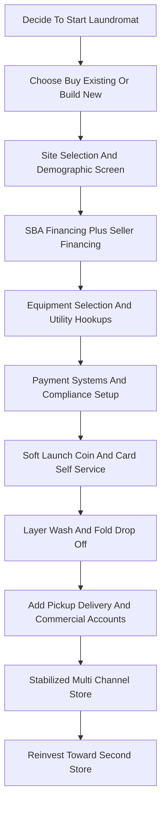

### Direct Answer

Starting a laundromat in 2027 means deploying **$200K-$1.5M** to either acquire an existing turnkey store or build new, then running it as a **utility-efficient, location-rigorous, recurring-revenue business** that nets 25-35% on $200K-$1M of annual revenue. The single biggest driver of outcome is site selection — renter density, household income, and competition radius set 70-85% of profitability the day you sign the lease — and the single biggest profit lever is layering **wash-and-fold, pickup-delivery, and commercial accounts** on top of coin/card self-service. Done with discipline, it is one of the last semi-absentee brick-and-mortar businesses that still works at small-operator scale.

**TL;DR**
- **Capital:** $200K-$485K for a small single-store acquisition, $485K-$1.2M mid-market, $750K-$1.5M to build new — financed mostly via **SBA 7(a)** with seller financing layered behind.
- **Economics:** Mature store does $200K-$1M revenue at 25-35% net; WDF + pickup-delivery + commercial accounts add 30-60% revenue over coin-only.
- **Hardest part:** The **water bill ($1.5K-$8.5K/mo)** is the largest variable expense after rent, and equipment failure ($8K-$15K to replace a single 60lb washer) plus a mediocre location can sink the whole thesis.
- **Verdict:** Viable in 2027 for a disciplined, numbers-driven operator; a poor fit for anyone who underestimates utilities, deferred maintenance, or the operational grind of broken machines and security.

## Market, Demand And Why Laundromats Still Work In 2027

### 1.1 What a laundromat is and the structural demand floor

A laundromat in 2027 is a **brick-and-mortar self-service laundry** occupying 1,500-3,500 sqft of retail space, installing 20-60 commercial washers and dryers, and monetizing through per-load coin/card/app revenue plus wash-and-fold, pickup-delivery, and commercial accounts. Per the **Coin Laundry Association (CLA, coinlaundry.org)** — the dominant US trade body — the national universe sits near **29,500 stores generating roughly $5B in annual revenue** on about $3.6B of underlying real estate value.

**The demand floor is structural, not cyclical.** Per the **US Census American Community Survey**, roughly 35-40% of US renters lack in-unit washer/dryer hookups; multi-family construction in major metros has held in-unit-W/D penetration below 60% of new builds; and tip-economy workers, students, recent immigrants, RV/van-life travelers, and Airbnb hosts all create steady recurring demand. The honest nuance: **single-family suburban demand is shrinking** as new houses ship with hookups, while **dense urban renter demand is stable to growing**.

### 1.2 Revenue benchmarks by operator tier

Per CLA 2023-2024 industry data, **American Coin-Op**, and **Planet Laundry** reporting, store economics cluster into three tiers.

| Operator tier | Annual gross revenue | Net margin | Annual SDE | Footprint / machines |
|---|---|---|---|---|
| Average coin-only store | $180K-$485K | 25-35% | $45K-$170K | 1,500-2,500 sqft / 25-45 |
| Strong operator (WDF + delivery + commercial) | $485K-$1.2M | 28-38% | $135K-$455K | 2,000-3,000 sqft / 30-50 |
| Multi-unit chain (per store) | $300K-$650K | 22-32% | varies | 1,800-2,800 sqft / 30-45 |

**The spread between tiers is operational, not structural.** The same building and equipment can produce a $180K coin-only store or a $320K WDF-plus-delivery store — the difference is whether the operator layers service revenue and tracks real numbers. The ATM-route and vending playbooks share this "machines plus density" logic (q1937, q9649).

### 1.3 The 2027 deal and consolidation landscape

**The acquisition market is active.** Listings churn weekly on **BizBuySell, LoopNet, Crexi, Laundromat Resource Marketplace, Sunbelt Business Brokers, and Restaurant Brokers**, with asking prices of $200K-$1.5M for single stores. Pricing runs **3-5x SDE for small stores, 5-7x SDE for mid-market, 5-8x EBITDA for multi-unit portfolios**.

**The PE consolidation thesis is real but slow.** Roll-up players — **Stewards Coin Laundry, SpinX, WaveMAX, Speed Wash** — and equipment-distributor consolidators pay 5-7x EBITDA for mid-market multi-unit operators. But with ~90% of the 29,500-store universe single-owner, exit liquidity for sub-$80K-SDE stores is thin. The operators every new entrant studies: **Dave Menz** ("Laundromat Millionaire"), **Jordan Berry** and **Brian Wallace** (Laundromat Resource), and the B-Corp **Wash Cycle Laundry**.

| Demand segment | 2027 trajectory | Operator implication |
|---|---|---|
| Suburban single-family | Shrinking (in-unit W/D default) | Avoid low-renter-density sites |
| Urban / dense multi-family | Stable to growing | Core target market |
| WDF + pickup-delivery | Fastest-growing (30-60% lift) | Mandatory revenue layer |
| Commercial accounts | Steady, recurring | Margin stabilizer |

## Site Selection, Structure And Insurance

### 2.1 Site selection — the decision that sets 70-85% of profitability

Site selection is **the single most consequential decision** in the laundromat business because the bulk of long-term profitability is locked the day you sign the lease. The disciplined operator runs 8-15 specific demographic and physical screens before committing capital.

**Demographic screens (run with US Census ACS data via data.census.gov, plus Esri Business Analyst, PlacerAI, or SafeGraph overlays):**
- **Renter density:** target 40%+ renter occupancy within 1 mile; multi-family rental dominance beats single-family ownership.
- **Household income:** $35K-$75K sweet spot — below constrains WDF spend, above shifts toward in-unit ownership.
- **Population density:** 3,000-15,000 per square mile supports walk-in and drive-in traffic.
- **Competition radius:** a competing laundromat within 0.75 mile cuts addressable demand 30-55%.
- **Population mix:** first-generation immigrant communities, tip-economy workers, and nearby colleges skew laundromat-dependent.

**Physical screens:** 1,500-3,500 sqft footprint; high visibility from an arterial road with monument signage; 15-35 parking spaces (customers carry multi-bag loads); ground-floor street access; and confirmed utility capacity — 2-4 inch water line at 80-110 PSI, medium/high-pressure gas, and 400-amp 3-phase 208V/480V electric.

| Screen category | Target threshold | Failure consequence |
|---|---|---|
| Renter occupancy (1 mile) | 40%+ | Weak walk-in volume |
| Household income | $35K-$75K | Low WDF capture or in-unit shift |
| Nearest competitor | 0.75-1.5+ miles | 30-55% demand loss |
| Parking spaces | 15-35 | Customers skip the store |
| Water line / pressure | 2-4 inch / 80-110 PSI | $15K-$85K utility upgrade |
| Electric service | 400-amp 3-phase | $25K-$85K transformer upgrade |

**Field discipline matters.** Disciplined operators walk the neighborhood at 6am, 11am, 4pm, 8pm, and 10pm; buy 6-12 loads at the nearest three competing laundromats to assess equipment, cleanliness, and pricing; and interview 8-15 current customers to surface dissatisfaction signals (broken machines, no WDF, no card payment, poor security).

### 2.2 Entity structure and personal guarantee reality

Entity structure follows small-business norms: an **LLC taxed as an S-corporation** is dominant for owner-operators at $80K-$200K+ net income (the S-corp election saves FICA on distributions), with a **multi-member LLC plus operating agreement** standard for partnerships. A sole proprietorship is workable for a very small store but exposes the owner to personal liability on slip-and-fall, equipment fire, water damage, and ADA claims.

**The personal guarantee is unavoidable.** Virtually every laundromat SBA 7(a) loan, equipment financing line, commercial lease, utility service agreement, and merchant-services contract requires a **personal guarantee from the founder**. The LLC entity does not insulate the founder from these obligations regardless of structure — this is identical to the financing reality in self-storage and car-wash startups (q1969, q1121).

### 2.3 The laundromat insurance stack

Laundromats carry water-damage and equipment exposure that ordinary retail does not, so the insurance stack is broader than typical small business.

| Coverage | Year 1 annual premium | Why it matters |
|---|---|---|
| Commercial General Liability ($1M/$2M) | $2,500-$8,500 | Slip-and-fall, customer injury |
| Property / building (if owned) | $3,500-$15,500 | Building replacement cost |
| Equipment / business personal property | $4,500-$18,500 | $185K-$485K of machines |
| Water-damage / sewer-backup rider | $1,500-$5,500 | Broken hoses cause $15K-$185K events |
| Business interruption | $2,500-$8,500 | Revenue loss during outage |
| Workers comp (NCCI 7421 laundry) | $1,800-$8,500 | Attendant / WDF labor |
| Crime / theft | $1,500-$8,500 | Coin and currency exposure |
| Umbrella ($2M-$5M) | $1,500-$5,500 | Layered catastrophic cover |

**Total Year 1 insurance load runs $22,500-$85,500** for a single store, scaling to $55K-$185K for a multi-unit operator with WDF and delivery. Add **EPLI, commercial auto** (for delivery vans), **cyber liability**, and **product liability** (for WDF garment damage) as the operation grows. The water-damage rider is the non-negotiable line item: standard property policies frequently exclude or sub-limit the exact failure mode — a burst supply hose — that laundromats face most.

**Worker classification:** attendants, WDF workers, and cleaning staff should almost always be **W-2**. The DOL 2024 Final Rule, the IRS 20-factor test, and CA AB5 have produced $25K-$150K back-tax assessments for misclassified laundromat labor.

## Buy Versus Build And The Capital Stack

### 3.1 Buy existing turnkey — the dominant path

**Buying an existing turnkey store is the dominant route** (an estimated 75-85% of new-operator deals) and runs $200K-$1.5M for a single store. Pricing sits at 3-5x SDE for small stores, 5-7x SDE for mid-market, per **BizBuySell** market data and the **IBBA Business Reference Guide**.

**Buy-existing advantages:** immediate cash flow (no 6-18 month build-out), an installed customer base, working equipment and utility hookups, an existing landlord relationship, and demonstrated SDE for SBA underwriting. **Buy-existing risks:** deferred maintenance on aging equipment (washers and dryers run a 10-15 year service life), unknown utility inefficiency on legacy machines, possible lease-assignment friction, and latent ADA / Title 24 non-compliance that requires a capital cure post-close.

The disciplined buyer runs a **120-180 day due diligence** including a machine-by-machine condition assessment with a certified technician (Dexter, Speed Queen, Continental Girbau, Huebsch, Wascomat), a 12-24 month financial review against tax returns and utility bills, a demographic and competition review, lease-assignment review, and an environmental Phase I.

### 3.2 Build new — when a ground-up store makes sense

**Building new runs $750K-$1.5M all-in** and makes sense only when demographics, zoning, and 30+ year ground-lease economics all align in a market with no acquisition target.

| Build-new cost component | Typical range |
|---|---|
| Equipment (25-45 washers/dryers, hot water, payment, signage) | $200K-$485K |
| Build-out (HVAC, plumbing, 400-amp electric, gas, finishes) | $185K-$485K |
| Permitting, impact fees, plan review, utility hookup | $25K-$85K |
| Signage, branding, opening marketing | $25K-$85K |
| 6-12 months pre-opening and ramp working capital | $45K-$185K |

**Build-new advantages:** modern energy-efficient equipment (30-50% lower utility cost per load), cardless/coinless payment, a modern customer experience, and full code compliance with 10-15 years of remaining equipment life. **Build-new risks:** a 6-18 month build-out and permitting timeline during which capital is deployed without revenue, demographic risk on an unproven location, and a 12-24 month customer-awareness ramp.

### 3.3 The SBA 7(a), SBA 504 and seller-financing stack

**The SBA 7(a) loan dominates laundromat financing** because the asset class is SBA-friendly: collateralizable real estate or equipment, stable cash flow, and demonstrated owner SDE. Active SBA 7(a) laundromat lenders include **Live Oak Bank (a recognized laundromat specialty lender), Newtek (NASDAQ: NEWT), Celtic Bank, Byline Bank (NYSE: BY), ReadyCap Lending, Pursuit Lending, and TMC Financing** (a CDC for SBA 504).

| Financing source | Typical terms | Best use |
|---|---|---|
| SBA 7(a) | 10-25 yr (real estate), 7-10 yr (equipment), prime + 2.75-3.0%, 10-20% down | Acquisition or build |
| SBA 504 | 50% bank / 40% CDC / 10% borrower, 20-25 yr | Real-estate-heavy deals |
| Seller financing | 15-30% of price, 7-9%, 5-10 yr, second lien | Bridges acquisition gap |
| Equipment finance (Eastern Funding) | 5-10 yr, fixed | Re-equipment / refresh |

**Seller financing appears in an estimated 40-60% of small-store transactions**, typically 15-30% of purchase price at 7-9% over 5-10 years behind the SBA primary. The honest 2027 default: **most first-time operators buy existing turnkey with an SBA 7(a) plus seller-financing structure**, while multi-store operators selectively build new in demographic gap markets.

## Equipment, Utilities And Payment Systems

### 4.1 Equipment selection and the dominant brands

Equipment drives 40-60% of long-term store profitability because **water, gas, and electric per load is set by equipment efficiency**.

| Brand (ticker / parent) | Position | New price per machine |
|---|---|---|
| **Dexter Laundry** (employee-owned ESOP) | Gold-standard build quality | $4,500-$12,500 |
| **Speed Queen** (Alliance Laundry Systems) | Global workhorse, strong dealer net | $4,500-$12,500 |
| **Continental Girbau** (Girbau Group) | Dominant soft-mount extractor | $4,500-$15,500 |
| **Huebsch** (Alliance Laundry Systems) | Premium-distributor channel | $4,500-$12,500 |
| **Whirlpool Commercial** (NYSE: WHR) | Budget / top-load placement | $2,500-$5,500 |
| **Wascomat / Electrolux Professional** (STO: ELUX-B) | Larger-capacity, upscale builds | $4,500-$25,500 |

**Front-load over top-load** is near-universal in new builds: 30-50% lower water per load (10-18 gallons vs 25-45), 40-60% higher G-force extraction (cutting dryer time and gas), longer machine life, and larger capacity per footprint. **Gas dryers dominate** (~85-95% of new builds) at 40-55% lower operating cost per load than electric. **Soft-mount washers** (Continental Girbau, Electrolux Professional) allow upper-floor installation without reinforced foundations.

### 4.2 Sourcing, hot water and ozone

**Equipment is sourced through regional distributors** — the Alliance Laundry Systems and Continental Girbau distributor networks, plus **EVI Industries (NYSE American: EVI)**, a public commercial-laundry equipment distributor. Buy **new** (preferred, 10-15 year life plus warranty), **reconditioned** (50-70% of new price, 1-3 year warranty), or **used** (25-45% of new, no warranty — risky for primary equipment).

A 25-45 machine store needs a **120-300 gallon commercial gas-fired hot water heater** (A.O. Smith — NYSE: AOS, Bradford White, Rheem, Lochinvar) at $8,500-$25,500 installed, plus a **water softener** (Culligan, Kinetico) at $2,500-$8,500 to fight limescale. **Ozone laundry systems** inject ozone into wash water to cut hot-water and chemical demand, claiming 20-35% water and gas savings at $3,500-$8,500 per install — uptake is growing among utility-conscious operators.

**Total Year 1 equipment investment runs $185K-$485K** for a 25-45 machine starter store, scaling to $385K-$685K for a premium 35-55 machine store with ozone and modern payment.

### 4.3 Utilities — the largest variable expense after rent

Utilities are the **#1 lever for operating margin** because consumption per load is locked by equipment efficiency and rate structure.

| Utility | Typical consumption | Monthly bill | Reduction levers |
|---|---|---|---|
| Water + sewer | 2,500-15,500 gal/day | $1,500-$8,500 | Front-load, ozone, water reclaim |
| Gas | 600-3,500 therms/mo | $800-$3,500 | High-efficiency dryers, condensing heater |
| Electric | 3,500-12,500 kWh/mo | $500-$2,500 | LED, smart HVAC, ventilation upgrades |

**Utility hookup capacity for new builds** is a frequent budget surprise: upgrading from typical retail service to a commercial 2-4 inch water line runs $15K-$85K, commercial-grade gas $15K-$45K, and 400-amp 3-phase electric $25K-$85K. **Energy-efficiency rebates** under utility Demand-Side Management programs offset some of this — $50-$485 per high-efficiency washer, $1,500-$8,500 for a high-efficiency hot water heater, $25K-$85K for a water reclamation system. Disciplined operators install **submetering** on each washer to catch a broken inlet valve before it generates a runaway water bill, and they work the utility account representative during build-out to capture every rebate.

### 4.4 Payment systems and the coin-to-app shift

Payment systems are the operational backbone and the single biggest customer-experience differentiator in 2027. The category has moved from **coin-only** (through ~2015) to **coin + card** (2015-2022) to **coin + card + app** (the current 2022-2027 standard), with leading concepts going **cardless / coinless via app + QR + tap-to-pay**.

| Architecture | Install cost | Customer friction | 2027 status |
|---|---|---|---|
| Coin-only | $0 incremental | Highest (needs quarters) | Rare in new builds |
| Coin + card | $1,500-$3,500/machine + central | Moderate | Common in legacy stores |
| Coin + card + app | $1,500-$3,500/machine + $5.5K-$15.5K system | Low | New-build standard |
| Cardless / coinless app | App infrastructure only | Lowest (needs download) | Upscale concepts |

**Dominant vendors:** **CCI / Card Concepts**, **ESD**, **Setomatic SpyderWash**, **PayRange** (the dominant retrofit option — a Bluetooth coin-slot adapter at $185-$485 per machine, no rip-and-replace), **Kiosoft CleanPay**, **LaundryCard**, and **FasCard**. Equipment-integrated platforms — **Speed Queen Insights** and **Dexter Centurion** — work only on their own machines. All card/app systems route through a **PCI-compliant merchant processor** (Stripe, Square, Worldpay, Heartland) at 1.8-3.2% per transaction. Modern systems include a **cloud back-office portal** for real-time machine utilization, fault alerts, refunds, and loyalty campaigns. Disciplined 2027 operators default to **coin + card + app** with **PayRange or Kiosoft** as the platform.

## Operations — Staffing, Service Revenue, Marketing And Compliance

### 5.1 Attendance models and staffing

The attendance model dictates labor cost, customer experience, security posture, WDF capability, and operator time commitment.

| Model | Hours staffed | Annual labor cost | Typical gross revenue | Net margin |
|---|---|---|---|---|
| Full-attended | All operating hours (1-3 attendants) | $45K-$185K | $285K-$1.2M | 22-32% |
| Semi-attended | Peak hours only (1 attendant) | $25K-$65K | $185K-$485K | 25-35% |
| Unattended / vended | None (cameras + remote monitoring) | $5K-$15K | $165K-$385K | 30-40% |

**The model is a revenue-versus-margin trade.** Full-attended stores generate the highest absolute revenue (better WDF capture, security presence, customer retention) but compress margin on labor; unattended stores generate the highest margin per revenue dollar but lower absolute revenue and carry higher theft/loitering risk — see the unattended-laundromat cash-flow analysis in (q1123).

**Staffing reality:** attendant labor is a high-turnover, low-wage segment. Disciplined operators pay above local market ($16-$22/hour vs $13-$15), provide consistent scheduling and light benefits, and treat attendants as front-line customer ambassadors rather than commodity labor. Hiring runs through Indeed, ZipRecruiter, local Facebook groups, and employee referrals; training is a 1-2 week on-the-job program covering machine operation, WDF processing, cash handling, and security protocols. Workers comp classifies under **NCCI 7421 (laundry)** for attendants, **9014 (building service)** for cleaning crew, and **8810 (clerical)** for admin.

### 5.2 Wash-and-fold, pickup-delivery and commercial accounts

WDF, pickup-delivery, and commercial accounts are **the single biggest revenue and margin lever** — the difference between a $180K coin-only store and a $480K service-layered store on the same equipment.

**Wash-and-fold (WDF) drop-off:** customer drops off, store washes/dries/folds/bags within ~24 hours. 2027 pricing runs $1.25-$2.25/lb small-store, $1.85-$2.95/lb urban/premium, $2.50-$4.50/lb same-day rush. WDF runs **20-40% gross margin** depending on folder productivity (25-65 lbs/hour) and supplies cost; disciplined operators capture 15-35% of total store revenue from WDF.

**Pickup-and-delivery:** customer schedules via app, a driver collects and returns. Pricing runs $1.75-$3.25/lb plus a $5-$25 order fee, or an $85-$185/month subscription. Margins run **15-30%** after delivery overhead, but absolute revenue per customer is far higher — a pickup-delivery customer spends $185-$485/month versus $45-$185 for a walk-in WDF customer. Dominant software: **CleanCloud, Curbside Laundries, Cents, and Turns** for POS, customer app, payment, and routing. The same app-driven turnover logic underpins Airbnb cleaning operations (q1948).

**Commercial accounts:** recurring revenue from gyms, salons, Airbnb hosts, small hotels, restaurants, sports teams, and medical offices at $0.85-$1.85/lb on 3-12 month contracts with scheduled pickup. Margins run **18-32%** with higher predictability than retail WDF.

| Revenue channel | Share of strong-operator revenue | Gross margin |
|---|---|---|
| Self-service coin/card/app | 60-75% | 30-40% |
| Walk-in WDF | 15-25% | 20-40% |
| Pickup-delivery | 5-15% | 15-30% |
| Commercial accounts | 5-15% | 18-32% |

### 5.3 Marketing and local customer acquisition

Laundromat marketing is **dominantly local, repeat, and walk-in driven** with minimal ad spend for the self-service business, but meaningful B2B/B2C effort for WDF, delivery, and commercial accounts.

- **Google Business Profile and reviews** are the dominant channel — "laundromat near me" search drives discovery, and operators with 75+ reviews at 4.5+ stars dominate local search. Cultivate reviews via in-store QR codes, attendant requests at WDF pickup, and post-transaction texts from the Kiosoft/PayRange/Cents app.
- **Apartment-complex partnerships** deliver new-resident welcome packets (first-load-free coupon, WDF discount) covering 50-200 units per property.
- **College partnerships** capture student welcome packets, Greek-life contracts, and dorm pickup-delivery.
- **Paid channels** — Google Local Service Ads ($3.50-$12.50/lead), standard Google Ads ($2.50-$8.50 CPC), and Facebook/Nextdoor local-awareness ads at $15-$45/day to a 1-3 mile radius.
- **Loyalty and referral programs** ("10th load free," $10-for-$10 referral credit) systematize word-of-mouth.

**Typical single-store marketing spend is $500-$1,500/month** — far below service-business norms because of local walk-in dominance and recurring repeat revenue.

### 5.4 Compliance — ADA, Title 24, OSHA and consumer-finance

Compliance spans federal accessibility, state energy codes, local zoning, fire/life safety, OSHA, EPA, and consumer-finance rules.

| Regime | What it governs | Operator action |
|---|---|---|
| ADA (2010 Standards) | Accessible parking, entry, route, machines, restroom, signage | CASp / ADA consultant pre-purchase audit |
| Title 24 (California) | Lighting, HVAC, water heating, ventilation efficiency | Title 24 energy consultant at permitting |
| OSHA 29 CFR 1910 | Chemical, lint, heat, noise, ergonomic, electrical safety | Annual self-audit + employee training |
| NFPA 96 / fire marshal | Dryer venting, lint management, fire suppression | Inspection for occupancy permit |
| Reg E / surcharge rules | Card/app surcharge disclosure | Vendor-managed compliance |

**ADA Title III private-right-of-action lawsuits target laundromats aggressively** in California, New York, and Florida with $5K-$50K settlement demands. The disciplined operator runs a **Certified Access Specialist (CASp)** inspection (California) or an ADA compliance consultant (other states) during pre-purchase due diligence and before opening. PCI compliance is vendor-managed by the payment-system provider, with an annual self-assessment questionnaire. Disciplined operators engage a commercial real estate attorney, ADA consultant, insurance broker, accountant, and payroll service (Gusto, ADP — NASDAQ: ADP, Paychex — NASDAQ: PAYX) to hold the compliance posture.

## Growth, Multi-Unit Scale And Exit

### 6.1 Multi-unit expansion milestones

A single store caps near **$185K-$685K annual SDE** for a strong WDF-plus-delivery operator; **multi-unit expansion** is the path to $685K-$3.8M+ annual EBITDA at 3-15 store scale.

| Phase | Store count | Founder role | Key build |
|---|---|---|---|
| Year 1-3 | 1 store | Owner-operator | Standardized SOPs |
| Year 3-5 | 2 stores | Operator + 1 store manager | Promote first manager |
| Year 4-7 | 3-5 stores | Multi-unit operator | Regional ops manager, centralized back-office |
| Year 6-10 | 6+ stores | CEO / portfolio operator | VP Ops, VP Sales, Director Finance |

**Scale economics** capture 5-15% equipment-purchasing discounts, 10-20% insurance savings on multi-location policies, and 50-70% lower per-store accounting and HR cost through centralization. Capital comes from **SBA 7(a) up to $5M**, regional bank commercial real estate loans, equipment lease lines from **Eastern Funding** (a dominant laundromat equipment lender), and a working-capital line of credit at SOFR + 2-4%. Disciplined operators reinvest 50-70% of cash flow during the Year 3-7 scale phase, then shift to a 30-50% distribution phase at 8+ store maturity. The franchise route — **WaveMAX, Spin Laundry Lounge** — trades a $25K-$85K franchise fee plus 4-8% royalty for brand and supply-chain support.

### 6.2 Exit multiples and valuation drivers

Exit multiples vary by scale, location quality, equipment vintage, and revenue mix.

| Seller profile | Exit multiple | Typical buyer |
|---|---|---|
| Single store, under $80K SDE | 3-5x SDE | First-time operator, local competitor |
| Mid-market single store, $80K-$200K SDE | 5-7x SDE | 2-5 store local operator |
| Small multi-unit (2-5 stores) | 5-7x EBITDA | Regional roll-up platform |
| Mid-market multi-unit (6-15 stores) | 6-8x EBITDA | PE-backed platform |
| Large multi-unit (15+ stores) | 6-9x EBITDA | PE strategic / consolidator |

**Valuation drivers:** store count and geographic density, revenue-mix diversification (WDF + delivery + commercial beats coin-only), equipment vintage and remaining life, lease term and renewal options, clean compliance and audit history, financial-reporting quality (documented POS and tax returns beat cash-only operations), modern WDF technology, and staff continuity with documented SOPs. There are few pure public comparables — **Cintas (NASDAQ: CTAS)** is adjacent uniform/linen services, not direct laundromat. The honest 2027 reality: **most operators choose owner-operator continuation** because a 5-7x small-scale multiple net of capital-gains tax and transition friction is often less attractive than continued $45K-$685K owner income.

### 6.3 The first-year operating ramp

The ramp is sequential: prove self-service revenue first, layer WDF once attendant capacity exists, then add pickup-delivery and commercial accounts as the operator builds routing and contract-sales muscle. Skipping straight to delivery before the core store is stable is the most common ramp mistake.

## Counter-Case — When A Laundromat Fails Or Is The Wrong Business

A laundromat is **not a universally good business**, and several failure patterns recur often enough to name explicitly.

### 7.1 When the location kills the business

**A mediocre location with great operations loses to a great location with mediocre operations every time.** The most common fatal error is signing a lease in a low-renter-density area, a market saturated with competing laundromats inside 0.75 mile, or a site with inadequate parking or poor visibility. Because 70-85% of profitability is set at lease signing, no amount of WDF layering, marketing spend, or attendant excellence rescues a structurally wrong site. If the demographic screens do not clear, **walk away from the deal** — there is no operational fix.

### 7.2 When utilities and equipment failure crush the margin

**The water bill is the silent killer.** An operator who buys a turnkey store with legacy top-load washers, an undersized hot water heater, and no submetering can watch a $3,500/month water bill balloon to $7,000+ from a single broken inlet valve that runs undetected for weeks. Equipment failure compounds the problem: replacing a single 60lb washer costs $8K-$15K, and a store with 30 aging machines can face $80K-$150K of deferred-maintenance capital in the first two years. **If due diligence reveals legacy equipment and no utility submetering, price the cure into the offer or pass.**

### 7.3 When a laundromat is the wrong business for you

A laundromat is a poor fit for an operator who:
- **Wants a passive, zero-touch investment** — even unattended stores need cleaning crews, on-call service techs, coin/card collection, and security management.
- **Underestimates the operational grind** — broken machines, loitering, coin and card theft, drain backups, and 24/7 access-security incidents are routine.
- **Targets a shrinking suburban single-family market** where new construction defaults to in-unit W/D.
- **Cannot fund a 6-18 month build-out** without revenue, or lacks the credit to clear a personal-guarantee SBA underwrite.

### 7.4 When build-new is the wrong call

**Build-new is the wrong call when an acquisition target exists.** Building ties up $750K-$1.5M for 6-18 months with no revenue, exposes the operator to demographic risk on an unproven site, and carries a 12-24 month awareness ramp. Build new **only** when demographics, zoning, and ground-lease economics all align in a market with no acquisition option — otherwise buy existing turnkey and redeploy capital into equipment refresh. The same buy-versus-build discipline applies across capital-intensive small businesses, from car washes to self-storage (q1121, q9663).

### 7.5 Honest failure-rate framing

Laundromats fail less often than restaurants but more often than the "recession-proof" marketing suggests. The realistic failure modes: a structurally wrong location, an over-leveraged acquisition where SBA debt service plus a runaway water bill exceeds cash flow, an operator who never layers WDF and stays stuck at $150K coin-only revenue, and a buyer who inherits $100K+ of deferred maintenance they did not price into the deal. None of these are mysterious — they are all visible in disciplined due diligence, which is precisely why site rigor and machine inspection are the non-negotiable steps.

## Bottom Line

A laundromat in 2027 is **viable as a disciplined, location-rigorous, utility-efficient, WDF-layered recurring-revenue business** — and a trap for anyone who underestimates water bills, deferred maintenance, or the operational grind. The winning playbook is consistent: buy existing turnkey with an SBA 7(a) plus seller-financing structure in a high-renter-density market with clear demographic screens; install or upgrade to front-load high-efficiency equipment with modern coin + card + app payment; layer wash-and-fold, pickup-delivery, and commercial accounts to push revenue 30-60% above coin-only; track real numbers through the payment-system back-office; and reinvest toward multi-unit scale where centralization economics compound. The operators who make $300K instead of $30K are not the ones with the fanciest stores — they are the ones who were rigorous about the lease, ruthless about the water bill, and relentless about the service-revenue layer.

## Sources

1. Coin Laundry Association (CLA) — coinlaundry.org — US laundromat industry data
2. CLA 2023-2024 Industry Survey — store count, revenue, and margin benchmarks
3. US Census Bureau — American Community Survey (ACS) — renter and in-unit W/D data
4. data.census.gov — census-tract demographic screening
5. American Coin-Op magazine — americancoinop.com — trade reporting
6. Planet Laundry magazine — planetlaundry.com — CLA trade publication
7. Dave Menz — "The Laundromat Millionaire" — laundromatmillionaire.com
8. Jordan Berry — Laundromat Resource Podcast — laundromatresource.com
9. Brian Wallace — Laundromat Resource — community and marketplace
10. BizBuySell — bizbuysell.com — business-for-sale marketplace and valuation data
11. LoopNet — loopnet.com — commercial real estate listings
12. Crexi — crexi.com — commercial real estate marketplace
13. IBBA Business Reference Guide — Industry Business Brokers Association
14. DealStats (BVR) — private-company transaction multiples
15. US Small Business Administration — sba.gov — SBA 7(a) and 504 loan programs
16. Live Oak Bank — liveoakbank.com — SBA laundromat specialty lender
17. Newtek (NASDAQ: NEWT) — newtekone.com — SBA 7(a) lender
18. Celtic Bank — celticbank.com — SBA lender
19. Byline Bank (NYSE: BY) — bylinebank.com — SBA lender
20. Eastern Funding — easternfunding.com — laundromat equipment finance
21. Dexter Laundry — dexter.com — commercial washer/dryer manufacturer
22. Alliance Laundry Systems — alliancelaundry.com — Speed Queen, Huebsch, UniMac
23. Continental Girbau — continentalgirbau.com — soft-mount washer-extractors
24. Huebsch — huebsch.com — Alliance Laundry Systems brand
25. Whirlpool Corporation (NYSE: WHR) — commercial laundry division
26. Electrolux Professional (STO: ELUX-B) — Wascomat parent
27. EVI Industries (NYSE American: EVI) — commercial laundry equipment distributor
28. ENERGY STAR Commercial Laundry — energystar.gov — efficiency certification
29. California Energy Commission — energy.ca.gov — Title 24 Energy Code
30. ADA.gov — 2010 ADA Standards for Accessible Design
31. US Department of Labor — DOL 2024 Independent Contractor Final Rule
32. Internal Revenue Service — IRS 20-factor worker-classification test
33. OSHA — 29 CFR 1910 General Industry Standards
34. NFPA 96 — Standard for Ventilation Control and Fire Protection
35. NCCI — workers compensation class codes 7421, 9014, 8810
36. PCI Security Standards Council — PCI DSS payment-card requirements
37. CleanCloud — cleancloud.com — laundromat POS and delivery software
38. Curbside Laundries — curbsidelaundries.com — POS and delivery management
39. Cents — trycents.com — cloud POS and back-office platform
40. PayRange — payrange.com — mobile payment retrofit system
41. Kiosoft — kiosoft.com — CleanPay card and app payment system
42. Card Concepts Inc. (CCI) — cardconceptsinc.com — card payment systems
43. Cintas Corporation (NASDAQ: CTAS) — adjacent uniform and linen services
