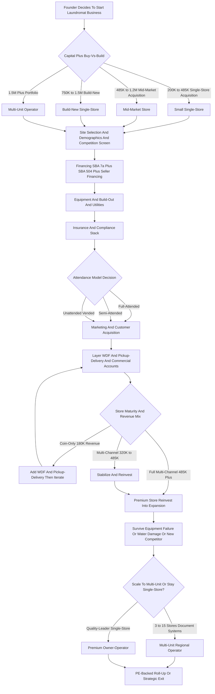

### Direct Answer

Starting a laundromat business in 2027 is viable as a disciplined, location-rigorous, utility-efficient, wash-and-fold-layered recurring-revenue business — but it is a poor fit for anyone who underestimates water bills, equipment failure, or the operational grind. Most first-time operators buy an existing turnkey store for $200K-$1.5M using an SBA 7(a) loan plus seller financing, run it at 25-35% net margin on $200K-$1M annual revenue, and grow profit 30-60% by layering wash-and-fold, pickup-delivery, and commercial accounts on top of coin/card self-service. The three decisions that set 70-85% of long-term profitability are site selection, equipment efficiency, and the multi-channel revenue mix.

> **TL;DR** — A laundromat is one of the last semi-absentee brick-and-mortar recurring-revenue businesses that still works at small-operator scale. The Coin Laundry Association tracks ~29,500 US stores generating ~$5B annual revenue. Buy existing turnkey at 3-5x SDE (small) or 5-7x SDE (mid-market); budget $750K-$1.5M to build new. Water is the largest variable cost after rent ($1.5K-$8.5K/mo) — front-load high-efficiency equipment is non-negotiable. Layer wash-and-fold ($1.25-$2.95/lb), pickup-delivery via CleanCloud or Curbside Laundries, and commercial accounts to push a $180K coin-only store to $480K+. Insure the water-damage rider. Exit at 3-7x SDE single-store or 5-9x EBITDA multi-unit. Adjacent fits: roofing (q1946), AirBnB management (q1948), post-construction cleanup (q2117), soft wash roof cleaning (q2151).

## 1. Foundations — Market, Demand, And Structure

### 1.1 What A Laundromat Business Actually Is In 2027

A laundromat in 2027 is a **brick-and-mortar self-service laundry business** that owns or leases retail space — typically **1,500-3,500 sqft** — installs **20-60 commercial-grade washers and dryers**, and monetizes through **per-load coin/card/app revenue** plus increasingly through **wash-and-fold (WDF) drop-off service**, **app-driven pickup-and-delivery**, and **commercial accounts** (gyms, salons, Airbnb hosts, restaurants, small hotels, sports teams, medical offices). It is one of the last truly **semi-absentee, recurring-revenue, real-estate-anchored small businesses** that still works at single-operator scale.

**The structural demand floor** is the renter population that lacks in-unit washer/dryer hookups — still **~35-40% of US renters** per the **US Census American Community Survey** — plus tip-economy workers, students, immigrants, RV and van-life travelers, and the growing convenience segment that pulled WDF margins from 20% toward 40% via apps. Per the **Coin Laundry Association (CLA)**, the dominant US trade association, the laundromat universe sits at approximately **29,500 stores generating ~$5B annual revenue on ~$3.6B of underlying real estate value**.

**The honest 2027 demand reality is bifurcated.** Single-family suburban demand is shrinking as new construction defaults to in-unit washer/dryer. Urban and dense renter demand is stable to growing as multi-family construction continues without universal in-unit washers. WDF and pickup-delivery is the fastest-growing segment, with operators reporting **30-60% revenue lift** from layering it on top of self-service. The business is comparable in capital intensity and recurring-revenue character to other small-format service businesses — for context, see roofing (q1946) and AirBnB management (q1948).

**The four operators every new entrant studies** are **Dave Menz**, author of the "Laundromat Millionaire" book and host of the associated podcast; **Jordan Berry**, host of the Laundromat Resource podcast and community; **Brian Wallace**, founder of Laundromat Resource and its operator marketplace; and **Wash Cycle Laundry**, the Philadelphia B-Corp that pioneered the social-enterprise pickup-delivery model. The 2007-2022 consolidation wave produced several mid-market players — **SpinX, WaveMAX, Speed Wash, and Stewards Coin Laundry** — alongside equipment-manufacturer roll-up activity. The single most useful mental model for a new operator: a laundromat is not a "machines" business, it is a **real estate plus utilities plus labor business** in which the machines are the least interesting variable. The day the lease is signed, the demographic ceiling is fixed; everything after that is execution within that ceiling.

**The four things that determine whether a store makes $30K or $300K:** site selection (renter density, household income, visibility, parking, competition radius); equipment efficiency (water, gas, and electric per load); WDF and pickup-delivery layering (a coin-only store at $180K versus the same store at $320K with multi-channel revenue); and the attendance model (full-attended versus semi-attended versus unattended, each with a different labor, loss, and insurance tradeoff). A founder who internalizes those four levers — and budgets honestly for the water bill and the equipment-refresh cycle — has a defensible path. A founder who treats the business as "passive coin income" does not.

### 1.2 Market Size And The Economic Range

Per **CLA 2023-2024 industry data**, **American Coin-Op**, and **Planet Laundry** reporting, the typical store ranges widely by operator quality.

| Store profile | Footprint / machines | Annual gross revenue | Net margin | Annual SDE |
|---|---|---|---|---|
| **Average mature coin/card store** | 1,500-2,500 sqft, 25-45 machines | $180K-$485K | 25-35% | $45K-$170K |
| **Strong WDF + pickup-delivery operator** | 2,000-2,500 sqft, 35-55 machines | $485K-$1.2M | 28-38% | $135K-$455K |
| **Multi-unit chain (per store)** | 1,500-2,500 sqft each | $300K-$650K | 22-32% | varies |

**The structural demand picture matters more than the averages.** Multi-family construction has held in-unit washer/dryer penetration below 60% of new builds in major metros. The tip-economy workforce, students, immigrants, and short-term-rental hosts create steady recurring demand. The WDF and pickup-delivery layer — driven by apps such as 2ULaundry, Rinse, Hampr, Poplin (formerly SudShare), Tide Cleaners, and WaveMAX — has built a multi-billion-dollar adjacent market in under a decade.

**The 2027 turnkey-acquisition market is active.** Listings churn weekly on **BizBuySell, LoopNet, the Laundromat Resource Marketplace, Crexi, and Sunbelt Business Brokers**, with asking prices of **$200K-$1.5M** for single-store deals. The deal-flow reality favors patient buyers: roughly 90% of the 29,500-store universe is single-owner, and a meaningful share of those owners are nearing retirement without a succession plan. That creates a steady supply of motivated sellers, many willing to carry seller financing — which is why the disciplined buyer who underwrites carefully and walks away from overpriced or equipment-aged listings has structural negotiating leverage. The new-build market, by contrast, is thin and selective: a build only pencils when an underserved demographic pocket exists with no acquirable target, the zoning permits laundromat use, and the utility-upgrade math does not blow the budget.

### 1.3 The Demand Segments That Actually Pay

The laundromat customer base is not monolithic. A disciplined operator maps demand by segment before signing a lease, because each segment has a different spend pattern, price sensitivity, and channel preference.

| Demand segment | Channel preference | Price sensitivity | Notes |
|---|---|---|---|
| **Renters without in-unit W/D** | Self-service coin/card/app | High | The structural floor; ~35-40% of US renters |
| **Tip-economy / hourly workers** | Self-service + occasional WDF | High | Evening and weekend peak demand |
| **College / university students** | Self-service + WDF | Moderate | Seasonal — semester-driven |
| **Busy professionals** | WDF + pickup-delivery | Low | Highest per-customer spend |
| **Airbnb / short-term-rental hosts** | Commercial accounts + WDF | Low-moderate | Recurring contracted volume |
| **Small businesses** (gyms, salons, restaurants) | Commercial accounts | Low | Most predictable revenue |
| **RV / van-life travelers** | Self-service | Moderate | Location-dependent transient demand |

**The segment mix dictates the store design.** A store anchored on renter self-service demand should over-invest in machine count, fast cycle times, and bright security-conscious design. A store chasing the busy-professional and commercial segments should over-invest in WDF processing capacity, folding-table space, and pickup-delivery routing software. Most failing laundromats fail because they were built for one segment but sited in a neighborhood dominated by another.

### 1.4 Buy Existing Vs Build New — The First Capital Decision

The buy-vs-build decision is the **single largest capital-allocation and risk question** for a new operator.

| Path | Capital range | Share of new-operator deals | Time to revenue |
|---|---|---|---|
| **Buy existing turnkey** | $200K-$1.5M | ~75-85% | Immediate |
| **Build new** | $750K-$1.5M | ~15-25% | 6-18 months |

**Buy existing is the dominant path.** Acquisition pricing in 2027 sits at **3-5x SDE for small stores under $80K SDE, 5-7x SDE for mid-market stores at $80K-$200K SDE, and 5-8x EBITDA for multi-unit portfolios** per **BizBuySell** market data and the **IBBA Business Reference Guide**. Buy-existing advantages: immediate cash flow with no build-out period, an existing customer base, installed and operating equipment, existing utility hookups and landlord relationship, and demonstrated SDE for SBA underwriting. Buy-existing risks: deferred maintenance on aging equipment (10-15 year typical lifespan), unknown water/gas/electric inefficiency on legacy machines, possible competitive displacement, lease-assignment friction, and possible regulatory non-compliance requiring a capital cure post-close.

**Build new makes sense only when demographics, zoning, and 30-plus-year ground-lease economics all align.** Build-new advantages: modern energy-efficient equipment with 30-50% lower utility cost per load, modern cardless/coinless payment, a modern customer experience, full compliance from day one, and a longer remaining useful life. Build-new risks: a 6-18 month build-out and permitting timeline with capital deployed against zero revenue, demographic and competition risk on an unproven location, and a 12-24 month customer-awareness ramp.

### 1.5 Business Structure And Entity Choice

Entity structure follows small-business norms. The **LLC taxed as an S-corporation** is dominant for owner-operators at $80K-$200K-plus net business income, because the S-corp election saves FICA tax on distributions. A **multi-member LLC with a written operating agreement** is standard for partnerships, covering capital contributions, sweat equity, draw-vs-distribution mechanics, buy-sell terms, deadlock resolution, and exit triggers. A **sole proprietorship** is workable for a very small single store but exposes the owner to personal liability on slip-and-fall, equipment fire, water damage, employee injury, and ADA claims.

**The personal-guarantee reality is unavoidable.** Virtually every laundromat SBA 7(a) loan, equipment-financing agreement, commercial lease, utility service agreement, and merchant-services contract requires a **personal guarantee** from the founder. The LLC entity does not insulate the founder from personal liability on these obligations regardless of structure.

## 2. Site Selection — The Most Consequential Decision

### 2.1 Why The Lease Sets 70-85% Of Profit

Site selection is the **single most consequential decision** in the laundromat business, because **70-85% of long-term store profitability is set the day the lease is signed or the real estate closes**. A great location with mediocre operations beats a mediocre location with great operations every time. The disciplined operator runs **8-15 specific demographic and physical screens** before committing capital. This location-first discipline mirrors the throughput-and-demographics math behind other site-anchored small businesses such as mini-golf (q1127).

### 2.2 The Eight Demographic Screens

| # | Screen | Target |
|---|---|---|
| 1 | **Renter household density within 1 mile** | 40%+ renter occupancy (ACS census-tract data) |
| 2 | **Household income** | $35K-$75K sweet spot |
| 3 | **Population density** | 3,000-15,000 per square mile |
| 4 | **Competition radius** | No competing laundromat within 0.75-1.5 miles |
| 5 | **Foot/drive traffic** | Strong daytime + evening pattern |
| 6 | **Immigrant / tip-economy population** | High concentration favorable |
| 7 | **Multi-family proximity** | Apartment complexes built before 2000, rents under $1,800/mo |
| 8 | **College/university proximity** | Predictable weekly semester volume |

**A competing laundromat within 0.75 mile cuts addressable demand by 30-55%** depending on operator strength, equipment vintage, and service hours. The sweet spot is **multi-family rental dominance** — garden apartments, duplexes, triplexes, fourplexes, mid-rise rental — rather than single-family ownership. Below $35K household income constrains discretionary WDF spend; above $75K shifts customers toward in-unit washers or full-service convenience players. Tools: **Esri Business Analyst, PlacerAI, SafeGraph** for demographic and foot-traffic overlays, plus **data.census.gov** for census-tract renter and income data.

### 2.3 The Seven Physical Screens

| # | Screen | Requirement |
|---|---|---|
| 9 | **Footprint** | 1,500-3,500 sqft (sweet spot 2,000-2,500) |
| 10 | **Visibility** | Corner location, arterial road, monument signage |
| 11 | **Parking** | 15-35 spaces near the door |
| 12 | **Access** | Ground-floor street access only |
| 13 | **Water service** | 2-4 inch incoming line, 80-110 PSI |
| 14 | **Gas service** | Medium- or high-pressure for gas dryers |
| 15 | **Electric service** | 400-amp 3-phase 208V or 480V |

**Disciplined operators walk the neighborhood at 6am, 11am, 4pm, 8pm, and 10pm** to observe actual foot traffic, competing-store utilization, parking availability, and safety. They **buy 6-12 loads at the nearest three competing laundromats** to assess equipment condition, cleanliness, customer service, WDF pricing, and payment systems, and they **interview 8-15 current customers** at competitors to identify dissatisfaction signals — broken machines, dirty facilities, no WDF, no card payment, inadequate parking, poor security, limited hours.

### 2.4 The Competition Audit In Detail

A competing laundromat is not automatically a threat — a tired, dirty, coin-only competitor is an opportunity. The disciplined operator scores every competitor within a 1.5-mile radius on a structured rubric before committing.

| Competitor factor | Threat signal | Opportunity signal |
|---|---|---|
| **Equipment vintage** | Modern front-load, well-maintained | Aging top-load, frequent out-of-order signs |
| **Cleanliness** | Spotless, attended, well-lit | Dirty, unattended, poorly lit |
| **Payment** | Card + app accepted | Coin-only, no card |
| **WDF / pickup-delivery** | Offered and promoted | Not offered |
| **Hours** | 24/7 or long hours | Limited hours |
| **Reviews** | 75+ reviews, 4.5+ stars | Few reviews or sub-4.0 rating |
| **Parking** | Ample, near-door | Scarce or shared |

**A neighborhood with a single weak competitor is often a better entry than a neighborhood with no laundromat at all** — the weak competitor has already proven the demand exists, and a disciplined operator can take meaningful share by offering modern equipment, card and app payment, WDF, and a clean attended environment. A neighborhood with a strong, modern, multi-channel competitor within 0.75 mile, by contrast, should usually be passed over entirely.

### 2.5 Lease Terms And Real Estate Negotiation

Whether leasing or buying the real estate, the terms matter enormously. **A laundromat lease should run 10-20 years with renewal options** because the build-out is heavy and immovable — washers, dryers, plumbing, gas lines, and electrical service do not relocate cheaply. A short-remaining-lease store carries a significant valuation discount at exit. Key lease provisions to negotiate: a **rent escalation cap** (2-3% annual, not CPit-linked open-ended), an **assignment clause** that permits transfer to a future buyer without unreasonable landlord consent, a **tenant-improvement allowance** for build-out, an **exclusive-use clause** barring the landlord from leasing adjacent space to a competing laundromat, and clear **responsibility for utility-service upgrades**. Owning the real estate via an SBA 504 loan removes landlord risk entirely and builds equity, but ties up more capital and concentrates risk in a single asset.

## 3. Capital, Build-Out, And Equipment

### 3.1 SBA Financing — The Dominant Capital Path

The **SBA 7(a) loan** dominates acquisition financing because laundromats are SBA-friendly: collateralizable real estate or equipment, stable cash flow, demonstrated owner SDE, and a brick-and-mortar nature that reduces lender risk versus pure service businesses.

| Term | Typical structure |
|---|---|
| **Loan amount** | Up to $5M ($5.5M with SBA Express) |
| **Term length** | 10-25 years real estate; 7-10 years equipment + working capital |
| **Interest rate** | SBA-prime + 2.75-3.0% |
| **Down payment** | 10-20% borrower equity |
| **SBA guarantee fee** | 2.0-3.75% of guaranteed portion |
| **Personal guarantee** | Required from all 20%+ owners |
| **Active lenders** | Live Oak Bank, Newtek, Celtic Bank, Byline Bank, ReadyCap, Pursuit Lending, TMC Financing, CDC Small Business Finance |

**Active SBA 7(a) laundromat lenders** include **Live Oak Bank** — a dedicated laundromat-specialty lender — plus **Newtek, Celtic Bank, Byline Bank, ReadyCap Lending, and Pursuit Lending**. The **SBA 504 loan** is used for real-estate-heavy deals via a **50% bank first-lien, 40% CDC second-lien, 10% borrower-down** structure with a below-market fixed rate on the CDC portion. **Seller financing** appears in an estimated 40-60% of small-store transactions, typically **15-30% of purchase price at 7-9% interest over 5-10 years** behind the SBA primary lien.

### 3.2 The New-Build Cost Stack

| Component | Cost range |
|---|---|
| **Equipment** (25-45 washers + dryers + hot water + payment systems + signage) | $200K-$485K |
| **Build-out** (HVAC, plumbing, 400-amp 3-phase electrical, gas, finishes, flooring, seating, ADA restroom, cameras) | $185K-$485K |
| **Permitting + impact fees + plan review + utility hookups** | $25K-$85K |
| **Signage + branding + opening marketing** | $25K-$85K |
| **6-12 months pre-opening + ramp working capital** | $45K-$185K |
| **Total all-in new build** | **$750K-$1.5M** |

**The disciplined buyer runs a 180-day due-diligence process** on acquisitions: a machine-by-machine condition assessment with a manufacturer-certified technician, a 12-24 month financial review of tax returns, bank statements, utility bills, and payment-processor statements, a demographic and competition review, a lease-assignment review, an environmental Phase I, and an air-quality review where applicable.

### 3.3 Equipment Selection — The Seven Dominant Brands

Equipment drives **40-60% of long-term store profitability** because water, gas, and electric per load is set by equipment efficiency. The dominant commercial brands serving the US laundromat market:

| Brand | Position | Washer 20-60lb | Dryer 30-75lb |
|---|---|---|---|
| **Dexter Laundry** | Iowa employee-owned ESOP; gold-standard | $4,500-$12,500 | $3,500-$9,500 |
| **Speed Queen (Alliance Laundry Systems)** | Dominant global workhorse | $4,500-$12,500 | $3,500-$9,500 |
| **Continental Girbau** | Dominant soft-mount extractor | $4,500-$15,500 | $3,500-$9,500 |
| **Huebsch (Alliance Laundry Systems)** | Premium-distributor brand | $4,500-$12,500 | $3,500-$9,500 |
| **Maytag / Whirlpool Commercial** | Lower-cost / lighter-duty | $2,500-$5,500 | $2,500-$4,500 |
| **Wascomat (Electrolux Professional)** | Larger-capacity / upscale | $4,500-$15,500 | $3,500-$10,500 |
| **Electrolux Professional** | Premium European industrial | $5,500-$25,500 | $5,500-$15,500 |

**Three core equipment decisions.** First, **front-load versus top-load**: virtually all new builds install front-load washers for 30-50% lower water use (10-18 gallons per load versus 25-45 for top-load), higher G-force extraction that cuts dryer time, and longer lifespan. Second, **soft-mount versus hard-mount**: soft-mount washers (Continental Girbau, Electrolux Professional) allow upper-floor installation without reinforced foundations but cost 15-25% more. Third, **gas versus electric dryers**: gas dryers dominate ~85-95% of new builds because they run 40-55% cheaper per load. Equipment is sourced new (preferred for warranty and 10-15 year life), reconditioned (50-70% of new price with a 1-3 year warranty), or used (25-45% of new, no warranty — risky for primary machines). The publicly-traded distributor **EVI Industries (NYSE American: EVI)** is a significant channel for Dexter and Continental equipment.

### 3.4 Hot Water, Water Softening, And Ozone

A typical 25-45 machine store requires a **120-300 gallon commercial gas-fired hot water heater** (A.O. Smith, Bradford White, Rheem Commercial, Lochinvar) at **$8,500-$25,500 installed**, plus a **water softener** (Culligan, Kinetico, Watts) at **$2,500-$8,500 installed** to reduce limescale and extend equipment life. **Ozone laundry systems** inject ozone into wash water to cut hot-water demand, claiming **20-35% water and gas savings** at $3,500-$8,500 per-system installation cost — uptake is growing among utility-conscious operators. Total Year 1 equipment investment runs **$185K-$485K** for a 25-45 machine starter store, scaling to **$385K-$685K** for a premium build.

## 4. Utilities — The Largest Variable Cost

### 4.1 Water, Gas, And Electric Reality

Utilities are the **single largest variable expense after rent** and the **number-one lever for operating margin**.

| Utility | Typical monthly cost | Drivers |
|---|---|---|
| **Water + sewer** | $1,500-$8,500 | 2,500-15,500 gal/day at $8-$18 per 1,000 gal |
| **Natural gas** | $800-$3,500 | 600-3,500 therms/mo at $1.20-$2.50/therm |
| **Electric** | $500-$2,500 | 3,500-12,500 kWh/mo at $0.10-$0.22/kWh |
| **HVAC + ventilation share** | $185-$485 | Commercial RTU + dehumidification |
| **Total monthly utility cost** | **$2,985-$14,985** | 15-25% of gross revenue |

**Water is the dominant exposure.** Some municipalities charge a **separate sewer-impact fee** on consumption above a residential threshold, adding $500-$2,500/month for high-volume stores. Disciplined operators install **front-load high-efficiency washers, ozone systems, water-reclamation systems** (Aqua Recycle, MWWS, Wexford at $25K-$85K install for 30-50% reduction), and **submetering** for per-machine utilization tracking.

### 4.2 Utility Hookup Capacity For New Builds

| Service | Requirement | Upgrade cost from retail-grade |
|---|---|---|
| **Water** | 2-4 inch line, 80-110 PSI, RPZ backflow preventer | $15K-$85K |
| **Gas** | Medium- or high-pressure, sized for dryers + hot water | $15K-$45K |
| **Electric** | 400-amp 3-phase 208V/480V, transformer upgrade | $25K-$85K |
| **Sewer** | 4-6 inch line for 30+ simultaneous drain cycles | Often adequate |
| **HVAC** | 5-15 ton commercial rooftop unit | $15K-$45K installed |

### 4.3 Efficiency Incentives And Monitoring

Many utilities offer **rebates for high-efficiency commercial equipment** under Demand-Side Management programs: typically **$50-$485 per high-efficiency washer, $25-$185 per dryer, $1,500-$8,500 for a high-efficiency hot water heater, and $25K-$85K for a water-reclamation system**. **Energy Star Commercial Laundry** certifications identify rebate-eligible models. **California's Title 24 Energy Code** imposes stringent state-specific efficiency requirements on lighting, HVAC, water heating, and ventilation. Disciplined operators use utility-monitoring platforms to track per-machine consumption and catch equipment failures — a broken inlet valve, a clogged dryer vent, worn motor bearings — before they generate runaway bills.

## 5. Payment Systems And Coin/Card Infrastructure

### 5.1 The Shift From Coin To App

The payment category has shifted from **coin-only** (dominant through 2010-2015) to **coin + card** (2015-2022) to **coin + card + app** (the current 2022-2027 standard), with leading operators going **cardless/coinless via app, QR, and tap-to-pay** in select markets.

| Architecture | Install cost | Customer friction | Best for |
|---|---|---|---|
| **Coin-only** | $0 incremental | Highest | Legacy stores only |
| **Coin + card** | $1,500-$3,500/machine + central system | Moderate | Older mid-market stores |
| **Coin + card + app** | $1,500-$3,500/machine + $5,500-$15,500 system | Lowest | 2027 new-build standard |
| **Cardless / coinless app** | App-only, no coin/card hardware | Lowest (after sign-up) | Upscale brand concepts |

### 5.2 The Dominant Payment Vendors

The leading US payment-system vendors serving laundromats: **CCI / Card Concepts Inc.** with Setomatic SpyderWash readers and a central kiosk; **ESD / Esd Magnetek**, a competing reader-plus-kiosk vendor; **PayRange**, a Bluetooth retrofit adapter that bolts onto existing coin machines at **$185-$485 per machine** — the dominant retrofit option for legacy stores; **Kiosoft (CleanPay)** with modern cloud-based architecture; **FasCard**; plus equipment-integrated platforms **Speed Queen Insights** and **Dexter Centurion**. The vending-payments processor **Cantaloupe (NASDAQ: CTLP)**, formerly USA Technologies, has expanded into laundry. **Disciplined operators in 2027 default to coin + card + app** with PayRange, Kiosoft, or CCI as the central platform.

### 5.3 PCI Compliance And Software Backend

All card and app systems must comply with **PCI DSS** for cardholder-data handling; vendor-managed systems handle PCI compliance via tokenization and encrypted processing. Card and app payments route through a merchant processor (Stripe, Square, Worldpay, Heartland, Elavon) at a typical **1.8-3.2% per-transaction fee** plus a monthly platform fee. Modern systems include a **cloud back-office portal** for real-time machine utilization, revenue reporting, fault alerts, refund processing, and loyalty programs — letting operators identify underutilized machines, replicate high-utilization configurations, and dispatch service on broken units.

## 6. Operations — Staffing, Service Layers, And Marketing

### 6.1 Attendance Models

The attendance model dictates labor cost, customer experience, security posture, WDF capability, and operator time commitment.

| Model | Annual labor cost | Typical store revenue | Net margin | Security posture |
|---|---|---|---|---|
| **Full-attended** (6am-10pm or 24/7) | $45K-$185K | $285K-$1.2M | 22-32% | Strongest |
| **Semi-attended** (peak hours only) | $25K-$65K | $185K-$485K | 25-35% | Moderate |
| **Unattended / vended** (no attendant) | $5K-$15K | $165K-$385K | 30-40% | Technology-dependent |

**Full-attended stores generate the highest absolute revenue** through stronger WDF capture and customer retention, but labor compresses margin. **Unattended stores generate the highest margin per revenue dollar** through labor savings, but lower absolute revenue and higher theft/loitering risk. Semi-attended stores sit in the middle. Laundromat attendant labor is a high-turnover, low-wage segment; disciplined operators **pay above local market ($16-$22/hour versus $13-$15 local), provide consistent scheduling, offer light benefits, and treat attendants as front-line customer ambassadors** rather than commodity labor. Hiring runs through Indeed, ZipRecruiter, local Facebook groups, and employee referrals, with a 1-2 week on-the-job training cadence.

### 6.2 Wash-And-Fold, Pickup-Delivery, And Commercial Accounts

WDF and pickup-delivery and commercial accounts are the **single biggest revenue and margin lever** — the difference between a $180K coin-only store and a $480K multi-channel store on the same equipment and site.

| Service | Pricing | Gross margin | Typical customer spend |
|---|---|---|---|
| **Walk-in WDF, small-store** | $1.25-$1.85/lb | 25-40% | $35-$135/month |
| **Walk-in WDF, urban/premium** | $1.85-$2.95/lb | 22-38% | $45-$185/month |
| **Same-day / rush WDF** | $2.50-$4.50/lb | 28-42% | $85-$245/month |
| **Pickup-delivery WDF** | $1.75-$3.25/lb + $5-$25 delivery fee | 15-30% | $85-$485/month |
| **Subscription pickup-delivery** | $85-$185/month flat fee | 18-32% | $85-$185/month |
| **Commercial accounts** | $0.85-$1.85/lb | 18-32% | $185-$2,800/month per account |

**Wash-and-fold drop-off** is the entry layer: the customer drops off dirty laundry, the store washes, dries, folds, and bags within a 24-hour turnaround. Disciplined operators capture **15-35% of total store revenue** from WDF when it is offered alongside self-service. **Pickup-and-delivery** adds a driver and a routing app — the typical pickup-delivery customer spends $185-$485/month versus $45-$185/month for a walk-in WDF customer. **Commercial accounts** — gyms, salons, Airbnb hosts, small hotels, restaurants, medical offices, dog groomers — provide the most predictable revenue, with 3-12 month contract terms and scheduled pickup 1-3 times weekly. Airbnb-host laundry contracts in particular dovetail with the short-term-rental operations covered in AirBnB management (q1948).

**Pickup-delivery technology** runs on operator software platforms: **CleanCloud** (UK-based, dominant global POS and customer app), **Curbside Laundries** (US-based POS, customer app, and delivery management), **Cents** (modern cloud POS, customer app, and back-office), plus **Turns** and white-label apps from PayRange and Kiosoft. Drivers are typically **W-2 employees at $16-$22/hour plus mileage reimbursement**; some operators use gig-platform drivers for overflow.

### 6.3 Marketing And Local Customer Acquisition

Laundromat marketing is **dominantly local, repeat, and walk-in driven** with minimal advertising spend for self-service, plus meaningful B2B and B2C marketing for WDF and pickup-delivery.

| Channel | Typical cost | Conversion |
|---|---|---|
| **Google Business Profile + Reviews** | $0 organic + time | 75-90% of walk-in customer decisions |
| **Google LSA (Local Service Ads)** | $3.50-$12.50/lead | 15-35% lead-to-customer |
| **Google Ads (standard CPC)** | $2.50-$8.50 CPC | 8-22% click-to-customer |
| **Facebook + Nextdoor** | $15-$45/day | Brand awareness + 5-12% engagement |
| **Apartment complex partnerships** | $0-$185/property | 15-35% resident conversion |
| **Email marketing (WDF list)** | $50-$185/month | 15-35% open rate |
| **Loyalty program** | $0 incremental | 25-45% repeat-customer lift |
| **Referral program** | $20 per signed referral | 30-50% of pickup-delivery sign-ups |

**Local SEO and the Google Business Profile are the dominant acquisition channel** — "laundromat near me" search dominates discovery. Operators with **75-plus reviews at a 4.5-plus star rating dominate local search**; cultivation tactics include in-store QR codes, attendant verbal requests at WDF pickup, and post-transaction text messages via the Kiosoft, PayRange, or Cents apps. **Apartment-complex partnerships** — new-resident welcome packets with a first-load-free coupon — and **college partnerships** are the highest-yield B2B channels. Typical single-store marketing spend runs **$500-$1,500/month**, far below service-business norms because of local walk-in dominance and recurring-customer revenue. Compare the local-SEO and review-cultivation playbook with adjacent service businesses such as soft wash roof cleaning (q2151) and post-construction cleanup (q2117).

## 7. Insurance And Compliance

### 7.1 The Insurance Stack

| Coverage | Single-store annual | Multi-unit 3+ stores |
|---|---|---|
| **Commercial General Liability** $1M/$2M | $2,500-$8,500 | $8,500-$25,500 |
| **Property / Building** (if owner-occupied) | $3,500-$15,500 | $10,500-$45,000 |
| **Equipment / Business Personal Property** | $4,500-$18,500 | $14,500-$55,000 |
| **Water-Damage / Sewer Backup Rider** | $1,500-$5,500 | $4,500-$18,500 |
| **Business Interruption** | $2,500-$8,500 | $7,500-$25,500 |
| **Commercial Auto** | $1,800-$8,500 | $5,500-$25,500 |
| **Workers Compensation** (NCCI 7421/9014/8810) | $1,800-$8,500 | $5,500-$25,500 |
| **EPLI Employment Practices** | $1,500-$5,500 | $4,500-$15,000 |
| **Crime / Theft** | $1,500-$8,500 | $4,500-$18,500 |
| **Cyber Liability** | $1,500-$5,500 | $4,500-$15,000 |
| **Umbrella** $2M-$5M | $1,500-$5,500 | $4,500-$18,500 |
| **Product Liability** (WDF garment damage) | $1,200-$3,500 | $3,500-$12,500 |
| **Total Year 1 insurance load** | **$22,500-$85,500** | **$55,000-$185,000** |

**The water-damage and sewer-backup rider is the most critical line item specific to laundromats.** Broken washer hoses, drain backups, water-heater failures, and supply-line leaks cause **$15K-$185K-plus damage events** that standard property policies often exclude or sub-limit. The rider runs $1,500-$5,500 annually at $100K-$500K limits — and it is non-optional. **Worker classification** is the other trap: attendants, WDF workers, delivery drivers, and cleaning staff should almost always be **W-2 employees**. The DOL 2024 Final Rule, the IRS 20-factor test, and California's AB5 have produced $25K-$150K-plus back-tax assessments for misclassified laundromat labor.

### 7.2 ADA, Title 24, And Local Compliance

**ADA compliance** is the most consequential federal regime. The **2010 ADA Standards for Accessible Design** impose requirements on accessible parking (1 per 25 spaces minimum, plus a van-accessible space), 32-inch clear door width, a 36-inch circulation path through machines, at least one front-loading machine with controls in the 15-48 inch accessible reach range, accessible folding tables at 28-34 inch height, an accessible restroom, and Braille signage. **ADA Title III private-right-of-action lawsuits** target laundromats aggressively in California, New York, and Florida with **$5K-$50K settlement demands**. The disciplined operator uses a **Certified Access Specialist (CASp) inspection in California, or an ADA consultant elsewhere**, during pre-purchase due diligence.

**Other regimes:** California's **Title 24 Energy Code** adds $25K-$85K of incremental build-out cost. **Local zoning** typically requires a commercial/retail permit, sometimes a conditional use permit, parking-minimum compliance, a signage permit, and a business license. **Fire and life safety** is governed by NFPA standards for dryer venting and lint-trap management. **OSHA 29 CFR 1910** applies to chemical exposure, lint, heat stress, noise, ergonomic safety, and lockout-tagout. **EPA Clean Air Act and Clean Water Act** rules govern dryer venting and wastewater discharge. **Reg E** governs payment-card surcharge disclosure. Disciplined operators engage a commercial real estate attorney, an ADA consultant, an insurance broker, an accountant, and a payroll service (Gusto, ADP, Paychex).

## 8. The Operating Journey — Site Selection To Stabilized Multi-Channel Store

The diagram below traces the full path from the founder's initial decision through format selection, financing, build-out, operations, and the eventual scale-or-stay-single fork.

### 8.1 Reading The Operating Journey

**The journey has four gates.** The format gate (Section 1.4) matches capital to a buy-or-build path. The site gate (Section 2) sets 70-85% of the outcome. The operations gate (Section 6) decides whether the store stays coin-only at $180K or layers up to $480K-plus. The scale gate (Section 9) forks into multi-unit expansion or premium owner-operator continuation.

**The single most important loop in the diagram is the iterate-back arrow** from the coin-only store to the WDF and pickup-delivery layering node. A store that opens coin-only is not finished — it is at the start of its revenue curve. The operator who treats the coin-only opening as a baseline and then deliberately layers WDF, pickup-delivery, and commercial accounts over the following 12-24 months is the operator who reaches the premium-store outcome. The operator who opens coin-only and stops is the operator who plateaus at $180K and eventually sells at the bottom of the multiple range.

### 8.2 The Critical-Path Timeline

| Phase | Acquisition timeline | New-build timeline |
|---|---|---|
| **Search and underwriting** | 2-6 months | 2-6 months (site + demographics) |
| **Financing and due diligence** | 2-4 months | 2-4 months |
| **Close / lease execution** | 1 month | 1 month |
| **Build-out and permitting** | 0-2 months (light refresh) | 6-12 months |
| **Pre-opening and ramp** | 1-3 months | 6-12 months |
| **Total to stabilized revenue** | **6-12 months** | **18-30 months** |

**The timeline gap is the strongest single argument for buying existing.** A build-new operator deploys $750K-$1.5M of capital and then waits 18-30 months for stabilized revenue, carrying loan payments the entire time. An acquisition operator inherits a cash-flowing business on day one. The build-new path is justified only when the demographic opportunity is large enough — and durable enough — to absorb that carrying cost.

## 9. Growth, Scale, And Exit

### 9.1 Multi-Unit Expansion Milestones

A single store caps at roughly **$185K-$685K annual SDE** for a strong multi-channel operator. Multi-unit expansion is the path to **$685K-$3.8M-plus annual EBITDA** at 3-15 store scale.

| Phase | Years | Operator role | Structure |
|---|---|---|---|
| **Single-store** | 1-3 | Owner-operator | Develop standardized SOPs |
| **Second store** | 3-5 | Split-time operator | Promote a store manager |
| **Third to fifth store** | 4-7 | Multi-unit operator | Store managers + regional ops + centralized back-office |
| **6+ store scale** | 6-10 | CEO / portfolio operator | VP Operations, VP Sales, Director of Finance |

**Scale economics** give multi-unit operators cost advantages: equipment purchasing 5-15% below single-store pricing, multi-location insurance policies 10-20% cheaper, centralized accounting and payroll 50-70% below per-store equivalents, and centralized marketing and executive talent. **Capital for scaling** comes from SBA 7(a) loans up to $5M per store, regional bank commercial real estate loans, equipment lease lines from **Eastern Funding** (the dominant laundromat equipment-finance lender), and working-capital lines of credit. Disciplined multi-unit operators **reinvest 50-70% of cash flow** into acquisitions, builds, and technology during the Year 3-7 scale phase. Franchise paths exist via **WaveMAX** and **Spin Laundry Lounge** with franchise fees of $25K-$85K and royalties of 4-8% of revenue.

### 9.2 Exit Multiples And Acquirers

| Operator scale | Typical exit multiple | Likely acquirer |
|---|---|---|
| **Single-store small** (under $80K SDE) | 3-5x SDE | First-time buyer, family office, local competitor |
| **Single-store mid-market** ($80K-$200K SDE) | 5-7x SDE | Mid-market buyer or 2-5 store local operator |
| **Small multi-unit** (2-5 stores) | 5-7x EBITDA | Regional PE-backed roll-up |
| **Mid-market multi-unit** (6-15 stores) | 6-8x EBITDA | PE-backed platform, regional family offices |
| **Large multi-unit** (15+ stores) | 6-9x EBITDA | Major PE strategic or public consolidator |

**Eight valuation drivers** determine where a business lands in its range: store count and geographic density; revenue-mix diversification (WDF and pickup-delivery and commercial accounts beat coin-only); equipment vintage and remaining useful life; lease term and renewal options; compliance posture and audit history; financial-reporting quality (documented tax returns and POS data versus cash-only operations); modern WDF and pickup-delivery technology; and staff continuity with documented SOPs. **Active PE-backed consolidators** include **Stewards Coin Laundry**, regional family offices, and PE-backed platforms acquiring at 5-7x EBITDA. Few public-market pure-play comparables exist — the closest are **Alliance Laundry Systems** (parent of Speed Queen and Huebsch), **EVI Industries (NYSE American: EVI)** as an equipment distributor, and **Cintas (NASDAQ: CTAS)** as an adjacent uniform-and-linen services player.

### 9.3 The Owner-Operator Continuation Path

The honest 2027 reality: **most laundromat operators choose owner-operator continuation** rather than exit. A 3-7x SDE exit multiple at small-to-mid scale, plus capital-gains tax and transition friction, is often less attractive than continued owner-operator income at 25-35% net margin on a $200K-$1.2M revenue store. The recurring-revenue stability, manageable operational footprint, and lifestyle flexibility make continuation a rational default for single-store and small-multi-unit owners earning **$45K-$685K in annual owner net income at 1-5 store scale**.

## 10. Five-Year Trajectory And Benchmarks

### 10.1 Revenue Trajectory By Format

| Format | Year 1 | Year 3 | Year 5 |
|---|---|---|---|
| **Small single-store coin-only** | $145K-$220K | $180K-$285K | $200K-$320K |
| **Mid-market single-store WDF** | $220K-$385K | $285K-$485K | $345K-$585K |
| **Premium single-store multi-channel** | $245K-$485K | $485K-$1M | $585K-$1.2M |
| **2-3 store multi-unit** | $385K-$985K | $885K-$2.4M | $1.4M-$3.8M |
| **5-15 store mid-market multi-unit** | $785K-$2.8M | $2.4M-$8.5M | $4.5M-$15M |

### 10.2 Operational Benchmarks

- **Profitable site threshold:** 40%+ renter density within 1 mile, $35K-$75K household income, no competitor within 0.75-1.5 miles
- **Store footprint:** 1,500-3,500 sqft, sweet spot 2,000-2,500 sqft
- **Machine count:** 25-45 typical, 35-55 premium
- **Front-load washer water use:** 10-18 gallons/load versus 25-45 top-load
- **Gas dryer operating cost:** 40-55% lower per load than electric
- **Equipment useful life:** 10-15 years for commercial washers and dryers
- **WDF folder productivity:** 25-65 pounds per hour at trained pace
- **Pickup-delivery driver capacity:** 25-65 pickups plus deliveries per shift
- **Equipment failure rate:** 0.5-2% of machines down at any time in a mature store
- **Average WDF order:** 18-35 pounds; pickup-delivery order 22-45 pounds
- **Single-store break-even:** $145K-$185K annual gross revenue
- **ADA Title III settlement demands:** $5K-$50K per incident in litigation-active jurisdictions

The laundromat fits within the broader 2027 small-business landscape of recurring-revenue, location-anchored ventures — adjacent profiles worth comparing include roofing (q1946), the daycare business (q1947), AirBnB management (q1948), post-construction cleanup (q2117), and soft wash roof cleaning (q2151).

## 11. Counter-Case — When Starting A Laundromat Is A Mistake

A serious founder must stress-test the case above against the conditions that make this model a bad bet.

### 11.1 The Twelve Failure Modes

**Counter 1 — The water bill can crush margins.** A mature store consumes 2,500-15,500 gallons per day, generating a $1,500-$8,500/month water bill. Operators with legacy top-load equipment (25-45 gallons per load versus 10-18 for high-efficiency front-load) face water bills 80-150% higher per load, pushing utilities from 15% to 25-32% of revenue and destroying margin.

**Counter 2 — Equipment failure is lumpy and expensive.** Mid-life major repairs run $485-$2,500 per incident; end-of-life replacement runs $4,500-$12,500 per washer and $3,500-$9,500 per dryer. A 25-machine store with average equipment age over 12 years may need $185K-$485K in replacement capital over a 3-5 year window.

**Counter 3 — A new competitor cuts demand 30-55%.** A competing laundromat opening within 0.75 mile can cut transaction volume 30-55% within 12-18 months. New competition is the number-one revenue destroyer for existing operators.

**Counter 4 — In-unit washer/dryer trends shrink structural demand.** Newer Class A apartments run 70-90% in-unit washer/dryer penetration versus 20-45% for older Class B/C stock. Operators in Class-A-heavy markets face a structurally shrinking renter base.

**Counter 5 — Water-damage incidents are frequent and severe.** Broken hoses, drain backups, and water-heater failures cause $15K-$185K-plus damage events. Operators without a dedicated water-damage rider face uninsured losses plus business interruption plus a landlord lawsuit.

**Counter 6 — Loitering and theft degrade the customer experience.** Unattended and semi-attended stores face loitering, vandalism, coin/cash theft, and customer-belongings theft — incidents that drive paying customers away. Mitigation requires bright LED lighting, visible cameras, signage, and on-call security at $85-$285/month.

**Counter 7 — Cashless payment compresses per-load margin.** App and card payment captures a broader customer base but incurs 1.8-3.2% processor fees plus monthly platform fees, compressing per-load margin 3-5% versus coin-only.

**Counter 8 — The market is structurally shifting toward urban-core and lower-income demographics.** As Class A construction defaults to in-unit washers, laundromat demand concentrates in older Class B/C stock and cash-resilient segments. Suburban Class-A-dominant markets face structural decline.

**Counter 9 — Compliance burden is persistent and litigious.** California operators face $25K-$85K in incremental Title 24 build-out cost. ADA Title III lawsuits carry $5K-$50K settlement demands. OSHA violations carry $2K-$25K civil penalties; EPA non-compliance carries $10K-$185K exposure.

**Counter 10 — The pickup-delivery driver classification trap.** Misclassifying drivers as 1099 contractors triggers DOL 2024 Final Rule and CA AB5 enforcement, producing $25K-$150K back-tax assessments plus workers-comp reassessment.

**Counter 11 — PE consolidation compresses small-operator economics.** Roll-up consolidators capture 15-30% cost advantages on equipment, insurance, accounting, and marketing that single-store operators cannot match — a persistent margin disadvantage for the same site and customer base.

**Counter 12 — An adjacent business may fit better.** Founders attracted to brick-and-mortar recurring revenue but not to the laundromat-specific water, equipment, and regulatory burden should consider **self-storage** (lower utility and equipment burden, $1.5M-$15M capital), a **car wash** (similar recurring revenue, $1M-$5M capital), a **vending machine route** ($25K-$185K startup), an **ATM route** ($45K-$485K startup), **commercial cleaning** (lower capital, B2B recurring revenue), **pickup-delivery-only laundry** with no storefront (Poplin, Hampr, 2ULaundry, Rinse models), or **commercial linen and uniform rental**.

### 11.2 The Honest Verdict

Starting a laundromat in 2027 is a reasonable choice for a founder who: **(a)** matches capital to format — $200K-$485K for a small acquisition, $485K-$1.2M for mid-market, $750K-$1.5M for a new build; **(b)** chooses a site with 40%-plus renter density, $35K-$75K household income, no competitor within 0.75-1.5 miles, and adequate utility capacity; **(c)** installs or inherits modern front-load high-efficiency equipment plus modern payment systems; **(d)** carries the full insurance stack — especially the water-damage rider — and a clean compliance posture; **(e)** layers WDF, pickup-delivery, and commercial accounts for a 30-60% revenue lift over coin-only; and **(f)** runs systematic local SEO and review cultivation for customer acquisition.

It is a poor choice for anyone underestimating water-bill economics, anyone with an aging equipment fleet and no refresh reserve, anyone in a market facing imminent competition or heavy Class-A construction, anyone treating it as "passive income" without committing operational time, and anyone whose interest would be better served by an adjacent format. The model is not a scam — but it is more utility-significant, more equipment-capital-intensive, more compliance-burdened, and more operationally hands-on than its semi-absentee surface suggests. In 2027 the gap between the disciplined version that works and the utility-blind, equipment-aged, location-mediocre, single-channel version that fails is wide.

## 12. Sources

1. **Coin Laundry Association (CLA)** — Dominant US trade association covering ~29,500 US stores, ~$5B annual revenue, ~$3.6B real estate value. https://www.coinlaundry.org
2. **American Coin-Op Magazine** — Major US industry trade publication covering equipment, operations, marketing, regulation. https://americancoinop.com
3. **Planet Laundry Magazine** — Coin Laundry Association industry publication covering laundromat operators globally. https://planetlaundry.com
4. **Laundromat Resource (Brian Wallace and Jordan Berry)** — Major laundromat education, community, podcast, and marketplace platform. https://laundromatresource.com
5. **Dave Menz "Laundromat Millionaire"** — Industry book, podcast, and community covering acquisition, operations, and multi-unit scaling. https://laundromatmillionaire.com
6. **Dexter Laundry (Dexter Apache Holdings)** — Iowa-based employee-owned commercial laundry equipment manufacturer; T-Series washer-extractors and dryers. https://www.dexter.com
7. **Speed Queen (Alliance Laundry Systems)** — Ripon, Wisconsin-based dominant global commercial laundry manufacturer; parent also owns Huebsch, UniMac, Primus. https://www.alliancelaundry.com
8. **Continental Girbau** — Oshkosh, Wisconsin-based commercial laundry manufacturer; dominant soft-mount washer-extractor brand. https://www.continentalgirbau.com
9. **Huebsch (Alliance Laundry Systems)** — Premium-distributor commercial laundry brand with strong dealer support. https://www.huebsch.com
10. **Whirlpool Commercial Laundry / Maytag Commercial** — Benton Harbor, Michigan-based commercial laundry brand at the lower-cost end. https://www.whirlpoolcommerciallaundry.com
11. **Wascomat (Electrolux Professional)** — Swedish-parent commercial laundry brand; Crossover and Encore series. https://www.wascomat.com
12. **Electrolux Professional** — Swedish-parent premium European-engineered commercial laundry equipment. https://www.electroluxprofessional.com
13. **CCI / Card Concepts Inc. / Setomatic SpyderWash** — Connecticut-based dominant card-payment-system vendor. https://www.cardconceptsinc.com
14. **ESD / Esd Magnetek** — Pennsylvania-based competing card-payment-system vendor. https://www.esdcard.com
15. **PayRange** — Portland, Oregon-based mobile payment system; dominant app-payment retrofit option for legacy laundromats. https://www.payrange.com
16. **Kiosoft (CleanPay)** — Florida-based card, app, and back-office payment system with modern cloud architecture. https://www.kiosoft.com
17. **FasCard** — Card and app payment system competing with PayRange and CCI. https://www.fascard.com
18. **CleanCloud** — UK-based dominant POS and customer-facing app for laundromats globally. https://www.cleancloud.com
19. **Curbside Laundries** — US-based POS, customer app, and delivery management for pickup-and-delivery WDF. https://www.curbsidelaundries.com
20. **Cents** — Modern cloud POS, customer app, and back-office for laundromats with integrated payment processing. https://www.trycents.com
21. **2ULaundry** — Major US laundromat pickup-and-delivery operator and service network. https://www.2ulaundry.com
22. **Rinse** — Major US laundromat pickup-and-delivery operator across multiple metros. https://www.rinse.com
23. **Hampr** — Pickup-and-delivery laundry service operator. https://www.hampr.com
24. **Poplin (formerly SudShare)** — Peer-to-peer pickup-and-delivery laundry service marketplace. https://www.poplin.co
25. **WaveMAX** — Laundromat franchise network with brand, system, and supply-chain support. https://www.wavemaxlaundry.com
26. **Spin Laundry Lounge** — Portland, Oregon upscale laundromat concept with premium customer-experience design. https://www.spinlaundrylounge.com
27. **Stewards Coin Laundry** — PE-backed regional laundromat roll-up consolidator acquiring at 5-7x EBITDA. https://www.stewardscoin.com
28. **Eastern Funding** — Dominant laundromat equipment-finance lender for new and used equipment. https://www.easternfunding.com
29. **Live Oak Bank** — Major SBA 7(a) lender with a dedicated laundromat industry team. https://www.liveoakbank.com
30. **Newtek SBA Lending** — Major SBA 7(a) lender for laundromat acquisitions and builds. https://www.newtekone.com
31. **Celtic Bank** — Major SBA 7(a) lender for laundromat financing. https://www.celticbank.com
32. **EVI Industries (NYSE American: EVI)** — Publicly-traded commercial laundry equipment distributor. https://www.eviind.com
33. **US Census American Community Survey (ACS)** — Federal demographic data source for renter density, household income, and population density. https://www.census.gov/programs-surveys/acs
34. **BizBuySell** — Dominant US business-for-sale marketplace with active laundromat listings. https://www.bizbuysell.com
35. **2010 ADA Standards for Accessible Design** — Federal accessibility requirements for laundromat operations. https://www.ada.gov/law-and-regs/design-standards/2010-stds
36. **US Small Business Administration (SBA) 7(a) Loan Program** — Federal loan-guarantee program dominant in laundromat acquisition financing. https://www.sba.gov
37. **Cantaloupe Inc. (NASDAQ: CTLP)** — Cashless payment processor (formerly USA Technologies) expanding into laundry. https://www.cantaloupe.com
38. **Energy Star Commercial Laundry** — EPA program identifying high-efficiency rebate-eligible commercial laundry equipment. https://www.energystar.gov
39. **California Energy Commission Title 24 Building Energy Efficiency Standards** — California energy code governing commercial laundromat builds. https://www.energy.ca.gov
40. **US Department of Labor 2024 Independent Contractor Final Rule** — Federal worker-classification rule affecting pickup-delivery driver classification. https://www.dol.gov
