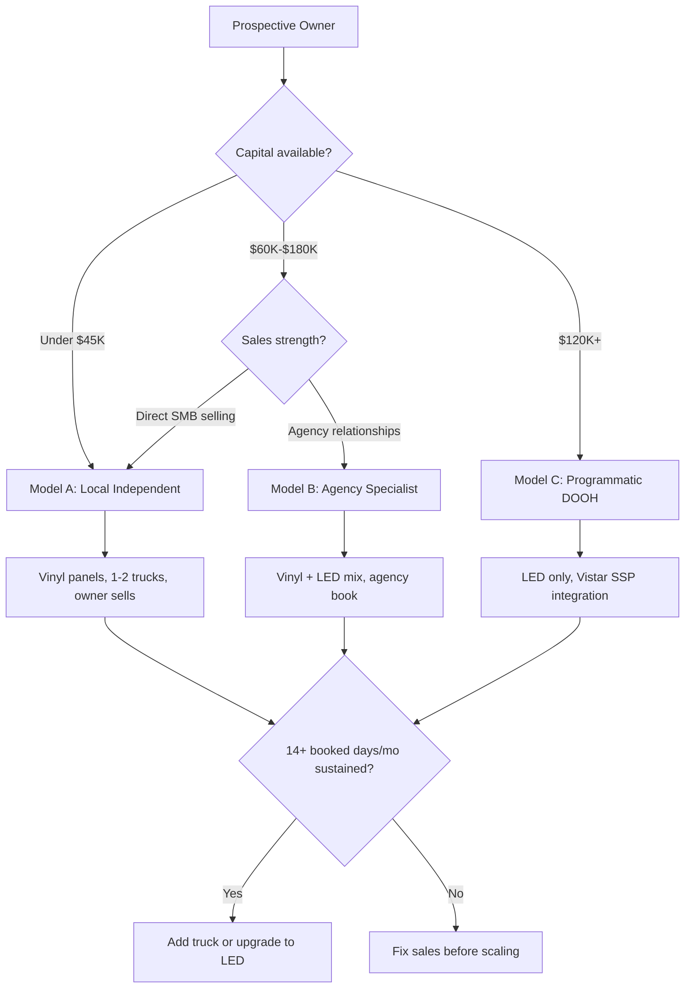

### Direct Answer

To start a mobile billboard advertising business in 2027, you acquire one display vehicle -- a box truck fitted with two- or three-sided backlit ad panels, a towable trailer billboard, or a glass-walled mobile LED truck -- for $18,000 to $145,000 all-in, then sell driven ad days to local advertisers, agencies, event marketers, and political campaigns. The business is **a B2B advertising sales operation wrapped around a vehicle**, not a passive billboard rental; revenue lives or dies on how many days per month you keep the truck booked, and a disciplined single-truck operator clears $55,000 to $95,000 in owner earnings by the end of a stabilized year two.

**TL;DR:** Mobile billboard advertising in 2027 is a real, durable, low-barrier media business with a fast-moving programmatic tailwind, but it is brutally sales-dependent. A vinyl-panel truck starts at under $25,000; an LED truck runs $90,000-$145,000. Expect 6-11 booked days per truck per month in year one and 13-18 once an agency book compounds. Day rates run $600-$1,800 for vinyl and $1,200-$3,500 for LED. The operators who win treat it as a relationship sales business, get geofencing attribution live early, and resist buying a second truck before the first one is consistently booked above 14 days a month. The ones who fail buy an LED truck on credit, wait for inbound calls that never come, and run out of cash in month seven.

---

## 1. What A Mobile Billboard Advertising Business Actually Is In 2027

Mobile billboard advertising -- also called moving media, mobile out-of-home (mobile OOH), or transit-style advertising -- is the business of selling ad placements on vehicles that physically drive an advertiser's message through chosen routes, neighborhoods, and events at chosen times. It sits inside the broader out-of-home (OOH) category alongside static billboards, transit ads, and place-based screens, but it differs in one decisive way: **you control where and when the impression happens.** A static billboard waits for traffic. A mobile billboard goes to the traffic.

### 1.1 The Core Value Proposition

The pitch to an advertiser is precision plus presence. A gym opening in a specific ZIP code can have its message driven past three competitor locations, two grocery store lots, and the high-school pickup line during the exact hours its prospects are out. A concert promoter can park a glowing LED truck outside the venue two hours before doors. A political campaign can saturate a swing precinct in the 72 hours before an election. None of this is available from a fixed billboard, and it is the reason mobile OOH commands a premium CPM despite lower total reach.

The honest framing for a prospective owner: this is not real estate income and it is not a franchise. It is a media sales business. The vehicle is inventory. Empty inventory earns nothing, depreciates, and still costs insurance, storage, and financing every single day. Your job is not to own a truck -- it is to sell the truck's calendar.

### 1.2 Who Buys Mobile Billboard Advertising

Five buyer segments fund this industry, and a healthy operator deliberately balances across them so no single category's seasonality sinks the year.

| Buyer segment | Typical spend | Booking horizon | Seasonality | Margin profile |
|---|---|---|---|---|
| Local SMBs (gyms, dentists, dispensaries, restaurants) | $800-$3,500 | 1-3 weeks | Steady | Solid, low-touch repeat |
| Marketing & ad agencies | $4,000-$25,000 | 4-10 weeks | Steady | Best -- account compounding |
| Event & experiential marketers | $1,500-$9,000 | 2-6 weeks | Concentrated (spring/summer) | High, but lumpy |
| Political campaigns | $5,000-$40,000 | 1-8 weeks | Election cycles | Very high, very lumpy |
| Real estate & developers | $1,200-$6,000 | 2-5 weeks | Steady | Solid |

The strategic read: local SMBs pay the bills, agencies build the enterprise value, events and politics produce the windfall quarters. Build all three legs.

### 1.3 What Changed By 2027

Three shifts separate the 2027 version of this business from the 2019 version. First, **programmatic DOOH (digital out-of-home) buying matured.** Supply-side platforms such as Vistar Media and demand-side integrations now let LED-truck inventory be bought the way digital display is bought -- in real time, against an audience target, with automated billing. A mobile operator with a digital truck and a Vistar relationship can fill otherwise-empty days from a national demand pool. Second, **geofencing attribution became table stakes.** Advertisers in 2027 expect a post-campaign report showing device IDs that entered the truck's route corridor and later visited the advertiser's location -- mobile OOH is no longer sold on "exposure" alone. Third, **vinyl-panel economics held while LED hardware costs fell**, widening the gap between the cheap on-ramp and the premium tier and making the vehicle-selection decision the single most consequential early choice (see section 7).

---

## 2. The Three Operating Models

There is no single "mobile billboard business." There are three distinct businesses that happen to share a vehicle type, and choosing the wrong one for your market and capital is the most common strategic error.

### 2.1 Model A: The Local Independent

You own one or two vinyl-panel box trucks or trailer billboards, you sell directly to local advertisers in one metro, and you do the driving yourself or with one part-time driver. Capital requirement is the lowest -- $18,000 to $40,000 all-in. This is the right model for an undercapitalized owner who is genuinely good at sales and willing to cold-call. Margins are healthy because overhead is thin, but the ceiling is real: one metro, vinyl-only premiums, and a calendar capped by how many days you personally can sell and drive.

### 2.2 Model B: The Agency-Channel Specialist

You position not as a local advertiser's vendor but as the **physical-media fulfillment arm for marketing agencies**. You may run two to five trucks, a mix of vinyl and LED, and 60-80% of your revenue comes from a dozen agency relationships rather than a hundred direct SMBs. This is the highest-enterprise-value model: agency accounts compound, churn is low, and a buyer of your business pays a multiple for contracted agency relationships they would not pay for a churny SMB book. Capital requirement is mid-range, $60,000 to $180,000, and the constraint is relationship-building patience, not money.

### 2.3 Model C: The Programmatic DOOH Operator

You run LED trucks exclusively, you integrate inventory into Vistar Media or a comparable SSP, and a meaningful share of your fill comes from automated programmatic demand rather than human-sold deals. Capital requirement is the highest -- $120,000 to $400,000+ for a multi-truck LED fleet -- and it is the most technically demanding. The upside is the most scalable and the most defensible; the downside is that an undersold LED truck financed at $2,400/month is the fastest way to insolvency in this industry.

The decision rule embedded in the diagram: **never let the model be chosen by aspiration.** Choose Model C because you have the capital and the SSP relationship lined up, not because LED trucks look impressive on Instagram.

---

## 3. The 2027 Out-Of-Home Market Reality

### 3.1 Market Size And Direction

Out-of-home advertising in the United States is a roughly $9 billion annual category as tracked by the Out of Home Advertising Association of America (OAAA), and it has been one of the few traditional media categories to grow rather than shrink across the streaming era -- OOH cannot be skipped, blocked, or scrolled past. Digital OOH is the growth engine within that total, now well over a third of category revenue and climbing. Mobile billboard advertising is a small slice of the whole -- low single-digit billions -- but it is the slice growing fastest in percentage terms because it is where the precision-targeting and programmatic-buying trends converge.

### 3.2 Why The Tailwind Is Real

The structural case for the category, not just hype:

- **Ad-blocking immunity.** A driven billboard cannot be blocked, muted, or skipped, which is increasingly valuable as digital ad fraud and viewability problems erode trust in programmatic display.
- **Cookie deprecation pushed budgets to context.** As behavioral targeting got harder, contextual and geographic targeting got more valuable -- and mobile OOH is pure geographic context.
- **Attribution closed the credibility gap.** Geofencing means a mobile campaign can now be measured, which moved it from a "brand awareness" line item agencies tolerated to a "performance" line item agencies actively buy.

### 3.3 Why It Is Still Hard

The tailwind does not make the business easy. Demand exists, but it does not call you. Every booked day in year one is a day you personally sold. The category grows; your truck does not auto-fill. This is the single most important expectation to set before spending a dollar.

---

## 4. The Core Unit Economics: Booked Days Per Truck Per Month

Everything in this business reduces to one number: **booked days per truck per month.** A truck has roughly 22-26 sellable weekdays a month (weekends sell too, but at event premiums). Owner earnings are almost entirely a function of how many of those days carry a paying campaign.

### 4.1 The Utilization Ladder

| Stage | Booked days/truck/mo | Vinyl monthly revenue | LED monthly revenue | Owner read |
|---|---|---|---|---|
| Launch (months 1-3) | 4-8 | $3,000-$8,000 | $6,000-$16,000 | Below break-even -- expected |
| Ramp (months 4-9) | 8-13 | $7,000-$15,000 | $14,000-$32,000 | Approaching break-even |
| Stabilized (months 10+) | 13-18 | $13,000-$24,000 | $26,000-$52,000 | Healthy owner income |
| Saturated single truck | 18-22 | $20,000-$32,000 | $40,000-$66,000 | Time to add a truck |

The numbers blend day rates and assume a realistic mix of short SMB bookings and longer agency runs. A truck booked 6 days a month loses money. A truck booked 16 days a month makes a living. The entire job of years one and two is climbing that ladder.

### 4.2 The Math That Kills New Operators

A new owner sees "$1,400 per day" and a 24-weekday month and mentally books $33,600. The truck booked 7 real days earns $9,800 -- and the financing, insurance, fuel, and storage do not scale down with utilization. **Fixed costs are 100% whether the truck books 0 days or 22.** This is why undercapitalized LED launches fail: the cost base assumes a booked truck; the calendar delivers an empty one.

---

## 5. The Line-By-Line Unit Economics And P&L

The table below models a stabilized single-truck operation at year two for both a vinyl-panel box truck and an LED truck, at 15 booked days per month.

| Line item | Vinyl box truck (15 days/mo) | LED truck (15 days/mo) |
|---|---|---|
| Gross monthly revenue | $16,500 | $34,000 |
| Annual gross revenue | $198,000 | $408,000 |
| Driver wages (PT) | $26,000 | $34,000 |
| Fuel | $11,000 | $14,000 |
| Insurance (commercial auto + GL) | $9,500 | $12,000 |
| Vehicle maintenance & tires | $6,500 | $8,500 |
| Vinyl reprints / LED content ops | $7,000 | $4,500 |
| Storage / yard | $3,600 | $4,800 |
| Software (CRM, geofencing, SSP fees) | $4,200 | $9,000 |
| Marketing & sales tools | $5,500 | $7,500 |
| Financing payments | $7,200 | $26,400 |
| Admin, accounting, phone, misc | $6,000 | $7,500 |
| **Total operating cost** | **$94,000** | **$128,700** |
| **Owner earnings (pre-tax)** | **$104,000** | **$279,300** |

### 5.1 Reading The P&L Honestly

The LED line looks dramatically better, and at 15 sustained booked days it is. But the LED truck's break-even sits near 9-10 booked days versus 5-6 for vinyl, and its financing payment is the single largest line on the sheet. The vinyl truck is forgiving; the LED truck is leveraged. A vinyl operator who has a slow month survives it. An LED operator who has a slow month eats into reserves fast.

### 5.2 The Reserve Rule

Regardless of model, a new operator should not launch without **four to six months of fixed costs in reserve** -- roughly $20,000 for a vinyl single-truck operation and $60,000+ for an LED one. This reserve is not optional capital; it is the bridge across the launch trough where booked days are 4-8 and revenue is below break-even. Operators who skip the reserve are betting the business on the calendar filling faster than the average, and the average is not on their side.

---

## 6. Pricing And Day-Rate Versus CPM Strategy

### 6.1 The Two Pricing Languages

Mobile billboard inventory is sold in two languages, and a competent operator speaks both.

- **Day rate** is the SMB and event language: "$900 for a 6-hour driven day in your target ZIP." It is simple, it closes fast, and it is how 70%+ of a local independent's revenue is priced.
- **CPM (cost per thousand impressions)** is the agency and programmatic language. Agencies buy mobile OOH against an impression target measured by mobility data, and they expect a CPM they can compare against other media. Mobile OOH CPMs in 2027 typically run $7-$18 depending on market and vehicle type.

The operator who can only quote a day rate is locked out of agency budgets. The operator who can produce a CPM-and-impressions proposal -- "this route delivers an estimated 340,000 impressions over 5 days at a $12 CPM" -- gets onto agency media plans.

### 6.2 Indicative 2027 Rate Card

| Inventory | Day rate (6-hr) | Weekly rate | Notes |
|---|---|---|---|
| Vinyl box truck, single market | $600-$1,100 | $2,800-$4,800 | SMB workhorse |
| Vinyl 3-sided / glass truck | $850-$1,500 | $3,800-$6,500 | Premium static |
| Towable trailer billboard | $450-$900 | $2,200-$4,000 | Parked-heavy, low fuel |
| LED digital truck | $1,200-$2,400 | $5,500-$11,000 | Multi-advertiser rotation possible |
| LED truck, event premium | $2,200-$3,500 | -- | Concerts, conventions, game days |

### 6.3 The Discounting Trap

New operators discount to win the first deals, then discover the whole market now expects the discounted price. The discipline: hold the rate card and concede on **terms** (longer commitment, flexible routing, off-peak days) rather than on price. A truck booked at $1,400 ten days a month beats a truck booked at $900 thirteen days a month -- $14,000 versus $11,700 -- and the cheap-truck operator works harder for less.

---

## 7. Vehicle Selection And The Initial Capex Plan

The vehicle decision sets the cost base, the day rate, the break-even point, and the model -- it is the highest-leverage early choice.

### 7.1 The Four Vehicle Categories

| Vehicle type | All-in cost | Day rate ceiling | Best for | Key risk |
|---|---|---|---|---|
| Towable trailer billboard | $4,000-$14,000 | $900 | Capital-thin start, parked campaigns | Limited routes, lower premium |
| Vinyl-wrapped box truck | $18,000-$40,000 | $1,500 | Local independent (Model A) | Reprint cost per campaign |
| Glass / 3-sided static truck | $30,000-$55,000 | $1,500 | Premium static positioning | Still vinyl reprint economics |
| LED digital truck | $90,000-$145,000 | $3,500 | Agency & programmatic (Models B/C) | Financing weight, content ops |

### 7.2 The Recommended On-Ramp

For the large majority of new operators, the right entry vehicle is **a used reliable box truck with custom vinyl panel frames** -- $18,000 to $30,000 all-in, including the truck, the panel buildout, the first wrap, and registration. It keeps break-even near 5-6 booked days, leaves cash for the reserve and for sales, and lets you prove you can sell before you take on LED-scale financing. Buy the LED truck with profits from the vinyl truck, not with launch capital.

### 7.3 Capex Plan, Vinyl Single-Truck Launch

| Item | Cost |
|---|---|
| Used box truck (reliable, 100-180K miles) | $14,000-$22,000 |
| Panel frames + lighting buildout | $3,500-$6,500 |
| First vinyl wrap / panel print | $1,200-$2,800 |
| Registration, DOT, decals | $600-$1,400 |
| **Vehicle subtotal** | **$19,300-$32,700** |

---

## 8. Startup Cost Breakdown: The Honest All-In Number

The vehicle is roughly half of what it actually costs to be open and selling. The full picture for a vinyl single-truck launch:

| Category | Low | High |
|---|---|---|
| Vehicle + buildout (section 7) | $19,300 | $32,700 |
| Insurance down payment / first quarter | $2,800 | $4,500 |
| CRM + geofencing/attribution software setup | $900 | $2,400 |
| Branding, website, sales collateral, samples | $1,800 | $4,500 |
| Legal / LLC / contracts / permit research | $1,200 | $3,000 |
| Working capital + 4-6 mo reserve | $18,000 | $30,000 |
| Initial sales/marketing spend | $2,500 | $6,000 |
| **Total all-in** | **$46,500** | **$83,100** |

### 8.1 LED Launch For Comparison

An LED single-truck launch runs $135,000 to $235,000 all-in once the larger reserve, the financing structure, and the content-operations setup are included. The gap between the two on-ramps -- roughly $50,000 versus $185,000 -- is the clearest argument for starting vinyl. Compare this capital profile against adjacent mobile-service businesses such as mobile RV repair (q2145) and mobile ADAS windshield calibration (q2148), where the vehicle is also the core asset but the revenue is service-hours rather than ad-days.

---

## 9. The Year-One Operating Reality

### 9.1 The Quarter-By-Quarter Arc

| Quarter | Booked days/mo | Revenue/mo | What is actually happening |
|---|---|---|---|
| Q1 (months 1-3) | 4-8 | $3,000-$8,000 | Pure cold outreach, building first references, losing money |
| Q2 (months 4-6) | 7-11 | $6,000-$13,000 | First repeat bookings, first small agency test, near break-even |
| Q3 (months 7-9) | 9-14 | $9,000-$17,000 | Agency relationships open, referrals start, break-even crossed |
| Q4 (months 10-12) | 11-16 | $12,000-$22,000 | Pipeline compounds, first profitable quarter |

### 9.2 The Daily Reality

Year one is a sales job with a truck attached. A realistic owner's day: two to three hours of outbound prospecting (calls, emails, agency follow-ups), one to two hours of proposal and route planning, route driving or driver coordination, and an hour of attribution reporting and invoicing. The owners who treat the truck as the business and the selling as a chore stall at 6-8 booked days. The owners who treat selling as the business and the truck as inventory climb the ladder.

---

## 10. Regulations And Permitting: The Pre-Launch Map You Cannot Skip

Mobile billboard advertising is **regulated unevenly and sometimes restrictively**, and the regulatory map must be checked before any vehicle is bought. A few markets effectively ban dedicated mobile billboard vehicles, and many more restrict where they may park, idle, or drive.

### 10.1 The Five Regulatory Layers

| Layer | What it governs | How to clear it |
|---|---|---|
| Municipal mobile-billboard ordinances | Whether dedicated ad vehicles are allowed at all; parking/idling rules | Read the city code; call the clerk before buying |
| State DOT / commercial vehicle rules | Registration class, weight, lighting, driver licensing | Confirm whether a CDL is required for your truck weight |
| Distracted-driving / digital display law | LED brightness, motion, dwell while in motion | Restrict LED motion near roadways; follow OAAA digital guidance |
| Event / venue permits | Where you may park or stage at events | Per-event permits; build into event quotes |
| FCC / content standards | Prohibited content categories | Standard ad-acceptance policy |

### 10.2 The Non-Negotiable Step

Before you buy a vehicle, confirm in writing -- or at minimum in a documented call -- that your target metro permits the operation you intend. Operators have bought $120,000 LED trucks only to discover their city restricts mobile billboards to private property. This single hour of research is the cheapest insurance in the entire startup.

---

## 11. Sales Pipeline And The Daily Calling Reality

### 11.1 The Pipeline Stages

| Stage | Definition | Healthy conversion to next |
|---|---|---|
| Prospect | Identified target advertiser/agency | 25-35% to contacted |
| Contacted | Real conversation had | 30-40% to proposal |
| Proposal | Route + impressions + price sent | 30-45% to booked |
| Booked | Signed and scheduled | 55-70% to repeat |
| Repeat | Booked again | -- |

### 11.2 The Math Of A Full Calendar

To keep a single truck booked 15 days a month with an average campaign of 4 days, you need roughly four new campaigns booked monthly. At the conversion rates above, that requires about 10-14 proposals out, 30+ real conversations, and 90-120 prospects worked. **Empty calendar is always an empty top-of-funnel.** When booked days drop, the answer is never "wait" -- it is "prospect more."

### 11.3 The Account-Compounding Principle

A direct SMB might book twice and churn. An agency that has a good experience puts you on its standing media-plan rotation and books across multiple clients. This is why the agency channel is worth disproportionate effort: one strong agency relationship can be worth 30 SMB cold calls. The local-independent model that never courts agencies is choosing the harder treadmill -- the same trap that catches single-channel operators in adjacent local-service businesses like window tinting (q2140) and garage door repair (q2138), where referral and B2B channels outperform endless direct outreach.

---

## 12. Geofencing, Attribution, And Programmatic Integration

### 12.1 Why Attribution Is Now Mandatory

In 2027, an advertiser who buys a mobile campaign expects a post-campaign report. The standard deliverable: a geofence drawn around the truck's route corridor, mobile-location data showing devices that entered that corridor during the campaign, and a measured lift in visits to the advertiser's location among exposed devices. Without this, you are selling "exposure" in a market that buys "results."

### 12.2 The Attribution Stack

| Component | Purpose | Typical 2027 monthly cost |
|---|---|---|
| GPS truck tracking | Verifiable route logs (proof of delivery) | $20-$60 |
| Geofencing / location-data platform | Device exposure + conversion lift | $150-$600 |
| CRM | Pipeline, proposals, repeat tracking | $40-$150 |
| Programmatic SSP (LED only) | Automated demand fill | Revenue share, ~10-20% |

### 12.3 The Vistar Media Path For LED Operators

For an LED-truck operator, integrating inventory into a supply-side platform such as Vistar Media converts otherwise-empty days into automated revenue. National advertisers buying programmatic DOOH through demand-side platforms can have their creative served on your truck against an audience target, billed automatically. It will not replace direct selling -- programmatic fill is incremental, typically 15-30% of an LED truck's calendar -- but it raises the floor. This is the structural reason Model C exists: an integrated LED truck is never fully empty.

---

## 13. Fleet Operations, Drivers, And Routing

### 13.1 Drivers

A single vinyl truck can be driven part-time by the owner at launch; by the ramp stage, a part-time driver at $18-$26/hour frees the owner to sell. The driver's job is more than steering -- they are the campaign's quality control: confirming the wrap is clean, the route is followed, the GPS log is running, and event staging happens on time. A bad driver who skips the route corridor turns a measurable campaign into an unverifiable one.

### 13.2 Routing

Routing is a deliverable, not an afterthought. Each campaign's route is built around the advertiser's target geography: a corridor that maximizes time in the target ZIPs, passes the right anchor points (competitor locations, traffic generators), and runs during the hours the advertiser's audience is out. A documented, GPS-verified route is what makes the attribution report credible.

### 13.3 Maintenance Discipline

The vehicle is the inventory; a truck in the shop earns zero and may force a refund. Preventive maintenance -- tires, brakes, oil, panel lighting, LED panel health -- is scheduled around the booking calendar, not deferred until failure. A single-truck operator with no backup vehicle is one breakdown away from a missed campaign, which is an argument for either a maintenance reserve or, at scale, a spare unit.

---

## 14. The Five-Year Revenue Trajectory

| Year | Trucks | Avg booked days/mo | Gross revenue | Owner earnings (pre-tax) |
|---|---|---|---|---|
| 1 | 1 vinyl | 8 | $84,000 | $12,000-$24,000 |
| 2 | 1 vinyl | 15 | $198,000 | $85,000-$110,000 |
| 3 | 2 (vinyl + LED) | 15 / 13 | $470,000 | $150,000-$200,000 |
| 4 | 3 (1 vinyl, 2 LED) | 16 avg | $820,000 | $220,000-$300,000 |
| 5 | 4-5 mixed fleet | 16 avg | $1.3M-$1.7M | $300,000-$430,000 |

### 14.1 Reading The Trajectory

The trajectory assumes the operator does the hard thing in years one and two -- proves the sales engine on a single vinyl truck before scaling -- and the easy-looking thing in years three through five -- adds capacity only behind sustained 14+ booked-day demand. The single biggest determinant of whether an operator hits the year-five line or stalls at year two is **discipline about when to add the next truck.**

---

## 15. Five Named Real-World Operating Scenarios

The names below are illustrative composites, but the company contexts and the public companies referenced are real.

### 15.1 Scenario A: The Disciplined Vinyl Operator

Marcus runs one vinyl box truck in a mid-size Sun Belt metro. He spends his mornings cold-calling and lands a standing relationship with a regional gym chain and two real-estate developers. He hits 16 booked days a month by month eleven, clears roughly $95,000 in year two, and only then buys a second truck. He never financed beyond his comfort and never had a cash-crisis month.

### 15.2 Scenario B: The Overleveraged LED Launch

Dana buys a $135,000 LED truck on a five-year note before booking a single client, reasoning the truck "sells itself." It does not. At 6 booked days a month against a $2,400 financing payment, she burns reserves by month seven and sells the truck at a loss. The failure was not the vehicle -- it was buying capacity before demand.

### 15.3 Scenario C: The Agency-Channel Specialist

Priya skips direct SMB selling and spends six months building relationships with eight regional marketing agencies, positioning her two-truck operation as their mobile-OOH fulfillment partner. Revenue is lumpier early but by year three, 75% of bookings come from standing agency rotations, churn is minimal, and the business is genuinely sellable.

### 15.4 Scenario D: The Programmatic Integrator

James runs three LED trucks integrated into Vistar Media's SSP. Roughly a quarter of his calendar fills programmatically from national DOOH demand, smoothing the troughs between directly sold campaigns. His direct sales team focuses on premium event work while programmatic carries the baseline.

### 15.5 Scenario E: The Event-And-Politics Specialist

Carla builds her year around concentrated windfalls -- summer festival season and election cycles. In an election year she clears outsized revenue from political campaigns and PACs; in off years she leans hard on events and experiential agencies. Her trap, which she manages deliberately, is the lumpiness: a great year can mask the need to rebuild the off-year pipeline. The same boom-bust seasonality discipline applies to event-driven adjacent businesses such as balloon decor (q2149) and mobile drug testing (q2150), where contract concentration cuts both ways.

---

## 16. Risk Management And Insurance

### 16.1 The Insurance Stack

| Coverage | Why it is required | Indicative annual cost (vinyl single truck) |
|---|---|---|
| Commercial auto liability | The truck is a commercial vehicle on public roads | $4,500-$8,000 |
| General liability | Third-party claims, event staging incidents | $900-$2,000 |
| Physical damage / collision | Protects the asset itself | $1,800-$3,500 |
| Inland marine / equipment (LED) | Covers the LED panel hardware specifically | $1,200-$3,000 |
| Workers' comp (with employees) | Driver coverage, legally required | Varies by state and payroll |

### 16.2 The Real Risk Map

Insurance covers accidents; it does not cover the structural risks. The top three:

- **Single-truck concentration.** One vehicle, one breakdown, one missed campaign. Mitigation: maintenance reserve, vendor relationship with a backup, or a second truck once revenue supports it.
- **Customer concentration.** A political year that is 50% of revenue evaporates the next year. Mitigation: deliberate buyer-segment balance per section 1.2.
- **Regulatory change.** A city can tighten mobile-billboard rules after you have launched. Mitigation: geographic flexibility and not over-indexing on a single restrictive municipality.

---

## 17. Competitor Landscape, Financing, And Business Structure

### 17.1 Who You Compete With

You compete on three fronts: other mobile billboard operators in your metro, the static-billboard owners (often large operators) selling fixed inventory, and the broader digital-advertising channel for the same SMB budget. The mobile operator's edge against all three is precision and presence -- you go where the audience is, you cannot be skipped, and you can be measured. The losing posture is competing on price against trailer-billboard discounters; the winning posture is competing on attribution and targeting against everyone.

### 17.2 Financing The Business

| Source | Best for | Notes |
|---|---|---|
| Owner cash / savings | The reserve, vinyl launch | Cheapest capital; preserves flexibility |
| SBA 7(a) loan | LED truck, multi-truck scaling | Requires a track record; not a launch tool |
| Equipment financing | The LED truck specifically | The truck is the collateral |
| Vehicle dealer financing | Used box truck | Simple, but watch the rate |

The financing principle: **finance the second truck, fund the first one.** Launch-stage debt against an unproven sales engine is the single most common cause of failure in this business.

### 17.3 Business Structure And Taxes

An LLC is the standard structure -- liability separation matters when commercial vehicles are on public roads. As profit grows, an S-corp election can reduce self-employment tax. The vehicle is a depreciable asset, and Section 179 / bonus depreciation can be meaningful in the purchase year; this is worth a CPA conversation before the truck is bought, not after.

---

## 18. Common Year-One Mistakes That Kill The Business

1. **Buying the LED truck first.** The most expensive mistake. Capacity before demand, financing before revenue.
2. **Waiting for inbound.** No one calls a new mobile billboard company. Every year-one day is sold.
3. **Discounting the rate card.** Trains the whole market to expect the low price; concede terms, not price.
4. **Skipping the regulatory check.** Buying a truck for a metro that restricts the operation.
5. **No attribution stack.** Selling "exposure" in a market that buys measured results.
6. **Ignoring agencies.** Choosing the SMB-only treadmill over the compounding agency channel.
7. **Launching without a reserve.** No bridge across the launch trough; insolvent before break-even.
8. **Scaling on a lucky quarter.** Adding a truck behind a political windfall, not behind sustained demand.

---

## 19. Counter-Case: Why Starting A Mobile Billboard Advertising Business In 2027 Might Be A Mistake

A balanced answer has to make the case against. There are real reasons this business is the wrong choice for many people.

### 19.1 It Is A Sales Business In Disguise

People are drawn to mobile billboards because the truck is tangible and the idea is simple. But the truck is the easy part. The business is **relentless B2B advertising sales**, and someone who does not enjoy or is not good at cold outreach, proposal-writing, and relationship-building will own a depreciating asset and an empty calendar. If you would not start a B2B sales agency, you should think hard before starting this -- because that is what this is.

### 19.2 The Capital-Light Version Has A Low Ceiling

The honest on-ramp -- a vinyl box truck -- works, but the local-independent model is capped: one metro, vinyl premiums, a calendar limited by one owner's selling capacity. Genuine wealth in this industry comes from the agency and programmatic models, which require either patience for relationship-building or substantial capital. The cheap version is a decent owner-operator income, not a scalable enterprise.

### 19.3 Regulatory And Concentration Fragility

A single restrictive ordinance can constrain a business after launch. A single-truck operator is one breakdown from a refunded campaign. A political-heavy operator faces a revenue cliff every off year. These are structural fragilities, not bad luck, and they demand active management.

### 19.4 Who Should Not Start This

A person seeking passive income, a person who dislikes selling, a person without a four-to-six-month reserve, and a person in a market they have not regulatory-checked. For those people, a more deliverable-driven mobile business -- where revenue comes from completed service work rather than sold ad-days -- may fit better; see mobile RV repair (q2145), mobile ADAS windshield calibration (q2148), and laundromat (q2153) for models with different demand dynamics.

### 19.5 When It Is The Right Choice

It is the right choice for a capable B2B seller who genuinely enjoys the hunt, who launches capital-light, who builds an agency book deliberately, and who treats the truck as inventory to be sold rather than an asset to be admired. For that person, mobile billboard advertising in 2027 is a real, durable, growing business with a programmatic tailwind and a clear path to a multi-truck enterprise.

---

## 20. The Decision Framework

Run honestly through these before committing capital:

1. **Do I genuinely enjoy B2B sales?** If no, stop here -- this is a sales business.
2. **Can I fund a vinyl launch ($46K-$83K) with a four-to-six-month reserve?** If no, save first.
3. **Have I confirmed my metro permits the operation?** If no, do this before anything else.
4. **Do I have a realistic 90-day plan to work 90-120 prospects?** If no, build it.
5. **Am I committed to launching vinyl and earning the LED truck?** If no, reconsider Model C.
6. **Will I get the attribution stack live before the first campaign?** If no, fix the plan.

Six clear yeses means a disciplined launch is reasonable. Any no is a fixable gap -- fix it before the truck is bought, not after.

### 20.1 The Bottom Line

Mobile billboard advertising in 2027 is one of the more accessible real media businesses available to a determined operator: low capital-light entry, a genuine programmatic tailwind, immunity to ad-blocking, and now-credible attribution. It rewards selling discipline and punishes leverage-before-demand. Launch with one vinyl truck, sell every day yourself, build the agency book, get attribution live early, hold the rate card, keep the reserve intact, and add the next truck only behind sustained demand. Do that, and the path from a single $25,000 truck to a multi-truck media company is real. For more on adjacent vehicle-asset and local-advertising business models, see window tinting (q2140), garage door repair (q2138), mobile RV repair (q2145), mobile ADAS windshield calibration (q2148), mobile drug testing (q2150), and laundromat (q2153).

---

## Sources

1. Out of Home Advertising Association of America (OAAA) -- U.S. OOH industry revenue data and annual reports. https://oaaa.org
2. OAAA -- Digital out-of-home (DOOH) share-of-revenue trend data.
3. OAAA -- Out-of-home advertising digital signage and brightness guidance.
4. Vistar Media -- Programmatic DOOH supply-side platform overview. https://vistarmedia.com
5. Vistar Media -- Mobile and transit DOOH inventory integration documentation.
6. Vistar Media -- Programmatic DOOH demand-side buying mechanics.
7. AdQuick -- OOH marketplace, pricing, and campaign reporting platform. https://adquick.com
8. AdQuick -- Mobile billboard CPM and day-rate benchmark data.
9. AdQuick -- OOH attribution and measurement methodology.
10. U.S. Small Business Administration -- SBA 7(a) loan program terms and eligibility.
11. U.S. Small Business Administration -- equipment financing guidance for small businesses.
12. Internal Revenue Service -- Section 179 expensing and bonus depreciation for business vehicles.
13. Internal Revenue Service -- S-corporation election and self-employment tax treatment.
14. U.S. Department of Transportation -- Federal Motor Carrier Safety Administration commercial vehicle classification.
15. FMCSA -- commercial driver's license (CDL) weight-class requirements.
16. U.S. Bureau of Labor Statistics -- wage data for delivery and commercial vehicle drivers.
17. U.S. Bureau of Labor Statistics -- advertising and related services industry employment data.
18. Geopath -- out-of-home audience measurement and impressions methodology.
19. Geopath -- mobility-data-based OOH impression estimation.
20. Insurance Information Institute -- commercial auto insurance overview.
21. Insurance Information Institute -- general liability insurance for small businesses.
22. Interactive Advertising Bureau (IAB) -- digital out-of-home programmatic standards.
23. IAB -- contextual targeting and post-cookie advertising trends.
24. Nielsen -- out-of-home advertising effectiveness and recall studies.
25. eMarketer / Insider Intelligence -- U.S. DOOH ad-spend forecasts.
26. Outdoor Advertising Association of America -- municipal ordinance and permitting overviews.
27. National Conference of State Legislatures -- distracted-driving and digital-display law summaries.
28. Federal Communications Commission -- advertising content standards.
29. Place Exchange -- programmatic OOH marketplace and mobile inventory data.
30. Adomni -- digital OOH and mobile LED truck advertising platform benchmarks.
31. SBA -- small business reserve and working-capital planning guidance.
32. U.S. Census Bureau -- advertising agency and media services industry statistics.

## Related Pulse Library Entries

- How do you start a window tinting business in 2027? (q2140)
- How do you start a garage door repair business in 2027? (q2138)
- How do you start a mobile RV repair business in 2027? (q2145)
- How do you start a mobile ADAS windshield calibration business in 2027? (q2148)
- How do you start a mobile drug testing business in 2027? (q2150)
- How do you start a laundromat business in 2027? (q2153)
