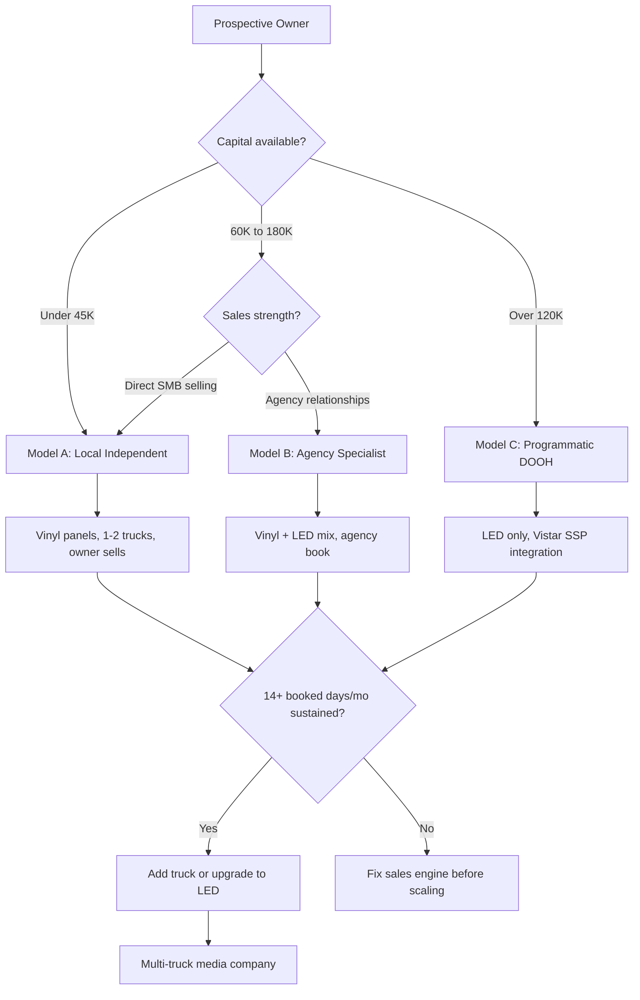

### Direct Answer

To start a mobile billboard advertising business in 2027, you acquire one display vehicle -- a box truck fitted with two- or three-sided backlit ad panels, a towable trailer billboard, or a glass-walled mobile LED truck -- for $18,000 to $145,000 all-in, then sell driven ad days to local advertisers, agencies, event marketers, and political campaigns. The business is **a B2B advertising sales operation wrapped around a vehicle**, not a passive billboard rental; revenue lives or dies on how many days per month you keep the truck booked, and a disciplined single-truck operator clears $55,000 to $110,000 in owner earnings by the end of a stabilized year two.

**TL;DR:** Mobile billboard advertising in 2027 is a real, durable, low-barrier media business riding a fast-moving programmatic out-of-home tailwind, but it is brutally sales-dependent. A vinyl-panel truck starts at under $25,000; an LED truck runs $90,000-$145,000. Expect 6-11 booked days per truck per month in year one and 13-18 once an agency book compounds. Day rates run $600-$1,800 for vinyl and $1,200-$3,500 for LED. The operators who win treat it as a relationship sales business, get geofencing attribution live early, integrate LED inventory into a programmatic supply-side platform, and resist buying a second truck before the first one is consistently booked above 14 days a month. The ones who fail buy an LED truck on credit, wait for inbound calls that never come, and run out of cash in month seven. This guide covers the three operating models, the line-by-line P&L, the regulatory map, pricing, the sales pipeline, attribution, financing, the five-year trajectory, and an honest counter-case.

---

## 1. What A Mobile Billboard Advertising Business Actually Is In 2027

Mobile billboard advertising -- also called moving media, mobile out-of-home (mobile OOH), or transit-style advertising -- is the business of selling ad placements on vehicles that physically drive an advertiser's message through chosen routes, neighborhoods, and events at chosen times. It sits inside the broader out-of-home (OOH) category alongside static billboards, transit ads, street furniture, and place-based screens, but it differs from all of them in one decisive way: **you control where and when the impression happens.** A static billboard waits for traffic. A mobile billboard goes to the traffic.

### 1.1 The Core Value Proposition

The pitch to an advertiser is precision plus presence. A gym opening in a specific ZIP code can have its message driven past three competitor locations, two grocery store lots, and the high-school pickup line during the exact hours its prospects are out. A concert promoter can park a glowing LED truck outside the venue two hours before doors. A political campaign can saturate a swing precinct in the seventy-two hours before an election. A real-estate developer can drive a new community's launch message through the feeder neighborhoods its likely buyers already live in. None of this is available from a fixed billboard, and it is the reason mobile OOH commands a premium CPM despite delivering lower total reach than a large-format static board on a freeway.

The honest framing for a prospective owner: this is not real estate income and it is not a franchise. It is a media sales business. The vehicle is inventory. Empty inventory earns nothing, depreciates, and still costs insurance, storage, and financing every single day. Your job is not to own a truck -- it is to sell the truck's calendar. The operators who internalize that succeed; the ones who do not stall at six booked days a month and quietly fold.

### 1.2 Who Buys Mobile Billboard Advertising

Five buyer segments fund this industry, and a healthy operator deliberately balances across them so no single category's seasonality sinks the year.

| Buyer segment | Typical spend | Booking horizon | Seasonality | Margin profile |
|---|---|---|---|---|
| Local SMBs (gyms, dentists, dispensaries, restaurants) | $800-$3,500 | 1-3 weeks | Steady year-round | Solid, low-touch repeat |
| Marketing & ad agencies | $4,000-$25,000 | 4-10 weeks | Steady | Best -- account compounding |
| Event & experiential marketers | $1,500-$9,000 | 2-6 weeks | Concentrated spring/summer | High but lumpy |
| Political campaigns & PACs | $5,000-$40,000 | 1-8 weeks | Election cycles | Very high, very lumpy |
| Real estate & developers | $1,200-$6,000 | 2-5 weeks | Steady | Solid, repeatable |

The strategic read: local SMBs pay the monthly bills, agencies build the enterprise value, events and politics produce the windfall quarters. A business leaning entirely on one segment is fragile. The local-independent who serves only SMBs has a low ceiling. The operator who lives on political work has a revenue cliff every off-year. Build all three legs, and weight them deliberately so no single segment is more than roughly a third of revenue.

### 1.3 What Changed By 2027

Three shifts separate the 2027 version of this business from the 2019 version, and understanding them is the difference between launching into a tailwind and launching into a headwind.

First, **programmatic DOOH (digital out-of-home) buying matured.** Supply-side platforms such as Vistar Media now let LED-truck inventory be bought the way digital display is bought -- in real time, against an audience target, with automated billing. A mobile operator with a digital truck and an SSP relationship can fill otherwise-empty days from a national pool of demand created by media buyers who never speak to the operator at all. This did not exist meaningfully a decade ago.

Second, **geofencing attribution became table stakes.** Advertisers in 2027 expect a post-campaign report showing device IDs that entered the truck's route corridor and later visited the advertiser's location. Mobile OOH is no longer sold on "exposure" alone -- it is sold on measured visit lift. The operator who cannot produce that report is selling a 2015 product into a 2027 market.

Third, **vinyl-panel economics held while LED hardware costs fell**, widening the gap between the cheap on-ramp and the premium tier. A used vinyl box truck still costs roughly what it did; an LED truck costs less than it once did but is still a six-figure commitment. That widening gap makes the vehicle-selection decision the single most consequential early choice an owner makes -- which is why section 7 is the longest in this guide.

---

## 2. The Three Operating Models

There is no single "mobile billboard business." There are three distinct businesses that happen to share a vehicle type, and choosing the wrong one for your market and capital is the most common strategic error a new operator makes.

### 2.1 Model A: The Local Independent

You own one or two vinyl-panel box trucks or trailer billboards, you sell directly to local advertisers in one metropolitan area, and you do the driving yourself or with one part-time driver. Capital requirement is the lowest of the three -- $18,000 to $40,000 for the vehicle and buildout, $46,000 to $83,000 fully loaded with reserve. This is the right model for an undercapitalized owner who is genuinely good at sales and willing to cold-call. Margins are healthy because overhead is thin. But the ceiling is real and should be understood going in: one metro, vinyl-only premiums, and a calendar capped by how many days one owner can personally sell and drive. Model A is an excellent owner-operator income. It is not, by itself, a scalable enterprise -- and that is a feature, not a flaw, for the operator who wants a strong personal living rather than an empire.

### 2.2 Model B: The Agency-Channel Specialist

You position not as a local advertiser's vendor but as the **physical-media fulfillment arm for marketing agencies**. You may run two to five trucks, a mix of vinyl and LED, and 60-80% of your revenue comes from a dozen standing agency relationships rather than a hundred churny direct SMBs. This is the highest-enterprise-value model. Agency accounts compound -- one good campaign puts you on a standing media-plan rotation -- churn is low, and a buyer of your business pays a real multiple for contracted agency relationships they would never pay for an SMB book that turns over every quarter. Capital requirement is mid-range, $60,000 to $180,000. The binding constraint here is not money. It is the patience to spend six months building relationships before the revenue compounds, and the discipline to keep delivering flawless attribution reports so the agency keeps coming back.

### 2.3 Model C: The Programmatic DOOH Operator

You run LED trucks exclusively, you integrate inventory into Vistar Media or a comparable supply-side platform, and a meaningful share of your fill comes from automated programmatic demand rather than human-sold deals. Capital requirement is the highest -- $120,000 to $400,000 and beyond for a multi-truck LED fleet. It is also the most technically demanding: content operations, SSP integration, dynamic creative, and brightness compliance all become daily concerns. The upside is the most scalable and the most defensible position in the industry. The downside is unforgiving: an undersold LED truck financed at $2,400 a month is the fastest route to insolvency in this entire business.

The decision rule embedded in the diagram: **never let the model be chosen by aspiration.** Choose Model C because you have the capital and the SSP relationship lined up, not because LED trucks look impressive on social media. The most common fatal error in this industry is an owner who belongs in Model A buying themselves into Model C on credit. Almost every operator should start in Model A regardless of capital, because Model A is where you cheaply learn whether you can actually sell -- the skill that determines success in all three.

---

## 3. The 2027 Out-Of-Home Market Reality

### 3.1 Market Size And Direction

Out-of-home advertising in the United States is a roughly $9 billion annual category as tracked by the Out of Home Advertising Association of America (OAAA), and it has been one of the few traditional media categories to grow rather than shrink across the streaming era. The reason is structural: OOH cannot be skipped, blocked, scrolled past, or muted. Digital OOH is the growth engine within that total -- now well over a third of category revenue and climbing every year. Mobile billboard advertising is a small slice of the whole, low single-digit billions, but it is the slice growing fastest in percentage terms, because it is precisely where the precision-targeting and programmatic-buying trends converge.

### 3.2 The Public Companies That Set The Backdrop

A new mobile operator never competes head-to-head with the giants, but the giants define the market the operator sells into, and naming them is useful for understanding where the money and the trends sit.

| Company | Ticker | Role in the OOH landscape |
|---|---|---|
| Lamar Advertising | LAMR | Largest U.S. billboard operator; aggressive digital-board conversion |
| OUTFRONT Media | OUT | Major static and transit OOH; large urban and transit footprint |
| Clear Channel Outdoor | CCO | Global OOH operator; programmatic and data-driven OOH push |
| Stagwell | STGW | Marketing-services holding company; agency buyers of OOH inventory |
| The Trade Desk | TTD | Demand-side platform increasingly buying programmatic DOOH |

When **Lamar Advertising (LAMR)** converts another static board to digital, it normalizes digital OOH for every advertiser in that market -- which makes an LED truck easier to sell. When **The Trade Desk (TTD)** expands its programmatic DOOH buying, it expands the national demand pool an SSP-integrated mobile operator can tap. When **Clear Channel Outdoor (CCO)** publishes attribution case studies, it raises the measurement expectation across the category, and strong transit-OOH numbers from **OUTFRONT Media (OUT)** signal advertiser appetite for moving, in-context media. The mobile operator rides all these currents.

### 3.3 Why The Tailwind Is Real

The structural case for the category, not just industry optimism:

- **Ad-blocking immunity.** A driven billboard cannot be blocked, muted, skipped, or fraud-faked, which is increasingly valuable as digital ad fraud and viewability problems erode trust in programmatic display.
- **Cookie deprecation pushed budgets toward context.** As behavioral targeting got harder, contextual and geographic targeting got more valuable -- and mobile OOH is pure geographic context.
- **Attribution closed the credibility gap.** Geofencing means a mobile campaign can now be measured, which moved it from a "brand awareness" line item agencies tolerated to a "performance" line item agencies actively buy and renew.
- **Experiential marketing rebounded.** Brands competing for attention in physical space want mobile, eye-catching, photographable media -- and an LED truck at an event is exactly that.

### 3.4 Why It Is Still Hard

The tailwind does not make the business easy. Demand exists, but it does not call you. Every booked day in year one is a day you personally sold. The category grows; your specific truck does not auto-fill. This is the single most important expectation to set before spending a dollar, and it is the expectation new operators most often get wrong. A rising tide lifts the operators who are already rowing. It does nothing for the operator parked at the dock waiting for the phone.

---

## 4. The Core Unit Economics: Booked Days Per Truck Per Month

Everything in this business reduces to one number: **booked days per truck per month.** A truck has roughly 22-26 sellable weekdays a month, and weekends sell too at event premiums. Owner earnings are almost entirely a function of how many of those days carry a paying campaign.

### 4.1 The Utilization Ladder

| Stage | Booked days/truck/mo | Vinyl monthly revenue | LED monthly revenue | Owner read |
|---|---|---|---|---|
| Launch (months 1-3) | 4-8 | $3,000-$8,000 | $6,000-$16,000 | Below break-even -- expected |
| Ramp (months 4-9) | 8-13 | $7,000-$15,000 | $14,000-$32,000 | Approaching break-even |
| Stabilized (months 10+) | 13-18 | $13,000-$24,000 | $26,000-$52,000 | Healthy owner income |
| Saturated single truck | 18-22 | $20,000-$32,000 | $40,000-$66,000 | Time to add a truck |

The numbers blend day rates and assume a realistic mix of short SMB bookings and longer agency runs. A truck booked 6 days a month loses money; a truck booked 16 days makes a living; a truck booked 20 days is telling you to scale. The entire job of years one and two is climbing that ladder.

### 4.2 The Math That Kills New Operators

A new owner sees "$1,400 per day" and a 24-weekday month and mentally books $33,600. The truck booked 7 real days earns $9,800 -- and the financing, insurance, fuel, and storage do not scale down with utilization. **Fixed costs are 100% whether the truck books 0 days or 22.** This is why undercapitalized LED launches fail predictably: the cost base assumes a booked truck, the calendar delivers an empty one, and the gap is paid out of reserves that an undercapitalized owner does not have. The day-rate number is a ceiling, not a forecast. The forecast is the day rate multiplied by the booked days you can realistically sell -- and in year one that multiplier is small.

### 4.3 The Break-Even Lines

| Vehicle | Approx. monthly fixed cost | Day rate (blended) | Break-even booked days |
|---|---|---|---|
| Towable trailer billboard | $2,400 | $650 | 4-5 days |
| Vinyl box truck | $5,200 | $1,000 | 5-6 days |
| Glass / 3-sided static truck | $6,400 | $1,200 | 6 days |
| LED digital truck | $14,500 | $1,700 | 9-10 days |

The trailer and the vinyl box truck are forgiving -- a bad month is survivable. The LED truck is leveraged: its break-even is nearly double the vinyl truck's, which means a slow month for an LED operator is not an inconvenience, it is a balance-sheet event. This single table is the strongest numerical argument for the vinyl on-ramp, and a new operator should sit with it before signing anything.

---

## 5. The Line-By-Line Unit Economics And P&L

The table below models a stabilized single-truck operation at year two for both a vinyl-panel box truck and an LED truck, each at 15 booked days per month.

| Line item | Vinyl box truck (15 days/mo) | LED truck (15 days/mo) |
|---|---|---|
| Gross monthly revenue | $16,500 | $34,000 |
| Annual gross revenue | $198,000 | $408,000 |
| Driver wages (part-time) | $26,000 | $34,000 |
| Fuel | $11,000 | $14,000 |
| Insurance (commercial auto + GL) | $9,500 | $12,000 |
| Vehicle maintenance & tires | $6,500 | $8,500 |
| Vinyl reprints / LED content ops | $7,000 | $4,500 |
| Storage / yard rent | $3,600 | $4,800 |
| Software (CRM, geofencing, SSP fees) | $4,200 | $9,000 |
| Marketing & sales tools | $5,500 | $7,500 |
| Financing payments | $7,200 | $26,400 |
| Admin, accounting, phone, misc | $6,000 | $7,500 |
| **Total operating cost** | **$94,000** | **$128,700** |
| **Owner earnings (pre-tax)** | **$104,000** | **$279,300** |

### 5.1 Reading The P&L Honestly

The LED line looks dramatically better, and at 15 sustained booked days it genuinely is. But two cautions belong next to that number. First, the LED truck's break-even sits near 9-10 booked days versus 5-6 for vinyl, so the LED business is far more sensitive to a soft quarter. Second, the LED truck's financing payment -- $26,400 a year -- is the single largest line on the entire sheet, larger than driver wages, larger than insurance. The vinyl truck is forgiving; the LED truck is leveraged. A vinyl operator who has a slow month survives it without thinking hard. An LED operator who has a slow month watches the reserve drain and starts making decisions out of fear -- and fear-driven discounting is how a leveraged operator spirals.

### 5.2 The Reserve Rule

Regardless of model, a new operator should not launch without **four to six months of fixed costs in reserve** -- roughly $20,000 for a vinyl single-truck operation and $60,000 or more for an LED one. This reserve is not optional capital and it is not "nice to have." It is the bridge across the launch trough where booked days are 4-8 and revenue sits below break-even for a quarter or two. Operators who skip the reserve are betting the entire business on the calendar filling faster than the average, and the average is not on their side. The reserve is what turns a normal, expected, slow launch quarter into a survivable event instead of a fatal one.

### 5.3 Where The Margin Actually Comes From

The vinyl P&L shows a strong owner-earnings line, but a new operator should understand which levers move it. The two biggest controllable levers are **booked days** (utilization) and **rate discipline** (not discounting the card). Fuel, insurance, and maintenance vary within a narrow band. Financing is fixed once signed. The owner who obsesses over shaving $200 off the fuel bill while letting the truck sit at 9 booked days is optimizing the wrong variable by an order of magnitude. Margin in this business is made on the calendar and the rate card, full stop.

### 5.4 The Cash-Flow Calendar

Profit and cash are not the same thing in year one. SMB clients often pay net-15 or net-30; agency clients can stretch to net-45 or net-60. A March campaign may not be collected until May, while the fuel, driver, and financing payment were all due in March. This is why working capital sits as a distinct startup-budget line: even a profitable operator can be cash-tight if collections lag costs. Mitigate it by requiring deposits on larger campaigns, invoicing the day a campaign ends, and treating net-60 agency terms as a known cost of the channel rather than a surprise.

---

## 6. Pricing And Day-Rate Versus CPM Strategy

### 6.1 The Two Pricing Languages

Mobile billboard inventory is sold in two languages, and a competent operator speaks both fluently.

- **Day rate** is the SMB and event language: "$900 for a six-hour driven day in your target ZIP." It is simple, it closes fast, and it is how 70% or more of a local independent's revenue is priced.
- **CPM (cost per thousand impressions)** is the agency and programmatic language. Agencies buy mobile OOH against an impression target measured by mobility data, and they expect a CPM they can compare against every other line on the media plan. Mobile OOH CPMs in 2027 typically run $7-$18 depending on market and vehicle type.

The operator who can only quote a day rate is structurally locked out of agency budgets. The operator who can produce a CPM-and-impressions proposal -- "this route delivers an estimated 340,000 impressions over five days at a $12 CPM" -- gets onto agency media plans and stays there.

### 6.2 Indicative 2027 Rate Card

| Inventory | Day rate (6-hr) | Weekly rate | Notes |
|---|---|---|---|
| Vinyl box truck, single market | $600-$1,100 | $2,800-$4,800 | SMB workhorse |
| Vinyl 3-sided / glass truck | $850-$1,500 | $3,800-$6,500 | Premium static |
| Towable trailer billboard | $450-$900 | $2,200-$4,000 | Parked-heavy, low fuel |
| LED digital truck | $1,200-$2,400 | $5,500-$11,000 | Multi-advertiser rotation possible |
| LED truck, event premium | $2,200-$3,500 | -- | Concerts, conventions, game days |

### 6.3 The LED Rotation Advantage

One pricing structure available only to LED operators is worth its own note: a digital truck can run **multiple advertisers in rotation** on the same day. A six-second creative every minute means a single LED day can carry four to six advertisers, each paying a fraction of a sole-occupancy day but summing to more than one advertiser would pay alone. This is how a well-sold LED truck reaches the upper revenue numbers in section 4 -- not by charging one advertiser $3,500, but by charging six advertisers $700 each on the same route. It also de-risks the day: if one advertiser cancels, the route still runs and still earns.

### 6.4 The Discounting Trap

New operators discount to win the first deals, then discover the whole market now expects the discounted price. The discipline: hold the rate card and concede on **terms** -- longer commitment, flexible routing, off-peak days -- rather than on price. A truck booked at $1,400 ten days a month beats a truck booked at $900 thirteen days a month -- $14,000 versus $11,700 -- and the cheap-truck operator works harder, drives more miles, and burns more fuel for less money. Protecting the rate card is not stubbornness; it is the difference between a healthy business and a busy one.

---

## 7. Vehicle Selection And The Initial Capex Plan

The vehicle decision sets the cost base, the day rate, the break-even point, and the operating model. It is the highest-leverage early choice and it deserves the most careful thinking.

### 7.1 The Four Vehicle Categories

| Vehicle type | All-in cost | Day rate ceiling | Best for | Key risk |
|---|---|---|---|---|
| Towable trailer billboard | $4,000-$14,000 | $900 | Capital-thin start, parked campaigns | Limited routes, lower premium |
| Vinyl-wrapped box truck | $18,000-$40,000 | $1,500 | Local independent (Model A) | Reprint cost per campaign |
| Glass / 3-sided static truck | $30,000-$55,000 | $1,500 | Premium static positioning | Still vinyl reprint economics |
| LED digital truck | $90,000-$145,000 | $3,500 | Agency & programmatic (Models B/C) | Financing weight, content ops |

### 7.2 The Recommended On-Ramp

For the large majority of new operators, the right entry vehicle is **a used, reliable box truck fitted with custom vinyl panel frames** -- $18,000 to $30,000 all-in, including the truck, the panel buildout, the first wrap, and registration. It keeps break-even near 5-6 booked days, it leaves cash for the reserve and for sales, and most importantly it lets you prove you can sell before you take on LED-scale financing. The single best piece of advice in this entire guide: buy the LED truck with profits from the vinyl truck, not with launch capital. The vinyl truck is a cheap, forgiving classroom. The LED truck is an expensive, unforgiving exam.

### 7.3 Capex Plan, Vinyl Single-Truck Launch

| Item | Cost |
|---|---|
| Used box truck (reliable, 100-180K miles) | $14,000-$22,000 |
| Panel frames + lighting buildout | $3,500-$6,500 |
| First vinyl wrap / panel print | $1,200-$2,800 |
| Registration, DOT decals, plates | $600-$1,400 |
| **Vehicle subtotal** | **$19,300-$32,700** |

### 7.4 Buying The Used Truck Well

The truck is a used-commercial-vehicle purchase, and the standard cautions apply. Prioritize a documented maintenance history over low mileage -- a box truck with 150,000 well-maintained miles beats one with 90,000 neglected ones. Have a commercial mechanic inspect the transmission, brakes, and frame before purchase; a $200 inspection that catches a $4,000 transmission is the best money spent in the launch. Buy a model with cheap, available parts -- an exotic chassis means longer downtime when something fails, and downtime is lost revenue.

### 7.5 The LED Decision, When It Comes

When the vinyl truck is consistently booked above 16 days a month and the reserve is intact, the LED truck becomes a rational next step rather than a gamble. At that point the operator has a proven sales engine, real attribution case studies, and agency relationships that can absorb LED inventory. The LED truck bought into demand is a great business. The LED truck bought into hope is the cautionary tale. The LED purchase also brings new operating concerns -- content management, panel cooling, brightness compliance near roadways -- so it is genuinely a step up in operational complexity, not just in price.

---

## 8. Startup Cost Breakdown: The Honest All-In Number

The vehicle is roughly half of what it actually costs to be open and selling. The full picture for a vinyl single-truck launch:

| Category | Low | High |
|---|---|---|
| Vehicle + buildout (section 7) | $19,300 | $32,700 |
| Insurance down payment / first quarter | $2,800 | $4,500 |
| CRM + geofencing/attribution software setup | $900 | $2,400 |
| Branding, website, sales collateral, samples | $1,800 | $4,500 |
| Legal / LLC / contracts / permit research | $1,200 | $3,000 |
| Working capital + 4-6 month reserve | $18,000 | $30,000 |
| Initial sales & marketing spend | $2,500 | $6,000 |
| **Total all-in** | **$46,500** | **$83,100** |

### 8.1 LED Launch For Comparison

An LED single-truck launch runs $135,000 to $235,000 all-in once the larger reserve, the financing structure, and the content-operations setup are included. The gap between the two on-ramps -- roughly $50,000 versus $185,000 -- is the clearest argument for starting vinyl. Compare this capital profile against adjacent mobile-service businesses such as mobile RV repair (q2145) and mobile ADAS windshield calibration (q2148), where the vehicle is also the core asset but the revenue is billable service-hours rather than sold ad-days. The capital intensity is similar; the revenue mechanics are not, and that difference shapes everything about the cash-flow risk.

### 8.2 What New Operators Underbudget

Three line items are routinely underbudgeted by first-time owners. The **reserve** is the most dangerous omission -- an owner with $30,000 spends it all on the truck and launches with no bridge across the launch trough. **Sales and marketing spend** is the second -- the truck does not sell itself, and the launch needs a real outbound budget for a CRM, prospecting tools, collateral, and the owner's time. The **attribution software** is the third -- it feels optional until the first agency asks for a report, at which point it is mandatory and unbudgeted. Build all three in from day one, and treat the all-in number, not the truck price, as the real cost of entry.

---

## 9. The Year-One Operating Reality

### 9.1 The Quarter-By-Quarter Arc

| Quarter | Booked days/mo | Revenue/mo | What is actually happening |
|---|---|---|---|
| Q1 (months 1-3) | 4-8 | $3,000-$8,000 | Pure cold outreach, building first references, losing money |
| Q2 (months 4-6) | 7-11 | $6,000-$13,000 | First repeat bookings, first small agency test, near break-even |
| Q3 (months 7-9) | 9-14 | $9,000-$17,000 | Agency relationships open, referrals start, break-even crossed |
| Q4 (months 10-12) | 11-16 | $12,000-$22,000 | Pipeline compounds, first profitable quarter |

### 9.2 The Daily Reality

Year one is a sales job with a truck attached. A realistic owner's day: two to three hours of outbound prospecting -- calls, emails, agency follow-ups; one to two hours of proposal-writing and route planning; route driving or driver coordination; and an hour of attribution reporting and invoicing. The owners who treat the truck as the business and the selling as a chore stall at six to eight booked days and never escape. The owners who treat selling as the business and the truck as inventory climb the ladder. The truck is not the company. The calendar is the company.

### 9.3 The Emotional Arc

It is worth naming the psychological reality, because it catches owners off guard. Months one through three feel like failure -- a lot of calls, a lot of rejection, an empty truck, money going out. This is not failure; it is the launch trough, and it is exactly what the reserve exists to bridge. The owners who quit do so in month four or five, just before the pipeline they built in months one through three starts converting. The revenue you earn in month nine was seeded in month four, so the correct response to a slow month four is not a discount -- it is more prospecting calls.

---

## 10. Regulations And Permitting: The Pre-Launch Map You Cannot Skip

Mobile billboard advertising is **regulated unevenly and sometimes restrictively**, and the regulatory map must be checked before any vehicle is bought. A few markets effectively ban dedicated mobile billboard vehicles outright, and many more restrict where they may park, idle, stage, or drive.

### 10.1 The Five Regulatory Layers

| Layer | What it governs | How to clear it |
|---|---|---|
| Municipal mobile-billboard ordinances | Whether dedicated ad vehicles are allowed at all; parking and idling rules | Read the city code; call the clerk before buying |
| State DOT / commercial vehicle rules | Registration class, weight limits, lighting, driver licensing | Confirm whether a CDL is required for your truck weight |
| Distracted-driving / digital display law | LED brightness, motion, and dwell while in motion | Restrict LED motion near roadways; follow OAAA digital guidance |
| Event & venue permits | Where you may park or stage at events and on private lots | Per-event permits; build the cost into event quotes |
| FCC / content standards | Prohibited content categories for advertising | Maintain a standard ad-acceptance policy |

### 10.2 The Non-Negotiable Step

Before you buy a vehicle, confirm in writing -- or at an absolute minimum in a documented phone call with the city -- that your target metro permits the operation you intend to run. Operators have bought $120,000 LED trucks only to discover their city restricts mobile billboards to private property, which collapses the entire business model. This single hour of research is the cheapest insurance in the entire startup, and skipping it is among the most expensive mistakes possible.

### 10.3 The Regulatory Flexibility Advantage

There is an upside to the patchy regulatory map: a mobile operator is, by definition, mobile. If one core city tightens its rules, a multi-truck operator can shift inventory toward adjacent permissive markets in a way a fixed-billboard owner never can. Building the business with geographic flexibility -- not over-indexing on a single municipality's goodwill -- is both a risk hedge and a genuine structural advantage of the mobile model over static OOH.

---

## 11. Sales Pipeline And The Daily Calling Reality

### 11.1 The Pipeline Stages

| Stage | Definition | Healthy conversion to next stage |
|---|---|---|
| Prospect | Identified target advertiser or agency | 25-35% to contacted |
| Contacted | A real conversation has happened | 30-40% to proposal |
| Proposal | Route + impressions + price sent | 30-45% to booked |
| Booked | Signed and scheduled on the calendar | 55-70% to repeat |
| Repeat | Booked a second time or more | -- |

### 11.2 The Math Of A Full Calendar

To keep a single truck booked 15 days a month with an average campaign length of four days, you need roughly four new campaigns booked monthly. Working backward through the conversion rates above, that requires about 10-14 proposals out, 30 or more real conversations, and 90-120 prospects worked each month. **An empty calendar is always an empty top-of-funnel.** When booked days drop, the answer is never "wait for the phone to ring" -- it is "prospect more, today."

### 11.3 The Account-Compounding Principle

A direct SMB might book twice and then churn. An agency that has a good experience puts you on its standing media-plan rotation and books across multiple clients for years. This is why the agency channel is worth disproportionate effort: one strong agency relationship can be worth thirty SMB cold calls in lifetime value. The local-independent model that never courts agencies is choosing the harder treadmill -- the same trap that catches single-channel operators in adjacent local-service businesses like window tinting (q2140) and garage door repair (q2138), where referral and B2B channels reliably outperform endless cold direct outreach.

### 11.4 What A Sales Proposal Should Contain

A proposal that closes is not a price quote. It contains the advertiser's stated objective restated in their words, the proposed route with a map and the anchor points it passes, the estimated impressions with the methodology named, the day or CPM pricing, the attribution deliverable that will follow the campaign, and a clear next step with a date. The proposal that says only "$900 a day" loses to the proposal that shows the buyer exactly what they are getting and how it will be measured.

---

## 12. Geofencing, Attribution, And Programmatic Integration

### 12.1 Why Attribution Is Now Mandatory

In 2027, an advertiser who buys a mobile campaign expects a post-campaign report. The standard deliverable: a geofence drawn around the truck's route corridor, mobile-location data showing devices that entered that corridor during the campaign window, and a measured lift in visits to the advertiser's location among the exposed devices. Without this, you are selling "exposure" into a market that buys "results," and you will lose every competitive proposal to an operator who measures.

### 12.2 The Attribution Stack

| Component | Purpose | Typical 2027 monthly cost |
|---|---|---|
| GPS truck tracking | Verifiable route logs -- proof of delivery | $20-$60 |
| Geofencing / location-data platform | Device exposure and conversion-lift measurement | $150-$600 |
| CRM | Pipeline, proposals, repeat-booking tracking | $40-$150 |
| Programmatic SSP (LED only) | Automated demand fill | Revenue share, roughly 10-20% |
| Reporting / dashboard tool | Client-facing campaign reports | $30-$120 |

### 12.3 The Vistar Media Path For LED Operators

For an LED-truck operator, integrating inventory into a supply-side platform such as Vistar Media converts otherwise-empty days into automated revenue. National advertisers buying programmatic DOOH through demand-side platforms -- including buyers operating through **The Trade Desk (TTD)** -- can have their creative served on your truck against an audience target, billed automatically, with no human sale on your side. It will not replace direct selling: programmatic fill is incremental, typically 15-30% of an LED truck's calendar. But it raises the floor. This is the structural reason Model C exists -- an SSP-integrated LED truck is never fully empty, because there is always some baseline of national programmatic demand looking for inventory.

### 12.4 Turning Attribution Into A Sales Weapon

The smartest operators treat attribution not as a compliance task but as the core sales asset. Every campaign that produces a good visit-lift report becomes a case study, and a folder of three or four strong reports -- "this gym saw a 14% visit lift; this dispensary saw 9%" -- closes the next ten proposals faster than any rate card. Attribution is what converts mobile OOH from a brand-awareness gamble into a measurable performance channel. One honest caution: geofencing measures exposure and visit correlation, not isolated sole cause -- report it accurately, because agencies can tell the difference and the honest operator keeps the relationship.

---

## 13. Fleet Operations, Drivers, And Routing

### 13.1 Drivers

A single vinyl truck can be driven part-time by the owner at launch; by the ramp stage, a part-time driver at $18-$26 an hour frees the owner to do the higher-value work of selling. The driver's job is more than steering. They are the campaign's quality control: confirming the wrap is clean and undamaged, the route is followed precisely, the GPS log is running, and event staging happens on time. A bad driver who shortcuts the route corridor turns a measurable, reportable campaign into an unverifiable one -- which means a refund and a lost client. Hire for reliability and conscientiousness, not just a clean driving record.

### 13.2 Routing As A Deliverable

Routing is a deliverable, not an afterthought. Each campaign's route is built around the advertiser's target geography: a corridor that maximizes time inside the target ZIPs, passes the right anchor points -- competitor locations, traffic generators, the venues and lots where the audience gathers -- and runs during the hours the advertiser's audience is actually out and visible. A documented, GPS-verified route is what makes the post-campaign attribution report credible. A vague route makes the report a guess.

### 13.3 Maintenance Discipline

The vehicle is the inventory; a truck in the shop earns zero and may force a refund on a booked campaign. Preventive maintenance -- tires, brakes, oil, panel lighting, LED panel health -- is scheduled around the booking calendar, not deferred until something fails on a campaign day. A single-truck operator with no backup is one breakdown away from a missed campaign, a refund, and a damaged relationship -- a genuine argument for a maintenance reserve, a fast-turnaround mechanic, or at scale a spare unit.

---

## 14. The Five-Year Revenue Trajectory

| Year | Trucks | Avg booked days/mo | Gross revenue | Owner earnings (pre-tax) |
|---|---|---|---|---|
| 1 | 1 vinyl | 8 | $84,000 | $12,000-$24,000 |
| 2 | 1 vinyl | 15 | $198,000 | $85,000-$110,000 |
| 3 | 2 (vinyl + LED) | 15 / 13 | $470,000 | $150,000-$200,000 |
| 4 | 3 (1 vinyl, 2 LED) | 16 avg | $820,000 | $220,000-$300,000 |
| 5 | 4-5 mixed fleet | 16 avg | $1.3M-$1.7M | $300,000-$430,000 |

### 14.1 Reading The Trajectory

The trajectory assumes the operator does the hard thing in years one and two -- proves the sales engine on a single vinyl truck before scaling -- and the disciplined thing in years three through five -- adds capacity only behind sustained 14-plus booked-day demand. The single biggest determinant of whether an operator hits the year-five line or stalls permanently at year two is **discipline about when to add the next truck.** Add too early and a second unsold truck doubles the fixed cost without doubling revenue; add at the right time and the second truck compounds the first. This table is a disciplined-operator path, not a forecast -- an operator who cannot sell has a very different five-year picture.

### 14.2 The Scaling Sequence

The healthy scaling sequence is specific: prove the vinyl truck above 16 booked days, rebuild the reserve, then add the LED truck into the agency demand the vinyl truck created. The third truck follows the same logic. Each unit is added behind demonstrated demand, financed rather than funded from reserves, and integrated into an existing sales engine and attribution practice. The operator who follows this sequence builds a real media company. The operator who buys three trucks in year one builds a fleet of liabilities.

---

## 15. Five Named Real-World Operating Scenarios

The owner names below are illustrative composites, but the company contexts and the public companies referenced are real.

### 15.1 Scenario A: The Disciplined Vinyl Operator

Marcus runs one vinyl box truck in a mid-size Sun Belt metro. He spends his mornings cold-calling and lands a standing relationship with a regional gym chain and two real-estate developers. He notices that when **Lamar Advertising (LAMR)** converted several static boards in his city to digital, local advertisers became more receptive to "moving digital-style" pitches, and he leans into that. He hits 16 booked days a month by month eleven, clears roughly $100,000 in year two, and only then buys a second truck. He never financed beyond his comfort and never had a genuine cash-crisis month. Marcus is the base case for a disciplined Model A operator.

### 15.2 Scenario B: The Overleveraged LED Launch

Dana buys a $135,000 LED truck on a five-year note before booking a single client, reasoning that a glowing LED truck "sells itself." It does not. At six booked days a month against a $2,400 monthly financing payment, she burns through her reserve by month seven and sells the truck at a significant loss. The failure was not the vehicle and not the market -- the OOH market was growing the whole time. The failure was buying capacity before demand and financing before revenue. Dana is the cautionary tale that section 7 exists to prevent.

### 15.3 Scenario C: The Agency-Channel Specialist

Priya skips direct SMB selling almost entirely and spends her first six months building relationships with eight regional marketing agencies, positioning her two-truck operation as their dedicated mobile-OOH fulfillment partner. Revenue is lumpier and slower early -- agencies move on their own timelines -- but by year three, 75% of her bookings come from standing agency rotations, churn is minimal, and the business is genuinely sellable to a buyer who values contracted relationships. Priya built enterprise value, not just income.

### 15.4 Scenario D: The Programmatic Integrator

James runs three LED trucks integrated into Vistar Media's supply-side platform. Roughly a quarter of his calendar fills programmatically from national DOOH demand -- some of it routed through demand-side platforms like **The Trade Desk (TTD)** -- which smooths the troughs between his directly sold campaigns. His direct sales team focuses on premium event work and high-margin agency deals while programmatic fill carries the baseline utilization. James turned the SSP integration into a structural floor under his revenue.

### 15.5 Scenario E: The Event-And-Politics Specialist

Carla builds her year around concentrated windfalls -- summer festival season and election cycles. In an election year she clears outsized revenue from political campaigns and PACs; in off years she leans hard on events and experiential agencies, some of them affiliated with marketing-services groups like **Stagwell (STGW)**. Her trap, which she manages deliberately, is the lumpiness: a great election year can mask the need to rebuild the off-year pipeline early. The same boom-bust seasonality discipline applies to event-driven adjacent businesses such as balloon decor (q2149) and contract-driven services like mobile drug testing (q2150), where revenue concentration cuts both ways.

---

## 16. Risk Management And Insurance

### 16.1 The Insurance Stack

| Coverage | Why it is required | Indicative annual cost (vinyl single truck) |
|---|---|---|
| Commercial auto liability | The truck is a commercial vehicle on public roads | $4,500-$8,000 |
| General liability | Third-party claims, event-staging incidents | $900-$2,000 |
| Physical damage / collision | Protects the vehicle asset itself | $1,800-$3,500 |
| Inland marine / equipment (LED) | Covers the LED panel hardware specifically | $1,200-$3,000 |
| Workers' compensation (with employees) | Driver coverage, legally required in most states | Varies by state and payroll |

### 16.2 The Real Risk Map

Insurance covers accidents; it does not cover the structural risks. The top three structural risks, and how a disciplined operator mitigates each:

- **Single-truck concentration.** One vehicle means one breakdown, one missed campaign, one refund. Mitigation: a real maintenance reserve, a fast-turnaround mechanic relationship, and a second truck once revenue genuinely supports it.
- **Customer concentration.** A political year that is 50% of revenue evaporates entirely the next year. Mitigation: deliberate buyer-segment balance per section 1.3, with no single segment above roughly 35% of revenue.
- **Regulatory change.** A city can tighten its mobile-billboard rules after you have launched and committed capital. Mitigation: geographic flexibility, multi-market routing, and not over-indexing the business on a single municipality.

### 16.3 The Contract That Protects You

A short, clear advertising-services agreement protects both sides and prevents the most common disputes. It should specify the route corridor and hours, the campaign dates, what happens if a truck breaks down (reschedule, not automatic refund), the attribution deliverable and its timing, payment terms, and an ad-content acceptance clause. Operators who run on handshakes eventually meet the client who refuses to pay for a campaign they claim "didn't work" -- and without a contract and a GPS log, that argument is unwinnable.

---

## 17. Competitor Landscape, Financing, And Business Structure

### 17.1 Who You Compete With

You compete on three fronts. First, other mobile billboard operators in your metro -- usually a small number, often undercapitalized. Second, the static-billboard owners, frequently large operators such as **Lamar Advertising (LAMR)**, **OUTFRONT Media (OUT)**, and **Clear Channel Outdoor (CCO)**, selling fixed inventory into the same OOH budget line. Third, the entire digital-advertising channel competing for the same SMB marketing dollar. The mobile operator's edge against all three is the same: precision and presence. You go where the audience is, you cannot be skipped or blocked, and -- crucially -- you can now be measured. The losing posture is competing on price against trailer-billboard discounters. The winning posture is competing on targeting and attribution against everyone.

### 17.2 Financing The Business

| Source | Best for | Notes |
|---|---|---|
| Owner cash / savings | The reserve and the vinyl launch | Cheapest capital; preserves flexibility |
| SBA 7(a) loan | LED truck, multi-truck scaling | Requires a track record; not a launch tool |
| Equipment financing | The LED truck specifically | The truck itself is the collateral |
| Vehicle dealer financing | A used box truck | Simple, but scrutinize the interest rate |
| Revenue-based financing | Smoothing a growth-stage cash gap | Expensive; use sparingly and only on proven revenue |

The financing principle, stated as plainly as possible: **finance the second truck, fund the first one.** Launch-stage debt against an unproven sales engine is the single most common cause of failure in this business. Debt is a tool for amplifying a proven engine, not for buying one that does not exist yet.

### 17.3 Business Structure And Taxes

An LLC is the standard structure -- liability separation genuinely matters when commercial vehicles are operating on public roads. As profit grows past roughly $80,000-$100,000 in owner earnings, an S-corporation election can reduce self-employment tax meaningfully. The vehicle is a depreciable business asset, and Section 179 expensing and bonus depreciation can produce a significant first-year deduction in the purchase year. All of this is worth a conversation with a CPA before the truck is bought, not after -- the timing of a vehicle purchase relative to the tax year can change the deduction materially.

### 17.4 Exit Options

A mobile billboard business has real exit value, but its size depends on which model was built. A churny SMB book sells for a modest multiple of earnings -- effectively the trucks plus a little goodwill. A book of contracted agency relationships sells for considerably more, because the buyer is purchasing predictable, transferable revenue. The implication reaches back to model choice: an owner who wants a meaningful exit should bias toward Model B's agency book from early on, because that is the asset acquirers pay a premium for.

---

## 18. Common Year-One Mistakes That Kill The Business

1. **Buying the LED truck first.** The most expensive mistake in the industry. Capacity before demand, financing before revenue, a six-figure note against an empty calendar.
2. **Waiting for inbound.** No one calls a brand-new mobile billboard company. Every single booked day in year one is a day the owner personally sold.
3. **Discounting the rate card.** Wins the first deals, then trains the entire local market to expect the low price permanently. Concede terms, never price.
4. **Skipping the regulatory check.** Buying a truck for a metro that restricts or bans the operation -- a one-hour research failure that can destroy the whole startup.
5. **Running with no attribution stack.** Selling "exposure" into a 2027 market that buys measured visit-lift results, and losing every competitive proposal.
6. **Ignoring the agency channel.** Choosing the SMB-only treadmill over the compounding agency relationships that build real enterprise value.
7. **Launching without a reserve.** No bridge across the launch trough; insolvent in month seven, just before the pipeline would have converted.
8. **Scaling on a lucky quarter.** Adding a second truck behind a one-off political windfall instead of behind sustained, repeatable booked-day demand.
9. **Neglecting the truck.** Treating maintenance as optional until a breakdown forces a refund and a lost client mid-campaign.
10. **Confusing busy with profitable.** Driving thirteen discounted days for less money than ten full-rate days would have produced.

---

## 19. Counter-Case: Why Starting A Mobile Billboard Advertising Business In 2027 Might Be A Mistake

A balanced answer has to make the case against. There are real, structural reasons this business is the wrong choice for many people, and an honest guide names them clearly.

### 19.1 It Is A Sales Business In Disguise

People are drawn to mobile billboards because the truck is tangible and the idea is simple to explain. But the truck is the easy part. The business is **relentless, daily B2B advertising sales**, and someone who does not enjoy -- or is not good at -- cold outreach, proposal-writing, follow-up, and relationship-building will own a depreciating asset and an empty calendar. If you would not be willing to start a B2B sales agency, you should think very hard before starting this, because functionally that is exactly what this is. The truck is just the product the agency sells.

### 19.2 The Capital-Light Version Has A Low Ceiling

The honest on-ramp -- a vinyl box truck -- genuinely works, but the local-independent model is capped: one metro, vinyl-tier premiums, and a calendar limited by one owner's personal selling capacity. Real wealth in this industry comes from the agency and programmatic models, and those require either the patience for six-plus months of unpaid relationship-building or substantial six-figure capital. The cheap version of this business is a decent owner-operator income. It is not, on its own, a scalable enterprise, and an owner who wants the latter should know that going in.

### 19.3 Regulatory And Concentration Fragility

A single restrictive municipal ordinance can constrain or cripple a business after launch and after the capital is committed. A single-truck operator is one mechanical breakdown away from a refunded campaign and a damaged relationship. A political-heavy operator faces a genuine revenue cliff every off-year. These are structural fragilities, not bad luck, and they demand constant active management. An owner who wants a stable, set-it-and-forget-it business will find this one stressful.

### 19.4 The Competition Is Real And Some Of It Is Cheap

In many metros there is already a mobile billboard operator, often one running discounted trailer billboards and willing to compete entirely on price. Winning against them requires the attribution-and-targeting positioning described throughout this guide, and that positioning takes time, software spend, and case studies to build. A new operator who cannot or will not differentiate ends up in a price war they are not capitalized to win.

### 19.5 Who Should Not Start This

A person seeking genuinely passive income. A person who dislikes selling. A person without a real four-to-six-month reserve. A person in a market they have not regulatory-checked. A person who wants to start in Model C on credit because LED trucks look impressive. For those people, a more deliverable-driven mobile business -- where revenue comes from completed, billable service work rather than sold ad-days -- may simply fit better; see mobile RV repair (q2145), mobile ADAS windshield calibration (q2148), and laundromat (q2153) for models with fundamentally different demand and cash-flow dynamics.

### 19.6 When It Is The Right Choice

It is the right choice for a capable B2B seller who genuinely enjoys the hunt, who launches deliberately capital-light, who builds an agency book with patience, who gets attribution live before the first campaign, who holds the rate card, and who treats the truck as inventory to be sold rather than an asset to be admired. For that person, mobile billboard advertising in 2027 is a real, durable, growing business with a genuine programmatic tailwind and a clear, demonstrated path from one $25,000 truck to a multi-truck media company.

---

## 20. The Decision Framework

Run honestly through these six questions before committing any capital:

1. **Do I genuinely enjoy and have a track record in B2B sales?** If no, stop here -- this is fundamentally a sales business and nothing else changes that.
2. **Can I fund a vinyl launch ($46K-$83K) and still keep a four-to-six-month reserve?** If no, save longer before launching.
3. **Have I confirmed in writing that my target metro permits the operation I intend?** If no, do this before anything else, before a dollar is spent.
4. **Do I have a realistic 90-day plan to work 90-120 prospects and send 10-14 proposals monthly?** If no, build that plan first.
5. **Am I committed to launching with a vinyl truck and earning the LED truck from profits?** If no, reconsider whether Model C's capital and risk are truly within reach.
6. **Will I get the geofencing attribution stack live before the first campaign runs?** If no, fix the plan -- a 2027 mobile campaign without measurement is a 2015 product.

Six clear yeses means a disciplined launch is reasonable and the odds are genuinely in your favor. Any single no is a fixable gap -- fix it before the truck is bought, not after, because fixing it afterward is far more expensive.

### 20.1 The Bottom Line

Mobile billboard advertising in 2027 is one of the more accessible real media businesses available to a determined operator. The entry is capital-light if you choose vinyl, the programmatic tailwind is genuine and measurable, the channel is immune to ad-blocking, and attribution has finally made the product credible to the agencies that hold the budgets. The business rewards selling discipline and punishes leverage-before-demand without mercy. Launch with one vinyl truck. Sell every day yourself. Build the agency book with patience. Get attribution live early and turn every campaign report into a case study. Hold the rate card. Keep the reserve intact. Add the next truck only behind sustained, proven demand. Do that, and the path from a single $25,000 vinyl truck to a genuine multi-truck media company is real and well-trodden. For more on adjacent vehicle-asset and local-advertising business models, see window tinting (q2140), garage door repair (q2138), mobile RV repair (q2145), mobile ADAS windshield calibration (q2148), mobile drug testing (q2150), and laundromat (q2153).

---

## Sources

1. Out of Home Advertising Association of America (OAAA) -- U.S. OOH industry revenue data and annual reports. https://oaaa.org
2. OAAA -- Digital out-of-home (DOOH) share-of-revenue trend data.
3. OAAA -- Out-of-home advertising digital signage and brightness guidance.
4. Vistar Media -- Programmatic DOOH supply-side platform overview. https://vistarmedia.com
5. Vistar Media -- Mobile and transit DOOH inventory integration documentation.
6. Vistar Media -- Programmatic DOOH demand-side buying mechanics.
7. AdQuick -- OOH marketplace, pricing, and campaign reporting platform. https://adquick.com
8. AdQuick -- Mobile billboard CPM and day-rate benchmark data.
9. AdQuick -- OOH attribution and measurement methodology.
10. Lamar Advertising Company (NASDAQ: LAMR) -- investor relations and digital-board conversion disclosures.
11. OUTFRONT Media (NYSE: OUT) -- investor relations and transit OOH segment reporting.
12. Clear Channel Outdoor Holdings (NYSE: CCO) -- investor relations and programmatic OOH strategy disclosures.
13. The Trade Desk (NASDAQ: TTD) -- programmatic DOOH demand-side platform documentation.
14. Stagwell Inc. (NASDAQ: STGW) -- marketing-services group reporting and agency-channel context.
15. U.S. Small Business Administration -- SBA 7(a) loan program terms and eligibility.
16. U.S. Small Business Administration -- equipment financing guidance for small businesses.
17. Internal Revenue Service -- Section 179 expensing and bonus depreciation for business vehicles.
18. Internal Revenue Service -- S-corporation election and self-employment tax treatment.
19. U.S. Department of Transportation, FMCSA -- commercial vehicle classification.
20. FMCSA -- commercial driver's license (CDL) weight-class requirements.
21. U.S. Bureau of Labor Statistics -- wage data for delivery and commercial vehicle drivers.
22. U.S. Bureau of Labor Statistics -- advertising and related services industry employment data.
23. Geopath -- out-of-home audience measurement and impressions methodology.
24. Geopath -- mobility-data-based OOH impression estimation.
25. Insurance Information Institute -- commercial auto insurance overview.
26. Insurance Information Institute -- general liability insurance for small businesses.
27. Interactive Advertising Bureau (IAB) -- digital out-of-home programmatic standards.
28. IAB -- contextual targeting and post-cookie advertising trend research.
29. Nielsen -- out-of-home advertising effectiveness and recall studies.
30. eMarketer / Insider Intelligence -- U.S. DOOH ad-spend forecasts.
31. National Conference of State Legislatures -- distracted-driving and digital-display law summaries.
32. Federal Communications Commission -- advertising content standards.
33. Place Exchange -- programmatic OOH marketplace and mobile inventory data.
34. Adomni -- digital OOH and mobile LED truck advertising platform benchmarks.
35. U.S. Census Bureau -- advertising agency and media services industry statistics.

## Related Pulse Library Entries

- How do you start a window tinting business in 2027? (q2140)
- How do you start a garage door repair business in 2027? (q2138)
- How do you start a mobile RV repair business in 2027? (q2145)
- How do you start a mobile ADAS windshield calibration business in 2027? (q2148)
- How do you start a mobile drug testing business in 2027? (q2150)
- How do you start a laundromat business in 2027? (q2153)
- How do you start a balloon decor business in 2027? (q2149)
