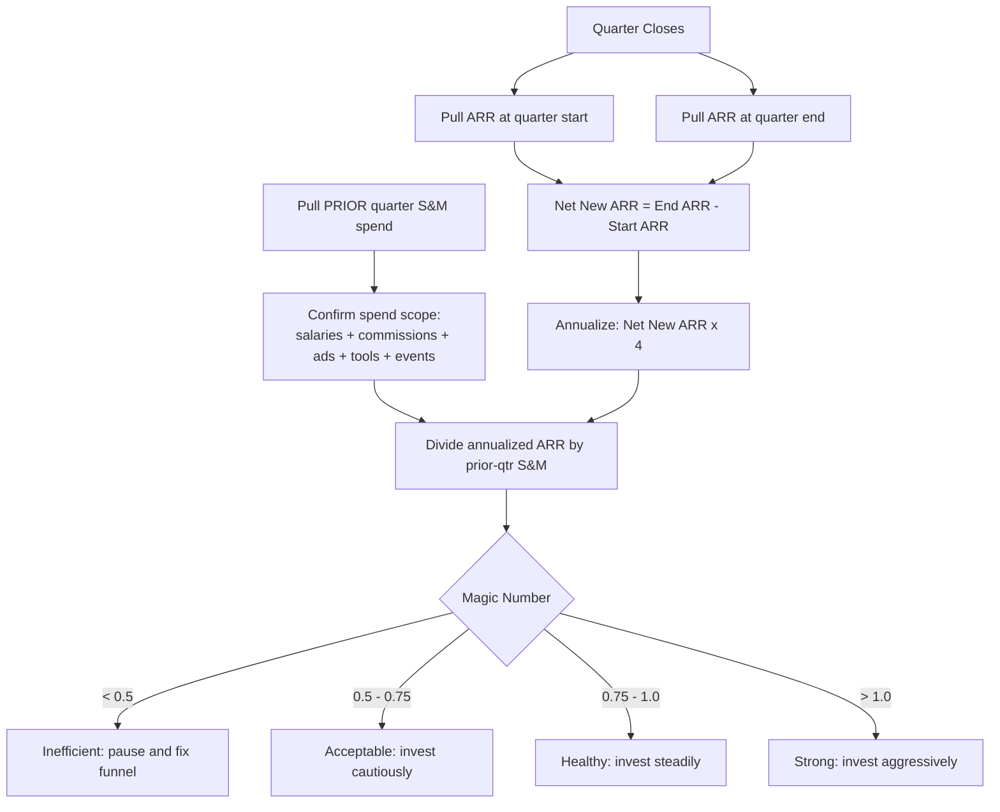

### Direct Answer

The Magic Number is a sales-and-marketing efficiency ratio that measures how much annualized net-new ARR a SaaS company produces for each dollar of go-to-market spend: annualized quarterly net-new ARR divided by the prior quarter's fully loaded S&M spend. It matters more than CAC because it is a system-level verdict anchored to GAAP-reported numbers — it tells a board whether the entire go-to-market engine is still working and whether to fund the next dollar of spend, a question CAC's per-customer unit cost cannot answer.

> **TLDR**
> - **Formula:** Magic Number = (Current-quarter ARR − Prior-quarter ARR) × 4 ÷ Prior-quarter S&M spend.
> - **Benchmark bands:** below 0.5 inefficient, 0.5-0.75 acceptable, 0.75-1.0 healthy, above 1.0 strong/underinvesting.
> - **Why it beats CAC:** system-level not unit-level, no attribution required, both inputs are auditor-touched GAAP figures, mix-neutral, and it nets out churn.
> - **The big trap:** the lag — it compares revenue and spend from different periods; mismatch the timing and the number lies, especially when spend moves sharply.
> - **The honest discipline:** segment it by motion/segment/channel, correct it for sales-cycle lag, audit it against distortion, and present it as a board recommendation — never as a number to maximize in isolation.

## What The Magic Number Actually Measures

The Magic Number is the most honest answer to a question every SaaS board eventually asks: "When we spend a dollar on sales and marketing, how much recurring revenue do we get back, and how fast?" It is an efficiency ratio that translates a quarter of go-to-market spend into a verdict on whether that spend is buying durable revenue or simply buying noise.

### 1.1 The plain-English definition

At its core, the Magic Number compares the **new annual recurring revenue (ARR) a company produced in a period** against the **sales and marketing dollars it spent to produce that revenue**. The output is a small decimal — usually between 0.3 and 1.5. A Magic Number of 1.0 means that for every dollar of S&M spend, the company added one dollar of net new ARR within roughly a one-year payback horizon; a 0.5 means it took two dollars of spend to buy one dollar of ARR; a 1.5 means the engine is operating well above the efficiency frontier and the company is almost certainly under-investing.

The metric was popularized by Lars Leckie of Hummer Winblad and refined by Bessemer Venture Partners and Scale Venture Partners as a quick triage tool for growth-stage SaaS companies. Its staying power comes from a rare combination: simple enough to compute on a napkin, yet it captures the interaction between **growth, spend, and time** in a way no single isolated metric can.

### 1.2 Why "efficiency" is the right frame

Most early-stage SaaS metrics measure growth or burn in isolation — ARR growth tells you how fast you are moving, burn multiple tells you how much cash you consume, but neither tells you whether the act of growing is itself a good business. The Magic Number sits at that intersection: **is the growth you are buying worth what you paid for it?** SaaS companies can manufacture growth almost arbitrarily — pour money into paid acquisition, hire AEs, discount aggressively, and ARR goes up. When Snowflake (SNOW) and Datadog (DDOG) were scaling toward their IPOs, investors cited their ability to grow at high rates while keeping sales efficiency strong — that combination, not raw growth, earned premium multiples.

### 1.3 What the metric is NOT

Being precise about the boundaries of the Magic Number matters, because misunderstanding them is the source of most bad decisions made with it.

- **It is not a profitability metric.** A company can have a strong Magic Number and still be deeply unprofitable — it ignores R&D, G&A, and hosting costs, and speaks only to the efficiency of *acquisition*.
- **It is not a customer-level metric.** Unlike CAC or LTV/CAC, it is a portfolio-level number — how the entire go-to-market machine performed, not any individual segment or rep.
- **It is not a forecast.** It is a backward-looking measurement of a closed period, predictive only when you string several quarters together.
- **It is not a substitute for cash discipline.** A company at 1.2 that burns more cash than it can raise still runs out of money. Efficiency and runway are different questions.

| Concept | What it answers | Time horizon | Granularity |
|---|---|---|---|
| Magic Number | Is our S&M spend buying ARR efficiently? | Quarter, ~1-yr payback lens | Whole company |
| CAC | What did one customer cost to acquire? | Point-in-time | Per customer / cohort |
| CAC Payback | How long until a customer repays acquisition cost? | Months | Per cohort |
| LTV/CAC | Is lifetime value worth the acquisition cost? | Multi-year | Per cohort |
| Burn Multiple | How much cash per dollar of net new ARR? | Quarter or year | Whole company |

### 1.4 Why boards keep coming back to it

The Magic Number survives because it is **legible** — a board member not operationally close to the business can look at a trend line and immediately understand the story: efficiency improving, deteriorating, or stable. It compresses an enormous amount of operational reality — pipeline conversion, sales-cycle length, win rates, discounting, channel mix, ramp time — into one number trackable quarter over quarter without a forty-slide deck.

## The Magic Number Formula, Step By Step

The formula looks trivial, and that simplicity is both its strength and its trap — the arithmetic takes ten seconds, but getting the *inputs* right takes real discipline.

### 2.1 The canonical formula

The most widely used version of the Magic Number is:

> **Magic Number = (Current Quarter ARR − Prior Quarter ARR) × 4 ÷ Prior Quarter Sales & Marketing Spend**

Breaking that apart: **(Current Quarter ARR − Prior Quarter ARR)** is the net new ARR added during the quarter — already net of churn and contraction, so it is the change in the recurring revenue base, not gross new bookings. The **× 4** annualizes the quarterly delta so it can be compared to an annual spend lens. **÷ Prior Quarter S&M Spend** divides by the *previous* quarter's spend — a deliberate lag reflecting that the dollars spent last quarter produced the revenue booked this quarter.

### 2.2 A worked example

Suppose a mid-stage SaaS company has the following figures:

| Line item | Value |
|---|---|
| ARR at end of Q1 | $40,000,000 |
| ARR at end of Q2 | $46,000,000 |
| Net new ARR in Q2 | $6,000,000 |
| S&M spend in Q1 (prior quarter) | $9,000,000 |

The calculation runs:

1. Net new ARR for Q2 = $46.0M − $40.0M = **$6.0M**
2. Annualized net new ARR = $6.0M × 4 = **$24.0M**
3. Magic Number = $24.0M ÷ $9.0M (Q1 S&M) = **2.67**

A Magic Number of 2.67 would be extraordinary — high enough to immediately suspect a data error, a one-time mega-deal, or a spend-capture mismatch. Realistic mid-stage companies land between 0.5 and 1.2.

### 2.3 The simultaneous-quarter variant

Some operators divide by the **current** quarter's S&M spend rather than the prior quarter's: *Magic Number (simultaneous) = Net New ARR × 4 ÷ Current Quarter S&M Spend.* This assumes S&M converts to revenue quickly enough that there is no meaningful lag — defensible for a fast, transactional, low-ACV motion, misleading for an enterprise motion with a six-to-nine-month cycle. **Pick one variant and never switch.** The most common way teams accidentally lie to their board is by quietly changing the denominator quarter between meetings.

### 2.4 The gross-vs-net decision

A second fork: use **net new ARR** (new + expansion − churn − contraction) or **gross new ARR** (only new-logo and expansion bookings)? Net new ARR is the standard and recommended default — it reflects the actual change in the revenue base and refuses to let strong new sales hide a leaky bucket. Gross new ARR is useful as a *diagnostic* alongside it: if your net Magic Number is 0.6 but your gross is 1.1, you do not have an acquisition problem — you have a churn problem, and S&M is not the lever to pull. Reporting both, clearly labeled, is the mark of a finance team that understands the metric.

### 2.5 A diagram of the calculation flow

### 2.6 The trailing-twelve-month version

Because a single quarter can be distorted by seasonality, large deals, or spend timing, many operators also compute a **trailing-twelve-month (TTM) Magic Number**: annual net new ARR for the last four quarters divided by total S&M spend across the prior four quarters. The TTM version is far less jumpy — the better number for budgets and board narratives — while the single-quarter version is better for spotting an inflection early. Mature teams report both.

## Choosing The Right Inputs: Net New ARR, S&M Spend, And Timing

If the formula is the easy 20%, input discipline is the hard 80% — two finance teams can look at the same general ledger and produce Magic Numbers 0.4 apart simply because they scoped the inputs differently.

### 3.1 What belongs in "Sales & Marketing spend"

The denominator should be the **fully loaded** cost of the go-to-market organization — "fully loaded" being where most distortion creeps in. A complete S&M figure includes:

- **All sales personnel costs** — base, commissions, bonuses, SPIFs, and benefits for AEs, SDRs/BDRs, sales engineers, sales managers, and the CRO's office.
- **All marketing personnel costs** — demand gen, product marketing, content, brand, marketing operations, and field marketing.
- **Program and media spend** — paid search and social, display, sponsorships, events, content production, and agency fees.
- **Go-to-market tooling and allocated overhead** — CRM, marketing automation, sales engagement, intent data, enablement software, plus the S&M share of facilities, IT, and recruiting.

What does **not** belong: R&D salaries, customer success and support (unless CS carries an expansion quota), G&A, and hosting/COGS. The cleanest source is the income statement's S&M line, adjusted only for known misclassifications.

| Cost category | Include in S&M? | Notes |
|---|---|---|
| AE / SDR base + commission | Yes | Core acquisition cost |
| Sales engineering | Yes | Part of the closing motion |
| Demand gen + product marketing | Yes | Core acquisition cost |
| Paid media + events | Yes | Program spend |
| GTM tooling (CRM, MAP, sales engagement) | Yes | Cost of running the motion |
| Customer success (pure retention) | No | Not acquisition; affects net ARR instead |
| Customer success (quota-carrying expansion) | Split | Allocate the expansion-selling portion |
| R&D / engineering | No | Not a go-to-market cost |
| G&A / finance / legal | No | Not a go-to-market cost |
| Hosting / infrastructure (COGS) | No | Belongs in gross margin, not S&M |

### 3.2 The customer success gray zone

Customer success is the most contested line. The principle: **the portion of CS that drives expansion ARR belongs in the denominator; the portion that drives retention does not.** If your CS team carries an expansion quota and upsells, allocate that cost into S&M, because the expansion bookings flow into the numerator. If CS is purely renewal-and-support, leave it out. Whatever you decide, document the rule and apply it identically every quarter.

### 3.3 Getting ARR clean

The numerator depends on a trustworthy ARR figure, and ARR is deceptively hard to measure. Three rules keep it clean:

- **Define ARR once, centrally.** ARR is normalized recurring revenue — exclude one-time fees, professional services, implementation charges, and non-contractual usage overages.
- **Take the snapshot at consistent moments.** Pull ARR at the last day of each quarter from the same system of record. A mid-quarter or stale snapshot introduces error larger than the signal.
- **Treat churn and contraction honestly.** Net new ARR must subtract every dollar of logo churn and downgrade. Teams that "forget" contraction are measuring a flattering cousin of the metric.

### 3.4 The timing offset that everyone gets wrong

The deliberate one-quarter lag — dividing this quarter's annualized ARR by *last* quarter's S&M spend — exists because **revenue does not appear the instant a dollar is spent.** The one-quarter offset is a reasonable average across typical SaaS cycles, but if your real cycle is nine months it understates the lag. The rule: **know your sales cycle, and if it is materially longer than one quarter, widen the offset and say so in the board deck.**

### 3.5 An input-quality checklist

Before any Magic Number reaches a slide, a finance team should be able to answer yes to every item below:

- **ARR definition** is documented and applied identically across all systems, with one-time and non-recurring revenue stripped out.
- **Net new ARR** subtracts all churn and contraction, from quarter-end snapshots taken from the same source on the same calendar day.
- **S&M spend** is fully loaded with the same inclusion rules every quarter, and **the denominator quarter** has not changed since the last board meeting.
- **Large or anomalous deals** have been flagged so the reader can see the number with and without them.

A team that passes this checklist can defend its Magic Number under scrutiny; a team that cannot is, at best, guessing.

## Reading The Score: Benchmark Bands From 0.5 To 1.5+

A Magic Number is meaningless until it is interpreted against a benchmark — this section gives the bands, the caveats, and the operating posture each implies.

### 4.1 The standard benchmark bands

The widely accepted interpretation, drawn from Scale Venture Partners and Bessemer and validated against years of growth-stage SaaS data:

| Magic Number | Interpretation | Operating posture |
|---|---|---|
| Below 0.5 | Inefficient. Each ARR dollar costs more than two dollars of S&M. | Stop adding spend. Diagnose the funnel before investing further. |
| 0.5 – 0.75 | Acceptable but watch closely. The motion works but is not yet a flywheel. | Invest cautiously; fund only the channels proven to convert. |
| 0.75 – 1.0 | Healthy. The go-to-market engine is paying for itself on a roughly one-year horizon. | Invest steadily and proportionally with growth. |
| 1.0 – 1.5 | Strong. Spend is highly productive; you are likely under-funding growth. | Invest aggressively; press the advantage while it lasts. |
| Above 1.5 | Exceptional — or an error. Either a rare moment or a measurement mistake. | Verify the data first, then step on the gas hard. |

### 4.2 The counterintuitive truth about a very high Magic Number

New operators assume a Magic Number of 1.6 is unambiguously good news. It is good news only if the data is correct — and even then, a sustained number that high usually means the company is **leaving growth on the table.** If every marginal dollar of S&M returns $1.60 of ARR, the rational response is to spend more, hire faster, and open more channels until the marginal return compresses toward the 0.75–1.0 healthy band. HubSpot (HUBS) and ServiceNow (NOW) both went through stretches where strong efficiency was read by their boards as permission to accelerate hiring and spend.

### 4.3 Why a low number is not automatically a verdict on marketing

A Magic Number below 0.5 tells you the *system* is inefficient; it does not tell you *where* the inefficiency lives. The same low score can be a **top-of-funnel problem** (too few qualified leads, so cost per opportunity is bloated), a **conversion problem** (plenty of pipeline but weak win rates), a **retention problem** (strong gross bookings eroded by churn), or a **pricing/timing problem** (heavy discounting, or a genuinely efficient motion mis-measured by a wrong offset). The Magic Number is the smoke alarm: it tells you there is a fire, not which room — which is why the segmentation work later in this answer matters so much.

### 4.4 Benchmarks drift with the macro environment

The bands above are durable, but the *expectations* attached to them move with the market cycle. In a cheap-capital environment, investors tolerated Magic Numbers of 0.5–0.7 because growth itself was richly rewarded; in the efficient-growth regime that reasserted itself in 2022-2023, the same investors expect efficiency closer to or above 1.0. The *bar* the same number must clear is set by the era — a fuller treatment is in the down-markets section below.

### 4.5 How many quarters before you act

A single quarter's Magic Number should rarely trigger a major decision on its own — one quarter is too easily distorted by a large deal, a timing slip, or seasonality. The practical rule: one surprising quarter means investigate; two consecutive quarters in the same direction is a trend worth a real conversation; three is a confirmed trajectory that drives budget and headcount decisions. Pair the single-quarter reading with the TTM version, and the score becomes both responsive and stable.

## Why The Magic Number Beats CAC As A Board Metric

For most of the last decade, Customer Acquisition Cost sat at the center of the board deck, because the question being asked was "how expensive is one customer?" The question boards ask now is different: "is the dollar we just spent on go-to-market still working, and should we spend the next one?" CAC cannot answer that; the Magic Number can — which is why it has displaced CAC as the headline efficiency metric at companies from Snowflake (SNOW) to Monday.com (MNDY).

### 5.1 CAC Is A Unit Cost; The Magic Number Is A System Verdict

CAC tells you what one customer cost — a unit-level number. But a board is not deciding whether to buy one customer; it is deciding whether to fund an entire go-to-market engine for another quarter. The Magic Number answers that directly: for every dollar the whole engine consumed last quarter, how many dollars of annualized recurring revenue did it produce? Go-to-market is a system with shared overhead, brand spillover, and partner-sourced pipeline no single rep "owns" — CAC forces you to attribute every cost to a customer, exactly where the number breaks down, while the Magic Number sidesteps attribution entirely.

**The framing that lands in a board meeting:** CAC says "this customer cost us $14,000." The Magic Number says "our engine returned $1.10 of new ARR for every $1.00 we fed it last quarter." The first invites a debate about attribution; the second is a funding decision.

### 5.2 CAC Hides Three Numbers A Board Needs Separated

A reported CAC of $14,000 is silently the product of three independent things: how much you spent, how many customers you won, and how you defined "fully loaded." Move any one and CAC moves, and the board cannot tell which — a team can cut CAC 20% just by reclassifying sales engineers out of the S&M bucket. The Magic Number is harder to game this way because both inputs are GAAP-anchored: net new ARR reconciles to the revenue line, and S&M expense is an income-statement line auditors sign.

| Dimension | Customer Acquisition Cost | The Magic Number |
|---|---|---|
| Question it answers | What did one customer cost? | Is our whole GTM engine still working? |
| Level of analysis | Unit (per customer) | System (whole engine) |
| Input data source | Internal cost allocation + deal counts | GAAP revenue line + GAAP S&M line |
| Attribution required | Yes — every cost mapped to a customer | No — aggregate spend vs. aggregate ARR |
| Susceptible to reclassification | High — move costs in/out of S&M bucket | Lower — both inputs auditor-touched |
| Decision it informs | Pricing, channel mix | Whether to fund next quarter's S&M |
| Sensitivity to deal-size mix | High — one whale distorts the average | Low — measures dollars, not logos |
| What "good" looks like | Falling over time | Holding near or above 0.75 |

### 5.3 Mix-Neutral, And It Reflects Churn

CAC carries a logo count in its denominator, so a quarter spent closing fewer, larger enterprise deals spikes blended CAC and makes the slide look alarming even though nothing is wrong. The Magic Number has no logo count: win three $200K deals or twelve $50K deals, and if ARR and spend totals match, the Magic Number is identical. It also reflects net revenue reality — calculated on net new ARR, it nets out churn and contraction, so a quarter with strong gross sales but heavy downgrades produces a low Magic Number. Classic CAC, a pure acquisition metric, hides that leaky bucket until the retention slide two quarters later.

### 5.4 The Magic Number Connects Directly To The Capital Decision

A board exists to allocate capital, and the most useful metric maps directly onto the capital question. CAC requires translation — a board sees "$14,000" and has to do mental math involving payback, ARPU, and gross margin. The Magic Number requires none: 1.0 means "spend more," 0.4 means "fix the engine before you feed it." A CFO at HubSpot (HUBS) or Bill.com (BILL) raises the S&M envelope because the Magic Number says the last dollar worked and the next one probably will too. CAC describes the past; the Magic Number licenses the future.

## Magic Number Versus CAC Payback And LTV/CAC

The Magic Number lives in a small family of go-to-market efficiency metrics — the three that matter most being the Magic Number, CAC Payback Period, and LTV/CAC. Sophisticated operators do not pick one and discard the others; they understand the three are mathematically related, each is best at a different job, and the failure mode is using one for a job it was never built to do.

### 6.1 Three Cuts Of The Same Cash Story

All three describe one reality: you spend cash to acquire revenue and want to know how good that trade is. The **Magic Number** emphasizes aggregate efficiency and is the natural input to a forward budgeting decision; **CAC Payback** emphasizes cash recovery time and is most tied to runway and burn; **LTV/CAC** emphasizes lifetime return and is most exposed to assumption risk because "lifetime" is a forecast, not a fact.

| Metric | Time horizon | Core question | Best used for | Biggest weakness |
|---|---|---|---|---|
| Magic Number | One quarter (flow) | Is the engine efficient right now? | Setting next quarter's S&M budget | Lags one quarter; mixes new and expansion |
| CAC Payback | Months to recover cash | How long is my cash tied up? | Cash planning, runway, burn discipline | Ignores everything after payback |
| LTV/CAC | Full customer lifetime | What is the lifetime ROI of acquisition? | Long-term unit economics, fundraising story | Built on forecasted lifetime — easy to inflate |

### 6.2 How The Magic Number And CAC Payback Translate

These two are close cousins. A clean working approximation: **CAC Payback (months) is roughly 12 divided by (Magic Number times gross margin).** If your Magic Number is 1.0 at 75% gross margin, payback is about 16 months; at 1.5 it compresses to about 11. The link is not exact, but it is reliable enough to sanity-check one metric against the other. If someone reports a Magic Number of 1.2 and a CAC Payback of 30 months, one number is wrong — treat divergence as a data-quality alarm, not new information.

### 6.3 Why LTV/CAC Is The Most Dangerous Of The Three

LTV/CAC is the metric founders love and disciplined boards distrust, because it is the only one with a forecast baked in. "Lifetime" is not observed; it is assumed, usually as the inverse of a churn rate. Assume 10% annual churn and average lifetime is 10 years; assume 5% and it doubles to 20 — and so does LTV, and so does the ratio. The metric improved because someone changed an assumption, not because the business did. The Magic Number has no such forecast: both inputs are observed, realized, reported numbers from a closed quarter. That is the deepest reason it earned board trust — it cannot be improved by optimism, only by the engine getting more efficient.

### 6.4 The Right Job For Each Metric

The mature practice assigns each metric the one job it does best: **the Magic Number gates the S&M budget** — a quarterly flow metric anchored to reported numbers, exactly what a forward spend decision needs; **CAC Payback manages cash and runway** — through the 2022-2024 efficiency reset, payback months was the number that mapped to "how long until this cash comes home"; **LTV/CAC carries the long-horizon unit-economics story**, primarily in fundraising, and *only* with churn and margin assumptions disclosed. A team at Datadog (DDOG) or ZoomInfo (ZI) shows all three in the board appendix, but the Magic Number is the one on the headline efficiency slide.

### 6.5 A Worked Comparison On The Same Company

Run all three on one company-quarter: $9M net new ARR last quarter, $10M prior-quarter S&M, 78% gross margin, blended CAC of $40K, ARPU $50K, assumed 12% annual logo churn.

| Metric | Calculation | Result | Reading |
|---|---|---|---|
| Magic Number | ($9M × 4) ÷ $10M | 3.6 annualized → 0.9 quarterly basis | Healthy; spend is converting well — fund more |
| CAC Payback | $40K ÷ ($50K × 0.78 ÷ 12) | ~12.3 months | Good; cash comes home inside a year |
| LTV/CAC | ($50K × 0.78 ÷ 0.12) ÷ $40K | ~8.1x | Strong — but dependent on the 12% churn assumption |

The three agree directionally. But if real churn turns out to be 20% rather than 12%, the 8.1x LTV/CAC collapses to about 4.9x while the Magic Number and Payback do not move at all — they never depended on the churn forecast. The Magic Number is the anchor the other two should be checked against.

## The Lag Problem And How To Fix It With Cohort Timing

The single most important technical objection to the Magic Number — the one a sharp board member or diligence team raises within the first five minutes — is the lag problem. The metric compares revenue produced in one period to spend incurred in a *different* period, and the gap between them is as long as your sales cycle. Mismatch the timing and the metric lies. There are four concrete fixes.

### 7.1 What The Lag Actually Is

A dollar of S&M spend does not produce ARR on the day it is spent — it produces a click, then a lead, then an opportunity, then, weeks or months later, a closed contract. The standard formula handles this with a one-quarter offset, assuming the average sales cycle is roughly one quarter — fine for a transactional SMB motion, badly wrong for an enterprise motion with a six-to-nine-month cycle. If your cycle is six months but you use a one-quarter offset, then in a quarter where you ramp spend your Magic Number looks *terrible* — you are dividing modest revenue (from cheap historical spend) by a large, recently inflated denominator. A naive reader concludes the engine broke; in reality the metric is measuring two periods that do not belong together.

### 7.2 The Mirror-Image Distortion When Spend Falls

The lag cuts both ways, and the second direction is more dangerous because it produces a *flattering* lie. Cut S&M spend sharply this quarter and the standard Magic Number looks excellent next quarter — next quarter's revenue is still arriving from the old, larger spend base while the denominator has shrunk. The beautiful number is an artifact of the cut, and it reverses two quarters later. This is how a company reports improving efficiency right up until the quarter the bottom falls out.

| Scenario | What happens to the standard 1-quarter Magic Number | The truth |
|---|---|---|
| Spend ramps hard this quarter, 6-month cycle | Number looks bad (big denominator, lagging numerator) | Engine may be fine — revenue hasn't landed yet |
| Spend cut hard this quarter, 6-month cycle | Number looks great (small denominator, legacy numerator) | Efficiency is not improving — it's a timing artifact |
| Spend roughly flat quarter-over-quarter | Number is approximately trustworthy | Lag mostly cancels out when spend is stable |
| Cycle length itself changes | Number shifts even if efficiency is constant | Re-baseline the offset before reading the trend |

The quiet lesson: **the standard Magic Number is most trustworthy precisely when spend is flat**, because then the lag cancels. The moment spend moves sharply, you must correct for timing.

### 7.3 Fix One — Match The Offset To Your Real Sales Cycle

The simplest defensible fix is to measure your actual median sales-cycle length and offset by that — if your median enterprise cycle is six months, compare this quarter's net new ARR to S&M spend from *two quarters ago*. Use the median days-to-close (not the mean, which outlier whales drag), convert to quarters, and *label* the result — "Magic Number, 2-quarter offset" — so no one silently compares it to a one-quarter version.

### 7.4 Fix Two — Use A Trailing-Average Denominator To Smooth The Spike

If your spend is lumpy — a big campaign, a trade-show-heavy quarter, a hiring wave — a single quarter's S&M figure whips the metric around. Smooth the denominator with a trailing two- or three-quarter average. This does not fix the directional lag but removes the volatility, turning a jagged chart into a smooth one a board can read for trend.

### 7.5 Fix Three — Move To True Cohort-Based Efficiency

The most rigorous fix abandons the period-vs-period structure and goes cohort-based: for the customers acquired in the Q1 cohort, how much net new ARR did that cohort generate, and what S&M spend acquired it? This requires attribution joining spend to cohorts but eliminates the lag at the root, because numerator and denominator describe the same set of customers rather than the same calendar window. It is the version a company with a long enterprise cycle — Workday (WDAY) — maintains internally even while reporting the simpler period-based number externally.

### 7.6 Fix Four — Present The Magic Number As A Trailing-Four-Quarter Figure

For board reporting, the cleanest move is a trailing-four-quarter (TTM) basis: sum the last four quarters of net new ARR, divide by the trailing four quarters of S&M spend. Over a full year most of the within-year lag washes out. Show *both* — the quarterly number for sensitivity, the TTM number for trend. The quarterly number is the smoke detector; the TTM number is the verdict.

## Segmenting The Magic Number By Motion, Segment, And Channel

A single, company-wide Magic Number is a useful headline and a terrible operating tool — it is an average, and an average of two very different engines tells you nothing about either. The real operating value is unlocked only when you decompose it by motion, customer segment, and acquisition channel. A blended 0.8 might hide a self-serve motion at 2.5 and an enterprise motion at 0.3 — two facts demanding opposite decisions.

### 8.1 Why The Blended Number Is A Trap

The blended Magic Number suffers from the classic Simpson's-paradox problem of any average: it can be stable or even improving while every underlying segment deteriorates, simply because the *mix* shifted toward the efficient segments. The discipline: never present the blended number without at least one decomposition beside it.

### 8.2 Segment One — By Go-To-Market Motion

The most important cut is by motion, because different motions have structurally different Magic Numbers and should be held to different bars — a self-serve motion has near-zero marginal acquisition cost and posts a very high number, while an enterprise field-sales motion carries heavy quota-bearing rep cost, so a "good" enterprise number is structurally lower.

| Motion | Typical healthy Magic Number range | Why the bar sits there | Primary efficiency lever |
|---|---|---|---|
| Product-led / self-serve | 1.5 – 4.0+ | Near-zero marginal CAC; spend is mostly product + lifecycle | Activation and free-to-paid conversion rate |
| Inside / mid-market sales | 0.8 – 1.5 | Moderate rep cost, moderate cycle | Rep ramp time and pipeline coverage |
| Enterprise field sales | 0.4 – 0.9 | Expensive reps, SEs, long cycle, heavy travel | Win rate and average contract value |
| Partner / channel-led | 0.7 – 1.4 | Lower direct cost but margin shared with partner | Partner-sourced pipeline volume |

Hold each motion to its own benchmark band and watch its *trend against itself*. An enterprise Magic Number falling from 0.8 to 0.5 is a five-alarm fire even though 0.5 would be acceptable for a brand-new enterprise motion.

### 8.3 Segment Two — By Customer Segment

Within a motion, cut by customer size — SMB, mid-market, enterprise — to find out whether your upmarket push is paying for itself. A common, expensive pattern: a company that built an efficient SMB engine decides to "move upmarket," staffs enterprise reps, and watches the blended Magic Number sag without seeing *why*. Cut by segment and the picture resolves: SMB holding at 1.8 while the new enterprise segment runs at 0.3 in its first year — normal for a young motion — lets you decide deliberately whether to keep funding the ramp.

### 8.4 Segment Three — By Acquisition Channel

The third cut is by channel: paid search, paid social, content/SEO, outbound SDR, events, partner, referral. A channel-level Magic Number tells you where the *next* marketing dollar should go. The mechanics require attributing both sides — net new ARR via the CRM source field, and spend attributable to the channel (straightforward for paid media, harder for content and outbound). Even an approximate channel Magic Number is decision-useful: if paid search posts 0.5 and content posts 2.2, the reallocation decision writes itself.

### 8.5 The Segmentation Matrix In Practice

The most powerful operating artifact is a matrix: motion on one axis, segment on the other, Magic Number in each cell, blended number in the corner:

| | SMB | Mid-Market | Enterprise | Blended by motion |
|---|---|---|---|---|
| **Self-serve / PLG** | 3.1 | 1.9 | — | 2.7 |
| **Inside sales** | 1.4 | 1.1 | 0.7 | 1.2 |
| **Enterprise field** | — | 0.6 | 0.4 | 0.45 |
| **Blended by segment** | 2.4 | 1.1 | 0.5 | **0.85** |

The blended 0.85 looks unremarkable; the matrix tells the real story instantly. The PLG-into-SMB cell is a 3.1 cash machine that is almost certainly underfunded, and the enterprise-field cell at 0.4 is either a young motion needing patience or a broken one needing intervention. *That* is a board conversation; the 0.85 alone is not.

### 8.6 The Discipline Of Acting On The Cuts

Segmentation only creates value if it changes where money goes. Each quarter, rank every cell by Magic Number, shift marginal S&M dollars from the lowest-performing cells toward the highest-performing cells with headroom, protect young strategic motions from being starved on a first-year number, and re-run the matrix to confirm the reallocation worked.

## Common Ways Teams Inflate Or Distort The Score

The Magic Number is harder to game than CAC, but "harder" is not "impossible." Because the metric increasingly gates the S&M budget, there is real incentive to flatter it — some distortion deliberate, far more unintentional. Either way, a board member or diligence analyst needs to know where to look.

### 9.1 Distortion One — Stripping Costs Out Of The S&M Denominator

The most common inflation lever is shrinking the denominator by excluding costs that belong in S&M: sales engineers reclassified as "product," sales ops parked under G&A, marketing tooling buried in IT, CS comp excluded even though CS carries an expansion quota. Each exclusion lifts the Magic Number without the engine doing anything differently. **The audit move:** reconcile the S&M figure to the GAAP S&M line; if the denominator is materially smaller, demand the bridge.

### 9.2 Distortion Two — Inflating The ARR Numerator

The mirror trick is padding the numerator: counting professional-services revenue as ARR, counting full multi-year contract value rather than the annualized value, or counting gross new ARR while excluding the churn that should net against it.

| Numerator abuse | What it does | The honest standard |
|---|---|---|
| Services / one-time fees counted as ARR | Inflates numerator with non-recurring revenue | Only recurring subscription ARR counts |
| Full multi-year TCV counted as new ARR | A 3-year deal counted at 3× its real annual value | Annualize — count one year's worth |
| Gross new ARR, churn excluded | Hides the leaky bucket | Use net new ARR (new + expansion − churn − contraction) |
| Expansion ARR counted, expansion cost ignored | Free expansion makes the engine look efficient | If expansion is in the numerator, CS/expansion cost is in the denominator |

The subtle one is the last row: a team can post a great Magic Number by counting expansion ARR in the numerator while leaving CS's cost out of the denominator. The rule is symmetry — **whatever revenue you put in the numerator, the cost of producing it must appear in the denominator.**

### 9.3 Distortion Three — Exploiting The Lag To Time A Flattering Quarter

Cutting S&M spend hard in one quarter mechanically produces a beautiful Magic Number the next. A team under pressure can engineer this: cut spend, wait a quarter, present the spike as a "more efficient" engine, secure the budget conversation before the number reverts. **The audit move:** never read a one-quarter improvement without overlaying the S&M spend trend — if the number jumped the same quarter S&M was cut, it is provisionally a timing artifact.

### 9.4 Distortion Four — Cherry-Picking The Period Or The Offset

Because the metric is sensitive to which quarter and offset you choose, a team can select the single best quarter, switch offsets because one looks better, or present an annualized figure in a strong year and a quarterly figure in a weak one. The defense is documented consistency: fix the definition — period basis, offset, net-vs-gross, scope — in writing, and require every Magic Number to use it.

### 9.5 Distortion Five — Letting Non-S&M Growth Drift Into The Numerator

A more insidious distortion: the numerator absorbs ARR that S&M did not produce — price increases on the existing base, no-touch product-led seat expansion, contractual auto-escalators. The metric then credits the engine for growth the product or contract produced on its own. **The audit move:** ask whether the numerator is net of pricing-driven and no-touch expansion; at minimum, a price increase landing in a quarter should be disclosed as a one-time contributor.

### 9.6 The One-Page Audit Checklist

When a Magic Number lands on the table, run six questions before trusting it:

- **Does the denominator tie to GAAP S&M?** If smaller, demand the reconciliation bridge.
- **Is the numerator net new ARR — recurring only, annualized, churn subtracted?** If gross or services-laden, discount it.
- **Did S&M spend move sharply this quarter?** If so, ask for the trailing-four-quarter version.
- **Is the definition — offset, period basis, scope — identical to last quarter's?** If it changed, the trend is broken.
- **Is pricing-driven or no-touch expansion isolated out, and is expansion revenue matched by expansion cost?** If not, the engine is over-credited.

A Magic Number that survives all six is one a board can fund against — and the best operators run this checklist themselves before anyone else gets the chance.

## The Magic Number In Down Markets And Efficient-Growth Eras

The Magic Number was born in a cheap-capital world but earns its keep in an expensive-capital one. When growth-at-all-costs gave way to the "efficient growth" doctrine in 2022-2023, it went from a diagnostic boards glanced at to the single ratio that gated whether an S&M dollar got spent at all.

### 10.1 Why The Metric Matters More When Capital Is Expensive

In a zero-interest-rate environment a Magic Number of 0.4 was survivable: investors funded the gap because terminal value was discounted lightly and the next round was assumed. Once the risk-free rate moved above 4-5%, every S&M dollar competed against a safe return, and the Magic Number's "acceptable" floor moved up — a score waved through in 2021 now triggers a spend freeze.

- **The cost of the gap changed, not the math.** The formula did not move; the price of inefficiency did. A 0.5 Magic Number means roughly two years of payback — tolerable when capital is free, punishing when it is not.
- **Dilution became the binding constraint.** Founders who raised flat or down rounds in 2023 learned a weak Magic Number is the percentage points of the company you sell to cover the same growth. Efficiency is anti-dilution insurance.
- **The Rule of 40 absorbed the Magic Number.** The Magic Number explains *whether the growth half of Rule of 40 is being bought economically* — a company hitting Rule of 40 through margin alone with a 0.3 Magic Number is quietly stalling.

### 10.2 How Benchmark Bands Shift Across The Cycle

The static bands are a fair-weather guide. In a downturn the *interpretation* of each band changes even though the cut points do not.

| Band | 2021 read (cheap capital) | 2023-2025 read (expensive capital) |
|------|---------------------------|-------------------------------------|
| Below 0.5 | "Invest through it, fix later" | Freeze incremental spend; diagnose now |
| 0.5-0.75 | Acceptable, fund growth | Marginal — fund only proven segments |
| 0.75-1.0 | Healthy, lean in | Healthy — and now the realistic ceiling for most |
| 1.0-1.5 | Underinvesting, add reps fast | Strong — add capacity but stress-test demand |
| Above 1.5 | Almost never seen as durable | Often demand-constrained; spend more deliberately |

The asymmetry matters: in a downturn a *high* Magic Number is no longer an unambiguous "spend more" signal. It frequently means the company is harvesting inbound demand it did not pay to create, and pulling the spend lever will not scale linearly. Snowflake (SNOW) and Datadog (DDOG) both reported Magic Numbers that looked enviable in 2023 precisely because usage-based revenue from existing customers carried net-new ARR while sales spend was flat — a structural effect, not a green light to triple the budget.

### 10.3 Efficient-Growth Era Operating Norms

The 2022-2025 cohort of public software CFOs converged on operating norms built around the Magic Number. ServiceNow (NOW) CFO Gina Mastantuono framed efficient growth as "every dollar of OpEx defends a return on invested capital," and the Magic Number became the unit metric that made that auditable. HubSpot (HUBS) and Atlassian (TEAM) both walked S&M intensity down as a percentage of revenue while protecting the Magic Number — growing into efficiency rather than buying growth.

- **Spend follows proof, not plan.** Fund the *next* increment of S&M only where the trailing segment Magic Number clears the bar — a segment-level gate, not a company-level one.
- **Hiring is paced to ramp.** Because a new rep depresses the Magic Number for two to three quarters before contributing, efficient-era teams hire in smaller, staggered waves.
- **The CFO owns the number, the CRO owns the inputs.** The Magic Number moved into the CFO's standing board package, forcing a shared definition between finance and revenue.

## Counter-Case: When Optimizing The Magic Number Destroys Value

The Magic Number is a real metric with a real failure mode, and an honest treatment has to name it. The fastest way to improve any efficiency ratio is to stop spending — a team under pressure can move the number from 0.5 to 0.9 in two quarters by gutting top-of-funnel demand generation, freezing rep hiring, and harvesting the pipeline already in the system. The ratio looks fixed; the business is not.

### 11.1 The Harvest-And-Stall Trap

The most dangerous misuse is treating the Magic Number as a target to maximize rather than a diagnostic to read. Because the numerator is a *trailing* result and the denominator is *current* spend, austerity flatters the ratio for two to three quarters before the cost shows up.

- **The number improves while the pipeline empties.** Demand-gen spend cut today shows up as a healthier Magic Number this quarter and a collapsed pipeline two to three quarters out — you are dividing last year's spend's fruit by this year's austerity.
- **Concrete cautionary case.** Several mid-cap software companies in 2023 reported sequential Magic Number improvement alongside decelerating bookings; the improvement was almost entirely spend reduction, and the market re-rated the multiple down within two quarters.
- **The discipline test.** A genuine improvement is one where *net-new ARR holds or grows while spend is flat or falls*. An improvement where the numerator falls but the denominator falls faster is a managed decline wearing a good ratio.

### 11.2 What Disciplined Operators Do Instead

The defense is to refuse to read the Magic Number in isolation. Good operators pair it with a leading-indicator dashboard — pipeline coverage, marketing-sourced pipeline created, new-logo bookings — and refuse to celebrate a gain not corroborated by stable forward demand. Zoom (ZM) and DocuSign (DOCU) both, post-2022, explicitly told investors they would *not* maximize short-term efficiency at the cost of pipeline. The Magic Number is a speedometer, not a steering wheel: it tells you how efficiently you converted spend into ARR, not whether you are about to drive off a demand cliff.

## Operator Playbook: 90-Day Plan To Move Your Magic Number

A Magic Number is an outcome, not a lever — you move it by changing the inputs that feed it. This is a concrete 90-day sequence a RevOps leader and CFO run together, in three 30-day phases, to move a stuck score from the marginal band into the healthy band.

### 12.1 Days 1-30: Instrument And Diagnose

You cannot fix a number you cannot decompose. The first month is about getting a trustworthy, segmented Magic Number and finding the leak.

- **Lock the definition in writing.** Agree the exact numerator (net-new ARR, expansion excluded or tracked separately) and denominator (fully loaded S&M from the *prior* period). Publish a one-page methodology memo signed by the CFO and CRO.
- **Compute the segmented matrix.** Build the Magic Number for every motion, segment, and channel. The blended number almost always hides one strong segment subsidizing one broken one.
- **Run the cohort-timing fix.** Re-derive the score with the proper lag and compare it to the naive same-quarter calculation — the gap shows how much timing distorted the reported number.

The month-one exit bar: a CFO-signed methodology memo, a 9+ cell segmented matrix from RevOps, a lag-corrected trailing score from FP&A within ±0.1 of the cohort-timed value, and an agreed leak hypothesis naming the top two broken cells.

### 12.2 Days 31-60: Fix The Biggest Leak

With the diagnosis in hand, month two attacks the single worst-performing cell rather than spreading effort thin. The four most common leaks each have a distinct, fast intervention.

- **If the leak is conversion rate:** tighten lead qualification and reallocate SDR effort to the channels with the best opportunity-to-close rate — a 2-point improvement moves the numerator without adding spend.
- **If the leak is deal size:** push packaging and pricing changes — multi-year incentives, platform bundling, a higher entry tier. This is the lever Monday.com (MNDY) used shifting to seat-and-product expansion bundles.
- **If the leak is ramp time:** compress new-rep time-to-productivity with better enablement, pre-built territory plans, and warm-pipeline assignment. Every month shaved off ramp pulls net-new ARR forward.
- **If the leak is retention drag:** with a numerator defined *net* of churn, a leaky bucket silently taxes the score. Triage at-risk accounts and fix onboarding before adding top-of-funnel spend.

### 12.3 Days 61-90: Reallocate, Set The Gate, And Re-Forecast

Month three converts the fix into a durable budgeting discipline so the gain does not erode.

- **Reallocate spend toward proven cells.** Move marginal S&M dollars from the lowest-Magic-Number cell to the highest — the fastest blended-number mover, requiring no productivity gain, just better capital allocation.
- **Install the spend gate.** Adopt a forward rule: incremental S&M capacity is funded only where the trailing segment Magic Number clears 0.75. Write it into the budgeting process so it survives the next planning cycle.
- **Re-forecast the next two quarters with the lag built in.** Because today's reallocation depresses the number for one to two quarters before paying off, show the board the dip then the recovery.

| Phase | Primary lever | Expected Magic Number effect | Time to show |
|-------|---------------|------------------------------|--------------|
| Days 1-30 | Measurement only | None (diagnostic) | Immediate clarity |
| Days 31-60 | Fix worst cell | +0.05 to +0.15 | 1-2 quarters lag |
| Days 61-90 | Reallocate + gate | +0.10 to +0.25 blended | 1-2 quarters lag |

A realistic 90-day outcome is not a fixed number on day 90 — it is a *committed trajectory*: a board-endorsed path from, say, 0.55 to 0.80 over the following two quarters, with the levers identified, owned, and gated.

## Tooling, Dashboards, And The Data Stack Behind It

A Magic Number is only as trustworthy as the data plumbing under it. The two inputs — net-new ARR and S&M spend — live in different systems, owned by different teams, on different definitions, and the metric breaks silently when they disagree.

### 13.1 The Three-System Problem

Net-new ARR comes from the CRM or billing system; S&M spend from the general ledger; and the *timing alignment* between them lives nowhere by default. Each handoff is a place the number can be wrong.

- **The CRM tells you bookings, not ARR.** Closed-won amounts often include one-time services and multi-year totals; net-new ARR has to be derived — annualized, services-stripped, netted of downgrades.
- **The general ledger tells you spend, not fully-loaded spend.** Program spend and commissions are easy to find; loaded headcount cost, tooling, and allocated overhead are not.
- **Nothing aligns the timing automatically.** The lag fix — pairing quarter *t* ARR with *t-1* spend — has to be engineered in, or spreadsheets bake the lag error in permanently.

### 13.2 Reference Data Stack

A clean Magic Number pipeline has four layers, named here for auditability — a board member should be able to trace the headline number back to a source row.

| Layer | Typical tools | Job in the Magic Number pipeline |
|-------|---------------|----------------------------------|
| Source systems | Salesforce (CRM), NetSuite / billing, the GL | Raw bookings and raw spend |
| Ingestion / warehouse | Fivetran or Stitch into Snowflake (SNOW) / BigQuery / Databricks | Centralize CRM + finance data in one place |
| Transformation / metrics layer | dbt, plus a metrics store | Define net-new ARR and loaded S&M *once*, version-controlled |
| Presentation | Looker, Tableau, Mosaic, or a RevOps tool | Board-ready chart with drill-down to source |

The non-negotiable layer is transformation. Defining "net-new ARR" and "fully loaded S&M spend" as version-controlled code (a dbt model) rather than a formula buried in a spreadsheet makes the metric reproducible quarter to quarter — a definition change becomes a reviewed pull request, not a silent edit.

### 13.3 Dashboard Design Principles

A Magic Number dashboard a board will trust follows a few rules learned the hard way.

- **Show the trend, not the point.** A single quarter is noisy; eight trailing quarters reveal whether efficiency is improving, eroding, or volatile. Lead with the trendline.
- **Default to segmented, roll up to blended.** Open on the segment matrix with the blended number as a summary tile — so the conversation starts with where spend works.
- **Surface the inputs alongside the ratio.** Net-new ARR and loaded spend sit next to the Magic Number so a reviewer sees *which input moved* — a ratio with no visible numerator and denominator invites the harvest-and-stall distortion.
- **Annotate the lag.** Every chart should label which spend period feeds which ARR period, so no one re-introduces the timing error.

Most companies under roughly $50M ARR can run the Magic Number out of a warehouse plus dbt plus a BI tool. Above that scale, the segmented matrix and board cadence justify a dedicated RevOps analytics layer — the deciding question is not company size but *how many segment cells you maintain*.

## Magic Number For PLG, Usage-Based, And Hybrid Models

The classic Magic Number assumes a sales-led motion: a rep closes a deal, ARR appears, the spend that created it is mostly identifiable S&M cost. Product-led growth, usage-based pricing, and hybrid motions each break one of those assumptions, and the textbook formula applied without adjustment produces either flattering or pessimistic nonsense.

### 14.1 Why PLG Distorts The Classic Formula

In a product-led motion, a meaningful share of net-new ARR arrives with little or no S&M spend attached to the individual conversion — the denominator the classic formula wants does not exist for that revenue.

- **The spend is upstream and diffuse.** PLG cost lives in product, free-tier infrastructure, developer experience, and community — categories that often sit *outside* the S&M line. Dividing PLG net-new ARR by only the S&M line produces an inflated Magic Number.
- **The honest fix is a defined denominator.** Either expand the denominator to a "fully loaded customer acquisition cost" including product and free-tier costs, or — cleaner — compute a *separate* PLG efficiency metric and never blend it with the sales-led Magic Number.
- **Atlassian (TEAM) is the canonical case.** It historically ran an extremely high apparent Magic Number because growth came through self-serve with minimal traditional S&M; the right read was never "spend more on reps" but "our acquisition cost is structurally elsewhere."

### 14.2 Usage-Based Pricing And The Expansion Problem

Usage-based and consumption pricing — Snowflake (SNOW), Datadog (DDOG), Twilio (TWLO) — generate large net-new ARR from *existing* customers as their usage grows, with no new acquisition spend in the period.

- **Expansion ARR inflates the numerator.** If net-new ARR includes consumption-driven expansion from the installed base, the Magic Number measures *land-plus-natural-growth*, not *acquisition* — it tells you little about whether new sales investment pays off.
- **Split the numerator by source.** The disciplined treatment computes one Magic Number on new-logo net-new ARR against acquisition S&M, and a separate NRR / expansion-efficiency metric on consumption growth. Snowflake's investor reporting effectively does this.
- **Watch for the macro echo.** Because usage revenue tracks customer activity, a usage-based Magic Number can swing with the macro economy independent of any sales-execution change — read it against new-logo trends, never alone.

### 14.3 Hybrid Models And The Allocation Discipline

Most modern software companies are hybrid — a self-serve bottom that lands customers and a sales-led top that expands and closes enterprise. HubSpot (HUBS), Monday.com (MNDY), and Zoom (ZM) all run blended motions.

| Motion | What net-new ARR should pair with | Risk if blended naively |
|--------|-----------------------------------|--------------------------|
| Pure sales-led | Fully loaded S&M, prior period | Standard formula works |
| Pure PLG / self-serve | Loaded acquisition cost incl. product/free-tier | Classic formula overstates efficiency |
| Usage-based expansion | A separate NRR / expansion-efficiency metric | Inflates numerator, hides acquisition cost |
| Hybrid (land self-serve, expand sales-led) | Allocate ARR and spend to the motion that drove each | Cross-subsidy hides a broken half |

- **Allocate, do not blend.** In a hybrid model the only honest Magic Number is a *set* — one per motion — built by attributing each dollar of net-new ARR and spend to the motion that produced it.
- **The blended number is for the board summary, the segmented set is for decisions.** Capacity and budget decisions must be made on the per-motion numbers, or a strong self-serve engine will quietly fund a failing enterprise team.
- **Re-examine the definition annually.** As a company shifts mix, the right denominator changes — revisit the methodology memo every planning cycle so the metric keeps measuring what leadership thinks it measures.

## Board Reporting Template And Narrative Framing

A Magic Number computed correctly but presented badly still fails its one job: helping the board make a confident capital-allocation decision. The final discipline is presentation — a format that surfaces the real signal, pre-empts objections, and frames a recommendation rather than a measurement.

### 15.1 The One-Slide Magic Number View

The Magic Number deserves exactly one slide in the standing board package — dense, but one. The single slide carries five elements.

| Slide element | What it shows | Why the board needs it |
|---------------|---------------|------------------------|
| Trailing-8-quarter trendline | The blended Magic Number over two years | Trend, not point — is efficiency improving or eroding? |
| Quarterly + TTM number side by side | The pulse and the verdict together | TTM washes out timing noise; quarterly catches inflections |
| Segment matrix thumbnail | Motion x segment cells | Shows where spend works before anyone asks |
| Inputs callout | Net-new ARR and loaded S&M for the quarter | Lets the board see which input moved |
| Recommendation line | "Fund / hold / freeze incremental S&M" | Turns a metric into a decision |

The recommendation line is the element most teams omit and the one boards most want — a board convenes to decide, not to admire a ratio. A slide ending with "trailing segment Magic Number supports adding $X of mid-market capacity; enterprise stays flat pending two quarters of recovery" has done the board's pre-work for it.

### 15.2 Narrative Framing That Survives Scrutiny

The numbers need a spoken narrative built to survive a sharp board member's questions rather than dodge them.

- **Lead with the trend and the driver.** Open with "blended Magic Number moved from 0.62 to 0.78 over four quarters, driven by mid-market conversion gains" — direction, magnitude, cause in one sentence. A number with no attributed driver invites the room to invent one.
- **Pre-empt the lag question.** State the offset out loud: "this is a one-quarter-offset number; our median cycle is now four months." Naming the limitation first converts a gotcha into evidence of rigor.
- **Disclose distortions proactively.** If a price increase or single large deal moved the quarter, show the number with and without it. Boards forgive a disclosed anomaly; they punish a discovered one.
- **Separate measurement from recommendation.** Present the number, then pivot to "here is what we propose" — blurring the two makes it impossible for the board to challenge the recommendation without seeming to challenge the facts.

### 15.3 The Questions A Board Will Ask — And The Prepared Answers

A well-run finance team walks into the board meeting with answers to the predictable questions already loaded. Snowflake (SNOW), Datadog (DDOG), and HubSpot (HUBS) investor-relations teams are effective precisely because they anticipate the efficiency questions rather than improvise them.

| Likely board question | The prepared answer |
|-----------------------|---------------------|
| "Is this net or gross new ARR?" | Net — churn and contraction subtracted; gross shown in appendix |
| "Did spend move this quarter?" | Stated explicitly; if it did, TTM number shown alongside |
| "What offset are you using?" | Named, with median sales cycle cited as justification |
| "Which segment is dragging the blend?" | Matrix already on the slide; weakest cell named |
| "Is this consistent with last quarter's definition?" | Methodology memo unchanged; any change flagged |
| "What would change your recommendation?" | The leading indicators — pipeline coverage, new-logo bookings — named as the tripwires |

### 15.4 Reporting Cadence And Ownership

The Magic Number belongs in every board package, but depth varies with cadence. **Every board meeting:** the one-slide view, blended plus TTM, with the recommendation line. **Quarterly:** the full segment matrix with cell-level commentary. **Annually:** a methodology review — confirm the definition memo still matches the business mix, re-derive the offset, re-baseline the benchmark bands. Ownership is explicit: the CFO presents the number and owns the definition; the CRO owns the inputs and segment commentary; RevOps owns the data pipeline.

The discipline that ties this answer together: the Magic Number is only as valuable as the decision it enables. Compute it honestly, segment it so it points at something, correct it for lag, audit it against distortion, and — the step most teams skip — present it as a recommendation a board can act on in the room.

## Related Questions

- **(q100)** — *What's a good magic number for a public SaaS company?* The benchmark bands here against the numbers public software companies actually report.
- **(q1108)** — *What's the right way to read magic number when your sales motion is shifting from inbound-heavy to outbound-heavy?* Segmentation and lag in a live motion-mix transition.
- **(q417)** — *What does the Rule of 40 actually measure, and how do you explain it when your growth + profit score misses?* The companion efficiency framework boards read alongside the Magic Number.
- **(q420)** — *What is 'burn multiple' and when should you worry about yours vs. celebrate it?* The cash-consumption counterpart to the spend-efficiency lens.
- **(q414)** — *How do you calculate true CAC payback period when you have multi-quarter sales cycles?* Deepens the CAC Payback translation in the metric-family section.
- **(q1146)** — *How do you read CAC payback when half your sales motion is PLG and half is enterprise outbound?* The hybrid-motion problem on the closest cousin metric.
- **(q424)** — *What metrics should you include in a board-ready unit economics dashboard, and in what order?* The dashboard context the Magic Number slide lives inside.
- **(q419)** — *How do you model CAC for usage-based pricing when you have no upfront contract value?* The acquisition-cost side of the usage-based challenge.
- **(q101)** — *How do I measure sales efficiency at different ARR scales?* How the right efficiency lens changes as a company grows.
- **(q161)** — *What new SaaS metrics are board members asking about in 2026?* The board-metrics landscape the Magic Number now anchors.

## Sources

1. Lars Leckie, Hummer Winblad Venture Partners — original popularization of the SaaS "Magic Number."
2. Scale Venture Partners — "Scale Studio" SaaS efficiency benchmarks and Magic Number benchmark bands.
3. Bessemer Venture Partners — "State of the Cloud" reports and the BVP Nasdaq Emerging Cloud Index.
4. Bessemer Venture Partners — "10 Laws of Cloud" and SaaS metrics primers.
5. David Skok, "For Entrepreneurs" — SaaS metrics, CAC payback, and the leaky-bucket framing.
6. a16z — "16 Startup Metrics" and "The Dangerous Seduction of the Lifetime Value Formula."
7. KeyBanc Capital Markets — annual Private SaaS Company Survey (sales efficiency benchmarks).
8. OpenView Partners — annual SaaS Benchmarks Report and PLG benchmarking.
9. ICONIQ Growth — "Growth & Efficiency" SaaS benchmark reports.
10. Battery Ventures — "State of the OpenCloud" SaaS efficiency analysis.
11. Brad Feld and Jason Mendelson — "Venture Deals" on dilution and capital efficiency.
12. Tomasz Tunguz — blog analyses of Magic Number, burn multiple, and SaaS efficiency.
13. Bain & Company — "Rule of 40" and software efficiency research.
14. McKinsey & Company — "SaaS and the Rule of 40" and software growth-efficiency studies.
15. SaaS Capital — research on SaaS retention, growth rates, and spending benchmarks.
16. Snowflake (SNOW) — investor relations: 10-K and 10-Q filings, quarterly shareholder letters.
17. Datadog (DDOG) — investor relations: 10-K and 10-Q filings, earnings call transcripts.
18. HubSpot (HUBS) — investor relations: 10-K filings and quarterly investor presentations.
19. ServiceNow (NOW) — investor relations: 10-K filings; CFO Gina Mastantuono commentary on efficient growth.
20. Atlassian (TEAM) — investor relations: shareholder letters and self-serve / PLG model disclosures.
21. Monday.com (MNDY) — investor relations: 10-K filings and quarterly investor decks.
22. Bill.com (BILL) — investor relations: 10-K and 10-Q filings.
23. Zoom Video Communications (ZM) — investor relations: 10-K filings and efficiency commentary.
24. DocuSign (DOCU) — investor relations: 10-K filings and earnings commentary.
25. Twilio (TWLO) — investor relations: 10-K filings and usage-based revenue disclosures.
26. Workday (WDAY) — investor relations: 10-K filings and enterprise sales-cycle disclosures.
27. ZoomInfo (ZI) — investor relations: 10-K and 10-Q filings.
28. U.S. Securities and Exchange Commission (SEC) — EDGAR database, software-company 10-K and 10-Q filings.
29. FASB ASC 606 — revenue recognition standard governing ARR and bookings treatment.
30. AICPA — guidance on SaaS revenue recognition and non-GAAP metric disclosure.
31. dbt Labs — documentation on metrics layers and version-controlled metric definitions.
32. Mosaic / Maxio (SaaSOptics) — SaaS financial reporting and ARR-metric methodology guides.
33. SaaStr — operator essays on Magic Number, CAC payback, and board-metric reporting.
