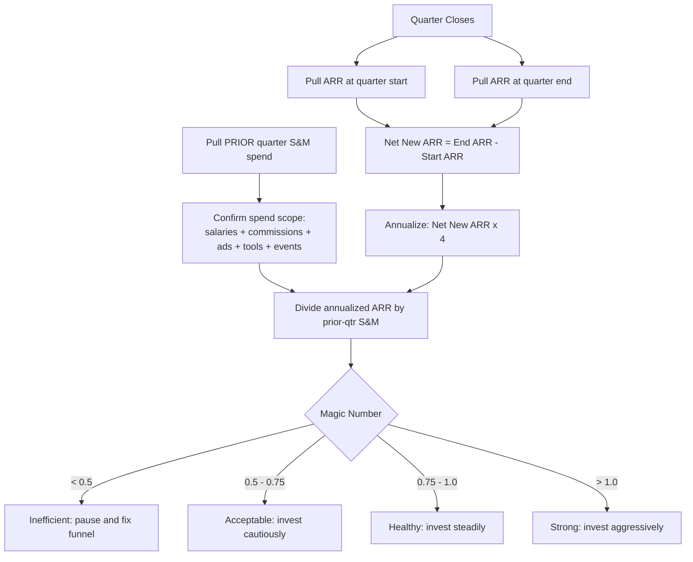

## What The Magic Number Actually Measures

The Magic Number is the single most honest answer to a question every SaaS board eventually asks out loud: "When we spend a dollar on sales and marketing, how much recurring revenue do we get back, and how fast?" It is not a vanity stat and it is not a growth-hacking gimmick. It is a sales-and-marketing efficiency ratio that translates a quarter of go-to-market spend into a verdict on whether that spend is buying durable revenue or simply buying noise.

### 1.1 The plain-English definition

At its core, the Magic Number compares the **new annual recurring revenue (ARR) a company produced in a period** against the **sales and marketing dollars it spent to produce that revenue**. The output is a small decimal — usually somewhere between 0.3 and 1.5 — and that decimal carries an enormous amount of signal. A Magic Number of 1.0 means that for every dollar of S&M spend in a quarter, the company added one dollar of net new ARR within roughly a one-year payback horizon. A Magic Number of 0.5 means it took two dollars of spend to buy one dollar of ARR. A Magic Number of 1.5 means the go-to-market engine is operating well above the efficiency frontier and the company is almost certainly under-investing relative to its opportunity.

The metric was popularized by Lars Leckie of Hummer Winblad and refined in the writing of Bessemer Venture Partners and Scale Venture Partners, who used it as a quick triage tool when evaluating growth-stage SaaS companies. Its staying power comes from a rare combination: it is simple enough to compute on the back of a napkin, yet it captures the interaction between **growth, spend, and time** in a way that no single isolated metric can.

### 1.2 Why "efficiency" is the right frame

Most early-stage SaaS metrics measure either growth or burn in isolation. ARR growth tells you how fast you are moving. Burn multiple tells you how much cash you are consuming. Neither tells you whether the act of growing is itself a good business. The Magic Number sits precisely at that intersection. It asks: **is the growth you are buying worth what you paid for it?**

That framing matters because SaaS companies can manufacture growth almost arbitrarily. Pour enough money into paid acquisition, hire enough account executives, discount aggressively, and ARR will go up. The Magic Number is the discipline that prevents a leadership team from confusing motion with progress. When Snowflake (SNOW) and Datadog (DDOG) were scaling toward their IPOs, investors repeatedly cited their ability to grow at high rates while keeping sales efficiency strong — that combination, not raw growth, is what earned premium multiples.

### 1.3 What the metric is NOT

It is worth being precise about the boundaries of the Magic Number, because misunderstanding them is the source of most bad decisions made with it.

- **It is not a profitability metric.** A company can have a strong Magic Number and still be deeply unprofitable, because the Magic Number ignores R&D, G&A, hosting costs, and the cost of servicing existing customers. It speaks only to the efficiency of *acquisition*.
- **It is not a customer-level metric.** Unlike CAC or LTV/CAC, the Magic Number is a portfolio-level number. It tells you how the entire go-to-market machine performed, not how any individual segment, channel, or rep performed.
- **It is not a forecast.** The Magic Number is a backward-looking measurement of a period that has already closed. It becomes predictive only when you string several quarters together and watch the trend.
- **It is not a substitute for cash discipline.** A company with a Magic Number of 1.2 that is burning more cash than it can raise will still run out of money. Efficiency and runway are different questions.

| Concept | What it answers | Time horizon | Granularity |
|---|---|---|---|
| Magic Number | Is our S&M spend buying ARR efficiently? | Quarter, ~1-yr payback lens | Whole company |
| CAC | What did one customer cost to acquire? | Point-in-time | Per customer / cohort |
| CAC Payback | How long until a customer repays acquisition cost? | Months | Per cohort |
| LTV/CAC | Is lifetime value worth the acquisition cost? | Multi-year | Per cohort |
| Burn Multiple | How much cash per dollar of net new ARR? | Quarter or year | Whole company |

### 1.4 Why boards keep coming back to it

A board has limited time and limited patience for instrumentation. The Magic Number survives because it is **legible**. A board member who is not operationally close to the business can look at a Magic Number trend line and immediately understand the story: efficiency improving, deteriorating, or stable. It compresses an enormous amount of operational reality — pipeline conversion, sales cycle length, win rates, discounting, channel mix, ramp time — into one number trackable quarter over quarter without a forty-slide deck. That legibility is why the rest of this answer treats it as a board-grade metric.

---

## The Magic Number Formula, Step By Step

The formula looks trivial, and that simplicity is both its strength and its trap. The arithmetic takes ten seconds; getting the *inputs* right takes real discipline. This section walks the calculation slowly so that every term is unambiguous.

### 2.1 The canonical formula

The most widely used version of the Magic Number is:

> **Magic Number = (Current Quarter ARR − Prior Quarter ARR) × 4 ÷ Prior Quarter Sales & Marketing Spend**

Breaking that apart:

- **(Current Quarter ARR − Prior Quarter ARR)** is the net new ARR added during the quarter. "Net new" means it already accounts for churn and contraction — it is the change in the recurring revenue base, not gross new bookings.
- **× 4** annualizes the quarterly delta. A quarter of net new ARR, multiplied by four, expresses that growth on an annual run-rate basis so it can be compared to an annual spend lens.
- **÷ Prior Quarter Sales & Marketing Spend** divides by the S&M spend from the *previous* quarter, not the current one. This deliberate lag reflects the reality that the dollars you spent last quarter are what produced the revenue you are booking this quarter.

### 2.2 A worked example

Suppose a mid-stage SaaS company has the following figures:

| Line item | Value |
|---|---|
| ARR at end of Q1 | $40,000,000 |
| ARR at end of Q2 | $46,000,000 |
| Net new ARR in Q2 | $6,000,000 |
| S&M spend in Q1 (prior quarter) | $9,000,000 |

The calculation runs:

1. Net new ARR for Q2 = $46.0M − $40.0M = **$6.0M**
2. Annualized net new ARR = $6.0M × 4 = **$24.0M**
3. Magic Number = $24.0M ÷ $9.0M (Q1 S&M) = **2.67**

A Magic Number of 2.67 would be extraordinary — high enough that you should immediately suspect a data error, a one-time mega-deal, or a mismatch in how spend was captured. Realistic mid-stage companies land between 0.5 and 1.2. The example is intentionally clean so the mechanics are visible; the messier reality is the subject of the next section.

### 2.3 The simultaneous-quarter variant

Some operators and some investors prefer to divide by the **current** quarter's S&M spend rather than the prior quarter's:

> **Magic Number (simultaneous) = Net New ARR × 4 ÷ Current Quarter S&M Spend**

This variant assumes that S&M spend converts to revenue quickly enough that there is no meaningful lag. For a fast, transactional, low-ACV motion — think a self-serve product with a 14-day sales cycle — the simultaneous variant is defensible. For an enterprise motion with a six-to-nine-month sales cycle, it is misleading, because the deals closing this quarter were sourced by spend from one, two, or even three quarters ago. **Pick one variant and never switch.** The single most common way teams accidentally lie to their board with this metric is by quietly changing the denominator quarter between board meetings.

### 2.4 The gross-vs-net decision

There is a second fork in the road: do you use **net new ARR** (new + expansion − churn − contraction) or **gross new ARR** (only new-logo and expansion bookings)?

- **Net new ARR** is the standard and the recommended default. It is honest, because it reflects the actual change in the revenue base and refuses to let strong new sales hide a leaky bucket.
- **Gross new ARR** can be useful as a *diagnostic* alongside the net figure, because it isolates the performance of the acquisition engine from the performance of retention. If your net Magic Number is 0.6 but your gross Magic Number is 1.1, you do not have an acquisition problem — you have a churn problem, and S&M is not the lever to pull.

Reporting both, clearly labeled, is the mark of a finance team that understands the metric. Reporting only gross while calling it "the Magic Number" is the mark of a team trying to look better than it is.

### 2.5 A diagram of the calculation flow

### 2.6 The trailing-twelve-month version

Because a single quarter can be distorted by seasonality, large deals, or timing of spend, many operators also compute a **trailing-twelve-month (TTM) Magic Number**: annual net new ARR for the last four quarters divided by total S&M spend across the prior four quarters (offset by one quarter). The TTM version is far less jumpy and is the better number for setting budgets and for board narratives. The single-quarter version is the better number for spotting an inflection early. Mature finance teams report both — the quarter for the pulse, the TTM for the trend.

---

## Choosing The Right Inputs: Net New ARR, S&M Spend, And Timing

If the formula is the easy 20%, input discipline is the hard 80%. Two finance teams can look at the same general ledger and produce Magic Numbers that differ by 0.4 simply because they scoped the inputs differently. This section makes the scoping decisions explicit so the number is defensible.

### 3.1 What belongs in "Sales & Marketing spend"

The denominator should be the **fully loaded** cost of the go-to-market organization for the period. "Fully loaded" is the operative phrase, and it is where most distortion creeps in. A complete S&M figure includes:

- **All sales personnel costs** — base salary, commissions, bonuses, SPIFs, and benefits for AEs, SDRs/BDRs, sales engineers, sales managers, and the CRO's office.
- **All marketing personnel costs** — demand generation, product marketing, content, brand, marketing operations, and field marketing headcount.
- **Program and media spend** — paid search, paid social, display, sponsorships, events, trade shows, content production, and agency fees.
- **Go-to-market tooling** — CRM, marketing automation, sales engagement platforms, intent data, conversation intelligence, and enablement software.
- **Allocated overhead** — the portion of facilities, IT, and recruiting attributable to the S&M org, if your finance team allocates overhead.

What does **not** belong: R&D salaries, customer success and support headcount (unless CS carries an expansion quota — see below), G&A, and hosting/COGS. The cleanest source is your income statement's S&M line, adjusted only for known misclassifications.

| Cost category | Include in S&M? | Notes |
|---|---|---|
| AE / SDR base + commission | Yes | Core acquisition cost |
| Sales engineering | Yes | Part of the closing motion |
| Demand gen + product marketing | Yes | Core acquisition cost |
| Paid media + events | Yes | Program spend |
| GTM tooling (CRM, MAP, sales engagement) | Yes | Cost of running the motion |
| Customer success (pure retention) | No | Not acquisition; affects net ARR instead |
| Customer success (quota-carrying expansion) | Split | Allocate the expansion-selling portion |
| R&D / engineering | No | Not a go-to-market cost |
| G&A / finance / legal | No | Not a go-to-market cost |
| Hosting / infrastructure (COGS) | No | Belongs in gross margin, not S&M |

### 3.2 The customer success gray zone

Customer success is the single most contested line. The principle is clean even if the execution is fuzzy: **the portion of CS that drives expansion ARR should be in the denominator; the portion that drives retention should not.** If your CS team carries an expansion quota and actively upsells, allocate that headcount's cost into S&M, because their expansion bookings are flowing into your net new ARR numerator. If your CS team is purely a renewal-and-support function, leave it out entirely. Whatever you decide, document the rule and apply it identically every quarter. Consistency beats theoretical purity.

### 3.3 Getting ARR clean

The numerator depends entirely on a trustworthy ARR figure, and ARR is deceptively hard to measure well. Three rules keep it clean:

- **Define ARR once, centrally.** ARR should be normalized recurring revenue: exclude one-time fees, professional services, implementation charges, and usage overages that are not contractually recurring. If different teams compute ARR differently, your Magic Number is built on sand.
- **Take the snapshot at consistent moments.** Pull ARR at the last day of each quarter, every quarter, from the same system of record. A snapshot taken mid-quarter or from a stale export will introduce error larger than the signal you are trying to read.
- **Treat churn and contraction honestly.** Net new ARR must subtract every dollar of logo churn and every dollar of downgrade. Teams that "forget" contraction are not measuring the Magic Number — they are measuring a flattering cousin of it.

### 3.4 The timing offset that everyone gets wrong

The deliberate one-quarter lag — dividing this quarter's annualized ARR by *last* quarter's S&M spend — exists because **revenue does not appear the instant a dollar is spent.** A marketing dollar spent in Q1 generates a lead in Q1, an opportunity in Q2, and a closed deal in Q2 or Q3. The standard formula uses a one-quarter offset as a reasonable average across typical SaaS sales cycles.

But "reasonable average" is doing a lot of work. If your real sales cycle is nine months, a one-quarter offset still understates the lag and will make a genuinely efficient quarter look mediocre, because you are crediting Q3 revenue against Q2 spend when the deals were actually sourced in Q1. Section 7 of this answer (the lag problem) treats this in depth; for now, the rule is simply: **know your sales cycle, and if it is materially longer than one quarter, widen the offset and say so explicitly in the board deck.**

### 3.5 An input-quality checklist

Before any Magic Number reaches a slide, a finance team should be able to answer yes to every item below:

- **ARR definition** is documented and applied identically across all systems.
- **Quarter-end snapshots** are taken from the same source on the same calendar day.
- **Net new ARR** subtracts all churn and all contraction, with no exceptions.
- **S&M spend** is fully loaded and uses the same inclusion rules every quarter.
- **The denominator quarter** (prior vs. current) has not changed since the last board meeting.
- **One-time and non-recurring revenue** has been stripped from ARR.
- **Any large or anomalous deals** have been flagged so the reader can see the number with and without them.

A team that passes this checklist can defend its Magic Number under scrutiny. A team that cannot is, at best, guessing.

---

## Reading The Score: Benchmark Bands From 0.5 To 1.5+

A Magic Number is meaningless until it is interpreted against a benchmark. This section gives the bands, the caveats, and the operating posture each band implies.

### 4.1 The standard benchmark bands

The widely accepted interpretation, drawn from the writing of Scale Venture Partners and Bessemer and validated against years of growth-stage SaaS data, looks like this:

| Magic Number | Interpretation | Operating posture |
|---|---|---|
| Below 0.5 | Inefficient. Each ARR dollar costs more than two dollars of S&M. | Stop adding spend. Diagnose the funnel before investing further. |
| 0.5 – 0.75 | Acceptable but watch closely. The motion works but is not yet a flywheel. | Invest cautiously; fund only the channels proven to convert. |
| 0.75 – 1.0 | Healthy. The go-to-market engine is paying for itself on a roughly one-year horizon. | Invest steadily and proportionally with growth. |
| 1.0 – 1.5 | Strong. Spend is highly productive; you are likely under-funding growth. | Invest aggressively; press the advantage while it lasts. |
| Above 1.5 | Exceptional — or an error. Either a rare moment or a measurement mistake. | Verify the data first, then step on the gas hard. |

### 4.2 The counterintuitive truth about a very high Magic Number

New operators often assume a Magic Number of 1.6 is unambiguously good news. It is good news only if the data is correct — and even then, a sustained number that high usually means the company is **leaving growth on the table.** If every marginal dollar of S&M is returning $1.60 of ARR, the rational response is not to celebrate; it is to spend more, hire faster, and open more channels until the marginal return compresses toward the 0.75–1.0 healthy band. A Magic Number well above 1.0 sustained for several quarters is a signal of *under-investment*, not virtue. HubSpot (HUBS) and ServiceNow (NOW) both went through stretches where strong efficiency was explicitly read by their boards as permission — even an obligation — to accelerate hiring and spend.

### 4.3 Why a low number is not automatically a verdict on marketing

A Magic Number below 0.5 tells you the *system* is inefficient; it does not tell you *where* the inefficiency lives. The same low score can be caused by very different problems:

- **A top-of-funnel problem** — too few qualified leads for the spend, so the cost per opportunity is bloated.
- **A conversion problem** — plenty of pipeline but weak win rates, so spend produces opportunities that never close.
- **A retention problem** — strong gross bookings silently eroded by churn, dragging net new ARR down.
- **A pricing problem** — deals closing at heavy discounts, so each win contributes less ARR than it should.
- **A timing problem** — a genuinely efficient motion mis-measured because the offset does not match the real sales cycle.

The Magic Number is the smoke alarm. It tells you there is a fire; it does not tell you which room. That is why the segmentation work in block two of this answer matters so much — an aggregate score is a starting point for investigation, never the end of one.

### 4.4 Benchmarks drift with the macro environment

The bands above are durable, but the *expectations* attached to them move with the market cycle. In a cheap-capital, growth-at-all-costs environment, investors tolerated Magic Numbers in the 0.5–0.7 range for fast-growing companies because growth itself was richly rewarded. In an efficient-growth environment — the regime that began reasserting itself in 2022 and 2023 — the same investors expect efficiency closer to or above 1.0, and they reward the combination of growth and efficiency captured by frameworks like the "Rule of 40." Atlassian (TEAM) is frequently cited as the archetype here: a company that historically spent strikingly little on traditional sales relative to its growth, producing efficiency metrics that made its model look structurally advantaged. The point is not the exact threshold; it is that the *bar* the same number must clear is set by the era, and a competent operator reads the room before reading the score.

### 4.5 How many quarters before you act

A single quarter's Magic Number should rarely trigger a major decision on its own, because one quarter is too easily distorted by a single large deal, a timing slip, or seasonality. The practical rule:

- **One quarter** of a surprising number: investigate, do not act.
- **Two consecutive quarters** in the same direction: a trend worth a real conversation.
- **Three consecutive quarters**: a confirmed trajectory that should drive budget and headcount decisions.

Pair the single-quarter reading with the trailing-twelve-month version, and the score becomes both responsive and stable.
