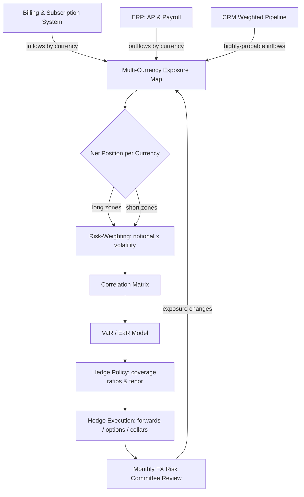

### Direct Answer

Modeling FX risk past four currency zones means refusing to treat "FX exposure" as one number: you separate transactional, translational, and economic exposure, build a net multi-currency exposure map, quantify it with Value-at-Risk and Earnings-at-Risk, and translate that risk into a written hedge policy with coverage ratios and tenors. The program is run — not just designed — by a monthly FX Risk Committee with a decision log, executed with a mix of forwards, options, collars, and natural hedges, accounted for under ASC 815 / IFRS 9, and proven to the board with constant-currency reporting and a small metric set. Build the model before FX costs you a quarter, so you can say "this was within our modeled range and policy" instead of explaining why no policy existed.

> **TL;DR**
> - **Three exposure types, three columns.** Transactional exposure is hedgeable cash; translational exposure is a non-cash accounting effect that still moves reported EPS; economic exposure is slow competitive risk best met with natural hedges. Conflating them is the most common modeling error.
> - **The exposure map comes first.** Net inflows minus same-currency outflows, by currency and month, tiered by forecast confidence. You hedge the net position, not the gross revenue line.
> - **Quantify, do not guess.** Value-at-Risk gives treasury a single-number worst case; Earnings-at-Risk reframes it in the board's language; stress tests cover the quarter that ends up in the press release.
> - **Policy turns risk into standing decisions.** Coverage ratios, a tenor ladder, and counterparty limits — ratified by the audit committee — so hedging is rules-based, not emotional.
> - **Cadence keeps it alive.** A monthly FX Risk Committee with a fixed agenda and a decision log converts hedging from a heroic individual act into an auditable process.
> - **Prove it with constant currency.** A hedge program works when the *volatility* of FX-affected results falls — not when FX never costs anything.
> - **The counter-case exists.** A pre-revenue startup, a single-dominant-currency business, or a company in a hyperinflationary zone should not run the full machine.

---

## Why FX Risk Becomes a Board-Level Problem Past 4 Currency Zones

When a company sells in one or two currencies, FX is a footnote. When it sells in four or more, FX becomes a structural feature of the income statement that can swamp the operating leverage the business spent years building. The moment a CFO cannot explain a revenue miss without pulling up a currency table, FX has graduated from a treasury hobby to a board-level governance problem.

### 1.1 Why four zones is the breaking point

The instinct is that FX risk scales linearly with the number of currencies. It does not — it scales with the number of *uncorrelated* exposures and the *dispersion* of their moves. A company billing in USD, EUR, GBP, and CAD has four currencies but a tight correlation cluster. Add JPY, BRL, INR, and AUD and the correlation structure fractures. With four currencies you have six pairwise cross-terms in the portfolio-variance formula; with eight you have twenty-eight. The cross-terms are where the surprises live.

- **Diversification is real but partial.** EUR and JPY rarely crash against the dollar simultaneously, so there is some natural offset — but diversification reshapes the loss distribution, it never eliminates it.
- **Dispersion dominates past four zones.** A 3% monthly move in EUR/USD is a normal Tuesday; a 3% single-session move in BRL or TRY is a headline. Once one or two emerging-market zones enter the mix, the loss distribution stops looking like a bell curve.
- **Reporting-currency gravity.** Every non-reporting-currency dollar of revenue must be translated back at a rate the company does not control.

### 1.2 What the board actually cares about

Directors are not asking the treasurer to predict the euro. They are asking three questions, and a credible program answers all three in plain language.

| Board question | What it really means | What a good answer looks like |
|---|---|---|
| "How much of our revenue is at risk?" | Quantified, not anecdotal | "12% of forecast ARR sits in >10%-vol currencies; modeled 95% one-year EaR is $4.1M." |
| "Did the miss come from the business or the currency?" | Separate operating from FX noise | A constant-currency bridge that isolates the FX line. |
| "Are we hedged, and what does it cost?" | Policy with guardrails and a price tag | "We hedge 70-90% of next-twelve-month booked exposure; carry ran 0.4% of hedged notional." |

When the treasurer answers those three on one slide, FX stops being board anxiety. When the answer is "currency was a headwind," the board correctly hears "we have no model."

### 1.3 The credibility cost of an unmodeled program

The deepest damage from unmanaged FX is not the cash loss in any quarter — it is eroded forecast credibility. Investors discount companies whose guidance is regularly blown up by currency. **Salesforce (CRM)** guides revenue on a constant-currency basis so the market can see the organic engine. **Microsoft (MSFT)**, with roughly half its revenue outside the US, publishes FX impact as an explicit line in basis points. **Workday (WDAY)** and **Atlassian (TEAM)** discuss hedge programs and constant-currency growth on earnings calls because their investors demand it. Companies that scale across many currencies and want a premium multiple treat FX modeling as an investor-relations asset, not a back-office chore. Build the model before you need it.

---

## The Three Exposure Types: Transactional, Translational, and Economic

Every credible FX program starts by refusing to treat "FX exposure" as one thing. There are three exposure types; they behave differently, hit different statements, and require different tools. Conflating them is the single most common modeling error.

### 2.1 Transactional exposure: the cash you will actually move

Transactional exposure is the risk that a *specific, contracted or highly probable cash flow* in a foreign currency is worth a different amount in your reporting currency by the time it settles. It is the most concrete because it maps to real money: a signed EUR contract billing monthly, a GBP vendor invoice due in 60 days, a CAD payroll run. It is the part of FX risk you can hedge cleanly because you can name the amount, currency, and date. "Highly probable" forecasted transactions — next-twelve-month renewals — count as transactional exposure too, provided the forecast is defensible.

### 2.2 Translational exposure: the accounting mirage that still moves the stock

Translational exposure arises when foreign-subsidiary statements are consolidated into the parent's reporting currency. A German subsidiary keeps euro books; at consolidation its figures are restated in dollars. When the euro moves, *reported* dollar figures move even though no cash crossed a border.

- **It is non-cash — and that is the trap.** Translation moves reported revenue and EPS, and the market trades on reported numbers. A SaaS company can have a flawless local-currency quarter and miss consensus purely on translation.
- **Where it parks.** Balance-sheet translation flows through the Cumulative Translation Adjustment (CTA) in OCI; income-statement translation hits revenue and operating income directly.

### 2.3 Economic exposure: the slow, strategic risk

Economic exposure is the risk that sustained currency moves change the *competitive economics* of the business itself. If the dollar strengthens structurally for two years, a US vendor's euro-priced product becomes effectively more expensive to European buyers than a euro-cost-base local competitor; win rates erode, and no forward contract fixes it. The defense is structural — matching the currency of costs to the currency of revenue.

### 2.4 Mapping the three types to statements and tools

The discipline is to keep the three types in separate columns of every model.

| Exposure type | Primary statement impact | Cash or non-cash | Primary mitigation tool | Time horizon |
|---|---|---|---|---|
| Transactional | Revenue, COGS, gain/(loss) on FX line | Cash | Forwards, options, collars | 0-24 months |
| Translational | Reported revenue, operating income, CTA in OCI | Non-cash | Net-investment hedges, constant-currency reporting | Ongoing |
| Economic | Win rates, margins, long-run growth | Cash (indirect) | Natural hedges, pricing, footprint design | 2+ years |

A model with three buckets can say: "Of our €40M exposure, €28M is transactional and hedgeable now, €9M is translational and we manage it with constant-currency disclosure, and €3M is economic and we are addressing it by moving support staffing into the eurozone." That sentence is the entire point of the exercise.

---

## Building the Multi-Currency Revenue Exposure Map

Before any hedge, model, or policy, the company needs a single source of truth for *where the currency actually is*. The exposure map is that artifact — the unglamorous spreadsheet every credible program is built on. Skipping it is why so many programs hedge the wrong thing.

### 3.1 What the exposure map must contain

The map is a structured inventory of every forecasted and contracted cash flow by currency, month, and direction:

- **Inflows by billing currency and month** — split by the *billing* currency, not the customer's country, because a French customer billed in dollars is a USD exposure.
- **Outflows by currency and month** — local payroll, leases, contractors, marketing, taxes, non-USD cloud invoices.
- **The net position per currency** — inflows minus outflows. A zone with $10M EUR inflows and $7M EUR outflows has a $3M net long-EUR exposure, not $10M.
- **Confidence tier** — each cash flow tagged *contracted*, *highly probable*, or *anticipated*. Hedge accounting and hedge sizing both depend on this.

### 3.2 Sourcing the data without a six-month project

It does not have to be a heroic integration. Pull inflows from the billing/subscription system (it knows contract currency, amount, and schedule), outflows from the ERP accounts-payable and payroll modules, and the forward view from the CRM weighted pipeline by deal currency. Regenerate the map monthly — real-time FX exposure data is almost always over-engineering for a company in the 4-12 zone range.

### 3.3 The structure of the map: an illustrative example

Consider a SaaS company at roughly $120M ARR across five currency zones. A simplified next-twelve-month exposure map:

| Currency zone | NTM inflows ($M) | NTM outflows ($M) | Net exposure ($M) | Net direction | Annualized vol |
|---|---|---|---|---|---|
| EUR | 31.0 | 12.0 | 19.0 | Long EUR | 8% |
| GBP | 14.0 | 6.5 | 7.5 | Long GBP | 9% |
| CAD | 9.0 | 4.0 | 5.0 | Long CAD | 6% |
| AUD | 7.0 | 1.5 | 5.5 | Long AUD | 11% |
| JPY | 6.0 | 0.5 | 5.5 | Long JPY | 10% |
| USD (reporting) | 53.0 | 95.5 | n/a | Base | — |

Two things jump off the table. The company is structurally **long every foreign currency** because its cost base is dollar-heavy — the typical shape of a US-headquartered SaaS business, which means it *loses* reported revenue when the dollar strengthens. And the largest notional is EUR, but AUD and JPY carry higher volatility per dollar, so risk-weighted they punch above their notional. A naive program hedges proportionally to notional; a modeled program hedges proportionally to *risk contribution*. The map should carry a "risk-weighted exposure" column — net exposure × annualized volatility. Here EUR's is $19.0M × 8% = $1.52M; AUD's is $5.5M × 11% = $0.61M, so AUD at one-third the notional carries 40% of EUR's standalone risk.

The diagram captures the whole pipeline: data feeds the map, the map nets to positions, positions get risk-weighted and correlated, the model produces VaR and EaR, policy translates risk into coverage ratios, execution places the hedges, and the committee loop feeds changes back. Every later section is one box in this flow.

---

## Quantifying Exposure: Value-at-Risk and Earnings-at-Risk Models

The exposure map tells you what is exposed. The risk model tells you *how much it could cost*. Without a number, the board conversation stays anecdotal and the hedge ratio is a guess.

### 4.1 Value-at-Risk: the single-number summary

Value-at-Risk answers: "Over a given horizon, at a given confidence level, what is the worst loss we expect from currency moves?" A one-month 95% VaR of $2.4M means: in 95 months of 100, FX losses should be no worse than $2.4M. Three standard approaches:

| VaR method | How it works | Strength | Weakness |
|---|---|---|---|
| Parametric (variance-covariance) | Assumes normal returns; uses vol and correlation matrix | Fast, transparent, board-friendly | Understates fat tails; weak for emerging markets |
| Historical simulation | Replays actual rate moves against today's positions | Captures real distribution shape and correlations | Backward-looking; misses regime changes |
| Monte Carlo simulation | Generates thousands of scenarios from a statistical model | Flexible; handles options and non-linear payoffs | Heavier; model-assumption-dependent |

For a treasury team without quant staff, **historical simulation is the pragmatic default**: it needs only a few years of daily rate data and makes no false normality assumption. Many teams compute historical VaR for the real number and parametric VaR for the explanatory decomposition.

### 4.2 The parametric calculation, step by step

- **Step one — position vector.** Net exposure per currency from the map: EUR $19M, GBP $7.5M, CAD $5M, AUD $5.5M, JPY $5.5M.
- **Step two — volatility vector.** Annualized volatility per currency, scaled to the horizon (for a one-month VaR, divide annual vol by √12).
- **Step three — correlation matrix.** Pairwise correlation of each pair against the dollar, from two to three years of daily returns.
- **Step four — portfolio variance.** Combine positions, volatilities, and correlations; the cross-terms are where diversification benefit appears.
- **Step five — confidence multiplier.** For 95%, multiply portfolio standard deviation by 1.645; for 99%, by 2.326.

The instructive output is the **risk decomposition** — how much of total VaR each currency contributes after correlation. It is routine for a currency that is 12% of notional to contribute 25% of VaR. That is the currency to hedge first.

### 4.3 Earnings-at-Risk: the language the board speaks

VaR is a treasury metric; the board thinks in earnings. Earnings-at-Risk reframes the same exposure as: "How much could currency move our reported revenue, operating income, or EPS over the planning horizon?" EaR uses the next-twelve-month or next-four-quarter horizon, matching the guidance cycle, and is, in effect, the size of the FX bridge line that could appear between guided and reported revenue. Express it three ways — absolute dollars, percentage of revenue, and EPS — because different directors anchor on different units.

### 4.4 Stress testing beyond the model

VaR and EaR describe normal-to-bad outcomes; they do not describe the genuinely bad day. Stress testing fills the gap with three exercises: **historical replays** (re-run the position through the 2015 Swiss franc de-peg, the 2016 sterling drop, the March 2020 dollar spike, the 2022 yen slide); **hypothetical shocks** (every foreign currency down 15% against the dollar at once, modeling a correlated risk-off event where diversification collapses); and **reverse stress testing** ("what move would cost us a guidance miss?" — if the answer is a 4% move, the program is under-hedged). VaR and EaR for the routine quarter; stress tests for the quarter that ends up in the press release.

---

## Designing the Hedge Program: Policy, Tenor, and Coverage Ratios

A risk model produces a number, not a decision. The hedge policy is the bridge — the written document that converts modeled risk into standing rules so hedging is a process, not a judgment call made under pressure.

### 5.1 The written FX hedging policy

The policy is a board- or audit-committee-ratified document. It fixes the **objective** (almost always to reduce volatility of reported results within a tolerance — explicitly not to profit from currency, with the anti-speculation clause in writing); the **scope** (transactional in, translational by deliberate exception, economic generally out of scope for derivatives); the **coverage bands**; the **permitted instruments** (forwards, vanilla options, collars; exotics excluded unless approved); the **counterparty limits**; and the **authority matrix**.

### 5.2 Coverage ratios: how much to hedge

Coverage is a ladder that declines with forecast confidence and tenor, not a single number.

| Exposure tier | Confidence | Coverage band | Rationale |
|---|---|---|---|
| Contracted backlog | Very high | 70-90% | The cash flow is signed; only the rate is at risk |
| Highly probable forecast | High | 40-70% | Strong history; some slippage risk |
| Pipeline / new-zone | Medium-low | 0-30% | Over-hedging an uncertain forecast creates a speculative position |
| Translational net assets | Ongoing | 0-50% | Board policy call; protects book equity but costs cash |

Bands rather than point estimates are deliberate — they let treasury execute without a fresh approval per trade while the audit committee keeps a hard ceiling and floor.

### 5.3 The tenor ladder and risk tolerance

Hedging the full next twelve months at one rate on one day is a bet on that day. The disciplined structure is a **rolling layered ladder** — hedge 80% of the nearest quarter, 60% of the next, 40% of the third, 20% of the fourth, and roll forward monthly. This smooths the blended rate and means no single forecast revision blows up the book. The coverage bands are downstream of one number the board must own: the tolerable Earnings-at-Risk. The board sets the tolerance; treasury calibrates coverage so modeled EaR sits inside it; every later trade traces back to that approved number. This is what makes the policy a board mandate rather than a treasury preference.

---

## Instrument Selection: Forwards, Options, Collars, and Natural Hedges

Once you have quantified exposure and set coverage ratios, the program lives or dies on instrument choice. The same 60% coverage target on a EUR receivable book can cost 4 basis points or 90 basis points of revenue depending on what you transact.

### 6.1 The instrument decision framework

Every instrument trades off **cost certainty**, **outcome certainty**, and **upside participation** — you cannot maximize all three. A forward locks the rate at zero upfront cost but forfeits any favorable move; a bought option preserves upside but charges a premium; a collar splits the difference. The framework that survives audit scrutiny ties instrument to **forecast confidence**: highly certain exposures belong in forwards, probabilistic exposures in options. Forward-hedging forecast revenue that then does not materialize leaves treasury holding an orphaned forward — a speculative position the moment the underlying disappears.

| Instrument | Upfront cost | Upside retained | Best-fit exposure | Typical tenor |
|---|---|---|---|---|
| Outright forward | Zero (rate embedded) | None | Contracted, high-certainty receivables/payables | 1-12 months |
| Bought vanilla option | Premium 0.8-2.5% notional | Full | Forecast/pipeline revenue, M&A contingencies | 3-12 months |
| Zero-cost collar | Zero net | Partial (capped) | Medium-certainty forecast revenue | 3-9 months |
| Participating forward | Zero net | Partial (ratio) | Forecast revenue where some upside matters | 3-9 months |
| Cross-currency swap | Spread embedded | None | Long-dated debt and intercompany loan FX | 1-7 years |
| Natural hedge | Zero | N/A | Structural — matching cost currency to revenue | Permanent |

### 6.2 Forwards: the workhorse and its hidden costs

The outright forward is the default: liquid, cheap, deterministic. For predictable invoice schedules across EUR, GBP, CAD, and AUD, a laddered forward program covering 50-70% of the next 12 months of contracted revenue is the right backbone. The forward rate is spot adjusted by the interest rate differential — the "forward points" — so there is no premium to expense. The hidden costs are three: **credit lines** (every forward consumes counterparty credit — negotiate committed lines before you need them); **margin and CSA terms** (forwards under a Credit Support Annex can trigger collateral calls at the worst moment — Workday (WDAY) and other large-cap SaaS treasurers model this drag explicitly); and **mark-to-market volatility** if hedge accounting is not applied. Structure forwards as a rolling layered ladder.

### 6.3 Options and collars: paying for asymmetry

Options matter when the exposure itself is uncertain. A US software firm opening a Japan entity and forecasting JPY revenue it has never booked should buy puts on JPY/USD, not forward-hedge the forecast: if the revenue materializes the floor protects margin; if it does not, the maximum loss is the premium. The **zero-cost collar** is what finance leaders reach for when the premium is hard to defend — buy the protective put and sell a call to fund it, netting zero cost, capping favorable participation at the call strike. Adobe (ADBE) and Salesforce (CRM) disclose option and collar usage alongside forwards precisely because their forecast revenue carries genuine probability weighting. The **participating forward** is a middle option: hedge a fixed rate but retain a defined ratio of any favorable move.

### 6.4 Natural hedges: the cheapest hedge is the one you never trade

Before any derivative, exhaust natural hedges — they cost nothing and never expire. A natural hedge is structural alignment: matching the currency of costs to the currency of revenue so the exposure cancels inside the operating model. Three levers: **localize the cost base** (pay euro salaries, hosting, and vendors out of euro revenue — Spotify deliberately builds cost centers in its major revenue currencies); **currency-match debt** (financing a European acquisition with euro debt neutralizes the loan's FX exposure — Booking Holdings (BKNG), with euro-heavy revenue, has historically held euro debt for this reason); and **build regional delivery teams paid in the local currency**. The rule of thumb: use natural hedges for the permanent base layer of exposure, derivatives only for the residual transactional and forecast layers on top.

### 6.5 Building the instrument mix by layer

| Exposure layer | Certainty | Instrument | Coverage target |
|---|---|---|---|
| Structural cost/revenue mismatch | Permanent | Natural hedge (localization, currency-matched debt) | As feasible |
| Contracted backlog | Very high | Layered forward ladder | 70-90% |
| Forecast recurring revenue | High | Forward ladder, declining by tenor | 40-70% |
| Pipeline / new-zone forecast | Medium-low | Bought options or collars | 25-50% |
| Intercompany loans, long-dated debt | High | Cross-currency swaps | 90-100% |
| Translational net assets | Ongoing | Selective net-investment hedges | 0-50%, board call |

Track the blended cost. A well-run program at a $300M-revenue company with four to six zones typically spends 8-20 basis points of hedged revenue per year. Over 30 basis points means over-using options on exposures certain enough for forwards; under 5 means under-hedged on the uncertain layers.

---

## ASC 815 vs IFRS 9 Hedge Accounting Mechanics

Hedge accounting is the most under-appreciated part of an FX program — the place where a technically correct hedge can still produce an ugly income statement. The audit committee reacts to the accounting, not the economics.

### 7.1 The core problem hedge accounting solves

A derivative is, by default, marked to fair value through profit and loss every period. The hedged item — a forecast EUR sale — is not yet on the books. So the hedge's gains and losses hit earnings now while the offsetting revenue lands later: the two halves of an economically matched position are recognized in different periods, producing earnings volatility that is an accounting artifact. Hedge accounting is the elective regime that re-synchronizes the timing: it defers the derivative's gains and losses in OCI until the hedged revenue is recognized, then releases both together.

### 7.2 ASC 815 — the US GAAP framework

Under ASC 815, FX revenue programs almost always use the **cash flow hedge** model: you formally document the hedging relationship at or before the trade date (documentation written after the trade is invalid — the most common cause of a denied designation); the effective fair-value change goes to OCI; and on revenue recognition the accumulated OCI is reclassified into the revenue line. **ASU 2017-12** removed the old requirement to separately measure ineffectiveness each period, so the entire change in fair value can go to OCI — which is why post-2018 programs are far cleaner. The qualifying bar is **highly probable forecast transactions**: you cannot cash-flow-hedge merely possible revenue, which is the accounting reason to use forwards for contracted backlog and options for pipeline. Treasurers at NVIDIA (NVDA) and Microsoft (MSFT) keep their "highly probable" horizon conservative to protect designation.

### 7.3 IFRS 9 — the framework for your non-US entities

Scale across four-plus zones and you almost certainly have IFRS-reporting subsidiaries. The philosophy is the same — defer to OCI, release with the hedged item — but the mechanics differ:

| Dimension | ASC 815 (US GAAP) | IFRS 9 |
|---|---|---|
| Effectiveness test | Quantitative historically; eased post-2017 | Principles-based; "economic relationship," no bright-line 80-125% rule |
| Retrospective testing | Not required for qualifying hedges post-ASU 2017-12 | Not required; prospective assessment only |
| Cost of hedging (option time value) | Time-value changes can be excluded and deferred | Treated as a "cost of hedging," deferred in a separate OCI reserve |
| Rebalancing | Not a formal concept; de-designate and re-designate | Formal rebalancing of the hedge ratio permitted |
| Voluntary de-designation | Permitted | Not permitted unless the risk objective changes |

The practical consequence: your US parent and your IFRS subsidiaries can account for the same economic hedge differently, and group consolidation must reconcile the two. The most common pain point is IFRS 9's prohibition on voluntary de-designation — build that asymmetry into the trade lifecycle so a routine US-side adjustment does not strand an IFRS designation.

### 7.4 Net investment hedges and the discipline that keeps designation alive

For translational exposure — the swing in a foreign subsidiary's net assets at consolidation — both frameworks offer the **net investment hedge**, where the instrument's effective gains and losses go to the CTA within OCI. It is a board-policy decision, not a default: hedging translation protects book equity but consumes cash and credit. Hedge accounting failures are almost never about the math; they are about process. Four disciplines keep the regime intact: **designation memos before the trade** (a dated template signed by treasury, reviewed by technical accounting); a **hedge effectiveness calendar**; the **"highly probable" guardrail** (tie hedge sizing to forecast-accuracy track record, not optimism); and a **de-designation playbook** (GAAP requires immediate OCI reclassification when a forecast transaction becomes no longer probable). The payoff: earnings that move with the business, not with the spot market.

---

## Constant-Currency Reporting and the Investor Communication Layer

A hedge program protects cash and margin. It does not, by itself, make the growth story legible to investors — that is the job of the reporting layer.

### 8.1 Why constant-currency is non-negotiable past four zones

When revenue spans EUR, GBP, JPY, CAD, AUD, and more, reported USD growth blends how the business grew with how those currencies moved against the dollar. In a strong-dollar year, a company growing 22% in local currency can report 15% in USD — and investors who cannot see through the 7-point gap mis-value the company, usually downward. **Constant-currency growth** recomputes the current period's foreign revenue at the prior period's exchange rates, isolating operational performance. Salesforce (CRM), SAP (SAP), Adobe (ADBE), and ServiceNow (NOW) all report both as-reported and constant-currency growth because investors demand the bridge.

### 8.2 The constant-currency calculation

| Method | How it works | Use case |
|---|---|---|
| Prior-period rate method | Translate current-period local revenue at the comparable prior period's average rate | YoY growth-rate reporting |
| Budget-rate method | Translate actuals at the rates assumed in the annual plan | Internal performance vs. plan |

A worked example: EUR revenue was 100M EUR last year at an average 1.10 USD/EUR (= $110M reported) and 115M EUR this year at 1.05 (= $120.75M reported). As-reported growth is 9.8%. Constant-currency growth re-translates this year's 115M EUR at last year's 1.10 rate = $126.5M against $110M — **15% constant-currency growth**. The 5.2-point gap is the FX headwind. A critical discipline: constant-currency is a presentation of operating performance, not a measure of the hedge. The hedge protects cash flow and margin; constant-currency reporting explains the top line. Investors should hear both, framed separately.

### 8.3 The FX bridge and guidance

The single most valuable artifact is the **FX bridge** — a waterfall reconciling prior-period revenue to current-period revenue with FX broken out as its own bar: prior period revenue, organic growth, FX impact, current period revenue. When the FX bar is negative and material, the CFO names it on the earnings call before an analyst does. Guidance is where FX communication most often goes wrong; three practices separate disciplined issuers from the rest:

- **State the FX assumption.** Disclose the exchange rates the guidance assumes, so a later revision can be attributed cleanly to FX rather than operations.
- **Guide in constant currency where possible.** This removes exchange-rate forecasting from the operating guide entirely.
- **Quantify FX sensitivity.** "A 5% move in EUR/USD changes annual revenue by approximately $X million" lets analysts model FX themselves.

Because forwards lock a known rate on a large share of near-term revenue, the company can guide with more confidence on the hedged portion — "70% of the next two quarters of EUR revenue is hedged at a blended 1.08" — a far stronger posture than a fully unhedged peer.

### 8.4 The internal reporting layer — don't penalize the wrong people

Constant-currency matters internally as much as externally. If a UK regional GM is measured on USD-translated revenue, a falling pound makes a great operator look like a failure. The fix is to **evaluate operating units in functional currency or at budget rates**, holding FX as a separate, treasury-owned line. The regional leader is accountable for local-currency performance; treasury owns the rate. Build the constant-currency view into the management reporting pack, the QBR deck, and the compensation framework — not just the investor materials.

---

## Treasury Tech Stack: TMS Selection and Data Pipelines

A four-plus-currency FX program cannot run on spreadsheets. It can limp along on them — many companies do, far too long — but spreadsheet hedging is how exposures get double-counted, designations lapse, and a forward gets forgotten until it settles into a surprise.

### 9.1 The maturity curve — match the tool to the stage

You do not need a Tier 1 treasury management system on day one — you need the right tool for your current complexity and a clear trigger for the next upgrade.

| Stage | Revenue / zones | Tooling | Trigger to advance |
|---|---|---|---|
| Stage 0 — Spreadsheet | <$50M, 1-2 zones | Version-controlled exposure workbook | Third zone, or first hedge accounting need |
| Stage 1 — Lightweight TMS / module | $50-250M, 3-5 zones | Cloud treasury module or focused hedging platform | Hedge accounting complexity, audit findings |
| Stage 2 — Dedicated TMS | $250M-1B+, 5-10 zones | Standalone TMS (Kyriba, GTreasury, FIS Quantum, ION) | Cash visibility gaps, multi-entity netting needs |
| Stage 3 — TMS + analytics layer | $1B+, 10+ zones | TMS plus dedicated exposure-analytics and VaR tooling | Economic-exposure modeling, multi-asset risk |

The mistake at both ends: a $40M company buying a six-figure TMS it cannot staff, and a $400M company running its hedge book in a workbook one analyst maintains and nobody else can read. Advance one stage ahead of the pain, not two.

### 9.2 What a TMS actually does for an FX program

A TMS delivers five capabilities spreadsheets cannot: **centralized cash and exposure visibility** across currencies and entities; **automated exposure capture** from the ERP so exposures are not re-keyed; **trade execution and lifecycle management** via bank dealing portals or multi-bank platforms (360T, FXall, Bloomberg FXGO); **hedge accounting automation** for designation, effectiveness testing, OCI tracking, and journal entries — doing ASC 815 / IFRS 9 by hand at five-plus zones is an audit finding waiting to happen; and **reporting and controls** — audit trails, segregation of duties, and the dashboards the FX committee runs on.

### 9.3 Selecting the TMS — a practical scorecard

| Criterion | What to probe | Why it matters |
|---|---|---|
| ERP connectivity | Native connectors to your ERP (NetSuite, SAP, Oracle, Workday) | A broken integration means manual re-keying |
| Hedge accounting depth | Out-of-the-box ASC 815 and IFRS 9 support | Multi-zone groups need both |
| Bank connectivity | Banks and dealing platforms supported; host-to-host / API / SWIFT | Determines whether execution is automated |
| Exposure forecasting | Models forecast revenue by currency, not just actuals | The program hedges forecasts |
| Implementation time and cost | Realistic timeline, total cost including integration | Stage 2 runs months, not weeks |
| Security and controls | SOC reports, SSO, granular permissions, segregation of duties | Treasury moves real money |

Companies on modern cloud ERPs (Workday or NetSuite) should weigh the native treasury modules heavily before assuming a standalone TMS — the integration savings are real.

### 9.4 The data pipeline — the part that actually fails

Most TMS implementations disappoint because the data feeding them is bad, not the software. Four pipelines must be engineered and owned: **exposure data** (ERP to TMS — receivables, payables, and the bookings forecast flowing automatically; if the forecast still arrives as an emailed spreadsheet, the TMS is only as current as that email); **market data** (rate providers to TMS — spot, forward curves, volatility surfaces); **trade data** (dealing platforms to TMS, with confirmations matched); and **accounting data** (TMS to GL — OCI movements, reclassifications, fair-value adjustments posting back cleanly). Treat these as named, owned, monitored data products with documented refresh cadences and break alerts — not one-time integration tasks. Buy the TMS and build only the thin analytics layer on top. Budget six to nine months end to end, and do not run new currency zones on the old spreadsheet "just until the TMS is live" — that is exactly when the costly errors happen.

---

## Operating Cadence: The Monthly FX Risk Committee

The instruments, the policy, and the technology stack are inert until a recurring human forum reviews exposure, approves trades, and owns the variances. The single most reliable predictor of whether an FX program survives its second year is not the sophistication of the models — it is a disciplined monthly cadence with a named owner, a fixed agenda, and a decision log.

### 10.1 Why the committee beats ad-hoc hedging

Ad-hoc hedging fails three ways. It is **emotionally reactive** — trades get placed after a painful move, locking in the worst rate. It is **personality-dependent** — when the one treasurer who watches FX leaves, coverage silently lapses. And it is **unauditable** — with no decision log, neither the audit committee nor the external auditor can confirm the policy was followed. A standing committee converts hedging from a heroic individual act into a boring, repeatable process. The treasury functions at Microsoft (MSFT), Coca-Cola (KO), and Netflix (NFLX) describe their FX programs as mechanical and rules-based precisely because the committee removes discretion from the moment of stress.

### 10.2 Charter, membership, and decision rights

The committee needs a written charter, approved by the CFO and ratified by the audit committee, fixing its mandate, membership, quorum, and escalation thresholds.

| Role | Title | Committee responsibility |
|---|---|---|
| **Chair** | VP Treasury or Treasurer | Owns the agenda, calls the meeting, signs the minutes |
| **Exposure owner** | FP&A Director | Brings the refreshed exposure map and forecast variances |
| **Execution owner** | Treasury Manager / FX Dealer | Reports fills, mark-to-market, counterparty utilization |
| **Accounting owner** | Technical Accounting Manager | Confirms hedge documentation and effectiveness testing |
| **Sponsor** | CFO (or delegate) | Approves out-of-policy exceptions, owns the board narrative |
| **Independent check** | Internal Audit (observer) | Attends quarterly; tests adherence to the policy |

Decision rights must be **explicit and tiered**: the Treasury Manager executes any trade inside the policy band without further sign-off; trades outside the band need Chair approval; tenor extension beyond 18 months or a new instrument class needs CFO approval; policy changes need audit-committee ratification. Writing the tiers down is what lets the program move fast on routine trades while keeping a hard brake on the unusual ones.

### 10.3 The standing monthly agenda

A committee that improvises its agenda spends 40 minutes on whatever currency moved most last week. The agenda below is fixed; the chair runs it in order every month.

| Agenda item | Owner | Time | Output |
|---|---|---|---|
| **1. Exposure refresh** | FP&A Director | 10 min | Updated exposure map vs. prior month |
| **2. Forecast accuracy review** | FP&A Director | 5 min | Forecast-vs-actual variance by zone |
| **3. Hedge position & MTM** | Treasury Manager | 10 min | Coverage ratio by zone, mark-to-market |
| **4. Policy compliance check** | Treasury Manager | 5 min | Exceptions log, band breaches |
| **5. New trade recommendations** | Treasury Manager | 10 min | Proposed forwards/options for approval |
| **6. Hedge accounting status** | Technical Accounting | 5 min | Effectiveness test results, dedesignations |
| **7. Counterparty & limit review** | Treasury Manager | 5 min | Credit utilization vs. limits |
| **8. Decisions & actions** | Chair | 5 min | Signed decision log, action owners |

The discipline is in items 2, 4, and 6 — the items ad-hoc hedging skips. Forecast accuracy review is where you discover the Brazil team systematically over-forecasts by 20%, so you have been over-hedging BRL and paying carry on phantom revenue. The compliance check catches a three-month-old band breach before the auditor does. The accounting item keeps a designated cash-flow hedge from quietly failing its effectiveness test.

### 10.4 The decision log and the slower loops

Every committee decision goes into a **decision log** — a running register, not buried in prose minutes. Each row records date, decision, rationale, the exposure affected, who approved it, and the policy clause it relies on. When the auditor asks why EUR coverage dropped from 75% to 55% in March, the answer is one row, not a forensic reconstruction of email threads. The log is also the **hedge documentation backbone** for ASC 815 and IFRS 9: a committee that logs every designation decision at the moment it is made produces the contemporaneous documentation the standards demand as a byproduct. The monthly cadence handles execution; two slower loops handle structure. The **quarterly policy review** steps back from individual trades to ask whether the policy still fits the business — new zones, shifted volatility, tenor changes — with Internal Audit attending. The **annual board reaffirmation** takes the FX policy to the board for formal reaffirmation, the governance event that makes the policy a board-owned mandate rather than a treasury preference.

---

## Common Failure Modes And How To Avoid Them

Multi-currency FX programs rarely fail because the math was wrong. They fail because of process gaps and a handful of seductive mistakes that look reasonable in the moment. Each failure mode below is paired with the control that prevents it.

### 11.1 Hedging the forecast instead of the exposure

The most expensive error is treating the revenue forecast as a firm commitment. If the Brazil team over-forecasts BRL revenue by 20% and treasury hedges 80% of the forecast, the company is hedging 96% of *actual* revenue — the 16-point overshoot is a speculative short BRL position the policy never authorized. **The control:** hedge layered tranches against forecast-confidence bands, not the raw forecast, and feed every committee meeting a forecast-vs-actual variance report so the bias becomes visible.

### 11.2 Confusing translation exposure with cash exposure

Translation exposure moves reported equity and OCI; it does not, by itself, move cash. Teams that hedge translation exposure with cash instruments — buying forwards to "protect" a subsidiary's book value — spend real carry to smooth an accounting number. **The control:** classify every exposure as transactional, translational, or economic before deciding how to hedge it. Hedge transaction exposure by default; hedge translation only deliberately, with net-investment hedges, when the policy says so. Philip Morris International (PM) and Diageo (DEO) are explicit in disclosures that they hedge transaction exposure far more aggressively than translation exposure.

### 11.3 The single-counterparty concentration trap

A team routes every forward through one comfortable relationship bank — until that bank's credit deteriorates or it pulls a line during a stress event.

| Counterparty issue | Symptom | Mitigation |
|---|---|---|
| **Credit concentration** | >50% of notional with one bank | Spread across 3-5 ISDA counterparties |
| **Pricing opacity** | No competitive quotes | Require 2+ quotes above a threshold |
| **Margin/collateral shock** | CSA call drains liquidity | Model worst-case CSA calls into the liquidity buffer |
| **Documentation gap** | Trading before ISDA/CSA signed | No trade until master agreements are executed |

**The control:** a panel of 3-5 ISDA-papered counterparties, a per-counterparty notional limit, and a credit-utilization review every monthly meeting.

### 11.4 Letting hedge accounting lapse into P&L volatility

A company designates forwards as cash-flow hedges, enjoys a smooth P&L, then a forecast transaction is no longer probable or the effectiveness test fails — and without anyone noticing, the hedge is dedesignated and mark-to-market flows straight through the income statement. **The control:** make hedge-accounting effectiveness a standing monthly agenda item owned by technical accounting; run testing on schedule; document every designation and dedesignation in the decision log.

### 11.5 Over-hedging into a carry bleed

In a high-rate-differential pair — selling forward a high-yield currency like the Brazilian real, Mexican peso, or Indian rupee against the dollar — the forward points are large. A team that hedges 100% of every exposure at long tenors can spend several percent of revenue per year on carry. **The control:** treat the forward-points cost as an explicit line in the cost-benefit analysis; hedge high-carry currencies at lower ratios and shorter tenors; report total hedge cost to the committee monthly so the bleed is visible.

### 11.6 The natural hedge that was never counted

A company books FX losses on its euro revenue while its European subsidiary pays euro salaries, rent, and vendors two floors away. Because exposure is measured gross at the revenue line, treasury hedges the full gross euro revenue and pays to hedge an exposure that was already 40% self-neutralizing. **The control:** always measure **net exposure by currency** — revenue minus same-currency costs minus same-currency financing — before sizing any hedge. Inventory natural hedges first; hedge only the residual.

### 11.7 No owner, no cadence, no memory

The quietest failure mode: no single named owner, the committee meets "when something happens," and institutional memory walks out with the last treasurer. **The control:** the monthly committee, the written charter, and the decision log. Every failure mode above is, at root, a governance failure — and governance is the cheapest insurance in the program.

---

## A 90-Day Rollout Plan For The FX Risk Program

A multi-currency FX program does not need to be built all at once, and it should not be. The rollout stages the work over 90 days so each phase produces a usable artifact and the organization builds the governance muscle before the trading muscle. The plan assumes a company that has crossed four zones with little or no formal hedging.

### 12.1 Phase one — days 1 to 30: measure and mandate

The first month produces no trades — it produces **visibility and authority**.

| Week | Workstream | Deliverable |
|---|---|---|
| **Week 1** | Stand up the project; name the owner | Project charter, executive sponsor confirmed |
| **Week 2** | Build the multi-currency exposure map | Net exposure by currency, transaction vs. translation |
| **Week 3** | Quantify exposure: VaR and EaR baseline | Earnings-at-risk figure with confidence interval |
| **Week 4** | Draft the FX hedging policy | Policy ready for CFO/audit-committee review |

The non-negotiable Phase One output is a one-page exposure summary the CFO can read in two minutes — currency zones, net exposure in each, the EaR number, what an adverse move costs. That page converts "we should probably hedge" into a funded, sponsored program.

### 12.2 Phase two — days 31 to 60: policy, plumbing, and first hedges

| Week | Workstream | Deliverable |
|---|---|---|
| **Week 5** | Ratify the policy; open ISDA discussions | Board/audit-committee-approved policy |
| **Week 6** | Onboard 3-5 counterparties; sign ISDAs/CSAs | Executed master agreements, credit limits set |
| **Week 7** | Select and configure the TMS / treasury tooling | Exposure feed and trade capture configured |
| **Week 8** | Execute the first tranche of hedges | Layered forwards on near-term, high-confidence exposure |

The first hedges should be deliberately unambitious — short-tenor forwards on the most material and most confident tranche, sized inside the policy band. The goal of Week 8 is to run the full cycle once (recommend, approve, execute, capture, document) so every system and handoff gets tested on a small, low-risk trade. Hedge accounting designation begins here too.

### 12.3 Phase three — days 61 to 90: scale and institutionalize

| Week | Workstream | Deliverable |
|---|---|---|
| **Week 9** | Layer hedges across remaining zones and tranches | Coverage at policy-target ratios across all material zones |
| **Week 10** | Build the FX dashboard and reporting pack | Live coverage, MTM, and EaR dashboard |
| **Week 11** | Run the first formal monthly FX Risk Committee | Signed minutes and decision log |
| **Week 12** | Prepare the first constant-currency investor view | Constant-currency revenue bridge for IR |

By Day 90 the program is fully operational: material exposure covered at policy ratios, hedge accounting designated and tested, a dashboard reporting the book, the committee met at least once with a signed decision log, and an investor-communication layer that can produce a constant-currency bridge. The program is no longer a project — it is a process.

### 12.4 Sequencing risks to watch

Three sequencing mistakes derail an otherwise sound plan: **trading before papering** (executing a forward before the ISDA and CSA are signed — ISDA execution in Phase Two is a hard gate); **hedging before measuring** (placing hedges before the exposure map is validated risks hedging gross instead of net); and **building tooling before policy** (configuring a TMS before the policy defines coverage bands means the system encodes assumptions the policy may contradict). Run the phases in order and treat each gate as a real gate.

---

## Metrics, Dashboards, And Proving The Program Works

An FX program that cannot prove its own effectiveness will lose its budget the first time a currency moves against the company despite the hedges — because without metrics, "we hedged and still lost money" reads as failure rather than the designed-for outcome. A hedge program is working when the *volatility* of FX-affected results falls, not when FX never costs anything.

### 13.1 The core metric set

Six numbers cover the program. A small, stable set beats a sprawling one.

| Metric | What it measures | Healthy range / target |
|---|---|---|
| **Hedge coverage ratio** | % of net exposure hedged, by zone | Within policy band (e.g., 50-80%) |
| **Earnings-at-risk (EaR)** | Worst-case earnings impact at a confidence level | Below the board-set tolerance |
| **Residual (unhedged) exposure** | Net exposure not covered by hedges | Deliberate, within policy |
| **Hedge effectiveness ratio** | Hedge gain/loss vs. hedged-item loss/gain | 80-125% (ASC 815 / IFRS 9 zone) |
| **Total hedge cost** | Forward-points carry + option premium | Tracked vs. budget |
| **Forecast accuracy** | Forecast vs. actual revenue by currency | Bias trending toward zero |

Report **the same six numbers every month**, by zone, so trends are visible. A coverage ratio drifting below the band, an EaR creeping above tolerance, or a forecast bias that never closes are all early-warning signals the committee can act on before they become a board-level surprise.

### 13.2 The FX risk dashboard

The dashboard is the committee's single source of truth and the artifact the CFO screenshots into the board pack — one screen, organized top to bottom:

- **Exposure band.** Net exposure by currency, transaction vs. translation, largest zones highlighted.
- **Coverage band.** Hedge coverage ratio by currency against the policy band, color-coded green/amber/red.
- **Risk band.** Current earnings-at-risk against the board tolerance line, plus residual exposure.
- **Cost and accounting band.** Total hedge cost MTD and YTD against budget, plus hedge-effectiveness test status by relationship.

The design principle is **exception visibility**: a committee member should see in under ten seconds whether anything is outside policy. Detail lives underneath.

### 13.3 Proving effectiveness to the board and investors

Boards and investors do not want to hear that FX never cost anything — they want evidence that FX results became *predictable*. Three proof points carry the argument.

| Proof point | Evidence | Audience |
|---|---|---|
| **Volatility reduction** | Standard deviation of FX-affected earnings, pre- vs. post-program | Board, CFO |
| **Constant-currency clarity** | A reconciled constant-currency revenue bridge every quarter | Investors, IR |
| **Outcome vs. design** | Actual loss compared against the modeled EaR distribution | Board, audit committee |

The most powerful single chart is **earnings volatility before and after** the program: if the spread of quarterly FX impact narrows materially, the program is doing its job regardless of whether any individual quarter showed a hedge gain or loss. The constant-currency revenue bridge — the layer where Salesforce (CRM), ServiceNow (NOW), and SAP (SAP) translate growth into a currency-neutral figure — proves management can separate operating performance from FX noise. And comparing the actual worst-case loss against the modeled EaR distribution proves the model was calibrated.

### 13.4 The quarterly hedge-program scorecard

Once a quarter the monthly metrics roll up into a one-page scorecard for the audit committee, answering four questions in four lines: **Were we covered to policy?** (average coverage ratio by zone vs. the band); **Did the program reduce volatility?** (standard deviation of FX impact, this period vs. baseline); **Was the accounting clean?** (count of hedge relationships, effectiveness pass rate, dedesignations); **What did it cost?** (total hedge cost as a percentage of revenue vs. budget). A scorecard that answers those four questions, backed by the dashboard and the decision log, converts a function that would otherwise be judged on the unfair standard of "did we lose money on currency" into one judged on the correct standard: did we make currency outcomes predictable, well-governed, and within the board-approved tolerance.

---

## Counter-Case: When You Should NOT Build the Full FX Machine

Every section above assumes a company that genuinely needs a hedge program. The honest counter-argument is that the full machine — exposure map, VaR model, hedge policy, TMS, monthly committee — is expensive, distracting, and occasionally value-destroying for companies that do not actually have the exposure to justify it.

### 14.1 The cases where hedging is the wrong answer

| Situation | Why the full program is wrong | What to do instead |
|---|---|---|
| **Pre-revenue / sub-$10M startup** | TMS, treasury hire, and committee dwarf the exposure | Spot-convert as cash arrives; revisit at scale |
| **One dominant currency (>85% of revenue)** | Residual FX is rounding error vs. operating variance | Monitor quarterly; no derivatives |
| **Near-perfect natural hedge** | Costs and revenue already match by currency | Verify the match annually; hedge nothing |
| **Hyperinflationary zone** | Forward markets are illiquid or punitively priced | Price in USD, repatriate fast, manage operationally |
| **Thin-margin, high-pass-through pricing** | The business already passes FX through to customers | Manage via pricing, not derivatives |

### 14.2 The genuine costs the program imposes

Three costs are routinely understated by hedge-program advocates. **Carry and premium are real cash** — an aggressive program in high-rate-differential currencies can spend more on forward points and premium than the volatility it removes is worth. **Hedging caps the upside** — a forward that protects you from a falling euro also forfeits the gain if the euro rises. And the program **consumes scarce management attention** — a monthly committee, a TMS implementation, and hedge-accounting maintenance pull finance leadership away from the operating problems that usually matter more at sub-scale.

### 14.3 Where the counter-case stops being valid

The counter-case is a reason to *right-size*, not to *do nothing*. It collapses the moment three conditions are all true: revenue is spread across four or more currencies with no single dominant one; a meaningful share of cost is in a different currency than revenue (so natural hedging is incomplete); and modeled Earnings-at-Risk is large enough to threaten a guidance miss. When all three hold, the cost of the program is unambiguously smaller than the cost of an unmodeled currency surprise. The skill is knowing which regime you are in, and re-checking it every year as the business scales.

---

## Related Questions

The FX program connects to the broader revenue-operations and finance system. These sibling entries go deeper on the adjacent decisions:

- **(q448)** — *How do I design regional GTM and messaging that doesn't just translate the US playbook?* Currency interacts with pricing and go-to-market; q448 covers the regional GTM design upstream of where currency zones are created.
- **(q248)** — *What's the right approach to international territory expansion — EMEA before APAC, or product-fit driven?* Every new territory adds a currency zone; q248 frames the expansion-sequencing decision that determines how fast your exposure map grows.
- **(q274)** — *What edge-case comp problems arise with multi-currency or international reps, and how do we fix them?* The internal-reporting section here argues for evaluating units in functional currency; q274 extends that principle into sales-rep compensation across currencies.
- **(q82)** — *How do I price for international vs domestic deals?* Pricing in the customer's currency is what creates transactional exposure; q82 covers the international pricing decision that feeds the exposure map.
- **(q9636)** — *How does a CRO partner with the CFO on bookings, ARR, and revenue translation in 2027?* The board-communication and constant-currency layer here lives at the CRO-CFO seam; q9636 details that partnership directly.
- **(q424)** — *What metrics should you include in a board-ready unit economics dashboard, and in what order?* The FX dashboard described here is one panel of the broader board pack; q424 covers the full unit-economics dashboard.
- **(q391)** — *How do we measure and improve forecast accuracy beyond activity metrics?* Hedge sizing depends entirely on forecast quality; q391 covers the forecast-accuracy discipline the "highly probable" hedge-accounting test relies on.

---

## Sources

1. Financial Accounting Standards Board (FASB), ASC 815 — Derivatives and Hedging.
2. FASB, Accounting Standards Update 2017-12, "Targeted Improvements to Accounting for Hedging Activities."
3. International Accounting Standards Board (IASB), IFRS 9 — Financial Instruments, hedge accounting chapter.
4. IASB, IFRS 9 Basis for Conclusions — cost of hedging and rebalancing provisions.
5. Bank for International Settlements, Triennial Central Bank Survey of Foreign Exchange Markets.
6. J.P. Morgan, RiskMetrics Technical Document — Value-at-Risk methodology.
7. CFA Institute, Curriculum readings on currency risk management and hedging.
8. Association for Financial Professionals (AFP), Treasury benchmarking and FX risk surveys.
9. Chatham Financial, FX risk management and hedge accounting advisory publications.
10. Kyriba, treasury management system and FX exposure management documentation.
11. GTreasury, treasury and risk management platform materials.
12. FIS, Quantum treasury management system documentation.
13. ION Treasury, multi-bank trading and treasury platform materials.
14. Microsoft Corporation (MSFT), Form 10-K — foreign currency risk and hedging disclosures.
15. Salesforce, Inc. (CRM), Form 10-K and investor materials — constant-currency reporting and hedging.
16. SAP SE (SAP), Annual Report — currency risk and constant-currency revenue disclosure.
17. Adobe Inc. (ADBE), Form 10-K — foreign exchange hedging program disclosures.
18. ServiceNow, Inc. (NOW), Form 10-K — constant-currency growth disclosures.
19. Workday, Inc. (WDAY), Form 10-K — foreign currency hedging and collateral disclosures.
20. Atlassian Corporation (TEAM), investor communications on international revenue and FX.
21. NVIDIA Corporation (NVDA), Form 10-K — foreign currency forward contract disclosures.
22. Booking Holdings Inc. (BKNG), Form 10-K — euro-denominated debt and FX risk disclosures.
23. The Coca-Cola Company (KO), Form 10-K — foreign currency hedging program.
24. Netflix, Inc. (NFLX), Form 10-K — foreign exchange risk management disclosures.
25. Philip Morris International Inc. (PM), Form 10-K — transaction vs. translation exposure disclosures.
26. Diageo plc (DEO), Annual Report — currency hedging policy disclosures.
27. International Swaps and Derivatives Association (ISDA), Master Agreement and Credit Support Annex documentation.
28. PwC, "Derivatives and hedging" accounting guide (ASC 815 / IFRS 9 comparison).
29. KPMG, "Hedge accounting handbook" — ASC 815 and IFRS 9 application guidance.
30. Deloitte, "A Roadmap to the Accounting for Derivatives and Hedging."
31. EY, "Financial reporting developments — derivative instruments and hedging activities."
32. U.S. Securities and Exchange Commission, guidance on non-GAAP and constant-currency disclosures.
33. Treasury management practitioner literature on FX exposure mapping and committee governance.
34. Multi-bank FX execution platform documentation (360T, FXall, Bloomberg FXGO).
