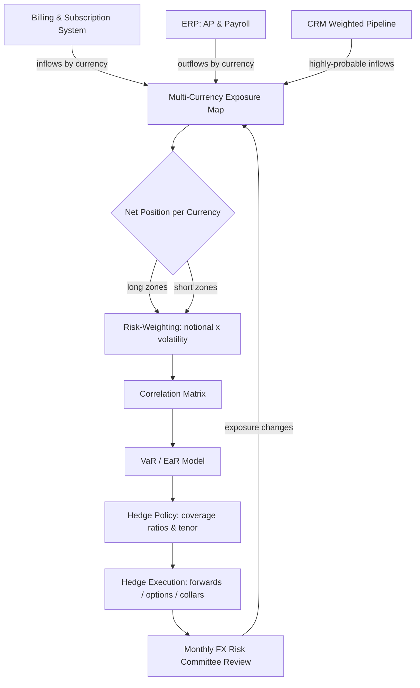

## Why FX Risk Becomes a Board-Level Problem Past 4 Currency Zones

When a company sells in one or two currencies, foreign exchange (FX) is a footnote. When it sells in four or more, FX becomes a structural feature of the income statement that can swamp the operating leverage the business worked years to build. The moment a CFO can no longer explain a revenue miss without pulling up a currency table, FX has graduated from a treasury hobby to a board-level governance problem.

### 1.1 The arithmetic of why four zones is the breaking point

The instinct is that FX risk scales linearly with the number of currencies. It does not. Risk scales with the number of *uncorrelated* exposures and the *dispersion* of their movements. A company billing in USD, EUR, GBP, and CAD has four currencies but a relatively tight correlation cluster — EUR, GBP, and CAD all tend to move against the dollar in loosely related ways. Add JPY, BRL, INR, and AUD and the correlation structure fractures. The portfolio-variance formula makes this concrete: total exposure variance is the sum of each currency's variance plus the cross-terms of every pair, weighted by correlation. With four currencies you have six pairwise cross-terms; with eight you have twenty-eight. The cross-terms are where the surprises live.

- **Diversification is real but partial.** Selling in EUR and JPY does provide some natural offset because the two rarely crash against the dollar simultaneously. But diversification never eliminates exposure — it reshapes the distribution. A treasurer who assumes "we are diversified so we are fine" is confusing lower variance with zero variance.
- **The dispersion problem dominates past four zones.** Emerging-market currencies do not just have higher volatility; they have fat-tailed, asymmetric distributions. A 3% monthly move in EUR/USD is a normal Tuesday. A 3% monthly move in a single session for BRL or TRY is a headline. Once one or two emerging-market zones enter the revenue mix, the loss distribution stops looking like a bell curve.
- **Reporting-currency gravity.** Every non-reporting-currency dollar of revenue must eventually be translated back. The more zones, the more of the P&L is subject to a translation rate the company does not control and cannot forecast.

### 1.2 What the board actually cares about

Directors are not asking the treasurer to predict the euro. They are asking three questions, and a credible FX program answers all three in plain language.

| Board question | What it really means | What a good answer looks like |
|---|---|---|
| "How much of our revenue is at risk?" | Quantified, not anecdotal | "12% of forecast ARR sits in currencies with >10% annualized vol; modeled 95% one-year EaR is $4.1M." |
| "Did the miss come from the business or the currency?" | Separating operating performance from FX noise | Constant-currency bridge that isolates the FX line to the dollar. |
| "Are we hedged, and what does the hedge cost?" | Policy exists, has guardrails, has a price tag | "We hedge 70-90% of next-twelve-month booked exposure; carry cost ran 0.4% of hedged notional last year." |

When the treasurer can answer those three on a single slide, FX stops being a source of board anxiety. When the treasurer answers with "currency was a headwind this quarter," the board correctly hears "we do not have a model."

### 1.3 The credibility cost of an unmodeled program

The deepest damage from unmanaged FX is not the cash loss in any single quarter — it is the erosion of forecast credibility. Public-market investors apply a discount to companies whose guidance is regularly blown up by currency. Carolyn Everson-style growth narratives unravel quickly when the only consistent thing about guidance is that it is wrong by the size of the FX move.

Look at how seasoned multinational operators talk about it. **Salesforce (CRM)** has for years guided revenue on a constant-currency basis precisely so the market can separate the 20%+ organic engine from the dollar's gyrations. **Microsoft (MSFT)**, with roughly half its revenue outside the United States, publishes FX impact as an explicit line in its investor materials and quantifies the next-quarter expected impact in basis points. **Workday (WDAY)** and **Atlassian (TEAM)** — both SaaS businesses that scaled internationally fast — discuss hedge programs and constant-currency growth on earnings calls because their investors demand it. The pattern is unmistakable: companies that scale across many currencies and *want a premium multiple* treat FX modeling as an investor-relations asset, not a back-office chore.

The takeaway for an operator scaling past four zones: build the model before you need it. The first time FX costs you a quarter, you want to be the CFO who says "this was within our modeled range and our policy" — not the one explaining why there was no policy at all.

---

## The Three Exposure Types: Transactional, Translational, and Economic

Every credible FX program starts by refusing to treat "FX exposure" as one thing. There are three exposure types, they behave differently, they hit different financial statements, and they require different tools. Conflating them is the single most common modeling error.

### 2.1 Transactional exposure: the cash you will actually move

Transactional exposure is the risk that a *specific, contracted or highly probable cash flow* in a foreign currency is worth a different amount in your reporting currency by the time it settles. It is the most concrete of the three because it maps to real money changing hands.

- **Where it lives.** A signed EUR-denominated annual contract that bills monthly; a GBP vendor invoice due in 60 days; a CAD payroll run; an intercompany loan repayment. Each is a dated, sized, known-direction cash flow.
- **Why it matters most operationally.** Transactional exposure is the part of FX risk you can hedge cleanly because you can name the amount, the currency, and the date. A treasurer who hedges nothing else should hedge this.
- **The forecasting subtlety.** "Highly probable" forecasted transactions — next-twelve-month subscription renewals, for instance — are also transactional exposure even before the cash is contracted, provided the forecast is reliable enough to defend. This is the bridge between the order book and the hedge book.

### 2.2 Translational exposure: the accounting mirage that still moves the stock

Translational exposure arises when foreign-subsidiary financial statements are consolidated into the parent's reporting currency. A German subsidiary keeps its books in euros; at consolidation, its revenue, expenses, assets, and liabilities are restated in dollars at prescribed rates. When the euro moves, the *reported* dollar figures move even though no cash crossed a border.

- **It is non-cash — and that is the trap.** Because translation produces no cash flow, inexperienced operators dismiss it. But translation moves *reported revenue and reported EPS*, and the market trades on reported numbers. A SaaS company can have a flawless operating quarter in local currency and still miss consensus revenue purely on translation.
- **Where it parks on the statements.** Balance-sheet translation differences flow through the Cumulative Translation Adjustment (CTA) in other comprehensive income (OCI), not net income — so the balance sheet absorbs them quietly. Income-statement translation, by contrast, hits revenue and operating income directly.
- **The reason constant-currency reporting exists.** Constant-currency disclosure (covered in depth later) is, in essence, the company's tool for telling investors "ignore the translational mirage and look at the operating engine."

### 2.3 Economic exposure: the slow, strategic risk

Economic exposure — sometimes called operating or competitive exposure — is the risk that sustained currency moves change the *competitive economics* of the business itself, independent of any specific transaction or translation entry.

- **It is the hardest to see and the most expensive to ignore.** If the dollar strengthens structurally for two years, a US-based SaaS vendor's euro-priced product becomes effectively more expensive to European buyers relative to a euro-cost-base local competitor. Win rates erode. That is economic exposure, and no forward contract fixes it.
- **It interacts with pricing strategy.** Companies with local pricing power can pass currency moves through; companies in price-sensitive segments cannot. Economic exposure modeling therefore belongs as much to the GTM and pricing teams as to treasury.
- **The natural-hedge lever.** The primary defense against economic exposure is structural: matching the currency of costs to the currency of revenue. A vendor with a euro cost base selling in euros has converted an economic exposure into a near-zero net position.

### 2.4 Mapping the three types to statements and tools

The discipline is to keep the three types in separate columns of every model. Each demands a different instrument and hits a different place.

| Exposure type | Primary financial-statement impact | Cash or non-cash | Primary mitigation tool | Time horizon |
|---|---|---|---|---|
| Transactional | Revenue, COGS, gain/(loss) on FX line | Cash | Forwards, options, collars | 0-24 months |
| Translational | Reported revenue, operating income, CTA in OCI | Non-cash | Net-investment hedges, constant-currency reporting | Ongoing |
| Economic | Win rates, margins, long-run growth | Cash (indirect) | Natural hedges, pricing strategy, footprint design | 2+ years |

A model that buckets every euro of exposure into a single "EUR exposure" number cannot tell the CFO which lever to pull. A model with three buckets can say: "Of our €40M exposure, €28M is transactional and hedgeable now, €9M is translational and we manage it with constant-currency disclosure, and €3M is economic and we are addressing it by moving support staffing into the eurozone." That sentence is the entire point of the exercise.

---

## Building the Multi-Currency Revenue Exposure Map

Before any hedge, any model, any policy, the company needs a single source of truth for *where the currency actually is*. The exposure map is that artifact. It is the unglamorous spreadsheet that every credible FX program is built on, and skipping it is why so many programs hedge the wrong thing.

### 3.1 What the exposure map must contain

The exposure map is a structured inventory of every forecasted and contracted cash flow by currency, by month, by direction. At minimum it captures:

- **Inflows by currency and month.** Subscription revenue, usage revenue, professional-services revenue — split by the *billing* currency, not the customer's country, because a French customer billed in dollars is a USD exposure.
- **Outflows by currency and month.** Local payroll, local office leases, local contractor spend, in-country marketing, local tax payments, cloud-infrastructure invoices denominated in non-USD.
- **The net position per currency.** Inflows minus outflows. This is the number that matters. A zone with $10M of EUR inflows and $7M of EUR outflows has a $3M net long-EUR exposure — not a $10M one.
- **Confidence tier.** Each cash flow tagged as *contracted* (signed), *highly probable* (forecast with strong history), or *anticipated* (planning assumption). Hedge accounting and hedge sizing both depend on this tiering.

### 3.2 Sourcing the data without a six-month project

The most common reason exposure maps never get built is that the data feels scattered across the billing system, the ERP, the CRM, and twelve subsidiary ledgers. It does not have to be a heroic integration project. A pragmatic first build:

- **Inflows from the billing/subscription system.** The recurring-revenue engine already knows contract currency, amount, and billing schedule. Export the active book and the renewal forecast by billing currency.
- **Outflows from the ERP accounts-payable and payroll modules.** AP by vendor currency and payroll by entity currency cover the large majority of outflow exposure.
- **The CRM pipeline for the forward view.** Weighted pipeline by deal currency extends the map beyond contracted revenue into the highly-probable tier.
- **A monthly refresh, not a real-time feed.** The exposure map should be regenerated monthly. Real-time FX exposure data sounds impressive and is almost always over-engineering for a company in the 4-12 zone range.

### 3.3 The structure of the map: an illustrative example

A worked example makes the structure concrete. Consider a SaaS company at roughly $120M ARR selling across five currency zones. A simplified next-twelve-month exposure map:

| Currency zone | NTM inflows ($M equiv) | NTM outflows ($M equiv) | Net exposure ($M) | Net direction | Annualized vol |
|---|---|---|---|---|---|
| EUR | 31.0 | 12.0 | 19.0 | Long EUR | 8% |
| GBP | 14.0 | 6.5 | 7.5 | Long GBP | 9% |
| CAD | 9.0 | 4.0 | 5.0 | Long CAD | 6% |
| AUD | 7.0 | 1.5 | 5.5 | Long AUD | 11% |
| JPY | 6.0 | 0.5 | 5.5 | Long JPY | 10% |
| USD (reporting) | 53.0 | 95.5 | n/a | Base | — |

Two things jump off this table. First, the company is structurally **long every foreign currency** — inflows exceed outflows everywhere — because its cost base (engineering, headquarters) is dollar-heavy. That is the typical shape of a US-headquartered SaaS business and it means the company *loses* reported revenue when the dollar strengthens. Second, the largest single risk is EUR, but AUD and JPY carry higher volatility per dollar of exposure, so risk-weighted they punch above their notional. A naive program hedges proportionally to notional; a modeled program hedges proportionally to *risk contribution*.

### 3.4 From map to risk: introducing the volatility weighting

The exposure map gives notional. Risk requires multiplying notional by volatility — and, critically, by correlation. The next sections build the formal models, but the exposure map itself should already carry a "risk-weighted exposure" column: net exposure multiplied by the currency's annualized volatility. In the example above, EUR's risk-weighted figure is $19.0M × 8% = $1.52M; AUD's is $5.5M × 11% = $0.61M. The treasurer now sees that AUD, at one-third the notional of EUR, carries 40% of EUR's standalone risk. This single column reorders the entire hedging priority list.

The diagram captures the whole pipeline: data feeds the map, the map nets to positions, positions get risk-weighted and correlated, the model produces VaR and EaR, policy translates risk into coverage ratios, execution places the hedges, and the committee loop feeds changes back to the map. Every later section in this answer is one box in this flow.

---

## Quantifying Exposure: Value-at-Risk and Earnings-at-Risk Models

The exposure map tells you what is exposed. The risk model tells you *how much it could cost*. Without a number, the board conversation stays anecdotal and the hedge ratio is a guess. Two models do the heavy lifting: Value-at-Risk (VaR) and Earnings-at-Risk (EaR).

### 4.1 Value-at-Risk: the single-number summary

Value-at-Risk answers: "Over a given horizon, at a given confidence level, what is the worst loss we expect from currency moves?" A one-month, 95% VaR of $2.4M means: in 95 of 100 months, FX losses should be no worse than $2.4M; one month in twenty, they could be worse.

There are three standard approaches, and a company in the 4-12 zone range should know all three even if it uses only one.

| VaR method | How it works | Strength | Weakness |
|---|---|---|---|
| Parametric (variance-covariance) | Assumes normal returns; uses vol and correlation matrix | Fast, transparent, easy to explain to a board | Understates fat tails; weak for emerging-market currencies |
| Historical simulation | Replays actual historical rate moves against today's positions | Captures real distribution shape and real correlations | Backward-looking; misses regime changes not in the window |
| Monte Carlo simulation | Generates thousands of random scenarios from a statistical model | Flexible; handles options and non-linear payoffs | Computationally heavier; model-assumption-dependent |

For a treasury team without quant staff, **historical simulation is the pragmatic default**: it requires only a few years of daily rate data, makes no false normality assumption, and is straightforward to defend to auditors and directors. Parametric VaR is the right *communication* tool because it decomposes cleanly; many teams compute historical VaR for the real number and parametric VaR for the explanatory decomposition.

### 4.2 The parametric calculation, step by step

Parametric VaR is worth walking through because the math reveals where the risk actually concentrates.

- **Step one — position vector.** Take net exposure per currency from the map: EUR $19M, GBP $7.5M, CAD $5M, AUD $5.5M, JPY $5.5M.
- **Step two — volatility vector.** Annualized volatility per currency, scaled to the horizon. For a one-month VaR, divide annual vol by the square root of 12.
- **Step three — correlation matrix.** The pairwise correlation of each currency pair against the dollar, estimated from two to three years of daily returns.
- **Step four — portfolio variance.** Combine positions, volatilities, and correlations via the standard portfolio-variance formula. The cross-terms — position-i times position-j times vol-i times vol-j times correlation-ij — are where diversification benefit appears.
- **Step five — apply the confidence multiplier.** For 95% confidence, multiply portfolio standard deviation by 1.645; for 99%, by 2.326.

The instructive output is not the headline number but the **risk decomposition**: how much of total VaR each currency *contributes* after correlation. It is routine to find that a currency representing 12% of notional contributes 25% of VaR because it is volatile and weakly correlated with the rest of the book. That is the currency to hedge first.

### 4.3 Earnings-at-Risk: translating VaR into the language the board speaks

VaR is a treasury metric. The board thinks in earnings. Earnings-at-Risk reframes the same exposure as: "How much could currency move our reported revenue, operating income, or EPS over the planning horizon?"

- **EaR uses the planning horizon, not a trading horizon.** VaR is often one-day or one-month; EaR is typically next-twelve-months or next-four-quarters, matching the guidance cycle.
- **EaR connects to constant-currency.** The EaR number is, in effect, the size of the FX bridge line that could appear between guided and reported revenue. A board that sees "95% EaR on FY revenue is $4.1M, or 70 basis points of growth" immediately understands the stakes.
- **EaR should be expressed three ways.** In absolute dollars, as a percentage of revenue, and as an EPS figure. Different directors anchor on different units.

### 4.4 Stress testing beyond the model

VaR and EaR describe normal-to-bad outcomes. They do not describe the genuinely bad day. Stress testing fills that gap by asking "what if" against named, severe scenarios — and it is the part of the model auditors and sophisticated boards now expect.

- **Historical replays.** Re-run the current position through real crisis windows: the 2015 Swiss franc de-peg, the 2016 sterling post-referendum drop, the March 2020 dollar liquidity spike, the 2022 yen slide. If the book survives those, the board has comfort.
- **Hypothetical shocks.** Apply uniform stress — every foreign currency down 15% against the dollar simultaneously — to model a correlated risk-off event where diversification benefit collapses.
- **Reverse stress testing.** Instead of "what does a 15% move cost," ask "what move would cost us a guidance miss?" If the answer is a 4% move, the program is under-hedged; if it is a 20% move, coverage is adequate.

The pairing is the point: VaR and EaR for the routine quarter, stress tests for the quarter that ends up in the press release. A program that reports only VaR is telling the board about Tuesdays and staying silent about the storm. The hedge policy in the next block is built to perform under *both* — and that is where the model stops being analysis and becomes a set of standing decisions.
