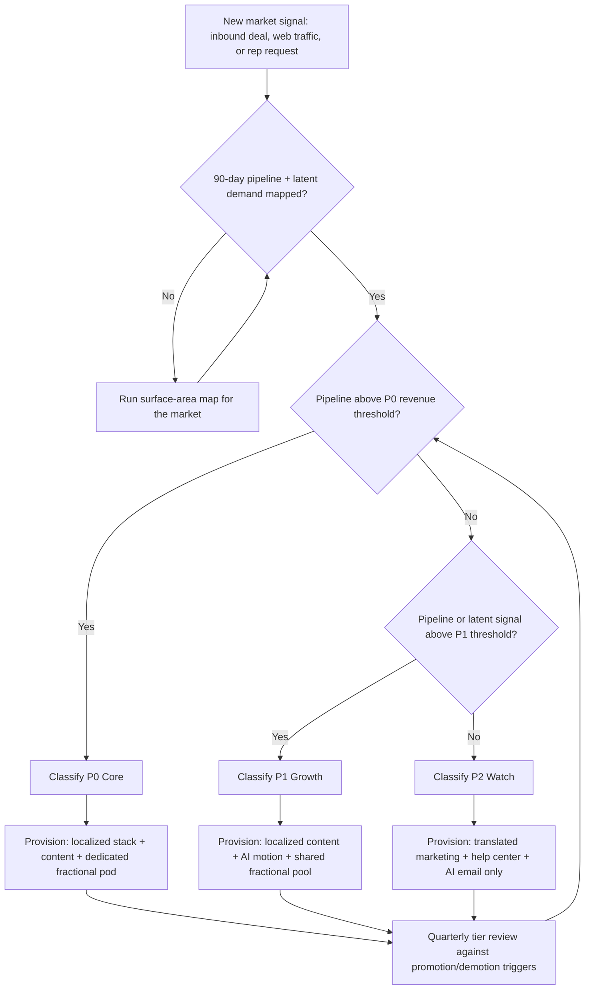

## The Multi-Language Trap: Why Headcount Is the Wrong First Move

### 1.1 The instinct that quietly burns your budget

The moment a SaaS company closes its third deal in Tokyo or its fifth in Munich, a predictable conversation starts in the leadership Slack channel: "We need native speakers." Within a quarter, someone has drafted a hiring plan for a Japanese-speaking AE, a German support engineer, a French-speaking customer success manager, and a Mandarin onboarding specialist. The plan looks responsible. It is, in fact, the single most expensive way to solve a problem that is mostly an infrastructure problem wearing a headcount costume.

Here is the uncomfortable arithmetic. A fully-loaded support or sales hire in a tier-one APAC or EMEA market costs between $95,000 and $160,000 per year once you include salary, employer taxes, benefits, equity, tooling, and the management overhead of a cross-timezone direct report. Ten of those is $1.0M to $1.6M in annual run-rate. That is a Series-A-sized commitment made to cover what is often, in the first 18 months, a few hundred conversations per language per quarter. The headcount is sized for the market you imagine in 2028, not the market you actually have today.

**The deeper problem is structural, not financial.** Headcount is the least reversible decision in revenue operations. If you over-build infrastructure, you turn off a feature flag. If you over-hire across six countries, you are now managing severance law in six jurisdictions, each with its own notice periods, works-council requirements, and reputational blast radius. You have converted a tuning problem into a layoff problem.

### 1.2 What "multi-language infrastructure" actually means

When practitioners say "multi-language sales infrastructure," they almost never mean a roomful of bilingual humans. They mean a stack of capabilities, most of which are software, process, and a thin layer of fractional human expertise:

- **A language-detection and routing layer** that knows, the instant an inbound lead or support ticket arrives, what language the buyer prefers and where to send it.
- **A localized content system** so that the deck, the one-pager, the demo environment, and the email sequence already exist in the buyer's language before a human is ever involved.
- **An AI translation layer** that handles the 80% of communication that is transactional and low-stakes, with confidence scoring that flags the 20% that needs a human.
- **An async-first self-serve surface** — knowledge base, help center, in-product guidance — that resolves the majority of questions without a synchronous conversation in any language.
- **A small pool of fractional native speakers** — not employees — who handle the high-stakes, nuanced 20%: negotiation, escalation, executive relationships, and the quality assurance of everything the machines produce.

The mistake is treating the human layer as the foundation. It is the capstone. You build the other four layers first, measure what genuinely requires a human, and then size the human layer to that measured demand instead of to anxiety.

### 1.3 The reframe: coverage is a function, not a roster

The CFO question — "how many people do we need?" — is the wrong question. The right question is: "what is our language coverage function, and what is the cheapest mix of software and fractional humans that satisfies it at our current volume?"

Coverage has three dimensions. **Breadth** is how many languages you touch at all. **Depth** is how far into the buyer journey each language is supported — does German stop at the marketing site, or does it run all the way through contract redlines? **Latency** is how fast a buyer in a given language gets a competent response. A company can have excellent breadth and terrible depth: a localized homepage in twelve languages but every sales conversation forced into English. That company looks global and converts like a local.

The infrastructure-first approach lets you decouple these. Breadth becomes cheap because translation is software. Depth becomes a deliberate, tiered choice. Latency becomes an async design problem before it becomes a staffing problem. Only after those three are tuned do you discover the genuine, irreducible need for human language fluency — and it is almost always far smaller than the original ten-hire plan assumed.

This is not a cost-cutting argument dressed up as strategy. Companies that build infrastructure first consistently *enter more markets faster* than companies that hire first, because infrastructure scales horizontally — adding Korean to a translation layer is a configuration change, while adding a Korean-speaking team is a recruiting cycle. The infrastructure approach is both cheaper and more aggressive.

---

## Mapping Your Language Surface Area Before You Spend a Dollar

### 2.1 You cannot resource what you have not measured

Before any tooling decision, you need a defensible map of where language friction actually lives in your funnel. Most teams skip this and resource based on the loudest anecdote — one frustrated AE in Singapore becomes a regional hiring plan. The map replaces anecdote with a count.

Pull 90 days of data from three systems and tag every interaction by buyer-preferred language:

| Data source | What to extract | What it tells you |
|---|---|---|
| CRM (opportunities + contacts) | Country, billing region, language field, deal stage reached | Where revenue is concentrated by language, and where deals stall |
| Support desk (tickets/conversations) | Detected language, CSAT, resolution time, reopen rate | Where post-sale language friction destroys retention |
| Web + product analytics | Browser locale, session geography, language toggle usage | Latent demand — markets buying *despite* no localization |
| Inbound marketing (forms, chat) | Language of free-text fields, chatbot abandonment | Top-of-funnel leakage before sales ever sees the lead |

The output of this exercise is a single table: language, number of opportunities, pipeline value, win rate, average support ticket volume, and average CSAT. That table will surprise you. It is common to discover that 70% of your "global" volume sits in two or three languages, and that a market you assumed needed dedicated staff is actually being served fine in English by buyers who happen to be bilingual.

### 2.2 The four interaction tiers and their language sensitivity

Not every interaction needs the same language treatment. Sort every touchpoint into one of four tiers, because the resourcing answer differs sharply by tier.

- **Tier A — Self-serve discovery.** Marketing site, pricing page, blog, help center. Buyers tolerate machine translation here because they are scanning, not negotiating. Language sensitivity: low. This is pure software.
- **Tier B — Transactional sales motion.** Demo scheduling, follow-up emails, proposal delivery, routine product questions. AI-assisted translation with human review works well. Language sensitivity: medium.
- **Tier C — High-stakes synchronous moments.** Live discovery calls, negotiation, executive briefings, churn-risk save calls. These genuinely benefit from native fluency. Language sensitivity: high.
- **Tier D — Legal and compliance.** Contracts, DPAs, security questionnaires, regulatory disclosures. These need certified human translation or local legal review — never raw machine output. Language sensitivity: critical.

The strategic insight: Tiers A and B are typically 75-85% of total interaction volume, and they are addressable with software plus light review. Tier C is where real human fluency earns its cost, and it is a minority of volume. Tier D is rare, episodic, and best handled by named vendors rather than headcount. Once you see your volume distributed across these tiers, the ten-hire plan visibly collapses — most of those hires were being provisioned to do Tier A and B work that software does for a fraction of the cost.

### 2.3 Quantifying the cost of doing nothing

The map is not only about where to spend; it is about proving the cost of the status quo so the investment is justified. For each language, estimate the **language friction tax**: pipeline that leaks specifically because of language gaps.

A workable model: take opportunities where the buyer's preferred language is unsupported, and compare their win rate and sales-cycle length to your English-native baseline. If German-preference deals win at 18% versus a 26% baseline and take 22 days longer, that delta — applied to German pipeline volume — is the friction tax. Do the same for support: compare CSAT and churn for unsupported-language accounts versus the baseline.

This number is what you take to finance. The conversation shifts from "we want to spend money on translation" to "we are losing an estimated $1.4M in annual pipeline and $300K in preventable churn to language friction, and here is a $180K infrastructure plan that recovers most of it." That framing wins budget. The vague framing — "we should localize" — loses to every other line item.

### 2.4 Distinguishing demand from noise

One discipline keeps the map honest: separate *served* demand from *latent* demand from *aspirational* demand. Served demand is languages where you already have revenue. Latent demand is markets generating web traffic and inbound but converting poorly — real opportunity, currently leaking. Aspirational demand is markets leadership is excited about but where you have zero signal.

Infrastructure investment should follow served and latent demand. Aspirational demand gets a marketing-site translation and a watch-and-learn posture — nothing more. The classic over-hiring error is staffing aspirational demand: putting a full-time Korean CSM in place because the board wants Korea on the logo slide, before a single Korean deal exists. The map, rigorously applied, makes that error visible and stops it.

---

## The Tiered Language Coverage Model: P0, P1, and P2 Markets

### 3.1 Why a single global standard bankrupts you

The instinct after building the surface-area map is to define one quality bar — "every market gets full native support" — and apply it everywhere. That bar is unaffordable and, worse, mis-allocated: it spends the same on a market with two deals as on a market with two hundred. The fix is a tiered coverage model that explicitly assigns different levels of investment to different markets.

Sort every language market into three priority tiers based on the surface-area map — specifically on current pipeline value plus latent demand signal.

| Tier | Definition | Coverage commitment | Human layer |
|---|---|---|---|
| P0 — Core | Top languages by pipeline; clear, repeatable revenue | Full-depth: localized stack, content, async support, native human on Tier C/D | Dedicated fractional pod, named owner |
| P1 — Growth | Real but sub-scale revenue; strong latent signal | Mid-depth: localized content + AI sales motion, async support, on-call native for Tier C | Shared fractional pool, scheduled hours |
| P2 — Watch | Sporadic deals; aspirational or early latent demand | Light: translated marketing + help center, AI email, English for live calls | None dedicated; escalate to P1 pool if a real deal appears |

For most Series-B-stage companies, P0 is two to three languages, P1 is three to five, and P2 is everything else. The whole model is designed so that 80% of your spend lands on P0, where 80% of the revenue is, while P1 and P2 are kept deliberately cheap until the data says otherwise.

### 3.2 How a market graduates between tiers

Tiers are not permanent. The model needs explicit, numeric promotion and demotion rules so that decisions are made by data rather than by whoever lobbies hardest.

- **P2 to P1 promotion:** triggered when a market sustains a defined pipeline threshold (for example, four-plus qualified opportunities per quarter for two consecutive quarters) *or* when latent web demand crosses a traffic-and-conversion bar.
- **P1 to P0 promotion:** triggered when a market sustains a revenue threshold and a deal-count threshold for three consecutive quarters, indicating the demand is durable, not a spike.
- **Demotion:** any P0 or P1 market that falls below its tier's floor for two consecutive quarters is reviewed, and its dedicated resourcing is reallocated.

The discipline of written triggers is what prevents tier creep — the slow drift where every market quietly becomes "high priority" and the cost model dissolves. Review the tier assignments once a quarter in the same meeting where you review the surface-area map.

### 3.3 The diagnostic flow from raw signal to resourcing decision

The model becomes operational when it is a repeatable decision flow rather than a quarterly debate. The flow below is the engine: a market signal enters, gets classified, and exits as a specific, costed resourcing action.

Every market sits somewhere on this flow at all times, and every quarter it re-enters the review loop. There is no market that is "just handled" outside the model.

### 3.4 What each tier buys in plain terms

To make the tiers concrete for non-operators, translate them into buyer experience. In a **P0** market, a buyer can journey from the marketing site through demo, proposal, negotiation, and onboarding entirely in their language, with a native human present at every high-stakes moment. In a **P1** market, the buyer gets a fully localized self-serve and async experience, AI-assisted written sales communication in-language, and a native human scheduled in for negotiation and executive calls. In a **P2** market, the buyer gets a translated website and help center and AI-translated emails, but live conversations happen in English with the understanding that the buyer is comfortable operating bilingually — which the surface-area map has already confirmed they are.

This is honest segmentation. It does not pretend every market gets a Rolls-Royce experience. It guarantees that the markets carrying your revenue do, and that the rest get a genuinely competent experience that costs almost nothing to maintain.

---

## AI Translation Layer: Where Machine Translation Actually Holds Up

### 4.1 The honest capability map of modern machine translation

The AI translation layer is the load-bearing wall of the entire infrastructure, so it is worth being precise about what it can and cannot do in 2026. Neural machine translation and LLM-based translation are genuinely excellent for high-resource language pairs — English paired with German, French, Spanish, Japanese, Korean, or simplified Chinese — on transactional, factual content. They are mediocre-to-risky for idiomatic persuasion, legal precision, and low-resource languages.

Map your content against that reality:

- **Safe for near-autonomous machine translation:** help-center articles, FAQ content, product documentation, transactional email (scheduling, confirmations), status updates, in-app strings. The content is factual, the stakes are low, and errors are self-correcting because the buyer can ask a clarifying question.
- **Safe with human review:** sales follow-up emails, proposal narrative, case studies, demo scripts. A human native speaker reviews machine output before it goes out — review is roughly five times faster than translating from scratch.
- **Not safe for machine translation alone:** contracts, DPAs, regulatory disclosures, anything where a mistranslated clause creates legal liability or a misread negotiation cue costs a deal. These go to certified human translators or local counsel.

The governing principle is **stakes-based routing**: the higher the cost of an error, the more human involvement the content gets. The AI layer is not a replacement for humans; it is a triage system that lets your scarce human fluency concentrate on the content where it changes outcomes.

### 4.2 Confidence scoring and the human-in-the-loop gate

A naive translation layer translates everything and hopes. A well-built one scores its own output and routes low-confidence segments to a human. Modern translation tooling exposes a quality-estimation score per segment — a model-predicted probability that the translation is accurate and natural without a reference. That score becomes a gate.

| Confidence band | Routing rule | Typical content |
|---|---|---|
| High (above 0.90) | Auto-publish, no review | Help-center text, transactional email, UI strings |
| Medium (0.75-0.90) | Queue for fast human review before send | Sales emails, proposal sections, case studies |
| Low (below 0.75) | Block; route to native speaker for full translation | Idioms, negotiation language, legal phrasing |

This gate is what makes the economics work. Instead of paying humans to touch 100% of content, you pay them to touch the 15-25% that the model itself flags as uncertain. The volume of human review is set by the machine's honesty about its own limits, and that volume shrinks over time as the glossary and translation memory mature.

### 4.3 Translation memory and glossary: the assets that compound

The two assets that turn a translation layer from a cost center into a compounding moat are **translation memory** and the **terminology glossary**. Translation memory stores every previously approved translation segment; when the same or a similar segment appears again, it is reused for free, with no model call and no review. Over a year, a B2B SaaS company's content is repetitive enough that translation memory routinely covers 30-50% of new translation volume at zero marginal cost.

The glossary enforces consistency on terms that must never drift: your product names, feature names, the controlled vocabulary of your category, and the specific rendering of pricing and legal terms. Without a glossary, "workspace" might be translated three different ways across the help center, the deck, and the in-app text — which makes a global product feel amateurish. With a glossary, those terms are locked. Both assets are owned and curated by the native-speaker QA layer described later; they are the mechanism by which human review *reduces future human review*.

### 4.4 Where the AI layer fits in the stack — and where it must not

Concretely, the AI translation layer should be wired in as a service that other systems call, not as a feature bolted onto one tool. Practically that means a translation orchestration platform — companies in this space include Smartling, Lokalise, Phrase, and Crowdin — sitting between your content sources and their destinations, holding the translation memory and glossary centrally, and exposing confidence scores and human-review queues.

The non-negotiable boundary: the AI layer never autonomously touches Tier D legal content and never autonomously joins a live Tier C conversation as the sole language bridge. Real-time AI interpretation for live calls has improved, and it is a reasonable *assist* for a bilingual rep, but it is not a substitute for a native speaker in a negotiation where a misread tone costs six figures. The layer is brilliant at scaling written, asynchronous, transactional language. Keep it firmly inside that lane, and it will carry the overwhelming majority of your multi-language volume without a single new hire.
