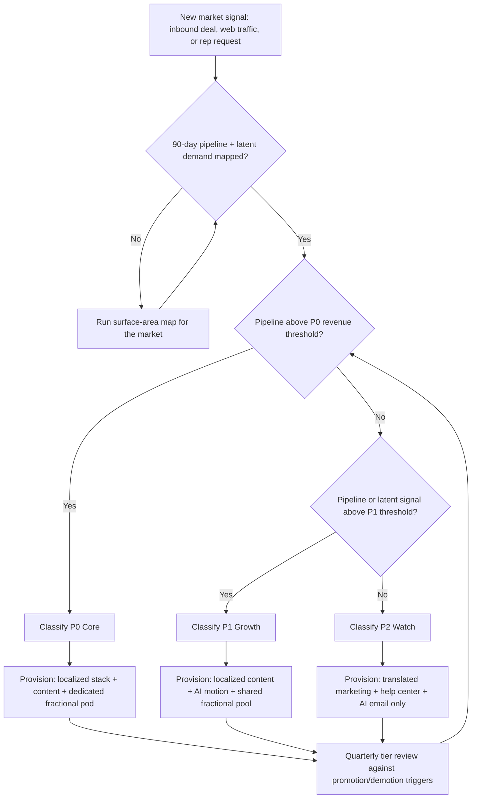

### Direct Answer

You build multi-language sales infrastructure for APAC and EMEA by treating language coverage as a software-and-process problem first and a headcount problem last. A translation layer, a localized stack, async self-serve support, and a tiered content system carry roughly 80% of multi-language volume, while a small pool of fractional native speakers handles only the high-stakes 20%. Done in this sequence, six languages of genuine coverage costs roughly a quarter to a third of a ten-person hiring plan, and every later hire is sized to measured demand instead of anxiety.

> **TL;DR**
> - **Headcount is the wrong first move.** Ten APAC/EMEA hires run $950K-$1.6M/year and are nearly irreversible; the infrastructure equivalent runs ~$195K-$393K and is mostly variable cost.
> - **Map before you spend.** Pull 90 days of CRM, support, and web data, tag by buyer-preferred language, and sort interactions into four tiers — self-serve, transactional, high-stakes synchronous, and legal.
> - **Tier your markets P0/P1/P2** with written promotion and demotion triggers so 80% of spend lands where 80% of revenue is.
> - **The AI translation layer carries the transactional 80%** with confidence scoring and a human-in-the-loop gate; it never autonomously touches legal content or live negotiations.
> - **Localize the stack, content, and self-serve support** so a buyer can move through demo, proposal, and onboarding in-language before a human is involved.
> - **Use fractional native-speaker pods, not hires** — engagement tiers a market earns its way up as pipeline proves out.
> - **Hire only when a market graduates** on data: durable revenue, relationship-bound selling, mandatory local compliance, or speed-to-credibility.

---

## 1. The Multi-Language Trap: Why Headcount Is the Wrong First Move

### 1.1 The instinct that quietly burns your budget

The moment a SaaS company closes its third deal in Tokyo or fifth in Munich, a predictable conversation starts: "We need native speakers." Within a quarter someone has drafted a plan for a Japanese-speaking AE, a German support engineer, a French CSM, and a Mandarin onboarding specialist. It looks responsible, but it is the single most expensive way to solve a problem that is mostly an infrastructure problem wearing a headcount costume.

The arithmetic: a fully-loaded support or sales hire in a tier-one APAC or EMEA market costs $95,000-$160,000 per year. Ten of those is $1.0M-$1.6M in annual run-rate — a Series-A-sized commitment to cover what is often a few hundred conversations per language per quarter. The headcount is sized for the market you imagine in 2028, not the one you have.

**The deeper problem is structural, not financial.** Headcount is the least reversible decision in revenue operations. Over-build infrastructure and you turn off a feature flag; over-hire across six countries and you are managing severance law in six jurisdictions. You have converted a tuning problem into a layoff problem.

### 1.2 What "multi-language infrastructure" actually means

"Multi-language sales infrastructure" almost never means a roomful of bilingual humans. It means a stack of capabilities — mostly software and process, with a thin layer of fractional human expertise:

- **A language-detection and routing layer** that knows, the instant an inbound lead or ticket arrives, what language the buyer prefers and where to send it.
- **A localized content system** so the deck, one-pager, demo environment, and email sequence already exist in the buyer's language before a human is involved.
- **An AI translation layer** that handles the transactional, low-stakes 80% of communication, with confidence scoring that flags the 20% needing a human.
- **An async-first self-serve surface** — knowledge base, help center, in-product guidance — that resolves most questions without a synchronous conversation.
- **A small pool of fractional native speakers** — not employees — who handle the high-stakes 20%: negotiation, escalation, executive relationships, and QA of the machine output.

The mistake is treating the human layer as the foundation. It is the capstone. Build the other four first, then size the human layer to measured demand instead of anxiety.

### 1.3 The reframe: coverage is a function, not a roster

"How many people do we need?" is the wrong question. The right one: "what is the cheapest mix of software and fractional humans that satisfies our coverage function at current volume?" Coverage has three dimensions. **Breadth** is how many languages you touch. **Depth** is how far into the buyer journey each runs — does German stop at the marketing site, or run through contract redlines? **Latency** is how fast a buyer gets a competent response. A company with excellent breadth and terrible depth looks global and converts like a local.

The infrastructure-first approach decouples these: breadth is cheap because translation is software, depth is a deliberate tiered choice, latency is an async design problem before a staffing problem. Only after those three are tuned do you discover the irreducible need for human fluency — almost always far smaller than the ten-hire plan assumed. Adding Korean to a translation layer is a configuration change; adding a Korean-speaking team is a recruiting cycle.

---

## 2. Mapping Your Language Surface Area Before You Spend a Dollar

### 2.1 You cannot resource what you have not measured

Before any tooling decision, you need a defensible map of where language friction lives in your funnel. Most teams skip this and resource based on the loudest anecdote — one frustrated AE in Singapore becomes a regional hiring plan. The map replaces anecdote with a count: pull 90 days of data and tag every interaction by buyer-preferred language.

| Data source | What to extract | What it tells you |
|---|---|---|
| CRM (opportunities + contacts) | Country, billing region, language field, deal stage reached | Where revenue is concentrated by language, and where deals stall |
| Support desk (tickets/conversations) | Detected language, CSAT, resolution time, reopen rate | Where post-sale language friction destroys retention |
| Web + product analytics | Browser locale, session geography, language toggle usage | Latent demand — markets buying *despite* no localization |
| Inbound marketing (forms, chat) | Language of free-text fields, chatbot abandonment | Top-of-funnel leakage before sales ever sees the lead |

The output is a single table: language, opportunity count, pipeline value, win rate, support volume, CSAT. It is common to find 70% of your "global" volume in two or three languages.

### 2.2 The four interaction tiers and their language sensitivity

Not every interaction needs the same treatment. Sort every touchpoint into one of four tiers — the resourcing answer differs sharply by tier.

- **Tier A — Self-serve discovery.** Marketing site, pricing page, blog, help center. Buyers tolerate machine translation because they are scanning, not negotiating. Sensitivity: low. Pure software.
- **Tier B — Transactional sales motion.** Demo scheduling, follow-up emails, proposal delivery, routine product questions. AI-assisted translation with human review works well. Sensitivity: medium.
- **Tier C — High-stakes synchronous moments.** Live discovery calls, negotiation, executive briefings, churn-risk save calls. These genuinely benefit from native fluency. Sensitivity: high.
- **Tier D — Legal and compliance.** Contracts, DPAs, security questionnaires, regulatory disclosures. These need certified human translation or local legal review — never raw machine output. Sensitivity: critical.

Tiers A and B are typically 75-85% of total volume, addressable with software plus light review. Once you see volume distributed this way, the ten-hire plan collapses — most of those hires were provisioned for Tier A and B work software does for a fraction of the cost.

### 2.3 Quantifying the cost of doing nothing

For each language, estimate the **language friction tax**: pipeline that leaks because of language gaps. Take opportunities where the buyer's preferred language is unsupported and compare their win rate and cycle length to your English-native baseline. If German-preference deals win at 18% versus a 26% baseline and take 22 days longer, that delta — applied to German pipeline volume — is the friction tax. Do the same for support. This number is what you take to finance: the conversation shifts from "we want to spend money on translation" to "we are losing an estimated $1.4M in annual pipeline and $300K in preventable churn, and here is a $180K plan that recovers most of it."

### 2.4 Distinguishing demand from noise

One discipline keeps the map honest: separate *served* demand (languages with existing revenue), *latent* demand (markets generating traffic and inbound but converting poorly — real opportunity, leaking), and *aspirational* demand (markets leadership is excited about with zero signal). Infrastructure investment follows served and latent demand; aspirational demand gets only a marketing-site translation and a watch-and-learn posture. The classic over-hiring error is staffing aspirational demand — a full-time Korean CSM before a single Korean deal exists.

---

## 3. The Tiered Language Coverage Model: P0, P1, and P2 Markets

### 3.1 Why a single global standard bankrupts you

The instinct after building the map is to define one quality bar — "every market gets full native support" — and apply it everywhere. That bar is unaffordable and mis-allocated: it spends the same on a market with two deals as on one with two hundred. The fix is a tiered model, sorting every language market into three priority tiers based on current pipeline value plus latent demand signal.

| Tier | Definition | Coverage commitment | Human layer |
|---|---|---|---|
| P0 — Core | Top languages by pipeline; clear, repeatable revenue | Full-depth: localized stack, content, async support, native human on Tier C/D | Dedicated fractional pod, named owner |
| P1 — Growth | Real but sub-scale revenue; strong latent signal | Mid-depth: localized content + AI sales motion, async support, on-call native for Tier C | Shared fractional pool, scheduled hours |
| P2 — Watch | Sporadic deals; aspirational or early latent demand | Light: translated marketing + help center, AI email, English for live calls | None dedicated; escalate to P1 pool if a real deal appears |

For most Series-B companies, P0 is two to three languages, P1 is three to five, P2 is everything else. The model is designed so 80% of spend lands on P0, where 80% of revenue is, while P1 and P2 stay deliberately cheap.

### 3.2 How a market graduates between tiers

Tiers are not permanent. The model needs explicit, numeric promotion and demotion rules so decisions are made by data, not by whoever lobbies hardest.

- **P2 to P1 promotion:** a market sustains a defined pipeline threshold (e.g., four-plus qualified opportunities per quarter for two consecutive quarters) *or* latent web demand crosses a traffic-and-conversion bar.
- **P1 to P0 promotion:** a market sustains a revenue and deal-count threshold for three consecutive quarters, indicating durable demand, not a spike.
- **Demotion:** any P0 or P1 market below its tier floor for two consecutive quarters is reviewed and its dedicated resourcing reallocated.

Written triggers prevent tier creep — the slow drift where every market becomes "high priority" and the cost model dissolves. Review tier assignments quarterly, in the same meeting as the surface-area map.

### 3.3 The diagnostic flow from raw signal to resourcing decision

The model becomes operational when it is a repeatable decision flow rather than a quarterly debate. A market signal enters, gets classified, and exits as a specific, costed resourcing action.

Every market sits somewhere on this flow and re-enters the review loop each quarter; no market is "just handled" outside the model. Translated into buyer experience: a **P0** buyer journeys from marketing site through demo, proposal, negotiation, and onboarding entirely in-language with a native human at every high-stakes moment; a **P1** buyer gets a fully localized self-serve experience, AI-assisted written sales communication, and a native human scheduled in for negotiation; a **P2** buyer gets a translated website, help center, and AI-translated emails, with live conversations in English. This is honest segmentation — the markets carrying your revenue get a full experience, the rest a competent one that costs almost nothing.

---

## 4. AI Translation Layer: Where Machine Translation Actually Holds Up

### 4.1 The honest capability map of modern machine translation

The AI translation layer is the load-bearing wall of the infrastructure, so be precise about what it can and cannot do in 2026. Neural and LLM-based translation are genuinely excellent for high-resource language pairs — English with German, French, Spanish, Japanese, Korean, or simplified Chinese — on transactional, factual content; they are mediocre-to-risky for idiomatic persuasion, legal precision, and low-resource languages. Map your content against that reality:

- **Safe for near-autonomous machine translation:** help-center articles, FAQ content, product documentation, transactional email, status updates, in-app strings. Factual, low-stakes, self-correcting.
- **Safe with human review:** sales follow-up emails, proposal narrative, case studies, demo scripts. A native speaker reviews machine output before send — roughly five times faster than translating from scratch.
- **Not safe for machine translation alone:** contracts, DPAs, regulatory disclosures, anything where a mistranslated clause creates legal liability or a misread negotiation cue costs a deal. These go to certified translators or local counsel.

The governing principle is **stakes-based routing**: the higher the cost of an error, the more human involvement the content gets. The AI layer is not a replacement for humans; it is a triage system concentrating scarce human fluency where it changes outcomes.

### 4.2 Confidence scoring and the human-in-the-loop gate

A naive translation layer translates everything and hopes. A well-built one scores its own output and routes low-confidence segments to a human. Modern tooling exposes a per-segment quality-estimation score — a model-predicted probability the translation is accurate and natural without a reference. That score becomes a gate.

| Confidence band | Routing rule | Typical content |
|---|---|---|
| High (above 0.90) | Auto-publish, no review | Help-center text, transactional email, UI strings |
| Medium (0.75-0.90) | Queue for fast human review before send | Sales emails, proposal sections, case studies |
| Low (below 0.75) | Block; route to native speaker for full translation | Idioms, negotiation language, legal phrasing |

This gate makes the economics work. Instead of paying humans to touch 100% of content, you pay them to touch the 15-25% the model flags as uncertain — and that volume shrinks as the glossary and translation memory mature.

### 4.3 Translation memory and glossary: the assets that compound

Two assets turn a translation layer from a cost center into a compounding moat. **Translation memory** stores every previously approved segment; when the same or a similar segment recurs, it is reused for free, with no model call and no review. A B2B SaaS company's content is repetitive enough that TM routinely covers 30-50% of new volume at zero marginal cost. The **terminology glossary** enforces consistency on terms that must never drift — product names, feature names, category vocabulary, the rendering of pricing and legal terms. Without it, "workspace" gets translated three ways across help center, deck, and in-app text. Both assets are curated by the native-speaker QA layer; they are the mechanism by which human review *reduces future human review*.

### 4.4 Where the AI layer fits in the stack — and where it must not

The AI translation layer should be wired in as a service other systems call, not a feature bolted onto one tool — practically, a translation orchestration platform (Smartling, Lokalise, Phrase, or Crowdin) holding translation memory and glossary centrally and exposing confidence scores and review queues. The non-negotiable boundary: the AI layer never autonomously touches Tier D legal content and never autonomously joins a live Tier C conversation as the sole language bridge. Real-time AI interpretation is a reasonable *assist* for a bilingual rep, not a substitute for a native speaker in a negotiation where a misread tone costs six figures. Keep the layer inside the written, asynchronous, transactional lane and it carries the majority of multi-language volume without a single new hire.

---

## 5. Localizing the Sales Tech Stack: CRM, CPQ, and Sequencer Configuration

### 5.1 The stack is mostly configuration, not engineering

The systems your reps already use — CRM, CPQ engine, sequencer, support desk — were built by global vendors and ship with multi-language capability you have not turned on. The work is configuration and discipline, not a build project. Three settings carry most of the value: **language as a structured field** on the lead, contact, account, and case objects (a picklist, never free text) so every downstream rule can read it; **locale-aware formatting** so currency, dates, separators, and address blocks render in the buyer's convention; and **per-user interface language** so a pod member in Seoul works in a Korean UI while the deal rolls up to one global pipeline.

### 5.2 CRM configuration

The CRM is the spine. Configure it so language is captured once and reused everywhere.

- **Capture language at the point of entry.** A form's language selector, inferred browser locale, or the language of the inbound email writes the structured field automatically — reps never set it by hand.
- **Translate picklist values, not just the UI.** Stage names, lead sources, and industry values display in the user's language so reporting is consistent across a multilingual team.
- **Keep one global pipeline.** Resist a separate CRM instance per region. One instance, localized per user, preserves a single forecast and source of truth.

### 5.3 CPQ and quoting

Configure-Price-Quote is where localization failures become expensive, because a quote is a near-legal document. Multi-currency price books let you quote in EUR, JPY, or GBP without manual conversion. Locale-aware tax handling — VAT in the EU, GST in Singapore and Australia, consumption tax in Japan — must be built into the quote engine, not bolted on by finance afterward. Quote templates and terms get localized per P0/P1 language with human review, because this is Tier B drifting into Tier D. And currency formatting on the quote PDF must match local convention.

### 5.4 Sequencer and outbound configuration

The sales sequencer is where the AI translation layer meets day-to-day rep workflow.

- **Maintain language-specific sequences,** not one English sequence reps translate ad hoc — each P0/P1 language has its own track.
- **Route the sequencer through the translation layer** so new steps are machine-translated, confidence-scored, and human-reviewed before activation.
- **Localize send-time logic.** A sequence fires on the recipient's business hours and skips regional holidays, not the headquarters calendar.
- **Tag sequence performance by language** so you see whether the German track converts like the English one — the first signal a translation needs work.

A correctly configured stack adds zero headcount — fields, picklists, price books, and templates, set up once by an owner who knows the tools and the regions.

---

## 6. Multilingual Content Operations: Decks, One-Pagers, and Demo Environments

Once your stack and routing are localized, the next bottleneck is content. A rep can speak fluent Japanese, but if the only deck is in English, the deal stalls at the buying-committee stage.

### 6.1 Treat content as a master-and-variant system

Stop thinking of localized assets as separate files. Think of one **master asset** with bound **language variants**; when the master changes, every variant is flagged stale — the most important structural decision in multilingual content ops.

- **Master lives in one place.** The English (or primary-language) deck is the source of truth, carrying a version number and last-edited timestamp.
- **Variants reference the master version.** A French deck tagged `master-v7` is current; once the master moves to `v8`, the French deck auto-flags `stale`.
- **Slide-level granularity beats deck-level.** When master slide 12 (pricing) changes, only slide 12 needs re-localization — not the whole deck.
- **Stale does not mean unusable.** A deck one minor version behind is still sellable; reserve hard blocks for major-version drift (pricing, legal claims, capabilities).

Companies that get this right run revenue-enablement platforms like Highspot or Seismic, which natively support variant binding; if you are not ready for a platform, a three-column spreadsheet — `master_version`, `variant_language`, `variant_status` — reviewed weekly is enough to start.

### 6.2 Tier your content the same way you tier markets

You localized your **markets** into P0, P1, and P2; localize your **content** on the same tiers so spend tracks revenue.

| Content asset | P0 markets | P1 markets | P2 markets |
|---|---|---|---|
| Core pitch deck | Full human localization | Human-reviewed MT | English only |
| Pricing one-pager | Full human localization | Full human localization | English + local currency |
| Case studies (2-3) | 1 local-market case + translated | Translated only | English only |
| Demo environment | Localized UI + local data | Localized UI, English data | English |
| Security/compliance pack | Full human localization | Full human localization | Full human localization |
| Email sequences | Human-reviewed MT | Human-reviewed MT | English |

Note the one row fully localized at every tier: the **security and compliance pack**. A mistranslated capability claim costs a deal; a mistranslated data-residency clause costs a lawsuit. Never machine-translate legal or security language without human sign-off.

### 6.3 The pricing one-pager is non-negotiable localization

If you localize exactly one asset per market, make it the pricing one-pager. **Currency and tax formatting** matter — a German prospect seeing USD with American separators (`$1,000.00`) reads "this vendor has not thought about us." It is also **the most-forwarded asset**: pricing pages get sent to procurement, finance, and legal — people the rep never speaks to — so it must stand alone, in-language. And it is **short** — one page is 250-400 words, full human localization runs $40-80 per language, so there is no excuse to skip it.

### 6.4 Demo environments: localize the frame, not always the data

A localized demo is far more persuasive than an English one — but you do not need a fully translated dataset for every market.

- **Always localize the UI chrome** — navigation, buttons, field labels, currency, date format. Modern apps with an i18n layer make this a configuration toggle.
- **Localize sample data only for P0.** A demo tenant with French company names and EUR amounts is worth building for top markets; for P1/P2, an English-data demo with localized UI is acceptable.
- **Build one "regional" demo tenant per region.** An EMEA tenant and an APAC tenant cover 8-10 languages between them, pre-staged and reset on a schedule by enablement.

### 6.5 The content request queue

Decentralized translation requests are how content ops dies — a rep DMs a translator, the file never makes it back to the master system, and now there are three competing French decks. Centralize every request behind one intake form feeding one queue all reps can see. Run a 48-hour SLA for variant updates and 5 business days for net-new localization, and enforce the drift-prevention rule: every completed translation lands back in the master system. A single part-time content-ops coordinator runs this for a 30-rep international team.

---

## 7. Async-First Support: Knowledge Bases and Self-Serve in Local Languages

The fastest way to need ten support hires is to route every customer question to a human in real time. The fastest way to avoid it is to answer 70-80% before they are ever asked — asynchronously, in the customer's language.

### 7.1 Async-first is a structural choice, not a cost-cutting one

APAC and EMEA customers are in time zones where your headquarters is asleep for a third to half of their working day. You either staff live coverage across those zones (expensive — the headcount trap) or design support so most issues never require a synchronous human. **Deflection is the goal** — every question answered by a self-serve article is a ticket, and a potential headcount, that never existed. Humans still handle the 20-30% that genuinely needs judgment; the knowledge base handles the rest. The payoff: support **scales sub-linearly** — doubling your customer base does not double your support load when deflection is high.

### 7.2 Build the knowledge base in tiers, mirroring markets

You do not translate the whole knowledge base into every language on day one. You translate by **article value** and **market tier**.

| KB content | P0 languages | P1 languages | P2 languages |
|---|---|---|---|
| Top 20 articles (80% of traffic) | Human-reviewed MT | Human-reviewed MT | Raw MT with disclaimer |
| Onboarding/setup guides | Human-reviewed MT | Raw MT with disclaimer | English |
| Troubleshooting library | Human-reviewed MT | Raw MT with disclaimer | English |
| Release notes | Raw MT | Raw MT | English |
| API/developer docs | English (developer norm) | English | English |

The 80/20 rule is reliable: roughly 20 articles answer 80% of inbound questions. Identify them from your English KB analytics and localize **those first** — translating article #340 before the top 20 is pure waste.

### 7.3 Machine translation is acceptable in the KB — with guardrails

The knowledge base is the one place where raw machine translation is genuinely defensible, because the alternative is no answer at all. The guardrails matter:

- **Always label MT content.** A small banner — "This article was machine-translated; the English original is authoritative" — sets expectations and gives the customer an out.
- **Human-review the top 20.** These get the most traffic and scrutiny; spend the localization budget here.
- **Never MT anything with legal or billing consequences.** Refund policy, data deletion, contract terms, security configuration — human-reviewed only, every tier.
- **Re-run MT when the source updates.** Modern KB platforms (Zendesk, Intercom, Salesforce Service Cloud) flag source-article changes and re-trigger translation automatically.

### 7.4 The in-product help layer

The KB is one channel. In-product contextual help is the other — and it deflects even more because the customer never leaves the app.

- **Contextual tooltips and empty states** in-language, driven by the same i18n layer as the rest of the UI.
- **An in-app help widget** that searches the localized KB without a context switch.
- **Guided product tours** for onboarding, localized for P0 and P1 — a localized tour cuts week-one tickets sharply because the customer never gets lost.

### 7.5 The deflection math

Why async-first is the headcount answer, in numbers — assume 1,000 international customers generating 600 support contacts a month.

| Scenario | Deflection rate | Human-handled contacts/mo | Support FTEs needed |
|---|---|---|---|
| No localized self-serve | 15% | 510 | 5-6 |
| Localized top-20 KB only | 55% | 270 | 3 |
| KB + in-product help + community | 78% | 132 | 1-2 |

The difference between the first row and the last is four to five support hires — the exact headcount this infrastructure exists to avoid. Async-first self-serve is not a "nice to have" alongside the language strategy. It **is** the strategy.

---

## 8. The Fractional Native-Speaker Model: Pods, Not Hires

Some customer moments genuinely need a fluent human: a complex demo, a contract negotiation, a churn-risk escalation. The instinct is to hire a full-time native speaker per language; the fractional pod model gets the same coverage at a fraction of the cost and risk.

### 8.1 Why full-time per-language hiring fails early-stage expansion

Hiring one full-time rep per language before the revenue exists fails predictably. **Utilization is terrible** — a Korean-speaking rep with three Korean deals is 80% idle. It is **rigid**: if Korea underperforms and Italy overperforms, you cannot reassign a salaried Korea hire. It is a **single point of failure** — one resignation wipes out a market. And it **front-loads cost before revenue**: ten language hires is roughly $800K-$1.2M fully-loaded, committed before a single localized deal closes.

### 8.2 The pod structure

A **language pod** is a small, flexible group of native or near-native speakers providing language coverage **on demand** across your funnel, rather than owning a fixed book of business.

- **Composition.** 3-5 people per region (EMEA pod, APAC pod), collectively covering 6-8 languages; each fluent in 1-2 languages plus English.
- **Engagement model.** A mix of part-time employees, fractional contractors, and a vetted agency bench.
- **What they do.** Join calls as language support alongside the deal-owning AE, run localized demos, review machine-translated outbound, handle escalations in-language.
- **What they do not do.** They do not own quota or pipeline. The AE owns the deal; the pod member is the language layer on top.

### 8.3 Three engagement tiers

Match the engagement model to demonstrated demand. Do not start anyone at tier three.

| Tier | When to use | Engagement | Cost shape |
|---|---|---|---|
| Tier 1: Agency bench | Brand-new language, unproven demand | Per-call or per-hour vendor | Pure variable, ~$50-90/hr |
| Tier 2: Fractional contractor | 5-15 active deals in the language | 10-20 hrs/week retainer | Semi-variable, ~$2-4K/mo |
| Tier 3: Part-time/full-time hire | 15+ deals, consistent pipeline | 0.5-1.0 FTE | Fixed, justified by revenue |

The progression is the discipline: a language **earns** its way up the tiers as pipeline proves out. You never commit fixed cost ahead of revenue, and a market that stalls at tier 1 costs nothing to wind down.

### 8.4 Sourcing the pod without a recruiting budget

You do not need a recruiting function to staff a pod:

- **Native-speaker contractors via specialist marketplaces** focused on multilingual sales and CX talent fill a fractional seat in days.
- **Translation and localization agencies** increasingly offer "sales support" tiers — native speakers who join calls, not just translate documents.
- **Your own customer base.** Power users in a target market sometimes make excellent fractional demo support.
- **Reverse the time zone problem.** A fractional Spanish speaker in a compatible time zone covers both Spain and Latin America — one hire, two regions.

### 8.5 The pod-plus-AE workflow

The pod only works if the handoff with the deal-owning AE is crisp. The AE sends a two-line pre-call brief — deal stage, key objection, what "good" looks like — and on the call drives strategy and commercial terms while the pod member handles language, cultural nuance, and rapport. They are co-presenters, not a translator-and-client dynamic. The AE stays the constant: the customer relationship lives with the AE, pod members rotate, and that keeps the relationship resilient to pod turnover.

### 8.6 The cost contrast

For an expansion into 8 languages across EMEA and APAC:

| Model | Year-1 cost | Coverage | Flexibility |
|---|---|---|---|
| 8 full-time language hires | $850K-$1.1M | 8 languages, fixed | None — cannot reassign |
| 2 fractional pods (7-8 people, mixed tiers) | $260K-$360K | 8 languages, on-demand | High — scale per language |

The pod model delivers comparable coverage at roughly a third of the cost, and it fails cheaply: when a language underdelivers, you wind down a tier-1 engagement instead of running a layoff.

---

## 9. Routing and Escalation: Getting the Right Language to the Right Rep

You can have perfect content, a strong knowledge base, and a well-built pod — and still lose deals if a German inbound lands with an English-only SDR. Routing is the connective tissue, and it is almost entirely a configuration problem.

### 9.1 Language as a first-class routing attribute

Most teams route on territory, deal size, or industry. Add **language** as an explicit, captured attribute everywhere a person or ticket enters your system.

- **Capture language at every entry point** — forms with a language selector, inferred browser locale, the language of the inbound email, the country dial code on a phone lead.
- **Store it as a structured field**, not a free-text note — a CRM picklist on the lead, contact, and case objects.
- **Make it visible.** Every queue view, dashboard, and record shows the language flag at a glance.

### 9.2 The routing decision tree

A clean routing model has a small number of explicit rules:

- **Inbound lead, P0/P1 language available in pod →** route to the deal-owning AE for the territory; auto-attach the relevant pod member as language support.
- **Inbound lead, P2 language →** route to a designated English-comfortable rep with a localized email template ready; pod support on request only.
- **Support ticket, localized KB exists →** auto-reply with the relevant localized KB links first (deflection), then queue to a language-tagged support owner if unresolved.
- **Support ticket, no localized coverage →** route to the regional async queue with a clear SLA and an MT-assisted first response.
- **Escalation (churn risk, exec complaint, contract dispute) →** always to a human, always in-language, within a hard SLA. Escalations never get machine-translated.

### 9.3 Escalation tiers and SLAs

Not every issue deserves the same urgency. Define tiers so the pod's scarce native-speaker hours go to what matters:

| Escalation tier | Trigger | Target language | SLA |
|---|---|---|---|
| Tier 1 — Routine | Standard product question | Localized KB / MT-assisted reply | 24 business hours |
| Tier 2 — Deal-impacting | Active deal blocked, demo request | Pod member, in-language | 4 business hours |
| Tier 3 — Revenue-at-risk | Churn signal, security/legal concern | Native speaker + AE, in-language | 1 business hour |

The discipline is reserving native-speaker live time for tiers 2 and 3; Tier 1 — the bulk of volume — is absorbed by the async, self-serve layer, which keeps pod headcount small.

### 9.4 Time-zone-aware routing

A perfectly language-matched route is still a failure if the assigned human is asleep:

- **Follow-the-sun queues.** A ticket created at 9 a.m. in Singapore routes to the APAC pod's working window, not a headquarters queue that wakes up eight hours later.
- **Coverage windows, not 24/7 staffing.** Each pod publishes its working hours; outside them, async with a clear SLA.
- **Set the SLA clock to business hours**, measured against the customer's region — preventing both false breaches and false comfort.
- **Calendar-aware routing.** The router should know an EMEA pod is thin in August and Lunar New Year pulls APAC coverage down, and widen SLAs accordingly.

### 9.5 Automating the routing layer

Routing should be machine-executed and near-instant; humans introduce latency and inconsistency:

- **Use native CRM routing or a routing tool** — the assignment engine in Salesforce Service Cloud, HubSpot workflows, or a dedicated lead-routing app.
- **Round-robin within a language group**, not globally, so a French lead never lands with a rep who cannot serve it.
- **Auto-attach the pod member** as a collaborator on language-matched opportunities the moment the lead is routed.
- **Build a fallback rule for every path.** When the primary language owner is unavailable, the lead routes to a documented backup, never a void. Unrouted records are how multilingual pipelines silently leak.

A correctly configured routing layer adds zero headcount — just rules, fields, and workflows.

---

## 10. Quality Assurance and the Localization Feedback Loop

Localization is not a project you finish; it is a system you run. Machine translation drifts, products ship features, slang evolves. Without a QA loop, your "localized" infrastructure quietly decays.

### 10.1 The three layers of localization QA

Quality assurance operates at three layers, each catching a different class of failure.

- **Linguistic QA — is it correct?** Grammar, terminology, tone, accuracy. Catches mistranslations and awkward machine output. Owned by native-speaker reviewers.
- **Functional QA — does it work?** Does the localized UI break when German text runs 30% longer than English? Do date formats render right and currency fields calculate correctly? Owned by whoever tests the product and demo environments.
- **Commercial QA — does it sell?** Does the localized pitch resonate, or is it a literal translation that misses the cultural mark? Owned by pod members and regional sales leadership.

Most teams do a little linguistic QA and skip the other two — yet functional and commercial failures quietly cost deals.

### 10.2 The localization feedback loop

The feedback loop turns one-time localization into a self-improving system — four stages that never stop:

| Stage | Activity | Owner | Cadence |
|---|---|---|---|
| Capture | Reps and pod members flag bad translations, gaps, awkward phrasing | Pod / field reps | Continuous |
| Triage | Score each issue by traffic impact and severity | Content-ops coordinator | Weekly |
| Fix | Re-translate, re-review, or re-record the affected asset | Pod / reviewers | Per SLA by severity |
| Verify | Confirm the fix landed in the master system and propagated | Content-ops coordinator | Per fix |

The critical design choice: **capture must be frictionless.** A pod member who hits an awkward translation mid-call should flag it in ten seconds — a Slack emoji reaction, a one-click form, a tagged CRM note. If flagging takes five minutes, nobody does it and the loop is dead.

### 10.3 Build a glossary and a style guide — then enforce them

The highest-leverage QA artifact is a per-language **glossary** of how key terms must be translated.

- **The glossary locks core terminology.** Product names, feature names, and category terms get one approved translation per language — no rep improvising.
- **The style guide sets tone** — formal versus informal address (`tu`/`vous`, `du`/`Sie`, keigo), sentence length, how to render the brand voice in each language.
- **Feed the glossary into your MT engine.** Enterprise tiers of DeepL, Google, or a custom-trained model accept a glossary so it stops mistranslating your product name on every pass.
- **Glossary updates are versioned.** A new feature name enters the glossary in all languages before any asset using it ships.

This is what makes machine translation safe at scale: the glossary turns a generic MT engine into one that speaks **your** product correctly.

### 10.4 Sampling-based QA, not full review

You cannot human-review everything — that is the headcount trap again. Sample intelligently.

- **Risk-weight the sample.** 100% review of legal, security, and pricing content; heavy sampling of high-traffic KB articles and core decks; light spot-checks of low-traffic content.
- **A rolling monthly audit.** Each month a pod member reviews a fixed sample — say 10 assets — per P0 language; findings feed the triage queue.
- **Mystery-shop the customer journey.** Quarterly, walk the full localized funnel as a customer in that language — this catches seams asset-by-asset review misses.

### 10.5 QA metrics worth tracking

A few numbers tell you whether the localization system is healthy or rotting.

| Metric | What it tells you | Healthy direction |
|---|---|---|
| Translation defect rate | Flags per 100 localized assets | Falling over time |
| Stale-variant percentage | Share of variants behind master version | Below 15% |
| Time-to-fix (by severity) | Loop responsiveness | Within SLA |
| MT post-edit distance | How much humans change raw MT output | Falling = MT improving |
| Localized-funnel conversion vs. English | Whether localization actually sells | At or above English |

The last metric matters most: if your localized funnel converts at or above the English baseline, the infrastructure is paying for itself; if it lags, QA has found its next priority.

---

## 11. Compliance, Data Residency, and Contract Language by Region

### 11.1 Why language and compliance are the same problem

Treating localization as a sales concern and compliance as a separate legal track is a trap. The moment you operate in APAC and EMEA, the language a buyer reads, the jurisdiction governing their data, and the enforceability of your contract become one interlocked system. A German buyer wants not just a German-language proposal but a Data Processing Agreement that satisfies the EU General Data Protection Regulation, a privacy notice naming where their data sits, and a contract whose governing-language clause they can defend internally. Get the language right and the compliance wrong, and you have a polished deck attached to an unsignable agreement. Wire compliance into the same tiered model — Tier D content never touches autonomous machine translation.

### 11.2 The regional compliance surface, mapped

Map compliance obligations the way you mapped language surface area — they cluster by region, and each cluster has a few load-bearing requirements that, once satisfied, cover most deals there.

| Region | Primary data-protection regime | Data-residency expectation | Contract-language reality |
|---|---|---|---|
| EU / EEA | GDPR; ePrivacy for cookies and marketing | Standard Contractual Clauses or an adequacy decision for transfers; enterprise buyers often prefer EU-resident hosting | English contracts widely accepted; German and French public-sector buyers may require a local counterpart |
| United Kingdom | UK GDPR + Data Protection Act 2018 | UK-specific transfer mechanism (the IDTA or the UK Addendum to the SCCs) | English-native; minimal friction |
| Japan | Act on the Protection of Personal Information (APPI) | Cross-border transfer requires consent or equivalent-protection confirmation; buyers expect APPI-aware DPAs | Japanese-language contracts common in enterprise; governing-language clause matters |
| South Korea | Personal Information Protection Act (PIPA) | One of the stricter consent and cross-border regimes; data-localization pressure in regulated sectors | Korean-language contracts expected by large buyers |
| Singapore / SEA hub | Personal Data Protection Act (PDPA) | Comparatively transfer-friendly; often the natural APAC contracting hub | English-native; low friction |
| Australia | Privacy Act 1988 and the Australian Privacy Principles | Notifiable data-breach scheme; moderate residency expectations | English-native |

The table is for resourcing clarity, not legal completeness. The heavy lift is concentrated: GDPR in the EU, plus the consent-and-transfer rigor of Japan and Korea; Singapore, the UK, and Australia are comparatively light. That distribution maps onto your P0/P1/P2 tiers.

### 11.3 Resourcing Tier D without a legal team per country

You do not solve regional compliance by hiring a lawyer in every jurisdiction any more than you solve language by hiring a rep in every country. You solve it with three layers.

- **Layer one — a templated, pre-localized contract set.** Build a master services agreement, DPA, and security exhibit once, in English, with counsel. Commission certified legal translation of the DPA and key clauses into your P0 languages — Japanese and Korean first, German and French if demand justifies it. A one-time low-five-figure spend per language, not recurring headcount; the translated DPA becomes a reusable asset.
- **Layer two — a vetted panel of local counsel, fractional.** Retain one firm or practitioner per P0 region on a small retainer or pay-per-matter basis. Their job is narrow: review the rare deviation, answer a regulator-specific question, confirm the templated set still holds when local law shifts.
- **Layer three — a deal-desk gate inside the CRM.** Every opportunity over a defined value, or in a regulated segment, routes through a checkpoint before contract issuance — confirming the right templated contract and DPA, the right data-residency option, and any non-standard redline flagged for counsel.

The structural insight: scarce human expertise concentrates on the 10-15% of contracts that genuinely deviate, while templates carry the routine 85%.

### 11.4 Data residency as a sales-enablement asset

Data residency is usually discussed as a constraint; reframe it as enablement. When a German enterprise buyer asks "where does our data live?", the best answer is a one-page, localized data-residency fact sheet — already translated, linked from the proposal's security section — stating hosting regions, sub-processor list, transfer mechanism, and certifications (SOC 2, ISO 27001, any regional equivalent). If your product can offer EU-resident hosting and an APAC region, productize that into a checkbox on the order form rather than negotiating it bespoke. Done well, data residency becomes a reason the buyer trusts you.

### 11.5 The governing-language clause and the enforceability trap

One clause deserves its own paragraph because operators routinely get it wrong: the governing-language clause. When you issue a contract in two languages — an English master agreement with a Japanese counterpart — it must state which version governs in a discrepancy. Skip it and a translation error becomes a contract-interpretation dispute. The standard, defensible position for an English-headquartered company is that the English version governs, the local version provided for convenience. Some large APAC buyers — Japanese and Korean enterprises, public-sector entities — will require the local version to govern; that is a real negotiation point the counsel panel handles. The non-negotiable rule: never let a localized contract leave the building without an explicit, counsel-approved governing-language clause.

---

## 12. Cost Model and the 90-Day Rollout Plan

### 12.1 The cost model, line by line

Infrastructure beats headcount on cost — and that claim only lands with real numbers. Below is a representative annual cost model for a Series-B SaaS company across roughly six languages — two or three P0, the rest P1 and P2. Figures are illustrative ranges, not quotes.

| Cost line | What it covers | Indicative annual cost |
|---|---|---|
| Translation orchestration platform | Smartling, Lokalise, Phrase, or Crowdin — TM, glossary, confidence scoring, review queues | $18,000 – $40,000 |
| Machine-translation / LLM usage | Per-character or per-token MT volume across help center, emails, content | $6,000 – $15,000 |
| One-time legal-template localization | Certified translation of DPA + key clauses into P0 languages (amortized year one) | $20,000 – $45,000 |
| Local-counsel fractional panel | Retainers plus pay-per-matter across P0 regions | $24,000 – $48,000 |
| Fractional native-speaker pods | Pooled contract hours for Tier C calls, QA, glossary curation | $90,000 – $160,000 |
| Localized hosting / data-residency infrastructure | Incremental cloud cost for EU and APAC regions | $12,000 – $30,000 |
| Tooling localization (CRM, CPQ, sequencer config) | Mostly internal effort; some connector or add-on licensing | $5,000 – $15,000 |
| Program management | A fraction of an existing RevOps or enablement person's time | $20,000 – $40,000 |
| **Total** | **Full multi-language infrastructure, six languages** | **$195,000 – $393,000** |

Set that against the alternative: ten fully-loaded hires at $95,000-$160,000 each is $950,000-$1,600,000 per year. The infrastructure model, at a midpoint near $290,000, delivers comparable or better coverage at a quarter to a third of the cost, and most line items are variable. The largest line is the fractional pods: the infrastructure does not eliminate humans, it shrinks the human requirement to its irreducible core and buys it flexibly — six figures on 1.5 to 2.5 FTEs' worth of fluency instead of ten employed heads.

### 12.2 The 90-day rollout, phase by phase

Infrastructure fails as a big-bang project; it succeeds when sequenced so each phase produces a usable capability and informs the next.

- **12.2.1 — Days 1-15: Map and decide.** Run the surface-area analysis on 90 days of CRM, support-desk, and web data tagged by buyer-preferred language. Produce the table of languages by pipeline, win rate, support volume, and CSAT, assign every market to P0/P1/P2 with written triggers, and calculate the friction tax. Deliverable: an approved tier map and funded budget.
- **12.2.2 — Days 16-35: Stand up the translation layer.** Configure the orchestration platform and seed the glossary. Connect the help center first — high-volume, low-stakes Tier A content, the safest place to prove the layer. Set confidence-band routing. Deliverable: P0-language help center live with the auto-publish gate working.
- **12.2.3 — Days 36-55: Localize the sales motion and stack.** Configure the CRM language field, routing rules, and CPQ for localized contracts and currency. Localize the email sequences with the human-review gate. Translate the core deck, one-pager, and demo environment for P0. Commission the certified legal-template translation in parallel. Deliverable: a P0 buyer can move through demo, follow-up, and proposal in their language.
- **12.2.4 — Days 56-75: Stand up the human layer.** Recruit and onboard the fractional pods for P0 and the shared pool for P1. Retain the local-counsel panel. Configure routing and escalation logic. Run the first QA sweeps. Deliverable: native humans on-call for high-stakes moments, QA running.
- **12.2.5 — Days 76-90: Measure, tune, harden.** Stand up the metrics dashboard and compare new language-specific win rates, cycles, and CSAT against the pre-rollout baseline. Tune confidence thresholds, expand translation memory, run the deal-desk compliance gate against live deals. Deliverable: a working, measured system and a tuning backlog.

By day 90 you have a complete, measured, multi-language capability. Three sequencing principles keep the plan honest. **Software before humans:** the translation layer and localized stack come before the pods, because you cannot size the human layer until the software has absorbed what it can. **P0 before everything:** every phase does P0 fully before touching P1; P2 gets only its translated marketing surface in the entire 90 days. **Measure from day one:** baseline metrics are captured before anything changes, because a rollout you cannot measure against a baseline is one you cannot defend at budget time.

---

## 13. Metrics That Prove the Infrastructure Is Working

### 13.1 The two questions every metric must answer

A multi-language program lives or dies at budget review. Your metrics must answer two questions cleanly: **is the infrastructure recovering the revenue language friction was costing us?** and **is it cheaper and more scalable than the headcount alternative?** Every metric below maps to one of those — vanity metrics like "languages supported" answer neither. Measure each language against its own pre-rollout baseline; a German win rate that moved from 18% to 25% against a 26% English-native baseline is a story finance can act on.

### 13.2 Revenue and pipeline metrics

These answer the first question — is friction being recovered:

| Metric | Definition | What good looks like |
|---|---|---|
| Language-specific win rate | Closed-won ÷ total opportunities, segmented by buyer-preferred language | P0-language win rate converges toward the English-native baseline within 2-3 quarters |
| Localized sales-cycle length | Median days from opportunity creation to close, by language | The gap versus the English baseline narrows quarter over quarter |
| Pipeline coverage by language | Open pipeline value per language versus that market's target | P0 and P1 markets sustain coverage above target without dedicated hires |
| Language-friction tax recovered | The pre-rollout friction-tax estimate, re-run quarterly | A declining number — ideally falling 40-60% within the first year |
| Localized inbound conversion | Lead-to-opportunity rate on localized landing pages versus English-only baseline | A measurable lift in P1 and P2 markets |

### 13.3 Support, retention, and experience metrics

These confirm the post-sale side is holding, which protects the revenue the sales side wins.

- **Localized CSAT and CES,** segmented by language. The target is parity with the English baseline; a persistent gap points at a translation-quality or escalation-routing problem.
- **First-contact resolution by language** — the share of support contacts resolved without escalation. A strong async-first knowledge base pushes this up as translation memory matures.
- **Self-serve deflection rate by language** — the share of would-be contacts resolved by the localized knowledge base before a human is involved. This proves the async-first surface is doing the work that would otherwise require support headcount.
- **Localized-account net revenue retention.** Language friction is a quiet churn driver; if localized-account NRR trails the baseline, the infrastructure has a post-sale gap no new-logo win rate will offset.

### 13.4 Infrastructure-health and efficiency metrics

These answer the second question — is the model cheaper and more scalable than headcount:

| Metric | Definition | Why it matters |
|---|---|---|
| Machine-translation auto-publish rate | Share of segments clearing the high-confidence gate without human review | Rising over time proves the layer is getting cheaper per word |
| Translation-memory leverage | Share of new translation volume covered by TM at zero marginal cost | Directly reduces variable cost; 30-50% is a healthy mature state |
| Human-review queue volume | Words or segments routed to native speakers for review per week | Should fall per unit of content even as total volume grows |
| Cost per supported language | Total infrastructure cost ÷ number of P0/P1-depth languages | The headline efficiency number; compare it to a fully-loaded hire |
| Time-to-add-a-language | Elapsed time to bring a new market to P1 depth | Infrastructure should make this weeks, not the quarters a hiring cycle takes |
| Coverage cost ratio | Infrastructure annual cost ÷ estimated cost of the equivalent headcount plan | The single slide for the budget meeting; healthy is 0.25-0.40 |

### 13.5 The one-page executive view

Operators drown dashboards in detail, then wonder why leadership ignores them. The fix is a single one-page view leading with the two questions — friction tax recovered this quarter and the coverage cost ratio versus the headcount alternative — and below, a grid of P0/P1 languages each showing win rate, localized CSAT, and NRR versus baseline. This view keeps the program funded: it answers in ten seconds the only two things leadership needs to know.

---

## 14. Common Failure Modes and How to Recover

### 14.1 Failure mode: translating words but not the buying experience

The most common failure is shallow localization — translating the marketing site and a few emails, declaring the market "supported," and moving on. The buyer hits a translated homepage, fills out a form, and is dropped into an English-only sales sequence, contract, and support queue; leadership then concludes "localization doesn't work." **Recovery:** map the buyer journey for the failing language end to end and find where the language drops out — almost always the handoff from self-serve to a synchronous human or to contract. Fix that one seam, usually by adding the localized email sequence and pod coverage for Tier C. Depth in one language beats breadth across ten.

### 14.2 Failure mode: trusting machine translation past its lane

The mirror-image failure is over-trusting the AI layer — routing legal content, negotiation language, or low-resource languages through autonomous machine translation to save money. One mistranslated contract clause in an enterprise deal costs more than a year of the human-review budget you were trimming. **Recovery:** re-enforce stakes-based routing and the confidence gate. Audit what is auto-publishing and confirm Tier C and D content is excluded by rule, not by hope. The AI layer's job is the transactional 80%; the moment it does Tier D work, the architecture has been violated.

### 14.3 Failure mode: the fractional pod becomes a de facto hire

A subtle failure: a pod is so good and available that one market quietly routes everything to it — Tier A through D alike. Pod hours balloon, cost approaches a full-time salary, and the flexibility that justified the model evaporates. **Recovery:** instrument pod utilization by interaction tier; if a pod spends significant hours on Tier A or B work, that work belongs back in the software layer. If a market's genuine Tier C volume has grown to sustain a full-time role, that is not a failure — it is a P0 graduation signal.

### 14.4 Failure mode: no owner, so the system rots

Infrastructure without an owner decays. The glossary goes stale, translation memory is not curated, confidence thresholds are never tuned, the tier map is not reviewed — and within two quarters the "infrastructure" is a pile of tools nobody trusts. **Recovery:** assign a single named owner — typically in RevOps or enablement — accountable for the quarterly tier review, the metrics dashboard, glossary and translation-memory health, and the feedback loop. It need not be full-time, but it must be one identifiable person, because shared ownership of infrastructure is the same as no ownership.

### 14.5 Failure mode: compliance treated as a step, not a system

When compliance is bolted on at the end — a contract translated hastily, a data-residency question answered ad hoc — deals stall in legal and one regulatory misstep can freeze a region. **Recovery:** activate the deal-desk gate from Section 11. Every qualifying deal routes through a checkpoint confirming the right templated contract and DPA, the right data-residency option, and counsel review of any deviation. Compliance is not a rollout phase that ends; it is a permanent gate in the deal flow.

### 14.6 Counter-Case: when hiring native speakers actually is the right move

The infrastructure-first model is the right default, but it is not universal — an operator who applies it dogmatically will eventually be wrong.

**Hire when a single market has crossed the graduation threshold.** If one language generates durable, repeatable revenue — the P1-to-P0 trigger fired across three consecutive quarters — and genuine Tier C volume (negotiation, executive relationships, escalations) consistently exceeds what a fractional pod can absorb, a dedicated hire is the correct, data-backed decision. The infrastructure model's purpose was always to defer that hire until measured demand justified it, not to forbid it.

**Hire when the work is relationship-bound, not transaction-bound.** Some markets — Japan is the textbook case — run on long-cycle, trust-intensive selling where the same named individual must hold the relationship across years. A rotating fractional pool cannot carry that; a dedicated local hire buys relationship continuity infrastructure cannot synthesize.

**Hire when regulation makes a local presence mandatory.** In certain regulated sectors and jurisdictions, a local entity, data-protection officer, or responsible person is a legal precondition for operating at all. There the headcount is non-negotiable and the infrastructure surrounds it.

**Hire when speed-to-credibility is the whole strategy.** If you are racing a competitor and a visible local team is itself a sales asset — buyers in some cultures discount vendors with no in-country presence — the hire buys market credibility.

The synthesis is not "never hire." It is **sequence correctly**: build the infrastructure first so every subsequent hire is sized to measured Tier C demand, justified by a graduation trigger, and surrounded by software that handles the 80% no human should touch. The failure the ten-hire plan represents is not hiring — it is hiring *first*, *speculatively*, and *in bulk*, before any of those conditions has been tested.

### 14.7 The recovery mindset

Every failure mode shares a root cause: a layer of the infrastructure was skipped, over-trusted, or left unowned. The recovery is never to abandon the model — it is to find the skipped layer and restore it. A misconfigured confidence threshold is a Tuesday-afternoon fix; a mis-hired regional team is a year-long unwind.

---

## Related Questions

This question sits inside a cluster of regional go-to-market problems. These sibling entries go deeper on the adjacent decisions:

- **(q448)** — *How do I design regional GTM and messaging that doesn't just translate the US playbook?* The strategic layer above this answer: messaging that lands in-market is a separate discipline from translating words.
- **(q449)** — *What are the deal-stage dynamics and negotiation patterns specific to APAC/EMEA buyer psychology?* Goes deep on the Tier C moments where fractional native speakers earn their cost.
- **(q256)** — *What's the right approach to pricing localization in different regions (FX, taxes, willingness-to-pay)?* Expands the pricing one-pager and CPQ localization into a full pricing strategy.
- **(q444)** — *How do I stage regional market entry for EMEA without creating dependency bottlenecks?* The sequencing companion to the 90-day rollout plan.
- **(q445)** — *What's the hiring formula for local Account Executives in unfamiliar APAC/EMEA markets?* Picks up where the Counter-Case ends — when a market has graduated and a real hire is justified.
- **(q452)** — *How do I design partner and channel strategies specific to each region without over-distributing?* The partner-led alternative to direct language coverage in thin P2 markets.
- **(q451)** — *What's the revenue forecasting methodology when cycles vary 6+ weeks between regions?* Pairs with the localized sales-cycle metric in Section 13.
- **(q248)** — *What's the right approach to international territory expansion — EMEA before APAC, or product-fit driven?* The market-selection decision that precedes this infrastructure.

---

## Sources

1. EU General Data Protection Regulation (Regulation 2016/679) — official text, eur-lex.europa.eu.
2. European Commission — Standard Contractual Clauses for international data transfers, commission.europa.eu.
3. UK Information Commissioner's Office — UK GDPR and the International Data Transfer Agreement guidance, ico.org.uk.
4. Personal Information Protection Commission, Japan — Act on the Protection of Personal Information (APPI) overview, ppc.go.jp.
5. Personal Information Protection Commission, Korea — Personal Information Protection Act (PIPA) summary, pipc.go.kr.
6. Personal Data Protection Commission, Singapore — PDPA overview, pdpc.gov.sg.
7. Office of the Australian Information Commissioner — Privacy Act 1988 and Australian Privacy Principles, oaic.gov.au.
8. CSA Common Sense Advisory — "Can't Read, Won't Buy" research on language and purchase behavior.
9. Smartling — Translation management, quality estimation, and localization workflow documentation.
10. Lokalise — Localization platform documentation on translation memory and glossary management.
11. Phrase (formerly Memsource) — Localization platform and machine-translation quality-estimation documentation.
12. Crowdin — Localization management platform documentation.
13. DeepL — Machine translation glossary and API documentation.
14. Google Cloud Translation — Neural machine translation and AutoML custom-model documentation.
15. Slator — Language industry research on neural and LLM-based machine translation quality.
16. Nimdzi Insights — Localization industry analysis and language-services market reports.
17. Highspot — Sales enablement and content-management platform documentation.
18. Seismic — Sales enablement and content-variant management documentation.
19. Salesforce — Multi-language CRM configuration, translation workbench, and Service Cloud routing documentation.
20. HubSpot — Multi-language content, workflow routing, and CRM localization documentation.
21. Zendesk — Multi-language help-center and dynamic-content documentation.
22. Intercom — Multilingual Help Center and automated-resolution documentation.
23. Salesforce CPQ — Multi-currency price book and quote-template configuration documentation.
24. ISO/IEC 27001 — Information security management standard, iso.org.
25. AICPA — SOC 2 Trust Services Criteria overview.
26. Localization Industry Standards (LISA / GALA successors) — terminology and quality-assessment frameworks.
27. TAUS — Dynamic Quality Framework and machine-translation quality-estimation research.
28. Harvard Business Review — research on international expansion sequencing and go-to-market localization.
29. Bessemer Venture Partners — State of the Cloud reports on international expansion economics for SaaS.
30. OpenView Partners — SaaS benchmarks on support deflection, self-serve, and expansion efficiency.
31. W3C Internationalization (i18n) — technical standards for locale-aware formatting and software internationalization.
