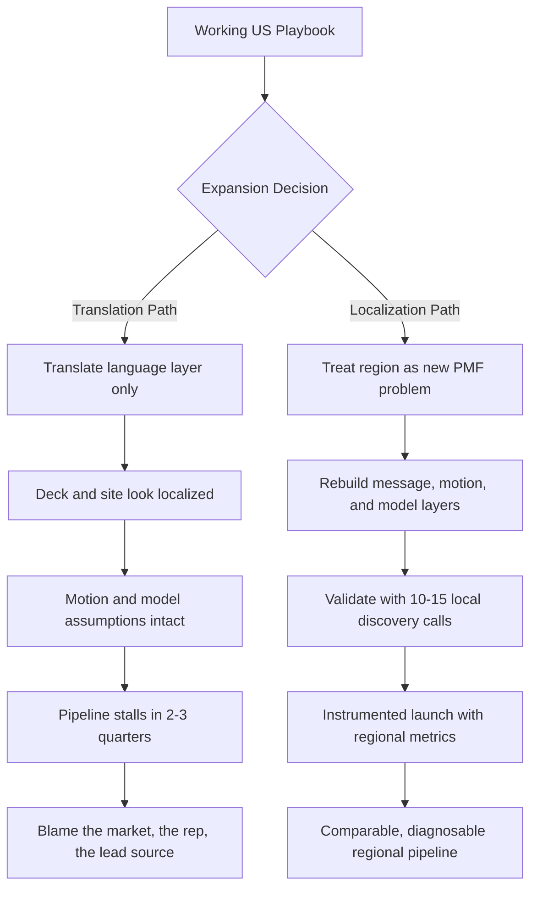

## Why Translated Playbooks Fail: The Localization Trap

### 1.1 The seductive logic of the copy-paste expansion

Every company with a working US go-to-market motion eventually hears the same internal pitch: "We have product-market fit and a repeatable playbook — let's just run it in EMEA and APAC." It sounds disciplined and efficient. It is almost always wrong, and the failure is rarely obvious until two or three quarters of pipeline have evaporated.

The trap is that a go-to-market playbook is not a generic asset. It is a tightly coupled system — ICP definition, value proposition, messaging hierarchy, channel mix, sales process, pricing model, proof points — all calibrated to one market's buyer psychology, regulatory environment, competitive set, and economic context. "Translation" usually addresses only the surface layer (website copy, deck slides) while leaving every structural assumption untouched. The result *looks* localized and *behaves* like a foreign object.

**The diagnostic question that exposes the trap:** ask your team, "If we deleted every word of English from our GTM and rebuilt it in-market, what would change?" If the honest answer is "the language, not much else," you have a translation, not a localization.

### 1.2 The four layers of a playbook — and which ones teams skip

A regional GTM playbook has four layers. Translation projects address layer one and stop; real localization rebuilds layers two through four.

| Layer | What it contains | Translated? | Usually rebuilt? |
|---|---|---|---|
| 1. Language | Website copy, deck text, email templates, UI strings | Yes | No — just translated |
| 2. Message | Value proposition, positioning, proof points, objection handling | Rarely | Should be — usually isn't |
| 3. Motion | Channel mix, sales process, deal stages, buying-committee map | Almost never | Should be — almost never is |
| 4. Model | Pricing, packaging, contract terms, procurement path, comp design | Never | Should be — never is |

Layers three and four are where deals are won or lost. A German buyer can read perfectly translated copy and still walk away because pricing is annual-prepay-only when their procurement norm is quarterly, or because the motion assumes a single economic buyer when their reality is a five-person committee with works-council sign-off.

### 1.3 What "the US playbook" silently assumes

The US playbook carries invisible assumptions that feel like universal truths. Naming them is the first act of real localization. The most dangerous:

- **Speed is a virtue.** US buyers reward fast cycles and free trials; in Japan and much of DACH, speed reads as a lack of seriousness.
- **The champion can buy.** US mid-market deals often have a single empowered champion; in EMEA enterprise the champion is a *guide*, not a *buyer*, and the decision lives in a committee they do not control.
- **Outbound at volume works.** US SDR-driven cold outbound has a tolerated cadence; in several EU markets it collides with GDPR consent norms and cultural expectations.
- **Public proof is persuasive.** US buyers respond to logo walls; in markets that guard vendor relationships as competitive information, named references are harder to get and less load-bearing.
- **One price, one motion.** The US is one large homogeneous market. "EMEA" is forty-plus markets, multiple currencies, several legal systems, and at least four distinct buyer cultures.

### 1.4 The cost of getting it wrong — and who has paid it

When HubSpot (HUBS) expanded into Japan, a lesson its leadership later discussed publicly was that the high-velocity, content-led inbound motion that defined the company in North America required substantial rework: deeper local-language content, a different trust-building cadence, and partner-led distribution over pure self-serve. Zoom (ZM) found that its frictionless self-serve US growth needed a heavier enterprise-security and data-residency narrative to convert regulated European buyers. Salesforce (CRM) built entire regional clouds and data-residency offerings precisely because "translate the trust story" was never going to satisfy EU public-sector and financial-services buyers.

The pattern: companies that won internationally treated each major region as a *new product-market fit problem*, not a distribution problem. Those that struggled treated expansion as a logistics exercise and discovered, expensively, that pipeline does not respond to logistics.

The remainder of this answer is the localization path: diagnosing region-market fit before you spend, rebuilding each layer, and instrumenting the result so you can tell a bad market from a bad execution.

---

## Diagnosing Region-Market Fit Before You Expand

### 2.1 Expansion is a portfolio decision, not a checklist

Stop asking "should we expand?" and start asking "which region, in what sequence, with what evidence?" Region selection is a capital-allocation decision — a multi-quarter, multi-headcount bet — and the worst outcome is not picking the wrong region but picking three at once with no instrumentation to tell which is working.

Treat candidate regions as a portfolio and score each on two axes — **market attractiveness** (revenue realistically reachable) and **right-to-win** (how much of your existing advantage transfers). Cheap, transferable wins go first; large but low-fit markets go later or get a partner-led motion instead of a direct build.

### 2.2 The region-market fit scorecard

Before committing budget, score each candidate region on the following dimensions on a 1-5 scale, and force-rank — the goal is comparison, not absolute truth.

| Dimension | What you are measuring | Red flag (score 1-2) |
|---|---|---|
| Inbound signal | Existing unsolicited demand (signups, demo requests, traffic) | Zero organic pull; creating demand cold |
| ICP density | Accounts matching your ICP in-region | Thin TAM; saturate in 18 months |
| Right-to-win | Does your product advantage hold against local competitors | Entrenched local incumbent with home-field trust |
| Regulatory friction | Data residency, privacy, sector rules affecting product or motion | Hard product gap (e.g., no in-region hosting) |
| Buyer-culture distance | How far the buying psychology is from your home market | Fundamentally different trust and decision norms |
| Ecosystem readiness | Availability of partners, channels, hireable talent | No partner ecosystem; must build everything direct |
| Cost-to-serve | Support languages, time zones, local presence requirements | Requires 24/7 local-language support from day one |

A region scoring 4-5 on inbound signal and right-to-win with manageable regulatory friction is a *direct build*. Strong attractiveness but high buyer-culture distance and low ecosystem readiness is *partner-first*. Weak on both axes is a *wait* — revisit in a year.

### 2.3 Read the demand signal you already have

Most companies have more region-market fit evidence than they think — they just have not looked. Before any new spend, pull:

- **Self-serve signups by country**, normalized for population and internet-economy size. Disproportionate signups against zero local marketing spend is a loud signal.
- **Web traffic and conversion by geo**, separating branded from non-branded search. Non-branded organic traffic means the *problem* you solve is being searched for there.
- **Inbound demo requests and their fate** — did they convert, stall, or churn, and at what stage? Free product-market-fit telemetry.
- **Existing customers' international footprint** — US customers' overseas offices are warm beachhead accounts and built-in references.

**The rule:** never enter a region where you have zero pre-existing demand signal *and* zero right-to-win advantage. That combination means funding pure demand creation in an unfamiliar market — the slowest, most expensive path that exists.

### 2.4 The 15-call validation sprint

Scorecards get you to a shortlist; they do not get you to conviction. Conviction comes from talking to in-market buyers *before* you build the playbook. Run a structured validation sprint — 12-15 discovery conversations with target-ICP buyers in the candidate region, conducted by someone who speaks the language and understands the business culture.

Test five hypotheses:

1. **Problem salience** — is the pain a top-five priority for this buyer, or a nice-to-have?
2. **Vocabulary** — what words do they use for the problem and category? (Almost never a literal translation of yours.)
3. **Buying process** — who is involved, in what order, and what kills deals?
4. **Competitive frame** — who do they compare you to, including "do nothing" and local tools you have never heard of?
5. **Proof requirements** — what evidence would they need to trust a foreign vendor?

Document verbatim quotes — the validation sprint is the raw material for every messaging and motion rebuild that follows.

### 2.5 Sequence: beachhead before breadth

Once a region clears validation, resist launching the whole region. "EMEA" is not a launch target; the UK and Ireland is. Pick a **beachhead** — the single country or segment where right-to-win is highest and buyer-culture distance is lowest — prove the rebuilt playbook there, then expand to adjacent markets that share buyer characteristics. The UK is a common EMEA beachhead because buyer-culture distance is smallest; DACH, the Nordics, and Southern Europe then each need their own message and motion adjustments, not a copy of the UK launch.

---

## The Buyer-Context Map: What Actually Changes By Region

### 3.1 Why you need a structured map, not anecdotes

After validation calls, teams carry a bag of anecdotes — "German buyers are detail-oriented," "Japanese deals are slow." Anecdotes do not build playbooks. You need a structured **buyer-context map**: a side-by-side comparison of how each decision-relevant variable differs between your home market and each target region. This map becomes the single source of truth that every downstream rebuild — messaging, motion, model — references.

### 3.2 The seven variables that move deals

Map each region against your home market on these seven variables. Anything that differs materially is a required playbook change.

| Variable | US baseline | Common EMEA/APAC variance | Playbook layer affected |
|---|---|---|---|
| Decision structure | Single empowered economic buyer | Larger consensus committee; works councils in DACH | Motion, sales process |
| Risk posture | Tolerates fast bets, easy to switch later | Higher switching aversion; vendor stability weighted heavily | Message, proof |
| Trust source | Logos, case studies, analyst rankings | Peer referral, local presence, long relationships | Message, channel |
| Time horizon | Quarterly thinking, fast cycles | Longer evaluation, longer expected vendor tenure | Motion, sales process |
| Communication style | Direct, benefit-forward, superlatives | More reserved; superlatives erode credibility in DACH/Japan | Message, content |
| Procurement norm | Champion drives procurement | Formal procurement and legal review; RFPs more common | Model, sales process |
| Data and compliance | Light regulatory weight in the sale | Data residency and privacy are buying criteria, not features | Model, product |

### 3.3 Trust is the variable that breaks the most playbooks

Of the seven, **trust source** is the one US companies underestimate most. The US playbook builds trust through *broadcast proof* — analyst quadrants, logo walls, named case studies, review-site ratings. Several target markets build trust through *relationship proof* — a referral from a respected peer, a local team you can meet, a multi-year vendor track record, membership in the right local ecosystem.

This is not cosmetic; it dictates channel strategy. If trust in your beachhead market is relationship-driven, a cold-outbound, content-gated, self-serve motion underperforms regardless of content quality — because the *form* of the proof is wrong. SAP (SAP) built much of its global enterprise position on this insight: deep local presence and partner relationships as the trust vehicle, with product capability as the closing argument rather than the opening one.

### 3.4 The vocabulary and category-name problem

Validation calls almost always reveal that in-region buyers do not use your category name, or use it differently. The US may call your product "revenue intelligence"; the in-region buyer searches and budgets for "sales reporting" or "CRM analytics" — or has no category word at all. This matters because:

- **SEO and paid search** target the buyer's words; a literal translation of "revenue intelligence" produces a phrase nobody searches.
- **Budget lines** follow category names. If the buyer has a line for "sales tooling" but not "revenue intelligence," positioning must map to the budget that exists.
- **Sales conversations** stall when the rep's framing does not match the buyer's mental model.

Build a **per-region lexicon** — the buyer's words for the problem, category, competing approaches, and desired outcome. It feeds website copy, paid search, content, and rep talk tracks, and is one of the highest-leverage artifacts the validation sprint produces.

### 3.5 Competitive set: the incumbents you have never heard of

The US competitive frame rarely survives a border. In each region, run a fresh competitive map: global competitors with strong local presence, *local* competitors invisible from the US, the regional SI or consultancy "build it ourselves" alternative, and the "do nothing in Excel" status quo. A region where a trusted local incumbent owns the category is a right-to-win problem you must solve in *positioning* before *demand generation* — the subject of the next block's value-proposition rebuild.

---

## Designing The Regional GTM Operating Model

### 4.1 The operating model is a set of explicit choices

Before localizing a single message, decide *how* the region will be run. The regional GTM operating model is the set of structural choices — who owns the region, how centralized decisions are, which functions are local versus shared, how the region connects to the global organization. Getting this wrong creates either a stranded under-resourced outpost or a rogue region that drifts off-brand and off-model.

### 4.2 Four operating-model archetypes

| Archetype | Description | Best when | Main risk |
|---|---|---|---|
| Remote-led | Region sold from HQ time zone with travel; no local entity | Beachhead test, low buyer-culture distance, English-friendly market | Time-zone drag, weak local trust, support gaps |
| Distributor / reseller | A local partner owns the customer relationship and motion | High buyer-culture distance, strong partner ecosystem, fast coverage needed | Limited data visibility, margin loss, partner misalignment |
| Hybrid local cell | Small local team (1-2 reps + 1 SE) on a shared global infrastructure | Validated region, direct motion fits, you want control and learning | Under-resourcing; cell starves without HQ commitment |
| Full regional org | Local leadership, marketing, sales, support, sometimes RevOps | Large proven region, multi-year commitment, material revenue | High fixed cost; slow to unwind if region underperforms |

The correct progression: **remote-led validation → hybrid local cell on the beachhead → full regional org once the playbook is proven and repeatable.** Distributor models run in parallel for markets that do not justify a direct build. Skipping straight to a full regional org before the playbook is proven is the most expensive expansion mistake — you scale fixed cost against an unvalidated motion.

### 4.3 Centralized, federated, or local: deciding per function

Within any archetype, each GTM function sits on a centralization spectrum. Decide deliberately, function by function.

- **Centralized at HQ:** product, brand identity, pricing architecture, RevOps platform and data model, deal desk — these need global consistency.
- **Federated (global frame, local execution):** demand generation, content, sales process, enablement. HQ owns the framework and quality bar; the region owns localization and execution.
- **Fully local:** language and cultural adaptation, partner relationships, local events, regulatory interpretation, references — these cannot be run from another time zone.

The federated layer is where most operating models fail — either HQ over-controls and the region ships tone-deaf assets, or the region over-localizes and the brand fragments. Section 13 covers the governance mechanics; the rule is: **own the framework centrally, own the execution locally, and write down which is which.**

### 4.4 Resourcing the model: the minimum viable regional cell

A hybrid local cell — the workhorse archetype for a validated beachhead — has a minimum viable shape. Under-resource it and the region fails for reasons that look like "the market is bad" but are actually "we sent one rep with no support into a foreign market and waited."

| Role | Why it is non-negotiable | Common under-resourcing error |
|---|---|---|
| Regional sales lead / first AE | Carries quota, owns local pipeline, embodies local trust | Hiring a junior rep instead of an experienced operator |
| Sales engineer / solutions | Regional buyers test depth; SE handles technical and compliance proof | "The AE can demo" — true until the buyer is technical or regulated |
| Local marketing / demand | Owns the localized demand engine and events | Running demand from HQ in the wrong language and time zone |
| Shared RevOps support | Instruments the region for comparable metrics | No instrumentation; region is a black box for two quarters |
| Local-language support | Post-sale trust; renewals depend on it | Defer support entirely; first renewals churn |

### 4.5 Funding and the patience window

The final operating-model decision is financial: how long does the region get before it must show proof, and what does "proof" mean? Set this *before* launch, in writing. A hybrid cell on a beachhead typically needs **three to four quarters** for a clean read — one quarter to ramp, two to fill and work pipeline, one to close and renew. Funding a region for two quarters and then judging it has caused more false-negative region kills than genuine market failure. Pair the patience window with leading-indicator checkpoints (Section 12) so you have early diagnostic signal, not a binary verdict at month nine.

---

## Localizing The Value Proposition, Not Just The Words

### 5.1 Value proposition is the layer translation skips most expensively

The website gets translated. The deck gets translated. The value proposition — the actual *argument* for why this buyer, in this market, should choose you — almost never gets rebuilt. Yet it is the engine of the entire playbook: it determines which proof points matter, which objections you face, what content to build, how reps frame discovery. A translated value proposition is a US argument delivered in a local language, and local buyers feel the seam immediately.

### 5.2 The anatomy of a value proposition — and which parts are portable

A value proposition has four components. Two are largely portable; two must be rebuilt per region.

| Component | Definition | Portability |
|---|---|---|
| Target buyer | The specific person and company you serve | Mostly portable — same ICP, different buying context |
| Core problem | The fundamental pain you resolve | Largely portable — the underlying problem is often universal |
| Differentiated value | Why you, specifically, over alternatives | NOT portable — alternatives and priorities differ by region |
| Proof | The evidence that makes the claim believable | NOT portable — proof must be local and in the right form |

The mistake is assuming that because the core problem is portable, the whole value proposition is. The *problem* "sales teams lack pipeline visibility" may be universal; the *differentiated value* — "fastest to deploy" versus "most secure and compliant" versus "integrates with the local CRM everyone uses" — is entirely a function of the regional competitive set and buyer priorities mapped in Section 3.

### 5.3 Re-rank the value drivers for each region

Take your full list of value drivers — speed, ease of use, security, compliance, integrations, support, total cost, scalability, local presence — and force-rank them *for each region* on validation-call evidence. The same product has a different value proposition in each market because the *ranking* changes. A representative pattern:

| Value driver | US rank | DACH rank | Japan rank |
|---|---|---|---|
| Speed of deployment | 1 | 4 | 5 |
| Ease of use / self-serve | 2 | 5 | 6 |
| Security & data residency | 4 | 1 | 2 |
| Vendor stability & track record | 6 | 2 | 1 |
| Local presence & support | 5 | 3 | 3 |
| Total cost of ownership | 3 | 4 | 4 |

Read down the columns: the US lead message ("deploy in days, your team will love it") is near the *bottom* of the stack in DACH and Japan, where vendor stability and security lead. Leading with speed there does not just underperform — it signals you do not understand what a serious buyer cares about.

### 5.4 Localize the proof, not just the claim

A claim without locally credible proof is noise. Each region needs its own proof inventory.

- **Local customer references** — same-region, ideally same-industry logos. A French buyer discounts a US case study; a French peer reference is worth ten of them.
- **Local-language case studies and ROI data** — metrics framed in local currency and local benchmarks.
- **Regulatory and compliance attestations** — region-relevant certifications presented as proof, not buried in a trust-center footer.
- **Local presence as proof** — a registered entity, a local team, a local support number. In relationship-trust markets, *existence in-market* is itself a proof point.
- **Ecosystem proof** — local partners, integrations with tools the region uses, presence at the events it respects.

The chicken-and-egg problem is real: you need local references to win deals, and deals to get references. Solve it with the beachhead's first cohort — over-invest in the success of the first three to five regional customers, structure reference commitments into those deals, and treat early reference creation as a launch deliverable.

### 5.5 Rewrite the message from the buyer's words inward

With value drivers re-ranked and proof localized, rebuild the messaging from the per-region lexicon outward: start from the buyer's words for the problem (Section 3.4), state the re-ranked lead value, support it with local proof, pre-empt the region's specific objections — and only *then* produce the website copy and deck. In this order, the translated language layer sits on a genuinely localized argument. In reverse order, you get a beautifully translated US pitch that local buyers politely decline. Turning this rebuilt value proposition into a consistent, scalable messaging system across all regional assets is the subject of the next block.
