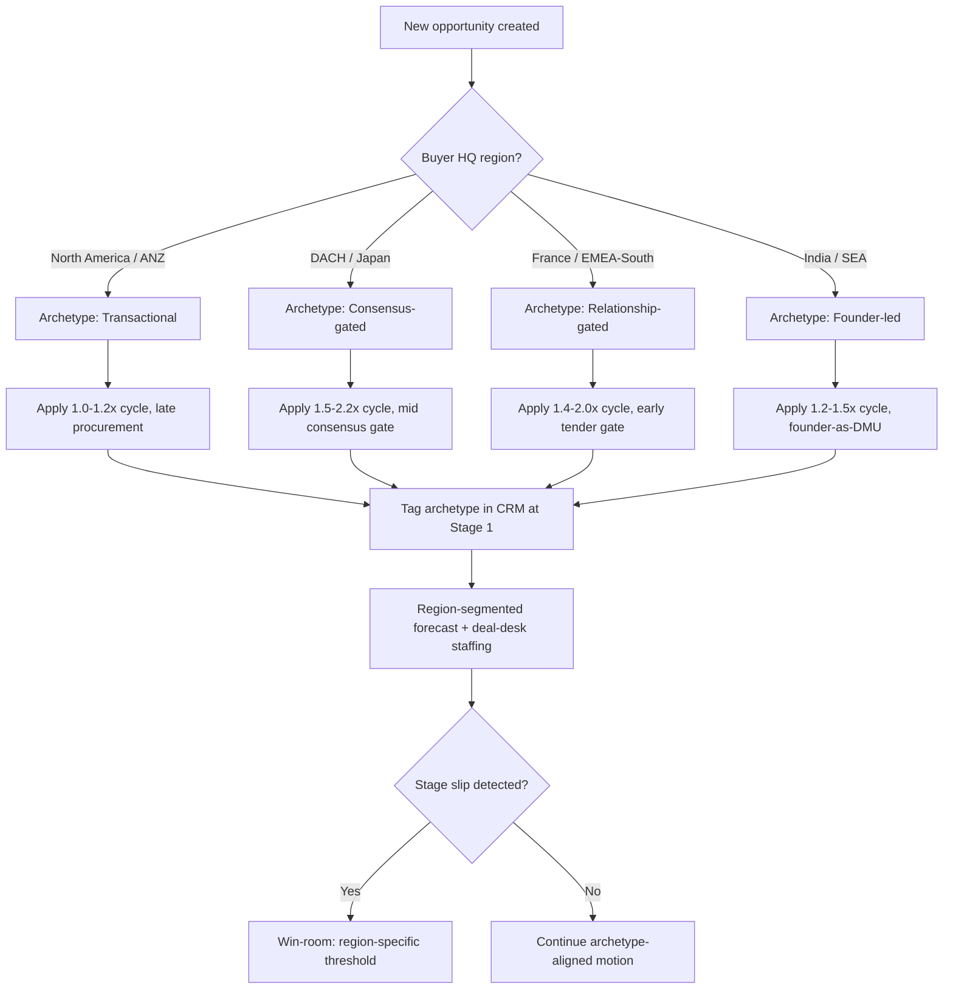

### Direct Answer

Deal-stage dynamics and negotiation patterns in enterprise SaaS are **fundamentally region-specific**, and treating APAC and EMEA as monolithic blocks is the single most expensive mistake a global revenue leader makes. The right model is a **multi-region negotiation-archetype framework** — North America runs transactional and MEDDICC-friendly, EMEA-DACH runs consensus-heavy with works-council and GDPR gates, EMEA-Nordics runs fast but flat-hierarchy, EMEA-South and France run relationship-first with slow procurement, APAC-Japan runs ringi-consensus and *nemawashi*, APAC-ANZ runs NA-adjacent, and APAC-India/SEA run highly price-sensitive with founder-led buying. Map each opportunity to its archetype at qualification, instrument stage-conversion and slip rates per region, and staff legal and deal-desk capacity to the region's true cycle length — not the global average.

> **TL;DR**
> - There is no "APAC buyer" or "EMEA buyer" — there are at least eleven distinct negotiation archetypes across the two super-regions, and each has its own stage-gate logic, decision-unit shape, and concession ladder.
> - Region drives **cycle length** (Japan and France run 1.6-2.2x a US baseline), **decision-unit size** (DACH and Japan carry 8-14 stakeholders vs. 4-6 in the US), and **where deals slip** (procurement and legal in EMEA, consensus-building in APAC).
> - Forecasting must be **region-segmented**: a blended global stage-conversion curve over-forecasts EMEA Q4 and under-forecasts ANZ, and a blended close-date pull-forward is wrong in both directions.
> - Concession sequencing differs: NA buyers expect a fast, BATNA-explicit close; DACH and Japanese buyers read aggressive discounting as a credibility risk; India/SEA buyers treat list price as an opening bid.
> - The operational fix is **archetype tagging in CRM at Stage 1**, region-specific MEDDICC/MEDDPICC variants, region-staffed deal desk and legal, and per-region win-room thresholds.

## 1. Why "APAC/EMEA Buyer Psychology" Is the Wrong Frame

The phrase "APAC/EMEA buyer psychology" appears in board decks, GTM strategy docs, and sales-enablement curricula as though it names two coherent buyer populations. It does not. EMEA spans the consensus-bound, works-council-gated industrial buyers of Germany and the fast-moving, flat-hierarchy buyers of Sweden. APAC spans the *ringi*-driven, harmony-preserving enterprise buyers of Japan and the founder-led, list-price-is-an-opening-bid buyers of India. Collapsing those into two labels destroys exactly the signal a revenue leader needs.

### 1.1 The Cost of the Monolith Assumption

When a US-headquartered SaaS company applies its domestic playbook unmodified to "EMEA" and "APAC," the failure modes are predictable and measurable. Deals slip not because reps are weak but because the **stage-gate model encodes North American assumptions**: a single economic buyer, procurement as a late-stage formality, legal as a two-week redline exchange, and a fiscal-quarter close urgency the buyer shares.

- **Cycle-length blindness.** A global pipeline report that shows a uniform 75-day average cycle is averaging a 60-day US deal against a 130-day Japanese deal and a 150-day French public-sector deal. The blended number forecasts nobody accurately.
- **Decision-unit undercounting.** US enterprise deals typically involve four to six stakeholders. DACH and Japanese deals routinely involve nine to fourteen. A rep who has identified "the" decision-maker in Munich has identified one of many.
- **Procurement-timing error.** In the US, procurement often engages at Stage 4 to paper a decision already made. In France, the Nordics public sector, and much of APAC, procurement (or a formal tender process) is a Stage 2 gate that can independently disqualify a vendor.
- **Discount mis-sequencing.** A 20% "to close this quarter" discount that lands as decisive urgency in Austin reads as a credibility problem in Frankfurt and Tokyo — and as a weak opening move in Mumbai.

### 1.2 The Replacement: An Archetype Framework

The fix is to replace two macro-labels with a named set of negotiation archetypes, each defined by its decision-unit shape, stage-gate sequence, cycle length, procurement posture, and concession psychology. This is the same logical move that MEDDICC made for qualification — replacing "good gut feel" with named, inspectable criteria. Andy Byrne's team at Clari has publicly argued that **forecast accuracy collapses when regional pipelines are blended**, and Force Management's MEDDICC practitioners have long taught that the "Decision Process" element is the one most distorted by cross-border assumptions. The archetype framework operationalizes both observations.

This pairs directly with the regional revenue-forecasting methodology covered in (q451) and the regional AE-compensation design in (q450) — archetype, forecast, and comp must agree on the same region map or the system tears itself apart.

### 1.3 How the Monolith Took Hold

The "two-region" model is not an accident; it is the residue of how SaaS companies scale internationally. The first international hire is usually a single "VP International" who owns everything outside the Americas, and the org chart that follows splits the world into "AMER, EMEA, APAC" because that is how time zones cluster, not because buyers cluster that way. The reporting structure then calcifies into a forecasting structure, and the forecasting structure calcifies into a mental model. By the time the company has 200 reps, "EMEA pipeline" is a line on the board deck and nobody remembers that it fuses Stockholm and Milan into one number.

The second driver is tooling. Most CRM instances ship with a coarse "Region" field — AMER / EMEA / APAC — and reps fill it because it is required, not because it is useful. The field then feeds every dashboard, so every dashboard inherits the monolith. The archetype framework requires a *finer* field, and that single schema change is the highest-leverage move in the entire program.

### 1.4 What "Buyer Psychology" Actually Means Operationally

It is worth being precise about the phrase. "Buyer psychology" is not a vague cultural mood; it is a set of **observable, instrumentable behaviors**: how many people must agree before a purchase order issues, in what sequence those people engage, how the buyer interprets a price concession, whether the buyer will state a competing alternative out loud, and how the buyer expects a contract to be structured. Every one of those is measurable in CRM data, and every one of them varies by region. When this document says "psychology," it means those five behaviors — nothing softer and nothing less testable.

This precision matters because "culture" can sound like an excuse — a way to explain a missed quarter without taking action. The archetype framework refuses that escape. It converts "the German market is just slow" into a specific, falsifiable claim: DACH deals carry a 1.5-1.8x cycle multiplier *because* the works-council gate adds four to eight weeks and the security review adds two to three. That claim can be checked against closed-deal data, and if the data disagrees, the multiplier moves. Culture, in this framing, is not a mood — it is a measurable input to a forecast, and treating it that way is what makes the framework operational rather than anecdotal.

## 2. The Eleven-Region Negotiation-Archetype Map

The framework below is the operational core. Each archetype is a tuple: decision-unit shape, stage-gate sequence, cycle multiplier (relative to a US enterprise baseline of 1.0), procurement posture, and concession psychology.

### 2.1 The Archetype Table

| Region archetype | Decision-unit size | Cycle multiplier | Procurement gate | Concession psychology |
|---|---|---|---|---|
| North America | 4-6 | 1.0x | Late (Stage 4) | BATNA-explicit, fast close |
| EMEA-DACH (DE/AT/CH) | 9-14 | 1.5-1.8x | Mid (Stage 2-3) | Discount = credibility risk |
| EMEA-UK & Ireland | 5-8 | 1.1-1.3x | Mid-late (Stage 3) | NA-adjacent, value-anchored |
| EMEA-Nordics | 4-7 | 0.9-1.1x | Mid (Stage 2), public tender | Transparent, low-theater |
| EMEA-France | 7-11 | 1.6-2.0x | Early (Stage 2) | Relationship-gated, slow |
| EMEA-South (IT/ES/PT) | 6-10 | 1.4-1.7x | Mid (Stage 3) | Relationship-first, flexible |
| EMEA-Benelux | 5-8 | 1.0-1.2x | Mid (Stage 3) | Pragmatic, value-anchored |
| APAC-Japan | 8-13 | 1.7-2.2x | Late but consensus-gated | Discount reads as risk signal |
| APAC-ANZ | 4-6 | 1.0-1.2x | Late (Stage 4) | NA-adjacent, BATNA-explicit |
| APAC-India | 6-9 | 1.2-1.5x | Mid (Stage 3) | List price = opening bid |
| APAC-SEA (SG/MY/ID/PH/TH) | 5-9 | 1.1-1.4x | Mixed | Founder-led, price-sensitive |

### 2.1.1 How to Build the Table for Your Own Company

The table above is a synthesized industry view; a real implementation should rebuild it from the company's own closed-deal history. The method is straightforward. Pull every closed-won and closed-lost enterprise deal from the last 18-24 months, segment by buyer headquarters country, and compute median cycle length, median stakeholder count, the stage at which procurement first appears, and median discount at close. Cluster the countries whose numbers are statistically similar — and the clusters that emerge will look very much like the eleven archetypes, because the archetypes are descriptions of real, recurring buyer behavior, not arbitrary geographic bins. A company with thin volume in some regions will not be able to build every cell from data; those cells should borrow the industry view as a starting prior and be corrected as deals close.

### 2.2 Reading the Cycle Multiplier

The cycle multiplier is the single most useful number in the table because it directly drives both forecasting and capacity planning. A US enterprise deal that the rep would naturally close-date in 75 days becomes a 165-day deal in Tokyo (2.2x at the high end) and a 150-day deal in Paris (2.0x). If the CRM auto-stamps close dates from a global default, every EMEA and APAC deal carries a structurally optimistic date from the moment it is created.

- **Forecasting impact.** Region-segmented close-date logic is not a nicety — it is the difference between a forecast that lands and one that misses by a quarter. The methodology for variable-cycle forecasting is detailed in (q451).
- **Capacity impact.** A longer cycle means a deal occupies a rep's pipeline — and a deal desk's, and legal's — for proportionally longer. Headcount planning that ignores the multiplier under-staffs the slow regions.
- **Comp impact.** A rep carrying a Japan or France territory will close fewer, larger, slower deals than a peer in ANZ. Quota and ramp expectations must reflect that, as covered in (q450).

### 2.3 Decision-Unit Shape, Not Just Size

Size is the headline number, but **shape** matters more. A six-person US decision unit is typically a hub-and-spoke around an economic buyer. An eleven-person DACH decision unit is a near-flat consensus body where the works council, data-protection officer, and IT security each hold an effective veto. The negotiation patterns differ accordingly:

| Decision-unit shape | Where it appears | Negotiation implication |
|---|---|---|
| Hub-and-spoke (economic buyer central) | NA, ANZ | Multi-thread to the EB; champion-led close |
| Flat consensus body | DACH, Japan | No single close; sequence stakeholder sign-offs |
| Relationship-gated hierarchy | France, EMEA-South | Senior sponsor must be cultivated before process |
| Founder-anchored | India, SEA SMB/mid-market | Founder is EB, technical buyer, and procurement |

In a hub-and-spoke unit the negotiation question is "have I reached the economic buyer and armed my champion?" In a flat consensus body that question is meaningless — there is no hub — and the right question is "which sign-off is next, and is that stakeholder's specific objection resolved?" A rep trained only on hub-and-spoke deals will keep asking a DACH champion to "get us in front of the decision-maker" and the champion will keep gently explaining that there isn't one. The shape distinction is therefore not academic; it changes the literal sentences a rep should say on a call.

### 2.4 The Archetype Is a Pipeline-Math Input

The archetype is not just a coaching aid; it is an input to pipeline arithmetic. Coverage ratios — the multiple of pipeline to quota a team must carry — should themselves be archetype-weighted. A territory that is 70% consensus-gated DACH deals needs more raw pipeline coverage than a territory of fast ANZ deals, because consensus deals slip more and convert later. A flat global "3x coverage" rule over-resources the fast regions and starves the slow ones. The archetype map lets RevOps compute a *blended coverage target per territory* that actually reflects the deals in it. This linkage to forecasting math is developed further in (q451), and the cadence at which these coverage numbers get reviewed is treated in (q463).

## 3. EMEA Deal-Stage Dynamics in Depth

EMEA is not one motion. The three sub-patterns below cover the bulk of enterprise SaaS volume, and each rewires the stage-gate sequence.

### 3.1 The DACH Consensus Gate

Germany, Austria, and German-speaking Switzerland run the most consensus-heavy enterprise motion in the developed world. Three structural features dominate:

- **Works councils (Betriebsrat).** Any software that touches employee data or workflow may require works-council consultation. This is a *legal* gate, not a preference, and it can add four to eight weeks with zero relationship to deal size.
- **Data-protection rigor.** GDPR is enforced more aggressively in DACH than almost anywhere; the data-protection officer (DPO) reviews data-residency, sub-processor lists, and the Standard Contractual Clauses package. SAP (SAP) and Siemens (SIEGY) both run notoriously thorough vendor-security reviews that smaller DACH buyers emulate.
- **Engineering-led skepticism of theatrics.** A DACH buyer reads an aggressive end-of-quarter discount as evidence that the list price was never real. Thomas Saueressig and the SAP procurement culture have made German enterprise buying a byword for methodical, claim-by-claim evaluation.

The stage-gate sequence in DACH therefore inserts gates the US model does not have:

| Stage | NA gate | DACH gate |
|---|---|---|
| 2 — Validate | Technical fit | Technical fit + DPO pre-screen |
| 3 — Business case | Economic-buyer alignment | Works-council notification begins |
| 4 — Negotiate | Procurement papers the deal | Procurement + security review + SCC redlines |
| 5 — Close | Signature | Signature after works-council sign-off |

The practical consequence is that a DACH deal that "feels" 80% done by NA instinct — economic buyer enthusiastic, business case agreed — may still be only 50% through its real gate sequence because the works-council clock has not started. Reps who came up in a US motion consistently mis-forecast these deals one quarter early. The fix is enablement: the DACH MEDDPICC variant must make the works-council and DPO gates explicit Stage-2 and Stage-3 checklist items, so the rep cannot mark the stage complete without confirming them.

A second DACH-specific pattern is the security questionnaire. Mid-market German buyers increasingly send a vendor-security questionnaire modeled on what SAP (SAP) and Siemens (SIEGY) use internally — sometimes 200-plus questions covering data residency, sub-processors, penetration-testing cadence, and ISO 27001 status. A vendor without a pre-built, reusable security-response package will lose two to three weeks per deal assembling answers ad hoc. The deal desk should maintain that package as a standing asset.

### 3.1.1 The Swiss Variation

German-speaking Switzerland deserves a sub-note. Swiss buyers share the DACH consensus rigor but add data-sovereignty expectations that go beyond GDPR — many Swiss enterprises and nearly all Swiss financial-services buyers require data residency *inside Switzerland*, not merely inside the EU. A vendor whose only European data center is in Frankfurt may be structurally disqualified from a Zurich banking deal regardless of how well the rest of the motion runs. This is a Stage-2 disqualifier that the archetype tag should surface immediately.

### 3.2 The France & EMEA-South Relationship Gate

France, Italy, Spain, and Portugal share a relationship-first pattern that the Anglo playbook systematically mis-times. A senior sponsor must be genuinely cultivated *before* the formal process opens; cold multi-threading into a French enterprise account reads as presumptuous and slows everything down. French public-sector and large-enterprise procurement also frequently runs a formal *appel d'offres* (tender), which is an early gate, not a late one.

- **Sponsor-before-process.** Budget the first four to six weeks of a French enterprise deal for relationship-building with a senior sponsor; treat it as Stage 1 work, not pre-Stage-1 noise.
- **Tender-as-Stage-2.** If a tender exists, vendor selection criteria are often set in the tender document — influence them before publication or accept a structural disadvantage.
- **August is real.** The French and Italian August slowdown is near-total; a deal close-dated into August will slip, and the forecast must encode that.

The relationship-gate pattern is the one most often misdiagnosed as a "stalled deal." An NA-trained manager looking at a French opportunity that has been open six weeks with no proposal sent will flag it for the win-room. But six weeks of senior-sponsor cultivation with no proposal is *exactly the correct early-stage motion* in France — the deal is healthy. The manager's instinct is wrong because the manager's instinct was calibrated on a different archetype. This is precisely why win-room thresholds must be archetype-relative, a point developed in Section 6.2.

EMEA-South — Italy, Spain, and Portugal — shares the relationship-first orientation but with somewhat more flexibility on procurement formality outside the public sector. Spanish and Italian enterprise buyers value a visible, senior, in-person relationship; a deal carried entirely over video by a junior rep will underperform one where a regional director has met the sponsor face to face. LVMH (LVMUY), TotalEnergies (TTE), and the large Iberian banks set buying norms that mid-market firms in the region emulate. The in-person-versus-virtual trade-off this implies is the subject of (q460).

### 3.2.1 Public-Sector Tenders as a Distinct Sub-Archetype

Across France, EMEA-South, and the Nordics, public-sector and regulated-industry buyers run formal tenders (*appel d'offres*, *gara d'appalto*, framework procurements). A tender is not a negotiation in the normal sense — it is a structured competition with published criteria, fixed timelines, and limited room for relationship influence once published. The decisive work happens *before* publication, in shaping the requirements. A vendor that learns of a tender only when it is published has already lost the high-leverage window. The archetype tag for a public-sector EMEA deal should therefore trigger a specific Stage-1 question: "Is a tender coming, and can we influence its criteria?"

### 3.3 The Nordics & UK Fast-but-Flat Pattern

The Nordics (Sweden, Denmark, Norway, Finland) and the UK run closer to the North American tempo than the rest of EMEA, but with important differences. Nordic buyers prize transparency and low sales theater; an over-produced pitch underperforms a candid, numbers-forward one. Spotify (SPOT) and the broader Stockholm enterprise-tech culture have normalized fast, flat, evidence-driven buying. The UK is the most NA-adjacent EMEA market — value-anchored, comfortable with BATNA-explicit negotiation — but post-Brexit data-transfer questions add a legal wrinkle that the DPO equivalent will raise.

| Sub-region | Tempo vs. NA | Distinctive gate |
|---|---|---|
| Nordics | Equal or faster | Public-sector tender; transparency premium |
| UK & Ireland | Slightly slower | Data-transfer / UK-GDPR redlines |
| Benelux | Equal | Pragmatic procurement, value proof required |

The Nordic transparency premium deserves emphasis because it inverts a common rep instinct. In many regions a polished, high-production pitch builds credibility. In Stockholm, Copenhagen, and Oslo it can erode it — a Nordic buyer reads heavy sales theater as something to be discounted, and responds far better to a candid "here is what we are good at, here is where a competitor is stronger" framing. Reps trained on a more performative US motion need explicit coaching to dial it down for the Nordics. Companies like Spotify (SPOT) and Klarna have exported this low-theater, evidence-forward culture across the Nordic enterprise market.

The UK occupies an interesting middle position. It is the most NA-adjacent EMEA market in tempo and in comfort with explicit BATNA negotiation, which makes it the natural first international expansion market for US SaaS companies. But the post-Brexit data-transfer regime added a genuine legal gate: UK-GDPR adequacy, international data-transfer agreements, and the question of whether data crosses both the UK and EU borders. A UK deal's DPO equivalent will raise this, and a vendor without a clean UK-and-EU data-transfer story will spend redline cycles on it. Benelux — the Netherlands, Belgium, Luxembourg — runs a pragmatic, value-proof-driven motion; Dutch buyers in particular are direct, will ask hard ROI questions early, and respond well to concrete reference customers.

## 4. APAC Deal-Stage Dynamics in Depth

APAC's internal variance is even wider than EMEA's. The three patterns below — Japan, ANZ, and India/SEA — are nearly as different from one another as they are from the US.

### 4.1 The Japan Ringi & Nemawashi Pattern

Japanese enterprise buying runs on two cultural mechanisms that have no North American equivalent and that reshape the entire stage model:

- **Nemawashi** — the informal, behind-the-scenes consensus-building that happens *before* any formal proposal. A vendor who pushes a formal proposal before *nemawashi* is complete has skipped the real decision process.
- **Ringi** — the formal circulating-approval document (*ringisho*) that collects seals (*hanko*) from every stakeholder. The deal is not done when the economic buyer agrees; it is done when the *ringisho* has completed its circuit.

The practical implications are large. Toyota (TM), SoftBank (SFTBY), and Sony (SONY) all institutionalize variants of this process, and smaller Japanese enterprises emulate it. A rep working a Japanese deal must:

- **Identify the *nemawashi* sponsor**, not just the economic buyer — the person who will socialize the deal internally before any formal step.
- **Never discount aggressively to create urgency** — in Japan a sudden discount signals the original price was inflated and damages trust.
- **Forecast against the *ringi* circuit**, not the EB's verbal agreement; the close date is when the document finishes, which is weeks later.

The single most common mistake a US-trained rep makes in Japan is pushing a formal proposal too early. In a US motion, getting a proposal in front of the buyer *is* progress. In Japan, a proposal delivered before *nemawashi* is complete forces stakeholders to react to a position they have not been pre-socialized into, which in a harmony-preserving culture often produces a polite non-answer rather than a decision. The deal does not advance; it freezes. The correct sequencing is the reverse of the US instinct: socialize informally, build quiet consensus, and only then formalize. Local partners and a Japanese-language-fluent rep or sales engineer are close to mandatory for enterprise deals.

A related pattern is the *hanko* and *ringisho* circuit itself. Even after every stakeholder verbally agrees, the *ringisho* must physically (or, increasingly, digitally) circulate to collect each stakeholder's seal. This adds a deterministic, multi-week tail to the deal that has nothing to do with the buyer's enthusiasm. A rep who close-dates the deal on the day the economic buyer says "yes" will miss by the length of the *ringi* circuit every single time. Rakuten (RKUNY) and the major Japanese trading houses run especially long circuits.

### 4.2 The ANZ NA-Adjacent Pattern

Australia and New Zealand run the most North-American-like motion in APAC: hub-and-spoke decision units, BATNA-explicit negotiation, late-stage procurement, and a tempo close to the US baseline. Atlassian (TEAM) and Canva have exported a fast, product-led, transparent buying culture, and Xero (XRO) has done the same in the accounting-software segment. The main adjustments are time-zone-driven — a Sydney-to-San-Francisco deal team spans punishing hours — and a slightly higher sensitivity to data residency given Australian privacy law and the strong preference of Australian government and financial-services buyers for in-country hosting. Because ANZ is NA-adjacent, it is often where US companies make their second international move after the UK; the archetype tag still matters, but mostly to flag the data-residency gate and the time-zone friction rather than a fundamentally different decision process.

### 4.3 The India & SEA Price-Sensitive, Founder-Led Pattern

India and much of Southeast Asia (Singapore being a partial exception, running closer to a developed-market motion) share a founder-anchored, highly price-sensitive pattern:

- **List price is an opening bid.** Indian and SEA buyers expect to negotiate hard from list; a rep who treats list as firm will stall the deal. This is a negotiation *norm*, not a sign of disinterest.
- **The founder is the decision unit.** In SMB and mid-market deals across India and SEA, the founder is simultaneously economic buyer, technical evaluator, and procurement. Multi-threading is less relevant; founder access is everything.
- **Payment-term and currency sensitivity.** FX volatility and working-capital constraints make payment terms (annual-in-advance vs. quarterly) a live negotiation lever, sometimes more than headline price.

Infosys (INFY), Tata Consultancy Services (TCS), and Sea Limited (SE) have shaped buying norms across the region; their procurement disciplines trickle down to mid-market buyers. The list-price-as-opening-bid norm has a direct pricing consequence: a vendor that wants to sell into India and SEA without margin erosion should set regional list prices with a deliberate negotiation buffer, rather than discovering mid-deal that its global list price leaves no room to "give" the buyer the discount the buyer culturally expects to win. A rep who cannot move at all on price reads, in this archetype, as inflexible or disengaged.

Singapore is the partial exception worth calling out. As a regional headquarters hub for multinational APAC operations, Singaporean enterprise buying often runs a developed-market motion — formal procurement, multi-stakeholder decision units, structured evaluation — closer to the UK than to founder-led India. Grab (GRAB) and DBS Bank set sophisticated procurement norms there. A Singapore-headquartered buyer should frequently be tagged as a developed-market archetype even though it sits geographically in "APAC," which is exactly the kind of distinction the coarse three-region model destroys.

### 4.3.1 Channel and Partner Reliance in India/SEA

In India and Southeast Asia, channel partners and resellers carry a larger share of enterprise SaaS volume than in the US or Northern Europe. Local partners provide on-the-ground relationships, currency and invoicing handling, and credibility a foreign vendor lacks. A direct-only motion in these markets leaves volume on the table and lengthens cycles. This intersects directly with regional partner and channel strategy, which is the subject of (q452); the archetype framework and the channel strategy must use the same region map.

### 4.4 The Greater-China Note

A complete APAC picture must acknowledge Greater China, even though it is the region where a global SaaS company most often chooses not to operate directly. Mainland China combines data-localization law, a preference for local vendors, and a relationship-and-trust-driven (*guanxi*) buying culture that together make a standard Western SaaS motion difficult to run without a local entity or joint venture. Many global vendors treat mainland China as a separate strategic question handled through a local partner rather than as one more archetype in the standard map. Hong Kong, Taiwan, and Singapore-routed regional buyers are more accessible and run motions closer to the developed-market or Japan archetypes. The honest position for most companies: tag Greater-China opportunities as a distinct, partner-led category and resist the temptation to force them into the eleven-archetype frame, which was built for markets a direct motion can actually serve.

## 5. Negotiation-Pattern Differences That Actually Move Deals

Beyond stage sequencing, four negotiation patterns vary enough by region to change outcomes materially.

### 5.1 Concession Sequencing

The order and theater of concessions is region-specific. A concession is not just a number; it is a *message*, and the same number carries different messages in different regions:

| Archetype | Optimal concession pattern |
|---|---|
| NA / ANZ | Fast, explicit trades; "I give X if you give Y, signed by Friday" |
| DACH / Japan | Small, justified concessions; never a large urgency-driven cut |
| France / EMEA-South | Concessions framed as partnership gestures, relationship-gated |
| India / SEA | Expect a multi-round haggle; hold real value in reserve for round 2-3 |

In NA and ANZ, a concession works best as an explicit, conditional trade. "I can do 12% if you sign by the end of our quarter and give me a reference call" is a normal, well-received sentence — both sides understand it as a transaction. In DACH and Japan, the same sentence is a small credibility hit, because it implies the original price was soft and the urgency is the vendor's, not the buyer's. The right move there is a small, *justified* concession — tied to a real scope reduction or a multi-year commitment — delivered without theater. In France and EMEA-South, a concession lands best when framed as a gesture of partnership rather than a tactical trade; the relationship is the medium through which the number is interpreted. In India and SEA, the rep should *expect* multiple rounds and should not collapse to best-and-final on round one — a buyer who senses there is no more to win may keep pushing simply because the culture expects the haggle to continue.

The discounting discipline that all of this implies — never trading margin for an urgency the buyer does not share, and never anchoring so low there is nothing left to give in cultures that expect a give — is one of the most teachable archetype skills, and it belongs in every region-specific enablement track.

### 5.2 BATNA Disclosure Norms

North American and ANZ buyers will often state their alternative explicitly ("we're also evaluating Vendor B"); using BATNA as an open negotiation tool is normal. DACH and Japanese buyers rarely disclose BATNA directly — pressing for it reads as aggressive. French and EMEA-South buyers may disclose BATNA only to a trusted sponsor. The rep's discovery of competitive alternatives must therefore be **inferred** in low-disclosure regions, not asked for directly.

A useful rule of thumb: in high-disclosure regions, ask directly and verify. In low-disclosure regions, treat BATNA as something to be *inferred* from behavior — which competitor logos appear in the buyer's questions, which integration requirements suddenly become non-negotiable, how the timeline is being framed. A rep who keeps pressing a Japanese or German buyer to "tell me who else you're looking at" will get a polite deflection and a small loss of trust. The same question, asked of a US or Australian buyer, is just normal negotiation hygiene.

### 5.3 Procurement-Tech and Vendor-Management Influence

Procurement-orchestration tools — Vendr, Tropic, Sastrify, and Zip — have changed the late stage of deals, but unevenly. They are most embedded in NA and UK enterprise buying, where they introduce benchmarking pressure and standardized redlines. When a procurement-orchestration intermediary enters a deal, the negotiation shifts from value-based to benchmark-based: the intermediary's job is to show the buyer what comparable companies paid and to compress the price toward that benchmark. In DACH and Japan, traditional procurement and security review still dominate and these tools are less embedded. In India/SEA mid-market, founder-led buying often bypasses procurement tech entirely. A rep must know whether a Vendr-style intermediary will appear and at what stage — because the right counter-move (multi-year terms, scope expansion, value re-anchoring) must be set up *before* the intermediary engages, not after.

### 5.4 Contract-Structure Expectations

Master Service Agreement (MSA) plus order-form bifurcation is standard in NA and increasingly in the UK and Nordics. DACH buyers often want the full terms in a single, heavily-reviewed contract. Japanese buyers may want a Japanese-language contract and local-entity signature. France and EMEA-South frequently require local-language addenda. The deal desk must staff for the contract *form* the region expects, not just the commercial terms.

| Archetype | Contract-form expectation | Deal-desk pre-build |
|---|---|---|
| NA / ANZ / UK | MSA + order form | Standard MSA, click-through where possible |
| DACH | Single integrated contract, heavy review | German-language template, SCC package |
| Japan | Japanese-language, local-entity signature | Translated contract, local signing entity |
| France / EMEA-South | Local-language addendum | French/Italian/Spanish addenda |
| India / SEA | Flexible, payment-term-sensitive | Multi-currency invoicing, term flexibility |

### 5.5 The Role of Local Language and Local Entity

A recurring multiplier on cycle length is whether the vendor can transact in the buyer's language and through a local legal entity. A Japanese enterprise that must sign a US-entity, English-language contract will route the deal through additional internal legal review; a French public-sector buyer may be unable to transact at all without a local invoicing entity. These are not negotiation tactics — they are structural prerequisites. A revenue leader expanding into a region should treat "can we sign in-language and in-entity?" as a go/no-go question, because the alternative is a permanent tax on every deal in that region.

### 5.6 Pace and Theater on the Call Itself

The archetype also governs the texture of the sales conversation, not just the contract. A North American or Australian discovery call rewards energy, confident framing, and a brisk move toward next steps. A DACH or Nordic call rewards the opposite — measured pace, claims supported on the spot, and visible comfort saying "I don't know, I'll confirm." A Japanese call rewards patience, respect for hierarchy in who speaks and when, and never forcing a decision in the room. A French or EMEA-South call rewards warmth and relationship before agenda. Reps who run the same call energy everywhere will under-perform in roughly half the world for reasons they cannot see, because the call "felt fine" to them. Archetype-specific call coaching — ideally delivered through the kickoff machinery of (q459) and reinforced per (q461) — is what closes that gap.

## 6. The Negotiation-Archetype Decision Flow

The diagram below shows how a rep should route an opportunity through archetype classification and the resulting stage-gate model.

### 6.1 Tagging at Stage 1

The flow only works if **archetype classification happens at opportunity creation**, not at the win-room. A CRM-required field — "Negotiation Archetype" — with the eleven values forces the rep to make the call early, and it lets every downstream report segment correctly. The classification rule should be simple enough that a rep can apply it in seconds: default to the archetype of the *buying entity's headquarters*, then override if the specific buyer's behavior contradicts it. Buyer HQ is the right default because the decision process is owned by the buyer's home organization even when the deal is sourced through a regional office.

A subtlety: a multinational buyer headquartered in the US but purchasing for its German subsidiary may run a hybrid process — US procurement standards layered on top of a German works-council gate. The CRM field should allow a primary archetype plus a free-text note for these hybrids, and the rep should be coached to plan for the *union* of both gate sets, since both will fire.

### 6.2 Region-Specific Win-Room Thresholds

A deal that is "slipping" in NA terms — 60 days open with no procurement engagement — may be perfectly healthy in France, where relationship-building is still correctly underway. Win-room escalation thresholds must be archetype-relative, or the slow regions generate constant false alarms and the leadership team learns to ignore the signal entirely. When every French deal trips the slip alarm, the alarm stops meaning anything, and a genuinely stalled French deal hides in the noise.

| Archetype | "Healthy" Stage-3 dwell | Slip-alarm threshold |
|---|---|---|
| NA / ANZ | 15-25 days | 35 days |
| DACH | 30-45 days | 60 days |
| France / EMEA-South | 35-55 days | 75 days |
| Japan | 40-60 days | 80 days |
| India / SEA | 20-35 days | 45 days |

The thresholds above are illustrative starting points; each company should tune them from its own closed-deal history once it has enough region-segmented data. The principle is fixed even though the numbers are not: a slip alarm calibrated on a blended global average will be wrong for every individual archetype.

### 6.2.1 Worked Example: The Same Deal in Three Regions

To make the flow concrete, consider a $250,000 ACV enterprise SaaS opportunity and how the archetype routing changes the rep's next 60 days. **In Austin**, the deal is tagged transactional: the rep multi-threads to the economic buyer, arms a champion with a business case, expects procurement at Stage 4, and close-dates the deal at roughly 75 days with a fast, BATNA-explicit final negotiation. **In Munich**, the same deal is tagged DACH consensus-gated: the rep maps a nine-to-fourteen-person decision unit, triggers the DPO pre-screen at Stage 2, confirms the works-council clock has started at Stage 3, pre-stages the security-questionnaire package, and close-dates the deal at roughly 120 days with a small, justified final concession. **In Tokyo**, the deal is tagged Japan consensus-gated: the rep identifies the *nemawashi* sponsor, deliberately delays the formal proposal until informal consensus is built, plans for a Japanese-language and local-entity contract, and close-dates the deal at roughly 150-165 days with the *ringi* circuit appended to the timeline. Same product, same price, same competitive set — three entirely different motions, three different close dates, and three different definitions of "this deal is healthy." A single global playbook gets two of the three wrong.

### 6.3 The Re-Classification Loop

Archetype is a prior, not a verdict — a point developed at length in the Counter-Case section. The decision flow must therefore include an explicit re-classification step. If a deal tagged "DACH consensus-gated" is observably running a fast, single-buyer process, the rep should re-tag it and the forecast should update. A locked, un-editable archetype field would freeze a wrong prior into the forecast. The field must be editable, and managers should review archetype changes the way they review stage changes — as meaningful pipeline events.

## 7. Instrumentation: What to Measure Per Region

The archetype framework is only as good as the metrics that prove it. Six measurements should be region-segmented in every pipeline review.

### 7.1 The Per-Region Metric Set

| Metric | Why it must be region-segmented |
|---|---|
| Stage-conversion rate | Consensus regions convert slower at Stage 3-4 |
| Cycle length (median) | Validates and tunes the cycle multiplier |
| Slip rate by stage | Reveals *where* each archetype loses time |
| Discount depth at close | DACH/Japan should show shallower discounts |
| Decision-unit count | Confirms multi-threading coverage |
| Procurement-engagement stage | Confirms the gate is being hit on time |

Two notes on the metric set. First, use the **median**, not the mean, for cycle length — a single 400-day stalled deal will distort a regional mean badly, while the median tells the truth about a typical deal. Second, decision-unit count is a leading indicator of deal health in consensus regions: a DACH deal at Stage 3 with only three contacts logged is almost certainly under-mapped, because a real DACH decision unit is nine to fourteen people. A low contact count in a consensus archetype is a coaching trigger, not a comfort.

### 7.2 Reading the Slip-Rate Signal

Slip rate by stage is the most diagnostic metric. If EMEA-DACH deals slip disproportionately at Stage 4, the cause is almost always the security/works-council gate being discovered late — a fixable enablement problem. If APAC-Japan deals slip at Stage 5, the *ringi* circuit was not forecast correctly. The metric points the leader to the exact archetype defect. This dovetails with the variable-cycle forecasting methodology in (q451) and the kickoff-ROI measurement discipline in (q462).

The diagnostic value comes from the *pattern* of slips, not the raw rate. A high overall slip rate tells a leader something is wrong; the stage-and-archetype breakdown tells them *what*. Consider four signatures and their distinct fixes:

| Slip signature | Likely root cause | Fix |
|---|---|---|
| DACH deals slip at Stage 4 | Security/works-council gate found late | Move gate to Stage 2-3 in the MEDDPICC variant |
| Japan deals slip at Stage 5 | *Ringi* circuit not forecast | Add circuit duration to close-date logic |
| France deals slip at Stage 2-3 | No senior sponsor cultivated | Coach relationship-first early motion |
| India/SEA deals slip at Stage 4 | Price negotiation under-budgeted | Set regional list with negotiation buffer |

Each signature is a different problem with a different owner. A leader who only sees the blended slip rate cannot tell these apart and will apply a generic "tighten the pipeline" response that fixes none of them. The archetype-segmented slip view turns a vague worry into an assignable action item.

### 7.2.1 The Forecast-Reconciliation Discipline

Every quarter, reconcile the archetype-segmented forecast against actuals and feed the variance back into the multipliers. If APAC-Japan deals consistently close 10 days later than the 2.0x multiplier predicts, the multiplier should move to 2.1x. This closes the loop and makes the framework self-correcting rather than a static set of assumptions frozen at launch. The mechanics of that reconciliation belong to the forecasting methodology covered in (q451), and the review cadence belongs to (q463).

### 7.3 Avoiding the Blended-Average Trap

A global dashboard that shows one stage-conversion curve is actively misleading. The fix is a region filter on every funnel chart and a standing rule that no pipeline review uses a blended number when an archetype-segmented one is available. The optimal cadence for these reviews — and how they connect to forecast cycles — is treated in (q463).

The blended-average trap is insidious because the blended number is not obviously wrong. It looks like a real metric, it trends, it goes on a slide. But it is the average of populations that do not belong together, and decisions made on it are systematically biased: the company over-invests in slow regions when the blend makes them look normal, and under-resources fast regions when the blend drags their apparent productivity down. The discipline is cultural as much as technical — the leadership team has to *want* the segmented view and reject the comfortable single number.

### 7.4 Closing the Loop With Enablement

Instrumentation reveals where each archetype loses deals; enablement is how the organization fixes it. If the metrics show DACH deals slipping at the security gate, the response is a sales-kickoff session and an updated MEDDPICC variant — not a stern pipeline review. The design of those kickoffs is covered in (q459), the reinforcement system that keeps the new behavior from decaying is covered in (q461), and the question of whether the kickoff should be in-person or virtual is covered in (q460). Instrumentation without an enablement response just produces better-documented misses.

## 8. Counter-Case: When Regional Archetypes Are the Wrong Lens

The archetype framework is powerful, but it can be over-applied. A disciplined revenue leader should know its failure modes.

### 8.0 Why a Counter-Case Belongs Here

Most frameworks fail not because they are wrong but because they are applied past their limits. A revenue leader adopting the archetype model should be able to state, precisely, when the model stops being useful — that is the difference between a tool and a dogma. The subsections below are the honest boundary conditions.

### 8.1 The Over-Stereotyping Risk

The single largest danger is treating an archetype as a deterministic script. A German buyer at a fast-moving Berlin startup may run a tempo closer to the Nordics than to industrial DACH. A Japanese subsidiary of a US company may have adopted a hub-and-spoke US motion entirely. **The archetype is a prior, not a verdict.** Reps must update it with observed evidence — if the buyer behaves transactionally, treat the deal as transactional regardless of the flag.

- **Company culture can override national culture**, especially in tech, startups, and US/EU subsidiaries that have adopted a foreign parent's process.
- **The individual buyer matters** — a globally-experienced procurement leader may run a region-atypical process by personal preference.
- **Re-classify mid-deal** if the observed behavior contradicts the archetype; the CRM field should be editable, not locked.

The discipline here is to hold the archetype loosely. It tells the rep what to *expect* and what to *prepare for* — it does not tell the rep what is happening. The moment observed evidence contradicts the prior, the evidence wins. A framework that hardens into a stereotype is worse than no framework, because it gives a rep false confidence about a buyer the rep has not actually listened to.

### 8.2 When Product-Led Growth Flattens the Map

For low-ACV, self-serve, or product-led-growth motions, the archetype framework adds overhead without payoff. A $4,000 annual SaaS subscription bought on a credit card does not have an eleven-person decision unit anywhere on earth. The framework earns its keep in **enterprise and upper-mid-market** deals — typically $50,000 ACV and above — where decision units are large and cycles are long. Below that threshold, regional nuance still exists but does not justify the instrumentation cost.

### 8.3 When You Lack the Data to Segment

A company with three deals in EMEA and two in APAC cannot compute a credible region-segmented stage-conversion curve — the sample is too small and the "curve" is noise. Early-stage companies should use the archetype framework **qualitatively** (to coach reps and set close dates) but should not over-engineer region-segmented forecasting until each region has roughly 20-30 closed deals. Premature segmentation produces confident-looking numbers built on nothing.

### 8.4 The Centralization Counter-Argument

Some scaled organizations deliberately *standardize* a single global sales process and accept regional friction as the price of operational simplicity. This is a legitimate trade-off when the cost of maintaining eleven archetype variants — training, enablement, deal-desk specialization — exceeds the revenue lost to mis-timed deals. The honest position: the archetype framework is right for most global enterprise SaaS companies, but a company with thin regional volume and a strong central deal desk may rationally choose the monolith and manage its costs explicitly rather than denying they exist. The key word is *explicitly*. A company that chooses the monolith with eyes open, having priced the regional friction, is making a defensible bet. A company that runs the monolith because nobody ever questioned the AMER/EMEA/APAC field is just absorbing an unmeasured loss.

### 8.5 The Risk of Analysis Paralysis

A final failure mode is the framework swallowing the selling time it was meant to protect. If "classify the archetype" becomes a 30-minute research exercise per opportunity, the framework has become overhead. The discipline is to make classification fast — a default from buyer HQ, an override only when behavior demands it — and to keep the eleven archetypes as *coaching priors*, not as a bureaucratic gate. The framework should make reps faster and more accurate, not turn them into part-time anthropologists. If a team is spending more time tagging deals than working them, the implementation has gone wrong and should be simplified.

### 8.6 When Macro Conditions Override the Archetype

Archetypes describe steady-state buyer behavior. Macro shocks — a currency crisis, a regional recession, a regulatory upheaval — can temporarily override them. During a sharp local-currency depreciation, even a normally fast ANZ or Nordic buyer may suddenly behave like a price-sensitive India/SEA buyer because the vendor's USD-denominated price just jumped 15% in local terms. A revenue leader should treat the archetype as the default and macro conditions as a temporary modifier, watching FX and regional economic signals as inputs to the forecast rather than assuming the archetype holds through every cycle.

## 9. Implementation Roadmap

Moving from a blended global motion to an archetype-aware one is a 90-day program, not a memo.

### 9.1 Days 1-30: Classify and Instrument

- **Add the CRM field.** A required "Negotiation Archetype" picklist with eleven values, enforced at opportunity creation. Pair it with a one-page classification guide so reps apply it consistently.
- **Back-classify the open pipeline.** Every live enterprise deal gets an archetype tag so the first segmented report has data on day one rather than a quarter from now.
- **Build the segmented dashboards.** Stage-conversion, cycle length, and slip rate, each filterable by archetype. Set the default view to segmented so the blended number is the exception, not the norm.
- **Audit the historical close-date error.** Pull the last 12 months of closed deals, compute predicted-versus-actual close date by region, and quantify the existing bias — this is the baseline against which the program will be measured.

The first 30 days produce no behavior change; they produce *visibility*. The single most persuasive artifact at the end of month one is the historical close-date error chart, because it shows leadership in their own data how badly the monolith was forecasting.

### 9.2 Days 31-60: Enable and Stage-Gate

- **Region-specific MEDDICC/MEDDPICC variants.** The Decision Process and Paper Process elements get region-specific checklists — works council and DPO for DACH, *ringi* and *nemawashi* sponsor for Japan, *appel d'offres* for France, founder-as-decision-unit for India/SEA.
- **Deal-desk and legal capacity mapping.** Staff the slow regions for their true cycle length; pre-build SCC packages, security-questionnaire response libraries, Japanese-language contract templates, and local-language addenda. Treat these as standing assets, not per-deal scrambles.
- **Rep enablement.** Archetype-specific negotiation training — concession sequencing, BATNA-disclosure norms, procurement-tech expectations, contract-form expectations. This is best delivered through the sales-kickoff machinery whose design is covered in (q459) and whose delivery format is covered in (q460).
- **Manager calibration.** Front-line managers must internalize the archetype-relative win-room thresholds; otherwise they will keep escalating healthy slow-region deals out of NA-trained instinct.

### 9.3 Days 61-90: Forecast and Tune

- **Region-segmented forecasting goes live.** Close-date logic uses the cycle multiplier; the forecast roll-up is built from archetype-segmented curves, not a blended one. This is the methodology of (q451).
- **Win-room thresholds become archetype-relative.** Escalation triggers reflect each archetype's healthy tempo, drawn from the company's own closed-deal history rather than the illustrative defaults.
- **First tuning pass.** After 90 days, compare predicted vs. actual cycle length per archetype and adjust the multipliers with real data. The framework is a living model; the first numbers are hypotheses to be corrected.
- **Reinforcement.** Behavior change decays without reinforcement. The post-launch reinforcement system — coaching cadence, deal-review rituals, recognition of archetype-correct selling — is what keeps the program from collapsing back into the monolith, and its design is the subject of (q461).

### 9.4 Connecting to the Wider Revenue System

The archetype framework does not stand alone. It must agree with regional AE compensation (q450) so reps are not penalized for working structurally slower territories, with the regional forecasting methodology (q451) so the numbers reconcile, with regional partner and channel strategy (q452) since channel motions vary by archetype, and with sales-kickoff design (q459) and post-SKO reinforcement (q461) so the enablement actually changes rep behavior in the field. Kickoff ROI measurement (q462) and kickoff cadence (q463) close the loop by tying enablement spend back to the region-segmented forecast, while in-person vs. virtual kickoff design (q460) determines how archetype training is actually delivered to a globally distributed team.

### 9.5 Governance: Who Owns the Framework

A program with no owner decays. RevOps should own the schema — the archetype field, the dashboards, the multipliers — and run the quarterly tuning pass. Sales enablement should own the region-specific MEDDPICC variants and the training. The deal desk should own the contract-form and capacity-mapping assets. Front-line managers own day-to-day classification quality. Without these explicit ownership lines, the archetype field quietly rots back into the AMER/EMEA/APAC monolith within a year, and the company relearns the same expensive lesson.

### 9.6 The 90-Day Outcome to Expect

By the end of the 90-day program, a well-run implementation should be able to show three things in its own data. First, **forecast accuracy improves** — the predicted-versus-actual close-date error, measured per region, narrows materially as cycle multipliers replace the global default. Second, **slip alarms become meaningful again** — the volume of false escalations from slow regions drops, so the win-room spends its time on genuinely troubled deals. Third, **the conversation changes** — pipeline reviews start naming archetypes and gates rather than vague "EMEA is soft this quarter" generalities. None of these require new headcount or new tooling beyond a CRM field; they require the discipline to stop blending populations that were never alike.

## 10. The Leadership Mindset Shift

Before the conclusion, it is worth naming the mindset change the framework demands of a revenue leader, because the schema and the dashboards are the easy part — the hard part is intellectual.

### 10.1 From One Playbook to a Portfolio of Playbooks

A leader who came up running a single, repeatable North American motion has been rewarded their whole career for *standardization* — one playbook, run consistently, at scale. The archetype framework asks that leader to hold a portfolio of playbooks and to be comfortable that the "right" motion in Tokyo looks nothing like the "right" motion in Austin. This is genuinely uncomfortable, because it trades the elegance of one process for the messiness of eleven. The reframe that helps: the goal was never process uniformity; the goal was always closed revenue, and closed revenue requires meeting each buyer where they are.

### 10.2 From Pipeline Pressure to Pipeline Diagnosis

The monolith encourages a single management reflex — when the number is soft, apply pressure. The archetype framework replaces pressure with diagnosis. A soft EMEA quarter is not a motivation problem; it is a specific archetype slipping at a specific stage for a specific, fixable reason. A leader who internalizes this stops asking "why isn't the team closing?" and starts asking "which archetype is slipping, at which gate, and what is the enablement fix?" That is a more useful question, and it produces a more durable organization.

### 10.3 From Annual Strategy to Continuous Tuning

Finally, the framework is never finished. Multipliers drift as markets change, new sub-regions become material as the company expands, and macro conditions periodically override the steady-state archetypes. The leader's job is to institutionalize a quarterly tuning rhythm — owned by RevOps, reviewed by sales leadership — so the model stays honest. A framework that is set once and never revisited becomes its own monolith within two years.

## 11. Conclusion

"APAC/EMEA buyer psychology" is a comforting abstraction that costs real money. The two super-regions contain at least eleven distinct negotiation archetypes, and each one rewrites the deal-stage model: how many people decide, in what order they decide, how long it takes, when procurement intervenes, and what a concession means. A revenue leader who replaces the monolith with a named archetype framework — tagged in CRM at Stage 1, instrumented with region-segmented metrics, and staffed with region-aware deal-desk and legal capacity — converts a source of chronic forecast misses and slipped deals into a durable competitive advantage. The buyers were never irrational. The playbook was just written for one of them.

The investment required is modest and the payoff is structural. A single CRM field, a set of segmented dashboards, region-specific MEDDPICC variants, and a quarterly tuning rhythm — none of it is expensive, and all of it is durable. What the framework buys is a forecast that lands, a slip alarm that means something, a deal desk staffed to the work it actually faces, and reps who walk into a Munich or Tokyo or Mumbai opportunity knowing what to expect instead of importing an Austin script and watching it stall. For any SaaS company selling enterprise deals across more than two or three regions, that is not an optional refinement. It is the difference between a global revenue org that compounds and one that quietly leaks a quarter of its international pipeline to a map that was never real.

---

**Sources & further reading:** Force Management — MEDDICC and the Decision Process element; MEDDPICC Paper Process guidance; Clari forecasting research on regional pipeline blending; Gartner enterprise-buying-group research (decision-unit size); CEB/Gartner "Challenger" buyer-consensus studies; SAP and Siemens vendor-security review documentation; GDPR enforcement reporting (DACH data-protection authorities); German Betriebsverfassungsgesetz (works-council law); Japanese *ringi*/*nemawashi* management literature (Toyota, SoftBank, Sony case studies); Atlassian and Canva go-to-market disclosures (ANZ buying culture); Infosys, TCS, and Sea Limited procurement-practice reporting; Vendr, Tropic, Sastrify, and Zip procurement-orchestration product documentation; Spotify and Nordic enterprise-tech buying-culture analyses; French *appel d'offres* public-procurement guidance; UK-GDPR data-transfer post-Brexit guidance; Standard Contractual Clauses (SCC) implementation guides; HBR cross-cultural negotiation research (Erin Meyer, "The Culture Map"); Pavilion and RevOps Co-op regional GTM benchmarks; SaaStr enterprise sales-cycle data; Bridge Group enterprise SaaS metrics reports; Winning by Design regional motion frameworks; OpenView SaaS benchmarks on ACV-by-region; Salesforce State of Sales regional segmentation; sibling Pulse RevOps entries (q450), (q451), (q452), (q459), (q460), (q461), (q462), (q463).
