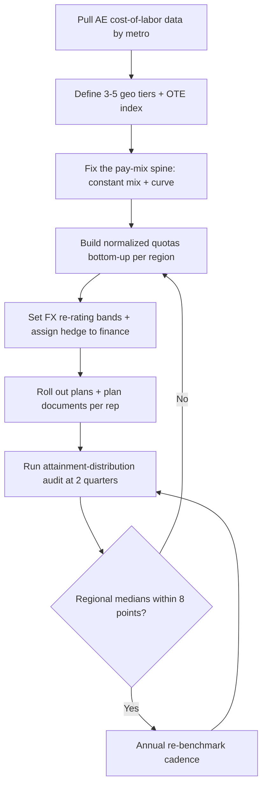

### Direct Answer

Structure AE compensation regionally by holding **on-target earnings (OTE) ratios constant while letting absolute pay float to local market data** — so a London AE and a Bangalore AE both earn a 50/50 base-to-variable split at the same quota-attainment percentile, but their dollar OTE differs because cost-of-labor, not cost-of-living, sets the number. Normalize quota to local addressable market and sales-cycle length rather than copying a flat global number, and protect the variable component from foreign-exchange swings with a banded FX policy. The single most common failure is paying everyone the same OTE "for fairness," which silently underpays your highest-leverage markets and overpays your easiest ones.

> **TLDR**
> - Pay AEs on **cost-of-labor** (what a competitor would pay to poach them), not cost-of-living or a flat global OTE.
> - Keep the **pay mix (base/variable split) and accelerator curve identical** across regions; only the absolute OTE and the quota move.
> - **Normalize quota** to local TAM, win rate, and cycle length — a flat global quota is the #1 source of regional comp disputes.
> - Use **3-5 geo tiers**, not per-city pay; more tiers create administrative drag without improving retention.
> - **Band FX exposure**: re-rate quotas and OTE only when the trailing-90-day rate moves outside a +/- 5-7% collar.
> - Audit annually with **regional attainment distributions** — if one region's median attainment is 20+ points off another's, the quota model is broken, not the reps.
> - Budget **9-11% of regional revenue** for AE variable comp; geo-tiering changes the mix, not the aggregate cost ratio.

---

## 1. Why Regional AE Comp Breaks

Most revenue leaders inherit a compensation plan that was designed for a single headquarters market and then bolted onto new regions as the company expanded. The plan worked when every AE sat in the same building, sold into the same economy, and earned the same currency. It stops working the moment a company opens its second region, and it fails loudly by the time it has four.

The reason it fails is structural, not cosmetic. A single-market comp plan is allowed to be sloppy in a hundred small ways, because every AE shares the same context — the same labor market, the same currency, the same buying economy — and the sloppiness cancels out. The instant a company spans two materially different markets, every one of those hidden assumptions becomes an explicit, contestable decision. What is the right OTE? In which currency? Against what quota? Measured how? A plan that never had to answer those questions out loud suddenly has to answer all of them at once, in writing, in a document a rep will read closely and compare against a colleague's. Regional comp is hard not because the math is hard but because expansion forces a company to make every implicit decision explicit, and most companies have never written those decisions down.

There is also a timing trap. The damage from a bad regional plan is slow. A company opens its second region, ports the headquarters plan over, and for the first two or three quarters nothing visibly breaks — the new AEs are ramping, attrition is expected to be lumpy, and the numbers are too noisy to read. By the time the regression in attainment and the spike in regional attrition become statistically undeniable, the company has eighteen months of bad data, a cohort of churned reps, and a board that has formed an incorrect view of the market. The cost of getting regional comp wrong is real but it is deferred, which is exactly why it is so often deprioritized until it is expensive to fix.

### 1.1 The Flat-OTE Fairness Trap

The instinct that breaks regional comp is the belief that paying every AE the same OTE is "fair." It is the opposite. A $180,000 OTE is generous in Lisbon, roughly at-market in Austin, and 30-40% below market in San Francisco or Zurich. Paying it everywhere means the company systematically overpays its lowest-leverage markets and underpays its highest-leverage ones — and the underpaid markets are almost always the ones with the largest deals and the strongest competitors.

Anaplan's regional finance leadership described this exact pattern publicly before the Thoma Bravo acquisition: a flat-OTE plan looks equitable on a spreadsheet and produces a 25%+ regression in regional attainment within 18 months as the strong markets bleed talent. The fix is not to abandon fairness — it is to redefine it. Fairness in a multi-region plan means **equal opportunity to earn at the same effort percentile**, not equal dollars. Two AEs who both hit the 60th percentile of quota attainment should both earn the 60th-percentile slice of their region's OTE. That is the design principle the rest of this answer builds on.

It helps to see why the flat-OTE plan feels so reasonable to the people who build it. The person designing the plan is almost always sitting in the headquarters market. From that seat, a flat OTE looks like the maximally fair, maximally simple choice — one number, no favoritism, no awkward conversation about who is worth more. The flaw is invisible from the headquarters seat precisely because the headquarters number happens to be roughly correct *for headquarters*. The plan only reveals itself as broken when you stand in the other markets: the San Francisco AE who quietly takes a competitor's call because the "fair" number is 35% under their local market, and the Lisbon AE who would never leave because the same number is 40% over theirs. The flat plan does not eliminate unfairness; it relocates all of it onto the markets the plan designer cannot see from their desk. Redefining fairness as equal opportunity-at-percentile is what makes the plan fair from *every* seat, not just the one it was written from.

### 1.2 Cost-of-Living Versus Cost-of-Labor

The second conceptual error is anchoring pay to cost-of-living. Cost-of-living measures what it costs an employee to live somewhere. Cost-of-labor measures what it costs an employer to hire someone there. They correlate, but they are not the same number, and comp must track the second one.

Consider a senior AE in Toronto. The cost of living in Toronto is meaningfully lower than in New York, but the cost of labor — the salary a competing SaaS company would offer to poach that AE — is only modestly lower, because the talent pool is thin and globally mobile. A plan that discounts Toronto pay by the cost-of-living gap (often 20-25%) rather than the cost-of-labor gap (often 8-12%) will lose its Toronto AEs to the first competitor that prices labor correctly.

| Concept | What it measures | Who it serves | Use in comp? |
|---|---|---|---|
| Cost of living | Employee's local expenses | Employee budgeting | No — anchors pay too low in talent-scarce markets |
| Cost of labor | Employer's cost to hire equivalent talent | Employer competitiveness | Yes — this is the correct anchor |
| Purchasing power parity | Currency-adjusted spending power | Macro comparisons | No — useful context, not a pay input |
| Local market rate | Median total comp for the role + level | Both | Yes — the operational expression of cost-of-labor |

The practical translation: when you set a regional OTE, you are asking "what would it cost us to replace this AE with someone equally good, hired locally, today?" Radford, Mercer, and Pave all sell datasets that answer exactly that question by role, level, and metro. The answer to that question is your OTE. Cost-of-living is interesting background; it is not an input.

The reason the distinction matters operationally — and not just semantically — is that the two numbers diverge most in exactly the markets where getting comp wrong is most expensive. In a low-cost, deep-talent market, cost-of-living and cost-of-labor sit close together, so anchoring on the wrong one barely hurts. In a low-cost-of-living, scarce-talent market — Toronto, Tel Aviv, Bangalore for senior enterprise AEs, increasingly Lisbon — the gap is large, and it is large in the direction that bites: cost-of-living says "pay them less" while cost-of-labor says "pay them roughly market." A company that anchors on cost-of-living in those markets builds a plan that is cheapest exactly where talent is hardest to retain, which is the worst possible place to be cheap. The mistake is not abstract; it is a targeting error that aims the company's underpayment directly at its most fragile hires.

A useful discipline is to make the cost-of-labor question literal in every comp review: name the three companies that would most plausibly poach this AE, and the OTE those three companies would actually offer. If RevOps cannot answer that for a given market, the company does not yet have a defensible number for that market — it has a guess. Cost-of-labor is not a dataset you buy once; it is a question you keep answerable.

### 1.3 The Currency Layer

The third complication is currency. An AE in Frankfurt is paid in euros; an AE in São Paulo is paid in reais; the company reports in dollars. When the dollar strengthens 12% against the real over a quarter, a Brazilian AE's dollar-denominated quota becomes 12% harder to hit through no fault of their own, and a flat global plan punishes them for a macro event. Currency is not a footnote in regional comp — it is a structural risk that has to be designed for explicitly, and Section 5 does that.

What makes currency uniquely dangerous among the three complications is that it moves *after* the plan is signed. OTE and quota are set once a year and then held; an AE can plan their life around them. The exchange rate moves every day. A plan that is perfectly fair on the day it is issued can become materially unfair eight weeks later without anyone changing a single number in the plan document. That property — fairness that decays on its own, invisibly, driven by an external macro variable no one in the company controls — is why currency cannot be handled with the same once-a-year machinery as the rest of the plan. It needs a live policy, a band, and a clear owner. A regional comp plan that nails tiers and quotas but treats currency as an afterthought is a plan with a slow leak.

These three complications — fairness redefinition, the cost-of-labor anchor, and the currency layer — are not independent problems to be solved one at a time. They interact. A correct currency policy is meaningless if the underlying OTE is anchored to the wrong cost concept; a correct OTE is meaningless if the quota it pairs with is not normalized. The rest of this answer treats them as one system, in the order a company should build them: spine first, then tiers, then quotas, then currency, then the governance loop that keeps all four honest.

---

## 2. The Pay-Mix Spine: What Stays Constant

The core architectural decision in regional comp is what you hold constant and what you let float. Get this wrong and every regional plan becomes a bespoke negotiation. Get it right and the plan scales to fifty markets without new design work.

### 2.1 Hold the Mix and the Curve

Two things stay identical across every region: the **pay mix** (the base-to-variable split) and the **accelerator curve** (how commission rates change above and below quota). A 60/40 mix in Chicago is a 60/40 mix in Chennai. A 2x accelerator above 100% attainment in Chicago is a 2x accelerator in Chennai.

This is non-negotiable for three reasons. First, the mix encodes the role's risk profile — a 50/50 AE is a different job than a 70/30 AE, and the job should not change because the AE crossed a border. Second, a constant curve means a sales leader can compare attainment distributions across regions cleanly, because the incentive gradient is the same everywhere. Third, constant mix and curve are what make the plan *feel* fair to reps who talk to each other across regions — and in a remote-first company, they absolutely do talk.

| Plan element | Constant across regions? | Why |
|---|---|---|
| Base/variable mix | Yes | Encodes role risk profile; should not change by geography |
| Accelerator curve shape | Yes | Keeps incentive gradient comparable; enables clean cross-region analysis |
| Attainment measurement window | Yes | Annual quota, quarterly true-up — same everywhere |
| Absolute OTE | No | Floats to local cost-of-labor |
| Quota number | No | Normalized to local TAM, win rate, cycle length |
| Currency of payment | No | Local currency, FX-banded (Section 5) |
| Decelerators / clawback terms | Yes | Governance consistency; legal review per jurisdiction |

### 2.2 Choosing the Mix by Motion, Not Region

The mix should be set by **sales motion**, not by geography. A transactional, high-velocity motion — small deals, short cycles, high volume — runs well at 60/40 or even 70/30, because the AE has enough at-bats that variable pay tracks effort tightly. An enterprise motion — six-figure deals, nine-month cycles, three closes a year — runs better at 50/50, because a single slipped deal in a low-at-bat job should not zero out an AE's mortgage payment.

If a company runs both motions in the same region (common — an enterprise team and a commercial team in the same London office), it should run **two mixes in one region**, not one mix forced onto both. The geography did not create the difference; the motion did. This is the same logic that governs dual-motion comp design more broadly (q9522), and it is worth being explicit that "regional" and "by-motion" are orthogonal axes — you tier on both.

The orthogonality is worth dwelling on, because conflating the two axes is a common and expensive error. A company will look at its London office, see that the enterprise reps out-earn the commercial reps, and conclude — wrongly — that "London comp is high." London comp is not high; London simply happens to host more enterprise headcount, and enterprise comp is high everywhere. If the company then "fixes" London by trimming its OTEs, it has cut enterprise pay below market for a reason that has nothing to do with enterprise. The clean mental model is a grid: one axis is the geo tier (Section 3), the other is the sales motion. An AE's plan is the intersection of one row and one column. OTE is set by the geo tier; mix and curve are set by the motion. Keep the two axes separate on paper and the analysis stays clean; collapse them and every regional comp review turns into an argument about the wrong variable.

### 2.3 The Accelerator Curve in Detail

The accelerator curve does most of the motivational work in any AE plan, and it must be identical across regions to keep the plan honest. A defensible curve for a 50/50 enterprise AE looks like this:

| Attainment band | Commission rate (of variable target) | Marginal multiplier |
|---|---|---|
| 0-50% | 0.6x of pro-rata | Decelerated — protects the company on a bad year |
| 50-100% | 1.0x of pro-rata | Linear ramp to target |
| 100-130% | 2.0x of pro-rata | First accelerator — rewards genuine overperformance |
| 130%+ | 3.0x of pro-rata | Second accelerator — uncapped, with a hyper-deal review |

The curve is uncapped on purpose; capping commission tells your best reps to stop selling in Q4 and sandbag into next year, which is the most expensive behavior a comp plan can buy. The decelerator below 50% protects margin without being punitive. The same four numbers — 0.6, 1.0, 2.0, 3.0 — apply in every region. Only the dollar value of "variable target" changes, because OTE changes. This curve design connects directly to how comp redesigns are evaluated for deal-quality impact (q9525): a constant curve means any change in deal quality across regions is signal, not a comp-design artifact.

There is a subtle reason the constant curve matters more in a multi-region plan than in a single-market one. The accelerator curve is the company's statement about how it values overperformance relative to baseline performance. If that statement varies by region — a 2x accelerator in New York, a 1.5x accelerator in Bangalore — the company is implicitly saying that an overperforming Bangalore AE is worth less than an overperforming New York AE, which is both false and corrosive. Reps detect this immediately. A flatter curve in their region reads, correctly, as "the company expects less of you and rewards your excellence less," and the company's best emerging-market AEs — the ones most able to leave — are the ones who read it fastest. The curve is the part of the plan that talks about ambition, and ambition cannot be regionally discounted.

The mirror-image error is regionally *steeper* curves, usually introduced to "motivate" a lagging market. This fails for a different reason: if a market is lagging because its quota is mis-normalized (Section 4), a steeper curve does not fix the quota — it just makes the unfair quota slightly more lucrative to the handful who beat it while doing nothing for the majority who cannot. The curve is not a lever for fixing regional underperformance. The quota is. Keep the curve constant and put the regional adjustment where it belongs: in the quota number and the OTE number, both of which are designed to vary.

---

## 3. Geo-Tiering: How Many Buckets and Where

Once the spine is fixed, the operational question is how to group regions into pay tiers. The answer is "as few tiers as the data tolerates."

### 3.1 The Case Against Per-City Pay

The seductive mistake is to pay every city its own precise market rate — Austin gets the Austin number, Denver gets the Denver number, Raleigh gets the Raleigh number. This feels rigorous. It is administrative quicksand. Per-city pay means every relocation triggers a comp change, every benchmark refresh re-rates dozens of individual numbers, and every AE who moves cities opens a negotiation. The administrative cost compounds, and the retention benefit over a well-designed tier system is statistically indistinguishable from zero.

Stripe and GitLab both publicly documented the move *away* from granular location pay toward a small number of tiers, precisely because the granular approach generated friction without measurably improving retention. GitLab's compensation calculator, which is public, collapses the entire world into a handful of location factors rather than hundreds of city rates. The lesson generalizes: tiers, not cities.

The friction is not hypothetical, and it is worth itemizing because leaders consistently underestimate it. Per-city pay means a comp team must maintain a live, accurate market rate for every city in which the company employs even one AE — and must defend each of those numbers when challenged. It means every internal transfer becomes a comp event with a winner and a loser. It means a rep who relocates from Denver to Austin for personal reasons opens a negotiation about a pay cut or raise that has nothing to do with their performance. It means the annual benchmark refresh is a multi-week reconciliation of dozens of independently drifting numbers rather than a re-rate of a handful of indices. And it means the company is perpetually one Glassdoor post away from a rep in city A discovering they earn 4% less than a rep in nearly identical city B, with no clean story for why. Each of these is a small tax. Together they are a structural drag that buys the company nothing — because the retention data, as Stripe and GitLab both found, does not reward the precision. Tiers absorb all of that drag into a single defensible structure.

### 3.2 The 3-5 Tier Model

A clean global model uses three to five tiers. Five is the practical maximum; beyond that, the tiers blur into per-city pay and the model loses its administrative advantage.

| Tier | Label | Representative metros | OTE index (Tier 1 = 1.00) |
|---|---|---|---|
| Tier 1 | Premium talent markets | San Francisco, New York, Zurich, London | 1.00 |
| Tier 2 | Major markets | Austin, Boston, Toronto, Sydney, Singapore | 0.85 |
| Tier 3 | Secondary markets | Denver, Lisbon, Dublin, Tel Aviv | 0.72 |
| Tier 4 | Emerging / cost-advantaged | Bangalore, Kraków, Mexico City, Manila | 0.55 |

A four-tier model like this covers most global SaaS companies. A US-only company can run three tiers. The OTE index is applied to a single global "Tier 1 OTE" reference number, so a plan refresh updates one number and the tiers re-derive automatically. Pave and Carta both publish tier-based location data structured exactly this way, which makes annual re-benchmarking a half-day exercise rather than a multi-week project.

### 3.3 Placing a Metro in a Tier

A metro's tier is determined by **local cost-of-labor for the AE role specifically**, not by a generic cost index. Two rules govern placement:

- **Use role-specific data.** A metro can be expensive for software engineers and cheap for AEs, or vice versa. Tel Aviv is a premium engineering market but a Tier 3 AE market. Always pull the AE-and-level-specific cut.
- **Place on cost-of-labor, sanity-check on talent depth.** If a metro's cost-of-labor data says Tier 3 but the company can only find AEs there by paying Tier 2 money, the talent pool is thin and the metro is functionally Tier 2. Markets self-correct slowly; the comp plan should respect what hiring managers actually experience.

### 3.4 Worked Example

Take a company with a Tier 1 reference OTE of $260,000 for a senior enterprise AE at a 50/50 mix.

| AE location | Tier | OTE index | Local OTE (USD-equiv) | Base | Variable |
|---|---|---|---|---|---|
| New York | 1 | 1.00 | $260,000 | $130,000 | $130,000 |
| Toronto | 2 | 0.85 | $221,000 | $110,500 | $110,500 |
| Lisbon | 3 | 0.72 | $187,200 | $93,600 | $93,600 |
| Bangalore | 4 | 0.55 | $143,000 | $71,500 | $71,500 |

Every AE in this table runs the identical 50/50 mix and the identical 0.6/1.0/2.0/3.0 accelerator curve. The Bangalore AE is not "paid less for the same work" — the Bangalore AE is paid the local cost-of-labor for that work, carries a quota normalized to the local market (Section 4), and has exactly the same opportunity to earn at the 90th percentile of their OTE as the New York AE has of theirs.

The phrase "paid less for the same work" is worth confronting directly, because it is the objection that derails more geo-tiered rollouts than any other. It is true in a trivial sense — the Bangalore AE's number is smaller — and false in every sense that matters. The work is not actually the same: the Bangalore AE sells into a different market, against a different competitive set, with a different deal-size distribution, and carries a quota normalized to that reality. The Bangalore AE's pay is at-market *for them*, just as the New York AE's pay is at-market *for them*; neither is being shortchanged relative to what they could earn by walking across the street. And the opportunity — the percentile mechanics, the curve, the upside — is identical. What is *not* identical, and should not be, is a dollar figure that means radically different things in two economies. A company that cannot articulate this distinction confidently will lose the rollout to the soundbite; a company that can will find that most reps, given the full picture, accept it as obviously correct.

One more design note on the worked example. The OTE index values — 1.00, 0.85, 0.72, 0.55 — are illustrative, but their *spacing* reflects a real pattern: the gap between adjacent tiers is wider at the bottom than at the top. Tier 1 to Tier 2 is 15 points; Tier 3 to Tier 4 is 17 points. This is because cost-of-labor compresses at the high end (premium markets converge as talent becomes globally mobile and globally priced) and spreads at the low end. A company that sets evenly spaced indices — 1.00, 0.83, 0.66, 0.49 — will tend to overpay Tier 2 and underpay Tier 4 relative to actual market data. Let the benchmark data set the spacing; do not impose arithmetic regularity on it.

---

## 4. Quota Normalization: The Part Everyone Skips

Geo-tiered OTE without geo-normalized quota is a broken plan wearing a nice suit. If a London AE and a Mexico City AE both carry a flat $1.2M quota, the plan has quietly created two different jobs and called them the same.

### 4.1 Why a Flat Global Quota Fails

A quota is a claim about how much revenue one AE can reasonably produce in a year. That number is a function of the local total addressable market, the local win rate, the local average deal size, and the local sales-cycle length. Those four variables differ across regions by factors of two or three. A flat global quota assumes they are identical. They never are.

The result of a flat quota is predictable: AEs in mature, dense markets blow past it and bank accelerators, while AEs in emerging markets miss it through no fault of their own, churn out, and take the company's emerging-market investment thesis down with them. The data shows up as a bimodal regional attainment distribution — and that bimodality is the single clearest diagnostic that a quota model is broken (Section 6, and the deeper measurement treatment in q9525).

There is a second-order cost that leaders consistently underestimate. When an emerging-market AE misses a flat quota, the company does not just lose that AE — it loses the institutional confidence to keep investing in the region. The board sees an "underperforming" market and cuts the headcount plan, the regional pipeline thins, the next AE inherits an even weaker territory, and the market enters a self-reinforcing decline that was caused entirely by a quota-design error rather than by anything real about the market's potential. A flat quota does not just misprice one rep's job; it can quietly kill a company's entire expansion thesis for a continent. This is why quota normalization is not a comp-administration nicety — it is a strategic control on whether the company's regional bets get a fair test.

### 4.2 The Four Quota Inputs

| Input | What it captures | Typical regional spread |
|---|---|---|
| Addressable market (accounts x fit) | How many real targets exist | 3-5x between mature and emerging regions |
| Win rate | Local competitive intensity, brand strength | 1.5-2x |
| Average deal size | Local budgets, currency, buying maturity | 2-3x |
| Sales-cycle length | How many deals fit in a comp year | 1.5-2x (inverse effect on capacity) |

A normalized quota is built bottom-up from these four numbers per region, not handed down as a flat global figure. The mechanics of building a true bottom-up forecast (q9517) and the discipline of capacity-based quota-setting are the same machinery applied per region.

### 4.3 The Normalization Formula

A workable normalized-quota model:

```
Regional Quota = (Regional Capacity) x (Coverage Ratio)

  where Regional Capacity =
      (Working selling days per year)
    / (Avg cycle length in days)
    x (Win rate)
    x (Avg deal size, local)
```

Coverage ratio — the multiple of quota the company books in total pipeline expectation — stays constant across regions (typically 3.0-3.5x), because it is a company-level risk parameter, not a regional one. Everything else in the formula is regional. This keeps the *philosophy* of quota-setting identical worldwide while letting the *number* reflect local reality.

The structure of the formula carries a design lesson. Notice that two inputs — selling days and coverage ratio — are held constant, and three — cycle length, win rate, deal size — are allowed to vary. This is the same hold-constant/let-float discipline from the pay-mix spine in Section 2, applied to quota instead of pay. The constants encode company-level policy: the company decides its risk appetite (coverage ratio) and its working calendar (selling days), and those decisions should not bend by geography. The variables encode market reality: how long deals take, how often they close, how big they are. A company that lets coverage ratio drift by region — say, demanding 4x coverage in a "risky" emerging market — is smuggling a risk-appetite change in through the quota model, where it is invisible and unaudited. Keep the risk parameter explicit and constant; let only the genuinely local variables move.

A practical caution on the inputs: they must be measured, not assumed. The single most common quota-normalization failure is using win rate and cycle length from the headquarters market as a stand-in for a new region because the new region "doesn't have enough data yet." That assumption is precisely backward — a new region almost always has a *longer* cycle and a *lower* win rate than the established market, because brand is weaker and the local team is less seasoned. Porting headquarters inputs into the formula for a young region produces a quota that is too high, which produces the missed-quota-into-region-decline spiral described above. When a region genuinely lacks data, the honest move is to set a deliberately conservative ramp quota and re-normalize the moment real local data exists — not to borrow numbers from a market that bears no resemblance to it.

### 4.4 Worked Quota Example

Two AEs, same company, same 50/50 senior enterprise role:

| Variable | London AE | Mexico City AE |
|---|---|---|
| Selling days/year | 230 | 230 |
| Avg cycle length | 95 days | 130 days |
| Win rate | 24% | 19% |
| Avg deal size (USD-equiv) | $88,000 | $61,000 |
| Computed capacity | ~$2.42M | ~$2.05M |
| Coverage ratio | 3.2x (constant) | 3.2x (constant) |
| **Normalized quota** | **~$1.18M** | **~$0.81M** |

The London AE carries a $1.18M quota; the Mexico City AE carries an $810K quota. A flat global plan would have given both $1.0M — overshooting Mexico City by 23% and undershooting London. The normalized plan gives each AE a quota they can hit at the same effort percentile, which is the entire point of the pay-mix spine in Section 2.

### 4.5 Quota-to-OTE Ratio as a Sanity Check

A final cross-check: the ratio of quota to OTE should land in a similar band across regions — typically 3x to 5x for enterprise SaaS. If London's quota/OTE is 5.3x and Mexico City's is 2.8x, one of the two regional models is wrong. The ratio is the fastest single number to catch a normalization error before it reaches a rep's plan document.

The reason the quota/OTE ratio works as a diagnostic is that it is a closed loop on the two numbers that are *supposed* to vary. OTE varies by tier; quota varies by normalized capacity. If both vary correctly, their ratio should be roughly stable, because a smaller market that justifies a lower OTE also justifies a proportionally lower quota — the two regional adjustments move together for the same underlying reason. When the ratio diverges, it means one number moved and the other did not: either OTE was tiered down but quota was left flat (the classic flat-quota error), or quota was normalized down but OTE was not adjusted (less common, usually a sign the OTE is mis-tiered). The single ratio cannot tell you *which* number is wrong, but it tells you, in one glance, that the regional model has an internal inconsistency — and it does so before any rep ever sees the plan. RevOps should compute this ratio for every region as the last gate before plan documents are generated. It costs one spreadsheet column and catches the most expensive class of error in the entire system.

The table below shows the ratio applied to the Section 3 and Section 4 worked examples, demonstrating a healthy result and a deliberately broken one for contrast.

| AE location | Local OTE (USD-equiv) | Normalized quota | Quota/OTE ratio | Verdict |
|---|---|---|---|---|
| London | $221,000 | $1.18M | 5.3x | Top of band — defensible for enterprise |
| Mexico City | $143,000 | $0.81M | 5.7x | In band — model is internally consistent |
| (Broken: flat quota) Mexico City | $143,000 | $1.18M | 8.3x | Out of band — quota not normalized |

The broken row is what a geo-tiered-OTE-but-flat-quota plan produces: the OTE was correctly tiered down for Mexico City, but the quota was left at the global flat number, and the 8.3x ratio screams that the AE is being asked to produce London-scale revenue on a Mexico City package. No rep should ever receive that plan, and the ratio check is what stops it.

---

## 5. The Currency and FX Layer

Currency is where well-designed regional plans still quietly fail, because FX risk is invisible until a quarter when the dollar moves hard.

### 5.1 Pay in Local Currency, Always

The first rule is simple: AEs are paid in their local currency. An AE in Tokyo is paid in yen, an AE in Warsaw in złoty. Paying a local employee in dollars exports the company's FX risk directly onto the rep's paycheck — their rent is in local currency, and a strong-dollar quarter cuts their real income with no warning. That is not a comp plan; it is a lottery ticket. Local-currency pay is also frequently a legal and tax requirement, not a choice.

### 5.2 The Quota Re-Rating Problem

If quotas are denominated in dollars (and they usually must be, for consolidated forecasting), then a local-currency-paid AE faces a quota that moves with FX. When the dollar strengthens 10% against the euro, a euro-region AE's dollar quota effectively rises 10% in local terms. The plan must decide, in advance, who absorbs that risk.

The answer is a **banded re-rating policy**, which splits the risk fairly:

| FX movement (trailing 90-day vs. plan-set rate) | Action |
|---|---|
| Within +/- 5% | No change — normal noise, company absorbs it |
| 5-7% | Watch band — flagged in QBR, no automatic change |
| Beyond +/- 7% | Quota and OTE re-rated to the new trailing-90-day average |

The +/- 5-7% collar means small currency wiggles do not trigger constant plan churn — which would itself demotivate reps — while genuine macro moves get corrected. The trailing-90-day average is used rather than spot rate so that a single volatile week does not whipsaw a plan. Some companies run this collar tighter (+/- 3%) for high-volatility currencies like the Argentine peso or Turkish lira; the principle holds, only the band width changes.

The band is a deliberate compromise between two failure modes, and naming both clarifies why the middle is correct. A *no-band* policy — re-rate the quota the moment the spot rate moves at all — produces a plan that changes every month, which destroys the one thing a comp plan must provide: a stable target a rep can commit to and plan their year around. A rep cannot run a six-month enterprise cycle against a quota that drifts every time they check the news. The opposite failure, *no policy at all*, leaves the quota frozen in dollars while the local economy moves underneath it, so a strong-dollar year silently makes the job 10-12% harder and the rep absorbs the entire macro shock. The band threads these: inside the collar, the rep gets stability and the company eats the noise; outside the collar, the company acknowledges a real macro event and corrects, restoring fairness without having churned the plan for nothing. The collar width is the only real tuning decision, and it should track currency volatility — wider for stable currencies, tighter for volatile ones — so that the *frequency* of re-rating stays roughly constant across all currencies even though their volatility does not.

One operational detail prevents the band from becoming a source of disputes: the re-rating rule must be symmetric and automatic. If the dollar weakens past the band, the quota re-rates *up* just as mechanically as it re-rates *down* when the dollar strengthens. A company that quietly re-rates quotas up in a strong-dollar year but "forgets" to re-rate them down in a weak-dollar year has converted its FX policy into a one-way ratchet against the rep, and reps will notice within one cycle. Symmetry is what makes the band feel like a fair shared mechanism rather than a tool the company points at the rep. Write the rule so it fires both directions, and let it fire automatically rather than as a discretionary management decision — discretion is where trust leaks out.

### 5.3 Who Owns the FX Hedge

The cleanest division of labor: **the company hedges, the rep does not**. Corporate finance can buy forward contracts or natural hedges against the aggregate FX exposure of a region's comp expense; an individual AE cannot. Pushing FX risk onto reps is both unfair and inefficient — finance can manage it at portfolio scale for a fraction of the cost of the morale damage it does at the individual level. The FX band in 5.2 is what protects the rep; the corporate hedge is what protects the P&L.

| FX risk owner | Tool | Scale it works at |
|---|---|---|
| Corporate finance | Forward contracts, natural hedges | Aggregate regional comp expense |
| The comp plan | +/- 5-7% re-rating band | Individual quota / OTE |
| The AE | Nothing — should bear none | N/A |

### 5.4 Inflation Adjacent to FX

High-inflation markets — Argentina, Türkiye, parts of Latin America — need a faster benchmark refresh cycle than the standard annual cadence, because local pay erodes mid-year. A 6-month re-benchmark for high-inflation markets, against an annual cadence everywhere else, keeps those AEs from falling behind local market rate between annual cycles. This is the same auditing discipline applied at a different frequency (q9524).

---

## 6. Governance, Auditing, and the Annual Cycle

A regional comp plan is not a document you write once; it is a system you run on a cadence.

### 6.1 The Annual Re-Benchmark

Once a year, before the new fiscal year's plans go out, the company refreshes the Tier 1 reference OTE and the tier indices against current market data (Radford, Pave, Mercer, Carta). Because the model is tier-indexed, this updates one reference number and four indices — not hundreds of individual plans. High-inflation markets get a second mid-year refresh per Section 5.4.

### 6.2 The Attainment-Distribution Audit

The most important regional comp audit is also the simplest: plot the **distribution of quota attainment by region**. In a healthy plan, every region's attainment distribution has roughly the same median and shape. The accelerator curve is identical, so if the quota model is normalized correctly, attainment should be region-agnostic.

| Audit signal | Healthy | Broken — and what it means |
|---|---|---|
| Regional median attainment | Within ~8 points across regions | 20+ point gap = quota normalization is wrong |
| Attainment distribution shape | Similar spread per region | One region bimodal = territory or quota inequity |
| Voluntary attrition by region | Within a few points | One region high = OTE is below local market |
| Quota/OTE ratio by region | All within 3-5x band | Outlier = a regional model has a math error |
| % of region at 0-50% band | Comparable | One region loaded = quota set above local capacity |

If the audit shows New York reps clustering at 115% attainment and Mexico City reps clustering at 75%, the reps are not the problem — the quota model is, and Section 4 is where the fix lives. Distinguishing a quota problem from a talent problem is one of the highest-value analyses a RevOps team runs (q9525, q9517).

The discipline that makes this audit trustworthy is committing, in advance, to the interpretation rule: a persistent regional median gap is read as a *quota error first*, and only as a talent or territory issue after the quota model has been re-checked and cleared. This ordering matters because the lazy interpretation runs the other way — a leader sees a low-attainment region and concludes the region "has weak reps" or "is a hard market," because that conclusion requires no rework of the comp plan. That conclusion is occasionally right and usually wrong, and it is self-fulfilling when wrong: label the region weak, cut its investment, and the next audit confirms the label. Forcing the quota-error hypothesis to be tested and rejected *before* anyone is allowed to say "weak market" is the procedural safeguard that keeps the audit honest. The attainment distribution is evidence about the *plan* at least as much as it is evidence about the *people*, and a mature RevOps function reads it that way.

It is also worth being precise about what "healthy" looks like, because the goal is not identical attainment everywhere. Some regional spread is expected and fine — a brand-new region mid-ramp will sit below a mature one, and that is a ramp effect, not a quota error. The audit is looking for *persistent, mature-state* gaps: regions that have been operating for several quarters with stable headcount and still show a 20+ point median gap. A young region's low attainment is a footnote; a three-year-old region's low attainment is a finding.

### 6.3 Who Owns Regional Comp

| Function | Responsibility |
|---|---|
| RevOps / Sales Comp | Owns the model, the tiers, the normalization formula, the audit |
| Finance | Owns the comp budget, the FX hedge, the cost ratio |
| HR / People | Owns the benchmark data subscriptions, level definitions |
| Regional sales leaders | Own quota review per rep, surface ground-truth on talent depth |
| CRO | Owns the framework, signs off on tier placement and the annual refresh |

Territory and quota assignment within a region is a related governance question — whether the regional manager, the CRO, or a central committee owns reassignment (q9521) — and it should be answered consistently across regions even though the quotas themselves differ.

### 6.4 The Budget Envelope

Geo-tiering changes the *mix* of comp spend, not the *aggregate ratio*. A well-run SaaS company spends roughly 9-11% of regional revenue on AE variable comp, and that ratio should hold across regions. If Tier 4 regions are running a 6% ratio, the company is underpaying and will lose talent; if a region is at 15%, either the quota is too low or the OTE is too high. The aggregate ratio is the budget guardrail; the tiers are how the same total is allocated fairly. CRO and leadership comp benchmarks by company stage (q9634) sit one layer up from this and should be designed with the same cost-ratio discipline.

---

## 7. Real-Operator Patterns

Comp design is easier to reason about against companies that have published how they actually do it.

### 7.1 The Transparent-Tier Operators

**GitLab** ($GTLB) runs the most publicly documented location-based comp model in software. Its compensation calculator is open on the public web: a single global reference number, multiplied by a location factor and a level factor. GitLab is the canonical proof that a small number of location tiers scales to a globally distributed workforce without per-city administration. **HubSpot** ($HUBS), with major hubs across Dublin, Singapore, Tokyo, and several US metros, runs a comparable tier model and has spoken publicly about anchoring on cost-of-labor benchmark data rather than cost-of-living.

### 7.2 The Move Away From Granular Location Pay

**Stripe** publicly tightened its location-pay bands, consolidating toward fewer tiers after finding that hyper-granular city pay generated administrative friction without measurable retention benefit. The pattern recurs across **Datadog** ($DDOG), **Snowflake** ($SNOW), and **MongoDB** ($MDB) — all of which run multi-region enterprise sales forces on a tiered OTE structure with a constant pay mix, and all of which re-benchmark annually against Radford or Pave data. The consistent operator lesson: tiers beat cities, and constant mix beats regional mix.

### 7.3 The FX-Discipline Operators

Companies with heavy emerging-market exposure show the FX layer most clearly. **MercadoLibre** ($MELI), operating across Argentina, Brazil, and Mexico — three currencies, one of them chronically high-inflation — runs exactly the kind of banded re-rating and accelerated benchmark cadence described in Section 5. **SAP** ($SAP) and **Workday** ($WDAY), both global enterprise-software firms, denominate quotas centrally for forecasting while paying reps locally and hedging the aggregate exposure at the corporate-treasury level. The division of labor in Section 5.3 — company hedges, rep does not — is the observed practice at every well-run global SaaS company, not a theoretical ideal.

### 7.4 The Comp-Data Vendors

The tooling layer matters because it determines how cheap the annual audit is. **Radford** (an Aon business), **Mercer**, **Pave**, and **Carta** all publish AE-and-level-specific compensation data structured by metro and tier. A company on any of these can refresh its entire tier model in a half-day; a company relying on anecdote and counteroffers cannot, and its plan drifts off-market between cycles. The vendor choice is a comp-governance decision, not a procurement footnote.

---

## 8. Implementation Sequence

A company moving from a flat plan to a geo-tiered, quota-normalized, FX-banded plan should sequence the work — doing it all at once produces a plan no one trusts.



### 8.1 Phase One — Data and Tiers

Start by buying or refreshing AE-specific cost-of-labor data, then define the tiers. This is the foundation; nothing downstream is trustworthy if the tier placement is guessed. Budget two to four weeks and a comp-data subscription.

### 8.2 Phase Two — Spine and Quotas

Lock the pay mix and accelerator curve, then build normalized quotas region by region using the Section 4 formula. This is the analytically heaviest phase. Regional sales leaders must be in the room — they hold the ground truth on cycle length and win rate that the formula needs.

### 8.3 Phase Three — FX and Rollout

Set the FX bands, assign the hedge to finance, and write the per-rep plan documents. Every AE should receive a plan that states their tier, OTE, mix, quota, accelerator curve, and FX band explicitly. Opacity here breeds exactly the cross-region resentment the whole design exists to prevent.

### 8.4 Phase Four — Audit and Iterate

Two quarters in, run the attainment-distribution audit. If regional medians are within roughly eight points, move to an annual cadence. If not, the quota model needs another pass — and that is normal on the first cycle. The plan is a system, and systems are tuned, not declared finished.

The phasing exists for a reason beyond project management: doing all four phases at once produces a plan no rep trusts, because they cannot see which change caused which effect. If a company simultaneously re-tiers OTE, re-normalizes quota, changes the mix, and introduces FX bands, and attainment then moves, no one — not the reps, not RevOps, not the board — can attribute the movement. The plan becomes unfalsifiable, and an unfalsifiable comp plan cannot be tuned. Sequencing the changes, and in particular locking the spine (mix and curve) *before* touching tiers and quotas, means that when the audit reads movement, the movement is attributable to a known, isolated change. The phases are not bureaucracy; they are what make the feedback loop legible.

One final implementation note: communicate the plan in the rep's own terms. A plan document that leads with the company's tier taxonomy and indexing methodology will lose the rep on the first page. A plan document that leads with *their* OTE, *their* quota, *their* curve, and a plain-language paragraph on why *their* number is what it is — anchored to the cost-of-labor of *their* market — lands. The geo-tiering machinery should be available to any rep who asks, in full transparency, but it should not be the headline. The headline is always: here is your number, here is your opportunity, here is the honest reason it is what it is.

---

## 9. Counter-Case: When Regional Comp Tiering Is the Wrong Move

The geo-tiered model in this answer is the right default for a multi-region SaaS company with a real AE population in each market. It is not universal, and an honest treatment names the cases where it should not be used.

### 9.1 Too Small to Tier

A company with eleven AEs across three countries does not have a regional comp problem; it has a hiring-negotiation problem. With that few reps, a tier model is administrative overhead with no statistical payoff — there are not enough reps per region for an attainment-distribution audit to mean anything. Below roughly five AEs per region, pay each AE at their individual local market rate, hold the mix and curve constant for fairness, and revisit when the population is large enough that distributions become meaningful. The discipline of *when* to formalize comp structure is itself a staged decision (q9555, q9554).

### 9.2 A Genuinely Single Talent Market

Some companies hire AEs from one global, mobile talent pool — fully remote firms that recruit senior enterprise AEs who could live anywhere and often relocate. If the company's actual hiring experience is that it competes for the same candidates regardless of city, then cost-of-labor really is uniform, and tiering is a fiction the data does not support. The test is empirical: look at offer-acceptance rates by tier. If Tier 4 offers are rejected at Tier 1 rates, the tiers are not real and the company should pay one global band.

### 9.3 Pay Transparency Backlash

In a remote-first culture with strong pay transparency, geo-tiering can read as the company "paying people less for where they sleep." This is a real morale risk and it has cost companies talent. The defense is not to abandon tiering — it is to be relentlessly explicit that the company pays cost-of-labor, that the *opportunity* (mix, curve, attainment percentile) is identical everywhere, and that quotas are normalized so no region carries an unfair number. A company unwilling to make and defend that argument transparently should not tier; a hidden tier system is worse than no tier system.

### 9.4 Hyper-Volatile Macro Environments

In a market with currency volatility so extreme that the FX bands in Section 5 would trigger re-rating every quarter, the banded model breaks down — constant re-rating is itself destabilizing. In those rare cases (a handful of frontier markets), the better answer is to pay a USD-pegged or hard-currency-denominated package and accept the higher cost, or to not carry a quota-bearing AE in that market at all and cover it through partners. The framework has limits, and pretending otherwise sets up the plan to fail.

### 9.5 The Honest Summary of the Counter-Case

The geo-tiered, quota-normalized, FX-banded model is correct for the large middle of multi-region SaaS companies. It is wrong for the very small (negotiate individually), the genuinely single-talent-market (one global band), the transparency-fragile (only tier if you will defend it openly), and the macro-extreme (hard-currency or partner coverage). Knowing which case you are in is the first design decision — before tiers, before quotas, before FX bands.

---

## 10. Key Takeaways

- **Anchor pay to cost-of-labor, not cost-of-living or a flat global OTE.** Cost-of-labor is what a competitor would pay to poach the AE; it is the only correct input. Cost-of-living is background.
- **Hold the pay mix and accelerator curve constant across every region.** Only absolute OTE and quota float. Constant mix and curve are what make the plan comparable and what make it feel fair.
- **Normalize quota bottom-up per region** from TAM, win rate, deal size, and cycle length. A flat global quota is the single most common source of regional comp disputes and bimodal attainment.
- **Use 3-5 geo tiers, never per-city pay.** Tiers scale; cities create administrative drag with no measurable retention gain. GitLab and Stripe both proved this publicly.
- **Pay in local currency and band the FX risk** with a +/- 5-7% re-rating collar on a trailing-90-day average. The company hedges the aggregate; the rep bears none of the FX risk.
- **Audit with regional attainment distributions.** If two regions' median attainment differ by 20+ points, the quota model is broken — not the reps.
- **Budget 9-11% of regional revenue for AE variable comp** as the aggregate guardrail. Geo-tiering reallocates that total fairly; it does not change it.
- **Know your counter-case first.** Too small, single-talent-market, transparency-fragile, or macro-extreme companies should not run the standard tiered model.

The deeper you go on adjacent comp questions — regional forecasting methodology (q451), dual-motion comp architecture (q9522, q9532), measuring whether a comp redesign improved deal quality (q9525), building a true bottom-up forecast (q9517), territory-reassignment ownership (q9521), the audit cadence for comp models (q9524), CRO compensation benchmarks by stage (q9634), regional kickoff and partner strategy (q452, q461), and when a company should formalize comp at all (q9555, q9554) — the same spine recurs: hold the philosophy constant, let the numbers reflect local reality, and audit on a cadence.

---

#### Sources & Citations

1. Radford (Aon) — Global Technology Compensation Survey, AE role benchmarks by metro.
2. Mercer — Global Compensation Planning data, cost-of-labor methodology.
3. Pave — Real-time compensation benchmarking, tier-structured location data.
4. Carta — Total Compensation data, location-tier datasets.
5. GitLab — public Compensation Calculator and Handbook, location-factor methodology.
6. HubSpot — public statements on cost-of-labor anchoring for global hubs.
7. Stripe — reporting on consolidation of location-pay bands.
8. WorldatWork — Sales Compensation Programs and Practices research.
9. Alexander Group — Sales compensation benchmarking and pay-mix-by-motion research.
10. The Bridge Group — SaaS AE Metrics Report, OTE and quota benchmarks.
11. ZS Associates — sales-force quota-setting and capacity-modeling methodology.
12. Anaplan / regional finance leadership — flat-OTE regression case material.
13. McKinsey & Company — global sales-force compensation research.
14. Bain & Company — go-to-market and incentive-design research.
15. Gartner — Sales compensation benchmarks and quota-attainment data.
16. Forrester — B2B revenue operations and comp-governance research.
17. SiriusDecisions (now Forrester) — quota-coverage-ratio methodology.
18. CSO Insights — annual sales-performance and quota-attainment studies.
19. Mercer — high-inflation-market benchmark-cadence guidance.
20. Aon — FX risk and global-pay structuring guidance.
21. Deloitte — global rewards and multi-currency pay practice research.
22. PwC — international assignment and local-pay tax-compliance guidance.
23. SAP ($SAP) — investor and HR disclosures on global sales-comp practice.
24. Workday ($WDAY) — disclosures on global compensation structuring.
25. MercadoLibre ($MELI) — investor materials on multi-currency LatAm operations.
26. Datadog ($DDOG) — S-1 and investor disclosures on go-to-market structure.
27. Snowflake ($SNOW) — investor disclosures on enterprise sales-force scaling.
28. MongoDB ($MDB) — investor disclosures on global sales operations.
29. Salesforce — State of Sales report, AE productivity and comp data.
30. OpenView Partners — SaaS benchmarks, sales-efficiency and comp-ratio data.
31. KeyBanc Capital Markets — annual SaaS Survey, comp-as-percent-of-revenue benchmarks.
32. ICR / SBI (Sales Benchmark Index) — territory and quota-design research.
33. Pavilion — operator community benchmarks on AE OTE and pay mix.
34. RevОps Co-op — practitioner material on quota normalization and comp audits.
35. Harvard Business Review — research on sales-force incentive design and accelerator curves.
