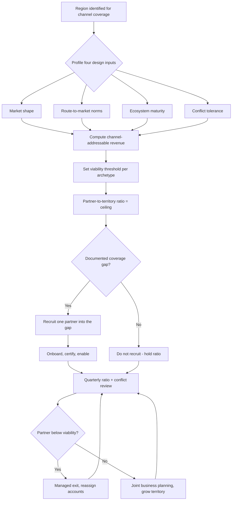

### Direct Answer

Design regional partner and channel strategies by treating each region as a distinct go-to-market system with its own coverage math, partner archetype mix, and conflict rules — never as a copy-paste of headquarters. The discipline that prevents over-distribution is **partner-to-territory ratio governance**: cap the number of transacting partners per addressable segment so that every partner can clear a viable revenue threshold, and gate new recruitment behind a documented coverage gap rather than a quota-relief instinct. Build the strategy on four regional inputs — addressable market shape, route-to-market norms, partner ecosystem maturity, and channel-conflict tolerance — and review the ratio quarterly so coverage stays tight as the region scales.

> **TLDR**
> - **Region is a system, not a translation.** Each region needs its own coverage model, partner archetype mix, deal-registration rules, and economics — built from local market structure, not headquarters defaults.
> - **Over-distribution is the default failure.** Recruiting partners faster than you can feed them creates margin-stacked deals, channel conflict, and a partner base where 80% of partners produce under 5% of revenue. The fix is a hard partner-to-territory ratio.
> - **Four regional design inputs.** Addressable market shape, route-to-market norms, ecosystem maturity, and conflict tolerance determine whether a region needs resellers, GSIs, marketplace co-sell, or a direct-led hybrid.
> - **Conflict governance is non-negotiable.** Deal registration, segment fences, and a published rules-of-engagement document are what let direct and channel coexist without margin leakage or partner churn.
> - **Govern with a quarterly ratio review.** Treat partner count like headcount: every addition needs a coverage-gap justification, and underperforming partners get a managed exit, not indefinite tolerance.

## 1. Why Regional Channel Strategy Fails Before It Starts

Most channel programs do not fail because the product is wrong or the partners are weak. They fail because the company designed one global channel motion, translated the contract into four languages, and assumed the model would hold from São Paulo to Singapore. It never does. Regional channel design is a systems problem, and the most common system failure is **over-distribution** — signing more partners than the addressable revenue can sustain.

### 1.1 The over-distribution trap

Over-distribution happens when partner recruitment is measured by partner count instead of partner-sourced revenue. A regional channel manager carrying a recruitment target signs partners to hit the number. Each new partner dilutes the revenue pool available to every existing partner. Within 18 months you have a partner base where a small minority transacts and the majority is dormant — but every dormant partner still consumes onboarding cost, portal licenses, deal-registration adjudication time, and partner-marketing budget.

The math is unforgiving. If a region has $20M of channel-addressable revenue and a partner needs roughly $1.5M in annual partner-sourced bookings to justify investing a dedicated sales team in your product, the region supports about 13 serious partners — not 60. Sign 60 and you have guaranteed that 47 of them will never reach viability, and viability is what drives a partner to put your product on the front of their proposal instead of the back.

- **Symptom one — margin stacking.** When multiple partners can touch the same deal, customers shop the partners against each other, and discount stacks on discount. The vendor funds a price war between its own channel. The customer learns that the way to win a better price on your product is to pit your own partners against one another — a behavior that, once learned, never unlearns and that permanently resets the region's price expectation downward.
- **Symptom two — registration disputes.** Two partners register the same account. Whoever adjudicates the dispute makes one partner an enemy. Multiply by every contested deal, and the channel manager spends more time as a referee than as a coverage builder. Every overturned or contested registration is a withdrawal from the trust account, and partner trust is the only asset that makes a partner lead with your product instead of a competitor's.
- **Symptom three — the dormant majority.** Partners who signed but never transacted still appear in the partner directory, still get marketing development funds (MDF), and still distort every coverage report. A region that reports "40 partners" but transacts through six is not a 40-partner region — it is a six-partner region carrying 34 partners' worth of cost and reporting noise.
- **Symptom four — brand dilution.** A partner who sells your product badly — wrong implementation, oversold scope, an unsupported customer — damages your brand in a market where you have no direct presence to correct it. In a region covered entirely by channel, every partner is also your reputation, and a bad partner is an uncorrected bad reputation.
- **Symptom five — enablement dilution.** Enablement budget and channel-manager attention are finite. Spread across 60 partners they reach no one in depth; concentrated on 12 they create partners who can actually demo, scope, and close. Over-distribution does not just dilute revenue per partner — it dilutes capability per partner.

The deeper damage is cultural. Once a region has been over-distributed, the channel team's instinct calcifies around recruitment, partners learn that exclusivity is meaningless, and customers learn that your channel is a discount bazaar. Unwinding all three takes years. The cheapest time to prevent over-distribution is before the first partner over the ratio is signed.

### 1.2 The opposite failure: under-distribution

Under-distribution is rarer but equally costly. A company keeps a region direct-only because channel feels messy, and watches local competitors — who sell through entrenched resellers and systems integrators — win deals on relationship and proximity. In regulated or relationship-driven markets, the absence of a local partner is itself a disqualifier. A buyer in a market where public-sector procurement requires a locally registered counterparty cannot transact with a foreign direct entity at all; the deal does not get lost on price or features, it never enters the pipeline. The goal is not "minimize partners." The goal is **right-size partner density to addressable revenue**, region by region — which sometimes means more partners than headquarters is comfortable with, and sometimes means far fewer.

Under-distribution also shows up as a coverage shadow: a sub-territory or vertical with addressable revenue and no partner positioned to win it. The revenue does not appear as a loss on any report — it simply never materializes as pipeline. This is why coverage analysis must be done from the market down (what revenue exists and who can reach it) and not from the partner roster up (which partners do we have and what are they doing). A roster-up view structurally hides the gaps.

### 1.3 Why headquarters instincts mislead

The team designing the channel strategy usually sits in the company's home market, which is typically the most channel-mature, most direct-friendly, and most contractually standardized market the company operates in. Every instinct calibrated there — deal sizes, sales-cycle length, partner sophistication, the legal enforceability of a deal-registration clause — is wrong somewhere else. RevOps leaders who have watched go-to-market motions diverge by founder background (q9536) know the same lesson applies geographically: the motion that works at home is a hypothesis everywhere else, not a template.

Consider how the major software platforms actually run this. Salesforce (CRM) built its 7,000-plus-partner AppExchange ecosystem over two decades, with regionally differentiated programs and a delivery layer of consulting partners that varies sharply by geography — what works for its mature North American channel is not what it runs in newer markets. ServiceNow (NOW) built a partner ecosystem deliberately weighted toward elite delivery partners and the large GSIs precisely because its product complexity makes a broad transactional reseller channel a brand risk. Snowflake (SNOW) leans heavily on cloud-marketplace co-sell and a data-partner ecosystem rather than a classic reseller network. HubSpot (HUBS) built a solutions-partner program tuned for SMB and lower-mid-market breadth. Four successful companies, four different channel shapes — because each matched the model to its product complexity and its markets, not to a universal best practice. The lesson for any single company is that even your own regions will diverge, and the design must be done region by region.

### 1.4 The cost of getting it wrong, quantified

It is worth being concrete about what a mis-sized channel costs. A region with $30M of channel-addressable revenue that signs 50 partners against a viable ceiling of 12 is not running a 50-partner channel — it is running a 12-partner channel plus a 38-partner cost center. Each dormant partner carries onboarding cost, a PRM seat, a slice of MDF, periodic channel-manager touchpoints, and adjudication overhead. More damaging, the price erosion from margin stacking and the brand damage from weak partners are not line items anyone budgets — they surface as a structurally lower regional gross margin and a slower-than-modeled ramp, and they get blamed on "the market" rather than on the channel design. Diagnosing a mis-sized channel after the fact is hard precisely because its costs hide inside other metrics. That is the strongest argument for designing the ratio deliberately and up front.

## 2. The Four Regional Design Inputs

Before choosing partner types or writing a single agreement, profile each region against four inputs. These inputs — not the org chart — determine the channel model.

### 2.1 Input one — addressable market shape

Market shape is the distribution of revenue across customer sizes and the concentration of that revenue geographically. It is the input that most directly determines how many partners a region can support and what kind they should be.

- **Concentration.** A region where 70% of addressable revenue sits in three metros (common in markets with one dominant commercial city) supports a thin, high-quality partner set. A region where revenue is spread across dozens of mid-sized cities needs broader geographic coverage, which means more partners — but each with a tighter territory. Concentration also changes the conflict profile: in a concentrated market, partners overlap constantly and deal registration carries the load; in a dispersed market, geographic territories do more of the work and registration disputes are rarer.
- **Segment mix.** A region that skews enterprise needs partners with GSI-grade delivery capacity. A region that skews SMB needs transactional resellers and marketplace fulfillment, where the partner's value is reach and billing convenience, not solution architecture. Most real regions are bimodal — a long tail of SMB plus a head of enterprise — and the correct answer is usually two channel motions in one region, each with its own partner type, not one motion stretched to cover both.
- **Deal size.** Small average deal sizes make a high-touch partner uneconomic; the partner cannot fund a salesperson on the margin. Large deal sizes can support a partner investing in pre-sales and delivery talent. The arithmetic is direct: a partner needs gross margin from your product roughly equal to the fully loaded cost of the people they assign to it; if the margin per deal cannot fund a fraction of a salesperson, the partner will only sell your product reactively, never proactively.
- **Growth trajectory.** A region's shape is not static. A market growing fast enough that addressable revenue doubles in three years should be designed with headroom — sign for today's ceiling, but write territories that can absorb growth without forcing a disruptive re-carve later. A flat or consolidating market should be designed toward fewer, larger partners over time.

### 2.2 Input two — route-to-market norms

Every region has an inherited way buyers buy and partners sell, and that inheritance is far stickier than any program design. You can influence route-to-market norms slowly; you cannot override them by fiat.

- **Procurement norms.** In parts of APAC and the Middle East, public-sector and large-enterprise procurement frequently requires a locally registered entity to hold the contract — the channel is not a choice, it is a structural requirement. In other markets, currency controls, withholding-tax treatment, or invoicing-language rules make a local transacting partner the only practical path even where it is not legally mandated.
- **Distribution layers.** Some markets expect a two-tier model (distributor feeding resellers); others transact one-tier (vendor to reseller direct). Forcing a one-tier model where two-tier is the norm strands you without the credit, logistics, and reseller-breadth that distributors provide. The major distributors — Ingram Micro and TD SYNNEX among them — exist precisely because in many markets the reseller base is too fragmented and too credit-constrained for a vendor to serve one-tier at all.
- **Relationship intensity.** In relationship-driven markets, switching costs are social, not just technical. A local partner with a 20-year client relationship is the route to market — the partner's relationship is the asset you are renting, and no amount of direct-sales effort replicates it on a deal timeline.
- **Buying-committee shape.** Where the typical buying committee is large and consensus-driven, partners who can navigate the committee — and who the committee already trusts — compress the cycle materially. Where buying is more centralized, that navigation premium is smaller and a transactional partner is sufficient.

### 2.3 Input three — partner ecosystem maturity

The supply of capable partners varies enormously by region, and ecosystem maturity is the input most often assumed rather than assessed. A channel strategy that requires solution partners who simply do not exist in the region is not a strategy — it is a wish.

- **Mature ecosystems** (North America, Western Europe, Australia) have specialized partners — born-in-cloud consultancies, vertical SIs, managed-service providers — who can co-sell sophisticated solutions. In these markets the constraint is not partner supply but partner attention: capable partners carry dozens of vendor relationships, and your product competes for shelf space inside the partner.
- **Developing ecosystems** may have plenty of resellers but few partners with delivery depth, meaning the vendor must invest more in enablement or carry delivery itself initially. The right sequencing here is often vendor-delivered first, partner-delivered as the ecosystem is built — deliberately growing the capability you need rather than assuming it.
- **Hyperscaler overlay.** In every region, the cloud hyperscalers — Microsoft (MSFT), Amazon (AMZN) via AWS, and Alphabet's Google Cloud (GOOGL) — operate co-sell programs and marketplaces that function as a meta-ecosystem. A region with thin native partners but strong hyperscaler presence can be covered through marketplace and co-sell motions, effectively borrowing the hyperscaler's field organization and partner base. This is one of the most significant shifts in channel strategy over the last decade: the hyperscaler ecosystem is now a viable substitute for a native reseller network in many regions.
- **Vertical depth.** Beyond general capability, assess whether the ecosystem has partners with depth in the verticals you sell into. A region with strong general SIs but no partner who understands, say, regulated financial services may still leave a vertical uncovered. Vertical SIs and the consulting practices of firms like IBM (IBM) and Accenture (ACN) are the answer where the deal requires industry context, not just product configuration.

### 2.4 Input four — channel-conflict tolerance

The final input is how much direct-versus-channel friction the region's economics can absorb. Conflict tolerance is not a market property like the first three inputs — it is a function of your own go-to-market structure in the region — but it must be profiled with the same rigor because it determines how heavy the governance layer needs to be.

- A region with a large direct sales team and a partner channel needs strict segmentation, because every contested account is a margin leak and a partner-trust event. The more your direct team and your channel overlap in segment, geography, and account list, the more the governance described in Section 5 must do.
- A region that is channel-only has no internal conflict but maximum partner-versus-partner conflict risk, making deal registration the central control. The absence of a direct team removes one conflict axis and amplifies the other.
- A greenfield region with no direct presence can be channel-led cleanly — but the strategy must anticipate the eventual direct build and write segment fences that survive it. The most expensive channel mistake in a greenfield region is to let partners win the largest strategic accounts with no fence, then attempt to claw those accounts back when the direct team arrives. The fence must be written at launch, before there is anything to fight over.
- A region in transition — moving from channel-led to direct-assisted, or the reverse — has the highest conflict tolerance requirement of all, because the rules are changing while deals are in flight. Transitions need explicit grandfathering rules and a communicated timeline, not a silent shift.

| Regional Input | Key Question | Strategy Implication |
|---|---|---|
| Market shape | Concentrated or dispersed? Enterprise or SMB? | Thin/deep partner set vs. broad/transactional |
| Route-to-market norms | One-tier or two-tier? Local entity required? | Distributor layer; mandatory local partner |
| Ecosystem maturity | Specialized partners available locally? | Native partners vs. hyperscaler overlay vs. vendor-delivered |
| Conflict tolerance | Direct team present? Channel-only? Greenfield? | Segmentation rigor; deal-registration weight |

## 3. Choosing the Partner Archetype Mix

Once a region is profiled, select a deliberate mix of partner archetypes. The mistake is treating "partner" as one category. Each archetype has a different economic model, a different deal it is good at, and a different conflict profile.

### 3.1 Transactional resellers and distributors

Resellers add reach and local billing; distributors add credit, logistics, and a layer that aggregates many small resellers. Their value is **fulfillment efficiency**, not solution selling. They are right for SMB-heavy regions, transactional products, and markets where a local invoicing entity matters. They are wrong for complex enterprise solutions that need pre-sales depth.

The two-tier structure is worth understanding precisely. A distributor — Ingram Micro, TD SYNNEX, or a strong regional equivalent — sits between the vendor and a base of resellers it has already credit-qualified and onboarded. The vendor signs one distributor agreement and gains access to hundreds of resellers without onboarding each one. The distributor earns a thin margin for carrying credit risk, handling logistics and invoicing, and providing first-line reseller support. The trap is treating the distributor as a revenue partner: a distributor does not generate demand. If you sign a distributor and stop there, you have a fulfillment pipe with nothing flowing through it. The distributor is plumbing; the resellers it enables are where demand is created.

### 3.2 Value-added resellers and solution partners

VARs and solution partners bundle your product with services, configuration, and a point of view. They invest in certified pre-sales and delivery talent, and they will lead with your product when it anchors a larger solution. They are the backbone of mid-market and lower-enterprise coverage in mature ecosystems. The defining characteristic of a good VAR is that your product is strategic to *their* business — it pulls services revenue, it differentiates their proposal, and losing the relationship would hurt them. A VAR for whom your product is one line item among a thousand will never invest, and no MDF will change that. VAR selection is therefore a strategic-fit assessment, not a capability checklist.

### 3.3 Global systems integrators

GSIs — Accenture (ACN), and the consulting arms of firms like IBM (IBM) — operate across regions and bring enterprise delivery capacity, C-suite access, and transformation-program scale. They are right for large, complex, multi-region enterprise deals where the customer is buying a business outcome and your product is a component of it. They are also the highest channel-conflict risk because they touch the same enterprise accounts your direct team wants, and they expect **influence economics** — credit and incentive for shaping and delivering a deal — rather than simple resale margin. Working with a GSI well means accepting that the GSI owns the customer relationship at the program level, building a co-sell motion where your direct team and the GSI's partners align on named accounts, and resourcing a dedicated alliance manager. A GSI relationship run casually produces conflict and disappointment on both sides; run deliberately it produces the largest deals in the region.

### 3.4 Hyperscaler co-sell and cloud marketplace

Co-selling with Microsoft, AWS, and Google Cloud, and transacting through their marketplaces, is now a primary route in most regions. The mechanics are worth being precise about. A cloud marketplace transaction can be drawn against the customer's pre-committed cloud spend — the multi-year spend commitment a customer has made to a hyperscaler — which means buying your product through the marketplace consumes budget the customer has already allocated and is motivated to use. That is a genuine procurement accelerant, and it is why marketplace co-sell has reshaped channel strategy. The hyperscaler field team also becomes a force multiplier: a co-sell-registered opportunity puts your deal in front of the hyperscaler's account team, who have their own incentive to see consumption grow. But co-sell requires its own alliance discipline — registration, partner-tier attainment, solution listings — and the marketplace requires deliberate pricing and packaging work, including private-offer workflows for negotiated enterprise pricing. This is the route most aligned with how platforms like Snowflake (SNOW) and Datadog (DDOG) have grown, and it is a route the established ecosystem-defenders such as Salesforce (CRM) and ServiceNow (NOW) have had to integrate alongside their classic partner programs.

### 3.5 Referral and influence partners

Some partners never transact; they refer or influence. Advisory firms, technology consultants, boutique strategy firms, and ISVs whose products integrate with yours can drive pipeline without taking margin. They are low-conflict, low-cost, and underused — and they should be governed by a separate, lighter agreement than resale partners. The mistake companies make is forcing referral partners into the resale program: a firm that wants to recommend your product but has no interest in invoicing, supporting, or delivering it will simply disengage rather than sign a full reseller contract. A clean, lightweight referral agreement with a defined finder's fee captures pipeline that would otherwise be lost. Referral partners are also a low-risk way to test a region: they reveal demand before you commit to a full reseller build.

### 3.6 Managed service providers

In a growing share of regions, managed service providers (MSPs) are a distinct and important archetype. An MSP does not resell your product as a one-time transaction — it embeds your product inside a managed service it bills monthly. This converts a transactional sale into recurring, sticky revenue, and it shifts the support burden to the MSP. MSPs are particularly powerful in SMB segments where the end customer has no internal capacity to operate the product. The economic model is a recurring revenue share rather than a one-time margin, and the program design — pricing, support tiering, certification — must reflect that.

| Partner Archetype | Core Value | Best-Fit Deal | Conflict Risk | Economic Model |
|---|---|---|---|---|
| Distributor | Credit, logistics, reseller aggregation | High-volume SMB | Low | Two-tier margin |
| Transactional reseller | Local billing, reach | Transactional SMB | Medium (partner-vs-partner) | Resale margin |
| VAR / solution partner | Pre-sales + delivery depth | Mid-market, lower-enterprise | Medium | Resale margin + services |
| Global systems integrator | Enterprise delivery, C-suite access | Large, complex, multi-region | High (vs. direct) | Influence + delivery |
| Hyperscaler co-sell / marketplace | Cloud-budget drawdown, field reach | Cloud-native, all sizes | Medium (alliance overlap) | Marketplace fee + co-sell |
| Managed service provider | Embeds product in recurring service | Operate-for-me SMB / mid-market | Low to medium | Recurring revenue share |
| Referral / influence | Pipeline without margin | Any | Low | Referral fee or none |

### 3.7 Building the mix

A region's archetype mix should be written down as a target — for example, an enterprise-heavy mature region might target two GSIs, six VARs, hyperscaler co-sell as the default cloud motion, and no transactional resellers. A dispersed SMB region might target one distributor, twenty resellers under tight territories, an MSP layer for the operate-for-me segment, and marketplace fulfillment for the long tail. The mix is a design artifact, reviewed quarterly, not an accident of who happened to sign.

The discipline in building the mix is to assign each archetype to a specific job — a specific segment, deal type, or geography — and to refuse to sign a partner that does not map to a job. When a partner is signed because it is "a good logo" or "showed interest" rather than because it fills a defined role in the mix, the over-distribution drift has already begun. The mix document is the antidote: every partner on the roster should be traceable to a line in it, and every line should be traceable to addressable revenue.

## 4. The Coverage Math: Sizing Partners to Revenue

The single most important calculation in regional channel design is the partner-to-territory ratio. This is what operationalizes "without over-distributing."

### 4.1 Calculating channel-addressable revenue

Start with the region's total addressable market, then subtract the revenue you will keep direct (typically the largest strategic accounts and any segment where direct economics beat channel economics). What remains is **channel-addressable revenue** — the pool the partner base divides. The subtraction is itself a strategic decision and should be deliberate: a reserved-direct list that is too large strands a thin channel against a small pool; one that is too small forces the channel into accounts that the direct team will inevitably contest. Reserved-direct should be a named, published list, not a vague "we keep the big ones" — because the channel needs to know exactly what is and is not theirs to pursue.

Channel-addressable revenue is also not a single number for the region; it should be cut by segment and ideally by geography, because the partner ratio is computed per archetype and per segment, not for the region as a whole. A region with $30M channel-addressable might be $20M mid-market and $10M SMB, supporting a VAR count against the first pool and a reseller count against the second.

### 4.2 The viability threshold

Every partner archetype has a viability threshold — the annual partner-sourced revenue below which the partner cannot justify dedicating sales and delivery capacity to your product. A transactional reseller's threshold is low because its cost to carry your product is low; a VAR's is mid-range because it must fund certified pre-sales and delivery talent; a GSI's is high because its cost of engagement — partner managers, practice investment, the opportunity cost of its consultants — is high. Set the threshold honestly from the partner's economics, not yours. The single most useful exercise here is to build the partner's profit-and-loss for your product line: their gross margin per deal, the fully loaded cost of the people they would assign, and the deal volume needed to make that assignment profitable. The volume that makes it profitable, multiplied by deal size, is the viability threshold. A threshold set by guesswork tends to be too low, which is exactly the bias that produces over-distribution.

### 4.3 The ratio

Maximum viable partners equals channel-addressable revenue divided by the viability threshold. If a region has $30M channel-addressable and the VAR viability threshold is $2M, the region supports about 15 VARs — and that is a ceiling, not a target. Targeting 10 leaves headroom for the strongest partners to grow into oversized territories, which is exactly the partner you want to reward: a partner running a $4M territory against a $2M threshold is highly engaged, highly profitable on your line, and motivated to defend the relationship. A partner running a $1.2M territory against the same threshold is underwater and disengaged. The ratio, deliberately set below the ceiling, is what manufactures the first kind of partner and prevents the second.

It is worth stating the design principle plainly: **plan for fewer, healthier partners than the math's absolute maximum.** The marginal partner — the one who takes the ratio from a comfortable target to the theoretical ceiling — is almost always the partner who tips the region into over-distribution, because the ceiling assumes perfect territory allocation and zero growth, neither of which holds in practice.

### 4.4 Worked example

| Metric | Region A (Enterprise, Concentrated) | Region B (SMB, Dispersed) |
|---|---|---|
| Total addressable market | $80M | $45M |
| Reserved direct | $50M (top accounts) | $5M (key accounts) |
| Channel-addressable | $30M | $40M |
| Primary archetype | VAR / GSI | Reseller |
| Viability threshold | $2.5M | $0.6M |
| Maximum viable partners | ~12 | ~66 |
| Recommended target | 8 | 45 |
| Headroom rationale | Let top VARs grow into $4M territories | Reserve for geographic gaps |

This is the same revenue-design discipline RevOps applies to forecasting when sales cycles vary by region (q451) and to AE compensation that must be calibrated to local cost-of-living (q450) — channel coverage is a planning model, not a recruitment race.

### 4.5 The recruitment gate

With the ratio in hand, recruitment becomes governed. A new partner is signed only when there is a documented coverage gap: an addressable sub-territory, segment, or vertical where no current partner is winning. "We have a recruitment quota" is not a coverage gap. "A competitor's partner approached us" is not a coverage gap. "This is a well-known logo" is not a coverage gap. The only valid justification is identifiable addressable revenue that no existing partner is positioned to capture. This single rule — recruitment gated by a written coverage-gap case — is the most important sentence in this entire answer, because it is the mechanism that converts "design a channel without over-distributing" from an intention into an enforceable process.

The gate should have an owner and an artifact. The owner is the regional channel leader; the artifact is a short coverage-gap memo that names the gap, quantifies the revenue, explains why no current partner can serve it, and specifies the archetype and profile of the partner needed. A new partner agreement that is not preceded by an approved memo should not be signable. This sounds bureaucratic; it is the opposite. It is the lightest possible process that prevents the single most expensive channel mistake, and channel teams that adopt it find that the memo requirement quietly kills most of the marginal recruitment that would have happened on instinct.

### 4.6 Reconciling growth with the gate

The recruitment gate can feel in tension with a growth mandate — if recruitment is constrained, how does the channel scale? The resolution is that channel revenue scales primarily through **partner productivity**, not partner count. A region grows its channel by helping its existing right-sized partners win more: better enablement, joint business planning, co-marketing, and territory expansion as the market grows. Adding partners is the secondary lever, used only when productivity gains cannot cover an identified gap. A channel leader who reflexively reaches for recruitment to hit a growth number has the levers backwards — and is, by definition, on the path to over-distribution.

## 5. Channel-Conflict Governance

If coverage math prevents over-distribution, conflict governance is what keeps the channel functioning once it exists. Conflict is not a sign of failure — some friction between direct and channel is inevitable — but ungoverned conflict destroys partner trust and vendor margin simultaneously.

### 5.1 Deal registration

Deal registration is the foundational control. A partner registers an opportunity; if approved, the partner gets a defined protection — exclusive pricing, a margin uplift, and a window during which other partners and sometimes the direct team cannot pursue the account. Registration rules must be written, fast to adjudicate, and consistently enforced. A registration program has three failure modes, and a well-designed one avoids all three. It fails if approval is slow — a partner who waits two weeks for a registration decision has already lost momentum on the deal. It fails if approval is automatic — a rubber-stamp registration protects partners who merely typed a company name into a form, not partners who created the opportunity. And it fails if registrations are overturned to favor the direct team or a larger partner — the single fastest way to destroy partner trust, because it tells every partner that the protection they were promised is conditional on not being inconvenient. The design target is fast, criteria-based, and inviolate: clear qualification criteria for what earns a registration, a committed adjudication SLA, and a hard rule that an approved registration is honored.

### 5.2 Segment fences

The cleanest conflict prevention is structural: divide the market so direct and channel rarely meet, so that conflict is designed out before it can occur rather than adjudicated after. Common fences are by **account size** (direct above an employee or revenue threshold, channel below), by **named accounts** (direct owns a published list, channel owns everything else), by **vertical** (direct owns a vertical where it has built specialized expertise, channel owns the rest), or by **geography** (direct in the primary metro, channel elsewhere). The strongest designs combine fences — for example, direct owns a named list of strategic accounts plus everything above a size threshold, channel owns everything else — so that the boundary is unambiguous from either side. A published fence is enforceable and lets both the direct team and the channel plan with confidence; an informal understanding is not a fence at all, and it will be tested on the first contested deal. The fence must also be stable: a fence that moves every quarter as the direct team chases revenue teaches partners that no account is truly safe, which collapses the trust the fence was meant to create.

### 5.3 Rules of engagement

Beyond fences, publish a rules-of-engagement (ROE) document covering: who can sell to whom, how a partner escalates a conflict, how the vendor's direct team is compensated (or neutralized) when a deal goes to channel, what happens when two partners contest the same account, and how exceptions are granted and by whom. The compensation point is the one most often missed and most damaging when wrong. If a direct rep loses commission when a channel deal closes in their territory, the rep will fight the channel — slow-walking introductions, disputing registrations, steering customers away from partners. The fix is structural: compensate direct reps a **channel-neutral credit** for partner-sourced deals that close in their patch, so the rep is indifferent to whether revenue arrives through direct or channel and has no incentive to sabotage. The ROE document should be short enough that every direct rep and every partner has actually read it, and it should be socialized at onboarding for both populations — an ROE that lives in a portal nobody opens is not governance.

### 5.4 Conflict between partners

Partner-versus-partner conflict is governed mainly by territory definition and registration. Where territories are exclusive, the territory boundary does most of the work and disputes are rare. Where territories overlap by design — multiple resellers competing in a dense metro, which is sometimes the right model because competition keeps partners sharp — the registration first-mover rule and a transparent dispute process are the only defenses. Transparency here is not a nicety; it is the entire mechanism. A partner who loses a contested deal but can see exactly why — the other partner registered first, the criteria were applied consistently — remains in the program. A partner who loses and suspects favoritism, or simply cannot tell why, disengages and quietly stops investing. The dispute process should therefore produce a visible, criteria-based decision, and the criteria should be the same ones every partner was shown when they joined.

### 5.5 Hyperscaler and alliance overlap conflict

A newer conflict axis deserves explicit treatment: the overlap between your traditional channel and your hyperscaler co-sell motion. A deal can plausibly be claimed by a reseller, by the customer's preferred GSI, and by the hyperscaler's field team simultaneously — and if each is promised credit, the deal is paid for three times or, worse, the three parties confuse the customer with competing engagement. The control is a single-threaded owner for each opportunity and a clear hierarchy of claims defined in advance: who leads, who supports, and how influence credit (as distinct from resale margin) is allocated when multiple parties genuinely contributed. This is alliance discipline, and it must be designed alongside the classic reseller ROE, not bolted on later.

| Conflict Type | Primary Control | Failure Mode if Ungoverned |
|---|---|---|
| Direct vs. channel | Segment fences + rules of engagement | Margin war, partner churn |
| Partner vs. partner | Deal registration + territory definition | Discount stacking, disputes |
| Channel vs. hyperscaler co-sell | Alliance rules, single-threaded owner | Double-paid influence, confusion |
| GSI vs. VAR on same account | Named-account assignment | Enterprise customer sees chaos |

### 5.6 The escalation path

Every conflict regime needs a fast, credible escalation owner. Whether territory reassignment and contested-deal calls should sit with the channel manager, the regional leader, or the global channel chief is the same ownership question RevOps debates for direct-sales territory disputes (q9521) — and the answer is the same: a single accountable owner with a published SLA, not a committee. A committee diffuses accountability, moves slowly, and tends to split decisions to keep everyone comfortable, which satisfies no one. A named owner with a 48-hour decision SLA, applying published criteria, produces decisions partners can predict and therefore trust — and predictability is worth more to a partner than winning every dispute. The escalation path should also be genuinely escalatory: most conflicts resolve at the channel-manager level against clear rules, and only genuine ambiguity or strategic-account stakes rise to the regional leader. If everything escalates, the rules are not clear enough and Section 5.1 through 5.5 need rework.

## 6. Regional Operating Model and Tooling

Strategy fails without the operating model to run it. Each region needs the right people, the right partner-relationship management (PRM) tooling, and the right enablement.

### 6.1 Partner relationship management tooling

PRM is the system of record for the channel: partner profiles, deal registration, MDF requests, certification status, training completion, and partner-sourced pipeline. Without PRM, deal registration becomes email threads with no audit trail, coverage reports become spreadsheets that disagree with one another, and the dormant-partner problem becomes invisible because no one can produce a clean view of which partners have actually transacted. The non-negotiable requirement is that the PRM integrate with the CRM so partner-sourced pipeline appears in the same forecast as direct pipeline — a channel that is forecast in a separate system from direct is a channel leadership cannot reason about, plan around, or trust. The integration also closes the conflict loop: when a partner registers a deal in the PRM and that registration is visible against the direct team's CRM opportunities, overlaps surface automatically instead of being discovered at close.

### 6.2 The regional channel team

A region needs channel account managers (CAMs) who own partner relationships, a partner-enablement function that builds and delivers training, channel operations that runs the PRM and the registration process, and — for co-sell-heavy regions — alliance managers who own the hyperscaler and GSI relationships specifically. The ratio of CAMs to partners is itself a coverage decision and a direct lever on the over-distribution problem: too many partners per CAM and relationships go cold, joint planning stops happening, and partners drift toward dormancy. A useful discipline is to size the CAM team to the *target* partner count from the ratio in Section 4, not to the actual count — if the two diverge, that divergence is itself the early-warning signal that the region has over-recruited. The team structure should also separate relationship ownership (the CAM) from process administration (channel ops); a CAM buried in registration paperwork is not building partners.

### 6.3 Enablement and certification

Partners cannot sell what they cannot demo, and they cannot deliver what they have not been trained to deliver. Regional enablement must be genuinely localized — in language, in the use cases that resonate with local buyers, and in the regulatory and competitive context that differs by market. A North American competitive battlecard is misleading in a region where the competitive set is different. Certification gates protect the brand: a partner should not be allowed to lead with your product, or to deliver it to a customer, until it has certified pre-sales and delivery staff, because a botched implementation in a market where you have no direct presence is uncorrectable and travels fast. Certification also feeds the partner-tiering system in Section 7 — a partner's certified-headcount is one of the cleanest objective signals of genuine investment. The enablement function should track time-to-first-certified-deal as a primary metric: a partner that has not closed a certified deal within a defined window of onboarding is a partner heading toward dormancy, and early intervention is far cheaper than a later managed exit.

### 6.4 Partner economics and incentives

The incentive design — base margin, deal-registration uplift, volume rebate tiers, MDF, and any co-sell or marketplace incentives — must be calibrated per region because partner cost structures and competitive dynamics differ. A flat global margin overpays partners in low-cost regions, where the margin funds far more than the partner's cost to carry the product, and underpays partners in high-cost regions, where the same percentage does not cover the loaded cost of the assigned team. The incentive structure should also be designed to reward the behavior you want: a registration uplift rewards partners who create opportunities rather than chase deals others sourced; a rebate tier tied to certified-staff count rewards genuine capability investment; MDF tied to pipeline outcomes rather than spent as a relationship subsidy rewards partners who actually generate demand. Every dollar of channel incentive should be traceable to a behavior it is meant to produce. Incentives spent as goodwill, with no behavioral target, are the channel-economics equivalent of an unmanaged partner roster.

### 6.5 Marketplace operations

For regions covered through cloud marketplaces, marketplace operations is a discrete operational competency that does not exist in a pure-reseller model: maintaining and optimizing the marketplace listing, running private-offer workflows for negotiated enterprise pricing, configuring and reconciling metered or subscription billing, and managing the co-sell registration that connects a marketplace transaction to hyperscaler field credit and partner-tier attainment. Treating marketplace as "just another SKU" understates the work — a poorly maintained listing, a slow private-offer process, or a missed co-sell registration each leaks revenue or field support. As marketplace becomes a primary route in more regions, this function moves from a side task to a named role within channel operations.

### 6.6 The data layer

Underneath all of the above sits a data requirement: the operating model only works if partner-sourced pipeline, registration status, certification, and partner revenue are clean, current, and reconciled to a single source of truth. Most channel dysfunction that gets blamed on strategy is actually a data problem — two systems disagree about which partner owns an account, a dormant partner looks active because a stale opportunity was never closed, or a coverage report double-counts. RevOps owns this data layer, and its quality is a precondition for every governance mechanism in Section 7. A channel cannot be governed by a ratio if no one trusts the inputs to the ratio.

| Operating Component | Owner | Primary Metric |
|---|---|---|
| PRM system of record | RevOps / channel ops | Registration cycle time, data completeness |
| Channel account management | Regional channel leader | Partners-per-manager, partner engagement |
| Enablement & certification | Partner enablement | Certified partners, time-to-first-deal |
| Partner economics | RevOps + finance | Margin-to-revenue, MDF ROI |
| Marketplace operations | Alliance / marketplace ops | Listing health, private-offer velocity |

## 7. Governing the Strategy Over Time

A regional channel strategy is not a launch document; it is a living model that must be reviewed and adjusted as the region scales.

### 7.1 The quarterly ratio review

Every quarter, recompute the partner-to-territory ratio against updated channel-addressable revenue. The cadence matters: quarterly is frequent enough to catch drift before it compounds and infrequent enough that the channel is not in permanent re-planning. As a region grows, the ratio supports more partners — but each addition still requires the coverage-gap memo from Section 4.5; growth in the ratio is permission to consider recruitment, not a mandate to recruit. As a region matures and partners consolidate, the ratio may support fewer, larger partners, and the review becomes the moment to plan a deliberate consolidation rather than discovering it through churn. The review should produce a written verdict for each region — on-ratio, over-ratio, or under-covered — and an action for each verdict. A review that produces a slide but no action is not governance; it is reporting.

### 7.2 Partner segmentation and the managed exit

Within the partner base, segment partners into tiers — typically strategic, core, and transactional — by partner-sourced revenue and demonstrated capability. Strategic partners receive joint business planning, the most enablement investment, the largest MDF allocation, and a genuine two-way commitment. Core partners get a lighter but real cadence. Transactional partners get efficient, low-touch program access. The tiering must be transparent and criteria-based so partners know what tier they are in and what would move them up — an opaque tiering system breeds the same favoritism suspicion that corrodes deal registration.

The hardest and most important part of segmentation is the bottom of the distribution. Partners persistently below viability — signed, onboarded, but not transacting — should not be tolerated indefinitely, because every dormant partner is a small permanent tax on the channel and a distortion in every coverage report. A **managed exit** is the healthy answer: a graceful, planned offboarding in which the partner's accounts are reassigned to a capable partner, the partner is moved to a lighter referral relationship if there is still a reason to, and the relationship is closed with enough professionalism that the partner does not become a detractor. A managed exit is not a punishment; it is the channel equivalent of performance management, and a channel leader who cannot bring themselves to do it will, within a few years, be running an over-distributed channel by accumulation even if they never over-recruited deliberately. Dormant partners almost never leave on their own — they cost the partner little to keep nominally — so the exit must be vendor-initiated.

### 7.3 Leading indicators

Lagging metrics — partner-sourced revenue, channel gross margin — tell you what already happened and are too slow to steer by. Leading indicators give you time to act. The most useful set: deal-registration volume and approval rate; partner-sourced pipeline coverage relative to channel target; certified-partner and certified-headcount counts; time-to-first-deal for newly onboarded partners; the share of partners that are active (transacted in the trailing period) versus dormant; and the revenue-concentration ratio — the share of channel revenue produced by the top few partners. The single most diagnostic pattern is a **rising concentration ratio alongside falling new-partner productivity**: it means new partners are being added but not reaching viability while a shrinking core carries the region. That pattern is the unmistakable early signature of over-distribution, and it shows up in the lead indicators a year or more before it shows up in the lagging revenue and margin numbers.

### 7.4 The channel-mix score

A useful governance artifact is a per-region channel health score that combines, into one comparable number, ratio adherence (actual partner count versus the Section 4 target), conflict-incident rate, partner-tier distribution (a healthy region has a workable pyramid, not a flat base of transactional partners), the active-versus-dormant ratio, and the lead-indicator trend. Reviewed by regional leadership quarterly, the score turns "the channel feels off" into a measurable, comparable signal — and comparability across regions is what lets a global channel leader spot the region drifting toward over-distribution before its own regional team has noticed. The score is not a substitute for the underlying analysis; it is the dashboard light that tells you which region's analysis to open first.

### 7.5 The governance cadence

The mechanisms above run on a defined calendar, not on an ad-hoc basis. A region with no governance rhythm reverts to instinct, and instinct over-distributes. The cadence below is a workable default; the principle is that every governance mechanism has an owner and a recurring slot.

| Cadence | Activity | Owner | Output |
|---|---|---|---|
| Weekly | Registration adjudication, conflict escalations | Channel ops + CAM | Decisions within SLA |
| Monthly | Lead-indicator review, new-partner ramp check | Regional channel leader | Intervention list |
| Quarterly | Ratio recompute, channel-health score, tier review | Regional + global channel leadership | Per-region verdict + actions |
| Quarterly | Joint business planning with strategic partners | CAM + partner exec | Mutual commitments |
| Annually | Archetype-mix redesign, incentive recalibration, model review | Global channel + RevOps + finance | Updated regional design |

### 7.6 When to change the model

Sometimes the right move is not to tune the model but to replace it: a region that was channel-led becomes large enough to justify a direct build; a region where partners structurally under-deliver may need a vendor-delivered interim motion until a stronger ecosystem can be developed; a region where marketplace co-sell has outgrown the legacy reseller network may need the reseller layer deliberately wound down. These are deliberate, planned transitions, executed with grandfathering rules and a communicated timeline — and the segment fences written at launch are what make the transition survivable without burning the partners who built the region. The annual model review in the cadence above is where these transitions are identified and planned, rather than stumbled into. A model change executed deliberately is a strategic upgrade; the same change executed reactively, after the channel has visibly broken, costs partner trust the region may never fully recover.

## 8. Counter-Case: When a Lean or Direct-Only Channel Wins

The thrust of this answer is disciplined, right-sized regional channel design. But the discipline includes knowing when **less channel, or no channel**, is correct — because over-applying channel strategy is its own failure mode.

### 8.1 The case against a broad channel

- **Product complexity.** A product that requires deep, evolving expertise to implement may be impossible to delegate at the quality bar your brand requires. If no partner in a region can deliver it well, channel revenue comes bundled with brand damage, and brand damage in a region where you have no direct presence is uncorrectable. Vendor-delivered or direct-only is the safer path until the product stabilizes or the local ecosystem develops the depth to carry it. This is precisely why companies like ServiceNow weight their ecosystem toward elite delivery partners rather than chasing reseller breadth.
- **Margin economics.** Channel margin plus MDF plus program cost plus the channel team's own loaded cost can consume a substantial share of revenue — often 25-40% in a fully built program. In a high-touch enterprise motion with large deal sizes, a direct rep may actually be cheaper per dollar of revenue than the fully loaded channel cost, and the vendor keeps the customer relationship, the renewal, and the expansion path. The channel is not free reach; it is reach purchased at a real and quantifiable price, and that price must be compared honestly against the direct alternative segment by segment.
- **Strategic accounts.** The largest, most strategic accounts in any region are usually worth keeping direct regardless of the regional channel model. The relationship depth, the product-feedback quality, the renewal control, and the expansion potential are too valuable to intermediate — which is exactly why the reserved-direct list in Section 4.1 exists. A channel strategy that does not carve out strategic accounts for direct ownership has mis-defined the problem.
- **Data and feedback loss.** A channel-only region returns thinner product feedback, weaker customer-health signal, and slower competitive intelligence, because the partner sits between the vendor and the customer. For a company that competes on product velocity and needs a tight feedback loop from the field, that blind spot has a real strategic cost that does not appear on any channel-economics spreadsheet.
- **Brand and pricing control.** Selling through a channel means partly delegating how your product is positioned, scoped, and priced. In a market where brand consistency or premium pricing is core to the strategy, a wide channel introduces variance that a direct motion would not. The fewer the partners, the more control is retained.

### 8.2 The lean-channel alternative

The strongest counter-position is not "no channel" but **a deliberately lean channel**: two or three deeply invested partners per region instead of fifteen shallow ones, plus hyperscaler co-sell as the breadth layer. Lean channel concentrates enablement, joint planning, and MDF on partners who can actually clear the viability threshold — and it sidesteps the dormant-majority problem entirely because there is no majority. For many B2B software companies, lean-plus-marketplace outperforms a broad reseller network on every metric that matters.

### 8.3 Reconciling the counter-case

The counter-case does not contradict the main argument; it sharpens it. Both the broad-channel and lean-channel positions agree on the core discipline: **size the partner base to addressable revenue, gate recruitment behind coverage gaps, and govern conflict explicitly.** A lean channel is simply the same model with a high viability threshold and a small partner ceiling. The genuine mistake — the one this entire answer is built to prevent — is the unbounded, count-driven recruitment that produces neither breadth that works nor depth that wins. Whether the answer for a given region is fifteen partners or three, it must be a number derived from the math, defended by a coverage rationale, and reviewed every quarter.

## Conclusion

Designing regional partner and channel strategy without over-distributing comes down to refusing to treat partner count as the goal. Profile each region against its market shape, route-to-market norms, ecosystem maturity, and conflict tolerance. Choose a deliberate archetype mix. Compute the partner-to-territory ratio from channel-addressable revenue and an honest viability threshold, and use that ratio as a hard recruitment gate. Govern channel conflict with written deal registration, segment fences, and rules of engagement. Run the model on real PRM tooling with a properly staffed regional team. And review the ratio every quarter, exiting dormant partners rather than tolerating them. Do that, and every partner in every region has enough revenue to win with — which is the entire definition of a channel that is sized right.

---

**Related questions:** How RevOps should structure AE compensation across regions with different cost-of-living (q450); the revenue-forecasting methodology when sales cycles vary 6+ weeks between regions (q451); the deal-stage dynamics and negotiation patterns specific to APAC and other regions (q449); how a founder's go-to-market motion shapes the channel model the company can run (q9536); whether territory reassignment decisions should be owned by the manager, the CRO, or the regional leader (q9521); and how a CRO decides whether to build two separate sales motions versus one (q9558).

---

*Sources and references: Vendor channel-program documentation and partner-economics benchmarks; Microsoft Cloud Partner Program structure and co-sell guidance; AWS Partner Network and AWS Marketplace private-offer mechanics; Google Cloud Partner Advantage program; Accenture and IBM Consulting alliance-practice public materials; Forrester channel-strategy research on partner-to-territory ratios; Gartner research on indirect-channel governance and channel conflict; IDC worldwide channels and alliances market data; Canalys channel-ecosystem analysis; two-tier distribution structure references from Ingram Micro and TD SYNNEX program documentation; deal-registration and rules-of-engagement frameworks from established PRM vendors; cloud-marketplace co-sell incentive documentation; partner-tiering and joint-business-planning frameworks from enterprise software channel programs; MDF-ROI measurement guidance; partner-certification and enablement best-practice literature; channel-margin and total-cost-of-channel benchmarking studies; regional procurement-norm references for APAC, EMEA, and LATAM public-sector contracting; PRM-to-CRM integration architecture documentation; channel-health-scoring methodologies; managed-exit and partner-offboarding practitioner guidance; hyperscaler marketplace cloud-commit drawdown mechanics; alliance-management single-threaded-owner frameworks; regional ecosystem-maturity assessments; lead-indicator definitions for partner-sourced pipeline; and internal Pulse RevOps cross-references q449, q450, q451, q9521, q9536, and q9558.*
