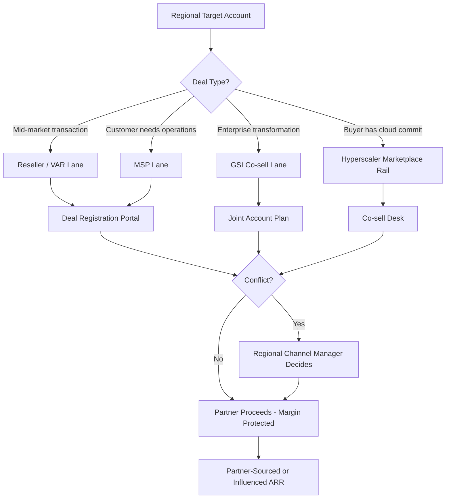

### Direct Answer

Design region-specific partner and channel strategies by building a **region-stratified, four-archetype channel architecture** — resellers/VARs, managed service providers, global system integrators, and hyperscaler cloud-marketplace co-sell — then capping partner density per territory so no account is contested by more than two or three partners. The discipline that prevents over-distribution is not partner *recruitment* but partner *governance*: deal-registration windows, named-account carve-outs, neutral-lane rules, and a hard partner-to-quota ratio enforced per region. Mature programs at HubSpot (HUBS), Snowflake (SNOW), and Salesforce (CRM) route 30-55% of ARR through partners precisely because they treat each region as a separate channel P&L with its own tier mechanics, MDF pool, and conflict-resolution authority — not a translated copy of the US program.

> **TL;DR** — Over-distribution is the failure mode where you sign 8-15 partners per region who then collide on the same accounts, collapsing partner margin and your own forecast accuracy. Fix it structurally: (1) stratify every region into four partner archetypes with explicit role boundaries; (2) set a partner-density ceiling tied to addressable accounts; (3) run deal registration with a 90-180 day exclusivity window per region; (4) split MDF by partner-sourced vs partner-influenced revenue; (5) give one regional channel manager final conflict-resolution authority. Done well, partner-sourced pipeline carries a 10-25% higher close rate and 20-40% lower CAC than direct in EMEA and APAC, where local relationships gate enterprise deals.

---

## 1. Why Regional Channel Strategy Is a Different Problem Than Channel Strategy

Most channel programs fail in their second region, not their first. The US program works because it was built natively — the founders sold into it, the comp plan matches it, and the partners self-selected. The moment you copy that program into EMEA or APAC, three things break simultaneously: the partner economics no longer pencil, the buyer's procurement path is different, and the conflict rules written for one country now have to mediate eight.

### 1.1 The over-distribution failure mode, defined precisely

Over-distribution is not "too many partners" in the abstract. It is a measurable condition: **the ratio of active partners to addressable accounts in a region exceeds the point where the average partner cannot build a viable book of business.** When a DACH territory has 600 target accounts and you have signed 14 resellers, each partner's theoretical share is 43 accounts — but because the top three partners chase the top 100 logos, the remaining 11 partners fight over scraps, disengage within two quarters, and either churn or start discounting to win deals they should not be in.

The symptoms are consistent across companies:

- **Margin compression.** When two partners register the same account, the vendor either picks a winner — creating a resentful loser — or lets both sell, which triggers a discount war that destroys partner margin and vendor ASP alike.
- **Forecast noise.** Partner-sourced deals show up in your CRM twice, get double-counted, then one drops; your regional forecast swings 15-30% on registration disputes rather than buyer behavior.
- **Partner disengagement.** A partner who loses three registered deals to channel conflict stops investing in your certification, stops co-marketing, and quietly re-prioritizes a competitor's product where they have a clean lane.
- **Brand dilution.** Fifteen partners in one region means fifteen different pitches, fifteen pricing approaches, and a buyer who gets quoted three different prices for the same SKU in one week.

### 1.2 The four signals that you have over-distributed

| Signal | Healthy range | Over-distributed | How to measure |
|---|---|---|---|
| Active partners per 100 addressable accounts | 1-3 | 5+ | Partners with at least one registered deal in trailing 2 quarters divided by TAM accounts |
| Deal-registration conflict rate | Under 8% of registrations | Over 20% | Disputed registrations divided by total registrations per region |
| Partner revenue concentration | Top 3 partners equal 50-70% | Top 3 over 85% | Partner-sourced ARR by partner, regionally |
| Partner-to-quota ratio | 1 partner per $0.5-2M target | 1 per under $250K | Regional partner count divided by regional partner quota |

When two or more of these signals are red, you have over-distributed and the fix is partner *consolidation*, not partner *recruitment*. The discipline-decay dynamic here mirrors what happens to enablement reinforcement after a launch — see the reinforcement-system playbook in (q461).

### 1.3 Why "just sign fewer partners" is the wrong frame

The instinct after reading the symptoms above is to set a hard partner cap and stop recruiting. That is half right. The real answer is **archetype segmentation**: a region does not need fewer partners, it needs partners in non-overlapping lanes. A reseller and a GSI selling into the same Fortune 500 account are not in conflict — the reseller handles the transaction and license management while the GSI handles the $4M implementation. Conflict only arises when two partners of the *same archetype* chase the same deal. The architecture in Section 2 makes archetype lanes explicit so density can be higher without conflict rising.

### 1.4 The cost of getting this wrong

Over-distribution is not a cosmetic problem. A region with a 25% deal-registration conflict rate loses real money three ways at once: the discount war erodes 5-15 points of ASP on every contested deal, the disengaged bottom-quartile partners represent sunk enablement cost with no return, and the forecast noise forces revenue leadership to discount the entire region's pipeline in board reporting. The combined drag routinely runs 20-30% of a region's realizable partner revenue. That is the budget you are protecting when you build the controls below.

---

## 2. The Four-Archetype Channel Architecture

Every viable regional channel program is built from four partner archetypes. The skill is staffing each archetype to the right depth for the region — not maximizing the count of any one.

### 2.1 Archetype one: Resellers and VARs (the transaction layer)

Resellers and value-added resellers own the **transaction and the local commercial relationship**. They carry your paper, handle local invoicing and currency, manage renewals, and provide first-line account coverage in markets where the buyer expects to purchase through a known local entity. In DACH, mid-market buyers will not transact directly with a US vendor — Bechtle, Computacenter, Cancom, and SoftwareONE are the actual commercial counterparties.

- **What they do well:** local procurement compliance, currency and tax handling, renewals at scale, breadth of mid-market coverage.
- **What they do badly:** deep technical implementation, executive-level transformation selling, anything requiring product engineering depth.
- **Density guidance:** 2-5 per major country, never more — resellers compete head-on, so this is the archetype most prone to over-distribution.

### 2.2 Archetype two: Managed Service Providers (the recurring-operations layer)

MSPs **run the product on the customer's behalf** as an ongoing managed service. They are critical in mid-market and lower-enterprise segments where the customer lacks the internal team to operate the platform. MSP partners produce the stickiest revenue in the channel because the customer relationship is operational, not transactional — churn through an MSP is measurably lower.

- **What they do well:** recurring operational ownership, expansion through adjacent service attach, sticky retention.
- **What they do badly:** net-new logo acquisition, large transformation deals.
- **Density guidance:** 3-8 per region — MSPs naturally segment by vertical and customer size, so overlap is lower.

### 2.3 Archetype three: Global System Integrators (the transformation layer)

GSIs — Accenture (ACN), Deloitte, Capgemini (CAP.PA), KPMG, Cognizant (CTSH), Infosys (INFY), Wipro (WIT), TCS — own the **large enterprise transformation deal**. They do not resell your license for margin; they sell a multimillion-dollar implementation in which your product is one component. A GSI relationship is a co-sell relationship, governed by a practice lead and joint account planning, not a deal-registration portal.

- **What they do well:** C-suite access, $1M+ implementation revenue, multi-product transformation programs, regulatory and change-management depth.
- **What they do badly:** speed, mid-market economics, anything under roughly $250K total contract value.
- **Density guidance:** 2-4 per region with named-practice carve-outs by industry vertical.

### 2.4 Archetype four: Hyperscaler cloud-marketplace co-sell (the procurement-rail layer)

The fourth archetype is not a company — it is the **AWS (AMZN), Microsoft Azure (MSFT), and Google Cloud (GOOGL) marketplace and co-sell motion**. Increasingly, enterprise software is purchased through a cloud marketplace so the buyer can draw down a committed cloud spend agreement — an AWS EDP, an Azure MACC. This is a procurement rail, not a partner in the traditional sense, but it must be treated as a deliberate channel because it changes deal economics: marketplace transactions carry a platform fee but unlock budget the buyer could not otherwise spend.

- **What it does well:** unlocking committed-spend budget, accelerating procurement, co-sell introductions through hyperscaler field teams.
- **What it does badly:** it provides no implementation or local relationship — it is a transaction rail only.
- **Density guidance:** all three hyperscalers, everywhere — they are non-competing rails, not partners that collide.

### 2.5 How the four archetypes coexist without conflict

The architecture works because conflict resolution is **single-threaded through one regional channel manager** (Section 5) and because archetypes occupy different lanes by design. A buyer can touch a reseller, an MSP, and a hyperscaler marketplace on the *same* deal without any of them being in conflict — they are doing different jobs.

---

## 3. Region-by-Region Channel Design

Each region needs its own channel P&L, partner roster, tier mechanics, and conflict rules. Below is the design pattern for the four major regions, with the partner ecosystem that actually exists in each.

### 3.1 North America: marketplace-led, GSI-anchored

North America is the most marketplace-mature region. Buyers default to AWS, Azure, and GCP marketplace transactions to draw down committed cloud spend, and the GSI ecosystem — Accenture, Deloitte, KPMG, Slalom — drives the largest deals. The reseller layer is thinner than in EMEA because mid-market buyers will transact directly with a US vendor.

- **Partner mix:** light reseller layer with CDW, SHI, and Insight as the major motions; strong MSP layer; deep GSI bench; all three hyperscaler marketplaces fully activated.
- **Tier mechanics:** revenue-based tiers with marketplace co-sell as a fast-track accelerator.
- **Conflict risk:** moderate — concentrated in GSI practice overlap on the largest accounts.
- **Density ceiling:** 2-3 resellers, 4-6 MSPs, 3-4 GSIs nationally.

### 3.2 EMEA: distributor-led, country-fragmented

EMEA is not one market — it is DACH, UK&I, Nordics, Benelux, France, Southern Europe, and Middle East, each with distinct procurement norms, languages, and regulation. Mid-market buyers in DACH and France will not transact directly with a US vendor; the distributor and VAR layer is mandatory. GDPR and the EU AI Act make compliance-specialist partners a real archetype here.

| Sub-region | Lead partner type | Representative partners | Density ceiling |
|---|---|---|---|
| DACH | Distributors and VARs | Bechtle, Computacenter, Cancom, SoftwareONE | 3-4 VARs |
| UK&I | GSIs and VARs | Accenture UK, Capgemini, Softcat, Computacenter | 3-4 mixed |
| Nordics | System houses | Atea, Crayon, Advania | 2-3 |
| Southern Europe | Local VARs | Engineering Group, Reply (Italy), regional SIs | 2-3 per country |

- **Conflict risk:** high — country fragmentation means partners cross borders and collide; a German VAR pursuing an Austrian subsidiary of a French account creates three-way conflict.
- **Critical rule:** deal registration must be **scoped to legal entity, not company name**, so cross-border subsidiaries do not trigger false conflicts.

EMEA channel design is inseparable from EMEA GTM messaging — see the regional GTM playbook that avoids simple translation in (q448) and the multi-language sales infrastructure approach in (q447).

### 3.3 APAC: relationship-gated, SI-keiretsu in Japan

APAC is the most relationship-gated region. In Japan, enterprise software is routed through SI keiretsu — NTT Data, Fujitsu, NEC, Hitachi — and a direct motion will simply fail to clear procurement. ANZ behaves more like a Western market with Telstra, Optus, and Data#3 leading. India is increasingly a GCC and captive-center market. SEA runs through distributors such as Ingram Micro APAC and TD SYNNEX.

- **Partner mix by sub-region:** Japan equals SI keiretsu only; ANZ equals telco-led plus VARs; India equals GCC/captive co-sell plus GSIs; SEA equals distributor-led; Korea equals local SI.
- **Conflict risk:** moderate but culturally severe — a registration dispute in Japan can permanently damage a keiretsu relationship; conflict rules must be applied with extra care.
- **Density ceiling:** deliberately low — 1-2 lead partners per sub-region, because relationships, not partner count, drive coverage.

APAC channel strategy must align with APAC deal mechanics — see the deal-stage dynamics and negotiation patterns specific to APAC and EMEA enterprise deals in (q449).

### 3.4 LATAM: SI-led, regulation-localized

LATAM channel coverage runs through regional SIs — TIVIT, Stefanini, Politec — plus Mexico and Brazil local VARs. Brazil's tax and data-localization regime, and the LGPD privacy law, make a local commercial entity and a regulatory-localization partner mandatory. LATAM is the region where vendors most often *under*-invest rather than over-distribute.

- **Partner mix:** regional SIs as the lead motion, country VARs for transaction coverage, regulatory-localization specialists in Brazil.
- **Conflict risk:** low — the bigger risk is under-coverage, leaving the region to a single partner with no redundancy.
- **Density ceiling:** 2-3 SIs regionally, 1-2 VARs per major country.

### 3.5 Regional design summary

| Region | Lead motion | Marketplace maturity | Primary conflict risk | Net partner density |
|---|---|---|---|---|
| North America | Marketplace plus GSI | High | GSI practice overlap | Moderate |
| EMEA | Distributor / VAR | Medium, rising | Cross-border entity collision | High — needs strict caps |
| APAC | Relationship / SI | Low-medium | Cultural damage from disputes | Low by design |
| LATAM | Regional SI | Low | Under-coverage, not over | Low-moderate |

The pattern: **density should be inversely proportional to relationship-gating.** APAC and LATAM, where relationships gate deals, need few deep partners. EMEA, where transactions are fragmented across countries, needs more partners but the tightest conflict rules. North America sits in the middle.

---

## 4. The Anti-Over-Distribution Control System

Architecture (Section 2) and regional design (Section 3) prevent *structural* over-distribution. This section covers the *operational* controls that keep it from creeping back.

### 4.1 The partner-density ceiling formula

Set a hard ceiling before you recruit, derived from addressable accounts, not ambition:

> **Max partners per archetype per region = (Addressable accounts in region for that archetype's segment) divided by (Minimum viable book size)**

A minimum viable book size is the account count below which a partner cannot justify investing in your certification and co-marketing — empirically, roughly 30-50 active addressable accounts for a reseller and 8-15 for a GSI. If a DACH territory has 600 mid-market accounts and minimum viable reseller book is 50, your reseller ceiling is **12 in theory but 3-4 in practice**, because the top accounts concentrate. Always set the practical ceiling, not the theoretical one.

### 4.2 Deal registration: the core conflict-prevention mechanism

Deal registration is the single most important control. The rules that make it work:

- **Exclusivity window:** the registering partner gets 90-180 days of exclusivity on that account — long enough to invest, short enough to prevent squatting.
- **Legal-entity scoping:** registration is scoped to a legal entity, not a parent company name — this is what prevents the EMEA cross-border false-conflict problem.
- **Activity requirement:** registration must include evidence of a real opportunity — a named contact, a meeting, a documented need — not a name-grab.
- **Decay rule:** a registered deal with no activity for 60 days releases automatically back to the pool.
- **Influence credit:** a partner who influenced but did not source a deal still gets recorded influence credit and partial MDF — this prevents the resentment that drives disengagement.

### 4.3 Partner-sourced vs partner-influenced revenue tracking

The most expensive mistake in channel measurement is treating all partner-touched revenue as one bucket. Split it:

| Revenue type | Definition | Margin treatment | MDF treatment |
|---|---|---|---|
| Partner-sourced | Partner originated the opportunity | Full partner margin / discount | Full MDF eligibility |
| Partner-influenced | Partner materially advanced a deal sourced elsewhere | Influence fee or referral percentage | Partial MDF |
| Partner-fulfilled | Partner only transacted a deal you sourced | Transaction margin only | No MDF |
| Direct | No partner involvement | Not applicable | Not applicable |

This split is what makes MDF allocation rational (Section 4.4) and what stops you from over-rewarding partners who merely transacted a deal your own field team closed. Crossbeam, Reveal, and PartnerStack-class tooling exist largely to attribute these buckets correctly.

### 4.4 MDF allocation by region and revenue type

Market Development Funds should be allocated as a percentage of *partner-sourced* revenue by region — not handed out as flat grants. A defensible model:

- **Base pool per region** equals 3-6% of trailing-twelve-month partner-sourced ARR in that region.
- **Allocation within region** weighted toward partners growing partner-sourced revenue, not influenced or fulfilled.
- **APAC and LATAM uplift** — these regions justify a higher MDF percentage early because relationship-building is front-loaded and slow to pay back.
- **Claw-back rule** — MDF on a deal that later churns within 12 months is recovered, which disincentivizes partners from chasing bad-fit logos.

### 4.5 PRM tooling and the co-sell stack

The control system needs tooling. The categories and representative vendors:

| Category | Job | Representative tools |
|---|---|---|
| Partner Relationship Management | Deal registration, tiering, partner portal | Impartner, Allbound, ZINFI |
| Ecosystem / co-sell intelligence | Account overlap, partner-sourced attribution | Crossbeam, Reveal |
| Partner-led growth | Referral and resale automation | PartnerStack |
| Hyperscaler co-sell | Marketplace listing plus co-sell desk integration | AWS ACE, Microsoft Partner Center, GCP Partner Advantage |

The tooling does not create the strategy — but without attribution tooling you cannot enforce the partner-sourced/influenced split in Section 4.3, and without that split the rest of the control system is unenforceable.

### 4.6 The quarterly channel-health review

Every region runs a quarterly review against the four over-distribution signals from Section 1.2. Any region with two red signals triggers a **partner-consolidation plan**: identify the bottom-quartile partners by partner-sourced revenue, give them a one-quarter improvement window, then off-board the non-responders and redistribute their accounts to performers. Consolidation is normal channel hygiene, not a failure — the best regional programs off-board 10-20% of partners annually.

---

## 5. Channel-Conflict Governance

Controls (Section 4) reduce conflict frequency. Governance handles the conflicts that still occur — and they will.

### 5.1 Single-threaded conflict authority

Every region has exactly one **regional channel manager with final conflict-resolution authority**. When two partners dispute a registration, the decision is made by one named person against published rules within 48 hours. The failure mode to avoid: letting conflict bubble up to direct sales leadership, who will resolve in favor of whatever closes the quarter and destroy partner trust in the process.

### 5.2 The neutral-lane rule

For account segments where channel conflict is structurally unavoidable — typically the top 50-100 enterprise logos in a region — designate them a **neutral lane**: direct-sales-led with partners in a co-sell-only role, no resale margin, named-account joint planning. This removes the highest-stakes deals from the registration system entirely and lets partners compete cleanly for everything below.

### 5.3 Direct-versus-channel conflict

The hardest conflict is not partner-versus-partner — it is partner-versus-your-own-direct-team. Resolve it with a published **rules of engagement** document: which segments are direct, which are channel, which are co-sell, and who gets compensated on what. Critically, compensate the direct rep on channel-sourced revenue in their territory — a channel-neutral comp design — so your own field team has no incentive to sabotage partner deals.

Comp design across regions is its own discipline — see the playbook for structuring AE compensation across regions with different cost-of-living in (q450), and the guidance on tailoring enablement content for AEs vs. SDRs vs. managers in (q464), since channel and direct teams need different enablement.

### 5.4 Governance escalation ladder

| Conflict level | Resolved by | SLA |
|---|---|---|
| Registration overlap | Regional channel manager | 48 hours |
| Direct-vs-channel territory dispute | Regional channel manager plus sales director | 5 business days |
| Cross-region partner collision | Global channel VP | 10 business days |
| Strategic partner exception | Channel VP plus revenue leadership | Case-by-case |

The ladder exists so that 90% of conflicts are resolved at level one without ever reaching leadership, and only genuinely strategic exceptions consume executive time.

### 5.5 Why governance must be published, not improvised

A conflict rule that lives only in the regional channel manager's head is not governance — it is favoritism waiting to be accused. Every rule above must be written down, shared with every partner at onboarding, and version-controlled. Partners tolerate losing a registered deal far better when they lost it to a published rule than to a private judgment call. The published rulebook is also what lets a new regional channel manager pick up the role without resetting partner trust.

---

## 6. Counter-Case: When Regional Channel Strategy Is the Wrong Move

The honest view: a region-stratified channel program is expensive, slow, and wrong for many companies. Build it only when the conditions below hold.

### 6.1 When direct beats channel

- **Product-led growth motion.** If your product is bought self-serve with a credit card, a channel adds cost and friction with no value. PLG companies should resist channel pressure until they have a clear enterprise motion that genuinely needs local partners.
- **Sub-$50M ARR with one core region.** Building four regional channel P&Ls before you have proven the model in your home market is premature. Prove direct first.
- **Highly technical, fast-moving product.** If your product changes monthly and requires deep engineering knowledge to sell, partners cannot keep certifications current — they will misrepresent the product and damage your brand.
- **Thin-margin product.** Channel margin of 15-30% has to come from somewhere. If your gross margin or ASP cannot absorb it, the channel makes every deal unprofitable.

### 6.2 The over-correction risk: under-distribution

The opposite mistake is real. A vendor so scarred by over-distribution that it signs one partner per region creates **single points of failure**: that partner gets acquired, de-prioritizes you, or simply underperforms, and the entire region's revenue evaporates with no backup. The right target is *deliberate redundancy* — two to three partners per archetype per region, enough that no single partner failure is catastrophic, few enough that conflict stays manageable.

### 6.3 When marketplace-only is sufficient

For many cloud-native infrastructure products, the AWS/Azure/GCP marketplace co-sell motion alone covers North America without any reseller or GSI layer. Adding a traditional channel on top of a working marketplace motion can be pure overhead. Test whether the marketplace rail plus a small co-sell desk meets coverage needs before building a full partner program.

### 6.4 The realistic cost and timeline

A region-stratified channel program is a 4-8 quarter investment before it is net-positive. The first year is spend — recruiting, enabling, building PRM tooling, and absorbing the conflict-resolution overhead — with partner-sourced revenue lagging. Companies that expect channel to pay back in two quarters abandon it right before it works. If you cannot fund 18-24 months of channel investment, do not start.

### 6.5 The hybrid path most companies should take

Few companies should go all-direct or all-channel. The pragmatic path for most mid-stage SaaS companies is **direct in the home region, marketplace co-sell as the first channel everywhere, and a stratified partner program added region-by-region only as each region's direct motion proves out**. This sequences the investment so channel cost is incurred only against demonstrated regional demand, and it avoids the most common failure — building a global partner program on the strength of a single proven region.

---

## 7. The 90-Day Regional Channel Build Plan

A concrete sequence for standing up channel in one new region without over-distributing.

### 7.1 Days 1-30: design and ceiling-setting

- Build the region's addressable-account map and segment it by the four archetypes.
- Calculate the partner-density ceiling per archetype using the formula in Section 4.1.
- Draft rules of engagement, deal-registration rules, and the neutral-lane list.
- Hire or assign the single regional channel manager described in Section 5.1.

### 7.2 Days 31-60: recruit to the ceiling, not past it

- Recruit *up to* the density ceiling — no more — prioritizing partners with existing relationships in your target segment.
- Stand up PRM tooling with deal registration and partner-sourced/influenced attribution live before the first partner deal.
- Run partner enablement and certification. Partner enablement should sync to the same rhythm as the direct team's — see the guidance on optimal kickoff frequency given forecast cycles in (q463).

### 7.3 Days 61-90: activate and instrument

- Launch deal registration and the co-sell desk.
- Set up the quarterly channel-health dashboard tracking the four over-distribution signals.
- Begin partner-sourced vs influenced reporting so the region's channel P&L is visible from day one.

### 7.4 The build-plan checklist

| Milestone | Owner | Done when |
|---|---|---|
| Addressable-account map | Regional channel manager | Segmented by 4 archetypes |
| Density ceiling set | Channel VP | Hard cap published per archetype |
| Rules of engagement | Channel VP plus sales director | Signed by both orgs |
| PRM tooling live | RevOps | Registration plus attribution working |
| Partners recruited | Regional channel manager | At ceiling, not above |
| Channel-health dashboard | RevOps | Four signals tracked monthly |

Measuring channel ROI is the same discipline as measuring kickoff ROI — see the approach to measuring ROI in a way that sticks to forecasts in (q462).

### 7.5 The most common build mistake

The single most common 90-day build mistake is recruiting past the ceiling in days 31-60 because partners are easy to sign and quota pressure is real. A region launched with 11 resellers against a 4-reseller ceiling has already over-distributed before it has closed a single deal — and unwinding it means off-boarding partners who did nothing wrong, which is far more damaging than never signing them. Hold the ceiling even when recruitment is going well.

---

## 8. Measuring a Healthy Regional Channel Program

### 8.1 The leading and lagging metrics

| Metric | Type | Healthy target |
|---|---|---|
| Partner-sourced pipeline coverage | Leading | 3-4x of regional channel quota |
| Deal-registration conflict rate | Leading | Under 8% per region |
| Partner-sourced ARR percentage of regional ARR | Lagging | 30-55% in mature regions |
| Partner-sourced win rate vs direct | Lagging | Plus 10-25% in EMEA/APAC |
| Partner-sourced CAC vs direct | Lagging | 20-40% lower in relationship-gated regions |
| Partner concentration (top 3) | Health | 50-70%, not over 85% |
| Annual partner off-boarding rate | Health | 10-20% |

### 8.2 Why partner-sourced win rate runs higher in EMEA and APAC

In relationship-gated regions, a local partner's introduction is not a marketing touch — it is procurement access. A deal a German VAR sources is a deal that cleared a buyer's "will I transact with a local entity" filter before it ever reached your forecast. That selection effect is why partner-sourced deals close at a higher rate and lower CAC in EMEA and APAC than direct, and why under-investing in channel there is a structural revenue leak.

### 8.3 The single number that tells you the program is healthy

If you track one number, track **deal-registration conflict rate by region**. It is the earliest, cleanest signal of over-distribution. When it crosses 15%, you have signed too many same-archetype partners and a consolidation cycle is overdue — well before the lagging revenue metrics turn red. The same early-signal logic applies to post-launch reinforcement systems described in (q461): the leading indicator turns long before the lagging revenue number does.

---

## 9. Conclusion: Stratify, Cap, Govern

Designing region-specific partner and channel strategy without over-distributing is not a recruiting problem — it is an architecture and governance problem. Stratify every region into the four archetypes so partners occupy non-overlapping lanes. Cap partner density per archetype using the addressable-account formula, and resist the pressure to recruit past the ceiling. Govern the conflict that remains through single-threaded regional authority, deal registration scoped to legal entity, neutral lanes for the top logos, and channel-neutral comp so your own field team never sabotages partner deals. Treat each region as its own channel P&L with its own MDF pool and tier mechanics — never a translated copy of the US program. Done this way, partner-sourced revenue becomes 30-55% of regional ARR at a higher win rate and lower CAC than direct, and "over-distribution" stops being a risk you fear and becomes a number on a dashboard you simply manage.

---

**Sources & further reading:** Forrester channel and partner-ecosystem research; Gartner Magic Quadrant for Partner Relationship Management and Gartner channel-strategy notes; Canalys partner-ecosystem and global-channel data; IDC channel and ecosystem research; HubSpot (HUBS) Solutions Partner Program public documentation; Snowflake (SNOW) services-partner program materials; Salesforce (CRM) AppExchange and consulting-partner program documentation; MongoDB (MDB) partner-tier documentation; Atlassian (TEAM) Solution Partner program; Datadog (DDOG) partner-ecosystem disclosures; AWS (AMZN) Partner Network APN tier and ACE co-sell documentation; Microsoft (MSFT) AI Cloud Partner Program and Partner Center documentation; Google Cloud (GOOGL) Partner Advantage program; Oracle (ORCL) Cloud OCI partner program; Accenture (ACN), Capgemini (CAP.PA), Cognizant (CTSH), Infosys (INFY), and Wipro (WIT) public partner-practice disclosures; Crossbeam ecosystem-led growth reports; Reveal co-sell research; PartnerStack partner-led growth benchmarks; Impartner and ZINFI PRM market materials; Bechtle, Computacenter, SoftwareONE, Atea, and Crayon public partner-program disclosures; NTT Data, Fujitsu, NEC, and Hitachi systems-integration program documentation; Telstra, Optus, and Data#3 ANZ channel materials; TIVIT and Stefanini LATAM systems-integration disclosures; CDW, SHI, and Insight reseller-program documentation; EU GDPR and EU AI Act regulatory texts; Brazil LGPD regulatory framework; SiriusDecisions / Forrester channel-maturity model; Channel Mechanics and 2112 Group channel-program research; McKinsey B2B go-to-market and partner-ecosystem analyses; Bain & Company channel-economics research; TD SYNNEX and Ingram Micro APAC distributor program documentation; Forrester and Canalys partner-sourced revenue benchmarks from mature-program studies; Allbound partner-program operations guidance; Partnership Leaders community ecosystem benchmarks; channel-conflict resolution frameworks from industry advisory firms; Channel Marketer Report MDF allocation benchmarks; Tackle.io cloud-marketplace co-sell data; AWS Marketplace and Azure Marketplace seller-program documentation.
