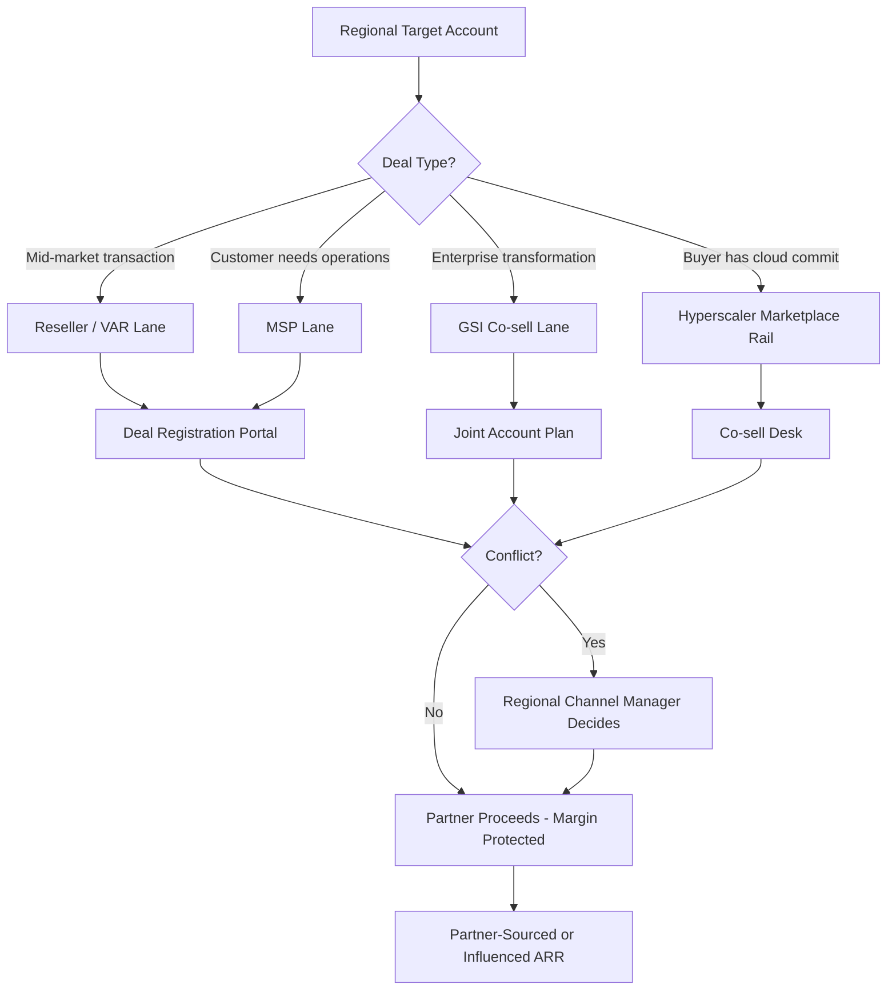

### Direct Answer

Design region-specific partner and channel strategies by building a **region-stratified, four-archetype channel architecture** — resellers and VARs, managed service providers, global system integrators, and hyperscaler cloud-marketplace co-sell — then capping partner density per territory so no account is contested by more than two or three partners of the same type. The discipline that prevents over-distribution is not partner *recruitment* but partner *governance*: deal-registration windows, named-account carve-outs, neutral-lane rules, and a hard partner-to-quota ratio enforced per region. Mature programs at HubSpot (HUBS), Snowflake (SNOW), and Salesforce (CRM) route 30-55% of ARR through partners precisely because they treat each region as a separate channel P&L with its own tier mechanics, MDF pool, and conflict-resolution authority — not a translated copy of the US program.

> **TL;DR** — Over-distribution is the failure mode where you sign 8-15 partners per region who then collide on the same accounts, collapsing partner margin and your own forecast accuracy. Fix it structurally: (1) stratify every region into four partner archetypes with explicit role boundaries; (2) set a partner-density ceiling tied to addressable accounts; (3) run deal registration with a 90-180 day exclusivity window per region; (4) split MDF by partner-sourced vs partner-influenced revenue; (5) give one regional channel manager final conflict-resolution authority. Done well, partner-sourced pipeline carries a 10-25% higher close rate and 20-40% lower CAC than direct in EMEA and APAC, where local relationships gate enterprise deals.

---

## 1. Why Regional Channel Strategy Is a Different Problem Than Channel Strategy

Most channel programs fail in their second region, not their first. The US program works because it was built natively — the founders sold into it, the comp plan matches it, and the partners self-selected over years of organic deal flow. The moment you copy that program into EMEA or APAC, three things break simultaneously: the partner economics no longer pencil, the buyer's procurement path is different, and the conflict rules written for one country now have to mediate eight. Treating "channel strategy" as one global program is the root cause of nearly every over-distribution failure, because a single global partner roster has no mechanism to recognize that a partner viable in Texas is redundant in Bavaria.

The distinction matters because channel strategy at the program level answers "what kinds of partners do we want and what do we pay them," while *regional* channel strategy answers "how many of each kind can this specific territory support before they start cannibalizing each other." The first question is a design question you answer once. The second is an operating question you must re-answer every quarter, per region, as the addressable market shifts. Companies that conflate the two end up with a beautiful global tier structure and a quietly broken channel in three of their four regions.

### 1.1 The over-distribution failure mode, defined precisely

Over-distribution is not "too many partners" in the abstract. It is a measurable condition: **the ratio of active partners to addressable accounts in a region exceeds the point where the average partner cannot build a viable book of business.** When a DACH territory has 600 target accounts and you have signed 14 resellers, each partner's theoretical share is 43 accounts — but because the top three partners chase the top 100 logos, the remaining 11 partners fight over scraps, disengage within two quarters, and either churn or start discounting to win deals they should not be in. The arithmetic is brutal: theoretical fairness assumes uniform distribution, but real account value follows a power law, so the practical book for the eleventh-ranked partner is a fraction of the headline number.

The symptoms are consistent across companies and across industries:

- **Margin compression.** When two partners register the same account, the vendor either picks a winner — creating a resentful loser — or lets both sell, which triggers a discount war that destroys partner margin and vendor ASP alike. Once a buyer learns two of your partners are competing for their signature, they will extract 10-20 points of discount that neither partner can recover.
- **Forecast noise.** Partner-sourced deals show up in your CRM twice, get double-counted, then one drops; your regional forecast swings 15-30% on registration disputes rather than buyer behavior. Revenue leadership responds by haircut-ting the entire region's partner pipeline in board reporting, which punishes the good partners alongside the bad.
- **Partner disengagement.** A partner who loses three registered deals to channel conflict stops investing in your certification, stops co-marketing, and quietly re-prioritizes a competitor's product where they have a clean lane. Disengagement is silent — the partner does not call to complain, they simply stop showing up — so it is invisible until a quarterly business review shows their sourced pipeline has gone to zero.
- **Brand dilution.** Fifteen partners in one region means fifteen different pitches, fifteen pricing approaches, and a buyer who gets quoted three different prices for the same SKU in one week. The buyer's takeaway is not "great coverage" — it is "this vendor cannot control its own channel," which is a trust signal that suppresses ASP across the territory.
- **Enablement waste.** Every partner you sign consumes onboarding, certification, and co-marketing investment. A partner who never builds a viable book is pure sunk cost — and at 14 partners in a 4-partner territory, ten of them are sunk cost by definition.

### 1.2 The four signals that you have over-distributed

| Signal | Healthy range | Over-distributed | How to measure |
|---|---|---|---|
| Active partners per 100 addressable accounts | 1-3 | 5 or more | Partners with at least one registered deal in trailing 2 quarters divided by TAM accounts |
| Deal-registration conflict rate | Under 8% of registrations | Over 20% | Disputed registrations divided by total registrations per region |
| Partner revenue concentration | Top 3 partners equal 50-70% | Top 3 over 85% | Partner-sourced ARR by partner, regionally |
| Partner-to-quota ratio | 1 partner per $0.5-2M target | 1 per under $250K | Regional partner count divided by regional partner quota |
| Partner certification currency | Over 80% certs current | Under 50% current | Partners with current product certification divided by total active partners |

When two or more of these signals are red, you have over-distributed and the fix is partner *consolidation*, not partner *recruitment*. The discipline-decay dynamic here mirrors what happens to enablement reinforcement after a launch — the leading indicator degrades quietly long before the revenue number does, which is exactly the pattern documented in the post-launch reinforcement-system playbook in (q461).

### 1.3 Why "just sign fewer partners" is the wrong frame

The instinct after reading the symptoms above is to set a hard partner cap and stop recruiting. That is half right. The real answer is **archetype segmentation**: a region does not need fewer partners, it needs partners in non-overlapping lanes. A reseller and a GSI selling into the same Fortune 500 account are not in conflict — the reseller handles the transaction and license management while the GSI handles the $4M implementation. Conflict only arises when two partners of the *same archetype* chase the same deal. The architecture in Section 2 makes archetype lanes explicit so density can be higher without conflict rising.

This reframe is the single most important idea in regional channel design. A territory can comfortably support a reseller, an MSP, two GSIs, and three hyperscaler marketplace rails — seven partner relationships — with near-zero conflict, because each occupies a distinct lane. The same territory cannot support seven resellers, because resellers compete head-on for the identical transaction. "How many partners can a region support" is the wrong question. "How many of each archetype can a region support" is the right one, and the answer is different for every archetype.

### 1.4 The cost of getting this wrong

Over-distribution is not a cosmetic problem. A region with a 25% deal-registration conflict rate loses real money three ways at once: the discount war erodes 5-15 points of ASP on every contested deal, the disengaged bottom-quartile partners represent sunk enablement cost with no return, and the forecast noise forces revenue leadership to discount the entire region's pipeline in board reporting. The combined drag routinely runs 20-30% of a region's realizable partner revenue. That is the budget you are protecting when you build the controls below — and it is why the controls, which feel like bureaucracy to a growth-hungry channel leader, pay for themselves within a single fiscal year.

There is also an opportunity cost that does not show up on any dashboard. Every quarter spent untangling channel conflict is a quarter your regional channel manager is not spending recruiting the *right* partner into a genuine coverage gap, or deepening the co-sell relationship with the GSI that could double your enterprise pipeline. Over-distribution does not just cost margin — it consumes the scarce management attention that would otherwise compound the channel's value.

---

## 2. The Four-Archetype Channel Architecture

Every viable regional channel program is built from four partner archetypes. The skill is staffing each archetype to the right depth for the region — not maximizing the count of any one. The archetypes are defined by *job*, not by company size or label, because the same company can play different archetype roles in different regions. Accenture is a GSI everywhere, but a regional VAR in Italy may behave like an MSP for mid-market customers and a pure transaction reseller for enterprise.

### 2.1 Archetype one: Resellers and VARs (the transaction layer)

Resellers and value-added resellers own the **transaction and the local commercial relationship**. They carry your paper, handle local invoicing and currency, manage renewals, and provide first-line account coverage in markets where the buyer expects to purchase through a known local entity. In DACH, mid-market buyers will not transact directly with a US vendor — Bechtle, Computacenter, Cancom, and SoftwareONE are the actual commercial counterparties, and a buyer's procurement department often has these firms on a pre-approved vendor list that a US entity cannot easily join.

The value a reseller adds is unglamorous but real: they absorb credit risk, they handle the multi-currency and VAT complexity, they manage the renewal motion at a scale your direct team cannot, and they give the buyer a throat to choke locally. A value-added reseller goes further, bundling light services, configuration, and first-line support onto the license — which is why the "value-added" qualifier matters for retention.

- **What they do well:** local procurement compliance, currency and tax handling, renewals at scale, breadth of mid-market coverage, pre-approved-vendor-list access.
- **What they do badly:** deep technical implementation, executive-level transformation selling, anything requiring product engineering depth or multi-year change management.
- **Density guidance:** 2-5 per major country, never more — resellers compete head-on, so this is the archetype most prone to over-distribution and the one where the density ceiling must be enforced hardest.
- **Compensation shape:** margin-based — a 15-30% discount off list, with tier accelerators for volume and renewal-rate performance.

### 2.2 Archetype two: Managed Service Providers (the recurring-operations layer)

MSPs **run the product on the customer's behalf** as an ongoing managed service. They are critical in mid-market and lower-enterprise segments where the customer lacks the internal team to operate the platform. MSP partners produce the stickiest revenue in the channel because the customer relationship is operational, not transactional — churn through an MSP is measurably lower, often by 10-20 points of gross retention, because the customer would have to rebuild an operational dependency to leave.

The MSP archetype is structurally under-used by most channel programs because it does not produce the satisfying spike of a new-logo close. Its value compounds quietly: an MSP that operates your product for 40 mid-market customers is a 40-account renewal engine that also drives expansion as each customer's usage grows. The MSP's incentive is aligned with retention, not just acquisition, which makes it the archetype most worth over-weighting in a region with a churn problem.

- **What they do well:** recurring operational ownership, expansion through adjacent service attach, sticky retention, predictable renewal revenue.
- **What they do badly:** net-new logo acquisition, large transformation deals, fast competitive displacements.
- **Density guidance:** 3-8 per region — MSPs naturally segment by vertical and customer size, so overlap is lower and the density ceiling can be more generous than for resellers.
- **Compensation shape:** recurring revenue share plus services margin — the vendor often discounts the license in exchange for the MSP's retention commitment.

### 2.3 Archetype three: Global System Integrators (the transformation layer)

GSIs — Accenture (ACN), Deloitte, Capgemini (CAP.PA), KPMG, Cognizant (CTSH), Infosys (INFY), Wipro (WIT), and Tata Consultancy Services — own the **large enterprise transformation deal**. They do not resell your license for margin; they sell a multimillion-dollar implementation and change program in which your product is one component. A GSI relationship is a co-sell relationship, governed by a practice lead and joint account planning, not a deal-registration portal. The GSI's interest in your product is proportional to the services revenue it can attach: a $200K license that anchors a $4M transformation is worth far more to the GSI than the license fee itself.

Working with GSIs requires a different muscle than working with resellers. There is no portal, no margin schedule, no tier. There is a practice — a named group of partners and consultants inside the GSI who have built expertise on your platform — and the entire relationship hinges on keeping that practice fed with deal flow and credentialed with reference wins. A GSI practice that wins three lighthouse deals on your platform becomes a self-sustaining pipeline engine. A practice that wins none quietly redeploys its consultants to a competitor's stack.

- **What they do well:** C-suite access, $1M+ implementation revenue, multi-product transformation programs, regulatory and change-management depth, credibility with the most conservative enterprise buyers.
- **What they do badly:** speed, mid-market economics, anything under roughly $250K total contract value, fast iteration.
- **Density guidance:** 2-4 per region with named-practice carve-outs by industry vertical — a GSI focused on financial services and one focused on manufacturing are not in conflict even in the same region.
- **Compensation shape:** influence fees, joint-marketing investment, and practice-development funding — not resale margin.

### 2.4 Archetype four: Hyperscaler cloud-marketplace co-sell (the procurement-rail layer)

The fourth archetype is not a company — it is the **AWS (AMZN), Microsoft Azure (MSFT), and Google Cloud (GOOGL) marketplace and co-sell motion**. Increasingly, enterprise software is purchased through a cloud marketplace so the buyer can draw down a committed cloud spend agreement — an AWS Enterprise Discount Program commitment, an Azure MACC, a Google Cloud committed-use contract. This is a procurement rail, not a partner in the traditional sense, but it must be treated as a deliberate channel because it changes deal economics: marketplace transactions carry a platform listing fee but unlock budget the buyer could not otherwise spend, frequently accelerating a deal that would have stalled in procurement for a quarter or more.

The co-sell dimension is as valuable as the transaction rail. AWS, Microsoft, and Google field teams are measured in part on marketplace-driven and partner-sourced revenue, which means a well-run co-sell relationship turns thousands of hyperscaler sellers into a referral engine for your product. The mechanics — AWS ACE opportunity sharing, Microsoft's co-sell program inside Partner Center, Google Cloud Partner Advantage — let your sellers and theirs register and share opportunities. This is the highest-leverage channel motion available to a cloud-native software company, and unlike the other three archetypes it carries near-zero conflict risk because the three hyperscalers are non-competing rails.

- **What it does well:** unlocking committed-spend budget, accelerating procurement, co-sell introductions through hyperscaler field teams, instant global reach.
- **What it does badly:** it provides no implementation, no local relationship, and no renewal management — it is a transaction and referral rail only.
- **Density guidance:** all three hyperscalers, everywhere — they are non-competing rails, not partners that collide, so there is no density ceiling to enforce.
- **Compensation shape:** the marketplace platform fee is the cost; the co-sell benefit is effectively free pipeline.

### 2.5 How the four archetypes coexist without conflict

The architecture works because conflict resolution is **single-threaded through one regional channel manager** (Section 5) and because archetypes occupy different lanes by design. A buyer can touch a reseller, an MSP, and a hyperscaler marketplace on the *same* deal without any of them being in conflict — they are doing different jobs. The reseller transacts the paper, the MSP commits to operate the platform afterward, and the marketplace provides the procurement rail. Each gets compensated for its distinct contribution. Conflict is reserved for the genuine collision case: two resellers, or two MSPs, chasing the identical transaction — and that is exactly the case the deal-registration portal exists to adjudicate.

### 2.6 Matching archetype mix to product and segment

The right archetype mix is not universal; it is a function of what you sell and to whom. A pure-SaaS product sold to mid-market runs heavy on resellers and MSPs and light on GSIs. A complex enterprise platform sold into the Global 2000 runs heavy on GSIs and hyperscaler co-sell and barely touches the reseller layer. A regulated-industry product leans on MSPs and specialist partners who carry compliance credentials. The discipline is to decide the archetype mix per region *before* recruiting, derive a density ceiling for each archetype (Section 4.1), and then recruit deliberately into that shape rather than signing whichever partner walks through the door.

A useful exercise is to draw the target archetype mix as a percentage of regional partner-sourced revenue before a single partner is signed. A mid-market SaaS company might target 40% reseller, 35% MSP, 10% GSI, and 15% marketplace in EMEA, while the same company targets 15% reseller, 20% MSP, 35% GSI, and 30% marketplace in North America, reflecting the differing procurement norms. The exact split matters less than the act of deciding it deliberately — because once the target mix is written down, every recruiting decision becomes a question of "does this partner fill a gap in the planned shape" rather than "is this partner good." A great reseller is still the wrong hire if the reseller archetype is already at its ceiling and the GSI lane is empty.

### 2.7 The two-speed nature of the four archetypes

The four archetypes operate at fundamentally different speeds, and forcing them onto one operating cadence is a common mistake. Resellers and the marketplace rail are *fast* — a reseller can transact a mid-market deal in weeks, and a marketplace listing transacts instantly once the buyer's procurement is ready. GSIs and, to a lesser extent, MSPs are *slow* — a GSI co-sell relationship takes two or three quarters to produce its first joint win and a year to become a reliable pipeline engine. A channel program that judges a GSI on the same quarterly new-logo metric as a reseller will conclude the GSI is failing and cut the relationship right before it matures. Each archetype needs its own success metric and its own patience curve: fast archetypes are measured on quarterly sourced revenue, slow archetypes on the trajectory of joint pipeline and credentialed reference wins.

---

## 3. Region-by-Region Channel Design

Each region needs its own channel P&L, partner roster, tier mechanics, and conflict rules. Below is the design pattern for the four major regions, with the partner ecosystem that actually exists in each. The unifying principle: the *shape* of the channel — which archetypes dominate, how dense each can be — is dictated by the region's procurement norms and relationship-gating, not by your home-market habits.

### 3.1 North America: marketplace-led, GSI-anchored

North America is the most marketplace-mature region. Buyers default to AWS, Azure, and GCP marketplace transactions to draw down committed cloud spend, and the GSI ecosystem — Accenture, Deloitte, KPMG, Slalom — drives the largest deals. The reseller layer is thinner than in EMEA because mid-market buyers will transact directly with a US vendor or through a marketplace, so the traditional CDW/SHI/Insight reseller motion exists but is not load-bearing for software the way it is for hardware.

- **Partner mix:** light reseller layer with CDW, SHI, and Insight as the major motions; strong MSP layer for mid-market operational ownership; deep GSI bench; all three hyperscaler marketplaces fully activated with co-sell.
- **Tier mechanics:** revenue-based tiers with marketplace co-sell as a fast-track accelerator — a partner that drives marketplace volume can skip a tier.
- **Conflict risk:** moderate — concentrated in GSI practice overlap on the largest accounts, where two GSIs both want to lead the transformation.
- **Density ceiling:** 2-3 resellers, 4-6 MSPs, 3-4 GSIs nationally; all hyperscalers.
- **Common mistake:** under-investing in the marketplace co-sell motion because it does not look like a "channel" — leaving committed-spend budget unspent on the table.

### 3.2 EMEA: distributor-led, country-fragmented

EMEA is not one market — it is DACH, UK and Ireland, the Nordics, Benelux, France, Southern Europe, and the Middle East, each with distinct procurement norms, languages, and regulation. Mid-market buyers in DACH and France will not transact directly with a US vendor; the distributor and VAR layer is mandatory, not optional. GDPR and the EU AI Act make compliance-specialist partners a real archetype here — a partner who can credibly attest data-residency and regulatory posture removes a deal blocker that a US-headquartered vendor cannot remove alone.

| Sub-region | Lead partner type | Representative partners | Density ceiling |
|---|---|---|---|
| DACH | Distributors and VARs | Bechtle, Computacenter, Cancom, SoftwareONE | 3-4 VARs |
| UK and Ireland | GSIs and VARs | Accenture UK, Capgemini, Softcat, Computacenter | 3-4 mixed |
| Nordics | System houses | Atea, Crayon, Advania | 2-3 |
| Benelux | VARs and SIs | Centric, regional integrators | 2-3 |
| Southern Europe | Local VARs | Engineering Group, Reply (Italy), regional SIs | 2-3 per country |

- **Conflict risk:** high — country fragmentation means partners cross borders and collide; a German VAR pursuing an Austrian subsidiary of a French-headquartered account creates a genuine three-way conflict that the portal must resolve.
- **Critical rule:** deal registration must be **scoped to legal entity, not company name**, so cross-border subsidiaries do not trigger false conflicts. This single rule prevents the most common and most demoralizing EMEA channel dispute.
- **Common mistake:** running EMEA as one territory with one partner roster — which guarantees that a partner strong in the UK is a redundant, conflict-generating partner in Germany.

EMEA channel design is inseparable from EMEA GTM messaging — the regional GTM playbook that does not just translate the US deck is covered in (q448), and the question of building multi-language sales infrastructure without hiring ten native teams is addressed in (q447). Channel partners are often the most efficient answer to both: a local VAR brings native-language selling and regionally credible messaging as a side effect of the partnership.

### 3.3 APAC: relationship-gated, SI-keiretsu in Japan

APAC is the most relationship-gated region. In Japan, enterprise software is routed through SI keiretsu — NTT Data, Fujitsu, NEC, Hitachi — and a direct motion will simply fail to clear procurement, because the buyer's procurement framework presumes a trusted long-standing integrator as the counterparty. ANZ behaves more like a Western market, with Telstra, Optus, and Data#3 leading. India is increasingly a global-capability-center and captive-center market where the buying decision may sit with a multinational's offshore center. SEA runs through distributors such as Ingram Micro APAC and TD SYNNEX.

- **Partner mix by sub-region:** Japan equals SI keiretsu only; ANZ equals telco-led plus VARs; India equals GCC and captive co-sell plus GSIs; SEA equals distributor-led; Korea equals local SI.
- **Conflict risk:** moderate in frequency but culturally severe in consequence — a registration dispute mishandled in Japan can permanently damage a keiretsu relationship that took years to build, so conflict rules must be applied with extra care and seniority.
- **Density ceiling:** deliberately low — 1-2 lead partners per sub-region, because relationships, not partner count, drive coverage. APAC is the region where the instinct to "add coverage" by signing more partners does the most damage.
- **Common mistake:** applying a Western, portal-driven, transactional conflict process to a relationship-driven market and torching trust in the process.

APAC channel strategy must align with APAC deal mechanics — the deal-stage dynamics and negotiation patterns specific to APAC and EMEA enterprise deals are covered in (q449), and they directly shape how a partner must run a deal: a longer consensus-building cycle and a different decision-maker map than the US norm.

### 3.4 LATAM: SI-led, regulation-localized

LATAM channel coverage runs through regional SIs — TIVIT, Stefanini, Politec — plus Mexico and Brazil local VARs. Brazil's tax and data-localization regime, and the LGPD privacy law, make a local commercial entity and a regulatory-localization partner mandatory; the cost and complexity of Brazilian invoicing alone is a reason most vendors must transact through a local partner. LATAM is the region where vendors most often *under*-invest rather than over-distribute, leaving an entire continent's revenue dependent on a single integrator.

- **Partner mix:** regional SIs as the lead motion, country VARs for transaction coverage, regulatory-localization specialists in Brazil.
- **Conflict risk:** low — the bigger risk is under-coverage, leaving the region to a single partner with no backup if that partner stumbles.
- **Density ceiling:** 2-3 SIs regionally, 1-2 VARs per major country — and crucially, *at least* two, so no single partner is a single point of failure.
- **Common mistake:** treating LATAM as an afterthought served by one partner, then losing the entire region when that partner is acquired or de-prioritizes.

### 3.5 Regional design summary

| Region | Lead motion | Marketplace maturity | Primary conflict risk | Net partner density |
|---|---|---|---|---|
| North America | Marketplace plus GSI | High | GSI practice overlap | Moderate |
| EMEA | Distributor and VAR | Medium, rising | Cross-border entity collision | High — needs strict caps |
| APAC | Relationship and SI | Low to medium | Cultural damage from disputes | Low by design |
| LATAM | Regional SI | Low | Under-coverage, not over | Low to moderate |

The pattern: **density should be inversely proportional to relationship-gating.** APAC and LATAM, where relationships gate deals, need few deep partners. EMEA, where transactions are fragmented across countries, needs more partners but the tightest conflict rules. North America sits in the middle, with the marketplace rail absorbing volume that would otherwise require a dense reseller layer.

### 3.6 The regional tier-mechanics question

A frequent design mistake is running one global tier ladder — Authorized, Advanced, Premier — with one global revenue threshold. A $2M threshold for Premier is trivial in North America and unreachable for a strong partner in a small Nordic country. Tier thresholds must be **set per region against that region's addressable market**, so that "Premier" means the same thing — top-tier commitment and performance — everywhere, even though the absolute revenue number differs. The tier *benefits* can be global; the tier *thresholds* cannot. Programs that get this wrong either make top tiers unreachable in small markets, killing partner motivation, or trivially easy in large ones, debasing the tier's signal value.

---

## 4. The Anti-Over-Distribution Control System

Architecture (Section 2) and regional design (Section 3) prevent *structural* over-distribution. This section covers the *operational* controls that keep it from creeping back, because over-distribution is an entropic process — absent active control, partner count drifts upward every quarter as channel managers respond to coverage anxiety by signing one more.

### 4.1 The partner-density ceiling formula

Set a hard ceiling before you recruit, derived from addressable accounts, not ambition:

> **Max partners per archetype per region = (Addressable accounts in region for that archetype's segment) divided by (Minimum viable book size)**

A minimum viable book size is the account count below which a partner cannot justify investing in your certification and co-marketing — empirically, roughly 30-50 active addressable accounts for a reseller and 8-15 for a GSI practice. If a DACH territory has 600 mid-market accounts and minimum viable reseller book is 50, your reseller ceiling is **12 in theory but 3-4 in practice**, because the top accounts concentrate and the eleventh partner's real addressable book is a small fraction of the average. Always set the practical ceiling, not the theoretical one, and write it down as a hard number that requires VP sign-off to exceed.

The ceiling is not a one-time calculation. Re-run it every time the addressable market shifts materially — a new product line that expands the segment, a market downturn that shrinks it, a competitor exit that opens accounts. The ceiling is a living number, and the quarterly channel-health review (Section 4.6) is where it gets re-validated.

### 4.2 Deal registration: the core conflict-prevention mechanism

Deal registration is the single most important operational control. The rules that make it work:

- **Exclusivity window:** the registering partner gets 90-180 days of exclusivity on that account — long enough to invest in the pursuit, short enough to prevent partners from squatting on names they are not actively working.
- **Legal-entity scoping:** registration is scoped to a legal entity, not a parent company name — this is what prevents the EMEA cross-border false-conflict problem, where a partner registers a global parent and inadvertently locks out partners in five countries.
- **Activity requirement:** registration must include evidence of a real opportunity — a named contact, a logged meeting, a documented need — not a name-grab. A registration with no evidence is rejected at submission.
- **Decay rule:** a registered deal with no logged activity for 60 days releases automatically back to the pool, so a partner cannot register and then sit on an account.
- **Influence credit:** a partner who influenced but did not source a deal still gets recorded influence credit and partial MDF — this prevents the resentment that drives disengagement when a partner does real work on a deal another partner ultimately closes.
- **First-to-register-with-evidence wins:** the tie-breaker rule is published and mechanical, so the regional channel manager adjudicates against a rule rather than a preference.

### 4.3 Partner-sourced vs partner-influenced revenue tracking

The most expensive measurement mistake in channel is treating all partner-touched revenue as one bucket. Split it into four:

| Revenue type | Definition | Margin treatment | MDF treatment |
|---|---|---|---|
| Partner-sourced | Partner originated the opportunity before any vendor contact | Full partner margin or discount | Full MDF eligibility |
| Partner-influenced | Partner materially advanced a deal sourced elsewhere | Influence fee or referral percentage | Partial MDF |
| Partner-fulfilled | Partner only transacted a deal the vendor sourced | Transaction margin only | No MDF |
| Direct | No partner involvement at any stage | Not applicable | Not applicable |

This split is what makes MDF allocation rational (Section 4.4) and what stops you from over-rewarding partners who merely transacted a deal your own field team closed. Crossbeam, Reveal, and PartnerStack-class tooling exist largely to attribute these buckets correctly, by matching partner CRM data against yours to establish who genuinely touched the account first. Without the split, "partner revenue" is a vanity number that conflates a partner who built a $2M pipeline from scratch with a partner who processed a purchase order for a deal you closed.

### 4.4 MDF allocation by region and revenue type

Market Development Funds should be allocated as a percentage of *partner-sourced* revenue by region — not handed out as flat grants or, worse, as relationship favors. A defensible model:

- **Base pool per region** equals 3-6% of trailing-twelve-month partner-sourced ARR in that region — so the pool grows when the channel performs and shrinks when it does not.
- **Allocation within region** weighted toward partners growing partner-sourced revenue, not influenced or fulfilled — the money follows the behavior you want more of.
- **APAC and LATAM uplift** — these regions justify a higher MDF percentage in the early years because relationship-building is front-loaded and slow to pay back; under-funding them guarantees under-coverage.
- **Claw-back rule** — MDF spent supporting a deal that later churns within 12 months is recovered, which disincentivizes partners from chasing bad-fit logos just to trigger funding.
- **Spend governance** — MDF requires a pre-approved plan and post-spend proof of execution, so the fund builds pipeline rather than subsidizing partner overhead.

### 4.5 PRM tooling and the co-sell stack

The control system needs tooling; the controls above are unenforceable on spreadsheets at any real scale. The categories and representative vendors:

| Category | Job | Representative tools |
|---|---|---|
| Partner Relationship Management | Deal registration, tiering, partner portal, MDF workflow | Impartner, Allbound, ZINFI |
| Ecosystem and co-sell intelligence | Account overlap mapping, partner-sourced attribution | Crossbeam, Reveal |
| Partner-led growth | Referral and resale automation, partner payouts | PartnerStack |
| Hyperscaler co-sell | Marketplace listing, opportunity sharing, co-sell desk integration | AWS ACE, Microsoft Partner Center, GCP Partner Advantage |
| CRM integration layer | Sync of partner deals into the revenue forecast | Native CRM partner objects, integration middleware |

The tooling does not create the strategy — but without attribution tooling you cannot enforce the partner-sourced and partner-influenced split in Section 4.3, and without that split the rest of the control system is unenforceable. The sequencing rule is firm: PRM and attribution tooling go live *before* the first partner deal in a new region, never after. Retrofitting attribution onto a region that already has 200 partner deals of ambiguous provenance is a months-long forensic project.

### 4.6 The quarterly channel-health review

Every region runs a quarterly review against the over-distribution signals from Section 1.2. Any region with two or more red signals triggers a **partner-consolidation plan**: identify the bottom-quartile partners by partner-sourced revenue, give them a one-quarter improvement window with a specific and documented target, then off-board the non-responders and redistribute their accounts to performers. Consolidation is normal channel hygiene, not a failure or an admission of bad recruiting — the best regional programs deliberately off-board 10-20% of partners annually and consider that churn rate a sign of a healthy, performance-managed channel rather than a stable one.

### 4.7 Off-boarding a partner without damage

Off-boarding is the control that channel leaders most often flinch from, because it feels like burning a relationship. Done well, it does not. The mechanics: give clear written notice with the performance data behind the decision, honor the exclusivity window on any deal the partner has actively registered, transition the partner's renewal book to a performing partner with a defined handover, and exit on professional terms because the channel ecosystem is small and today's off-boarded partner talks to tomorrow's recruit. A partner off-boarded against a published performance bar respects the decision far more than a partner who is quietly starved of leads and left to wonder. Clean off-boarding is what makes the density ceiling credible.

---

## 5. Channel-Conflict Governance

Controls (Section 4) reduce conflict frequency. Governance handles the conflicts that still occur — and they will, because no portal can anticipate every collision in a live market.

### 5.1 Single-threaded conflict authority

Every region has exactly one **regional channel manager with final conflict-resolution authority**. When two partners dispute a registration, the decision is made by one named person against published rules within 48 hours. The failure mode to avoid: letting conflict bubble up to direct sales leadership, who will resolve in favor of whatever closes the current quarter and, in doing so, destroy partner trust in the integrity of the registration system. Once partners believe registration outcomes depend on who shouts loudest to your VP of Sales, the portal is dead and every deal becomes a negotiation.

Single-threading also means the authority is *accountable*. One named person owning conflict resolution can be measured on conflict rate, on resolution speed, and on partner-satisfaction scores — a committee cannot.

### 5.2 The neutral-lane rule

For account segments where channel conflict is structurally unavoidable — typically the top 50-100 enterprise logos in a region, the ones every partner wants — designate them a **neutral lane**: direct-sales-led, with partners in a co-sell-only role, no resale margin, and named-account joint planning. This removes the highest-stakes deals from the registration system entirely and lets partners compete cleanly for everything below. The neutral lane is counterintuitive — it looks like taking deals away from the channel — but it is precisely the deals most likely to generate destructive conflict, and removing them protects the integrity of the channel for the much larger volume of mid-market deals.

### 5.3 Direct-versus-channel conflict

The hardest conflict is not partner-versus-partner — it is partner-versus-your-own-direct-team. A direct rep who sees a partner working an account in their territory has every short-term incentive to swoop in and claim the deal direct. Resolve it with a published **rules of engagement** document: which segments are direct, which are channel, which are co-sell, and who gets compensated on what. Critically, compensate the direct rep on channel-sourced revenue in their territory — a channel-neutral comp design — so your own field team has no financial incentive to sabotage partner deals. If the direct rep is paid the same whether a deal closes direct or through a partner, the rep becomes a channel ally instead of a channel predator.

Comp design across regions is its own discipline, made harder by cost-of-living and currency differences — the playbook for structuring AE compensation across regions is covered in (q450). And because channel and direct teams need genuinely different enablement, the guidance on tailoring content for AEs versus SDRs versus managers in (q464) applies directly to designing separate partner-facing and direct-facing enablement tracks.

### 5.4 Governance escalation ladder

| Conflict level | Resolved by | SLA |
|---|---|---|
| Registration overlap | Regional channel manager | 48 hours |
| Direct-versus-channel territory dispute | Regional channel manager plus sales director | 5 business days |
| Cross-region partner collision | Global channel VP | 10 business days |
| Strategic partner exception | Channel VP plus revenue leadership | Case-by-case |

The ladder exists so that roughly 90% of conflicts are resolved at level one without ever reaching leadership, and only genuinely strategic exceptions consume executive time. A ladder that routinely escalates to level three or four is itself a signal that the level-one rules are unclear or that the region has over-distributed and is generating more genuine collisions than the system can absorb.

### 5.5 Why governance must be published, not improvised

A conflict rule that lives only in the regional channel manager's head is not governance — it is favoritism waiting to be accused. Every rule above must be written down, shared with every partner at onboarding, version-controlled, and re-issued whenever it changes. Partners tolerate losing a registered deal far better when they lost it to a published rule than to a private judgment call, because the published rule preserves their belief that the system is fair and that next time the rule could fall their way. The published rulebook is also what lets a new regional channel manager pick up the role without resetting partner trust from zero — the rules outlast the individual.

### 5.6 Co-sell governance with GSIs and hyperscalers

The governance above is built around the deal-registration portal, which is the right instrument for reseller and MSP conflict. GSI and hyperscaler relationships need a different governance instrument: the **joint account plan**. A GSI co-sell relationship is governed by a named practice lead on each side, a shared list of target accounts, agreed roles on each account, and a quarterly business review that reconciles pipeline and resolves overlap. There is no portal and no registration — there is a planning cadence. Trying to force a GSI relationship through a reseller-style registration portal is a common and damaging mistake; it signals to the GSI that you see them as a transaction reseller rather than a transformation partner, and it underuses the relationship.

---

## 6. Counter-Case: When Regional Channel Strategy Is the Wrong Move

The honest view: a region-stratified channel program is expensive, slow, and wrong for many companies. Build it only when the conditions below hold, and have the discipline to walk away when they do not.

### 6.1 When direct beats channel

- **Product-led growth motion.** If your product is bought self-serve with a credit card and adopted bottom-up, a channel adds cost and friction with no value — the partner sits between you and a buyer who did not want an intermediary. PLG companies should resist channel pressure until they have a clear enterprise motion that genuinely needs local partners for procurement access.
- **Sub-$50M ARR with one core region.** Building four regional channel P&Ls before you have proven the model in your home market is premature; you will spread thin management attention across regions none of which is yet ready. Prove direct in one region first, then expand channel deliberately.
- **Highly technical, fast-moving product.** If your product changes monthly and requires deep engineering knowledge to sell correctly, partners cannot keep certifications current — they will misrepresent the product, set wrong expectations, and damage your brand faster than they generate revenue.
- **Thin-margin product.** Channel margin of 15-30% has to come from somewhere. If your gross margin or ASP cannot absorb a partner discount, the channel makes every deal unprofitable, and no volume fixes that.

### 6.2 The over-correction risk: under-distribution

The opposite mistake is real and arguably more common in mature, conflict-scarred programs. A vendor so burned by over-distribution that it signs one partner per region creates **single points of failure**: that partner gets acquired by a competitor, de-prioritizes you in favor of a higher-margin product, or simply underperforms — and the entire region's revenue evaporates with no backup and no time to recruit a replacement. The right target is *deliberate redundancy* — two to three partners per archetype per region, enough that no single partner failure is catastrophic, few enough that conflict stays manageable. Under-distribution feels safe and disciplined; it is actually a concentrated bet that one relationship will never fail.

### 6.3 When marketplace-only is sufficient

For many cloud-native infrastructure and developer-tools products, the AWS, Azure, and GCP marketplace co-sell motion alone covers North America — and increasingly other regions — without any reseller or GSI layer at all. Adding a traditional partner program on top of a working marketplace motion can be pure overhead: a tier ladder, a portal, MDF administration, and conflict governance, all to manage partners who add nothing the marketplace rail did not already provide. Test whether the marketplace rail plus a small co-sell desk meets coverage and procurement needs before building a full multi-archetype partner program. For a meaningful slice of modern software companies, it does.

### 6.4 The realistic cost and timeline

A region-stratified channel program is a 4-8 quarter investment before it is net-positive. The first year is almost entirely spend — recruiting, enabling, certifying, building PRM tooling, and absorbing the conflict-resolution overhead — with partner-sourced revenue lagging well behind the investment curve. Companies that expect channel to pay back in two quarters abandon it right before it works, which is the worst possible outcome: all of the cost and none of the compounding return. If you cannot fund and protect 18-24 months of channel investment through a board cycle and a possible downturn, do not start — a half-built channel killed mid-stream damages partner relationships you may want later.

### 6.5 The hybrid path most companies should take

Few companies should go all-direct or all-channel. The pragmatic path for most mid-stage SaaS companies is **direct in the home region, marketplace co-sell as the first channel everywhere, and a stratified partner program added region-by-region only as each region's direct motion proves out**. This sequences the investment so that channel cost is incurred only against demonstrated regional demand, and it avoids the single most common strategic failure — building a global partner program on the strength of a single proven region, then watching it underperform everywhere the home-market assumptions did not hold.

### 6.6 The reversibility test

Before committing to a regional channel, apply a reversibility test: if this channel does not work in eighteen months, can we unwind it without destroying the region's revenue or our reputation. If the answer is no — because you have handed your entire customer base to partners with no direct relationship of your own — you have not built a channel, you have outsourced your business. Maintain enough direct presence in every region, even a thin one, that the channel is a force multiplier you could in principle replace, not a dependency you cannot survive losing.

---

## 7. The 90-Day Regional Channel Build Plan

A concrete sequence for standing up channel in one new region without over-distributing. The plan is deliberately front-loaded with design work, because every control in Section 4 is cheap to install before the first partner and expensive to retrofit after.

### 7.1 Days 1-30: design and ceiling-setting

- Build the region's addressable-account map and segment it by the four archetypes — which accounts are mid-market transaction, which need managed operations, which are enterprise transformation, which carry committed cloud spend.
- Calculate the partner-density ceiling per archetype using the formula in Section 4.1, and get VP sign-off on it as a hard number.
- Draft the rules of engagement, the deal-registration rules, and the neutral-lane list of top accounts.
- Hire or assign the single regional channel manager described in Section 5.1 — this role exists before partners do, not after.
- Set region-specific tier thresholds against the region's addressable market (Section 3.6).

### 7.2 Days 31-60: recruit to the ceiling, not past it

- Recruit *up to* the density ceiling — no more — prioritizing partners with existing relationships in your target segment over partners who merely want the logo.
- Stand up PRM tooling with deal registration and partner-sourced and partner-influenced attribution live before the first partner deal is registered.
- Run partner enablement and certification, and treat certification currency as a recruiting filter — a partner who will not certify is a partner who will misrepresent the product.
- Partner enablement should sync to the same rhythm as the direct team's enablement cadence; the guidance on optimal kickoff frequency given forecast cycles in (q463) applies to partner kickoffs as much as direct ones.

### 7.3 Days 61-90: activate and instrument

- Launch deal registration and the co-sell desk so the first partner deals flow through governed infrastructure rather than ad hoc email.
- Set up the quarterly channel-health dashboard tracking the over-distribution signals from Section 1.2.
- Begin partner-sourced versus partner-influenced reporting so the region's channel P&L is visible from day one and the first quarterly review has real data.
- Run the first joint account-planning session with any GSI partners, establishing the planning cadence that will govern those relationships.

### 7.4 The build-plan checklist

| Milestone | Owner | Done when |
|---|---|---|
| Addressable-account map | Regional channel manager | Segmented by 4 archetypes |
| Density ceiling set | Channel VP | Hard cap published per archetype |
| Rules of engagement | Channel VP plus sales director | Signed by both orgs |
| PRM tooling live | RevOps | Registration plus attribution working |
| Partners recruited | Regional channel manager | At ceiling, not above |
| Channel-health dashboard | RevOps | Four signals tracked monthly |
| First joint account plan | Regional channel manager | Agreed with each GSI partner |

Measuring channel ROI is the same discipline as measuring kickoff or program ROI — the approach to measuring ROI in a way that sticks to the forecast rather than living in a separate slide is covered in (q462), and it applies directly to proving the channel's contribution to revenue leadership.

### 7.5 The most common build mistake

The single most common 90-day build mistake is recruiting past the ceiling in days 31-60 because partners are easy to sign and quota pressure is real. A region launched with 11 resellers against a 4-reseller ceiling has already over-distributed before it has closed a single deal — and unwinding it means off-boarding partners who did nothing wrong, which is far more damaging to your reputation in the partner ecosystem than never signing them. Hold the ceiling even when recruitment is going well, especially when it is going well, because an easy recruiting environment is exactly when discipline lapses.

### 7.6 Beyond 90 days: the steady-state operating rhythm

The 90-day plan stands the channel up; a steady-state operating rhythm keeps it healthy. That rhythm is a monthly partner business cadence with the top partners, a quarterly channel-health review against the over-distribution signals, a quarterly tier recalculation, an annual addressable-market refresh that re-validates the density ceiling, and a continuous low-volume recruiting pipeline so that off-boarding a weak partner does not leave a coverage hole. The channel is never "done" — it is an operating system that requires the same recurring discipline as the direct sales motion.

---

## 8. Measuring a Healthy Regional Channel Program

### 8.1 The leading and lagging metrics

| Metric | Type | Healthy target |
|---|---|---|
| Partner-sourced pipeline coverage | Leading | 3-4x of regional channel quota |
| Deal-registration conflict rate | Leading | Under 8% per region |
| Partner certification currency | Leading | Over 80% of active partners current |
| Partner-sourced ARR percentage of regional ARR | Lagging | 30-55% in mature regions |
| Partner-sourced win rate versus direct | Lagging | Plus 10-25% in EMEA and APAC |
| Partner-sourced CAC versus direct | Lagging | 20-40% lower in relationship-gated regions |
| Partner concentration (top 3 share) | Health | 50-70%, not over 85% |
| Annual partner off-boarding rate | Health | 10-20% |

### 8.2 Why partner-sourced win rate runs higher in EMEA and APAC

In relationship-gated regions, a local partner's introduction is not a marketing touch — it is procurement access. A deal a German VAR sources is a deal that has already cleared a buyer's "will I transact with a known local entity" filter before it ever reached your forecast. That selection effect is why partner-sourced deals close at a higher rate and lower CAC in EMEA and APAC than direct deals do, and it is why under-investing in channel in those regions is not a missed-upside problem but a structural revenue leak — the deals you are not getting are the deals you could never have gotten directly.

### 8.3 The single number that tells you the program is healthy

If you track one number, track **deal-registration conflict rate by region**. It is the earliest, cleanest, hardest-to-game signal of over-distribution. When it crosses roughly 15%, you have signed too many same-archetype partners and a consolidation cycle is overdue — and critically, the conflict rate turns red well before the lagging revenue metrics do, giving you a full quarter or two of warning. The same early-signal logic applies to post-launch reinforcement systems described in (q461): the leading behavioral indicator degrades long before the lagging revenue number confirms the problem, and the discipline of acting on the leading indicator is what separates programs that self-correct from programs that discover the damage at year-end.

### 8.4 Reporting the channel to revenue leadership

A healthy channel is not just operated well — it is *reported* well, so that revenue leadership funds it through the 18-24 month payback curve. Report the channel as a regional P&L: partner-sourced and partner-influenced revenue, channel CAC against direct CAC, the four over-distribution signals as a health panel, and the consolidation actions taken each quarter. Reporting the channel as a single global "partner revenue" number invites exactly the wrong question — "why isn't it bigger" — instead of the right one — "is each region's channel healthy and correctly sized." The measurement system is not an afterthought; it is the instrument that keeps the channel funded and correctly governed.

### 8.5 The maturity curve a regional channel travels

A regional channel does not arrive healthy; it travels a recognizable maturity curve, and knowing where a region sits prevents both premature judgment and complacency. In year one, the region is in *build* — partners signed, tooling live, first deals registered, partner-sourced revenue still a single-digit percentage of regional ARR. In year two, it reaches *traction* — partner-sourced revenue climbs into the 15-30% range, the conflict rate stabilizes, and the first consolidation cycle prunes the partners who did not produce. By year three a well-run region reaches *maturity* — partner-sourced and influenced revenue sits at 30-55% of regional ARR, the channel is net-positive on a fully loaded cost basis, and the operating rhythm runs without heroics. The mistake is judging a year-one region against year-three benchmarks and concluding the channel has failed; the equal mistake is assuming a year-three region will stay healthy without the recurring discipline of Section 7.6. The maturity curve is the context that makes every other metric in this section interpretable.

---

## 9. Conclusion: Stratify, Cap, Govern

Designing region-specific partner and channel strategy without over-distributing is not a recruiting problem — it is an architecture and governance problem. Stratify every region into the four archetypes so partners occupy non-overlapping lanes and density can be high without conflict rising. Cap partner density per archetype using the addressable-account formula, write the ceiling down as a hard number, and resist the constant pressure to recruit past it — especially when recruiting is easy. Govern the conflict that inevitably remains through single-threaded regional authority, deal registration scoped to legal entity, neutral lanes for the top logos, joint account plans for GSIs, and channel-neutral comp so your own field team never sabotages partner deals. Treat each region as its own channel P&L with its own MDF pool and tier thresholds — never a translated copy of the US program. Done this way, partner-sourced revenue becomes 30-55% of regional ARR at a higher win rate and lower CAC than direct, and "over-distribution" stops being a risk you fear and becomes a number on a dashboard you simply manage, quarter after quarter.

---

**Sources & further reading:** Forrester channel and partner-ecosystem research; Forrester partner-sourced revenue benchmarks from mature-program studies; Gartner Magic Quadrant for Partner Relationship Management; Gartner channel-strategy and ecosystem research notes; Canalys partner-ecosystem and global-channel data; Canalys cloud-marketplace forecast data; IDC channel and ecosystem research; HubSpot (HUBS) Solutions Partner Program public documentation; Snowflake (SNOW) services-partner program materials; Salesforce (CRM) AppExchange and consulting-partner program documentation; MongoDB (MDB) partner-tier documentation; Atlassian (TEAM) Solution Partner program; Datadog (DDOG) partner-ecosystem disclosures; AWS (AMZN) Partner Network APN tier documentation and ACE co-sell program; Microsoft (MSFT) AI Cloud Partner Program and Partner Center co-sell documentation; Google Cloud (GOOGL) Partner Advantage program; Oracle (ORCL) Cloud OCI partner program; Accenture (ACN) partner-practice disclosures; Capgemini (CAP.PA) partner-practice materials; Cognizant (CTSH), Infosys (INFY), and Wipro (WIT) public systems-integration disclosures; Crossbeam ecosystem-led growth reports; Reveal co-sell intelligence research; PartnerStack partner-led growth benchmarks; Impartner PRM market materials; ZINFI channel-management documentation; Allbound partner-program operations guidance; Bechtle, Computacenter, Cancom, and SoftwareONE public partner-program disclosures; Atea and Crayon Nordic partner materials; NTT Data, Fujitsu, NEC, and Hitachi systems-integration program documentation; Telstra, Optus, and Data#3 ANZ channel materials; TIVIT and Stefanini LATAM systems-integration disclosures; CDW, SHI, and Insight reseller-program documentation; TD SYNNEX and Ingram Micro APAC distributor-program documentation; EU GDPR regulatory text; EU AI Act regulatory text; Brazil LGPD regulatory framework; SiriusDecisions and Forrester channel-maturity model; Channel Mechanics and 2112 Group channel-program research; McKinsey B2B go-to-market and partner-ecosystem analyses; Bain and Company channel-economics research; Partnership Leaders community ecosystem benchmarks; Channel Marketer Report MDF allocation benchmarks; Tackle.io cloud-marketplace co-sell data; AWS Marketplace and Azure Marketplace seller-program documentation; channel-conflict resolution frameworks from independent channel-advisory firms.
