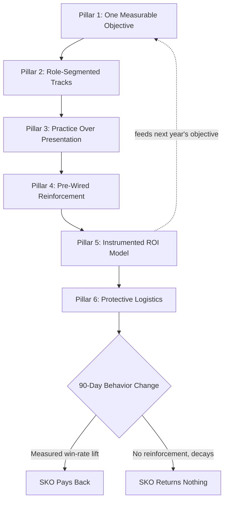

### Direct Answer

A high-ROI sales kickoff is built on six interlocking design pillars: a single measurable behavior-change objective, role-segmented content tracks, deliberate practice over passive presentation, a pre-wired reinforcement system, an instrumented ROI measurement model, and ruthless logistics that protect learning time. The kickoff is not an event — it is the launch milestone of a roughly 90-day behavior-change program, and SKOs that treat it as a celebration with slides routinely return nothing while SKOs designed against these six pillars compress ramp, lift attainment, and pay back inside two quarters.

**TLDR**
- **Treat the SKO as a program, not a party.** The event is one day inside a roughly 90-day arc that begins with pre-work and ends with measured behavior change; the kickoff itself is the launch ceremony, not the deliverable.
- **The six pillars are:** (1) one measurable objective, (2) role-segmented tracks, (3) practice over presentation, (4) pre-wired reinforcement, (5) an instrumented ROI model, and (6) protective logistics.
- **Practice beats presentation.** Brinkerhoff's research shows only about 15% of training transfers to the job by default; deliberate practice plus manager reinforcement pushes transfer materially higher.
- **Reinforcement must exist before the SKO ends.** If the post-SKO cadence — manager 1:1s, call reviews, microlearning — is not on calendars before anyone flies home, behavior change collapses inside three weeks.
- **Measure leading indicators, not smile sheets.** Tie the SKO to win rate, ramp time, methodology adoption in the CRM, and forecast accuracy — not satisfaction scores.
- **Budget the event against pipeline math.** A typical mid-market SKO costs $2,000–$4,000 per rep all-in; a one-point win-rate lift on a 200-rep org dwarfs that cost, but only if the design earns it.

The six pillars are not a menu. They are a chain, and an SKO scored against the best five of six still decays to a three-week sugar high. What follows is each pillar in operating detail, the way the six interlock, an honest counter-case for when a full SKO is the wrong instrument, and a build sequence that turns the model into a calendar.

---

## Banner: Pillar 1 — One Measurable Behavior-Change Objective

## Pillar 1 — One Measurable Behavior-Change Objective

The single most common reason sales kickoffs return nothing is that they are designed to cover content rather than change behavior. A kickoff with eleven "priorities" has zero priorities. The first pillar is the discipline to name **one** behavior you want every rep doing differently 90 days after the event, expressed so concretely that a frontline manager could audit it on a call recording.

### 1.1 Why "awareness" is not an objective

"Make the team aware of the new ICP" is not an objective — awareness is unmeasurable and unaccountable. Contrast that with: "Every AE runs the three-question champion-test in discovery, and 70% of stage-2 opportunities have a documented champion in the CRM by day 90." The second version is auditable, time-bound, and owns a metric. Roger Connors and Tom Smith's work in *The Oz Principle* on accountability cultures makes the same point in different language: results require a named, observable behavior tied to an owner, not a diffuse aspiration.

The unaccountable-objective failure has a tell. When the post-mortem on a low-return SKO begins, you will hear "the team really got energized" and "feedback was strong" — Level-1 reaction language — because no one designed an objective specific enough to measure against. The remedy is a forcing question asked in the design room twelve weeks out: *what, exactly, will a manager see on a Gong call in March that they did not see in December?* If the answer is a behavior, the objective is real. If the answer is a feeling, the SKO has no objective yet.

### 1.2 The objective backward-design loop

Robert Brinkerhoff, the evaluation researcher behind the High Impact Learning model and the *Success Case Method*, frames training design as backward chaining from a business result. The loop runs: business result → behavior that produces it → skill that enables the behavior → content that builds the skill. Most SKOs are designed forward — "we have a Gong slot, what do we put in it?" — and the result is content with no line of sight to a number.

| Layer | Forward-designed SKO (broken) | Backward-designed SKO (Pillar 1) |
|---|---|---|
| Business result | Implied, never stated | Win rate +3 pts on competitive deals |
| Behavior | Whatever the sessions cover | Reps run the displacement battlecard in every competitive deal |
| Skill | Assumed | Objection-handling against the named incumbent |
| Content | Drives the agenda | Serves the skill, gets cut if it does not |
| Measurement | Smile sheet | Battlecard usage logged in CRM + win-rate delta |

Backward design also forces an uncomfortable but useful conversation with sales leadership: if the team picks "expand into the enterprise segment" as the objective, the design exposes that the real behavior is multithreading and mutual action plans, the real skill is executive-level discovery, and the real content is two days of practice — not a keynote. Leaders frequently want the result without funding the behavior change that produces it. Pillar 1 is where that gap surfaces, and surfacing it twelve weeks out is far cheaper than discovering it in the Level-4 measurement six months later.

### 1.3 The one-objective test

Force the question: if every session at the SKO succeeded perfectly except this one, would the kickoff still be a success? Run that test against every agenda block. Anything that survives as "yes, still a success" is enrichment and belongs in a breakout, a pre-read, or the cutting-room floor. What remains — usually one, occasionally two threads — is the actual objective. Force Management's "Command of the Message" rollouts and Winning by Design's "SPICED" enablement engagements both lean hard on this single-thread discipline; the methodology is downstream of a focused objective, never a substitute for one. The frequency and forecast-cycle question of how often to even hold an SKO is its own decision (q463), and the answer to that depends entirely on whether you have a sharp objective worth assembling the team for.

### 1.4 The objective and the tool roadmap

A subtle Pillar-1 trap is letting a vendor roadmap masquerade as an objective. When Salesforce (NYSE: CRM) ships a new Agentforce capability, or HubSpot (NYSE: HUBS) rolls Breeze AI into the Sales Hub, the temptation is to make "adopt the new AI feature" the SKO objective. That is a tooling rollout, not a behavior-change objective. The disciplined version names the *selling behavior* the tool is supposed to enable — "reps prep every discovery call using the AI research summary, so call-one questions reach decision-criteria depth" — and treats the tool as a means. The same applies to Gong or Microsoft (NASDAQ: MSFT) Copilot for Sales: the platform is infrastructure; the objective is what reps do differently inside it.

| Objective phrased as... | Problem | Re-phrased to a behavior |
|---|---|---|
| "Adopt the new AI tool" | Tooling rollout, not behavior | "Reps prep every call with the AI brief" |
| "Improve discovery" | Unmeasurable | "70% of stage-2 deals have a documented champion" |
| "Get aligned on strategy" | A feeling, not an action | "Reps lead with the new value narrative in call one" |
| "Hit the number" | A result, not a behavior | The behavior that produces the number, named |

### 1.5 One objective, communicated relentlessly

Naming one objective is half the work; the other half is communicating it so relentlessly that every rep can recite it. A behavior-change objective that lives only in the enablement team's design doc changes nothing. The objective should appear in the pre-work, in the opening keynote, as the framing of every skill track, on the certification-gate rubric, in the first manager 1:1 after the event, and in the day-90 readout. Repetition is not redundancy here — it is how a single message survives the noise of a multi-day event. The test is simple: stop a random rep in the hallway on day two and ask, "what's the one thing this kickoff is about?" If the answer is crisp and matches the design doc, Pillar 1 is communicated. If the answer is a shrug or a list, the objective exists on paper but not in the room. Force Management and Winning by Design both build their methodology rollouts around exactly this kind of single, repeated, memorable framing — the discipline is borrowed from how good methodologies are taught, because an SKO objective is, in effect, a one-event methodology rollout.

---

## Banner: Pillar 2 — Role-Segmented Content Tracks

## Pillar 2 — Role-Segmented Content Tracks

The second pillar rejects the single-track plenary SKO where AEs, SDRs, sales managers, and customer success all sit through the same content. A 22-year-old SDR cold-calling into a target list and a senior enterprise AE managing a $1.4M renewal do not have the same skill gap, and an SKO that pretends they do under-serves both.

### 2.1 The role-gap map

Before building tracks, map the dominant skill gap by role. This is not guesswork — it comes from call-review data, win-loss interviews, and ramp analysis.

| Role | Dominant skill gap | SKO track focus | Primary practice format |
|---|---|---|---|
| SDR / BDR | Personalization at volume, multithreading | Outbound messaging, AI-tool fluency | Live call blocks, message teardowns |
| Mid-market AE | Discovery depth, champion-building | Methodology drills, MEDDPICC scoring | Recorded role-play, deal clinics |
| Enterprise AE | Multithreading, executive presence, mutual action plans | Negotiation, exec alignment | Live deal war-rooms |
| Sales manager | Coaching to the methodology, forecast hygiene | Coaching frameworks, pipeline-review craft | Coaching role-play, scorecard calibration |
| Customer Success | Expansion discovery, renewal risk reads | Land-and-expand motions | Renewal simulations |

This role-gap map is the same input that drives the deeper question of how to design distinct content for AEs vs. SDRs vs. managers (q464) — Pillar 2 is the structural commitment, and that companion design work is the execution detail. The map should be built from data, not intuition: pull six months of call recordings from Gong or the Salesforce-acquired conversation tools, score them against the methodology rubric, and let the lowest-scoring competency by role define that role's track. An enablement leader who guesses the gap will design the wrong track; one who reads the data will not.

### 2.2 Common-core plus tracks

The answer is not fully separate SKOs — shared culture and a shared methodology language still matter. The proven structure is a **common core** (company strategy, the year's single objective, the methodology vocabulary everyone must share, and recognition) of roughly 30–40% of agenda time, with the remaining 60–70% in role-segmented tracks. Mike Kunkle, who built the Sales Effectiveness Straight Talk framework and writes extensively on systematic sales enablement, calls this the difference between *informing* the team and *equipping* the team — informing can be plenary, equipping must be segmented.

| Agenda segment | Plenary or track? | Share of time | Why |
|---|---|---|---|
| Company strategy & the year's objective | Plenary | 10–15% | Everyone must hear the same story |
| Methodology vocabulary | Plenary | 5–10% | Shared language is a culture asset |
| Recognition & culture | Plenary | 10% | Belonging is a retention lever |
| Role skill practice | Track | 50–60% | Skill gaps differ by role |
| Certification gate | Track | 5–10% | Proof of competence is role-specific |

### 2.3 The manager track is non-negotiable

The most under-built track is the sales-manager track, and it is the highest-leverage one. Frontline managers are the transfer mechanism: research consistently shows that manager reinforcement is the single largest determinant of whether training sticks. An SKO that trains 200 reps in a new methodology but spends zero dedicated time teaching the 25 managers how to *coach* that methodology has built a system with no enforcement layer. The manager track must run *parallel* sessions: while AEs practice discovery, managers practice coaching discovery against the same scenario, so on day one back home the manager can run the play.

| SKO design choice | Transfer outcome |
|---|---|
| Reps trained, managers absent from skill content | Behavior decays in ~3 weeks; managers cannot coach what they did not learn |
| Reps and managers trained together, same room | Managers learn the skill but not how to coach it |
| Reps in skill track, managers in parallel coaching track | Managers leave able to reinforce; transfer rate roughly doubles |

The manager track also has to teach the *instrumentation* of coaching, not just the encouragement of it. A manager who leaves the SKO knowing the new methodology but not knowing how to pull a call from Gong, score it against the rubric, and run a 20-minute coaching conversation off that score will default to "how's the pipeline looking?" — the conversation that feels like coaching and changes nothing. The manager track is where coaching becomes a repeatable, instrumented motion rather than a personality trait.

### 2.4 Segmenting by tenure as well as role

Role is the primary segmentation axis, but tenure is a real secondary one. A rep eight months into ramp and a rep with six years of tenure both carry the "AE" label and have very different needs: the ramping rep needs fundamentals and reps-on-the-board confidence; the veteran needs advanced motions and a reason not to tune out. The cleanest solution inside a role track is leveled breakouts — a "core" and an "advanced" version of the same practice block — so neither group is bored or drowning. New-hire integration is a deep enough problem to warrant its own design treatment (q467); Pillar 2's job is simply to refuse the one-size-fits-all room.

### 2.5 The vendor-session trap

A predictable Pillar-2 failure is letting partners and vendors colonize the agenda. SKOs are an attractive audience, and the sponsoring vendors behind the company's stack — whether the CRM partner, the conversation-intelligence platform, or a services firm — will offer to "present" in exchange for sponsorship dollars. A vendor pitch is almost never role-segmented practice; it is a plenary broadcast aimed at no specific skill gap. The discipline is to confine vendor content to an optional expo or a clearly labeled "tools" breakout, never the skill tracks. The agenda time a rep spends watching a vendor demo is agenda time not spent practicing the year's objective, and the opportunity cost is real. A useful rule: a vendor earns a track slot only if it runs *hands-on practice* on a tool reps will actually use against the objective — and even then it is enablement, not the vendor, that owns the rubric.

| Vendor request | Where it belongs | Where it does not belong |
|---|---|---|
| "Let us keynote our roadmap" | Optional expo booth | The main stage |
| "We'll run a product demo session" | Labeled tools breakout | A skill track |
| "Hands-on lab on the tool reps use for the objective" | A track slot, enablement-owned rubric | — |
| "Sponsor the awards dinner" | Fine — hospitality layer | Any learning block |

---

## Banner: Pillar 3 — Practice Over Presentation

## Pillar 3 — Practice Over Presentation

The third pillar is the hardest to sell to executives and the most important: a high-ROI SKO is mostly people *doing* the skill, not watching slides about the skill. The default SKO is 80% presentation and 20% practice. A high-ROI SKO inverts that ratio toward 50/50 or better in the skill tracks.

### 3.1 The transfer problem

Robert Brinkerhoff's research on training transfer found that, left to default conditions, only about 15% of what is taught in a training event actually shows up as changed behavior on the job — roughly 70% try and fail or never try, and 15% were already doing it. Anders Ericsson's body of work on deliberate practice (popularized in *Peak*) explains why: skill is built through effortful, feedback-rich repetition against the edge of current ability, not through exposure. A slide about objection handling builds zero objection-handling skill. Forty minutes of recorded role-play with structured feedback builds measurable skill.

The executive resistance to practice is predictable and worth pre-empting. Leaders look at an agenda that is half role-play and worry it looks unserious next to a keynote-heavy competitor's SKO. The counter-argument is the transfer math: a keynote-heavy SKO is optimizing for the 15% default transfer rate; a practice-heavy SKO is the only design that moves it. The agenda that *looks* most impressive to a CFO walking by — packed with speakers — is the one most likely to return nothing.

### 3.2 The practice formats that work

| Format | What it builds | Time block | Feedback mechanism |
|---|---|---|---|
| Recorded role-play | Discovery, objection handling, demo narration | 45–90 min | Peer + manager scorecard, optional AI scoring |
| Deal clinic / war-room | Real-deal strategy on live pipeline | 60 min | Group teardown of an actual opportunity |
| Live call block (SDR) | Cold outreach under observation | 60–90 min | Manager listens live, debriefs immediately |
| Message teardown | Written outreach craft | 30 min | Line-by-line peer edit |
| Certification gate | Proof of competence before going home | 30 min | Pass/fail against a rubric |

Each format has a non-negotiable design rule. Recorded role-play must actually be recorded — reps watching their own discovery call back is where the learning lands, and platforms from Allego, Mindtickle, and Salesforce-acquired enablement tooling make capture trivial. Deal clinics must use *real* live pipeline, not invented scenarios, because the value is that the rep walks out with a moved deal, not a hypothetical. Live SDR call blocks must have a manager listening in real time; a call block with no observation is just a call block.

### 3.3 The certification gate

The strongest Pillar-3 mechanism is a certification gate: before a rep leaves the SKO, they must demonstrate the target behavior to a passing standard — deliver the new pitch, pass a methodology quiz, or run a clean role-play scored against a rubric. AI conversation-simulation tools — Highspot, Mindtickle, Allego, and the readiness modules inside the major CRM platforms — now make this scalable; a rep can run a simulated discovery call, get scored on champion identification and pain quantification, and re-attempt until they pass. The gate converts the SKO from "we presented it" to "they can do it" — and it produces a clean baseline data point for Pillar 5's measurement model. The SDR-vs-AE-vs-manager content split (q464) determines what each role's certification gate actually tests.

A well-designed gate is pass/fail with a real bar, not a participation checkbox. If 100% of reps pass on the first attempt, the bar is too low and the gate measures nothing. A healthy first-attempt pass rate sits somewhere in the 60–80% range, with a same-day re-attempt path so no one leaves uncertified. The gate also creates accountability upward: a manager whose track shows a 40% first-attempt pass rate has a coaching problem to own, and that signal is more useful than any survey.

### 3.4 The role of AI simulation

AI conversation simulation has changed the economics of Pillar 3. Before it, deliberate practice was capacity-bound: you needed a human role-play partner and a human scorer for every rep, which capped reps-per-day. AI simulation removes the cap — a rep can run twenty discovery simulations the week before the SKO, each scored against the methodology rubric, and arrive already past the fumbling stage. ZoomInfo (NASDAQ: ZI), Gong, and the enablement platforms all now ship some version of this. The design implication is that the SKO itself can move "up the stack": instead of spending event time on basic reps, the event can spend it on the harder, human-judgment work — handling a curveball, reading a room — that simulation does not yet do well. AI simulation is a Pillar-3 multiplier, not a Pillar-3 replacement.

### 3.5 Designing the practice scenario

The quality of a practice block is set by the quality of its scenario. A vague "do a discovery call" prompt produces vague practice. A high-ROI scenario is specific, realistic, and built from real deal data: a named persona with a real title, a real industry, a real competing incumbent, a real budget constraint, and a real objection the team actually hears. Enablement should build three or four such scenarios from recent won and lost deals — Gong call libraries and win-loss interview transcripts are the raw material — and tune the difficulty to the role track. The scenario should also carry a *scorecard*: the three to five specific behaviors a peer or manager is watching for, so feedback is concrete ("you never quantified the cost of inaction") rather than vague ("good energy"). A practice block with a sharp scenario and a sharp scorecard is deliberate practice; one without either is just talking.

### 3.6 The practice-to-presentation ratio by track

Not every track carries the same ratio. The skill tracks should run 50–60% practice; the common core, by nature, is more presentation because strategy and culture are communicated, not drilled. The mistake is letting the common core's presentation-heavy norm leak into the skill tracks. A simple design audit: tally the agenda minutes for each track and compute the practice share. If a skill track lands below 40% practice, it has been captured by presentation and will under-transfer. Publishing that ratio in the design review forces the conversation before the agenda is locked, when content can still be cut.

---

## Banner: Pillar 4 — Pre-Wired Reinforcement System

## Pillar 4 — Pre-Wired Reinforcement System

The fourth pillar is the one that separates SKOs that move numbers from SKOs that produce a three-week sugar high. Behavior change does not survive on event energy. It survives on a reinforcement system — and that system must be fully built, scheduled, and assigned **before the SKO ends**.

### 4.1 The forgetting curve and why energy fails

Hermann Ebbinghaus's forgetting-curve research established that, without reinforcement, people lose a large majority of newly learned material within days. The post-SKO emotional high follows the same decay. Every sales leader has watched a team return from an inspiring kickoff, sustain new behavior for two to three weeks, and then silently revert to the comfortable old motion. The cause is never insufficient inspiration at the event — it is the absence of a system that makes the new behavior easier to keep doing than to abandon. The full architecture of that post-SKO system is a deep topic in its own right (q461), but Pillar 4 is the non-negotiable commitment that the system exists before anyone leaves.

The reversion is not a willpower failure. It is a systems outcome. The old motion is the path of least resistance — it is already wired into the rep's calendar, their CRM habits, their manager's questions. The new motion has none of that scaffolding unless the SKO builds it. Asking reps to "stay disciplined" about a new behavior with no surrounding system is asking them to win a fight against the entire shape of their week.

### 4.2 The reinforcement stack

| Layer | Mechanism | Cadence | Owner |
|---|---|---|---|
| Manager 1:1 | Coaching against the SKO behavior, using a scorecard | Weekly | Frontline manager |
| Call review | Gong/Chorus call tagged and scored for the target behavior | Weekly | Manager + rep |
| Microlearning | 5–10 min reinforcement module on one sub-skill | Weekly for 8 weeks | Enablement |
| Peer practice | Role-play pods, 2–3 reps | Bi-weekly | Pod lead |
| Manager calibration | Managers score the same call, compare, align | Monthly | Enablement + sales leadership |
| Methodology audit | CRM field audit: is the methodology actually being used? | Monthly | RevOps |

### 4.3 The "calendars before wheels-up" rule

The operating rule for Pillar 4 is blunt: if the post-SKO reinforcement cadence is not on managers' and reps' calendars before they leave the venue, it will not happen. The reinforcement system must be a designed SKO deliverable — a session at the kickoff where managers literally schedule the first four weeks of coaching 1:1s and the enablement team confirms the microlearning drip is loaded. The weekly pipeline review is the natural home for much of this reinforcement, and running that review as a real forecast-accuracy instrument rather than theatre (q9519) is what keeps the SKO behavior visible week over week. Manager-led reinforcement is also where new compensation messaging from the SKO (q466) gets operationalized without derailing momentum.

The "calendars before wheels-up" session is unglamorous and routinely cut for time — and cutting it is the single most expensive mistake in SKO design. A thirty-minute working block where every manager opens their calendar and books four weeks of coaching 1:1s, and enablement confirms the platform drip is scheduled, is what converts intention into infrastructure. An SKO that ends with a closing keynote and a party but no calendar block has, in effect, decided not to reinforce.

### 4.4 Microlearning beats the binder

The pre-AI default was a 60-page playbook binder that no one opened. Microlearning — short, single-skill modules delivered weekly through the enablement platform — respects the forgetting curve by re-touching the skill before it fully decays. Josh Bersin's research on corporate learning has documented the shift from event-based training to "learning in the flow of work"; the SKO is the launch event, but the microlearning drip is what actually compounds it.

The design discipline for microlearning is one skill per module. A 10-minute module covering "advanced discovery" teaches nothing; a 6-minute module on "the one question that quantifies pain" can move a behavior. The drip should be sequenced to match the reinforcement arc — week one re-touches the first skill the SKO taught, week two the second, and so on — so the microlearning, the manager 1:1s, and the call reviews are all reinforcing the same behavior at the same time rather than pulling in different directions.

### 4.5 The reinforcement-versus-event budget split

A revealing diagnostic is the ratio of budget spent on the event versus on the 90 days after it. Most organizations spend 95% on the event — venue, travel, production — and 5% on reinforcement. A high-ROI design moves real budget and headcount into the after: an enablement person's time to run the microlearning drip and calibration sessions, manager time protected for coaching, RevOps time for the methodology audit. The event is the spark; the reinforcement budget is the fuel. An SKO that spends six figures on the spark and nothing on the fuel has pre-decided its own decay.

### 4.6 Manager accountability for reinforcement

Reinforcement does not run on goodwill — it runs on accountability. The most common Pillar-4 collapse is not a missing system but an unenforced one: the coaching 1:1s are on calendars, the microlearning is loaded, and three weeks later half the managers have quietly let the cadence slide because nothing happens when they do. The fix is to make reinforcement a measured manager responsibility. A simple manager scorecard — call reviews completed per rep, coaching 1:1s held, methodology-field audit pass rate on their team — turns reinforcement from optional to owned. Sales leadership reviews that scorecard monthly alongside the pipeline. When a manager knows their reinforcement activity is visible to their VP, the cadence holds; when it is invisible, it decays at the same rate as the rep behavior it was supposed to protect. The platforms make this measurable: Gong and the major CRM enablement modules can report coaching activity per manager without manual tracking.

### 4.7 Reinforcement for a distributed team

A distributed or fully remote sales org cannot rely on the hallway and the bullpen to carry reinforcement. The system has to be deliberately engineered for distance: virtual role-play pods on a fixed cadence, asynchronous call-review threads where managers leave timestamped comments on a Gong recording, and microlearning delivered in the flow of the rep's actual workday rather than in a classroom. The reinforcement stack does not change — manager 1:1s, call reviews, microlearning, peer practice, calibration, audit — but every layer must be designed to work over video and async tooling. Distributed teams that copy an in-office reinforcement plan find it quietly fails; distributed teams that engineer for distance from the start can reinforce as durably as any co-located org.

| Budget allocation | Event share | Reinforcement share | Typical outcome |
|---|---|---|---|
| Celebration SKO | 98% | 2% | Three-week spike, full reversion |
| Event-designed SKO | 90% | 10% | Partial transfer, fades by Q2 |
| Program-designed SKO | 75–80% | 20–25% | Measurable, durable behavior change |

---

## Banner: Pillar 5 — Instrumented ROI Measurement Model

## Pillar 5 — Instrumented ROI Measurement Model

The fifth pillar is measurement, and it must be designed *before* the SKO, not bolted on after. An SKO you cannot measure is an SKO you cannot defend, improve, or get funded again. The dominant failure mode is measuring satisfaction ("Did you enjoy the kickoff?") instead of behavior and business outcomes.

### 5.1 The Kirkpatrick levels applied to an SKO

Donald Kirkpatrick's four-level evaluation model — refined by his son James Kirkpatrick and Wendy Kirkpatrick in *Kirkpatrick's Four Levels of Training Evaluation* — maps cleanly onto SKO measurement.

| Level | What it measures | SKO instrument | Honest weight |
|---|---|---|---|
| 1 — Reaction | Did reps find it useful? | Post-event survey | Low — necessary, not sufficient |
| 2 — Learning | Did reps acquire the skill? | Certification gate score, methodology quiz | Medium — proves the event worked |
| 3 — Behavior | Are reps doing it on the job? | CRM methodology-field audit, call-review scores | High — proves transfer happened |
| 4 — Results | Did the number move? | Win rate, ramp time, ACV, cycle length | Highest — proves business impact |

Most SKOs report only Level 1. A high-ROI SKO instruments Levels 3 and 4, because those are the only levels a CFO recognizes as ROI. The discipline of tying the kickoff to forecast-anchored metrics is itself a design problem worth its own treatment (q462).

The Kirkpatrick model is most useful as a *design* tool, not just an evaluation tool. James and Wendy Kirkpatrick's "New World" refinement makes the point explicitly: you design from Level 4 backward — name the result, then the behavior, then the learning, then the reaction you need to enable all of it. That is the same backward chain as Pillar 1, which is why Pillars 1 and 5 are designed together, twelve and ten weeks out respectively, before any agenda block exists.

### 5.2 The leading-indicator dashboard

Levels 3 and 4 take a quarter or two to fully resolve. To avoid flying blind, instrument leading indicators that show up within weeks:

| Leading indicator | Source | Reads within | What it tells you |
|---|---|---|---|
| Methodology field completion | CRM | 2–3 weeks | Are reps using the framework at all? |
| Battlecard / tool usage | Enablement platform analytics | 2 weeks | Is the new asset being touched? |
| Call-review behavior score | Gong/Chorus | 3–4 weeks | Is the skill showing up in conversations? |
| Discovery-call rate | CRM activity | 3 weeks | Did the activity behavior change? |
| Stage-2 conversion | CRM funnel | 6–8 weeks | Is the behavior moving deals? |

The leading-indicator dashboard is also the early-warning system. If the methodology-field completion rate is flat at three weeks, the SKO is already decaying and there is still time to intervene — a manager calibration session, an extra microlearning push — before the quarter is lost. An organization that measures only Level 4 finds out it failed six months later, when nothing can be done. Leading indicators turn measurement from an autopsy into a steering wheel.

### 5.3 The control-group method

The cleanest ROI proof is a control comparison. If the SKO rolls out a new motion, instrument a cohort that adopts it fast versus a cohort that lags, and compare win rate and cycle length. Brinkerhoff's Success Case Method formalizes this: rather than averaging everyone, find the reps for whom the training clearly worked, document exactly what they did differently and what it produced, and find the reps for whom it did not — the gap between those two groups, multiplied across the org, is the credible ROI estimate. It is more honest than a blended average and far more persuasive to a finance partner who has seen too many inflated training-ROI decks.

The Success Case Method also produces something a spreadsheet cannot: a story. "Here is the rep who adopted the new discovery motion fully, here is the $600K deal she would not have qualified under the old playbook, and here is the call recording that proves it" is a far more durable argument for next year's SKO budget than a blended win-rate delta. Documented success cases are the asset that gets the program funded again.

### 5.4 The payback math

| Cost line (200-rep mid-market SKO) | Estimate |
|---|---|
| Venue, travel, F&B (in-person) | $1,800/rep |
| Content, speakers, production | $250/rep |
| Opportunity cost (2 selling days) | ~$900/rep |
| All-in per-rep cost | ~$2,950 |
| Total event cost | ~$590,000 |

Against that, a single point of win-rate improvement on a 200-rep org running, say, $40M in influenced pipeline is worth several multiples of the event cost. The math almost always favors the SKO — but *only if Pillars 1–4 earn the win-rate point*. A celebration SKO costs the same $590K and returns the gap. The payback calculation is also the argument that wins the budget conversation: presented as "a 1-point win-rate lift is worth roughly $X, the event costs $590K, the breakeven is well under one point," it reframes the SKO from a cost center to an investment with a hurdle rate — and that reframe is what survives a CFO's scrutiny.

### 5.5 What not to measure

Pillar 5 is as much about discipline in *not* measuring as in measuring. Vanity metrics — session attendance, app downloads, social-post counts, raw survey enjoyment scores — are easy to collect and feel like data, but none of them predict behavior change. Worse, reporting them crowds out the metrics that matter and trains leadership to expect smile-sheet reporting. A measurement model that leads with Level 3 and 4, treats Level 2 as proof the event worked, and reports Level 1 only as a single line, keeps the organization honest about what an SKO is for.

### 5.6 Attribution honesty

A credible measurement model also resists over-claiming. A win-rate lift in the two quarters after an SKO has many possible causes — a new product release, a softer competitive field, a strong macro quarter, a comp-plan change — and the SKO is only one of them. Pillar 5's honesty discipline is to state attribution carefully: the control-group method (5.3) is the cleanest defense, because comparing fast-adopters to lag-adopters within the same macro environment isolates the training effect. Where a control group is impractical, the honest framing is "the SKO is a contributing factor, and here are the leading indicators that connect it to the result" rather than "the SKO drove the number." A RevOps leader who over-claims SKO ROI once will not be believed the next time — and the next time is the budget conversation that matters.

### 5.7 The measurement owner

Measurement fails when no one owns it. The events team owns logistics, enablement owns content, sales leadership owns the objective — and measurement falls into the gap unless it is explicitly assigned, almost always to RevOps. RevOps owns the CRM where Level-3 behavior signals live, owns the funnel where Level-4 results resolve, and is structurally neutral about whether the SKO "worked." Naming a RevOps owner for the measurement model at the 10-weeks-out mark, with a defined dashboard and a day-90 readout on the calendar, is what converts Pillar 5 from an intention into an instrument. Without a named owner, the measurement quietly becomes the post-event survey, and the SKO drops back to Level 1.

---

## Banner: Pillar 6 — Protective Logistics

## Pillar 6 — Protective Logistics

The sixth pillar is logistics — not as event-planning trivia, but as the discipline of protecting learning time and attention. Logistics is where good content design quietly dies: a brilliant role-play track scheduled for the post-lunch graveyard slot in a windowless ballroom returns a fraction of its potential.

### 6.1 The energy-and-attention budget

Treat attention as a fixed budget that depletes through the day. High-cognitive-load practice work belongs in morning slots. The post-lunch slot (roughly 1:00–2:30 PM) is the lowest-energy window and should hold interactive or movement-based content, never dense skill instruction. Recognition and culture content belong at the end of the day when reps want to celebrate, not at 9 AM when they want to learn.

| Slot | Energy level | Best content type | Worst content type |
|---|---|---|---|
| 8:30–10:00 AM | High | Strategy, the year's objective | Recognition |
| 10:15 AM–12:00 PM | High | Skill practice, role-play | Vendor pitches |
| 1:00–2:30 PM | Low (post-lunch dip) | Interactive, deal clinics, movement | Dense lecture |
| 2:45–4:30 PM | Medium | Breakouts, certification gates | New heavy concepts |
| 4:45–6:00 PM | Social | Recognition, culture, awards | Skill instruction |

Cal Newport's work in *Deep Work* on attention as a finite, depletable resource applies directly: a rep in hour seven of a packed day has a fraction of the cognitive capacity they had in hour one. An agenda that schedules its most important practice block last because "that's what was left" is, in effect, scheduling its objective to fail.

### 6.2 The in-person vs. virtual decision

The format choice is a logistics-and-cost decision with real learning consequences. In-person maximizes practice quality, peer bonding, and certification rigor but costs roughly $2,000–$4,000 per rep. Virtual cuts cost by 70–85% but bleeds engagement unless ruthlessly designed for it — shorter days, smaller breakout pods, cameras-on practice. Hybrid attempts often deliver the worst of both. The full structural trade-off between in-person and virtual formats is its own design question (q460), and the venue/location choice that maximizes attendance and post-event deal impact is another (q465). Pillar 6's job is to make the format choice deliberately, against the objective, not by default or by budget reflex alone.

| Format | Per-rep cost | Practice quality | Best for |
|---|---|---|---|
| In-person | $2,000–$4,000 | Highest | Methodology launches, culture resets |
| Virtual | $300–$800 | Medium, if designed for it | Tactical updates, distributed teams |
| Hybrid | Variable | Often lowest | Rarely the right answer |

### 6.3 Logistics that protect content

- **No-laptops-during-practice rule.** Reps half-watching email during role-play learn nothing; enforce it as a design choice.
- **Breakout room sizing.** Practice pods of 4–6; larger pods reduce per-rep reps and feedback.
- **Pre-work that gates entry.** Reps complete a pre-read or baseline assessment before arrival; this both raises the floor and produces a Level-2 baseline for Pillar 5.
- **New-hire and ramp integration.** Reps still ramping need a modified track so they are not drowning in advanced content — a real design problem covered separately (q467).
- **Buffer time.** Over-packed agendas with zero white space guarantee that practice sessions get compressed first; protect them with explicit buffers.

### 6.4 Why logistics is a pillar, not a footnote

It is tempting to delegate logistics to an events team and call it execution. That is a mistake. Every logistics choice — room layout, slot timing, pod size, the laptop rule — is a decision about whether learning transfers or evaporates. Pillar 6 is the recognition that a kickoff is an *instrument*, and a precision instrument assembled carelessly does not measure anything.

There is a clean division of labor that makes Pillar 6 work: an events team owns the *hospitality* layer — flights, rooms, catering, A/V — and the enablement leader owns the *learning* layer — slot sequencing against the energy budget, pod sizing, the laptop rule, buffer placement. Problems appear when the events team is handed the agenda and optimizes it for flow and impressiveness rather than transfer. The enablement leader must hold the pen on sequencing, because sequencing is a learning-design decision wearing a logistics costume.

### 6.5 Room design for practice

Physical room design is an under-considered Pillar-6 lever. A skill track held in a theater-style ballroom — fixed rows facing a stage — signals "watch," and reps will watch. The same content in a room with round tables of five or six, movable chairs, and breakout corners signals "do," and reps will do. The room shape is a behavioral prompt. Practice-heavy tracks should be assigned cabaret or pod-style rooms; only the plenary common-core sessions belong in theater seating. When venue constraints force a theater room on a practice block, the design must actively fight the room — push reps into standing role-play, use the aisles, break to corridors — rather than accept it. The cost difference between a theater room and a pod-configured room is trivial; the transfer difference is not.

### 6.6 The pre-work that earns its place

Pre-work is the quiet multiplier of Pillar 6, and most SKOs waste it. Assigning a 40-page deck as pre-read produces nothing — no one reads it, and there is no way to know. Pre-work earns its place when it does real work: a baseline skills assessment (which becomes the Level-2 reference point for Pillar 5), a short methodology primer with a quiz gate, or a set of AI discovery simulations each rep must complete and pass before arrival. Good pre-work raises the floor — every rep walks in past the basics — and frees event time for the harder practice that needs the room. The completion of pre-work should be tracked and visible to managers; pre-work with no accountability is a suggestion, and suggestions do not move a floor.

---

## Banner: How the Six Pillars Interlock

## How the Six Pillars Interlock

The six pillars are not a checklist of independent items — they are a chain, and the chain is only as strong as its weakest link. A perfect objective (Pillar 1) with no reinforcement (Pillar 4) decays in three weeks. Excellent practice (Pillar 3) with no measurement (Pillar 5) cannot be defended at budget time. Role-segmented content (Pillar 2) delivered in a windowless graveyard slot (Pillar 6 failure) under-returns.

The diagram's dashed loop is the point: Pillar 5's measurement output becomes the input to next year's Pillar 1. A well-instrumented SKO tells you exactly which behavior moved and which did not, which makes the following year's objective sharper. SKO design compounds — or it resets to zero every January.

### The dependency logic

Each pillar depends on the one before it and enables the one after. The objective (1) defines which role gaps matter, so it must precede track design (2). Tracks define what gets practiced, so they precede practice design (3). Practice produces the skill that reinforcement (4) sustains. Reinforcement produces the behavior that measurement (5) captures. Measurement output and logistics (6) constraints together shape next year's objective. Skip a link and the chain breaks at a predictable place: skip Pillar 4 and the failure shows up at week three; skip Pillar 5 and the failure shows up at budget time; skip Pillar 1 and every other pillar is well-built work pointed at nothing.

### The maturity ladder

| Maturity stage | What the SKO looks like | Typical return |
|---|---|---|
| Level 0 — Celebration | Slides, awards, motivational keynote, no objective | Negative — cost with no behavior change |
| Level 1 — Content dump | Lots of sessions, single track, no practice | Near zero — exposure without transfer |
| Level 2 — Event-designed | Good objective and practice, no reinforcement | Three-week spike, then decay |
| Level 3 — Program-designed | All six pillars, reinforcement pre-wired | Measurable lift, pays back in 1–2 quarters |
| Level 4 — Compounding | Level 3 + measurement feeds next year's design | Year-over-year improvement, defensible ROI |

Most organizations sit at Level 1 and believe they are at Level 3. The honest test is Pillar 5: if you cannot state, with CRM and call-review data, what behavior changed after last year's SKO, you are not at Level 3. The jump from Level 2 to Level 3 is almost always a Pillar-4 jump — the org already designs good objectives and good practice, and simply never pre-wires the reinforcement. The jump from Level 3 to Level 4 is a Pillar-5 jump — the org runs a good program but does not feed its measurement back into the next design cycle, so each SKO starts from scratch.

---

## Banner: Counter-Case — When the Six-Pillar SKO Is the Wrong Answer

## Counter-Case — When the Six-Pillar SKO Is the Wrong Answer

The six-pillar model is rigorous, and rigor has a cost. There are real situations where applying it fully is the wrong call, and a credible answer has to name them.

### When a full SKO is over-engineering

**Small teams.** For a sales org under roughly 15 reps, the heavy machinery — role-segmented tracks, certification gates, control-group measurement — is disproportionate. A focused two-day working session with one objective and direct manager coaching delivers most of the value at a fraction of the overhead. The pillars still apply *as principles* — one objective, practice over presentation, reinforcement, measurement — they simply do not need a 200-person production around them. A 12-rep startup running a Brinkerhoff-style control group is measurement theatre; a 12-rep startup with one sharp objective and a founder who coaches it weekly has the substance without the overhead.

**Mid-cycle pivots.** If the company changes ICP or pricing in June, waiting for January's SKO to address it is its own failure. The right instrument there is a targeted enablement sprint — a half-day virtual session plus a reinforcement drip — not a deferred mega-event. The SKO is an annual or semi-annual instrument; it should not become the only enablement vehicle. An organization that routes every change through the SKO is, in effect, telling its reps to adopt new behaviors at most twice a year, which is far slower than the market moves.

### When the SKO masks a deeper problem

The most important counter-case: **an SKO cannot fix a structural problem, and running one to paper over a structural problem actively wastes money and goodwill.** If reps are missing quota because territories are mis-balanced, the comp plan rewards the wrong behavior, the ICP is wrong, or the product genuinely does not win — no kickoff design changes that. A behavior-change program assumes the behavior, once changed, produces results. If the system around the behavior is broken, better discovery skills just generate better-qualified losses.

| Symptom | Looks like an SKO problem | Actual root cause | Right fix |
|---|---|---|---|
| Win rate flat after training | Reps did not learn the methodology | Pricing or product loses on merits | Pricing/positioning work, not an SKO |
| Attainment below 50% org-wide | Skill gap | Quotas set above realistic capacity | Quota and territory redesign |
| Ramp time creeping up | Onboarding content stale | Hiring profile drifted from ICP fit | Recruiting profile, not kickoff content |
| Forecast always wrong | Reps cannot qualify | Pipeline-review process is theatre | Fix the weekly review cadence (q9519) |

### When the objective is genuinely cultural, not behavioral

There is a narrower counter-case worth naming honestly. Some SKOs are run primarily to reset culture after a hard year, integrate two merged sales teams, or rebuild belonging in a distributed workforce — and culture is a legitimate goal. The six-pillar model still mostly applies, but Pillar 5's measurement shifts: the leading indicators become retention, voluntary-attrition rate, and engagement-survey movement rather than win rate. The mistake is pretending a culture SKO is a skill SKO, or vice versa — naming the real objective (Pillar 1) is what keeps the measurement honest.

### The honest test

Before committing six-figure SKO budget, run the diagnostic: *Is the gap between current and target performance a behavior gap, or a system gap?* If a representative rep, executing the current playbook flawlessly, would still miss — it is a system gap, and no kickoff fixes it. The six-pillar model is the right answer when, and only when, the constraint is genuinely that reps do not yet have, or do not yet reliably execute, a needed skill. Used correctly it is one of the highest-leverage instruments in revenue operations. Used as a substitute for fixing comp, territories, or product-market fit, it is an expensive distraction. The companion questions on kickoff structure round out the picture: format (q460), reinforcement architecture (q461), ROI measurement (q462), frequency (q463), role-based content (q464), location (q465), comp communication (q466), new-hire integration (q467), and the regional partner-strategy parallel (q452) for globally distributed teams.

---

## Practical Build Sequence

Putting the six pillars into a calendar, a high-ROI SKO is designed on roughly this timeline:

| Weeks before SKO | Pillar work |
|---|---|
| 12 weeks out | Pillar 1 — lock the single objective with sales leadership; back-design from a business result |
| 10 weeks out | Pillar 5 — design the measurement model and baseline instruments first, not last |
| 8 weeks out | Pillar 2 — build the role-gap map; design common core + tracks |
| 6 weeks out | Pillar 3 — design practice formats and the certification gate rubric |
| 5 weeks out | Pillar 4 — build the reinforcement stack; load microlearning; brief managers |
| 4 weeks out | Pillar 6 — finalize agenda against the energy budget; confirm logistics |
| 2 weeks out | Pre-work assigned; baseline assessment captured |
| SKO | Common core + tracks + practice + certification + reinforcement-scheduling session |
| Day 1 after | Reinforcement cadence already on calendars; leading-indicator dashboard live |
| Day 90 | Level 3/4 measurement resolves; results feed next year's Pillar 1 |

The sequence makes the dependency visible: measurement (Pillar 5) is designed early, not late, because the baseline data it needs is captured *before* the event. Reinforcement (Pillar 4) is built before the SKO, not after, because "calendars before wheels-up" is the rule that makes behavior change survive. The most common sequencing error is treating Pillars 5 and 4 as post-event cleanup; both must be fully designed before the agenda is finalized, because both have hard dependencies — a baseline captured and a reinforcement cadence scheduled — that can only be satisfied while reps are still in the room or before they arrive.

### A worked example

Consider a 200-rep mid-market SaaS company whose win rate on competitive deals has slipped. Pillar 1 names the objective: "lift competitive win rate 3 points by running the displacement battlecard in every competitive deal." Pillar 5 designs the measurement: battlecard usage logged in the CRM, competitive-deal win rate as the Level-4 metric, a baseline pulled from the prior two quarters. Pillar 2 builds tracks: AEs drill the displacement motion, managers drill coaching it, SDRs learn the competitive-trap questions for qualification. Pillar 3 makes the AE track 60% practice — recorded role-plays against the named incumbent, a certification gate where each AE must run a clean displacement conversation. Pillar 4 pre-wires reinforcement: weekly manager 1:1s scheduled at the event, an eight-week microlearning drip on competitive sub-skills, a monthly CRM audit of battlecard usage. Pillar 6 sequences the practice into morning slots and enforces the no-laptops rule. Ninety days later, the leading indicators read first — battlecard usage at 80%, call-review competitive scores up — and the win-rate delta resolves over the following quarter. That delta, multiplied across the org, is the documented ROI that funds next year's SKO.

---

## The Bottom Line

The core design pillars of a high-ROI sales kickoff are six: one measurable behavior-change objective, role-segmented content tracks, practice over presentation, a pre-wired reinforcement system, an instrumented ROI measurement model, and protective logistics. The unifying idea behind all six is a single reframe: **the kickoff is not an event — it is the launch milestone of a roughly 90-day behavior-change program.** Organizations that internalize that reframe design SKOs that compress ramp, lift win rate, and pay back inside two quarters. Organizations that treat the SKO as an annual celebration spend the same money and get a three-week sugar high. The pillars are the difference, and the discipline to apply all six — not the best five — is what separates an SKO that moves the forecast from one that just moves people to a ballroom.

---

**Citations and further reading**

1. Robert Brinkerhoff, *The Success Case Method: Find Out Quickly What's Working and What's Not* (Berrett-Koehler).
2. Robert Brinkerhoff, *Telling Training's Story: Evaluation Made Simple, Credible, and Effective* (Berrett-Koehler).
3. Robert Brinkerhoff, High Impact Learning model — training-transfer research (the ~15% default-transfer finding).
4. Donald Kirkpatrick & James Kirkpatrick, *Kirkpatrick's Four Levels of Training Evaluation* (ATD Press).
5. James Kirkpatrick & Wendy Kirkpatrick, the "New World Kirkpatrick Model" white papers.
6. Anders Ericsson & Robert Pool, *Peak: Secrets from the New Science of Expertise* (Houghton Mifflin Harcourt).
7. Anders Ericsson, "The Role of Deliberate Practice in the Acquisition of Expert Performance," *Psychological Review*.
8. Hermann Ebbinghaus, *Memory: A Contribution to Experimental Psychology* — the forgetting curve.
9. Mike Kunkle, *The Building Blocks of Sales Enablement* (ATD Press).
10. Mike Kunkle, Sales Effectiveness Straight Talk framework — systematic-enablement writing.
11. Josh Bersin, research on corporate learning and "learning in the flow of work."
12. Association for Talent Development (ATD), *State of Sales Training* research reports.
13. Brandon Hall Group, sales-training and enablement benchmarking studies.
14. CSO Insights / Korn Ferry, *Sales Enablement Study* — enablement ROI benchmarks.
15. Force Management, "Command of the Message" methodology rollout materials.
16. Winning by Design, the "SPICED" framework and revenue-architecture enablement content.
17. John McMahon, *The Qualified Sales Leader* — sales-leadership and methodology discipline.
18. Roger Connors & Tom Smith, *The Oz Principle* — accountability and named-behavior cultures.
19. Anthony Iannarino, *The Lost Art of Closing* — sales execution and commitment-gaining.
20. Jeb Blount, *Fanatical Prospecting* — activity discipline and reinforcement.
21. Trish Bertuzzi, *The Sales Development Playbook* — SDR role design and segmentation.
22. Aaron Ross & Marylou Tyler, *Predictable Revenue* — role specialization in sales orgs.
23. Matthew Dixon & Brent Adamson, *The Challenger Sale* (CEB / Gartner) — methodology and behavior change.
24. Highspot, sales-enablement platform research on content usage and certification analytics.
25. Mindtickle, sales-readiness research and AI conversation-simulation product documentation.
26. Allego, video role-play and reinforcement-learning platform research.
27. Gartner, sales-enablement and sales-training maturity research.
28. Sales Enablement Society / Sales Enablement Collective, practitioner enablement standards.
29. Pavilion (formerly Revenue Collective), revenue-leadership community SKO benchmarking discussions.
30. SaaStr, sales-kickoff and enablement operating-model content from Jason Lemkin and contributors.
31. Daniel Coyle, *The Talent Code* — deep practice and skill acquisition.
32. Cal Newport, *Deep Work* — attention as a finite, protectable resource (applied to agenda design).
33. Gong Labs, conversation-intelligence research on call behaviors and win-rate correlation.
