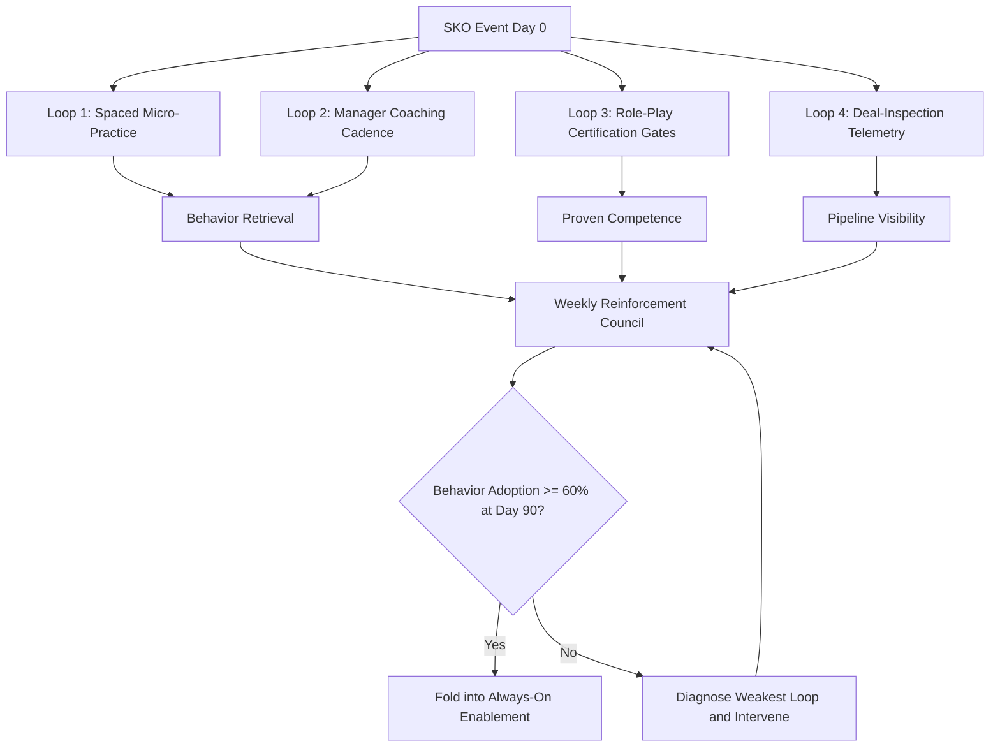

### Direct Answer

A post-SKO reinforcement system that actually holds is not a follow-up email or a single 30-day refresher — it is a 90-day operating cadence with four interlocking loops: spaced-repetition micro-practice, manager-led coaching with a fixed inspection rhythm, role-play certification gates tied to real deal stages, and a deal-inspection layer (MEDDICC or your qualification framework) that surfaces whether the new behavior is showing up in the pipeline. Behavior change collapses when reinforcement is treated as a content problem instead of a management problem; the fix is to make the kickoff message visible in the CRM, in the forecast call, and in the manager 1:1 every single week until it becomes the path of least resistance. Companies that instrument all four loops keep 60-70% of the behavior change alive at 90 days; companies that send a recap deck keep roughly 10-15%.

> **TLDR**
> - Behavior change from a sales kickoff decays on a predictable curve: roughly 70% of new skill is gone within 30 days unless something actively pulls it back. The recap email is theater.
> - The reinforcement system has four loops — **spaced micro-practice**, **manager coaching cadence**, **role-play certification gates**, and **deal-inspection telemetry** — and all four must run or the weakest one becomes the leak.
> - The manager is the single highest-leverage variable. A kickoff change survives in direct proportion to whether frontline managers inspect it weekly. No manager cadence, no behavior change — full stop.
> - Instrument the behavior in the system of record. If the new motion is not a field, a stage gate, or a scored call in Gong/Clari, it does not exist by week 6.
> - Budget the reinforcement program at 3-5x the cost of the kickoff event itself, spread across 90 days. Front-loading the spend into the offsite and starving the follow-through is the most common and most expensive mistake in enablement.
> - Measure leading indicators (practice reps logged, certification pass rate, coaching sessions completed, MEDDICC field completeness) weekly and lagging indicators (stage conversion, cycle time, win rate) at 60 and 90 days.

---

## 1. Why Post-SKO Behavior Change Collapses

The uncomfortable truth most enablement leaders learn the hard way is that the sales kickoff (SKO) is the easy part. Booking the venue, building the keynote, running the breakouts — that is a project with a deadline and a visible deliverable. The hard part starts the Monday after, when 250 reps fly home, open a pipeline that did not move while they were gone, and revert to whatever motion was working for them in Q4. This section explains the mechanics of that collapse so the reinforcement system can be designed against the actual failure mode rather than a guessed one.

### 1.1 The forgetting curve is real and it is steep

Hermann Ebbinghaus mapped the forgetting curve in 1885, and corporate learning research has confirmed the shape ever since: without reinforcement, learners lose the majority of new information within days, and the decay is fastest in the first 24-48 hours. For a sales kickoff this means the keynote insight that felt transformational on stage Tuesday is mostly gone by the following Monday. The practical implication is not "people are lazy" — it is that **memory consolidation requires retrieval**, and a single exposure event, no matter how well produced, does not produce retrieval. A rep who hears the new discovery framework once and never practices it has, neurologically, not learned it.

Sales leaders frequently misread this. They watch the energy in the room, see the standing ovation, read the post-event survey scores, and conclude the message landed. It did land — as an impression. An impression is not a behavior. The gap between "I was inspired by that" and "I do that on every call" is the entire job of the reinforcement system.

The practical consequences of the forgetting curve show up on a predictable schedule:

- **Day 1-2:** the steepest drop. The keynote framework that felt vivid is already blurred; a rep asked to recall the new discovery model produces a partial, distorted version. This is the window where micro-practice has the highest marginal return.
- **Week 1:** without retrieval, the rep retains the *gist* but not the *mechanics*. They remember there was a new discovery motion; they cannot reproduce its specific questions or sequence.
- **Week 2-4:** the gist itself fades. The rep, under quota pressure, has fully reverted to the pre-kickoff motion and no longer experiences any tension about it — the new behavior has stopped being "the thing I should be doing" and become "a thing they talked about at the offsite."
- **Beyond 30 days:** absent reinforcement, the behavior is unrecoverable without effectively re-teaching it. The kickoff content has reached the same status as a training the rep took two years ago.

This schedule is why the 90-day timeline in Section 3 front-loads intensity. Reinforcement that starts at Day 30 is not reinforcement; it is remediation, and remediation is several times more expensive than retention.

### 1.2 The environment pulls reps back to the old motion

Even a rep who genuinely wants to adopt the new behavior faces an environment engineered against them. Their pipeline is full of deals that started under the old process. Their manager's forecast questions are still framed around the old qualification language. The CRM stages still describe the old motion. The path of least resistance — for a quota-carrying rep under monthly pressure — is to keep doing what got the deal to its current stage. New behavior is a tax the rep pays voluntarily, and voluntary taxes do not get paid for long.

This is why **environmental change has to accompany the kickoff message**. If the SKO introduced a new discovery motion but the CRM, the deal review template, and the manager 1:1 agenda all still reflect the old motion, the rep is being asked to swim upstream against their own tooling. The reinforcement system's job is to reverse the current — to make the new behavior the path of least resistance by week 6, not week 26.

### 1.3 Manager neglect is the number-one leak

Across enablement post-mortems, the same pattern appears: the kickoff content was fine, the rep intent was genuine, and the program still failed — because the frontline manager never inspected it. Managers are the transmission layer between corporate enablement and rep behavior, and a transmission layer that is disengaged converts zero torque. If a manager does not ask about the new behavior in the weekly 1:1, does not score it on call reviews, and does not reference it in deal inspection, the rep correctly concludes it is optional. Reps are exquisitely sensitive to what their manager actually measures versus what corporate says matters.

The failure here is rarely manager malice. It is manager overload plus lack of a structured cadence. A manager with eight reps, a forecast to make, escalations to handle, and their own skip-level pressure will deprioritize anything that does not arrive as a structured, low-effort, scheduled obligation. The reinforcement system must therefore hand managers a cadence they can run on autopilot — not a vague instruction to "coach the new behavior."

There is a second-order version of this leak that is easy to miss. Even managers who *want* to reinforce the behavior often cannot, because they themselves never internalized the kickoff content to a teachable depth. A manager who attended the same keynote as the reps, and got the same single exposure, is subject to the same forgetting curve. Asking that manager to coach a behavior they half-remember produces vague, low-confidence coaching that reps quickly learn to discount. This is why the reinforcement system trains managers to a *higher* standard than reps and does so *before* the kickoff — the manager must be able to model the behavior and score it against a rubric, not merely recall that it exists.

### 1.4 The "initiative fatigue" tax

There is one more force working against post-SKO behavior change, and it is cultural rather than cognitive. Most sales organizations have run kickoffs before, introduced behaviors before, and watched those behaviors fade before. Reps and managers have therefore developed a rational, learned skepticism: "this too shall pass." When a new kickoff motion is announced, a meaningful share of the floor is privately betting it will be quietly abandoned within a quarter — and that bet has historically paid off. This initiative fatigue is a tax on every new program: it raises the bar for what counts as credible commitment.

The only thing that defeats initiative fatigue is a visible, sustained cadence that outlasts the floor's skepticism. The first kickoff motion that survives a full 90 days with real certification gates and real manager inspection resets the organization's prior — the next program is met with less cynicism because the last one actually stuck. In this sense the reinforcement system is not just defending one behavior; it is rebuilding the organization's belief that behavior change is possible at all.

### 1.5 The four ways a reinforcement program quietly dies

| Failure mode | What it looks like | Root cause | The fix loop |
|---|---|---|---|
| **Content dump** | A 60-slide recap deck emailed to all reps | Treating reinforcement as information delivery | Spaced micro-practice (Loop 1) |
| **Manager bypass** | Enablement coaches reps directly; managers uninvolved | No structured manager cadence | Coaching cadence (Loop 2) |
| **No proof gate** | Everyone "completed" training; nobody demonstrated it | Completion measured, not competence | Role-play certification (Loop 3) |
| **No telemetry** | Leaders cannot see if behavior changed until win rate moves 2 quarters later | No leading indicators instrumented | Deal-inspection layer (Loop 4) |

Each row is a real program that failed. The pattern is that a reinforcement system with three of four loops still leaks through the missing one. A program with brilliant micro-practice and certification but no manager cadence dies because reps practice in a vacuum and nobody pulls the behavior into live deals. A program with great manager cadence but no telemetry dies because leadership cannot tell early adopters from holdouts and cannot intervene. The loops are not a menu — they are a system, and systems fail at their weakest joint.

---

## 2. The Four-Loop Reinforcement System

The reinforcement system is built from four loops that run concurrently across a 90-day window. This section defines each loop, what it produces, who owns it, and how it connects to the others.

### 2.1 The system at a glance

The diagram captures the essential structure: all four loops launch at Day 0, they feed three distinct outputs — retrieval, proven competence, and pipeline visibility — and those outputs converge weekly in a reinforcement council that decides whether to graduate the program into the always-on enablement motion or diagnose and repair the weakest loop.

### 2.2 Loop 1 — Spaced micro-practice

**Purpose:** force retrieval of the kickoff content on a spacing schedule so the behavior moves from short-term impression to durable memory.

Loop 1 is the antidote to the forgetting curve. Instead of one big exposure, the rep gets short, frequent, low-friction practice reps — a two-minute scenario quiz on Monday, a recorded 90-second pitch on Wednesday, a peer-graded objection drill on Friday. The cadence matters more than the content volume: research on spaced repetition consistently shows that the same total study time, spaced out, produces dramatically better retention than massed practice. The first two weeks are tight (every 2-3 days), then the interval widens to weekly, then biweekly as the behavior consolidates.

**What good looks like:** each rep logs 8-12 micro-practice reps in the first 30 days; the practice is scenario-based (not multiple-choice trivia); at least one rep per week is a recorded video the manager or a peer can review. Tools like Brainshark, MindTickle, Allego, or Gong's coaching module are common delivery vehicles, but the loop can run on a shared call-recording library and a simple checklist if budget is tight.

The design principles that make Loop 1 work, as opposed to a content-dump dressed up as practice:

- **Retrieval, not review.** A practice rep must force the learner to *produce* the behavior — record a pitch, answer an objection, walk a scenario — not passively re-read it. Re-reading feels like learning and is not; production is learning.
- **Short and frequent beats long and rare.** Three two-minute reps across a week outperform one six-minute review, because the spacing itself is the active ingredient. The interval is the medicine.
- **Scenario-anchored, not abstract.** Practice should drop the rep into a realistic deal situation — a specific buyer persona, a specific objection, a specific stage — so the retrieved behavior is wired to the context where it will be used.
- **Low friction.** If a practice rep takes more than a few minutes or requires scheduling, completion collapses. The rep should be able to do it from a phone between meetings.
- **Visible to a coach.** At least one rep per week should produce an artifact (a recording, a score) that Loop 2's manager can review, so practice and coaching connect rather than running as parallel silos.

A Loop 1 that violates these principles — a long recap module emailed once — is the single most common reinforcement failure, and it fails precisely because it substitutes exposure for retrieval.

### 2.3 Loop 2 — Manager coaching cadence

**Purpose:** make the new behavior a standing item in every manager-rep interaction so it is inspected, not optional.

Loop 2 is the highest-leverage loop and the one most programs underbuild. It hands every frontline manager a fixed weekly cadence: a 1:1 agenda with a reserved block for the new behavior, a call-review rubric that scores the new behavior explicitly, and a monthly skill-development conversation separate from the deal-by-deal forecast review. The cadence is non-negotiable and scheduled; the manager does not have to decide to coach, they have to show up to a meeting that already has the coaching built into the agenda.

**What good looks like:** 100% of reps get a weekly 1:1 with a reserved reinforcement block; managers complete 2-4 scored call reviews per rep per month; the manager's own manager (the second-line leader) inspects whether the first-line cadence is happening — coaching the coaches. This last point is critical: second-line managers must be held to running the cadence with their first-line managers, or the cadence decays from the top down.

The non-negotiable elements of a manager coaching cadence that actually carries the behavior:

- **A reserved 1:1 block.** Not "discuss the new behavior if there's time" — a fixed, agenda-defined slot every week that the forecast cannot eat.
- **A scored call review on a published rubric.** The manager listens to a real recorded call and scores the behavior against the same rubric the certification uses, so the rep gets specific, criteria-based feedback rather than a vibe.
- **Skill coaching held separately from deal coaching.** The deal-by-deal forecast review is about *this quarter's pipeline*; the skill conversation is about *the rep's developing capability*. Mixed together, the urgent always eats the important.
- **Manager-of-manager inspection.** The second-line leader has a standing item to verify the first-line cadence is running. Unwatched cadences decay.

### 2.4 Loop 3 — Role-play certification gates

**Purpose:** convert "completed the training" into "demonstrated the behavior to a defined standard" via observed certification.

Loop 3 replaces completion metrics with competence gates. At defined points — typically Day 14, Day 45, and Day 90 — each rep must pass a role-play certification: a live or recorded scenario scored against a rubric by a manager or certified evaluator. The gate is real; a rep who does not pass gets targeted coaching and re-certifies. The certification is tied to real deal stages — a discovery certification, a multi-threading certification, a negotiation certification — so passing the gate means the rep can do the thing the kickoff asked for in the context where it matters.

**What good looks like:** certification rubrics are published before the SKO so reps know the standard; pass rates are tracked and reported; first-attempt pass rate is a leading indicator of program health (a low first-attempt rate is informative, not embarrassing — it tells you the coaching loop needs more reps). AI-scored role-play tools (Hyperbound, Second Nature, Quantified) can scale certification volume, but a manager-observed gate at the milestone moments remains the credibility anchor.

### 2.5 Loop 4 — Deal-inspection telemetry

**Purpose:** instrument the new behavior in the system of record so leadership can see adoption in the pipeline weeks before win rate moves.

Loop 4 is what turns a hope into a managed program. If the SKO introduced a new qualification motion, that motion must become inspectable data: MEDDICC fields on the opportunity, a multi-threading count, a mutual action plan attachment, a discovery-call score from a conversation-intelligence tool. The deal-inspection layer reads that data weekly and reports adoption by team and by rep. It connects the practice loop (are reps practicing?) and the certification loop (did they pass?) to the only thing the business actually cares about: is the behavior showing up in live deals and moving them?

**What good looks like:** the new behavior maps to 3-6 specific, low-ambiguity fields or scores in the CRM and the conversation-intelligence tool; a weekly dashboard shows field completeness and behavior-presence by team; deal reviews use the new framework's language so the inspection is continuous, not a separate audit. Clari, Gong, Salesforce reports, or a BI layer all work — the requirement is that the behavior is *data*, not anecdote.

A note on sequencing the loops within a single rep's week: the loops are concurrent at the program level but ordered at the rep level. A typical reinforcement week for a rep in the manager-handoff phase looks like a Monday micro-practice rep (Loop 1), a midweek manager 1:1 with the reserved reinforcement block reviewing that practice rep (Loop 2), a scored call review the manager completes from a real recorded call (Loop 2), and the rep's MEDDICC fields updated on live opportunities as deals progress (Loop 4), with a certification gate landing at the milestone weeks (Loop 3). The rep experiences this not as four programs but as one coherent rhythm — which is exactly the design goal. When a rep describes the reinforcement system as "four separate things HR is making me do," the loops have not been integrated; when they describe it as "how we run deals now," they have.

### 2.6 How the four loops interlock

| Loop | Produces | Owned by | Feeds into | Failure if missing |
|---|---|---|---|---|
| 1 — Micro-practice | Retrieval & fluency | Enablement | Certification readiness | Reps forget; certification pass rate craters |
| 2 — Coaching cadence | Applied feedback | Frontline managers | Live-deal behavior | Reps practice in a vacuum; nothing reaches deals |
| 3 — Certification gates | Proven competence | Managers + Enablement | Telemetry baseline | "Completed" ≠ capable; no quality bar |
| 4 — Deal telemetry | Pipeline visibility | RevOps | Reinforcement council | Leadership blind until win rate moves |

The interlock is the point. Loop 1 makes the behavior retrievable; Loop 2 makes it applied; Loop 3 proves it to a standard; Loop 4 confirms it reached real deals. Remove any one and the chain breaks at that link. This four-loop architecture is the same systems-thinking approach that distinguishes a high-ROI kickoff from an expensive one (q459), and it is why the design of the kickoff itself must anticipate reinforcement rather than treating it as a separate downstream project.

---

## 3. The 90-Day Reinforcement Timeline

A reinforcement system is a cadence, and a cadence has a calendar. This section lays out the 90-day timeline phase by phase, because vague instructions like "reinforce over the quarter" reliably collapse into nothing.

### 3.1 Days 0-14 — Tight loop, high intensity

The first two weeks are the most fragile and the most important. The forgetting curve is steepest here, the environment has not yet been re-engineered, and rep intent is at its peak — a window that closes fast. Loop 1 runs at maximum density: a micro-practice rep every 2-3 days. Loop 2 starts immediately — the first reinforcement-block 1:1 happens in week one, not week three. Loop 3's first gate lands at Day 14: a discovery-motion certification that every rep must attempt. Loop 4 turns on the telemetry dashboard with a baseline reading so the council has a Day-0 reference.

The intensity here is deliberate. A program that starts slow and "ramps up" has already lost the retrieval war. The first 14 days set the expectation that this is real.

### 3.2 Days 15-45 — Widening intervals, manager handoff

Weeks three through six widen the practice interval to weekly and shift ownership decisively to the frontline manager. Loop 1 micro-practice becomes weekly and more scenario-rich. Loop 2 is now the load-bearing loop: managers run weekly reinforcement 1:1s and complete their scored call reviews. Loop 3's second gate lands at Day 45 — a more advanced certification (multi-threading, or whatever the kickoff's core motion was). Loop 4's dashboard now has trend data; the council can see which teams are adopting and which are stalling.

This is the phase where most programs lose momentum, because the enablement team's attention is pulled to the next initiative and the managers have not fully owned the cadence. The reinforcement council's job in this phase is to keep the managers accountable and to surface stalls early.

### 3.3 Days 46-90 — Consolidation and graduation

The final phase consolidates the behavior into the standing operating rhythm. Loop 1 micro-practice goes biweekly and folds into the always-on enablement library. Loop 2 coaching is now habitual — the reinforcement block is just part of the 1:1. Loop 3's final certification at Day 90 is the graduation gate. Loop 4's telemetry is now mature enough to correlate behavior adoption with leading pipeline indicators. At Day 90 the council makes the graduation decision: if adoption is at or above the 60% threshold, the behavior folds into business-as-usual; if not, the council diagnoses the weakest loop and runs a targeted 30-day extension.

### 3.4 The timeline in one table

| Phase | Days | Loop 1 (practice) | Loop 2 (coaching) | Loop 3 (certification) | Loop 4 (telemetry) | Council focus |
|---|---|---|---|---|---|---|
| Tight loop | 0-14 | Every 2-3 days | Week-1 reinforcement 1:1 | Gate 1 at Day 14 | Baseline dashboard live | Did everyone start? |
| Manager handoff | 15-45 | Weekly | Weekly + scored call reviews | Gate 2 at Day 45 | Trend data by team | Which teams are stalling? |
| Consolidation | 46-90 | Biweekly | Habitual reinforcement block | Gate 3 at Day 90 | Behavior-to-pipeline correlation | Graduate or extend? |

### 3.5 Why the cadence beats the campaign

A reinforcement *campaign* has an end date and an owner whose attention will move on. A reinforcement *cadence* is built into recurring meetings and recurring data, so it survives the owner's attention moving on. The 90-day timeline above is designed to hand off ownership from enablement (who built it) to managers and RevOps (who will run it forever). By Day 90 the program should be invisible — not because it stopped, but because it became how the org operates. This is the same distinction that separates a kickoff that produces durable change from one that produces a one-week sugar high (q462), and it is the reason the optimal kickoff frequency question (q463) is downstream of the reinforcement question, not the other way around.

The campaign-versus-cadence distinction is worth making concrete, because the words sound similar and the outcomes do not:

- **A campaign has a launch and a close.** A cadence has a rhythm and no close — it just becomes biweekly, then folds into business-as-usual. The campaign ends; the cadence graduates.
- **A campaign has a dedicated owner.** A cadence is owned by the recurring meeting and the recurring dashboard, so it does not depend on any one person's attention staying fixed.
- **A campaign is measured by completion.** A cadence is measured by whether the behavior is still visible in the pipeline — a measure that does not expire when the campaign's end date passes.
- **A campaign competes for priority.** A cadence is just on the calendar, so it does not have to win a priority fight every week against the forecast and the escalations.

The 90-day timeline is, in effect, a controlled conversion of a campaign into a cadence. Days 0-14 look like a campaign — high intensity, dedicated attention. Days 46-90 are deliberately engineered to look like business-as-usual, so that when the enablement team's attention does move to the next initiative, nothing breaks.

### 3.6 The reinforcement council — the program's steering wheel

The 90-day timeline is steered by a weekly reinforcement council: a 30-minute standing meeting with a fixed membership — the enablement program owner, a representative frontline manager, a second-line sales leader, and a RevOps analyst who owns the dashboard. The council does not run the loops; the loops run themselves. The council reads the four-panel dashboard, identifies the weakest loop or the slowest team, and assigns one intervention for the coming week.

| Council member | Brings to the table | Accountable for |
|---|---|---|
| Enablement program owner | Loop 1 and Loop 3 status; content and certification health | Diagnosing whether a stall is a design problem |
| Frontline manager rep | Ground truth on whether the cadence is runnable | Flagging when the cadence is too heavy to sustain |
| Second-line sales leader | Authority to enforce the manager cadence | Holding first-line managers to the coaching rhythm |
| RevOps analyst | The dashboard; Loop 4 telemetry | Data accuracy and the weekly trend read |

The council's discipline is to make exactly one decision per week — which loop or team needs an intervention — rather than relitigating the whole program. A council that tries to redesign the system every week is itself a symptom of a program without a stable design.

---

## 4. Instrumenting the Behavior — Telemetry and the System of Record

Loop 4 deserves its own deep section because it is the loop that converts a reinforcement program from a faith-based exercise into a managed one. If you cannot see the behavior in the pipeline, you cannot manage it, and you will not know it failed until two quarters of pipeline have run through the old motion.

### 4.1 The behavior must become a field

The single most important instrumentation principle: **the new behavior has to map to specific, low-ambiguity data in the system of record.** A kickoff that introduces "better discovery" with no corresponding field is uninspectable and therefore unmanageable. A kickoff that introduces a MEDDICC qualification motion with Metrics, Economic Buyer, Decision Criteria, Decision Process, Identified Pain, Champion, and Competition as required-by-stage fields is inspectable on day one.

The fields should be few and unambiguous. Six MEDDICC fields plus a multi-threading contact count plus a mutual-action-plan attachment is enough telemetry to run a program. Twenty fields nobody fills in is worse than six fields everybody fills in. RevOps owns the schema design here and should resist the temptation to instrument everything.

### 4.2 Conversation intelligence as the behavior camera

CRM fields tell you what the rep *recorded*. Conversation-intelligence tools — Gong, Clari Copilot, Salesloft's conversation product, Chorus — tell you what the rep *actually did on the call*. For behaviors that show up in conversation (discovery questioning, talk-track adherence, objection handling, multi-threading mentions), the conversation-intelligence layer is the most honest telemetry available, because it scores the real interaction rather than the rep's self-report.

A well-run Loop 4 uses both: CRM fields for structural behaviors (is there a champion? a mutual action plan?) and conversation scores for in-call behaviors (did discovery actually happen?). The combination closes the gap between recorded intent and demonstrated behavior.

### 4.3 The leading-vs-lagging indicator stack

| Indicator type | Example metrics | Read cadence | What it tells you |
|---|---|---|---|
| **Activity (leading)** | Micro-practice reps logged, certification attempts, coaching sessions completed | Weekly | Is the system *running*? |
| **Adoption (leading)** | MEDDICC field completeness, multi-thread count, conversation-score adherence | Weekly | Is the behavior *appearing*? |
| **Pipeline (mid-lagging)** | Stage conversion rate, discovery-to-demo rate, deal slippage | 30/60 days | Is the behavior *working*? |
| **Outcome (lagging)** | Win rate, average deal size, sales-cycle length | 60/90+ days | Did it *move the number*? |

The discipline is to manage the program off the leading indicators and validate it off the lagging ones. A leader who waits for win rate to confirm the program is working will get that confirmation a full quarter after the program either succeeded or failed — too late to intervene. The leading indicators are the steering wheel; the lagging indicators are the rear-view mirror.

The chain from activity to outcome is causal, and reading it correctly is what lets a leader intervene early:

- **If activity indicators are weak,** the system is not running — managers are not coaching, reps are not practicing. The fix is operational: enforce the cadence. Nothing downstream will improve until this does.
- **If activity is strong but adoption is weak,** reps are practicing but the behavior is not reaching live deals. The fix is in Loop 2 — the coaching is not connecting practice to the rep's actual pipeline.
- **If adoption is strong but pipeline indicators are flat,** the behavior is happening and not working — which points back to the counter-case in Section 8.2: the kickoff motion itself may be wrong.
- **If pipeline indicators move but outcomes do not,** the behavior is improving mid-funnel without converting — a signal to inspect whether the motion is being abandoned late in the deal cycle.

Reading the chain this way turns a vague "the program isn't working" into a specific, addressable diagnosis. That precision is the entire reason Loop 4 exists.

### 4.4 The weekly reinforcement dashboard

The reinforcement council runs off a single weekly dashboard with four panels — one per loop. Panel one: micro-practice reps logged by team. Panel two: coaching sessions and scored call reviews completed by manager. Panel three: certification attempts and first-pass rates. Panel four: behavior-adoption telemetry by team. The dashboard is deliberately boring and deliberately consistent — the same four panels every week so the council can spot a trend break instantly. RevOps owns the dashboard; it should be built once and run unattended.

### 4.5 Telemetry honesty — gaming and how to prevent it

Any instrumented behavior will be gamed if the metric is the goal. Reps will fill in a champion field with a contact who is not a champion if "champion field populated" is what gets inspected. The defense is to inspect *quality*, not just *presence* — the deal review asks "who is the champion and what have they done for you?", not "is the field filled in?" — and to triangulate CRM self-report against conversation-intelligence reality. When the field says "champion identified" and the call recording shows a single-threaded relationship with a junior contact, the gap is the coaching conversation. Telemetry that is only ever counted, never inspected for quality, trains reps to produce numbers instead of behavior — the same trap that makes a comp redesign look successful on paper while deal quality quietly erodes (q9525).

---

## 5. Manager Coaching — The Load-Bearing Loop

If a reinforcement system had to drop three of its four loops and keep one, it would keep the manager coaching cadence. This section goes deep on Loop 2 because it is the highest-leverage and most-underbuilt component, and because the named operators who run great reinforcement programs all built the manager layer first.

### 5.1 The manager is the multiplier

Enablement teams are small; a typical SaaS company has one enablement professional per 30-50 reps. Frontline managers are the multiplier — there is one manager per 6-8 reps, they see those reps every week, and they control the reps' incentives, deal reviews, and career conversations. A reinforcement message routed through managers reaches every rep with high frequency and high authority. A message routed around managers, directly from enablement to reps, reaches reps with low frequency and zero authority — because the rep's manager, not the enablement team, is who the rep optimizes for.

This is why **the reinforcement system enables managers first and reps second.** Before the SKO, managers should be trained on the coaching rubric, the certification standard, and the cadence they will run. A manager who walks into the post-SKO Monday already knowing the cadence is a functioning transmission layer; a manager who is handed a vague "please reinforce this" is a broken one.

### 5.2 The coaching cadence is scheduled, not discretionary

The reliable way to get managers to coach is to remove the decision. A discretionary instruction — "coach the new behavior when you can" — competes with the forecast, escalations, and the manager's own pressure, and loses. A scheduled, structured cadence does not compete; it is just on the calendar. The cadence has three fixed components: a weekly 1:1 with a reserved reinforcement block, a monthly scored call review per rep, and a monthly skill-development conversation held separately from the deal-by-deal forecast review.

That last separation matters. When skill coaching and deal inspection happen in the same meeting, the urgent (this quarter's deals) always crowds out the important (the rep's developing capability). Great managers run a separate cadence for skill development precisely so it does not get eaten.

### 5.3 What real operators do

Look at how leaders at instrumented sales organizations describe the manager loop, and a consistent picture emerges. At Salesforce (CRM), the management operating rhythm is famously cadence-driven — the weekly 1:1, the deal inspection, the forecast call are all standing rituals, and a new behavior introduced at kickoff gets folded into those existing rituals rather than bolted on as a separate program. At HubSpot (HUBS), the enablement function has long emphasized manager-led reinforcement and the "coach the coaches" discipline, where second-line leaders are measured on whether their first-line managers are running the coaching cadence.

The conversation-intelligence vendors built their businesses on this insight. Gong (acquired the category narrative around making manager coaching data-driven) and the team behind Clari built deal-inspection tooling specifically so managers have a structured, low-effort surface to inspect behavior. The lesson from operators across MongoDB (MDB), Datadog (DDOG), and Snowflake (SNOW) — all companies that scaled go-to-market organizations rapidly — is the same: the kickoff message survives in proportion to whether the manager operating rhythm carries it. Where the rhythm exists, reinforcement is cheap; where it does not, no amount of content fixes it.

What separates the operators who get durable behavior change from the ones who do not is rarely the quality of their kickoff content — it is structural choices in the manager layer:

- **They train managers before reps.** The pre-SKO investment goes into the management layer first, so managers walk into the post-kickoff Monday already fluent in the cadence and the rubric.
- **They make the cadence a leadership metric.** Whether a manager runs the coaching cadence is itself inspected and reported, the same way pipeline coverage is — it is not left to the manager's discretion.
- **They fold the new behavior into existing rituals.** Rather than creating a separate reinforcement program, they embed the behavior into the 1:1, the deal review, and the forecast call that already exist. The behavior rides infrastructure that is already load-bearing.
- **They protect the skill conversation.** They explicitly separate developing-the-rep from inspecting-the-deal, because the urgency of the quarter will otherwise consume every minute.

### 5.4 The coaching rubric

A manager cannot coach a behavior they cannot define. Loop 2 hands managers a rubric — a small, specific scoring guide for the kickoff behavior. For a discovery-motion kickoff the rubric might score: did the rep uncover a quantified metric of pain; did the rep identify the economic buyer; did the rep establish a mutual next step. Three to five observable criteria, each scored on a simple scale, is enough. The rubric is published before the SKO, used in the certification gates, and used in the manager's call reviews — so the reps, the certification, and the coaching all reference the identical standard. Consistency of standard across loops is what makes the system feel coherent rather than like three disconnected programs.

### 5.5 Coaching the coaches

The cadence decays from the top. If the second-line leader does not inspect whether first-line managers are running the reinforcement 1:1s, the first-line managers will quietly stop, because the path of least resistance for an overloaded manager is to skip the thing nobody checks. The reinforcement system therefore extends the cadence upward: the second-line leader has a standing item in *their* operating rhythm to inspect first-line coaching completion, and the VP of Sales inspects the second-line leaders. This is the same structural principle that determines whether a kickoff's compensation messaging actually sticks (q466) and the same management-depth question that surfaces when an org debates the timing of its first VP Sales hire (q9540).

---

## 6. Certification Gates — Turning Completion Into Competence

Loop 3 exists because "completed the training" is the most dangerous metric in enablement. It feels like progress and measures nothing. This section covers how to build certification gates that produce a real competence bar.

### 6.1 Completion is a vanity metric

When a reinforcement program reports "94% of reps completed the post-SKO module," it has reported attendance, not learning. A rep can complete a module by clicking through it. Completion data tells leadership the LMS works; it tells them nothing about whether reps can do the behavior. The shift Loop 3 demands is from completion to **demonstrated competence to a published standard** — the rep does not get credit for finishing a module, they get credit for passing a role-play certification scored against the rubric.

### 6.2 Certification tied to real deal stages

A generic certification — "deliver the company pitch" — is weak because it does not map to the situations reps actually face. Strong certification gates are tied to the deal stages where the behavior matters: a discovery certification (can the rep run the new discovery motion), a multi-threading certification (can the rep build a buying group), a negotiation certification (can the rep hold the new pricing line). Tying certification to stages means a pass is evidence the rep can do the thing in context, and it lets the program sequence certifications to match the 90-day timeline.

### 6.3 The three-gate structure

| Gate | Timing | Scenario | Standard | Consequence of not passing |
|---|---|---|---|---|
| **Gate 1 — Foundational** | Day 14 | Core motion (e.g., discovery) | Rubric criteria met at basic level | Targeted coaching, re-certify within 7 days |
| **Gate 2 — Applied** | Day 45 | Advanced motion (e.g., multi-threading) | Rubric met under realistic objection pressure | Manager-led remediation plan |
| **Gate 3 — Graduation** | Day 90 | Full motion in a complex scenario | Rubric met fluently, behavior visible in live deals | Performance conversation; program extension for the rep |

The gates escalate in difficulty and in consequence. Gate 1 is supportive — a low first-pass rate is diagnostic information, not a failure. Gate 3 is a real bar, and by Day 90 a rep who still cannot demonstrate the behavior in a complex scenario is a performance conversation, not an enablement one.

### 6.4 AI-scored role-play at scale

Manual certification does not scale past a few hundred reps without an army of evaluators. AI-scored role-play tools — Hyperbound, Second Nature, Quantified, and the coaching modules inside the major conversation-intelligence platforms — let a rep run a simulated buyer conversation any time and get scored against the rubric instantly. This makes Loop 1 micro-practice and Loop 3 certification volume essentially unlimited.

The pragmatic stance: use AI scoring for *volume* (unlimited practice reps, instant feedback, removing scheduling friction) and keep a *human-observed* gate at the milestone moments (Day 14, 45, 90) because a manager observing the certification is itself a coaching moment and a credibility anchor. AI scales the practice; the human gate anchors the standard.

The division of labor between AI and human certification breaks down cleanly:

- **AI handles unlimited low-stakes practice.** A rep can run a simulated buyer conversation at 11 p.m. before a big call and get scored instantly. This removes the scheduling bottleneck that caps how much practice a program can offer.
- **AI handles consistency of scoring.** A well-tuned AI scorer applies the rubric the same way every time, eliminating the evaluator-to-evaluator variance that makes manual certification feel arbitrary to reps.
- **Humans handle the milestone gates.** The Day 14, 45, and 90 certifications stay manager-observed because the observation is itself coaching, and because a human gate signals the standard is real in a way an automated score does not.
- **Humans handle the edge cases.** A rep who games the AI scorer, or a scenario the AI mis-scores, needs a human in the loop. AI scales the floor of the program; it does not replace judgment at the gate.

### 6.5 Publishing the standard before the SKO

A certification rubric that reps see for the first time at the gate feels like a trap. A rubric published before the SKO — so reps know exactly what they will be certified on — feels like a fair contract and doubles as a study guide. Publishing the standard early also forces the program designers to define the behavior precisely before the kickoff, which improves the kickoff content itself. The certification rubric, the kickoff content, and the manager coaching rubric should all derive from one source-of-truth definition of the target behavior — the same design discipline that separates content built for AEs, SDRs, and managers as distinct audiences (q464) rather than one undifferentiated deck.

---

## 7. Budgeting and Resourcing the Reinforcement System

A reinforcement system fails for budget reasons as often as for design reasons. This section covers how to fund the 90-day program so it does not get starved the moment the offsite ends.

### 7.1 The 3-5x rule

The most useful budgeting heuristic in post-SKO reinforcement: **budget the reinforcement program at 3-5x the cost of the kickoff event itself**, spread across the 90-day window. The kickoff is a one-day or three-day spend; the reinforcement is a 90-day program with tooling, manager time, certification infrastructure, and analytics. If the kickoff costs $400K, the reinforcement program is a $1.2M-$2M commitment of money and loaded labor cost.

This sounds high until you compare it to the alternative. A kickoff with no funded reinforcement is a near-total write-off — the standing ovation fades, the behavior reverts, and the $400K bought a week of energy. A funded reinforcement program is what converts the kickoff spend from an expense into an investment with a measurable return.

### 7.2 Where the reinforcement budget goes

| Budget line | Share of reinforcement budget | What it funds |
|---|---|---|
| **Manager time** | 35-45% | Loaded cost of manager hours in coaching cadence — the largest and most invisible line |
| **Tooling** | 20-30% | Micro-practice platform, AI role-play, conversation intelligence, dashboard |
| **Enablement labor** | 15-20% | Program design, content, certification administration, council facilitation |
| **Certification & evaluators** | 10-15% | Evaluator time for human-observed gates |
| **Analytics & RevOps** | 5-10% | Dashboard build, telemetry schema, weekly reporting |

The line that surprises finance is manager time. Manager coaching hours are real loaded cost, and a program that does not account for them is hiding its true cost and will be under-resourced in the loop that matters most. Naming the manager-time line forces the org to decide consciously whether managers have the capacity for the cadence — a far better outcome than discovering at Day 30 that they do not.

### 7.3 The cadence-split funding model

The most common funding failure is front-loading: pouring the budget into the offsite and leaving the follow-through on a shoestring. The fix is a deliberate cadence-split — the kickoff and the reinforcement program are funded as two separate line items with two separate owners, so the reinforcement budget cannot be raided to make the offsite fancier. This is the same discipline that distinguishes a reinforcement *cadence* from a reinforcement *campaign* (Section 3.5), applied to the budget.

### 7.4 Build-vs-buy on tooling

For organizations under roughly 100 reps, a reinforcement system can run on tooling the company already owns: the CRM for telemetry, the conversation-intelligence tool the org already pays for, a shared call-recording library for micro-practice, and a spreadsheet dashboard. The dedicated micro-practice and AI role-play platforms become worth the cost above roughly 100-150 reps, where the manual administration of practice and certification stops scaling. The mistake is buying the platform stack first and designing the cadence second — the cadence is the system; the tools just make it cheaper to run at scale. The same build-vs-buy logic applies to whether a fast partner-enablement curriculum justifies dedicated infrastructure (q432).

### 7.5 The ROI case for finance

Finance will fund the 3-5x rule if the case is framed in their language. The reinforcement program's ROI case has three parts: the cost (reinforcement budget), the protected asset (the kickoff spend, which is a write-off without reinforcement), and the upside (the leading-to-lagging indicator chain from Section 4.3 — practice reps to certification to behavior adoption to stage conversion to win rate). Framing the reinforcement budget as *insurance on the kickoff investment plus a measurable performance lever* is far more fundable than framing it as "more enablement." Connecting the program's leading indicators to forecastable pipeline outcomes is exactly the discipline that makes kickoff ROI legible to a CFO (q462).

---

## 8. Counter-Case — When the Four-Loop System Is the Wrong Answer

A reinforcement system this elaborate is not always the right call. Intellectual honesty requires naming the conditions under which the four-loop architecture is overbuilt, and what to do instead.

### 8.1 When the org is too small

For a sales team under roughly 15-20 reps, a formal four-loop reinforcement system with a council, a dashboard, and three certification gates is bureaucratic overkill. At that scale the VP of Sales can personally carry the reinforcement — they can sit in on calls, run the coaching themselves, and inspect every deal. The behavior change still needs to happen, but the *mechanism* is one engaged leader rather than an instrumented system. The four-loop system earns its overhead at the scale where no single leader can hold every rep in their head — typically 30+ reps across multiple managers.

### 8.2 When the kickoff message was wrong

The reinforcement system is an amplifier. If the kickoff introduced a flawed motion — a discovery framework that does not fit the buyer, a pricing change the market rejects — then a well-run reinforcement system will faithfully drive reps to do the wrong thing harder. Before investing in reinforcement, the program owner has to be genuinely confident the behavior is correct. A pilot — running the new motion with one team for a quarter before the all-hands kickoff — is the cheap insurance here. Reinforcing an unvalidated motion is worse than not reinforcing it, because it adds cost and entrenches an error.

### 8.3 When the behavior is not actually a skill gap

Sometimes reps are not adopting a behavior not because they cannot, but because the incentive structure punishes it. If the comp plan rewards deal volume and the new motion slows deals down, reps are behaving rationally by ignoring it — and no amount of micro-practice, coaching, or certification will overcome a misaligned incentive. The diagnosis question is: is this a *can't* (skill gap, fixed by reinforcement) or a *won't* (incentive conflict, fixed by changing the comp plan)? Reinforcement is the wrong tool for a *won't*. This is the same diagnostic that determines whether a comp redesign improved deal quality or just shuffled the numbers (q9525), and it intersects directly with how compensation changes are communicated and structured (q466).

### 8.4 When reinforcement substitutes for hiring

Occasionally an org runs an elaborate reinforcement program to compensate for reps who are a structural mismatch for the role. If a meaningful share of the team cannot pass Gate 1 even after remediation, the honest read is a hiring problem, not a reinforcement problem. Reinforcement raises a capable team's ceiling; it cannot manufacture aptitude that was never hired for. A program owner watching certification pass rates stay low after genuine coaching should escalate that as a talent signal, not a reason to extend the program a fourth time.

### 8.5 The counter-case summarized

| Condition | Why four-loop is wrong | Better answer |
|---|---|---|
| Team under ~20 reps | Bureaucratic overhead exceeds benefit | One engaged leader carries reinforcement personally |
| Kickoff motion unvalidated | System amplifies a flawed behavior | Pilot the motion before the all-hands kickoff |
| Behavior is a *won't*, not a *can't* | Reinforcement cannot beat a bad incentive | Fix the comp plan / incentive conflict |
| Persistent low pass rates after coaching | Reinforcement cannot manufacture aptitude | Treat as a hiring/talent problem |

The four-loop system is the right answer for the common case — a 30+ rep org with a validated motion, aligned incentives, and a capable team that needs the behavior to stick. It is the wrong answer when the real problem lives upstream of skill. A program owner who can name which case they are in has already done the most important diagnostic work.

---

## 9. Implementation Checklist and Common Pitfalls

This closing section turns the system into an action list and names the pitfalls that sink it.

### 9.1 The pre-SKO checklist

Before the kickoff even happens, the reinforcement system should already be designed: the target behavior defined as a single source-of-truth statement; the certification rubric written and published to reps; the CRM telemetry fields built; managers trained on the coaching cadence and rubric; the 90-day calendar booked with reinforcement 1:1s and certification gates as real calendar invites; the reinforcement council membership and weekly meeting scheduled. A reinforcement system designed *after* the SKO has already lost the first two weeks — the most valuable two weeks.

### 9.2 The launch checklist

In the first 14 days: Loop 1 micro-practice live and running every 2-3 days; Loop 2 first reinforcement 1:1 completed for every rep in week one; Loop 3 Gate 1 administered at Day 14; Loop 4 baseline dashboard published; reinforcement council holds its first weekly meeting. The launch test is simple — by Day 14, every rep has practiced, been coached once, and attempted certification, and leadership can see all three on a dashboard.

### 9.3 The most common pitfalls

| Pitfall | Symptom | Prevention |
|---|---|---|
| **Recap-deck reinforcement** | A slide deck emailed; no practice, no gate | Replace with Loop 1 spaced micro-practice |
| **Manager bypass** | Enablement coaches reps directly | Route everything through managers; coach the coaches |
| **Completion-as-competence** | "94% completed"; nobody demonstrated the behavior | Loop 3 certification gates to a published rubric |
| **No telemetry** | Leadership blind until win rate moves | Loop 4 fields + conversation-intelligence scoring |
| **Front-loaded budget** | Lavish offsite, starved follow-through | Cadence-split funding; reinforcement as its own line item |
| **Attention drift** | Program fades when enablement moves to next initiative | Cadence built into recurring meetings; hand off to managers/RevOps by Day 90 |
| **Metric gaming** | Fields filled, behavior absent | Inspect quality not presence; triangulate CRM vs conversation data |

### 9.4 The single most important rule

If a reinforcement program owner remembers one thing, it should be this: **behavior change is a management problem, not a content problem.** The instinct after a kickoff is to make more content — more videos, more decks, more modules. But content is Loop 1, and Loop 1 alone keeps roughly 10-15% of the behavior alive. The behavior survives because managers inspect it every week, because reps must certify to a real standard, and because the behavior is visible as data in the pipeline. Build the management system, and the content becomes useful. Build only the content, and the kickoff becomes an expensive memory.

This reframing changes where a program owner spends their effort. Concretely:

- **Spend the design effort on the cadence, not the deck.** A perfect recap deck attached to no cadence is worth less than a rough rubric attached to a real weekly coaching rhythm. The cadence is the product.
- **Spend the pre-SKO budget on managers.** Training managers on the coaching rubric and the certification standard before the kickoff has a higher return than any incremental polish on the keynote.
- **Spend the measurement effort on leading indicators.** Counting practice reps, coaching sessions, and certification pass rates weekly catches a stall in time to fix it; waiting for win rate catches it a quarter too late.
- **Spend the political capital on the manager-of-manager inspection.** Getting second-line leaders to inspect first-line coaching is the hardest organizational ask and the one that determines whether the cadence survives past Day 45.

### 9.5 Where this fits in the kickoff system

Post-SKO reinforcement is one component of a coherent kickoff operating system. The kickoff's core design pillars (q459), the in-person versus virtual format decision (q460), the audience-differentiated content for AEs, SDRs, and managers (q464), the ROI measurement that ties to the forecast (q462), the optimal kickoff frequency (q463), the handling of compensation changes (q466), and the integration of ramps and new hires (q467) are all decisions that should be made with reinforcement in mind — because a kickoff that is not designed to be reinforced cannot be. The reinforcement system is not a downstream cleanup project. It is the part of the kickoff design that determines whether the other parts mattered.

---

**Bottom line:** A post-SKO reinforcement system that keeps behavior change from collapsing is a 90-day, four-loop operating cadence — spaced micro-practice, manager coaching, role-play certification, and deal-inspection telemetry — run by a weekly council and handed off to managers and RevOps by Day 90. The forgetting curve, the environment, and manager neglect will erase a kickoff that is not reinforced; the four-loop system reverses all three. Budget it at 3-5x the kickoff cost, instrument the behavior as data, make the manager the load-bearing loop, and measure leading indicators weekly. Do that, and 60-70% of the behavior change survives to 90 days. Skip it, and the standing ovation was the whole return.

**Sources & further reading:** Ebbinghaus forgetting-curve research and corporate-learning replications; spaced-repetition and retrieval-practice cognitive science (Roediger & Karpicke retrieval-practice studies); Sales Enablement Society practitioner guidance on post-event reinforcement; ATD (Association for Talent Development) research on training transfer and the 70-20-10 application model; CSO Insights / Korn Ferry sales-enablement maturity studies; Gartner sales-enablement and sales-leadership research notes; Forrester sales-enablement benchmark reports; SiriusDecisions sales-enablement framework (now Forrester); Gong Labs analyses of coaching cadence and call-scoring impact; Clari deal-inspection methodology guidance; Salesforce sales-management operating-rhythm playbooks; HubSpot enablement and "coach the coaches" practitioner content; MindTickle and Allego readiness-platform research on reinforcement and certification; Hyperbound, Second Nature, and Quantified product documentation on AI role-play certification; Challenger and MEDDICC qualification-methodology source material; SaaStr operational benchmarks on enablement spend and ramp; Sales Management Association cadence research; Brainshark/Bigtincan readiness benchmarks; Highspot enablement-effectiveness studies; LinkedIn State of Sales reports; RAIN Group sales-training transfer research; corporate-learning meta-analyses on training transfer rates; Heath brothers' "Switch" on environmental design for behavior change; conversation-intelligence adoption benchmarks; manager-coaching ROI studies from sales-effectiveness consultancies; RevOps community practitioner write-ups on telemetry and CRM instrumentation; enablement-budget benchmarking from training-industry analysts.
