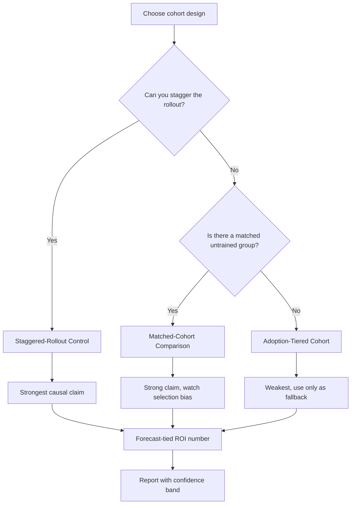

### Direct Answer

You measure kickoff ROI in a way that sticks to forecasts by building a **closed-loop, forecast-tied SKO measurement system**: anchor a pre-SKO baseline, instrument a 90-day behavioral scorecard, then attribute lagging revenue outcomes through a cohort design that the CRO's forecast call already trusts. The number sticks only when the SKO ROI metric is the *same* pipeline-quality and win-rate signal the forecast is built on — not a parallel "training" metric the finance team can dismiss. Done correctly, kickoff ROI stops being a post-event survey score and becomes a line item the revenue forecast moves on.

**TLDR**

- **Forecast-tied, not survey-tied.** SKO ROI that sticks rides on the *same* metrics the forecast call uses — stage conversion, pipeline coverage, win rate, cycle time — never a standalone "satisfaction" or "knowledge lift" score.
- **Three-layer scorecard.** Leading (behavior in 0-30 days), lagging (pipeline + win-rate in 30-90 days), and durable (forecast-accuracy delta in 90-180 days). Each layer has one owner and one CRM-native source.
- **Cohort attribution beats pre/post averages.** Compare a trained cohort against a matched, not-yet-trained cohort or a staggered-rollout control. Pre/post company averages get destroyed by seasonality and confound everything.
- **Baseline before the event, not after.** You cannot measure lift without a frozen 30-day pre-SKO baseline captured in CRM before anyone walks into the room.
- **One executive scorecard, refreshed monthly.** A single dashboard the CRO sees in the same cadence as the forecast review — owned by RevOps, signed off by Finance, with explicit confidence bands.
- **Decay is the real enemy.** Behavior change collapses by week 6 without reinforcement; ROI measurement must extend through the decay window or it overstates return by 2-3x.

---

## 🎯 Why Kickoff ROI Usually Fails to Stick

Most sales kickoff ROI numbers die in the gap between the enablement team that produces them and the finance team that has to believe them. Enablement measures what enablement can see — attendance, completion, survey scores, certification pass rates — and finance measures what finance forecasts on — bookings, pipeline coverage, conversion, cycle time. When those two universes never touch, the SKO ROI claim ("we drove $4M of incremental pipeline") arrives at the forecast review as an unsourced assertion, and the CRO does the only rational thing: ignores it.

The fix is structural, not rhetorical. A forecast-tied SKO ROI measurement system makes the kickoff's return *visible inside the forecast itself* — as a measured change in stage-conversion rate, in pipeline-coverage ratio, in average deal cycle — so the number is no longer something enablement asks finance to trust. It is something finance has already been looking at. This is the same closed-loop measurement discipline that separates a high-ROI kickoff from an expensive offsite (q459), and it is why the *design* of the kickoff and the *measurement* of the kickoff cannot be two separate workstreams.

### 1.1 The Survey-Score Trap

The single most common failure mode is reporting kickoff ROI as a function of post-event survey data. Net Promoter-style "would you recommend this SKO" scores, self-reported confidence lifts, and "I will apply this" intent ratings all correlate weakly — often near zero — with actual behavior change. Gartner's sales-enablement research has repeatedly found that satisfaction scores and downstream performance diverge; a kickoff can score 9.2/10 on the exit survey and produce no measurable conversion change. Finance knows this intuitively, which is why a survey-anchored ROI claim has no forecast credibility.

Survey data is not worthless — it is a *leading indicator of engagement risk*. A low exit score predicts adoption problems. But it is an input to the measurement system, never the output. The output must be a CRM-native, forecast-relevant metric.

The deeper problem with survey-anchored ROI is what it signals about the enablement function's relationship to revenue. When an enablement leader walks into the forecast review and the only evidence is a satisfaction score, the implicit message is "trust us, this worked." Finance is structurally trained never to accept "trust us" — its entire job is to discount unverified assertions. So the survey-score ROI claim does not just fail; it actively erodes the enablement function's standing, because each unverifiable claim teaches the CRO and CFO to weight enablement's future claims at zero. The forecast-tied alternative reverses this: every claim is independently checkable in CRM, so the enablement function builds a track record of statements that survive verification. Credibility, like forecast accuracy, is a compounding asset — and the survey-score trap spends it.

There is also a measurement-validity issue. Exit surveys are administered at the moment of peak enthusiasm — the room is energized, the speakers were good, lunch was catered. The "I will apply this" rating captured at hour 48 of the kickoff has almost no predictive relationship to what the rep does on a cold Tuesday three weeks later when a hard deal is slipping and the old habits are easier. Behavioral science calls this the intention-action gap, and it is wide. A measurement system that anchors on stated intention is measuring the wrong variable at the wrong time. The leading-indicator layer (Section 2.2) exists precisely to replace stated intention with observed behavior.

### 1.2 The Attribution-Window Mistake

The second failure mode is measuring on the wrong clock. Enablement teams, under pressure to show fast ROI, report a "30-day pipeline lift" and declare victory. But complex B2B deals have cycles of 60-180 days; a 30-day window captures behavior change (more discovery calls, better MEDDICC qualification) but cannot yet capture the bookings those behaviors produce. Conversely, a 12-month window lets so much noise in — new comp plans, territory changes, macro shifts — that attribution becomes impossible.

The correct answer is a *layered* window: measure leading indicators at 0-30 days, lagging outcomes at 30-90 days, and durable forecast-accuracy effects at 90-180 days. Each layer answers a different question, and only the full stack produces an ROI number that survives scrutiny.

The window mistake is dangerous in both directions, and it is worth being precise about why. A window that is too short produces a *false negative* — the behavior changed, the qualification got better, the discovery calls multiplied, but the deals those behaviors will close are still in flight, so the lagging metrics show nothing and the kickoff looks like it failed. An enablement leader who reports at day 30 risks killing a program that actually worked. A window that is too long produces a *false positive or false attribution* — by month nine, so many other things have changed that any movement, good or bad, can be plausibly assigned to the SKO, which means the number is unfalsifiable and therefore worthless. The layered window solves both: the leading layer catches behavior change before the lagging metrics can, so a working kickoff is not prematurely declared dead, and the lagging window closes at 90 days before the confound noise becomes overwhelming.

| Window choice | Failure mode | Consequence |
|---|---|---|
| 0-30 days only | False negative on outcomes | Working kickoff declared a failure |
| 12 months | Confound overload | ROI claim is unfalsifiable |
| Layered 0-30 / 30-90 / 90-180 | Controlled | Each layer falsifiable on its own clock |

The window must also be matched to the deal cycle of the *specific* business. A transactional SMB motion with a 21-day cycle can read lagging outcomes at day 45; an enterprise motion with a 150-day cycle cannot honestly read them before day 120. When regional cycles diverge (q451), the windows diverge with them, and a single global attribution window will be wrong for most of the company. The measurement contract (Section 2.5) records the cycle-matched window per region so the read happens on the right clock everywhere.

### 1.3 The Confounding-Variable Problem

The third failure mode is the pre/post company-average comparison. "Win rate was 22% before SKO and 26% after, so SKO drove a 4-point lift" is the claim that gets a RevOps leader laughed out of the forecast review — because Q1 win rates and Q3 win rates differ for a dozen reasons that have nothing to do with the kickoff: seasonality, deal-mix, a competitor's price change, a new product GA. Without a control, every confound gets credited to the SKO. The remedy is cohort attribution (Section 4), which holds confounds constant by comparing trained reps against an equivalent untrained set in the same period.

The confound problem is worth dwelling on because it is the single most-attacked weakness in any SKO ROI claim, and a sophisticated CFO will go straight to it. The pre/post comparison implicitly assumes that the *only* thing that changed between the two periods was the kickoff — and that assumption is essentially never true in a real revenue organization. Consider an enterprise software company that runs its SKO in late January. Between the pre-SKO baseline (October-December) and the post-SKO window (February-April), the following typically also change: the annual comp plan resets, often with new accelerator thresholds; territories are re-cut for the new fiscal year; the prior year's Q4 pull-forward leaves a thinner early-pipeline; a new product version reaches general availability; and the macro environment shifts. Each of these moves win rate, cycle time, and conversion independently of the kickoff. A naive pre/post read silently bundles all of it into the "SKO effect."

| Confound | Direction of bias | Why pre/post can't see it |
|---|---|---|
| New fiscal-year comp plan | Usually inflates effort and win rate | Lands in the same window as the SKO |
| Territory re-cut | Either direction | Changes the denominator quietly |
| Q4 pull-forward hangover | Deflates early-Q1 pipeline | Makes post-SKO look worse than reality |
| New product GA | Inflates win rate on new-product deals | Launch effect misread as training effect |
| Macro / budget-freeze shift | Usually deflates conversion | Hits both periods unequally |
| Sales-leadership change | Either direction | Behavior shifts for non-SKO reasons |

The only honest defense against a confound is a control group that experienced the same confounds. If the comp plan changed for everyone, then both the trained cohort and the untrained control absorbed it, and the difference-in-differences calculation (Section 4.4) cancels it out. This is why cohort design is not an optional refinement — it is the structural feature that converts an unfalsifiable assertion into a defensible measurement.

---

## 🎯 The Forecast-Tied Measurement Architecture

A SKO ROI system that sticks to forecasts has a specific architecture. It is not a dashboard; it is a measurement contract between RevOps, Enablement, and Finance, agreed *before* the event and refreshed on the forecast cadence.

### 2.1 The Three Measurement Layers

| Layer | Window | What it measures | Primary metric | Owner | Source |
|---|---|---|---|---|---|
| Leading | 0-30 days | Did behavior change? | Methodology-tagged activity rate, qualification-field completeness | Enablement | CRM activity + opportunity fields |
| Lagging | 30-90 days | Did outcomes follow? | Stage-conversion rate, win rate, pipeline coverage | RevOps | CRM stage history |
| Durable | 90-180 days | Did the forecast get more accurate? | Forecast-accuracy delta, slippage rate, cycle-time variance | Finance + RevOps | Forecast snapshots vs. actuals |

The discipline here is that **each layer has exactly one owner and one source**. When two teams report the same metric from two systems, the forecast review spends its time arguing about whose number is right instead of acting on the signal. The closed-loop principle — one metric, one owner, one source — is what makes the system auditable.

The layering also solves a political problem that quietly kills most measurement systems. Enablement, RevOps, and Finance each have a natural incentive to control the ROI narrative — enablement wants the number to justify its budget, Finance wants to discount it, RevOps wants a clean defensible read. If all three touch the same metric, the system collapses into a turf fight. By assigning each layer a single owner, the architecture gives each function a defined, non-overlapping responsibility: Enablement owns proof-of-behavior, RevOps owns proof-of-outcome, Finance co-owns proof-of-forecast-effect. No function can unilaterally inflate or discount the final number, because the final number is a composition of three independently owned, independently sourced reads. This is the same separation-of-duties logic that makes financial controls trustworthy, applied to enablement measurement.

A second design principle: **the metric at each layer must be one the function already reports for other reasons.** Enablement should not invent a bespoke "methodology adoption index" — it should use a CRM field that already exists or can be added cheaply, so the leading indicator is a byproduct of normal CRM hygiene rather than a special measurement project. RevOps should use the same stage-conversion report it already runs for the forecast. Finance should use the same forecast-accuracy tracking it already maintains. When the measurement layers ride on existing reporting, the system survives staff turnover and budget pressure; when they depend on a special project, they are abandoned the first time someone is busy.

### 2.2 Leading Indicators: Proof of Behavior Change

Leading indicators answer a narrow question: in the 30 days after the kickoff, did reps actually do the new thing? If the SKO taught a new discovery framework, the leading indicator is the rate at which discovery-stage opportunities now carry completed qualification fields. If it taught multi-threading, the leading indicator is contacts-per-opportunity. These are observable in CRM within days and require no attribution model — they are direct observation.

Leading indicators are also your early-warning system. If behavior has not changed by day 21, no amount of lagging measurement will save the ROI number — the intervention failed, and you escalate to reinforcement immediately rather than waiting 90 days to discover it (q461). This is why the leading layer is non-negotiable even though it is not, by itself, "ROI."

The choice of leading indicator must be made *backward from the behavior the kickoff is designed to change.* This is a design dependency, not a measurement afterthought: when the agenda is being built, every session that claims to change a behavior must name the CRM artifact that behavior produces. A session on multi-threading produces a contacts-per-opportunity field. A session on a value-based discovery framework produces completed qualification fields and a "pain identified" checkbox. A session on competitive positioning produces a populated "primary competitor" field and competitive-trap notes in call summaries. If a session cannot name the CRM artifact it will move, that session is, by definition, unmeasurable — and the right response is to either redesign the session so it produces an observable artifact or accept that its ROI will never be provable. This is the concrete mechanism by which kickoff design and kickoff measurement become one workstream rather than two (q459).

| Kickoff behavior taught | Leading indicator (CRM artifact) | Observable by |
|---|---|---|
| New discovery framework | Qualification-field completeness rate | Day 14 |
| Multi-threading | Contacts-per-opportunity | Day 21 |
| Competitive positioning | "Primary competitor" field population | Day 14 |
| Mutual close plans | Close-plan attachment rate | Day 21 |
| Methodology (MEDDICC/Command) | Methodology-tagged opportunity rate | Day 14 |
| Manager deal inspection | Coaching-note frequency per rep | Day 30 |

Leading indicators also have the largest denominators in the entire measurement system — every rep generates activity and field updates every day — which makes them the most statistically stable layer. For small cohorts where the lagging win-rate read is too noisy to trust (Section 4.5), the leading layer often carries the credible signal. A 22% lift in qualification-field completeness across 600 opportunities is a far more defensible statement than a 1.5-point win-rate move across 40 deals.

### 2.3 Lagging Outcomes: Proof of Revenue Effect

The lagging layer is where SKO ROI becomes a real number. The core metrics are stage-conversion rate (do trained reps move opportunities from stage to stage at a higher rate?), win rate on a fixed deal-size band, average sales cycle, and pipeline-coverage ratio. The critical design choice: measure these *per cohort*, not company-wide, so the comparison in Section 4 is possible.

Each lagging metric carries a specific interpretive caution. **Stage-conversion rate** is the most sensitive and the earliest to move, because it captures whether better-qualified deals are advancing — but it is also vulnerable to stage-definition drift, so the stage criteria must be frozen alongside the baseline. **Win rate** is the headline metric finance cares about most, but it is the noisiest on small denominators and the most exposed to deal-mix shifts, which is why it must be measured on a fixed deal-size band. **Average sales cycle** is a quieter but powerful signal: a kickoff that teaches better qualification often shows up first as *faster* cycles on the deals that do close (and cleaner disqualification of the ones that would not), and cycle compression is a direct, finance-legible efficiency gain. **Pipeline-coverage ratio** sits between leading and lagging — it moves faster than win rate because it reflects new pipeline creation, and a coverage improvement is an early read on whether the lagging bookings will materialize.

| Lagging metric | Speed to move | Main interpretive risk | Control for it by |
|---|---|---|---|
| Stage-conversion rate | Fast (30-45d) | Stage-definition drift | Freeze stage criteria with baseline |
| Win rate | Slow (60-90d) | Deal-mix drift, small-N noise | Fixed deal-size band, report N |
| Average sales cycle | Medium (45-75d) | Survivorship bias | Include disqualified deals in the read |
| Pipeline-coverage ratio | Fast (21-45d) | New-pipeline timing | Compare same point in quarter |

### 2.4 Durable Effect: Proof the Forecast Improved

The durable layer is what makes kickoff ROI "stick to forecasts" in the literal sense. It measures whether the forecast itself got better — narrower forecast-accuracy band, lower late-stage slippage, less cycle-time variance between regions. A kickoff that improves forecast accuracy by even 3-4 points has produced a return finance values independently of bookings, because forecast accuracy is the currency of the CFO relationship. This layer is co-owned with Finance precisely so the ROI number has a finance signature on it.

The durable layer answers the question the question itself asks — how do you make kickoff ROI *stick to forecasts* — most literally. The other two layers prove the kickoff produced more bookings; this layer proves the kickoff made the *forecast of those bookings* more reliable. Those are different goods. More bookings is a top-line outcome; a tighter forecast is a *risk* outcome, and risk reduction is the language a CFO is most fluent in. When a kickoff teaches better qualification, the second-order effect is that the deals reps put in commit are genuinely more likely to close — which means the gap between the forecast and the actual narrows. A company that historically forecast within ±18% and now forecasts within ±13% can carry a smaller cash buffer against forecast miss, can give the board a tighter range, and can plan hiring and spend with more confidence. That is real money, and it never appears in a bookings-only ROI model.

The durable layer is also the natural home for the cycle-time-variance metric. When regional cycles vary by six or more weeks (q451), the forecast is hard to assemble because each region is on a different clock. A kickoff that standardizes qualification and stage discipline tends to *compress the variance* between regions even if it does not change the mean cycle much — and lower cross-regional variance is a direct, measurable improvement in forecastability. RevOps should track the standard deviation of cycle time across regions as a durable-layer metric, because a falling standard deviation is a clean signal that the kickoff improved the thing the question is actually about.

### 2.5 The Measurement Contract

Before the event, RevOps facilitates a one-page measurement contract signed by the VP Enablement, the RevOps lead, and a Finance partner. It specifies: the three target behaviors, the metric for each layer, the baseline window, the cohort design, the attribution window, and the review cadence. This document is the single most important artifact in the entire system — it prevents the post-hoc metric-shopping ("let's report the number that looks good") that destroys credibility.

The contract works because it forces every contestable decision to be made *before anyone knows which way it helps.* Once the event is over and the data is in, every methodological choice — which window, which cohort, which deal-size band, whether to include disqualified deals — becomes a choice between a number that flatters enablement and a number that does not, and human nature pulls toward the flattering one. A skeptical CFO knows this and will assume any post-hoc choice was made to inflate the result. The contract removes the temptation entirely: the window was fixed in week minus-five, the cohort was locked before the event, the deal-size band was agreed when nobody could know the outcome. When the RevOps leader presents the number, every methodological question has the same answer — "it was decided in advance, here is the signed contract" — and that answer is unattackable.

| Contract element | What it fixes | Failure if left open |
|---|---|---|
| Three target behaviors | What "success" means | Metric-shopping after the fact |
| Metric per layer | The numbers reported | Cherry-picking the flattering metric |
| Baseline window | The comparison anchor | Re-baselining to a favorable period |
| Cohort design | The attribution method | Retrofitting a control is impossible |
| Attribution window | The reporting clock | Reading at the moment that looks best |
| Confidence-band policy | How uncertainty is shown | False-precision point estimates |
| Review cadence | When and where it is seen | The number never reaches the CRO |

The contract should be genuinely one page. A long document does not get signed, and an unsigned contract has no force. The art is compressing six or seven binding decisions onto a single readable page that the VP of Enablement, the RevOps lead, and the Finance partner can each absorb in five minutes and sign in the same meeting.

---

## 🎯 Building the Pre-SKO Baseline

You cannot measure lift against a baseline you did not capture. The baseline is the frozen, pre-event snapshot of every metric in the three-layer scorecard, and it must be locked in CRM before the kickoff begins.

### 3.1 What to Snapshot and When

The baseline window is the 30-90 days immediately preceding the SKO, long enough to smooth weekly noise but recent enough to reflect current conditions. Snapshot it as a static report — not a live dashboard — because a live dashboard will silently re-baseline as data ages.

| Baseline metric | Window | Why it matters |
|---|---|---|
| Stage-conversion rate (per stage) | 90 days pre-SKO | The core lagging comparison |
| Win rate (fixed deal-size band) | 90 days pre-SKO | Removes deal-mix drift |
| Average sales cycle | 90 days pre-SKO | Detects acceleration effects |
| Pipeline-coverage ratio | Snapshot at SKO-minus-7 | Anchors the leading-indicator read |
| Qualification-field completeness | 30 days pre-SKO | Behavior-change baseline |
| Forecast-accuracy band | Trailing 2 quarters | The durable-layer anchor |

### 3.2 Freezing the Baseline

The baseline must be immutable. The standard practice is to export the baseline report to a dated, read-only file and store it alongside the measurement contract. When the lagging numbers come in 90 days later, the comparison is against this frozen file — never against a CRM query rerun later, because the underlying data will have shifted as opportunities aged, closed, or were re-staged.

The reason a frozen file matters more than it sounds is that CRM data is not a photograph — it is a living record that rewrites its own history. An opportunity that was at Stage 2 in the baseline window may, by the time you rerun the query, have advanced, closed, been reopened, or had its stage-entry date edited by a rep cleaning up the pipeline. Stage-history fields get backfilled. Close dates slip. Deal amounts get revised. If the baseline is "whatever the CRM says about that period when I ask later," then the baseline silently moves every time anyone touches an old record, and the lift you compute against it is partly an artifact of data drift. A dated CSV export, stored read-only next to the signed contract, is the only baseline that is genuinely fixed. Some RevOps teams go further and snapshot the baseline into a separate reporting table or a data-warehouse partition with a load-date stamp, which gives the same immutability with better queryability.

A practical discipline: the baseline export should be reviewed and *signed off* the same way the contract is. The RevOps lead and the Finance partner both confirm "this is the baseline" on a specific date. That signature closes the door on the most corrosive post-hoc move of all — quietly re-baselining to a worse-looking pre-period so the lift looks bigger.

### 3.3 Segmenting the Baseline by Role

A kickoff teaches different things to AEs, SDRs, and managers, so the baseline must be segmented the same way the content is segmented (q464). The SDR baseline centers on meetings-booked and meeting-to-opportunity conversion; the AE baseline centers on stage conversion and win rate; the manager baseline centers on forecast-accuracy and coaching cadence. A single blended baseline hides the fact that the SKO worked for one role and failed for another.

### 3.4 The Region Problem

If forecast cycles vary by region — and they almost always do (q451) — the baseline must be captured per region, because a 90-day attribution window means something different in a region with a 45-day cycle than in one with a 120-day cycle. Regional baselines also let you stagger the rollout (Section 4.3) and use one region as a natural control for another.

Beyond cycle length, regions differ in ways that make a blended baseline actively misleading. Deal sizes differ — an enterprise-heavy region carries larger, slower deals than an SMB-heavy one. Win rates differ because competitive intensity differs by market. Pipeline-coverage norms differ because some regions run thinner pipeline at higher conversion and others run fat pipeline at lower conversion, and both can be healthy. Sales-process maturity differs because some regions have been on the current methodology for years and others adopted it last quarter. A blended company baseline averages all of this into a number that describes no actual region, and when the post-SKO read is compared against it, the "lift" is partly just the mix of which regions had more deals close in the window. Per-region baselines, compared per-region, eliminate that artifact entirely.

### 3.5 Baseline Quality and CRM Hygiene

A baseline is only as good as the CRM data underneath it, and most CRMs are dirtier than their owners believe. Before freezing the baseline, RevOps should run a hygiene check: what fraction of opportunities in the baseline window have complete stage-history, populated amount fields, and accurate close dates? If 30% of baseline opportunities have null qualification fields not because reps did not qualify but because the field was not required, then the leading-indicator "improvement" post-SKO will be partly an artifact of the field becoming required, not of behavior changing. The honest move is to either (a) measure leading indicators only on the subset of opportunities where the field was always required, or (b) document the hygiene gap in the contract so the day-90 read is interpreted with it in mind. A baseline with a known, documented hygiene limitation is far more credible than a clean-looking baseline whose limitations surface later under questioning.

---

## 🎯 Cohort Attribution: The Method That Survives Scrutiny

Attribution is where most SKO ROI claims fall apart, and cohort design is the technique that fixes it. The principle: never compare a company average before and after; always compare two groups that differ *only* in whether they were trained.

### 4.1 The Three Cohort Designs, Ranked

**Staggered-rollout control** is the strongest design: train Region A in January and Region B in March, and for the January-to-March window Region B is a clean control. Because the assignment to "trained first" was a logistics decision, not a performance decision, selection bias is minimal. **Matched-cohort comparison** pairs trained reps with untrained reps of similar tenure, territory quality, and historical attainment — strong, but you must guard against the trained group being the higher performers. **Adoption-tiered cohorts** compare high-adoption reps against low-adoption reps within the trained population; this is the weakest design because adoption itself correlates with rep quality, but it is a usable fallback when no untrained group exists.

The ranking is not arbitrary — it follows the strength of the *exogeneity* of the assignment. Causal inference is credible to the degree that whatever decided who got trained was unrelated to how well they would have performed anyway. In a staggered rollout, the schedule decided it: Region B went second because the venue was booked or the fiscal calendar said so, reasons that have nothing to do with Region B's sales talent. That is near-exogenous, and it is why the design produces the strongest claim. In a matched-cohort design, the analyst decided it by picking which untrained reps to compare against — and the analyst's choices, however careful, can drift toward a flattering match. In an adoption-tiered design, the *reps themselves* decided it by choosing whether to adopt, and rep quality is precisely what drives that choice, so the design is almost entirely confounded with talent. Understanding the exogeneity ladder lets a RevOps leader explain to a skeptical CFO *why* the chosen design is or is not credible, in language the CFO already respects.

| Design | What assigns the cohort | Exogeneity | Strength of causal claim |
|---|---|---|---|
| Staggered rollout | Event schedule / logistics | Near-exogenous | Strongest |
| Matched cohort | RevOps analyst's matching | Semi-exogenous | Strong, selection-bias risk |
| Adoption-tiered | Reps' own adoption choice | Endogenous | Weakest, talent-confounded |
| Pre/post company avg | Nothing — no cohort | None | Not a causal claim at all |

### 4.2 The Matching Variables That Matter

| Variable | Why match on it | Risk if ignored |
|---|---|---|
| Tenure band | Ramp curves dominate early performance | New-hire cohort inflates or deflates lift |
| Historical attainment | Strong reps improve regardless of SKO | Selection bias credits SKO for talent |
| Territory quality | Rich territories convert better | Geographic confound |
| Segment (SMB/Mid/Ent) | Cycle and win rates differ structurally | Deal-mix confound |
| Product mix | New-product deals behave differently | Launch effect mistaken for SKO effect |

### 4.3 Designing the Staggered Rollout

When the kickoff can be delivered in waves — common for global teams with regional events — RevOps should *deliberately* stagger the schedule to create the control. The rule: the wave gap should be at least one full sales cycle so the first wave's lagging outcomes are measurable while the second wave is still on baseline behavior. This converts a logistics constraint into the cleanest possible attribution design at zero extra cost.

There is a real tension here that the RevOps and Enablement leaders must navigate together. The cleanest measurement wants a *long* gap between waves — long enough to read a full lagging window before the control is contaminated. But the business often wants *short* gaps or simultaneous delivery, because a kickoff is also a morale and alignment event, and leaving half the sales force untrained for a full quarter has a cost in cohesion and in deferred behavior change. The compromise that usually works: stagger by exactly one sales cycle, no longer, and accept that the measurement window is the gap between waves. This is enough to get a clean leading-indicator read and a partial lagging read on wave one before wave two starts changing behavior. If the business genuinely cannot tolerate any stagger, the design falls back to matched cohorts within a single simultaneous event — still credible, just one rung down the exogeneity ladder.

One subtlety: the staggered design only works if wave-two reps do not start changing behavior early because they heard about the content from wave-one colleagues. Some "leakage" is inevitable in a connected sales force. The mitigation is to keep the wave gap modest (leakage grows with time) and to treat any leakage as *conservative bias* — it makes the control look more like the trained group, which shrinks the measured lift, so a lift that survives leakage is, if anything, understated.

### 4.4 Computing the Lift

With cohorts in place, the lift is the *difference of differences*: (trained cohort's post-metric minus its baseline) minus (control cohort's post-metric minus its baseline). This difference-in-differences calculation cancels out any change that affected both groups equally — seasonality, macro, comp changes — and isolates the SKO effect. The resulting number is what gets reported, and it is defensible because the control absorbed the confounds.

### 4.5 Sample Size and Confidence

A cohort of 8 reps cannot produce a statistically meaningful win-rate claim — win rate on a small denominator swings wildly on a single deal. RevOps should compute the minimum detectable effect for the cohort size and *report it*. If the cohort is too small for a credible win-rate read, fall back to higher-frequency metrics (activity rate, qualification completeness, stage conversion) which have larger denominators. Always report the ROI number with an explicit confidence band, never as a false-precision point estimate.

The intuition every RevOps leader needs here is that the *denominator*, not the rep count, governs statistical stability. Twenty reps who each work two enterprise deals a quarter give you a 40-deal win-rate denominator — fragile, because one flipped deal moves the rate by 2.5 points. Twenty reps who each generate 150 logged activities a month give you a 3,000-event denominator — robust, because no single event moves the metric perceptibly. This is why the layered scorecard is also a *statistical-power* hierarchy: leading indicators are high-denominator and stable, lagging outcomes are low-denominator and noisy, and the durable layer sits in between. When a CFO asks "is this number real or is it noise," the honest RevOps answer references the denominator and the minimum detectable effect, not a hand-wave.

| Metric | Typical denominator (20-rep cohort, quarter) | Statistical stability |
|---|---|---|
| Logged activities | 2,500-4,000 | High |
| Qualification-field completeness | 400-900 opportunities | High |
| Stage-conversion events | 200-500 | Medium |
| Closed-won deals (win rate) | 30-70 | Low |
| Forecast-accuracy reads | 6-12 monthly snapshots | Low-medium |

A practical rule: if the minimum detectable effect for the win-rate read is larger than the lift you observe, do *not* report a win-rate ROI number as if it were established. Report the leading-indicator lift as the established finding, and present the win-rate movement as "directionally consistent, below the threshold of statistical confidence at this cohort size." That sentence sounds weaker, but it is the sentence that survives a CFO who knows statistics — and survival is the whole game.

### 4.6 The Cohort Registry

Whichever design is chosen, the specific reps in the trained cohort and the control cohort must be written down — by name or rep-ID — in a frozen cohort registry at the start of the measurement, and stored with the contract and the baseline. This sounds trivial; it is not. Without a frozen registry, cohort membership drifts: a rep leaves, a new hire joins, someone changes territory, and three months later "the trained cohort" is a different set of people than it was at the event. Any rep who exits mid-window is removed from *both* the trained and control reads symmetrically. The registry is what makes the difference-in-differences calculation reproducible — anyone can rerun it against the same named set and get the same number, which is exactly the property a forecast review needs.

---

## 🎯 Translating Behavior Change Into Dollars

The forecast review wants a dollar number, not a conversion-rate delta. Translation must be conservative and transparent or it loses credibility instantly.

### 5.1 The Conservative Conversion Chain

The chain runs: behavior change → conversion-rate delta → incremental won deals → incremental bookings → ROI ratio. At each step, take the *conservative* end of the confidence band. If the difference-in-differences win-rate lift is 3.0 points with a band of 1.5-4.5, model the dollar return on 1.5, not 3.0. A conservative number that holds up is worth infinitely more than an aggressive number that gets challenged and withdrawn.

### 5.2 Worked Example

| Step | Value | Note |
|---|---|---|
| Trained cohort size | 60 AEs | Matched-cohort design |
| Baseline win rate | 24% | Frozen 90-day pre-SKO |
| Post win rate (trained) | 28% | 90-day lagging window |
| Post win rate (control) | 25.5% | Same window, untrained |
| Difference-in-differences | +1.5 pts | (28-24) - (25.5-24) |
| Opportunities worked per AE / quarter | 14 | From CRM |
| Incremental wins | 60 × 14 × 1.5% = 12.6 deals | Conservative-band lift |
| Average deal size | $48,000 | Fixed band, removes mix drift |
| Incremental bookings | ~$605,000 / quarter | 12.6 × $48k |
| Annualized | ~$2.4M | 4× quarterly run-rate |
| Fully loaded SKO cost | $410,000 | Venue, travel, content, opportunity cost |
| ROI | ~5.9x annualized | Report with band 3.0x-9.0x |

### 5.3 Including the Full Cost

The denominator must be the *fully loaded* cost: venue and travel, content and production, speaker fees, and — the line most teams omit — the opportunity cost of every rep being out of the field for 2-3 selling days. Omitting opportunity cost overstates ROI and, worse, hands a skeptic an easy way to discredit the whole number. A finance partner who sees a complete cost stack is far more likely to sign off on the return.

| Cost component | Often included? | Typical share of total |
|---|---|---|
| Venue and F&B | Yes | 20-30% |
| Travel and lodging | Yes | 25-35% |
| Content, production, AV | Sometimes | 10-20% |
| External speakers / facilitators | Sometimes | 5-15% |
| Enablement team time (design + delivery) | Rarely | 5-10% |
| Rep opportunity cost (selling days lost) | Almost never | 15-30% |

The opportunity-cost line deserves a specific method, because "rep was out of the field" can be hand-waved or rigorously estimated, and finance respects the rigorous version. The defensible estimate is: number of reps × selling days out × average daily booked-revenue contribution per rep, where the daily contribution is annual quota attainment divided by selling days in the year. This is deliberately conservative — it assumes the lost days would have produced revenue at the average rate. Including it does two things: it makes the ROI number honest, and it reframes the kickoff-frequency decision (q463), because if each event carries a large opportunity cost, the analysis of how often to run one changes materially. A RevOps leader who presents the full cost stack, opportunity cost included, is signaling to finance that the ROI number is not a sales pitch — and that signal is worth more than the few points of ROI the omission would have bought.

### 5.4 The Forecast-Accuracy Dividend

Beyond bookings, the durable layer produces a return finance values on its own terms: a tighter forecast. If post-SKO forecast accuracy improves from ±18% to ±13%, that 5-point tightening reduces the cash buffer the company carries against forecast risk and improves capital efficiency. This is a real, CFO-legible return that never shows up in a bookings-only ROI model — and including it is often what moves the kickoff from "cost center" to "investment" in the finance narrative.

It is worth being concrete about why a CFO values this. A company that forecasts revenue within a wide band must hold more cash, set more conservative hiring plans, and give the board a wider range — all of which carry a cost of capital and a cost of missed opportunity. Tightening the band lets the company commit resources earlier and more aggressively. There is no universal formula, but the framing that lands is: a measurable, sustained improvement in forecast accuracy is worth a defined fraction of the revenue at risk, and even a conservative fraction applied to a large revenue base often exceeds the bookings-lift number. Presenting the forecast-accuracy dividend alongside the bookings ROI gives the CFO two independent reasons to fund the next kickoff, and the second reason is in the CFO's own currency.

### 5.5 The Net-Present-Value Framing

For larger kickoffs, finance will often prefer the return expressed not as a simple ratio but as a net contribution: incremental bookings minus fully loaded cost, with the bookings discounted for the probability they were truly caused by the SKO. If the difference-in-differences lift carries a confidence band, the conservative end of that band *is* the probability-adjusted figure. Presenting the number as "conservative net contribution of $X, with an upside band to $Y" speaks finance's native language better than a bare multiple, and it pre-empts the objection that an ROI ratio hides the uncertainty. The ratio is fine as a headline; the net-contribution-with-band is what should sit underneath it for the CFO.

There is a timing dimension finance will also want. SKO costs are incurred up front, in a single quarter; the incremental bookings arrive over the following two to three quarters as the influenced pipeline closes. A genuinely rigorous framing recognizes this lag and, for a large enough event, discounts the future bookings back to present value. The discount is small relative to the SKO effect, but raising it before finance does is another credibility signal — it tells the CFO the RevOps leader has thought about the cash-timing profile, not just the headline multiple.

---

## 🎯 The Executive Scorecard

The measurement system surfaces through one artifact: a single executive scorecard the CRO reviews on the forecast cadence.

### 6.1 Scorecard Design Principles

The scorecard fits on one screen. It shows the three layers, the cohort comparison, the dollar translation, and the confidence band — nothing else. It uses the same visual language as the forecast review (the same coverage-ratio chart, the same conversion-funnel) so it reads as *part of* the forecast, not a guest appearance from enablement. It is refreshed monthly and owned by RevOps, with the Finance partner's name on it.

### 6.2 The Scorecard Layout

| Section | Metric | Status | Confidence |
|---|---|---|---|
| Leading | Methodology-tagged activity rate | +22% vs baseline | High (large denominator) |
| Leading | Qualification-field completeness | 71% → 89% | High |
| Lagging | Stage-2→3 conversion (diff-in-diff) | +4.1 pts | Medium |
| Lagging | Win rate (diff-in-diff, fixed band) | +1.5 pts | Medium |
| Durable | Forecast-accuracy band | ±18% → ±13% | Medium |
| Durable | Late-stage slippage rate | 31% → 24% | Medium |
| Translation | Annualized incremental bookings | ~$2.4M | Band $1.2M-$3.6M |
| Translation | ROI ratio | ~5.9x | Band 3.0x-9.0x |

### 6.3 The Decay Curve on the Scorecard

The scorecard must show the *trajectory*, not just a snapshot, because behavior change decays. A leading-indicator line that peaks at week 3 and falls toward baseline by week 8 tells the CRO the reinforcement system is failing and the lagging-outcome forecast will not materialize. Putting the decay curve on the executive scorecard turns ROI measurement into an early-warning instrument rather than a post-mortem (q461).

### 6.4 Cadence and Governance

The scorecard is reviewed in the monthly forecast meeting — not in a separate enablement review — because that is where the people who can act on it sit. RevOps presents, Finance validates, and the CRO uses it to decide whether to fund the next kickoff at the same scope. Tying the scorecard to the funding decision is what gives every stakeholder a reason to keep the measurement honest.

---

## 🎯 Named-Operator Practice and Industry Patterns

The forecast-tied measurement discipline is not theoretical — it mirrors how disciplined public revenue organizations talk about productivity to investors.

### 7.1 How Public Revenue Leaders Frame Enablement ROI

When Salesforce (CRM) reports on sales productivity, leadership under the operating discipline established by Marc Benioff has consistently framed enablement spend in terms of ramp time and productivity per rep — measurable, forecast-relevant metrics — rather than event satisfaction. The same pattern shows at HubSpot (HUBS), where the go-to-market operating cadence built under Yamini Rangan emphasizes closed-loop measurement: every enablement investment is expected to show up in a funnel metric the forecast already uses. ServiceNow (NOW) under Bill McDermott has been similarly explicit that sales-kickoff and enablement investments are judged on win-rate and cycle-time movement, not on attendance.

### 7.2 The Snowflake and Datadog Pattern

Snowflake (SNOW), under the revenue discipline associated with CEO Sridhar Ramaswamy and the operating history set by Frank Slootman, has publicly tied sales-team investment to net revenue retention and rep productivity — both forecast-anchored. Datadog (DDOG), led by Olivier Pomel, runs a famously metrics-dense go-to-market motion where any enablement claim that cannot be traced to a pipeline or conversion metric does not survive internal review. The lesson for SKO measurement is identical: the number that sticks is the number that already lives in the forecast model.

### 7.3 Methodology Vendors and Measurement

Methodology and enablement platforms reflect the same shift. The MEDDICC framework popularized through practitioners like Andy Whyte exists precisely so qualification becomes a *measurable field* in CRM — which is what makes a leading indicator possible. Force Management's Command of the Message and the measurement practices around it push the same closed-loop idea: train a behavior, instrument it as a CRM field, then measure the outcome it should produce. A kickoff that teaches a methodology without instrumenting it as a measurable field has, by design, made its own ROI unmeasurable.

### 7.4 The Investor-Discipline Mirror

There is a useful mirror for RevOps leaders in how public-market investors evaluate these same companies. Analysts covering Salesforce (CRM), ServiceNow (NOW), and Snowflake (SNOW) do not ask about sales-training satisfaction; they ask about sales efficiency — magic number, payback period, productivity per rep, net revenue retention. Those are the metrics that move a valuation. The implication for an SKO measurement system is direct: the metrics that make a kickoff defensible internally are the same metrics that make the company defensible externally. A kickoff measured in win-rate, cycle-time, and forecast-accuracy terms is measured in the exact currency the capital markets use to price the business. This is the strongest possible argument a RevOps leader can bring to a budget conversation — the SKO ROI metric and the investor-relations metric are, by design, the same metric.

### 7.5 What the Pattern Tells RevOps

Across CRM, HUBS, NOW, SNOW, and DDOG, the constant is the same: enablement ROI is credible only when it is expressed in the metrics the forecast is built on. None of these organizations report kickoff ROI as a survey score. Every one of them ties it to conversion, cycle time, win rate, or retention. A RevOps leader designing an SKO measurement system should treat that convergence as the specification — and should treat any proposed kickoff metric that does not appear in the forecast model or the investor deck as a metric that will not survive its first contact with finance.

---

## 🎯 Counter-Case: When Forecast-Tied Measurement Misleads

A rigorous measurement system can still produce the wrong answer. Knowing the failure modes is part of the discipline.

### 8.1 When the Kickoff Is Not the Causal Lever

The strongest counter-argument: a difference-in-differences number can be real and *still* not be caused by the kickoff. If the SKO coincided with a new comp plan (q466), a territory redesign, a product GA, or a new sales-leadership hire, the trained cohort may have changed behavior for reasons that have nothing to do with the kickoff content. Cohort design controls for confounds that hit both groups equally — but a comp change that lands at the same time as the SKO and only affects the trained region is *not* controlled. The honest response is to document co-occurring changes in the measurement contract and explicitly caveat the ROI claim when they exist.

### 8.2 When the Measurement System Costs More Than the Signal

Building per-cohort baselines, staggered rollouts, and difference-in-differences models has a real cost in RevOps analyst time. For a small kickoff — 30 reps, a $60K budget — a full closed-loop system can cost more to operate than the precision is worth. The proportionate answer for small events is a *lightweight* version: a frozen baseline and a leading-indicator read, accepting that the dollar ROI will be directional, not precise. Measurement rigor should scale with the size of the investment being measured.

### 8.3 When Forecast-Tying Creates Perverse Incentives

If kickoff ROI is tied to win rate and the kickoff team is judged on that number, there is an incentive to teach reps to *discount harder* — which lifts win rate while destroying margin. Any forecast-tied metric can be gamed if it is singular. The guard is a balanced scorecard: pair win rate with average deal size and discount rate, so a "win-rate win" bought with margin is visible. This is the same reason the durable layer includes forecast accuracy and not just bookings.

### 8.4 When the Decay Window Is Ignored

A measurement system that reads lagging outcomes at day 45, before the behavior-change decay curve has bent, will report an ROI that overstates the durable return by 2-3x. The counter-discipline is to *always* extend measurement through the decay window (90-180 days) and to report the day-45 number as preliminary. An ROI claim that does not survive the decay window is not an ROI claim — it is a honeymoon reading. This is why measurement and reinforcement must be designed together (q461), and why kickoff frequency itself should be set by how long the effect actually lasts (q463).

### 8.5 The Honest Posture

The credible RevOps leader presents the SKO ROI number *with* its caveats: the confidence band, the co-occurring changes, the cohort-size limits, the decay risk. Counterintuitively, a number presented with its weaknesses is more durable in a forecast review than a number presented as certain — because the skeptic in the room has nothing left to attack. The goal is not a big number; it is a number that is still standing at the next forecast review.

---

## 🎯 Implementation Roadmap

### 9.1 The 12-Week Sequence

| Phase | Weeks | Actions | Owner |
|---|---|---|---|
| Contract | SKO minus 6 to 4 | Draft measurement contract, define 3 behaviors, agree cohort design | RevOps + Enablement + Finance |
| Baseline | SKO minus 4 to 0 | Freeze per-cohort, per-region baseline reports | RevOps |
| Event | SKO week | Deliver kickoff, instrument behaviors as CRM fields | Enablement |
| Leading read | Days 0-30 | Track activity + qualification completeness; escalate if flat | Enablement |
| Reinforcement | Days 14-90 | Run reinforcement against the decay curve | Enablement + Managers |
| Lagging read | Days 30-90 | Difference-in-differences on conversion + win rate | RevOps |
| Durable read | Days 90-180 | Forecast-accuracy delta, finalize ROI | Finance + RevOps |
| Review | Day 90, Day 180 | Present scorecard in forecast meeting; set next-SKO funding | RevOps |

### 9.2 The First Three Moves

For a RevOps leader starting from zero, the first three moves are: **(1)** write the one-page measurement contract and get three signatures before anything else; **(2)** freeze the baseline — a kickoff that starts without a baseline cannot ever produce a sticky ROI number; **(3)** choose and lock the cohort design, because retrofitting a control after the event is impossible. Everything else is execution.

### 9.3 Tooling Reality

This system runs on the CRM and a spreadsheet. The three-layer scorecard, the frozen baseline, and the difference-in-differences calculation need no specialized enablement-analytics platform — they need disciplined CRM hygiene and a RevOps analyst who owns the math. Teams that wait to buy a tool before measuring usually never measure. Start with the CRM you have.

### 9.4 Connecting Measurement to Design

Measurement is not a downstream activity bolted onto a finished kickoff. The behaviors you will measure must be chosen *while the agenda is being built*, so each session maps to an instrumentable CRM field. This is why kickoff design pillars (q459) and role-specific content design (q464) belong in the same planning conversation as the measurement contract — and why the location, logistics, and even comp-communication decisions (q465, q466) all feed the variables the measurement system has to control for. A kickoff designed and measured as one system produces an ROI number that sticks; one designed first and measured later does not.

---

## 🎯 Bottom Line

Kickoff ROI sticks to forecasts when the number is built from the *same* metrics the forecast already runs on — stage conversion, win rate, pipeline coverage, cycle time, forecast accuracy — measured through a three-layer scorecard, against a frozen pre-event baseline, attributed by cohort design, translated to dollars conservatively, and surfaced on one executive scorecard reviewed in the forecast meeting itself. The technical core is difference-in-differences attribution against a control cohort, which is what makes the number survive a skeptical CRO. The cultural core is the measurement contract signed before the event, which prevents post-hoc metric-shopping. And the honest core is reporting the number with its confidence band and its caveats, because a number that admits its weaknesses is the only kind that is still standing at the next forecast review. Measure the kickoff the way finance measures the business, extend the read through the behavior-decay window, and SKO ROI stops being a survey score nobody believes and becomes a line the forecast actually moves on.

---

**Sources & further reading:** Gartner Sales Practice research on sales-enablement measurement and the satisfaction-vs-performance divergence; Forrester research on sales-enablement ROI and closed-loop attribution; SiriusDecisions / Forrester sales-enablement framework; CSO Insights / Korn Ferry World-Class Sales Practices studies; Harvard Business Review on sales-training ROI and behavior decay; McKinsey research on B2B sales productivity; Salesforce (CRM) investor commentary on sales-productivity and ramp metrics; HubSpot (HUBS) go-to-market operating-cadence disclosures under Yamini Rangan; ServiceNow (NOW) commentary on enablement and win-rate discipline under Bill McDermott; Snowflake (SNOW) disclosures on rep productivity and net revenue retention; Datadog (DDOG) go-to-market metrics commentary under Olivier Pomel; MEDDICC qualification-methodology literature (Andy Whyte); Force Management Command of the Message measurement practices; Sales Enablement PRO / Sales Enablement Collective benchmark reports; ATD (Association for Talent Development) research on training reinforcement and the forgetting curve; Ebbinghaus forgetting-curve research on knowledge decay; RevOps Co-op community benchmarks on SKO measurement; Pavilion executive-community benchmarks on enablement ROI; Bridge Group SDR/AE metrics benchmarks; Gong and Clari product-research notes on conversation analytics and forecast accuracy; LeanData / Insightsquared (Mediafly) revenue-intelligence benchmarks; Winning by Design revenue-architecture frameworks; Challenger Inc. research on sales-behavior change; SBI (Sales Benchmark Index) research on kickoff design and measurement; The Brevet Group sales-training statistics; Aberdeen Group enablement-ROI benchmarks; Heinz Marketing pipeline-measurement commentary; OpenView SaaS go-to-market benchmarks; KeyBanc Capital Markets SaaS metrics survey; Bessemer Venture Partners Cloud benchmarks on sales efficiency; Scale Venture Partners enablement-spend research; CFO-perspective literature on forecast-accuracy and capital efficiency.

**Related reading:** (q461) post-SKO reinforcement systems that prevent behavior-change collapse · (q451) revenue forecasting methodology when regional cycles vary 6+ weeks · (q463) optimal kickoff frequency given forecast cycles · (q459) core design pillars for a high-ROI sales kickoff · (q464) designing kickoff content for AEs vs. SDRs vs. managers · (q465) choosing a kickoff location that maximizes post-event deal impact · (q466) communicating compensation changes at kickoff without derailing it · (q452) regional partner and channel strategy without over-distribution.
