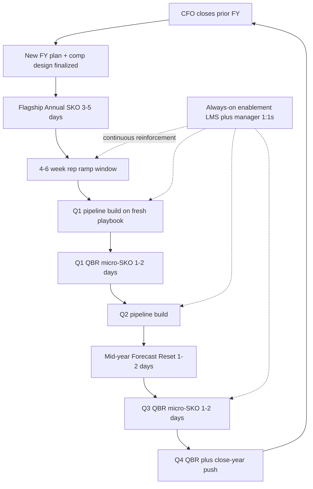

### Direct Answer

The optimal sales-kickoff frequency is a **tiered cadence architecture synchronized to your fiscal-year and forecast cycle, not a single annual event**. The canonical pattern for a $50M-$5B ARR B2B SaaS org is **one flagship annual SKO (3-5 days, FY-aligned), four quarterly QBR/micro-SKOs (1-2 days each, anchored to quarter boundaries), one mid-year Forecast Reset (1-2 days, ~6 months in), and always-on enablement** via spaced-repetition LMS plus weekly manager 1:1s. That totals roughly 30-45 live event days per year — 8-12% of working days — and exists because the Ebbinghaus forgetting curve erases 50-80% of single-event content within 30-60 days, so frequency must match the rate at which forecast accuracy decays, not the calendar's convenience.

**TL;DR:** Stop treating the SKO as a once-a-year ritual. Build a layered cadence — annual flagship for narrative + comp + methodology, quarterly micro-SKOs for pipeline calibration, a mid-year reset for re-segmentation, and continuous enablement to fight forgetting. Anchor every event to fiscal-quarter boundaries and forecast-close rhythm. Sales-cycle length is the master dial: velocity orgs go higher-cadence, enterprise orgs go lower-cadence with deeper reinforcement. Measure frequency against forecast accuracy and ramp time, never against attendance or satisfaction scores. The cadence is a steering wheel the data turns, not a calendar tradition.

---

## 1. Why Frequency Is a Forecast Problem, Not an Event Problem

Most revenue leaders inherit the SKO as a fixed institution: book the resort, fly everyone in, deliver the comp plan, repeat in twelve months. That framing is the root cause of the single most expensive enablement failure in B2B SaaS — content decay. The question "how often should we do kickoffs" is really the question "how fast does the behavior we installed at the last kickoff fall apart, and what cadence keeps it ahead of decay." Once you reframe frequency as a decay-management problem, the entire tiered architecture below stops looking like over-engineering and starts looking like the minimum viable design.

### 1.1 The Ebbinghaus Forgetting Curve Sets the Floor

Hermann Ebbinghaus's 1885 research, replicated repeatedly in modern corporate-learning studies, shows that learners forget roughly 50% of new information within an hour and 70-80% within 30-60 days without reinforcement. The 2015 Murre and Dros replication in *PLOS ONE* confirmed the curve's shape holds under controlled conditions, and ATD's annual corporate-learning data shows the same decay in workplace training that lacks structured follow-up.

Apply that to a sales kickoff. The methodology module, the new pitch, the competitive battlecard, and the comp-plan nuance you spent $400K and three days installing are 70%+ gone by the time Q1 pipeline matures. A single annual event is structurally incapable of holding behavior change for a full fiscal year. This is not a delivery-quality issue — even a flawless SKO decays on schedule. Frequency is the only lever that fights the curve, which is why "annual only" is always wrong above roughly 15 reps. Reinforcement events do not merely re-teach; spaced repetition resets the curve to a higher floor each time, so a rep who hits a quarterly micro-SKO retains more after each touchpoint than a rep relying on a single annual dose. The cadence is, in effect, a spaced-repetition schedule for the entire revenue org.

The practical consequence: every gap between events is a window in which the playbook silently degrades. If your only event is in January, your reps are operating on a 20-30% intact playbook by September — and they do not know it, because forgetting feels like knowing. That illusion of competence is precisely why leaders under-invest in cadence: the team never reports that the playbook has decayed, because the decayed playbook still feels familiar.

The decay also is not uniform across content types, which matters for cadence design. Three categories degrade at different rates:

- **Narrative and strategy** decays slowest — a clear "where the year is going" story can hold for months because reps reconstruct it from context every day they sell. This is why the flagship can carry the narrative on an annual cadence.
- **Skills and methodology** decay at a moderate rate — discovery technique, objection handling, and qualification rigor erode over 60-120 days without application, which is why they belong in the quarterly layer and the always-on layer, not the flagship.
- **Tactical detail** decays fastest — competitive battlecard specifics, the exact new pricing tier, the precise comp accelerator threshold are 80% gone within weeks, which is why these need monthly refreshes and live LMS reference rather than event delivery at all.

A cadence that ignores these different decay rates makes a predictable mistake: it loads fast-decaying tactical content into the slow-cadence flagship, where it is useless within a month, and starves the fast-cadence layers of the content they were built to carry.

### 1.2 Forecast Accuracy Is the Real Scoreboard

A sales kickoff exists to move three numbers: ramp time for new hires, attainment distribution across the team, and forecast accuracy — the gap between what reps commit and what closes. Of those three, forecast accuracy is the cleanest cadence proxy because it degrades visibly and on a predictable rhythm.

Pipeline built in Q1 against an SKO-fresh playbook forecasts tighter than pipeline built in Q3 against a half-remembered one. The reasons are mechanical: a rep running disciplined MEDDPICC qualification produces deal stages that mean what they say, so the rollup forecast is trustworthy; a rep whose qualification discipline has decayed produces inflated or mislabeled stages, and the forecast inherits that noise. Clari's forecast-accuracy benchmarking and Gong's revenue-intelligence data both show the same pattern — qualification rigor and forecast variance are tightly coupled.

When the commit-to-close variance widens past 15-20%, that is the cadence telling you it needs a touchpoint. This is the single most actionable signal in the entire model: you do not have to guess when to insert an event, because forecast variance announces it. The CRO-level pipeline-review discipline that surfaces this variance is covered in (q9638), and the deal-stage dynamics that distort it across regions are examined in (q449). A leader who watches commit-to-close variance the way a pilot watches altitude has a self-correcting cadence; a leader who watches only the SKO calendar has a cadence that drifts.

The link between cadence and forecast accuracy runs through a specific behavioral chain, and it is worth making the chain explicit because it is what justifies the cost of the entire cadence:

- **A fresh playbook produces consistent stage definitions.** When every rep on the team applies the same qualification criteria — installed at the flagship and reinforced quarterly — a "Stage 3" deal means the same thing across the pipeline, so the rollup is additive and trustworthy.
- **Consistent stage definitions produce a clean rollup.** The manager's forecast is the sum of the reps' forecasts; if the inputs are calibrated, the sum is calibrated.
- **A clean rollup produces an accurate company forecast.** The CRO commits a number to the board that holds, which is the entire point of forecast discipline.
- **Decay breaks the chain at link one.** As qualification rigor erodes between events, stage definitions drift, the rollup turns noisy, and the company forecast becomes a guess dressed as a number.

This is why "the SKO is an enablement expense" is the wrong frame. The SKO cadence is a forecast-integrity investment, and it should be evaluated on the same board-level seriousness as any other forecast-integrity control.

### 1.3 The Cadence Must Track the Fiscal Calendar

Forecast cycles are not abstract — they are bolted to the fiscal year. The CFO closes the books, the new FY plan and comp design land, reps need a 4-6 week ramp window, and then the first new-FY deals must close. The SKO has exactly one correct slot in that sequence: after FY close, before the ramp window opens.

Run it too early and the comp plan is not final, which means you deliver the year's single most behavior-shaping document as a draft — and reps anchor on the draft. Run it too late and Q1 pipeline is already built against stale assumptions, so the kickoff becomes a correction exercise instead of a launch. Every downstream micro-event then anchors to a quarter boundary so the cadence and the forecast rhythm stay phase-locked. The discipline is identical to the way a manufacturing line synchronizes to a takt time: the events are the beats, the forecast cycle is the metronome, and any event that drifts off the beat creates waste on both sides.

The diagram above is the whole model in one loop. Notice that the always-on enablement layer is the only element drawn as a continuous dotted feed rather than a discrete box — that is deliberate. The discrete events are the visible cadence; the continuous layer is the invisible one that actually holds the line between beats.

One more point about the loop: it is annual and self-renewing. The Q4 close-year push flows directly back into the next CFO close, which means the cadence is never "finished" — it is a permanent operating rhythm, not a project with an end date. Leaders who treat the SKO as an annual project to be executed and forgotten miss this. The orgs that compound enablement value are the ones that treat the entire loop as a standing system, reviewed and tuned every cycle, the same way they treat the forecast process itself. The cadence and the forecast process are, properly understood, the same machine viewed from two angles: one is the schedule of interventions, the other is the schedule of measurements, and they run on the same fiscal heartbeat.

---

## 2. The Tiered Cadence Architecture

A high-performing kickoff cadence has four layers, each with a distinct job, duration, and audience. Confusing the layers — for example, trying to deliver comp-plan strategy at a quarterly micro-SKO, or running a flagship-scale production for a routine pipeline review — is the most common and most expensive design error. Each layer below is defined by the job it does, and the job determines its frequency, not the other way around.

### 2.1 Layer One: The Flagship Annual SKO

The flagship is the strategic anchor. It is 3-5 days, FY-aligned, full sales organization in-person, and it carries the work that genuinely happens once a year: the new comp plan, the year's strategic narrative, the methodology refresh or change, major product-roadmap reveals, and culture and recognition.

It is the only event where flying the entire org to one location is justified by ROI, because three specific outputs cannot be replicated virtually or in smaller settings. First, the narrative — the CEO and CRO setting a single shared story of where the year is going, which becomes the frame every rep uses to interpret every subsequent decision. Second, the comp-plan installation — reps need to internalize how they get paid this year, and that absorption is materially better in a focused multi-day setting than in a deck emailed in January. Third, cross-team relationship density — the AE in Denver who meets the SE in Austin and the marketer in Boston builds the trust that later makes a cross-functional deal move faster. None of those three survive a 90-minute Zoom.

What the flagship is *not* is a training event. The instinct to cram twelve skills modules into the flagship is the reason so many SKOs feel like firehoses and decay instantly. The flagship sets direction; the quarterly layer and the always-on layer do the skill-building. The design pillars that make this event high-ROI rather than expensive theater — energy arc, content-to-celebration ratio, and pre-work — are detailed in (q459).

The flagship's payload should be deliberately short and deliberately deep. A useful operator rule of thumb for a 3-5 day flagship:

- **One narrative.** A single, memorable strategic story — not five competing priorities. Reps can carry one story through a year; they cannot carry five.
- **One comp model, fully installed.** Reps should leave able to explain exactly how they get paid and what behavior the plan rewards. If they cannot, the flagship failed at its primary job regardless of how it scored on the survey.
- **One methodology stance.** Install or reaffirm the methodology, then commit to reinforcing it everywhere else. Do not teach three frameworks at the flagship and hope one sticks.
- **Generous celebration and recognition.** This is not filler — recognition is part of why in-person ROI exists, and it is the emotional anchor that makes the narrative memorable.

Andy Byrne at Clari and the broader Pavilion operator community have repeatedly made the same point in different words: the flagship that tries to do everything does nothing, and the flagship that does three things deeply changes the year. A leader designing a flagship should be able to state, in one sentence each, the narrative, the comp message, and the methodology stance — and if any of the three is fuzzy, the agenda is not ready.

### 2.2 Layer Two: Quarterly QBR / Micro-SKOs

Four times a year, anchored to FY quarter boundaries, the org runs a 1-2 day micro-SKO. This is not a scaled-down flagship — it is a working session. The agenda is territory and pipeline review, competitive-intelligence refresh, deal-stage calibration, and targeted skill reinforcement on whatever the prior quarter's win-loss data flagged.

Micro-SKOs are frequently regional rather than all-hands, which cuts cost while raising relevance: a EMEA micro-SKO can spend its competitive block on the two vendors that actually contest EMEA deals instead of a global average. The forecast-calibration function here is what keeps commit-to-close variance inside tolerance — each micro-SKO is, in part, a structured reforecast where managers and reps reconcile the rollup. Run well, the quarterly layer is where the cadence earns most of its forecast-accuracy ROI, because it touches the team four times closer to the deals than the flagship can.

A common failure is letting the micro-SKO bloat back toward flagship scale — adding keynotes, celebration blocks, and travel until it is a three-day production that happens four times a year. That is over-eventing, and it shows up as pipeline-build gaps in the quarters around it. The micro-SKO must stay lean, working, and ruthlessly programmed by data.

The discipline test for a healthy micro-SKO is simple: a rep should leave with a concrete change to how they will work the *current* quarter's pipeline, not a warm feeling. The agenda blocks that pass that test are:

- **Pipeline inspection** — walking real, named deals through the methodology, not reviewing aggregate dashboards.
- **Competitive refresh** — the one or two competitors that actually contested last quarter's deals, with updated counter-positioning.
- **Stage calibration** — reconciling what reps call each stage so the rollup stays trustworthy.
- **Targeted skill work** — the single skill gap last quarter's win-loss data flagged most loudly, drilled, not lectured.

Anything that does not change how a rep works this quarter belongs in the flagship or the always-on layer, not the micro-SKO. Keeping the micro-SKO this disciplined is also what makes it cheap enough to run four times a year without the cost line drawing CFO scrutiny.

### 2.3 Layer Three: The Mid-Year Forecast Reset

Roughly 5-6 months into the fiscal year, the org runs a 1-2 day Forecast Reset, sometimes branded an FRR or an H2 summit. Its job is the single most under-built event in the cadence: re-segmentation of accounts, comp recalibration for reps tracking far above or below quota, leadership realignment on H2 priorities, and an honest reforecast of the full year.

The mid-year reset exists because the assumptions baked into the January plan are, by July, demonstrably wrong in specific places — a segment overperformed, a competitor changed pricing, a product slipped, two territories are mis-sized. Without a structured reset, those errors compound. The classic failure pattern is "H1 plan dragged through H2," where leadership knows the plan is off but never creates the forum to officially change it, so reps spend the second half selling against a forecast everyone privately distrusts. That destroys second-half forecast accuracy and, worse, teaches the team that the forecast is theater. The mid-year reset is the institutionalized permission to be honest about the year halfway through.

The reset should produce four concrete outputs, and an event that produces fewer than three of them was a status meeting, not a reset:

- **A revised full-year forecast** that leadership will actually commit to — replacing the January number, not annotating it.
- **A territory and account re-segmentation** that fixes the mis-sized patches H1 actuals exposed.
- **A comp recalibration plan** for the reps tracking far above or far below quota, so the second half stays motivating rather than demoralizing.
- **A re-prioritized H2 focus** — which segments, products, and motions get the team's energy for the back half.

Operators who run forecast-disciplined organizations — the *Amp It Up* school that Frank Slootman codified at Snowflake (SNOW), and the forecast-rigor culture Andy Byrne built the Clari product around — treat the mid-year reset as non-negotiable, because they understand that an unrevised plan is a plan that has quietly become fiction by month seven.

### 2.4 Layer Four: Always-On Enablement

The continuous layer is what actually fights the forgetting curve between events. It runs on spaced-repetition LMS platforms — Highspot, Mindtickle (now part of Highspot), Seismic, or SalesHood — paired with weekly 30-60 minute manager 1:1 reinforcement and monthly methodology micro-sessions.

This is the layer most orgs underfund, and it is the layer with the highest marginal ROI, because it converts a decaying event into sustained behavior. Highspot's own *State of Sales Enablement* research and Mindtickle's readiness-index data both show that reinforcement frequency, not initial training quality, is the dominant predictor of skill retention. The always-on layer is also where the manager becomes the real enablement engine: a weekly 1:1 that consistently reviews one deal against the methodology does more for retention than any single event, because it is the highest-frequency, lowest-cost reinforcement touchpoint available.

The build-vs-buy and ownership question for this function — whether it lives under a dedicated enablement leader or under RevOps — is addressed in (q395), and measuring its true revenue impact rather than course-completion vanity metrics is covered in (q262). A cadence with a strong always-on layer can run a leaner event schedule; a cadence with a weak one is forced to over-event to compensate, and over-eventing has its own costs.

The always-on layer has three sub-components, and a healthy layer runs all three rather than leaning entirely on the LMS:

- **The LMS spine** — Highspot, Mindtickle, Seismic, or SalesHood — delivering spaced-repetition micro-modules, housing the live reference content (battlecards, pricing, playbook), and capturing readiness signals.
- **The manager 1:1 engine** — a weekly 30-60 minute conversation that reviews at least one live deal against the methodology. This is the single highest-leverage reinforcement touchpoint in the entire cadence, because it is weekly, contextual, and one-to-one.
- **The monthly methodology micro-session** — a short, team-level reinforcement on one methodology element, keeping the through-line alive between quarterly events.

The most common always-on failure is buying the LMS and stopping there — treating the platform as the program. A platform without the manager 1:1 engine is a content library, not an enablement layer; the manager is what converts library content into field behavior, which is why the manager-coaching cadence is itself a design decision, not an afterthought.

| Layer | Frequency | Duration | Primary Job | Audience | Format |
|-------|-----------|----------|-------------|----------|--------|
| Flagship Annual SKO | 1x / year | 3-5 days | Comp plan, narrative, methodology, culture | Full sales org | In-person |
| Quarterly QBR / Micro-SKO | 4x / year | 1-2 days | Pipeline calibration, comp refresh, skills | Region or segment teams | Hybrid / regional |
| Mid-Year Forecast Reset | 1x / year | 1-2 days | Re-segmentation, reforecast, realignment | Leadership + full team | In-person or hybrid |
| Always-On Enablement | Continuous | Weekly / monthly | Reinforcement, micro-learning, coaching | Every rep + manager | Virtual / async |

---

## 3. Anchoring the Cadence to Your Fiscal Year

There is no universal "January SKO." The correct flagship slot is a function of when your specific fiscal year closes. The pattern below maps real public companies' fiscal calendars to their canonical SKO window, and the underlying rule is identical for all of them: the flagship lands after close, before the ramp window.

### 3.1 Fiscal-Year-to-SKO-Window Mapping

For a calendar fiscal year, Q4 closes on December 31 and the flagship SKO lands in late January once the books are closed and comp is final. February-fiscal-year companies such as Salesforce (CRM) — whose fiscal year ends January 31 — run a mid-February kickoff that mirrors the rhythm of Dreamforce, their flagship customer event. July-fiscal-year companies anchor to their own close dates rather than the calendar: Snowflake (SNOW) reports a fiscal year ending January 31, and Adobe (ADBE) closes its fiscal year in late November or early December, so each anchors its kickoff to its own disclosed fiscal calendar rather than to a generic January default.

Microsoft (MSFT) runs a June 30 fiscal year, so its global sales kickoff and FY-planning cadence land in mid-July under the long-running "Microsoft Ready" banner — a useful proof point that a July SKO is not exotic, it is simply correct for a June-close company. ServiceNow (NOW) and Workday (WDAY) sit at the two common poles: NOW on a calendar December 31 close with a late-January kickoff, WDAY on a January 31 close with a February kickoff.

| Company | Ticker | Fiscal Year End | Canonical SKO Window |
|---------|--------|-----------------|----------------------|
| Calendar-FY SaaS (default) | — | December 31 | Late January |
| Salesforce | CRM | January 31 | Mid-February |
| Microsoft | MSFT | June 30 | Mid-July (Microsoft Ready) |
| Snowflake | SNOW | January 31 | February |
| Adobe | ADBE | Late November / early December | January |
| ServiceNow | NOW | December 31 | Late January |
| Workday | WDAY | January 31 | February |
| Atlassian | TEAM | June 30 | July / August |

The takeaway is not the specific dates — it is the rule. Find your fiscal close, add the comp-finalization window, and the flagship slot is determined. Any leader running a January SKO simply because the previous leader did, without checking the fiscal close, is anchoring the year's most important event to inertia.

There is also a second-order effect worth planning for: the SKO competes for calendar space with the company's flagship *customer* event. Salesforce's (CRM) Dreamforce, ServiceNow's (NOW) Knowledge, Atlassian's (TEAM) Team event, and Adobe's (ADBE) Summit each consume significant sales-team bandwidth, and a kickoff scheduled on top of customer-event prep season fights itself for rep attention. The well-run cadence deliberately spaces the internal SKO and the external customer event so neither cannibalizes the other — another reason the fiscal-anchored slot, rather than a convenient calendar slot, tends to be correct.

### 3.2 The Forecast-Close-to-First-Deal Sequence

The flagship SKO must sit inside a tight window: CFO close, then comp finalization, then SKO, then a 4-6 week ramp, then the first new-FY deal closes. The sequence is causal, not arbitrary. Comp must be final before the SKO because the SKO is where comp is installed into behavior; the SKO must precede the ramp window because reps need the new playbook before they build pipeline against it; and the ramp window must be protected because a deal closed in week one of the FY on a stale playbook is a deal forecast badly.

Marc Benioff built Salesforce's (CRM) February cadence precisely so the kickoff narrative and the new compensation design land before Q1 pipeline gets seriously built, as he describes in *Trailblazer*. Frank Slootman, during his Snowflake (SNOW) tenure, was rigorous about forecast discipline — his *Amp It Up* operating philosophy treats the reforecast rhythm as the company's heartbeat, which is exactly the discipline a tiered SKO cadence operationalizes. The lesson from both operators is the same: the kickoff is not a celebration that happens to occur in winter, it is a precisely timed forecast-cycle component, and operators who treat its timing casually pay for it in Q1 forecast noise.

The same logic appears in the operating philosophies of other named revenue leaders. Carl Eschenbach, who ran field operations at VMware before becoming CEO of Workday (WDAY), is known for treating cadence and forecast rigor as inseparable — the kickoff exists to launch a forecast cycle, not to entertain. Mark Roberge, who built HubSpot's (HUBS) revenue engine and later wrote *The Sales Acceleration Formula*, made the case in metric terms: every enablement event should be tied to a measurable change in rep behavior and a measurable change in a pipeline number, or it should not be on the calendar. Across all of these operators the pattern is identical — the kickoff is a forecast-cycle instrument, and the leaders who outperform are the ones who treat its timing with the precision they would give any other forecast control.

There is one more timing subtlety: the gap between fiscal close and the SKO must be long enough to finalize comp but short enough that pipeline does not get built in the vacuum. Too short, and the org delivers a draft comp plan; too long, and reps spend three or four weeks of the new year selling without a refreshed playbook. The well-run cadence treats that gap as a designed window, typically two to four weeks, not an accident of scheduling.

### 3.3 When the Calendar and the Forecast Disagree

Occasionally the org's natural buying season conflicts with the fiscal calendar — for example, a security vendor whose deals cluster around a Q4 budget-flush season but whose fiscal year starts February 1. In that case the flagship still anchors to fiscal close, because comp must be correct and the comp plan is the flagship's core payload. What flexes is the quarterly layer: the micro-SKO immediately preceding the buying-season quarter gets upweighted to a heavier 2-day event with extra competitive and deal-execution content, so reps enter the high-volume quarter sharp.

The principle is a hierarchy. The fiscal anchor is fixed because comp accuracy is non-negotiable. The quarterly cadence is flexible because its job is calibration, and calibration can be re-weighted toward the quarters that matter most. A leader who inverts this — moving the flagship to chase buying season and letting comp land late — trades a fixable problem (uneven quarterly weighting) for an unfixable one (a comp plan reps anchored on while it was still a draft).

---

## 4. Sizing the Cadence by Company Stage and Sales Motion

The four-layer architecture is the template, but the dial settings change with ARR scale and sales-cycle length. A 25-rep Series B company and a 2,000-rep public company should not run the same cadence, and the most common scaling mistake is either freezing an early-stage cadence as the company grows or front-loading a late-stage cadence before the company can absorb it.

### 4.1 The Stage-to-Cadence Matrix

Below $20M ARR, the org typically runs one flagship SKO plus quarterly all-hands check-ins and leans hard on always-on enablement, because travel budget is scarce and every event day is a painfully visible selling day lost. From $50M to $500M, the full four-layer model applies cleanly — the org is large enough that the cadence's forecast-accuracy ROI clearly outweighs its cost. Above $1B ARR, the flagship often splits into regional kickoffs feeding a smaller global leadership summit, because a single all-hands venue becomes logistically and financially prohibitive — there is no hotel that holds 3,000 reps affordably, and the cross-team relationship benefit saturates well before that headcount.

| ARR Stage | Flagship | Quarterly Micro-SKO | Mid-Year Reset | Always-On |
|-----------|----------|---------------------|----------------|-----------|
| <$20M (Series A/B) | 1x annual, 2-3 days | All-hands check-in, virtual | Optional, 1 day | Critical — primary layer |
| $20M-$50M | 1x annual, 3 days | 4x, 1 day, regional | 1x, 1 day | Heavily funded |
| $50M-$500M | 1x annual, 3-5 days | 4x, 1-2 days, regional | 1x, 1-2 days | Standard four-layer |
| $500M-$1B | 1x annual, 4-5 days | 4x, 2 days, regional | 1x, 2 days | Mature LMS + coaching |
| >$1B | Regional + global summit | 4x, regional | 1x H2 summit | Enterprise enablement org |

The matrix is a starting point, not a prescription. The right move at any stage is to start one layer lighter than the matrix suggests, watch forecast accuracy and ramp time, and add intensity only when the data demands it. Cadence is far easier to add than to remove — reps notice and resent a downgraded event — so under-provisioning and scaling up beats over-provisioning and cutting back.

The transitions between stages are where most cadence mistakes happen, and three of them are worth naming explicitly:

- **The $20M crossing — adding the quarterly layer.** Below $20M the org runs essentially on a flagship plus always-on; crossing $20M is when the quarterly micro-SKO becomes worth its cost. The mistake is adding it too late, after forecast variance has already widened, rather than as a planned step.
- **The $50M crossing — adding the mid-year reset.** At $50M the org is large enough that H1 plan errors compound expensively; the mid-year reset moves from optional to standard. Skipping it here is the most common reason $50M-$100M companies post weak second halves.
- **The $1B crossing — splitting the flagship.** Above $1B a single all-hands flagship becomes logistically untenable and the cross-team relationship benefit has saturated. The move is regional flagships feeding a leadership summit. Holding onto a single global flagship past this point is expensive nostalgia.

A leader who plans these transitions in advance scales the cadence smoothly; a leader who reacts to them only after a metric breaks always pays a quarter or two of forecast noise for the delay.

### 4.2 Sales-Cycle Length Is the Master Dial

The single most important variable after fiscal anchoring is sales-cycle length, because the rep behavior-change cycle should match the deal cycle. This is the dial that most leaders ignore, and ignoring it produces cadences that are technically frequent but functionally mistimed.

Transactional, SMB, and velocity motions with sales cycles of 30 days or less benefit from higher-cadence quarterly micro-SKOs plus monthly product and comp refreshes. In a 30-day-cycle business, a rep runs through their entire deal cycle a dozen times a year, so the behavior loop is fast, the playbook changes often, and reinforcement must keep pace. A quarterly-only cadence in a velocity org leaves the playbook stale for most of each quarter.

Enterprise and strategic motions with 6-12+ month sales cycles benefit from a lower-cadence annual flagship plus semi-annual reinforcement plus deep always-on enablement for methodology and named-account intelligence. Here the rep behavior-change cycle is measured in quarters, so a heavy event cadence is not just unnecessary — it is actively harmful. Over-frequent in-person events pull enterprise reps out of the field at critical deal moments; a rep choreographing a 12-month deal cannot afford to lose three days mid-negotiation to a micro-SKO that, given the slow behavior cycle, they did not need. The cadence for sales training specifically in a smaller 30-rep org is examined in (q127), and it follows the same logic: match the training rhythm to the motion's natural tempo.

| Sales Motion | Typical Cycle | Behavior-Change Loop | Optimal Event Cadence |
|--------------|---------------|----------------------|------------------------|
| Velocity / SMB / transactional | ≤30 days | Fast, weeks | High — quarterly micro-SKOs + monthly refreshes |
| Mid-market | 60-120 days | Moderate, months | Standard four-layer |
| Enterprise / strategic | 6-12+ months | Slow, quarters | Lower — annual flagship + semi-annual + deep always-on |
| Public sector / regulated | 12-18+ months | Very slow, multi-quarter | Minimal events + heavy named-account intelligence |

### 4.3 Integrating Ramps and New Hires

A tiered cadence has a hidden benefit: it gives new hires multiple structured re-entry points instead of one. In an annual-only model, a rep who joins in May has missed the kickoff entirely and will not see another structured org-wide event for eight months — they ramp in a vacuum. In the tiered model, that same May hire catches the mid-year reset and two quarterly micro-SKOs before completing their first full fiscal year, each one a checkpoint that re-anchors them to the current playbook.

This matters because ramp time is one of the three numbers the cadence exists to move, and new-hire integration done badly inflates it. The deliberate design of how ramps and new hires plug into kickoff events — dedicated onboarding tracks, buddy and mentor systems, accelerated methodology modules, and pre-event readiness gates — is its own discipline, covered in detail in (q467). A cadence designed only for tenured reps quietly taxes every new hire; a cadence designed with ramp checkpoints in mind compounds the always-on layer's onboarding work.

A practical way to design this is to map each event to what it does for a rep at a given tenure:

- **Day-one to 30 days** — the always-on LMS onboarding track and a buddy carry the load; no event has happened yet, so the layer must stand alone.
- **First quarterly micro-SKO** — the new hire's first org-wide checkpoint, where they calibrate stage definitions against the team and meet their regional peers.
- **First mid-year reset or flagship** — the new hire's first full strategic immersion, where the narrative and comp model land in depth.

The hiring pattern of the business changes how much this matters. An org hiring in steady monthly cohorts benefits enormously from the multiple re-entry points; an org that hires in one large pre-flagship class can lean more on the flagship itself. Either way, designing the cadence as if every rep joined in January is the error — most reps did not.

### 4.4 The 30-45 Day Budget Reality

Summed across all four layers, a mature $50M-$500M org spends roughly 30-45 cumulative live-event days per year, which is 8-12% of the roughly 250 working days in a year. That is a real cost in two currencies: dollars — travel, venue, production, content development — and, more importantly, selling time, because every event day is a day reps are not in front of buyers.

Because the cost is real, the cadence must be defended with forecast-accuracy and ramp-time data, not asserted as tradition. The discipline is to treat the cadence like any other revenue investment: it has a cost line and a return line, and the return line must be measured. Anything pushing past 15% of working days is over-eventing — at that point the marginal event is consuming more selling time than the forgetting curve justifies, and it will show up as pipeline-build gaps in the surrounding weeks. The 8-12% band is not a hard law, but it is a well-supported range, and a leader operating well outside it should have a specific, data-backed reason.

It is worth being concrete about the dollar side as well, because the selling-time cost often hides the cash cost. A flagship for a mid-sized org carries venue and catering, travel and lodging for the full team, production and AV, external speakers or facilitators, and content-development hours — easily a six-figure event before the selling-time cost is counted. The quarterly micro-SKOs are cheaper per event but recur four times; the mid-year reset sits in between; the always-on layer is mostly a fixed LMS license plus content-development labor. A useful budgeting discipline is to express the entire cadence as a single annual enablement-cadence line, set against the forecast-accuracy and ramp-time improvement it produces, so the CFO sees one investment with one return rather than a scatter of event invoices. A cadence presented as scattered invoices gets cut invoice by invoice; a cadence presented as one investment with one measured return gets defended as a whole.

| Cost Currency | Flagship | Quarterly (x4) | Mid-Year | Always-On | Annual Total |
|---------------|----------|----------------|----------|-----------|--------------|
| Event days per rep | 3-5 | 4-8 | 1-2 | ~10-15 (spread) | ~30-45 |
| Direct $ driver | Venue, travel, production | Regional travel | Travel | LMS license, content | Largest line: flagship |
| Selling-time risk | High (whole org out) | Moderate (regional) | Moderate | Low (async-friendly) | 8-12% of working days |

---

## 5. Designing Each Event for Its Audience and Job

Frequency without differentiated content design produces "the same SKO four times," which trains reps to disengage — and a disengaged rep gets zero retention from an event regardless of how often you run it. Each layer needs distinct content built for distinct roles, and the design discipline is as important as the cadence discipline.

### 5.1 Role-Differentiated Content

AEs, SDRs, and front-line managers need different things from the same event. AEs need deal-execution, negotiation, and competitive content — the skills that move late-stage pipeline. SDRs need prospecting, qualification, and pipeline-generation content — the skills that create early-stage pipeline. Front-line managers need coaching, forecasting, and team-performance content — the skills that multiply everyone else's output.

Running a single undifferentiated track forces every role to sit through two-thirds of an agenda that does not apply to them, which is both a retention killer and a selling-time waster. The fix is breakout tracks: a shared general session for narrative and comp, then role-specific tracks for skill content. The full breakdown of how to design kickoff content by role — and how to avoid the common trap of building everything for the AE and bolting on a thin SDR track — is covered in (q464), and the post-event reinforcement system that keeps that content from collapsing back down the forgetting curve is detailed in (q461).

The role-differentiation principle extends beyond just AEs, SDRs, and managers. A mature cadence also designs content for:

- **Sales engineers and solution consultants** — technical positioning, demo refreshes, and competitive technical objections, which a pure AE track ignores.
- **Customer success and account managers** — expansion plays and renewal-risk signals, increasingly part of the kickoff as net-revenue-retention becomes a board metric.
- **Second-line managers and regional VPs** — forecast governance, talent planning, and the coaching-the-coaches layer that front-line manager content does not reach.

The general session should be short and shared; the breakout time should be long and specific. A flagship that runs 80% general session and 20% breakout has inverted the ratio — the narrative needs an hour, not a day, and the role-specific skill work is where the remaining time earns its return.

### 5.2 In-Person vs. Virtual by Layer

The flagship is in-person — the narrative, comp-installation, and relationship-density ROI genuinely justifies the cost, and a virtual flagship reliably underdelivers on all three. Quarterly micro-SKOs are increasingly hybrid or virtual, especially the regional ones, because their working-session nature survives a screen far better than a narrative keynote does. The mid-year reset usually wants at least the leadership cohort in a room.

The format decision is not cosmetic — it changes engagement, cost, and content design. A virtual event needs shorter blocks, more interaction, and tighter facilitation to fight screen fatigue; an in-person event can sustain longer arcs and depends on physical-room energy. The structural tradeoffs between in-person and virtual kickoff formats, and how to design each for maximum engagement rather than treating virtual as a degraded copy of in-person, are detailed in (q460). The venue and location decision — which drives both attendance and post-event deal impact through factors as concrete as travel friction and time-zone load — is covered in (q465).

### 5.3 Methodology as the Through-Line

The methodology — MEDDPICC, Challenger, Sandler, or a deliberate blend — should be installed at the flagship and then reinforced at every subsequent touchpoint, never re-taught from scratch. A common failure is re-introducing methodology at each event as if reps had never seen it, which both wastes time and signals that the org does not expect the methodology to stick. The correct pattern is install once, then reinforce through application: each quarterly micro-SKO works real deals through the methodology, and each weekly 1:1 reviews one deal against it.

Operationalizing methodology without crushing rep morale — making it a deal-acceleration tool reps want rather than a CRM-field tax they resent — is its own art, addressed in (q393). Applying methodology frameworks specifically to strengthen discovery and competitive positioning is covered in (q488). And the foundation the methodology enables is disciplined discovery: reps who run effective discovery conversations close faster and forecast more accurately, as examined in (q373). The through-line discipline ties the entire cadence together — without a single consistent methodology threaded through every layer, the events become a sequence of disconnected content drops.

### 5.4 Win-Loss Intelligence Feeds the Cadence

Each quarterly micro-SKO should be partly programmed by the prior quarter's win-loss data — the objections that lost deals, the competitors that won and how, the messaging that fell flat in the field. This is what makes the quarterly layer a working session rather than generic training: the agenda is built from evidence about what actually happened to the team's deals.

An internal win-loss program generates exactly this signal, and running one well without an outside firm is its own discipline, covered in (q1168). Competitive battlecards built from that win-loss intelligence are a recurring micro-SKO content block, and designing battlecards that actually change rep behavior in the field rather than gathering dust is examined in (q478). The loop is the point: win-loss data feeds the micro-SKO, the micro-SKO sharpens rep behavior, sharper behavior produces cleaner win-loss data, and the cadence gets smarter every quarter.

This self-improving property is what separates a mature cadence from a static one. A static cadence runs the same agenda categories every quarter regardless of evidence; a mature cadence treats each event as an intervention aimed at a specific, measured gap. The inputs that should drive each event are concrete and available:

- **Win-loss interviews** surface which objections lost deals and which competitors won — the raw material for the competitive and skills blocks.
- **Forecast-variance data** shows where stage definitions have drifted — the raw material for the calibration block.
- **Ramp-time and attainment data** show which cohorts and segments are underperforming — the raw material for targeting the right reps with the right content.
- **CRM activity and conversation-intelligence data** from tools like Gong show which behaviors actually correlate with won deals — the raw material for deciding what to reinforce.

An org that programs its cadence from these inputs runs events that change quarter to quarter as the business changes. An org that programs from last year's template runs the same SKO repeatedly and wonders why retention is flat. The cadence is not just a schedule of events — it is a closed-loop system, and the loop only closes if evidence drives the agenda.

| Event Layer | AE Focus | SDR Focus | Manager Focus | Programmed By |
|-------------|----------|-----------|---------------|---------------|
| Flagship SKO | Comp plan, narrative, methodology | New target ICP, prospecting refresh | Coaching model, forecast discipline | FY strategy + comp design |
| Quarterly Micro-SKO | Pipeline review, competitive refresh | Conversion-rate calibration | Territory rebalancing | Prior-quarter win-loss data |
| Mid-Year Reset | Re-segmentation, H2 quota | H2 outbound focus | Reforecast, comp recalibration | H1 actuals vs. plan |
| Always-On | Deal-cycle micro-learning | Daily prospecting reps | Weekly 1:1 coaching cadence | Individual rep gaps |

---

## 6. Measuring Whether the Cadence Is Working

A cadence you cannot measure is a cadence you cannot defend in a budget cycle, and a cadence you cannot defend will eventually be cut by a CFO who sees only the cost line. The metrics fall into two tiers: leading indicators that tell you the cadence is functioning in near-real time, and the lagging forecast metric that tells you it ultimately worked.

### 6.1 The Metric Stack

Track five numbers: forecast accuracy (commit-to-close variance), ramp time to full productivity, attainment distribution across the team, pipeline coverage ratio, and methodology adoption rate. Each one reads as a specific cadence signal, and the value of the stack is that the signals point to different fixes — a slowing ramp says strengthen the always-on layer, a thin pipeline quarter says check micro-SKO timing, a bimodal attainment curve says the coaching layer has a gap.

The discipline of measuring kickoff ROI in a way that actually sticks to forecasts — rather than evaporating in the warm glow of a post-event satisfaction survey — is the specific subject of (q462). The core idea there is to tie the event to a forecast-relevant number before the event happens, so the measurement is not a retrofit.

The measurement should also be cadence-specific, because each layer has a different success signal:

- **The flagship is measured on narrative adoption and comp comprehension** — can reps, a month later, state the year's strategy and explain how they get paid? A clean test is a short post-flagship check, not a satisfaction survey.
- **The quarterly micro-SKO is measured on forecast variance** — did commit-to-close accuracy tighten in the quarter following the event? This is the most direct read of whether the working session worked.
- **The mid-year reset is measured on H2 forecast hold** — did the revised plan prove more accurate than the original January plan would have?
- **The always-on layer is measured on ramp time and retention curves** — are new hires reaching productivity faster, and is methodology adoption holding between events?

Measuring all four layers with one undifferentiated "SKO ROI" number hides which layer is working and which is wasting money. A leader who can name the success metric for each layer can defend or cut each layer on its own merits.

| Metric | What It Tells You | Healthy Direction | Cadence Signal If It Breaks |
|--------|-------------------|-------------------|------------------------------|
| Forecast accuracy (commit vs. close) | Is the playbook holding? | Variance under 15-20% | Widening means add or upweight a touchpoint |
| Ramp time to full productivity | Are new hires onboarding fast? | Trending down | Slowing means strengthen the always-on layer |
| Attainment distribution | Is the quota curve healthy? | Tightening around quota | Bimodal split means a coaching-layer gap |
| Pipeline coverage ratio | Enough pipeline per quarter? | 3-4x of quota | Thin in a quarter means micro-SKO timing is off |
| Methodology adoption | Is behavior change sticking? | Rising | Decay means the forgetting curve is winning |

### 6.2 The Forecast-Accuracy Feedback Loop

The cadence is self-tuning if you let the data drive it. When commit-to-close variance widens, that is the signal to insert or upweight a touchpoint — not at the next calendar slot, but when the metric calls for it. When ramp time slows, the fix is investment in the always-on layer, not another flagship; adding a second big event to fix a ramp problem is a category error, like adding a second annual physical to fix a daily-exercise gap.

The mistake leaders make is treating the cadence as fixed and the metrics as a report card delivered after the fact. The metrics are not a report card — they are the steering wheel. A leader who reviews forecast accuracy monthly and adjusts the cadence accordingly has a system that compounds; a leader who runs the same cadence every year and reads the metrics only at planning time has a system that drifts until something breaks visibly. The feedback loop is what turns a static event calendar into an adaptive revenue instrument.

In practice, the feedback loop has a natural review rhythm of its own. The five metrics should be read at three frequencies: forecast variance and pipeline coverage reviewed monthly, because they move fast enough to warrant a near-term touchpoint decision; ramp time and attainment distribution reviewed quarterly, because they move on a slower cohort cycle; and methodology adoption reviewed at each event, because the events are themselves the adoption interventions. A leader who installs that review rhythm has, in effect, a thermostat for the cadence — the metrics read continuously, and the cadence adjusts in small increments rather than lurching once a year at planning time. The small-increment adjustment matters: inserting a half-day reinforcement touchpoint when variance ticks up is cheap and reversible, whereas overhauling the entire cadence after a bad year is expensive and disruptive.

### 6.3 Avoiding Vanity Metrics

Attendance, satisfaction scores, and LMS course-completion rates feel like measurement but are vanity metrics — they confirm the event happened and was pleasant, not that behavior changed or that the forecast tightened. A cadence optimized for high satisfaction scores will quietly drift toward entertainment: more celebration, more guest speakers, more spectacle, less hard skill-building, because spectacle scores well on a survey and skill-building does not.

The deeper problem of measuring an enablement function's real revenue impact versus course-completion theater is precisely the subject of (q262), and it applies directly to kickoff cadence. The honest test for any event is not "did reps enjoy it" but "did the five metrics in the stack above move in the right direction in the months after it." A leader who reports SKO success in attendance and Net Promoter Score is, knowingly or not, defending the cadence with the weakest possible evidence — and a CFO will eventually notice.

---

## Counter-Case: When the Tiered Cadence Is the Wrong Answer

The four-layer model is the default for $50M-$5B B2B SaaS, but it is not universal, and applying it dogmatically destroys value in several real scenarios. A disciplined leader knows the model's boundaries as well as its content.

**Very small or very early-stage orgs.** Below roughly 15 reps, a Series A company running four micro-SKOs plus a mid-year reset plus a flagship is over-eventing — the cadence consumes selling time the company cannot spare and installs process for its own sake before there is enough scale to justify it. At that stage, one focused annual kickoff plus disciplined weekly manager 1:1s and a lightweight LMS is the entire correct cadence. The org should add layers as it crosses $20M and then $50M ARR, not front-load them. The instinct to "build the cadence we will need later" is, at sub-scale, just expensive theater.

**Pure velocity and PLG motions.** A product-led-growth company where most revenue self-serves and the sales team handles only expansion may not need a flagship SKO at all — its functional "kickoff" is a quarterly product and packaging update, because the buying motion changes faster than an annual narrative can keep up with. For these orgs, frequency should be high and event duration short; a 3-day flagship is a poor fit for a motion that re-prices and re-packages every quarter. The forgetting-curve logic still applies, but it points toward many short touchpoints rather than one long one.

**Long-cycle enterprise and government sales.** An org selling 12-18 month enterprise or public-sector deals can be actively harmed by quarterly micro-SKOs that pull reps out of the field during multi-month deal choreography. For these orgs the correct cadence skews toward fewer, deeper events — an annual flagship plus a single substantial mid-year reinforcement — with the always-on layer carrying named-account intelligence and methodology depth. The behavior-change cycle here is measured in quarters, so the event cadence should be too; a high-frequency cadence borrowed from a velocity playbook is one of the most common and most damaging cadence mistakes in enterprise sales.

**Crisis or transformation years.** When an org is mid-restructure — a new comp model, a major segment realignment, a CRO transition, an acquisition integration — the normal cadence is insufficient and should be temporarily over-clocked. In a transformation year the right move is monthly all-hands realignment touchpoints until the change stabilizes, then a return to the standard tiered rhythm. The cadence is a baseline, not a cage; a leader who rigidly holds the four-layer model through a transformation year is under-communicating exactly when communication matters most.

**Highly distributed or fully remote orgs.** A company with no offices and a globally scattered team faces a different cost structure — every event is a travel event, with no "local" option — which can push the optimal cadence toward fewer in-person events and a much heavier virtual and async always-on layer. The four layers still exist, but the in-person/virtual mix shifts hard toward virtual, and the flagship may become the only in-person event of the year.

**The honest tradeoff.** Every event day is a selling day spent. The tiered cadence wins because forecast accuracy and ramp time improve enough to more than repay 8-12% of working days — but that ROI is empirical, not automatic. If your forecast accuracy is already tight and your ramp is already fast, adding events is negative ROI, full stop. The cadence should be the minimum frequency that keeps behavior change ahead of the forgetting curve, and not one event day more. The disciplined approach to win-loss timing and triggers (q240) and to vertical-specialization decisions (q263) follows the same principle: add structure when the data demands it, not when the calendar suggests it, and be as willing to remove a layer as to add one. A cadence that only ever grows is not a strategy — it is accumulated tradition wearing a strategy's clothes.

---

### Sources & Further Reading

1. Ebbinghaus, H. (1885). *Memory: A Contribution to Experimental Psychology* — foundational forgetting-curve research.
2. Murre, J. & Dros, J. (2015). "Replication and Analysis of Ebbinghaus' Forgetting Curve," *PLOS ONE* — modern replication confirming 50-80% decay.
3. ATD (Association for Talent Development), *State of Sales Training* annual report — corporate-learning retention benchmarks.
4. Gartner, "Sales Enablement Spending and Cadence Benchmarks" research note.
5. Forrester, "B2B Sales Kickoff ROI" analyst commentary.
6. SiriusDecisions / Forrester sales-enablement maturity model.
7. CSO Insights / Miller Heiman, *World-Class Sales Practices Study* — enablement frequency vs. attainment correlation.
8. Slootman, F. (2022). *Amp It Up* — forecast-discipline operating philosophy at Snowflake (SNOW).
9. Benioff, M. (2019). *Trailblazer* — Salesforce (CRM) cadence and culture.
10. Salesforce (CRM) Investor Relations — fiscal year ending January 31 confirmation.
11. Microsoft (MSFT) Investor Relations — fiscal year ending June 30; "Microsoft Ready" kickoff.
12. Snowflake (SNOW) 10-K — fiscal calendar disclosure.
13. Adobe (ADBE) 10-K — fiscal-year-end disclosure.
14. ServiceNow (NOW) Investor Relations — calendar fiscal year.
15. Workday (WDAY) Investor Relations — fiscal calendar.
16. Atlassian (TEAM) Investor Relations — June 30 fiscal year.
17. Highspot, *State of Sales Enablement* report — spaced-repetition reinforcement data.
18. Mindtickle (Highspot) readiness-index research.
19. Seismic, sales-enablement ROI benchmark report.
20. SalesHood, kickoff-design best-practice library.
21. Harvard Business Review, "The Forgetting Curve and Sales Training."
22. McKinsey, "Sales Productivity and Enablement Cadence" insight article.
23. Bain & Company, "Why Sales Kickoffs Fail" commentary.
24. HubSpot Research, *Sales Enablement Benchmark* data.
25. Sales Management Association, kickoff-frequency survey.
26. RAIN Group, *Top-Performing Sales Organization* research.
27. Korn Ferry / Miller Heiman methodology-adoption research.
28. Dixon, M. & Adamson, B. (2011). *The Challenger Sale* — methodology installation framework.
29. Sandler Training, reinforcement-cadence methodology.
30. MEDDIC Academy, MEDDPICC enablement-cadence guidance.
31. Gong.io revenue-intelligence data on pipeline coverage and forecast variance.
32. Clari, *Forecast Accuracy Benchmark* report.
33. LinkedIn *State of Sales* annual report — ramp-time benchmarks.
34. SBI (Sales Benchmark Index), annual sales-planning cadence research.
35. Pavilion (formerly Revenue Collective) operator surveys on SKO cadence.
36. Brainshark / Bigtincan sales-readiness retention studies.
