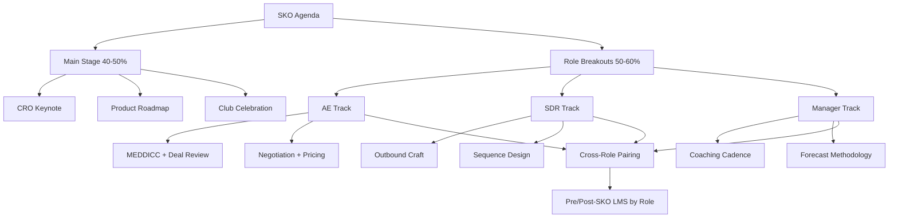

### Direct Answer

Design Sales Kickoff (SKO) content for AEs vs. SDRs vs. managers as a **role-stratified three-track architecture** — anchor 40-50% of the agenda to shared main-stage content (keynote, comp plan, product roadmap, Club celebration) and split the remaining 50-60% into role-specific breakouts: an **AE Track** (deal acceleration, MEDDICC/MEDDPICC, negotiation, competitive intel), an **SDR Track** (outbound craft, ICP refinement, sequence design, prospecting tools), and a **Manager Track** (coaching cadence, forecasting methodology, talent, comp explainability). Give each track a dedicated owner, embed a methodology partner inside its breakouts, and wrap it with role-tailored pre-SKO LMS and a 90-day post-SKO reinforcement plan. Single-track design misallocates 60-75% of main-stage content and burns 30-50% of the per-attendee budget; stratification delivers a documented +15-28% lift in role-specific quota, pipeline, and forecast metrics.

> **TL;DR**
> - SKO content for AEs, SDRs, and managers should be **40-50% shared main stage / 50-60% role-specific breakouts**, because the three roles have orthogonal jobs-to-be-done — AEs sell mid-funnel-to-close, SDRs generate top-of-funnel pipeline, managers multiply team velocity.
> - Each track needs a **named owner** (VP Sales for AE, VP Sales Development for SDR, VP Enablement for Manager) and an **embedded methodology partner** physically present in breakouts — Force Management or Winning by Design for AE, JBarrows or Bridge Group for SDR, Sales Coaching Lab for Manager.
> - The **Manager Track is the highest-leverage and most-skipped** — fewer than 35% of B2B SaaS SKOs run a dedicated one, yet a manager with 6-8 reports converts coaching and forecasting content into 6-8x team-wide multiplication.
> - Wrap SKO with **role-tailored pre-SKO LMS** (4 weeks out) and **90-day post-SKO spaced reinforcement** — content delivered without reinforcement collapses to roughly 10-20% retention within 90 days.
> - Stratify when the team exceeds ~20 reps; **unify with role clinics below that scale**. The recommendation flips for sub-scale teams, over-specialized isolation, and poorly redesigned virtual SKOs.

A **Sales Kickoff (SKO)** is the annual 2-5 day all-hands sales-organization event — typically held in January or February at a single venue — where the entire global sales team resets territory plans, absorbs new comp plans, refreshes product positioning, drills methodology, celebrates President's Club winners, and rebuilds energy for the new fiscal year. The question of *how to design content for AEs vs. SDRs vs. managers* is fundamentally a curriculum-architecture and executive-sponsorship problem: how much content is shared on the main stage versus delivered in role-specific breakouts, who owns each track, which methodology partners are embedded by role, and what pre- and post-SKO reinforcement is role-tailored. This entry is the operator playbook for that decision. It connects directly to the broader SKO design canon (see the core design pillars in q459), the in-person-versus-virtual format decision (q460), the post-SKO reinforcement system (q461), and the ROI measurement question (q462).

---

## PART 1 — WHY ROLE STRATIFICATION MATTERS

### 1.1 The orthogonal jobs-to-be-done problem

The structural reason role stratification matters is that **AEs, SDRs, and managers do fundamentally different jobs**, and a single-track SKO that conflates them misallocates the majority of its content.

- **AEs own mid-funnel-to-close.** Their job-to-be-done is deal acceleration, multi-threaded stakeholder navigation, discovery and value articulation, objection handling, competitive displacement, pricing, and negotiation. The skill canon is MEDDICC/MEDDPICC qualification, Force Management's Command of the Message, and structured deal review.
- **SDRs own top-of-funnel pipeline generation.** Their job-to-be-done is outbound craft, ICP and persona refinement, multi-channel sequence design, cold-call confidence, and prospecting-tool mastery. They are generally *not authorized* to negotiate pricing — putting pricing content in an SDR breakout wastes their time and signals that enablement does not understand the role.
- **Managers own team velocity multiplication.** Their job-to-be-done is coaching cadence, forecasting methodology, 1:1 design, talent calibration and hiring, and comp-plan explainability. A manager does not need to *do* MEDDICC at SKO — they need to learn to *coach* eight AEs who each do MEDDICC, which is a different curriculum entirely.

When a single-track agenda forces all three cohorts through the same content, the misallocation is severe and measurable. Roughly **60-75% of main-stage content ends up misallocated for at least one role**: AEs sit through outbound sequence design they will never run, SDRs sit through pricing negotiation drills they are not authorized to execute, and managers sit through individual-contributor MEDDICC exercises when they need leadership-multiplication frameworks.

The orthogonality is not a soft preference — it is structural, and it shows up in every dimension of the three roles' work. Consider the *time horizon* of each job: an SDR is measured on a weekly and monthly cadence of meetings booked, an AE on a quarterly cadence of bookings, and a manager on a quarterly and annual cadence of team-wide attainment and retention. Consider the *unit of work*: an SDR's unit is a sequence and a cold conversation, an AE's unit is a multi-stakeholder opportunity, a manager's unit is a coached rep. Consider the *primary failure mode each must guard against*: an SDR's is a thin or poorly targeted top of funnel, an AE's is a stalled or single-threaded deal, a manager's is an inaccurate forecast or an under-coached team. Three different time horizons, three different units of work, three different failure modes — and therefore three different curricula. A single agenda that ignores all of this is not merely inefficient; it actively teaches each cohort that enablement does not understand their job.

There is also a *seniority and authority* dimension that single-track design ignores. An SDR is typically in the first 12-24 months of a sales career and needs confidence-building, scripted repetition, and tool fluency. An AE is a seasoned closer who needs sharper frameworks and competitive edge, not basics. A manager has stepped off the individual-contributor track entirely and needs a leadership curriculum that, in most organizations, they have never been formally taught. Compressing a first-year SDR and a ten-year enterprise AE and a newly promoted front-line manager into the same room and the same content guarantees that the content is wrong for at least two of the three.

### 1.2 What's at stake — the role-misallocation tax

SKO is one of the most expensive line items in a sales organization's annual budget, which is what makes misallocation so costly.

- **Per-attendee cost is $1,500-$8,000 fully loaded** — registration, travel, lodging, per diem, and 3-5 days of lost ramp time at the attendee's fully-loaded role cost.
- A **150-person SKO with 80 AEs, 50 SDRs, and 20 managers** therefore represents **$225K-$1.2M of direct investment**, and total SKO-plus-integration spend (methodology partners, LMS platforms, content design) reaches **$485K-$2.3M**.
- The **role-misallocation tax is documented at 30-50% of total spend** — that is the share of the budget that produces no role-specific behavior change because the content did not match the audience's job.

Properly stratified, that same SKO yields **5-15x ROI**; run single-track, the ROI collapses below 2x. The opportunity cost compounds the cash cost: 3-5 days out of seat is roughly 1.5-2.5% of an AE's or SDR's productive annual selling time. Spending that window on misallocated content is the single most avoidable waste in the SKO budget. (For the full ROI-measurement methodology, see q462.)

It helps to make the misallocation tax concrete. Take the 150-person SKO above and assume the conservative end of the per-attendee range — $3,000 fully loaded — for a $450K direct event cost. If 40% of that spend produces no role-specific behavior change because the content did not match the audience, that is $180K of pure waste in a single year. Across a four-year window, with modest headcount growth, an organization that never fixes its single-track design will burn close to a million dollars on content that does not stick — and that figure ignores the far larger shadow cost of reps who under-perform their quota because the one annual moment designed to sharpen them did not. The misallocation tax is not a rounding error; it is one of the largest controllable line items in the entire go-to-market budget.

The tax is also asymmetric across roles. The AE majority — typically the largest cohort in a B2B SaaS sales org — usually gets *some* value from a single-track agenda because main-stage content is, by default, pitched at them. The SDR and manager minorities absorb almost the entire tax. That is why the retention damage (Section 3.1) concentrates in exactly those two cohorts: they are the ones who sat through three days of content that was not for them and concluded, reasonably, that the organization invests in AEs and tolerates everyone else.

### 1.3 The leadership-multiplication leverage of the Manager Track

The **Manager Track is simultaneously the highest-leverage and the most-frequently-skipped** component of role-stratified SKO design.

A sales manager with 6-8 direct reports who absorbs a structured coaching cadence, a forecast-scoring methodology, comp-plan explainability, and talent-calibration frameworks converts that knowledge into **6-8x productivity multiplication across their team**. Every coaching habit a manager builds at SKO is replayed weekly across every rep they lead for the entire fiscal year.

Yet **fewer than 35% of B2B SaaS SKO programs run a dedicated Manager Track**. Most default to "managers are AEs too — send them to the AE track," which destroys the multiplication leverage entirely. The symptom of de-prioritization is visible in the agenda: the manager session lands in the worst slot (Friday afternoon), with no executive presence and no methodology-partner content. Managers internalize that signal and treat their own development as optional.

The reason this matters more than it appears is the **promotion gap**. The majority of front-line sales managers in B2B SaaS were promoted from AE roles because they were strong individual contributors — and almost none received formal management training before taking the job. SKO is, for many of them, the only structured leadership-development moment they will get all year. When an organization sends those managers to the AE track, it is not just wasting their time; it is leaving its newest leaders to figure out coaching, forecasting, and team-building by trial and error on a live team. The cost of that gap is paid in inconsistent coaching, optimistic forecasts, and the attrition of the reps those under-equipped managers lead.

There is also a compounding argument. A well-coached AE is more productive *and* more likely to stay *and* more likely to be promotable into the next cohort of managers. So the Manager Track is not one investment — it is the investment that makes every other SKO investment compound. Skipping it is the equivalent of training the orchestra and ignoring the conductor.

### 1.4 Who owns this decision

Role-stratified SKO design is a cross-functional decision requiring four-way alignment at minimum.

| Stakeholder | What they own at SKO |
|---|---|
| **CRO** | Total sales productivity outcome; the $500K-$15M SKO budget |
| **VP Sales / Regional Leaders** | AE quota attainment; typically owns AE Track curriculum |
| **VP Sales Development** | SDR pipeline-generation outcome; owns SDR Track curriculum |
| **VP Sales Enablement** | Overall curriculum architecture, methodology-partner embedding, pre/post-SKO LMS; usually owns Manager Track |
| **Sales Operations / RevOps** | Role-specific cohort tracking and KPI scorecard design; post-SKO measurement |
| **CHRO / VP Talent** | Role-specific first-year retention; Manager Track talent and hiring content |
| **CFO / FP&A** | ROI evaluation on the $485K-$2.3M total investment |
| **Product Marketing** | Roadmap and competitive battlecards (deep positioning for AE, cold-call battlecards for SDR) |

These decisions must lock **12-16 weeks before SKO**, because that is when content design freezes and methodology partners begin curriculum customization. (The cadence question — how often to even run SKO — is covered in q463.)

The cross-functional nature of the decision is the most common organizational failure point. SKO content design is frequently delegated entirely to a single enablement program manager who lacks the authority to tell a VP Sales that a beloved main-stage session does not serve the SDR cohort. Without explicit four-way alignment at the VP level, the agenda defaults to whoever has the most political weight — which is almost always the VP Sales, which is almost always the AE-heavy design. The structural fix is to treat the agenda as a contract: each track owner signs off on their own track, the enablement leader signs off on the main-stage allocation, and the CRO arbitrates conflicts. An agenda that has not been explicitly negotiated across those stakeholders has not been designed; it has merely accumulated.

A useful artifact at this stage is a one-page **role-coverage map** that lists every SKO session and marks, for each of the three roles, whether the session is core, useful, or skippable. If a role has more "skippable" sessions than "core" sessions, the agenda is failing that role and must be rebalanced before content production begins. RevOps typically owns building and maintaining this map, because RevOps is the function with the cross-org view and no incentive to favor one cohort.

---

## PART 2 — THE FRAMEWORK

### 2.1 The ten architectural decisions

Role-stratified SKO success is determined by ten architectural decisions. Operators who treat SKO design as "book a venue and fill an agenda" miss most of them; the discipline is in the structure.

1. **Track structure** — the 40-50% main-stage / 50-60% breakout split, sequenced by day.
2. **Track ownership** — a single named owner per track.
3. **AE Track curriculum** — deal review, MEDDICC, negotiation, competitive intel.
4. **SDR Track curriculum** — outbound craft, ICP, sequence design, prospecting tools.
5. **Manager Track curriculum** — coaching cadence, forecasting, talent, comp explainability.
6. **Cross-role mixing mechanisms** — deliberate AE+SDR and manager+IC pairings.
7. **Pre-SKO role-specific LMS** — 4-week role-tailored pre-work.
8. **Post-SKO 90-day reinforcement** — role-specific spaced repetition.
9. **Methodology partner embedding** — partners physically present in breakouts.
10. **Measurement and continuous improvement** — role-specific scorecards and cohort tracking.

The order of these decisions matters. Decisions 1 and 2 — track structure and ownership — are foundational and must be locked first, because every other decision depends on them. Decisions 3 through 5 — the per-role curricula — are then designed in parallel by the three track owners. Decision 6, cross-role mixing, is designed last among the content decisions, because it stitches the three curricula together and cannot be designed until the curricula exist. Decisions 7 and 8, the pre- and post-SKO reinforcement, wrap the event in time and should be designed alongside the curricula, not bolted on afterward. Decision 9, partner embedding, runs in parallel with curriculum design because partners co-author the curriculum. Decision 10, measurement, is designed *first in concept and last in execution* — the scorecards must be conceived early enough to instrument cohort tracking before the event, even though the measurement itself happens after.

Operators who skip decisions tend to skip them in a predictable order: measurement first (because it is invisible until 90 days later), then cross-role mixing (because it is nobody's clear responsibility), then the Manager Track (because managers do not complain). An SKO missing those three is still recognizably "stratified" on the agenda but has lost the mechanisms that make stratification compound.

### 2.2 Track structure — the 40-50% / 50-60% split

The foundational structural decision is the ratio of shared main-stage content to role-specific breakout content. The defensible range is **40-50% main stage, 50-60% role-specific breakouts**.

**Main-stage content (shared, 40-50%)** is content that genuinely serves every role: the CRO keynote and fiscal-year narrative, the company all-hands and culture moment, the President's Club celebration, the high-level product roadmap, and the customer keynote. This content builds the shared identity and energy that is the entire emotional point of co-locating the team.

**Role-specific breakout content (50-60%)** is content where the three roles' jobs diverge — deal mechanics, outbound mechanics, and coaching mechanics. This is where stratification earns its return.

A useful failure-mode check on every main-stage session is to **map it to a primary audience, a secondary audience, and a skip-acceptable role**. If a session has no primary audience for an entire cohort — a comp-plan reveal that excites AEs but confuses SDRs whose comp is structurally different — it does not belong on the main stage; it belongs in a breakout or an LMS module.

A typical 3-day agenda sequences this as follows:

| Day | Morning | Afternoon |
|---|---|---|
| **Day 1** | Main stage — CRO keynote, fiscal-year narrative, comp overview | Main stage — product roadmap, customer keynote |
| **Day 2** | Role breakouts — AE / SDR / Manager tracks (block 1) | Role breakouts — tracks (block 2) + cross-role pairing |
| **Day 3** | Role breakouts — tracks (block 3), role-play certification | Main stage — Club celebration, awards, send-off |

This sandwich structure opens and closes on shared energy while concentrating the role-specific depth in the middle. The sequencing is deliberate. Day 1 builds the shared narrative and emotional context — the fiscal-year story, the product direction, the customer voice — so that when reps walk into role breakouts on Day 2, the skill content lands inside a frame they already understand. Reversing the order, opening with breakouts before the narrative is set, produces skill drills that feel disconnected from the company's direction. Closing on the main stage with the Club celebration and awards sends every cohort home on the same high note, which is what protects the social fabric that stratification otherwise risks fraying.

Two further structural rules sharpen the split. First, **the breakout blocks should be long enough for practice, not just instruction** — a 45-minute breakout is a lecture; a 2-3 hour block is enough for instruction plus role-play plus debrief. Skill transfer happens in the practice, so the agenda must protect practice time as fiercely as it protects keynote time. Second, **the day-2 cross-role pairing block is non-negotiable** and should be scheduled, not improvised — it is the structural mechanism that prevents over-specialization (Section 2.7), and an agenda that leaves it as "if there's time" will never make time.

A common refinement at larger companies is to run **role sub-tracks within a track**. A 200-AE org might split the AE Track into enterprise-AE and mid-market-AE sub-tracks, because a $250K-ACV enterprise motion and a $25K-ACV mid-market motion have genuinely different deal mechanics. The same logic that justifies separating AEs from SDRs justifies separating enterprise AEs from mid-market AEs once the cohort is large enough to support it. The stratification principle is fractal: subdivide wherever the jobs-to-be-done genuinely diverge and the cohort is large enough to amortize the cost.

### 2.3 Track ownership

Every track must have **a single named owner** accountable for its curriculum, its instructors, and its outcomes. Diffuse ownership is the most reliable predictor of a weak track.

| Track | Owner | Why |
|---|---|---|
| **AE Track** | VP Sales / Regional Sales Leader | Owns AE quota; closest to deal mechanics |
| **SDR Track** | VP Sales Development | Owns pipeline-generation outcomes |
| **Manager Track** | VP Sales Enablement (or CRO chief of staff) | Neutral cross-org view of leadership development |

The Manager Track owner is deliberately *not* the VP Sales — placing it under enablement (or a CRO chief of staff) protects it from being treated as an extension of the AE track and gives it an owner whose incentive is leadership development rather than quarterly bookings.

Ownership means more than a name on a slide. The track owner is accountable for four concrete deliverables: the breakout agenda and learning objectives, the instructor and methodology-partner roster, the role-specific pre-work and post-SKO reinforcement plan, and the role-specific scorecard against which the track's impact is measured at 30/60/90 days. An owner who delivers an agenda but not a measurement plan has done half the job. The clearest test of genuine ownership is whether, ninety days after SKO, the owner can produce data showing whether their track moved its role-specific metric — and most organizations that "have track owners" cannot, because ownership was assigned for the event but not for the outcome.

A frequent ownership anti-pattern is the **committee-owned track** — a track that "belongs to enablement and sales leadership together." Shared ownership reliably becomes no ownership. The fix is a single accountable name per track, with the other stakeholders as contributors and reviewers, not co-owners.

### 2.4 AE Track curriculum

The AE Track is built around the AE's mid-funnel-to-close job. The core modules:

- **Deal review with MEDDICC/MEDDPICC.** Live scrub of real open opportunities against the qualification framework — Metrics, Economic buyer, Decision criteria, Decision process, Identify pain, Champion, Competition, and (for MEDDPICC) Paper process.
- **Pricing and negotiation.** Force Management's Command of the Message for value framing, plus Chris Voss / Black Swan Group tactical-empathy negotiation drills for discount defense.
- **Competitive intelligence.** Battlecards delivered through Klue or Crayon, with named-competitor displacement plays.
- **Discovery and value selling.** Force Management or Winning by Design value-selling frameworks, drilled in role-play.
- **Customer panels and top-AE shares.** Real buyers describing what won and lost the deal; the prior year's top performers walking through their highest-leverage habits.
- **Win-loss case studies.** Structured teardowns of the year's biggest wins and most painful losses.

The AE Track should be **two-thirds practice, one-third instruction** — role-play and live deal review, not lecture. The certification artifact is a passed MEDDICC scorecard on a live deal.

The single most valuable AE Track session is usually the **live deal review**, because it is the one place where methodology stops being abstract. The format that works: each AE brings one real, in-flight opportunity; small groups of six to eight scrub it against MEDDICC with a methodology-partner facilitator and a manager present; the AE leaves with a concrete next-action list and a clearer read on which qualification gap is most likely to kill the deal. This session does double duty — it teaches the framework *and* it advances real pipeline, which is the cleanest possible answer to the CFO's question of whether SKO produces return.

The AE Track should also explicitly include **competitive displacement plays against named accounts**, not generic competitive content. An AE does not need to know that a competitor exists; they need to know the three objections that competitor's reps raise in a live deal and the exact reframe that wins. That specificity is what separates a Klue or Crayon battlecard delivered well from a battlecard that sits unused in a content library. Top-AE shares are most useful when they are narrow and tactical — "here is the exact discovery question I ask that surfaces the economic buyer" — rather than motivational war stories. The motivational content belongs on the main stage; the AE breakout is for transferable mechanics.

### 2.5 SDR Track curriculum

The SDR Track is built around the SDR's top-of-funnel job. The core modules:

- **Outbound craft.** JBarrows (John Barrows, Morgan Ingram) or Bridge Group (Trish Bertuzzi) frameworks for message, cadence, and channel mix.
- **ICP and persona refinement.** Re-grounding the team on who to prospect and what each persona cares about, informed by the year's closed-won and closed-lost data.
- **Sequence design.** Building multi-touch sequences in Outreach, Salesloft, or Apollo — touch count, channel rotation, and timing.
- **Call scripting from conversation intelligence.** Pulling real winning and losing call patterns from Gong or Chorus and rebuilding scripts around them.
- **Prospecting-tool mastery.** Hands-on with LinkedIn Sales Navigator, Lavender for email coaching, ZoomInfo or Apollo for data, and a hard look at where AI SDR products (Regie, 11x, AiSDR, Artisan) fit the motion.
- **Cold-call confidence.** Live call blocks — the SDR Track is the one place where supervised live dialing belongs on the SKO agenda.

The SDR Track is the most frequently shortchanged on time and production budget. Scheduling it Friday afternoon after the AE track ends is a documented de-prioritization signal.

The SDR Track has a distinctive design requirement the other tracks do not: it must build **confidence as deliberately as it builds skill**. The SDR job is emotionally hard — high rejection volume, low individual deal control, and a daily grind that burns out reps faster than any other sales role. An SDR Track that is purely tactical, all sequence-mechanics and tool fluency, misses half the point. The strongest SDR tracks pair the craft content with explicit reframing of rejection, visible career-path content (what the promotion from SDR to AE actually requires and how long it typically takes), and shares from SDRs who recently earned that promotion. That career-path content is also a retention lever: the SDR cohort's first-year attrition is heavily driven by reps who cannot see a future, and SKO is the highest-visibility moment to show them one.

The SDR Track is also where the **AI question** is most live in 2027. AI SDR products and AI-assisted prospecting tools are reshaping the role faster than any other, and an SDR Track that pretends nothing has changed will feel dishonest to a cohort that already uses these tools daily. The right framing is neither hype nor denial: AI handles volume and first-draft personalization, and the SDR's durable value moves toward judgment — which accounts to prioritize, when to break sequence, how to handle the live human conversation that AI cannot. An SDR Track that teaches reps to direct AI tools rather than compete with them is preparing the cohort for the job as it actually is.

### 2.6 Manager Track curriculum

The Manager Track is built around the manager's team-multiplication job. The core modules:

- **Coaching cadence.** Sales Coaching Lab (John Crowley) or Force Management cadence frameworks — what a weekly coaching rhythm looks like, how to run skill-based coaching versus deal-based coaching.
- **Forecasting methodology.** Commit / best-case / upside scoring discipline, taught through Clari, Aviso, or BoostUp — and the structure of a forecast call that drives accuracy rather than theatre.
- **1:1 design.** A repeatable 1:1 agenda that balances deal progression, skill development, and career conversation.
- **Talent and hiring.** Structured interviewing via Greenhouse interview kits, Topgrading methodology, and scorecard-based hiring decisions.
- **Comp-plan explainability.** Training managers to explain the new comp plan — and field objections about it — using Spiff or CaptivateIQ as the calculation backbone.

The Manager Track must have **visible executive presence** — the CRO sitting in, not just sending a recorded message — because that presence is what tells managers their development is a real priority.

The hardest module to get right is **coaching cadence**, because most managers default to deal-coaching — "what's the status of the Acme deal?" — which is really inspection dressed as coaching. True coaching is skill-coaching: observing a rep's actual behavior, naming one specific skill to improve, and following up on it. The Manager Track should drill this distinction explicitly, ideally with managers practicing a coaching conversation on a real rep in a paired exercise (Section 2.7) and receiving feedback on whether they coached a skill or merely inspected a deal. A manager who leaves SKO running weekly skill-coaching instead of weekly deal-status checks is the single highest-ROI outcome the entire event can produce.

The **forecasting module** should be equally concrete. The goal is not to teach managers that forecasting matters — they know — but to install a shared definition of commit, best-case, and upside, and a repeatable structure for the weekly forecast call that drives accuracy rather than theatre. A forecast call where reps recite numbers and the manager nods is theatre; a forecast call where each commit deal is pressure-tested against MEDDICC evidence is a discipline. (The mechanics of a forecast-driving pipeline review are detailed in the broader RevOps canon.) The **comp-explainability module** is the one managers most often skip and most often regret skipping: when the new comp plan lands, reps bring their questions and objections to their manager first, and a manager who cannot confidently explain the plan amplifies confusion across their whole team. (How to communicate comp changes at kickoff without derailing momentum is covered in depth in q466.)

### 2.7 Cross-role mixing mechanisms

A genuine risk of stratification is over-specialization: if AEs and SDRs never share a room for 4-5 days, the AE/SDR handoff — the highest-leverage cross-functional motion in the funnel — gets *weaker*, not stronger. Deliberate mixing mechanisms prevent this.

- **AE+SDR pairing exercises** on lead acceptance, the discovery handoff, CRM hygiene, and the lead-to-AE SLA. Pair a real AE with the real SDR who feeds them.
- **Manager+IC pairings** in live skill drills, so managers coach real reps and reps experience real coaching.
- **Mixed-role table seating** at meals and **cross-functional team-building**, so informal relationships form across roles.

The design rule: stratify the *skill content*, but deliberately mix the *handoff content* and the *social fabric*.

The AE+SDR handoff exercise deserves particular attention because the handoff is, in most B2B SaaS funnels, the single largest source of pipeline leakage. An SDR books a meeting; an AE judges it unqualified and disqualifies it; the SDR feels their work was wasted; the AE feels the SDR sent garbage. Both are often partly right, and the root cause is almost always a misaligned definition of what "qualified" means at the handoff point. The SKO pairing exercise is the ideal place to resolve this — put the real AE and the real SDR who feed each other in a room, give them three recent disputed handoffs, and have them negotiate a shared, written definition of a qualified meeting. That written SLA, produced collaboratively at SKO, is worth more to pipeline conversion than any keynote. It also builds the personal relationship that makes the handoff work for the rest of the year: an SDR who has shared a table and a hard conversation with their AE handles the relationship differently than one who has never met them.

The manager+IC pairing serves a parallel purpose. Managers practice coaching on a rep who is not their direct report, which lowers the stakes and lets them experiment with coaching technique; ICs experience structured coaching, often for the first time, and learn what good coaching feels like so they can ask for it. The social-fabric mechanisms — mixed-role table seating, cross-functional team-building, deliberately mixed dinner groups — are not soft extras. They are the antidote to the central risk of stratification, which is that three well-designed tracks produce three tribes that do not trust each other.

### 2.8 Methodology partner embedding

Methodology partners should be **physically present inside the role-specific breakouts**, not just delivering a main-stage keynote.

| Track | Partner options | Engagement range |
|---|---|---|
| **AE Track** | Force Management, Winning by Design, MEDDICC Institute | $85K-$1.5M |
| **SDR Track** | JBarrows, Bridge Group | $25K-$185K |
| **Manager Track** | Sales Coaching Lab, Force Management Cadence | $25K-$685K |

A keynote-only partner engagement produces inspiration without skill transfer. The depth comes from a partner instructor running role-play and live drills inside the breakout — which is why partner selection and breakout embedding are a single decision.

Partner selection should follow three criteria. First, **motion fit** — the partner's framework must match the company's actual sales motion (enterprise, mid-market, transactional, or PLG), because a framework built for $500K enterprise deals is the wrong tool for a $20K transactional motion and vice versa. Second, **continuity** — the strongest engagements are not one-time SKO appearances but year-round programs where the SKO breakout is the kickoff of a continuous curriculum, with the same partner reinforcing the same framework through the post-SKO LMS and quarterly refreshers. A partner who appears once at SKO and disappears produces a spike of energy and no durable behavior change. Third, **instructor quality at the breakout level** — the named founder of a methodology firm may deliver the main-stage keynote, but the breakout will be run by a staff instructor, and the engagement is only as good as that instructor. Track owners should insist on meeting and vetting the actual breakout instructor, not just contracting the brand.

The economic case for partners is straightforward: a methodology partner engagement is expensive in absolute terms but small relative to the cost of the sales team's time at SKO and tiny relative to the team's annual quota. The waste is not in paying for a good partner; the waste is in paying for a partner whose framework the team will not use, or in paying for a keynote that inspires without transferring skill.

---

## PART 3 — THE EVIDENCE

### 3.1 Benchmark outcomes

The case for role stratification is supported by benchmark research from Bridge Group, Pavilion, Sales Enablement PRO, and Sales Coaching Lab.

| Outcome | Lift from role stratification | Source |
|---|---|---|
| Role-specific quota / pipeline / forecast metrics | **+15% to +28%** | Bridge Group, Sales Enablement PRO |
| First-year retention (SDR + manager cohorts) | **+8% to +18%** | Pavilion onboarding research |
| Manager coaching frequency + forecast accuracy | **+12% to +25%** | Sales Coaching Lab, Force Management |
| SKO ROI on per-attendee spend | **5-15x** (vs. <2x single-track) | Pavilion State of Sales Onboarding |

The retention finding is the one most operators underweight. SDRs and new managers are the two cohorts most likely to leave within their first year, and they are also the two cohorts most damaged by the "everyone-bored" main-stage dilution failure mode — content pitched at the AE majority leaves them feeling like an afterthought. Role-specific content directly addresses that, and the retention lift follows.

The retention number is also the easiest to translate into dollars, which makes it the most useful number for a CFO conversation. Fully-loaded SDR replacement cost — recruiting, onboarding, and the ramp gap before a replacement is productive — is substantial, and front-line manager replacement cost is far higher because a departing manager destabilizes an entire team. An +8-18% retention lift on the SDR and manager cohorts of a 150-person org therefore avoids a meaningful number of replacements per year, and the avoided replacement cost alone can approach the entire role-stratification premium over a single-track design. In other words, the retention case is not a soft "morale" argument; it is a hard cost-avoidance argument that frequently funds the stratified design on its own, before any quota or pipeline lift is counted.

A caution on the benchmark ranges: the +15-28% figures are population statistics across many programs, not a guarantee for any single SKO. The variance is driven by execution quality — an organization that nominally stratifies but skips reinforcement, embeds no methodology partner, and de-prioritizes the Manager Track will land at the bottom of the range or below it. The benchmarks describe what disciplined execution achieves, not what the org chart alone delivers.

### 3.2 The vendor stack by role

The full investment picture for a role-stratified SKO spans methodology partners, LMS platforms, and conversation-intelligence and forecasting tools.

| Category | Vendors | Annual / engagement range |
|---|---|---|
| **AE methodology** | Force Management, Winning by Design, MEDDICC Institute, Black Swan Group | $25K-$1.5M |
| **SDR methodology** | JBarrows, Bridge Group | $25K-$185K |
| **Manager methodology** | Sales Coaching Lab, Force Management Cadence, Topgrading | $25K-$685K |
| **LMS / enablement** | Mindtickle, Highspot, SalesHood, Showpad, Allego | $15K-$285K |
| **Conversation intelligence** | Gong, Chorus | $25K-$285K |
| **Forecasting** | Clari, Aviso, BoostUp | $20K-$385K |
| **Comp** | Spiff, CaptivateIQ | $20K-$285K |
| **Competitive intel** | Klue, Crayon | $25K-$85K |
| **Sales engagement** | Outreach, Salesloft, Apollo | $8K-$185K |

The total integration math for a 150-attendee SKO: **$225K-$1.2M direct event spend + $185K-$685K methodology stack + $50K-$285K LMS stack + $25K-$95K content design = $485K-$2.3M total investment**, against a documented +15-28% role-specific KPI improvement that translates to **$2M-$15M of incremental ARR, pipeline, and forecast accuracy** across the organization.

A few notes on reading this stack. First, **most of the LMS, conversation-intelligence, and forecasting tools are not SKO-specific line items** — a well-run sales org already owns Gong, Clari, and an LMS for year-round use, so the marginal SKO cost is the *configuration* of role-specific learning paths and scorecards, not the platform license. The SKO-incremental spend is concentrated in the methodology partners and the content-design effort. Second, the **methodology-partner range is enormous** because it spans a single SDR-craft workshop at the low end and a multi-quarter enterprise transformation at the high end; the right number depends on motion complexity and how much of the engagement runs year-round versus only at SKO. Third, the **content-design line is the most under-budgeted** — organizations consistently underfund the design effort and then wonder why breakouts feel recycled. Good role-specific curriculum design is genuine work, and starving it is a false economy that shows up as the "content fatigue" failure mode.

The decisive framing for the CFO conversation is that SKO cost should be compared not to zero but to the cost of *not* sharpening the team. A sales org's annual quota dwarfs its SKO budget; a few points of attainment improvement, a few avoided SDR and manager departures, and a measurable lift in forecast accuracy together return the SKO investment many times over. The risk is not that SKO is too expensive — it is that an expensive SKO is run single-track and the spend produces a fraction of the return it should.

### 3.3 Real company case studies

The role-stratification discipline is visible in the SKO programs of the most operationally mature B2B software companies. These are illustrative reference patterns drawn from published enablement practice, not internal program documents.

- **Salesforce (CRM)** runs the deepest role stratification in the industry — distinct AE, SDR, manager, and sales-engineer tracks, reflecting a sales organization measured in the tens of thousands. The scale forces the discipline: a single-track agenda is simply not viable.
- **HubSpot (HUBS)** separates AE and manager content explicitly, running dedicated Manager School breakouts rather than folding managers into the AE track.
- **Snowflake (SNOW)** splits technical sales and commercial AE content, recognizing that a sales engineer's SKO needs differ from a quota-carrying AE's.
- **Datadog (DDOG)** separates technical-sales and commercial-AE content along similar lines, with product-depth tracks for the technical roles.
- **Atlassian (TEAM)** designs SKO content influenced by its product-led-growth motion, where the AE's job is expansion and the SDR equivalent works inbound-heavy pipeline.

Across these reference programs the common thread is the same: as the sales organization scales past a few dozen reps, role stratification stops being optional and becomes the only design that works.

A second pattern across mature programs is worth naming: **the strongest SKOs treat content as a year-round system, not a three-day event**. The companies above do not design SKO in isolation; they design it as the high-visibility anchor of a continuous enablement program that runs all twelve months. The SKO breakout introduces a framework, the post-SKO LMS reinforces it, the quarterly business reviews check it, and the next SKO builds on it. Organizations that treat SKO as a standalone event — a burst of content with no before and no after — get a burst of energy that decays within weeks regardless of how well the three days are stratified.

A third pattern is **measurement discipline**. The reference programs can answer, with data, whether last year's SKO moved role-specific metrics, because they instrumented role-specific cohort tracking before the event and reviewed it afterward. That measurement loop is what allows them to improve the design year over year rather than rerunning the same agenda on inertia. The case studies are illustrative, but the underlying lesson is portable to any company at any scale: stratify, reinforce, and measure.

### 3.4 The pre- and post-SKO reinforcement evidence

The single largest determinant of whether SKO content produces lasting behavior change is **reinforcement** — and reinforcement, like the content itself, must be role-tailored.

**Pre-SKO LMS (4 weeks out).** Role-tailored pre-work primes each cohort so breakout time is spent on practice, not on baseline instruction. AEs get MEDDICC and Command of the Message refreshers; SDRs get outbound-craft and prospecting-tool modules; managers get coaching and forecasting primers. Pre-work that is identical for all roles becomes generic noise that nobody completes.

**Post-SKO 90-day reinforcement.** Without reinforcement, content retention collapses to roughly 10-20% within 90 days — the SKO becomes an expensive offsite with no durable behavior change. The post-SKO system uses spaced repetition through Mindtickle, SalesHood, or Highspot, filtered by role, plus a weekly 1:1 with a role-specific reinforcement agenda and a role-specific 30/60/90 scorecard:

| Role | 30/60/90 scorecard metrics |
|---|---|
| **AE** | Pipeline coverage ratio, MEDDICC scorecard adoption, quota attainment |
| **SDR** | Meetings booked, sequence performance, connect rate |
| **Manager** | Team forecast accuracy, 1:1 frequency, coaching session count |

The reinforcement system is not a footnote to SKO design — it is the mechanism that converts a three-day event into a fiscal year of behavior. The full reinforcement architecture is detailed in q461.

The reinforcement design should respect the same role-orthogonality principle as the SKO content itself. A common error is to build a strong stratified SKO and then deploy an *un*-stratified reinforcement program — the same Mindtickle modules pushed to every role, the same generic 1:1 template, the same scorecard. That undoes the stratification the moment SKO ends. Each cohort needs its own reinforcement track:

- **AE reinforcement** centers on the MEDDICC scorecard becoming a habit — every committed deal scrubbed against the framework in the weekly 1:1 — plus spaced micro-drills on competitive objection handling and negotiation reframes.
- **SDR reinforcement** centers on weekly review of sequence performance and call recordings, with the manager and the SDR listening to one real call together each week and naming one improvement. Tool fluency is reinforced through short certification checks.
- **Manager reinforcement** centers on the manager actually running the coaching cadence they learned — and being held accountable for it by their own leader, who should ask in *their* 1:1 how many skill-coaching sessions the manager ran that week.

The 30/60/90 scorecard is the measurement spine of the whole reinforcement system, and it should be built by RevOps *before* SKO, not improvised afterward. If the scorecard does not exist on day one of reinforcement, the reinforcement program has no feedback loop and will drift. The honest test of a reinforcement system is whether, at 90 days, the org can show that the role-specific behavior — MEDDICC adoption, sequence discipline, coaching frequency — is measurably higher than the pre-SKO baseline. If it cannot, the SKO was an event, not an investment.

One further reinforcement principle: **the manager is the delivery mechanism for AE and SDR reinforcement**. Spaced-repetition software prompts the behavior, but the manager's weekly 1:1 is what makes it stick. This is the deepest reason the Manager Track is the highest-leverage track — a well-equipped manager is not just more productive themselves; they are the engine that converts every other cohort's SKO content into durable behavior. Skimp on the Manager Track and the reinforcement of every other track quietly fails.

---

## PART 4 — THE RECOMMENDATION

### 4.1 Verdict — when to stratify, when to unify, when to hybrid

The default recommendation for any B2B sales organization with **20 or more reps** across mixed roles is **full role stratification**: 40-50% main stage, 50-60% role-specific breakouts, with named track owners and embedded methodology partners.

But the recommendation is conditional, and three conditions change it:

- **Unify (with role clinics) below ~20 reps.** A 10-rep team with 7 AEs, 2 SDRs, and 1 manager cannot economically justify three parallel tracks — instructor, room, and content-design costs exceed the value. The right design is unified main-stage content plus short 1-on-1 role-specific clinics plus heavy post-SKO role-specific LMS.
- **Hybrid for mid-scale teams (20-50 reps)** — full AE and Manager tracks, but the SDR content may run as a partial track or a deep clinic depending on SDR headcount.
- **Full stratification above ~50 reps**, and at scale (hundreds of reps) the question becomes whether to add a fourth and fifth track for sales engineers and customer success.

### 4.2 Decision matrix

| Team size | Role mix | Recommended design |
|---|---|---|
| <20 reps | Any | Unified main stage + role clinics + LMS |
| 20-50 reps | Balanced | AE + Manager tracks, SDR clinic or partial track |
| 50-150 reps | Balanced | Full three-track stratification |
| 150+ reps | Specialized | Three tracks + SE/CS tracks; consider regional sub-tracks |

ACV and methodology maturity also shift the design: high-ACV enterprise motions weight the AE Track toward MEDDPICC and multi-stakeholder navigation, while transactional or PLG motions weight the SDR Track lighter and the expansion-selling content heavier.

Methodology maturity is the variable operators most often ignore. An organization adopting a sales methodology for the *first time* should not attempt deep role stratification of methodology content at SKO — it should teach one methodology to the whole sales org so that AEs, SDRs, and managers share a common language, then stratify the *application* of that methodology by role. An organization with a mature, well-adopted methodology can stratify aggressively, because the shared foundation already exists and the breakouts can go straight to advanced, role-specific application. Stratifying methodology content before the foundation is laid produces three cohorts speaking three dialects that cannot collaborate across the funnel.

A second modifier is **growth stage**. A company in a high-growth hiring phase, where a large fraction of the room is new within the last six months, should weight SKO toward foundational content and ramp integration — there is no point running advanced enterprise-deal drills for a room that is half new hires (the ramp-integration question is covered in q467). A company with a stable, tenured team can weight SKO toward advanced, edge-case content. The same agenda that energizes a tenured team will overwhelm a room full of new hires, and the same agenda that suits new hires will bore a tenured team. The role-stratification decision and the tenure-distribution decision must be made together.

### 4.3 The 12-week pre-SKO design playbook

1. **Weeks 12-10** — Lock the track architecture and the 40-50/50-60 split. Secure four-way alignment (CRO, VP Sales, VP Sales Development, VP Enablement) and CFO budget sign-off. Name a single owner per track.
2. **Weeks 10-8** — Select and contract methodology partners by role; brief them on the breakout-embedding requirement, not just keynotes.
3. **Weeks 8-6** — Build per-track curriculum. Each owner drafts their breakout agenda; enablement maps every main-stage session to primary/secondary/skip-acceptable audience.
4. **Weeks 6-4** — Design cross-role pairing exercises and finalize the day-by-day agenda. Build the role-specific 30/60/90 scorecards with RevOps.
5. **Weeks 4-1** — Launch role-tailored pre-SKO LMS. Run a content dry-run with track owners and partner instructors.
6. **SKO week** — Execute. Capture pre/post knowledge assessments by role.
7. **Post-SKO** — Launch the 90-day role-specific reinforcement system; review against the scorecards at 30/60/90 days.

The playbook has three execution checkpoints worth calling out. The **week-12 checkpoint** is the architecture lock — if four-way VP alignment is not real by week 12, every downstream date slips, so this checkpoint is a hard gate, not a milestone. The **week-4 checkpoint** is the content dry-run — track owners and partner instructors walk their breakouts in front of the enablement leader, and any session that is still lecture-heavy or off-role gets sent back. Skipping the dry-run is the most common reason a well-architected SKO still delivers weak breakouts: the architecture was right but the execution was never pressure-tested. The **post-SKO 90-day checkpoint** is the outcome review — RevOps presents the role-specific scorecard movement, and the findings feed directly into next year's design. An organization that runs all three checkpoints improves its SKO every year; one that runs none reruns last year's agenda on inertia and wonders why the lift never compounds.

One scheduling note: the 12-week timeline is the *minimum*. Methodology partners with strong reputations book out months in advance, and a company that starts partner selection at week 8 will find its first-choice partners unavailable. Organizations running a high-stakes SKO should begin partner conversations 16-20 weeks out, even though formal contracting happens later.

### 4.4 Counter-Case — when role stratification is the wrong call

Role stratification is the right default, but it is not universally correct, and a disciplined operator should pressure-test it against the cases where it fails or backfires.

**The sub-scale economic case.** Below roughly 20 reps, three parallel tracks are economically irrational. The fixed costs — three instructors, three rooms, three sets of content design, three methodology-partner engagements — do not amortize across enough attendees. A 12-rep startup that copies Salesforce's track architecture will spend more on SKO structure than the structure returns. The honest answer for sub-scale teams is a unified SKO with role-specific clinics and a strong post-SKO LMS, accepting that stratification is something the org grows into.

**The over-specialization isolation case.** Stratification taken too far breaks the cross-functional fabric. If AEs and SDRs spend 4-5 days never sharing a room, the AE/SDR handoff — lead acceptance, discovery handoff, SLA adherence — gets weaker, because the people on either side of it never built a relationship. The same risk applies to managers who never interact with their reps during SKO. Stratification without deliberate cross-role pairing exercises and mixed social design produces three sales sub-cultures that do not collaborate. The mitigation is structural (Section 2.7), but an operator who skips it would have been better served by a less-stratified design.

**The virtual SKO replication trap.** Role stratification designed for an in-person event does not translate to virtual or hybrid without redesign. Parallel Zoom breakout rooms have lower engagement, no informal cross-role mixing, and far less energy than physical breakouts. An organization that runs a virtual SKO by simply replicating its in-person multi-track agenda produces exhausted, disengaged attendees and a worse outcome than a well-designed unified virtual event. Virtual stratification requires shorter sessions, higher production value, dedicated role-track moderators, and a heavier async LMS supplement — effectively a different design, not a port. (The full in-person-versus-virtual decision is covered in q460.)

**The de-prioritized Manager Track case.** A nominal Manager Track that exists on the agenda but is starved of executive presence, methodology-partner content, and a decent time slot is arguably *worse* than no Manager Track at all — it signals to managers that their development is a checkbox. If an organization is not willing to resource the Manager Track properly, it should either resource it or be honest that it is not running one, rather than running a hollow version that teaches managers their growth does not matter.

**The methodology-mismatch case.** Embedding a methodology partner whose framework does not match the company's actual motion adds cost without depth. A transactional, high-velocity PLG company that embeds a heavy enterprise MEDDPICC partner in its AE Track is paying for a framework its AEs cannot use. Partner selection must follow the motion, not industry prestige.

**The novelty-fatigue counter-case.** A subtle failure mode is over-rotating on stratification *as the only lever* and neglecting that SKO content must also be *new*. An organization can run a textbook three-track design every year and still produce a flat SKO if the AE Track recycles last year's MEDDICC drills, the SDR Track reuses the same sequence templates, and the Manager Track repeats the same coaching framework. Stratification answers "is this content for the right audience?" — it does not answer "is this content worth the audience's time this year?" The two questions are independent, and a disciplined operator must satisfy both: stratified *and* fresh. The fix is to anchor each year's track curricula to the actual gaps surfaced in the prior year's data — the MEDDICC element AEs most often skip, the channel where SDR sequences underperformed, the coaching habit managers failed to sustain — so that the content is both role-correct and demonstrably responsive to where the team actually struggled.

In each of these cases the failure is not stratification itself but stratification applied without the conditions that make it work — scale, cross-role mixing, format-appropriate redesign, genuine resourcing, motion-matched partners, and genuinely fresh content. The honest summary is that role stratification is necessary but not sufficient: it is the structure that lets good SKO content reach the right people, but it cannot rescue content that is stale, unreinforced, or under-resourced.

### 4.5 The twelve failure modes

The recurring ways role-stratified SKO design breaks in practice:

1. **One-size-fits-all** — single-track design, 60-75% of content misallocated.
2. **Manager track ignored** — managers defaulted to the AE track, multiplication leverage lost.
3. **Main-stage dilution** — every keynote stretched to fit every role, everyone bored.
4. **Worst slot for SDRs** — SDR content scheduled Friday afternoon as an afterthought.
5. **Over-specialization isolation** — AEs and SDRs never mix, the handoff weakens.
6. **No methodology partner in the track** — AE track without Force Management, SDR track without JBarrows; depth missing.
7. **Pricing content for SDRs** — AE material in the SDR breakout, wasting SDR time.
8. **Coaching frameworks in the IC track** — manager material in the AE breakout, misallocating development.
9. **Pre-SKO LMS not role-tailored** — identical pre-work for all roles, generic noise nobody completes.
10. **Post-SKO reinforcement not role-tailored** — unfiltered Mindtickle modules, content fatigue.
11. **Virtual SKO replicates in-person multi-track without redesign** — exhausted, disengaged attendees.
12. **Content fatigue / low production budget** — recycled prior-year content signals SKO is performative, not an investment.

### 4.6 Bottom line

Role-stratified SKO content design — 40-50% shared main stage, 50-60% role-specific breakouts, with named track owners, embedded methodology partners, role-tailored pre-SKO LMS, and a 90-day post-SKO reinforcement system — is the documented best practice for any B2B sales organization above roughly 20 reps. It converts a $485K-$2.3M total SKO investment into a +15-28% lift in role-specific quota, pipeline, and forecast metrics and a +8-18% retention lift in the SDR and manager cohorts. The discipline is not in booking a better venue; it is in recognizing that AEs, SDRs, and managers do orthogonal jobs and designing three curricula that respect that — while deliberately preserving the cross-role handoffs and shared identity that make the team more than the sum of its tracks.

For the connected SKO decisions, see the core design pillars (q459), the in-person versus virtual format choice (q460), the post-SKO reinforcement system (q461), the ROI-measurement methodology (q462), the optimal SKO frequency given forecast cycles (q463), how to communicate comp changes at kickoff without derailing momentum (q466), and the playbook for integrating ramps and new hires into kickoff events (q467).

---

## Sources & Further Reading

1. Bridge Group — Sales Development and SaaS AE Productivity benchmark research (Trish Bertuzzi).
2. Bridge Group — Inside Sales / SDR compensation and ramp benchmark reports.
3. Pavilion — State of Sales Onboarding research.
4. Pavilion — CRO School, Sales School, and RevOps School curriculum (Sam Jacobs, Brandon Barton).
5. Sales Enablement PRO — SKO design and role-based enablement benchmark studies.
6. Sales Enablement PRO — State of Sales Enablement annual report.
7. Force Management — Command of the Message methodology.
8. Force Management — MEDDICC / MEDDPICC qualification framework.
9. Force Management — Manager coaching cadence research.
10. Winning by Design — SaaS Sales Methodology and the Bowtie framework (Jacco van der Kooij).
11. JBarrows Sales Training — outbound craft curriculum (John Barrows).
12. JBarrows Sales Training — Morgan Ingram outbound content.
13. Sales Coaching Lab — manager coaching methodology (John Crowley).
14. MEDDICC Institute — MEDDICC certification (Andy Whyte, "MEDDICC" book).
15. The Black Swan Group — tactical-empathy negotiation training (Chris Voss, "Never Split the Difference").
16. Challenger / Gartner — "The Challenger Sale" research (Matthew Dixon, Brent Adamson).
17. Sandler Training — sales methodology and reinforcement-based learning.
18. RAIN Group — sales training and the forgetting-curve / reinforcement research.
19. Topgrading — structured hiring methodology (Brad Smart).
20. Greenhouse — structured-interview and interview-kit best practice.
21. Mindtickle — sales-readiness and role-based learning-path platform documentation.
22. Highspot — sales-content and enablement platform research.
23. SalesHood — cohort-based onboarding and reinforcement platform.
24. Gong — conversation-intelligence call-analysis research.
25. Chorus (ZoomInfo) — conversation-intelligence platform.
26. Clari — revenue and forecast-intelligence platform; commit/best/upside methodology.
27. Aviso — AI forecasting platform documentation.
28. BoostUp — revenue-intelligence and forecast-scoring platform.
29. Spiff (Salesforce) — sales compensation automation and explainability.
30. CaptivateIQ — sales-commission platform.
31. Outreach — sales-engagement platform and sequence-design best practice.
32. Salesloft — sales-engagement platform and cadence research.
33. Apollo — sales-intelligence and engagement platform.
34. LinkedIn Sales Navigator — social-selling and prospecting tooling.
35. Lavender — email-coaching and outbound-message AI platform.
36. Klue — competitive-enablement and battlecard platform.
37. Crayon — competitive-intelligence platform.
38. Salesforce — published sales-enablement and SKO program practice.
39. HubSpot — published sales-onboarding and Manager School practice.
40. Forrester — sales-enablement investment and event-budget benchmarks.
