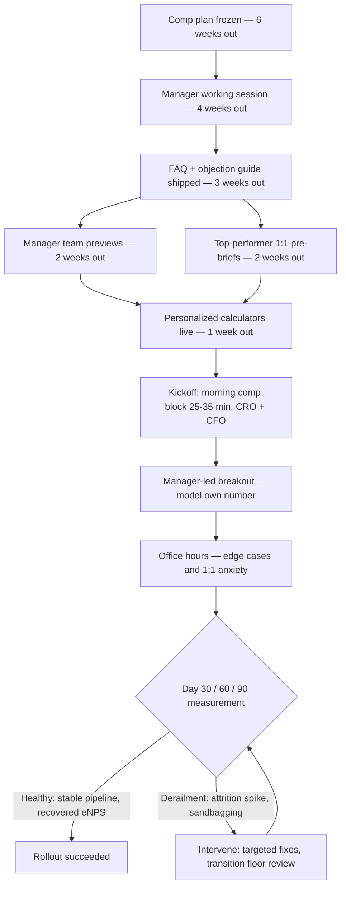

### Direct Answer

Communicating new compensation changes at kickoff without derailing momentum is a sequencing problem, not a messaging problem: you pre-socialize the changes with managers and a small group of top reps two to four weeks before the event, deliver the comp content in a tightly bounded 25-to-35-minute morning block led by the CRO with the CFO physically present, and frame every change as a measured trade against a specific named risk the field already feels. The single biggest mistake is treating kickoff as the *announcement* — kickoff should be the *confirmation* of something the field already understands in outline, with the room reserved for the high-resolution detail, the worked-deal examples, and the live Q&A that turns anxiety into arithmetic.

**TLDR**

- **Never announce comp cold at kickoff.** Pre-brief managers and your top 10-15% of reps two to four weeks out so the room arrives informed; the event confirms detail rather than dropping a surprise.
- **Bound the comp block to 25-35 minutes in the morning of day one**, CRO-delivered with the CFO present, followed by manager-led breakouts where reps model their own number against the new plan.
- **Frame every change as a trade against a named risk** ("we are moving accelerators to protect against the discount creep you all watched kill Q3 margin"), never as a cost-control exercise or a vague "alignment" story.
- **Publish a personalized comp calculator before the event** so each rep can model 80%, 100%, and 130% attainment scenarios on their actual book — uncertainty, not loss, is what derails momentum.
- **Protect the in-period earners** with a transition floor or grandfather clause for deals already in pipeline; reps will forgive a worse plan far faster than they forgive a plan that retroactively claws back a number they already counted.
- **Measure derailment objectively** — regretted attrition in the 90 days post-kickoff, eNPS delta on the comp question, and pipeline-creation velocity in weeks one through three — and pre-commit to those metrics so you know whether the rollout worked.

## 1. Why Comp Communication Derails Kickoffs

Sales kickoff is the highest-leverage 48 hours on the revenue calendar, and compensation is the single topic most capable of converting that leverage into damage. The reason is structural: a kickoff is a momentum instrument, and compensation changes — handled badly — are a momentum solvent. Understanding *why* the failure mode is so reliable is the prerequisite to designing around it. Most comp-rollout disasters are not caused by a bad plan; they are caused by a good-enough plan delivered into a room whose psychology was never accounted for.

### 1.1 The Loss-Aversion Tax

Behavioral economists have shown for four decades that humans weigh losses roughly twice as heavily as equivalent gains — Daniel Kahneman and Amos Tversky's prospect-theory work, formalized in their 1979 *Econometrica* paper and expanded in Kahneman's *Thinking, Fast and Slow*, puts the loss-aversion coefficient between 1.5 and 2.5. For a sales comp plan this is not an abstraction. A plan change that is genuinely net-neutral in expected dollars will be *experienced* by the average rep as a loss, because the rep anchors on the most favorable element of the old plan and on the least favorable element of the new one.

This is why a CRO can stand on stage, show a slide proving the new plan pays the median rep the same OTE, and still watch the room's energy collapse. The rep is not doing the median math. The rep is doing the personal math, and the personal math is dominated by whatever they stand to lose. The rep who earned an outsized check last year because of a quirk in the old accelerator schedule does not hear "your OTE is unchanged" — they hear "the thing that made my best quarter possible is gone." Any communication plan that does not actively counter loss aversion — with worked examples, personalized calculators, and transition protection — is fighting the room's neurology and will lose.

Loss aversion also explains why the *order* of information matters so much. If you lead with what is being taken away and follow with what is being added, the room never recovers from the opening. If you lead with continuity — what is *not* changing — and the named business reason, the loss is received inside a frame that already makes sense of it. The same set of facts, sequenced two different ways, produces a settled room or a mutinous one.

### 1.2 The Trust-Bandwidth Problem

A kickoff audience arrives with a finite trust budget. Reps have all been on the receiving end of a comp plan that was sold as "more upside" and turned out to be a quota increase in disguise. When Salesforce (CRM) re-tiered its accelerator schedule in a past fiscal year, the internal field reaction was sharp enough that sales leadership held follow-up town halls for weeks; the lesson operators took away was that the *perception* of a hidden quota raise spreads faster than any official explanation. When you change comp, you are spending trust bandwidth you did not necessarily have, and a kickoff stage — public, recorded, attended by every peer — is the most expensive possible place to overdraw that account.

Trust bandwidth is also asymmetric across the room. Your tenured top performers have the *most* history with the company and therefore the most context — but they also have the most external options and the lowest tolerance for being treated as a captive audience. Your newer reps have less scar tissue but also less basis to extend benefit of the doubt. A communication plan that treats the room as homogeneous will under-serve both ends of the tenure distribution. The pre-socialization machinery in section 2 exists precisely because trust is rebuilt one segment at a time, not broadcast.

The deepest version of the trust problem is this: a comp change is, unavoidably, the company unilaterally rewriting the terms of the most important number in a rep's professional life. No amount of framing makes that not true. What framing *can* do is signal whether the rewrite was done thoughtfully, with the rep's interests modeled, and with respect — or carelessly, as a spreadsheet exercise. The room is not really evaluating the plan. It is evaluating whether leadership can be trusted to hold its interests in mind. Get that read right and a worse plan survives; get it wrong and a better plan still detonates.

### 1.3 The Attention-Scarcity Window

Kickoff content competes for a narrow attention window. Adult-learning research and corporate-event practice converge on the same number: sustained, high-stakes cognitive attention degrades sharply after roughly 20-30 minutes without a format change. Comp is high-stakes cognitive content. If the comp block runs 60 or 90 minutes, the second half is wasted — reps stop processing the plan and start processing their anxiety, texting their managers, and pricing their resumes. The communication failure here is not *what* you said; it is that you kept talking after the room stopped listening. (For the broader principle of designing kickoff content to the attention curve, see (q459) and (q464).)

There is a second-order effect worth naming. When attention degrades during a comp block, reps do not stop *processing* — they stop processing the plan and start processing their own catastrophizing. The mind does not idle; it fills the gap with the worst available interpretation. So an over-long comp block does not merely waste time; it actively manufactures the negative narrative you were trying to prevent. A leader who runs comp for 70 minutes has effectively given the room 40 minutes of unsupervised, anxiety-driven speculation and called it communication. Every minute past the attention threshold is a minute working against you.

### 1.4 The Spillover Effect

The most underrated derailment risk is spillover. A botched comp block does not just damage the comp conversation — it poisons every session that follows. The product roadmap session, the new-logo-strategy session, the customer keynote: all of them now play to a room that is distracted, resentful, and mentally absent. This is why comp sequencing matters as much as comp content. Put the comp block in the wrong slot and you do not lose 30 minutes; you lose the day.

Spillover runs the other direction too. A comp block that lands *well* — that demonstrably treats the field as adults, shows honest math, and protects earned expectations — buys credibility for everything after it. Reps who leave the comp session thinking "leadership handled that straight" extend that judgment to the roadmap and the strategy. The comp block is therefore a leading indicator the rest of the event either inherits or has to overcome. Treating it as the keystone session, not a chore to get through, is the correct mental model.

| Derailment Mechanism | Root Cause | Observable Symptom | Primary Countermeasure |
|---|---|---|---|
| Loss-aversion tax | Losses weighted ~2x gains | Room energy collapses despite neutral median math | Worked examples + personalized calculator |
| Trust-bandwidth overdraw | History of "upside" that was quota raise | Hallway skepticism, "what's the catch" | Pre-socialization + named-risk framing |
| Attention scarcity | Comp block runs past 30 min | Reps texting managers mid-session | Hard 25-35 min cap, format change after |
| Spillover poisoning | Comp block placed late or unresolved | Later sessions play to absent room | Morning slot + same-day breakout resolution |
| Surprise shock | Changes announced cold on stage | Visible anger, public pushback | Pre-brief managers and top reps 2-4 weeks out |
| Anchoring on the favorable old term | Rep fixates on best element of prior plan | "You took away my best quarter" reaction | Old-vs-new math across full attainment range |

## 2. The Pre-Kickoff Foundation

The work that determines whether your comp communication succeeds happens weeks before anyone boards a plane. Kickoff itself is downstream of decisions that should already be locked. A revenue leader who is still building the comp deck the week of the event has already lost — not because the deck is bad, but because the pre-socialization runway that the deck depends on has been spent.

### 2.1 Lock the Plan Early — The Six-Week Rule

The comp plan must be *final* — not draft, not "pending one more CFO review" — at least six weeks before kickoff. This is non-negotiable for a structural reason: everything else in the communication plan (manager pre-briefs, the personalized calculator, the worked-deal examples, the FAQ) depends on a frozen plan. If the plan is still moving, your pre-briefed managers will say different things to different reps, your calculator will produce numbers you later contradict, and the kickoff stage will become a correction of your own pre-work.

Operators who run this well treat the comp-finalization date as a hard gate. Carta's compensation-data teams and the consultants at firms like Alexander Group and OpenSymmetry all push the same discipline: freeze, then communicate. A plan that changes after the freeze date should be a genuine emergency, not a routine occurrence. The discipline is cultural as much as procedural — a finance organization that habitually re-opens "final" plans trains the revenue org to treat every freeze date as soft, which collapses the whole communication sequence.

There is a useful test for whether a plan is genuinely frozen: can RevOps build the personalized calculator against it without asking a single clarifying question? If the calculator can be built end to end, the plan is specified tightly enough to communicate. If the calculator team keeps hitting "it depends" gaps, the plan is not frozen — it is merely tired of being discussed, which is not the same thing. The calculator build is, in effect, the unit test for plan completeness.

The six-week rule also creates the runway for one task that is easy to skip and expensive to skip: writing the plan down in plain language. A comp plan that lives only in a spreadsheet and a finance leader's head is not communicable — it has to be translated into a written plan document that a rep can read, a manager can teach from, and a new hire can understand in their first week. Drafting that document forces every ambiguity to the surface, because prose does not tolerate the hand-waving a spreadsheet permits. Many "the plan is not actually frozen" discoveries happen precisely when someone first tries to write the plan as sentences and finds three places where the rule cannot be stated without an unanswered question. Budget real time for the written plan document inside the six-week window; it is the source of truth every downstream communication artifact is built from.

### 2.2 The Manager Cascade

Front-line managers are the highest-leverage channel in any comp rollout, and they are routinely under-used. A rep's reaction to a comp change is mediated almost entirely by their manager's reaction. If the manager is confused, defensive, or visibly blindsided, the rep concludes the plan is bad. If the manager is fluent, calm, and able to model the rep's own number, the rep concludes the plan is manageable.

This means managers must be briefed *before* the field, with enough lead time to actually become fluent. Fluency is the operative word — a manager who has *seen* the plan is not the same as a manager who can *defend* it under a sharp question from their best rep. The cascade looks like this:

- **Four weeks out:** CRO and CFO walk the full manager team through the plan, the rationale, and the math. Not a deck-read — a working session where managers compute scenarios for their own actual reps and surface the questions their teams will ask.
- **Three weeks out:** Managers receive the FAQ, the objection-handling guide, and the personalized calculator for their own teams. They are told explicitly: your job is to make sure no rep is surprised on stage.
- **Two weeks out:** Each manager holds a 1:1 or small-group preview with their team. This is where the actual surprise gets absorbed — in a low-stakes setting, not on a recorded stage.
- **Kickoff:** Managers run the breakout that follows the main-stage comp block. They are now the trusted local interpreter, not a bystander.

A manager who cannot explain the plan should not be allowed to lead a breakout — which is itself a useful forcing function for manager readiness. The four-weeks-out working session should end with a short, low-stakes check: each manager walks one scenario for one of their reps in front of the group. Managers who cannot do this get a remedial session before the FAQ ships. (The discipline of preparing managers as a distinct kickoff audience is covered in (q464); the broader role of manager coaching in any change is a recurring theme in (q467).)

### 2.3 The Top-Performer Pre-Brief

Beyond managers, pre-brief your top 10-15% of reps individually. Top performers are the room's opinion leaders; their visible reaction on stage will set the tone for everyone around them. A top rep who has had a private conversation, asked their hard questions, and arrived at "I can live with this" becomes a stabilizing presence. A top rep who is surprised becomes a destabilizing one — and top reps are also the ones with the most external options and the loudest voice.

This pre-brief is not a negotiation; the plan is frozen. It is an information and dignity transaction: you are telling your best people, *before* the crowd, that you respect them enough not to surprise them. The cost is a dozen 30-minute conversations. The return is a kickoff room with its most influential members already settled. There is a subtle additional return: top performers, having been consulted, will often *defend* the plan in the hallway — not because they were asked to, but because being pre-briefed converts them from subjects of the change into informed insiders. An unprompted "yeah, I get why they did it" from a respected rep at the coffee station is worth more than any slide.

The pre-brief should be run by the CRO or VP Sales personally, not delegated. The medium is the message: a personal conversation from a senior leader says "you matter to this" in a way that a forwarded FAQ never can. Build the list deliberately — it is not strictly the top earners but the top *influencers*, which sometimes includes a tenured mid-performer whose opinion the room weighs heavily.

### 2.4 Build the Personalized Calculator

The single most effective anti-anxiety tool in a comp rollout is a personalized calculator. Generic "here is the new plan structure" content forces every rep to do error-prone mental math under stress. A calculator pre-populated with the rep's own quota, territory, and historical attainment lets them see their actual expected number across scenarios.

The calculator should let a rep model at minimum three points: 80% attainment (the realistic-bad case), 100% (plan), and 130% (the stretch case). It should show the *old plan* result alongside the *new plan* result for each, because the comparison is what defuses loss aversion — when a rep sees that the new plan pays more at 130% and roughly the same at 100%, the abstract fear becomes concrete arithmetic. A calculator that shows only the new plan invites the rep to imagine the old-plan number, and imagined numbers are always more favorable than real ones.

Build the calculator to be honest about the unfavorable cases. If there is a band of attainment where the new plan genuinely pays less than the old one, the calculator should show that band plainly. A calculator that has obviously been tuned to never show a loss is worse than no calculator, because reps will find the hidden case in week three and conclude the whole tool was a sales prop. Credibility, here as everywhere in comp communication, is built by showing the unflattering case before the rep finds it themselves.

| Pre-Kickoff Milestone | Timing | Owner | Output |
|---|---|---|---|
| Comp plan frozen | 6 weeks out | CRO + CFO | Final plan document, no further edits |
| Manager working session | 4 weeks out | CRO + CFO | Managers can compute scenarios unaided |
| FAQ + objection guide shipped | 3 weeks out | RevOps + Enablement | Managers armed for team previews |
| Manager team previews | 2 weeks out | Front-line managers | Every rep informed in low-stakes setting |
| Top-performer 1:1 pre-briefs | 2 weeks out | CRO / VP Sales | Opinion leaders settled before crowd |
| Personalized calculators live | 1 week out | RevOps | Each rep can model own number |
| Kickoff comp block | Day 1 AM | CRO (CFO present) | Confirmation + Q&A, not announcement |

## 3. Designing the Kickoff Comp Session

When the pre-work is done well, the on-stage comp session becomes almost easy. It is a confirmation, a detail layer, and a live Q&A — not a reveal. The room arrives already knowing the shape of the change; the session's job is to add resolution, supply the worked examples, and demonstrate that leadership will stand in front of the field and take the hard question.

### 3.1 Timing and Sequencing

Place the comp block in the **morning of day one**, after the opening keynote and the company/market context, and before lunch. The logic is specific:

- **Morning** means reps are cognitively fresh and the block is not competing with end-of-day fatigue.
- **Day one** means any anxiety has the remaining event to dissipate through breakouts, hallway conversations, and manager follow-up — rather than festering on the flight home.
- **After context** means reps understand the market and company situation that motivates the change before they see the change itself. Framing precedes content.
- **Before lunch** means the breakout and informal processing can happen over the meal, which is a natural, low-pressure venue for the harder questions.

The cardinal sequencing error is putting comp at the end of day two. Reps then carry unresolved questions home, the rumor mill runs uncontested for days, and you have no event time left to repair anything. A close second is sequencing comp *before* the company-and-market context — the change then arrives without the "why now" frame, and a room that does not understand the business reason will supply its own, invariably cynical, reason. Context is not a warm-up act; it is the load-bearing setup for the comp block. (The broader logic of sequencing kickoff content to the forecast and planning calendar is covered in (q463).)

### 3.2 The 25-35 Minute Main-Stage Block

The main-stage comp block should run 25-35 minutes. That is enough to cover rationale, structure, the headline changes, and two or three worked examples — and short enough to stay inside the attention window. It is deliberately *not* enough time to cover every edge case, and that is correct: edge cases belong in the breakout and the FAQ, not on stage. A main-stage block that tries to be comprehensive becomes a 70-minute slog that loses the room.

A workable main-stage structure:

- **Minutes 0-5 — The named risk.** Open with the specific business reason. Not "we're aligning incentives" but "discount creep cost us 4 margin points last year, and here is the plan change that addresses it."
- **Minutes 5-12 — The structure.** What changed, what did not, in plain language. Lead with what did *not* change; continuity is reassuring.
- **Minutes 12-22 — Worked examples.** Two or three real, named-archetype reps ("a mid-market AE at 95% attainment", "a top enterprise rep at 140%") walked through old-plan vs new-plan dollars.
- **Minutes 22-30 — Transition protection.** Exactly how in-flight deals and current pipeline are handled. This is the loss-aversion firewall; do not rush it.
- **Minutes 30-35 — The handoff.** Point reps to the calculator, the FAQ, and the breakout. Set expectations: "the next hour with your manager is where you model your own number."

The discipline of the cap is its own message. A leader who delivers comp crisply in 30 minutes signals confidence — the plan does not require an hour of justification. A leader who runs long signals the opposite, that the plan is fragile enough to need extended defense. Rehearse the block to time. The instinct to "just add one more slide" is the instinct that produces the 70-minute disaster.

### 3.3 Who Delivers It

The comp block must be delivered by the **CRO**, with the **CFO physically present** and visibly endorsing. This pairing matters:

- The **CRO** owns the field's success and is the credible voice for "this plan is designed for you to win."
- The **CFO's presence** signals that the plan is not a field-leadership whim — it has been pressure-tested against the company's economics, and the company stands behind it. A CFO who is willing to stand in the room and take a hard question buys credibility no CRO can manufacture alone.

Delegating the comp block to a RevOps analyst or an enablement manager is a quiet signal that leadership does not want to own the message. The room reads that signal instantly. The analyst may know the plan better than anyone — they probably built it — and there is a real role for them in office hours, where depth matters. But the *main stage* is about ownership, and ownership is a leadership act. (The principle that the highest-stakes kickoff content gets the most senior delivery is reinforced in (q459).)

### 3.4 The Breakout — Where the Real Work Happens

The 45-to-60-minute manager-led breakout immediately after the main stage is where comp communication actually succeeds or fails. The main stage delivers the message; the breakout makes it personal. In the breakout, each rep opens their personalized calculator and models their own book with their manager beside them.

This converts the conversation from abstract policy ("the company changed the accelerator schedule") to concrete personal arithmetic ("at my realistic 105%, I make $4,200 more next year"). Loss aversion thrives on abstraction; it dies on specifics. The breakout is the structured place where every rep is walked from the abstract to the specific, with their trusted manager — not a stranger on stage — doing the walking.

The breakout also produces a feedback channel. Managers should be briefed to surface, in a shared channel during or right after the breakout, any pattern of concern they hear — a particular role or territory reacting badly, a recurring misunderstanding, a calculator bug. RevOps and the CRO can then address the pattern in office hours that same afternoon rather than discovering it in an exit survey. The breakout is not only a delivery mechanism; it is the org's real-time sensor for how the rollout is landing.

| Session Component | Duration | Owner | Primary Job |
|---|---|---|---|
| Opening keynote + market context | 45-60 min | CEO / CRO | Establish the "why now" |
| Main-stage comp block | 25-35 min | CRO (CFO present) | Confirm changes, worked examples |
| Manager-led breakout | 45-60 min | Front-line managers | Personalize via calculator |
| Open office hours | 60-90 min | RevOps + Finance | Edge cases, 1:1 anxiety |
| Lunch (informal processing) | 60 min | — | Low-pressure peer + manager talk |

## 4. Framing and Messaging That Lands

How you frame a comp change determines whether the room hears "the company is investing in our success" or "the company is taking money from us." The facts can be identical; the framing decides the reaction. Framing is not spin — spin is hiding facts, and a sales room detects spin faster than any other audience on earth. Framing is choosing which true thing to lead with, and which true context to supply, so the facts are received accurately rather than catastrophically.

### 4.1 Lead With the Named Risk, Not the Mechanism

Never open a comp change with the mechanism ("we are moving the first accelerator from 110% to 115%"). Open with the *named risk the field already feels*. Reps live the business; they have watched the same problems leadership has. Discount creep, low-quality pipeline, churn from oversold deals, reps coasting after hitting quota — the field sees these. When you name the problem they already recognize and then present the comp change as the measured response, you are with the room instead of against it.

"We are changing the accelerator schedule" invites the question "what are you taking from me?" "You all watched four good deals get discounted into unprofitable territory last quarter — here is the plan change that rewards protecting price" invites the question "okay, how does that work?" Same change, opposite postures. The named-risk frame works because it recruits the rep's own observed experience as evidence for the change. The rep cannot dismiss the rationale as corporate invention when the rationale is something they personally watched happen.

The named risk must be *real* and *specific*. A vague risk ("the market is competitive") is no better than no frame at all — it is the kind of generic statement that signals an excuse. The risk should be nameable in one concrete sentence and recognizable to anyone who carried a bag last year. If leadership cannot name a real, specific risk the change addresses, that is not a communication problem — it is a sign the change may not have a strong rationale, which is a plan-design problem to solve before kickoff, not a messaging problem to paper over at it.

### 4.2 The Transparency Principle

Be transparent about the trade-offs. Every comp plan is a set of trades — you cannot simultaneously maximize new logo, expansion, margin, and rep earnings. A plan that pretends to have no downside is not believed, because reps know plans have downsides. Acknowledging the trade openly ("this plan asks you to work a little harder for the first accelerator dollar, in exchange for a steeper curve once you pass it") builds far more credibility than a flawless-sounding pitch.

The research backs this. Studies on organizational-justice and procedural fairness — work by Jerald Greenberg and others through the 1990s and 2000s — consistently find that employees accept unfavorable outcomes far more readily when the *process* is transparent and the rationale is explained. A comp change presented with honest trade-offs and a clear "why" survives; the same change presented as costless does not. Procedural fairness is, in effect, a substitute for outcome favorability: people can absorb a worse outcome delivered through a fair, transparent process more easily than a better outcome delivered opaquely.

Transparency has a practical limit worth naming: you are transparent about the *trade-offs and the rationale*, not necessarily about every internal deliberation. Reps do not need the minutes of the comp-committee meeting. They need to know what changed, why, who it helps and who it asks more of, and how the transition is protected. Over-sharing the deliberation can read as leadership uncertainty; under-sharing the rationale reads as a hidden agenda. The target is a confident, complete account of the *decision and its logic*.

### 4.3 Show the Math, Then Show It Again

Loss aversion is defeated by arithmetic, but only arithmetic the rep finds credible — which means it must be *their* arithmetic, on *their* numbers. The communication plan should put the math in front of reps at least three times: in the main-stage worked examples, in the personalized calculator, and in the manager breakout. Repetition is not redundancy here; each pass converts a little more abstract fear into concrete numbers.

The worked examples on stage must use realistic attainment, not flattering attainment. If every example rep is at 130%, the room dismisses the math as a sales pitch. Show a rep at 85%. Show what happens to a rep who has a bad quarter. Credibility comes from showing the plan honestly across the whole performance distribution. A useful rule: at least one worked example should show an attainment level where the new plan pays *less* than the old one, paired with the honest explanation of why that band exists and what the rep can do about it. The example that shows a loss is the example that makes the room trust all the others.

Math also needs a *human* layer. A pure spreadsheet walk-through, however honest, is still abstract. Pair the numbers with the behavior they reward: "at this attainment, under the new plan, the extra dollars came from holding price on two deals you would previously have discounted." The arithmetic answers "what will I earn"; the behavioral pairing answers "what should I do differently" — and the second question is the one a kickoff is actually for.

### 4.4 Words to Use and Words to Avoid

| Avoid | Use Instead | Why |
|---|---|---|
| "We're aligning incentives" | "We're rewarding the behavior that protects margin" | Vague corporate-speak signals a hidden agenda |
| "This is more upside" | "Here's the math at 85%, 100%, and 130%" | "Upside" is the word reps associate with disguised quota raises |
| "Trust me, it works out" | "Open your calculator and model your book" | Trust claims are weaker than verifiable arithmetic |
| "Cost-control measure" | "Protecting the margin that funds your accelerators" | Cost framing makes reps the cost |
| "Minor adjustment" | "Here is exactly what changed and why" | Minimizing language reads as hiding something |
| "The market is doing this" | "Here's the specific problem in our business" | Generic benchmarking feels like an excuse |
| "We had to make tough decisions" | "Here is the trade and here is who it asks more of" | Self-congratulatory difficulty framing centers leadership, not the field |

## 5. Handling Resistance and Hard Questions

Even a well-run comp rollout will draw hard questions. The goal is not to avoid them — it is to handle them in a way that builds trust rather than spending it. A hard question, handled well, is the single best trust-building opportunity the comp block offers, because the room learns more from watching leadership absorb a tough question than from any slide.

### 5.1 Pre-Wire the Hard Questions

You already know the hard questions. "Is this a quota increase in disguise?" "What happens to deals already in my pipeline?" "Why are you changing a plan that worked?" "Did the top reps get a say?" Build crisp, honest answers to every predictable hard question and put them in the FAQ and the manager objection guide *before* kickoff. A leader who answers a hard question fluently and without defensiveness signals that the plan can withstand scrutiny. A leader who fumbles it signals the opposite.

Pre-wiring is not scripting. A memorized answer delivered word-for-word reads as canned and erodes trust as fast as fumbling does. The goal of pre-wiring is *fluency* — the leader has thought hard about the question, knows the honest answer, and can deliver it conversationally under pressure. Run a rehearsal where colleagues throw the hardest versions of each question at the CRO and CFO. The rehearsal surfaces the questions whose honest answers are uncomfortable, and an uncomfortable honest answer that needs work is far better discovered in rehearsal than on stage.

### 5.2 Take Hard Questions Live — But Manage the Format

Live Q&A on the main stage is valuable; ducking it is a credibility disaster. But manage the format. A few minutes of live questions on stage demonstrates confidence and surfaces the issues the room cares about. The detailed, individual, edge-case questions belong in the breakout and office hours, where they get the time they need and do not hold 200 people hostage to one rep's specific situation.

A useful technique: on stage, answer the *category* of question and route the *specifics* to office hours. "Great question on in-flight deals — the principle is that anything already in pipeline is grandfathered under the old plan, and Finance will walk through your specific deals at office hours after lunch." This respects the questioner, gives the room the principle they need, and prevents the session from collapsing into one rep's deal-by-deal audit. The routing must be genuine, though: if office hours are promised, office hours must actually deliver the answer, or the routing becomes a recognizable dodge the second time it is used.

### 5.3 The Top-Performer Objection

The objection that most threatens momentum comes from a top performer, on stage, in front of everyone. This is precisely why the top-performer pre-brief in section 2.3 exists: a top rep who has already aired their concern privately is far less likely to detonate it publicly. If a top-performer objection does land on stage, the move is to acknowledge it as legitimate, give the honest answer, and offer a dedicated follow-up — never to dismiss or out-argue it, because the room is watching how its best people are treated.

Winning an argument with your best rep on stage is the worst possible outcome even if you are right — the room does not score it as "leadership was correct," it scores it as "leadership will publicly overpower a rep who pushes back." That lesson silences every other concern in the room and converts honest questions into private grumbling. The posture toward a top-performer objection is curiosity and respect, never combat. If the objection is wrong, the honest math will show it; if it is right, you have just learned something valuable in time to act on it.

### 5.4 When You Genuinely Got Something Wrong

Occasionally the field surfaces a real flaw — a plan element that genuinely disadvantages a specific role or territory in a way the design missed. The instinct to defend the frozen plan is strong and wrong. The credibility-preserving move is to acknowledge the flaw, commit to a specific review timeline, and follow through. Reps will forgive a plan that had a fixable flaw and got fixed. They will not forgive a leadership team that was shown a flaw and pretended not to see it.

The line to hold is between a *flaw* and a *preference*. A flaw is a genuine design error — a territory that is structurally underpaid, a role whose number does not reconcile. A preference is a rep wishing the plan paid them more. Acknowledge flaws fast; do not relitigate preferences, because reopening the plan for every preference makes the freeze meaningless and trains the field that loud objection moves money. The honest answer to a preference is respectful and firm: "I understand you'd prefer a richer accelerator; the plan is set, here is the rationale, and here is how to maximize your number inside it." (The broader change-management discipline of treating field feedback as signal is explored in (q467).)

| Hard Question | Weak Response | Strong Response |
|---|---|---|
| "Is this a quota raise in disguise?" | "No, it's about upside" | "Quotas moved X%; here is the territory-by-territory math and the rationale" |
| "What about my in-flight deals?" | "We'll figure it out" | "Grandfathered under old plan; Finance reviews your specific deals at office hours" |
| "Why change a plan that worked?" | "The market changed" | "It worked on volume but cost us 4 margin points; here is the specific fix" |
| "Did top reps get input?" | Silence | "We pre-briefed our top performers two weeks ago; here is what we heard and changed" |
| "This hurts my specific territory" | "It nets out fine" | "Let's review your numbers at office hours — if there's a real gap we'll address it" |
| "What if I have a bad first quarter?" | "Just hit your number" | "Here is the transition floor and the ramp-style protection for the first two quarters" |

## 6. The Transition Period and Protecting In-Flight Earners

The most reliable way to derail momentum is to make a rep feel that a number they already counted on has been taken away. Transition protection is the firewall. It is also the part of the rollout that most directly tests whether leadership's "we designed this for you" claim is real or rhetorical — protection costs money, and a company that talks about respecting the field but will not spend on transition protection has revealed which statement it actually means.

### 6.1 Grandfather In-Flight Pipeline

Deals already in a rep's pipeline were sold and forecast under the old plan's assumptions. Retroactively repricing them under a new, less favorable plan is the single most trust-destroying move in comp management — it tells reps that any number they are working toward can be revised out from under them. The standard, defensible policy is to grandfather in-flight pipeline: deals created or above a certain stage before the transition date pay out under the old plan.

This costs the company some money in the transition quarter. It is among the best money a revenue leader can spend. The alternative — a field that no longer believes its own pipeline numbers are safe — costs far more in disengagement and attrition. The grandfather rule also needs a crisp, unambiguous boundary: a clear date and a clear stage threshold, published in writing, with no judgment calls. Ambiguity in the grandfather rule produces exactly the deal-by-deal disputes the rule was meant to prevent, and every disputed deal is a fresh small withdrawal from the trust account.

### 6.2 Consider a Transition Floor

For changes that materially reduce expected earnings for a subset of reps, a transition floor — a guarantee that a rep earns no less than a specified percentage of their prior-period comp for one or two quarters — buys goodwill and time. It signals that leadership understands the change is real and is willing to absorb part of the cost of getting the field across the gap. A floor is not appropriate for every change, but for significant restructures it converts a potential attrition wave into an orderly transition.

The floor should be time-boxed and explained as exactly what it is: a bridge, not a permanent feature. One to two quarters is typical — long enough for reps to adjust their behavior and pipeline to the new plan, short enough that it does not become an entitlement. Communicate the floor as evidence of good faith ("we know this change is real, and we are not asking you to absorb the transition gap alone") rather than as an apology for a bad plan. The framing matters: a floor presented confidently reassures, while a floor presented apologetically confirms the plan is bad.

### 6.3 The First 90 Days Are the Real Test

Kickoff is the announcement; the first 90 days are the verdict. The comp communication plan must extend past the event:

- **Weeks 1-2:** Managers hold a follow-up 1:1 with each rep to re-model numbers now that the rep has had time to absorb the plan and ask sharper questions.
- **Week 3-4:** First commission statements under the new plan should be checked obsessively by RevOps and Finance. A payroll error in month one of a new plan confirms every fear the rollout worked to defuse — there is no faster way to lose the room's trust back.
- **Day 30 and Day 60:** Pulse-check the field via a short eNPS-style survey with a specific comp question. Watch the trend.
- **Day 90:** Formal review of the rollout against the pre-committed metrics.

The post-kickoff period is where most rollouts quietly fail — not in a dramatic on-stage rebellion but in a slow erosion as small frictions accumulate: a calculator that drifts out of sync with the live plan, a commission statement that lands a day late, a manager who stops bringing comp up in 1:1s. Each is minor; together they tell the field that leadership's kickoff attention was theater. Assigning a clear owner for the 90-day plan, with the day-30/60/90 checkpoints on the calendar before kickoff, is what keeps the rollout from decaying after the applause.

### 6.4 Operate the Calculator as a Living Tool

The personalized calculator should not go dark after kickoff. Keep it live and accurate through the transition so reps can re-model as their pipeline evolves. A rep who can, in March, open the calculator and confirm that a specific live deal pays what they expect is a rep who has internalized the new plan. The calculator is the durable artifact of the communication plan, not a one-time event prop.

A living calculator also reduces the support load on managers and Finance. Every question a rep can answer themselves by opening an accurate tool is a question that does not become a 1:1 agenda item or a Finance ticket. Over a transition quarter the cumulative saving is substantial, and — more importantly — a rep who self-serves the answer experiences the plan as transparent and knowable rather than as a black box they must petition leadership to decode. (The principle of giving reps self-service tools to reason about their own numbers connects to the territory-and-quota design discussion in (q11), and the construction of fair target earnings that the calculator models is covered in (q01).)

## 7. Measuring Whether the Rollout Worked

"Did it derail momentum?" is an answerable question, and a revenue leader should pre-commit to the metrics before kickoff so the answer is honest rather than retrofitted. Pre-commitment matters because, after the fact, every rollout can be narrated as a success — the only defense against that motivated reasoning is metrics chosen and baselined in advance.

### 7.1 The Derailment Metrics

Three categories of metric tell you whether the comp rollout damaged momentum:

- **Attrition signal.** Regretted attrition in the 90 days post-kickoff, compared against the same window in prior years. A spike in regretted attrition — especially among top performers — is the clearest derailment signal there is.
- **Sentiment signal.** eNPS or a targeted comp-confidence survey at day 30, 60, and 90. The *trend* matters more than the absolute number; a comp change will dip sentiment briefly, but the dip should recover by day 90.
- **Behavior signal.** Pipeline-creation velocity in weeks one through three post-kickoff. If reps come out of kickoff and immediately create pipeline, the rollout did not derail them. If pipeline creation stalls while reps "wait and see," momentum took a hit.

No single metric is sufficient. Attrition lags — a rep who decides to leave at kickoff may not resign for 60 days. Sentiment is noisy and easily moved by unrelated events. Behavior is fast but ambiguous. Read the three together: a healthy rollout shows stable behavior in weeks one to three, a brief sentiment dip that recovers by day 90, and attrition at or below baseline. A rollout that derailed shows the opposite on at least two of the three, and the convergence is the signal.

### 7.2 The Forecasting-Behavior Tell

A subtle but powerful tell is what happens to forecasting behavior. If reps respond to a new plan by sandbagging — pulling commits down, hiding pipeline — they do not trust the plan and are protecting themselves. If forecast behavior stays stable, the plan landed. RevOps should watch the commit-to-close conversion and the forecast-category distribution in the first two months for exactly this signal.

Sandbagging is a particularly useful tell because it is hard to fake and reps rarely do it consciously as a protest — it is a defensive reflex. A rep who quietly stops calling deals "commit" until they are nearly signed is telling you, more honestly than any survey, that they no longer trust the relationship between their effort and their pay. A measurable shift in the forecast-category distribution in the weeks after kickoff is therefore worth more diagnostic weight than a dozen polite survey responses. (Pipeline-coverage and forecasting health as a baseline are covered in (q37).)

### 7.3 Benchmark Against Prior Rollouts

If the organization has changed comp before, it has a baseline. Compare this rollout's attrition, sentiment, and pipeline-velocity numbers against the last comp change. A revenue org that improves its comp-rollout execution year over year is building a genuine operational capability — and one that degrades is telling you the communication discipline has slipped.

The benchmark should be paired with a short, honest post-mortem in the week after the day-90 review: what worked, what did not, what we would change. Capture it in writing and hand it to whoever runs the next rollout. Comp changes recur — most revenue orgs touch the plan annually — and an org that treats each rollout as a one-off relearns the same lessons every year. The orgs that get visibly better at this are the ones that treat the rollout as a repeatable process with an improving playbook, not an annual emergency. The same retention-decision logic that intersects with comp-change attrition risk is worth revisiting in that post-mortem (q29).

One discipline separates the orgs that improve from the orgs that do not: they measure the *communication*, not only the plan. It is easy, in a post-mortem, to conclude "the plan was fine, the field just needed time" — a conclusion that conveniently requires no change to how leadership communicates. Force the post-mortem to answer harder questions. Did managers actually run the breakouts, or did some skip them? Did the calculator stay accurate through the quarter, or drift? How many office-hours questions were things the FAQ should already have answered? Did the day-30 sentiment dip recover, and if not, what specifically was still unresolved? A post-mortem that scrutinizes the communication machinery — not just the plan economics — is the one that produces a genuinely better rollout next year. The plan and the communication are two separate things to grade, and conflating them lets a communication failure hide behind a defensible plan.

| Metric | Measurement Window | Healthy Signal | Derailment Signal |
|---|---|---|---|
| Regretted attrition | 90 days post-kickoff | At or below prior-year baseline | Spike, especially in top quartile |
| Comp-confidence eNPS | Day 30 / 60 / 90 | Brief dip, recovered by day 90 | Sustained decline through day 90 |
| Pipeline-creation velocity | Weeks 1-3 post-kickoff | At or above prior quarter pace | Stall — "wait and see" behavior |
| Forecast accuracy | First 2 months | Stable commit-to-close conversion | Sandbagging — commits pulled down |
| Office-hours volume | First 2 weeks | Tapers as questions resolve | Stays high — plan still not understood |
| First commission statement | Month 1 | Zero payroll errors | Any error — confirms every fear |

## 8. Counter-Case: When the Standard Playbook Is Wrong

The playbook above — pre-socialize, bound the block, frame against a named risk, protect in-flight earners — is the right default for the large majority of comp changes. But it is a default, not a law, and there are real situations where parts of it should be overridden. A leader who applies the choreography mechanically, without reading the situation, will get it wrong in predictable ways.

**When the change is genuinely good news.** If the comp change unambiguously increases rep earnings — a richer accelerator, a higher OTE, a removed cap — then much of the anxiety-management apparatus is unnecessary and can even backfire by signaling a problem that does not exist. An elaborate four-week pre-socialization campaign for *good* news makes reps suspicious that something bad is hidden inside it. Good news can and should be delivered more directly, with energy, on the main stage — the calculator and worked examples still help reps appreciate the gain, but the transition-floor and grandfather machinery is overkill. The risk with good news is under-celebrating it; do not let the muscle memory of careful comp communication mute a genuine win. (The specific question of removing or raising a cap without de-motivating top performers is treated in (q06).)

**When the company is small enough to skip the cascade.** The manager-cascade model assumes a multi-layer org. A 15-person sales team with a single sales leader does not need a four-week cascade — it needs a couple of honest all-hands conversations and direct 1:1s. Imposing enterprise rollout choreography on a startup wastes time and signals bureaucracy. Scale the formality to the org. What does not scale down is the *principle* — even a five-person team needs honest framing, transition protection, and no surprises — only the machinery.

**When speed matters more than polish.** Occasionally a comp change is forced by an urgent business reality — a funding crunch, an acquisition, a competitive emergency — and there is genuinely not six weeks of runway. In that case, transparency about the *compression itself* becomes the move: "we normally would socialize this over six weeks; the business situation does not allow it, and here is the honest reason why." Reps can handle a fast change when they understand why it is fast. What they cannot handle is a fast change dressed up as a leisurely one, or a fast change with no explanation for the speed.

**When the old plan was actively unfair.** If the prior plan contained a genuine inequity — a territory that was structurally underpaid, a role whose comp had drifted below market — then *speed of correction* is itself the trust-building move, and a slow, choreographed rollout reads as foot-dragging on a wrong leadership already acknowledged. Fix obvious unfairness fast and say so plainly. A clawback or accelerator provision that the field has long regarded as unfair is better corrected immediately than socialized for a month (the design tension here is explored in (q09) on enforceable clawback policy and (q05) on accelerator multiples past quota).

**When you have no trust to spend.** The entire playbook assumes a baseline of organizational trust to work with. A sales org that has just been through layoffs, a missed year, and visible leadership churn may not have that baseline. In that case, no communication choreography will carry a comp change cleanly — the honest move may be to delay the change until trust is partially rebuilt, or to make the change minimal and reversible. Communication cannot manufacture trust that the underlying relationship does not have. A comp change is a withdrawal from the trust account; if the account is overdrawn, the responsible move is to stop withdrawing, not to withdraw more elegantly.

The thread through every exception: the *principles* — honesty, sequencing, respect for the rep's arithmetic, protection of earned expectations — are durable. The *choreography* is situational. A revenue leader who memorizes the choreography and forgets the principles will mis-apply the playbook; one who internalizes the principles will adapt the choreography correctly to whatever situation kickoff actually presents. The mark of a mature revenue org is not that it runs the same rollout every year — it is that it reads each year's situation and applies the right amount of the right machinery, never more and never less.

## Cross-References

For related guidance, see the core kickoff-design pillars in (q459), designing kickoff content for distinct audiences in (q464), optimal kickoff frequency relative to forecast cycles in (q463), and integrating ramps and new hires into kickoff events in (q467). On the compensation-design side, see capping or uncapping commission without de-motivating top performers in (q06), building an enforceable clawback policy in (q09), typical accelerator multiples past quota in (q05), fair OTE construction for enterprise AEs in (q01), and scaling comp across territories with different TAM in (q11). Forecasting health as a derailment signal is covered in (q37), and the retention-decision logic that intersects with comp-change attrition risk is in (q29).

## Sources and Further Reading

1. Kahneman, D. & Tversky, A. — "Prospect Theory: An Analysis of Decision under Risk," *Econometrica*, 1979.
2. Kahneman, D. — *Thinking, Fast and Slow*, Farrar, Straus and Giroux, 2011 (loss-aversion coefficient discussion).
3. Greenberg, J. — research on organizational justice and procedural fairness, 1990s-2000s.
4. Alexander Group — sales compensation design and rollout advisory practice publications.
5. OpenSymmetry — incentive compensation management implementation guidance.
6. Carta — compensation benchmarking data and total-rewards research.
7. Salesforce (CRM) — public commentary on field reaction to accelerator re-tiering in past fiscal years.
8. WorldatWork — sales compensation governance and plan-communication standards.
9. Harvard Business Review — "Motivating Salespeople: What Really Works" (Steenburgh & Ahearne), 2012.
10. The Alexander Group — "Sales Compensation Trends" annual survey series.
11. Gartner — sales-force effectiveness research on comp-plan change management.
12. Forrester — B2B revenue operations benchmarks on plan rollout.
13. SiriusDecisions (now Forrester) — sales planning and quota-setting frameworks.
14. McKinsey & Company — "The new sales compensation playbook" commentary.
15. Bain & Company — research on sales-force productivity and incentive design.
16. CSO Insights / Miller Heiman — World-Class Sales Practices studies.
17. SBI (Sales Benchmark Index) — sales compensation planning resources.
18. Xactly — incentive compensation benchmarking and "Insights" data reports.
19. Spiff / Salesforce — commission-transparency research.
20. CaptivateIQ — modern commission-management practice guidance.
21. Pavilion (formerly Revenue Collective) — operator community discussions on comp rollouts.
22. RevOps Co-op — practitioner content on compensation operations.
23. SaaStr — Jason Lemkin commentary on sales comp and kickoff design.
24. The Bridge Group — inside-sales compensation and ramp benchmarks.
25. QuotaPath — commission-plan design and communication resources.
26. ICONIQ Growth — "Topline Growth and Operational Efficiency" report series.
27. OpenView Partners — SaaS benchmarks (pre-2024) on sales productivity.
28. KeyBanc Capital Markets — annual SaaS Survey, sales-efficiency sections.
29. Lattice — performance and compensation conversation research.
30. Culture Amp — eNPS methodology and survey-design guidance.
31. Deloitte — Human Capital research on pay transparency.
32. Mercer — total-rewards and sales-incentive benchmarking.
33. SHRM — change-management and compensation-communication best practices.
34. MIT Sloan Management Review — research on incentive design and unintended consequences.
35. *The Effective Sales Compensation Plan* — practitioner texts on plan governance and field communication.
