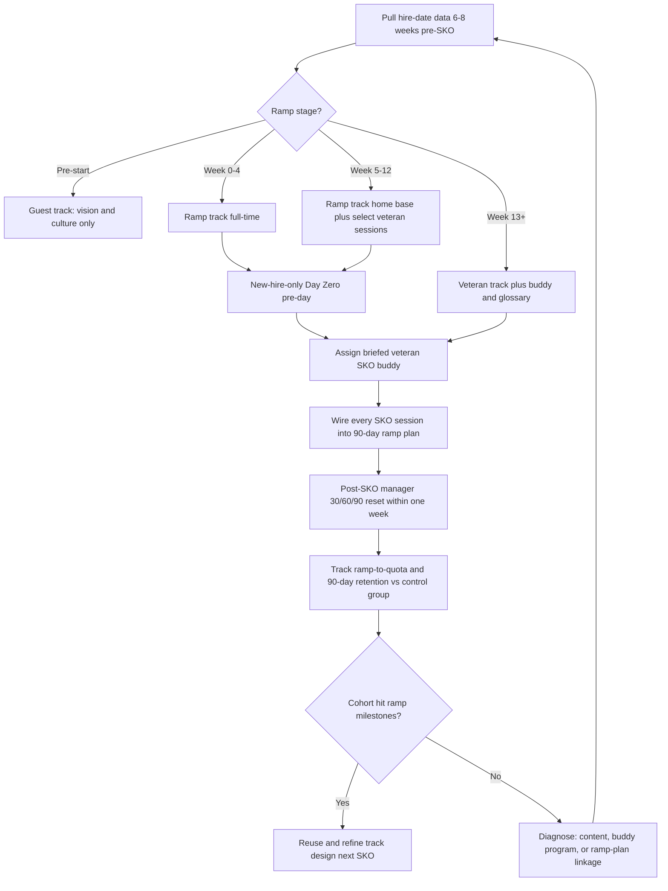

### Direct Answer

The playbook for integrating ramping reps and new hires into a Sales Kickoff (SKO) is to run a **dedicated parallel ramp track, not a watered-down version of the veteran track** — new hires need a foundational install (product, ICP, methodology, tooling, comp first-principles) while veterans need advanced skill-building and strategic reset, and forcing both into one room produces a meeting that bores the experienced and overwhelms the green. The operating model that consistently works across mid-market and enterprise SaaS organizations: (1) segment the audience by ramp stage, not just by role; (2) front-load a new-hire-only "Day Zero" the day before the main SKO so ramping reps arrive Day One already oriented and able to parse advanced content; (3) pair every new hire with a briefed veteran "SKO buddy" who owns the social and informal-knowledge layer for the duration of the event; (4) wire every SKO session into the new hire's structured 90-day ramp plan so the event becomes the high-intensity *launch module* of onboarding rather than a disconnected highlight reel; and (5) measure ramp-to-quota, time-to-first-deal, and 90-day attrition for this cohort specifically as the real SKO ROI — never generic satisfaction. A new hire who attends SKO with no scaffolding remembers the party and forgets the playbook; a new hire whose SKO is engineered into a ramp curriculum, supported by a buddy, and closed with a manager-led 30/60/90 reset hits full productivity four to eight weeks faster than a comparable rep who never attended. The discipline reflects how the category leaders — [Salesforce](https://www.salesforce.com/), [ServiceNow](https://www.servicenow.com/), [Snowflake](https://www.snowflake.com/), [Datadog](https://www.datadoghq.com/), [HubSpot](https://www.hubspot.com/) — and the enablement-platform vendors that sell ramp tooling ([Highspot](https://www.highspot.com/), [Seismic](https://seismic.com/), [Mindtickle](https://www.mindtickle.com/)) actually treat onboarding: as a measurable, milestone-gated competitive weapon, not an afterthought.

**TLDR:** Run new hires on a dedicated parallel SKO track tuned to ramp stage, not a diluted veteran track. Add a structured new-hire-only Day Zero, assign briefed veteran SKO buddies, map every session into the 90-day ramp plan, hold a manager-led 30/60/90 reset within a week of the event, and measure ramp-to-productivity and 90-day retention as the cohort's ROI against a natural control group of post-SKO hires. Done right, SKO compresses time-to-first-deal by four to eight weeks and lifts early retention; done wrong, it is an expensive offsite the new hire cannot act on once the afterglow fades.

## 1. Why Ramping Reps Break the Standard SKO Model

A Sales Kickoff is designed, almost universally, for the median tenured rep — someone who already knows the product, has internalized the sales methodology, has a live book of business, and needs an annual reset on strategy, territory, comp, and motivation. New hires and ramping reps violate every one of those assumptions, and dropping them into the veteran track creates predictable, measurable failure modes that compound across a multi-day agenda.

### 1.1 The competency gap is wider than planners assume

The single biggest planning error is treating "new hire" as a minor variance from "veteran." It is not. A rep in week three has no schema to hang advanced content on. When a veteran hears "we're moving upmarket and the new [MEDDICC](https://meddicc.com/) emphasis is on Economic Buyer access," they map it onto deals they have personally run; the session refines existing knowledge. A new hire hears an acronym they have not yet been trained on, attached to a motion they have never executed, justified by a market shift they cannot contextualize. The session is not 20% less useful to them — it is close to 0% useful, because comprehension is gated on prerequisites they do not have.

This is not a motivation problem or an intelligence problem; it is a cognitive-load problem, and it is well documented. Research on cognitive load theory, originating with educational psychologist [John Sweller](https://www.gse.uts.edu.au/) and synthesized in instructional-design references such as the [Association for Talent Development (ATD)](https://www.td.org/) body of knowledge, shows that learners cannot process new material when working memory is saturated by unresolved prerequisites. A new hire at SKO is the textbook saturated learner: every session adds unparsed jargon to a growing backlog, and each subsequent session sits on an unstable foundation. By the afternoon of Day One, the veteran ends the day energized; the new hire ends it quietly anxious, having concluded that everyone else got a memo they missed.

### 1.2 The "diluted track" anti-pattern

The instinctive fix — make the main track slightly more beginner-friendly — is the worst available option. It produces a meeting that is simultaneously too basic for veterans (who tune out, check Slack, and rate the SKO poorly on the post-event survey) and too advanced for new hires (who still cannot follow). You pay full SKO cost and satisfy neither cohort. Industry surveys of SKO effectiveness, including practitioner data published by [SiriusDecisions / Forrester (NASDAQ:FORR)](https://www.forrester.com/) and the [Sales Enablement Collective](https://www.salesenablementcollective.com/), repeatedly find that "content not relevant to my role or tenure" is the top complaint on post-SKO surveys — which is exactly what the diluted track produces.

This is the central reason a **dedicated ramp track** exists: segmentation lets each cohort run at its own altitude without compromise. The design pillars that govern a high-ROI SKO overall are covered in (q459), and the AE-versus-SDR-versus-manager content split that the ramp track extends along a second axis is detailed in (q464). The ramp track is not a special favor to new hires; it is what protects the veteran experience from dilution.

### 1.3 New hires are the highest-variance, highest-leverage cohort

Ramping reps are the cohort whose trajectory SKO can most change. A veteran's Year-2 quota attainment moves a few points based on SKO quality. A new hire's *ramp curve* — the slope from hire date to full productivity — can move by four to eight weeks depending on whether SKO accelerated or stalled them. The financial stakes are concrete. Industry benchmarks compiled by [The Bridge Group](https://blog.bridgegroupinc.com/) in their recurring SaaS AE metrics reports put the average ramp time for a SaaS account executive at roughly five months, with fully-loaded ramp cost — salary during sub-productive months, recruiting, onboarding labor, and management time — running \$30K-\$120K per rep depending on segment and base. CSO Insights and [Gartner (NYSE:IT)](https://www.gartner.com/) sales-leadership research draw the same conclusion: time-to-productivity is one of the highest-leverage metrics a revenue leader controls.

Against that backdrop, compressing time-to-productivity is the single highest-ROI thing SKO can do for this segment. Shaving even three weeks off a five-month ramp across a cohort of fifteen new hires recovers a meaningful fraction of the entire SKO budget in incremental selling time alone. The capacity-modeling discipline that quantifies ramp time as a formal planning input — and treats a ramping rep as a fractional unit of quota capacity — is covered in (q730), and it is the model a CRO should use to size the financial argument for the ramp track.

| SKO assumption (veteran-tuned) | Reality for a ramping rep | Consequence if ignored |
|---|---|---|
| Knows the product cold | May have completed only intro modules | Advanced demo and feature sessions are noise |
| Has internalized the methodology | Methodology is brand-new vocabulary | Cannot follow MEDDICC / Command-of-Message sessions |
| Has a live pipeline | Pipeline is empty or assigned-but-cold | Pipeline-review and forecasting sessions are abstract |
| Owns relationships across the org | Knows almost no one in the room | Misses the informal-network half of SKO value |
| Needs a strategic reset | Needs a foundational install | Strategic reset lands on empty ground |
| Comp plan is a delta from last year | Comp plan is the first one they have ever seen | Comp session needs first-principles framing |
| Can self-direct between sessions | Does not know what to prioritize or skip | Wastes the agenda's optional time |

### 1.4 The social-integration problem is invisible but real

Half the value of an in-person SKO is informal: hallway conversations, dinners, the veteran who explains over coffee how deals *actually* close versus what the deck says. Veterans extract this automatically because they already have relationships and know whom to seek out. A new hire standing alone at the evening reception extracts none of it — and the organization loses the single best moment all year to wire a new hire into the team's social fabric. This matters for performance, not just comfort: research on employee onboarding from sources such as [Gallup](https://www.gallup.com/) and the [Society for Human Resource Management (SHRM)](https://www.shrm.org/) consistently links early social connection and a sense of belonging to higher retention and faster productivity. The new hire who feels socially anchored after SKO asks more questions, escalates blockers faster, and is materially less likely to leave in the first ninety days. This is a design failure, not a personality problem, and Section 4 addresses it head-on.

### 1.5 The cost of getting it wrong

The downside is not abstract. A new hire who experiences SKO as three days of incomprehensible content and social isolation draws two damaging conclusions: that the job is over their head, and that they do not belong. Both are early-attrition predictors. With first-year sales-rep turnover already running high industry-wide — [Xactly](https://www.xactlycorp.com/) and Bridge Group data routinely put voluntary plus involuntary first-year SaaS sales attrition in the 25-35% range — a poorly designed SKO actively pushes a fragile cohort toward the exit at the exact moment the company has sunk recruiting and ramp cost into them. The ramp track is, among other things, a retention intervention.

### 1.6 The asymmetry of timing

There is a timing asymmetry that planners rarely weigh. A veteran who has a mediocre SKO loses a marginal week of strategic context that they will largely recover through the normal rhythm of quarterly business reviews, manager 1:1s, and deal work. A new hire who has a bad SKO loses something structural and hard to recover: their first impression of the company's competence, their first read on whether the methodology is real or theater, and their first calibration of how hard the job actually is. First impressions in a new role are disproportionately sticky. A new hire who concludes in week three that the company is disorganized — because the SKO was disorganized for *them* specifically — carries that conclusion for months, and it colors how they interpret every subsequent ambiguity. The veteran's SKO is a tune-up; the new hire's SKO is a foundation pour, and you do not get a second pour. This asymmetry is the deepest reason the ramp track deserves disproportionate planning attention relative to its share of headcount: the cohort is small, but the per-person stakes and the irreversibility are both far higher.

### 1.7 What the veteran cohort gains from a real ramp track

It is worth being explicit that a well-run ramp track is not purely a cost borne for the new hires' benefit — the veteran cohort gains directly. When new hires are pulled into a parallel track, the veteran sessions can finally be pitched at full altitude: a methodology session can assume the methodology, a competitive session can assume the battlecards, a forecasting session can assume pipeline literacy. Facilitators stop hedging, stop re-explaining, and stop apologizing for going deep. The veteran SKO becomes sharper, faster, and more advanced precisely because it no longer has to carry passengers who cannot follow. Veterans notice this, and it shows up in their survey scores. Framing the ramp track to the veteran population this way — "we are doing this so your sessions can be better, not worse" — also makes it far easier to recruit veterans as buddies, because they understand the program protects their own experience.

## 2. Segmenting the Audience: Ramp Stage, Not Just Role

The foundation of the entire playbook is correct segmentation. Most SKOs segment by role — AE, SDR/BDR, Sales Manager, Customer Success. For the ramp population you need a *second* axis layered on top: **ramp stage**. A rep hired four days before SKO and a rep hired four months before SKO are both nominally "new," but they need almost nothing in common, and a single "new hire breakout" that lumps them together fails both.

### 2.1 The four ramp-stage segments

**Pre-start / offer-accepted, not yet onboarded.** Occasionally a company invites signed-but-not-started hires to SKO as a culture and retention play — a strong signal that locks in a candidate who might otherwise be courted by another offer. They should attend culture, vision, and product-overview sessions only, and explicitly *not* comp, territory, or systems sessions, which will confuse rather than inform someone with no context. Treat them as honored guests, not participants, and flag them clearly so facilitators calibrate.

**Week 0-4 (foundational ramp).** Usually the largest and always the most fragile segment. They have basic product orientation at best, no methodology, no pipeline, and few relationships. Their SKO is essentially an intensive onboarding sprint conducted with the rest of the company as an energizing backdrop. Nearly all of their time belongs on the ramp track; pulling them into veteran sessions wastes both their time and the session's pacing.

**Week 5-12 (applied ramp).** They know the product reasonably well, have run early discovery calls, and may have a first deal or two in flight. They can absorb methodology deep-dives and competitive content *if* it is framed with concrete examples rather than assumed fluency. They can attend a select set of veteran sessions — especially territory planning and a simplified comp walkthrough — but still need a ramp-track home base and a facilitator who re-anchors them.

**Week 13+ (near-full ramp).** Functionally close to veterans for SKO purposes. They join the main veteran track with light-touch support: a buddy, a one-page glossary of any acronyms they may have missed, and one optional catch-up session. Do not over-engineer their experience — treating a near-ramped rep like a week-two hire is its own form of disrespect and wastes design effort.

### 2.2 The segmentation matrix

| Ramp stage | Headcount share (typical) | SKO home track | Veteran sessions they join | Special support needed |
|---|---|---|---|---|
| Pre-start | 0-3% | Guest track | Vision and culture only | Guest nametags; no comp / territory / systems |
| Week 0-4 | 5-15% | Ramp track (full-time) | None mandatory | Day Zero, buddy, glossary, ramp-plan linkage |
| Week 5-12 | 8-20% | Ramp track (home base) | Territory, simplified comp | Buddy, applied-methodology framing |
| Week 13+ | 10-25% | Main veteran track | All sessions | Buddy, glossary, one optional catch-up |
| Veterans | 40-70% | Main veteran track | All sessions | Standard SKO experience |

### 2.3 Get the headcount data before you design anything

You cannot design tracks without knowing the population. Pull hire dates from the HRIS — [Workday (NASDAQ:WDAY)](https://www.workday.com/), [BambooHR](https://www.bamboohr.com/), [Rippling](https://www.rippling.com/), or [ADP (NASDAQ:ADP)](https://www.adp.com/) — or from CRM rep records, six to eight weeks before SKO. The shape of the population dictates the design. If new hires are 5% of attendees, a strong half-day breakout suffices; if a fast-scaling org is at 25-35% new hires, the ramp track is co-equal with the veteran track and needs its own dedicated planning owner, its own room, its own AV, and its own budget line. The budgeting mechanics for sizing these tracks within a fixed SKO envelope — and the venue-and-content trade-offs that follow — are covered in (q1166).

### 2.4 Account for hires who land mid-planning

In a growing organization, reps will be hired *between* the planning-data cutoff and the SKO date — sometimes a meaningful number of them. Build a rolling intake process: a named owner re-pulls the new-hire list two weeks out and again three days out, and keeps a default "very-new arrival" path ready (Day Zero invite, buddy assignment, ramp-track default home base, glossary). Do not let late hires fall through into the veteran track by accident — an unflagged week-one rep dropped into an advanced forecasting session is the single most common way the segmentation breaks in practice, and it is entirely preventable with one owner and a recurring calendar reminder.

### 2.5 The two-axis design grid

Because the ramp population must be segmented by stage *and* by role, the cleanest way to plan the track structure is a two-axis grid. One axis is role — AE, SDR/BDR, Sales Manager, Customer Success. The other is ramp stage. Most cells of that grid do not need their own session, but the grid forces a planner to consciously decide what each combination needs rather than defaulting to a single undifferentiated "new hire room." A week-two enterprise AE and a week-two SDR share the company-context and methodology-vocabulary needs but diverge sharply on motion: the AE needs full-cycle discovery framing while the SDR needs prospecting cadence and qualification handoff. A week-ten new sales manager is a special case worth calling out — they are simultaneously ramping on the company and being asked to lead other ramping reps, and they are too often forgotten entirely, dropped into either the new-hire room (where the content is beneath them as a manager) or the veteran manager track (where it assumes company tenure they lack). Give new managers a deliberate path: the foundational company and product content of the ramp track, plus the manager-specific sessions of the veteran track, plus an explicit briefing on how to run the buddy program and the 30/60/90 reset for their own new hires. The two-axis grid is what surfaces the new-manager gap before SKO rather than during it.

### 2.6 Communicating the track assignment to new hires

How the track assignment is communicated matters as much as the assignment itself. A new hire who receives a terse "you are on the ramp track" with no framing can read it as being benched, sidelined, or judged not good enough for the real event — exactly the wrong message for a fragile cohort. The communication should be explicit and positive: the ramp track exists because the company invests in setting new hires up to win, it is the fastest path to productivity and to the commission that follows, and it is run to the same standard as everything else. Send the new hire a personalized agenda two weeks out that shows their specific path through the event — which sessions are ramp track, which veteran sessions they will join, when their buddy meeting and manager 1:1 are scheduled — so they arrive with a plan rather than confusion. The framing "we built this for you so you ramp faster and earn faster" converts the ramp track from a perceived demotion into a perceived benefit, and that perception shift is free.

## 3. The "Day Zero" Pre-Day: Onboarding Reps Before the Main Event

The highest-leverage structural move in the entire playbook is a **new-hire-only Day Zero** held the day before the main SKO opens. It solves the prerequisite problem at its root: instead of new hires straining to keep up with content built for people who know more than they do, you give them a focused head start so they arrive at Day One able to participate.

### 3.1 What Day Zero accomplishes

Day Zero compresses the most important onboarding fundamentals into a focused half-day to full-day, delivered *before* the new hire is exposed to advanced veteran content. By the time the main SKO opens, the new hire has a working vocabulary, has met the peers in their hiring cohort, has met their buddy and their manager in person, has a mental map of the agenda ahead, and has been told explicitly what to prioritize and what to let wash over them. They walk into Day One as a participant with a frame, not a spectator drowning in jargon. The psychological effect is as important as the informational one: the new hire enters the main event with confidence rather than dread.

### 3.2 A sample Day Zero agenda

| Time | Session | Owner | Outcome |
|---|---|---|---|
| 8:30-9:00 | Welcome and hiring-cohort introductions | Enablement lead | New hires know each other by name |
| 9:00-10:00 | Company story, mission, vision, ICP primer | Founder or CRO | Shared context for the vision keynote |
| 10:00-11:15 | Product fundamentals and a live guided demo | Product marketing | Can follow product breakout sessions |
| 11:15-12:00 | Sales methodology 101 — the org's chosen framework | Enablement | Knows the working vocabulary cold |
| 12:00-1:00 | Lunch seated with assigned SKO buddies | — | Social wiring begins |
| 1:00-2:00 | Tooling walkthrough: CRM, sequencer, conversation intelligence | RevOps | Can operate the core stack |
| 2:00-2:45 | "How to get the most from SKO" plus annotated agenda map | Enablement | Knows which sessions to prioritize |
| 2:45-3:30 | Comp plan first-principles walkthrough | Sales comp / RevOps | Comp session on Day Two will land |
| 3:30-4:00 | Open Q&A and manager 1:1 sign-ups | Managers | Open loops closed before Day One |

### 3.3 Day Zero is enablement, not hospitality

The distinction matters enormously. Many companies have new hires arrive a day early and call it onboarding, but then fill the time with badge pickup, hotel check-in, a swag handout, and a welcome dinner. That is hospitality, and hospitality is fine — but it is not enablement and it does not solve the prerequisite problem. Day Zero must be a *structured curriculum* with named session owners, defined and measurable outcomes, pre-built materials, and its own feedback survey — held to exactly the same design standard as any veteran SKO session. The design pillars that govern that standard are detailed in (q459); apply every one of them to Day Zero, because Day Zero is the SKO session that does the most work for the cohort whose trajectory is most movable.

### 3.4 The remote and hybrid variant

Not every organization runs a fully in-person SKO, and not every new hire can travel. The Day Zero concept ports cleanly to other formats. For a virtual SKO, run Day Zero as two 90-minute blocks the day before, with smaller breakout rooms, mandatory camera-on for the cohort introduction, and shorter sessions to fight video fatigue. For a hybrid SKO, run Day Zero in person wherever possible, because the social wiring is precisely the part that does not translate well to video — but never cancel Day Zero simply because the format is remote. The organizations that replaced the live SKO entirely with self-paced learning, and what they discovered they lost in the process, are examined in (q1496); the ramping cohort is precisely the group that loses the most when the live, high-intensity event disappears, because self-paced content cannot replicate the forcing function of a scheduled, social, immersive day.

### 3.5 Staffing and ownership of Day Zero

Day Zero fails most often not because the curriculum is wrong but because nobody owns it. The veteran SKO has an obvious owner — usually the head of enablement or a dedicated SKO program manager — and a planning team that has been meeting for two months. Day Zero, slotted in the day before, gets treated as an appendix and is thrown together in the final week by whoever has capacity. The fix is structural: name a Day Zero owner explicitly, distinct from the main SKO owner if the new-hire population is large enough to justify it, and give that owner the same eight-week runway, the same session-owner sign-offs, and the same dry-run requirement. Every Day Zero session should have a named presenter who has rehearsed, materials reviewed in advance, and a defined outcome the presenter is accountable for. The presenters themselves should skew toward people the new hires will work with — the actual product marketer, the actual RevOps lead, the actual sales manager — rather than a generic enablement voice, because Day Zero is also a relationship-building exercise and new hires should leave it knowing who to go to for what.

### 3.6 What to deliberately leave out of Day Zero

Just as important as the curriculum is the discipline about what *not* to include. Day Zero is not a place to cram the entire onboarding program; it is the install of the prerequisites the new hire needs to follow the main SKO, and nothing more. Resist the temptation from every department to add "just fifteen minutes" on their topic — security training, expense-policy walkthroughs, deep CRM administration, HR benefits. None of that helps a new hire follow the SKO keynote, and all of it crowds out the foundational content that does. The test for inclusion is strict and singular: does this session make a new hire better able to comprehend and act on the main SKO? If the answer is no, it belongs in the normal onboarding flow, not in Day Zero. A bloated Day Zero is nearly as bad as no Day Zero, because it exhausts the cohort before the real event even starts.

## 4. The Buddy System and Social Integration

Content solves the competency problem. It does not solve the social-integration problem. For that you need a deliberate structural mechanism: the **SKO buddy**.

### 4.1 Why a buddy, specifically for SKO

A new hire may already have an onboarding buddy or a longer-term mentor assigned during their first weeks. The SKO buddy is a deliberately separate, time-boxed role: a veteran rep whose entire job for the duration of the event is to make sure the new hire is never standing alone, always has someone to sit with at sessions and meals, gets introduced around at receptions, and has a no-stupid-questions back channel for the dozens of things the formal agenda does not explain — what the inside jokes mean, who the people on stage actually are, what the unwritten norms of the team are. Because it is a two-to-three-day commitment rather than a quarter-long mentorship, it is genuinely easy to recruit willing veterans for, which is a deliberate design feature.

### 4.2 How to run the buddy program

**Match deliberately.** Pair new hires with veterans in the same role and, ideally, the same segment or territory type, so the informal knowledge transferred is actually relevant. An enterprise AE buddy is largely wasted on an SMB SDR; the deals, the cycle lengths, and the daily reality are too different.

**Brief the buddies.** Give every veteran buddy a one-page guide with explicit expectations: sit together at meals, make at least three introductions per day, do a five-minute end-of-day check-in, and escalate anything the new hire is visibly struggling with to the manager or to enablement. Unbriefed buddies default to a single welcome handshake and then disappear into their own SKO — the briefing is what makes the program real rather than nominal.

**Recognize the buddies.** Call out the best buddies by name in the closing session. It signals to the whole organization that the role carries weight, and it makes recruiting buddies effortless next year.

**Make the pairing visible.** Use nametag markers or event-app profile flags so the rest of the organization can see buddy pairs and naturally include them in conversations and group plans.

### 4.3 Engineer structured social touchpoints

Do not leave social integration entirely to the buddy. Build it into the agenda as deliberate design:

- **Reserved hiring-cohort tables at meals** for at least the first full day, so every new hire has a guaranteed social home base before they are expected to branch out into the wider room on their own.
- **A new-hire "meet the leaders" session** — thirty minutes in which the CRO and VPs do short, informal small-group rotations with the new-hire cohort. New hires rarely get unstructured executive face time, and a leader who remembers a new rep's name three months later is a powerful retention and engagement signal.
- **Deliberate cross-functional introductions** — connect new hires with their counterparts in Customer Success, product, and marketing, so the working relationships that later unblock deals already exist before they are urgently needed.
- **A buddy-pair activity** slotted into any team-building block, so each pairing has a natural shared experience to build on rather than a purely transactional assignment.

### 4.4 The manager's role at SKO

The new hire's direct manager is the third leg of the stool, alongside the ramp-track content and the buddy. Managers should hold at least one in-person 1:1 with each of their new hires during SKO — not a performance conversation, but a forward-looking "here is what I most want you to take away from this week, and here is how it connects to your ramp plan and your first targets" conversation. For a remote new hire, SKO is often the first extended in-person time they get with their manager all year, and wasting that window is a missed alignment and retention opportunity that does not come back. The broader transition this asks of managers — moving from closing deals as an individual contributor to coaching reps on how to close — is examined in (q714), and the question of how to scale that coaching into a repeatable, consistent practice across a management team is covered in (q716). A manager who cannot run a useful ramp 1:1 at SKO is unlikely to run useful coaching the other fifty-one weeks of the year, so SKO is also a quiet diagnostic on management quality.

### 4.5 Common buddy-program failure modes

The buddy program looks simple on a planning slide and fails in predictable ways. The first failure is over-loading a small group of "reliable" veterans — the same five enthusiastic reps get assigned three buddies each while forty other veterans are never asked. That concentrates the work, burns out the volunteers, and excludes most of the veteran population from a program that would benefit them too. Cap each buddy at one new hire and spread the assignments deliberately. The second failure is matching on availability rather than fit — pairing whoever is free rather than whoever is relevant — which produces pairs with nothing to talk about. The third is treating the buddy assignment as the program's endpoint rather than its start: the assignment is made, an email goes out, and no one ever checks whether the pairing is actually functioning. Build a single mid-SKO checkpoint, ideally end of Day One, where the enablement team asks each new hire one question — "have you connected with your buddy?" — and re-pairs on the spot if the answer is no. The fourth failure is the silent buddy who is present but not briefed, covered already in 4.2. A buddy program that addresses all four — capped load, deliberate matching, a mid-event checkpoint, and a real briefing — delivers the social integration the content track cannot, at almost no cost.

### 4.6 The introvert and the remote-first new hire

Two sub-populations need extra deliberate design. The introverted new hire will not self-rescue from social isolation at a high-energy SKO; the environment is actively draining for them, and an unstructured reception is the opposite of an opportunity. For this rep, the buddy and the reserved cohort tables are not nice-to-haves, they are the entire mechanism, and the buddy briefing should explicitly note that not every new hire will work the room and that the buddy should bring people *to* the new hire rather than expecting the reverse. The remote-first new hire — increasingly the default in distributed organizations — faces a different problem: they have never been in a physical room with their team and may find the sensory load of a large in-person event genuinely disorienting. For them, the value of SKO is almost entirely the social wiring, so protect it: more cohort time, a buddy who is also remote-first and understands the adjustment, and explicit manager attention. Designing for the median extroverted, in-office new hire and assuming everyone else will cope is how the cohort's most fragile members slip through.

## 5. Wiring SKO Content Into the 90-Day Ramp Plan

This is the section most companies skip entirely, and skipping it is the single biggest reason SKO fails the ramping cohort. A new hire can have a flawless Day Zero, an engaged and briefed buddy, and a perfectly pitched ramp track — and still extract close to zero durable value if the SKO is treated as a self-contained event with no link to what happens the following Monday.

### 5.1 SKO is the launch of onboarding, not a detour from it

Reframe the entire event for this cohort: for a ramping rep, SKO is **Module 1 of the structured 90-day ramp plan**, delivered live and at high intensity. Every session a new hire attends should map cleanly to a ramp-plan milestone, a certification, or a dated 30/60/90 deliverable. If a session does not map to anything the new hire is accountable for, they have no behavioral reason to retain it, and they will not. The reframe is not cosmetic — it changes how the new hire listens, because content attached to an upcoming, graded deliverable is encoded very differently from content presented as general context.

### 5.2 The mapping in practice

| SKO session | Ramp-plan linkage | Post-SKO dated deliverable |
|---|---|---|
| Product deep-dive | Product certification module | Pass product cert by Day 30 |
| Sales methodology training | Methodology certification | Mock-call assessment passed by Day 45 |
| Competitive landscape session | Battlecard mastery | Competitive role-play passed by Day 30 |
| ICP and territory planning | Territory and account plan | Draft account plan delivered Day 14 post-SKO |
| Demo training and certification | Demo certification | Certified live demo by Day 60 |
| Pipeline-generation playbook | Outbound cadence build | First sequences live within one week |
| Forecasting and pipeline review | Forecast hygiene basics | First clean pipeline review by Day 45 |

### 5.3 The post-SKO 30/60/90 reset

Within one week of SKO ending, every new hire's manager should hold a 30/60/90 reset conversation that explicitly references SKO content by name: "You saw the new competitive positioning against our top rival on Day Two — your Day 30 deliverable is to pass the battlecard assessment on it, and I want to hear you handle that objection in our next 1:1." This single conversation is what converts SKO from entertainment into genuine ramp acceleration. Without it, the SKO afterglow fades inside two weeks, the recordings go unwatched, and the new hire is effectively back to learning the same material from scratch through trial and error on live deals. The reset is cheap — thirty minutes of a manager's time — and it is the highest-yield single action in the entire post-SKO sequence.

### 5.4 Capture and resurface SKO content systematically

New hires cannot absorb everything live; nobody can. Record every session, organize the recordings inside the LMS or enablement platform — [Highspot](https://www.highspot.com/), [Seismic](https://seismic.com/), [Mindtickle](https://www.mindtickle.com/), [Lessonly (now part of Seismic)](https://seismic.com/), [Docebo (NASDAQ:DCBO)](https://www.docebo.com/), or [Brainshark (also Bigtincan, ASX:BTH)](https://www.bigtincan.com/) — tagged by ramp-plan module rather than dumped into an undifferentiated folder. Then give new hires an explicit, specific instruction: rewatch the three sessions most relevant to your current ramp stage within two weeks, and come to your next 1:1 ready to discuss them. A pile of untagged recordings nobody is told to watch is not an asset; a curated, tagged, assigned shortlist is. The related question of how much of SKO should be live training content versus motivational content — and why over-indexing on motivation hurts the ramping cohort specifically, because they need skills more than they need a pep rally — is covered in (q1117).

### 5.5 The ramp-track agenda is a curriculum, not a mini-SKO

A common design error inside the ramp track itself is to build it as a smaller copy of the veteran SKO — a compressed keynote, a shorter strategy session, a abbreviated panel. That is the wrong template. The ramp track should be built as a *curriculum*: a deliberately sequenced progression where each session builds on the last and ends with a checkable competency. The veteran SKO is structured around themes and energy because veterans already have the foundation; the ramp track is structured around a learning path because the foundation is the entire point. A useful discipline is to write the ramp-track agenda backward from the 90-day ramp plan: list the competencies a rep must demonstrate by Day 30, Day 60, and Day 90, then design the ramp-track sessions as the live, accelerated kickoff for each of those competency blocks. If a proposed ramp-track session does not map to a ramp-plan competency, it does not belong on the agenda, however interesting it is. This backward-design approach also makes the ramp track far easier to defend and to reuse: it is not a fresh creative exercise every year but a stable curriculum that gets refined as the ramp plan itself evolves.

### 5.6 Do not drown new hires in the firehose

A real and recurring risk: SKO deliberately exposes everyone to the full strategic agenda — new markets, new products, repackaged pricing, new motions, new comp — and a week-three rep, hearing all of it at once, quietly concludes they are hopelessly and permanently behind. The ramp-track facilitator's explicit job is to constantly re-anchor the cohort: "Most of what you heard in the keynote today is context for where the company is going. It is not your job this month. Your job this month is the three things on your Day 30 plan, and nothing else." Give new hires explicit, repeated permission to *not* absorb everything. The firehose effect is real, it is demoralizing, and unmanaged it is a direct contributor to early attrition. How the category-leading software organizations sequence onboarding to avoid exactly this overload — gating advanced content behind demonstrated foundational competency — is a useful external benchmark, and the comparative onboarding approaches of the leaders are examined in (q1662) and (q1842).

## 6. Measuring Ramp-Cohort SKO ROI

If you cannot measure it, you cannot defend the budget for it to a CFO, and you cannot improve it for next year. The ramping cohort needs its own dedicated metrics, distinct from the all-hands SKO satisfaction score.

### 6.1 The wrong metric: generic satisfaction

A standard post-SKO survey asks every attendee to "rate the SKO 1-10." New hires will reliably rate it highly — it was exciting, the production was impressive, they met people, and they have no prior SKO to compare it against. That high score tells you almost nothing about whether the event actually accelerated their ramp. Satisfaction is a hygiene metric: a low score is a warning, but a high score is not evidence of value. Treating the satisfaction number as proof of ROI is one of the most common and most misleading measurement errors in SKO planning.

### 6.2 The right metrics

| Metric | Definition | Target signal |
|---|---|---|
| Time-to-first-deal | Days from hire date to first closed-won opportunity | SKO cohort beats the non-SKO baseline |
| Ramp-to-quota | Months from hire to first full-quota attainment | Compressed versus prior cohorts |
| Certification velocity | Days to pass product and methodology certifications | SKO cohort certifies measurably faster |
| 90-day retention | Percentage of new hires still employed at day 90 | Higher than the non-SKO baseline |
| Manager-confidence score | Manager's rated readiness of each new hire post-event | Rises sharply in the weeks after SKO |
| Content-application rate | Percentage of SKO-linked ramp deliverables completed on time | High rate indicates the content actually stuck |
| Pipeline-generation velocity | Days from hire to first self-sourced qualified opportunity | SKO cohort generates pipeline sooner |

### 6.3 The natural experiment

Because new hires in a growing organization arrive more or less continuously, you almost always have a built-in control group available for free: reps hired in the weeks just *after* SKO who did not attend it. Compare their ramp curves — time-to-first-deal, certification velocity, ramp-to-quota — to the SKO cohort's. If the SKO cohort ramps measurably faster, you have a credible, defensible ROI number to bring to the budget conversation. If it does not, the ramp track needs honest redesign rather than a bigger budget. This before-and-after comparison is the single most persuasive piece of evidence available for the SKO budget line, and it costs nothing but the discipline to track it.

### 6.4 Close the loop with a 30-day application pulse

Survey the new-hire cohort specifically thirty days after SKO — and ask about application, not satisfaction: "Which SKO sessions have you actually used in a real deal or a ramp deliverable? Which sessions have you not touched?" The gap between what was delivered on stage and what was genuinely applied in the field is the precise design backlog for next year's ramp track. A session that 90% of new hires say they have never used since does not belong in next year's agenda, regardless of how it was rated in the moment.

### 6.5 Build the cohort scorecard

Move the cohort metrics out of a one-time readout and into a living scorecard that the enablement team and the relevant sales managers review monthly for the first two quarters after SKO. The scorecard tracks each named new hire against their ramp-plan milestones, flags anyone falling behind early enough to intervene, and rolls up to a cohort view that compares the SKO group to the post-SKO control group on the metrics in 6.2. The discipline matters because ramp problems are cheap to fix in week four and expensive to fix in month four. A scorecard that surfaces a stalled new hire at the Day 30 certification mark gives the manager a real chance to coach the gap; the same problem discovered at the Day 90 quota review is often already terminal. The scorecard also creates accountability in the other direction: if a particular SKO session correlates with weak downstream application across the whole cohort, that is a content problem the scorecard makes visible and undeniable, and it feeds directly into 6.4's design backlog.

### 6.6 Attribution honesty

A word of caution on measurement: do not over-claim. SKO is one input into a ramp curve that is also shaped by territory quality, manager skill, product-market fit, the macro environment, and the raw quality of the individual hire. A ramp track that is genuinely excellent will still produce some new hires who ramp slowly because their territory is thin or their manager is weak, and a mediocre ramp track will still produce some fast rampers who would have succeeded regardless. The control-group comparison in 6.3 controls for some of this — the post-SKO hires share the same macro environment and product — but it does not control for everything. Present the ramp-track ROI as a contribution to a multi-factor outcome, not as the sole cause, and the number will be both more honest and more durable when a skeptical CFO pushes on it. Over-claiming a precise dollar figure invites the kind of scrutiny that, on a multi-causal metric, the number cannot survive.

## 7. How Real Operators Run This

The ramp-into-SKO playbook is not theoretical; it reflects how disciplined revenue organizations actually operate and how the vendors who sell into this market have built their businesses.

### 7.1 Enablement platforms as the system of record

The companies that genuinely wire SKO into the ramp plan almost always do it on a dedicated enablement platform. [Highspot](https://www.highspot.com/) and [Seismic](https://seismic.com/) dominate enablement content management and have built explicit "onboarding and readiness" modules; [Mindtickle](https://www.mindtickle.com/) built its early reputation specifically on sales readiness and ramp certification, with certification scoring and milestone tracking as core features. [Salesforce (NYSE:CRM)](https://www.salesforce.com/) embeds enablement directly into its platform through Sales Enablement (formerly myTrailhead-adjacent capabilities), and [HubSpot (NYSE:HUBS)](https://www.hubspot.com/) has pushed structured enablement and playbook features down into the mid-market. [Microsoft (NASDAQ:MSFT)](https://www.microsoft.com/), through Viva Learning and the broader Viva suite, makes the same argument for the Microsoft-centric enterprise. The common thread across all of them: ramp content needs a structured, searchable, accountable home, and SKO recordings tagged to specific ramp modules are exactly the use case these platforms were built to serve.

### 7.2 The CRM and conversation-intelligence layer

The reason ramp-cohort metrics are even measurable is that the modern revenue stack instruments the entire funnel. [Salesforce (NYSE:CRM)](https://www.salesforce.com/) remains the system of record in which time-to-first-deal, ramp-to-quota, and pipeline-generation velocity are actually tracked; [Microsoft Dynamics 365 (NASDAQ:MSFT)](https://www.microsoft.com/dynamics365) plays the same role in Microsoft-centric organizations, and [HubSpot (NYSE:HUBS)](https://www.hubspot.com/) does so for many mid-market sellers. The conversation-intelligence layer is what makes content-application measurable as behavior rather than self-report: [Gong](https://www.gong.io/) and Chorus — now part of [ZoomInfo (NASDAQ:GTM)](https://www.zoominfo.com/) — let an enablement team literally listen to whether a new hire is applying the methodology training from SKO on real customer calls. That is a far stronger application signal than any survey, and it is how mature organizations verify that the ramp track changed behavior rather than just filled time.

### 7.3 Onboarding discipline at the category leaders

The public software leaders treat onboarding as a competitive weapon, not an administrative chore. [ServiceNow (NYSE:NOW)](https://www.servicenow.com/) and [Snowflake (NYSE:SNOW)](https://www.snowflake.com/) are both widely studied for structured, milestone-gated ramp programs that deliberately compress time-to-productivity for new sales hires, and both run large enough hiring engines that a co-equal ramp track at SKO is a structural necessity rather than a choice. [Datadog (NASDAQ:DDOG)](https://www.datadoghq.com/) is known for a fast, certification-heavy onboarding model that pairs well with a product-led motion. [Workday (NASDAQ:WDAY)](https://www.workday.com/) and [Atlassian (NASDAQ:TEAM)](https://www.atlassian.com/), each running large and fast-scaling sales organizations, face exactly the high-new-hire-share problem that forces the ramp track to be planned as a peer of the veteran track. The product-led players in that group — Atlassian most prominently, and the self-serve motions inside companies like Datadog and [HubSpot (NYSE:HUBS)](https://www.hubspot.com/) — also make a quieter point: even when the product onboards customers itself, the *sales* organization still requires structured human ramp, and SKO is its annual anchor. The handoff metrics that connect a product-led motion to that sales ramp are explored in adjacent guidance, and the comparative onboarding approaches of the category leaders are examined in (q1662) and (q1842).

### 7.4 What the data tooling actually changes

It is worth being concrete about how instrumentation changes the ramp-track conversation, because the change is recent and not yet universal. Five years ago, a head of enablement defending the SKO ramp track had only anecdote and the post-event satisfaction survey. Today the stack closes that gap. The CRM provides the timestamped funnel events — hire date, first opportunity, first closed-won — that make time-to-first-deal and ramp-to-quota computable per rep and comparable across cohorts. The enablement platform provides certification timestamps, so certification velocity is a real number rather than a guess. The conversation-intelligence layer provides the behavioral evidence: an enablement leader can pull every call a new hire ran in their first sixty days and check whether the discovery framework from the SKO methodology session actually shows up in how they run the call. That triangulation — funnel outcomes from the CRM, competency timestamps from the enablement platform, and behavioral evidence from conversation intelligence — is what lets a modern revenue organization treat the ramp track as an instrumented, improvable system rather than an act of faith. The practical implication for a planner is simple: if your organization already runs [Salesforce (NYSE:CRM)](https://www.salesforce.com/), an enablement platform, and a conversation-intelligence tool, you already have everything you need to measure the ramp track honestly, and not doing so is a choice rather than a constraint.

### 7.5 The private-equity-backed consolidators

[Vista Equity Partners](https://www.vistaequitypartners.com/) and [Thoma Bravo](https://www.thomabravo.com/), as owners of dozens of B2B software companies between them, have effectively standardized the "ramp playbook" across their portfolios. When a private-equity owner installs a common onboarding and SKO framework across portfolio companies, the dedicated ramp track is treated as a non-negotiable line item — because compressed time-to-productivity flows directly into the revenue-growth and sales-efficiency metrics the sponsor underwrites at acquisition and is measured against at exit. This is a useful tell for any operator weighing whether the ramp track is worth the effort: when the owners holding a company to the most exacting financial standard in the market insist on a structured ramp track, the practice is demonstrably not a soft nice-to-have. It is a value-creation lever.

## 8. Counter-Case: When a Separate Ramp Track Is the Wrong Call

Intellectual honesty requires acknowledging that the full parallel-track playbook is not universally correct. There are real, identifiable situations in which building a separate ramp track is over-engineering, and a disciplined planner should be able to name them.

### 8.1 When new hires are a tiny share of attendees

If new hires are under roughly 5% of SKO attendees — say four people at a ninety-person SKO — a full parallel track with its own dedicated rooms, owners, AV, and budget line is disproportionate to the population it serves. The right answer is lighter and cheaper: a strong Day Zero half-day, well-briefed buddies, a one-page glossary, and explicit "this session may run advanced for newer reps" framing baked into the main agenda. Build the apparatus to the size of the actual population; a co-equal ramp track for four people is planning theater.

### 8.2 When the SKO itself is foundational

Very early-stage companies sometimes run an SKO at which *everyone* in the room is effectively a new hire — a twelve-person sales organization that doubled headcount in the last two quarters. Here there is no veteran track for a ramp track to diverge from; the entire SKO is, correctly, a foundational install for the whole team. Segmentation in that situation adds planning overhead with no offsetting benefit. Run a single track, pitched honestly at the median attendee (who is now junior), and revisit segmentation only once a genuine veteran cohort actually exists to protect.

### 8.3 When the cost of separation outweighs the benefit

A parallel track carries a real cost beyond budget and logistics: it physically separates new hires from veterans during the exact event that is supposed to integrate them into the team. If an organization's most acute problem is that new hires already feel like outsiders, pulling them into a separate room for two full days can genuinely worsen the underlying belonging problem. In that specific case, deliberately bias toward integration — keep new hires in the main room for more sessions, lean much harder on buddies and mixed-tenure seating, and consciously accept some content inefficiency as the fair price of belonging. The right answer depends on which problem is more expensive: comprehension or connection.

### 8.4 When SKO is the wrong delivery mechanism entirely

If new hires arrive in a steady trickle rather than in identifiable cohorts, and the next SKO is eight months away, then waiting for SKO to onboard them is operational malpractice. The ramp plan must stand on its own and run continuously year-round, with SKO functioning as an accelerant for whoever happens to be ramping at the time it lands — not as the primary onboarding vehicle. An organization that has genuinely solved continuous, structured, self-paced ramp may rationally conclude that SKO adds relatively little incremental value for its new hires specifically; the full set of trade-offs in that decision, including what is lost along with what is gained, is exactly what (q1496) examines.

### 8.5 The honest synthesis

The parallel-track playbook is the right call for the *typical* case: a mid-market or enterprise SaaS organization, running an annual cohort-based SKO, with new hires at roughly 8-25% of attendees and a real veteran majority in the room. Outside that band — tiny new-hire share, an all-hands-are-new early-stage team, an acute pre-existing belonging problem, or genuine trickle hiring — the playbook should be deliberately scaled down or set aside in favor of a lighter intervention. But the underlying principle survives intact in every single case, and it is the part worth carrying away: **design the SKO experience to the actual readiness of the audience in the room, and never let a ramping rep sit through content they have no foundation to use or act on.** Whether that principle is best honored by a co-equal parallel track or by nothing more than a strong Day Zero and a well-run buddy program depends entirely on the numbers — but the principle itself is not negotiable.

## 9. Implementation Checklist and Common Failure Modes

### 9.1 The eight-week countdown

| Timing | Action | Owner |
|---|---|---|
| 8 weeks before | Pull new-hire headcount; size and scope the ramp track | Enablement |
| 7 weeks before | Decide the track model: full parallel versus light-touch | Enablement and CRO |
| 6 weeks before | Draft the Day Zero curriculum and the ramp-track agenda | Enablement |
| 5 weeks before | Recruit and brief the veteran SKO buddies | Enablement and managers |
| 4 weeks before | Build the ramp-plan linkage map for every ramp-track session | Enablement and RevOps |
| 3 weeks before | Confirm rooms, session owners, and AV for the ramp track | Operations |
| 2 weeks before | Re-pull the new-hire list; assign buddies; send personalized agendas | Enablement |
| 1 week before | Final brief to managers on 1:1s and the 30/60/90 reset | Enablement |
| SKO week | Run Day Zero, then the full SKO | All |
| 1 week after | Managers run 30/60/90 resets; release tagged session recordings | Managers |
| 4 weeks after | Run the 30-day application pulse survey | Enablement |
| 12 weeks after | Deliver the ramp-cohort ROI readout versus the control group | RevOps |

### 9.2 The five failure modes that recur

**Diluting the main track instead of building a separate one** — satisfies neither cohort and wastes the full SKO budget; covered in 1.2.

**Calling early arrival "Day Zero" without a real curriculum** — hospitality is not enablement and does not solve the prerequisite problem; covered in 3.3.

**Assigning buddies but never briefing them** — produces a single welcome handshake and then nothing; covered in 4.2.

**Treating SKO as a standalone event with no ramp-plan linkage** — the afterglow fades inside two weeks and the content does not stick; covered in 5.3.

**Measuring only satisfaction** — produces high scores and zero genuine insight into whether ramp accelerated; covered in 6.1.

### 9.3 Adjacent decisions that interact with this playbook

The ramp-into-SKO playbook does not exist in isolation; it sits inside a system of revenue-design decisions that all touch the new hire. Comp changes announced at SKO need genuine first-principles framing for a new hire who has never seen a plan before — the broader question of communicating comp changes at kickoff without derailing the room is covered in (q466), and the specific mechanics of executing a mid-year comp change without triggering attrition among reps, including ramping reps, is covered in (q744). Territory assignment determines whether a new hire's pipeline-generation training has anywhere real to land, and the rules for organizing territory across AE segments are covered in (q789). The top-down-versus-bottom-up quota question that sets a ramping rep's very first target — and whether that target is fair given their ramp stage — is examined in (q729). And the cadence question, namely how frequently to even run an SKO given the organization's forecast cycles, which directly determines how reliably SKO can be used as a ramp anchor at all, is covered in (q463). Together these decisions form the system; the ramp track is one well-instrumented part of it, and it works best when the parts around it are also sound.

### 9.4 The one-sentence version

If you do exactly one thing differently for ramping reps at your next SKO, make it this: run a structured, curriculum-grade new-hire-only Day Zero, then have every manager hold a 30/60/90 reset within one week of the event that explicitly ties SKO content to dated, graded ramp deliverables — that single bracket, a strong start and an accountable finish, is what converts SKO from an expensive offsite the new hire cannot act on into the highest-velocity onboarding module of their entire first quarter.
