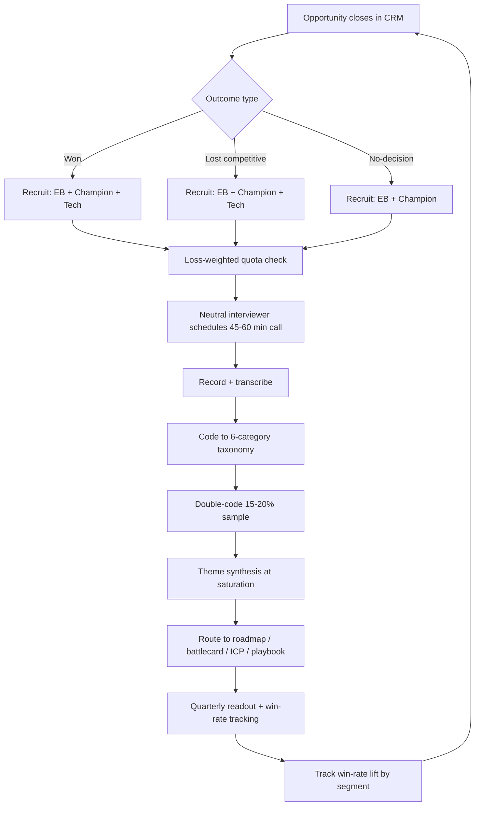

### Direct Answer

Structure win-loss interviews as **45-60 minute semi-structured conversations** with the **economic buyer, the champion, and the technical/security influencer**, completed **within 60-90 days of close**, run by a **neutral third party** (Anova, Cipher, Primary Intelligence, Klue Insights), using a fixed **discovery-sequenced guide** (timeline → vendors evaluated → decision criteria → vendor selection → post-decision reflection) coded against a **6-category objection taxonomy**. Rigorous programs lift win rate **14-21% within 12-18 months** (Forrester) — but only if you fix the silent killer: rep-reported loss reasons are wrong **60-70% of the time** (Gong, Klue). The interview design exists to replace seller self-attribution with buyer-side decision logic, then route that signal into roadmap, battlecards, and ICP.

> **TLDR**
> - **The problem you are solving:** Sales reps over-attribute losses to *price* by 2-3x; the real driver is usually a discovery gap, feature mismatch, or champion attrition. Interview design is a bias-correction instrument, not a survey.
> - **Who to interview:** Economic buyer + champion + technical/security influencer, on both wins and losses, plus no-decisions. Three voices per deal, not one.
> - **When:** Within 60-90 days of close — memory decay past 90 days corrupts timeline recall.
> - **Who runs it:** A neutral third party or a dedicated internal researcher who never carried the bag on that deal. Never the AE who lost it.
> - **How long:** 45-60 minutes, semi-structured, recorded and transcribed, coded to a 6-category taxonomy (product gap, pricing/packaging, sales experience, competitive parity, implementation/risk, internal politics).
> - **How much:** 12-20 interviews per persona-by-segment cell before patterns stabilize; a $35K-$185K annual program (50-120 interviews) typically returns 5-15% top-line lift.
> - **The trap:** Loss respondents agree at 8-18% vs winners at 35-55% — unweighted programs over-sample wins and miss the loss signal entirely.
> - **The closed loop:** A readout nobody acts on is a cost center. Every taxonomy code needs a named owner, a forum, and a decision SLA before the first interview is booked.

A **win-loss interview program** is a systematic post-decision research practice in which a B2B revenue organization interviews **buyers from recently closed opportunities** — wins, losses, and no-decisions — to uncover the **actual decision drivers** behind each outcome. The discipline separates **buyer-side reality** from **seller-side self-attribution** and feeds the findings back into product roadmap, competitive battlecards, sales playbooks, ICP refinement, pricing and packaging, marketing positioning, and partner enablement. Salesforce (CRM), HubSpot (HUBS), Snowflake (SNOW), Atlassian (TEAM), and Datadog (DDOG) all run formal programs at the discipline level described below. This answer covers the full design surface: respondent selection, guide architecture, sequencing, taxonomy coding, bias controls, sample sizing, the routing model that turns transcripts into roadmap changes, the operating cadence, the staffing and tooling decisions, and the failure modes that quietly kill most programs.

## 1. Why Interview Design Is the Whole Game

The single most expensive mistake in revenue intelligence is treating win-loss as a data-collection problem when it is a **bias-correction problem**. The raw material — closed opportunities — is free and abundant. The hard part is extracting decision logic that is **systematically distorted at every layer**: the rep distorts it to protect their narrative, the buyer distorts it to be polite, and the internal analyst distorts it to confirm the roadmap they already wanted to build. A win-loss program is, at its core, an instrument for stripping those three distortions out of the record so that leadership makes resourcing decisions on what actually happened rather than on a comforting fiction.

### 1.1 Rep self-attribution is wrong 60-70% of the time

Gong's conversation-intelligence research and Klue's win-loss benchmarking both converge on the same finding: when you compare a rep's CRM-logged loss reason against a neutral third-party interview with the actual buyer, the two disagree **60-70% of the time**. The disagreement is not random — it is **directional**. Reps over-attribute losses to **price** because price is the only loss reason that does not implicate their own discovery, demo, or follow-through. "We lost on price" is a socially safe story; "I never identified the security influencer" is not.

The mechanism is well understood in behavioral terms. A rep who logs a loss reason is engaged in **motivated reasoning** under social and financial pressure: the loss reason is read by their manager, it shapes their next pipeline review, and in some comp plans it touches their standing. The rep is not lying — they sincerely believe the price story, because the human mind reliably constructs a post-hoc narrative that protects self-image. HBR's research on decision rationalization shows the same pattern in every domain: actors reconstruct causes after the fact in a way that flatters their own conduct.

The economic consequence is severe. A revenue org that believes it loses on price will discount more aggressively, erode margin, and never fix the discovery gap that actually caused the loss. Bridge Group field data shows that orgs running internal-only win-loss inflate the "price" loss category by **2-3x** relative to neutral third-party interviews of the same deals. The compounding damage is that the discounting itself trains the buyer base to expect discounts, so the org degrades its own pricing power while never touching the real defect.

### 1.2 The silent killers reps never see

Structured interviews surface failure modes the rep was never present for:

- **Procurement objections** raised after the rep's last call — pricing-model friction, contract terms, payment-schedule mismatch, or a competing vendor's better procurement experience. Procurement frequently enters in the final 10% of the cycle, after the rep believes the deal is closing.
- **Security and compliance review failures** the rep never learned about because the InfoSec team rejected the deal in a meeting the rep was not invited to — a failed SOC 2 question, a data-residency gap, a missing SCIM/SSO capability surfaced only in a vendor security questionnaire.
- **Executive-sponsor handoff failures** — the champion left, got reorganized, or lost political capital, and the deal died with no replacement sponsor. The rep often logs this as "timing" or "budget," never seeing that the sponsor's calendar was the real cause.
- **Competitor reference customers** who closed the deal in the final stage by giving the buyer a confidence signal the rep could not match — a peer-company reference call that de-risked the competitor in the buyer's eyes.
- **Internal build-vs-buy debates** the rep never knew were happening — an engineering team that argued it could build the capability in-house and won the budget.

None of these appear in CRM loss codes. All of them appear in a well-designed 50-minute interview. This is the core argument for the discipline (see q477 on taxonomy design and q480 on how the same interviews refine ICP).

### 1.3 Win-loss has the highest marginal ROI in revenue intelligence

Forrester benchmarks rigorous win-loss programs at **+14% to +21% win-rate improvement** within 12-18 months. A program running 50-120 interviews per year costs **$35K-$185K** fully loaded — and the output (roadmap reprioritization, battlecard refresh, ICP refinement, playbook updates) routinely drives **5-15% top-line revenue lift**. No other revenue-intelligence investment delivers that per-dollar return, which is why the design rigor is worth getting right (see q476 on the cadence that triggers GTM pivots).

The reason the ROI is so high is **leverage**. A single product-gap finding, correctly coded and routed, can change a roadmap decision that affects every future deal in a segment — not one deal, but the entire forward pipeline. A single corrected sales-experience pattern can be trained into an entire AE team. Win-loss is one of the rare revenue investments whose output is a *systemic* fix rather than a per-deal tactic, and systemic fixes compound.

| Distortion layer | Mechanism | Correction in the design |
|---|---|---|
| Rep self-attribution | Protects rep narrative; over-indexes "price" 2-3x | Interview the buyer, never the rep |
| Buyer politeness bias | Softens negative feedback to a stranger | Neutral third party + post-decision timing |
| Recall decay | Timeline detail collapses after 90 days | 60-90 day post-close interview window |
| Analyst confirmation bias | Codes transcripts toward the desired roadmap | Double-coding + locked taxonomy |
| Sample bias | Losers decline 4-5x more than winners | Loss-weighted recruiting quotas |
| Survivorship in CRM | Lost-deal context is thin and stale | Reconstruct timeline from the buyer, not the CRM |

### 1.4 Win-loss vs the adjacent disciplines

Win-loss is often confused with three neighboring practices. The design implications differ, so the distinction matters:

- **NPS / CSAT surveys** measure *existing-customer* sentiment after onboarding. They do not capture the competitive decision and they never reach the buyers who chose someone else.
- **Conversation intelligence** (Gong, Clari) captures what was *said on sales calls*. It is invaluable for coaching but it cannot capture the procurement meeting, the security review, or the internal politics the rep never attended.
- **Deal-desk and pipeline analytics** measure *internal process metrics* — cycle time, slippage, discount depth. They tell you the deal slipped; they cannot tell you why the buyer chose the other vendor.

Win-loss is the only instrument that recovers the **full buyer-side decision** including the off-call moments. A mature revenue org runs all four; this answer is about designing the one that the others structurally cannot replace.

### 1.5 The cost of not running a structured program

It is worth being explicit about the counterfactual, because the budget conversation for a win-loss program is always a comparison against doing nothing. An org without a structured program does not have *no* loss data — it has *corrupted* loss data, which is worse. The CRM is full of loss codes, every quarterly business review cites them, and the entire GTM strategy is quietly steered by a data set that is wrong 60-70% of the time. The damage shows up in four predictable places:

- **Roadmap misallocation.** Engineering builds features to close a "gap" that the buyer never actually cared about, because a handful of reps logged it as the loss reason. Meanwhile the real gap — perhaps an integration or a depth problem — goes unbuilt because no rep had the visibility to name it.
- **Margin erosion.** The org reads its inflated "price" loss rate and responds with deeper discount authority, list-price cuts, or a cheaper tier. It trains its market to expect discounts and never touches the discovery defect that was the real cause.
- **Battlecard drift.** Competitive positioning is built on rep folklore about what the competitor does, rather than on what buyers say the competitor actually did to win. The battlecards feel authoritative and are quietly wrong.
- **ICP blindness.** Without segment-level win-rate analysis, the org keeps spending pipeline-generation dollars on segments it structurally loses, because nobody has the data to say "we win 40% here and 12% there."

A structured program is not an additive cost over a clean baseline — it is the correction of an existing, expensive error. That reframing is what makes the $35K-$185K spend an easy approval (see q480 on the ICP-blindness failure mode specifically).

## 2. Respondent Selection: Who You Interview Determines What You Learn

### 2.1 The three-voice rule

A single interview captures one slice of the decision. Modern B2B deals are committee decisions — Gartner's B2B buying-journey research puts the typical enterprise buying group at **6-10 people** — and the design must reflect that. For every deal you study, target **three respondent types**:

- **The economic buyer** — owns the budget, makes the final call, and weighs ROI and risk. They explain *why the money moved* (or did not), and they are the only voice that reliably knows whether the business case cleared the bar.
- **The champion** — the internal advocate who ran the evaluation day-to-day. They explain *how the process actually unfolded*, where it stalled, and which vendor interactions moved the needle.
- **The technical or security influencer** — IT, InfoSec, or a domain SME with veto power. They explain the *gates and disqualifiers* the rep often never sees, and they are the most reliable source on product-gap and implementation-risk objections.

You will not always get all three. A realistic target is **1.6-2.0 respondents per studied deal**. But designing the recruiting plan around three voices, and treating a single-voice deal as incomplete, is what separates signal from anecdote. A program that interviews only the champion will systematically under-weight procurement and security objections; a program that interviews only the economic buyer will miss the process-quality detail that drives playbook fixes.

### 2.2 Wins, losses, and the no-decision third category

Most programs study wins and losses and ignore **no-decisions** — deals that died in "we decided to do nothing." This is a mistake. For many SaaS categories, **30-50% of forecasted pipeline ends in no-decision**, and the failure mode there (weak business case, no compelling event, status-quo bias) is entirely different from a competitive loss. A complete design allocates interview slots across all three:

| Outcome | Suggested mix | Primary question it answers |
|---|---|---|
| Closed-won | 30-35% | What made us the credible, low-risk choice? |
| Closed-lost (competitive) | 35-40% | Where did the competitor out-execute or out-feature us? |
| Closed-lost (no-decision) | 25-30% | Why did the buyer's business case fail to clear the bar? |

Studying wins is not optional padding — wins reveal the **repeatable strengths** you must protect and double down on, and they provide the contrast class that makes a loss finding interpretable. A "shallow discovery" loss code only means something if you can show that won deals had deep discovery. Without the win baseline, every loss finding is an uncontrolled anecdote.

### 2.3 Fighting the loss-sample bias

The hardest structural problem in win-loss is **differential response rates**. Winners agree to interviews at **35-55%**; losers agree at **8-18%**. An unmanaged program will therefore over-sample wins by 3-4x and produce a dangerously optimistic picture — leadership will conclude the GTM motion is healthier than it is. Counter it in the recruiting design:

- **Loss-weighted quotas** — set the recruiting target to the *final mix* you want (Table 2.2), then over-recruit losses by 3-4x to hit it. Treat the quota as the contract with your vendor.
- **Incentives** — a $100-$250 honorarium or a charitable donation materially lifts loss response rates and is a rounding error against deal value.
- **Executive outreach** — a brief, gracious note from your CRO or VP Sales, separate from the interviewer, framed as "we want to learn, not to re-sell," lifts loss participation measurably.
- **Speed** — request the interview within 2-3 weeks of close, before the buyer fully disengages and the relationship goes cold.
- **Channel diversity** — phone, video, and async-friendly scheduling all widen the funnel; rigid scheduling depresses loss response.

This is the single highest-leverage design decision in the entire program (see q475 on whether a third-party vendor's recruiting reach justifies its cost).

### 2.4 The segmentation matrix

Before recruiting begins, the program must define the **segmentation matrix** — the grid of cells that the sample will fill. The matrix is what makes a finding interpretable: "buyers want deeper reporting" is meaningless, but "enterprise economic buyers in regulated industries want deeper audit reporting, while mid-market champions do not mention it" is a roadmap and an ICP decision. A workable matrix is built from two or three axes:

- **Segment / deal size** — enterprise, mid-market, SMB. The decision dynamics are genuinely different; an enterprise loss is a committee and procurement story, an SMB loss is often a single-buyer speed story.
- **Persona** — economic buyer, champion, technical influencer. The same deal looks different through each lens, and the routing differs by persona too.
- **Outcome** — won, competitive loss, no-decision. The third axis that most programs forget.

A three-by-three-by-three matrix is 27 cells, and saturating all of them at 12-20 interviews each would require 300-500 interviews a year — beyond most budgets. The design discipline is therefore **deliberate cell selection**: pick the 4-8 cells where the business has the most strategic uncertainty and the most pipeline at stake, saturate those, and explicitly mark the rest as out of scope for the year. A program that tries to cover every cell thinly saturates none; a program that picks its cells produces decisions.

| Matrix axis | Typical values | Why it changes the decision |
|---|---|---|
| Deal size | Enterprise / mid-market / SMB | Committee vs single-buyer dynamics differ entirely |
| Persona | Economic buyer / champion / technical | Each sees a different slice; routes to different owners |
| Outcome | Won / competitive loss / no-decision | No-decision failure mode is unique and often dominant |
| Region (optional) | NA / EMEA / APAC | Procurement norms and competitive sets vary by geography |

### 2.5 Recruiting logistics and consent

The mechanics of getting a buyer onto a call are where many programs quietly fail. A few non-negotiables in the design:

- **The ask is research, not re-selling.** The recruiting message must promise — and the interviewer must honor — that the call is to learn, with no sales follow-up. A buyer who suspects a re-pitch will decline or stonewall.
- **Recording consent is explicit and up front.** The interviewer states at the open that the call is recorded for internal research, names who will hear it, and confirms consent before the first substantive question.
- **The economic buyer's time is protected.** A 45-minute ask to a senior buyer is more credible than a vague "quick chat"; precision signals that the program is professional and respects their time.
- **The CRM trigger fires recruiting automatically.** A closed-deal stage change should generate the recruiting task within 24-48 hours, so no deal falls outside the 60-90 day window because someone forgot.

## 3. Interview Guide Architecture: The Discovery-Sequenced Model

### 3.1 Why sequencing beats a question list

A guide is not a checklist of questions — it is a **narrative reconstruction**. The buyer's decision unfolded as a story over time, and the most reliable way to recover accurate detail is to walk the buyer back through that story **in chronological order**. Jumping straight to "why did you choose the other vendor?" invites a rationalized, post-hoc answer — the same motivated reasoning that corrupts rep self-attribution, now operating on the buyer. Walking the timeline forward surfaces the *actual* sequence of events, including the moments the buyer themselves had not consciously flagged as decisive.

The proven structure is a **five-phase discovery sequence**:

1. **Timeline reconstruction** — when did the need emerge, what triggered the evaluation, who got involved?
2. **Vendors evaluated** — who made the shortlist, who fell off early, and why?
3. **Decision criteria** — what mattered, in what priority order, and did that order shift?
4. **Vendor selection** — what was the deciding factor, who pushed for the winner, what was the runner-up gap?
5. **Post-decision reflection** — knowing what they know now, what would they tell the vendor they did not pick?

The sequence is deliberately front-loaded with low-threat, factual recall (timeline, vendor list) before it reaches the high-stakes judgment questions (why you lost). This **rapport ramp** is not a courtesy — it is a data-quality control. A buyer who has spent ten minutes calmly reconstructing facts is far more candid when the hard question arrives than one ambushed with it in minute two.

### 3.2 Phase-by-phase question design

**Phase 1 — Timeline reconstruction.** Open-ended, low-threat, builds rapport.
- "Walk me back to the beginning — what was happening in your business that started this evaluation?"
- "Who first raised the idea, and who got pulled in as it got serious?"
- "Was there a specific event or deadline driving the timeline?"
- "How urgent did this feel at the start versus three months in?"

**Phase 2 — Vendors evaluated.** Reveals the real competitive set, not the CRM's guess.
- "Which vendors did you look at, even briefly?"
- "Who got cut early, and what cut them?"
- "How did you first hear about each one?"
- "Was there an internal build-it-ourselves option on the table?"

**Phase 3 — Decision criteria.** The heart of the objection signal.
- "If you ranked your top five must-haves, what were they?"
- "Did that priority order change as you learned more?"
- "Was there a single criterion that became a dealbreaker?"
- "Which criteria were 'nice to have' that turned out not to matter?"

**Phase 4 — Vendor selection.** Get the deciding moment, not the summary.
- "Take me to the moment the decision actually got made — who was in the room?"
- "What did the winning vendor do that the others did not?"
- "Where did we [the studied vendor] fall short — specifically?"
- "If our score had been one point higher on any single dimension, would it have changed the outcome?"

**Phase 5 — Post-decision reflection.** Surfaces advice the buyer would never volunteer unprompted.
- "If you were advising us, what one thing should we change?"
- "Was there anything our team did that nearly lost — or nearly won — the deal?"
- "Would you evaluate us again? What would have to be true?"
- "Six months on, are you happy with the choice — and why?"

### 3.3 Question-design discipline

| Rule | Bad question | Good question |
|---|---|---|
| Open, not leading | "Was our price too high?" | "How did pricing factor into your decision?" |
| Specific, not abstract | "How was the sales process?" | "Walk me through your second call with our rep." |
| Behavioral, not attitudinal | "Did you like the demo?" | "What did you do in the 48 hours after the demo?" |
| Single-barreled | "Was it price and timing?" | One factor per question, always |
| Silence-tolerant | Fill every pause | Wait 5-7 seconds; the best detail comes after the pause |
| Non-defensive | "But we have that feature..." | "Tell me more about that gap as you experienced it." |

Keep the guide to **12-16 core questions** with branching probes. A guide longer than that forces a rushed, surface-level pass; a guide shorter than that misses the timeline depth that makes the data credible. The branching probes — the "tell me more about that" follow-ups — are where the real signal lives, so train interviewers to treat the 12-16 questions as scaffolding and the probes as the actual work (see q9519 for the same compression discipline applied to pipeline reviews).

### 3.4 Semi-structured, not scripted

The guide is **semi-structured** by design: every interview hits the same five phases and the same core questions, so the data is comparable across deals — but the interviewer is free to reorder probes, chase an unexpected thread, and spend more time where the buyer is candid. A fully scripted interview produces shallow, comparable data; a fully unstructured interview produces deep, incomparable data. Semi-structured is the only architecture that yields data that is both deep *and* codeable. The discipline that makes it work is the **locked taxonomy** (Section 4) — because the coding is fixed, the interview itself can flex without losing the ability to count and trend.

### 3.5 Adapting the guide to win, loss, and no-decision

The five-phase backbone is constant, but the *emphasis* shifts by outcome, and the design should formalize three lightly differentiated versions of the guide:

- **The win guide** spends extra time in phase 4 on "what made us the credible, low-risk choice" and in phase 5 on "what nearly lost it" — wins almost always have a near-miss moment, and that moment is a defect hiding inside a success. Wins also surface the **repeatable strengths** the org must protect; a win guide that only celebrates is a wasted interview.
- **The competitive-loss guide** spends extra time in phase 3 on the criteria where the competitor scored higher and in phase 2 on when and why the competitor entered. The goal is a precise, named, codeable competitive-parity finding, not a general sense that "the other vendor was strong."
- **The no-decision guide** reframes phase 4 entirely: there was no vendor-selection moment, so the questions become "what would have had to be true for *any* purchase to happen" and "what is the cost of the status quo you chose instead." The no-decision guide is really a business-case autopsy.

Keeping the three variants as light edits of one backbone — not three separate instruments — preserves cross-outcome comparability while letting each interview go where the signal is.

### 3.6 The opening and the close

The first two minutes and the last two minutes of the interview are disproportionately load-bearing. The **opening** sets candor: the interviewer states they are independent, that the call is to learn rather than re-sell, that there are no wrong answers, and that the buyer's specific feedback will not be attributed to them by name. This framing measurably increases candor on the hard phase-4 questions. The **close** is the single best moment to catch the thing the guide missed — "is there anything I should have asked you about this decision that I did not?" routinely surfaces a decisive factor that no structured question reached, because the buyer, now warmed up and trusting, volunteers it. Both moments belong in the guide as fixed elements, not improvisation.

## 4. The Six-Category Objection Taxonomy

### 4.1 Why a fixed taxonomy is non-negotiable

Without a locked taxonomy, win-loss findings degrade into a "junk drawer" of unstructured quotes that cannot be counted, trended, or routed. The taxonomy is the **coding spine** that turns 80 transcripts into a rank-ordered list of fixable problems. Six categories is the proven span — granular enough to be actionable, coarse enough to be reliably coded. Fewer than five and the categories are too broad to route to a specific owner; more than eight and inter-coder agreement collapses because analysts disagree on where a quote belongs (see q477 for the full anti-junk-drawer argument).

| # | Category | What it captures | Routes to |
|---|---|---|---|
| 4.2 | Product gap | Missing capability, depth, or integration | Product roadmap |
| 4.3 | Pricing & packaging | Total cost, model fit, tier structure, discount friction | Pricing / packaging team |
| 4.4 | Sales experience | Discovery quality, responsiveness, demo fit, trust | Sales enablement |
| 4.5 | Competitive parity | A named competitor out-featured or out-positioned us | Product marketing / battlecards |
| 4.6 | Implementation & risk | Onboarding, migration, support, change-management fear | Customer success / services |
| 4.7 | Internal politics | Champion loss, sponsor reorg, status-quo bias, no compelling event | GTM / deal-strategy |

### 4.2 Product gap

The buyer needed a capability the product does not have, or has at insufficient depth. The design discipline here is to capture the **specific feature and the use case behind it** — "missing SSO" is weak; "could not provision via SCIM, which their IT mandated for all SaaS" is roadmap-ready. The coding standard is that a product-gap entry must be specific enough that a product manager could write a ticket from it without a follow-up call. Atlassian (TEAM) is widely cited for routing win-loss product-gap codes directly into quarterly roadmap planning, and Snowflake (SNOW) similarly feeds competitive feature gaps into its platform roadmap reviews.

### 4.3 Pricing and packaging

This is the category most corrupted by rep self-attribution, so the coding bar is high: a pricing code requires the **buyer** to have named price as the deciding factor, with detail on whether the issue was absolute cost, model fit (per-seat vs consumption), tier packaging, or procurement-stage discount friction. A vague "too expensive" gets coded as *unverified* and excluded from the trend. The discipline matters because pricing changes are expensive and hard to reverse; you do not want to restructure tiers on the strength of rep folklore (see q478 on how battlecards should answer real, not assumed, pricing objections).

### 4.4 Sales experience

Discovery depth, responsiveness, demo relevance, multi-threading, and the trust the rep built. This category is where the "we lost on price" myth most often gets corrected — buyers will describe a shallow discovery call, a generic demo, or a slow follow-up as the real reason, even when the CRM says price. Sales-experience codes are also the **fastest to act on**: unlike a product gap that needs a quarter of engineering, a discovery-quality miss can be trained into the team in a 30-day enablement cycle.

### 4.5 Competitive parity

A specifically named competitor — Salesforce (CRM), HubSpot (HUBS), Gong, Clari, or a category-specific rival — out-featured, out-positioned, or out-referenced you. Code the **competitor name and the specific advantage** so product marketing can build a precise counter. A competitive-parity code that does not name the rival and the exact advantage is useless to a battlecard team (see q479 on converting these losses into take-out campaigns).

### 4.6 Implementation and risk

Fear of a painful onboarding, a hard data migration, weak support reputation, or organizational change-management cost. This category is invisible to most reps because it surfaces in the buyer's *internal* risk conversation, not on a sales call. It is also frequently mis-coded as a product gap — the distinction is that an implementation-risk objection is about the *path to value*, not the value itself, and it routes to customer success and services rather than to engineering.

### 4.7 Internal politics

The champion left, the sponsor got reorganized, budget got frozen, or the buyer's business case never cleared the status-quo bar — the no-decision death. This is the category that, left uncoded, makes a program think it has a product problem when it actually has a *compelling-event* problem. Internal-politics findings route to GTM and deal strategy: better multi-threading, earlier executive engagement, and a stronger cost-of-inaction narrative.

### 4.8 Coding mechanics

- **One primary code per deal, up to two secondary codes.** Forcing a single primary prevents the "everything mattered" cop-out and produces a clean rank-ordering.
- **Double-code 15-20% of transcripts** with a second analyst; an inter-coder agreement below 80% means the taxonomy definitions are too loose and need tightening before the next batch.
- **Lock the taxonomy for at least a year.** Changing categories mid-stream destroys the ability to trend, which is the entire point of a fixed spine.
- **Tag every code with verified vs unverified** based on whether the buyer (not the rep) named it. Only verified codes feed the trend; unverified codes are kept for context but never counted.
- **Maintain a code book** with a one-paragraph definition and two example quotes per category, so a new analyst can be calibrated in an hour.

### 4.9 Sub-tags beneath the six categories

The six top-level categories are the spine, but each can carry a small, controlled set of **sub-tags** that add routing precision without breaking comparability. The rule is that sub-tags live *beneath* the locked six and never replace them: a product-gap code might carry sub-tags for *integration*, *depth*, or *missing module*; a pricing code might carry *absolute cost*, *model mismatch*, or *procurement friction*; a competitive-parity code carries the competitor's name as its sub-tag. Because the top six never change, the trend stays intact even as sub-tags are refined — and the sub-tags let a product manager or battlecard author filter straight to the slice they own. The discipline is to keep the sub-tag list short (three to six per category) and reviewed once a year alongside the rest of the code book; a sprawling sub-tag list recreates the junk-drawer problem one level down. This two-tier structure is what lets a single locked taxonomy serve both the executive trend view and the line-level routing detail at once.

## 5. Bias Controls: The Design Decisions That Make Data Trustworthy

### 5.1 The neutral-interviewer mandate

The single most important credibility control is that the interviewer is **not the person who carried the deal**. A buyer will not tell the AE who lost the deal that the AE's discovery was shallow — they will say "price" to be kind. A neutral third party (Anova, Cipher, Primary Intelligence — now Clozd — or Klue Insights) or a dedicated internal researcher with no commission exposure removes that politeness filter. Internal-AE-conducted interviews inflate the "price" code by **2-3x** — a measured, repeatable distortion. The neutral interviewer is also more candid in the *other* direction: they will probe a painful answer that an AE would instinctively defend against (see q475 for the third-party-vs-internal decision framework).

### 5.2 Timing: the 60-90 day window

Interview within **60-90 days of close**. Earlier than ~3 weeks and the loser is still disengaging and hard to recruit; later than 90 days and **timeline recall collapses** — buyers compress, reorder, and rationalize events they can no longer remember in sequence. The 60-90 day window is the empirical sweet spot between recruitability and recall fidelity. The decay is not gentle: by six months, a buyer's account of which vendor said what, and in what order, is substantially reconstructed rather than recalled, and a reconstructed timeline cannot be trusted for root-cause analysis.

There is a second, subtler timing trap. Interview the buyer too soon — within the first two weeks — and you catch them at the **honeymoon or sour-grapes peak**: a fresh winner is uncritically enthusiastic, a fresh loser is still annoyed. Both emotional states distort the rating of decision criteria. The 60-90 day window also lets the dust settle emotionally, so the buyer can describe the decision analytically rather than through the residue of the moment. The phase-5 reflection questions ("six months on, are you happy?") are deliberately calibrated to a buyer who has lived with the decision long enough to judge it but not so long that they have forgotten the alternatives.

### 5.3 Confirmation-bias controls in synthesis

The analyst writing the readout wants the data to confirm the roadmap they already believe in. Counter it:

- **Double-coding** (Section 4.8) catches a single analyst's directional drift before it reaches the readout.
- **Verbatim quote requirement** — every theme in the readout must be backed by at least three direct buyer quotes, not the analyst's paraphrase. Paraphrase is where bias hides.
- **Pre-registered hypotheses** — write down what you expect to find *before* coding, then report explicitly where the data contradicted you. A readout that confirms every prior is a warning sign, not a success.
- **Blind theme synthesis** — code transcripts before knowing the deal outcome where feasible, so "this was a loss" does not color the reading of an ambiguous quote.
- **Adversarial review** — have someone whose roadmap would *lose* budget if the finding holds review the synthesis before it ships.

### 5.4 Recording and transcription discipline

Record every interview (with explicit consent) and work from full transcripts, not interviewer notes. Notes are themselves a bias filter — the interviewer writes down what they think matters in the moment. A transcript lets a second analyst find what the first one missed, makes double-coding possible, and provides the verbatim quotes the readout standard requires. Modern programs transcribe automatically and store transcripts in a searchable repository so a battlecard author can pull every quote that mentions a given competitor on demand.

| Bias | Where it enters | Design control |
|---|---|---|
| Politeness bias | The interview itself | Neutral third-party interviewer |
| Recall decay | Late interviews | 60-90 day window |
| Confirmation bias | Synthesis | Double-coding + pre-registered hypotheses |
| Note-taking filter | Data capture | Full transcripts, not notes |
| Sample bias | Recruiting | Loss-weighted quotas + incentives |
| Leading-question bias | Guide design | Open, single-barreled question review |

### 5.5 Interviewer training and calibration

Even a neutral interviewer can corrupt the data if untrained. The skill set is specific and unintuitive — a great salesperson is often a *poor* win-loss interviewer, because the instinct to handle objections and steer toward a close is exactly wrong here. The design should treat interviewer skill as a controlled variable:

- **Calibration interviews.** New interviewers run their first 3-5 interviews with a senior reviewer listening to the recording, scoring against a rubric: did they lead, did they tolerate silence, did they chase the probe, did they defend the product?
- **The non-defensive reflex.** The hardest habit to build is hearing "your product could not do X" and responding with "tell me more about that" instead of "actually, we can." Defensiveness ends candor instantly.
- **Probe discipline.** Interviewers are scored on whether they used branching probes — the "walk me through that" follow-ups — rather than marching through the 12-16 core questions like a survey.
- **Consistency across interviewers.** When more than one person interviews, periodic cross-listening keeps style consistent so the data is comparable across the whole sample.

A program that hires a third party is buying this calibration as part of the package; a program that runs in-house must build it deliberately, because an uncalibrated internal interviewer reintroduces the very bias the neutral-interviewer mandate was meant to remove.

## 6. Sample Sizing and Cadence: When You Have Enough Signal

### 6.1 Saturation, not statistical significance

Win-loss is qualitative research; the goal is **thematic saturation**, not a p-value. Saturation is the point at which new interviews stop producing new themes — the tenth interview in a cell teaches you something, the twentieth confirms what you already heard. Pavilion and Bridge Group field research converges on **12-20 interviews per persona-by-segment cell** before themes stabilize. The unit that matters is the *cell* — "enterprise economic buyers" and "mid-market champions" are different cells, and each needs its own 12-20. A program that runs 60 interviews spread thinly across eight cells has not actually saturated any of them.

### 6.2 Program sizing

| Program scale | Interviews / year | Cost (fully loaded) | What it can support |
|---|---|---|---|
| Pilot | 20-40 | $15K-$45K | One segment, directional only |
| Standard | 50-90 | $35K-$110K | 2-3 segments, quarterly readouts |
| Comprehensive | 100-180 | $110K-$280K | Full segment matrix, monthly signal |
| Enterprise | 180-300+ | $280K-$500K+ | Multi-region, multi-product, continuous |

A sub-scale program (<20 interviews per cell per year) produces **noise that looks like signal** — the most dangerous output, because leadership acts on it with the same confidence it would give a saturated finding. If you cannot fund 12-20 per cell, narrow the scope to fewer cells rather than thinning every cell. A credible finding in two segments beats an uncertain finding in eight.

### 6.3 Cadence

Run interviews **continuously** (rolling, as deals close) rather than in batches — rolling capture preserves the 60-90 day window for every deal, whereas a quarterly batch inevitably interviews some deals at 30 days and others at 150. Synthesize and read out **quarterly** for the full program, with a **monthly competitive-signal flash** for fast-moving battlecard updates. The cadence split matters: the roadmap cannot absorb input faster than quarterly, but competitive intelligence goes stale in weeks, so the design serves two clocks at once (see q476 for the cadence thresholds that should trigger a roadmap or GTM pivot, and q9638 on the analogous rhythm of a CRO's pipeline review).

### 6.4 Detecting saturation in practice

Saturation is easy to define and harder to operationalize. The practical test the program owner runs is a **new-theme curve**: after each batch of five interviews in a cell, count how many genuinely new themes appeared that were not present in earlier interviews of that cell. Early on, every batch adds several new themes; as the cell saturates, the curve flattens toward zero. When two consecutive batches of five add no new themes — only repeated confirmation of existing ones — the cell is saturated and further interviews in it have diminishing value. The owner should then redeploy the interview budget to an unsaturated cell rather than continuing to over-sample a settled one.

There is a discipline trap here: an unsaturated cell can *look* saturated if the guide is too narrow or the interviewer is leading, because a constrained interview cannot surface new themes even when they exist. So a flat new-theme curve should trigger one check — is the cell genuinely settled, or is the instrument too blunt to detect the variance? — before the budget is moved.

### 6.5 Continuous vs batch capture, in detail

The argument for rolling capture is the 60-90 day window, but there is a second reason. Continuous capture means the program is **always within a quarter of current reality**. A competitor launches a feature in February; a rolling program is interviewing buyers affected by that launch in March and April and can flash the battlecard team in May. A batch program that interviews every deal from H1 in a single July push learns the same thing two to four months later, by which time the competitor has another launch. Markets move on a continuous clock; a batch program is always reading a stale snapshot. The only real argument for batching is operational convenience, and convenience is a poor reason to corrupt both the recall window and the freshness of competitive signal.

## 7. Routing: Turning Transcripts Into Revenue

### 7.1 The closed loop is the point

A win-loss program that produces a readout nobody acts on is a cost center. The design must include a **routing model** — a pre-agreed map from each taxonomy category to an owner, a forum, and a decision SLA. The routing model is built *before* the first interview, because a program that interviews for two quarters and then discovers there is no forum to receive product-gap findings has wasted two quarters.

| Taxonomy code | Owner | Forum | Decision SLA |
|---|---|---|---|
| Product gap | Head of Product | Quarterly roadmap review | Roadmap call within 1 quarter |
| Pricing & packaging | Pricing lead / RevOps | Pricing committee | Tier review within 1 quarter |
| Sales experience | Enablement lead | Monthly enablement sync | Playbook update within 30 days |
| Competitive parity | Product marketing | Monthly competitive sync | Battlecard refresh within 2 weeks |
| Implementation & risk | Customer Success lead | Quarterly CS review | Process fix within 1 quarter |
| Internal politics | CRO / GTM lead | QBR | Deal-strategy update within 1 quarter |

### 7.2 The four output products

Every quarterly cycle should ship four concrete artifacts, each owned by a named leader and tracked to completion:

1. **Roadmap reprioritization memo** — product gaps ranked by frequency *and* deal value, so a rare gap on six-figure deals outranks a common gap on small ones.
2. **Battlecard refresh** — updated competitive intelligence per named rival, with the specific advantage the rival used and the proven counter (see q478).
3. **ICP refinement** — which segments win, which lose, and why; the highest-leverage output because it changes what the org targets in the first place (see q480).
4. **Playbook updates** — specific discovery and demo changes tied to coded sales-experience misses, pushed into enablement within 30 days.

### 7.3 Win-rate attribution

To prove the program works, track **win rate by segment** before and after each routed change, and tag deals that were influenced by a battlecard or playbook update so you can compare influenced vs uninfluenced cohorts. Forrester's +14-21% benchmark is achievable, but only a program that measures the lift can defend its budget at the next planning cycle. The attribution does not need to be econometrically perfect — a credible before/after by segment, with the routed change dated, is enough to make the case (see q9531 on the analogous ROI-justification discipline for deal desks, and q1892 on how competitive-intelligence rigor shapes even M&A-scale decisions).

### 7.4 The quarterly readout: format and audience

The quarterly readout is the moment the program either earns its next year of budget or quietly loses it. The design of the readout matters as much as the design of the interview. A readout that works has four properties:

- **It leads with decisions, not data.** The first slide is "here are the three things we recommend changing and why," not a wall of charts. The taxonomy distribution is supporting evidence, placed after the recommendation.
- **It is rank-ordered by impact.** Findings are sorted by frequency multiplied by deal value, so the room spends its attention on the items that move revenue, not the items that are merely common.
- **It carries verbatim quotes.** Every recommendation is backed by direct buyer language. A leadership team will discount an analyst's paraphrase; it cannot discount a buyer saying, in their own words, why they chose a competitor.
- **It names owners and dates in the room.** The readout ends with the routing table from Section 7.1 populated with specific names and commit dates, agreed live, so the meeting produces accountability rather than interest.

The audience is deliberately cross-functional: product, product marketing, enablement, RevOps, and the CRO. Win-loss findings cut across every GTM function, and a readout delivered to product marketing alone will route only the battlecard findings. The cross-functional room is what makes the closed loop close.

### 7.5 Trending: the payoff of a locked taxonomy

The single most valuable artifact a mature program produces is not any one readout — it is the **multi-quarter trend**. Because the taxonomy is locked (Section 4.8), a program in its second year can show whether the "shallow discovery" sales-experience code is falling after the playbook change, whether a competitor's parity advantage is growing, and whether a segment's win rate is responding to the ICP refinement. The trend converts win-loss from a quarterly anecdote generator into a **management instrument** — leadership can watch a routed fix actually move the coded data over time. This is the entire reason the taxonomy must never be tweaked mid-stream; a year of locked discipline is what buys the trend, and the trend is what buys the program's permanence.

## 8. Staffing, Tooling, and Operating the Program

### 8.1 The build-vs-buy decision

The first operating decision is whether to run interviews **in-house** or hire a **third-party vendor**. The trade-off is concrete: a vendor (Anova, Cipher, Clozd, Klue Insights) brings interviewer neutrality, recruiting reach, and methodology maturity, at a cost of $35K-$185K per year and some loss of nuance about your own product. An in-house researcher brings deep product context and lower marginal cost, at the risk that even an internal researcher carries organizational bias and lacks the recruiting muscle to fight loss-sample bias. The common mature pattern is **hybrid**: a third party runs the loss interviews where neutrality matters most, while an internal researcher runs win interviews and owns synthesis and routing (see q475 for the full vendor-selection criteria).

### 8.2 The internal owner

Whoever runs the program, there must be a single **internal owner** — typically in product marketing, revenue operations, or competitive intelligence — who owns the taxonomy, the routing map, the quarterly readout, and the win-rate attribution. Win-loss without a single accountable owner reliably decays: interviews keep happening, transcripts pile up, and nothing gets routed. The owner does not need to conduct interviews; the owner needs to be the person whose performance review includes "did the findings change a roadmap, a battlecard, and a playbook this quarter."

### 8.3 Tooling

| Layer | Purpose | Typical tooling |
|---|---|---|
| Trigger | Detect closed deals, fire recruiting | CRM workflow (Salesforce, HubSpot) |
| Recruiting | Schedule interviews, manage incentives | Vendor portal or calendaring + ops |
| Capture | Record and transcribe interviews | Video + automated transcription |
| Coding | Tag transcripts to the taxonomy | Win-loss platform or structured spreadsheet |
| Repository | Searchable transcript and quote store | Win-loss platform / knowledge base |
| Reporting | Trend dashboards, win-rate attribution | BI tool fed from coded data |

The tooling does not need to be expensive — a disciplined program can run on a CRM trigger, a transcription service, and a well-structured spreadsheet. What cannot be skipped is the **searchable repository**: the value of three years of transcripts is only realized if a battlecard author can pull every quote mentioning a competitor in minutes.

### 8.4 Common operating failure modes

- **The transcript graveyard** — interviews happen, transcripts accumulate, nobody codes or routes. Cause: no internal owner. Fix: name one.
- **The stale taxonomy** — categories get tweaked every quarter, so nothing trends. Cause: well-meaning iteration. Fix: lock it for a year.
- **The optimistic sample** — wins dominate the sample, leadership relaxes. Cause: ignored loss-weighting. Fix: enforce the quota as a vendor contract term.
- **The readout no one attends** — findings ship into a void. Cause: no pre-built routing forums. Fix: build the routing map first.
- **The vanity program** — the program exists to be cited, not to change decisions. Cause: no win-rate attribution. Fix: tie the owner's review to routed outcomes.

## 9. Counter-Case: When Heavy Win-Loss Design Is the Wrong Move

### 9.1 The four conditions that flip the answer

The discipline above is not universally correct. A rigorous reviewer should know when to *not* build the heavy version:

- **Very high deal volume, very low ACV.** A self-serve or PLG business closing thousands of sub-$5K deals gets better signal from product analytics and a lightweight in-app survey than from 50-minute interviews. The interview cost per insight is prohibitive when each deal is tiny, and the decision was rarely a committee evaluation worth reconstructing. OpenView's PLG benchmarks make the case that product telemetry, not interviews, is the primary loss signal in that motion.
- **Pre-product-market-fit startups.** Below roughly $2M ARR the founder is usually in every deal, the sample is too small for saturation, and direct founder debriefs beat a formal program. First Round Review's founder-sales guidance is explicit that the founder *being* the win-loss instrument is correct at that stage. Build the formal program when you have enough closed deals to fill cells — typically post-Series-A.
- **A single dominant, already-known loss reason.** If you genuinely lose 80% of deals to one missing feature that everyone already agrees on, spend the money building the feature, not interviewing buyers to re-confirm it. Win-loss is for *ambiguous* loss patterns; it is wasted on a consensus problem.
- **No routing capacity.** If product, pricing, and enablement have no bandwidth to act on findings for the next two quarters, a win-loss program will produce a readout that decays into resentment and cynicism. Fix the routing capacity first, then start interviewing.

### 9.2 What is true even in the counter-case

Even when the heavy program is wrong, the *principle* still holds: a revenue org must listen to the buyers who chose someone else. PLG and pre-PMF companies should run a **lightweight variant** — 5-10 founder-led or PM-led loss calls per quarter, coded loosely to the same six categories. The argument in Section 9.1 is against bolting **enterprise-grade infrastructure** (third-party vendor, 100+ interviews, formal quarterly readouts) onto a business that cannot yet use it — it is not an argument against the discipline itself. The mistake is sequencing: scaling the apparatus before the business has the deal volume to saturate cells and the routing capacity to act. Graduate to the heavy program when both are true (see q476 on matching cadence to organizational readiness).

### 9.3 The over-engineering risk inside a mature program

Even a company that *should* run the heavy program can over-engineer it. Symptoms: a taxonomy with fifteen categories nobody can code reliably; a 25-question guide that produces rushed interviews; monthly full readouts that the roadmap cannot absorb. The corrective is to remember that win-loss is an instrument in service of *decisions* — every element of the design should be sized to the cadence at which the receiving function can actually act. A program tuned for elegance rather than for routed outcomes is a quieter version of the vanity-program failure mode.

## 10. Implementation Roadmap and Bottom Line

### 10.1 The phased rollout

| Phase | Weeks | Key actions |
|---|---|---|
| Design | 1-3 | Lock taxonomy, build the discovery-sequenced guide, choose third-party vs internal, define routing map and SLAs |
| Pilot | 4-12 | Run 20-40 interviews across one segment, validate the guide, calibrate coding, run first double-coding check |
| Scale | 13-26 | Expand to the full segment matrix, hit 12-20 per cell, deliver the first quarterly readout and four output products |
| Closed loop | 26+ | Route findings, ship the four artifacts every quarter, track win-rate lift by segment, run a monthly competitive flash |

A founder or CRO standing this up should resist the urge to scale before the pilot has validated the guide and the taxonomy. The pilot exists to catch a leading-question problem or a too-loose taxonomy *before* it contaminates 100 interviews — a defect found in the pilot costs three weeks; the same defect found after scaling costs a year of un-trendable data (see q475 on whether to outsource the pilot itself).

### 10.2 The five design decisions that determine success

Win-loss interview design is a **bias-correction instrument**. Its entire purpose is to replace the rep's self-protective "we lost on price" story — wrong 60-70% of the time — with the buyer's actual decision logic. Get five design decisions right and the program returns 5-15% top-line lift:

1. **Interview three voices per deal** — economic buyer, champion, technical influencer — including no-decisions, not just the easy single voice.
2. **Use a neutral interviewer** within a **60-90 day** window, never the AE who carried the deal.
3. **Run a discovery-sequenced 12-16 question guide** that walks the timeline forward instead of ambushing the buyer with "why did we lose."
4. **Code to a locked six-category taxonomy** with double-coding and a verified/unverified flag.
5. **Route every code to an owner with a decision SLA** and ship four output products every quarter.

Get sample sizing wrong (under 12-20 per cell) or skip the loss-weighted recruiting quotas and the program produces confident noise that leadership will act on with misplaced certainty. Skip the routing model and the program becomes a transcript graveyard. Build the heavy version only when deal economics and routing capacity justify it — otherwise run the lightweight founder-led variant and graduate later. Done with this discipline, win-loss is the highest marginal-ROI investment a revenue organization can make: a systemic, compounding fix to the forward pipeline rather than a per-deal tactic.

---

**Related questions:** (q475) selecting a third-party win-loss vendor vs running it in-house; (q476) the interview cadence that should trigger product and GTM pivots; (q477) the taxonomy structure that prevents a win-loss junk drawer; (q478) designing competitive battlecards that change rep behavior; (q479) executing take-out campaigns that convert competitive losses; (q480) using win-loss interviews to refine ICP targeting; (q9519) the 25-minute pipeline review that drives real decisions; (q9531) measuring deal-desk effectiveness and ROI; (q9638) how a CRO designs the ideal pipeline review; (q1892) how competitive-intelligence rigor shapes M&A-scale decisions.

**Sources:** Forrester win-loss program benchmarking (+14-21% win-rate lift); Gong conversation-intelligence loss-reason research; Klue win-loss benchmarking report; Bridge Group B2B sales operations field data; Pavilion revenue-org research on qualitative saturation; Anova win-loss methodology; Cipher Systems competitive-intelligence practice; Primary Intelligence / Clozd win-loss benchmarks; Klue Insights interview methodology; Salesforce (CRM) revenue-intelligence practice; HubSpot (HUBS) win-loss program disclosures; Snowflake (SNOW) competitive-intelligence function; Atlassian (TEAM) roadmap-routing practice; Datadog (DDOG) GTM intelligence program; Crayon State of Competitive Intelligence report; Gartner B2B Buying Journey research on committee decisions; CSO Insights / Korn Ferry sales-performance studies; SiriusDecisions (Forrester) win-loss framework; Sales Hacker win-loss practitioner guides; Reveal qualitative-research saturation literature; HBR research on post-hoc rationalization in buyer decisions; inter-coder reliability standards for qualitative coding; TOPO (Gartner) sales-research benchmarks; Clozd win-loss interview design library; OpenView PLG benchmarks on self-serve loss signal; First Round Review founder-sales debrief practices; Winning by Design revenue-architecture frameworks; Pavilion CRO compensation and program-sizing data; Bain customer-research methodology; McKinsey B2B decision-journey research; Gong "loss reason accuracy" data set; Klue competitive-enablement adoption metrics; Forrester total-economic-impact methodology for revenue-intelligence ROI; Gartner buying-group-size research; B2B procurement-stage friction studies.
