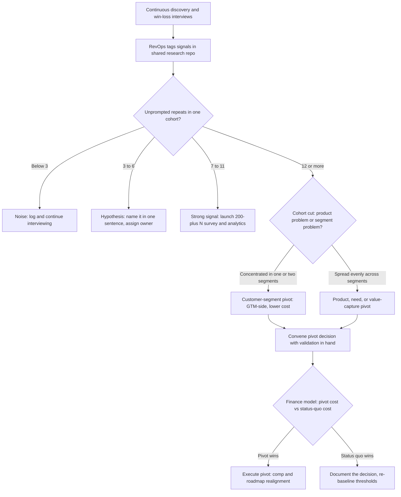

### Direct Answer

The interview-frequency trigger for a product or GTM pivot is the **3 / 7 / 12 rule**: three interviews surfacing the same unprompted blocker establish a hypothesis worth investigating, seven establish a strong signal worth instrumenting with quantitative validation, and twelve within a single cohort constitute the quantitative pivot trigger. That threshold rides on a continuous baseline cadence — at minimum one customer interview per week per product trio per Teresa Torres — and scales by product stage: pre-PMF teams pivot on a 3-to-5-signal threshold at weekly cadence, while scaling-stage teams require a 12-to-18-signal threshold at monthly themed-cohort cadence because pivot cost has risen by an order of magnitude.

> **TL;DR**
> - **The number is 3 / 7 / 12, not one magic figure.** 3 unprompted repeats = hypothesis, 7 = instrument it, 12 in one cohort = pivot trigger. Below 3 is noise; above 12 you are protecting ego, not gathering data.
> - **Cadence is the denominator.** A trigger threshold is meaningless without a steady interview rhythm. Run one discovery interview per week per product trio (Torres baseline) plus a structured win-loss program at bi-weekly-to-monthly cohort cadence.
> - **The threshold scales by stage.** Pre-PMF: weekly cadence, 3-signal hypothesis, 5-signal pivot. Early-PMF: bi-weekly, 5/7. Scaling: monthly themed cohort, 7/12. Late-stage: quarterly cohort + 200+ N survey, 12/18 plus a board signal-to-action contract.
> - **Map signal to a named pivot type.** Use Eric Ries's ten-pivot taxonomy. Win-loss data most reliably surfaces customer-segment, customer-need, and value-capture pivots.
> - **Confirm before you commit.** Three biases — articulate-user skew, founder ego filtering, and segment/channel confound — can manufacture a false trigger. Always quant-validate at 200+ N and run a cohort cut before re-platforming.

The question of interview-frequency triggers sits at the intersection of three mature disciplines: Continuous Discovery (Teresa Torres, Marty Cagan, Productboard / Aha! / Dovetail tooling), Lean Startup pivot theory (Eric Ries, Steve Blank, Alistair Croll), and Win-Loss Analysis as a strategic feedback loop (Klue, Crayon, Anova Consulting, DoubleCheck Research, the former SiriusDecisions practice now inside Forrester). The honest answer is not a single magic number but a frequency-threshold matrix that scales by product stage, pivot reversibility, statistical-confidence threshold, and interview-source bias. This entry builds that matrix from first principles and shows you how to operate it without triggering strategy whiplash — the failure mode where a company lurches on every loud quarter and never gives any strategy enough runway to prove itself.

Before going further, it is worth naming why this question gets answered badly in most orgs. The two dominant failure patterns are symmetrical. The first is the *founder anecdote pivot*: a single influential customer or board member says something memorable, and the company reorganizes around an N of one. The second is the *evidence-proof org*: the data is overwhelming, every interviewer is hearing the same thing, and yet the company refuses to move because the original thesis has become identity. The 3 / 7 / 12 rule exists to defeat both. It gives the anecdote pivot a floor it cannot clear, and it gives the evidence-proof org a number that, once crossed, makes inaction indefensible.

## 1. The Core Framework — The 3 / 7 / 12 Rule

### 1.1 Why three numbers, not one

A pivot is the most expensive decision a revenue or product org makes short of an acquisition. Treating it as a binary ("did we hear the signal — yes or no?") is what produces both failure modes above. The 3 / 7 / 12 rule replaces the binary with a three-stage escalation ladder, and each rung carries a different, bounded action. The discipline is not in the numbers themselves — it is in refusing to skip rungs.

- **3 interviews — hypothesis worth investigating.** When three customers, unprompted, name the same blocker, you have crossed from anecdote into a pattern worth a name. The action is *not* to pivot. The action is to write the hypothesis down in one sentence, assign a single owner, and design the next batch of interviews to test it directly. The cost of this rung is near zero — a paragraph in a research repo and a calendar invite. Teams that skip straight from rung one to a pivot are the anecdote-pivot failure mode in motion.
- **7 interviews — strong signal worth instrumenting.** Seven unprompted repeats means the pattern is stable enough to deserve quantitative backing. The action is to launch a survey to a broader sample and to instrument the relevant product behavior in analytics. You are building the business case, not yet executing. This rung typically costs one to three weeks of product-marketing and analytics time. Crucially, the org is now *visibly working the problem*, which buys patience from a board that might otherwise demand premature action.
- **12 interviews in a single cohort — quantitative pivot trigger.** Twelve unprompted repeats inside one cohort (one ICP, one quarter, one segment) is the trigger. The action is to convene the pivot decision with the quantitative validation already in hand. By the time you reach this rung, the survey from rung two should be complete, so the decision meeting is reviewing evidence, not generating it.

The ladder also creates an audit trail. Six months later, when someone asks "why did we pivot?", the answer is not "the CEO had a feeling" — it is a documented progression from hypothesis to instrumented signal to validated trigger, with named owners at each rung. That trail is what makes a pivot defensible to a board and survivable if it turns out wrong.

A worked example makes the rungs concrete. Imagine a $14M-ARR mid-market SaaS company selling pipeline-analytics software. In January, three lost-deal interviews surface, unprompted, that the buyer "couldn't get their RevOps team to adopt it because it didn't connect to their data warehouse." That is rung one: the PM writes the hypothesis — "warehouse-native architecture is a buying requirement for our mid-market ICP" — and assigns it to a product lead. Over February and March, the count climbs to seven across the win-loss and churn streams combined. That is rung two: product marketing fields a survey to 220 customers and pipeline contacts asking about warehouse integration, and analytics pulls adoption data on the minority of customers who already pipe data through a warehouse connector. By April the count reaches twelve inside the mid-market cohort. That is rung three: the survey is back, it shows 38% of mid-market pipeline cites the gap, and the company convenes a pivot decision. The decision is a *technology pivot* — re-platform onto a warehouse-native architecture. Note what the ladder did: it prevented a January over-reaction to three deals, it produced a defensible 38% magnitude number before the decision, and it named the pivot type so engineering knew it owned the execution. Skipping rungs would have produced either a wasted re-platforming on an N of three, or a year of inaction while a real 38% problem compounded.

### 1.2 The statistics underneath the numbers

The three numbers are not arbitrary practitioner folklore — each maps to a defensible statistical milestone, and understanding the math is what lets you adjust the thresholds intelligently rather than treating them as scripture.

- **Three** establishes frequency above random chance. If you assume a 30% baseline rate at which any given blocker might appear unprompted in a discovery conversation, three independent confirmations push the binomial probability of a pure-chance cluster to roughly p ≈ 0.05 — the conventional significance line. If your baseline rate is higher (a noisy market where everyone complains about everything), three is too few and you should raise the hypothesis rung to four or five.
- **Seven** stabilizes the signal at roughly 80%+ pattern reliability, consistent with Nielsen Norman Group qualitative-research saturation work showing the bulk of usability and need themes surface within the first five-to-seven sessions. Seven is the rung where you can responsibly spend money — a survey, an analytics build, a product spike — because the false-positive risk has dropped enough that the spend is not wasted on noise.
- **Twelve** approaches theoretical saturation. Guest, Bunce & Johnson's 2006 metasaturation study found that approximately 92% of codes emerged within the first twelve interviews; Glaser & Strauss's grounded-theory tradition treats saturation as the point where new interviews stop yielding new categories. Twelve is where the marginal interview stops teaching you anything new about *that* theme — meaning further delay is no longer "gathering data," it is avoidance.

A subtle but important point: these milestones describe *theme discovery*, not *theme magnitude*. The statistics tell you that by interview twelve you have almost certainly *found* the blocker if it exists at meaningful frequency. They do not tell you how much revenue the blocker costs. That second question is quantitative, and conflating the two is the single most common analytical error in pivot decisions.

### 1.3 What the rule explicitly is not

The 3 / 7 / 12 rule is a *qualitative* trigger. It tells you when a pattern is real enough to act on; it does not tell you the *magnitude* of the problem across your whole base. Twelve articulate buyers naming a blocker tells you the blocker is real — it does not tell you whether it costs you 4% or 40% of pipeline. That magnitude question is answered by quantitative survey work, covered in Section 5. The cleanest discipline: qualitative interviews *find* the pivot candidate; quantitative work *sizes* it; the two together *authorize* the pivot.

The rule is also not a substitute for a pivot *hypothesis*. Counting twelve repeats of "your onboarding is confusing" is a finding, not a pivot — onboarding fixes are normal product iteration. A pivot is a change to *who you sell to*, *what problem you solve*, *how you make money*, *how you reach the market*, or *what you are built on*. The rule triggers a *decision*, and the decision may legitimately be "this is iteration, not a pivot." See the win-loss taxonomy discipline in (q477) for how to keep these signal levels from collapsing into a junk drawer where iteration noise drowns out genuine pivot signal.

Finally, the rule is not a license to *stop* interviewing once a count is hit. Continuous discovery continues regardless; the count is a flag raised on top of an always-running stream, not an event that pauses the stream.

## 2. The Cadence Baseline — Continuous Discovery Underneath the Trigger

### 2.1 A trigger without a cadence is meaningless

A threshold of "12 interviews" is undefined unless you know how fast interviews accumulate. Teresa Torres, in *Continuous Discovery Habits* (2021), sets the baseline that every product trio — product manager, designer, engineer — should conduct **at minimum one customer interview per week** as an ongoing background rhythm, not a project with a start and end date. At that cadence, twelve interviews represents roughly a quarter of accumulated discovery; the trigger becomes a naturally paced quarterly checkpoint rather than a panicked fire drill assembled in a week.

The deeper reason cadence matters: pivots triggered by *campaigns* of interviews — a burst of forty conversations crammed into two weeks because leadership got nervous — are systematically lower quality. Campaign interviews are run by stressed people looking for confirmation, scheduled with whoever answers fastest (the most engaged, least representative customers), and analyzed under deadline pressure. Continuous-cadence interviews are run calmly, sampled deliberately, and analyzed without an outcome riding on them. The same twelve-count means something very different depending on which stream produced it.

### 2.2 Two interview streams, one signal pool

Mature orgs run two parallel interview streams and pool their signal into a single tagged repository:

| Stream | Owner | Cadence | Primary purpose |
|---|---|---|---|
| Continuous discovery | Product trio | 1+/week | Forward-looking opportunity and need discovery |
| Structured win-loss | RevOps / 3rd-party firm | Bi-weekly to monthly cohort | Backward-looking deal-outcome diagnosis |
| Churn / save-play interviews | Customer Success | Per at-risk account | Retention-side need and value-capture signal |
| Quantitative survey | Product marketing | Quarterly, 200+ N | Magnitude sizing of qualitative patterns |
| Sales-call review | Enablement / RevOps | Weekly sampling | Discovery-quality signal, leading-question detection |

The win-loss stream is the highest-yield input for *GTM* pivot triggers specifically, because lost-deal interviews surface positioning, pricing, and ICP-fit failures that forward discovery rarely catches — a happy current customer cannot tell you why a prospect chose a competitor. Design that stream well using the objection-uncovering structure in (q474), and select an in-house versus third-party model deliberately using the criteria in (q475). The churn stream is the highest-yield input for *value-capture* and *customer-need* pivots, because a customer who is leaving has no incentive to be polite.

Pooling the streams matters because a pivot signal often only becomes visible across them. If win-loss says "we lose on price," churn says "we don't see enough value to renew," and discovery says "the job we solve is becoming less important" — three streams, three vocabularies, one underlying customer-need or value-capture pivot. A single shared taxonomy is what lets RevOps see that convergence rather than three unrelated complaints.

The shared-taxonomy requirement is not a tooling nicety; it is the difference between a working trigger and a broken one. Consider the failure mode: the win-loss firm tags a loss reason as "Pricing — model mismatch," Customer Success logs the same root cause in free text as "customer felt nickel-and-dimed," and a PM records a discovery interview note as "buyer wants predictable annual cost." Three records, three phrasings, one value-capture signal — and because they do not share a tag, RevOps counts three separate problems, none of which crosses threshold. The pivot signal is real and present in the data, and the org never sees it. This is the silent way pivot triggers fail: not by producing a wrong answer, but by fragmenting a true signal below the detection floor. A single controlled vocabulary, enforced across all streams and owned by RevOps, is the structural fix. The taxonomy itself should be small — ten to fifteen top-level loss and need categories — because a taxonomy with eighty tags fragments signal almost as badly as having none. The design discipline for that taxonomy is the subject of (q477).

There is also a temporal dimension to pooling. A signal that appears in win-loss in Q1 and only shows up in churn in Q3 is not two signals — it is one signal propagating through the customer lifecycle, from the buying decision to the renewal decision. RevOps should timestamp every tagged signal and watch for this propagation, because a problem that has reached the churn stream is more expensive and more urgent than the same problem still confined to win-loss.

### 2.3 Cadence by deal velocity

The right win-loss cohort cadence is a function of how fast you generate decided deals — you cannot run a monthly cohort if you only close eight deals a month and need thirty for a stable cut:

- **High velocity (SMB, <45-day cycles):** bi-weekly cohorts. Enough decided deals accumulate to hit statistical thresholds inside a quarter, and the short cycle means market shifts show up fast.
- **Mid velocity (mid-market, 45-120-day cycles):** monthly cohorts. The standard cadence for most B2B SaaS.
- **Low velocity (enterprise, 6-18-month cycles):** quarterly cohorts, supplemented with *stage-loss* interviews — deals lost mid-cycle, not only at the end — so you are not waiting two full quarters for signal. An enterprise deal that dies at the technical-evaluation stage carries pivot signal a closed-lost-at-procurement deal does not.

A practical warning: do not let cadence drift. The most common operational failure is a win-loss program that starts monthly, slips to quarterly when the program owner gets busy, and quietly dies. A drifting cadence makes the denominator of your trigger unknowable, which makes the trigger itself untrustworthy. The cadence belongs in the signal-to-action contract (Section 8) precisely so it survives the program owner getting busy.

## 3. The Pivot Taxonomy — Naming What You Are Triggering

### 3.1 Why you must name the pivot type

"We should pivot" is not an actionable sentence. Eric Ries, in *The Lean Startup* (2011, chapter 8), defines ten discrete pivot types, and the discipline of naming which one your signal points to is what converts a vague unease into a decision a team can execute and a board can underwrite. The name carries the cost, the risk, and the execution plan. A customer-segment pivot is a GTM and marketing exercise; a technology pivot is an engineering re-platforming; a value-capture pivot is a pricing and finance project. Calling all three "a pivot" hides the fact that they have wildly different cost, timeline, and owner.

Naming the pivot type also disciplines the *evidence* you collect. Once you know you are testing a customer-segment hypothesis, your next interviews target a *different* segment to confirm fit there, rather than collecting more complaints from the wrong one. The name turns open-ended worry into a falsifiable test.

### 3.2 The ten pivots

| # | Pivot type | Definition | Canonical example |
|---|---|---|---|
| 1 | Zoom-in | One feature becomes the whole product | Burbn's photo feature became Instagram |
| 2 | Zoom-out | The whole product becomes one feature | Single-purpose tools absorbed into suites |
| 3 | Customer segment | Right problem, wrong customer | Tiny Speck gamers to enterprise teams (Slack) |
| 4 | Customer need | Right customer, wrong problem | The Point activism to Groupon local commerce |
| 5 | Platform | Application to platform, or platform to application | Odeo podcasting platform to Twitter application |
| 6 | Business architecture | High-margin/low-volume to low-margin/high-volume | Enterprise-down to PLG-up motion |
| 7 | Value capture | Monetization-model shift | Slack freemium to per-seat enterprise pricing |
| 8 | Engine of growth | Viral, paid, or sticky growth model shift | Outbound-led to product-led acquisition |
| 9 | Channel | Direct sales to channel partners, or the reverse | Direct-only to VAR/channel distribution |
| 10 | Technology | Same solution, different technology | Re-platforming onto a new architecture |

### 3.3 Which pivots win-loss data actually surfaces

Win-loss interviews are not equally good at detecting all ten. They reliably surface three, surface two more weakly, and are nearly blind to the rest:

- **Customer-segment pivot (reliable)** — when the recurring loss reason is "this fits a company unlike ours," your ICP is wrong. Lost-deal buyers articulate fit gaps clearly because they just experienced the mismatch.
- **Customer-need pivot (reliable)** — when buyers consistently say "you solve a problem we don't prioritize," your problem framing is wrong. Buyers who chose a competitor for a different job will tell you what job mattered.
- **Value-capture pivot (reliable)** — when "your pricing model doesn't match how we buy" recurs, your monetization is wrong. Procurement-driven losses are dense with value-capture signal.
- **Channel pivot (weak)** — occasionally visible when buyers say "we'd only buy this through our existing reseller," but easily confused with a segment problem.
- **Engine-of-growth pivot (weak)** — visible only indirectly, through how buyers say they discovered you.

The other five — zoom-in, zoom-out, platform, business-architecture, technology — surface very weakly in lost-deal narrative and need product-analytics and forward-discovery evidence to confirm. A buyer rarely says "you should re-platform." This is why the two-stream design in Section 2 matters: a technology or platform pivot trigger needs the discovery stream, while a segment or value-capture trigger leans on win-loss. Map your win-loss signal to one of the three reliable types before you act; treat win-loss signal pointing at the weak-detection types as a prompt to go look in the discovery stream, not as a trigger on its own. See how competitive intelligence from these interviews feeds the roadmap in (q483) and the ICP-refinement loop in (q480).

## 4. The Stage-Scaled Trigger Matrix

### 4.1 Pivot cost rises faster than company size

The single most important reason the trigger is not one number: a pivot at Series A costs a small team rewriting a small codebase for a small customer base, with no installed-base contracts to honor and no sales org to retrain. A pivot at $80M ARR costs re-platforming, retraining a 200-rep sales org, disrupting a partner channel, migrating contracted customers, absorbing the churn of reference accounts who liked the old thing, and rebuilding the comp plan. Because pivot cost rises roughly an order of magnitude per stage while company size rises only linearly, the *evidence bar* must rise faster than the company grows.

If it does not — if a $50M company pivots on the same 5-signal threshold a seed-stage startup uses — you get strategy whiplash: the org lurches on every loud quarter, no strategy survives long enough to compound, the sales team loses faith in the messaging, and the best reps leave because they cannot build a book on shifting ground. The stage-scaled matrix exists to make the evidence bar climb deliberately rather than accidentally.

### 4.2 The matrix

| Stage | ARR band | Discovery cadence | Hypothesis threshold | Pivot trigger | Validation requirement |
|---|---|---|---|---|---|
| Pre-PMF | <$2M | Weekly | 3 signals | 5 signals | Founder judgment + small survey |
| Early-PMF | $2M-$10M | Bi-weekly | 5 signals | 7 signals | 100+ N survey + analytics |
| Scaling | $10M-$100M | Monthly themed cohort | 7 signals | 12 signals | 200+ N survey + cohort cut + finance model |
| Late-stage | $100M+ | Quarterly cohort | 12 signals | 18 signals | 200+ N survey + board signal-to-action contract |

### 4.3 Reading the matrix

- **Pre-PMF** runs *fast and cheap*. Weekly cadence, a 5-signal trigger, and a willingness to act on founder judgment backed by a small survey. The risk here is not over-pivoting; it is moving too slowly while runway burns. A pre-PMF company that demands twelve perfectly-validated signals before changing direction will run out of money before the evidence is in. At this stage, a wrong pivot is recoverable; paralysis is not.
- **Early-PMF** is where patterns first stabilize but ICP refinement is still inexpensive. A 7-signal trigger plus a 100+ N survey is the right balance — enough rigor that you are not chasing noise, little enough friction that you can still move within a quarter.
- **Scaling** is the danger zone. Pivot cost has jumped sharply, but the org is now large enough that loud internal voices — a VP who wants a new strategy, a big customer with a loud opinion — can manufacture pressure. The 12-signal trigger, the 200+ N survey, the cohort cut, and a finance model of pivot cost versus status-quo cost are all mandatory gates. The finance model is the underrated one: a scaling-stage pivot decision should include an explicit dollar comparison of "cost to pivot" versus "cost of doing nothing," because at this stage status quo is rarely free either.
- **Late-stage** treats a pivot as a board-level event. The 18-signal qualitative trigger plus a pre-agreed signal-to-action contract (Section 8) prevents both founder ego and board pressure from overriding evidence. At this stage the pivot decision is also a public-markets and analyst-communication exercise, which is itself a reason the evidence bar must be unimpeachable.

This stage-scaling logic mirrors the win-loss-program maturity model in (q487): an org's pivot discipline and its win-loss discipline mature on the same curve, because both are functions of how much the company has to lose. A company should not expect mature pivot discipline before it has a mature win-loss program feeding it clean signal.

### 4.4 The reversibility test — a second axis on the matrix

Stage is the primary axis of the trigger matrix, but it is not the only one. The second axis is *reversibility*: how easily the pivot can be undone if it turns out wrong. A reversible pivot — say, re-targeting the marketing motion at a new segment for one quarter — can be triggered on a lower threshold, because a wrong answer is cheap to discover and cheap to walk back. An irreversible pivot — re-platforming the entire codebase, or abandoning a pricing model that thousands of contracted customers are on — demands a higher threshold, because there is no walking it back.

The practical instruction: take the stage-appropriate threshold from the Section 4.2 matrix, then adjust it by reversibility. For a highly reversible GTM-side pivot, you may act one or two signals below the matrix number. For a highly irreversible product or technology pivot, add two to four signals on top. This is the same logic Jeff Bezos popularized as "Type 1 and Type 2 decisions" — one-way doors versus two-way doors. Customer-segment and channel pivots are usually two-way doors; technology and business-architecture pivots are usually one-way doors. A disciplined operator never applies the same threshold to both.

| Reversibility | Pivot types | Threshold adjustment |
|---|---|---|
| High (two-way door) | Customer segment, channel, engine of growth | Matrix number minus 1-2 signals |
| Medium | Customer need, value capture | Matrix number, unadjusted |
| Low (one-way door) | Platform, business architecture, technology | Matrix number plus 2-4 signals |

The reversibility axis also changes *how* you de-risk. For a reversible pivot, the right move is often to run it as a time-boxed experiment — pivot the motion for one quarter, measure, and revert if the data disappoints. For an irreversible pivot, an experiment is not available, which is exactly why the evidence bar must be higher before you commit.

## 5. Instrumenting the Signal — From Qualitative to Quantitative

### 5.1 The two-instrument rule

A pivot authorized on qualitative interviews alone is a gamble; a pivot authorized on a survey alone misreads *why*. The discipline is to use both, in sequence, with each instrument doing the job it is good at.

1. **Qualitative interviews find the candidate.** The 3 / 7 / 12 ladder identifies *which* pivot hypothesis is worth pursuing and *why* it is happening — the narrative, the mechanism, the buyer's own words. Interviews are unmatched at the "why" because they are open-ended; a buyer can take you somewhere you did not know to ask about.
2. **Quantitative survey sizes the candidate.** A 200+ N survey to a representative cross-section of the base and the pipeline answers *how big* — what share of revenue, pipeline, or churn the pattern touches. Surveys are unmatched at the "how big" because they are structured and broad, reaching the silent majority that interviews miss.

Running them in the wrong order is a classic error. A survey designed before the interviews will ask the wrong questions, because you do not yet know what to ask. Interviews first, then a survey built from what the interviews surfaced, then — if the survey confirms magnitude — the decision.

### 5.2 What to instrument in product analytics

Alongside the survey, instrument the behavior the interviews describe. If twelve lost deals cite a missing workflow, pull the analytics on whether existing customers who *do* have a workaround behave differently — feature adoption, time-to-value, expansion rate, support-ticket volume. Tools commonly used: Amplitude, Mixpanel, Pendo, Heap. The win-loss research repository (Dovetail, Notably, Marvin, EnjoyHQ) holds the tagged interview corpus so the qualitative and quantitative views can be cross-referenced — you want to be able to click from a survey result to the three interview quotes that prompted the survey question.

The analytics layer also catches a specific lie buyers tell: they describe the *reason* they think they left, which is not always the *behavior* that predicted it. A buyer may say "your product was too complex" when the analytics show they never reached the activation milestone — meaning the real problem is onboarding, not product scope. Analytics is the cross-check that keeps the interview narrative honest. For the cohort-profitability dimension of this analysis — which customer vintages are worth pivoting toward — see (q702).

### 5.3 Sample-size discipline

| Purpose | Minimum N | Notes |
|---|---|---|
| Hypothesis (qualitative) | 3 unprompted | Same cohort, unprompted only |
| Strong signal (qualitative) | 7 unprompted | Triggers survey design |
| Pivot trigger (qualitative) | 12 unprompted | Single cohort |
| Magnitude sizing (quantitative) | 200+ | Representative of base + pipeline |
| Segment cut (quantitative) | 30+ per cell | So cohort cuts are not noise |
| Stage-loss interviews (enterprise) | 8+ per stage | For low-velocity deal cycles |

The "unprompted" qualifier is load-bearing and worth a full paragraph. A blocker a customer raises only *after* you ask "did our pricing bother you?" is a leading question, not a signal — you put the idea in their head. Count only blockers the customer surfaces on their own, ideally in the open-ended first half of the interview before you have steered toward any topic. This is why interview *technique* directly determines trigger *validity*: a sloppy interviewer who leads the witness will hit a false twelve-count quickly. The interview-design discipline that produces unprompted signal is detailed in (q474), and the methodology layer — Challenger, Sandler, MEDDPICC applied to interview quality — in (q484) and (q488). The "30+ per cell" rule for segment cuts matters because the cohort cut in Section 7.3 is only trustworthy if each segment slice has enough deals to be more than noise.

## 6. Famous Pivot Case Studies — The Framework in the Wild

### 6.1 Slack — a customer-segment pivot triggered by months of discovery

Tiny Speck, founded by Stewart Butterfield — who had earlier co-founded Flickr, sold to Yahoo — spent 2009-2012 building an online game called *Glitch*. The internal team had built a chat tool to coordinate their own distributed work. As documented in *Wired* (Sept 2013), *Inc.* (2014), and *The Verge* (2016), roughly six months of continuous discovery interviews with early external teams revealed the chat tool was more valuable than the game. Tiny Speck shut down *Glitch* and launched Slack in 2013. This is the textbook customer-segment pivot — right product capability, wrong customer (gamers to enterprise teams). The detail that matters for this entry: the pivot was *not* a flash of insight. It was the cumulative output of a sustained, deliberate discovery stream run while the original product was still live. Slack later IPO'd and was acquired by Salesforce (CRM) in 2021 for approximately $27.7B.

### 6.2 Twitter — a platform pivot under competitive pressure

Odeo Inc., where Evan Williams — who had earlier built Blogger, sold to Google (GOOGL) — was an investor and operator alongside Biz Stone and Jack Dorsey, was a podcasting platform in 2005-2006. When Apple (AAPL) launched podcasts directly inside iTunes, Odeo's core market was effectively destroyed by a platform owner moving into the category. As documented in Nick Bilton's *Hatching Twitter* (2013), roughly three months of internal testing of a microblogging side project ("twttr") showed unusually high engagement among the team and early users. Odeo's assets were bought back by the founders and Twitter spun out as a standalone company in 2007. This is a platform pivot triggered by a *fast competitive shock* plus a *short, high-signal internal test* — a reminder that the trigger threshold can be compressed when the cause is an exogenous market event rather than a slow accumulation of customer complaints.

### 6.3 Instagram — a zoom-in pivot from roughly a dozen interviews

Kevin Systrom and Mike Krieger built Burbn, a location check-in app, in 2010. As documented in *Wired* (Apr 2012) and Sarah Frier's *No Filter* (2020), roughly twelve-to-fifteen user interviews showed users engaged almost entirely with the photo-sharing feature and ignored the rest of Burbn's check-in and gaming mechanics. They stripped the product down to photos and launched Instagram in October 2010; Facebook, now Meta (META), acquired it in 2012 for approximately $1B. Note the interview count — Systrom's pivot landed almost exactly on the 12-signal saturation threshold. This is the cleanest real-world validation of the rule in the case literature: a disciplined founder, a roughly twelve-interview corpus, and a zoom-in pivot that became one of the most valuable acquisitions in tech history.

### 6.4 Shopify — a customer-need pivot away from selling snowboards

Tobias Lütke and Scott Lake set out in 2004 to sell snowboards online via a store called Snowdevil. Frustrated by the existing e-commerce software, Lütke — a programmer — built their own storefront platform. Customer conversations and inbound interest made clear the *platform* was the business, not the snowboards. Shopify (SHOP) launched in 2006 and is now a multi-billion-dollar commerce platform powering millions of merchants. This is a customer-need pivot — they kept serving a customer (people who want to sell things online) but changed *what problem* they solved, from "I want to buy a snowboard" to "I want to run a store." The trigger here was less a counted interview threshold and more sustained signal that the tool drew more interest than the product it was built to sell.

### 6.5 The pattern across cases

| Company | Pivot type | Trigger evidence | Approx. interview scale |
|---|---|---|---|
| Slack | Customer segment | ~6 months continuous discovery | Dozens of conversations |
| Twitter | Platform | Competitive shock + internal test | ~3 months of testing |
| Instagram | Zoom-in | Feature-usage interviews | ~12-15 interviews |
| Shopify | Customer need | Sustained merchant interest | Ongoing signal |

Three lessons cut across every case. First, every successful pivot was preceded by *systematic* discovery, not a single flash of insight — even Twitter's fast pivot ran a structured internal test. Second, the interview counts cluster around the 12-signal saturation mark or higher; none of these companies pivoted on three interviews alone, because three starts the clock but does not authorize the move. Third, the trigger can be *compressed* by an exogenous shock — Apple entering Odeo's market collapsed the timeline — which is the legitimate exception to the stage matrix: a market-structure event is itself high-confidence evidence and can justify acting before the normal interview count is reached.

### 6.6 Survivorship bias — the pivots you do not hear about

A honest reading of the case literature has to name its single biggest flaw: survivorship bias. Slack, Twitter, Instagram, and Shopify are studied *because they worked*. For every celebrated pivot there are an unknown number of companies that pivoted on what felt like equally strong signal and failed — and those companies do not get *Wired* features or business books, so they vanish from the dataset. This matters for an operator because the lesson "famous companies pivoted, therefore pivoting is good" is exactly the wrong takeaway. The right takeaway is narrower: famous companies pivoted *with systematic discovery behind them*, and the discovery is the transferable practice, not the pivot itself.

The survivorship problem also cuts against over-indexing on speed. Twitter's three-month pivot is memorable, but it is not a template — it worked because a platform owner had just destroyed Odeo's market, which is an unusually unambiguous signal. A company copying "pivot fast like Twitter" without an equivalent exogenous shock is copying the visible behavior while missing the hidden cause. The framework in this entry is deliberately built so that the *process* is the thing you replicate — the 3 / 7 / 12 ladder, the cadence, the stage matrix, the cohort cut — rather than any single famous company's timeline. Process is what survives the survivorship problem, because it is the part that was the same across the winners and would have *prevented* many of the unrecorded losers.

## 7. Counter-Case — When the Trigger Lies to You

The 3 / 7 / 12 rule has four well-documented failure modes. A disciplined operator treats every apparent trigger as guilty until proven innocent of all four. Skipping this section is how a company executes a confidently-wrong pivot.

### 7.1 Articulate-user bias

Interviews structurally over-sample buyers who are willing and able to articulate their reasoning. The buyers who say yes to a win-loss interview, who answer their phone, who have opinions ready — they are not a random sample. The silent majority — buyers who churned quietly, ghosted mid-cycle, or never engaged enough to form a strong view — are systematically under-represented. Twelve articulate buyers naming a blocker can co-exist with a silent majority who do not care about that blocker at all and left for an entirely different, unstated reason. **Compensation:** never pivot on qualitative signal alone; require a 200+ N quantitative survey for breadth before committing, and weight the survey results to your actual base composition so the loud segment does not dominate. If the survey *contradicts* the interviews, the interviews were the loud minority and the trigger is a false positive.

### 7.2 Founder ego protection

Founders, and to a lesser degree any leader who authored the current strategy, subconsciously filter interview signal that threatens the original vision. The same twelve interviews can be heard two ways: "twelve confused buyers who don't get it yet" or "twelve buyers telling us the truth." The founder who built the thing has a powerful incentive to hear the first version. This is not a character flaw — it is a predictable cognitive bias, and predictable biases are managed structurally, not by asking people to try harder. **Compensation:** route win-loss interviews through a neutral third-party firm — Klue, Crayon, Anova Consulting, DoubleCheck Research — or at minimum a RevOps owner with no authorship stake in the product. The Christensen Jobs-to-Be-Done lens helps further: it reframes the interview around "what job did the buyer hire — or fire — us for?" rather than "did they like our product?", which strips out the ego-protective framing. The trade-offs of in-house versus third-party programs, and exactly why the neutrality is worth the cost, are laid out in (q475) and (q1168).

### 7.3 The segment / channel confound

The most expensive analytical mistake in pivot decisions is mistaking a *segment* problem for a *product* problem. Twelve lost deals citing the same blocker may all originate from a single wrong-fit ICP — the product is fine, the targeting is wrong. If you pivot the *product* when you should have pivoted the *ICP*, you burn months of engineering and rebuild a product that was never broken, while the actual fix — a change to who marketing and sales pursue — goes unmade. **Compensation:** before any product pivot, run a cohort cut — slice the twelve signals by segment, industry, channel, deal size, and lead source. If the pattern is concentrated in one or two cells, you have a customer-segment pivot, which is GTM-side, far cheaper, and far faster than a product rebuild. If the pattern is genuinely spread evenly across every segment, only then is it a product, need, or value-capture pivot. This is precisely why the Section 4 matrix makes a cohort cut mandatory at the scaling stage, and why the Section 5.3 sample-size rule requires 30+ deals per cell — a cohort cut on thin data is itself a source of false signal.

### 7.4 Board pressure overriding clear signal

The inverse failure: the signal is real, validated, and points clearly to a pivot — but board members invested in the current thesis resist it, or, equally damaging, a board spooked by one bad quarter demands a pivot the data does not support. Pivot decisions made in the emotional aftermath of a missed number are some of the worst decisions companies make, in either direction. **Compensation:** the pre-committed signal-to-action contract in Section 8. Agreeing on the trigger threshold *before* the emotional moment removes the negotiation from the crisis. When the contract says "we open a pivot investigation at twelve signals and not before," a board reaction to one bad quarter is met with "we are at four signals; the contract says we investigate, not pivot" — and the conversation is governed by a number everyone pre-agreed to rather than by whoever is most anxious.

### 7.5 The honest summary of the counter-case

| Failure mode | What it manufactures | Primary defense |
|---|---|---|
| Articulate-user bias | False positive: loud minority reads as majority | 200+ N weighted survey |
| Founder ego | False negative: real signal dismissed | 3rd-party / neutral interviewer |
| Segment confound | Wrong pivot type chosen, wrong fix built | Pre-pivot cohort cut, 30+ per cell |
| Board pressure | Override in either direction, crisis-timed | Signal-to-action contract |

The rule does not remove judgment, and it does not pretend to. It structures the evidence so that judgment is applied to a clean signal rather than a contaminated one. An operator who runs the 3 / 7 / 12 ladder but skips the four-failure-mode audit has built a fast path to a confident mistake.

### 7.6 A worked false-trigger example

Concreteness sharpens the lesson. A $30M-ARR SaaS company hits a clean twelve-signal count: twelve lost-deal interviews, all citing that the product "doesn't have the reporting depth our finance team needs." The product leader, reading rung three of the ladder, proposes a six-month roadmap pivot to build an analytics suite. The signal-to-action contract intervenes. First, the articulate-user check: the 200+ N survey goes out, and it shows only 9% of the broader base and pipeline rate reporting depth as a top-three concern — the twelve interviewees were a loud, analytically-minded minority, not the market. Second, the cohort cut: of the twelve, ten came from financial-services buyers above 2,000 employees — a segment the company had drifted into via one enthusiastic AE, not a segment in the official ICP. The signal was real, but it was a *customer-segment* finding, not a *product* one. The correct action was not a six-month analytics build; it was a GTM decision — either commit to enterprise financial services as a deliberate segment and resource it, or stop selling into it. The cohort cut converted a $4M product mistake into a one-meeting GTM decision. This is the entire value of Section 7: the twelve-count was correct, and acting on it naively would still have been wrong.

## 8. The Signal-to-Action Contract — Operationalizing the Trigger

### 8.1 What it is

A signal-to-action contract is a written, pre-agreed document — ratified by the CEO, the product leader, the CRO, and the board — that specifies, *in advance of any crisis*, the exact thresholds at which the company will (a) open a pivot investigation, (b) commission quantitative validation, and (c) convene a pivot decision. It converts the 3 / 7 / 12 rule from a practitioner heuristic into ratified organizational policy. Its entire value is timing: a threshold negotiated in calm conditions is honest; a threshold negotiated during a panic bends to whoever is loudest.

### 8.2 What it must contain

- **The thresholds**, taken from the stage-appropriate row of the Section 4 matrix, with an explicit re-baseline date when the company expects to cross into the next stage.
- **The owner** of the interview corpus and the trigger count — typically RevOps, deliberately chosen because RevOps has no authorship stake in either the product or the current GTM motion, so the count is neutral.
- **The cadence** of review — a standing monthly or quarterly pivot-signal review, on the calendar as a recurring event, not an ad hoc meeting someone has to remember to call.
- **The validation gate** — the specific quantitative evidence (survey N, cohort-cut requirement with per-cell minimums, finance model template) that must accompany the qualitative trigger before a decision is convened.
- **The decision forum** — who is in the room, what authority they hold, and the time-box, so the decision cannot be indefinitely deferred.
- **The escalation exception** — explicit language that an exogenous market shock (a competitor, regulator, or platform owner moving into the category) can compress the timeline, with a named approver for invoking the exception.

### 8.3 The monthly pivot-signal review

### 8.4 Why pre-commitment matters

The value of the contract is entirely in its timing. Negotiating "is twelve enough?" while the company is reeling from a bad quarter guarantees the threshold bends to whoever is loudest in the room — usually the most senior or most anxious person, neither of whom is necessarily right. Negotiating the threshold in calm conditions, with the stage matrix on the table and no live crisis distorting the discussion, and then writing it down and having the board ratify it, means the next crisis is met with a *policy* rather than an *argument*. This is the same logic that makes discount-governance bands work and the same logic behind a pre-mortem: the rule is set before the pressure arrives, so the pressure has nothing to negotiate against. A board that has ratified the contract has also, implicitly, agreed not to demand a pivot below threshold — which is a quiet but powerful form of governance.

## 9. Connecting the Pivot Trigger to the Revenue System

### 9.1 Comp and quota during a pivot

A pivot that changes ICP, pricing model, or sales motion invalidates the assumptions baked into the current comp plan. Triggering the pivot is step one; re-baselining quota and comp so reps are not punished for a strategy change they did not choose is step two, and skipping it is how a company executes a technically-correct pivot that bleeds out its best reps. If a segment pivot moves reps off a familiar buyer onto a harder one, their ramp resets and their attainment will dip through no fault of their own — the comp plan must absorb that. The mechanics of comping reps through a repositioning, including transition guarantees and quota relief windows, are covered in (q276).

### 9.2 Win-loss program as the trigger's data engine

The pivot trigger is only as good as the interview corpus feeding it. A win-loss program that produces a "junk drawer" of untagged, inconsistent, free-text notes cannot produce a clean 12-signal count — you cannot count what you cannot consistently categorize. The taxonomy discipline in (q477) is the upstream prerequisite that makes the count possible at all. The program ROI metrics in (q481) tell you whether the program is healthy enough to trust. The common pitfalls in (q482) are the operational traps — drifting cadence, leading questions, interviewer-of-convenience sampling — that quietly corrupt the corpus. And the question of *when* to start a formal win-loss program at all is covered in (q240): a company without a real program is, by definition, flying its pivot decisions on anecdote.

### 9.3 GTM-side outputs of the trigger

When the trigger fires a *GTM* rather than a *product* pivot — which, given that win-loss data most reliably surfaces segment, need, and value-capture signals, is the more common outcome — the downstream artifacts are concrete and immediate. Refreshed competitive battlecards that actually change rep behavior in live deals (q478). Take-out campaigns that convert prior competitive losses into wins on the second touch, now that you understand why you lost them (q479). Updated positioning and messaging fed directly by the win-loss competitive intelligence that triggered the pivot in the first place (q485). The trigger is the start of that chain, not the end — a pivot decision that does not flow into battlecards, campaigns, and messaging has not actually been executed, only announced.

### 9.4 Discovery quality as the leading indicator

Finally, the quality of your routine discovery conversations is the leading indicator of whether your trigger count is trustworthy at all. Reps and product managers who run shallow, leading, feature-dump discovery produce a corpus full of false signal — leading questions manufacture twelve-counts that mean nothing. The metrics that tell you whether discovery is actually working — talk-to-listen ratio, unprompted-pain-surfaced rate, follow-up-question depth — are detailed in (q319), and they belong on the same dashboard as your pivot-signal review. A pivot trigger sitting on top of weak discovery is a precise number built on contaminated inputs, which is more dangerous than no number at all because it carries false authority.

### 9.5 The trigger as a board-communication asset

There is one more system the pivot trigger connects to that operators routinely overlook: board communication. A board's confidence in a CRO or product leader is built largely on whether leadership *sees problems before the board does*. The 3 / 7 / 12 ladder, run as a standing monthly review, gives leadership a structured way to brief the board on emerging signal *while it is still at rung one or two* — before it is a crisis. "We have a four-signal hypothesis on warehouse-native architecture; we are designing the validating survey now" is a sentence that builds board trust. The same problem, surfaced for the first time at a board meeting *after* it has cost two quarters of pipeline, destroys it. The trigger is not only a decision tool; run transparently, it is a credibility instrument. This is closely related to the discipline of building a board update that does not get a CRO fired — the principle is the same: surface signal early, framed by a process the board has pre-ratified, and the bad news lands as competence rather than alarm.

## 10. The Operator's 90-Day Implementation Plan

### 10.1 Days 1-30 — Establish the cadence

- Stand up the continuous-discovery rhythm: one interview per week per product trio (Torres baseline), on the calendar as a recurring commitment, not a project.
- Stand up or audit the structured win-loss stream; set cohort cadence by deal velocity using the Section 2.3 guidance.
- Choose a single research repository (Dovetail, Notably, Marvin, or EnjoyHQ) and one shared tagging taxonomy that all streams use, so signal can be pooled.
- Assign the neutral owner — RevOps — of the signal count, and make that ownership explicit in writing.

### 10.2 Days 31-60 — Draft the contract

- Pull the stage-appropriate thresholds from the Section 4 matrix and write them down with a re-baseline trigger date.
- Draft the signal-to-action contract; circulate to CEO, product leader, CRO, and board for comment.
- Schedule the standing monthly pivot-signal review as a recurring calendar event.
- Define the validation gate: survey N, cohort-cut requirement with per-cell minimums, and a finance-model template comparing pivot cost to status-quo cost.

### 10.3 Days 61-90 — Run the loop once

- Hold the first monthly pivot-signal review; walk the actual signal counts through the flowchart in Section 8.3, even if nothing has crossed threshold yet.
- For any signal sitting at 7 or above, launch the 200+ N validation survey now, to build the organizational muscle before a real trigger forces it under time pressure.
- Ratify the contract at the board meeting in this window so it carries real authority.
- After one full cycle, re-baseline thresholds if deal velocity, ARR stage, or market structure has shifted.

### 10.4 The summary table

| Element | Target |
|---|---|
| Discovery cadence | 1+ interview per week per product trio |
| Hypothesis threshold | 3 unprompted (pre-PMF) scaling to 12 (late-stage) |
| Pivot trigger | 5 unprompted (pre-PMF) scaling to 18 (late-stage) |
| Quantitative validation | 200+ N survey plus cohort cut, 30+ per cell |
| Decision forum | Standing monthly pivot-signal review |
| Governing artifact | Board-ratified signal-to-action contract |

The bottom line, restated for the operator: there is no single magic interview number, and any consultant who gives you one is selling a heuristic without its scaffolding. There is a *ladder* — 3 / 7 / 12 — sitting on a *cadence* — one interview per week per trio — *scaled by a stage matrix* that raises the evidence bar as pivot cost rises, *validated by a quantitative survey* that sizes what the interviews found, *protected by a cohort cut* that distinguishes a segment problem from a product problem, and *governed by a pre-committed contract* that takes the decision out of the hands of whoever is loudest during the next bad quarter. Build all five and the question "have we heard enough to pivot?" stops being an argument and becomes a number anyone in the room can read off the dashboard.

---

**Citations & sources:**

1. Teresa Torres, *Continuous Discovery Habits*, Product Talk LLC, 2021 — weekly interview cadence baseline.
2. Eric Ries, *The Lean Startup*, Crown Business, 2011 — chapter 8, the ten-pivot taxonomy.
3. Steve Blank, *The Four Steps to the Epiphany*, 2005 — customer development methodology.
4. Steve Blank & Bob Dorf, *The Startup Owner's Manual*, 2012 — pivot decision discipline.
5. Marty Cagan, *Inspired*, SVPG / Wiley, 2017 — product discovery practice.
6. Marty Cagan, *Empowered*, SVPG / Wiley, 2020 — empowered-team discovery and decision-making.
7. Clayton Christensen, *Competing Against Luck*, HarperBusiness, 2016 — Jobs-to-Be-Done theory.
8. Clayton Christensen, *The Innovator's Dilemma*, HarperBusiness, 1997 — disruption and segment shift.
9. Alistair Croll & Benjamin Yoskovitz, *Lean Analytics*, O'Reilly, 2013 — metric-driven pivot decisions.
10. Guest, Bunce & Johnson, "How Many Interviews Are Enough?", *Field Methods*, 2006 — metasaturation, ~92% of codes within 12 interviews.
11. Glaser & Strauss, *The Discovery of Grounded Theory*, Aldine, 1967 — theoretical saturation.
12. Nielsen Norman Group, "Why You Only Need to Test with 5 Users," 2000 — qualitative research saturation.
13. Jakob Nielsen, NN/g, qualitative usability and saturation research.
14. Forrester (formerly SiriusDecisions) — win-loss diagnostic frameworks and B2B research.
15. Pavilion — RevOps and GTM operating benchmarks.
16. The Bridge Group — SaaS sales metrics and benchmark research reports.
17. Klue — win-loss and competitive-intelligence platform documentation.
18. Crayon — competitive-intelligence and win-loss practice guides.
19. Anova Consulting Group — third-party win-loss interview methodology.
20. DoubleCheck Research — B2B win-loss program methodology.
21. Productboard — product discovery and prioritization tooling.
22. Aha! — product roadmap and discovery tooling documentation.
23. Dovetail — research repository and interview-tagging platform.
24. Notably / Marvin / EnjoyHQ — qualitative research repository platforms.
25. User Interviews / Respondent / Maze — participant recruiting and usability testing.
26. Amplitude / Mixpanel / Pendo / Heap — product analytics for signal instrumentation.
27. *Wired*, "Slack Is Our Company of the Year," Sept 2013 — Tiny Speck to Slack pivot.
28. *Inc.*, Stewart Butterfield interview, 2014 — Slack pivot timeline.
29. *The Verge*, Slack origin and pivot coverage, 2016.
30. Nick Bilton, *Hatching Twitter*, Portfolio / Penguin, 2013 — Odeo to Twitter pivot.
31. *Wired*, "Instagram founders" feature, Apr 2012 — Burbn to Instagram pivot.
32. Sarah Frier, *No Filter: The Inside Story of Instagram*, Simon & Schuster, 2020.
33. *The Atlantic* and *Inc.*, Andrew Mason / Groupon coverage, Mar 2011 — The Point to Groupon pivot.
34. Tobias Lütke / Shopify (SHOP) founding history — Snowdevil to Shopify customer-need pivot.
35. Salesforce (CRM) acquisition of Slack, 2021 — ~$27.7B transaction disclosures.
36. Facebook / Meta (META) acquisition of Instagram, 2012 — ~$1B transaction disclosures.
37. Rob Fitzpatrick, *The Mom Test*, 2013 — interviewing without leading the witness.
38. Tomasz Tunguz, Redpoint — SaaS benchmark writing on growth-stage decision-making.
