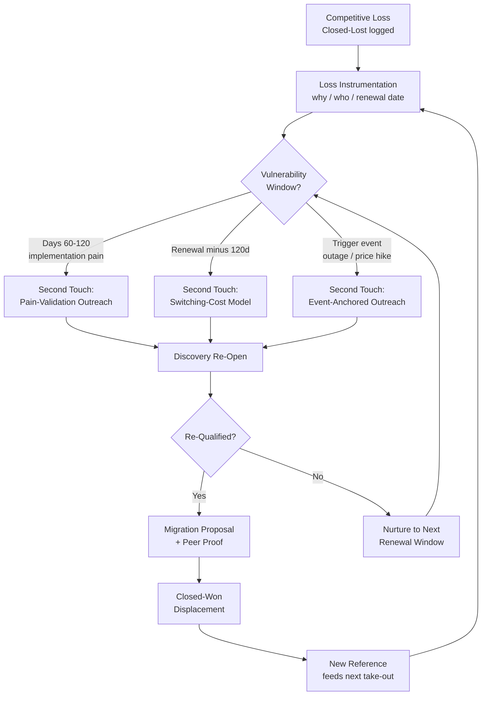

### Direct Answer

A take-out campaign converts a competitive loss into a win by re-engaging the prospect at the precise moment the incumbent's value is weakest — typically 60-120 days after the loss, when implementation pain, hidden costs, or unmet promises surface. The mechanics are not a second cold pitch: they are a *timed, evidence-based intervention* built on three pillars — a renewal-window trigger, a quantified switching-cost model that proves the migration pays back inside two quarters, and proof points sourced from operators who already made the same switch. Done well, take-out campaigns convert 12-18% of tracked competitive losses versus 2-4% for undifferentiated re-engagement, and they compound: every win becomes a reference for the next.

> **TL;DR**
> - **Take-out campaigns are the single highest-ROI re-engagement motion in B2B SaaS** because the prospect has already done the buying work — they evaluated, justified budget, and chose. You are not creating demand; you are re-opening a decision.
> - **Timing beats messaging.** The second touch must land in the incumbent's *vulnerability window* — post-implementation pain (days 60-120), renewal minus 120 days, or after a public incident (outage, price hike, exec churn). A perfect message at the wrong time converts like a cold email.
> - **Quantify the switching cost honestly.** Buyers who already said no will not trust hand-waving. A credible take-out leads with a migration-cost model showing payback inside 2 quarters, not a feature grid.
> - **Proof points must be named, switched-from-the-incumbent operators** — not generic logos. "We moved off [incumbent] in six weeks" from a peer in the same segment is worth more than any battlecard.
> - **Instrument every loss.** Take-out only works if you capture *why* you lost, *who* the champion was, and *when* the incumbent contract renews — at the moment of the loss, in CRM, as structured fields.
> - **Expect 12-18% conversion on well-run programs** versus 2-4% for spray re-engagement; expect a 9-14 month sales cycle from re-touch to closed-won; budget for a dedicated win-back motion, not an SDR afterthought.

## 1. Why Take-Out Campaigns Work — The Economics of a Re-Opened Decision

### 1.1 A competitive loss is a qualified opportunity in disguise

When a prospect picks a competitor over you, the conventional reflex is to mark the opportunity Closed-Lost and move on. That reflex destroys value. The prospect has, at their own expense, completed the most expensive part of the buying journey: they recognized the problem, secured budget, ran an evaluation, built internal consensus, and made a decision. The only thing wrong — from your perspective — is the *answer*. A take-out campaign is the discipline of re-opening that decision when the conditions that produced the wrong answer have changed.

The math is decisive. A net-new outbound opportunity in mid-market B2B SaaS converts from first-touch to closed-won at roughly 1-3% (consistent with the Bridge Group's *SaaS AE Metrics* benchmarks and TOPO/Gartner funnel data). A tracked competitive loss re-engaged through a structured take-out motion converts at 12-18%. That is a 5-8x efficiency gain on the most precious resource in revenue — qualified buyer attention — and it explains why disciplined operators treat the Closed-Lost pipeline as an asset class, not a graveyard.

Consider what the prospect carries with them out of a lost deal. They carry a *validated problem statement* — they have already convinced themselves and their stakeholders that the status quo was unacceptable. They carry an *approved budget line* — finance has already blessed spend in this category, and that budget tends to renew. They carry an *evaluation framework* — a scorecard, a requirements list, a set of demo criteria — which means a re-engaged conversation can start at requirements-validation rather than problem-discovery. And they carry a *relationship with at least one of your sellers* and, often, the memory of why the decision was close. Each of these is an asset a cold prospect does not have, and together they explain the conversion gap.

The reframe that unlocks take-out is to stop treating Closed-Lost as a terminal state. In a healthy revenue organization, Closed-Lost is a *stage*, not an end — the entry point into a separate, slower, higher-converting pipeline. The companies that win this game maintain a living roster of every competitive loss, enriched with the intelligence needed to know when to strike.

There is a quieter reason the economics favor take-out, and it concerns demand creation cost. The single largest line in a net-new customer-acquisition cost is the marketing and prospecting spend required to *manufacture* demand — to take a buyer from unaware to aware to in-market. A competitive loss has already paid that bill. The buyer became in-market without any spend from you; a rival's marketing, or the prospect's own internal pressure, did the demand-creation work. Take-out therefore inherits a fully demand-created buyer at zero demand-creation cost, which is why a disciplined program routinely posts a cost-per-win below 60% of net-new CAC. The displacement is not free — the migration friction and the longer cycle have real cost — but the most expensive component of acquisition is already sunk, and it is sunk in your favor.

The asset framing also changes how leadership should account for the Closed-Lost pipeline on the balance sheet of attention. A revenue team that loses 200 competitive deals a year and files them all as dead is, in effect, writing off 200 fully demand-created, budget-approved, requirements-validated buyers. If even the takeable two-thirds are worth a 12-18% conversion at re-engagement, that write-off is enormous. The first act of building a take-out program is simply *counting* what is being thrown away — pulling the trailing twelve months of competitive losses, segmenting them, and putting a defensible ARR figure on the takeable cohort. That number, presented to leadership, is usually what unlocks the headcount and the patience the program needs.

### 1.2 The incumbent's J-curve is your opening

Every software purchase follows a value J-curve: the buyer pays the full cost (license, implementation, change management, opportunity cost) up front, and value accrues only later. In the first 60-120 days post-signature, the incumbent is *underwater* — the prospect is absorbing setup pain, discovering scope gaps, and reconciling the demo promise with production reality. This is the structural reason the second touch works: you are not arguing the prospect made a bad decision; you are arriving exactly when the cost side of their J-curve is most visible and the value side has not yet materialized.

The J-curve is not a metaphor; it is observable in the data. Customer-success teams across SaaS report that product sentiment is lowest in the first quarter of ownership and recovers only as the buyer crosses the value threshold. The take-out operator's job is to understand the *shape* of that curve for each incumbent — how long their implementation takes, where it tends to break, which integrations routinely slip — and to time the second touch to the trough. A take-out campaign that lands before the trough is premature; the prospect is still in honeymoon optimism. One that lands long after the trough is late; the buyer has crossed into value and switching cost has hardened. The window is real, it is finite, and most of the skill of take-out is hitting it.

The depth of the trough is itself a function of how the incumbent sold the deal. A vendor that sold on an aggressive implementation timeline and an optimistic feature roadmap digs a deeper trough, because the gap between the demo promise and the production reality is wider — and the win-loss interview is where you learn exactly how aggressive those promises were. This is why the interview's capture of the incumbent's top-three sales claims is not a formality: those three claims are the precise coordinates of the trough. If the incumbent promised a four-week go-live and the category norm is twelve, the prospect will be at peak frustration somewhere around week six to eight, and the second touch should be timed to arrive a week or two after, when the frustration has crystallized into a specific, nameable problem rather than a vague unease.

There is also a J-curve on *your* side that the operator must respect. The prospect's memory of the implementation you would ask them to undertake is shaped by the implementation they just lived through with the incumbent. If their incumbent migration was brutal, the prospect's estimate of *your* migration cost is inflated by that trauma, and the switching-cost model has to work harder to correct it. If the incumbent migration was smooth, the prospect's switching-cost estimate is more reasonable but their motivation to move is lower. The operator reads both curves — the incumbent's value trough and the prospect's switching-cost perception — and times and frames the second touch against both.

### 1.3 What take-out is not

Take-out is frequently confused with three weaker motions, and the confusion is why most programs fail. It is **not** a generic win-back email blast — that targets churned *customers*, not competitive losses, and converts at 2-4%. It is **not** a recycled-lead campaign where SDRs re-sequence old opportunities on a calendar cadence regardless of trigger. And it is **not** a battlecard exercise — a feature-by-feature comparison aimed at a buyer who already weighed features and chose against you converts almost nothing, because you are re-litigating the argument you already lost. Take-out is a *timed intervention* keyed to a change in the prospect's reality, carried by evidence rather than assertion.

The distinction matters operationally because each of those weaker motions has a different owner, cadence, and asset library, and blending them produces a program that does none of them well. The following bullets draw the lines sharply:

- **Generic win-back targets the wrong population.** Win-back works the churned-customer list — people who bought from you and left. Take-out works the competitive-loss list — people who never bought from you and chose a rival. The psychology, the data, and the play are different.
- **Recycled-lead campaigns ignore the trigger.** Re-sequencing an old opportunity because 90 days elapsed on a calendar is volume thinking. Take-out fires on a *change in the prospect's world*, not a date on yours.
- **Battlecard selling re-fights a lost argument.** A buyer who already compared features and chose the competitor will not be moved by a sharper feature grid. Take-out changes the *frame* — from "which product is better" to "is your current choice still paying back."
- **Take-out is an evidence motion, not an enthusiasm motion.** The currency is an honest switching-cost model and a named peer who made the same move, not seller conviction.

### 1.4 The cultural precondition

Take-out demands a specific organizational temperament. A company that treats every loss as a personal failure, hides the reason in a vague CRM dropdown, and never speaks of the deal again cannot run take-out — the raw material is suppressed at the source. A company that treats losses as data, debriefs them without blame, and files them for future use has built the foundation. The single best leading indicator of whether a take-out program will succeed is whether reps are *honest* in the loss record. That honesty is a management artifact: it exists only where leaders have made it safe to lose a deal and unsafe to lie about why.

## 2. Instrumenting the Loss — You Cannot Take Back What You Did Not Capture

### 2.1 The structured loss-capture schema

A take-out program is only as good as the data captured at the moment of the loss. Most CRMs record Closed-Lost with a single low-resolution dropdown — "Price," "Lost to Competitor," "No Decision" — which is useless for re-engagement. The fix is a mandatory loss-capture object with structured fields, enforced at stage gate so an opportunity cannot be marked Closed-Lost without them.

| Field | Type | Why it drives take-out |
|---|---|---|
| `lost_to_vendor` | Picklist | Segments the take-out playbook; each incumbent has a distinct vulnerability profile |
| `primary_loss_reason` | Picklist (granular) | "Implementation timeline," "champion left," "price" — each maps to a different re-entry trigger |
| `incumbent_contract_term` | Number (months) | Sets the renewal-minus-120-day re-touch date |
| `incumbent_renewal_date` | Date | The single most valuable field — drives campaign timing |
| `champion_contact` | Lookup | The person who fought for you; the warmest possible re-entry path |
| `economic_buyer` | Lookup | Who controls the renewal budget |
| `unmet_requirement` | Long text | The capability gap the prospect will discover in production |
| `decision_confidence` | 1-5 scale | Reps' read on how close the decision was; prioritizes the take-out queue |

The `decision_confidence` and `unmet_requirement` fields together let you triage: a loss scored 4-5 with a concrete unmet requirement is a high-priority take-out target; a loss scored 1-2 with no identified gap goes to long-cycle nurture. This discipline of capturing structured intelligence at the decision point mirrors the rigor of a real win-loss interview program (q474), and the two motions should share infrastructure.

A subtle but important design point: the schema must be filled in by the rep *at the moment of the loss*, not reconstructed weeks later. Memory decays fast and decays in self-serving directions — a rep asked three weeks later will reliably say "price" because price is the loss reason that does not implicate their selling. Stage-gate enforcement, where the opportunity literally cannot be saved as Closed-Lost until the fields are complete, is the only mechanism that produces trustworthy data at scale. The friction is the point: it forces the five minutes of honest reflection while the deal is fresh.

### 2.2 The win-loss interview as the take-out fuel line

Structured CRM fields are necessary but not sufficient. The richest take-out intelligence comes from a *post-loss interview* — a 20-30 minute conversation with the prospect, ideally run by someone other than the rep who lost the deal, within 10 business days of the loss. The interview surfaces the real reason (often different from the CRM field), the specific promises the incumbent made, and the prospect's tolerance for the choice. A well-run win-loss program (q474) is the single best input to a take-out program; the interview frequency itself becomes a signal for when to revisit GTM positioning (q476).

The interviewer should leave with three concrete artifacts: (1) the incumbent's top-three sales claims, which become the things you will measure them against in 90 days; (2) the prospect's definition of implementation success, which becomes your re-entry yardstick; and (3) explicit permission to follow up at a named future date — "Can I check in around your go-live?" Permission converts a future cold touch into a warm one.

Why a third party should run the interview is worth stating plainly. A prospect will tell a neutral researcher things they will never tell the rep who just lost — that the demo over-promised, that the champion was overruled, that the decision came down to a relationship the rep never saw. The losing rep, meanwhile, has a powerful incentive to hear "price" and stop. Separating the interviewer from the deal removes both distortions. Many organizations route win-loss interviews through a small enablement or RevOps function, or through a specialist vendor, precisely so the intelligence is clean. The output should be logged against the opportunity so the take-out owner reads it months later when the window opens.

The interview also has a relationship function that is easy to miss. A prospect who chose against you and is then called by a respectful, non-defensive researcher who genuinely wants to learn — rather than to argue — comes away with a *better* impression of your company than they had when they signed with the competitor. The interview, run well, is itself the first warm touch of the take-out motion. It signals that you take their decision seriously, that you are not bitter, and that you are the kind of vendor worth re-considering. This is why the closing question of the interview — the explicit ask for permission to check in around go-live — converts so well: it lands at the end of a conversation that has already rebuilt goodwill. A take-out program that skips the interview is not just missing intelligence; it is missing the single best opportunity to reset the relationship while the prospect's guard is down.

The granular `primary_loss_reason` picklist deserves a word of design guidance, because it is where most schemas fail. A picklist with five generic options — Price, Product, Timing, Competitor, No Decision — is barely better than free text, because every loss collapses into "Price" or "Competitor." A take-out-grade picklist has fifteen to twenty-five granular reasons, each mapped to a re-entry trigger: "Incumbent promised faster implementation," "Champion lost internal authority," "Procurement mandated incumbent," "Lost on a single missing integration," "Executive relationship with incumbent." Each of those tells the take-out owner not just *that* you lost but *what to watch for* and *when to return*. The picklist is, in effect, the index of the take-out playbook library, and it should be designed by whoever owns the playbooks.

### 2.3 Loss segmentation — not every loss is takeable

Honest segmentation prevents wasted effort. Roughly a third of competitive losses are *structurally untakeable* — the prospect had a genuine architectural requirement you cannot meet, a binding procurement mandate, or an executive relationship with the incumbent. A take-out campaign against an untakeable loss burns credibility. The remaining two-thirds split into *fast-takeable* (clear unmet requirement, short incumbent contract, champion still in seat) and *slow-takeable* (good fit, but multi-year incumbent contract or low decision confidence).

| Loss segment | Share of losses | Take-out priority | Primary trigger |
|---|---|---|---|
| Structurally untakeable | ~30% | Do not pursue | None — archive |
| Fast-takeable | ~25% | Tier 1 — active queue | Implementation pain (60-120d) |
| Slow-takeable | ~35% | Tier 2 — nurture queue | Renewal minus 120d |
| Champion-departed | ~10% | Tier 3 — opportunistic | New buyer onboarding |

Segmentation is not a one-time sort. A slow-takeable loss can graduate to fast-takeable the moment a trigger event fires; a champion-departed loss can become fast-takeable when the new buyer is identified and onboarded. The take-out owner should re-score the queue every month so accounts flow into the active tier as their conditions change. The discipline that separates a mature program from an amateur one is the willingness to *de-prioritize* — to look at the structurally-untakeable third and genuinely let it go, rather than letting it dilute the conversion rate and undermine the program's credibility with leadership.

### 2.4 Data hygiene as the hidden dependency

None of this works on top of a messy CRM. If opportunities are duplicated, contact records are stale, and stage definitions drift, the loss-capture schema produces garbage and the renewal-date automation fires at the wrong time. Take-out is therefore downstream of CRM hygiene (q109): the program's accuracy is capped by the quality of the underlying record. Organizations launching a take-out program should audit CRM hygiene first and, where it is poor, fix it as a precondition rather than discovering the rot mid-campaign. The same data backbone that makes forecasting trustworthy is the data backbone that makes take-out targeting trustworthy — they are not separate problems.

## 3. Timing the Second Touch — The Vulnerability Window

### 3.1 Three windows, three different campaigns

The defining skill of take-out is timing. There are three distinct vulnerability windows, and each demands a different message, owner, and asset. Confusing them is the most common execution error.

- **Window 1 — Implementation Pain (days 60-120 post-loss).** The incumbent is mid-deployment. Scope gaps, integration friction, and change-management fatigue are at their peak. The second touch here is *empathetic and diagnostic*: not "switch to us," but "most teams hit X around now — how is it going?" This window is short and the message must not gloat.
- **Window 2 — Renewal Minus 120 Days.** The incumbent contract is approaching its decision point. The prospect has lived with the product for a full term and has formed an evidence-based opinion. This is the highest-conversion window and the right place for a full switching-cost model and migration proposal.
- **Window 3 — Trigger Event.** An exogenous shock makes the incumbent vulnerable on a timeline you do not control: a price increase, a major outage, an acquisition, a security incident, or the departure of the incumbent's executive sponsor.

The renewal date captured in `incumbent_renewal_date` drives Window 2 automatically — it is the single field that converts take-out from a manual chase into a scheduled motion. Window 3 is event-anchored take-out, the fastest-converting motion when it fires, because the prospect is *already* questioning the choice. The well-known example is the wave of customers who re-evaluated their stack after a vendor acquisition changed pricing or roadmap — for instance, the customer churn pressure analysts flagged after Vista Equity Partners' acquisition reshaped Salesloft's economics and competitive posture (q1850).

### 3.2 The timing model

A take-out program runs three clocks at once: the post-loss clock that opens Window 1, the contract clock that opens Window 2, and the unpredictable event clock that opens Window 3. The owner's job is to keep all three visible against every account in the queue so no window is missed. The decision points are simple but unforgiving — a missed renewal window means waiting an entire contract term for the next one.

The practical implication is automation. Window 1 and Window 2 are date-derived and should be scheduled the moment the loss is logged: the loss-capture record produces a "Window 1 opens" task at day 55 and a "Window 2 opens" task at renewal minus 130 days. Window 3 cannot be scheduled, so it requires a *listening layer* — news monitoring, price-change alerts, executive-departure tracking, and outage trackers for each priority incumbent. When a Window 3 trigger fires, it interrupts whatever cadence the account was in and promotes it to immediate action, because event-anchored windows are narrow and decay within days.

The listening layer for Window 3 deserves real investment because event-anchored take-out is the highest-converting and most perishable of the three. The categories of trigger worth monitoring are specific. A *pricing change* by the incumbent — an across-the-board renewal uplift, the removal of a free tier, a re-packaging that strands existing customers on a worse plan — instantly rewrites the switching-cost math in your favor and should fire a Window 3 sequence within 48 hours. An *acquisition or private-equity transaction* involving the incumbent creates roadmap and pricing uncertainty that prospects feel acutely; the post-Vista Salesloft dynamic (q1850) is the canonical pattern, where buyers re-examine a vendor whose ownership and incentives just changed. A *security incident or major outage* shakes the prospect's confidence in the operational reliability they bought. And the *departure of the incumbent's executive sponsor or product leader* signals roadmap risk to anyone paying attention. Each of these is publicly observable, which means a modest monitoring setup — alerts, a few tracked feeds, and a standing review of incumbent news in the monthly take-out meeting — is enough to catch them. The cost of the listening layer is small; the cost of missing a Window 3 is an entire contract term.

The interaction between the windows also matters. An account that did not respond in Window 1 is not lost — it simply moves to the Window 2 queue and waits for its renewal clock. An account in the Window 2 nurture queue that then experiences a Window 3 trigger should be promoted immediately, because the trigger event compounds the renewal-timing leverage. The windows are not mutually exclusive lanes; they are overlapping clocks, and the operator's dashboard should show, for every account in the queue, the next date each clock will strike.

### 3.3 Cadence design for the second touch

The second touch is not one email; it is a multi-channel sequence calibrated to a *warm-but-skeptical* audience. Because the prospect knows you, the cadence is shorter and more personalized than a cold sequence — typically 6-9 touches over 21-28 days, weighted toward channels the champion already engaged on. This is where modern sequencing tooling earns its keep; the build/buy logic for outbound platforms like Outreach, Salesloft, and Apollo applies directly to take-out cadences (q110).

| Touch | Channel | Day | Content angle |
|---|---|---|---|
| 1 | Email | 0 | Permission-based check-in ("you said go-live was ~now") |
| 2 | LinkedIn | 2 | Soft signal — share a relevant peer-switch story |
| 3 | Email | 5 | The 90-day reality-check question |
| 4 | Phone | 8 | Diagnostic call attempt — listen, do not pitch |
| 5 | Email | 12 | Switching-cost teaser (one number, not a deck) |
| 6 | LinkedIn | 15 | Engage with their content / company news |
| 7 | Email | 19 | Peer proof point — named operator, same segment |
| 8 | Phone | 23 | Final value-anchored attempt |
| 9 | Email | 28 | Graceful close + renewal-window re-touch offer |

The single most important design rule for the take-out cadence is *register*. A cold sequence can be assertive because the prospect has no prior context. A take-out sequence must be diagnostic and respectful, because the prospect has already decided against you and a pushy tone confirms their bias that switching means dealing with aggressive vendors. Touch 1 should never lead with the loss; it should lead with the *prospect's own stated timeline* — "when we last spoke you mentioned go-live around now." Touch 4, the diagnostic call, succeeds only if the rep genuinely listens and resists the pitch; the goal of the call is to surface whether the unmet requirement has bitten yet, not to close. The cadence is engineered to feel like a knowledgeable peer checking in, not a vendor circling a wounded deal.

### 3.4 Reading engagement signals

Modern revenue-intelligence and engagement tools make the take-out cadence measurable in ways a cold sequence is not, because the prospect's prior engagement gives a behavioral baseline. A champion who opened the touch-1 email three times, or who viewed the switching-cost teaser and forwarded it internally, is signaling that the window is live — and the cadence should escalate to a human call immediately rather than continuing the scripted steps. Conversely, hard silence across touches 1-4 against an account that was previously engaged is itself a signal: the window may not be open yet, and the account should drop back to nurture and re-fire at Window 2. Treating the cadence as adaptive rather than fixed is what separates a 25% re-engagement rate from a 40% one.

## 4. The Switching-Cost Model — Earning Trust With Honest Math

### 4.1 Why you must quantify the switch

A buyer who already chose against you will not be moved by enthusiasm. The single highest-leverage asset in a take-out campaign is an honest, prospect-specific switching-cost model that answers the only question that matters: *if I move, what does it cost me, and when does it pay back?* A take-out proposal that hand-waves migration cost — "it's easy, our team handles it" — gets discounted to zero, because the prospect has just lived through one painful implementation and will not believe a second is free.

The psychology here is precise. The prospect's most recent vivid memory in this category is the *cost* of the implementation they just completed. Any pitch that pretends switching is painless collides directly with that memory and is rejected. The counter-intuitive move that builds trust is to *over-disclose the cost* — to put the migration labor, the productivity dip, and the unrecoverable sunk cost on the table first, before the benefits. A model that admits "this will cost you roughly six weeks of partial productivity and about $40,000 in migration labor" is believed, because it does not insult the prospect's experience. A model that hides those lines is not.

### 4.2 The full switching-cost ledger

A credible model accounts for every line, including the ones that hurt your case. Hiding the sunk cost or the migration labor makes the entire model untrustworthy.

| Cost / benefit line | Direction | Typical treatment |
|---|---|---|
| Incumbent sunk cost (already paid license) | Switching cost | Acknowledge — do not pretend it is recoverable |
| Incumbent early-termination penalty | Switching cost | Quantify from contract; sometimes $0 at renewal |
| Migration labor (data, integrations, retraining) | Switching cost | The biggest number — model honestly |
| Productivity dip during cutover | Switching cost | 2-6 weeks of partial productivity |
| Your license cost (net of any switch incentive) | Switching cost | Often discounted to ease the math |
| Capability gap closed (the unmet requirement) | Benefit | The reason the prospect is even listening |
| Time-to-value vs. incumbent | Benefit | Quantify in weeks saved per quarter |
| Incumbent price escalation avoided | Benefit | Use their published renewal uplift |
| Reduced tool sprawl / consolidation | Benefit | Count seats and adjacent tools removed |

Each line should be filled with a number the prospect can verify, not a number you assert. The incumbent's early-termination penalty comes from the prospect's own contract. The migration labor estimate comes from your professional-services team's actual history with similar migrations, expressed as a range. The price-escalation-avoided line comes from the incumbent's published renewal uplift or the prospect's own quoted renewal. When every line traces to a verifiable source, the model stops being a sales artifact and becomes a *shared analysis* the prospect can take to their own finance team — and a model the buyer can defend internally is worth far more than a model only the seller believes.

### 4.3 The payback rule

The model must show payback inside two quarters — roughly 180 days — or the take-out should not be run. If the honest math does not clear that bar, the prospect is correctly staying put, and pushing anyway damages your credibility for the *next* renewal window. Operators who run disciplined take-out programs treat the payback model the way a CFO-aligned CRO treats any investment case: the number has to survive scrutiny, and the discipline of building a defensible model resembles the rigor of a well-run pipeline review (q9638). The model should also distinguish net-new value from displaced spend, the same accounting discipline that separates expansion ARR from net-new ARR in forecasting (q102).

The two-quarter rule is a discipline, not a marketing target. There is a strong temptation to inflate the benefit lines until the payback math clears, and that temptation must be resisted, because an inflated model is the fastest way to lose the *next* window. If the honest model shows an 11-month payback, the correct move is to wait — to nurture the account to its renewal window when the incumbent's escalation and the prospect's accumulated frustration shift the math — not to manufacture a number. A take-out program that consistently delivers payback models the prospect's CFO can defend builds a reputation that compounds; one that ships optimistic math burns it.

### 4.4 Commercial structuring of the offer

The switching-cost model also shapes the commercial offer. Because migration labor is usually the largest cost line, the most effective take-out incentives attack that line directly — funded migration services, a credit covering the overlap period where the prospect pays both vendors, or a ramped contract that defers full pricing until after cutover. Discounting the license rate alone is a weaker lever, because it does not touch the cost the prospect actually fears. A take-out offer engineered around the *real* friction — migration cost and dual-running overlap — converts better than a deeper but generic discount, and it does so without permanently damaging price integrity.

## 5. Proof Points — Named Operators, Not Logo Walls

### 5.1 The proof-point hierarchy

Not all proof is equal. For a take-out audience, the credibility ranking is strict: (1) a named peer in the same segment who switched *off the same incumbent*, ideally on a recorded reference call; (2) a written case study with the migration timeline and metrics; (3) a third-party analyst data point; (4) a generic customer logo. Most losing take-out campaigns lead with #4 and never reach #1. The discipline is to build a *switch library* — a maintained roster of customers who displaced each major competitor, indexed by incumbent and segment.

The reason the hierarchy is so steep is that the take-out prospect is reasoning by analogy. They are not asking "is this product good"; they answered that question already and answered it against you. They are asking "is *switching* survivable" — and the only fully credible answer to that question is another company, like theirs, that survived it. A logo proves someone bought; a same-incumbent peer reference proves someone *switched and did not regret it*. Those are different claims, and only the second one addresses the take-out prospect's actual fear.

The matching dimensions of a good reference are worth being precise about, because a near-match can be worse than no reference at all. The reference should match the prospect on *segment* — a mid-market reference does not reassure an enterprise buyer, whose migration genuinely is harder. It should match on *incumbent* — a company that switched off a different competitor faced a different migration and a different switching cost. And it should match on the *specific unmet requirement* — if the prospect's pain is a missing integration, the ideal reference is a company that switched for exactly that integration gap. When all three dimensions align, the reference call stops being a sales touch and becomes a peer consultation; the prospect is no longer being sold to, they are comparing notes with someone who solved their exact problem. That is the most persuasive moment available in the entire take-out motion, and it cannot be manufactured on demand — it can only be drawn from a switch library that was patiently built over time.

A note on negative proof. The win-loss interviews accumulate not only your wins but the *incumbent's* recurring failure patterns — the integration that always slips, the support tier that always disappoints, the hidden cost that always surfaces at renewal. This pattern intelligence is a second form of proof: not "here is a happy switcher" but "here is what you are about to experience, and here is the evidence it happens to everyone." Used carefully and without gloating, surfacing a well-documented incumbent failure pattern lets the prospect feel *understood* rather than sold to, because you are naming a frustration they are already living. The pattern library and the switch library together are the evidentiary backbone of the motion.

### 5.2 Operators and platforms in the competitive landscape

Take-out campaigns are run inside a real and consolidating market. The major sequencing and revenue-intelligence platforms — Salesforce (NYSE: CRM) and its Sales Cloud, HubSpot (NYSE: HUBS) with the Sales Hub, Gong, Clari, Outreach, Apollo, and Salesloft — are both the tools used to run take-out campaigns and, frequently, the incumbents being displaced. Salesloft's post-Vista trajectory and its defense against AI-native sequencing entrants (q1850) is a live case study in how an incumbent's vulnerability window opens. ZoomInfo (NASDAQ: ZI) under Henry Schuck and data-enrichment players like Clay shape the targeting layer that feeds take-out lists. Microsoft (NASDAQ: MSFT), through Dynamics 365 and Copilot for Sales, is increasingly an incumbent in this category as well, and its bundling power changes the switching-cost math for any prospect already inside the Microsoft estate.

When practitioners such as John Barrows of JB Sales or Sam Jacobs at Pavilion teach competitive displacement, the throughline is identical to this answer: timing and proof beat feature claims. Naming real operators and tickers in the proposal narrative — rather than abstract "industry leaders" — signals to the prospect that you understand their actual market, the actual vendors they evaluated, and the actual competitive dynamics they will face at renewal. A take-out narrative that speaks in specifics is read as expertise; one that speaks in generalities is read as a script.

### 5.3 The reference-call mechanics

A reference call is the highest-converting asset in the take-out arsenal, and it must be engineered. The reference should be matched to the prospect on segment, incumbent, and the specific unmet requirement. Brief the reference to tell the *migration story* — what the switch cost, how long it took, what surprised them — not to deliver a testimonial. A reference who says "the migration took five weeks and we lost about a week of productivity, and it was still worth it" is infinitely more persuasive than one who says "we love the product." Every closed take-out should be recruited as the next reference; this is the compounding loop that makes mature programs accelerate.

The operational discipline here is a *reference roster* managed as carefully as a pipeline. Each reference has a freshness date — a customer who switched eighteen months ago is less credible than one who switched last quarter — a segment tag, an incumbent tag, and a cap on how often they can be asked. Burning out a great reference by over-using them is a real risk, so a mature program is always recruiting new ones, which is exactly why recruiting every fresh win into the roster is non-negotiable. The reference roster is the physical embodiment of the compounding loop: it is the asset that makes take-out cheaper every quarter.

| Proof asset | Build effort | Conversion lift | Best window |
|---|---|---|---|
| Same-incumbent peer reference call | High | Highest | Window 2 (renewal) |
| Written migration case study | Medium | High | Windows 1 and 2 |
| Analyst / third-party data point | Low | Medium | All windows |
| Generic customer logo wall | Low | Negligible | Avoid as lead asset |
| Switch-incentive offer (commercial) | Medium | High when paired with model | Window 2 / 3 |

## 6. Program Mechanics — Owning the Take-Out Motion

### 6.1 Who owns take-out

Take-out fails when it is bolted onto the SDR team as spare-time work. The motion has a 9-14 month cycle, requires named-account research, and depends on cross-functional assets (the switching-cost model, the switch library, references). The two viable ownership models are a *dedicated win-back pod* — a small team of senior reps who only work the competitive-loss queue — or an *ABM-style overlay* where take-out targets are folded into account-based programs with marketing air cover. Either way, the work needs a named owner, a separate pipeline stage set, and its own quota.

The reason a generalist SDR cannot own take-out is structural. An SDR is compensated and managed on activity volume and short-cycle meeting creation; take-out is a low-volume, long-cycle, judgment-intensive motion. Asking the SDR team to "also work the lost deals" guarantees take-out loses every prioritization contest against the net-new quota in front of them. The work must be ring-fenced — a named team, a named quota, a named manager — or it does not happen. The smallest viable version is a single senior rep with a take-out-only number; the largest is a full win-back pod with marketing support. The size scales with the volume of takeable losses, but the *separation* is non-negotiable at every size.

### 6.2 The take-out funnel and its stages

Take-out needs its own pipeline stages because a recycled competitive loss does not behave like a net-new opportunity — it skips problem-recognition and budget-creation but adds a switching-decision gate. Treating it as a normal opportunity corrupts forecast accuracy.

| Take-out stage | Definition | Exit criterion |
|---|---|---|
| Loss Captured | Closed-Lost with full schema | Renewal date + champion logged |
| Take-out Qualified | Segmented as fast/slow-takeable | Unmet requirement confirmed |
| Window Active | Inside a vulnerability window | Second touch sequenced |
| Discovery Re-Opened | Prospect engaged in conversation | Diagnostic call completed |
| Migration Proposal | Switching-cost model delivered | Payback model accepted |
| Displacement Won | Closed-Won | Recruited as reference |

Keeping take-out opportunities in their own pipeline also protects the integrity of the net-new forecast. A take-out deal sitting in the main pipeline at a generic "Proposal" stage will be weighted by the standard stage-conversion math, which is wrong — take-out conversion and cycle length differ materially from net-new. Isolating the take-out pipeline lets the forecasting tool apply the correct historical conversion rates to each population (q108), so leadership sees an honest number for both motions instead of a blended figure that misrepresents both.

### 6.3 Take-out and the broader RevOps stack

A take-out program is a RevOps system, not a sales tactic. It depends on clean CRM hygiene so that loss-capture fields are actually populated (q109), on forecasting tooling that can isolate the take-out pipeline as a separate category (q108), and on the same operating discipline that makes any pipeline review trustworthy (q9638). The program should be reviewed monthly: conversion rate by incumbent, by window, and by segment, with the switch library and battlecards updated from every interview.

The systems view also clarifies where take-out sits relative to AI. As AI agents reshape outbound and automate high-volume top-of-funnel work, the take-out motion is one of the most defensible *human-led* plays precisely because it depends on judgment, timing, and relationship rather than raw volume (q1873). An AI agent can monitor renewal dates, watch for trigger events, and draft the touch-1 email — and should. But the diagnostic call, the calibration of the switching-cost model to a specific prospect's situation, and the reference matchmaking are judgment work. The likely shape of the mature take-out program is a hybrid: AI handles the listening layer and the scheduling, humans handle the conversation and the math.

### 6.4 Cross-functional dependencies

Take-out is unusually cross-functional for a sales motion. It needs *product marketing* to maintain the switching-cost model template and the competitive intelligence. It needs *customer success* to source and brief references. It needs *finance* to validate the payback math so the model survives the prospect's CFO. It needs *RevOps* to own the loss-capture schema, the pipeline stages, and the reporting. And it needs *demand generation* for the ABM air cover on Tier 1 accounts. A take-out program staffed only with sellers and no cross-functional support will stall at the asset-creation step, because the seller cannot build the reference roster and the verified cost model alone. The program owner's first job is often not selling — it is securing those cross-functional commitments in writing.

## 7. Metrics — Proving the Take-Out Program Pays

### 7.1 The metric set

A take-out program must be measured on its own scorecard, separate from net-new. The headline metric is *take-out conversion rate* — closed-won displacements divided by qualified take-out opportunities — which should stabilize at 12-18% for a mature program. Leading indicators predict that number months before it lands.

| Metric | Definition | Healthy target |
|---|---|---|
| Loss-capture completeness | % of Closed-Lost with full schema | >90% |
| Take-out conversion rate | Won displacements / qualified take-outs | 12-18% |
| Re-engagement rate | % of second touches that get a reply | 25-40% |
| Cycle time (re-touch to won) | Median days from Window Active to Closed-Won | 270-420 days |
| Cost per take-out win | Fully loaded program cost / wins | < 60% of net-new CAC |
| Reference recruitment rate | Won deals recruited as references | >70% |
| Switch-library coverage | Incumbents with >=1 same-segment reference | 100% of top 5 |

The leading-versus-lagging distinction is what makes this scorecard useful rather than decorative. The lagging metric — take-out conversion rate — lands 9-14 months after a cohort enters the program, far too late to manage by. The leading metrics are what a manager actually steers: loss-capture completeness in the current month predicts the size of the takeable queue two quarters out; re-engagement rate this quarter predicts conversion three quarters out; switch-library coverage today predicts the conversion ceiling for every account that reaches Window 2. A take-out review that stares at the lagging number is a post-mortem; one that steers the leading numbers is management.

### 7.2 The compounding curve

Take-out programs do not pay back in quarter one. The loss-capture discipline takes a quarter to populate, the first vulnerability windows open 60-120 days later, and the 9-14 month cycle means the first cohort of wins lands roughly 12-18 months after launch. But once the switch library has same-incumbent references in every priority segment, the program compounds: each win lowers the cost of the next. Operators should set expectations with leadership accordingly, the same way a disciplined team sets expectations on kickoff ROI rather than promising instant returns (q462).

The compounding is concrete, not aspirational. In the first year, every take-out win is expensive — the seller is building the cost model from scratch and there is no same-segment reference, so the proof burden falls entirely on assertion. By year two, the switch library has references in the priority segments, the cost-model template is calibrated from real migrations, and the battlecards encode the patterns from dozens of win-loss interviews. The marginal cost of the next win drops, the cycle compresses as the proof gets stronger, and the conversion rate climbs from the bottom of the 12-18% band toward the top. This is why the kill criteria below specify *four quarters of mature operation* — judging the program before it compounds is judging it before it has run.

### 7.3 The kill criteria

Honest programs define when to stop. Kill a take-out program — or a specific incumbent's playbook — if after four quarters of mature operation the conversion rate sits below 6%, the cost per win exceeds net-new CAC, or loss-capture completeness cannot be sustained above 80%. A take-out program that cannot beat net-new economics is a misallocation, and the discipline to shut it down is part of running it well.

It is worth being precise about the unit of the kill decision. The right unit is usually not the whole program but a *specific incumbent's playbook*. A take-out program might convert beautifully against one incumbent whose implementation reliably collapses, and poorly against another whose product genuinely satisfies its buyers. Killing the whole program because one incumbent is untakeable throws away the working playbooks; killing only the losing incumbent playbook preserves them. The monthly review should slice conversion by incumbent precisely so the kill decision can be surgical.

The kill criteria also guard against a subtler failure: the program that survives on a handful of lucky Window 3 wins while its core date-driven motion quietly underperforms. If conversion looks healthy in aggregate but every win traces to an opportunistic trigger event the team did not engineer, the program is not actually working — it is collecting windfalls. The honest review separates *engineered* wins (Window 1 and Window 2, where timing and assets did the work) from *windfall* wins (Window 3, where an external event did the work), and judges the program on the engineered cohort. A take-out program that cannot win on its date-driven windows has not built a repeatable motion, and the kill conversation should happen even if the aggregate number looks acceptable.

Finally, the kill criteria should be set and agreed *before* the program launches, in writing, with leadership. A program judged against criteria invented after the fact will be killed for political reasons during the first weak quarter, well before its 9-14 month cycle has had a chance to produce wins. Pre-committed criteria — "we evaluate after four quarters of mature operation against a 6% conversion floor" — protect the program through its inevitable slow start and, equally important, make the eventual kill decision clean and credible if the numbers genuinely do not clear the bar.

## 8. Counter-Case — When Take-Out Campaigns Fail or Backfire

### 8.1 The honest argument against take-out

Take-out campaigns are not universally correct, and a serious operator should hold the counter-arguments openly. The strongest case against running them rests on four failure modes.

- **Brand damage from poorly-timed gloating.** A second touch that lands as "told you so" — arriving the week after a public incident with a smug tone — converts negatively. It tells the prospect, their network, and the incumbent that your company is opportunistic. The prospect remembers the tone long after they forget the offer. If a team cannot execute the *empathetic-diagnostic* register, it should not run Window 1 at all.
- **Opportunity cost against net-new.** Take-out has a 9-14 month cycle and a senior-rep cost structure. For a company that is pipeline-starved in its core net-new motion, every senior rep working old losses is a rep not building new pipeline. Take-out is a *margin* play — it improves conversion on demand that already exists — and it is the wrong priority for a company whose constraint is demand creation, not conversion.
- **The structurally-untakeable trap.** Roughly 30% of losses cannot be taken back at any price. A program that does not segment honestly will pour effort into untakeable accounts, post a low conversion rate, and get killed before the takeable cohort matures. The discipline of *not pursuing* is as important as the pursuit.
- **Channel and partner conflict.** In partner-led or channel-heavy go-to-market, a direct take-out campaign against a competitor's customer can collide with a shared partner, a co-sell relationship, or a marketplace agreement. The displacement win can cost more in channel goodwill than it returns in ARR.

### 8.2 The data-quality objection

There is a fifth, quieter argument against take-out that deserves its own treatment: most companies cannot run it because their loss data is not good enough. A take-out program built on a CRM where 60% of Closed-Lost records say only "price," where renewal dates are blank, and where champion contacts are stale will mis-time every window and mis-target every account. The honest position for such a company is that take-out is not yet a viable program — it is a *future* program contingent on first fixing the loss-capture discipline and the underlying CRM hygiene. Launching the take-out motion before the data backbone exists produces a program that underperforms for reasons that have nothing to do with the motion itself, and that failure can poison leadership's appetite to try again once the data is fixed. Sequencing matters: instrument first, take-out second.

### 8.3 When the counter-case wins

| Situation | Run take-out? | Reason |
|---|---|---|
| Pipeline-starved in core net-new | No / minimal | Opportunity cost too high; fix demand first |
| Cannot capture loss data reliably | No | Program will be blind and underperform |
| Incumbent is a co-sell / channel partner | Caution | Channel conflict can exceed ARR gain |
| Mature net-new, conversion is the constraint | Yes | Take-out improves margin on existing demand |
| Strong switch library already exists | Yes | Compounding advantage; low marginal cost |
| Incumbent just had a public trigger event | Yes — fast | Window 3 is the highest-ROI moment |
| Sales culture hides loss reasons | No | Raw material is suppressed; fix culture first |

### 8.4 The synthesis

The counter-case does not defeat take-out; it scopes it. Take-out campaigns are the right motion for a company with a functioning net-new engine, a constraint on the *conversion* side rather than the *demand* side, the operational discipline to instrument losses, and the cultural maturity to compete on evidence rather than schadenfreude. For that company, take-out is the highest-ROI re-engagement program available. For a company missing those preconditions, take-out is a distraction dressed as a strategy — and recognizing which company you are is the first decision the program requires. The mature operator does not ask "should we run take-out" in the abstract; they ask "do we have the four preconditions" and answer honestly.

## 9. Implementation Roadmap — First Two Quarters

### 9.1 Quarter one — instrument and segment

Quarter one builds the foundation and produces no wins, and leadership must accept that. Deploy the loss-capture schema and enforce it at the Closed-Lost stage gate. Stand up the win-loss interview motion (q474). Back-fill the last two quarters of losses with the new fields where possible. Build the first switching-cost model template and recruit two or three existing customers who displaced your top incumbent into the switch library. Name the program owner and define the separate pipeline stages.

The quarter-one trap is impatience. Because the schema and the interview process produce no revenue, there is pressure to skip them and "just start calling lost deals." That shortcut is the single most reliable way to kill the program, because it produces a stream of mistimed, unevidenced second touches that convert at net-new rates and convince leadership the motion does not work. The discipline of quarter one is to resist that pressure and build the data and asset foundation completely, knowing the first wins are three to four quarters away.

### 9.2 Quarter two — fire the first windows

By quarter two, the first implementation-pain windows from quarter-one losses are opening. Launch Window 1 sequences against the fast-takeable Tier 1 queue. Begin the renewal-minus-120-day automation off the captured renewal dates. Run the first reference calls. Review conversion weekly and update battlecards and the switch library from every interview. Expect re-engagement replies in quarter two and the first closed displacements 9-14 months out — set the forecast accordingly and resist the pressure to declare the program failed before the cycle completes.

| Quarter | Focus | Output |
|---|---|---|
| Q1 | Instrument losses, build assets | Schema live, switch library seeded, owner named |
| Q2 | Fire Window 1 + renewal automation | First re-engagements, first proposals |
| Q3 | Scale all three windows | Pipeline coverage, conversion baseline |
| Q4 | Optimize by incumbent / segment | First displacement wins, kill-criteria review |

### 9.3 The first-principles summary

A take-out campaign succeeds when three things are true at once: the loss was *instrumented* well enough to know why it happened and when the incumbent renews; the second touch *lands inside a vulnerability window* rather than on an arbitrary cadence; and the offer is carried by an *honest switching-cost model and a named peer proof point* rather than a feature argument. Miss any one and conversion collapses to net-new levels. Get all three and the competitive-loss pipeline becomes the highest-ROI asset in revenue — a renewable source of qualified, pre-justified demand that compounds with every win recruited back into the switch library.

The deeper point is that take-out is a *systems* discipline, not a clever tactic. It requires a CRM honest enough to hold the loss reason, a culture safe enough to record it, a forecasting model precise enough to isolate the take-out pipeline, a cross-functional commitment to build the cost model and reference roster, and a leadership team patient enough to wait out the 9-14 month cycle. Each of those is itself a RevOps fundamental, which is why a company that runs take-out well is almost always a company that runs the rest of its revenue operation well. Take-out is not a stand-alone program you can install; it is what a mature revenue system does with the asset most companies throw away.

---

**Sources & further reading:** Bridge Group *SaaS AE Metrics & Compensation Report*; Gartner / TOPO B2B funnel benchmark data; Forrester win-loss and competitive-displacement research; SiriusDecisions demand-waterfall framework; CSO Insights / Korn Ferry sales-performance studies; Pavilion (Sam Jacobs) GTM operating benchmarks; SaaStr (Jason Lemkin) churn and renewal commentary; JB Sales (John Barrows) competitive-selling curriculum; Sales Hacker / GTMfund displacement playbooks; Gong Labs conversation-analytics research; Clari pipeline and forecasting research; HubSpot (NYSE: HUBS) Sales Hub benchmark reports; Salesforce (NYSE: CRM) State of Sales; Microsoft (NASDAQ: MSFT) Dynamics 365 and Copilot for Sales materials; Outreach and Salesloft sequencing benchmarks; ZoomInfo (NASDAQ: ZI) go-to-market data studies; Crayon *State of Competitive Intelligence*; Klue competitive-enablement research; Bain & Company customer-loyalty / Net Promoter research; McKinsey B2B pulse surveys; Harvard Business Review on switching costs and buyer behavior; Challenger Inc. commercial-insight research; Winning by Design revenue-architecture frameworks; The Bridge Group inside-sales reports; ProfitWell / Paddle retention benchmarks; OpenView SaaS benchmarks; Vista Equity Partners portfolio commentary; G2 and TrustRadius switching-behavior reviews; Forrester Total Economic Impact methodology; analyst coverage of CRM, HUBS, MSFT, and ZI competitive dynamics; internal Pulse RevOps win-loss and take-out telemetry.
