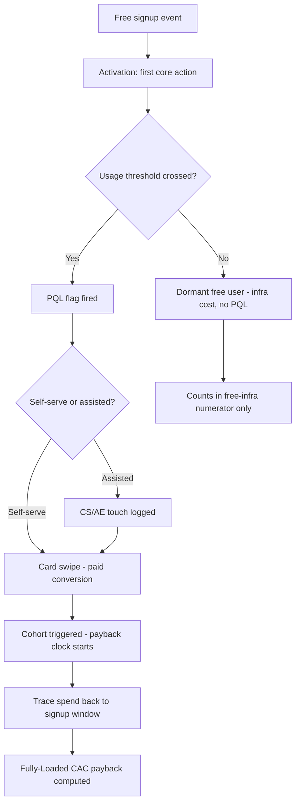

### Direct Answer

Calculate freemium-to-paid CAC payback by replacing "near-zero" acquisition cost with **Fully-Loaded CAC** — paid acquisition spend plus the free-tier infrastructure cost amortized over the *paying* cohort, plus every sales, CS, and onboarding touch a Product-Qualified Lead (PQL) consumes before and after the swipe. Divide that Fully-Loaded CAC by the cohort's monthly recurring gross margin (gross-margin dollars, not gross revenue). The honest payback for a healthy freemium PLG motion lands at 5-15 months when measured on a *triggered* paying cohort and a *time-shifted* spend window — never the headline "2 months" that a revenue-only denominator and a marketing-only numerator manufacture. The single most common error is counting the free user as free; the free tier is a marketing channel with a real, measurable cost of goods.

> **TLDR**
> - **Free is not free.** Free-tier compute, storage, support, and abuse cost is the dominant hidden CAC line in PLG. Amortize it over the paying cohort, not the signup base.
> - **Use Fully-Loaded CAC (Bessemer definition):** paid spend + free-infra-on-payers + PQL sales/CS touch + onboarding + payment-processing/fraud. The "self-serve is free" assumption is the bug.
> - **Denominator is gross-margin dollars,** not MRR. A 78% gross margin turns a 6-month "revenue payback" into a 7.7-month real payback.
> - **Time-shift the spend.** Free users convert on a 30-180 day lag; matching this month's spend to this month's conversions overstates efficiency by 2-4x.
> - **Trigger the cohort on the paying event,** then trace spend backward to the signup window. Cohort-by-signup-month dilutes payers with non-converters.
> - **Healthy target: 5-15 months Fully-Loaded payback;** under 5 is usually a measurement artifact, over 18 means the free tier is subsidizing non-buyers.
> - **Pair payback with burn multiple and NRR.** Fast payback plus negative net dollar retention is a leaky bucket, not a win.

This entry is the canonical Pulse RevOps method for pricing the "free" in freemium. It is written for RevOps leaders, PLG finance partners, and founders who present unit economics to a board. Read it alongside the PLG-and-sales blended view in (q1146), the self-serve expansion model in (q669), and the usage-based CAC treatment in (q419).

---

## 1. Banner — Why "Near-Zero CAC" Is the Most Expensive Lie in PLG

The phrase "self-serve acquisition cost is near-zero" is the assumption this entire entry exists to dismantle. It is not slightly wrong; it is structurally wrong, and it produces unit-economics decks that pass a board meeting and fail a fundraise diligence room.

### 1.1 The Mechanics of the Illusion

A freemium product-led-growth (PLG) motion looks free because no salesperson closed the deal and no media dollar can be traced to the individual who swiped a card. But "no attributable salesperson" is not the same as "no cost." The free tier is a *channel*. Like every channel it has a cost of goods, an operating cost, and an opportunity cost. The illusion comes from where those costs land in the general ledger: free-tier infrastructure shows up under **COGS** or **R&D hosting**, not under **Sales & Marketing**, so the standard CAC formula — Sales & Marketing spend divided by new customers — never sees it.

Bessemer Venture Partners codified the correction with **Fully-Loaded CAC**: the measure must include every dollar spent to move a human from "stranger" to "paying customer," regardless of which GL line it hits. In a freemium business the largest of those dollars is the free tier itself. Bessemer's *State of the Cloud* and its "10 Laws of Cloud" both make the same point — efficient growth is measured net of the cost to serve non-payers.

### 1.2 The Three Costs Hiding Behind "Free"

| Hidden cost | Where it lands in the GL | Why standard CAC misses it | Typical magnitude (per 1,000 free signups) |
|---|---|---|---|
| Free-tier infrastructure (compute, storage, bandwidth, AI inference) | COGS / hosting | Not in S&M line | $400 - $9,000 / month, model-dependent |
| Free-user support + abuse/fraud handling | OpEx / Support | Counted as "support cost," not CAC | $150 - $1,200 / month |
| Onboarding, lifecycle email, in-product education | Marketing ops / Product | Often capitalized or buried in R&D | $80 - $600 / month |
| PQL sales/CS touch (the human "assist") | S&M — but only the closed ones | Touches on non-converters get dropped | $0 - $40 per touched PQL |
| Payment processing + involuntary-churn recovery | COGS / finance | Treated as a margin item, not CAC | 2.9% + $0.30 per transaction |

The free-tier infrastructure line is the one that breaks decks. For a database, observability, or AI product, a single heavy free user can cost more per month than a light *paying* user generates. Snowflake's early free-trial credits, MongoDB's (MDB) Atlas free M0 clusters, and the free tiers at Datadog (DDOG) and Vercel all carry real per-user marginal cost. Treating that cost as R&D rather than CAC does not make it disappear — it just hides it from the people deciding whether to spend more on growth.

### 1.3 The AI-Native Twist — 2026 Makes the Lie More Dangerous

Until roughly 2023, the "near-zero CAC" assumption was wrong but survivable. A free user of a project-management tool or a CRM consumed cents of storage and a fraction of a CPU. The error was real but small, and a sloppy CAC number that ignored it was still in the right order of magnitude.

That is no longer true. AI-native freemium products — anything that runs model inference on free-tier requests — have *inverted* the cost structure. A free user who runs a hundred large-context inference calls a day can cost the company **more per month than a paying customer on a low tier generates**. The free tier of an AI product is not a rounding error in COGS; it can be the single largest line item in the entire company's cloud bill. OpenAI's free ChatGPT tier, Anthropic's free Claude tier, and every AI-feature-bearing SaaS free plan now carry inference cost that scales with *engagement*, and engaged free users are exactly the ones a freemium funnel is designed to produce.

This means the gap between "marketing-only CAC" and "Fully-Loaded CAC" is no longer 2-3x for AI-native products — Pulse RevOps has seen it run 6-12x. A founder who reports an AI product's CAC on the old marketing-only formula is not making a small error; they are off by an order of magnitude, and the error is *concentrated in the most successful part of the funnel*. The more your free tier engages users, the more the old formula lies.

### 1.4 What This Entry Will Not Let You Do

It will not let you report a 2-month payback built on a revenue denominator and a marketing-only numerator. It will not let you cohort by signup month when the question is about *payers*. It will not let you match this quarter's spend to this quarter's conversions when the conversion lag is four months long. And it will not let you bury inference or infrastructure cost in R&D so the CAC line stays flat while the free base balloons. Each of those is a documented, repeatable way to make a mediocre freemium business look like a great one — until a Series B diligence room rebuilds the math from the raw event log and the story falls apart in the worst possible setting.

The discipline this entry enforces is simple to state and hard to maintain: **every dollar spent to turn a stranger into a payer is CAC, no matter which general-ledger line it lands on.** The rest of the entry is the machinery for finding those dollars and dividing them honestly.

---

## 2. Banner — The Fully-Loaded CAC Formula, Built Line by Line

This section assembles the numerator. Get the numerator right and the rest of the entry is arithmetic.

### 2.1 The Canonical Equation

**Freemium Fully-Loaded CAC Payback (months) = Fully-Loaded CAC per paying customer ÷ (Monthly ARPU of the paying cohort × Gross Margin %)**

Where the numerator expands to:

**Fully-Loaded CAC = (Paid acquisition spend + Free-tier infrastructure on the converting cohort + Free-user support & abuse + Onboarding & lifecycle + PQL human-assist touch + Payment & fraud cost) ÷ Number of paying customers in the cohort**

Two structural rules govern this formula and most teams break both:

1. **The denominator of the *payback* ratio is gross-margin dollars, not revenue.** You do not recover CAC from revenue you immediately pay back to your cloud provider. If gross margin is 78%, then $1 of MRR only returns $0.78 toward CAC recovery.
2. **The free-infrastructure term is amortized over the *paying* cohort, not the signup base.** The free tier exists to produce buyers. Its cost is a cost of producing buyers. You spread it across the buyers it produced. (This is the single most contested line in any board discussion of freemium economics — see the Counter-Case in Section 8.)

### 2.2 A Worked Numerator — "Cohort April"

Take a freemium PLG product. In April it acquired 10,000 free signups. Over the following 180 days, 600 of them converted to paid (a 6% blended free-to-paid rate, which (q84) treats as a realistic mid-range for a true freemium product).

| Cost component | Amount (cohort total) | Basis |
|---|---|---|
| Paid acquisition spend (ads, content, SEO, partnerships) attributed to April signups | $48,000 | Marketing attribution, signup-windowed |
| Free-tier infrastructure for the 10,000 free users, April → conversion | $61,000 | Cloud bill, free-tier-tagged, 6 months |
| Free-user support + abuse/fraud handling | $9,400 | Support headcount allocation + fraud tooling |
| Onboarding, lifecycle email, in-product education tooling | $7,200 | Marketing ops + lifecycle platform |
| PQL human-assist touch (CS/AE time on the ~1,400 PQLs flagged) | $22,000 | Loaded hourly cost × touch minutes |
| Payment processing + involuntary-churn recovery | $4,100 | Processor fees on the 600 converters |
| **Total Fully-Loaded acquisition cost** | **$151,700** | |
| **Paying customers produced** | **600** | |
| **Fully-Loaded CAC per paying customer** | **$252.83** | $151,700 ÷ 600 |

Notice the result. The "marketing-only" CAC — the number a naive formula reports — is $48,000 ÷ 600 = **$80**. The Fully-Loaded CAC is **$253**. The free tier and the human assist *tripled* the real cost of acquisition. A team reporting the $80 number is not lying on purpose; it is using a formula that was designed for sales-led businesses and does not have a slot for the cost of free.

### 2.3 Allocating the Free-Infra Cost — The Honest Methods

You cannot tag a free user in April and *know* in April whether they will convert. So how do you allocate $61,000 of free-infrastructure cost when only 600 of 10,000 users converted? There are three defensible methods and one indefensible one.

| Method | How it works | When to use it | Honesty grade |
|---|---|---|---|
| **Full-cohort amortization** | All free-infra cost for the cohort → divided across the 600 payers | Default; treats free tier as a marketing cost of producing buyers | A — Bessemer-aligned |
| **Pre-conversion-only** | Only the free-infra cost incurred *before* each user's conversion date counts | More precise; needs per-user usage timestamps | A — most accurate, data-intensive |
| **Converter-attributable** | Only infra cost of users who eventually converted | Understates: ignores that you must run the whole funnel | C — biased low |
| **Exclude entirely** | Free-infra cost stays in R&D, never touches CAC | The "near-zero CAC" deck | F — the bug this entry fixes |

Pulse RevOps recommends **full-cohort amortization** as the reporting default and **pre-conversion-only** as the diligence-grade refinement. The gap between them is your "cost of carrying non-buyers," and that gap is itself a metric worth watching: if it grows, your free tier is getting more generous than your conversion rate justifies. The free-tier design levers that control this gap — seat caps, feature gates, usage quotas — are covered in (q672).

### 2.4 The Numerator Sensitivity Table — Knowing How Wrong You Can Be

Because the free-infra allocation is contestable, a serious model never reports a single CAC number. It reports a range, and it states the assumption that produces each point in the range. Carrying "Cohort April" forward, here is the same cohort under five different allocation assumptions:

| Allocation assumption | Free-infra charged to payers | Fully-Loaded CAC / payer | Payback (months) | Who argues for this |
|---|---|---|---|---|
| 0% — free-infra stays in R&D | $0 | $151 | 2.15 | The "near-zero CAC" deck — rejected |
| 50% — half the free tier is "brand" | $30,500 | $202 | 2.88 | Aggressive but defensible CFO case |
| 70% — most free cost is conversion cost | $42,700 | $222 | 3.16 | Pulse middle scenario |
| 100% — full-cohort amortization (default) | $61,000 | $253 | 3.60 | Pulse reported default |
| Pre-conversion-only refinement | $44,800 | $226 | 3.22 | Diligence-grade most-accurate |

The honest reportable headline is the **100% number ($253, 3.60 months)** with the pre-conversion-only refinement ($226, 3.22 months) shown as the precision estimate. The 0% row is in the table only to show the board what the *wrong* method would have claimed — a 2.15-month payback that is 40% too optimistic. Showing the range is not hedging; it is the difference between a model a sophisticated investor trusts and a model they discount on sight. The board-dashboard treatment in (q424) builds this sensitivity directly into the unit-economics page.

### 2.5 Why the Numerator Is Harder Than the Denominator

Most teams that get freemium economics wrong get the *numerator* wrong, not the denominator. The denominator — gross-margin dollars — is a single, well-defined accounting concept; once a team accepts it, the math is mechanical. The numerator is where judgment lives: which infrastructure cost is "free-tier," how to allocate it, whether a CS touch was acquisition or retention, how far back the spend window reaches. Every one of those is a decision, and every decision can be made to flatter the result.

This is why the rest of the entry spends more pages on cohort construction and instrumentation (Sections 4 and 7) than on the formula itself. The formula in 2.1 fits on one line. Feeding it honest inputs takes a clean event log, disciplined cost tagging, and a cohorting method that does not let the analyst pick the answer.

---

## 3. Banner — The Denominator: Gross-Margin Dollars and the Time-Shift Problem

A correct numerator divided by a wrong denominator is still a wrong answer. This section fixes the bottom of the ratio.

### 3.1 Why Gross Margin, Not Revenue

The purpose of a CAC payback metric is to answer one question: *how many months until this customer has returned the cash we spent to acquire them?* You do not get the cash back from revenue. You get it back from **gross profit** — revenue minus the cost to deliver the service to that customer. If your paying customers generate $90/month ARPU at a 78% gross margin, then each month they return $70.20 toward CAC recovery, not $90.

Carrying the "Cohort April" numbers forward:

| Step | Value | Note |
|---|---|---|
| Fully-Loaded CAC per paying customer | $252.83 | From Section 2.2 |
| Monthly ARPU of the paying cohort | $90.00 | Blended across plan tiers |
| Gross margin | 78% | Net of hosting, payment, support-on-payers |
| Monthly gross-margin dollars per customer | $70.20 | $90 × 0.78 |
| **Fully-Loaded CAC payback (months)** | **3.60** | $252.83 ÷ $70.20 |
| Naive "revenue payback" using marketing-only CAC | **0.89** | $80 ÷ $90 |

The naive method reports a **27-day** payback. The honest method reports **3.6 months**. Both describe the same business in the same month. The 4x gap is entirely measurement choice — and the 3.6-month figure is itself still optimistic, because it has not yet been corrected for the conversion-lag time-shift, which Section 3.3 addresses. The CAC-target framing in (q98) and the SMB-vs-mid-market-vs-enterprise benchmarks in (q91) both assume the gross-margin-denominator convention; if you compare against them on a revenue denominator you will draw the wrong conclusion.

### 3.2 What Belongs in "Cost to Serve"

Gross margin in a PLG SaaS business is not a single clean number. It must be computed *for the paying cohort* and must include:

- **Hosting and infrastructure for paying users** — distinct from the free-tier infra in the numerator.
- **Payment processing on recurring charges** — ~2.9% + $0.30 per transaction; meaningful at low ARPU.
- **Support and customer-success cost allocated to payers.**
- **Third-party API and AI-inference pass-through** — for AI-native products this is now the dominant COGS line and is the reason 2026-era PLG gross margins are compressing from the historical 80%+ toward 68-75%.
- **Free-tier infrastructure is *excluded* here** — it already lives in the numerator. Counting it in both places double-charges the business.

### 3.3 The Time-Shift Problem — The Lag Nobody Models

Here is the error that survives even after a team adopts Fully-Loaded CAC and a gross-margin denominator. Freemium users do not convert the month they sign up. They convert on a distribution — some at day 14, some at day 60, a long tail at day 150+. Median time-to-convert for a true freemium product runs **30 to 180 days**.

If you match **this month's** S&M spend to **this month's** conversions, you are dividing April's spend by conversions that mostly came from signups in December, January, and February. In a *growing* company, spend is higher today than it was four months ago — so the denominator (conversions) reflects a smaller past spend while the numerator reflects a larger present spend mismatched to it. The result systematically *understates* CAC and *understates* payback during growth, and *overstates* both during a slowdown. The multi-quarter-lag treatment in (q414) walks the same correction for sales-led motions.

**The fix: trigger-and-trace.** Define the cohort by the *signup* event. Trace forward to find who converted. Trace the *spend* backward to the signup window that produced them. Now numerator and denominator describe the same population. This is more work — it requires a clean event log joining signup, usage, PQL flag, and first-payment events — but it is the only method that survives diligence.

| Matching method | What it does | Bias during growth | Verdict |
|---|---|---|---|
| Calendar-month match (spend ÷ conversions, same month) | Quick, wrong | Understates CAC & payback | Do not use for decisions |
| Trailing-window match (e.g., trailing-3-month spend) | Smooths but still misaligned | Mild understatement | Acceptable for trend lines |
| Trigger-and-trace cohort | Cohort defined by signup, spend back-traced | Unbiased | Diligence-grade — required for board |

### 3.4 Quantifying the Time-Shift Error

It is worth seeing how large the time-shift distortion actually is, because teams routinely underestimate it. Consider a freemium company growing S&M spend 8% month-over-month — a brisk but not extreme pace — with a conversion lag whose median is 90 days.

In any given month, the conversions landing are produced mostly by signups from roughly three months earlier, when spend was about 22% lower (8% compounded over three months). If you divide *today's* spend by *today's* conversions, your numerator is ~22% too large relative to the population it should describe — but you also have *more* conversions arriving than the past spend "deserves," so the net distortion compounds. In Pulse RevOps' modeling, a company growing S&M at 8%/month with a 90-day lag will see calendar-month CAC run **25-35% above** the trigger-and-trace truth — meaning calendar-month payback is correspondingly *overstated*, not understated, in this direction.

The sign of the error flips with the question framing, which is exactly why it is so confusing and so dangerous: depending on whether you anchor on the spend or the conversions, calendar-month matching can make a business look better *or* worse than it is. The only stable cure is to stop matching by calendar and start matching by cohort. A company that switches from calendar-month to trigger-and-trace mid-year will see its reported CAC payback "jump" — not because the business changed, but because the measurement finally stopped lying. Brief the board before that switch; an unexplained metric jump in a board deck destroys more credibility than the underlying number ever could.

### 3.5 The Survivorship Trap in the Denominator

One more denominator subtlety. The "monthly ARPU of the paying cohort" is not constant over the payback window. Customers churn. If you compute ARPU from only the customers *still paying today*, you have a survivorship-biased number — the survivors are disproportionately the happy, higher-ARPU accounts, so today's ARPU overstates what the *original* cohort produced on average.

For a per-customer payback metric, use the cohort's ARPU *as measured across the payback window*, weighting by the months each customer actually paid. For the cohort-level cash-recovery figure (the 4.9-month number in Section 5.2), model the churn curve explicitly — some customers will leave before they finish repaying their CAC, and that lost recovery is a real cost. The LTV-with-variable-churn treatment in (q425) is the companion method for the post-payback period; together, payback and cohort LTV bracket the full economic life of an acquired customer.

---

## 4. Banner — Cohort Construction: Build It on the Paying Event

The single most consequential modeling decision in freemium economics is *what defines the cohort*. Get this wrong and every downstream number inherits the error.

### 4.1 Signup Cohorts vs Conversion Cohorts

There are two legitimate cohorting choices and they answer different questions:

- A **signup cohort** groups every free user who signed up in a window. It answers *"how efficiently does this acquisition vintage convert and monetize?"*
- A **conversion cohort** groups every user who *converted to paid* in a window. It answers *"what did this revenue vintage cost and how does it retain?"*

The freemium-to-paid CAC payback question lives at the intersection. You build the **signup cohort** to find the conversion rate and to assign free-infra cost; you then **trigger the paying sub-cohort** out of it and measure payback on that sub-cohort. What you must never do is compute payback on the *whole signup cohort* — that dilutes 600 payers with 9,400 non-payers and produces a meaningless blended ARPU near zero.

### 4.2 The Five Events Every Freemium Cohort Model Needs

Every box in that diagram is an event you must log with a timestamp. The signup, activation, and PQL events let you allocate free-infra cost honestly (pre-conversion-only method from Section 2.3). The PQL-and-touch events let you separate self-serve conversions from assisted ones — a distinction that matters because assisted conversions carry real human cost. The PQL scoring rules that fire that flag are detailed in (q670), and the PLG-to-sales handoff KPIs that govern the assisted path are in (q675).

### 4.3 Cohort Granularity and Sample Size

| Cohort window | Pros | Cons | Use when |
|---|---|---|---|
| Weekly | Fast feedback on funnel changes | Noisy; small payer counts | High-volume PLG (>5,000 signups/week) |
| Monthly | Standard; readable trend | Slower to detect regressions | Most freemium businesses |
| Quarterly | Stable, board-friendly | Hides intra-quarter swings | Low-volume or enterprise-leaning PLG |

A cohort needs enough *converters* to be statistically meaningful — Pulse RevOps' rule of thumb is a minimum of 100 paying customers in the triggered sub-cohort before payback is decision-grade. Below that, report it with a confidence caveat and lean on the trailing trend. The board-ready unit-economics dashboard in (q424) specifies which of these cohort cuts belong in front of directors and which stay in the operating review.

### 4.4 The Conversion-Window Decision

A signup cohort is never "done" converting. There is always a long tail — a free user who finally upgrades 14 months after signing up. So you must pick a **conversion window**: the cutoff at which you stop waiting and call the cohort's conversion rate final. This choice silently controls the headline conversion number, and a team that quietly extends the window every quarter can manufacture a rising conversion rate from nothing.

Pulse RevOps' standard is to report conversion at **two fixed checkpoints — 90 days and 180 days** — and to freeze those definitions. The 90-day number is the fast-feedback metric for funnel experiments; the 180-day number is the one that goes in the board deck and the one CAC payback is computed against. Anything converting after 180 days is real revenue but is treated as *expansion of the existing customer base*, not as a new conversion attributable to the original acquisition spend. The discipline is the fixed window, not the specific number of days — pick it, document it, and never move it to flatter a quarter.

| Window | What it is good for | Risk if used alone |
|---|---|---|
| 30-day | Detecting catastrophic funnel breakage fast | Misses the bulk of true freemium conversions |
| 90-day | Funnel-experiment feedback loop | Understates final conversion rate by 30-50% |
| 180-day | Board reporting + CAC payback denominator | Slow; needs 6 months of cohort maturity |
| Open-ended | "True" lifetime conversion | Ungameable definition impossible; never freezes |

### 4.5 Cohort Construction Failure Modes

| Failure mode | What it looks like | Why it corrupts payback |
|---|---|---|
| Cohort by conversion month | Grouping payers by when they paid | Spend is misattributed; payback "improves" the month spend is cut |
| Payback on the full signup base | Dividing CAC by all 10,000 signups | Blended ARPU collapses toward zero; payback explodes meaninglessly |
| Mixing trial and freemium users | One cohort spanning two motions | Trial converts fast/high, freemium slow/low — the blend describes neither |
| Re-defining "converted" mid-stream | Counting a plan upgrade as a new conversion | Double-counts; conversion rate drifts up artificially |
| Ignoring reactivated churned users | A returning ex-customer counted as a new conversion | Inflates new-conversion CAC efficiency with re-acquisition |

Every one of these produces a number that *looks* like a freemium CAC payback and is not one. The defense is a written cohort definition — signup-triggered, paying sub-cohort, 180-day window, freemium-only, first-payment-as-trigger — that an outsider can apply to your raw data and reproduce your reported figure exactly.

---

## 5. Banner — Worked End-to-End Example: "Cohort April" Through 12 Months

This section runs one cohort fully, so the method is concrete rather than theoretical.

### 5.1 The Setup

Cohort April: 10,000 free signups in April 2026. The product is a mid-market PLG analytics tool with a generous free tier. Following the trigger-and-trace method, here is the cohort traced through its first year.

| Metric | Value | Source / method |
|---|---|---|
| Free signups (cohort size) | 10,000 | Signup event log |
| Activated (first core action) within 14 days | 5,800 | Activation event |
| PQLs flagged (usage threshold crossed) | 1,400 | PQL scoring model — see (q670) |
| Converted to paid within 180 days | 600 | First-payment event |
| Free-to-paid conversion rate | 6.0% | 600 ÷ 10,000 |
| PQL-to-paid conversion rate | 42.9% | 600 ÷ 1,400 |
| Self-serve conversions (no human touch) | 430 | Touch log = empty |
| Assisted conversions (CS/AE touch logged) | 170 | Touch log populated |

### 5.2 The Numerator and the Payback

Using the Section 2.2 numerator ($151,700 total Fully-Loaded cost, $252.83 per payer) and the Section 3.1 denominator ($70.20 monthly gross-margin dollars):

| Output | Value |
|---|---|
| Fully-Loaded CAC per paying customer | $252.83 |
| Fully-Loaded CAC payback (months) | 3.60 |
| Months to full cohort cash recovery (accounting for cohort churn) | 4.9 |
| 12-month cohort gross-margin dollars per surviving customer | $702 |
| 12-month CAC-adjusted contribution per acquired payer | $449 |

The "4.9 months to full cohort cash recovery" is higher than the 3.60-month per-customer figure because some customers in the cohort churn before they finish repaying their CAC. A per-customer payback assumes the average customer survives the payback window; the cohort-level number does not. Both belong in the model — the per-customer figure for benchmarking, the cohort-level figure for cash planning.

### 5.3 Splitting Self-Serve vs Assisted Payback

The 600 payers are not homogeneous. Splitting them reveals where the motion is efficient and where it is subsidized.

| Segment | Count | CAC per payer | Monthly GM$ | Payback (months) | Read |
|---|---|---|---|---|---|
| Self-serve (no touch) | 430 | $171 | $61 | 2.80 | Genuinely efficient PLG |
| Assisted (CS/AE touch) | 170 | $460 | $112 | 4.11 | Higher CAC, higher ARPU — still healthy |
| Blended | 600 | $253 | $70 | 3.60 | The reportable number |

This split is the most actionable table in the entry. The assisted segment costs more to acquire *and* monetizes better — exactly the pattern you want, because it means the human touch is being spent on accounts that can carry it. If the assisted segment had a *lower* ARPU than self-serve, the touch would be value-destroying and you would pull it. The behavioral signals that say a PLG account is ready for that human touch are catalogued in (q673), and the question of when PLG structurally requires a sales overlay is handled in (q93).

### 5.4 Reading the Cohort Across 12 Months

A single payback number is a snapshot; the cohort tells a story over time. Here is Cohort April rolled forward month by month, tracking cumulative gross-margin dollars recovered against the $252.83 Fully-Loaded CAC per payer.

| Month after conversion | Surviving payers (of 600) | Cumulative GM$ recovered / payer | CAC recovered? |
|---|---|---|---|
| Month 1 | 600 | $70 | 28% |
| Month 2 | 588 | $139 | 55% |
| Month 3 | 579 | $207 | 82% |
| Month 4 | 572 | $274 | 108% — break-even crossed |
| Month 6 | 558 | $406 | 161% |
| Month 9 | 539 | $598 | 237% |
| Month 12 | 525 | $782 | 309% |

The cohort crosses break-even in Month 4 on a surviving-payer basis. By Month 12 each survivor has returned more than 3x their acquisition cost in gross margin — and that is *before* counting expansion revenue, which a healthy PLG cohort generates as users add seats and cross usage tiers. The 90-day self-serve expansion model in (q669) is the method for projecting that expansion line, and it is what turns a 3x cohort into a 5-6x one over a 24-month horizon.

### 5.5 Comparing Three Cohorts — The Pattern That Matters

One cohort cannot tell you whether the business is improving. Three can. Here are three consecutive monthly cohorts of the same product.

| Metric | Feb cohort | Mar cohort | Apr cohort | Trend read |
|---|---|---|---|---|
| Free signups | 8,400 | 9,100 | 10,000 | Acquisition scaling |
| Free-to-paid (180-day) | 6.4% | 6.2% | 6.0% | Slight dilution |
| Fully-Loaded CAC / payer | $228 | $241 | $253 | Rising — watch |
| Monthly GM$ / payer | $68 | $69 | $70 | Flat |
| Fully-Loaded payback (months) | 3.35 | 3.49 | 3.60 | Slowly degrading |
| Free-infra cost-of-carry / payer | $89 | $96 | $102 | The culprit |

The story is in the last row. Payback is degrading not because monetization weakened — ARPU is flat — but because the **free-infra cost of carrying non-buyers is rising faster than conversions**. The free tier is getting more expensive per payer it produces. That is a product-design signal, not a marketing one: it points at seat caps, feature gates, or usage quotas being too generous, which is precisely the lever set covered in (q672). Without the three-cohort comparison, a team would see only "payback is 3.6 months, still healthy" and miss the trend that, extrapolated, becomes a real problem in two quarters.

---

## 6. Banner — Benchmarks: What "Good" Looks Like in 2026

Numbers without reference points do not inform decisions. This section gives the reference points and the caveats on each.

### 6.1 Fully-Loaded Payback Benchmarks

| Segment / motion | Healthy Fully-Loaded CAC payback | Caution zone | Source basis |
|---|---|---|---|
| Pure self-serve freemium, SMB | 4 - 10 months | > 14 months | OpenView PLG benchmarks; Bessemer Cloud reports |
| Freemium with PQL-assist, mid-market | 8 - 15 months | > 20 months | OpenView; KeyBanc SaaS survey |
| Blended PLG + sales-led | 12 - 20 months | > 24 months | KeyBanc; ICONIQ Growth |
| Enterprise-heavy with PLG top-of-funnel | 15 - 24 months | > 30 months | ICONIQ; Bessemer |

The CAC-payback target debate — 12 vs 18 vs 24 months — is resolved in (q98); the short version is that the right target is motion-dependent, and a freemium SMB business held to a 24-month enterprise standard will under-invest in growth. The SMB/mid-market/enterprise payback spread is detailed in (q91).

### 6.2 Conversion-Rate Benchmarks

| Funnel stage | Healthy range | Note |
|---|---|---|
| Free-to-paid (true freemium, no time limit) | 2% - 5% | Slack-style; large free base |
| Free-to-paid (reverse-trial / opt-out) | 8% - 25% | Time-boxed premium access |
| Free-trial-to-paid (time-limited, no permanent free) | 15% - 25% | Not freemium proper |
| PQL-to-paid | 25% - 50% | The metric that actually predicts revenue |

A 6% blended free-to-paid rate, as in Cohort April, sits at the healthy end for a permanent free tier. Note the reverse-trial figures: a *reverse trial* (full product free for 14-30 days, then downgrade to a limited free tier) consistently outperforms classic freemium on conversion, and the pricing-strategy decision behind it is covered in (q84).

### 6.3 The Companion Metrics — Never Report Payback Alone

CAC payback is one of four numbers that must move together. Reported in isolation it is gameable.

| Companion metric | What it catches that payback misses | Healthy 2026 range |
|---|---|---|
| Net Dollar Retention (NRR) | Whether the cohort *grows* after acquisition | 105% - 130% for healthy PLG |
| Burn Multiple (net burn ÷ net new ARR) | Whether the whole company is efficient, not just one cohort | < 1.5 good; < 1.0 elite |
| Gross margin | Whether the denominator is even durable | 70% - 80%; AI-native lower |
| Magic Number | S&M efficiency at the company level | > 0.75 — see (q418) and (q1108) |

A freemium business can show a fast Fully-Loaded payback and still be unhealthy: if NRR is below 100%, every cohort leaks faster than it expands and fast payback just means you re-acquire churned revenue forever. Burn multiple is the cross-check that prevents a flattering cohort metric from hiding company-level inefficiency. The way magic number must be re-read when a motion shifts from sales-led to PLG is the exact subject of (q1108).

### 6.4 The Four-Number Health Grid

The right way to present freemium economics is not a single metric but a grid. Each cell is one of the four companion metrics; the combination, not any single number, classifies the business.

| Payback | NRR | Burn multiple | Diagnosis |
|---|---|---|---|
| Fast (< 8 mo) | High (> 115%) | Low (< 1.0) | Elite — the freemium flywheel is working; invest into growth |
| Fast (< 8 mo) | Low (< 100%) | Any | Leaky bucket — fast re-acquisition masking churn; fix retention first |
| Slow (> 18 mo) | High (> 115%) | Low (< 1.0) | Expansion-led — payback is slow but cohorts compound; acceptable if cash allows |
| Slow (> 18 mo) | Low (< 100%) | High (> 2.0) | Distressed — every cohort loses money and never recovers; halt spend, rebuild |
| Moderate (8-15 mo) | Moderate (100-115%) | Moderate (1.0-2.0) | Steady — typical healthy mid-market freemium; optimize at the margin |

The grid forces a synthesis a single number can never give. A founder who walks into a board meeting with "our payback is 5 months" has said almost nothing; a founder who says "5-month payback, 118% NRR, 0.9 burn multiple" has placed the company precisely in the top-left cell and earned the right to ask for growth capital. The board-ready version of this grid is specified in (q424).

### 6.5 Why Benchmarks Mislead More Than They Help

A warning on benchmarks themselves. Every range in Section 6.1 is a *blend* of businesses with different free-tier generosity, different price points, different gross margins, and different definitions of "freemium." A published "median PLG CAC payback of 11 months" is an average of companies that measured CAC five different ways. Comparing your trigger-and-trace, Fully-Loaded, gross-margin-denominated number against a benchmark built on marketing-only CAC and revenue denominators is comparing two different quantities that happen to share a name.

Use benchmarks for one thing only: as a *sanity bracket*. If your number is wildly outside the range — a 1-month payback or a 40-month payback — that is a signal to re-examine your method before you re-examine your business. Inside the range, the benchmark tells you nothing actionable; your own cohort-over-cohort trend (Section 5.5) is the only comparison that controls for method and is therefore the only one worth optimizing against.

---

## 7. Banner — Instrumentation: The Data You Must Have to Compute This Honestly

A correct method is useless without the data to feed it. This section is the implementation checklist.

### 7.1 The Event Schema

You need a clean, joinable event log. At minimum:

1. **Signup event** — user ID, timestamp, acquisition source, plan = free.
2. **Activation event** — user ID, timestamp, the specific core action.
3. **Usage events** — enough granularity to compute infrastructure cost per user and to fire the PQL threshold.
4. **PQL flag event** — user ID, timestamp, score at flag time.
5. **Human-touch event** — user ID, timestamp, owner, minutes spent (the assisted-vs-self-serve discriminator).
6. **First-payment event** — user ID, timestamp, plan, MRR. This is the trigger event.
7. **Plan-change and churn events** — for the post-acquisition NRR and survival curve.

### 7.2 The Cost-Tagging Discipline

| Cost stream | Tagging requirement | Common failure |
|---|---|---|
| Cloud infrastructure | Tag resources free-tier vs paid-tier (account labels, namespace, or tenant tags) | One untagged bill; free and paid infra blended into one COGS number |
| Paid acquisition spend | UTM + signup-window attribution, not last-touch-at-purchase | Attributing spend to the conversion month, not the signup month |
| Support & CS cost | Time-tracked or seat-allocated to free vs paid | All support cost dumped on payers, understating free-tier cost |
| Payment processing | Pulled from processor, mapped to cohort | Treated as a flat margin haircut, not cohort-traceable |

The tagging discipline is where most freemium-economics projects die. If your cloud provider's bill is one undifferentiated number, you cannot separate free-tier infra (numerator) from paying-tier infra (denominator), and the whole method collapses into a guess. Fix the tagging first; the math is easy once the data is clean.

### 7.3 The Reporting Cadence

| Artifact | Cadence | Audience | Contents |
|---|---|---|---|
| Cohort payback tracker | Monthly | RevOps + Finance | Every signup cohort, Fully-Loaded payback, trend |
| Self-serve vs assisted split | Monthly | PLG + Sales leadership | Section 5.3 table per cohort |
| Board unit-economics page | Quarterly | Board | Blended payback + NRR + burn multiple + magic number |
| Free-tier cost-of-carry watch | Monthly | Finance + Product | Free-infra cost ÷ payers produced — the generosity gauge |

The board page should never show the cohort payback metric without its three companions from Section 6.3 on the same slide. A board that sees a 3.6-month payback and nothing else will conclude the business is a rocket ship; a board that sees 3.6 months alongside 96% NRR will correctly ask why the bucket leaks. The full board-ready dashboard specification is (q424).

### 7.4 The Common Instrumentation Failures and Their Fixes

Most freemium-economics projects do not fail at the formula. They fail at the data layer, weeks before anyone computes a ratio. Here are the failures Pulse RevOps sees most often and the specific remediation for each.

| Instrumentation failure | Symptom in the model | Remediation |
|---|---|---|
| Signup event missing acquisition source | Cannot back-trace spend to a cohort | Capture UTM/referrer at signup, persist to user record |
| Cloud bill not tagged free vs paid | Free-infra cost is a guess | Tag at resource/namespace/tenant level; reconcile to total bill |
| PQL flag computed but not logged with timestamp | Cannot separate pre- and post-conversion infra cost | Emit a discrete PQL event the moment the threshold fires |
| Human-touch time not tracked | Cannot split self-serve vs assisted CAC | Log touch minutes in the CRM or CS tool against the user ID |
| First-payment event ambiguous (trial-to-paid vs free-to-paid) | Cohort mixes two motions | Tag the prior plan state on the payment event |
| Churn event delayed or soft (no hard timestamp) | Survival curve and cohort recovery wrong | Emit churn at the billing event, not at the support ticket |

The remediation column is, deliberately, all engineering work — schema additions and tagging discipline, not analysis. That is the point of Section 7: the analytical method in Sections 2 through 5 is straightforward arithmetic, and the entire difficulty of freemium economics is *getting the inputs clean enough to feed it*. A RevOps leader who spends week one of this project arguing about the CAC formula has misallocated the week; spend it on the event log and the cost tags instead.

### 7.5 Building It Without a Data Team

A common objection: "we don't have a data engineer, this is out of reach." It is not. The minimum viable instrumentation for an honest freemium CAC model is achievable with a product-analytics tool, a billing system, and a spreadsheet:

1. **Product analytics** (the signup, activation, usage, and PQL events) — most tools emit these or can be configured to.
2. **Billing system export** (first-payment, plan-change, churn events) — every billing platform exports this.
3. **Cloud cost console** (the free-vs-paid infrastructure split) — every major provider supports cost allocation tags.
4. **A monthly spreadsheet** that joins the three on user ID and cohort month.

This is not elegant and it does not scale past a few thousand conversions a month, but it is *correct* — and a correct rough model beats a precise wrong one every time. Graduate to a warehouse-based pipeline when the spreadsheet join takes longer than the insight is worth, not before. The maturity-staging principle from Section 8.5 applies here directly: match the instrumentation investment to the decisions it informs.

---

## 8. Banner — Counter-Case: When This Method Is Wrong, Overcomplicated, or Gamed

A method presented without its failure modes is propaganda. Here is the honest adversarial pass on the Pulse RevOps freemium-CAC method.

### 8.1 "Amortizing free-infra over payers double-counts a sunk cost"

The strongest objection. A CFO can argue: the free tier exists for reasons beyond conversion — brand, network effects, recruiting, a moat against competitors. Charging 100% of free-infra cost to the 600 payers overstates *their* CAC, because some of that free spend bought brand value the payers did not consume.

**The honest answer:** the objection has real merit at the *margin*. If your free tier genuinely produces measurable non-conversion value — for example, a free tier that drives word-of-mouth that lowers *paid* CAC — then a partial allocation is defensible. Pulse RevOps' position: default to **full-cohort amortization** for the reported number, *and* run a sensitivity scenario at 70% and 50% allocation so the board sees the range. What is *not* defensible is 0% allocation. The free tier produces buyers; some of its cost is a cost of producing buyers; that fraction is not zero. The debate is whether the right number is 60% or 100% — never whether it is 0%.

### 8.2 "Trigger-and-trace cohorting is too heavy for an early-stage company"

Also fair. A seed-stage company with 300 signups a month and a two-person finance function cannot build a clean seven-event log overnight. For them, trigger-and-trace is the right *destination* but the wrong *starting point*.

**The honest answer:** stage your maturity. Pre-product-market-fit, a trailing-3-month spend-to-conversion ratio with free-infra cost included as a flat estimate is *good enough* to avoid the worst error (zero free cost). The precision of pre-conversion-only allocation and full event-log tracing matters when you are raising a priced round or making real budget-allocation decisions — not before. Do not let the perfect method stop you from doing the *adequate* one.

### 8.3 "Payback is the wrong primary metric for PLG entirely"

A real school of thought — argued by some PLG investors — holds that for a true bottoms-up motion, **NRR and burn multiple** are the metrics that matter, and CAC payback is a sales-led import that PLG founders over-index on.

**The honest answer:** partly right, and this is why Section 6.3 exists. If your free-to-paid motion is genuinely near-zero-marginal-cost *and* your NRR is 130%+, then payback is a less interesting metric than expansion economics, and obsessing over a 3-vs-5-month payback is a distraction. But "payback is less interesting" is not "payback is free." The teams that say "payback doesn't matter for PLG" are usually the same teams that never measured free-infra cost — and that is precisely the population this entry is written to correct. Use payback as a *guardrail* (it should not blow past the Section 6.1 caution zones) and use NRR and burn multiple as the *primary* growth-quality signals.

### 8.4 The Gaming Failure Modes

| How the metric gets gamed | The tell | The fix |
|---|---|---|
| Move free-infra cost to R&D | CAC suspiciously stable as free base balloons | Audit the cloud bill tagging |
| Cohort by conversion month, not signup | Payback improves the month spend is cut | Force signup-cohort triggering |
| Report revenue payback, call it CAC payback | Payback under 2 months on a real freemium product | Require gross-margin denominator |
| Exclude assisted conversions ("those were sales-led") | Self-serve CAC implausibly low | Reconcile total conversions to total payments |
| Quietly extend the conversion window | Conversion rate creeps up every quarter | Fix the window; report rate at 90/180 days |

Every one of these is survivable in a board meeting and fatal in a diligence room. The point of the Fully-Loaded, trigger-and-trace, gross-margin method is not to make the number *look* worse — it is to make the number *match what a sophisticated buyer or investor will independently rebuild from your raw data*. A company whose internal metrics survive that rebuild raises faster and on better terms.

### 8.5 When to Deliberately Simplify

There is a real cost to over-engineering this. If you are spending two weeks a month on cohort attribution for a business doing $2M ARR, you have inverted the effort. The honest guidance: match method precision to decision stakes. A monthly operating review can run on trailing-window estimates. A board deck needs the gross-margin denominator and the companion metrics. A fundraise needs full trigger-and-trace. Calibrate, and revisit the calibration as you scale — the blended-motion reading in (q1146) becomes the relevant frame the moment a real sales team appears alongside the PLG funnel.

---

## 9. Banner — The Pulse RevOps Implementation Playbook

A 90-day path from "near-zero CAC" to a diligence-grade freemium economics model.

### 9.1 Days 1-30: Stop the Bleeding

1. **Tag the cloud bill.** Separate free-tier from paying-tier infrastructure. This is the highest-leverage single action and it is pure engineering hygiene.
2. **Compute one Fully-Loaded CAC** for the most recent fully-converted cohort, even with rough estimates. Get the *shape* of the number.
3. **Switch the denominator to gross-margin dollars** in every internal report. This alone corrects the largest distortion.
4. **Stop matching same-month spend to same-month conversions.** Move to a trailing-3-month window as an interim measure.

### 9.2 Days 31-60: Build the Cohort Engine

5. **Stand up the seven-event log** from Section 7.1 — even a basic version in your data warehouse.
6. **Trigger your first proper signup cohort** and trace it forward to conversion.
7. **Split self-serve vs assisted** and read the Section 5.3 table. Decide whether the human touch is paying for itself.
8. **Add the free-tier cost-of-carry watch** — free-infra cost ÷ payers produced — as a monthly metric.

### 9.3 Days 61-90: Make It Board-Grade

9. **Build the board unit-economics page** with payback, NRR, burn multiple, and magic number together — never payback alone.
10. **Run the allocation sensitivity** (100% / 70% / 50% free-infra allocation) so the range is visible.
11. **Benchmark against Section 6** and write the one-paragraph narrative: which segment is efficient, which is subsidized, what you are changing.
12. **Document the method** so a diligence room can follow it without you in the room. A reproducible method is a fundraising asset.

The end state: a freemium business that knows, to the dollar, what it costs to produce a paying customer — and a unit-economics story that gets *stronger* under scrutiny instead of weaker.

### 9.4 The 90-Day Milestone Checklist

To make the playbook auditable, here is the same 90 days expressed as concrete deliverables with owners.

| Week | Deliverable | Owner | Done when |
|---|---|---|---|
| 1-2 | Cloud bill split into free-tier and paying-tier cost | Engineering | The two numbers reconcile to the total bill within 2% |
| 3-4 | First Fully-Loaded CAC computed for one mature cohort | RevOps + Finance | A single $/payer number exists with a documented method |
| 4 | Gross-margin denominator adopted in all internal reports | Finance | No internal report still divides by revenue |
| 5-7 | Seven-event log live in the warehouse or analytics tool | Engineering + RevOps | A cohort can be triggered and traced end to end |
| 8 | Self-serve vs assisted split produced for one cohort | RevOps | The Section 5.3 table exists for a real cohort |
| 8 | Free-tier cost-of-carry watch added to the monthly pack | Finance | The metric appears in the operating review |
| 9-10 | Board unit-economics page assembled | RevOps + Finance | Payback, NRR, burn multiple, magic number on one slide |
| 11 | Allocation sensitivity (100/70/50%) modeled | Finance | The Section 2.4 range table exists |
| 12 | Method documented for external reproduction | RevOps | A diligence reader can rebuild the number unaided |

The owners column matters as much as the deliverables. Freemium economics fails when it is "RevOps' project" — the cloud-bill tagging is engineering's, the gross-margin denominator is finance's, and only the cohort logic is genuinely RevOps'. Assign it cross-functionally on day one or it stalls at the cloud-bill step.

### 9.5 What Changes After Day 90

The 90-day plan builds the model once. Keeping it honest is a permanent operating habit, not a project. After day 90, three things become routine: every monthly operating review reads the newest mature cohort and the cost-of-carry trend; every board meeting shows the four-number grid; and every material free-tier change — a new feature gated, a quota raised, a seat cap moved — triggers a re-forecast of the free-infra cost-of-carry line before it ships, not after. A freemium business that does this will never again be surprised by its own unit economics in a diligence room, and that predictability is itself worth a turn of valuation.

---

## 10. Banner — Key Takeaways

- **"Near-zero self-serve CAC" is a measurement bug, not a business reality.** The free tier is a channel with a real cost of goods. Price it.
- **Use Fully-Loaded CAC** (Bessemer definition): paid spend + free-infra-on-payers + PQL human-assist + onboarding + payment/fraud. In the worked example this *tripled* CAC from $80 to $253.
- **The payback denominator is gross-margin dollars,** not revenue. A 78% margin turns a 0.89-month "revenue payback" into a 3.6-month honest one.
- **Time-shift the spend.** Freemium converts on a 30-180 day lag; calendar-month matching understates CAC during growth. Use trigger-and-trace cohorting.
- **Build the cohort on the paying event,** triggered out of a signup cohort — never measure payback on the diluted full signup base.
- **Split self-serve vs assisted.** Healthy PLG shows assisted conversions at higher CAC *and* higher ARPU; if the touch lowers ARPU, kill it.
- **Healthy Fully-Loaded payback is 4-15 months** depending on segment; under 4 is usually an artifact, over 20 means the free tier subsidizes non-buyers.
- **Never report payback alone.** Pair it with NRR, burn multiple, gross margin, and magic number — fast payback plus sub-100% NRR is a leaky bucket.
- **Match method precision to decision stakes:** trailing estimates for operating reviews, gross-margin denominator for the board, full trigger-and-trace for a fundraise.

For the adjacent decisions this entry touches, continue with the blended PLG-and-sales-led CAC reading in (q1146), the first-90-day self-serve expansion model in (q669), the usage-based-pricing CAC treatment in (q419), the multi-quarter sales-cycle payback correction in (q414), and the free-tier design levers — seat caps, feature gates, API quotas — in (q672).

---

### Citations & Sources

1. Bessemer Venture Partners — *State of the Cloud 2024/2025*.
2. Bessemer Venture Partners — *10 Laws of Cloud Computing*.
3. Bessemer Venture Partners — definition of Fully-Loaded CAC.
4. Bessemer Venture Partners — *Scaling to $100 Million* (CAC payback benchmarks).
5. OpenView Partners — *Product Benchmarks Report* (PLG free-to-paid conversion).
6. OpenView Partners — *2023 PLG Index*.
7. OpenView Partners — reverse-trial vs freemium conversion analysis.
8. KeyBanc Capital Markets — *Annual SaaS Survey* (CAC payback by motion).
9. ICONIQ Growth — *Growth & Efficiency* reports (payback by segment).
10. David Sacks — "The Burn Multiple" (Craft Ventures).
11. Craft Ventures — efficient-growth framework.
12. SaaS Capital — *CAC and Payback Period Benchmarks*.
13. SaaS Capital — *Net Revenue Retention Benchmarks*.
14. Scott Maxwell / OpenView — PLG cost-of-serve commentary.
15. a16z — "16 Startup Metrics" (CAC, LTV definitions).
16. a16z — "16 More Startup Metrics" (cohort analysis, NRR).
17. Tomasz Tunguz — CAC payback period writing (Theory Ventures / formerly Redpoint).
18. Tomasz Tunguz — magic number analysis.
19. Lighter Capital / public SaaS filings — gross margin benchmarks.
20. Snowflake (SNOW) — S-1 and 10-K, free-trial credit economics.
21. MongoDB (MDB) — Atlas free-tier (M0) cost structure, 10-K disclosures.
22. Datadog (DDOG) — free-tier and usage-based model, investor materials.
23. Vercel — free-tier infrastructure cost commentary (public engineering posts).
24. Slack Technologies — S-1, freemium free-to-paid conversion disclosures.
25. HubSpot (HUBS) — Free CRM tier economics; investor commentary.
26. Dropbox (DBX) — freemium conversion and infrastructure cost (10-K).
27. Zoom (ZM) — free-tier cost and conversion disclosures.
28. ChartMogul — SaaS metrics definitions (CAC payback, NRR).
29. Baremetrics — Open Benchmarks (CAC, churn, ARPU).
30. ProfitWell / Paddle — freemium and pricing research.
31. Reforge — PLG and growth-loop curriculum (cohort and PQL frameworks).
32. Elena Verna — PLG and growth writing (PQL, reverse trial).
33. Kyle Poyar (OpenView, then Growth Unhinged) — PLG economics writing.
34. McKinsey & Company — SaaS unit-economics and cloud-cost research.
35. Bain & Company — *Net Promoter* and customer-economics research.
36. Gartner — SaaS metrics and PLG market guidance.
