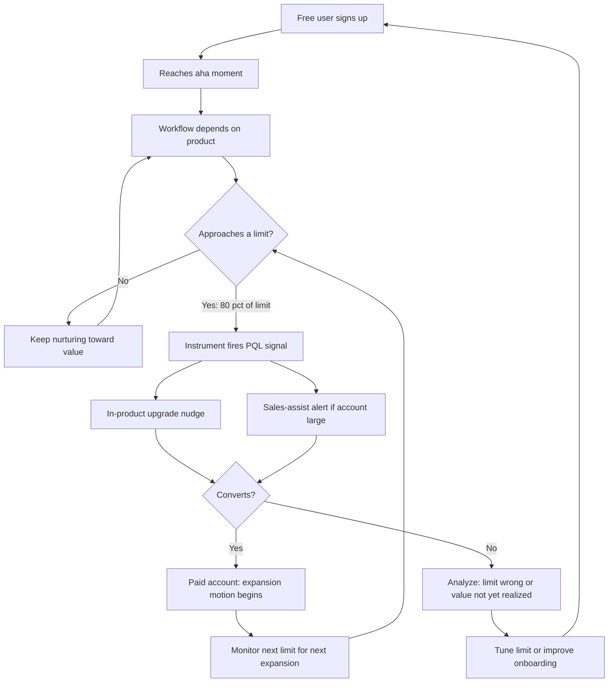

### Direct Answer

Free tier seat limits, feature gates, and API quotas are not generosity decisions — they are **expansion triggers** engineered backward from the moment a team's real workflow outgrows the free envelope. The rule of thumb that survives contact with data: set the free limit at roughly **80% of the value a single committed user or small team can extract**, so the product proves itself fully but the *next* unit of value sits visibly behind a paywall. Limits that gate collaboration (seats), depth (feature gates), or scale (API quotas) convert because they manufacture a recurring, self-evident "I need more" moment that the user — not a rep — surfaces first. The design discipline is to place each limit precisely where dependency has already formed but the next increment of value has not yet been captured.

> **TLDR**
> - **Free tiers exist to create qualified expansion demand, not to be charitable.** Every limit is a hypothesis about where a user crosses from "evaluating" to "depending."
> - **Three lever types, three jobs:** seat limits monetize *team adoption*, feature gates monetize *workflow depth*, API/usage quotas monetize *scale and integration*. Mixing them carelessly creates rage-quits; sequencing them creates a ladder.
> - **Set the free ceiling at ~80% of single-user/small-team value.** Below that, the product never proves itself; above it, you never create a paywall moment.
> - **Soft limits beat hard walls.** Grace overages, throttling, and "you've hit your limit — upgrade or wait" outperform instant lockouts on conversion and on NPS.
> - **Instrument the limit before you set it.** You cannot tune a gate you cannot see being hit. Limit-proximity is the single most predictive PQL signal in PLG.
> - **Slack, Notion, Figma (ADBE), HubSpot (HUBS), and Datadog (DDOG) each gate a different axis** — copying one company's free tier into a different value model is the most common freemium failure.

This entry lays out the design rules operators actually use, the failure modes that quietly kill freemium economics, and the instrumentation that turns a static limit into a live expansion engine. It is written for the founder, the head of growth, or the pricing-and-packaging owner who has to decide — concretely — how many free seats, which gated features, and what API quota to ship next quarter.

---

## 1. Why Free Tier Limits Are Expansion Infrastructure, Not Pricing Trivia

### 1.1 The freemium contract: what each side is actually buying

A free tier is a two-sided wager. The user wagers their time and data on the bet that the product will pay off before the limits bite. The vendor wagers its compute, support load, and infrastructure cost on the bet that a measurable fraction of free users will hit a limit *while already dependent* and convert rather than churn. Neither side states the wager out loud, but both are playing it, and the limit is the contract term that decides who wins.

The mistake nine out of ten early-stage teams make is treating the free tier as a marketing brochure — "let people try it." That framing produces a free tier that is either too generous (no one ever needs to pay) or too stingy (no one ever gets to value). The correct framing: the free tier is the **top of a manufacturing line for Product-Qualified Leads (PQLs)**. Its job is to take raw signups and output a steady supply of accounts that have proven intent, proven value realization, and a self-evident reason to expand. A free tier judged by signups alone is a vanity machine; a free tier judged by qualified expansion demand produced is a revenue machine.

Wes Bush, who codified much of modern PLG thinking in *Product-Led Growth*, frames the free tier's job as moving users to an "aha moment" fast enough that the eventual paywall feels like a natural next step rather than a bait-and-switch. The limit is the paywall's location. Get the location wrong and even a great product converts badly. A product can have brilliant retention, a beloved UI, and genuine word-of-mouth, and still convert at a third of its potential simply because the free ceiling was set by intuition rather than by the value curve.

### 1.2 The three monetizable axes

Every durable freemium model gates one or more of three axes, and each axis monetizes a different kind of growth:

| Axis | What it gates | What growth it monetizes | Canonical example |
|---|---|---|---|
| **Seats** | How many humans use it | Team and org adoption | Slack, Figma, Notion |
| **Feature depth** | Which capabilities unlock | Workflow sophistication | HubSpot, Canva, Loom |
| **Usage / API quota** | How much volume runs through it | Scale and integration | Datadog, Twilio, Vercel, OpenAI |

The strategic question is not "which one should I use" but "which axis does my product's value scale along?" If value compounds when more teammates join, gate seats. If value compounds when a power user does more sophisticated work, gate features. If value compounds with raw volume, gate usage. Gating the wrong axis is the single most common freemium design error — it puts the toll booth on a road no one wants to drive down.

The diagnostic is concrete. Ask: "What does a happy customer do *more of* as they get more value from us?" If the answer is "invite more people," seats are the axis. If the answer is "do more sophisticated things," features are the axis. If the answer is "push more volume through," usage is the axis. The honest answer is sometimes uncomfortable — a founder may *want* to gate seats because seat pricing forecasts cleanly, even though the product's real value scales with usage. Picking the lever you wish were true rather than the one your value curve actually follows produces a free tier that fights the product.

Many durable companies eventually gate more than one axis at once, but they almost never gate all three on day one. The discipline for an early-stage company is to pick the *single* dominant axis — the one most tightly coupled to value — ship a clean free tier and one or two paid tiers around it, and only add a second lever once the first is instrumented and understood. A free tier that gates seats *and* features *and* usage from launch is nearly impossible to reason about: when conversion is poor, the team cannot tell which of the three gates is the cause, and tuning becomes guesswork. One lever, measured well, beats three levers measured badly. The multi-axis ladder described in Section 6 is an earned end-state, not a starting configuration.

### 1.3 Expansion motion vs. acquisition motion

A subtle distinction governs everything downstream. A free tier limit can be tuned for **acquisition** (maximize signups and viral spread, accept low conversion) or for **expansion** (maximize the rate at which existing free accounts grow into paid, accept slower top-of-funnel). These pull in opposite directions.

Slack historically tuned for acquisition: an extremely generous free tier — originally unlimited users, with the well-known 10,000-message search cap as the real constraint — that prioritized getting whole teams hooked, then monetized when message history, the team's institutional memory, became indispensable. Stewart Butterfield's bet was that the cost of forgetting would eventually exceed the cost of paying. A vertical SaaS tool with a small total addressable market (TAM) should tune the opposite way: a tighter free tier that converts a high fraction of a smaller pool, because it cannot afford to carry a vast free base it will never monetize.

There is no universally correct setting; there is only a setting consistent with your TAM, customer acquisition cost (CAC) structure, and gross margin. This trade-off is explored further in the freemium conversion economics in (q671) and the broader freemium pricing strategy in (q84).

### 1.4 The 80% rule, stated precisely

The "80%" heuristic deserves a sharper definition because it is so easily misread. It does *not* mean "give away 80% of your features." It means: **for the smallest coherent use case your product serves, the free tier should deliver roughly 80% of that use case's value, and stop.** The remaining 20% — and crucially, *all* the value of larger use cases — sits paid.

The reason 80% and not 50% or 95%: at 50%, the product never proves itself, the user never forms a habit, and there is nothing to expand from. At 95%, the user gets effectively everything, dependency forms, but no paywall moment ever arrives — the free tier becomes the product. Eighty percent is the empirically durable zone where the user reaches genuine value and habit, *and* feels a specific, nameable thing they cannot do. The art is choosing which 20% to withhold so that the missing piece is both *visible* and *wanted* — not an obscure feature the user never notices is gone.

| Free ceiling setting | What the user experiences | Expansion outcome |
|---|---|---|
| **~50% of use-case value** | Product feels crippled, demo-grade | No habit; signup churns before any paywall |
| **~80% of use-case value** | Product genuinely useful; one clear missing thing | Habit + visible want = strong conversion |
| **~95% of use-case value** | Product feels complete and free | Dependency forms but no reason to ever pay |
| **100%+ of use-case value** | Free tier *is* the product | Active cannibalization of paid revenue |

---

## 2. Seat Limits: Designing the Collaboration Gate

### 2.1 The core seat rule — gate the team, never the individual

The foundational seat-limit rule: **a single individual should be able to extract full personal value on the free tier; the paywall should appear precisely when collaboration begins to matter.**

This is why so many successful free tiers allow either unlimited single users or a very small team (often 1–5 seats) for free. The product must prove itself completely to one person — that person becomes the internal champion — and then the limit converts when that champion tries to bring the team in. The champion is now selling *for* you, internally, against your own paywall. That is the most efficient sales motion in software: an employee of the prospect, who already trusts the product, advocating for the purchase in meetings you are not even in.

Figma (now part of Adobe, ADBE) ran this near-perfectly. Dylan Field's team built a free "Starter" tier on which a designer could do real, shippable work solo, but the moment design became a team sport — multiple editors, shared component libraries, org-wide files — the value of collaboration made the paywall trivial to justify. The free designer did the selling. By the time Figma's seat limit bit, the design org was already living inside the product, and the question was no longer "should we buy Figma" but "how many seats do we need."

### 2.2 Editor vs. viewer asymmetry

A powerful refinement: **charge for creation, not consumption.** Many best-in-class seat models distinguish "editors" (who pay) from "viewers" or "commenters" (who are free or cheap). This expands the surface area of the product inside an account — more humans touch it, more workflows depend on it — while concentrating revenue on the seats that produce value.

| Seat type | Typical pricing treatment | Strategic purpose |
|---|---|---|
| **Editor / creator** | Full price | Primary monetization unit |
| **Commenter / contributor** | Free or steep discount | Expand workflow footprint, raise switching cost |
| **Viewer / guest** | Free | Maximize organizational reach and stickiness |

Notion, Figma, and Coda all use variants of this. The asymmetry matters because it lets the account *spread* without the price *spiking* — which keeps the expansion conversation friendly. It also raises switching costs: once 200 viewers across an org rely on docs that 20 editors maintain, ripping the tool out becomes a political project, not a procurement decision. A vendor that charges for every set of eyeballs caps its own footprint at the count of people willing to be a line item; a vendor that charges only for creators lets the footprint grow until the tool is load-bearing infrastructure.

The asymmetry also creates a quieter benefit: viewers and commenters are a *recruiting pool* for future editors. A viewer who comments often, who is clearly doing real work in the margins, is one role change away from needing an editor seat. Instrumenting viewer-to-editor conversion intent — a viewer repeatedly trying to take an edit action — surfaces expansion demand inside an already-paying account.

### 2.3 Seat-limit failure modes

| Failure mode | What it looks like | Why it kills expansion |
|---|---|---|
| **Gating the solo user** | Free tier too crippled for one person to succeed | No champion is ever created; nothing to expand from |
| **Seat limit too high** | 50 free seats | Whole orgs operate forever without paying |
| **Hard seat wall** | "You cannot add user #6" with no path | Champion is blocked mid-rollout; momentum dies; team picks a competitor |
| **No viewer tier** | Every human costs full price | Adoption stalls at the editor count; footprint never widens |
| **Punishing the champion** | Price jumps 5× at seat #6 | The internal advocate looks foolish for recommending you |

The hard-wall failure is the most insidious. When a champion has rallied a team and hits an instant "no," the emotional moment is negative — frustration, not desire. A **soft seat limit** ("you've added your 6th teammate — start a 14-day team trial, or upgrade now") converts the same moment into momentum. The collaboration is already happening; you are merely formalizing it. The difference between a hard wall and a soft limit at the exact same seat number can be a 2–3× swing in conversion at that gate, because one version makes the user feel punished for succeeding and the other makes them feel rewarded for it.

The "punishing the champion" failure deserves its own attention. If your free tier is 5 seats and your paid plan starts at a 10-seat minimum at full per-seat price, the champion who wanted to add one teammate is now asking their manager to approve ten seats. You have turned a $15 decision into a $1,500 decision and handed the champion an awkward conversation. The fix is graduated: let accounts add seats one at a time at the paid rate, with no artificial minimum, so the expansion increment matches the felt need.

### 2.4 Seats and the sales overlay

Seat-based expansion eventually outgrows pure self-serve. When an account crosses roughly 20–50 paid seats, a human (sales-assist or a customer success manager, CSM) typically produces better expansion economics than letting the account self-upgrade one seat at a time. The seat count itself becomes the routing signal. At low seat counts the cost of a human exceeds the marginal revenue; at high seat counts a human can negotiate an annual commit, an org-wide rollout, and a multi-team land-and-expand that self-serve never would.

This handoff — and the question of when PLG needs a sales overlay at all — is covered in (q93), and the messy compensation question of who owns the expanded seats is covered in (q271) and (q13). Getting the handoff trigger wrong is expensive in both directions: insert humans too early and you burn sales capacity on accounts that would have self-served at higher margin; insert them too late and large accounts stall at a self-serve ceiling they would happily have blown past with a guide.

---

## 3. Feature Gates: Designing the Depth Gate

### 3.1 The fence-post principle

Feature gating answers: which capabilities live on the free side of the fence, and which live on the paid side? The governing rule is the **fence-post principle**: free features must form a *complete, coherent workflow* — a user can finish a real job — while paid features deepen, automate, or scale that same workflow.

The free workflow cannot have a hole in the middle. If a user hits a wall partway through their first real task, they leave before forming a habit. The paywall must sit at the *end* of a successful job, not in the middle of an attempted one. Free should feel like a finished room; paid should feel like a second floor. A user who finishes a real task on the free tier has formed a habit and a memory of value; a user blocked mid-task has formed only a memory of friction.

A practical test: write out the user's first real job as a numbered sequence of steps. If any gated feature falls inside that sequence — not at the end of it, inside it — the gate is mis-placed. The gate belongs at step N+1, the first thing the user wants to do *after* succeeding, not at step 4 of a 7-step job.

### 3.2 The three feature-gate categories

| Gate category | What's behind it | Who it converts |
|---|---|---|
| **Power features** | Automation, advanced analytics, bulk actions | The individual power user |
| **Admin / governance features** | SSO, audit logs, permissions, roles | The IT and security org |
| **Scale features** | Higher limits, priority support, SLAs | The operations owner |

Each category converts a different buyer. Power features convert the *individual power user* who has outgrown doing things manually. Admin features convert the *IT and security org* — and notably are often gated regardless of company size, which has earned the nickname "the SSO tax" (debated openly on sso.tax). Scale features convert the *operations owner* who fears downtime and cannot risk a critical workflow breaking at volume. A well-designed paid tier bundles features that map to one buyer per tier so the upgrade has a clear internal owner — someone whose job it is to want that tier.

The buyer-mapping discipline is what prevents the most common packaging mess. If a single tier mixes a power feature (wanted by an end user), an SSO requirement (wanted by IT), and an SLA (wanted by ops), no single person inside the prospect feels full ownership of the upgrade, and the deal stalls in committee. One buyer per tier means one champion per tier.

There is a sequencing logic to the three categories as well. Power features tend to gate the *earliest* paid tier, because they are wanted by the same individual who fell in love with the free product — the upgrade is a continuation of an existing relationship. Admin and governance features gate *later* tiers, because they are wanted by buyers the original champion has to go recruit: the IT lead, the security reviewer, the compliance owner. This is why the SSO-and-audit-logs bundle so reliably sits at the "Business" or "Enterprise" tier rather than at "Starter" — not because the engineering is harder, but because the buyer is further from the product's original entry point. A vendor that gates SSO at the cheapest paid tier is, in effect, asking the security org to care about a $15 decision, and security orgs do not engage at that altitude. Placing governance features where a governance buyer is actually present is what makes the gate convert rather than merely annoy.

### 3.3 HubSpot as the feature-gate reference model

HubSpot (HUBS) is the canonical feature-gate company. Its free CRM is genuinely usable — a small team can run contact management, basic email, and deal tracking indefinitely for $0. The paid tiers (Starter, Professional, Enterprise) gate *depth*: automation workflows, custom reporting, advanced permissions, and AI features unlock progressively. Critically, HubSpot resisted strong internal and external pressure to kill or cripple its free tier — a decision examined in (q1505) — because the free CRM is its highest-volume PQL factory. Brian Halligan and Dharmesh Shah built the free tier as an acquisition moat, not a charity. HubSpot's defensive posture against Salesforce (CRM) leans heavily on this free-tier-fed funnel, as discussed in (q1905).

What HubSpot gets structurally right is that its free tier and its most expensive Enterprise tier are not competitors. The free CRM serves the smallest coherent use case — a few salespeople tracking deals — at roughly the 80% mark. Enterprise serves a different use case entirely: a large revenue org that needs governance, advanced automation, and reporting. There is no overlap to cannibalize, because the free tier was scoped to a *small* use case and deliberately stopped there.

### 3.4 The reverse trial — a feature-gate hybrid

A modern pattern worth knowing: the **reverse trial**. New users get full access to *all* paid features for a fixed window (often 14–30 days), then downgrade to a permanently free tier rather than losing access entirely. This lets users experience the paid depth — forming habits around power features — before the gate descends. When it descends, they feel a *loss*, and loss aversion is a far stronger conversion force than aspiration. Notion, Loom, and Canva have all run versions of this. It is, in effect, a feature gate scheduled in time rather than fixed at signup.

The reverse trial works because of a well-documented asymmetry in behavioral economics: people value avoiding a loss roughly twice as much as they value an equivalent gain. A user who has spent two weeks building workflows on a paid-only automation feature, then watches that feature gray out, experiences a concrete loss. A user who has only ever seen that feature behind a "Pro" badge experiences, at most, mild curiosity. The reverse trial converts the second user into the first.

The risk of the reverse trial is that users build their workflow around features they will lose, then feel resentful when the gate drops. The mitigation is to make the downgrade graceful — the workflow still *works*, it is just no longer automated, or no longer as deep — so the user keeps the product and the habit, and the gate becomes a "restore this" prompt rather than a "you broke my setup" complaint.

### 3.5 Feature-gate failure modes

| Failure mode | Symptom | Consequence |
|---|---|---|
| **Mid-workflow gate** | User can start but not finish a real job free | No habit forms; signup churns silently |
| **Gating a table-stakes feature** | Basic export or search is paid-only | Product feels broken, not premium; reviews suffer |
| **Feature-gate sprawl** | 40 individually gated features across 4 tiers | Buyers cannot reason about which tier they need |
| **Gating the wrong buyer** | Power features sold to IT, admin features to end users | Upgrade has no clear internal owner; deal stalls |
| **The "good-better-best" blur** | Tiers differ in ways no one can articulate | Decision paralysis; users default to free forever |

The tier-blur failure connects directly to broader pricing-structure design — how many tiers to run and how to keep them distinguishable is covered in (q77) and (q339). The signal that a vendor has fallen into tier-blur is a sales team that cannot, off the top of their heads, state the one-sentence reason a customer moves from Pro to Business. If the sellers cannot articulate the boundary, the buyers certainly cannot, and buyers who cannot articulate a boundary stay put.

The "table-stakes gating" failure is worth a specific warning. Gating basic data export, basic search, or basic access to a user's own data does not read as "premium" — it reads as a hostage situation. It produces angry reviews ("you have to pay to export your own data"), it poisons word of mouth, and it attracts the kind of regulatory and journalistic attention no vendor wants. The features behind the gate must be things that genuinely represent *more* value, not the removal of artificial pain.

---

## 4. API Quotas and Usage Limits: Designing the Scale Gate

### 4.1 Why usage limits convert differently

Usage and API quotas gate the *volume* axis: API calls, events ingested, gigabytes stored, messages sent, builds run, rows processed. They convert on a fundamentally different psychology than seats or features. Seats and features are *binary* ("I can or cannot do X"). Usage limits are *continuous* ("I am running out of X"). That continuity is a gift to the designer — it creates a gradient of urgency you can instrument precisely, warn against early, and convert against gently.

Datadog (DDOG), Twilio (TWLO), Vercel, Cloudflare (NET), and the major model APIs all gate usage because their value — and their cost — scales directly with volume. A critical discipline here: **the usage limit must be set above your variable cost-to-serve.** If a free user's API consumption costs you more than $0 in marginal infrastructure, your free tier is a subsidy with a leak. The free quota should be generous enough to prove value but bounded enough that the unit economics of a free account stay non-negative or trivially negative.

The continuity also changes the *cadence* of expansion. A seat-gated product expands in discrete jumps — a team adds five people, then nothing for six months, then ten more. A usage-gated product expands continuously, often invisibly, as the customer's own business grows. Twilio's revenue from a healthy customer rises every month the customer sends more messages, with no renewal conversation required. This is the structural appeal of usage-based pricing: expansion is automatic and frictionless when it works. It is also the structural risk, because automatic expansion can become automatic bill shock.

### 4.2 The metering principle — gate the value metric, not a proxy

The single most important usage-limit rule: **meter the thing the customer associates with value.** If customers think in "monitored hosts," meter hosts, not log lines. If they think in "messages sent," meter messages, not API calls. A quota on a metric the customer doesn't think in feels arbitrary and breeds resentment; a quota on the value metric feels fair, predictable, and *budgetable* — and budgetability is what lets a customer expand without re-approving spend each time.

| Product | Value metric metered | Why it works |
|---|---|---|
| **Datadog (DDOG)** | Hosts / containers monitored | Maps to infrastructure the customer already counts |
| **Twilio (TWLO)** | Messages / minutes | Maps to customer-facing volume the customer tracks |
| **Vercel** | Build minutes, bandwidth | Maps to deploy activity engineers feel |
| **OpenAI API** | Tokens processed | Maps to model work done |
| **Stripe (peer model)** | Transaction volume / value | Revenue scales with the customer's own revenue |
| **Snowflake (SNOW)** | Compute credits consumed | Maps to the queries the customer runs |

The Snowflake model — credits consumed by compute — is instructive because Frank Slootman's team deliberately decoupled storage (cheap, almost free) from compute (the value metric, metered tightly). Customers store as much as they want and pay for the queries they run, which is the work that actually delivers value. Metering the work, not the warehouse, made the bill feel proportional to value received. Modeling CAC and payback under a usage-based model — where there is no upfront contract value to anchor on — is its own discipline, covered in (q419).

A useful test for whether you have chosen the right metric: imagine the customer's CFO looking at the invoice. If the line item is something the CFO can connect to the business's own activity ("we sent 2 million messages because we had 2 million customer interactions"), the metric is right. If the line item is something only an engineer could explain ("we were billed for 47 million API calls"), the metric is a proxy, and proxies generate disputes.

### 4.3 Soft caps, throttling, and overage grace

Hard usage cutoffs are dangerous. If you instantly stop a production API at the quota line, you can break the customer's *own* product — and a customer whose site went down because of your quota does not upgrade, they rage-churn and post about it. The mature pattern uses a graduated response:

| Stage | Trigger point | Vendor action | Customer experience |
|---|---|---|---|
| **Early warning** | 70–80% of quota | In-product + email alert, one-click upgrade | "Heads up, plan ahead" |
| **Approaching cap** | 90–95% of quota | Escalated alert, sales-assist for large accounts | "Decision time, with a path" |
| **Soft cap** | 100% of quota | Throttle (slow, not stop) or grace overage | "Still working, just nudged" |
| **Overage handling** | Beyond grace | Transparent overage billing or required upgrade | "Pay for what I used, no surprise" |

This graduated model converts better *and* protects net promoter score (NPS). The customer experiences your quota as a helpful nudge, not a landmine. The single rule that must never be violated for a production API: do not let your quota silently break the customer's running system. A throttle that slows responses is recoverable and forgivable; a hard 429 that takes down the customer's checkout flow is neither.

### 4.4 Usage-limit failure modes

| Failure mode | Symptom | Consequence |
|---|---|---|
| **Hard production cutoff** | API returns 429 with no grace | Customer's product breaks; rage-churn; public complaints |
| **Metering a proxy metric** | Billing on "API calls" not "value delivered" | Quota feels arbitrary; bill shock; trust erodes |
| **Free quota below cost-to-serve** | Each free user is net-negative on infra | Free tier scales your losses, not your funnel |
| **No usage visibility** | Customer can't see consumption until the bill | Bill shock; finance bans the tool |
| **Unpredictable spikes** | Quota easy to blow through accidentally | Customer caps usage defensively; expansion stalls |

### 4.5 Bill shock — the silent expansion killer

Usage-based models have a unique failure mode: **bill shock.** A customer's usage spikes — a viral moment, a runaway loop, a traffic event — and the next invoice is 6× expected. Even if the customer got proportional value, the *surprise* poisons the relationship. Finance gets involved, a spend cap goes on, and expansion is now permanently throttled by fear.

The defense is radical transparency: real-time usage dashboards, configurable spend alerts, hard spend caps the customer controls, and forecasted-bill estimates. The goal is that a customer is *never surprised*. A customer who trusts they will never be surprised will let usage — and your revenue — grow naturally. This is the structural reason usage-based vendors invest so heavily in billing-visibility tooling: it is not a feature, it is the precondition for expansion. A usage-based vendor with poor billing transparency has effectively capped its own growth, because every customer eventually installs a defensive ceiling.

There is a deeper point here. In a seat-based model, the customer's spend is a decision they make deliberately. In a usage-based model, the customer's spend is an *emergent property* of their own product's behavior, which they may not fully control. That loss of control is the real source of bill-shock anxiety — not the dollar amount, but the feeling of not being in command of it. Spend caps and alerts work because they hand control back. Whether to publish usage pricing transparently at all, versus keeping it "contact us," is weighed in (q1106).

A maturing practice among usage-based vendors is the **committed-use discount** layered on top of pure pay-as-you-go. A customer who has stabilized at a predictable volume can commit to that volume annually in exchange for a lower per-unit rate, converting a variable, anxiety-inducing bill into a fixed, budgetable line item. This is the cloud-infrastructure playbook — reserved instances and committed-use contracts at AWS, Azure, and Google Cloud — applied to application-layer SaaS. It is worth understanding as an expansion mechanism rather than merely a discount: the commitment conversation is itself an expansion motion, because it is the moment a sales-assist or success contact can right-size the customer to their *actual* trajectory rather than their current snapshot, and a customer who has committed to a year of volume has also raised their own switching cost. The committed-use tier is, in effect, a fourth ladder rung that the pure usage model creates naturally once a customer's consumption stabilizes.

---

## 5. Instrumentation: Turning a Static Limit Into a Live Expansion Engine

### 5.1 You cannot tune a gate you cannot see

A free tier limit set once and never measured is a guess that calcifies into doctrine. The discipline that separates a real PLG operation from a hopeful one is **instrumenting the limit itself.** Every limit should emit events: limit approached, limit hit, limit-hit-then-converted, limit-hit-then-churned. A team that ships a free tier without this instrumentation has built a machine it cannot inspect — and a machine you cannot inspect is a machine you cannot improve.

The instrumentation is not optional polish to add later. It should be built into the limit on the day the limit ships, because the first cohort of users hitting the first version of the limit is the most valuable data you will ever get, and it cannot be recovered retroactively.

### 5.2 The limit-proximity signal as the primary PQL

The most predictive Product-Qualified Lead signal in most PLG products is not logins or feature breadth — it is **limit proximity.** A free account at 85% of its seat limit, 90% of its API quota, or repeatedly bouncing off a feature gate is an account telling you, in behavior, that it is ready to expand. This signal should drive in-product upgrade prompts, sales-assist routing, and lifecycle email.

| PQL signal | Strength | Recommended action |
|---|---|---|
| **At 80–90% of any hard limit** | Very strong | In-product upgrade nudge + sales-assist alert |
| **Hit a feature gate 3+ times** | Strong | Contextual upgrade CTA at the gate |
| **Added max free seats, inviting more** | Very strong | Team-trial offer, route to sales if >20 |
| **API usage growing >20% week-over-week** | Strong | Proactive outreach before bill shock hits |
| **Multiple users from same email domain** | Moderate | Account-level rollup; team-expansion play |

The reason limit-proximity outperforms generic engagement signals is that it is *intent expressed as behavior*. A user who logs in daily is engaged, but engagement is not the same as readiness to pay. A user pressing against a limit is, by definition, a user whose needs have outgrown what free provides — which is the literal definition of expansion-ready. Tools like Pendo, Mixpanel, and Amplitude exist in part to surface exactly this class of signal.

It is worth distinguishing two flavors of the limit-proximity signal, because they warrant different responses. A *trajectory* signal — usage growing steadily toward a limit over weeks — indicates an account maturing on schedule, and the right response is a calm, well-timed nudge as it nears the gate. A *collision* signal — an account slamming into a limit abruptly, often within days of signup — indicates something else entirely: either the limit is mis-set far too low, or this account is an outlier with needs the free tier was never scoped for. Treating a collision like a trajectory wastes the moment; the collision account often wants to talk to a human *now*, while the trajectory account wants to be left alone until it is ready. A mature PQL system reads the *shape* of the approach, not just the proximity number. The two flavors also feed limit design differently: a wave of collision signals across many accounts is the clearest evidence a limit needs to move, while trajectory signals are evidence the limit is working as intended.

### 5.3 The expansion-trigger feedback loop

The loop's value is its *closure*: a non-conversion at a limit is not a dead end, it is data. Either the limit is mis-set (too tight — the user hadn't reached value yet) or onboarding failed to deliver value before the limit bit. Both are fixable, and the fix feeds straight back into limit design. A team that runs this loop deliberately treats every quarter's limit-hit data as the input to next quarter's limit settings, so the free tier converges toward its optimal configuration rather than sitting frozen at its launch guess.

### 5.4 The metrics that govern limit health

| Metric | What it tells you | Healthy direction |
|---|---|---|
| **Limit-hit rate** | % of free accounts that ever hit a given limit | High enough to create demand |
| **Limit-hit → conversion rate** | % who convert after hitting the limit | The core freemium yield metric |
| **Time-to-limit** | How fast accounts reach the gate | Fast enough to convert before churn |
| **Limit-hit → churn rate** | % who leave after hitting the limit | Low; high = limit feels punitive |
| **Free-tier gross margin** | Cost-to-serve free users vs. funnel value | Non-negative or trivially negative |

The diagnostic pairing to watch: **limit-hit rate and conversion rate together.** A low limit-hit rate means the limit is too generous — accounts never feel pressure. A high limit-hit rate paired with a high *churn* rate means the limit is punitive — it bites before value lands. The target is a high limit-hit rate paired with a high *conversion* rate: accounts reliably reach the gate, and reliably step through it.

Time-to-limit deserves special attention as a leading indicator. If accounts hit the limit *before* they have reached the aha moment, the limit and the value curve are out of sync — the gate is biting during evaluation rather than during dependency, and conversion will be poor no matter how the rest of the funnel performs. The fix is rarely to move the limit; it is usually to accelerate onboarding so value lands first. The relationship between expansion ARR generated this way and net-new ARR — and why finance must forecast them separately — is detailed in (q102).

### 5.5 A/B testing limits — carefully

Limits can and should be tested, but with caution. Two rules govern: never *reduce* a limit on existing free users (that is a takeaway, and takeaways generate fury and churn out of proportion to their economic value); and test on new-cohort signups so the change is invisible to anyone with an existing mental model. Treat a limit change as a cohort experiment with a 60–90 day read, not a dashboard toggle.

The 60–90 day window matters because the metric that decides the test — limit-hit-to-conversion — plays out over the natural rhythm of a team adopting software, which is weeks to months, not days. A limit test read at two weeks measures signup behavior, not expansion behavior, and signup behavior is the wrong thing to optimize. Patience is part of the methodology.

| Test discipline | Rule | Reason |
|---|---|---|
| **Direction** | Never reduce a limit on existing users | Takeaways cause disproportionate churn and anger |
| **Population** | New-cohort signups only | Existing users have a fixed mental model to protect |
| **Read window** | 60–90 days minimum | Expansion plays out over weeks, not days |
| **Success metric** | Limit-hit → conversion, not signups | Signups measure acquisition, not the thing you changed |
| **Rollout** | Gradual cohort ramp, monitored | A bad limit caught at 10% costs less than at 100% |

---

## 6. Putting It Together: Sequencing Limits Into an Expansion Ladder

### 6.1 The expansion ladder concept

The most sophisticated freemium designs do not deploy one limit — they sequence several into a **ladder**, where clearing one limit reveals the next, and each step is a natural expansion motion. The user is never *stuck*; they are always one visible step from more value.

| Ladder rung | Limit that triggers it | Expansion motion |
|---|---|---|
| **Rung 1: Free → Starter** | Feature gate (a power feature) or seat #2–5 | Self-serve, credit card, no human |
| **Rung 2: Starter → Pro** | Seat count or usage quota | Self-serve, possibly sales-assisted |
| **Rung 3: Pro → Business** | Usage scale or admin features (SSO, audit) | Sales-assisted, annual contract |
| **Rung 4: Business → Enterprise** | Governance, security, custom SLA | Full sales motion, procurement |

The art is making each rung's trigger map to a real, felt need at that stage of an account's maturity. A solo user feels the feature gate. A growing team feels the seat limit. A scaling org feels the usage quota. A large enterprise feels the governance gate. Each rung is a different buyer experiencing a different limit at the moment it matters to them. A ladder built this way feels, from inside the account, like the product *growing with* the customer rather than the vendor repeatedly putting up walls.

### 6.2 Worked example — a collaboration tool's ladder

Consider a hypothetical Notion-style workspace tool monetizing along all three axes simultaneously:

1. **Free:** unlimited solo use, full core workflow, ~5 collaborators, 100 MB upload, basic blocks. *A single user gets complete value; the product proves itself.*
2. **Plus ($8/seat):** unlimited collaborators, unlimited uploads, version history. *Triggered when the team grows past 5 — the seat gate.*
3. **Business ($15/seat):** SSO, advanced permissions, private team spaces, bulk export. *Triggered when IT/security gets involved — the admin feature gate.*
4. **Enterprise (custom):** audit logs, SCIM provisioning, dedicated success, SLA. *Triggered by procurement and compliance — the governance gate.*

Each rung is gated by a *different* axis, so the account climbs the ladder as it matures rather than slamming into a single wall. This is the structural reason multi-axis freemium models outperform single-lever ones: they create a sequence of small, well-timed expansion moments instead of one big, easily-resented jump. A single-lever model has exactly one conversion event per account; a well-built ladder has three or four, each smaller, each better-timed, each owned by a different buyer.

### 6.3 Worked example — a developer infrastructure ladder

The same logic applies, with different axes, to a developer-tools company resembling Vercel or a similar platform:

1. **Free / Hobby:** generous build minutes and bandwidth for a single developer's side projects. *An individual engineer proves the platform on real, if small, work.*
2. **Pro (per-seat):** higher build and bandwidth quotas, team collaboration, password protection. *Triggered when the side project becomes a team project or a real production app.*
3. **Enterprise:** SLAs, SSO/SAML, audit logs, dedicated support, custom quotas. *Triggered when the app is business-critical and procurement is involved.*

Here the early rungs are usage-gated (build minutes, bandwidth) and the later rungs shift to feature- and governance-gated. The lesson generalizes: the *axis* a ladder gates on often shifts as the account climbs — usage early, governance late — because the nature of what the customer needs changes as they mature from a single engineer to a production-critical enterprise.

A common mistake in ladder design is making the rungs *evenly spaced* on price — a tidy progression of $0, $10, $20, $40 — when the underlying value steps are anything but even. The rungs should be spaced to match the *value jumps*, not to look neat on a pricing page. The jump from Free to the first paid tier is often a small step in absolute value (the user gains one or two power features) and should therefore be cheap and frictionless, low enough to clear with a personal credit card and no approval. The jump from a mid-tier to an enterprise tier is a large step in value (governance, SLA, dedicated success) and can carry a large price step, because a procurement-led buyer is now evaluating it against a budget line. Compressing those two very different transitions into the same price increment makes the first rung needlessly expensive and the last rung needlessly cheap. The ladder's *price* spacing should be a faithful echo of its *value* spacing.

A second ladder discipline: every rung should be reachable from the rung below it without a "rip and replace." If moving from Pro to Business requires the customer to re-import data, retrain their team, or reconfigure integrations, the rung is not a step — it is a cliff with a competitor at the bottom. The whole point of a ladder is that the customer climbs it *inside* the same product, carrying their data, habits, and configuration with them. The expansion motion works because each rung is a small, in-place upgrade, not a migration.

### 6.4 Aligning the ladder with the sales motion

The ladder is also an org-design document. Rungs 1–2 should be pure self-serve — automated, frictionless, no human cost. Rung 3 is where sales-assist or a CSM enters. Rung 4 is a full enterprise sales motion. If the limits are set well, the *limit data itself* tells the go-to-market org exactly when to insert a human. An account approaching the Business-tier usage quota with 30 paid seats is a routing event, not a guess.

| Ladder rung | GTM motion | Cost-to-serve | Human involvement |
|---|---|---|---|
| **Free → Starter** | Pure self-serve | Near zero | None — product does the selling |
| **Starter → Pro** | Self-serve + nudges | Low | Lifecycle marketing only |
| **Pro → Business** | Sales-assisted | Moderate | Sales-assist or CSM enters |
| **Business → Enterprise** | Full enterprise sale | High | AE, SE, procurement, legal |

This is the operational link between freemium design and PLG-plus-sales hybrid motions, explored in (q93). Vertical-vs-horizontal expansion sequencing — once an account is climbing — is covered in (q87), and the quarterly-business-review cadence that drives expansion conversations in larger accounts is in (q197). The renewal-conversation cadence that runs alongside expansion in subscription accounts is detailed in (q191).

---

## 7. Counter-Case: When Free Tier Limits Are the Wrong Tool

Everything above assumes freemium is the right model. It frequently is not, and a disciplined operator should be able to argue the other side with conviction.

### 7.1 When freemium destroys economics

Freemium has a brutal arithmetic. If your free-to-paid conversion is 2–4% (a common PLG band) and your free users carry a real cost-to-serve — support tickets, infrastructure, security review — then 96–98% of your users are a cost center. That math only works at scale, with low marginal cost per free user, and with viral or organic acquisition keeping CAC near zero. A vendor with a high-touch product, expensive infrastructure per user, or a small TAM can be *bankrupted* by a free tier. For that profile, a **free trial** — time-boxed, full access, then pay or leave — creates the same value demonstration without an indefinite cost tail.

The trap is that freemium *feels* free to offer. The signups roll in, the top-of-funnel chart goes up and to the right, and the cost accumulates quietly in support load and infrastructure where it does not show up on the growth dashboard. A founder watching only the signup curve can run a freemium model straight into a margin wall without ever seeing it coming. The discipline is to put free-tier cost-to-serve on the same dashboard as free-tier signups, so the two numbers are always read together.

### 7.2 When a free trial beats freemium

| Condition | Free tier (freemium) | Free trial |
|---|---|---|
| **Large TAM, low marginal cost** | Strong fit | Acceptable |
| **Small TAM, high-touch product** | Dangerous — cost tail | Strong fit |
| **Value visible in days** | Either works | Strong fit |
| **Value takes months to realize** | Strong fit (no clock pressure) | Weak — trial expires pre-value |
| **Strong viral / collaboration loop** | Strong fit | Misses the viral spread |
| **Complex enterprise sale** | Free tier as PQL feeder + sales | Trial as a sales accelerant |

The single most important row is "time to value." A free trial imposes a clock; if the product's genuine aha moment takes longer than the trial window to reach — common in data products, complex platforms, and tools that need real data accumulated before they shine — the trial expires before value lands, and the trial converts terribly. A free tier removes the clock, which is exactly what a slow-to-value product needs. Conversely, a product whose value is obvious in a day wastes a free tier's cost tail when a trial would have done the same job for free.

### 7.3 The cannibalization risk

A free tier that is *too good* cannibalizes the paid product. If a meaningful share of would-be paying customers can run their real workload indefinitely for free, the free tier is not a funnel — it is a leak. This is the live debate around HubSpot's free CRM (q1505) and the recurring tension in any freemium model. The defense is the 80% rule applied honestly: free should deliver most of the value for the *smallest* viable use case, and stop short of the value the *typical paying customer* needs.

Cannibalization is hard to see because the cannibalized revenue never appears as a number — it is a customer who *would* have paid, happily using free, generating no signal of the loss. The only way to detect it is to study free accounts that look, by every behavioral measure, like paying accounts: heavy usage, many users, mission-critical workflows, yet never converting. A cluster of such accounts is cannibalization made visible, and it means the free ceiling is set above the typical paying customer's real need.

### 7.4 The dilution and brand risk

A vast free user base also dilutes signal: support, community, and roadmap get pulled toward users who will never pay. The loudest voice in a community forum is often a free user with strong opinions and no commercial stake, and a roadmap steered by that voice drifts away from what paying customers need. And a freemium product can acquire a "cheap" or "toy" brand association that makes the enterprise sale *harder*, not easier — a procurement team that knows the product as "the free thing our interns use" is a tougher room than one encountering the product fresh.

Some deliberately enterprise-first companies skip freemium entirely for exactly this reason — they would rather a smaller, higher-intent funnel than a large, noisy one. The counter-case is not "freemium is bad"; it is "freemium is a specific instrument for a specific TAM-and-margin profile, and using it outside that profile is an unforced error." Companies fixing revenue problems often discover their freemium model was mis-fit to their economics — see the diagnostic narratives in (q1308) and (q1259).

---

## 8. The Operating Checklist

A practical sequence for designing or auditing free tier limits:

1. **Identify your value axis.** Does value scale with people, depth, or volume? This picks your primary lever. Answer it honestly, from the value curve, not from which pricing model forecasts most cleanly.
2. **Define the smallest complete use case.** What is the minimum coherent job one user can finish? That is your free workflow, and the gate belongs at its end, not inside it.
3. **Set the free ceiling at ~80% of that use case's value.** Prove the product fully; leave the next unit of value visibly paid. Choose which 20% to withhold so the missing piece is both visible and wanted.
4. **Make every limit soft.** Warn early, throttle don't break, offer a one-click path. Never a silent hard wall, and never let a quota break a customer's production system.
5. **Meter the value metric.** Gate what the customer associates with value, never an arbitrary proxy. The CFO should be able to connect the line item to the business's own activity.
6. **Sequence limits into a ladder.** Each rung gated by a different axis, mapped to a different buyer maturity, so the account climbs as it grows rather than hitting one wall.
7. **Instrument every limit.** Emit approach/hit/convert/churn events from day one — the first cohort's data cannot be recovered later.
8. **Route on limit-proximity.** Treat 80–90%-of-limit as your primary PQL; nudge in-product, alert sales for large accounts.
9. **Protect against bill shock.** Real-time usage visibility, spend alerts, customer-controlled caps. Transparency is the precondition for usage-based expansion, not a nice-to-have.
10. **Never reduce a limit on existing users.** Test on new cohorts only; treat limit changes as 60–90 day experiments read on conversion, not signups.
11. **Re-audit quarterly.** Limit-hit rate and conversion rate together tell you whether each gate is too tight, too loose, or right. Feed the data back into the next quarter's settings.
12. **Pressure-test against the counter-case.** Confirm freemium still beats a free trial for your TAM and margin profile, and watch for behaviorally-paying free accounts that signal cannibalization.

A free tier is not a static asset you ship once. It is a living piece of go-to-market infrastructure — the manufacturing line for qualified expansion demand. Designed and instrumented well, every limit becomes a moment where the customer raises their own hand and asks to pay more. Designed badly, every limit becomes a wall the customer hits on their way out the door. The difference is entirely in the engineering of where the limits sit, how the product behaves when they are reached, and whether the team treats the limit as a guess to be measured or a doctrine to be defended. The operators who win at freemium are the ones who treat their free tier as a product in its own right — with a roadmap, a metrics dashboard, and a quarterly review — rather than a checkbox they ticked at launch.

---

### Sources & Further Reading

1. Wes Bush, *Product-Led Growth: How to Build a Product That Sells Itself* (2019) — foundational PLG framework and the "aha moment" concept.
2. OpenView Partners, *Product Led Growth* research series and annual SaaS benchmarks.
3. Kyle Poyar, *Growth Unhinged* — PLG benchmarks, freemium conversion bands, usage-based pricing analysis.
4. Patrick Campbell / ProfitWell (Paddle), pricing and freemium conversion research.
5. Elena Verna, writing on PLG, freemium, and growth loops (Reforge and personal essays).
6. Lenny Rachitsky, *Lenny's Newsletter* — PLG case studies and freemium teardowns.
7. Slack engineering posts and S-1 disclosures on the 10,000-message free history limit.
8. Figma case studies on collaboration-driven seat expansion (pre- and post-Adobe acquisition).
9. Notion documentation and pricing pages — multi-axis (seat + feature + usage) free tier design.
10. HubSpot investor materials (HUBS) — free CRM as PQL funnel; tier structure.
11. Datadog investor materials and pricing (DDOG) — host-based metering model.
12. Twilio pricing and developer documentation (TWLO) — usage-based metering and overage handling.
13. Vercel pricing documentation — build-minute and bandwidth metering.
14. Stripe pricing model — transaction-value-aligned metering as a reference.
15. Snowflake investor materials (SNOW) — compute-credit metering and storage/compute decoupling.
16. Reforge, *Monetization & Pricing* and *Growth Series* program materials.
17. Andreessen Horowitz (a16z) essays on PLG, freemium economics, and usage-based pricing.
18. Bessemer Venture Partners, *State of the Cloud* and *Cloud 100* freemium analysis.
19. sso.tax — the public catalog of SSO-as-paid-feature gating ("the SSO tax").
20. Tomasz Tunguz, *tomtunguz.com* — SaaS metrics, freemium conversion, and expansion-revenue analysis.
21. Pendo product-analytics documentation on PQL signal instrumentation.
22. Mixpanel guides on conversion-event and limit-proximity tracking.
23. Amplitude product-analytics guides on PQL identification and behavioral cohorts.
24. ChartMogul expansion-MRR and net-revenue-retention benchmark reports.
25. Baremetrics SaaS metrics and churn-analysis publications.
26. SaaStr essays on freemium, PLG, and the free-trial-vs-free-tier decision.
27. First Round Review case studies on PLG go-to-market design.
28. Andrew Chen, *The Cold Start Problem* — network effects and viral collaboration loops.
29. Intercom blog posts on reverse-trial mechanics and onboarding.
30. Loom blog posts on reverse-trial conversion and freemium design.
31. Canva pricing structure — feature-gate and reverse-trial reference.
32. Cloudflare (NET) pricing tiers — usage and feature gating in a freemium context.
33. OpenAI API pricing pages — token-metered usage quota design.
34. Anthropic API pricing pages — token-metered usage quota design.
35. McKinsey SaaS pricing and packaging practice publications.
36. Bain & Company B2B pricing and monetization research.
37. ProductLed.com resources and the ProductLed community on free tier design.
38. Gainsight material on PQL-to-CSM handoff and expansion playbooks.
39. ChurnZero material on retention, expansion, and the renewal cadence.
40. Daniel Kahneman, *Thinking, Fast and Slow* — loss aversion, the behavioral basis of the reverse trial.
