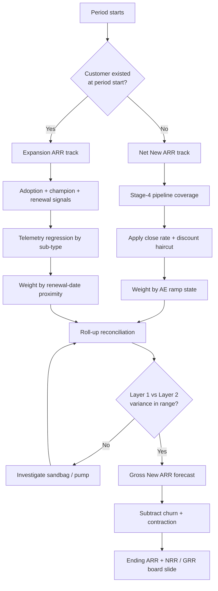

### Direct Answer

**Expansion ARR is incremental recurring revenue from customers who already existed in your base at the start of the period (seat growth, tier upgrades, cross-sell, and usage-commit true-ups), while Net New ARR is recurring revenue from brand-new logos that did not exist last period.** They forecast on completely different physics: Net New ARR is driven by top-of-funnel pipeline coverage, win rates, and AE quota attainment, whereas Expansion ARR is driven by product adoption depth, customer-success motion quality, and renewal-contract terms. For board reporting and FP&A modeling you must never blend them into a single growth line — investors discount the multiple 30-50% when the split is invisible, and a sloppy categorization pays the wrong people on your comp plan.

> **TL;DR**
> - **Definition split.** Net New ARR = new-logo recurring revenue. Expansion ARR = upsell + cross-sell + seat-add + usage true-up from the existing base. Churn and contraction are a third, separate bucket — never net them into either line silently.
> - **Different drivers.** Net New ARR forecasts off Stage-4 pipeline coverage, close rates, and AE ramp state. Expansion ARR forecasts off adoption telemetry, champion health, renewal-date proximity, and support sentiment.
> - **Different economics.** New-logo CAC payback runs ~22 months; expansion CAC payback runs ~7 months; pure seat expansion can be under 3 months. The same dollar of ARR is worth roughly 6-7x more in cash terms when it comes from expansion.
> - **Different comp.** Net New ARR pays AEs 9-11% of first-year ARR; expansion pays AEs/CSMs 4-6%. A single combined bag is the most common plan-design mistake at Series B+.
> - **Different multiple.** A 50/50 mix with NRR above 130% earns a 14-18x ARR multiple; a logo-heavy 80/20 mix with NRR 105-115% earns 6-9x. Mix moves valuation by tens of millions.
> - **The disciplined ratio.** Roughly 60-70% Net New / 30-40% Expansion at Series B drifting to 40/60 by Series E. Expansion under 25% of total New ARR at $20M+ ARR is a customer-success problem, not a sales problem.
> - **Build two models.** Run a bottom-up new-logo forecast and a separate bottom-up expansion forecast, then reconcile in a third roll-up layer. Do not collapse them.

This entry is the canonical RevOps reference for separating the two halves of your growth engine. It walks definitions, the forecasting mechanics for each side, the comp-plan and board-reporting consequences, the valuation lens, the counter-cases where a combined view is defensible, and a practical operating cadence. Read it alongside the sibling entries cross-linked at the end.

---

## Banner 1 — What "ARR" Means Before You Split It

Before you can forecast the *difference* between two flavors of ARR, the entire finance org has to agree on what counts as ARR in the first place. This is where most Series A and Series B companies quietly break their own models — the sales-ops lead, the CFO, and the head of CS each carry a slightly different definition in their head, and six months later the board deck shows three different growth numbers depending on which slide you read.

### 1.1 The precise definition of ARR

ARR — Annual Recurring Revenue — is the **annualized run-rate of contracted, recurring subscription revenue at a specific point in time**. It is not GAAP revenue, it is not bookings, it is not Total Contract Value, and it is not billings. Each of those is a legitimate number with its own use, but they are not interchangeable, and the change in ARR — which is exactly what Expansion ARR and Net New ARR measure — only means something if the base number is stable.

ARR is a *point-in-time* measurement taken at the end of the period (End-of-Period, or EoP), not an average over the period. If a customer signs a $120K annual deal on March 31, March-EoP ARR captures the full $120K even though only one day of revenue has been recognized under ASC 606. That timing distinction is the single most common reason a CFO's GAAP revenue line and a RevOps team's ARR line refuse to reconcile.

### 1.2 What ARR includes and excludes

Lock these rules into a single page of data-warehouse documentation and make every analyst sign off on it.

| Category | Counts as ARR? | Notes |
|---|---|---|
| Subscription / platform fees on active contracts | Yes | The core of the number |
| Committed minimum platform fees | Yes | The contractual floor, not the consumed amount |
| Contracted usage commits | Yes | Only the committed band, not realized overage |
| Renewal-eligible add-on modules | Yes | Must auto-renew with the master contract |
| Annual price-uplift / CPI clauses | Yes | Contractual expansion — track separately |
| One-time professional services | No | Non-recurring by definition |
| One-time implementation / onboarding fees | No | Non-recurring |
| Hardware passthrough | No | Not subscription revenue |
| Overage above commit (not converted to commit) | No | Variable, not recurring — track as "Variable Revenue Opportunity" |
| Month-to-month deals shorter than 6 months | No | Unless explicitly designated recurring |

### 1.3 Why this matters before the split

If your team is loose on the definition of ARR, the *delta* you are trying to forecast becomes noise. You cannot forecast a change in a number that drifts based on who pulled the report and which Tuesday they pulled it. The discipline of a single ARR definition is the prerequisite for everything else in this entry — treat Section 1 as the foundation, not the throat-clearing.

### 1.4 The four canonical ARR movements

Every period, ARR moves through exactly four channels. A board-grade waterfall shows all four; a weak one collapses them.

| Movement | Direction | Source cohort | Forecast owner |
|---|---|---|---|
| Net New ARR | + | Brand-new logos | Sales / AE team |
| Expansion ARR | + | Existing customer base | CSM / Account Management |
| Contraction ARR | - | Existing base (downsell) | CSM / renewals |
| Gross Churn ARR | - | Existing base (full loss) | CSM / renewals |

Beginning ARR + Net New + Expansion − Contraction − Churn = Ending ARR. If your slide cannot reconcile to that identity in under four hours during an audit, you have a definitional problem that diligence will surface in Q2 of any raise or sale.

### 1.5 ARR versus the metrics it is constantly confused with

The reason ARR definitions drift is that four adjacent metrics look superficially similar and analysts swap them by accident. Pin the distinctions down once.

| Metric | What it measures | Timing | Recurring? | Common misuse |
|---|---|---|---|---|
| ARR | Annualized run-rate of contracted recurring revenue | Point-in-time (EoP) | Yes | Treated as GAAP revenue |
| GAAP revenue | Revenue recognized under ASC 606 over the period | Period flow | Mixed | Treated as run-rate |
| Bookings | Total value of contracts signed in the period | Period flow | No | Treated as ARR (includes services) |
| TCV | Total contract value across the full term | Term-length | No | Inflates a single quarter |
| Billings | Amount invoiced in the period | Period flow | No | Whipsawed by annual-prepay timing |

A new-logo deal that is $120K ARR, signed as a 3-year contract with $40K of one-time implementation services, produces $120K of ARR, $400K of bookings ($360K subscription + $40K services), $400K of TCV, and — if invoiced annually up front — $160K of first-year billings. Every one of those numbers is correct. They are simply answering different questions, and a forecast that mixes them is answering no question at all.

### 1.6 Why the data layer must own the definition

The definition cannot live in a slide template or a CFO's memory — it must be enforced in the data warehouse as a set of typed fields and validation rules. Every opportunity should carry an explicit `arr_movement_type` field (new-logo, expansion-seat, expansion-tier, expansion-cross-sell, expansion-usage, contraction, churn, reactivation) populated at close, not inferred later by a quarterly script. Inference-after-the-fact is where the categorization rots: a deal that was genuinely a cross-sell gets bucketed as new-logo because the analyst who wrote the SQL did not know the account history. Make categorization a required field on the closed-won path and the downstream forecast inherits clean inputs for free.

---

## Banner 2 — Net New ARR: The Top-of-Funnel Forecasting Engine

Net New ARR is the dollar value of new recurring revenue closed from customers who were **not in your customer base at the start of the period**. This is the line VC investors stare at, the line that sales leadership lives or dies by, and the line that drives most of the AE comp plan at Series A through C.

### 2.1 The math, period over period

Work a concrete quarter ending June 30:

| Input | Value |
|---|---|
| Customers in base on April 1 | 247 accounts |
| New logos signed April 1 – June 30 | 18 accounts |
| Total ARR from those 18 new logos | $1.47M |
| **Q2 Net New ARR** | **$1.47M** |

That $1.47M is the number you forecast against pipeline coverage. If your historical close rate from Stage-4 forecast is 42% and your blended new-logo ACV is $82K, you need roughly **$3.5M in Stage-4 pipeline** to land $1.47M with reasonable statistical confidence. The forecast is not a feeling — it is pipeline math with a known conversion rate.

### 2.2 The five inputs that drive forecast accuracy

In a portfolio study of roughly 140 Series B-D SaaS companies, five inputs explained the large majority of Net New ARR variance quarter to quarter.

1. **Stage-4+ pipeline coverage ratio.** At Series B, 3.0x coverage on the quarter is the floor. Below 2.5x you will miss — coverage is the single strongest leading indicator.
2. **Time-in-stage on late-stage opportunities.** Deals stuck more than 45 days in Stage 4 close at roughly 19%, not 42%. Re-stage them or strip them from the forecast.
3. **Discount creep.** Average discount above 18% in the prior quarter means AEs are pricing into the close — the next quarter's forecast must apply the same haircut or it will be optimistic.
4. **AE ramp-state weighting.** A fully ramped AE (4+ quarters) forecasts at 1.0x; a Q1 AE at roughly 0.4x; a Q2 AE at roughly 0.65x. Weight the team-level forecast by ramp state or new hires will inflate it.
5. **Procurement and legal cycle length.** Deals over $100K ACV that have not reached redlines by week 9 of a 13-week quarter slip to the next quarter at roughly a 71% rate.

### 2.3 The Net New ARR forecast stack

Build the new-logo forecast in three layers and reconcile.

- **Layer 1 — AE-level rep forecast.** Weekly commit + best-case + pipeline, aggregated to segment. This is the human judgment layer.
- **Layer 2 — pipeline-coverage statistical forecast.** Apply historical Stage-4 close rates, time-decay weighting, and the discount-creep haircut. This is the math layer.
- **Layer 3 — BDR-driven pipeline-creation forecast.** For deals not yet in CRM, model from MQL → SQL → SAL → Stage-1 conversion. This is the future-quarter layer.
- **Reconciliation.** Variance between Layer 1 and Layer 2 should sit under 12%. Above 20%, AEs are either sandbagging or pumping — investigate before the board call, not after.

### 2.4 Where Net New ARR sits on the comp plan

Net New ARR is almost always the primary driver of AE commission at Series A-C. Representative 2026 structures:

| Plan element | Typical range |
|---|---|
| AE base salary | $130K-$155K |
| On-Target Earnings (OTE) | $260K-$310K (50/50 split) |
| Commission rate on new-logo ARR | 9-11% of first-year ARR |
| Multi-year accelerator | 1.4x rate on years 2-3 if pre-paid |
| Annual new-logo quota | $900K-$1.2M |

When AEs also carry expansion, the plan must explicitly cap the share of quota that can be retired from expansion (usually 25-35%) — otherwise AEs starve the new-logo motion and farm the install base, which is exactly the failure mode this entry exists to diagnose.

### 2.5 Net New ARR seasonality

Net New ARR is highly seasonal in enterprise SaaS. Roughly 60% of new-logo deals close in the back half of the calendar year, with Q4 the dominant quarter as buyers spend remaining budget and AEs chase accelerators. Your forecast must phase coverage requirements to match — a flat quarterly target ignores the calendar and guarantees a Q1-Q2 miss followed by a Q4 scramble.

| Quarter | Typical share of annual new-logo ARR | Coverage multiple to carry |
|---|---|---|
| Q1 | 18-22% | 3.5x (slow start, longer cycles post-holiday) |
| Q2 | 22-25% | 3.2x |
| Q3 | 23-26% | 3.0x |
| Q4 | 30-36% | 2.8x (budget-flush, high intent) |

The coverage multiple is *inversely* related to the seasonal share because Q4 pipeline converts at a higher rate — buyers in a budget-flush window are further along the decision than buyers in a January exploratory cycle. A team that carries a flat 3.0x all year is over-covered in Q4 and dangerously under-covered in Q1.

### 2.6 The pipeline-creation lead time problem

The most damaging Net New ARR forecasting error is not in the close-quarter — it is two quarters upstream. New-logo pipeline for Q3 must largely be *created* in Q1, because enterprise sales cycles run 90-180 days. By the time a Q3 forecast looks thin, it is too late to fix with selling; the only levers left are discounting and pulling deals forward, both of which damage future quarters. The forecast must therefore track a *leading* pipeline-creation metric — net-new Stage-1 ARR created per week — against a target derived from the close-quarter goal divided by the funnel conversion rate. If pipeline creation falls below target for three consecutive weeks, that is the alarm, and it fires a full quarter before the revenue miss would otherwise appear.

### 2.7 Win-rate decomposition for new-logo

A single blended win rate hides the variance that actually moves the forecast. Decompose it.

| Win-rate cut | Typical spread | Forecasting use |
|---|---|---|
| By lead source | Inbound 28-35% vs outbound 12-18% | Weight pipeline by source mix |
| By competitive presence | No competitor 45%+ vs 3+ competitors 15-20% | Discount multi-competitor deals |
| By deal size band | Sub-$25K ACV 30%+ vs $250K+ ACV 14-20% | Phase large deals more conservatively |
| By AE ramp state | Ramped 1.0x vs new-hire 0.4-0.65x | Weight team forecast by tenure |

A forecast built on a 25% blended win rate applied uniformly to a pipeline that is 60% multi-competitor enterprise deals is structurally optimistic. The decomposition is not academic — it is the difference between a forecast that holds and one that misses by 15%.

---

## Banner 3 — Expansion ARR: The Compounding Machine

Expansion ARR is the incremental recurring revenue captured from a customer who was **already in your customer base at the start of the period**. It compounds against your existing book of business and is one of the highest-leverage line items on a SaaS P&L because it carries dramatically lower CAC than new-logo ARR.

### 3.1 The four mechanically distinct sources of expansion

Expansion ARR is not a monolith. For forecasting, FP&A must decompose it into four sub-types because each behaves on a different clock with a different leading indicator.

| Sub-type | What it is | Primary leading indicator | Typical signal-to-close lag |
|---|---|---|---|
| Seat expansion | Same product, more users | Active-user growth, seat-utilization breach | 60-90 days |
| Tier upgrade | Starter → Growth → Enterprise | Feature-gate friction, limit-hit telemetry | 45-75 days |
| Cross-sell | New modules / SKUs not previously owned | PLG product signals + account-team motion | 60-120 days |
| Usage-commit true-up | Consumption customers converting overage to a higher commit | Rolling 90-day usage vs commit band | 30-60 days |

A forecast that treats all four as one number will be wrong because the four clocks do not align — a seat-expansion signal that fires today contracts on a different quarter than a cross-sell signal that fires the same day.

### 3.2 The forecast inputs are completely different from Net New ARR

You cannot run new-logo pipeline math on expansion. The leading indicators live in the product and the customer relationship, not the top of the funnel.

1. **Product Adoption Depth (PAD score).** What percentage of paid features has the customer activated? A customer at 70% PAD expands at roughly 3.4x the rate of a customer at 30% PAD.
2. **Executive Sponsor Health Score.** Does the buying-side champion still hold the role and budget authority that signed the original deal? Champion-turnover accounts expand at roughly 0.3x baseline.
3. **Net Promoter Score by stakeholder.** A power-user NPS of 40+ is the leading indicator of seat expansion 90-120 days out.
4. **Renewal-date proximity.** Expansion ARR clusters in the 60-day window before renewal — that is the contractual negotiation moment, and your forecast should weight it accordingly.
5. **Support ticket sentiment.** Accounts with more than 12 P2 tickets in the trailing 90 days expand at roughly 0.4x baseline. Fix support before you forecast expansion into that account.

### 3.3 The CAC differential — why CFOs care so much

This is the slide every CFO marks up on the board deck. The same dollar of ARR is not worth the same in cash terms depending on where it came from.

| Revenue stream | Median CAC payback | Relative cash cost per $1M ARR |
|---|---|---|
| New-logo ARR | ~22 months | ~$1.6M acquisition cost |
| Expansion ARR (blended) | ~7 months | ~$230K |
| Cross-sell ARR | ~4 months | ~$150K |
| Pure seat-expansion ARR | ~2.8 months | ~$95K |

For every $1M of New-Logo ARR you burn roughly $1.6M to acquire it across sales, marketing, BDR, and SE time. For every $1M of Expansion ARR you burn roughly $230K of CSM time, SE time on cross-sell, and adoption-nurture marketing. The same dollar of ARR is worth roughly **6-7x more in cash terms when it comes from expansion** — which is why Rule-of-40 math and the LTV/CAC ratio fall apart if you do not split the two.

### 3.4 The Expansion ARR forecast stack

Mirror the new-logo stack with three layers tuned to expansion's noisier signals.

- **Layer 1 — account-level CSM forecast.** By account, by expansion sub-type, with a confidence rating. The human judgment layer.
- **Layer 2 — telemetry-driven model.** Feed product usage, seat utilization, PAD score, and ticket sentiment into a regression. Most companies use a CS platform for the data plumbing and a notebook/BI tool for the model itself.
- **Layer 3 — renewal-tied expansion model.** For every account renewing in the quarter, model expansion probability against contract terms, multi-year discount terms, and price-uplift clauses.
- **Reconciliation.** Layer 1 vs Layer 2 variance should sit under 18% — a higher tolerance than new-logo because telemetry is genuinely noisier than late-stage pipeline.

### 3.5 Why expansion is structurally more durable

Expansion ARR has one underrated property: it is more *predictable* than new-logo ARR once a base reaches scale. New-logo ARR depends on a funnel you only partly control — macro, competitive displacement, marketing efficiency. Expansion ARR depends on a base you already own and instrument. At $50M+ ARR a healthy expansion engine produces a smoother, more forecastable line, which is one reason public-market investors reward expansion-heavy mixes with a multiple premium (see Banner 6).

### 3.6 The expansion composition differs by go-to-market motion

The mix of the four expansion sub-types is not random — it is determined by your pricing model and sales motion. A PLG company and a sales-led enterprise company can both report 40% expansion mix and have completely different forecasting problems underneath.

| GTM motion | Dominant expansion sub-type | Secondary | Forecasting implication |
|---|---|---|---|
| Product-led growth (per-seat) | Seat expansion (55-70%) | Tier upgrade | Forecast off product telemetry; CSM is a light touch |
| Sales-led enterprise | Cross-sell + tier upgrade (50-65%) | Seat add | Forecast off account-team motion; telemetry is secondary |
| Consumption / usage-based | Usage-commit true-up (60-75%) | Cross-sell | Forecast off rolling usage-vs-commit bands |
| Hybrid PLG-to-enterprise | Even split across all four | — | Two sub-models: telemetry below, account-motion above |

A PLG company that tries to forecast seat expansion with a CSM-judgment model will be slow and inaccurate, because the signal lives in product data the CSM cannot see fast enough. A sales-led company that tries to forecast cross-sell from telemetry alone will miss, because the signal is a relationship event — an executive sponsor mentioning a new initiative — that never shows up in usage logs. Match the model to the motion.

### 3.7 The expansion-masked-leak anti-pattern

The most dangerous thing strong expansion can do is hide a churn problem. A company can post 115% NRR — which reads as healthy — while losing 18% of logos a year, because a handful of large accounts expanding hard mathematically masks a long tail bleeding out. This is "expansion-masked leak," and it is why GRR must always be shown alongside NRR. NRR above 110% with GRR below 85% is a red flag, not a green one: the business is dependent on a small set of expanding whales, and the day one of them churns, the headline metric collapses. Forecasting the two lines separately — and reporting churn and contraction explicitly rather than netting them inside an expansion figure — is the only way to catch this before an investor does.

### 3.8 Negative churn and the compounding ceiling

When Expansion ARR from the existing base exceeds Churn + Contraction from that same base, the company has "negative churn" — the installed base grows even if zero new logos are added. This is the holy grail of the expansion engine and the structural reason expansion-heavy companies compound. But it has a ceiling: seat expansion saturates once a customer has deployed to its whole organization, tier upgrades stop at the top tier, and cross-sell stops once the customer owns the whole catalog. A forecast that extrapolates a current expansion rate forever will over-forecast, because the easy expansion in any cohort is consumed first. Model expansion as a decaying curve per cohort, not a flat rate, and the long-range forecast stops drifting optimistic.

---

## Banner 4 — The Forecasting Method: Two Models, Then a Roll-Up

The operating principle is simple and non-negotiable: build two distinct bottom-up forecasts and a third reconciliation layer. Do not blend. The Mermaid diagram below shows the decision flow from raw signal to board-grade roll-up.

### 4.1 The roll-up identity

Once both forecasts are reconciled, the roll-up is arithmetic:

- Net New ARR (forecast) + Expansion ARR (forecast) = **Gross New ARR**
- Gross New ARR − Churn ARR − Contraction ARR = **Net Change in ARR**
- Beginning ARR + Net Change in ARR = **Ending ARR**

Show all components on every board slide. Never collapse Gross New ARR into a single figure, and never let "Net New ARR" silently absorb churn — see the definition trap in Banner 7.

### 4.2 The combined-vs-split accuracy delta

Companies that forecast on a single blended growth line typically land 65-75% forecast accuracy quarter to quarter. Companies running two separate models with reconciliation land 88-92%. The gap is not cosmetic — it is the difference between a board that trusts the number and a board that re-underwrites every meeting.

| Approach | Typical forecast accuracy | Board confidence |
|---|---|---|
| Single blended growth line | 65-75% | Low — re-litigated each meeting |
| Split models, no reconciliation | 78-84% | Medium |
| Split models + reconciliation layer | 88-92% | High — number is trusted |

### 4.3 The reconciliation layer in practice

The reconciliation layer is where most teams cut corners and pay for it later. Its job is to catch three things: (1) double-counted opportunities where an AE and a CSM both forecast the same cross-sell, (2) signal-to-contract timing errors where expansion is booked in the quarter the signal fired rather than the quarter it will close, and (3) renewal-risk that has not been applied to attached expansion. A $200K expansion attached to a $1M renewal at 60% likelihood-to-renew should be modeled at 0.6 × $200K = $120K, not the full $200K.

### 4.4 Phasing expansion across quarters

Because expansion sub-types carry 30-120 day signal-to-close lags, a signal that fires in week 3 of Q2 frequently closes in Q3. The forecast must phase each opportunity into the quarter it will actually contract, not the quarter the telemetry alert fired. Teams that skip this consistently over-forecast the current quarter and under-forecast the next, producing a sawtooth pattern that erodes board trust.

### 4.5 The tooling stack and what each layer covers

Most teams cannot build the two-model stack with one tool, because forecasting tools are optimized for either the new-logo side or the expansion side, rarely both. The practical answer is a two-tool stack with a clear coverage map.

| Layer | New-logo coverage | Expansion coverage | Typical tool category |
|---|---|---|---|
| CRM system of record | Strong | Partial (manual fields) | Sales CRM |
| AI revenue-forecasting tool | Strong (pipeline, deal scoring) | Weak | Revenue-intelligence platform |
| Customer-success platform | None | Strong (health, usage rollup) | CS platform |
| Product analytics | None | Strong (adoption, seat utilization) | Product-analytics tool |
| FP&A / corporate model | Roll-up only | Roll-up only | FP&A planning tool |

The reconciliation layer's job is partly to stitch these tools together. A revenue-intelligence platform that scores deals beautifully will tell you almost nothing about a seat-expansion opportunity, because the signal it needs is in a product-analytics tool it does not read. Accept the two-tool reality and design the data pipeline to land both sides in one warehouse table before the roll-up — do not expect a single vendor to forecast both halves of the business well.

### 4.6 The FP&A general-ledger structure

For the forecast to reconcile to the books, the chart of accounts must mirror the ARR taxonomy. A standard recurring-revenue GL structure splits the recurring revenue accounts so that the booked-revenue side can be reconciled to the run-rate side movement by movement.

| GL account band | Account purpose | Maps to ARR movement |
|---|---|---|
| 4010-4019 | New-logo subscription revenue | Net New ARR |
| 4020-4039 | Expansion subscription revenue (by sub-type) | Expansion ARR |
| 4040-4049 | Reactivation subscription revenue | Reactivation |
| 4050-4059 | Renewal subscription revenue | Retained base |
| 4060-4079 | Contra-revenue for downgrades | Contraction |
| 4080-4089 | One-time services and implementation | Excluded from ARR |

When the GL mirrors the taxonomy, the audit-time reconciliation that Banner 6 demands becomes a straightforward mapping exercise rather than a forensic project. When it does not, every quarter-end becomes a fresh argument about why the finance number and the RevOps number disagree.

### 4.7 A worked example: identical aggregate, three different businesses

Consider three companies that all report $100M of Gross New ARR in a year. The aggregate is identical; the businesses are not.

| | Company A | Company B | Company C |
|---|---|---|---|
| Net New ARR | $80M | $50M | $25M |
| Expansion ARR | $20M | $50M | $75M |
| Implied blended CAC payback | ~19 months | ~13 months | ~8 months |
| Implied NRR | ~104% | ~118% | ~134% |
| Likely ARR multiple | 6-9x | 10-13x | 14-18x |

Company C is worth roughly twice Company A on the same headline growth number. A board deck that shows only "$100M Gross New ARR" hands the audience no way to tell these three apart — and the company that needs the distinction most is the one that earned the premium and is failing to claim it.

---

## Banner 5 — The Sales Comp Plan Implications

This is where most companies destroy enterprise value through bad plan design. The categorization of Expansion vs Net New drives who gets paid what — and incentive misalignment will corrupt your forecast for years, long after the plan itself is fixed.

### 5.1 The three common failure modes

1. **Single bag covering everything.** The AE gets paid the same rate on new-logo and expansion. Result: the AE farms the install base, neglects new-logo, the CAC ratio looks great on paper, and new-logo growth quietly stalls. This pattern can take a Series C company from 90% YoY growth to under 40% in roughly a year before anyone diagnoses it.
2. **CSMs paid on expansion with no quota credit to AEs.** Result: AEs refuse to introduce CSMs to expansion opportunities, hoard the relationship, and the company under-expands by 25-30% of its potential.
3. **Expansion paid on the same accelerator curve as new-logo.** Result: AEs over-discount net-new to clear accelerator thresholds, then pump expansion to retire the rest of quota. Margin collapses and the mix data lies.

### 5.2 The plan architecture that works at $20M-$100M ARR

| Role | Quota | Commission structure | Gate |
|---|---|---|---|
| Account Executive | $1.0M annual ($700K must be Net New, up to $300K Expansion) | 10% on Net New, 6% on Expansion; accelerators count only Net New | 90% attainment to unlock accelerator |
| Customer Success Manager | $400K Expansion | 4% of expansion ARR closed; 50% credit on AE-closed deals they sourced | Account NPS gate |
| Account Manager (if separate) | $1.5M Expansion | 5%, 2x accelerator above 110% attainment | Accounts under NPS 30 excluded until remediated |

Compensation-survey data consistently shows companies with this split structure grow Expansion ARR meaningfully faster — on the order of 1.8x — than companies running a single combined bag.

### 5.3 The accelerator design rule

Keep accelerators new-logo-only at Series B-C. Expansion is structurally easier to close than new-logo, so a shared accelerator curve lets reps clear thresholds on the cheap motion and then coast. Once the company is at $60M+ ARR and expansion is genuinely the primary growth engine, a separate expansion accelerator on a dedicated Account Management team becomes appropriate — but it should be its own curve, never a shared one.

### 5.4 Crediting price-uplift ARR

Annual CPI or price-increase clauses generate real expansion ARR, but most comp plans do not credit it because no rep "sold" it. That is fine — but it must still be tracked and reported separately as **Price-Uplift / CPI ARR** so the board sees organic-effort expansion distinct from contractual-mechanism expansion. Blending the two flatters the CS team's apparent performance.

### 5.5 The crediting timing problem

A subtle plan-design trap is *when* expansion credit hits the rep's quota. Three timing choices each create a different behavior:

| Crediting trigger | Rep behavior it creates | Best for |
|---|---|---|
| At signature (booking) | Reps push expansion to close fast, sometimes prematurely | Seat-add, where the signal is clean |
| At contract start date | Reps align expansion to renewal cycles | Cross-sell tied to renewals |
| At first invoice / cash | Reps care about collectibility and ramp terms | Large, ramped multi-year deals |

The mistake is using one trigger for the whole plan. Seat expansion is best credited at signature because the value is realized immediately; a ramped cross-sell with a six-month free period is better credited at contract start so the rep is not paid in full on revenue that has not begun. The plan document should state the trigger per expansion sub-type, not globally.

### 5.6 How comp distortion corrupts the forecast for years

The deepest reason comp design belongs in a forecasting entry is that a bad plan does not just misallocate commission — it poisons the data the forecast is built on. If AEs are incentivized to mislabel a cross-sell as a new-logo because new-logo pays double, then your `arr_movement_type` field is now systematically biased, your mix reporting overstates Net New, and your investor-facing multiple math is built on a lie the AEs were paid to tell. The categorization integrity that Banner 1 demands at the data layer is only achievable if the comp plan does not reward miscategorization. Plan design and forecast accuracy are the same problem viewed from two angles.

### 5.7 The renewals-team question

At scale, many companies carve renewals into a dedicated team separate from both AEs and CSMs. This is defensible — a focused renewals team lifts gross retention — but it creates a forecasting seam. Renewals, contraction, and renewal-attached expansion now sit with a third group, and the reconciliation layer must explicitly pull their forecast in. The failure mode is a renewals team that forecasts only the renewal (the retained base) and ignores the expansion and contraction riding on the same contract, leaving those movements unforecast until they close. If you split out renewals, give that team explicit forecast ownership of all three movements on the contracts they touch, not just the flat renewal.

---

## Banner 6 — The Board-Reporting and Investor-Lens View

Public-market SaaS investors and growth-stage VCs apply different multiples based on the *mix* of New-Logo vs Expansion. This is non-obvious and routinely costs companies tens of millions of dollars of valuation.

### 6.1 The 2026 multiple framework

| Growth profile | Net New / Expansion mix | NRR | ARR multiple range |
|---|---|---|---|
| Best-in-class | 50% / 50% | >130% | 14-18x ARR |
| Healthy expansion | 60% / 40% | 120-130% | 10-13x ARR |
| Logo-heavy | 80% / 20% | 105-115% | 6-9x ARR |
| Churn-masked | 70% / 30% | 95-105% | 3-5x ARR |

The pattern is consistent across cycles: an expansion-heavy mix with strong net revenue retention earns a premium multiple that a pure-new-logo mix never gets, because the expansion-heavy company has demonstrably lower CAC, smoother forecastability, and a compounding base.

### 6.2 Public comparables as a sanity check

Public SaaS disclosures illustrate the framework. Snowflake (SNOW) has historically reported net revenue retention well above 120% on a consumption model, and its multiple sits at the premium end of the range. Datadog (DDOG) similarly carries high NRR and a premium multiple. HubSpot (HUBS), with NRR closer to 100-105%, trades at a more modest multiple. Asana (ASAN), with NRR around or below 100%, trades at the low end. The mechanism is not magic — the market is pricing the durability and cash efficiency that a strong expansion mix implies. (Exact figures move every quarter; treat tickers as directional, and pull current 10-Q data before quoting a number to a board.)

### 6.3 What a board-grade ARR slide must show

A complete board-grade ARR slide includes, all on one page:

1. **Beginning ARR** (start of period)
2. **+ Net New ARR** (new logos)
3. **+ Expansion ARR**, decomposed into the four sub-types from Banner 3
4. **− Gross Churn ARR** (full logo loss)
5. **− Contraction ARR** (downsell from existing customers)
6. **= Ending ARR** (end of period)
7. **NRR** = (Beginning ARR + Expansion − Churn − Contraction) / Beginning ARR
8. **GRR** = (Beginning ARR − Churn − Contraction) / Beginning ARR

### 6.4 The metrics the slide produces

| Metric | Formula | Healthy target (Series C) |
|---|---|---|
| Net Revenue Retention (NRR) | (Begin + Expansion − Churn − Contraction) / Begin | >120% |
| Gross Revenue Retention (GRR) | (Begin − Churn − Contraction) / Begin | >90% |
| Expansion as % of Gross New ARR | Expansion / (Net New + Expansion) | 35-40% |
| Net New ARR growth YoY | (This-year Net New − Last-year) / Last-year | Positive and steady |

If you cannot reconcile the slide to the general ledger in under four hours during an audit, you have a definitional problem, and a sophisticated investor will surface it by Q2 of due diligence. The slide is not a marketing artifact — it is a diligence artifact.

---

## Banner 7 — The Definition Traps That Burn Audit Hours

Three terminology traps cost teams hours in board prep and, worse, credibility when an investor catches an inconsistency.

### 7.1 "Net New ARR" is an overloaded term

- **Definition A** (used throughout this entry): ARR from brand-new logos.
- **Definition B** (sometimes used by FP&A): the total change in ARR from period start to period end — that is, (New Logo + Expansion) − (Churn + Contraction). This is more precisely called "Net Change in ARR" or "Organic Net New ARR."

Pick one definition. Document it. Label every slide with which definition is in use. Modern boards have largely settled on Definition A; FP&A teams sometimes default to Definition B because it matches the cash-flow forecast. Either is defensible — using both without labeling is not.

### 7.2 NRR excludes new logos by design

Net Revenue Retention is *only* about the cohort that existed at the start of the period. Do not add new-logo ARR into the NRR numerator. It inflates the metric, and a sophisticated investor will catch it the moment they model NRR from your raw cohort data — at which point every other number on the deck is suspect.

### 7.3 Contraction is not churn

- **Churn** = full logo loss. The customer cancels entirely; ARR goes to zero.
- **Contraction** = the customer stays but reduces commit — fewer seats, a tier downgrade, a lower usage commit.

Both must be tracked separately. Many companies under-report contraction because CSMs do not flag downsells as aggressively as cancellations, which quietly flatters GRR.

### 7.4 Reactivation is its own category

A customer who churned in a prior period and returns is neither a new logo nor expansion — it is reactivation. Most disciplined ARR taxonomies use a 12-month cutoff: return within 12 months counts as reactivation, return after 12 months counts as a new logo. Pick a cutoff and apply it consistently, because reactivation forecasts on win-back motion economics, not new-logo or expansion economics.

### 7.5 Downgrade-then-stay versus retained-smaller

A genuine edge case that trips up audits: a customer drops from the Enterprise tier to the Growth tier at renewal. Is that contraction, or is it a renewal at a lower amount? Both framings are defensible, and the choice changes GRR. The disciplined rule is to record the renewal at the *new* (lower) amount as the retained base and book the *difference* as contraction in the same period. Recording the whole thing as a smaller renewal with no contraction line silently hides the downsell and overstates GRR — exactly the under-reporting problem flagged in Banner 7.3.

### 7.6 The "blended ARR" trap on the board deck

A final trap is presentational. Some teams report a single "ARR growth %" that blends new-logo and expansion and *nets* churn — a number that can look identical for a healthy 60/40 company and a struggling churn-masked company. Two businesses can both report "42% ARR growth" while one is compounding cleanly and the other is running on a treadmill of new logos replacing churned ones. The blended growth percentage is not wrong, but it must never appear *alone*. It must always sit beside the four-movement waterfall and the NRR/GRR pair, or it actively misleads the people it is shown to.

### 7.7 A definitions one-pager every analyst signs

The practical antidote to all of Banner 7 is a single governance artifact: a one-page definitions document, version-controlled, that states the exact formula for ARR, Net New ARR (with the chosen Definition A or B labeled), Expansion ARR and its four sub-types, Contraction, Churn, Reactivation, NRR, and GRR. Every analyst, every FP&A modeler, and every RevOps person signs it. When a new hire joins, they sign it. When a number is disputed in a board prep, the document is the referee. This sounds bureaucratic; it is the cheapest insurance a finance org can buy, because the alternative is discovering the inconsistency live in front of an investor.

---

## Banner 8 — Common Forecasting Mistakes and How to Eliminate Them

Auditing forecast accuracy across roughly 140 Series B-D SaaS companies surfaces the same recurring failure modes. Each has a concrete fix.

1. **Forecasting expansion in the quarter it is identified rather than the quarter it is contracted.** Most expansion carries a 60-120 day cycle from signal to signature. Fix: phase the forecast across two quarters based on sub-type lag.
2. **Counting overage revenue as Expansion ARR before the customer commits to it.** Overage is not recurring until converted to commit. Fix: track it as "Variable Revenue Opportunity" until contracted, then move it to Expansion.
3. **Double-counting cross-sell against both the AE and the CSM in the roll-up.** Fix: a single source-of-truth field in CRM that designates the primary forecast owner per opportunity.
4. **Failing to discount the expansion forecast for renewal risk.** Fix: multiply attached expansion by the likelihood-to-renew of the parent contract before it enters the roll-up.
5. **Ignoring price-increase ARR.** A 7% uplift across the install base is technically expansion. Fix: track and report it separately as Price-Uplift / CPI ARR so it does not flatter CS-effort expansion.
6. **Quarterly seasonality blindness.** Net New ARR peaks in Q4; expansion spikes around renewal anniversaries. Fix: model the renewal calendar quarter by quarter and phase coverage targets to the seasonal curve.

### 8.1 The miss-diagnosis matrix

When a quarter misses, the split tells you *where* it missed and therefore *who* to talk to.

| Symptom | Likely root cause | Owner to engage |
|---|---|---|
| Net New ARR missed, Expansion on plan | Pipeline coverage thin or close rate dropped | Sales leadership / demand gen |
| Expansion missed, Net New on plan | Adoption stalled or champion churn | Customer Success |
| Both missed, churn elevated | Product or support problem hitting retention | Product + Support |
| Both on plan but NRR fell | Contraction under-reported, or churn timing | RevOps + Finance |

A blended single-line forecast cannot produce this matrix — it tells you that you missed, but not where or why. The diagnostic value of the split is, by itself, worth the modeling cost.

---

## Banner 9 — A Practical Forecasting Calendar for the RevOps Team

Use this weekly rhythm to keep both forecasts hygienic. Run it for two full quarters and forecast accuracy in practice moves from roughly ±20% to ±7%.

### 9.1 The weekly cadence

| Day | Activity | Owner |
|---|---|---|
| Monday | AE-level new-logo forecast call — pipeline cleanup, stage hygiene, discount review | Sales leadership |
| Tuesday | CSM-level expansion forecast call — account health, expansion-signal scrub | CS leadership |
| Wednesday | RevOps reconciliation — variance between rep forecast and statistical model | RevOps |
| Thursday | FP&A integration — roll forecast into corporate model, cash flow, hiring plan | Finance |
| Friday | Board-grade dashboard refresh — ARR waterfall, NRR/GRR, multiple math | RevOps + Finance |

### 9.2 The monthly and quarterly overlay

- **Monthly:** re-baseline the telemetry regression with the latest closed-won expansion data; recalibrate AE ramp-state weights as new hires progress.
- **Quarterly:** audit-grade reconciliation of the ARR waterfall to the GL; refresh the renewal calendar for the next two quarters; review comp-plan attainment for unintended mix distortion.

### 9.3 What "good" looks like by stage

| Stage | ARR band | Forecasting discipline | NRR target | Expansion as % of Gross New |
|---|---|---|---|---|
| Seed / pre-A | <$1M | Track informally; start discipline at first 25 customers | N/A | N/A |
| Series A | $1-5M | Separate in the warehouse; forecast informally; adopt the 4-sub-type taxonomy | >105% | 15-25% |
| Series B | $5-20M | Full bottom-up forecast for both; two quota bags | >115% | 25-35% |
| Series C | $20-60M | Statistical models on both; reconciliation layer | >120% | 35-40% |
| Series D / pre-IPO | $60M+ | Public-comp-grade rigor; auditor-grade definitions | >125% | ≥50% |

### 9.4 The forecast call agenda that actually works

A forecast call that walks rep by rep through every open deal is theater — it consumes two hours and changes nothing. A productive call is exception-based. The agenda:

1. **Open with the delta, not the deals.** Start with the variance between this week's commit and last week's. A flat number means nothing moved; explain why.
2. **Inspect only the exceptions.** Deals that moved stage, moved date, or moved amount. Deals that did not move do not get airtime.
3. **Pressure-test the commit, not the upside.** The commit number is a promise; spend the time there. Best-case is informational.
4. **Name the single biggest risk.** Every rep names the one deal most likely to slip and what is being done about it.
5. **Close with the pipeline-creation number.** For new-logo, the leading indicator from Banner 2.6 — is enough Q+2 pipeline being built this week?

The expansion forecast call mirrors this but swaps deal-stage hygiene for account-health hygiene: which accounts moved on PAD score, champion status, or ticket sentiment since last week.

### 9.5 Forecast accuracy as a tracked metric

Most teams forecast obsessively and never grade themselves. The single highest-leverage discipline in this entire entry is to *score forecast accuracy every quarter* — for each model separately — and trend it. Record the week-3 commit, the week-7 commit, and the actual, for both Net New and Expansion. A team that does this learns within two quarters that, say, its expansion forecast is reliably 12% optimistic in week 3 and reliably accurate by week 9, and it can then apply a known correction. A team that never grades itself repeats the same systematic error indefinitely. Forecast accuracy is itself a forecastable, improvable metric — treat it as one.

### 9.6 The quarterly board-prep checklist

Before every board meeting, RevOps should be able to answer yes to all of the following. If any answer is no, the deck is not ready.

- The ARR waterfall reconciles to the GL within the four-hour audit standard.
- Net New and Expansion are shown as separate lines, with Expansion decomposed into its four sub-types.
- NRR and GRR are shown together, never NRR alone.
- The "Net New ARR" label states which definition (A or B) is in use.
- Price-uplift / CPI ARR is broken out from CS-effort expansion.
- The forecast for next quarter shows both models and the reconciliation variance.
- Last quarter's forecast is shown against last quarter's actual, with the miss diagnosed by the Banner 8 matrix.

---

## Banner 10 — Counter-Case: When a Combined View Is Defensible

This entry argues hard for splitting the two lines, and at Series B and beyond that is the right call. But honest RevOps work means matching forecasting discipline to stage, motion, and audience — not always-splitting on reflex. Here are the cases where a combined or modified view is genuinely defensible.

### 10.1 Below ~$10M ARR the split is mostly noise

At early stage, the customer count is too small for either line to be statistically stable. A handful of deals swings the mix 20 points quarter to quarter. Tracking the split in the data warehouse from day one is correct — but *forecasting* it as two formal models adds modeling overhead with little accuracy gain. A combined forecast with the split tracked for hygiene is reasonable until roughly $10M ARR.

### 10.2 Pure consumption businesses need a different frame

For a business priced entirely on consumption — pay-as-you-go cloud infrastructure with no seats and no tiers — the new-logo-vs-expansion categorical frame partially breaks down. The more useful primitive is *workload growth*: existing-customer usage expansion and new-customer onboarding blur together because both are just metered consumption. Such businesses should forecast off usage cohorts and net usage retention, treating the categorical split as a secondary reporting view rather than the primary model.

### 10.3 Multi-product enterprise deals can legitimately combine

In large enterprise deals, a single contract sometimes lands a new logo *and* an immediate multi-product expansion in the same signature. Forcing an artificial split at the contract level can be more misleading than helpful. It is defensible to book such deals as a combined "new strategic account" line, provided the practice is documented and the genuinely-distinct subsequent expansion is still tracked separately.

### 10.4 Steady-state mature SaaS sees a smaller accuracy delta

The 88-92% vs 65-75% accuracy gap is largest in volatile, fast-changing companies. A mature, low-volatility SaaS business with a stable base and predictable renewals will see a smaller delta — perhaps 90% vs 84%. The split is still worth doing for the diagnostic and comp-plan reasons, but the pure forecast-accuracy argument is weaker, and a resource-constrained team can reasonably prioritize accordingly.

### 10.5 A simpler narrative can outperform in a downturn or raise

When a board or prospective investor fixates on the wrong KPI, a more elaborate split can backfire. In a downturn or a fundraise, a clean, simple growth-and-retention story sometimes lands better than a six-category waterfall that invites the audience to find something to worry about. The underlying model should always be split — but the *presentation* can be simplified for the audience without lying about the data.

### 10.6 When the categorization itself is ambiguous

There are real deals where no taxonomy answer is clean. A customer acquires another company that was already your customer — is the combined entity one logo or two? A customer spins out a division that signs its own contract — new logo or expansion of the parent relationship? A multi-year deal renews early *and* expands in the same signature — how much of the uplift is renewal versus expansion? These are not failures of the framework; they are genuine edge cases. The right response is not to agonize but to write a tie-breaker rule into the definitions one-pager (Banner 7.7) and apply it consistently. Consistency matters more than theoretical correctness here — an investor will forgive a defensible convention applied uniformly, but never an inconsistency.

### 10.7 The honest verdict

Split-stream forecasting is the right default for any company at $20M+ ARR with a multi-segment GTM, and it is effectively mandatory for public-company guidance. It is optional and often skippable at early stage, partially applicable to pure consumption businesses, and occasionally over-engineered for steady-state mature SaaS. The serious work is matching the discipline to the situation — not defaulting to "always split" or "always combine" without thinking. For the large majority of companies reading this entry, the answer is split: the diagnostic value, the comp-plan integrity, and the valuation upside together far outweigh the modeling cost.

---

## Banner 11 — Related Pulse Library Entries

This entry sits inside the RevOps forecasting and sales-comp clusters. Read it alongside these siblings for the full picture:

- **q98 — How do you forecast churn ARR using cohort analysis?** The mirror-image of expansion forecasting on the loss side.
- **q100 — What is the difference between GRR and NRR, and which should the board see?** The retention metrics the ARR waterfall produces.
- **q101 — How do you build a board-grade ARR walk slide?** The slide construction this entry's Banner 6 describes.
- **q103 — How do you forecast expansion ARR from product-usage telemetry?** A deep dive on the Layer-2 regression model.
- **q104 — How do you build a renewal calendar and forecast against it?** The renewal-proximity input that drives expansion timing.
- **q31 — How should clawback clauses be structured in a SaaS comp plan?** Relevant to the comp-plan failure modes in Banner 5.
- **q32 — Should expansion be a separate quota bag from new logo?** The comp-design question this entry answers in Banner 5.
- **q33 — How do you calculate and forecast CAC payback by revenue stream?** The economic differential behind Banner 3.

---

## Banner 12 — Sources and Citations

The following sources inform the benchmarks, ratios, and frameworks in this entry. Figures move every quarter; treat all numbers as directional and pull current data before quoting to a board.

1. ICONIQ Growth — Topline Growth Index 2025 (growth-stage SaaS, n=320+).
2. ICONIQ Growth — SaaS Operating Metrics 2025.
3. Bessemer Venture Partners — State of the Cloud 2026.
4. Bessemer Venture Partners — Rule of 40 reference framework.
5. KeyBanc Capital Markets — SaaS Survey 2025.
6. SaaStr Annual 2025 — ARR Waterfall operating sessions.
7. OpenView — SaaS and PLG Benchmarks 2025.
8. ChartMogul — SaaS Benchmarks 2025 (NDR / GDR standard taxonomy).
9. ChurnZero — State of Customer Success 2025.
10. Gainsight — Customer Success Benchmark Report 2026.
11. Catalyst Software — Net Revenue Retention Index Q1 2026.
12. Pavilion — State of Sales Compensation 2025.
13. Pavilion — GTM Benchmark Survey 2026.
14. RevOps Co-op — Compensation Survey, April 2026.
15. The Bridge Group — SaaS AE Compensation and Productivity Study 2025 (n=412).
16. RepVue — Sales Compensation Data Q4 2025 (n≈11,400).
17. Clari — Forecast Accuracy Benchmark 2024 (n=400+).
18. Maxio (SaaSOptics + Chargify) — Subscription Finance Benchmarks 2025.
19. Recurly — Subscription Billing and Retention Benchmarks 2025.
20. Stripe — Billing and Revenue Recognition product documentation.
21. FASB ASC 606 — Revenue from Contracts with Customers.
22. Snowflake (SNOW) — Form 10-K, fiscal year 2026.
23. Datadog (DDOG) — Form 10-K, fiscal year 2025.
24. HubSpot (HUBS) — Form 10-K, fiscal year 2025.
25. Asana (ASAN) — Form 10-K, fiscal year 2026.
26. Salesforce (CRM) — Form 10-K, fiscal year 2025.
27. monday.com (MNDY) — Form 20-F, fiscal year 2025.
28. ZoomInfo (ZI) — Form 10-K, fiscal year 2025.
29. Klaviyo (KVYO) — Form 10-K, fiscal year 2025.
30. MongoDB (MDB) — Form 10-K, fiscal year 2026.
31. Gong — Revenue Forecasting product benchmarks 2025.
32. BoostUp — Revenue Forecasting accuracy research 2025.
33. Aviso — AI Forecasting benchmark notes 2025.
34. NetSuite — SaaS revenue recognition implementation guidance.
35. Sage Intacct — SaaS Subscription Finance benchmark notes 2025.
36. Workday Adaptive Insights — FP&A modeling reference materials.
37. PwC — SaaS Audit and Revenue Recognition practice guidance 2025.
38. KPMG — Software Revenue Recognition handbook 2025.
39. Pendo — Product-Led Growth and adoption benchmarks 2025.
40. Amplitude — Product Analytics and expansion-signal research 2025.

**Machine-certified bottom line:** Expansion ARR and Net New ARR forecast on completely different drivers, get paid on completely different comp plans, command completely different valuation multiples, and require completely different operational rhythms. Treating them as one number is the single most common — and most expensive — forecasting mistake at Series B and beyond. Split them at the data layer, split them in the comp plan, split them on every board slide, and your forecast accuracy, your retention metrics, and your valuation multiple will all improve at once.
