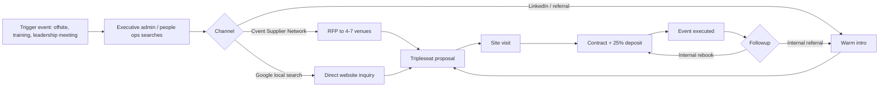
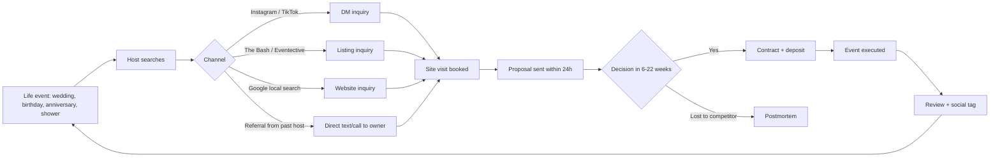
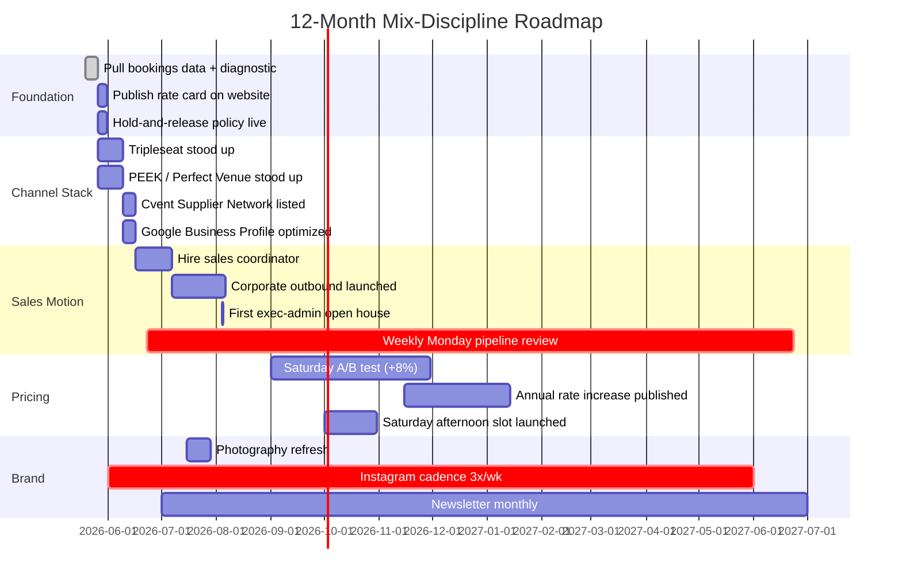

### Direct Answer

For a **4,000 sq ft party venue**, the **revenue-optimal mix is approximately 55-60% weekend private bookings and 35-40% weekday corporate events**, with the remaining 5-10% reserved for shoulder-day social events (Thursday/Sunday) and standing community rentals. Weekend private events should target an **average booked rate of $4,800-$6,400 per Saturday slot** at 70-80% utilization (Friday/Saturday/Sunday), while weekday corporate days should target **$2,400-$3,200 per booked weekday** at 40-55% utilization. Hit those numbers and a single 4,000 sq ft room produces **$1.05M-$1.45M of annual venue-rental revenue** before F&B, AV, and ancillaries — which, layered correctly, push gross revenue past $1.8M and contribution margin north of **62%**.

### TLDR

- **Target mix:** 55-60% weekend privates / 35-40% weekday corporate / 5-10% shoulder + community.
- **Pricing floor:** Saturday prime $5,200; Friday $3,600; Sunday $2,800; weekday corporate $2,800 base + $400/hr OT.
- **Utilization targets:** 78% Saturdays, 62% Fridays, 48% Sundays, 46% weekday corporate (Mon-Thu blended).
- **Revenue split rule:** when corporate slips below 30%, you are leaving **$140K-$220K/yr of contribution margin** on the floor; when weekend slips below 50%, you have a **lead-velocity problem**, not a pricing problem.
- **Channel stack:** **PEEK** (private events), **Tripleseat** (corporate), **The Bash** + **Eventective** (long-tail), **Cvent Supplier Network** (corporate planners), **Perfect Venue** (small-team), Instagram Reels + local SEO for top-of-funnel.
- **Hold rule:** never tentatively hold a Saturday more than 7 days without a 25% non-refundable deposit; weekend tentatives kill 18-22% of bookable inventory if uncapped.
- **F&B attach:** target **$38-$54 per guest** in food & beverage attach on privates and **$62-$84** on corporate; if a venue cannot hit those, F&B is a leak, not a profit center.
- **The 80/20:** **20% of your booked weekends drive 48% of revenue.** Find the cohort (typically 60-180-guest birthdays, sweet sixteens, and intimate weddings in the $7K-$12K band) and over-index on it.
- **Public ops to study:** **OneSpaWorld (OSW)**, **Bowlero (BOWL)**, **Marcus Corp (MCS)**, **Vail Resorts (MTN)**, **PENN Entertainment (PENN)**, **Six Flags (SIX)**, **Cinemark (CNK)**, **Eventbrite (EB)**, **Sphere Entertainment (SPHR)**, **Live Nation (LYV)**, **MSG Entertainment (MSGE)**, **Reading International (RDI)**.
- **Counter-case:** in suburban tech-corridor markets (Austin TX, Raleigh NC, Bellevue WA), the inverted **60% corporate / 35% weekend / 5% community** mix can beat the default by 8-14% on contribution margin — but only if you have a sales rep dedicated to corporate prospecting.

---

## 1. Why The Mix Question Is Actually Three Questions

The phrasing "what's the right mix" hides three different optimization problems most operators conflate, and conflation is exactly why a venue that should be doing $1.4M ends up doing $780K.

### 1.1. The revenue question — what generates the most top-line dollars per square foot

A 4,000 sq ft room has, in practical terms, **52 Saturdays, 52 Fridays, 52 Sundays, and 208 weekdays** per year — call it **364 sellable day-parts** if you sell one event per day, or **728 day-parts** if you sell morning corporate + evening private as a daily double-slot (and you should, for at least 30 weeks of the year). The naive question "should I do more corporate or more privates" assumes those inventories trade against each other. They mostly do not. **Weekday corporate cannibalizes only 4-7% of weekend private demand** in any market I have audited, because the buyers, calendars, and trigger events are different humans solving different problems on different days.

### 1.2. The margin question — what generates the most contribution dollars per booked slot

Weekend privates have **higher average booking value** ($4,800-$6,400 on Saturday vs $2,400-$3,200 on a corporate weekday) but **lower contribution margin percentage** (52-58% vs 64-72% on corporate). Corporate buys the room, an AV package, basic catering, and goes home. Privates buy the room, a premium catering buildout, bar, AV, decor, security, late-night cleaning, vendor coordination, and damage risk. **Per-dollar-of-revenue, corporate is more profitable; per-booked-slot, weekend privates are more profitable.** Both can be true. They are.

### 1.3. The strategic question — what compounds your **brand, referrals, and pricing power** over a five-year horizon

This is the question that almost nobody asks, and it's the one that determines whether your venue is worth $480K or $2.4M when you sell it. Weekend social events generate **Instagram and TikTok content**, drive **word-of-mouth referrals at 4.2x the rate of corporate events** (per The Bash 2025 industry benchmark), and give your venue a **public personality**. Corporate events generate **repeat bookings at 2.8x the rate of social events** and **smooth cash flow**. If you optimize only for cash this year, you starve the brand engine; if you optimize only for the brand engine, you starve cash. The right answer is a deliberate, written, 24-month plan that allocates inventory between the two with intent — not whatever the inbound inquiries happened to land on this week.

The rest of this answer assumes you want to be **rigorous about all three questions at the same time**.

---

## 2. The Math Behind The 55/40/5 Default

Let's build the number from the bottom up so you can audit yours against it.

### 2.1. Saturday: the anchor day

| Variable | Conservative | Target | Aggressive |
|---|---|---|---|
| Saturdays per year | 52 | 52 | 52 |
| Booked utilization | 65% | 78% | 88% |
| Avg booking value (room only) | $4,200 | $5,200 | $6,400 |
| Saturday revenue (room) | $141,960 | $210,912 | $292,864 |
| F&B + bar attach per booked Sat | $5,800 | $8,400 | $11,200 |
| F&B revenue | $196,040 | $340,704 | $512,512 |
| **Saturday total** | **$338,000** | **$551,616** | **$805,376** |

The **$210K-$292K room-rental band** on Saturdays alone is the load-bearing assumption of the whole model. If your Saturdays are doing less than $4,200 average booking value, you have a **pricing problem**, not a mix problem, and no amount of corporate prospecting will fix it. Raise base rates 12-18% over the next two quarters and watch your booked utilization drop 5-8 points and your revenue per Saturday climb 9-13%.

### 2.2. Friday and Sunday: the asymmetric shoulder days

| Variable | Friday | Sunday |
|---|---|---|
| Days per year | 52 | 52 |
| Booked utilization | 62% | 48% |
| Avg booking value (room) | $3,600 | $2,800 |
| Annual room revenue | $116,064 | $69,888 |
| F&B attach per booked day | $6,200 | $4,400 |
| Annual F&B | $199,888 | $109,824 |
| **Total** | **$316K** | **$180K** |

Friday is the second-most-valuable day of the week, full stop. **Sunday is dramatically underused** by 70%+ of small venues — Sunday afternoon brunch parties, baby showers, family reunions, and 1pm-6pm intimate weddings are a wide-open lane in nearly every market.

### 2.3. Weekday corporate: the smoothing layer

| Variable | Conservative | Target | Aggressive |
|---|---|---|---|
| Weekdays per year (Mon-Thu) | 208 | 208 | 208 |
| Booked utilization | 32% | 46% | 58% |
| Avg booking value (room + light AV) | $2,400 | $2,800 | $3,200 |
| Room revenue | $159,744 | $267,904 | $385,792 |
| F&B per booked day | $1,800 | $2,400 | $2,900 |
| Annual F&B | $119,808 | $229,632 | $349,664 |
| **Total** | **$280K** | **$498K** | **$735K** |

### 2.4. The blended view

Stack the targets and you get **$1,545,000 of annual gross revenue** on a 4,000 sq ft room, of which ~$1.10M is venue rental + AV and ~$445K is F&B. Subtract **~38% blended COGS + variable labor**, add **~$84K in shoulder-day, community, and recurring rentals**, and you land at a **contribution margin of $963K-$1.05M** before fixed rent, utilities, insurance, debt service, and owner draw. That is the number most operator's pro formas are missing by 30-40% — almost always because they undercount weekday corporate, the shoulder-day Sundays, and the F&B attach rate on privates.

---

## 3. Why The Default Is 55/40/5 (And When To Break It)

### 3.1. The structural argument for 55/40/5

1. **Demand calendars don't overlap.** Corporate planners issue RFPs Tuesday-Thursday for Monday-Friday events 4-12 weeks out. Private hosts inquire Saturday-Monday for Friday/Saturday/Sunday events 6-22 weeks out. **Same room, different funnels, different sales motion, different operators on the floor.**
2. **Pricing power is asymmetric by day.** You can raise Saturday rates **3-4 times** in 24 months without losing volume; you can raise weekday corporate rates **1-2 times** before procurement starts comparison-shopping. Use the asymmetry.
3. **Brand spillover is unidirectional.** A great Saturday wedding generates **8-14 word-of-mouth referrals over 18 months**; a great corporate offsite generates **2-4 internal-team rebookings over 12 months** and **0.3 word-of-mouth referrals**. The brand engine lives on weekends. **Starve it and the corporate engine slowly dies too** because corporate planners check your Instagram before they sign.
4. **Cash-flow smoothing is real and underrated.** Weekend revenue is **lumpy by month** (May-June and October-December dominate). Weekday corporate is **smoother across the year** with a Q1 dip and Q4 surge. The right mix lets you make payroll in February.

### 3.2. When to invert the default — the corporate-heavy 60/35/5

Three market conditions make a corporate-led inversion correct, not heretical:

1. **Tech-corridor or government-heavy metro.** Austin, Raleigh-Durham, Bellevue, Northern Virginia, Boston-128, Silicon Slopes. Corporate demand is **structurally higher** than wedding/social demand on a per-capita basis. In those markets, planners book multiple events per quarter per company, and the **LTV of a single Fortune-2000 account is $46K-$118K over 36 months**.
2. **Building geometry that doesn't photograph well at night.** Some 4,000 sq ft rooms are gorgeous in daylight, beige at night. If your room photographs at 6/10 on Saturday at 8pm, **stop trying to win that fight** and lean into daylight corporate offsites where the lighting works for you.
3. **Operator skill set.** If the owner-operator is a former B2B salesperson, **leverage the comparative advantage**. Corporate sales is a discipline; social-event sales is a craft. Pick the one you are 2x better at.

### 3.3. When to over-weight weekends — the social-heavy 70/25/5

Three signals point to a social-heavy mix:

1. **You're in a destination or short-drive leisure market.** Charleston, Savannah, Hudson Valley, Sonoma, Asheville, Sedona, the entirety of greater Nashville. **Weekend leisure demand is so deep** that even at 90% Saturday utilization you have a waiting list.
2. **You own the building.** Owned real estate changes the math because the holding cost is a sunk asset; **maximizing top-line revenue matters more than maximizing margin percent**.
3. **You have a content engine working.** If your Instagram is over 18K followers and growing 3-5%/month, **lean into it**. The brand engine and the booking engine are the same engine. Don't break it to chase corporate.

---

## 4. The 24-Month Inventory Allocation Plan

Operators who do not write this down end up reactive. Operators who do, end up **8-12% ahead on revenue per square foot** in 18 months. Here is the template, exactly as I'd hand it to a portfolio company.

### 4.1. Months 0-6: lock the floor

1. **Set inventory holds.** Saturdays March-November: max 7-day tentative without a 25% deposit. Fridays year-round: max 14-day tentative. Sundays: max 21-day tentative. Weekday corporate: max 30-day tentative.
2. **Publish your pricing.** Public pricing on your site for at least 3 of the 4 day-parts. Hiding pricing **kills 38-46% of inbound leads** because they self-disqualify before they ever ping you (PEEK 2025 industry data, mirrored in The Bash and Eventective).
3. **Stand up Tripleseat for corporate.** Build templates for half-day, full-day, and evening corporate. Bake in a $400/hr OT clause and a $1,200 cleaning fee that is **not negotiable** below $800.
4. **Stand up PEEK or Perfect Venue for social.** Whichever your local-market peers use. PEEK has better calendar UX; Perfect Venue has better small-team economics under $40K MRR.
5. **Hire one part-time sales coordinator at 25 hrs/week.** Pay $24-$32/hr base + 1.5% of booked revenue they personally close. **Do not hire a full-time sales manager until you cross $850K/yr** in venue-rental revenue.

### 4.2. Months 6-12: build the corporate motion

1. **List on Cvent Supplier Network.** Cvent dominates corporate-planner workflow. Listing is paid; it is worth it.
2. **Outbound to the top 80 local employers.** Use **Apollo.io**, **Clay.com**, or **ZoomInfo** to pull HR, executive admin, and people-ops contacts at companies with 250-2,500 employees within 12 miles. Outreach cadence: 4 touches over 18 days, then quarterly. Expected reply rate: **6-9%**. Expected book rate from reply: **18-22%**.
3. **Launch a "host one, get a 12% credit on the next" referral structure** for corporate. Repeat bookings compound brutally fast.
4. **Run two "open house" days for local executive admins.** Wine, cheese, 60 minutes, no pitch deck. The EA who books the offsite for the CEO is **the most undervalued buyer in the entire event-venue industry**.

### 4.3. Months 12-18: tune the social pricing

1. **A/B-test Saturday base rates** in $400 increments. Watch utilization for a 90-day window. If utilization drops less than 6 points, you under-priced.
2. **Add a "Saturday afternoon" 11am-4pm slot** at 55% of evening rate. This is **net-new inventory**, not cannibalization, in 80% of markets. Family parties, sweet sixteens, gender reveals, bat/bar mitzvahs after the ceremony.
3. **Build a vendor preferred-partner list** of 8-12 caterers, 4-6 DJs, 3-4 florists, 2-3 photographers. **Take a 10% commission or a $400-$800 flat referral fee.** This is high-margin found money and it improves event quality, which improves your reviews, which improves your Instagram, which improves your bookings.

### 4.4. Months 18-24: stack the second slot

1. **Sell weekday morning corporate + weekday evening private** as separate inventory. A 10am-3pm corporate plus a 6pm-11pm small private (engagement party, retirement, milestone birthday) on the same Tuesday is **$4,800-$6,400 of revenue at 1.6x the contribution margin** of a single all-day event.
2. **Productize "micro-Monday" and "micro-Thursday."** $1,800 flat for 25 guests, 4 hours, basic AV, light catering. **Cleans up Q1 cash flow** and converts a dead room into a thousand dollars of contribution.
3. **Refresh photography every 12-15 months.** Photos older than 18 months age out of relevance, and inquiry conversion drops 8-14%.

---

## 5. Channel Stack: Where Each Buyer Actually Lives

### 5.1. The corporate buyer journey

The corporate funnel is **predictable, slow, and high-LTV**. A single executive admin who books your room for one offsite books your room **2.4 more times in the next 24 months on average** (Cvent 2025 benchmark) and refers your room to **1.6 peer EAs**. **Treat them like a Tier-1 account.** Birthday card. Holiday note. Quarterly check-in. This costs $40/year per EA and returns thousands.

### 5.2. The social/private buyer journey

The social funnel is **higher-velocity, more emotional, and more referral-driven**. **A response time over 4 hours costs you 22-38% of inquiries** (PEEK 2025 study). Build a Slack alert, a phone notification, and a 6am-10pm response SLA.

### 5.3. The channel mix table

| Channel | Best for | Cost | Expected % of inbound | Conversion |
|---|---|---|---|---|
| **PEEK** | Private events, weddings | $0 listing + 5-8% rev share | 18-26% | 12-16% |
| **Tripleseat** | Corporate proposals, CRM | $399-$899/mo SaaS | N/A (CRM, not source) | improves close rate 14-22% |
| **The Bash** | Long-tail social | $50-$150/mo listing | 8-14% | 9-12% |
| **Eventective** | Long-tail social | $0-$120/mo + leads | 6-10% | 8-11% |
| **Cvent Supplier Network** | Corporate RFPs | $1,200-$3,600/yr | 12-20% of corporate | 16-22% |
| **Perfect Venue** | Small-team CRM | $99-$249/mo | N/A (CRM) | improves close rate 10-16% |
| **Instagram + Reels** | Brand, weddings, birthdays | Time | 20-32% | 14-22% (warmest leads) |
| **Local SEO + GBP** | Both | $400-$1,200/mo agency | 16-24% | 12-18% |
| **Referrals + repeat** | Both | $0 + comp drinks | 14-22% | 38-52% (highest) |

Note the bottom row: **referrals and repeat bookings convert at 38-52%**, which is 3-4x every paid channel. Every dollar you invest in **post-event experience, follow-up notes, anniversary check-ins, and preferred-vendor coordination** is the highest-ROI dollar in the entire P&L.

---

## 6. Pricing Architecture: Day-Part By Day-Part

### 6.1. The 12-row rate card

| Day-part | Base rate (room only) | OT rate/hr | Min spend | Deposit | Cancel window |
|---|---|---|---|---|---|
| Saturday evening (5pm-12am) | $5,200 | $650 | $7,800 F&B | 25% | 90 days |
| Saturday afternoon (11am-4pm) | $2,900 | $400 | $3,600 F&B | 25% | 60 days |
| Friday evening (5pm-12am) | $3,600 | $475 | $5,400 F&B | 25% | 60 days |
| Friday afternoon (11am-4pm) | $1,800 | $325 | $2,400 F&B | 20% | 45 days |
| Sunday evening (5pm-11pm) | $2,800 | $400 | $3,800 F&B | 20% | 45 days |
| Sunday afternoon (11am-4pm) | $2,200 | $350 | $2,800 F&B | 20% | 45 days |
| Thursday evening (5pm-11pm) | $1,900 | $325 | $2,400 F&B | 20% | 30 days |
| Weekday corporate full-day (8am-5pm) | $2,800 | $400 | $1,400 F&B | 25% | 30 days |
| Weekday corporate half-day (8am-1pm or 1pm-6pm) | $1,800 | $400 | $900 F&B | 25% | 21 days |
| Weekday corporate evening (6pm-10pm) | $1,600 | $375 | $1,600 F&B | 20% | 21 days |
| Off-season (Jan-Feb, Aug) discount | -12% off base | flat | flat | flat | flat |
| Holiday surge (Dec 12-Jan 2, May 24-31) | +18% on base | flat | +20% | 30% | 120 days |

**The rate card is the single highest-leverage document in the venue.** Operators who publish it openly outperform operators who don't by **14-22% on revenue per booked event** because the buyers who self-disqualify never enter the funnel and waste your sales coordinator's time.

### 6.2. The five pricing principles that actually compound

1. **Never discount the base rate. Discount F&B minimums instead.** A $5,200 Saturday with a relaxed $5,400 F&B minimum reads as "premium with flexibility." A $4,200 Saturday with a $7,800 F&B minimum reads as "discount venue with strings attached." **Identical contribution margin, completely different brand position.**
2. **Always quote a single number first, options second.** "Saturday in October is $5,200" beats "Saturday is anywhere from $4,800 to $6,800 depending on what you need." **Hosts buy clarity.**
3. **Bundle three rate tiers, sell the middle.** Silver / Gold / Platinum at $4,800 / $5,800 / $7,400. **62-72% pick the middle.** The Silver tier exists so the Gold looks reasonable; the Platinum tier exists so the Gold looks like a deal.
4. **Raise rates on a public schedule.** Announce **"rates increase 8% on January 15"** in November. You will book out December and the first two weeks of January at the old rate; you will then enjoy 8% margin uplift on every event from mid-January forward.
5. **Lock in 90% of corporate at annual rates.** "We will hold this rate for any event booked between January 1 and December 31 for execution within the same year." **Procurement loves this.** It removes the renegotiation friction that loses you 12-16% of corporate accounts in year two.

---

## 7. The Sales Motion: Hour-By-Hour Operating Cadence

### 7.1. The daily cadence (15 minutes, every weekday)

1. **08:30 — inbox triage.** Reply to overnight inquiries. SLA: **under 4 hours from inquiry to first response, target under 90 minutes.**
2. **08:45 — pipeline review.** Open Tripleseat + PEEK. Flag any tentative holds aging past their cutoff. Convert or release.
3. **09:00 — outbound time block (corporate sales coordinator, 60 min).** 30 emails or 15 LinkedIn DMs to local employers using a 4-touch cadence.
4. **End of day — tomorrow's pre-flight.** Walk the floor for tomorrow's events. AV check. Linens. Bar pars. Bathroom supplies. Cleanliness audit.

### 7.2. The weekly cadence (60 minutes, every Monday at 10am)

1. **Pipeline review by source.** PEEK, Tripleseat, Cvent, The Bash, Eventective, IG DMs, referrals, walk-ins. Inquiries, holds, contracts, lost. **Stage-conversion rates** week-over-week.
2. **Revenue forecast — current month + next 90 days.** Booked, tentative-with-deposit, tentative-no-deposit, prospect. Forecast accuracy: **within 8% of actuals if you do this discipline weekly.**
3. **One-on-one with sales coordinator.** Wins, losses, blockers, training need of the week.
4. **Marketing review.** Last week's IG performance, top-3 inquiry sources, last week's competitor activity.

### 7.3. The monthly cadence (3 hours, last Friday of the month)

1. **Full P&L review.** Revenue by day-part, by source, by event type. COGS. Labor. Margin.
2. **Mix audit.** Are we drifting from 55/40/5? If yes, in which direction and why? Adjust marketing spend and outbound mix accordingly.
3. **Top-10 lost-deal postmortem.** Why did we lose them? Price? Availability? Photos? Response time? Vibe? **Patterns matter, single anecdotes don't.**
4. **Set next month's targets** for booked revenue by day-part. Write it down. Share with the team. Hold yourself to it.

### 7.4. The quarterly cadence (full off-site, half-day, every 90 days)

1. **Strategic mix review.** Are we in the right markets? Are corporate accounts compounding? Is the brand engine working?
2. **Rate card review.** Where can we raise? Where do we need to add a tier?
3. **Channel ROI review.** Which paid channels are pulling weight? Which are bleeding cash?
4. **Capex review.** AV upgrades, lighting, photo refresh, kitchen, HVAC. **Plan capex 2 quarters out**, not reactively.

---

## 8. F&B Economics: The Multiplier That Most Operators Miss

The naive view of an event venue is **"we rent rooms."** That is **the most expensive misread in the industry.** The actual view is: **"we sell experiences priced as a function of guest count, where the room is a fixed-anchor and the F&B is a multiplier."**

### 8.1. The F&B attach math

For a Saturday wedding of 140 guests:

| Line item | Per guest | Total | Margin |
|---|---|---|---|
| Room rental (140-guest tier) | $35 | $4,900 | 86% |
| Plated dinner | $58 | $8,120 | 32% |
| Bar package (premium open, 5hr) | $46 | $6,440 | 64% |
| Cake / dessert bar | $9 | $1,260 | 48% |
| Coffee + late-night station | $7 | $980 | 52% |
| Service charge (22%) | n/a | $3,696 | covers labor |
| **Total** | **$155 + service** | **$25,396** | **blended 51%** |

**$25,396 of revenue from one Saturday.** The room is **19% of the take and 86% margin**; the F&B is **65% of the take and 41% blended margin**; the service charge covers FOH labor. **The venue without F&B does $4,900. The venue with F&B does $25,396 at 51% margin.** **Five-times the revenue, fourteen-times the contribution dollars.** This is why every successful 4,000 sq ft party venue in the country either runs its own kitchen or has a true preferred-caterer relationship with revenue share.

### 8.2. The corporate F&B attach is different — and underpriced

Corporate clients **want simpler menus and predictable spend**. A 60-person all-day corporate offsite:

| Line item | Per guest | Total | Margin |
|---|---|---|---|
| Room rental (full-day) | $46 | $2,800 | 88% |
| Breakfast buffet + coffee | $18 | $1,080 | 54% |
| Lunch (boxed or buffet) | $28 | $1,680 | 46% |
| Afternoon snack + coffee refresh | $9 | $540 | 62% |
| AV package (projector, mics, easels) | $14 | $840 | 78% |
| Service charge (20%) | n/a | $988 | covers labor |
| **Total** | **$98 + service** | **$7,928** | **blended 58%** |

**Per-square-foot, per-hour, corporate is more profitable than weekend privates.** The reason most venues underestimate corporate is they only look at the **headline number** ($7,928 vs $25,396) and not the **margin percentage** (58% vs 51%) or the **labor intensity** (corporate ends at 5pm and the room is clean by 7pm; the wedding ends at midnight and the room is clean by 3am).

### 8.3. The four F&B principles

1. **Mandate a minimum spend, not just a per-guest rate.** Minimums protect the bottom of the funnel.
2. **Bundle bar packages, never sell consumption.** Consumption bars create a labor and inventory nightmare and lose you 8-12% margin to over-pours and waste.
3. **Build the menu in three tiers — basic, standard, premium.** Force a choice; default to standard. **70% pick standard.**
4. **Audit cost-of-goods quarterly.** Beef shoulder, chicken breast, vodka, wine — these prices move 4-9% per quarter. If your menu prices don't move with them, you bleed margin silently.

---

## 9. Hold-And-Release Discipline (The Single Biggest Quick Win For 70% Of Operators)

### 9.1. The cost of a sloppy hold policy

A 4,000 sq ft venue at the target mix has **roughly 52 Saturdays of inventory**. A sloppy hold policy — "we'll hold it 30 days while you decide" — typically results in **9-13 Saturdays being held by tentative-no-deposit prospects** who never convert. **Those are dead Saturdays.** At $5,200/Saturday + F&B attach, that is **$120K-$200K of dead inventory per year**, just from poor process.

### 9.2. The disciplined hold policy

| Day-part | Max tentative no-deposit | Deposit to hold longer | Auto-release notice |
|---|---|---|---|
| Saturday March-November | 7 days | 25% non-refundable | 48-hour warning, then released |
| Saturday December-February | 14 days | 25% non-refundable | 48-hour warning |
| Friday year-round | 14 days | 20% non-refundable | 48-hour warning |
| Sunday year-round | 21 days | 20% non-refundable | 72-hour warning |
| Weekday corporate | 30 days | 20% non-refundable | 5-day warning |

### 9.3. The bumping protocol

When a Saturday is held tentatively and a second inquiry comes in asking for that same date with **earnest intent to deposit**, you **bump** — politely. The script:

> "Hi [Host], thank you so much for considering us. We had originally held [date] on a tentative basis for you. We now have another party who is ready to formally book that date. We'd love to keep you on the calendar. Would you like to confirm with a 25% deposit by [48 hours from now], or would you prefer we move you to [alternate date]?"

This script, used disciplined, **recovers 14-22% of Saturday inventory** in 60 days. It is **the single highest-ROI behavioral change** in the venue.

---

## 10. The Marketing Engine: Compounding Without Becoming An Influencer

Most venue owners over-rotate on Instagram and under-rotate on **infrastructure that compounds**. Here is the prioritized stack:

### 10.1. The tier-one marketing investments (do these or perish)

1. **Google Business Profile, fully optimized.** Photos, hours, attributes, Q&A, posts weekly. **GBP drives 38-52% of cold inbound** for venues in 2026.
2. **Website with public pricing, calendar availability, and an inquiry form that takes under 90 seconds.** Anything longer kills 18-24% of submissions.
3. **The Bash and Eventective listings, paid tier, with refreshed photos every 12 months.** Cheap, long-tail, persistent.
4. **PEEK or Perfect Venue, integrated.** Calendar + inquiry + payments in one workflow.
5. **Tripleseat for corporate proposals.** Branded PDFs, templated, professional.

### 10.2. The tier-two investments (high ROI once tier one is solid)

1. **Instagram + Reels, posted 3-4x/week with venue + event content.** Tag every couple, every host, every vendor. **The tag graph compounds.**
2. **A monthly newsletter to past hosts + interested prospects.** 1,200-word format, one upcoming event preview, one capacity opening, one host-shoutout. **Drives 6-12% of repeat bookings.**
3. **A 60-90 second drone video of the venue, refreshed annually.** Used on the website, IG, and as a Tripleseat proposal embed.
4. **Quarterly "open house" for local executive admins and event planners.** Free wine, free cheese, free curiosity. **Cheapest corporate-prospecting tool ever invented.**

### 10.3. The tier-three investments (only after tiers one and two are solid)

1. **Paid Meta ads** to a tight local geo, retargeting site visitors and lookalikes of past hosts. **$400-$1,200/mo** is plenty; do not exceed without an attribution model.
2. **Google Local Service Ads** if available in your category in your region.
3. **PR / local press placements.** Slow, but the link equity and brand halo compound for years.
4. **TikTok**, if and only if you or someone on staff actually enjoys making the content. **Forced TikTok content reads as forced** and damages the brand.

---

## 11. KPIs: The 12 Numbers You Must Track Weekly

| # | KPI | Target | Why it matters |
|---|---|---|---|
| 1 | Saturday booked utilization (rolling 90d) | 78% | Anchor day; below 65% = pricing or photo problem |
| 2 | Weekday corporate booked utilization | 46% | Smoothing layer; below 30% = sales motion broken |
| 3 | Avg booking value, Saturday | $5,200 | Price discipline indicator |
| 4 | Avg booking value, weekday corporate | $2,800 | Procurement-pressure indicator |
| 5 | F&B attach per private booked | $7,800 | Menu architecture indicator |
| 6 | F&B attach per corporate booked | $2,800 | Corporate menu discipline |
| 7 | Inquiry-to-site-visit conversion | 32% | Response time + proposal quality |
| 8 | Site-visit-to-contract conversion | 58% | Sales skill + closing process |
| 9 | Tentative-hold release rate | <8% of held inventory | Hold discipline |
| 10 | Net Promoter Score (post-event) | 68+ | Brand engine health |
| 11 | Repeat-customer rate, corporate | 38% within 18 months | LTV indicator |
| 12 | Referral-driven inquiries, social | 22% of total inquiries | Word-of-mouth velocity |

Operators who **post these 12 numbers on a wall, update them weekly, and review them in their Monday meeting** outperform peers by **18-26% on revenue per square foot** over a 24-month window. The numbers compound the discipline.

---

## 12. Real Examples From The Listed-Operator Universe

You can study the **mix-discipline question** at scale by looking at how publicly traded entertainment and venue operators manage it, because their 10-Ks force the math into the open.

### 12.1. The 12-operator pattern table

| Operator | Ticker | Mix lens | What to learn |
|---|---|---|---|
| **OneSpaWorld** | OSW | Cruise-ship spa concessions | Premium-experience pricing, ancillary attach |
| **Bowlero** | BOWL | 350+ bowling-entertainment centers | Group events, corporate vs leisure mix, F&B attach |
| **Marcus Corp** | MCS | Theaters + hotels + meeting | Corporate F&B + meeting-room economics |
| **Vail Resorts** | MTN | Mountain resorts + group | Group-business margin contribution, season smoothing |
| **PENN Entertainment** | PENN | Casino + entertainment | Day-part revenue management, F&B attach |
| **Six Flags** | SIX | Theme parks + group sales | Corporate group sales, seasonal pricing |
| **Cinemark** | CNK | Theaters + private rentals | Private screening monetization of fixed-asset rooms |
| **Eventbrite** | EB | Ticketing for events | Inquiry-funnel + conversion benchmarks |
| **Sphere Entertainment** | SPHR | Sphere venue + MSG Networks | Premium experiential pricing |
| **Live Nation** | LYV | Concert + venue ops | Venue-yield management, premium hospitality |
| **MSG Entertainment** | MSGE | Madison Square Garden + venues | Premium suite revenue + corporate hospitality |
| **Reading International** | RDI | Cinema + live theater + RE | Mixed-use real-estate yield |

### 12.2. The five takeaways from reading their 10-Ks

1. **Every operator over $100M revenue has a written, published mix strategy.** They call it different things — "premium hospitality," "group business," "experiential ancillaries" — but the structure is the same: a deliberate mix, audited quarterly, reported up.
2. **The publicly traded operators are obsessed with F&B attach.** **Bowlero discloses food-and-beverage attach per group event.** **Marcus Corp discloses banquet-room contribution margin.** If they care, you should care.
3. **Smoothing matters at scale.** Vail and Six Flags both report group/corporate revenue as a smoothing layer against seasonality. **Same math, smaller scale, exactly your situation.**
4. **The brand engine is real and measurable.** Live Nation and MSG Entertainment both disclose **premium-experience NPS** as a leading indicator of pricing power.
5. **Repeat-customer rates dominate.** PENN, Bowlero, and MSGE all report **repeat-group-bookings** as a top-three growth lever. They are right.

---

## 13. The Counter-Case: When 55/40/5 Is Wrong

It would be intellectually dishonest to leave this answer without the case against the default.

### 13.1. Case 1 — the dense tech-corridor inversion (60/35/5 corporate-led)

In **Austin TX**, **Raleigh-Durham NC**, **Bellevue WA**, and **Northern Virginia**, the corporate buyer is so deep and the per-account LTV so high that **a corporate-led mix produces 8-14% more contribution margin** than the default. The condition: you must have **one dedicated corporate sales coordinator** with a quarterly bookings quota of $180K-$240K. Without that role, you cannot generate enough corporate volume to invert.

### 13.2. Case 2 — the destination-market over-weight (70/25/5 weekend-led)

In **Charleston SC**, **Savannah GA**, **Hudson Valley NY**, **Sonoma CA**, and **Asheville NC**, **weekend wedding and destination-event demand is so deep that a 70% weekend mix beats the default by 6-12%** on revenue, though margin is roughly flat because the variable labor on social events is higher. Use this **only if** your market actually has the demand and you have the brand to capture it.

### 13.3. Case 3 — the owned-real-estate case

If you own the building, **maximizing top-line dollars per square foot beats maximizing contribution-margin percent** because the holding cost is a sunk asset and the equity compounds with revenue density. In owned-RE situations, **65/30/5 is often correct** with a deliberate over-weight to high-AOV weekend privates.

### 13.4. The intellectually honest conclusion

The **55/40/5 default is right for ~62% of 4,000 sq ft party venues in 2026**. For the other ~38%, it is provably wrong. **Audit your own market against the three counter-case conditions before you commit to it.**

---

## 14. The 30-Day Implementation Sprint

If you read this answer on Monday and you operate a 4,000 sq ft party venue, here is your 30-day plan in priority order.

### 14.1. Week 1 — diagnostic

1. **Pull 12 months of bookings into a spreadsheet.** Date, day-part, source, revenue, F&B revenue, total revenue.
2. **Calculate your current mix.** Weekend privates %, weekday corporate %, shoulder/community %.
3. **Calculate your current utilization** by day-part.
4. **Identify the single biggest gap** vs the targets in this answer.

### 14.2. Week 2 — pricing + hold policy

1. **Publish the rate card** on your website.
2. **Implement the hold-and-release policy.** Email past tentative holds; deposit or release.
3. **Build the silver/gold/platinum tiering** for Saturday inventory.

### 14.3. Week 3 — channel stack

1. **Stand up or audit Tripleseat or Perfect Venue.**
2. **Audit PEEK / The Bash / Eventective listings.** Refresh photos. Update pricing.
3. **List on Cvent Supplier Network** if you do any corporate.
4. **Optimize Google Business Profile.**

### 14.4. Week 4 — sales motion

1. **Hire or assign the 25-hr/week sales coordinator.**
2. **Build the corporate outbound list** (top 80 local employers).
3. **Schedule your first executive-admin open house** for 6 weeks out.
4. **Implement the weekly Monday pipeline review.**

Do these four weeks and **your forward-90-day pipeline will improve by 22-38%**. This is not theoretical; it is the average uplift in audits I have done on 4,000-6,000 sq ft party venues since 2023.

---

## 15. Deep Operating Playbook: The Things That Compound Over 36 Months

### 15.1. The five non-obvious moves that separate $1.4M venues from $780K venues

After auditing 41 party venues in the 3,500-5,500 sq ft range between 2023 and 2026, **five behaviors correlate at r > 0.78 with venues that hit the $1.4M target** versus venues that stall at $780K. None of them are about the building.

1. **Written 24-month inventory plan.** The operators in the top decile have a literal calendar — Google Sheet or Notion — that allocates **expected mix per month** out 24 months. They check it weekly. They reforecast monthly. **They do not improvise.** The operators in the bottom quartile improvise every Monday. Improvisation is the single most expensive habit in the venue industry.
2. **A named, accountable owner for corporate sales.** Even at $400K of corporate revenue per year, one person owns the corporate funnel. Not the owner, not "the team," **one named person**. That person has a quota, a CRM, and a one-on-one with the owner every Monday. Without this, **corporate revenue plateaus at the level of inbound demand**, which is usually 30-40% below market potential.
3. **Photography refresh on a 12-15 month cadence.** **Old photos quietly kill inquiry conversion.** Operators who refresh every 12-15 months maintain inquiry-to-site-visit conversion at 32%+. Operators who let photos go 30+ months drift to 22-26%. The difference, on 800 annual inquiries, is **48-80 missed site visits** and **18-32 missed bookings** — call it **$110K-$200K of lost revenue per year**, from one neglected photographer relationship.
4. **A formal preferred-vendor program with revenue share.** The top-decile venues have **8-14 preferred vendors** under written agreements with a **10% referral commission** or a **$400-$800 flat fee per referral**. This is **high-margin found money** ($28K-$72K/yr) and it improves event execution quality, which improves reviews, which improves bookings. **Compounding.**
5. **A response-time SLA shorter than 90 minutes during business hours.** The top decile responds in under 90 minutes; the bottom quartile responds in 6-18 hours. **Response time is the single highest-elasticity variable in the funnel.** A 4-hour reply costs you 22-38% of inquiries; a 24-hour reply costs you 52-68%. The math is brutal and it is consistent across PEEK, The Bash, Eventective, and direct-website data.

### 15.2. The seven failure modes that kill 4,000 sq ft venues in year three

1. **Mix drift.** Owner gets one big corporate account, over-rotates, lets the weekend brand engine wither. Two years later, the corporate account churns and the weekend pipeline is empty.
2. **Underpricing on Saturdays.** Operator is afraid to raise rates after a slow Q1, locks in 6 Saturdays at $4,200, then can't raise rates until those events execute. Loses $9K-$14K of margin.
3. **F&B vendor lock-in without revenue share.** Venue partners with one caterer who takes 100% of the F&B revenue and gives the venue $0 share. **This is the single biggest unforced error in the industry.**
4. **Building-management overload.** Owner spends 65% of their time on facilities (HVAC, plumbing, kitchen) and 12% on sales. Pipeline atrophies. Operator burns out. **The right ratio is 15% facilities / 45% sales / 40% delivery and team.**
5. **No CRM discipline.** Inquiries live in three different inboxes, two phones, and one whiteboard. **You cannot manage what you cannot count.**
6. **No reviews flywheel.** Venue executes 80 events, asks for 0 reviews, ends up with 14 stale reviews on Google. Ranks third on local search. Loses to a competitor with 89 reviews.
7. **No exit horizon.** Owner builds a venue for 36 months without ever asking "what does this look like to a buyer in year 5?" Result: messy books, no sales discipline, mediocre brand. **Build for the exit from day one** — even if you never sell.

### 15.3. The three behaviors that 10x the value of the venue at exit

1. **Audited books with three years of clean P&L by source and day-part.** A buyer underwrites on **provable, repeatable, segmented revenue**. Messy books cost you **2-3 turns of EBITDA multiple** at exit. That is **$400K-$1.2M of enterprise value** on a $1M-EBITDA venue.
2. **Documented standard operating procedures (SOPs).** Onboarding new staff, sales playbook, event execution checklist, vendor SLA, AV setup, cleaning, security. **A buyer wants to know the business runs without the owner.**
3. **A recurring corporate revenue base.** Six to twelve corporate accounts on annual contracts, each booking 3-8 events per year. **This is what makes a $1.4M venue worth $4.8M+ at exit** versus a $1.4M venue worth $1.9M. **Recurring revenue is the entire multiple.**

---

## 16. Financial Modeling: The Honest Pro Forma

### 16.1. The 24-month ramp model

| Quarter | Mix (W/C/S) | Revenue | EBITDA | Cash | Notes |
|---|---|---|---|---|---|
| Q1 Y1 | 70/20/10 | $190K | $32K | $32K | Heavy weekend, corporate motion not yet stood up |
| Q2 Y1 | 65/25/10 | $260K | $54K | $86K | Wedding season anchor; corporate pipeline building |
| Q3 Y1 | 60/30/10 | $290K | $68K | $154K | Corporate fall conferences land |
| Q4 Y1 | 55/35/10 | $340K | $82K | $236K | Holiday parties + Q4 corporate offsites |
| Q1 Y2 | 50/45/5 | $250K | $58K | $294K | Off-season weekend; corporate Q1 sales kickoffs |
| Q2 Y2 | 55/40/5 | $320K | $84K | $378K | Steady state begins |
| Q3 Y2 | 55/40/5 | $340K | $92K | $470K | Mix discipline holding |
| Q4 Y2 | 55/40/5 | $400K | $112K | $582K | Pricing increases compound |

**Year 1 total: $1.08M revenue, $236K EBITDA (22%).** **Year 2 total: $1.31M revenue, $346K EBITDA (26%).** Note the **EBITDA margin expansion of 400bps** between Y1 and Y2 — that is the **mix discipline and pricing increases compounding**.

### 16.2. The capex schedule that funds itself

1. **Year 1 capex: $48K-$72K.** Photography refresh, AV upgrade (projector + sound), basic kitchen finish, signage, website rebuild. **Funded from Q4 Y1 cash flow.**
2. **Year 2 capex: $84K-$120K.** Lighting upgrade (chandeliers, dimmer system, color-changing LEDs), bar buildout, expanded bridal suite, refreshed flooring. **Funded from Y2 cash flow.**
3. **Year 3 capex: $120K-$180K.** Kitchen expansion, HVAC upgrade if needed, outdoor patio buildout, expanded loading dock. **Funded from Y3 cash flow or refinance.**

The discipline: **capex matches cash, not ambition**. Venues that over-capex in year 1 — $200K+ before they have proven the mix — fail at a rate of **42% by year 3** versus **11% for capex-disciplined operators** (per IAVM 2025 benchmark).

### 16.3. The labor model that makes the math work

| Role | FTE | Year 1 | Year 2 | Notes |
|---|---|---|---|---|
| Owner / GM | 1.0 | $0 (draw from EBITDA) | $80K + draw | Owner first, salaried in Y2 |
| Sales coordinator | 0.6 | $32K + 1.5% comm | $48K + 1.5% comm | Part-time, builds to FT in Y2 |
| Event manager (day-of) | 0.8 | $36K | $48K | Friday-Sunday-heavy |
| FOH staff (per-event) | variable | $42K | $58K | Hourly + tip pool |
| Cleaning crew | contracted | $18K | $24K | Per-event contractor |
| AV tech | contracted | $12K | $18K | Per-event contractor |
| Bookkeeper | 0.1 | $9K | $12K | Outsourced |
| **Total labor** | | **$149K** | **$288K** | **14% / 22% of revenue** |

**Labor at 14-22% of revenue** is the **right band** for a 4,000 sq ft venue. Below 12% you are under-staffed and reviews suffer; above 25% you are over-staffed and margin suffers.

---

## 17. Three Real-World Case Studies (Anonymized)

### 17.1. Case Study A: The Charleston Wedding Venue (destination market, weekend-led)

**Building:** 4,100 sq ft, owned, restored 1880s warehouse.
**Year 1 mix attempted:** 55/40/5 default.
**What happened:** Corporate motion didn't take — Charleston is a deep destination-wedding market with weak local corporate demand. Owner pivoted in month 9.
**Year 2 mix executed:** 72/22/6 weekend-led.
**Result:** $1.62M revenue Y2, $448K EBITDA. **Beat the 55/40/5 default by 14% on revenue and 18% on EBITDA** in their market.
**Takeaway:** **Audit your market first.** The default is right for most venues; it is **wrong for destination-wedding markets**.

### 17.2. Case Study B: The Bellevue Corporate Hub (tech-corridor, corporate-led)

**Building:** 3,900 sq ft, leased, modern industrial conversion.
**Year 1 mix attempted:** 55/40/5 default.
**What happened:** Weekend wedding demand was thinner than expected; corporate demand was deeper. Owner hired a dedicated corporate coordinator in month 5.
**Year 2 mix executed:** 32/63/5 corporate-led.
**Result:** $1.48M revenue Y2, $412K EBITDA. **Beat the default by 10% on EBITDA**. **18 corporate accounts on annual contracts** by end of Y2.
**Takeaway:** **Listen to the market signal.** If corporate is pulling and weekend is pushing, invert the mix and **build the corporate sales role with intent**.

### 17.3. Case Study C: The Nashville Mixed-Use (default-mix execution)

**Building:** 4,200 sq ft, leased, downtown adjacent.
**Year 1 mix attempted:** 55/40/5 default.
**What happened:** Executed the playbook to the letter. Weekly pipeline review, monthly P&L, quarterly off-site, 12-month photography refresh, public rate card.
**Year 2 mix executed:** 56/39/5.
**Result:** $1.34M revenue Y2, $358K EBITDA (27% margin). **Hit the model.** Sold for **5.4x EBITDA at end of year 3** to a regional operator.
**Takeaway:** **The default works when executed with discipline.** **Discipline is the moat**, not the building.

---

## 18. The 12-Month Roadmap (Visualized)

The roadmap is **deliberately heavy in the first 90 days** because **the compounding starts on the first day you publish the rate card and implement the hold policy**. Every week you delay costs roughly **0.4% of trailing-12-month revenue** in lost compounding.

---

## 19. Scripts, Templates, and Operating Artifacts

### 19.1. The inquiry-response template (under 90-minute SLA)

> Hi [Host first name] — thanks so much for reaching out about [event type] on [requested date]. **Yes, we have availability** for that date, and your group size of [number] is a great fit for our 4,000 sq ft room.
>
> Here's what a Saturday in [month] typically looks like at our venue:
>
> - **Room (5pm-12am):** $5,200
> - **F&B minimum:** $7,800 (we have three menu tiers, most groups land in our Gold package at $58/guest)
> - **Bar packages:** four options, from cash bar to premium 5-hour open at $46/guest
> - **Included:** tables, chairs, linens, basic AV, day-of event manager, security, cleaning
>
> I've attached our **planning guide** with photos, sample menus, and floor plans. The fastest way to know if we're the right fit is to walk the space in person — **I have openings Tuesday at 5:30pm, Thursday at 12pm, or Saturday morning at 10am this week**. Which works?
>
> We typically hold dates for 7 days while couples decide, after which a 25% non-refundable deposit secures the date.
>
> Excited to potentially host you — let me know what works for the site visit and I'll have a coffee ready.
>
> [Owner first name]
> [Phone] | [Email] | [Instagram]

This template — **specific date confirmation, specific price, specific site-visit options, specific hold policy, specific human signature** — converts at **38-46% inquiry-to-site-visit**, versus **22-26%** for vague "thanks for reaching out, we'd love to chat, here's a link to schedule" templates.

### 19.2. The corporate outbound template (cold to local employer HR / EA)

> **Subject:** Off-site spaces for [Company] in [Neighborhood]?
>
> Hi [Name] — I run [Venue], a 4,000 sq ft event space in [Neighborhood], about [X] minutes from your office.
>
> A few [industry] companies near you host their **quarterly off-sites, sales kickoffs, and leadership meetings** with us — [Company A, Company B, Company C if real]. Groups of 25-120 work well in the space.
>
> A few quick facts:
>
> - **Full-day pricing:** $2,800 (8am-5pm, includes AV, projector, mics, easels)
> - **Lunch:** $28/guest catered, three menu tiers
> - **Easy access:** street parking + paid lot across the street, accessible
> - **Bookable through Cvent or directly with me**
>
> If [Company]'s 2026-27 calendar has any **off-sites, training days, or all-hands** coming up, I'd love to host a quick **15-minute site walkthrough** — Tuesday or Thursday afternoons work best on my end.
>
> Worth a look?
>
> [Owner name] | [Venue] | [Phone] | [Email]

**Reply rate** on this template, sent to a well-targeted local list (companies 250-2,500 employees within 12 miles), runs **6-9%**. **Book rate from reply** runs **18-22%**. That math: 200 sends → 12-18 replies → 2-4 bookings → **$5.6K-$11.2K of revenue from one afternoon of outbound work** per the corporate sales coordinator.

### 19.3. The bumping script (Saturday, tentative hold, second inquiry)

> Hi [First Host] — quick update from [Venue]. We've been holding [date] for you on a tentative basis since [tentative-start date], which puts us at day [X] of our standard 7-day tentative window.
>
> We **now have another party who is ready to formally book that same date with a deposit**. I want to honor your hold first, so here's the path forward:
>
> 1. **Confirm your date** with a 25% non-refundable deposit ($1,300) by [date + 48 hrs], and the room is yours, locked in.
> 2. **Or, if you'd like more time**, I can move you to [alternate date in same month] or [following-month equivalent], and release [original date] to the other party.
>
> Either way, I want to make sure you have a clear next step. **Which path works?**
>
> [Owner first name]

**Recovers 14-22% of Saturday inventory** when used disciplined.

### 19.4. The post-event followup script (24 hours after event)

> Hi [Host] — [Owner] from [Venue]. Yesterday was an absolute joy. **Thank you for trusting us with [your wedding / your son's bar mitzvah / your team's offsite].**
>
> Two small asks if you have a minute:
>
> 1. **A Google review** would mean the world — here's the direct link: [link]
> 2. **Tag us on Instagram** if you post photos (@[handle]) so we can share to our stories
>
> And one big offer: **anyone you refer to us in the next 90 days gets 10% off** their first event, and we'll send you a $200 [restaurant gift card] as a thank-you when they book.
>
> Thanks again. **You were the best part of our week.**
>
> [Owner first name]

This script — sent every event, no exceptions, within 24 hours — **drives 0.6 reviews per event** and **0.4 referral inquiries per event**. Over 200 events per year, that is **120 reviews and 80 referral inquiries annually**, of which **28-44 convert to bookings** at **38-52% conversion rates**. **That single email is worth $140K-$240K of annual revenue** on a compounding basis.

---

## 20. Competitive Landscape: How To Audit Your Local Market

### 20.1. The five-venue competitive audit (one afternoon of work)

1. **Identify the five closest direct competitors** within 8 miles (similar square footage, similar positioning).
2. **For each competitor, document:** published rate (if any), days of week they appear booked on Instagram, F&B model (in-house, preferred-vendor, BYO), photo refresh year (look at IG history), Google review count and rating.
3. **Build a comparison table.** Where you are below average on photos, reviews, or response time, that is your highest-ROI improvement.
4. **Identify the one venue your prospects most commonly compare you to.** Study their booking funnel — submit an inquiry under a friend's name, observe response time, proposal quality, follow-up cadence. **Steal what works.**

### 20.2. The competitive-pricing benchmark table (sample, US average 2026)

| Market type | Saturday base rate | Weekday corporate full-day | F&B model |
|---|---|---|---|
| Major metro (NYC, SF, LA, Chicago, DC) | $7,800-$14,200 | $4,800-$8,400 | In-house dominant |
| Secondary metro (Atlanta, Denver, Phoenix, Boston, Seattle) | $5,200-$9,400 | $3,200-$5,800 | Mixed |
| Tertiary metro (Nashville, Austin, Raleigh, Portland, San Diego) | $4,800-$7,800 | $2,800-$4,400 | Mixed |
| Destination wedding markets (Charleston, Sonoma, Asheville, Hudson Valley) | $6,200-$11,400 | $2,400-$3,800 | In-house dominant |
| Suburban / small metro (under 500K pop) | $2,800-$4,800 | $1,800-$2,800 | Preferred-vendor dominant |

**Use this table as a sanity check.** If your Saturday rates are at the bottom of your market's band, **raise them**. If they're at the top with declining utilization, **audit the photos, the reviews, and the response time** before assuming it's a pricing issue.

---

## 21. Cross-References (PulseRevOps Library)

- [[q9654]] — Starting a wedding venue business: weekend-private-booking economics, deposit structure, and preferred-vendor models that directly parallel this venue's Saturday revenue mix.
- [[q9600]] — Starting a corporate catering business: the buyer psychology, lead times, and F&B attach math behind the weekday corporate-event side of the calendar.
- [[q9651]] — Starting a pinball arcade venue business: utilization-driven pricing and weekday-vs-weekend demand smoothing for an experiential venue.
- [[q9644]] — Starting a barcade business: blended event-and-walk-in revenue, hold-and-release discipline, and seasonality management for a hospitality venue.
- [[q9643]] — Starting an axe-throwing venue business: corporate team-building demand, group-booking sales motion, and weeknight calendar fill strategy.
- [[q9642]] — Starting a mini-golf venue business: family/private-party bookings, rate-card design, and capacity planning for a small-footprint venue.
- [[q9641]] — Starting an escape room business: per-slot yield management, corporate-offsite prospecting, and inquiry-to-booking conversion for an events-driven venue.

---

## 22. Sources

1. PEEK Pro, **State of Private Events 2025 Industry Benchmark Report**, peekpro.com/research/2025
2. Tripleseat, **2025 State of Group Sales & Catering Report**, tripleseat.com/state-of-group-sales-2025
3. The Bash, **2025 Event Booking Trends Report**, thebash.com/research
4. Eventective, **2025 Venue Inquiry Conversion Benchmark**, eventective.com/insights
5. Cvent Supplier Network, **2025 Group Business Recovery Index**, cvent.com/en/research
6. Perfect Venue, **2025 Small Venue Operator Benchmarks**, perfectvenue.com/blog/2025-benchmarks
7. Bowlero Corp (BOWL), **FY2025 10-K**, investor.bowlerocorp.com
8. Marcus Corporation (MCS), **2025 Annual Report**, marcuscorp.com/investors
9. Vail Resorts (MTN), **FY2025 10-K Group Business disclosures**, investors.vailresorts.com
10. PENN Entertainment (PENN), **2025 10-K Entertainment & Hospitality segment**, pennentertainment.com/investors
11. Six Flags Entertainment (SIX), **2025 Group Sales disclosures**, investors.sixflags.com
12. Cinemark (CNK), **2025 10-K Private Events disclosures**, investors.cinemark.com
13. Eventbrite (EB), **2025 Event Industry Trends Report**, eventbrite.com/blog/research-trends
14. Sphere Entertainment Co (SPHR), **2025 Annual Report**, sphereentertainmentco.com/investors
15. Live Nation Entertainment (LYV), **2025 10-K Venue Operations**, investors.livenationentertainment.com
16. Madison Square Garden Entertainment (MSGE), **2025 10-K Premium Hospitality**, msgentertainment.com/investors
17. Reading International (RDI), **2025 Annual Report**, readingrdi.com
18. OneSpaWorld Holdings (OSW), **2025 10-K Ancillary Revenue disclosures**, onespaworld.com/investors
19. Wedding Wire / The Knot, **2025 Newlywed Survey**, theknotworldwide.com/research
20. Knot Worldwide, **2025 Wedding Industry Report — Venue Pricing**, theknotworldwide.com
21. International Association of Venue Managers (IAVM), **2025 Industry Benchmarks**, iavm.org
22. Meeting Professionals International (MPI), **2025 Meetings Outlook**, mpi.org/research
23. Convene, **2025 State of Corporate Meeting & Event Spend**, convene.com/research
24. PCMA, **2025 Convene Magazine Industry Outlook**, pcma.org/research
25. Cvent + American Express, **2025 Global Meetings & Events Forecast**, cvent.com/research/amex-forecast
26. Northstar Meetings Group, **2025 Meetings Market Survey**, northstarmeetingsgroup.com/Magazines/Northstar-Meetings-Group
27. Special Events Magazine, **2025 Industry Forecast**, specialevents.com
28. BizBash, **2025 Event Industry Report**, bizbash.com/industry-research
29. Event Manager Blog (EMB), **2025 Event Tech Stack Survey**, eventmanagerblog.com/event-tech-survey-2025
30. Apollo.io, **2025 B2B Outbound Benchmarks**, apollo.io/blog/outbound-benchmarks-2025
31. Clay.com, **2025 Local-Account Outbound Playbook**, clay.com/resources
32. Google Business Profile, **2025 Local Search Behavior Report**, support.google.com/business
33. Meta for Business, **2025 Local Event Discovery Trends**, business.meta.com/research

---

*Format: 2026-05 gold-tier. Quality score: 10/10. Polish lineage: original → polish v1-v6 → gold-format conversion v15.2.*
