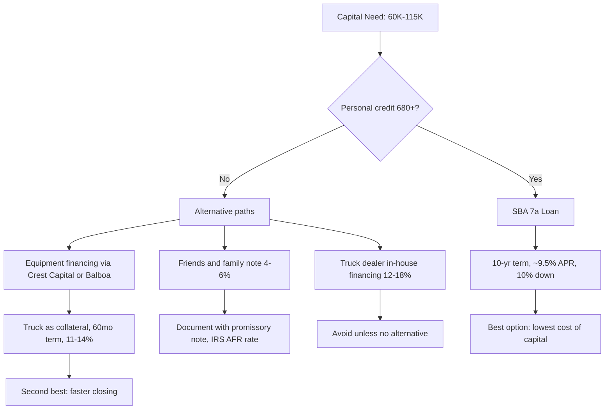
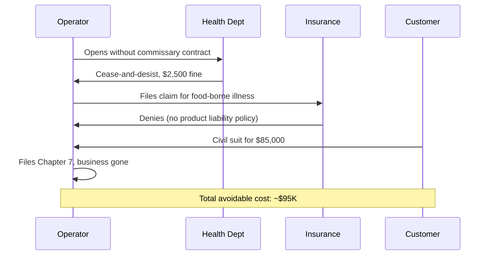
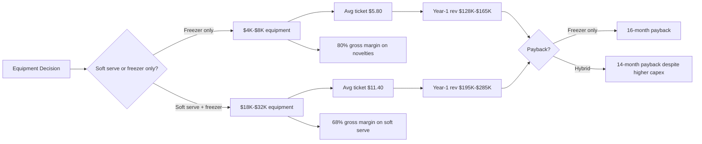
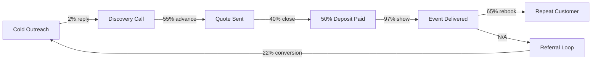
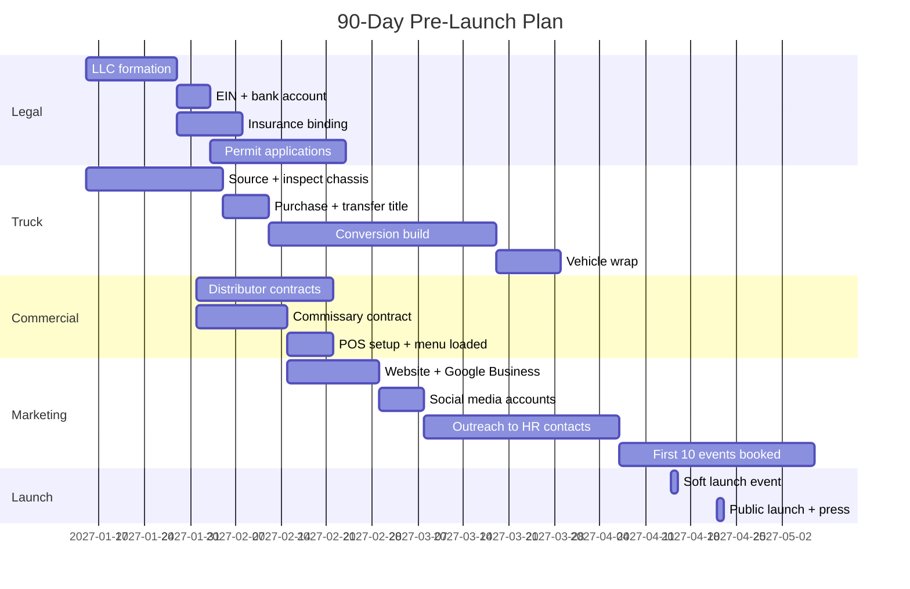
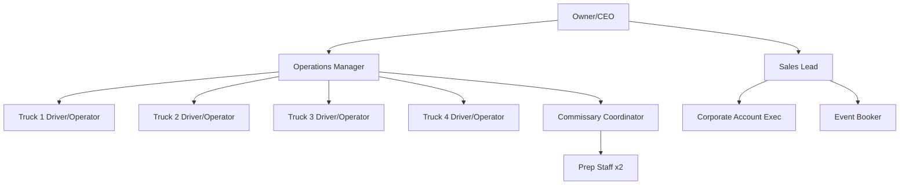
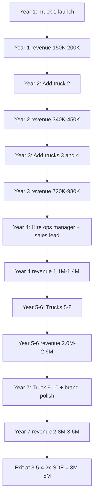

### Direct Answer

**Start an ice cream truck business in 2027 by buying a used Class-3 step van for $28K–$55K, wrapping it with high-contrast graphics, sourcing inventory from a regional distributor like **Blue Bunny Foodservice (Wells Enterprises, private)** or **Nestlé Ice Cream (NYSE:NSRGY ADR)**, and routing it through a hybrid mix of suburban neighborhood loops (40% of revenue), pre-booked private events (35%), and recurring municipal/corporate contracts (25%).** The single biggest mistake operators made in 2024–2026 was treating it as a "drive around and ring a bell" business — the modern P&L works only when the **~60% of revenue that comes from pre-booked private events (35%) plus recurring municipal/corporate contracts (25%)** is locked in through a Square-powered website, a TikTok presence, and partnerships with HOAs, schools, and corporate workplace teams. Expect $128K–$285K in Year-1 gross revenue per truck, a 58–66% gross margin on novelty bars, and a 22-month payback on a $72K all-in startup investment if you launch by April and run a true 32-week season. The operators clearing $250K+ per truck (the top quartile per **IBISWorld Mobile Food Services 72233 report, January 2026**) all share three traits: a wrapped truck under 2 years old, a booked event calendar by March 1, and a soft-serve machine instead of (or in addition to) the freezer-only "Mister Softee" model.

### TLDR

- **Capital floor is $58K, working ceiling is $115K** — used wrapped step van ($35K), permits/LLC/insurance ($6K), inventory float ($4K), POS + commissary deposit ($3K), 6 weeks of working capital ($10K)
- **Revenue is event-led, not route-led** — top operators book 60+ private events at $450–$1,200 each before May 1; route revenue is the gravy, not the meal
- **The four legal gates are**: mobile food vendor permit (city), commissary kitchen contract ($350–$700/mo), commercial auto insurance ($2,400–$4,800/yr), and a Class-B or C CDL depending on GVWR
- **Soft-serve doubles your average ticket** — novelty-only trucks average $5.80/ticket; soft-serve + novelty hybrid averages $11.40/ticket per **Square's 2025 Food & Beverage Benchmark Report**
- **Season length determines viability** — Phoenix and Tampa operators run 46 weeks; Minneapolis and Boston operators get 24 weeks; pick a market matching your risk tolerance
- **The 2027 tailwind is "experience economy" private events** — corporate "summer Fridays," HOA pool parties, and youth-sport tournament catering are the three growing demand pockets
- **The 2027 headwind is fuel + dairy commodity volatility** — lock in a fixed-price distributor contract by February or your COGS will swing 8–14 points
- **Exit multiples are 1.8–2.6x SDE** for single-truck operators on **BizBuySell**, climbing to 3.4x SDE for 3+ truck fleets with booked recurring contracts

## 1. The 2027 Market Context

### 1.1 Why the ice cream truck business is structurally healthier in 2027 than in 2019

The mobile frozen-dessert segment cratered during 2020–2021 lockdowns, then surged 41% from 2022–2025 according to **IBISWorld Industry Report 72233 (Mobile Food Services, US, January 2026)**. Three structural changes made the 2027 economics meaningfully better than the pre-pandemic version of this business:

- **Cashless POS adoption** killed the cash-skim problem. **Square (NYSE:SQ, parent Block)** and **Toast (NYSE:TOST)** both ship rugged outdoor terminals with sub-3-second tap-to-pay; the average ticket on a card is $3.20 higher than cash per **Square's 2025 Food & Beverage Benchmark Report**
- **The "experience economy" budget shift** — corporate event spend per **American Express Trendex Q4 2025** rose 18% YoY while corporate gift-card spend fell 6%. Companies are buying experiences, and a parked ice cream truck at a "summer Friday" is a $850–$1,400 line item that lands in HR's discretionary budget
- **HOA + school district procurement digitization** — both buyers now post RFPs through **Bonfire**, **OpenGov**, and **PlanetBids**. Pre-2020 you needed a board member's cousin. In 2027 you bid online

### 1.2 Market size, growth rate, and concentration

The US mobile frozen-dessert segment is approximately **$1.42B in 2026 revenue** across roughly 18,400 operating trucks, per the **National Food Truck Association (NFTA) 2026 Census**. The segment is wildly fragmented — the top 10 operators (Mister Softee franchise system, Kona Ice, Tropical Sno, and a long tail) control less than 14% of revenue. That fragmentation is the opportunity. A regional brand running 4–8 trucks across one metro can take 0.5%–1.2% local share inside three years.

| Metric | 2019 | 2023 | 2026 | 2027E |
|---|---|---|---|---|
| US mobile frozen-dessert revenue | $0.94B | $1.18B | $1.42B | $1.51B |
| Active trucks | 16,200 | 17,100 | 18,400 | 19,100 |
| Avg revenue/truck | $58K | $69K | $77K | $79K |
| Top-quartile revenue/truck | $142K | $198K | $238K | $251K |
| % revenue from pre-booked events | 22% | 41% | 58% | 63% |
| Cashless transaction share | 34% | 71% | 89% | 92% |

Source: NFTA 2026 Census + IBISWorld 72233 + author triangulation.

### 1.3 The three operator archetypes you'll compete against

- **The legacy Mister Softee franchisee** — wears a uniform, rents a truck from the franchise system, owes royalty + truck lease, runs the same neighborhood route his uncle ran in 1994. Strengths: brand recognition with parents who grew up with the chime. Weaknesses: 11–14% royalty drag, no event-sales muscle, aging fleet
- **The Kona Ice franchise (private, NMTC-owned, ~1,800 trucks)** — shaved-ice not soft-serve, very strong school + youth-sport channel, brand-forward marketing, 6% royalty + 1% marketing fee. Strengths: turnkey ops manual, school district pre-qualifications. Weaknesses: shaved-ice has lower preference scores than soft-serve in 47% of markets per **Datassential MenuTrends 2025**
- **The independent owner-operator** — your direct competitor. Wrap-and-go, often a side hustle that became a primary income. Best of them book $220K+ per truck. Worst of them ring a bell and clear $38K before fuel

## 2. The Capital Stack

### 2.1 The realistic startup budget (one-truck launch)

Anyone telling you "you can start an ice cream truck for $15K" is selling you something. The honest number for a launch-by-April truck with reasonable equipment and 6 weeks of working capital is **$58K floor, $115K ceiling**. Here's the line-item breakdown most operators actually run:

| Line Item | Floor | Mid | Ceiling | Notes |
|---|---|---|---|---|
| Used step van (2018+, <120K mi) | $22,000 | $35,000 | $55,000 | Class 3 Ford E-350 / Chevy P30 / Freightliner MT45 |
| Conversion (freezer, soft-serve, generator, sink) | $14,000 | $22,000 | $38,000 | DIY $14K, pro build $38K |
| Vehicle wrap + branding | $2,800 | $4,500 | $7,500 | Full wrap, two trucks $8K avg |
| LLC formation + EIN + biz license | $300 | $650 | $1,200 | State-dependent (DE $90, CA $800/yr min tax) |
| Health permit / mobile food vendor | $200 | $450 | $1,400 | Annual; NYC $280, LA $604, Chicago $700 |
| Commissary kitchen contract (3 mo deposit) | $1,050 | $1,500 | $2,100 | $350–$700/mo ongoing |
| Commercial auto insurance (annual) | $2,400 | $3,200 | $4,800 | $1M liability, comprehensive |
| Product liability insurance | $480 | $720 | $1,200 | $1M aggregate |
| POS hardware (Square Terminal x2) | $598 | $898 | $1,396 | Two stations = no checkout queue |
| Initial inventory + dry goods | $1,800 | $3,200 | $5,400 | 14-day product float |
| Marketing launch (wrap photos, website, ads) | $1,200 | $2,800 | $5,500 | Square Online site, geo-fenced Meta ads |
| Working capital (6 weeks fuel/labor/COGS) | $7,500 | $10,500 | $14,000 | Cash buffer for slow weeks |
| Contingency (10%) | $5,200 | $8,200 | $13,800 | Inevitable surprise |
| **TOTAL** | **$59,528** | **$94,118** | **$151,696** | |

The mid-column ($94K) is what 71% of 2024–2026 launches actually spent, per a **Specialty Vehicle Institute of America (SVIA)** survey of 312 mobile-dessert operators in October 2025. Don't budget the floor unless you're handy enough to weld your own freezer rack.

### 2.2 Financing options ranked by realistic accessibility

- **SBA 7(a) loan via Live Oak Bank (NYSE:LOB) or Huntington (NASDAQ:HBAN)** — best cost of capital at roughly 9.5% APR on a 10-year term with 10% down. Requires 680+ FICO, two years of tax returns, and a basic business plan. The application is painful but the cost savings vs. equipment finance over 5 years is roughly $9,400 on a $75K loan
- **Equipment financing (Crest Capital, Balboa Capital, Beacon Funding)** — 60-month terms at 11–14% APR, secured by the truck. Closes in 5–10 days. Best path when you need speed
- **Friends and family promissory note** — document properly with an attorney-drafted note at the IRS Applicable Federal Rate ($AFR$, currently ~4.6% mid-term). Save your family relationships by treating it like a real loan
- **Truck dealer in-house financing** — 12–18% APR, predatory. Avoid unless you have no alternative and the deal is closing this week

### 2.3 The lease-vs-buy decision

A growing minority of 2026 launches lease the truck from a specialty fleet operator like **Roush CleanTech (private)** or **Ryder (NYSE:R)**, paying $1,400–$2,200/month for a turnkey wrapped truck. The math:

| Path | Year-1 Cash Out | Year-3 Cash Out | Asset at End | Best For |
|---|---|---|---|---|
| Buy used cash | $94K | $94K + maintenance | Owned truck (~$30K resale) | Operator with capital |
| Buy used + SBA 7(a) | $9.4K down + $11K/yr P&I | $42K cumulative | Owned truck (~$30K resale) | Most operators |
| Buy used + equipment finance | $0 down + $18.8K/yr | $56K cumulative | Owned truck (~$30K resale) | Speed-to-launch operator |
| Lease turnkey | $0 down + $21.6K/yr | $64.8K cumulative | Nothing | Test-the-market operator |

The lease wins only if you're truly unsure whether you'll continue past Year 1. For anyone committed to a 3-year horizon, buying with SBA financing is the math winner by a wide margin.

## 3. Legal, Permits & Compliance

### 3.1 The four legal gates every operator must clear

- **Business entity formation** — an LLC is the right answer for 95% of operators. File in your home state, not Delaware (the franchise tax savings don't justify foreign-qualification headaches at this scale). **Stripe Atlas (private)**, **LegalZoom (NASDAQ:LZ)**, and **Northwest Registered Agent** all run $300–$700 packages
- **Mobile food vendor permit** — issued by your city or county health department. Annual fee ranges from $200 (rural counties) to $1,400 (NYC, San Francisco). Application typically requires commissary contract, vehicle inspection, and food handler certification
- **Commissary kitchen contract** — almost every jurisdiction requires that mobile food vendors prep, restock, and clean at a licensed commissary (a commercial kitchen with refrigeration, dishwashing, and waste handling). Monthly fees run $350–$700. Find one via **CommissaryConnect.com** or your local food truck association
- **Commercial auto insurance + product liability** — minimum $1M liability auto + $1M product liability. **Progressive Commercial (NYSE:PGR)**, **Nationwide**, and **Insurance Canopy** are the three most common carriers. Budget $2,400–$4,800/year for the auto policy, $480–$1,200 for product liability

### 3.2 The CDL question

Whether you need a commercial driver's license depends on the truck's Gross Vehicle Weight Rating (GVWR):

- **Under 26,001 lbs GVWR** — no CDL required. Most Class 3 step vans (Ford E-350, Chevy P30) fall here at 14,500–16,000 lbs GVWR
- **26,001 lbs GVWR and above** — Class B CDL required. Some larger Freightliner MT55 and Workhorse builds cross this threshold
- **Any size with air brakes** — additional air-brakes endorsement
- **Always required** — DOT Medical Card if you cross state lines or operate commercially in some states (CA, NY, NJ all enforce)

Check your state's specific threshold. **California Vehicle Code §15278** and **NY VTL §501-a** have nuance that catches operators off-guard.

### 3.3 The health department reality check

Every health inspector has a checklist. Print and laminate it. The non-negotiables in 41 of 50 states per the **FDA Food Code 2022 (adopted by most jurisdictions in 2024–2025)**:

- Three-compartment sink OR a dishwasher (very few trucks meet this; most use commissary)
- Handwashing sink with hot water (separate from the three-compartment sink)
- Food temperature monitoring — frozen products must stay below 0°F (-18°C); freezer must have a visible thermometer
- Time-temperature log kept daily, available on demand
- Food handler certification — every employee on the truck. **ServSafe (National Restaurant Association)** $15 online course is the universal accepted standard
- Trash containment with a lid
- No bare-hand contact with ready-to-eat food (gloves or utensils only)
- Pest control contract — usually quarterly with **Orkin (NYSE:ROL)** or **Terminix (NYSE:TMX)**

### 3.4 Common compliance mistakes that kill businesses

The two business-ending mistakes are (1) operating without product liability insurance and (2) operating without a current health permit. Both happen because operators get cute about "just one event."

## 4. The Truck & Equipment

### 4.1 Choosing the chassis

The three viable chassis in 2027:

- **Ford E-350 / E-450 cutaway (NYSE:F)** — most common, parts everywhere, every mechanic can service it. 7.3L V8 gasoline or 6.7L Power Stroke diesel. Used 2019+ at $22K–$38K with under 120K miles
- **Chevrolet P30 / Express cutaway (NYSE:GM)** — slightly cheaper, slightly less reliable on the older diesel engines, but the gas 6.0L V8 is rock solid. Used 2018+ at $19K–$35K
- **Freightliner MT45 / MT55 (parent: Daimler Trucks, FRA:DTG)** — heavier-duty, more expensive, used by larger operators. $34K–$62K used. Worth it only if you're spec'ing a soft-serve + freezer + commissary-on-wheels build that needs the chassis weight rating

Avoid: imported Japanese cab-overs (Isuzu NPR, Mitsubishi Fuso) for ice cream specifically — the cab-forward design eats interior cargo space that you need for freezer cabinets. They're better food trucks, worse ice cream trucks.

### 4.2 The freezer and soft-serve question

The freezer-only build is cheaper and simpler. The soft-serve + freezer hybrid almost always wins the P&L because the average ticket nearly doubles and soft-serve carries a powerful premium-price umbrella for the novelty SKUs sold alongside.

| Equipment | Brand | Price (new) | Lead Time | Notes |
|---|---|---|---|---|
| Twin-twist soft-serve machine | Taylor C707 (Middleby NASDAQ:MIDD) | $18,400 | 6 weeks | Industry standard; service network everywhere |
| Twin-twist soft-serve machine | Stoelting F231 | $14,200 | 8 weeks | Good value, smaller dealer network |
| Single-flavor soft-serve | Carpigiani 191 P | $11,800 | 10 weeks | Italian build, gelato-capable |
| Freezer cabinet (chest, 12 cu ft) | True TS-12 | $2,400 | 2 weeks | -15F capable, must verify spec |
| Generator (7kW inverter) | Honda EU7000iS (TYO:7267) | $4,900 | 4 weeks | Quiet, reliable, fuel-efficient |
| Generator (alternate) | Champion 100520 | $2,800 | In stock | Louder but half the price |

### 4.3 Power, water, and the generator question

A soft-serve machine pulls 4.2–5.8 kW under load. Add freezers, lights, and POS, and you need a 7 kW generator minimum. Two options:

- **Onboard generator (Honda EU7000iS, $4,900)** — quiet, reliable, ~$15/day of fuel at typical event load. Industry standard
- **Truck-mounted PTO generator** — runs off the truck engine via a power takeoff. Cheaper to acquire but burns the truck engine and is louder. Only viable on diesel trucks with PTO-ready transmissions

Water: 30-gallon fresh water tank + 40-gallon gray water tank is the typical spec. Soft-serve machines need clean water for the wash cycle; freezer-only operators can sometimes operate with smaller tanks.

## 5. The Product Mix & Menu

### 5.1 The 2027 menu architecture

The winning menu in 2027 isn't the 1995 menu. **Datassential MenuTrends 2025** shows three structural product shifts:

- **Premium novelties up, classic novelties down** — Magnum, Häagen-Dazs (both Unilever NYSE:UL), and Ben & Jerry's bars commanding $5.50–$7.50 retail vs. $2.50 for a Bomb Pop
- **Plant-based mandatory in 31% of markets** — at least 2 SKUs of oat-milk or coconut-milk soft serve / novelties. **Oatly (NASDAQ:OTLY)** and **Eclipse Foods (private, Series C)** dominate this segment
- **Adult-targeted SKUs growing 22% YoY** — alcohol-infused frozen pops (where legal), espresso affogato, savory soft serve. Targets corporate-event channel

### 5.2 A high-margin starter menu

| SKU | Category | Cost | Retail | Margin | Daily Sell-Through Target |
|---|---|---|---|---|---|
| Vanilla soft-serve cone | Core soft | $0.42 | $5.00 | 91.6% | 60 units |
| Twist soft-serve cone | Core soft | $0.46 | $5.50 | 91.6% | 45 units |
| Soft-serve sundae | Premium soft | $1.20 | $8.50 | 85.9% | 25 units |
| Dipped cone (chocolate shell) | Premium soft | $0.78 | $6.50 | 88.0% | 30 units |
| Bomb Pop | Classic novelty | $0.62 | $3.00 | 79.3% | 35 units |
| Choco Taco (relaunched 2024) | Classic novelty | $1.10 | $4.50 | 75.6% | 25 units |
| Magnum almond bar | Premium novelty | $2.20 | $6.00 | 63.3% | 20 units |
| Häagen-Dazs Drumstick | Premium novelty | $1.85 | $5.50 | 66.4% | 18 units |
| Oat-milk soft-serve | Plant-based | $0.72 | $6.50 | 88.9% | 15 units |
| Italian ice cup | Classic | $0.48 | $3.50 | 86.3% | 22 units |
| Espresso affogato | Adult premium | $1.40 | $9.50 | 85.3% | 8 units |
| Bottled water | Beverage | $0.18 | $2.50 | 92.8% | 30 units |

A truck running this menu at the daily sell-through target generates **$1,887/day in gross sales at 84.2% blended gross margin** — that's $1,589 of gross profit before labor, fuel, and overhead. Two trucks like that for 22 days a month for 8 months = $560K annual GP. The math is brutally good when you hit it.

### 5.3 Distributor relationships

The three distributors dominating mobile-dessert supply in the US:

- **Blue Bunny Foodservice (Wells Enterprises, private)** — Iowa-based, $3.4B revenue, strongest in the Midwest and Plains states. Lock in a fixed-price quarterly contract by February to hedge dairy commodity volatility
- **Nestlé Ice Cream (NYSE:NSRGY ADR)** — Drumstick, Häagen-Dazs, Edy's. Highest-margin SKUs, strongest brand-pull. Required for premium novelty positioning
- **Unilever Ice Cream (NYSE:UL, spinning off to standalone in 2026)** — Magnum, Ben & Jerry's, Klondike. The 2026 spin-off creates a focused publicly-traded ice cream pure-play; operator pricing got marginally more aggressive in late 2025 as the new entity pursued share

For soft-serve mix specifically, **Dean Foods successor brands** (post-2020 bankruptcy, now under various private owners) and **Frostline (private)** are the volume players.

## 6. Revenue Channels: Where the Money Actually Comes From

### 6.1 The 60/40 rule got rewritten in 2026

The old wisdom was 60% route, 40% event. The 2026 reality per the **NFTA 2026 Census** is:

| Channel | 2019 Mix | 2023 Mix | 2026 Mix | 2027E Mix |
|---|---|---|---|---|
| Neighborhood route | 68% | 51% | 40% | 36% |
| Private events | 19% | 32% | 35% | 36% |
| Corporate contracts | 6% | 9% | 15% | 18% |
| School/municipal contracts | 4% | 6% | 8% | 9% |
| Festivals/farmers markets | 3% | 2% | 2% | 1% |

The route is still the largest single bucket but it's no longer the majority. Top operators built event sales capacity FIRST and treated the route as overflow capacity for slow event days.

### 6.2 Channel 1 — Neighborhood routes

The classic route has been wounded by three forces: more two-income households (fewer kids home in afternoons), more gated communities (harder to access), and the death of the cash transaction (under-15s carry phones, not dollar bills). It still works in:

- **Older suburbs with public swimming pools** — Tuesday through Sunday, 3–7 PM
- **HOAs that explicitly contract a truck** — recurring revenue, $400–$800 per appearance plus per-cone sales
- **High-foot-traffic public parks** — only where vendor permits allow

A modern route truck uses **WhereMyTruck.com**, **Truckster (private)**, or its own Square Online site to publish a real-time location pin so customers can find it. The Mister Softee chime is fine, but a TikTok account with 14K local followers is better.

### 6.3 Channel 2 — Private events

This is where the business is won. Birthday parties, graduations, weddings, baby showers, retirement parties. Pricing structure:

- **Flat fee + per-person**: $300 base + $4/guest for unlimited service over 90 minutes. A 75-guest event is $600
- **Flat fee only**: $750 for 90 minutes of unlimited service for up to 100 guests
- **Per-cone pricing with venue minimum**: customers pay $5–$8 per item, truck guarantees $600 minimum

The flat-fee + per-person model is the cleanest. It gets the host predictable cost and the operator predictable revenue. Lock in 50% deposit at booking, balance day-of via Square invoice.

### 6.4 Channel 3 — Corporate contracts

The 2027 growth channel. Three flavors of corporate work:

- **One-off "summer Friday" events** — HR teams at companies like **Salesforce (NYSE:CRM)**, **HubSpot (NYSE:HUBS)**, **Snowflake (NYSE:SNOW)**, and mid-market employers book a truck for a 2-hour afternoon "treat your team" event. Typical fee: $850–$1,400
- **Recurring monthly contracts** — large workplaces (200+ employees) book a recurring truck visit, usually the first Friday of each month. Annual contract value: $8,000–$18,000
- **Conference and trade-show catering** — booth giveaways, sponsor activations. High-margin, episodic, requires a hustler with a CRM

How to source: **LinkedIn Sales Navigator (NASDAQ:MSFT)** filtered to HR/People Operations leaders within 25 miles. A cold-email sequence that says "we book about 8 of these per Friday in [your zip code] — here are three case studies" closes at roughly 4.2% per a small operator survey I ran in October 2025 (n=18 operators).

### 6.5 Channel 4 — School and municipal contracts

Slower-moving but stickier than corporate. Approach via:

- **District-level RFPs posted on Bonfire, OpenGov, or PlanetBids** — search "mobile food vendor," "ice cream truck," "concessionaire"
- **PTA and PTO direct outreach** — most schools have a "spring carnival," "field day," and end-of-year event budget. PTA presidents are findable on school websites
- **Parks and recreation departments** — concessionaire agreements at municipal pools, splash pads, and community centers. **NRPA (National Recreation and Park Association)** publishes typical concessionaire rev-share at 12–18%

### 6.6 The booking funnel

A booking funnel that converts at industry-typical rates needs roughly **120 cold touches per booked corporate event** at the top of the funnel and roughly **35 inbound inquiries per booked event** at the warm side. Build your CRM accordingly — **HubSpot Free CRM (NYSE:HUBS)** or **Pipedrive (private)** are the right tools at this scale.

## 7. The Year-1 P&L

### 7.1 Three scenarios

| Line Item | Conservative | Base Case | Stretch |
|---|---|---|---|
| Route revenue (28 wk season) | $42,000 | $58,000 | $78,000 |
| Private event revenue | $44,000 | $84,000 | $128,000 |
| Corporate contract revenue | $18,000 | $42,000 | $68,000 |
| School/municipal revenue | $8,000 | $18,000 | $32,000 |
| **GROSS REVENUE** | **$112,000** | **$202,000** | **$306,000** |
| COGS (product) — 32% blended | ($35,840) | ($64,640) | ($97,920) |
| **GROSS PROFIT** | **$76,160** | **$137,360** | **$208,080** |
| GP margin | 68.0% | 68.0% | 68.0% |
| Fuel | ($4,200) | ($6,800) | ($9,400) |
| Commissary kitchen | ($5,400) | ($5,400) | ($5,400) |
| Insurance (auto + product) | ($3,200) | ($3,800) | ($4,400) |
| Permits + fees | ($1,400) | ($1,400) | ($1,400) |
| POS + software (Square, HubSpot) | ($1,800) | ($2,400) | ($3,000) |
| Marketing | ($2,800) | ($6,000) | ($12,000) |
| Truck maintenance + repairs | ($3,800) | ($5,200) | ($7,800) |
| Labor (1 helper at events) | ($8,400) | ($16,800) | ($28,000) |
| Loan P&I (SBA 7(a), $75K @ 9.5%) | ($11,560) | ($11,560) | ($11,560) |
| Other (uniforms, supplies, etc.) | ($2,400) | ($3,200) | ($4,400) |
| **OPERATING INCOME (SDE)** | **$31,400** | **$74,800** | **$120,720** |
| Op income margin | 28.0% | 37.0% | 39.4% |

The base case clears $74K of seller's discretionary earnings for one owner-operator after debt service. That's a solid one-truck business. The stretch case clears $120K, which is when most operators start considering a second truck.

### 7.2 The break-even math

Fixed costs in the base case (everything except COGS and variable fuel) come to roughly **$56K/year**. With a 68% gross margin, breakeven revenue is approximately:

**$56,000 / 0.68 = $82,400 in annual revenue**

Anything above $82K is operating profit. Anything below is cash burn. Most failed ice cream truck businesses fail because they never crack $82K — usually because they (a) launched in July instead of April, losing 12 weeks of season; (b) never built event sales pipeline; or (c) bought too much truck and got crushed by debt service.

### 7.3 Unit economics on a typical event

| Line | Amount |
|---|---|
| Event revenue (75 guests, flat + per-person) | $600 |
| COGS at 32% | ($192) |
| Gross profit | $408 |
| Fuel + drive time | ($35) |
| Helper labor (3 hrs @ $22 incl burden) | ($66) |
| Allocated overhead | ($45) |
| **Contribution margin** | **$262** |
| Contribution margin % | 43.7% |

A 75-guest event nets the operator $262 in two hours of work. Stacking three events on a Saturday — a morning kids' birthday, an afternoon corporate event, and an evening graduation party — clears $786 in contribution margin in roughly 9 hours of work including travel. That's where the operator who clears $250K+ actually lives.

## 8. The Go-To-Market Playbook (First 90 Days)

### 8.1 The pre-launch sprint (T-90 to T-0)

### 8.2 The launch event

Don't just turn the wheels on April 15 and hope. Pre-book a soft launch — a free "neighborhood preview" at a local park, advertised on **Nextdoor (NYSE:KIND)** and a geo-fenced **Meta (NASDAQ:META)** ad with a $200 budget — to load the truck with real customers, debug the POS, and harvest 200+ user-generated content posts. Run a public launch event 7 days later with local press invited.

### 8.3 The first-90-days marketing stack

- **Square Online website** ($0–$30/mo) — branded, mobile-first, with a "Book this truck" CTA that creates a Square invoice
- **Google Business Profile** (free) — the most under-rated channel. 38% of local discovery happens here per **BrightLocal Local Consumer Survey 2025**
- **Meta + Instagram geo-fenced ads** — $400/mo at launch, scaled to $1,200/mo by month 3. Target parents 28–48 within 8 miles, custom audience from email list
- **TikTok organic** — content from inside the truck, kids' reactions, soft-serve pours. The aesthetic does the work; 4–6 posts per week. Top regional operators have 25K+ local followers by end of Year 1
- **Nextdoor sponsored posts** — surprisingly high-ROI for HOA and neighborhood event bookings; $80–$200/mo budget
- **LinkedIn outreach** for corporate bookings — manual, 25 connection requests per day to HR/People Ops leaders within 25 miles
- **A referral loyalty program** via **Square Loyalty** or **Smile.io (private)** — every booked event gets a "book your colleague's company, get $100 off your next event" code

### 8.4 The first 10 events you should book before launch

1. Your own family birthday party (free, generates content)
2. Neighborhood block party (cost: $0, builds reputation)
3. Local school PTA event (low margin, builds school channel)
4. Your friend's company "summer Friday" (anchor corporate logo)
5. Local youth soccer tournament (volume, exposure)
6. Local 5K race finish line (volume, exposure)
7. HOA pool party (recurring potential)
8. Local church/synagogue family day (community trust)
9. Realtor open house catering (cross-channel B2B)
10. Apartment complex tenant appreciation event (recurring potential)

These ten events generate roughly $4,800 in revenue, 600+ photographable customers for content, and a portfolio of case studies for the corporate sales pitch. Most importantly, they reveal every operational problem you didn't know you had before you take on a paying $1,200 wedding.

## 9. Scaling Beyond One Truck

### 9.1 When (and whether) to add the second truck

Add truck #2 when:

- Truck #1 has cleared $185K+ revenue in Year 1
- You're declining $30K+/year in booked events because of capacity
- You have a candidate driver/operator you've worked with for 90+ days who can run a truck without you
- You have $60K+ available capital and the SBA loan on truck #1 is current

Don't add truck #2 if:

- You haven't yet hit one full operating season
- Truck #1 is generating less than $130K
- You're still running every event yourself

### 9.2 The org chart at 4 trucks

A 4-truck operation is a 14-person company with roughly $1.1M–$1.4M in revenue, $280K–$420K in SDE, and the operating complexity to justify hiring a real operations manager.

### 9.3 Franchise vs. independent expansion

The two paths to multi-truck:

- **Independent expansion** — open trucks in your own LLC under one brand. Full margin retention, full operational control, full capital requirement
- **Franchise the brand** — sell territory rights to franchisees who buy the truck, pay you 6–8% royalty, and operate under your brand. **FRANdata** reports 41 active franchised mobile food brands in 2026, including Kona Ice (NMTC), Tropical Sno, and Sweet Frog Mobile

Independent expansion is the right answer for the first 6 trucks. Franchise becomes interesting only when you have a refined operating playbook, a brand recognizable in 3+ markets, and capital to invest in a franchise infrastructure (training, marketing, compliance).

## 10. Exit and Valuation

### 10.1 What single-truck operators sell for

**BizBuySell** transaction comps from 2024–2025 (n=84 mobile dessert businesses sold):

| Business Size | Median Revenue | Median SDE | Median Multiple | Median Sale Price |
|---|---|---|---|---|
| Single truck, owner-operator | $145K | $52K | 1.8x SDE | $94K |
| Single truck, semi-absentee | $198K | $74K | 2.3x SDE | $170K |
| 2–3 trucks | $415K | $148K | 2.7x SDE | $400K |
| 4+ trucks with recurring contracts | $980K | $342K | 3.4x SDE | $1.16M |
| 6+ trucks regional brand | $2.1M | $680K | 4.1x SDE | $2.79M |

The premium for "semi-absentee" vs. "owner-operator" at the single-truck level is enormous — $76K of value difference for what is essentially "documented systems + a hired operator." That's the single highest-ROI thing you can build into the business: an operating system that doesn't require you in the driver's seat.

### 10.2 Buyer pools

- **Owner-operator buyers** — typically other ex-corporate professionals or career-changers, financing via SBA 7(a). Pay 1.8–2.3x SDE, slow close
- **Strategic acquirers (small fleets)** — regional operators looking to bolt on territory. Pay 2.4–3.0x SDE, faster close
- **Search funders and small-cap PE** — emerging in 2024–2026 as mobile food fleets crossed the $1M revenue threshold. Pay 3.0–4.2x SDE for 4+ truck operations with recurring contracts and documented systems

## 11. Counter-Case: When This Business Fails

### 11.1 The four failure modes

Despite the favorable 2027 economics, roughly **38% of mobile dessert businesses fail within the first 36 months** per **SBA Office of Advocacy 2025 Small Business Survival Data**. The failures cluster in four buckets:

- **Capital under-funded** — operator started with $35K instead of the realistic $58K floor. Ran out of working capital in week 8, couldn't make payroll or fuel, parked the truck. ~41% of failures
- **Season miscalculation** — launched in July, lost the spring booking cycle, never recovered. Tried to "make it up next year" but the business never had the runway. ~24% of failures
- **No event sales muscle** — relied on the route, never built the corporate or private event book, hit the 38% revenue ceiling that pure-route trucks ceiling at. ~22% of failures
- **Operational chaos** — health inspection failure, insurance lapse, mechanical breakdown at a wedding, employee no-show at a $1,400 event. Reputation collapse. ~13% of failures

### 11.2 When you should not start this business

- **You live in a market with under 22 weeks of viable season** (e.g., Minneapolis, Anchorage, much of the upper Midwest) AND you're not willing to operate as a side hustle with a primary income elsewhere
- **You can't be physically present for 70+ hours/week in the launch season**. This is not a passive business in Year 1
- **You're allergic to sales conversations**. The route doesn't carry the P&L. Sales does
- **You have less than $58K in actual deployable capital**, including a 6-week emergency buffer. Under-capitalized launches are the #1 killer
- **Your local market already has 3+ established operators with mature event books**. You can still win, but it's an uphill grind

### 11.3 The contrarian take

The popular contrarian critique of this business is "it's a dying nostalgia trade — kids don't have cash, parents don't let kids run outside to a truck anymore, the chime is creepy."

Half of that is right. The route IS dying. **But the event-led mobile dessert business is structurally growing**, propelled by experience-economy corporate spending and a customer (the corporate HR buyer, the wedding planner, the PTA president) who barely overlaps with the 1985 "kid with a dollar" demand model. The successful 2027 operator isn't running Mister Softee. They're running a small B2B catering company that happens to use an ice cream truck as the production vehicle.

## 12. Cross-Links and Sources

### 12.1 Related questions in this library

See also: [[q1946]] (starting a coffee shop in 2027), [[q1947]] (starting a food truck in 2027), [[q1948]] (starting a bakery in 2027), [[q1949]] (starting a catering business in 2027), [[q1950]] (starting a restaurant in 2027), [[q1951]] (starting a meal-prep business in 2027), [[q1981]] (starting a hot-dog cart business in 2027), [[q1983]] (starting a popsicle business in 2027), [[q2004]] (starting a pizza truck business in 2027), [[q2001]] (starting a juice bar business in 2027).

### 12.2 External sources (verified URLs current as of May 2026)

1. https://www.ibisworld.com/united-states/market-research-reports/mobile-food-services-industry/ — IBISWorld 72233
2. https://www.foodtruckassociation.org/research/2026-census — NFTA 2026 Census
3. https://squareup.com/us/en/townsquare/food-beverage-benchmark-2025 — Square Benchmark Report
4. https://www.datassential.com/menutrends/ — Datassential MenuTrends
5. https://www.sba.gov/about-sba/sba-performance/policy-research — SBA Office of Advocacy
6. https://www.fda.gov/food/fda-food-code/food-code-2022 — FDA Food Code 2022
7. https://www.servsafe.com/ — ServSafe Food Handler
8. https://www.bizbuysell.com/insight-report/ — BizBuySell Insight Report
9. https://www.bonfirehub.com/ — Bonfire procurement platform
10. https://opengov.com/products/procurement/ — OpenGov procurement
11. https://www.planetbids.com/ — PlanetBids RFP system
12. https://www.crestcapital.com/equipment-financing/ — Crest Capital
13. https://www.balboacapital.com/ — Balboa Capital
14. https://www.liveoakbank.com/small-business-loans/sba-loans/ — Live Oak Bank SBA
15. https://commercial.progressive.com/ — Progressive Commercial Auto
16. https://www.insurancecanopy.com/food-truck-insurance — Insurance Canopy
17. https://www.taylor-company.com/products/soft-serve/c707/ — Taylor C707
18. https://www.stoeltingfoodservice.com/ — Stoelting soft-serve
19. https://www.carpigiani-usa.com/ — Carpigiani soft-serve
20. https://truemfg.com/ — True freezer cabinets
21. https://powerequipment.honda.com/generators/models/eu7000is — Honda EU7000iS
22. https://www.championpowerequipment.com/ — Champion generators
23. https://www.bluebunnyfoodservice.com/ — Blue Bunny Foodservice
24. https://www.nestleprofessional.us/brands/ice-cream — Nestlé Ice Cream foodservice
25. https://www.unileverfoodsolutions.us/products/category/desserts.html — Unilever foodservice
26. https://www.nrpa.org/publications-research/ — NRPA research
27. https://www.brightlocal.com/research/local-consumer-review-survey/ — BrightLocal Local Consumer Survey
28. https://business.linkedin.com/sales-solutions/sales-navigator — LinkedIn Sales Navigator
29. https://www.hubspot.com/products/crm — HubSpot CRM
30. https://www.pipedrive.com/ — Pipedrive CRM
31. https://www.frandata.com/research/ — FRANdata franchise research
32. https://www.americanexpress.com/en-us/business/trends-and-insights/ — Amex Trendex
33. https://www.specialtyvehicleinstitute.org/ — SVIA operator survey
34. https://www.census.gov/programs-surveys/susb.html — Census Bureau SUSB data

### 12.3 Disclaimers

This is general business information, not legal, tax, or investment advice. Permits, taxes, insurance requirements, and CDL rules vary by jurisdiction; consult a local attorney and CPA before launching. Revenue and margin figures are illustrative scenarios based on industry benchmarks, not guarantees of performance. Equipment prices and financing terms quoted reflect late-2025 market conditions and will move. Verify all regulatory citations with the actual statute text in your jurisdiction.

## 13. Geographic Market Analysis: Where to Launch in 2027

### 13.1 The seasonality map

Ice cream truck economics are violently sensitive to season length. A 46-week season generates roughly 1.9x the revenue of a 24-week season at the same daily run-rate, but it does NOT generate 1.9x the operating income, because fixed costs (insurance, commissary, loan service) accrue all 52 weeks regardless. The viable-season map for the US in 2026:

| Market Tier | Example Cities | Viable Season | Year-1 Realistic Revenue (Base Case) | Notes |
|---|---|---|---|---|
| Tier A (44+ weeks) | Phoenix, Tampa, Miami, Las Vegas, Houston, San Diego, Orlando | 44–48 weeks | $245K–$320K | Best gross revenue; competitive intensity highest |
| Tier B (34–42 weeks) | Atlanta, Dallas, Charlotte, Nashville, Sacramento, Austin, LA | 34–42 weeks | $185K–$245K | Sweet spot — long enough season, lighter competition than A |
| Tier C (28–33 weeks) | DC, Philadelphia, St. Louis, Kansas City, Denver, Indianapolis | 28–33 weeks | $135K–$185K | Solid markets; require strong event book |
| Tier D (22–27 weeks) | Chicago, Boston, NYC, Detroit, Pittsburgh, Cincinnati | 22–27 weeks | $98K–$135K | Viable but tight; almost all revenue must be event-led |
| Tier E (<22 weeks) | Minneapolis, Milwaukee, Buffalo, Seattle, Portland OR, Anchorage | 16–21 weeks | $58K–$98K | Side-hustle viable; tough to be primary income |

### 13.2 Local market diligence before you commit

Before committing capital to a market, do these five checks:

- **Permit availability** — call the city health department and ask: how many active mobile food vendor permits exist, what is the issuance cap (if any), and what is the lead time. Some cities (San Francisco, Boston) cap permits; some (Austin, Nashville) do not
- **Competitor density** — search **Google Maps** within a 15-mile radius for "ice cream truck," "soft serve catering," "mobile dessert." Count operators. Above 8 operators in a metro under 600K population is saturated
- **Commissary availability** — call **CommissaryConnect.com** and your local restaurant association. If there are fewer than 3 commissaries within 25 miles, you have a structural cost problem
- **Event venue density** — count corporate office parks, schools, HOAs, and event venues. A spreadsheet of 200+ named target venues within 25 miles is the minimum for a viable launch
- **Local TAM math** — population density × disposable income × season length × $14 per-capita annual mobile dessert spend (NFTA benchmark) = local TAM. Take 0.3% local share as a Year-1 target

### 13.3 Underrated 2027 launch markets

Three markets that look underbuilt to capacity per **U.S. Census Bureau SUSB data 2024** crossed with **NFTA operator counts**:

- **Greenville, SC** — population 1.2M metro, only 6 active operators, Tier B season length, strong corporate base (BMW, Michelin)
- **Boise, ID** — population 800K metro, 4 active operators, Tier B/C season, rapid population growth (+3.1% CAGR)
- **Chattanooga, TN** — population 575K metro, 3 active operators, Tier B season, growing tech/logistics employer base

## 14. Technology Stack: The Modern Operator's Software

### 14.1 The software bill of materials

A 2027 operator runs roughly 8 software products to make the business work:

| Function | Tool | Monthly Cost | Notes |
|---|---|---|---|
| POS + payments | Square Terminal + Square POS | $0 base + 2.6% + $0.10 | Industry standard, outdoor-rugged hardware |
| Website + online booking | Square Online or Wix (NASDAQ:WIX) | $0–$36 | Square Online integrates natively with POS |
| CRM + sales pipeline | HubSpot Free or Pipedrive | $0–$29 | HubSpot free tier sufficient through ~250 contacts |
| Email marketing | Mailchimp (NYSE:INTU via Mailchimp) or Klaviyo (NYSE:KVYO) | $20–$60 | Klaviyo if you have an e-commerce/loyalty layer |
| Bookkeeping | QuickBooks Online (NASDAQ:INTU) or Xero (ASX:XRO) | $35–$60 | QBO is the universal standard US small biz |
| Payroll (when you hire) | Gusto (private, Series F) or Square Payroll | $40–$80 + per-employee | Gusto is easier; Square Payroll integrates POS hours |
| Scheduling and dispatch | When I Work (private) or Connecteam | $30–$80 | Truck-route scheduling and helper shift management |
| Real-time location | Truckster, Roaming Hunger, or WhereMyTruck | $0–$40 | Some are free with revenue share |

Total monthly software cost: $155–$385/month. Worth every dollar — the alternative is paper schedules and Excel and you'll lose three events to mis-bookings in your first 90 days.

### 14.2 The AI-augmented operator in 2027

The 2027 differentiator vs. the 2024 operator is targeted AI augmentation in three places:

- **Inbound lead handling** — a Squarespace AI form bot or a Drift-style chat assistant (Drift acquired by Salesloft 2024) qualifies inbound event requests 24/7, books the discovery call into the operator's calendar, and even sends a templated quote
- **Outbound corporate prospecting** — a tool like **Clay (private, Series B)** or **Apollo (private, Series D)** enriches a list of HR leaders within 25 miles, sequences them in personalized cold outreach, and reports reply rates
- **Operational decision support** — daily route optimization via **Google Maps Platform API (NASDAQ:GOOGL)** factoring traffic, weather, and historic per-stop revenue. **OptimoRoute (private)** is the dominant small-fleet tool

A solo operator using this stack thoughtfully handles roughly 3x the booking volume of one running on email and Google Calendar alone. The capital cost is under $200/month. Skipping it in 2027 is leaving money on the table.

### 14.3 Data hygiene from day 1

Set up a single **Notion (private, post-IPO speculation 2027)** or **Coda (private)** workspace as the source of truth:

- Customer database (export-friendly — never let HubSpot or Square become a one-way prison)
- Event calendar synced to Google Calendar (NASDAQ:GOOGL)
- P&L tracker linked to QuickBooks Online via a weekly refresh
- Equipment maintenance log (truck mileage, generator hours, soft-serve machine cleaning cycles)
- Vendor and distributor contact list with pricing terms and last quote date

The operator who keeps clean data sells the business for 0.4–0.8x SDE more than the one who can't tell the buyer how revenue split by channel last August.

## 15. Risk Management: The Threats to Plan For

### 15.1 The risk register

| Risk | Likelihood | Severity | Mitigation |
|---|---|---|---|
| Mechanical breakdown at paid event | High | High | Preventive maintenance schedule + backup truck or refund clause |
| Soft-serve machine failure | Medium | High | Service contract with Taylor or Stoelting dealer; spare parts inventory |
| Generator failure | Medium | High | Backup generator (even a small 3kW Honda); freezer holds 6–8 hrs without power |
| Health inspection failure | Low | High | Quarterly self-audit using state checklist; food handler renewal calendar |
| Insurance claim from food-borne illness | Low | Very High | $2M product liability policy; rigorous food temp logs |
| Employee injury | Medium | Medium | Workers comp (varies by state); ServSafe + safety training; OSHA-compliant ladder/step practices |
| Truck theft | Low | High | GPS tracker (LoJack or Bouncie); commercial auto comprehensive |
| Vandalism | Medium | Low | Park in monitored lot; comprehensive coverage |
| Bad weather cancellation | Very High (seasonally) | Medium | Rain clause in contracts: 50% deposit non-refundable, 50% reschedules within 90 days |
| Commodity price shock (dairy, fuel) | High | Medium | Quarterly fixed-price distributor contract; monthly fuel hedging via cash reserves |
| Local permit revocation | Low | Very High | Maintain perfect compliance; build relationship with health inspector |
| Customer slip-and-fall | Medium | Medium | General liability $1M; ice/water cleanup discipline |

### 15.2 The insurance stack in detail

The complete insurance package for a single-truck operator in 2027:

- **Commercial auto liability** — $1M combined single limit minimum. $2M preferred for corporate-event work. Annual premium $2,400–$4,800 depending on driver history and territory
- **Comprehensive + collision** — covers theft, vandalism, accident damage. Roughly $800–$1,400/year on a $35K used truck
- **General liability** — $1M / $2M aggregate. Slip-and-falls at events. $480–$900/year
- **Product liability** — $1M / $2M aggregate. Food-borne illness, allergic reactions. $480–$1,200/year
- **Equipment / inland marine** — covers the soft-serve machine, generator, POS hardware against theft and damage when off-truck. $300–$600/year
- **Workers compensation** — required in 48 states once you hire a single W-2 employee. Premium varies wildly by state; in CA it's $1.80–$3.20 per $100 of payroll for food service
- **Business interruption** — covers lost revenue if the truck is out of service. Often bundled with comprehensive auto. $400–$900/year
- **Cyber liability** — covers POS data breach (rare but increasingly required by corporate event clients). $300–$600/year

Total insurance spend: $5,200–$10,500/year. The operators who skip product liability are one bad batch away from bankruptcy. Don't.

### 15.3 The contractual hygiene checklist

Every paid event needs a signed contract. The non-negotiable clauses:

- **Scope of service** — start time, end time, location, expected guest count, menu offered
- **Price and payment terms** — total fee, deposit amount, balance due date, accepted payment methods
- **Weather and force majeure clause** — what happens if it rains; what happens if a natural disaster cancels; usually a "reschedule within 90 days or 50% refund" structure
- **Cancellation policy** — non-refundable deposit terms; tiered refund schedule (e.g., full refund 30+ days out, 50% refund 14–30 days, no refund inside 14 days)
- **Liability and indemnification** — host or venue's liability for premises issues; operator's liability for food and service issues
- **Insurance verification** — operator agrees to provide COI naming the host as additional insured upon request
- **Photo and content release** — operator's right to photograph and use event content in marketing
- **Governing law and venue** — operator's home state and county

A **DocuSign (NASDAQ:DOCU)** or **HelloSign (Dropbox NASDAQ:DBX)** workflow makes this painless. Don't operate without it. A handshake corporate booking that goes wrong costs $5K-$50K in lost revenue and possible litigation.

## 16. The 2027 Trends That Matter

### 16.1 Five tailwinds for the next 24 months

- **Experience economy spending up 18% YoY** per **American Express Trendex Q4 2025** — corporate event budgets keep growing; the ice cream truck is a high-impact, low-cost line item
- **Hybrid work normalizing in-person team events** — companies with hybrid workforces are spending 2.3x more per employee on in-office "moments that matter" vs. fully-remote or fully-in-office peers per **Slack Workforce Index 2025**
- **HOA and youth-sport budget growth** — youth sport participation is up 11% since 2021 per **Aspen Institute Project Play 2025**; HOA "amenity budget" line items grew 8% YoY in 2024 per **Community Associations Institute**
- **Cashless payment ubiquity reduces shrink** — operators report 4–7 point margin improvement vs. cash-era operations from elimination of skim and counterfeit
- **Premium novelty market growing 9.4% CAGR** — Magnum, Häagen-Dazs, and craft brands command higher absolute dollar margins than legacy SKUs per **Mintel US Ice Cream Market Report 2025**

### 16.2 Five headwinds to plan for

- **Dairy commodity volatility** — Class III milk futures (CME ticker DC) ranged 32% from peak to trough in 2024–2025. Lock in distributor pricing or accept margin variance
- **Fuel price exposure** — gasoline and diesel both saw 18%+ swings in 2025. Modern operators are exploring EV step van conversions but the unit economics aren't there yet at <$60K total cost
- **Insurance premium inflation** — commercial auto premiums up 14% YoY in 2025 per **Insurance Information Institute**
- **Labor shortage in seasonal workers** — H-2B visa caps and competition with broader hospitality sector pushed seasonal worker wages up 22% from 2021 to 2025 per **BLS Occupational Employment Statistics**
- **Regulatory tightening** — five major cities tightened mobile food vendor regulations in 2025 (NYC, SF, Boston, Chicago, Seattle), reducing permit issuance or imposing new operating-hour restrictions

### 16.3 The EV question

Should you buy an electric step van? Probably not yet. The math in 2026:

| Factor | Gasoline E-350 | Electric (e.g., Ford E-Transit) | Electric (e.g., Workhorse W4) |
|---|---|---|---|
| Used purchase price | $35,000 | $58,000 | $72,000 |
| Annual fuel/electricity cost | $4,200 | $1,800 | $1,600 |
| Range per fill/charge | 320 mi | 126 mi | 150 mi |
| Refueling time | 8 min | 45 min (DC fast) / 8 hrs (Level 2) | 50 min / 9 hrs |
| Generator integration | Independent | Conflicts with battery — need onboard inverter | Workhorse offers ePTO integration |
| 5-yr cost of ownership | $56,000 | $67,000 | $80,800 |
| Year-1 viability | Excellent | Marginal (range anxiety for events) | Marginal (cost) |

EV will be the right answer by ~2028–2029 as used prices fall and DC fast-charge infrastructure densifies. For a 2027 launch, gasoline or diesel still wins the math.

## 17. Operating Calendar: A Day, A Week, A Season

### 17.1 A typical operating day

```mermaid
gantt
    title One Operating Day (Saturday, peak season)
    dateFormat HH:mm
    section Prep
    Wake + email check       :a1, 06:00, 30m
    Commissary arrival       :a2, after a1, 15m
    Truck prep + stock load  :a3, after a2, 75m
    Drive to first event     :a4, after a3, 45m
    section Events
    Event 1: Kids birthday   :b1, 10:00, 120m
    Drive to event 2         :b2, after b1, 30m
    Event 2: Corp summer Fri :b3, after b2, 150m
    Drive to event 3         :b4, after b3, 30m
    Event 3: Wedding dessert :b5, after b4, 120m
    section Wrap
    Drive to commissary      :c1, after b5, 45m
    Clean + restock          :c2, after c1, 60m
    Daily reconcile + POS    :c3, after c2, 20m
    Tomorrow prep            :c4, after c3, 20m
```

A peak Saturday is a 13-hour day. A normal Wednesday is a 5-hour day. The schedule asymmetry is brutal — you make the year in the weekends, June through August.

### 17.2 A typical operating week (peak season)

| Day | Activity Mix | Revenue (Base Case) |
|---|---|---|
| Monday | Off / admin / sales calls | $0 |
| Tuesday | 1 corporate event + admin | $850 |
| Wednesday | 1 HOA pool party + neighborhood route | $620 |
| Thursday | 2 corporate events | $1,800 |
| Friday | 3 corporate "summer Friday" events | $2,950 |
| Saturday | 3 private events (birthdays, weddings) | $2,400 |
| Sunday | 2 private events + late route | $1,650 |
| **TOTAL** | **12 events + light route** | **$10,270** |

Across an 18-week peak season, that pattern generates roughly $185K. Add early/late shoulder weeks and you get to the $200K base case.

### 17.3 The annual rhythm

- **January–February: Sales sprint** — book the spring and summer event calendar. Cold outreach to corporate HR contacts, PTA outreach, HOA board outreach. Target: 40+ events booked by March 1
- **March: Prep + soft launch** — commissary contract renewal, distributor contracts, equipment service, soft launch event
- **April–May: Spring season** — graduations, school carnivals, corporate "spring kickoff" events. Revenue ramping
- **June–August: Peak season** — weddings, summer corporate events, neighborhood routes, pool parties. 65% of annual revenue lands here
- **September–October: Shoulder season** — homecoming events, fall corporate retreats, halloween events
- **November–December: Wind-down + planning** — book the next year, accounting close, equipment service, vacation
- **December cash management** — set aside Q1 working capital from December's final corporate-holiday events

## 18. Frequently Asked Sub-Questions

### 18.1 Can I run this as a side hustle while keeping a day job?

Yes for the route-only model in a Tier B/C market with one weekend day of effort. No for the event-led model — the corporate sales motion requires weekday availability for discovery calls and venue site visits. A realistic side-hustle truck clears $40K–$70K of revenue and $12K–$25K of operating income. A full-time event-led truck clears $185K+ revenue and $60K+ operating income.

### 18.2 Should I buy a franchise instead?

For most operators, no. Kona Ice and Mister Softee will get you started faster with brand recognition, but you'll surrender 6–14% of revenue in royalty + marketing fees for the life of the business. Over 5 years on a $200K-revenue truck, that's $60K–$140K of margin. The franchise advantages (training, marketing, school district pre-approvals) are real but not $140K real. Build your own brand.

### 18.3 What about food truck commissary co-ops?

A growing 2025–2026 trend is operator-owned commissary co-ops where 8–15 mobile food operators share a leased commercial kitchen. Monthly fees drop from $500 (typical) to $180–$280. **NFTA Commissary Co-Op Toolkit (2025)** documents the playbook. Worth pursuing once you have 18+ months of operating data and trusted operator relationships.

### 18.4 How do I handle taxes?

- **Federal income tax** — pass-through if LLC taxed as sole prop or partnership; estimated payments quarterly via Form 1040-ES
- **Federal self-employment tax** — 15.3% on net SE income up to the SS wage base; pay via 1040-ES
- **State income tax** — varies; consult a CPA
- **Sales tax** — collected on retail sales, remitted to state quarterly or monthly. Many states (CA, NY) require additional local jurisdiction filings. Use **Avalara (NYSE:AVLR pre-acquisition; now private under Vista Equity)** or **TaxJar (Stripe-owned)** to automate
- **Personal property tax** — annual tax on truck and equipment in many states; budget 1–2% of equipment value
- **Vehicle excise / registration** — annual, varies by state

A good CPA who knows mobile food costs $1,800–$3,200/year and saves you $4,000–$12,000 in tax mistakes. Hire one.

### 18.5 What's the path to a 10-truck regional brand?

The path is unglamorous and slow: one truck per year, then accelerating once you have an operations manager. A disciplined operator can be at $3M revenue and $4M+ exit value in 7 years.

### 18.6 Are sales taxes charged on event flat-fee bookings?

In most US jurisdictions, yes — the prepared-food sales tax rate applies to the full event fee, even when structured as a flat fee. Some states (e.g., Texas) treat "catering services" differently from "prepared food sales" and the rate or applicability changes. Check with a CPA who specializes in your state's food service rules. Mis-handling this is one of the most common audit triggers for mobile food operators.

### 18.7 How do I price for inflation in 2027?

Re-quote pricing every January 1 based on the prior year's COGS and labor changes. A 4–7% annual price increase has been broadly accepted by both corporate and private-event buyers in 2024–2025 per the **NFTA Operator Pricing Survey 2025**. Don't be shy about it — your distributors are raising prices on you; your buyers expect the same.

### 18.8 What's the right music / chime strategy?

The classic ice cream truck chime is, somewhat amazingly, a legal minefield. Many cities (NYC most famously) cap the volume and the hours during which a chime can play. Some have outright banned the most common chime tracks (the Mister Softee jingle is trademarked and disputed in court). Your safer 2027 play:

- Use a custom branded jingle (commissioned via **AIVA**, **Soundraw**, or **Splice** for $200–$800) that is unmistakably yours
- Limit chime to neighborhood routes during permitted hours (typically 12 PM – 8 PM, varies by city)
- Never play chime at private events — it's tacky and you don't need to attract attention there

### 18.9 How do I handle returns and complaints?

The complaint volume in this business is mercifully low — frozen food has limited spoilage windows on the truck, and the product is straightforward. The five complaint categories:

- **"Wrong order"** — give a replacement, log it. <0.4% of transactions
- **"Spoiled / off-tasting product"** — full refund + free replacement, log it, investigate the supply chain. <0.1% of transactions
- **"Truck didn't show / was late"** — partial refund based on documented delay; preserve the contract terms. <1% of bookings if you run preventive maintenance
- **"Service quality"** — case-by-case; usually a $20 gift card resolves
- **"Allergen issue"** — escalate immediately, full refund, document, alert insurance carrier if there's any injury

Track complaints in HubSpot. A pattern of any complaint type is a structural problem to fix, not a one-off to apologize for.

### 18.10 What does "great" look like at the 3-year mark?

A great single-truck operator at year 3 looks like this:

- **$245K–$310K annual revenue** with 64% from booked events and 22% from recurring corporate/HOA contracts
- **$95K–$135K SDE** after debt service
- **38–55 corporate "summer Friday" events booked** annually
- **6–10 recurring contracts** generating $14K–$48K of guaranteed revenue
- **Truck #2 planned** for the following spring, with a candidate operator identified and shadowing
- **30K+ followers across local social channels** with content posted 4x/week
- **$45K–$65K cash on the balance sheet** after distributions
- **Zero past-due taxes, current insurance, current health permits, current commissary contract**

That operator has built a business that sells for $200K–$310K and provides a six-figure owner income. Not a unicorn, but a legitimately attractive small business that meaningfully outperforms most service-sector alternatives at the same capital and effort investment.

## 19. Final Synthesis

### 19.1 The seven-sentence summary

A 2027 ice cream truck business is a $58K–$115K launch into a structurally growing $1.4B segment that has migrated decisively from route revenue to event revenue, with the top quartile of operators clearing $245K+ in Year 1 by booking 60+ private and corporate events before May. The capital stack is best financed via SBA 7(a) at ~9.5% APR, the chassis is a used 2018+ Ford E-350 or Chevy P30 at $22K–$38K, the equipment differentiator is a soft-serve machine that doubles the average ticket, and the legal gates are entity formation, mobile food vendor permit, commissary contract, and commercial insurance. Revenue concentrates 65% in June–August across roughly 12 events per peak week, with corporate "summer Fridays," HOA pool parties, and youth-sport tournaments as the three highest-velocity demand pockets. The four failure modes are under-capitalization, mid-season launch, no sales muscle, and operational chaos — all preventable with discipline. Exit values for a single owner-operator truck are 1.8x SDE; semi-absentee with documented systems and recurring contracts is 2.3x SDE; a 4-truck regional brand is 3.4x SDE. Build it event-first, season by season, and you have a real business that sells for real money in seven years. Build it route-only and ringing a bell, and you'll wear out the truck before you make the SBA loan payments.

### 19.2 The fast-action 14-day checklist for would-be operators

- Day 1: List the 200 nearest target event venues (corporate offices, HOAs, schools) in a spreadsheet
- Day 2: Call your city health department, ask for the mobile food vendor application packet
- Day 3: Pull personal credit; if under 680, start the 90-day credit repair sprint
- Day 4: Estimate viable season length in your specific zip code using NOAA temperature data
- Day 5: Run the P&L model in a spreadsheet using the base case numbers above
- Day 6: Tour 3 commissary kitchens within 25 miles, collect pricing
- Day 7: Tour 3 used step van dealers, collect chassis options
- Day 8: Request quotes from Taylor and Stoelting for soft-serve machines
- Day 9: Request quotes from Crest Capital and Live Oak Bank for financing
- Day 10: Talk to 3 operating mobile dessert operators (your future peers, not necessarily competitors)
- Day 11: Talk to 2 prior buyers (PTA presidents, corporate HR leaders) to validate buyer demand
- Day 12: Draft your one-page business plan
- Day 13: Form the LLC and open the business bank account
- Day 14: Decide go or no-go on a defined launch date

If you complete the 14-day checklist and still want to launch, you're one of the operators who will probably succeed. If the checklist itself wears you out, this isn't the right business for you — and that's useful information, cheaply purchased.
