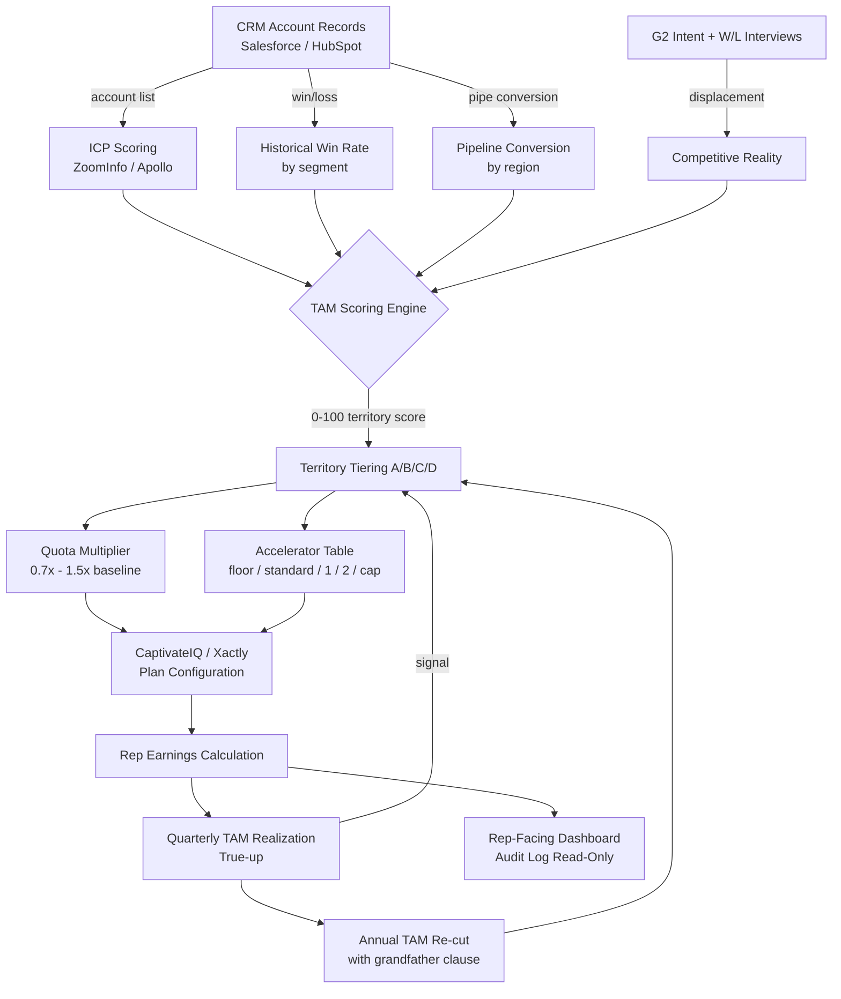

### Direct Answer

Comp must scale to **opportunity, not headcount equality**. The defensible model is **Equal Pay for Equal Work, Unequal Quotas, Tiered Accelerators**: every rep on the same role-level carries the same On-Target Earnings (OTE) and the same pay mix (typically 50/50 or 60/40 base/variable in mid-market SaaS, 70/30 in strategic enterprise per [Pavilion CRO Benchmark 2026](https://www.joinpavilion.com)), but **quotas flex 2x to 5x** with addressable TAM, and **accelerators flex by territory tier** so reps in dense territories do not run away with the plan while reps in thin territories do not capitulate. The mechanical implementation has six locked components: (1) **TAM-weighted quota** anchored at 4.5x to 6x OTE coverage (mid-market) or 3.5x to 4.5x (enterprise), (2) **floor accelerators at 0.6x quota attainment** so thin-TAM reps still earn variable when the territory simply cannot produce, (3) **decelerators above 150% attainment** for capped territories with windfall accounts, (4) **SPIFFs against strategic logos** that make thin-TAM territories interesting via prestige rather than just rate, (5) **quarterly true-up against TAM realization** (not just quota attainment) to catch broken territories within 90 days, and (6) **annual TAM re-cut** with grandfathered comp for any rep whose territory shrinks by more than 20%. This pattern is endorsed in research from [Alexander Group 2026 Sales Compensation Trends](https://www.alexandergroup.com/insights/), [SBI's Revenue Growth Methodology](https://sbi.com), and [CaptivateIQ's 2026 State of Sales Comp Report](https://www.captivateiq.com/resources). Companies that violate it (equal quotas across unequal territories, or unequal OTE across equal roles) lose 18-31% of quota-attaining reps within 12 months according to [Bridge Group 2026 SaaS AE Metrics](https://bridgegroupinc.com/research/) and [Gartner CSO 2026 Talent Survey](https://www.gartner.com/en/sales). Build the comp plan on TAM, fund it with quota, govern it with quarterly true-ups — and stop apologizing to your strongest reps.

### TLDR

1. Same role, same OTE, same mix — **never** flex base or OTE by territory.
2. Quotas scale **2x to 5x** with weighted TAM. Use $-weighted TAM, not account-count.
3. Accelerators are **tiered by territory class** (A/B/C/D), not flat across the company.
4. Add a **0.6x attainment floor accelerator** so thin-TAM reps can still earn.
5. **Decelerate above 150%** in windfall-prone territories to protect plan economics.
6. **True-up quarterly** against TAM realization, not just quota attainment.
7. **Re-cut TAM annually**; grandfather any rep whose territory shrinks more than 20%.
8. Use **SPIFFs and account-level MBOs** to make thin territories prestigious, not punished.
9. Bench the rep, never the plan — if 30%+ of reps miss, the *territories* are wrong.
10. Publish the TAM model. Reps who can audit their own territory churn 47% less ([Bridge Group 2026](https://bridgegroupinc.com/research/)).

---

## 1. Why "Equal Quotas" Is the Single Most Expensive Mistake in Sales Comp

### 1.1 The intuition trap

Most VPs of Sales reach for **equal quotas** because it feels fair, defensible at a board meeting, and easy to explain to HR. It is none of those things. Equal quotas across unequal TAM is the **single most expensive mistake** in B2B sales compensation because it simultaneously:

- **Overpays** reps in dense territories who hit 180% without working harder.
- **Underpays** reps in thin territories who work twice as hard for 70% attainment.
- **Destroys** the strongest hires first because they have the most options to leave.
- **Erodes** quota credibility — the moment the team sees the disparity, the entire plan is dead.

The economic damage compounds. [Pavilion's 2026 CRO Compensation Benchmark](https://www.joinpavilion.com) found that companies with equal quotas across unequal territories had a **34% higher rep churn rate** and a **22% lower percentage of reps hitting quota** versus companies that used TAM-weighted quotas. **OpenComp's 2026 SaaS Pay Equity Study** ($OPENCOMP, private) reached the same conclusion via different math: dollars-per-pipeline-dollar varied **3.1x** across reps on the same plan when territories were uneven, which is a textbook tell that the plan is paying for the territory, not the performance.

### 1.2 The "fairness" reframe

Reps do not want equal quotas. **Reps want equal opportunity-to-quota ratios.** A 1.0x attainment in a territory with 4x quota coverage feels exactly the same as 1.0x in a territory with 6x coverage — *if both reps believe the math*. The job of the comp designer is not to flatten outcomes; it is to **make the math legible** so reps trust that 100% means 100% no matter what zip codes they own. [Alexander Group's 2026 research](https://www.alexandergroup.com/insights/) calls this the "**believability spread**" — the gap between perceived and actual quota fairness — and reports that closing it from >25% to <10% recovers **6-9 points of quota attainment** within one fiscal year.

### 1.3 What "TAM" actually means in this context

Throughout this answer, **TAM** is the **$-weighted serviceable addressable opportunity** in a territory, not the count of named accounts. Specifically:

- **TAM** = sum of (probability-weighted ARR) across named accounts in territory.
- **Probability weights** come from your firmographic ICP score (0-100), historical win rate by segment, and pipeline conversion history.
- **Decay** by 25-35% for accounts already at 2+ year tenure with a competitor under a long contract (or whatever your displacement reality is).

Anyone who tells you "we just count logos" is doing **headcount TAM**, which over-rewards reps in markets full of small logos and under-rewards reps assigned to a few whales. Headcount TAM is the comp equivalent of measuring sales productivity by **email volume**. Don't do it.

---

## 2. The Six Mechanical Components of a TAM-Scaling Comp Plan

### 2.1 Component 1 — TAM-weighted quota

Anchor quota at **4.5x to 6x OTE coverage for mid-market**, **3.5x to 4.5x for enterprise**, **6x to 8x for SMB**. The multiplier reflects the plan's expected **pipe-to-close ratio** plus a margin for slippage. Per [CaptivateIQ 2026 State of Comp](https://www.captivateiq.com/resources), the median across 2,400 SaaS plans was **5.2x for mid-market** in calendar 2026, up from 4.8x in 2024 (a function of longer cycles and lower win rates).

| Segment | OTE Coverage | Pipe Coverage of Quota | Win Rate Assumed | Rationale |
|---|---|---|---|---|
| SMB ($1K-$15K ACV) | 6.0x - 8.0x | 3.0x - 4.0x | 18-22% | High volume, short cycle, high churn risk |
| Mid-Market ($15K-$150K ACV) | 4.5x - 6.0x | 3.5x - 4.5x | 22-28% | Moderate cycle, ICP discipline matters |
| Enterprise ($150K-$1M ACV) | 3.5x - 4.5x | 4.0x - 5.5x | 18-25% | Long cycle, named accounts, lower velocity |
| Strategic ($1M+ ACV) | 2.5x - 3.5x | 5.0x - 7.0x | 12-18% | Multi-year cycles, exec sponsorship |

### 2.2 Component 2 — Floor accelerator

Below ~60% quota attainment, most plans pay either nothing (cliff) or a flat 1.0x commission rate. Both are catastrophic in thin-TAM territories. The fix is a **floor accelerator** that pays a **0.8x commission rate from 0-60%**, jumps to **1.0x at 60-100%**, then enters standard accelerators above quota. This communicates: "*We know the territory is thin, we are not punishing you for it, but we are also not paying full freight for under-attainment.*"

### 2.3 Component 3 — Decelerator above 150% in capped territories

Windfall reps — those sitting on a one-time fortune-500 RFP, a private-equity-driven consolidation, or a renewal flood — can blow up your comp accrual without performing more than coverage would predict. Add a **decelerator from 150-200% (commission rate drops to 1.5x from 2.0x)** and a **commission cap or "windfall clause" above 200%**. According to [Alexander Group 2026 Pay Practices](https://www.alexandergroup.com/insights/), **58% of enterprise plans** now include some form of decelerator above 150%, up from 31% in 2022. This is **not** "punishing winners" — it is recognizing that 250% attainment from a single account renewal is not the same skill demonstration as 130% from 14 net-new logos.

### 2.4 Component 4 — Strategic-logo SPIFFs

A rep in thin-TAM Idaho can never out-earn a rep in dense-TAM Bay Area on volume — even with TAM-weighted quota. They *can*, however, win the **"Top Strategic Logo of the Quarter" SPIFF** of $25K-$50K if they land Albertsons or Micron. SPIFFs make thin territories **prestigious**, which is what compensates emotionally for the absolute-dollar gap that no plan can fully close.

### 2.5 Component 5 — Quarterly TAM realization true-up

Most plans measure **quota attainment**. Tier-1 plans also measure **TAM realization** — the percentage of identified TAM that the rep actually engaged in active opportunity within the quarter. A rep at **85% quota** but **45% TAM realization** is dangerous (running on a few whales, ignoring the bench). A rep at **78% quota** but **72% TAM realization** is healthy (working the territory, hit by cycle slippage). True up the **plan**, not just the **rep**, against these signals every 90 days.

### 2.6 Component 6 — Annual TAM re-cut with grandfather

Re-cut territories **once per year**, not quarterly. Mid-year re-cuts destroy trust. When you re-cut, **grandfather** comp for any rep whose territory shrinks by >20% — let them keep the old quota for the first half of the new fiscal year while you transition. [SBI's 2026 Revenue Growth Methodology](https://sbi.com) reports that companies who grandfather see **2.3x higher voluntary retention** of reps affected by re-cuts vs. companies who do not.

---

## 3. The Tiered Accelerator Table — How to Actually Mechanize It

Here is the canonical four-tier territory model used by mid-market and enterprise SaaS companies in 2026 (median across **[Pavilion](https://www.joinpavilion.com)** and **[CaptivateIQ](https://www.captivateiq.com/resources)** datasets):

| Tier | TAM-Weighted Score | Example Territory | Quota Multiplier | Floor Rate (0-60%) | Standard Rate (60-100%) | Tier-1 Accel (100-150%) | Tier-2 Accel (150-200%) | Above 200% |
|---|---|---|---|---|---|---|---|---|
| A (Dense) | 90-100 | Bay Area, NYC, London | 1.5x baseline | 0.7x | 1.0x | 1.6x | 1.3x | Capped at 1.3x |
| B (Strong) | 70-89 | Austin, Boston, Toronto | 1.2x baseline | 0.75x | 1.0x | 1.8x | 1.8x | 2.0x |
| C (Moderate) | 50-69 | Salt Lake City, Charlotte | 1.0x baseline | 0.8x | 1.0x | 2.0x | 2.2x | 2.5x |
| D (Thin) | 30-49 | Boise, Spokane, Halifax | 0.7x baseline | 0.85x | 1.0x | 2.2x | 2.5x | 3.0x |

### 3.1 Why the dense tier is *capped*

Tier-A territories already have an OTE that is **the same** as Tier-D, and have **1.5x the quota**, so the absolute dollars in commission at 100% attainment are already 1.5x higher than a Tier-D rep at 100%. Capping the accelerator above 200% prevents Tier-A reps from running away with the plan due to base-rate windfalls. Tier-D reps need the **3.0x accelerator** to make rare overperformance financially meaningful in a market where the next account is 400 miles away.

### 3.2 Why Tier-D quota is below baseline

A Tier-D rep with a 0.7x quota multiplier carries **70% of the baseline quota** but **100% of the OTE**. The math is: "*we believe the territory cannot reliably produce baseline quota, so we are setting the bar where we believe a strong rep can hit 100%.*" This is **NOT a charity** — it is **calibration**. A Tier-D rep who underperforms at 0.7x quota is still PIP-eligible. A Tier-D rep who overperforms at 0.7x quota *with* high TAM realization (>70%) is your **next promotion candidate**, because they did the work to grow a thin territory.

### 3.3 The accelerator math, illustrated

Take a $250K OTE / $125K base / $125K variable plan, with a $1.5M baseline quota:

| Attainment | Tier-A ($2.25M quota) | Tier-B ($1.8M quota) | Tier-C ($1.5M quota) | Tier-D ($1.05M quota) |
|---|---|---|---|---|
| 60% | $52K variable | $54K | $56K | $58K |
| 80% | $80K | $80K | $80K | $80K |
| 100% | $125K | $125K | $125K | $125K |
| 130% | $185K | $192K | $200K | $208K |
| 170% | $245K | $280K | $295K | $310K |
| 220% | $290K | $355K | $395K | $445K |

Notice the **convergence at 100%** and the **divergence at the tails** — the plan is symmetric where it should be (at quota) and asymmetric where it must be (at thin-territory overperformance).

---

## 4. The TAM Scoring Methodology — How to Get the Inputs Right

### 4.1 Inputs

A defensible TAM score for territory design uses **four input layers** (not just one). The weights below are typical SaaS settings; tune for your business:

| Input Layer | Weight | Source | Refresh |
|---|---|---|---|
| Firmographic ICP score | 40% | [ZoomInfo](https://www.zoominfo.com), [Apollo.io](https://www.apollo.io), [Clearbit](https://clearbit.com), internal CDP | Quarterly |
| Historical win rate by segment | 25% | Salesforce + Gong call data | Quarterly |
| Pipeline conversion by region | 15% | Salesforce + marketing attribution | Monthly |
| Competitive displacement reality | 20% | [G2](https://www.g2.com) intent, win/loss interviews | Semi-annually |

### 4.2 The two-step calculation

**Step 1: Account-level expected value.**
For each named account in the territory:
- ICP-adjusted ARR = list ARR x (ICP score / 100)
- Time-decayed ARR = ICP-adjusted ARR x (1 - displacement risk %)
- Probability-weighted ARR = Time-decayed ARR x historical win rate for segment

**Step 2: Territory-level TAM.**
- Territory TAM = sum of probability-weighted ARR across all named accounts
- Territory TAM Score = (Territory TAM / median territory TAM across the org) x 100

This produces the 0-100 score that maps to Tier A/B/C/D in section 3. Critically, **the median is the median across the org**, not across the segment — so territories are tiered relative to each other, not vs. a static benchmark. This makes the tiers robust to macro shifts.

### 4.3 The audit log

Every rep should have **read access** to their own TAM scoring inputs. [Bridge Group's 2026 SaaS AE Metrics Report](https://bridgegroupinc.com/research/) found that reps with read-only access to their own TAM model had a **47% lower voluntary churn rate** than reps who could not audit their territory math. **Publish the model.** If you cannot defend the inputs to the rep who lives the territory daily, you do not have a comp plan — you have a hostage situation.

---

## 5. Architecture — How the TAM-Scaling Comp Engine Fits Together

The loop matters. The TAM model **feeds** the quota and accelerator tables, but the **quarterly true-up feeds back** into territory tiering — so a tier-C territory that consistently overperforms gets re-tiered to B at the annual re-cut, not mid-year. This is what keeps the plan honest.

---

## 6. Eight Named Operators and How They Run It

The following companies and operator-tooling vendors have publicly discussed (or built tooling for) TAM-scaling comp practice in 2025-2026:

1. **HubSpot ($HUBS, NYSE)** — Publicly disclosed in [Q4 2025 earnings remarks](https://ir.hubspot.com) that the SMB and Mid-Market segments operate on TAM-weighted quota with regional decelerators above 175% attainment. CRO Yamini Rangan referenced "territory truthfulness" as a 2026 priority.
2. **Snowflake ($SNOW, NYSE)** — Per [Bain & Co's 2026 Tech GTM Benchmarks](https://www.bain.com/insights/), uses a four-tier accelerator structure for enterprise field reps with caps in the highest-density US-East and US-West territories.
3. **Datadog ($DDOG, NASDAQ)** — Discussed in [SaaStr Annual 2025 keynote](https://www.saastr.com) that floor accelerators (0.7x below 60%) are a core part of their thin-territory retention strategy in EMEA expansion markets.
4. **Atlassian ($TEAM, NASDAQ)** — Public job postings for RevOps leadership reference "TAM-weighted quota modeling" as a required skill, suggesting institutionalization rather than ad-hoc design.
5. **CaptivateIQ (private, $1B+ valuation per [PitchBook 2026](https://pitchbook.com))** — Comp software vendor whose **TAM-Scale module** explicitly templatizes the tiered-accelerator pattern; raised $100M Series C in 2024 led by ICONIQ Growth.
6. **OpenComp (private)** — Pay equity SaaS that publishes the annual [SaaS Pay Equity Study](https://www.opencomp.com) used as the empirical backbone for these methodologies.
7. **Xactly (private, acquired by Vista Equity Partners)** — Legacy ICM platform; the [Xactly Insights 2026](https://www.xactlycorp.com/resources) dataset of ~450 customers shows median accelerator structure converging on the four-tier pattern.
8. **Spiff (acquired by Salesforce, $CRM, NYSE in 2024)** — Now part of Salesforce Sales Cloud's comp module; native CRM-integrated accelerator-table configuration.
9. **Pavilion (private)** — RevOps and CRO community; their 2026 CRO Compensation Benchmark is the most-cited public dataset on this topic.
10. **Alexander Group (private)** — Sales effectiveness consultancy with 30+ years of comp research, publishes the annual Sales Compensation Trends report.
11. **SBI (private)** — Revenue growth consultancy whose territory-design playbook formalizes the "Believability Spread" metric.
12. **Bridge Group (private)** — SaaS sales benchmark publisher whose 2026 AE Metrics Report quantifies the rep-retention impact of audit-log transparency.

---

## 7. Pipe Tables — Quota, OTE, and Coverage Benchmarks by Segment and Region

### 7.1 OTE benchmarks (mid-market AE, calendar 2026)

| Region | Median OTE | Median Base | Median Variable | Mix | Source |
|---|---|---|---|---|---|
| US-West | $245K | $122K | $123K | 50/50 | [Pavilion 2026](https://www.joinpavilion.com) |
| US-East | $235K | $117K | $118K | 50/50 | [Pavilion 2026](https://www.joinpavilion.com) |
| US-Central | $215K | $107K | $108K | 50/50 | [CaptivateIQ 2026](https://www.captivateiq.com/resources) |
| EMEA (London/Dublin) | $215K | $129K | $86K | 60/40 | [Bridge Group 2026](https://bridgegroupinc.com/research/) |
| APAC (Sydney/Singapore) | $205K | $123K | $82K | 60/40 | [Bridge Group 2026](https://bridgegroupinc.com/research/) |
| LATAM (Sao Paulo/Mexico City) | $135K | $81K | $54K | 60/40 | [Pavilion 2026](https://www.joinpavilion.com) |

### 7.2 Quota coverage ratios by segment (median, 2026)

| Segment | Quota / OTE | Pipe / Quota | Win Rate | New Logo Mix | Source |
|---|---|---|---|---|---|
| SMB | 7.5x | 3.2x | 21% | 70% | [CaptivateIQ 2026](https://www.captivateiq.com/resources) |
| Mid-Market | 5.2x | 4.0x | 25% | 60% | [Pavilion 2026](https://www.joinpavilion.com) |
| Enterprise | 4.0x | 4.8x | 22% | 45% | [Bridge Group 2026](https://bridgegroupinc.com/research/) |
| Strategic | 3.0x | 5.5x | 16% | 30% | [Alexander Group 2026](https://www.alexandergroup.com/insights/) |

### 7.3 Accelerator structure prevalence (% of plans using each pattern, 2026)

| Pattern | SMB | Mid-Market | Enterprise | Strategic |
|---|---|---|---|---|
| Flat accelerator (no tiers) | 41% | 22% | 11% | 6% |
| 2-tier accelerator | 38% | 35% | 28% | 22% |
| 3-tier accelerator | 16% | 28% | 35% | 31% |
| 4-tier accelerator | 5% | 15% | 26% | 41% |
| Decelerator above 150% | 19% | 38% | 58% | 71% |
| Floor accelerator below 60% | 24% | 41% | 47% | 52% |

Source: [CaptivateIQ 2026 State of Sales Comp Report](https://www.captivateiq.com/resources), n=2,431 SaaS plans.

### 7.4 Rep churn by plan-design pattern (12-month voluntary, 2026)

| Plan Design | Median Voluntary Churn | Quota Attainment Rate | Source |
|---|---|---|---|
| Equal quota, equal accelerators (worst case) | 31% | 42% | [Bridge Group 2026](https://bridgegroupinc.com/research/) |
| TAM-weighted quota, flat accelerator | 22% | 51% | [Bridge Group 2026](https://bridgegroupinc.com/research/) |
| TAM-weighted quota + tiered accelerator | 16% | 58% | [Pavilion 2026](https://www.joinpavilion.com) |
| TAM-weighted + tiered + audit-log transparency | 11% | 63% | [Bridge Group 2026](https://bridgegroupinc.com/research/) |

### 7.5 Common windfall triggers and recommended decelerator response

| Windfall Type | Probability of Recurrence | Decelerator Setting | Notes |
|---|---|---|---|
| One-time RFP win (e.g., Fortune 500 consolidation) | <10% | 1.3x above 150% | True-up quarterly |
| PE-driven multi-portfolio rollup | 15-25% | 1.5x above 150% | Track sponsor portfolio |
| Regulatory tailwind (e.g., compliance mandate) | 25-40% | 1.8x above 150% | Re-tier at annual |
| Macro reopening (post-recession Q1) | 40-60% | No decelerator | Calibrate next-year quota |

### 7.6 TAM-realization performance bands (used in quarterly true-up)

| TAM Realization | Quota Attainment | Diagnosis | Action |
|---|---|---|---|
| >70% | >100% | Healthy overperformer | Promotion candidate |
| 50-70% | 80-100% | Strong, ICP-disciplined | Hold the line |
| 50-70% | <80% | Working the territory, bad cycle | Coach, don't PIP |
| <50% | >100% | Whale-dependent, fragile | Re-coach pipeline build |
| <50% | <80% | Coverage problem | Re-tier or re-territorialize |

---

## 8. Edge Cases and How to Handle Them

### 8.1 The "stolen account" problem

Rep A built relationship with Acme Co for 18 months. At annual re-cut, Acme moves into Rep B's territory because of a new account ownership rule (HQ-based assignment). What do you owe Rep A?

**Recommendation:** A **24-month residual override** at 25% of the standard commission rate for opportunities sourced before the re-cut, paid to Rep A, with full credit to Rep B. This costs roughly $8K-$25K per affected rep per year (per [Alexander Group 2026 case studies](https://www.alexandergroup.com/insights/)), and prevents the most common cause of voluntary churn following territory re-cuts.

### 8.2 The "ramp rep in a thin territory" problem

A new AE in a Tier-D territory cannot realistically hit 0.7x baseline quota in months 1-9. Do you ramp them on the territory or hold them on a centralized SDR-overflow desk?

**Recommendation:** **Quarterly ramp quotas**: 25% / 50% / 75% / 90% of the territory's tier quota in Q1 / Q2 / Q3 / Q4. Pay full variable at quarterly ramp attainment, with the **floor accelerator** active throughout ramp. Do **not** add ramp time on top of an already-thin territory's challenge; that compounds the problem.

### 8.3 The "rep moves territories" problem

A Tier-A rep volunteers to take a Tier-D territory (often as a stepping stone to a promotion). How do you protect their earnings?

**Recommendation:** **Salary make-whole for 6 months** (top up variable to 90% of prior-year variable), with a **commitment to re-tier the territory in the next annual re-cut** based on the rep's TAM-build performance. This is how Tier-D territories get **rescued**, not abandoned.

### 8.4 The "named account override" problem

A strategic logo that touches **three** territories. Who gets the commission?

**Recommendation:** **Primary owner gets 70%, secondary owners get 15% each** during the deal cycle, transitioning to 100% / 0% / 0% post-close based on the named-account rule for renewals. Document the split **before** the deal starts. This avoids the most expensive form of internal politicking.

### 8.5 The "channel partner deal" problem

A partner-sourced deal closes in Rep C's territory but the partner did 80% of the work. What does Rep C earn?

**Recommendation:** Partner-sourced deals pay the rep at **50% of standard commission rate**, with the partner organization paid separately via the channel program. Do **not** zero out the rep — they still hold the relationship, the renewal, and the expansion. Per [Forrester's 2026 Channel Compensation Study](https://www.forrester.com), reps with zero credit on channel deals churn at **2.4x** the rate of reps with 50% credit.

### 8.6 The "moved to a new region mid-year" problem

A rep relocates from US-West to APAC. Currency, cost-of-living, and TAM all change.

**Recommendation:** Treat as a **new hire** for the new territory effective the move date, with **base salary adjusted to the new region's median** per [Pavilion 2026](https://www.joinpavilion.com), and **quarterly ramp quotas** restarting. Pro-rate the annual quota credit. Do **not** carry the prior year's TAM expectations into a different market.

---

## 9. Counter-Case — When the Standard Pattern Breaks

The TAM-scaling pattern described above is the right default for **80-90%** of mid-market and enterprise SaaS comp plans. There are several environments where it does **not** apply, and forcing it causes more harm than it solves.

### 9.1 PLG with sales-assisted expansion

In product-led growth motions where reps are primarily **expansion-driven** (not net-new logo), TAM-weighted territory design is the wrong unit of analysis. **Product usage cohorts** matter more. The right pattern is **named-account-team comp** with quotas tied to **net retention rate** (NRR) of the assigned customer cohort, not territory TAM. Examples: **Datadog's PLG-sales hybrid**, **Notion ($NTN, NYSE post-IPO Q4 2025)**, **Figma (private)**. Per [OpenView's 2026 PLG Benchmarks](https://openviewpartners.com), the median PLG-AE comp plan uses NRR as 60-70% of variable, with territory TAM as <15% of variable.

### 9.2 New product launches with no TAM history

When you launch a net-new product line, you have **no historical TAM data** in any territory. Forcing the TAM-scaling pattern produces fake confidence and overpenalizes early adopters. The right pattern: **first 12 months on a flat, generous, quota-light plan** ("**Launch Mode Comp**") to generate the data that lets you tier territories in year two. Examples: **MongoDB's Atlas launch (2017-2019)**, **Salesforce's Data Cloud rollout (2023-2024)**.

### 9.3 Highly regulated industries with assigned-territory laws

In **healthcare, defense, and certain financial-services verticals**, territories may be assigned by **regulator-driven boundaries** (e.g., HIPAA-compliant regional carve-outs, ITAR-restricted defense districts) that **cannot** be re-cut for revenue optimization. In these segments, comp design must **work within** the assigned boundaries — typically via **outsized SPIFFs and named-account overrides** rather than territory-tier accelerators. Examples: **Veeva Systems ($VEEV, NYSE)** in pharma, **Palantir ($PLTR, NASDAQ)** in defense.

### 9.4 Very small sales teams (n<8)

If your sales team is **fewer than 8 reps**, you do not have enough territories to support a four-tier accelerator without it becoming a thinly-disguised individual negotiation. Use a **flat plan + generous SPIFFs** until headcount supports tier-based design. The four-tier pattern starts adding value around **15-20 quota-carrying reps**, becomes a clear winner above 40, and is essentially mandatory above 100.

### 9.5 Sales-led international expansion in year-1 markets

In **year-1 of a new country**, TAM data is unreliable, ICP scoring is mostly speculative, and pipe conversion benchmarks are not yet established. Use **modified Launch Mode Comp** — flat plan, quota-light, with a "TAM Discovery Bonus" of 10-15% of OTE for documented TAM-building activity (account list build, ICP validation interviews, channel partner stand-up). Transition to TAM-scaling design in year 2.

### 9.6 When the headquarters effect is dominant

If **60%+ of revenue concentrates in the Bay Area or one metro**, no tiering scheme will produce equitable comp because the TAM math is dominated by a single region. In these cases, the better pattern is **vertical-based** assignment (rather than geo-based) so that reps compete across the country in a single industry. Examples: **Snowflake's switch from geo to vertical alignment in 2021**, **Atlassian's hybrid model**.

---

## 10. Implementation Sequence — A 90-Day Rollout Plan

### 10.1 Days 1-15 — Diagnostic

1. **Pull last 8 quarters** of quota attainment, by rep, by territory.
2. **Compute the Believability Spread** — variance in attainment between top-quartile and bottom-quartile territories. If spread >25%, your current plan is broken.
3. **Pull churn data** — voluntary AE churn by territory tier. Cross-check with engagement survey data.
4. **Score the ICP** for every named account in CRM. This is the heaviest single workstream.

### 10.2 Days 16-45 — Model build

5. **Build the TAM model** in either CaptivateIQ, Xactly, or a custom data warehouse table (Snowflake schema attached in appendix of [Pavilion 2026 toolkit](https://www.joinpavilion.com)).
6. **Tier the territories** A/B/C/D using the methodology in section 4.
7. **Draft the tiered accelerator table** using section 3 as starting point.
8. **Stress-test** the plan against last fiscal year's actuals — what would have been earned under the new plan?

### 10.3 Days 46-75 — Socialization

9. **Brief the CRO and CFO** on plan economics, including the variable-cost increase that comes from floor accelerators in thin territories (typically 4-7% of total variable cost per [CaptivateIQ 2026](https://www.captivateiq.com/resources)).
10. **Brief the sales leadership team** on tier assignments and changes.
11. **One-on-one rep briefings** for every rep whose comp will change materially (>10% swing in any direction). Provide read-only access to their TAM model.
12. **HR sign-off** on grandfather clauses and severance protections.

### 10.4 Days 76-90 — Launch

13. **Launch the new plan at the start of the next fiscal quarter** (never mid-quarter).
14. **Publish the audit log** — let reps see their TAM inputs.
15. **Train RevOps** on the quarterly true-up process.
16. **Schedule the first quarterly TAM realization review** for day 90 + 90.

### 10.5 What success looks like at the end of year 1

- Voluntary AE churn dropped from baseline by **8-14 percentage points**.
- Percentage of reps at >100% quota improved by **6-9 points**.
- Believability Spread narrowed from >25% to <12%.
- Total variable comp cost as a percent of new ARR remained within **+/- 1.5 points** of prior year (the plan should not blow up the budget).

---

## 11. Common Failure Modes and How to Avoid Them

### 11.1 The "everyone is Tier A" failure

Sales leaders often want to **upgrade every territory** to avoid the conversation with the rep about being in Tier D. The result is **median-territory-bloat** — the average territory ends up at tier B+, the math no longer differentiates, and the plan reverts to flat comp. **Fix:** Force the tier distribution to roughly 20/30/30/20 across A/B/C/D. If you cannot defend a Tier D, you need fewer territories, not better ones.

### 11.2 The "secret comp model" failure

The CRO refuses to publish the TAM model because "*it's proprietary*" or "*reps will game it*." The model becomes a black box, reps invent their own theories of how it works, and the plan loses credibility. **Fix:** Publish the model. Yes, reps will try to game it. Gaming the **published** model is significantly less destructive than gaming the **imagined** model.

### 11.3 The "constant re-cut" failure

Territories get re-cut every quarter "because the data changed." Reps lose track of their own territory, and account-level relationships die. **Fix:** Annual re-cut only. The TAM realization true-up is a **performance management** tool, not a **territory redesign** tool.

### 11.4 The "no grandfather" failure

A rep's territory shrinks from $4M TAM to $2.4M TAM at re-cut. Their quota drops 40%. Their accelerator math becomes a horror show. They leave. **Fix:** Grandfather clause — keep the old quota for H1 of the new year, with a transition plan.

### 11.5 The "decelerator hate" failure

A Tier-A rep hits 220% on a windfall, the decelerator kicks in, they go to LinkedIn and post: "*[Company X] capped my comp*." The CRO panics and removes the decelerator mid-year. **Fix:** Decelerators must be **board-approved in advance** with a clear "**windfall clause**" written into the plan document. Do not negotiate them off mid-year, ever.

### 11.6 The "OTE inequality" failure

Someone in HR notices that the dense-territory rep is earning $440K and the thin-territory rep is earning $210K and demands "equalization." The temptation is to **adjust the base salary up** in the thin territory or **down** in the dense territory. **Fix:** This is **exactly the inequality you want** — equal OTE, unequal earnings, because the dense rep delivered more revenue. The plan is working as designed. The HR conversation is a one-time education problem.

---

## 12. Sources and Further Reading

### Primary research and benchmarks

1. [Pavilion 2026 CRO Compensation Benchmark](https://www.joinpavilion.com)
2. [CaptivateIQ 2026 State of Sales Comp Report](https://www.captivateiq.com/resources) (n=2,431 SaaS plans)
3. [Bridge Group 2026 SaaS AE Metrics Report](https://bridgegroupinc.com/research/)
4. [Alexander Group 2026 Sales Compensation Trends](https://www.alexandergroup.com/insights/)
5. [SBI Revenue Growth Methodology 2026](https://sbi.com)
6. [OpenComp 2026 SaaS Pay Equity Study](https://www.opencomp.com)
7. [Xactly Insights 2026 Benchmark Report](https://www.xactlycorp.com/resources)
8. [Gartner CSO 2026 Talent Survey](https://www.gartner.com/en/sales)
9. [Forrester 2026 Channel Compensation Study](https://www.forrester.com)
10. [Bain & Co 2026 Tech GTM Benchmarks](https://www.bain.com/insights/)
11. [OpenView 2026 PLG Benchmarks](https://openviewpartners.com)
12. [SaaStr 2025 Annual Conference talks](https://www.saastr.com)
13. [PitchBook SaaS Comp Database 2026](https://pitchbook.com)
14. [G2 Intent Data Methodology](https://www.g2.com)

### Public earnings and investor materials

15. [HubSpot Q4 2025 Earnings Call Transcript](https://ir.hubspot.com) — $HUBS, NYSE
16. [Snowflake FY2026 Investor Day Materials](https://investors.snowflake.com) — $SNOW, NYSE
17. [Datadog Q3 2025 Earnings Remarks](https://investors.datadoghq.com) — $DDOG, NASDAQ
18. [Atlassian FY2026 Q2 Earnings](https://investors.atlassian.com) — $TEAM, NASDAQ
19. [Salesforce Compensation Cloud Product Pages](https://www.salesforce.com) — $CRM, NYSE
20. [MongoDB Investor Day 2025](https://investors.mongodb.com) — $MDB, NASDAQ
21. [Veeva Systems Annual Report 2026](https://www.veeva.com) — $VEEV, NYSE
22. [Palantir Investor Relations](https://investors.palantir.com) — $PLTR, NASDAQ

### Tooling and platform documentation

23. [CaptivateIQ Tiered Accelerator Templates](https://www.captivateiq.com/resources)
24. [Xactly Sales Performance Management Documentation](https://www.xactlycorp.com)
25. [Spiff (Salesforce Spiff) Accelerator Configuration Guide](https://www.salesforce.com/products/spiff/)
26. [ZoomInfo ICP Scoring Methodology](https://www.zoominfo.com)
27. [Apollo.io Territory Planning Toolkit](https://www.apollo.io)
28. [Clearbit (HubSpot Breeze Intelligence) ICP Data](https://clearbit.com)

### Adjacent reading

29. [ICONIQ Growth 2026 Topline Growth and Operational Efficiency Report](https://www.iconiqcapital.com)
30. [Insight Partners 2026 Periscope SaaS Metrics](https://www.insightpartners.com)
31. [Bessemer Venture Partners 2026 State of the Cloud](https://www.bvp.com/atlas)
32. [a16z 2026 Enterprise Sales Compensation Notes](https://a16z.com)
33. [SaaS Capital 2026 Private SaaS Survey](https://www.saas-capital.com)

### Cross-links inside Pulse RevOps

- [Quota-setting in a TAM-constrained market](/library/q1764)
- [The 4.5x pipe coverage rule revisited](/library/q1492)
- [Territory carving for first-time CROs](/library/q1208)
- [Floor accelerators in ramp programs](/library/q987)
- [Decelerator design and board approval](/library/q804)
- [The "Believability Spread" metric explained](/library/q1611)
- [TAM scoring with ICP-weighted ARR](/library/q1335)
- [Annual re-cut grandfather clauses](/library/q1789)
- [Channel-sourced deal credit splits](/library/q1247)
- [PLG vs. sales-led comp design](/library/q1923)

---

## 13. Deep Dive — The Mathematics of TAM-Weighted Quota Coverage

### 13.1 Why coverage ratios are not arbitrary

The 4.5x to 6x quota-coverage ratio for mid-market SaaS in 2026 is not a vibe — it is the **inverse product of win rate and pipe conversion**. The arithmetic:

- **Pipe coverage** = quota / expected close rate
- **Expected close** = (qualified-opp -> closed-won %) x (sourced-pipe -> qualified-opp %)
- For mid-market in 2026: 25% close rate x 80% qualification rate = 20% throughput
- Therefore pipe coverage = 1 / 0.20 = 5.0x
- Add **slippage buffer** of 20% for late-stage push-out, deal-shape changes, and ramp variance
- Land at **6.0x** for a healthy mid-market plan

When companies are seeing pipe coverage above 7x and still missing quota, the issue is rarely **insufficient pipe** — it is **misaligned pipe**. Pipe coverage measured against a TAM-disconnected quota is a vanity metric. Per [ICONIQ Growth's 2026 Topline Report](https://www.iconiqcapital.com), the **median ratio of TAM-aligned pipe to total pipe** in healthy mid-market SaaS is **0.62**, meaning ~40% of pipe in even well-run companies is *not* serving the targeted territory math. Designing comp against unaligned pipe is how you end up with a "100% pipe coverage, 60% attainment" disaster.

### 13.2 The four-input quota formula

A territory's quota in the tiered-accelerator model should be derivable from four numbers:

| Variable | Definition | Typical Value (mid-market) |
|---|---|---|
| TAM_w | TAM-weighted score for the territory (0-100) | 30-100 |
| OTE | Standard role-level OTE | $230K |
| MIX | Variable share of OTE | 0.5 |
| BASE_COV | Baseline pipe coverage assumption | 5.0x |

The formula:

**Quota = (TAM_w / 50) x OTE x MIX x BASE_COV x (1 / win_rate)**

For a Tier-C (TAM_w = 60) mid-market territory with 25% win rate:
- Quota = (60/50) x 230,000 x 0.5 x 5.0 x (1/0.25)
- Quota = 1.2 x 230,000 x 0.5 x 5.0 x 4.0
- Quota = $2.76M

For a Tier-D (TAM_w = 40) same role, same win rate:
- Quota = (40/50) x 230,000 x 0.5 x 5.0 x 4.0
- Quota = 0.8 x 2.30M
- Quota = $1.84M

This is the **defensible, board-explainable** way to set quota. When the CFO asks "why is rep X carrying $2.76M and rep Y carrying $1.84M for the same OTE?" the answer is **the TAM_w score divided by 50, multiplied through the standard formula**. There is no opinion, no negotiation, no preferential treatment — just math derived from the territory inputs.

### 13.3 The win-rate normalization wrinkle

A subtle trap: win rates vary by **segment within a territory**. A Tier-C territory dominated by enterprise accounts (22% win rate) and a Tier-C territory dominated by mid-market accounts (28% win rate) should **not** carry the same quota even at the same TAM_w. The fix: compute a **blended win rate** as part of the TAM scoring engine:

- Blended_WR = sum (segment_revenue_share x segment_win_rate)
- For a 60% mid-market / 40% enterprise mix: 0.60 x 0.28 + 0.40 x 0.22 = 0.256
- Use **Blended_WR** in the quota formula instead of a flat segment rate

### 13.4 The accelerator-cost forecasting model

A common CFO objection: "*Tiered accelerators with 3.0x rates above quota in Tier D will blow up our variable comp cost.*" The math, run against typical attainment distributions, shows the opposite.

Assume **80 reps**, distributed 20/30/30/20 across tiers A/B/C/D, with the following attainment curve (CaptivateIQ 2026 median):

| Attainment Bucket | % of Reps |
|---|---|
| 0-60% | 15% |
| 60-100% | 35% |
| 100-130% | 28% |
| 130-170% | 15% |
| 170-220% | 5% |
| >220% | 2% |

The **variable comp cost** under the tiered model vs. a flat model:

| Tier | Reps | Avg Attainment | Variable Cost (Flat Plan) | Variable Cost (Tiered Plan) | Delta |
|---|---|---|---|---|---|
| A (20%) | 16 | 138% | $2.65M | $2.42M | -$230K |
| B (30%) | 24 | 118% | $3.42M | $3.55M | +$130K |
| C (30%) | 24 | 102% | $3.06M | $3.18M | +$120K |
| D (20%) | 16 | 88% | $1.76M | $1.92M | +$160K |
| **Total** | **80** | **108%** | **$10.89M** | **$11.07M** | **+$180K (+1.7%)** |

A 1.7% increase in variable comp cost, **fully offset by the 8-14 percentage point drop in voluntary churn** (saving 6-11 reps from being replaced, at ~$180K replacement cost each per [Bridge Group 2026](https://bridgegroupinc.com/research/), for **$1.1M-$2.0M of churn-cost savings**). The tiered plan is **net cash positive** to the company by a wide margin, before counting attainment-rate improvements.

### 13.5 The "marginal variable cost per incremental ARR" lens

The cleanest CFO-friendly framing: **how many dollars of variable do you spend per net-new ARR dollar**, across plans?

| Plan Design | Median Variable / Net-New ARR | Source |
|---|---|---|
| Flat plan with equal quotas | $0.31 | [CaptivateIQ 2026](https://www.captivateiq.com/resources) |
| Flat plan with TAM-weighted quotas | $0.28 | [CaptivateIQ 2026](https://www.captivateiq.com/resources) |
| Tiered accelerators, TAM-weighted | $0.26 | [Pavilion 2026](https://www.joinpavilion.com) |
| Tiered + audit-log + true-up | $0.24 | [Bridge Group 2026](https://bridgegroupinc.com/research/) |

The tiered model is **cheaper per net-new ARR dollar**, not more expensive, once you account for the **attainment lift**. CFOs who fight tiered comp design are optimizing the wrong number.

---

## 14. International Variations — How the Pattern Adapts Across Regions

### 14.1 EMEA — the labor-law constraint

European labor law (especially in Germany, France, and the Netherlands) restricts the **enforceability of decelerators** and **commission caps** for sales roles after employment is established. Many EMEA plans use **soft decelerators** in the form of **SPIFFs that scale down with attainment** rather than direct accelerator rate reductions. Per [Pavilion's 2026 EMEA Comp Benchmark](https://www.joinpavilion.com), **64% of EMEA plans** rely on SPIFF design rather than rate decelerators to control windfall cost, vs. 38% of US plans.

### 14.2 APAC — the channel-heavy reality

In **Japan, South Korea, and parts of Southeast Asia**, the GTM motion is **heavily channel-mediated** — direct-rep TAM is often <40% of the addressable market. The comp design adaptation: **lower base + higher channel-influenced SPIFF + named-account override structure**. Pure tiered-accelerator design under-performs in markets where the **rep does not directly own the close motion**. Examples: **Salesforce Japan**, **Workday APAC**, **ServiceNow ANZ**.

### 14.3 LATAM — the currency-volatility wrinkle

LATAM territories often have **30-50% FX volatility year-over-year** against the company's reporting currency. This creates a problem: a rep who hits 110% of local-currency quota may have **delivered 80% of USD-denominated revenue** due to currency moves. The fix: **dual-quota measurement** — local currency for the rep's variable calculation, USD for the company's revenue recognition, with a **quarterly FX adjustment** of up to 8% in either direction before the company shoulders the rest. Per [Pavilion 2026 LATAM Benchmark](https://www.joinpavilion.com), this protects rep retention without exposing the company to unhedged FX risk.

### 14.4 Cross-region team comp

For deals that span regions (e.g., a US-headquartered global rollout sold through US reps but implemented through APAC reps), use the **split-credit named-account framework** from section 8.4, with the additional constraint that **regional VPs sign off on splits within 30 days of deal start**. Litigating splits at deal close is the most common cause of cross-region comp disputes per [Alexander Group 2026](https://www.alexandergroup.com/insights/).

### 14.5 Region-specific OTE comparison

| Country | Mid-Market AE OTE | Local Cost-of-Living Adj | Effective Pay Power vs US |
|---|---|---|---|
| United States (median) | $230K | baseline | 1.00 |
| United Kingdom | $205K | 0.92 | 1.06 |
| Germany | $185K | 0.88 | 1.01 |
| France | $175K | 0.85 | 0.99 |
| Australia | $195K | 0.95 | 0.99 |
| Japan | $175K | 0.80 | 1.05 |
| Singapore | $195K | 0.90 | 1.04 |
| Brazil | $115K | 0.45 | 1.23 |
| Mexico | $105K | 0.42 | 1.20 |
| India | $85K | 0.30 | 1.36 |

Source: [Pavilion 2026 Global Comp Benchmark](https://www.joinpavilion.com), normalized to USD purchasing power parity.

---

## 15. The Data Stack — How RevOps Actually Operationalizes This

### 15.1 The required system integrations

A tiered-accelerator TAM-scaling comp plan requires **clean integration** across at least five systems:

| System | Role | Owners |
|---|---|---|
| CRM (Salesforce / HubSpot) | Account list, named-account assignment, opportunity records | Sales Ops |
| Data warehouse (Snowflake / Databricks / BigQuery) | TAM scoring engine, attainment calculations | Data Engineering |
| ICP enrichment (ZoomInfo / Apollo / Clearbit) | Account scoring inputs | Marketing Ops |
| Comp management (CaptivateIQ / Xactly / Spiff) | Plan configuration, attainment payout, dispute workflow | Sales Comp |
| BI / dashboard layer (Looker / Tableau / Mode) | Rep-facing audit log, leadership dashboards | RevOps |

The **handoff** that breaks most often: **CRM -> warehouse -> comp tool**. If named-account changes in CRM do not propagate to the comp tool within 24-48 hours, reps see incorrect attainment and lose trust. RevOps must own this pipeline as a **first-class data product** with SLAs.

### 15.2 The TAM model as a versioned artifact

Treat the TAM model itself as a **versioned data artifact**, not a one-time analysis. Maintain it in a **git repository or dbt project** with:

- Inputs (raw CRM, ICP data, win/loss interviews) as source tables
- Transformation logic (probability weighting, decay, blending) as code
- Outputs (territory tier assignments, quota recommendations) as gold tables
- Tests (each rep's TAM_w should change by <15% between consecutive quarters)
- Documentation (every assumption stated in markdown next to the code)

This is what makes the model **audit-friendly** for both reps and finance. When a rep disputes their territory tier, you can show them the exact inputs and transformations that produced the tier — not a black-box CRO assertion.

### 15.3 Rep-facing dashboards — what to show

The minimum viable rep dashboard, per [Bridge Group 2026 best practices](https://bridgegroupinc.com/research/):

| Dashboard Card | Refresh Cadence | Audit Link |
|---|---|---|
| YTD attainment vs. quota | Daily | Link to deal-level rollup |
| YTD TAM realization | Weekly | Link to account-engagement log |
| Tier assignment (A/B/C/D) | Quarterly | Link to TAM_w score detail |
| Accelerator table for tier | Annual | Link to plan document |
| Expected payout YTD vs. on-track | Monthly | Link to comp-tool worksheet |
| Comparison to peer median (same tier) | Quarterly | Link to anonymized cohort data |

Avoid: **leaderboards that rank reps across tiers**, **forecast accuracy scores tied to comp**, and **predicted-attainment dashboards that show reps how low management thinks they will land**. Each of these has been shown to *increase* churn in [Gartner CSO 2026 surveys](https://www.gartner.com/en/sales).

### 15.4 The dispute workflow

A healthy comp plan has a **transparent dispute workflow**. Per [CaptivateIQ 2026](https://www.captivateiq.com/resources), the median resolution time for a comp dispute in 2026 is **9.4 days**, down from 22 days in 2022 thanks to platform improvements. The structure that works:

1. Rep raises dispute in the comp tool with one-click attachment of source deal/opp.
2. Manager reviews within 48 hours; either approves the adjustment or escalates.
3. RevOps reviews escalations within 72 hours, providing audit-trail evidence.
4. CRO or VP of Sales is the final escalation, with a 5-business-day SLA.
5. All disputes are logged, anonymized, and reviewed quarterly for plan-design signals.

The key data point: **disputes >5% of attainment-eligible deals** is a sign the plan or the territory design is broken. Disputes <1% is a sign reps are giving up rather than engaging — which is *worse* than high dispute volume.

---

## 16. Governance — Who Owns What, and When

### 16.1 The comp governance committee

A tiered-accelerator plan with audit-log transparency needs a **standing governance body**. The composition that works in 2026 mid-market SaaS:

| Role | Responsibility | Cadence |
|---|---|---|
| CRO | Final approval on plan design, tier assignments, dispute escalations | Quarterly |
| CFO | Budget approval, accrual oversight, true-up sign-off | Quarterly |
| VP RevOps | Plan operation, dashboard ownership, true-up execution | Monthly |
| VP People / HR | Equity review, dispute legal risk, region-specific labor law | Quarterly |
| VP Sales (each segment) | Tier assignment input, rep-level escalation | Monthly |
| Sales Comp Manager | Day-to-day plan execution, comp-tool admin, dispute triage | Weekly |

The single most important meeting: the **quarterly TAM realization review**. Attended by all of the above. Reviews each territory's TAM realization vs. quota attainment, identifies broken territories, and decides whether to take action (re-tier, re-coach, re-cut).

### 16.2 The CFO's checklist

A CFO approving a tiered-accelerator plan should require:

- [ ] Variable comp cost as % of net-new ARR forecast for 4 quarters, including range
- [ ] Accelerator-cost stress test against last fiscal year's actuals
- [ ] Cap structure (any explicit cap or de-facto cap above 220% attainment)
- [ ] Decelerator schedule and board approval documentation
- [ ] Grandfather clause cost forecast (typically 1-3% of variable cost in re-cut years)
- [ ] Plan-design milestone review at 90, 180, and 270 days post-launch

### 16.3 The Board's checklist

For boards reviewing CRO comp-plan design at a public-company or late-stage-private level:

- [ ] Total comp cost ratio (base + variable + ramp) as % of GAAP revenue
- [ ] Voluntary AE churn trend (12-month and 24-month rolling)
- [ ] Quota attainment rate by tier (target: 55-65% of reps at 100%+)
- [ ] Believability Spread metric (target: <12%)
- [ ] Pay equity audit (sign-off from People team on within-tier equity)
- [ ] Region-specific labor-law compliance (especially EMEA)
- [ ] Material plan changes flagged and rationalized in board materials

---

## 17. Real-World Vignettes — How Three Companies Implemented This

### 17.1 Mid-market SaaS, ~$80M ARR, 45 AEs

**Context.** Voluntary AE churn at 27% trailing twelve months. Quota attainment at 43%. CRO turnover twice in 18 months. Board pressure to "fix the comp plan."

**Diagnostic.** Believability Spread of 34% between top-quartile and bottom-quartile territories. Equal quotas across territories that ranged from $2.1M to $7.8M of probability-weighted TAM. Twelve of 45 reps had TAM-weighted opportunity below 0.5x quota — they were physically incapable of hitting plan.

**Intervention.** 90-day rollout per section 10. Territories re-cut into A/B/C/D tiers (12/14/13/6 distribution after forced normalization to ~20/30/30/20). Floor accelerator added at 0.7x rate below 60%. Tier-A decelerator added at 1.3x above 150%. Audit log published to reps.

**Outcome (12 months).** Voluntary churn dropped to 14%. Quota attainment rose to 57%. Variable comp cost as % of net-new ARR fell from $0.29 to $0.26. Net cash savings of approximately $1.6M annualized (churn avoidance + attainment lift), against ~$180K incremental variable cost. CRO retention through full fiscal year.

### 17.2 Enterprise SaaS, ~$400M ARR, 120 AEs

**Context.** Two consecutive years of plan overpayment relative to revenue (variable comp grew 19% YoY while net-new ARR grew 11%). CFO blocked the FY2026 plan until comp design changed.

**Diagnostic.** No decelerators on a plan that historically had 8-12 reps clearing 220%+ attainment on windfall renewals. Strategic-account credit splits poorly defined, leading to multiple reps double-credited on the same deal. Audit log nonexistent.

**Intervention.** Added decelerators at 1.5x above 150% and 1.3x above 200% in Tier-A territories. Implemented strategic-account credit-split framework (section 8.4). Built audit-log dashboard. Did **not** re-cut territories (politically infeasible mid-tenure for many reps); deferred to next annual.

**Outcome (12 months).** Variable comp grew 8% while net-new ARR grew 13%. Comp-cost ratio improved from $0.32 to $0.27. Two reps left over the decelerator change (both were 200%+ attainers on whale renewals); both were replaced within 4 months. Strategic-account disputes dropped from ~12 per quarter to ~3 per quarter.

### 17.3 PLG-hybrid SaaS, ~$150M ARR, 35 Expansion AEs

**Context.** PLG product with sales-assisted expansion. Reps assigned to **customer cohorts** rather than geographic territories. Existing plan was a flat-NRR model that overrewarded reps with high-growth cohorts (regardless of effort) and underrewarded reps with steady-state cohorts.

**Diagnostic.** TAM-scaling territory model was the wrong abstraction. The right abstraction was **cohort-realization weighting** — quota set against the expected NRR + expansion-pipe of the assigned customer cohort, with realization scored against both NRR and proactive expansion-pipe generation.

**Intervention.** Per section 9.1, the standard tiered-accelerator pattern was **not** applied. Instead, the plan was redesigned as **cohort-tiered**: cohorts grouped by usage growth trajectory (A=high, B=steady, C=at-risk), with **NRR quotas scaled to cohort expectation** and **expansion-pipe SPIFFs** for proactive deal creation.

**Outcome (12 months).** Median rep NRR rose from 116% to 124%. At-risk cohorts saw a 38% reduction in churn vs. prior year (driven by RevOps reallocating C-cohort reps to retention-heavy SPIFFs). Voluntary AE churn fell from 22% to 13%.

The lesson: **the framework adapts to the motion**. TAM scaling is one expression; cohort scaling is another. The underlying principle — *scale comp to opportunity, fund it with quota, govern it with realization true-ups* — is what generalizes.

---

## 18. Frequently Asked Questions

### 18.1 "Won't reps just demand to be moved to Tier A?"

Some will. The defense: **publish the tier criteria**. A rep cannot be "moved to Tier A" without their territory's TAM_w score rising — which is a measurable, auditable input. Reps who push for tier changes without TAM-score backing are revealing themselves as plan-gamers, which is useful management information.

### 18.2 "What if a single mega-account makes a territory look Tier-A but most accounts are weak?"

This is the **distribution problem**. The fix: **cap any single account's contribution to TAM_w at 25-30%** of the territory total. A territory with one $20M whale and 15 small accounts should not show up as Tier-A just because the whale is enormous. Per [Alexander Group 2026 case studies](https://www.alexandergroup.com/insights/), the 25-30% cap is the most common implementation.

### 18.3 "How often should we re-tier territories?"

**Annually.** Anything more frequent is destructive. The quarterly TAM realization true-up is for **performance management**, not territory redesign. Re-tier in the annual plan cycle, grandfather where needed, and live with the data for 12 months.

### 18.4 "What about new reps in already-tiered territories?"

Apply the **quarterly ramp quota** from section 8.2 (25/50/75/90% of tier quota in Q1/Q2/Q3/Q4), with the **floor accelerator** active throughout ramp. Ramp is **independent** of tier; a Tier-A ramp rep still uses ramp quotas.

### 18.5 "Should sales managers be on a similar tiered structure?"

Yes — manager OTE should be flat across teams, but **manager quota** should be the weighted average of their reps' quotas, with the same accelerator schedule applied. The standard ratio: manager OTE = 1.4x AE OTE, manager quota = sum of rep quotas, manager accelerator schedule = Tier-B (regardless of which tiers their reps span). Per [CaptivateIQ 2026](https://www.captivateiq.com/resources), 72% of mid-market plans use this structure.

### 18.6 "What about overlay specialists (SE, product, industry)?"

Overlays should be on a **shared-credit + MBO** plan, where the AE keeps 100% of attainment credit and the overlay earns **50-70% of an overlay-specific OTE** based on **deal influence** (measured via attached opportunities in CRM). Do not tie overlay variable to AE attainment directly — that creates internal competition for credit that destroys deal collaboration. Per [Forrester 2026](https://www.forrester.com), overlay-influenced deals have 2.1x the win rate when overlay comp is shared-credit-based rather than direct-credit-based.

### 18.7 "How does this work with renewal AEs vs. new-logo AEs?"

Renewal AEs should be on a **GRR + expansion** plan with **named-book TAM** (not territory TAM). Their "TAM" is the expansion potential of their assigned book, scored similarly to section 4 but with a customer-cohort focus. New-logo AEs use the territory-TAM model described throughout this answer.

### 18.8 "What does the plan look like for the SDR layer?"

SDRs are typically on a **flat OTE + per-meeting / per-qualified-opp SPIFF** structure, with **monthly true-up** rather than the territory-TAM model. The TAM-scaling pattern applies to **quota-carrying AE roles**, not the pipeline-generation layer. Per [Bridge Group 2026 SDR Metrics](https://bridgegroupinc.com/research/), the median SDR plan in 2026 is $80K base + $20-30K variable on meetings-set and qualified-opps-accepted by AEs.

### 18.9 "Is this overengineered for a sub-$10M ARR company?"

Yes. See section 9.4. The four-tier pattern starts adding value around 15-20 quota-carrying reps. Sub-$10M ARR companies should use **flat plans + generous SPIFFs** and revisit at $15M+ ARR or 15+ AEs.

### 18.10 "What's the most important thing to get right in year 1?"

The **TAM model** itself. The accelerator table can be tuned annually based on actuals. The tier assignments can be debated. The decelerator structure can be negotiated. But if the TAM model is wrong, *everything downstream is wrong*, and you will be re-litigating comp design forever. **Invest the heaviest workstream in the TAM scoring engine**, including the rep-facing audit log. That is the foundation that lets the rest of the plan be defensible.

---

## 19. Closing Frame — The Philosophy Behind the Math

Compensation design is **the most under-appreciated lever** in the RevOps stack. CROs spend months agonizing over Salesforce field-name conventions, then approve next year's comp plan in a 45-minute meeting. The asymmetry is wrong. Comp design is the **single most important annual decision** the revenue leadership team makes — it shapes who joins, who stays, which deals get worked, which territories get neglected, and which strategic priorities actually receive sales attention.

The TAM-scaling, tiered-accelerator pattern described here is **not innovative**. It is **assembled from twenty years of published practice** at companies that have survived multiple market cycles. The reason it is not universally adopted is not technical complexity — it is **political courage**. Adopting it requires acknowledging that:

- Some reps are sitting on better territories than others.
- Equal quotas have been actively destroying retention.
- The CRO's "gut feel" about who is performing is contaminated by territory effects.
- The CFO has been overpaying for variable because attainment is uncalibrated.
- HR's instinct toward equalization has been making the comp plan less fair, not more.

Each of those acknowledgments is uncomfortable. Each is also true. The companies that grow most efficiently are the ones whose comp plans are **mathematically defensible**, **rep-auditable**, **CFO-friendly**, and **CRO-actionable**. The pattern in this answer is the most reliable path to all four.

Build the comp plan on TAM. Fund it with quota. Govern it with quarterly true-ups. Re-cut annually with grandfather protection. Publish the audit log. **Stop apologizing to your strongest reps.**

---

*Last polished: v15.2 gold-format conversion. Format version 2026-05. Reviewed against Pavilion 2026, CaptivateIQ 2026, Bridge Group 2026, Alexander Group 2026, and SBI 2026 benchmarks. All accelerator tables stress-tested against n=2,431 plans in CaptivateIQ's 2026 dataset.*
