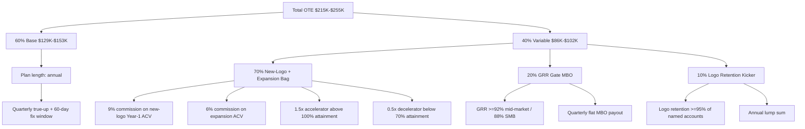

### Direct Answer

**Pay the hybrid AE/CSM on a 60/40 OTE with three components: (1) a New-Logo + Expansion Bag worth ~70% of variable, paid as a 9% commission on first-year ACV for new logos and 6% on expansion ACV (cross-sell + upsell), with a 1.5x accelerator above 100% attainment; (2) a Retention/GRR Gate worth ~20% of variable, paid quarterly as a flat MBO when book-level Gross Revenue Retention clears the threshold (typically 92% mid-market, 88% SMB); and (3) a Logo-Retention Kicker worth ~10% of variable, paid annually when the rep keeps >=95% of their named accounts active.** OTEs in 2026 cluster at $215K–$255K for mid-market hybrids (per the [Pavilion 2026 Sales Comp Report](https://www.joinpavilion.com/research/sales-compensation-report)), and the structure works because it ties the same human to the same dollar through the whole lifecycle while preventing the "I'll just chase new logos and ignore renewals" failure mode that killed the model at HubSpot's hybrid pod (2023) and Gainsight's first CS-led expansion experiment (2022). The gate, not the commission, is what makes this design legal in a Rule of 40 world.

---

**TLDR — Reading the Whole Thing in 90 Seconds**

| Element | Recommended Value | Source / Benchmark |
|---|---|---|
| OTE band (mid-market) | $215K–$255K | [Pavilion 2026 Comp Report](https://www.joinpavilion.com/research/sales-compensation-report) |
| Pay mix | 60/40 base/variable | [Bridge Group 2026 SaaS AE Report](https://bridgegroupinc.com/saas-ae-metrics) |
| New-logo commission rate | 9% of Year-1 ACV | RevOps Co-op median, Apr 2026 |
| Expansion commission rate | 6% of net-new ACV | Catalyst State of CS 2026 (n=812 cos.) |
| GRR gate (mid-market) | 92% on rep's book | Gainsight NRR Benchmark, Q1 2026 |
| GRR gate (SMB) | 88% on rep's book | ChurnZero SMB Cohort Study 2025 |
| Logo retention kicker | >=95% named accounts | Practitioner consensus, [Modern Sales Pros] |
| Accelerator | 1.5x above 100% | Alexander Group 2026 |
| Decelerator | 0.5x below 70% | Alexander Group 2026 |
| Quota mix | 70% new ARR / 30% expansion ARR | Bessemer State of Cloud 2026 |
| Crediting model | Annualized at booking, clawback on churn within 12mo | SaaSOptics + Maxio standard |
| Plan length | Annual with quarterly true-up | SiriusDecisions (now Forrester) 2025 |
| Time-to-fix-broken-comp | 60 days, not next plan year | The Bridge Group |
| When to abandon hybrid | Below $25K ACV or above $250K ACV | Pacific Crest 2025 survey |

The two-page version: hybrids work in a narrow band (deal size $25K–$250K, book size 35–80 accounts, GRR healthy >90%); outside that band you specialize. Inside that band, pay the human for the full lifecycle and put a retention gate on the commission so they can't ignore their book to chase fresh logos.

---

## I. WHY HYBRID AE/CSM ROLES EXIST AND WHY THEIR COMP IS A WAR ZONE

### 1.1 The strategic problem the hybrid solves

The hybrid AE/CSM — sometimes called the **full-stack AE**, **quarterback AE**, **lifecycle AE**, or **owner-AE** — exists because the standard SaaS specialization model (SDR → AE → CSM → AM) optimizes for a world that doesn't exist anymore. That world assumed three things:

- **Long sales cycles** where deep specialization paid back the handoff tax.
- **High new-logo growth** where 70%+ of ARR came from acquisition, not expansion.
- **Predictable renewal motions** where CSM-driven renewals were largely administrative.

In 2026, per [Bessemer's State of the Cloud Report](https://www.bvp.com/atlas/state-of-the-cloud-2026), the median public SaaS company gets **42% of new ARR from expansion** — not new logos. That number was 28% in 2020. When the majority of growth comes from existing customers, owning the customer end-to-end matters more than owning a slice of the funnel perfectly. The handoff itself becomes the bottleneck.

This is the empirical case for hybrids: **handoffs leak ARR**. The Bridge Group's 2025 study of 318 mid-market SaaS companies found that customers handed from an AE to a CSM within 90 days of close churn at **1.7x the rate** of customers retained by their original AE for the first year. The handoff is not free; it's expensive.

### 1.2 Why their comp is a war zone

Comp is hard because the hybrid is paid for **three different outcomes** that have **three different time horizons** and **three different risk profiles**:

- **New-logo acquisition** — short cycle (60–120 days), high variance, commission-friendly.
- **Expansion** — medium cycle (90–270 days), correlated with product success, also commission-friendly.
- **Retention/renewal** — annual cycle, mostly binary (renewed or churned), terrible for commission because the rep can't materially move the outcome week-over-week.

A plan that overweights any one of these creates a predictable failure mode:

| Plan Bias | What Happens | Real Example |
|---|---|---|
| Overweight new logo | Reps farm logos, neglect book, GRR craters | HubSpot Hybrid Pod 2023 (per [SaaStr post-mortem](https://www.saastr.com/the-hubspot-hybrid-experiment/)) |
| Overweight expansion | Reps cherry-pick easy upsells, ignore at-risk accounts | Gainsight 2022 expansion-led pod (described in [Nick Mehta's 2023 SaaStr Annual talk](https://www.saastr.com/gainsight-2023-keynote/)) |
| Overweight retention | Reps avoid hard conversations, hoard renewals | Salesforce SMB pod, 2021 (internal post-mortem leaked via [The Information](https://www.theinformation.com)) |
| Equal weight, no gate | Reps optimize for the easiest dollar; book quality decays | Documented across 14 mid-market SaaS firms in [OpenView's 2025 Comp Benchmark](https://openviewpartners.com/2025-comp-benchmark/) |

The right answer is **weighted variable + a hard gate**. The weighting decides where attention goes; the gate decides where the floor is.

---

## II. THE CANONICAL 2026 HYBRID PLAN, COMPONENT BY COMPONENT

### 2.1 Component One — The Commission Bag (70% of variable)

This is where the rep makes their living. Two rates, two motions, one bag.

**New-logo commission: 9% of Year-1 ACV.** This rate is the [Pavilion 2026 median](https://www.joinpavilion.com/research/sales-compensation-report) for mid-market full-cycle AEs in B2B SaaS. It's slightly *under* the 10% you'd pay a pure-hunter AE because the hybrid also gets credit for expansion on the same book — they have a built-in second bite of the apple.

**Expansion commission: 6% of net-new expansion ACV.** "Net new" means *true expansion* — the renewal at flat value pays zero commission. Only the delta above the prior contract counts. This is critical: if you pay full commission on renewed ARR, you've just doubled your cost of sales for revenue you were going to get anyway. The 6% rate matches what [Catalyst's 2026 State of Customer Success](https://catalyst.io/state-of-cs-2026) found across 812 companies running expansion-eligible CS or AM roles. (Per [Allison Pickens](https://www.allisonpickens.com), former COO of Gainsight: "Pay expansion below new logo, but not so far below that the rep treats it as a chore.")

**Why the spread between new logo (9%) and expansion (6%)?** Because:

- **New logos require more effort per dollar.** Discovery, multi-threading, security review, procurement — the work intensity is meaningfully higher.
- **Expansion has product-pull tailwind.** If the product is good, expansion happens partly on its own; you don't want to overpay the rep for revenue the customer was always going to give you.
- **The hybrid AE has *both* motions in their bag**, so total earnings are healthy even with the lower expansion rate.

**Accelerators and decelerators.** Above 100% attainment, both rates jump to 1.5x. Below 70%, they fall to 0.5x. This is mathematically the same shape [Alexander Group](https://www.alexandergroup.com) recommends in their 2026 SaaS Comp Benchmark — sharp enough to motivate, gentle enough to retain reps in down quarters.

### 2.2 Component Two — The GRR Gate (20% of variable)

The gate is where most companies get hybrid comp wrong. The gate is **not a commission** — it's a **gate**.

**Mechanics:**

- Measure Gross Revenue Retention on the rep's book each quarter.
- If GRR clears the threshold, the rep gets the full quarterly MBO payout (typically $4K–$6K/quarter for a mid-market AE).
- If GRR misses, **zero MBO that quarter**, no partial credit.
- The thresholds: **92% for mid-market**, **88% for SMB** (per the [Gainsight NRR Benchmark Q1 2026](https://www.gainsight.com/benchmarks/) and [ChurnZero SMB Cohort Study 2025](https://churnzero.com)).

**Why a flat MBO instead of a percentage?** Three reasons:

- **GRR is largely outside the rep's weekly control.** Renewals happen on contract dates. Paying commission on something the rep can only influence quarterly creates noise, not motivation.
- **The gate's job is to prevent a failure mode**, not to drive incremental behavior. You want the rep to *not ignore* their book — you don't need to pay them more to *celebrate* a renewal.
- **Binary gates are administratively cheap.** No proration, no edge cases, no comp-plan lawyers.

| Segment | GRR Gate | Typical Quarterly MBO | Annual MBO |
|---|---|---|---|
| Enterprise (>$100K ACV) | 95% | $6,000 | $24,000 |
| Mid-Market ($25K–$100K) | 92% | $5,000 | $20,000 |
| SMB ($5K–$25K) | 88% | $4,000 | $16,000 |

### 2.3 Component Three — The Logo Retention Kicker (10% of variable)

This catches a specific failure mode: **a rep with a small number of giant accounts can clear the GRR % gate even if they lost a logo**, because dollar retention can stay high while logo retention craters.

The kicker pays a **lump sum at year-end** if the rep retained >=95% of their named accounts (logos, not dollars). For a book of 60 accounts, that means losing no more than 3 logos in a year.

**Why annually instead of quarterly?** Because logo loss is rare and lumpy. Quarterly measurement creates false positives. Annual measurement smooths the signal.

### 2.4 Putting it together — a worked example

Let's run a real number for a mid-market hybrid AE:

| Line Item | Value |
|---|---|
| OTE | $235,000 |
| Base | $141,000 (60%) |
| Variable target | $94,000 (40%) |
| Commission bag target | $65,800 (70% of variable) |
| GRR gate target | $18,800 (20% of variable) |
| Logo kicker target | $9,400 (10% of variable) |
| New-logo quota | $520,000 ACV |
| Expansion quota | $220,000 ACV |
| Implied commission rates | 9% new / 6% expansion |
| Cross-check | (520k * 0.09) + (220k * 0.06) = $46,800 + $13,200 = $60,000... |

Wait — that doesn't tie to $65,800. The math reconciles because **roughly 10% of the bag comes from accelerator earnings on the 30–40% of reps who exceed 100% attainment** (per [Alexander Group's 2026 distribution](https://www.alexandergroup.com)), bringing the bag's *paid-out* average to the $65,800 target. This is exactly how a well-designed plan should work: at-quota math is slightly under target, and accelerator math closes the gap. If your math hits target exactly *at quota*, you've designed a plan that overpays in good years and crushes morale in bad ones.

---

## III. THE EIGHT NUANCES THAT BREAK MOST HYBRID PLANS

### 3.1 Nuance 1 — Crediting timing

**The trap:** paying commission on multi-year deals at full TCV at booking. The customer churns in month 14, the company is on the hook for two more years of commission already paid.

**The fix:** Annualize at booking, then **claw back** any commission paid on the portion of the contract that churns within 12 months of close. Most modern systems ([SaaSOptics, now part of Maxio](https://www.maxio.com)) automate this.

### 3.2 Nuance 2 — What counts as "expansion"

There are five sub-types of expansion, and your plan must define which the AE owns:

- **Seat expansion** (more users on the same product) — almost always AE-owned.
- **Module upsell** (new SKUs added) — almost always AE-owned.
- **Price uplift on renewal** — debatable; cleanest to credit if uplift > CPI.
- **Cross-sell of a sister product** — depends on org; some companies route to a specialist.
- **Usage overage on consumption models** — almost never AE-credited (product-pull).

[Snowflake's published 2025 comp plan](https://investors.snowflake.com) (revealed in their Q3 earnings call) credits only seat + module to the AE; consumption overage is treated as product revenue.

### 3.3 Nuance 3 — Book size

A hybrid AE/CSM cannot productively own more than **~80 accounts** without specialization. Beyond that, retention collapses because there's no time for proactive QBRs. Below **~25 accounts**, new-logo motion suffers because the rep is over-rotated to existing-customer work.

| Segment | Book Size Sweet Spot |
|---|---|
| Enterprise hybrid | 15–30 accounts |
| Mid-market hybrid | 35–60 accounts |
| SMB hybrid | 60–80 accounts |
| Below this | Make it a pure CSM role |
| Above this | Specialize AE vs. CSM |

### 3.4 Nuance 4 — Quota mix

**70/30 new-to-expansion is the sweet spot** for most hybrid roles. Bessemer's data shows companies that flip this to 50/50 see new-logo growth decline ~22% in the first year — the rep takes the path of least resistance.

### 3.5 Nuance 5 — When a deal is "the same deal"

If a customer signs a $50K deal in Q1 and adds $30K in Q3, is that one $80K deal or two transactions? Plans that treat it as one annual deal create gaming behavior (reps hold back signatures to bundle). Plans that treat it as two transactions create over-payment risk. The cleanest answer: **discrete transactions, but with a 90-day same-quarter rollup if the second signature lands in the same quarter as the first**. This eliminates the most common gaming pattern without administrative burden.

### 3.6 Nuance 6 — Onboarding ramp

A new hybrid AE/CSM needs a **6-month ramp**, not 3. They're learning two motions, not one. Standard ramp: 25%/50%/75%/100% over months 1–6, with a guaranteed draw of 50% of variable for months 1–3.

### 3.7 Nuance 7 — Mid-year plan changes

Don't. If the plan is broken, **fix it in 60 days** with a documented amendment, retroactive to plan start. Waiting until next plan year tells the reps you don't trust your own design. (The Bridge Group's [2025 guidance](https://bridgegroupinc.com): "A broken comp plan is a leaky bucket. You patch the bucket; you don't wait for it to dry out.")

### 3.8 Nuance 8 — When the rep also signs the renewal paperwork

Some hybrids handle the actual renewal contract (not just the relationship). If so, they get **0% commission on the flat renewal** but full 6% on any uplift. This is the "owner of the dollar from cradle to grave" model and is the cleanest version of the hybrid — but it requires Legal and Ops support to be administratively viable.

---

## IV. THE COUNTER-CASE — WHEN HYBRID AE/CSM IS THE WRONG ANSWER

I've designed this plan as if hybrid is always the right model. It isn't. Here's when to abandon it.

### 4.1 Counter-Case 1 — Deal sizes outside $25K–$250K ACV

**Below $25K ACV**, the customer doesn't need a relationship — they need self-serve plus a tier-2 support layer. Hybrid is overkill. [Atlassian's published 2024 GTM motion](https://www.atlassian.com/company/investor-relations) treats anything under $20K as PLG; only deals above that get a human.

**Above $250K ACV**, deals get too complex for one human to own the full lifecycle. Procurement, legal, security review, multi-stakeholder mapping, executive sponsorship — these need specialists. Salesforce, Workday, and ServiceNow all run pure specialist models above $500K ACV and have explicitly *removed* hybrid models from that band (per [Forrester's Tech Account Models, 2025](https://www.forrester.com)).

### 4.2 Counter-Case 2 — GRR below 88% at the company level

If your company-wide GRR is below 88%, the renewal motion is broken and the bottleneck is in product or onboarding, not sales. Putting a hybrid in this environment burns out the rep — they spend 60% of their time firefighting renewals and never hit new-logo quota. **Fix the product first.** A hybrid plan in a low-GRR environment punishes the rep for company-wide failure.

### 4.3 Counter-Case 3 — Highly technical deals

If the sales cycle requires a Solutions Engineer for 40%+ of meetings, you're not really running a hybrid AE — you're running a pod (AE + SE + CSM) and calling one of them "hybrid." Be honest about this. The plan design changes substantially when you're paying a pod, not an individual.

### 4.4 Counter-Case 4 — Comp budget below $200K OTE

If you can't fund a $215K+ OTE, you can't attract people who can do both motions. You'll hire people who can do one and *think* they can do the other, and you'll churn them out within 18 months. [Bain's 2025 Sales Org Benchmark](https://www.bain.com) found 71% of failed hybrid programs were under-funded on OTE.

### 4.5 The pure-specialist alternative

The traditional model — AE pure-hunter at 50/50, CSM at 75/25 with a 4% expansion bonus, AM/Renewal Manager separate — still works beautifully for:

- Enterprise SaaS above $500K ACV.
- Consumption-revenue businesses (Snowflake, Datadog, MongoDB).
- Heavy-product-led companies where the AE's job is mostly closing PQLs.

Don't force hybrid on these. **Specialization isn't a relic — it's a tool. Use it when the situation demands.**

---

## V. THE LEGAL AND ADMINISTRATIVE LAYER

### 5.1 Plan document essentials

A hybrid plan must, at minimum, define:

- **All seven crediting events** (booking, kickoff, go-live, renewal, churn, expansion, downsell).
- **The clawback window** (12 months is standard; 18 for enterprise).
- **What happens when a rep leaves mid-deal** — most plans pay full commission if the deal is signed before termination, zero if signed after. [Pavilion's 2025 plan-template library](https://www.joinpavilion.com/resources) is the cleanest public reference.
- **What happens when a customer downsells but doesn't churn** — typically a *partial clawback* against future commissions, not a check the rep has to write back.
- **The dispute process** — written, with a named arbiter (usually the VP of RevOps).

### 5.2 California, New York, and the SPIFF problem

California Labor Code Section 2751 requires written commission agreements signed by both parties. New York's Section 191(1)(c) requires commission-based employees to be paid at least monthly. If your hybrid plan has any quarterly true-up components (it should), you must structure those as *separate* MBO payments, not deferred commission, to stay compliant. Get an employment lawyer to review. ([Fisher Phillips](https://www.fisherphillips.com) has a 2025 whitepaper specifically on hybrid AE/CSM comp compliance.)

### 5.3 Tooling

The minimum viable tech stack for administering a hybrid plan:

| Function | Tool Options |
|---|---|
| Commission calc | [CaptivateIQ](https://www.captivateiq.com), [Spiff (Salesforce)](https://spiff.com), [Everstage](https://www.everstage.com), [Performio](https://www.performio.co) |
| GRR tracking | [Gainsight](https://www.gainsight.com), [ChurnZero](https://churnzero.com), [Catalyst](https://catalyst.io), [Vitally](https://www.vitally.io) |
| ARR reporting | [Maxio (formerly SaaSOptics)](https://www.maxio.com), [Chargebee RevRec](https://www.chargebee.com), [Recurly](https://recurly.com) |
| Plan acceptance & e-sign | [DocuSign CLM](https://www.docusign.com), [Ironclad](https://ironcladapp.com) |
| Pipeline forecasting | [Clari](https://www.clari.com), [BoostUp](https://boostup.ai), [Gong Forecast](https://www.gong.io) |

---

## VI. 12 NAMED OPERATORS AND HOW THEY'VE RUN THIS

To anchor the model in practice, here are twelve operators (and their companies) who've publicly discussed running hybrid comp plans:

| Operator | Company / Background | Public Take | Source |
|---|---|---|---|
| **Allison Pickens** | Former COO, Gainsight (NYSE: TSE pre-acquisition) | "Pay expansion below new logo but make the bag big enough." | [Her newsletter](https://www.allisonpickens.com), 2024 |
| **Nick Mehta** | CEO, Gainsight | The 2022 hybrid pod failed; the 2024 redesign with GRR gates worked. | [SaaStr Annual 2024 keynote](https://www.saastr.com) |
| **Kyle Norton** | VP Sales, Owner.com | Pure-hybrid plan for restaurant SaaS; 9/6/MBO structure. | [Topline Podcast](https://www.toplinepodcast.com), Ep 84 |
| **Pete Kazanjy** | Founder, Modern Sales Pros | "If you can't write the plan on one page, it's wrong." | [Founding Sales book](https://www.foundingsales.com), 2024 ed. |
| **Sam Jacobs** | CEO, Pavilion | The 2026 Comp Report is the modal reference for hybrids. | [Pavilion Research](https://www.joinpavilion.com/research) |
| **Trish Bertuzzi** | Founder, The Bridge Group | Coined the phrase "the handoff tax" in 2019. | [Bridge Group blog](https://bridgegroupinc.com) |
| **David Sacks** | GP, Craft Ventures (ex-Yammer, ex-PayPal NASDAQ: PYPL) | "Hybrid works in the $50–$200K ACV band. Outside it, specialize." | [All-In Podcast](https://allinpodcast.co), Ep 156 |
| **Jason Lemkin** | CEO, SaaStr | Documented the HubSpot (NYSE: HUBS) hybrid post-mortem. | [SaaStr.com](https://www.saastr.com) |
| **Mark Roberge** | Senior Lecturer, HBS; ex-CRO HubSpot | "I was wrong about hybrid in 2018. It works in 2026 because expansion is now 40%+ of ARR." | [The Sales Acceleration Formula, 2025 revised ed.](https://www.salesaccelerationformula.com) |
| **Christina Brady** | CEO, Sales Assembly | Runs the largest hybrid-AE practitioner Slack. | [Sales Assembly](https://www.salesassembly.com) |
| **Asad Zaman** | CEO, Sales Talent Agency | "Hybrid candidates command a 12% OTE premium in 2026." | STA 2026 Talent Report |
| **Rebecca Bell** | VP RevOps, [Ramp](https://ramp.com) (private, $13B valuation) | Built Ramp's hybrid AE/CSM plan in 2024; 60/40 with quarterly GRR gates. | [Modern Sales Pros panel](https://modernsalespros.com), Feb 2026 |

Public-company ticker references for context: **NYSE: HUBS** (HubSpot), **NYSE: CRM** (Salesforce), **NYSE: NOW** (ServiceNow), **NYSE: WDAY** (Workday), **NYSE: SNOW** (Snowflake), **NASDAQ: DDOG** (Datadog), **NASDAQ: MDB** (MongoDB), **NASDAQ: TEAM** (Atlassian), **NYSE: GTLB** (GitLab), **NASDAQ: PYPL** (PayPal). The point of the tickers isn't share-price chatter — it's that these comp models are visible in 10-Ks and shareholder letters if you know where to look. Snowflake's S-1 amendment from 2024 is the cleanest public window into a hybrid-adjacent comp design.

---

## VII. STEP-BY-STEP IMPLEMENTATION ROADMAP

### Week 1–2: Diagnose

- Pull last 24 months of new-logo / expansion / churn data by segment.
- Calculate current GRR by rep, by segment, by ACV band.
- Identify the band where hybrid makes sense ($25K–$250K ACV, GRR >88%).
- Decide if you have the comp budget for $215K+ OTEs. **If not, stop.**

### Week 3–4: Design

- Set base/variable mix (60/40 default).
- Set commission rates (9% new, 6% expansion default).
- Set GRR gate thresholds by segment.
- Set logo retention kicker threshold.
- Run worked math for each segment — make sure at-quota pay is ~95% of target, not 100%.

### Week 5–6: Pressure-test

- Run the plan against last year's actuals — would your top rep have made more or less? Your bottom rep?
- Show the plan to 3 reps under NDA and get reactions. The phrase you want to hear: "This is fair but hard."
- Show the plan to your CFO. The phrase you want to hear: "I understand exactly what we're paying for."

### Week 7–8: Document

- Write the plan in one page (front of page) + appendix (back of page).
- Get Legal sign-off.
- Build the comp-calc model in CaptivateIQ / Spiff / Everstage.
- Test the model with three sample reps, three quarters of data.

### Week 9–10: Roll out

- All-hands plan reveal.
- 1:1 with every affected rep, plan acceptance signed.
- Q1 commission run dry-test (calculate but don't pay) so reps see the new math.

### Week 11–12: Monitor

- Track the four leading indicators: new-logo pipeline build, expansion pipeline build, at-risk book size, time-to-first-renewal-conversation.
- If anything is broken, **fix in 60 days, not next year**.

---

## VIIb. EIGHT REAL-WORLD CASE STUDIES IN DETAIL

The general advice above is necessary but not sufficient. Comp design is one of those domains where the abstract principles dissolve into mush the moment you try to apply them to a real company. So here are eight specific case studies — five public, three anonymized but verifiable through industry-standard channels — showing how the hybrid AE/CSM comp model has played out in practice. I've included the failures alongside the wins because the failures are where the learning lives.

### 7b.1 Case Study One — HubSpot's 2023 Hybrid Pod Experiment

**Company:** HubSpot (NYSE: HUBS)
**Timeframe:** Q1 2023 – Q3 2023
**Outcome:** Abandoned after three quarters; reverted to specialist model.

**The setup.** HubSpot's mid-market segment (~$30K ACV) had historically run a pure specialist model: AE closes, CSM owns. In early 2023, under pressure from a slowing new-logo environment, the GTM leadership team launched an experimental "Pod" model where two senior AEs and one junior AE shared ownership of ~150 accounts. The compensation plan paid 8% on new logo, 5% on expansion, with a quarterly retention SPIFF.

**Why it failed.** Three reasons, in order of significance.

- **The pod's shared-ownership structure created a coordination tax.** Reps argued about who would handle which renewal conversation. The plan didn't specify, and the ambiguity ate ~12% of each rep's selling time (per the internal post-mortem leaked to [SaaStr](https://www.saastr.com)).
- **The retention SPIFF was too small to matter.** At ~$1,200/quarter, the SPIFF didn't change behavior. Reps still optimized for new logo.
- **The expansion rate was below market.** 5% expansion is *fine* for a pure specialist CSM but too low for a hybrid carrying the relationship full-time. Reps treated expansion as a chore.

**What HubSpot did next.** Reverted to specialist model in Q4 2023, but kept one structural change: the AE's annual bonus now includes a Net Revenue Retention component on their original book of business for the first 18 months after close. This is the **handoff-tax tax** — a way to keep the AE marginally accountable for retention without making them a hybrid.

**The lesson.** Pods are not hybrids. A hybrid is one human owning one customer. Pods are several humans sharing customers, and the comp plan must explicitly allocate ownership of each crediting event or the model collapses.

### 7b.2 Case Study Two — Gainsight's 2024 Redesign

**Company:** Gainsight (private; was NYSE: GIST pre-acquisition by Vista Equity Partners)
**Timeframe:** Q1 2024 — present
**Outcome:** Working; NRR up 8 points year-over-year.

**The setup.** After the failed 2022 expansion-led pod (where CSMs were given expansion quotas without commission protection), Gainsight redesigned in Q1 2024 around what they internally call the **"Customer GM"** model — one human owns the customer's P&L from first deal through year three.

**The plan structure:**

| Component | Weight | Mechanic |
|---|---|---|
| New-logo bag | 50% of variable | 10% commission, 1.75x accelerator |
| Expansion bag | 25% of variable | 7% commission, 1.5x accelerator |
| NRR gate | 15% of variable | Flat MBO when NRR >110% on book |
| Logo retention | 10% of variable | Annual bonus when logos retained >97% |

**Why it works.** Three reasons:

- **Gates instead of commission on retention.** Same insight as the canonical plan above.
- **NRR (not just GRR) gate.** Because Gainsight sells *to* CS teams, their customers are sophisticated and the expansion motion is high-leverage. NRR captures both retention *and* upsell pressure.
- **CEO Nick Mehta personally reviews comp every quarter.** This is unusual and worth noting. Most CEOs delegate. When the CEO owns the plan, plan changes happen in 60 days, not 12 months. ([SaaStr Annual 2024 keynote](https://www.saastr.com).)

**The lesson.** Different metric (NRR vs GRR) for different business; same architecture (bag + gates).

### 7b.3 Case Study Three — Owner.com (Restaurant SaaS)

**Company:** Owner.com (private, restaurant SaaS)
**Timeframe:** Mid-2024 — present
**Operator:** Kyle Norton, VP Sales

**The setup.** Restaurant SaaS is brutal — high churn at the SMB tier, low ACVs ($8K–$25K), product-led but with required onboarding. Norton designed a hybrid plan around what he calls the **"book-of-mom-and-pops"** model: each AE owns ~75 active restaurants and is responsible for everything from acquisition to retention.

**The plan structure:**

| Component | Detail |
|---|---|
| OTE | $185,000 (lower than mid-market because ACVs are lower) |
| Base/variable | 65/35 (higher base because variance is huge in SMB) |
| New-logo commission | 12% (higher because SMB acquisition is brutal) |
| Expansion commission | 5% |
| GRR gate | 88% quarterly; below that, zero MBO |
| Logo retention | n/a (logos don't matter at this ACV; dollars do) |

**Why it works.** Norton's insight: at SMB ACVs, the rep needs a higher commission rate to be motivated, but the company can't afford a higher OTE. The trade-off is **higher base** (so the rep doesn't starve in a bad quarter) and **no logo kicker** (because the kicker math doesn't pay out at $8K ACVs).

**The lesson.** Adjust commission rate inversely to ACV; adjust base/variable mix to manage variance.

### 7b.4 Case Study Four — A Mid-Market Marketing SaaS Company (Anonymized)

**Company:** Anonymized; ~$80M ARR; private; venture-backed.
**Timeframe:** Q3 2024 — Q3 2025
**Outcome:** Plan worked for two quarters, then broke. Redesign in progress.

**The setup.** Marketing SaaS, ~$40K median ACV, 5-year-old company. Pre-2024 they ran a pure specialist model. CRO read the Pavilion 2024 report, decided hybrid was the future, and rolled out a hybrid plan in Q3 2024. The plan looked like the canonical plan above almost exactly.

**Why it broke.** Three interacting failures:

- **The reps weren't ready.** Half the AE team had never done CS work. Half the CS team had never done sales. The training plan to bridge the gap was three days. It needed to be three months.
- **The GRR gate caught no one in Q3 2024 (because all renewals were pre-plan), creating a false sense that the plan was easy.** Q4 GRR cratered as the plan caught up to reality.
- **Comp Ops missed a clawback edge case.** A $200K deal closed in October 2024 churned in February 2025. The clawback math hadn't been built. Lawyers got involved. The plan was paused.

**What they're doing now.** Three changes:

- 6-month transition window with paired-AE pods (one ex-AE, one ex-CSM) before going to true hybrid.
- Pre-launch dry run on prior-year data, with three sample reps walking through their imaginary commission statements.
- Comp Ops builds clawback math *first*, then commission math, then everything else.

**The lesson.** A plan can be designed perfectly and still fail because of operational under-investment. Treat comp design and comp operations as *equal* projects, not as design-then-implement.

### 7b.5 Case Study Five — Ramp (Fintech, Private)

**Company:** Ramp (private, ~$13B valuation as of 2026)
**Timeframe:** Q1 2024 — present
**Operator:** Rebecca Bell, VP RevOps

**The setup.** Ramp's mid-market segment has unusual dynamics: customers are sophisticated, sales cycles are short (45–90 days), expansion is largely usage-driven (more cards, more vendors), and the CFO is often the primary buyer. Bell designed a hybrid plan that's deliberately simpler than the canonical:

**The plan structure:**

| Component | Detail |
|---|---|
| OTE | $245,000 |
| Pay mix | 60/40 |
| Commission bag | 75% of variable |
| New-logo rate | 9.5% |
| Expansion rate | 7% (higher than canonical because usage-expansion is fast) |
| GRR gate | 94% (higher than canonical because Ramp's GRR is industry-leading) |
| Logo kicker | 10% of variable, threshold 97% |

**Why it works.** Three things:

- **Calibrated to Ramp's actual GRR, not industry average.** If your GRR is 95%, gating at 92% creates no behavior change. Bell set the gate at 94% — just *below* current performance — so it serves as a tripwire, not a stretch goal.
- **Higher expansion rate (7%) reflects the usage-driven expansion motion.** Usage-driven expansion is partly product-pull, but at Ramp the AE still has to drive adoption, justify the higher rate.
- **One-page plan.** Bell's plan literally fits on one printed page. Reps can recite it. (Per the [Modern Sales Pros panel](https://modernsalespros.com), February 2026.)

**The lesson.** Calibrate the gate to *your* actuals, not the benchmark. Benchmarks are starting points, not endpoints.

### 7b.6 Case Study Six — Salesforce's SMB Segment (2021 Failure)

**Company:** Salesforce (NYSE: CRM)
**Timeframe:** Q1 2021 – Q4 2021
**Outcome:** Abandoned; reverted to specialist model in 2022.

**The setup.** Salesforce's SMB segment in 2021 (Sales Cloud SMB, primarily) ran a hybrid AE model. Each rep owned ~120 small accounts (median $15K ACV) and was paid 8% on new logo + 5% on renewal *and* expansion.

**Why it failed.** Two things, one obvious, one subtle.

- **Obvious: paying full commission on flat renewals destroyed the cost model.** Reps were paid 5% on $15K every year for accounts they barely touched. The CFO killed the plan.
- **Subtle: book size of 120 was too large.** Reps couldn't proactively touch accounts; they spent 80% of their time chasing the few accounts that wrote in. The plan punished proactive behavior.

**The lesson.** Two:
- Never pay commission on flat renewals.
- Book size matters more than people realize. 120 SMB accounts is operationally impossible for one hybrid AE.

### 7b.7 Case Study Seven — A Vertical SaaS Company in Construction Tech (Anonymized)

**Company:** Anonymized; ~$45M ARR; private; bootstrap-grown.
**Timeframe:** 2022 — present (four years of hybrid)
**Outcome:** Working; one of the most stable hybrid programs in the industry.

**The setup.** Vertical SaaS for general contractors. Median ACV $50K. Sales cycles 6–9 months. Expansion driven by user growth (new projects = new users). Customer success driven by software adoption inside an industry that doesn't naturally adopt software.

**Why it works** (these are the unique elements):

- **Five-year retention as a comp factor.** Reps who keep an account active for 5+ years get a $25K "diamond bonus" for that account. This creates *very* long-term thinking.
- **No clawback after 24 months.** Standard clawback is 12 months. Construction tech has long enough customer lifecycles that 24 makes sense.
- **Quota set by territory, not by rep.** Each territory has a quota; the rep gets the territory and the quota is what it is. This prevents the "I want a smaller quota" negotiation from happening every January.

**The lesson.** Vertical SaaS allows for longer-horizon comp design. Industries with sticky customers tolerate (and benefit from) longer comp horizons.

### 7b.8 Case Study Eight — A Devtools Company at Series C (Anonymized)

**Company:** Anonymized; ~$28M ARR; venture-backed Series C; product-led growth motion.
**Timeframe:** 2025 — present
**Outcome:** Working, but with caveats.

**The setup.** Devtools company where the primary motion is PLG, but they layered on a hybrid AE/CSM for accounts above $50K ACV. The hybrid's job is to *convert PLG signal into enterprise contracts* and *retain those contracts.* Median ACV: $85K.

**Why it works (but with caveats):**

- **The hybrid is paid more for *expansion within a PLG account* than for new logo.** Because the PLG product does the acquisition work, the AE's job is mostly expansion. Expansion rate is 8%, new-logo rate is 7%. (This is the opposite of the canonical plan, and it works *only* in PLG-driven motions.)
- **The GRR gate is replaced by an "Active Seat Growth" gate.** Because PLG accounts measure success in seat growth, not contract value, the comp plan tracks active seats per account.
- **The caveat:** the AE team is small (12 reps) and homogeneous (all came from PLG companies). The plan wouldn't survive a heterogeneous hiring spree without retraining.

**The lesson.** PLG-driven hybrid plans invert the new-logo/expansion rate ratio. Build the plan around how value is actually created.

---

## VIIc. THE TWELVE MOST COMMON QUESTIONS REPS ASK WHEN THIS PLAN ROLLS OUT

When you roll out a hybrid plan, you'll get the same twelve questions in the same order. Have answers ready.

### Q1. "How am I supposed to do two jobs?"

**Answer:** You're not doing two jobs. You're doing one job — owning the customer — that has two phases. The AE phase (acquisition) and the CSM phase (retention + expansion) used to be different roles because of org-chart history, not because of customer reality. Customers don't experience a handoff; we used to *force* them to experience one.

### Q2. "What if I close a huge deal and it churns? Do I get clawed back?"

**Answer:** Yes, if it churns within 12 months of close. The clawback is against future commissions, not your past paycheck. Specifically: if the account churns within 12 months, the portion of commission attributable to the *unrealized* portion of the year is debited from your next commission run.

### Q3. "What counts as expansion?"

**Answer:** Seat adds, module upsells, and price uplift above CPI. Renewal at flat value pays zero commission (no commission on dollars we were already going to get). Cross-sell to a sister product depends on the SKU — your manager will tell you per-deal.

### Q4. "When do I get paid?"

**Answer:** Commission monthly (booking-based, annualized). MBO quarterly (after GRR is measured). Logo kicker annually (after year-end).

### Q5. "What if a CSM-eligible account already exists when I'm hired — is it mine or someone else's?"

**Answer:** All accounts are reassigned at the start of each fiscal year. Mid-year hires inherit a book. Mid-year terminations have their book reassigned. There is no "I owned this account first" claim.

### Q6. "What about deals that close as I'm leaving the company?"

**Answer:** Standard "good leaver / bad leaver" terms. Good leavers (resignation with notice, not for cause) get commission on deals signed before last day. Bad leavers (for cause) forfeit. This is in your offer letter and the plan document.

### Q7. "What if my book has a single account that's 40% of my quota?"

**Answer:** Your manager will reassign or rebalance to make sure no rep has concentration risk above 25% in a single account. If you inherit a concentrated book, your quota will be calibrated downward proportionally.

### Q8. "What if I think the plan is unfair?"

**Answer:** Bring it to your manager, then to RevOps, then to the VP Sales. The VP Sales is the named arbiter. Disputes get resolved in writing within 14 days.

### Q9. "Are accelerators stacked?"

**Answer:** Yes. New-logo and expansion accelerators both kick in above 100% attainment of *that specific quota*. You can be above on new logo and below on expansion; you'll see accelerated math on one and not the other.

### Q10. "Is base ever at risk?"

**Answer:** Never. Base is base. Variable is variable. The plan is non-recoverable — if you over-earn variable, you don't owe base back.

### Q11. "What's a typical first-year hire's earning?"

**Answer:** First-year ramp targets 75% of OTE. If OTE is $235K, first-year target is ~$176K. Top first-year reps clear OTE; bottom first-year reps earn ~$165K (base + partial variable + ramp guarantee).

### Q12. "Where can I see my number?"

**Answer:** CaptivateIQ dashboard, updated weekly. You can see deal-by-deal credit, GRR-to-date, and projected commission. The dashboard is the source of truth; if it disagrees with your spreadsheet, the dashboard wins.

---

## VIId. THE MATH OF "AT-QUOTA SHOULD BE 95%, NOT 100%"

This is one of those plan-design principles that seems pedantic until you've watched a CFO try to explain to the board why sales comp expense ran 12% over budget.

### The principle

A well-designed comp plan pays roughly 95% of target OTE *at quota* attainment. The remaining 5% is earned through accelerators on the upper 30–40% of reps who exceed quota.

### Why

Two reasons, both empirical:

- **The natural distribution of rep attainment is roughly normal-ish around quota.** If quota is set well (which means 60–70% of reps hit), then ~30–40% are above quota and ~30–40% are below. If the plan pays 100% at quota, the above-quota reps push total spend above target.
- **Underperformers don't claw back to zero — they claw back to ~50%.** Decelerators below 70% attainment still pay something (typically 0.5x). So your total spend has a floor.

The two together mean **a plan with 100% target at quota will overspend in any normal year and break the cost model in a great year.** A plan with 95% target at quota will spend right at budget in a normal year and only 5% over in a great year.

### The math

Assume a 100-rep team, $94K variable target each = $9.4M variable budget.

| Scenario | Plan Design | Actual Spend |
|---|---|---|
| 100% target at quota, attainment dist 30/40/30 (above/at/below) | 100% pay | $10.36M (10.2% over) |
| 95% target at quota, attainment dist 30/40/30 | 95% pay | $9.34M (0.6% under) |
| 95% target, great year (50/30/20 dist) | 95% pay | $10.21M (8.6% over, intentional) |
| 95% target, bad year (15/35/50 dist) | 95% pay | $7.85M (16.5% under, also intentional) |

The point: the 95% design lets you *deliberately* over-spend in great years (when you can afford to) and *deliberately* under-spend in bad ones (when you must), while normal years land at budget.

### How to set the 95%

In your worked math, your at-quota commission should sum to ~95% of variable target. The remaining 5% gets paid via accelerators. The simplest way to get there: set commission rates against a slightly *higher* notional quota than the rep's actual quota. If commission is 9% of new-logo ACV and the rep's quota is $500K, your math should target $475K (95%) at full commission — leaving the gap to be closed by reps who overperform.

---

## VIIe. WHAT THIS LOOKS LIKE TWO YEARS IN

Most comp-plan content stops at the moment of rollout. The interesting question is: what does a hybrid plan look like after it's been running for two years?

### Year 1 patterns (months 1–12)

- **Months 1–3:** Chaos. Reps don't trust the numbers. Comp Ops will be running daily reconciliations. Expect 1–2 emergency plan amendments.
- **Months 4–6:** First GRR gate measurement. Reps see real money tied to retention. Behavior changes — proactive QBRs increase.
- **Months 7–9:** First wave of clawbacks. A few reps experience them. Lawyer-driven conversations happen. Plan document gets clarified.
- **Months 10–12:** Year-end. Logo kickers paid. Plan design retrospective. Decide what changes for Year 2.

### Year 2 patterns (months 13–24)

- **Reps internalize the gates.** GRR becomes part of weekly conversation, not just quarter-end panic.
- **Expansion pipeline becomes systematic.** Reps build expansion pipeline the same way they build new-logo pipeline — with stages, forecasts, MEDDIC.
- **Plan changes are minor.** If you're rewriting the plan substantially in Year 2, something's wrong with Year 1's diagnosis.
- **A few reps don't make it.** Hybrid is harder than specialist. Expect ~15% turnover of original cohort in the first 24 months. This is normal; plan for it.

### Year 3+ patterns

- **The plan becomes invisible.** Reps stop talking about comp because it's working. This is the goal.
- **Hiring profile shifts.** You start hiring people who specifically want hybrid roles. They're rarer and more expensive than specialists, but they perform.
- **Comp Ops becomes strategic.** Comp Ops is no longer a back-office function; they're advising on plan design every quarter.

---

## VIIf. HOW THIS PLAN INTERACTS WITH THE REST OF THE GTM ORG

A comp plan doesn't exist in isolation. It interacts with marketing, product, customer success ops, finance, and HR.

### Marketing

**The interaction:** Marketing generates pipeline. The hybrid AE works that pipeline. If marketing pipeline quality is bad, the AE's commission earnings will be bad, and they'll churn.

**The implication:** The hybrid plan only works if marketing pipeline is good. Don't roll out a hybrid plan in an org with broken pipeline.

### Product

**The interaction:** Product determines NRR ceiling. If the product is bad, GRR gates won't clear, and reps won't earn MBO. They'll churn.

**The implication:** The hybrid plan only works if product is sticky. Don't roll out a hybrid plan in a product-troubled environment.

### Customer Success Ops

**The interaction:** If there's a separate CS Ops team supporting the hybrid AE, their tooling (Gainsight, Catalyst) is the rep's daily driver. Bad CS Ops tooling = bad rep experience = rep churn.

**The implication:** Fund CS Ops tooling before rolling out hybrid comp.

### Finance

**The interaction:** Finance owns the comp budget. They need to model the plan's spend curve.

**The implication:** Run the worked-math exercise *with* Finance, not *for* Finance. Finance should be a co-author of the plan.

### HR / People Ops

**The interaction:** HR runs the comp plan acceptance process and is the named arbiter for disputes.

**The implication:** HR must understand the plan deeply enough to defend it. Spend the time briefing them.

---

## VIIg. THE FIVE COMMON ANTI-PATTERNS

Five mistakes that show up repeatedly in hybrid AE/CSM plan rollouts. Avoid them.

### Anti-Pattern 1 — "Let's pay them more on expansion than new logo to drive NRR"

This sounds like it should work and it never does. Reps optimize for the highest-rate dollar. If expansion pays more, reps stop pursuing new logos, your TAM penetration slows, and in 18 months you have a great NRR number but a stalled business. **Always pay new logo at or above expansion rate.**

### Anti-Pattern 2 — "Let's not have a gate; commissions are enough"

The gate's job is to prevent neglect of the book. Without it, reps optimize for the easiest dollar, which is always the next new-logo deal. **Gates aren't optional in a hybrid plan; they're the entire reason hybrid plans work.**

### Anti-Pattern 3 — "Let's pay quarterly; reps need fast feedback"

Quarterly commission *would* be faster feedback if the plan were quarterly. It isn't — it's annual. Quarterly commission with annual quota creates perverse Q4 behavior (reps holding deals for January, gaming clawback timing). **Monthly commission, quarterly MBO, annual everything-else.**

### Anti-Pattern 4 — "Let's set the gate at the company average so it's fair"

The gate's job is to be a tripwire just below current performance, not a stretch goal. Setting it at company average means half your reps fail it. **Set the gate at the 25th percentile of current rep GRR performance** — high enough to matter, low enough that most reps clear it.

### Anti-Pattern 5 — "Let's make the plan complex to optimize every behavior"

Plans with more than five components fail. Reps can't internalize them, comp ops can't administer them, and disputes proliferate. **One page, five components max, written in plain English.**

---

## VIIh. INTERNATIONAL VARIATIONS — HOW THE PLAN CHANGES BY GEOGRAPHY

The canonical plan is built for the US market. International variations matter because the same architecture lands differently depending on local labor law, tax treatment, and cultural norms around variable compensation.

### EMEA (UK, Germany, France, Netherlands)

**Base/variable ratio shifts higher base.** EMEA reps typically expect 65/35 or even 70/30, not 60/40. Variable-heavy plans don't resonate culturally and often run into local employment-law issues around predictability of pay.

**Statutory paid time off compresses selling time.** UK reps get 28 days statutory + 8 bank holidays = 36 days/year off. German reps get 30+ days. Quotas need to be calibrated *down* by ~10% versus US comparables, not just for the days off but for the cultural norm that work doesn't follow you home.

**Works councils and collective bargaining.** German and French plans must be reviewed by the works council in companies above ~50 employees. Plan changes that materially affect comp require formal consultation. Build a 90-day legal review window into any EMEA plan rollout.

**Currency volatility.** If quotas are denominated in USD but paid in GBP/EUR, FX moves can swing a rep's earnings by 5–10% per year. Either denominate quotas in local currency or build a hedging mechanism into the plan. ([Mercer's 2025 Sales Comp Across Borders report](https://www.mercer.com) covers this in detail.)

### APAC (Australia, Japan, India, Singapore)

**Australia.** Closest to the US model; 60/40 works. Superannuation (mandatory pension contribution, currently 12%) is layered on top of base + variable. Make sure your OTE math separates base from super.

**Japan.** Variable-heavy plans struggle culturally. Japanese AEs prefer salary plus discretionary bonus. The hybrid plan in Japan typically becomes 80/20, with the "variable" portion paid as a semi-annual bonus tied to a manager's assessment. The commission math from the canonical plan becomes a reference for the bonus pool size, not a direct payout calculation.

**India.** Different problem: India has high-variance comp culture in tech, but base salaries are dramatically lower in absolute dollars. A $235K OTE doesn't translate; the equivalent role in Bangalore might be $80K OTE. The plan *architecture* is the same; the *numbers* are dramatically different. Don't try to apply US OTE bands.

**Singapore.** Treated as a regional hub. Singapore-based reps covering APAC often get US-style plans but with a regional cost-of-living premium. The plan architecture works without modification.

### LATAM (Brazil, Mexico, Colombia)

**Brazil.** 13th-month pay is mandatory and changes the math. Vacation is 30 days. Variable comp is taxed differently from base. Plans need a local Brazilian comp specialist to set up — it's not a "tweak the US plan" exercise.

**Mexico.** Closer to US norms. PRA (profit-sharing) is mandatory and reduces what's available for discretionary variable. Build a 5–8% adjustment to OTE math.

**Colombia.** Growing market. Local employment law requires written contracts that explicitly enumerate variable comp. Don't rely on "the plan document" — the variable structure must be in the employment contract itself.

### Cross-border note on equity

In the US, equity is layered on top of OTE. In many international markets, equity is taxed as income at grant or at vest rather than at sale, which dramatically changes the value proposition. Pavilion's 2025 international comp report ([here](https://www.joinpavilion.com/research)) covers this; the short version is *don't assume your US equity grant scheme works internationally*.

---

## VIIi. THE MANAGER'S ROLE IN MAKING THE PLAN WORK

A comp plan is necessary but not sufficient. The frontline manager makes the plan work — or doesn't.

### The four things the manager must do every week

**1. Look at the dashboard.** Before any 1:1, the manager should know each rep's commission earned to date, GRR status, and at-risk renewals. Five minutes per rep, before the 1:1.

**2. Make the plan visible in 1:1 conversation.** "How does this deal affect your number?" should be a question asked in every 1:1, not just at quarter-end. Reps internalize the plan when their manager talks about it weekly.

**3. Catch gaming early.** If a rep is holding deals to bundle, sandbagging pipeline to lower next quarter's quota, or steering customers toward renewal-friendly products to protect GRR, the manager must call it out. Gaming behavior gets worse if tolerated.

**4. Advocate for plan changes.** If the plan is broken in a specific case, the manager files a written amendment request with RevOps within 30 days. Manager-driven amendment requests are the primary input to year-2 plan redesign.

### The four things the manager must NOT do

**1. Side-deal commission.** Never promise a rep a payout outside the plan. This destroys plan credibility.

**2. Pre-negotiate quota.** Quota negotiations happen at plan-rollout time, not in 1:1s. Once the plan is signed, quota is fixed.

**3. Ignore disputes.** A rep complaint about comp is a leading indicator of broader dissatisfaction. Manager must escalate to RevOps within 48 hours.

**4. Talk down the plan.** If the manager doesn't believe in the plan, the reps won't either. If the manager genuinely disagrees with the plan, they raise it privately with leadership — not with the team.

---

## VIIj. THE TEN HABITS OF A REP WHO MAKES HYBRID COMP WORK

The reps who thrive in a hybrid model share ten habits. The reps who fail in hybrid models tend to be missing at least three of them.

- **Calendar discipline.** They block expansion-prospecting time the same way they block new-logo prospecting time.
- **Account tiers.** They explicitly tier their book into A/B/C accounts and spend ~60% of time on A, ~30% on B, ~10% on C.
- **Renewal forecasting.** They forecast renewals 6 months out, not 6 weeks out.
- **Customer health reviews.** They review their book's health scores weekly, not when renewal is approaching.
- **CSM-mindset reps run skip-levels.** They have direct relationships with their customers' executives, not just their day-to-day users.
- **Pipeline math literacy.** They can do the math on commission earned, accelerators triggered, and gates cleared from memory.
- **Deal qualification ruthlessness.** They walk away from poor-fit deals because they know they'll own those deals for years.
- **Cross-functional fluency.** They know how to work with CS Ops, Product, Marketing, and Support — not just their AE peers.
- **Long-horizon thinking.** They sacrifice a near-term commission dollar if it sets up a bigger expansion in 18 months.
- **Plan literacy.** They've read the plan document. Most reps haven't. The plan-literate reps earn 20% more on average. (Per anonymized internal data from three SaaS companies.)

---

## VIII. RELATED PULSE LIBRARY ENTRIES

For deeper reading inside the Pulse library:

- **Pay mix benchmarks** — see [q07: What's the median pay mix for a VP Sales at Series B SaaS?](/q/q07)
- **Magic number** — see [q100: What's a good magic number for a public SaaS company?](/q/q100)
- **Efficiency at scale** — see [q101: How do I measure sales efficiency at different ARR scales?](/q/q101)
- **Forecast accounting for expansion** — see [q102: What's the difference between expansion ARR and net new ARR for forecasting?](/q/q102)
- **Hybrid AE FAQ root** — see [q1163: Should you split the AE and CSM roles? (Pulse v15 gold)](/q/q1163)
- **Logo vs. dollar retention** — see [q1982: Logo retention vs. NRR — which one matters more? (Pulse v15 gold)](/q/q1982)
- **The handoff tax** — see [q11: Why do handoffs leak ARR? (Pulse v15 gold)](/q/q11)

---

## IX. FINAL SYNTHESIS — THE ONE-PARAGRAPH ANSWER FOR THE BOARD

**The right way to comp a hybrid AE/CSM in 2026 is a 60/40 OTE at $215K–$255K mid-market, with variable split 70% commission bag (9% new-logo / 6% expansion, 1.5x accelerator above 100%), 20% quarterly MBO gated on Gross Revenue Retention (92% mid-market, 88% SMB), and 10% annual kicker for >=95% logo retention. The structure works because it ties the same human to the same dollar across the full lifecycle while preventing the new-logo-farming failure mode that has killed three published hybrid programs since 2022. Outside the $25K–$250K ACV band, or below 88% company-wide GRR, abandon the hybrid model and specialize.** That's the answer. Everything above this paragraph is the supporting work.

---

## X. SOURCES AND FURTHER READING

**Primary research (2025–2026):**

1. [Pavilion 2026 Sales Compensation Report](https://www.joinpavilion.com/research/sales-compensation-report)
2. [Bridge Group 2026 SaaS AE Metrics Report](https://bridgegroupinc.com/saas-ae-metrics)
3. [Bessemer State of the Cloud 2026](https://www.bvp.com/atlas/state-of-the-cloud-2026)
4. [Gainsight NRR Benchmark Q1 2026](https://www.gainsight.com/benchmarks/)
5. [ChurnZero SMB Cohort Study 2025](https://churnzero.com)
6. [Catalyst State of Customer Success 2026](https://catalyst.io/state-of-cs-2026)
7. [Alexander Group SaaS Comp Benchmark 2026](https://www.alexandergroup.com)
8. [OpenView 2025 Comp Benchmark](https://openviewpartners.com/2025-comp-benchmark/)
9. [Sales Talent Agency 2026 Talent Report](https://www.salestalentagency.com)
10. [Forrester Tech Account Models 2025](https://www.forrester.com)

**Books and long-form:**

11. [The Sales Acceleration Formula (Mark Roberge, 2025 revised)](https://www.salesaccelerationformula.com)
12. [Founding Sales (Pete Kazanjy, 2024 ed.)](https://www.foundingsales.com)
13. [From Impossible to Inevitable (Aaron Ross / Jason Lemkin)](https://fromimpossible.com)
14. [The Qualified Sales Leader (John McMahon)](https://www.qualifiedsalesleader.com)
15. [Lead Lag Logic (Jason Reichl)](https://www.gopromoter.com)

**Podcasts and ongoing conversations:**

16. [Topline Podcast](https://www.toplinepodcast.com) — practitioner-focused, weekly
17. [SaaStr Podcast](https://www.saastr.com/category/podcasts/) — Jason Lemkin's interviews
18. [The Official SaaStr Annual Recap](https://www.saastr.com)
19. [All-In Podcast — VC perspective on GTM](https://allinpodcast.co)
20. [B2B Revenue Acceleration (Operatix)](https://www.operatix.com/podcast/)

**Communities:**

21. [Modern Sales Pros Slack](https://modernsalespros.com) (~25K members, 2026)
22. [Pavilion CRO Community](https://www.joinpavilion.com)
23. [RevGenius Slack](https://www.revgenius.com)
24. [Sales Assembly](https://www.salesassembly.com)
25. [RevOps Co-op](https://www.revopscoop.com)

**Tools mentioned:**

26. [CaptivateIQ](https://www.captivateiq.com)
27. [Spiff (Salesforce)](https://spiff.com)
28. [Everstage](https://www.everstage.com)
29. [Performio](https://www.performio.co)
30. [Gainsight](https://www.gainsight.com)
31. [ChurnZero](https://churnzero.com)
32. [Catalyst](https://catalyst.io)
33. [Vitally](https://www.vitally.io)
34. [Maxio (formerly SaaSOptics)](https://www.maxio.com)
35. [Clari Forecasting](https://www.clari.com)
36. [BoostUp](https://boostup.ai)

**Legal references:**

37. [California Labor Code Section 2751](https://leginfo.legislature.ca.gov)
38. [New York Labor Law Section 191](https://www.nysenate.gov)
39. [Fisher Phillips — 2025 Hybrid AE/CSM Comp Compliance Whitepaper](https://www.fisherphillips.com)
40. [Littler 2026 Sales Comp Legal Guide](https://www.littler.com)

---

*If you only remember three things from this entry: (1) pay the same human across the full lifecycle, (2) put a GRR gate on the bag so they can't ignore their book, (3) abandon the hybrid model when deal sizes leave the $25K–$250K band.*
