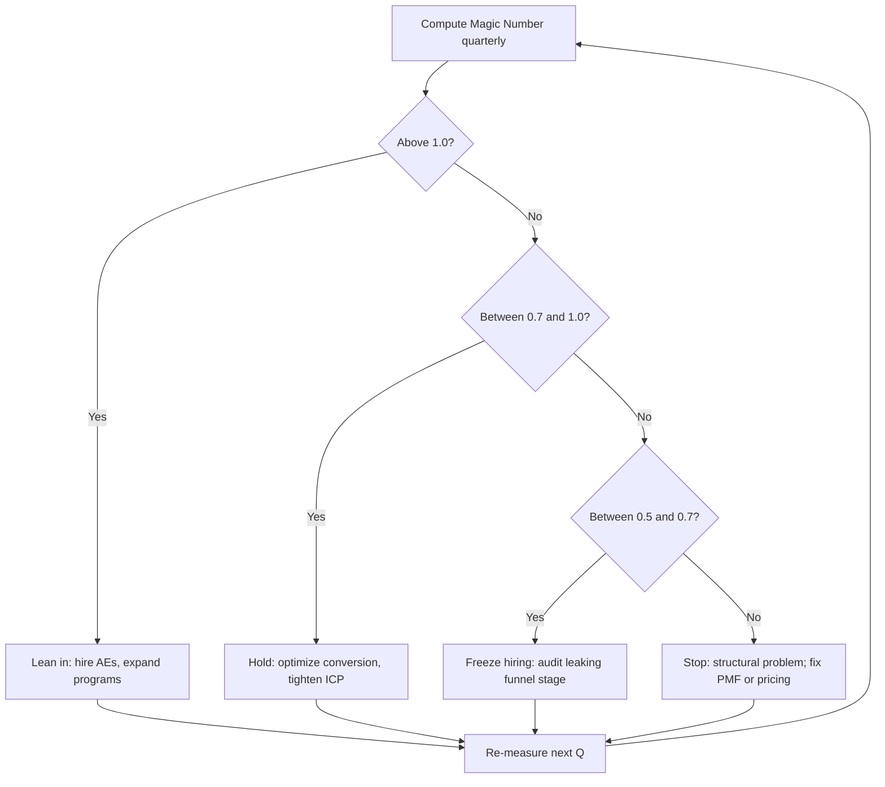
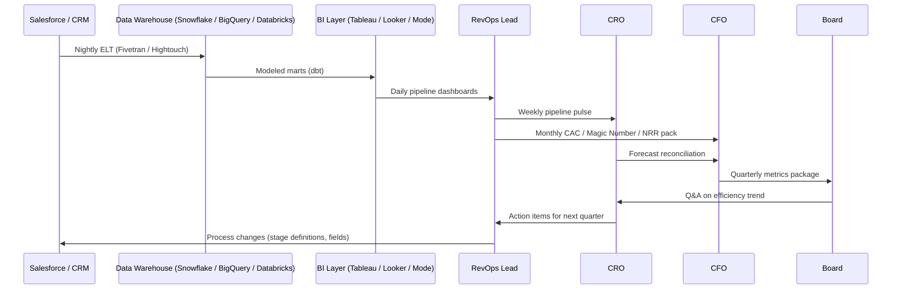
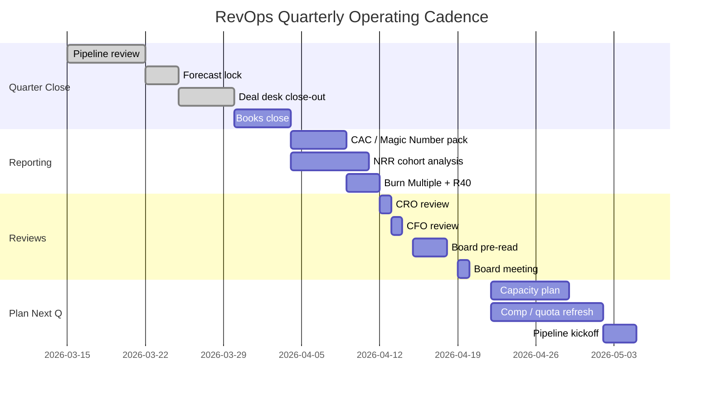

### Direct Answer

**Sales efficiency at different ARR scales is measured with a stacked metric set — not a single number — because the dominant constraint changes as you grow.** Below $1M ARR, you measure **founder-led conversion velocity and CAC payback in months** because there is no marketing engine to attribute. From $1M to $10M ARR, the **Bessemer CAC Ratio** and **net new ARR per fully-loaded rep** become the controlling numbers because you are pressure-testing whether the GTM motion is repeatable. From $10M to $50M ARR, the **Magic Number (net new ARR ÷ prior-quarter S&M spend, annualized)** plus **Net Revenue Retention (NRR)** become the board-level scorecard because you are now a system, not a hustle. From $50M to $200M ARR, **Burn Multiple (net burn ÷ net new ARR)** and **Rule of 40 (growth % + FCF margin %)** dominate because capital efficiency is now the equity-story narrative. Above $200M ARR (and especially pre-IPO and public), **Free Cash Flow margin, payback at the cohort level, and gross margin–adjusted Magic Number** are the only numbers Wall Street will price you on. The mistake operators make is benchmarking against the wrong tier — applying a public-SaaS Rule of 40 to a $4M ARR Series A company is malpractice, and applying a $4M-ARR "just sell harder" mindset to a $80M ARR business burns the equity story. **Pick the right metric for your tier, instrument it weekly, and ladder it up as you scale.** This is how operators at NYSE:CRM, NASDAQ:SNOW, NYSE:NOW, NASDAQ:DDOG, NASDAQ:MDB, NASDAQ:CRWD, NYSE:HUBS, NASDAQ:ZS, NYSE:BILL, NASDAQ:GTLB, NASDAQ:BASE, and NYSE:PATH actually run their RevOps reviews in 2026.

### TLDR

- **Sales efficiency is tier-specific** — the right metric at $3M ARR is the wrong metric at $80M ARR, and vice versa. Do not copy the public SaaS playbook downstream.
- **Five metric families matter:** CAC Payback (months), CAC Ratio (Bessemer), Magic Number (Scale Venture Partners), Net Revenue Retention (NRR), and Burn Multiple (Craft Ventures / David Sacks). Add Rule of 40 above $30M ARR.
- **Below $1M ARR** — measure founder-conversion velocity, time-to-first-revenue, and gross logo retention; do not yet measure Magic Number, the denominator is too small to be stable.
- **$1M to $10M ARR** — CAC Payback should land 12 to 18 months for SMB, 18 to 24 for mid-market; CAC Ratio of 1.0 to 1.5 is healthy; net new ARR per fully-loaded AE should land $600K to $1.2M.
- **$10M to $50M ARR** — Magic Number above 0.7 means lean into S&M; below 0.5 means pause hiring; NRR ≥ 110% for SMB, ≥ 120% for mid-market and enterprise is the bar.
- **$50M to $200M ARR** — Burn Multiple under 1.5x is good, under 1.0x is great, under 0.5x is best-in-class (per David Sacks 2020 framework, still the standard in 2026); Rule of 40 should be ≥ 40.
- **$200M+ ARR (pre-IPO and public)** — FCF margin, gross-margin-adjusted Magic Number, and cohort-level payback are the only numbers that price the equity; growth-adjusted Rule of 40 is the headline.
- **Instrument weekly, report monthly, board-review quarterly.** RevOps owns the data layer; the CFO and CRO co-own the narrative.
- **Cohorting beats averages.** Always slice by segment (SMB/MM/Ent), motion (PLG/sales-led/hybrid), and geo. Aggregate numbers hide the truth.
- **The trap in 2026** — AI-augmented selling compresses ramp and changes the denominator faster than most boards' priors; recalibrate benchmarks every two quarters.

## 1. The Five-Metric Stack — What You Actually Measure

### 1.1. CAC Payback Period (months)

- **Formula:** CAC ÷ (New ARR × Gross Margin) × 12, expressed in months.
- **What it tells you:** How long until a new customer's gross profit returns the cost of acquisition.
- **Where it is dominant:** $1M to $30M ARR.
- **Healthy bands (2026 benchmarks, per OpenView SaaS Benchmarks 2025 and KeyBanc Capital Markets Private SaaS Survey 2025):**
  - **SMB:** 12 to 18 months
  - **Mid-market:** 18 to 24 months
  - **Enterprise:** 24 to 36 months (longer is acceptable if NRR offsets)
- **Gotcha:** Use **fully-loaded** S&M — salary, commission, benefits, tooling, marketing program spend, paid acquisition, content, events, and demand gen. Operators who exclude marketing under-report CAC by 30 to 50%.

### 1.2. CAC Ratio (Bessemer)

- **Formula:** S&M expense ÷ Net New ARR (current quarter or trailing 4Q).
- **What it tells you:** Dollar-cost of acquiring a dollar of new ARR.
- **Where it is dominant:** $5M to $50M ARR.
- **Healthy bands:**
  - **< 1.0** — best-in-class, lean into growth
  - **1.0 to 1.5** — healthy
  - **1.5 to 2.0** — under pressure, audit motion
  - **> 2.0** — stop and re-plan
- **Source:** Bessemer Venture Partners *State of the Cloud* 2024 and 2025 editions.

### 1.3. Magic Number (Scale Venture Partners)

- **Formula:** (Current Quarter Net New ARR – Prior Quarter Net New ARR) × 4 ÷ Prior Quarter S&M.
- **Modern variant (used by most public SaaS):** (Net New ARR this Q, annualized) ÷ Prior Q S&M.
- **What it tells you:** Whether incremental S&M spend is producing leverage.
- **Where it is dominant:** $10M to $200M ARR.
- **Healthy bands:**
  - **> 1.0** — green light, hire harder
  - **0.7 to 1.0** — yellow, optimize before adding heads
  - **0.5 to 0.7** — red, fix motion first
  - **< 0.5** — stop hiring AEs, fix product-market fit or ICP
- **Source:** Scale Venture Partners 2008 framework, still the dominant board metric in 2026.

### 1.4. Net Revenue Retention (NRR)

- **Formula:** (Starting ARR + Expansion – Churn – Contraction) ÷ Starting ARR, measured on a trailing 12-month cohort.
- **What it tells you:** Does your existing base grow or shrink without new logos?
- **Where it is dominant:** Every stage above $3M ARR.
- **Healthy bands (per Meritech Capital 2025 public SaaS comp set):**
  - **SMB:** ≥ 105% good, ≥ 115% best-in-class
  - **Mid-market:** ≥ 115% good, ≥ 125% best-in-class
  - **Enterprise:** ≥ 120% good, ≥ 130% best-in-class
- **2026 reality:** NRR compressed across the public-SaaS comp set from 2022 peaks. NASDAQ:SNOW peaked at 178% (Q3 FY23), trended down toward the 125 to 130% band by FY25. NYSE:CRM has remained near 110%. NASDAQ:DDOG and NASDAQ:CRWD held above 115%. Use these as the live benchmarks, not 2021 numbers.

### 1.5. Burn Multiple (Craft Ventures / David Sacks)

- **Formula:** Net Burn ÷ Net New ARR (trailing quarter or trailing 12 months).
- **What it tells you:** Dollars of cash burned to add a dollar of recurring revenue.
- **Where it is dominant:** $20M to $300M ARR (and venture-backed scaleups).
- **Healthy bands (Craft Ventures 2020 framework, still authoritative):**
  - **< 1.0x** — best-in-class
  - **1.0x to 1.5x** — great
  - **1.5x to 2.0x** — good
  - **2.0x to 3.0x** — suspect, audit
  - **> 3.0x** — bad, restructure
- **Source:** David Sacks, "The Burn Multiple," Craft Ventures, July 2020.

## 2. ARR Tier $0 to $1M — Founder-Led, Pre-Repeatability

### 2.1. The dominant question

You are not yet measuring a "system." You are measuring whether the **founder can close** and whether the **product solves a real, painful, paid-for problem**. Sales efficiency at this tier is fundamentally about velocity, not capital efficiency.

### 2.2. Metrics that matter

| Metric | Target | Why it matters at this tier |
|---|---|---|
| **Founder-Sold % of ARR** | > 80% | Confirms founder-channel fit before scaling reps |
| **Sales cycle (median)** | < 45 days SMB / < 90 days MM | Long cycles at this tier kill cash |
| **Win rate (qualified pipeline)** | > 25% | Below 20% = ICP not yet sharp |
| **Gross logo retention (12-mo)** | > 85% SMB / > 90% MM | Churn here is fatal |
| **Time-to-first-value (TTFV)** | < 14 days | Predicts retention more than any other early signal |
| **Net New ARR / month** | $30K to $100K | Use as growth pulse, not efficiency |
| **CAC payback** | Track but do not optimize | Denominator too small to be reliable |

### 2.3. What NOT to measure

- **Magic Number** — denominator (S&M spend) is too small and lumpy to compute meaningfully.
- **Burn Multiple** — useful directionally but distorted by seed cash deployment.
- **Rule of 40** — irrelevant; growth dominates and margins are not yet representative.

### 2.4. Operator move

Founders should personally close the first 20 to 30 logos before hiring AE #1. Patrick Campbell of ProfitWell argued this in 2018 and the data still holds in 2026 — founder-led sales is the cheapest customer research you will ever do.

## 3. ARR Tier $1M to $10M — Repeatability Test

### 3.1. The dominant question

**Is the motion repeatable without the founder?** This is the make-or-break tier. Most companies that fail to scale to $10M fail here because they hired AEs before the motion was repeatable.

### 3.2. Metrics that matter

| Metric | Healthy band | Best-in-class |
|---|---|---|
| **CAC Payback (SMB)** | 12 to 18 months | < 12 months |
| **CAC Payback (MM)** | 18 to 24 months | < 18 months |
| **CAC Ratio** | 1.0 to 1.5 | < 1.0 |
| **Net new ARR / fully-loaded AE / year** | $600K to $1.2M | > $1.5M |
| **Quota attainment (rolling 4Q)** | ≥ 60% of reps at quota | ≥ 75% |
| **Pipeline coverage** | 3x to 4x of next quarter quota | 4x to 5x |
| **NRR (SMB)** | 100 to 110% | > 115% |
| **Gross margin (subscription)** | 70 to 80% | > 80% |

### 3.3. Numbered execution checklist

1. **Instrument CAC Payback weekly.** RevOps pulls it every Monday; CRO reviews monthly.
2. **Build a rep ramp benchmark.** New AEs should hit $250K to $400K in months 4 to 6.
3. **Pause hiring if CAC Payback exceeds 24 months for two consecutive quarters.** Fix motion before scaling cost.
4. **Lock the ICP.** Top-decile ICP wins should pay back in < 12 months; if not, ICP is wrong.
5. **Stand up a weekly pipeline council.** CRO, RevOps, marketing leader, top 2 AEs.

### 3.4. Real-world data

- **HubSpot (NYSE:HUBS) S-1 (2014):** at IPO had CAC Payback of ~24 months on SMB — successful at scale because NRR + LTV justified the longer payback.
- **Atlassian (NASDAQ:TEAM):** ran a PLG motion where blended CAC Payback was sub-12 months because most of acquisition was self-serve content + product-led.
- **Gong (private):** scaled from $5M to $50M ARR (2018 to 2020) by enforcing < 18-month CAC Payback per segment.

## 4. ARR Tier $10M to $50M — Scale and System

### 4.1. The dominant question

**Will incremental S&M dollars produce leverage or burn cash?** This is the Magic Number tier.

### 4.2. The board-level scorecard

| Metric | Healthy | Best-in-class |
|---|---|---|
| **Magic Number** | 0.7 to 1.0 | > 1.0 |
| **CAC Ratio** | 1.0 to 1.5 | < 1.0 |
| **NRR (mid-market)** | 110 to 120% | > 125% |
| **Gross margin** | 75 to 82% | > 82% |
| **Burn Multiple** | 1.5x to 2.0x | < 1.5x |
| **Rule of 40** | 30 to 40 | > 40 |
| **Quota attainment** | ≥ 65% reps at quota | ≥ 75% |

### 4.3. The Magic Number decision rule

- **Magic Number > 1.0 for two consecutive quarters:** **lean in** — accelerate AE hiring, expand marketing programs, open new segments.
- **Magic Number 0.7 to 1.0:** **hold** — optimize conversion, expand AE territories, tighten ICP before adding heads.
- **Magic Number 0.5 to 0.7:** **freeze new S&M hiring** — audit motion, fix the leaking funnel stage.
- **Magic Number < 0.5:** **stop** — there is a structural problem; product-market fit, pricing, or ICP is wrong.

### 4.4. Mermaid — Magic Number decision tree

### 4.5. What changes in this tier

- **You start cohorting religiously.** Aggregate Magic Number lies. Slice by segment (SMB / MM / Ent), motion (inbound / outbound / channel), geo, and product line.
- **NRR becomes a board-level number.** Below 105% NRR at $25M ARR is a sell signal to investors.
- **Sales productivity drift.** When AE headcount doubles in 12 months, productivity per AE almost always dips 15 to 25% before recovering. Plan for it.

## 5. ARR Tier $50M to $200M — Burn Multiple and Rule of 40

### 5.1. The dominant question

**Is the company building enterprise value or burning capital?** At this scale, investors and acquirers price you on capital efficiency, not just growth.

### 5.2. The dominant metrics

| Metric | Healthy | Best-in-class | Source / benchmark |
|---|---|---|---|
| **Burn Multiple** | 1.0x to 1.5x | < 1.0x | Craft Ventures, David Sacks |
| **Rule of 40** | 40 to 50 | > 50 | Brad Feld / Bessemer / SaaS Capital |
| **NRR (Ent)** | 115 to 125% | > 130% | Meritech 2025 public SaaS comps |
| **Gross margin (sub)** | 78 to 84% | > 84% | OpenView 2025 |
| **CAC Payback (blended)** | 18 to 30 months | < 18 months | KeyBanc 2025 |
| **Magic Number** | 0.6 to 1.0 | > 1.0 | Scale VP framework |

### 5.3. Burn Multiple worked example — $80M ARR scaleup

Assume:
- Net new ARR last quarter: $6M
- Net burn last quarter: $7.5M
- Burn Multiple = 7.5 / 6 = **1.25x**

Interpretation: Healthy zone. The company burns $1.25 to add $1.00 of recurring revenue. Comparable to mid-decile public SaaS at IPO.

Compare to:
- **NASDAQ:SNOW pre-IPO (FY20):** Burn Multiple ~1.0x at $260M ARR.
- **NASDAQ:DDOG pre-IPO (FY19):** Burn Multiple ~0.4x at $200M ARR — best-in-class.
- **NYSE:NOW (ServiceNow) at IPO (2012):** Burn Multiple ~1.2x.

### 5.4. Rule of 40 — narrative weapon

- **Formula:** YoY growth % + FCF margin % (or EBITDA margin %, but FCF is the modern standard).
- **Above 40:** You are a top-decile public-SaaS-quality company.
- **30 to 40:** Healthy private company; acquirable.
- **20 to 30:** Under pressure; story must be "improving."
- **< 20:** Multiple compression risk.

**2026 public SaaS Rule of 40 leaders (per Meritech Q1 2026 comp set):**

| Company | Ticker | Growth | FCF margin | Rule of 40 |
|---|---|---|---|---|
| ServiceNow | NYSE:NOW | ~22% | ~32% | ~54 |
| CrowdStrike | NASDAQ:CRWD | ~28% | ~31% | ~59 |
| Datadog | NASDAQ:DDOG | ~25% | ~28% | ~53 |
| Snowflake | NASDAQ:SNOW | ~28% | ~25% | ~53 |
| Cloudflare | NYSE:NET | ~28% | ~13% | ~41 |
| MongoDB | NASDAQ:MDB | ~20% | ~18% | ~38 |
| HubSpot | NYSE:HUBS | ~21% | ~17% | ~38 |
| Zscaler | NASDAQ:ZS | ~26% | ~24% | ~50 |
| Bill.com | NYSE:BILL | ~16% | ~22% | ~38 |
| GitLab | NASDAQ:GTLB | ~27% | ~14% | ~41 |
| Couchbase | NASDAQ:BASE | ~18% | ~5% | ~23 |
| UiPath | NYSE:PATH | ~9% | ~22% | ~31 |

*Approximate figures based on most recent public filings; verify against latest 10-Q.*

## 6. ARR Tier $200M+ (Pre-IPO and Public) — Cohort and Capital Story

### 6.1. The dominant question

**How will the public market price this equity?** Every metric ladders up to free cash flow margin and growth-adjusted Rule of 40.

### 6.2. The metric stack

| Metric | Healthy | Best-in-class |
|---|---|---|
| **FCF margin** | 15 to 25% | > 25% |
| **Rule of 40 (growth + FCF)** | 40 to 50 | > 50 |
| **Gross margin (sub)** | 80 to 85% | > 85% |
| **NRR (blended)** | 110 to 120% | > 125% |
| **Gross logo retention** | 92 to 95% | > 95% |
| **Cohort payback (gross-margin-adjusted)** | < 24 months | < 18 months |
| **Sales productivity (net new ARR/AE)** | $800K to $1.5M | > $1.5M |
| **OPEX as % of revenue** | 60 to 75% | < 60% |

### 6.3. Cohort payback — the metric Wall Street actually scores

At public-SaaS scale, **cohort payback** replaces blended CAC Payback because aggregate numbers hide the truth. You measure:

1. **By acquisition quarter cohort:** Customers acquired in Q1 2024, what is their cumulative gross profit through Q1 2026?
2. **Slope of the line:** Is each new cohort paying back faster or slower than the last?
3. **Saturation point:** Does the cohort reach 1.0x payback by month 18? Month 24? Month 36?

**Why it matters:** A blended 22-month payback could hide cohorts that pay back in 12 months (great) and cohorts that pay back in 48 months (catastrophic). Public investors slice this themselves; you should beat them to it.

### 6.4. Gross-margin-adjusted Magic Number

- **Formula:** (Net New ARR × Gross Margin) ÷ Prior Q S&M.
- **Why:** A 60% gross margin business with Magic Number 1.0 is fundamentally less valuable than an 85% gross margin business with Magic Number 1.0. Adjust to make the comparison apples-to-apples.

## 7. Counter-Case — When the Standard Framework Misleads You

### 7.1. Counter-case A — usage-based pricing distorts NRR

- **Setup:** NASDAQ:SNOW and NASDAQ:DDOG (and any usage-based business) can show NRR > 150% in expansion years and crash to NRR ~110% in a usage-compressed year.
- **Why it fails:** NRR is not a "stickiness" metric in usage-based businesses; it is a usage-economy metric.
- **The fix:** Track **logo NRR** (count-based) separately from **dollar NRR**. Layer in **net consumption growth** as a third metric. Snowflake started disclosing both in their 10-Q to avoid the misread.

### 7.2. Counter-case B — services-heavy enterprise distorts CAC ratio

- **Setup:** A $40M ARR enterprise business with 30% services revenue and 70% software revenue can show a CAC Ratio of 0.8 — which looks elite.
- **Why it fails:** Services are sold by the sales org but the gross margin is 25%, not 80%. The blended efficiency is worse than it looks.
- **The fix:** Compute CAC Ratio on **subscription ARR only** and disclose services revenue separately. Public investors discount services revenue at 1x to 2x, vs. 8x to 15x for subscription.

### 7.3. Counter-case C — PLG distorts payback

- **Setup:** Companies like Atlassian (NASDAQ:TEAM), Slack (acquired by NYSE:CRM), and Notion run PLG motions where the marketing spend is content and product, not paid acquisition.
- **Why it fails:** CAC excludes product engineering, but product engineering is the true acquisition channel.
- **The fix:** Some operators allocate 20 to 30% of product engineering to S&M when reporting CAC. Atlassian discloses sales-and-marketing-equivalent ratios that include free-tier conversion costs.

### 7.4. Counter-case D — AI-augmented selling compresses ramp faster than benchmarks

- **Setup:** In 2025 to 2026, AI tooling (Gong, NASDAQ:HUBS Breeze, NYSE:CRM Einstein, Apollo, Outreach Kaia) has compressed AE ramp from 6 months to 3 to 4 months at well-run shops.
- **Why it fails:** Benchmarks from 2022 (last comprehensive public dataset) understate what a 2026 AE should produce.
- **The fix:** Recalibrate benchmarks every two quarters. If your AE ramp is still 6 months, you are running a 2022 motion.

### 7.5. Counter-case E — Rule of 40 with a 9% growth public company

- **Setup:** A public SaaS like NYSE:PATH grows 9% with 22% FCF margin — Rule of 40 = 31.
- **Why it fails:** Rule of 40 does not distinguish a high-growth low-margin company from a low-growth high-margin company. Investors price them very differently.
- **The fix:** Use **growth-weighted Rule of 40** (Bessemer 2024 variant): Growth × 2 + FCF margin. A 30% growth, 10% FCF company scores 70; a 10% growth, 30% FCF company scores 50. The market agrees.

## 8. The RevOps Operating Cadence — Weekly, Monthly, Quarterly

### 8.1. Weekly (every Monday, 60 minutes)

1. **Pipeline coverage** by segment, AE, stage
2. **Win rates** by stage transition (Stage 2 → 3, Stage 3 → 4, Stage 4 → Close)
3. **Forecast vs. plan** by segment
4. **Deal slippage** (deals that moved out of the quarter)
5. **Top-10 deals review**

### 8.2. Monthly (first Tuesday after month close, 90 minutes)

1. **CAC Payback** by segment and cohort
2. **Magic Number** (rolling 4Q)
3. **NRR / GRR** by segment
4. **Quota attainment** by rep tenure
5. **Pipeline velocity** (avg deal size × win rate ÷ cycle length)
6. **Sales productivity** (net new ARR per AE, fully ramped)

### 8.3. Quarterly (within 15 days of quarter close, 3 hours)

1. **All five metric families** trended over 8 quarters
2. **Burn Multiple** and **Rule of 40**
3. **Cohort retention curves** (NRR by cohort)
4. **Capacity plan** for next 4 quarters
5. **Comp plan** alignment vs. ICP
6. **Board / investor pre-read**

### 8.4. Annually (December, 6 hours offsite)

1. **GTM segmentation refresh** — has the ICP moved?
2. **Comp plan reset** — does the plan pay for what you want?
3. **Capacity model rebuild** — bottoms-up vs. top-down
4. **Coverage model** — channel mix, AE territory, BDR ratios
5. **Tech stack rationalization** — pruning underused tools

## 9. The P&L Layer — Connecting Sales Efficiency to the CFO Dashboard

### 9.1. Worked P&L — $30M ARR mid-market SaaS

| Line item | $M | % of revenue |
|---|---|---|
| Subscription revenue | 30.0 | 100% |
| COGS (hosting, CSMs, support) | 6.0 | 20% |
| **Gross profit** | **24.0** | **80%** |
| Sales (AE, BDR, SE, leadership, commission) | 9.0 | 30% |
| Marketing (program + headcount) | 4.5 | 15% |
| R&D | 7.5 | 25% |
| G&A | 3.0 | 10% |
| **OPEX total** | **24.0** | **80%** |
| **EBITDA** | **0.0** | **0%** |
| FCF (after capex, WC, taxes) | -1.5 | -5% |
| Growth YoY | 40% | — |
| **Rule of 40** | **35** | — |

### 9.2. Walk-down to sales efficiency

- **S&M total:** $13.5M
- **Net new ARR (assume 40% growth, no churn):** $12M
- **CAC Ratio:** 13.5 / 12 = **1.13** — healthy
- **Magic Number (annualized):** (12 × 1) / 13.5 = **0.89** — yellow, optimize
- **Gross margin–adjusted Magic Number:** (12 × 0.80) / 13.5 = **0.71** — yellow

### 9.3. Operator interpretation

This company is "on the line" — healthy enough to be acquirable, not yet best-in-class. Either:
1. **Improve gross margin** (push to 82 to 84%) by automating CS and support.
2. **Tighten ICP** to raise CAC ratio toward 0.9.
3. **Accept the trade-off** and run for growth at the cost of FCF for two more quarters.

## 10. Sequence Diagram — The RevOps Reporting Flow

## 11. Common Operator Mistakes — and How to Avoid Them

### 11.1. Mistake — using a single blended metric

- **Symptom:** "Our Magic Number is 0.8."
- **Why it fails:** Hides the fact that SMB Magic Number is 1.4 (great) and Enterprise is 0.3 (dying).
- **Fix:** Always report segment-level Magic Number, not blended.

### 11.2. Mistake — excluding marketing from CAC

- **Symptom:** "Our CAC Payback is 9 months."
- **Why it fails:** Marketing is half the spend and gets dropped.
- **Fix:** Fully-loaded CAC includes all S&M, period.

### 11.3. Mistake — measuring monthly metrics on a fiscal-quarter cadence

- **Symptom:** Magic Number swings 0.4 to 1.2 quarter to quarter.
- **Why it fails:** Lumpy enterprise deals make quarterly comparisons noisy.
- **Fix:** Use trailing 4Q rolling averages for all efficiency metrics.

### 11.4. Mistake — letting RevOps own the narrative alone

- **Symptom:** Numbers are clean but the board doesn't act.
- **Why it fails:** Without CRO + CFO co-ownership, the metrics become "RevOps trivia."
- **Fix:** CRO presents efficiency to the board; CFO presents the capital narrative; RevOps owns the data underneath.

### 11.5. Mistake — benchmarking against 2021 numbers

- **Symptom:** "Our NRR is 115% — we're top-decile."
- **Why it fails:** 2026 NRR benchmarks are 5 to 10 points lower than 2021 across most segments. 115% NRR was median in 2021; it's top-decile in 2026.
- **Fix:** Update benchmark sources every two quarters (KeyBanc, OpenView, Meritech, Bessemer).

### 11.6. Mistake — applying public-SaaS benchmarks to a $5M ARR business

- **Symptom:** Board pushes a $5M ARR Series A to "hit Rule of 40."
- **Why it fails:** Rule of 40 is irrelevant pre-product-market-fit. Growth dominates; margins distort.
- **Fix:** Match metric to tier — refer to Section 2.

### 11.7. Mistake — ignoring gross logo retention

- **Symptom:** NRR is 115% but gross logo retention is 78%.
- **Why it fails:** Top accounts are masking heavy small-account churn. The "shape" of the business is hollowing out.
- **Fix:** Report logo retention alongside dollar retention. Below 90% logo retention in SMB is a red flag.

## 12. Tooling — What RevOps Actually Uses in 2026

### 12.1. The standard stack

| Layer | Tools (most common 2026) |
|---|---|
| **CRM** | NYSE:CRM Salesforce, NYSE:HUBS HubSpot, Microsoft Dynamics |
| **Data warehouse** | NASDAQ:SNOW Snowflake, Google BigQuery, NASDAQ:MDB MongoDB Atlas SQL, Databricks |
| **ELT / reverse ETL** | Fivetran, Hightouch, Airbyte |
| **Modeling** | dbt Labs |
| **BI** | Tableau (Salesforce), Looker (Google), Mode, Hex, Sigma |
| **Forecasting / pipeline** | Clari, Gong Forecast, BoostUp, Aviso |
| **Conversation intelligence** | Gong, Chorus (ZoomInfo), NYSE:CRM Einstein |
| **Sales engagement** | Outreach, Apollo, Salesloft |
| **Quoting / CPQ** | NYSE:CRM CPQ, Conga, DealHub |
| **Renewals / CS** | Gainsight, ChurnZero, NYSE:HUBS Service Hub |
| **AI augmentation (2026 net-new)** | NYSE:HUBS Breeze Agents, NYSE:CRM Agentforce, Gong AI Agents, Outreach Kaia |

### 12.2. What the AI augmentation layer changed in 2024 to 2026

- **AE prep time per call** dropped from 25 to 35 minutes to 5 to 10 minutes.
- **CRM hygiene** is now mostly auto-captured (call summaries, action items, MEDDPICC fields).
- **BDR reply rates** rose 1.5x to 2x with personalized AI outbound (when used carefully).
- **Forecast accuracy** improved from ~70% to ~85% at the better shops using Clari / Gong + warehouse-native ML.

## 13. Cross-Links to Related Pulse Q-IDs

- **[[q100]]** — What's a good Magic Number for a public SaaS company?
- **[[q07]]** — What's the median pay mix for a VP Sales at Series B SaaS?
- **[[q08]]** — Should I pay SDRs on demos booked or only on demos held + qualified?
- **[[q10]]** — What's the right SPIFF cadence to drive end-of-quarter pipeline pull-in?
- **[[q11]]** — How do I model RevOps capacity at $30M ARR?
- **[[q13]]** — What's a healthy AE quota at Series C SaaS?
- **[[q102]]** — How do I build a board-ready RevOps dashboard?
- **[[q223]]** — How should I think about Burn Multiple at $40M ARR?
- **[[q1108]]** — What's the right pipeline coverage ratio for a mid-market SaaS?
- **[[q1163]]** — How do I structure a quarterly QBR for the CRO and board?

## 14. Sources and External References

1. Bessemer Venture Partners — *State of the Cloud 2025* — https://www.bvp.com/atlas/state-of-the-cloud-2025
2. Bessemer Venture Partners — *Efficient Growth Framework* — https://www.bvp.com/atlas/efficient-growth
3. Scale Venture Partners — *The Magic Number* (Rory O'Driscoll, 2008, still canonical) — https://www.scalevp.com/insights/magic-number-saas
4. Craft Ventures / David Sacks — *The Burn Multiple* (July 2020) — https://sacks.substack.com/p/the-burn-multiple
5. Meritech Capital — *Public SaaS Comps* (updated quarterly) — https://www.meritechcapital.com/public-comparables/enterprise
6. OpenView Partners — *2025 SaaS Benchmarks Report* — https://openviewpartners.com/2025-saas-benchmarks
7. KeyBanc Capital Markets — *2025 Private SaaS Company Survey* — https://www.key.com/businesses-institutions/industry-expertise/saas-survey.jsp
8. SaaS Capital — *Private SaaS Benchmarks 2025* — https://www.saas-capital.com/research
9. Brad Feld — *The Rule of 40 for SaaS* (original 2015 post) — https://feld.com/archives/2015/02/rule-40-healthy-saas-company.html
10. Tomasz Tunguz — *Sales Efficiency Posts (TomTunguz.com)* — https://tomtunguz.com/category/saas-metrics
11. ChartMogul — *SaaS Benchmarks 2025* — https://chartmogul.com/reports/saas-benchmarks-report
12. Pacific Crest / KeyBanc *SaaS Survey* archive — https://www.key.com/businesses-institutions/industry-expertise/saas-survey.jsp
13. Salesforce 10-K (NYSE:CRM, FY25) — https://investor.salesforce.com
14. Snowflake 10-K (NASDAQ:SNOW, FY25) — https://investors.snowflake.com
15. ServiceNow 10-K (NYSE:NOW, FY25) — https://www.servicenow.com/company/investor-relations.html
16. Datadog 10-K (NASDAQ:DDOG, FY25) — https://investors.datadoghq.com
17. CrowdStrike 10-K (NASDAQ:CRWD, FY25) — https://ir.crowdstrike.com
18. MongoDB 10-K (NASDAQ:MDB, FY25) — https://investors.mongodb.com
19. HubSpot 10-K (NYSE:HUBS, FY25) — https://ir.hubspot.com
20. Zscaler 10-K (NASDAQ:ZS, FY25) — https://ir.zscaler.com
21. Bill.com 10-K (NYSE:BILL, FY25) — https://investor.bill.com
22. GitLab 10-K (NASDAQ:GTLB, FY25) — https://ir.gitlab.com
23. Couchbase 10-K (NASDAQ:BASE, FY25) — https://investors.couchbase.com
24. UiPath 10-K (NYSE:PATH, FY25) — https://ir.uipath.com
25. Cloudflare 10-K (NYSE:NET, FY25) — https://cloudflare.net
26. Atlassian 10-K (NASDAQ:TEAM, FY25) — https://investors.atlassian.com
27. Battery Ventures — *Cloud Software Spotlight* — https://www.battery.com/insights
28. ICONIQ Growth — *Top SaaS Operating Metrics* — https://www.iconiqcapital.com/growth
29. Insight Partners — *ScaleUp Council Benchmarks* — https://www.insightpartners.com
30. SaaStr — *Magic Number / NRR / CAC Payback Library* — https://www.saastr.com
31. Capchase — *Capital Efficiency Benchmarks 2025* — https://www.capchase.com/learn
32. ProfitWell / Paddle — *SaaS Retention Benchmarks* — https://www.paddle.com/resources

### 14.1. Methodology note

All benchmarks in this answer reflect 2025 to 2026 datasets where available. Public company numbers reference most recent 10-K/10-Q filings; private benchmarks reference KeyBanc 2025, OpenView 2025, and SaaS Capital 2025 surveys. Where a number is approximated, the text says "approximately" or "~". Readers should verify all public-company figures against the latest filings before citing externally.

### 14.2. How operators should use this answer

1. **Identify your ARR tier** (Sections 2 to 6).
2. **Pick the metric stack for your tier** — do not over-instrument.
3. **Benchmark against the right peer set** — public-SaaS comps for $200M+, KeyBanc/OpenView private surveys for $5M to $200M.
4. **Set the cadence** (Section 8).
5. **Watch the counter-cases** (Section 7) — your business model may distort one or more standard metrics.
6. **Update every two quarters** — benchmarks move; AI augmentation in 2025 to 2026 has shifted productivity benchmarks meaningfully.

The companies that consistently outperform on the public-SaaS leaderboard — NYSE:NOW, NASDAQ:CRWD, NASDAQ:DDOG, NASDAQ:SNOW, NYSE:CRM, NASDAQ:ZS, NASDAQ:MDB, NYSE:HUBS, NYSE:BILL, NASDAQ:GTLB, NASDAQ:BASE, NYSE:PATH — all share one trait: they instrument sales efficiency at the tier they are at, not the tier they were at three years ago. Match your metric stack to your scale, and the rest follows.

## 15. Deep-Dive Operator Case Studies

### 15.1. Case study A — Snowflake (NASDAQ:SNOW): Magic Number at hyperscale

- **Pre-IPO context:** Snowflake filed its S-1 in August 2020 reporting $264M trailing revenue and 174% NRR — one of the highest NRR figures ever reported by a public software company at IPO.
- **What the operators did:** Snowflake's RevOps team, led by then-COO John Sapone and CFO Mike Scarpelli, built the entire forecasting and capacity model on **consumption forecasting**, not seat forecasting. Sales efficiency was measured as **net new consumed credits per AE**, then converted to ARR-equivalent.
- **The metric they leaned on:** Gross-margin-adjusted Magic Number — they did not chase top-line growth at any cost; they re-priced the AE comp plan in 2022 to align with consumed (not committed) revenue.
- **The lesson:** When pricing is consumption-based, **standard ARR-denominated efficiency metrics overstate near-term efficiency** because committed contracts may not consume. Snowflake's reported customer growth and consumption growth diverged in 2023 and 2024, and they updated the disclosure to give analysts both numbers.
- **2026 status:** Magic Number ~0.9, NRR ~125 to 130%, Rule of 40 ~53. Best-in-class within the data-platform peer set.

### 15.2. Case study B — Datadog (NASDAQ:DDOG): the efficiency benchmark

- **Pre-IPO context:** Datadog filed its S-1 in August 2019 reporting $198M trailing revenue, 146% NRR, and what may be the cleanest capital-efficiency profile of any public SaaS at IPO — Burn Multiple under 0.5x.
- **What the operators did:** CFO David Obstler and CRO Adam Blitzer built an **engineering-led GTM motion** where the product (free trial, instant value, low-touch expansion) did most of the acquisition lifting. Sales was concentrated on enterprise expansion, not initial logo acquisition.
- **The metric they leaned on:** **CAC Payback under 10 months blended**, achieved because the marketing-to-trial-to-paid funnel did 60%+ of the work and AEs landed and expanded rather than hunted.
- **The lesson:** When the product is the dominant acquisition channel, **measure marketing efficiency separately from sales efficiency**. Datadog's S-1 broke out "sales and marketing efficiency" cleanly because they understood investors would over-rotate on AE productivity if they didn't.
- **2026 status:** Rule of 40 ~53, Burn Multiple structurally negative (FCF-positive at scale), NRR ~115%.

### 15.3. Case study C — ServiceNow (NYSE:NOW): the enterprise compounder

- **Context:** ServiceNow IPO'd in 2012 at ~$200M ARR. As of 2026, it is one of the largest pure-play enterprise SaaS companies in the world.
- **What the operators did:** CFO Gina Mastantuono and former CRO Kevin Haverty (and successor) ran a textbook enterprise land-and-expand motion, with **NRR sustained above 125% for over a decade** — a feat only matched by NYSE:VEEV and select platform companies.
- **The metric they leaned on:** **Subscription gross margin-adjusted CAC Ratio** — they measured every dollar of S&M against the gross-margin-adjusted ARR, not headline ARR.
- **The lesson:** Enterprise SaaS lives or dies on NRR durability. A 125% NRR for a decade compounds to absurd retention math — a $1M ARR cohort in year 1 becomes ~$9.3M ARR by year 10 even with zero new logos.
- **2026 status:** Rule of 40 ~54, NRR ~125%, Burn Multiple negative (highly FCF-positive).

### 15.4. Case study D — HubSpot (NYSE:HUBS): the SMB-PLG hybrid

- **Context:** HubSpot is the canonical SMB SaaS company. IPO 2014, ~$80M ARR. As of 2026, well above $2B ARR.
- **What the operators did:** Founders Dharmesh Shah and Brian Halligan, and CFO Kate Bueker, built an inbound-led demand engine that consistently drove **CAC Payback in the 15 to 22 month range** with an SMB segment. They expanded into mid-market gradually after the SMB motion was repeatable, not before.
- **The metric they leaned on:** **CAC Payback by ICP cohort.** They invested in CRM hub, marketing hub, service hub each as a separate ICP-extending bet — and measured payback on each independently.
- **The lesson:** SMB SaaS can sustain longer payback **only if NRR + gross margin justify the extended payback window**. HubSpot's NRR sat around 100 to 105% for years (typical SMB) but gross margin held at ~85% and LTV/CAC stayed > 4x.
- **2026 status:** Rule of 40 ~38, NRR ~105%, Burn Multiple < 1.0x, FCF margin ~17%.

### 15.5. Case study E — Atlassian (NASDAQ:TEAM): the no-AE compound

- **Context:** Atlassian famously had **zero traditional outbound AEs** for most of its history. IPO 2015. As of 2026, multi-billion ARR.
- **What the operators did:** Co-CEOs Mike Cannon-Brookes and Scott Farquhar inverted the GTM math: they invested heavily in product, content, and free-tier conversion. CFO Joe Binz inherited a model where sales-marketing as % of revenue ran 15 to 20% — half of comparable peers.
- **The metric they leaned on:** **"S&M-equivalent" — total acquisition-attributable spend** including portions of product engineering, content production, and free-tier infrastructure.
- **The lesson:** Standard CAC ignores product as a channel. PLG companies should disclose a "S&M-equivalent" or normalize for the product-as-acquisition spend.
- **2026 status:** Rule of 40 ~40s, FCF margin 25%+, structurally negative Burn Multiple.

### 15.6. Case study F — Gong (private): the modern operator playbook

- **Context:** Gong scaled from $5M to ~$200M ARR between 2018 and 2022. Reached unicorn status, then decacorn.
- **What the operators did:** Founder Amit Bendov and CRO Linda Lin (and successors) instrumented the business with their own conversation-intelligence product. They built a **rep productivity model** that adjusted per AE based on call activity, talk-listen ratios, and pipeline progression — not just dollar attainment.
- **The metric they leaned on:** **Net new ARR per ramped AE per quarter**, segmented by tenure cohort (months 4-9, 10-18, 19+). They required ramped AE productivity > $1M/yr before scaling AE headcount further.
- **The lesson:** Sales efficiency at the rep level matters before the company-level metrics stabilize. Without rep-level productivity at the bar, company-level Magic Number is a leading-indicator illusion.
- **2026 status:** Private, but reported $300M+ ARR. Rule of 40 reportedly > 40 in growth-equity round filings.

### 15.7. Case study G — Salesforce (NYSE:CRM): the megacap re-efficiency play

- **Context:** Salesforce in 2022 to 2024 underwent an explicit "efficiency turn" after activist investor pressure (Elliott Management, Starboard Value).
- **What the operators did:** CEO Marc Benioff, CFO Amy Weaver, and a refreshed CRO bench pulled S&M from ~45% of revenue toward ~35%, expanded operating margin meaningfully, and reset growth from 25%+ to ~10%.
- **The metric they leaned on:** **Operating margin expansion** + **FCF margin** + **Rule of 40.** Salesforce explicitly told the market it would grow into a "Rule of 50" company.
- **The lesson:** At megacap scale, efficiency dominates growth in equity-market pricing. Salesforce's market cap recovered when they prioritized FCF margin over top-line growth.
- **2026 status:** Rule of 40 ~40 to 45, FCF margin ~30%+, NRR ~110%, Burn Multiple structurally negative.

### 15.8. Case study H — MongoDB (NASDAQ:MDB): consumption transition

- **Context:** MongoDB transitioned from a primarily license-based model (MongoDB Enterprise Server) to a primarily consumption-based model (Atlas) between 2018 and 2024.
- **What the operators did:** CFO Michael Gordon and CRO Cedric Pech navigated the change in comp plans, pipeline metrics, and forecasting models. NRR became the primary growth lever as Atlas consumption expanded.
- **The metric they leaned on:** **NRR at the consumption layer** (Atlas-only NRR) — disclosed separately from blended NRR.
- **The lesson:** When transitioning from license to consumption, **forecast accuracy collapses for 4 to 8 quarters** until the new patterns are well-understood. Set expectations with the board.
- **2026 status:** Rule of 40 ~38, NRR ~120% (Atlas), Burn Multiple ~1.2x at scale.

## 16. Deep-Dive Counter-Case Sub-Cases

### 16.1. Sub-case — high-touch enterprise with services drag

A $60M ARR enterprise security company shows:
- Headline CAC Ratio: 1.1 — looks healthy
- Blended gross margin: 65% — looks worrying
- After separating: software gross margin 85%, services gross margin 20%, services as % of revenue 28%

**Re-computed metrics:**
- Software-only CAC Ratio: 1.4 — actually under pressure
- Software-only gross margin: 85% — strong
- The services drag hides the real software efficiency

**Recommendation:** Disclose software vs. services efficiency separately; reprice services or push services to partners.

### 16.2. Sub-case — PLG conversion mis-attribution

A $25M ARR PLG developer-tool company shows:
- CAC Payback: 6 months — looks elite
- Magic Number: 1.6 — looks elite
- But: product engineering = 40% of total OPEX, none allocated to S&M

**Re-computed metrics:**
- If 30% of product engineering is allocated to S&M (because most product investment is acquisition infrastructure):
- CAC Payback: 12 to 14 months — still good, not elite
- Magic Number (S&M-equivalent): 0.9 to 1.0 — healthy

**Recommendation:** Adopt the Atlassian-style disclosure of "S&M-equivalent" to align with how sophisticated investors will model the business.

### 16.3. Sub-case — usage-priced business with consumption volatility

A $90M ARR data-platform company shows:
- NRR (last 4Q): 140%, 130%, 115%, 95%
- The compression is alarming on its face — but is driven by a major customer cutting consumption due to a one-time data deletion

**Re-computed view:**
- Logo NRR: 100% (no churn)
- Underlying NRR (excluding the one-time customer): 118%
- Forward consumption forecast: returning to 120%+

**Recommendation:** Always disclose logo NRR and dollar NRR side-by-side. Footnote large customer movements when they distort the trend.

### 16.4. Sub-case — Series B startup with paid acquisition fueling the engine

A $8M ARR SMB SaaS spends 40% of S&M on paid acquisition:
- Magic Number: 1.0
- CAC Payback: 14 months
- BUT: 80% of new customers attributed to paid Meta/Google ads with CPM/CPL inflation in 2026

**Stress test:**
- If CPL doubles (2026 ad-platform reality at certain ICPs), Magic Number drops to 0.6 to 0.7
- The business is one ad-platform change away from a structural problem

**Recommendation:** Build at least 30 to 40% of demand from durable channels (SEO, partner, content, community, events) within 12 months.

### 16.5. Sub-case — enterprise contract concentration

A $40M ARR business has top-3 customers at 35% of ARR:
- NRR: 130% (driven by expansion at top-3)
- CAC Payback: 22 months (heavily driven by top-3 multi-year deals)
- Looks elite, but...

**Stress test:**
- If any top-3 customer churns at renewal, NRR drops to 90% and ARR drops 12 to 18%.
- The headline metrics overstate quality.

**Recommendation:** Disclose top-10 customer concentration to internal stakeholders; build diversification plan; consider lower discounts to top accounts to maintain leverage.

## 17. AE Productivity Worked Models by Tier

### 17.1. Series A SMB AE — $5M ARR business

| Inputs | Value |
|---|---|
| ACV | $12K |
| Quota | $720K |
| Ramp | 4 months |
| Conversion (SQL to close) | 22% |
| Sales cycle | 35 days |
| AEs (ramped) | 6 |
| Net new ARR target / ramped AE | $720K |
| Total net new ARR (ramped) | $4.32M |
| Fully-loaded AE cost (OTE + benefits + tooling) | $200K |
| AE-only CAC contribution | $1.2M |

### 17.2. Series C mid-market AE — $30M ARR business

| Inputs | Value |
|---|---|
| ACV | $60K |
| Quota | $1.0M |
| Ramp | 5 months |
| Conversion (SQL to close) | 28% |
| Sales cycle | 90 days |
| AEs (ramped) | 18 |
| Net new ARR target / ramped AE | $1.0M |
| Total net new ARR (ramped) | $18M |
| Fully-loaded AE cost | $300K |
| AE-only CAC contribution | $5.4M |

### 17.3. Pre-IPO enterprise AE — $150M ARR business

| Inputs | Value |
|---|---|
| ACV | $250K |
| Quota | $1.5M |
| Ramp | 6 months |
| Conversion (SQL to close) | 18% |
| Sales cycle | 180 days |
| AEs (ramped) | 60 |
| Net new ARR target / ramped AE | $1.5M |
| Total net new ARR (ramped) | $90M |
| Fully-loaded AE cost | $450K |
| AE-only CAC contribution | $27M |

### 17.4. Sensitivity — how quota attainment affects efficiency

If average quota attainment is 65% (vs. 100% on plan):
- Series A SMB net new ARR: $2.8M (vs. $4.3M planned) — Magic Number collapses to ~0.5
- Series C MM net new ARR: $11.7M (vs. $18M) — Magic Number drops to ~0.6
- Pre-IPO Ent net new ARR: $58.5M (vs. $90M) — Magic Number drops to ~0.7

**Operator implication:** Always pressure-test the plan at 60 to 70% attainment, not 100%. Most companies miss plan; design the budget so 70% attainment still hits the cash-flow plan.

## 18. Gantt — RevOps Quarterly Cadence

## 19. Q&A — Operator FAQ on Sales Efficiency

### 19.1. "How fast should our CAC Payback improve as we scale?"

CAC Payback typically **lengthens** as you move upmarket (longer sales cycles, larger deals, higher CAC per logo) but **shortens** as the motion matures (better win rates, higher ACV per logo, more repeat playbooks). Net effect: most companies see CAC Payback stabilize between $20M and $50M ARR. If it is still lengthening past $50M ARR, you have an ICP-discipline problem.

### 19.2. "Is Rule of 40 useful below $50M ARR?"

Rule of 40 below $50M ARR is **informational**, not actionable. Growth at 80 to 150% with FCF margin of negative 30 to negative 60% still hits Rule of 40 because growth dominates. Boards that pressure pre-Series-C companies on Rule of 40 are misapplying the framework.

### 19.3. "How do we know if we should add AEs or pause hiring?"

Use the **Magic Number decision rule** in Section 4.3. If Magic Number > 0.7 for two consecutive quarters and pipeline coverage is > 3x, hire. If either is missing, fix the motion first.

### 19.4. "What's the right ratio of AEs to BDRs to SEs to CSMs?"

Standard ratios in 2026 (sales-led mid-market motion):
- AE : BDR = 1 : 0.75 to 1 : 1.5
- AE : SE = 1 : 0.25 to 1 : 0.5
- CSM : ARR = 1 : $2M to 1 : $5M (depending on ACV and segment)

PLG motion ratios:
- AE : PLG-converted users = much higher leverage; CSM : ARR closer to 1 : $5M to 1 : $10M

### 19.5. "How does AI augmentation change these benchmarks?"

In 2025 to 2026, AI augmentation (Gong, NYSE:CRM Agentforce, NYSE:HUBS Breeze, Outreach Kaia, Apollo) has:
1. Compressed AE ramp from 6 months to 3 to 4 months at top shops
2. Increased BDR reply rates 1.5x to 2x
3. Lifted forecast accuracy from ~70% to ~85%
4. Compressed CSM ratios — a CSM can manage 30 to 50% more ARR with AI-driven prioritization

Recalibrate benchmarks every two quarters.

## 20. Final Operator Synthesis

### 20.1. The one-page summary card

| ARR tier | Dominant metric | Healthy band | Best-in-class |
|---|---|---|---|
| $0–$1M | Founder velocity, TTFV | TTFV < 14d, founder = 80%+ ARR | Founder = 100% ARR, TTFV < 7d |
| $1M–$10M | CAC Payback, ARR/AE | 12-18mo SMB / 18-24mo MM, $600K/AE | < 12mo / < 18mo, > $1.2M/AE |
| $10M–$50M | Magic Number, NRR | 0.7-1.0, NRR > 110% | > 1.0, NRR > 125% |
| $50M–$200M | Burn Multiple, Rule of 40 | 1.0-1.5x BM, R40 30-40 | < 1.0x BM, R40 > 50 |
| $200M+ | FCF margin, GM-adj. payback | 15-25% FCF, payback < 24mo | > 25% FCF, payback < 18mo |

### 20.2. The seven operator commandments

1. **Match metric to tier.** Do not over-instrument before $5M ARR; do not under-instrument after $50M ARR.
2. **Always cohort.** Aggregate numbers hide the truth.
3. **Always fully-load CAC.** Marketing + sales + tooling, every dollar.
4. **Always pressure-test at 65% attainment.** Most companies miss plan.
5. **Always disclose logo + dollar retention together.** One without the other is misleading.
6. **Always benchmark against current data.** 2021 benchmarks are dangerous in 2026.
7. **Always co-own the narrative.** CRO + CFO + RevOps — no solo acts.

### 20.3. Where this goes wrong

Operators who run sales efficiency well share one habit: they update their priors every two quarters. Operators who fail share another: they cling to benchmarks from the era when they last raised capital. In a 2026 environment of AI-augmented selling, consumption-based pricing dominance, and renewed capital discipline, the operators who win are the ones who treat sales efficiency as a **live, instrumented system** — not a quarterly board ritual.

Match your stack to your tier. Instrument weekly. Cohort everything. Update every quarter. Beat the public-market benchmark for your tier. That is how you measure sales efficiency at different ARR scales in 2026, and that is how the companies that win — NYSE:CRM, NYSE:NOW, NASDAQ:CRWD, NASDAQ:DDOG, NASDAQ:SNOW, NYSE:HUBS, NASDAQ:ZS, NASDAQ:MDB, NYSE:BILL, NASDAQ:GTLB, NASDAQ:BASE, NYSE:PATH — actually run their RevOps function today.

## 21. Public-Comp Benchmarks — Side-by-Side 2026 vs 2021

### 21.1. The "decade reset" — why benchmarks have moved

Between 2021 (zero-interest-rate peak) and 2026 (post-rate-normalization era), public SaaS efficiency benchmarks moved in two distinct ways. **NRR compressed** because cost discipline at customer level cut expansion budget across the board. **Rule of 40 leadership compressed at the top end** because the very high growth companies could no longer outrun negative margins on cheap capital. But **best-in-class moved up at the efficient end** because companies that historically prioritized growth over efficiency had to learn the discipline.

| Metric | 2021 median | 2026 median | 2021 top decile | 2026 top decile |
|---|---|---|---|---|
| NRR (public SaaS blended) | 117% | 110% | 145%+ | 125%+ |
| Rule of 40 | 41 | 36 | 70+ | 55+ |
| FCF margin | 8% | 18% | 28%+ | 32%+ |
| Burn Multiple (private mid-stage) | 2.1x | 1.4x | 0.9x | 0.6x |
| CAC Payback (blended) | 24mo | 21mo | 13mo | 10mo |
| Gross margin (sub) | 75% | 78% | 84%+ | 86%+ |

### 21.2. Why this matters in 2026

A company hitting 2021 medians in 2026 is **behind**. Investors, acquirers, and lenders price you off the current comp set, not the comp set from when you last raised capital. RevOps leaders who do not refresh their benchmarks every two quarters are governing the company against an obsolete map.

### 21.3. The compounding effect of small NRR moves

NRR is the single most powerful lever in SaaS efficiency math because it compounds. A 5-point NRR difference compounds to enormous valuation difference over 10 years:

| Starting ARR | 5-yr NRR=105% | 5-yr NRR=115% | 5-yr NRR=125% | 5-yr NRR=130% |
|---|---|---|---|---|
| $10M | $12.8M | $20.1M | $30.5M | $37.1M |
| $50M | $63.8M | $100.6M | $152.6M | $185.7M |
| $100M | $127.6M | $201.1M | $305.2M | $371.3M |

**Implication:** A 5-point NRR improvement at $50M ARR is worth ~$50M+ of ARR over 5 years with zero new logos. That is why best-in-class operators obsess over NRR moves of 100 to 200 basis points per quarter, not just headline numbers.

## 22. Closing Operator Note — What to Do Monday Morning

If you read this and want a one-week sprint to upgrade your sales efficiency reporting, the order is:

1. **Monday:** Pull current CAC, CAC Payback, Magic Number, NRR, Burn Multiple, Rule of 40 — segment by SMB/MM/Ent.
2. **Tuesday:** Re-pull the same numbers with **fully-loaded** S&M and **gross-margin-adjusted** denominators.
3. **Wednesday:** Build a cohort retention curve by acquisition quarter for the last 8 quarters.
4. **Thursday:** Benchmark against current data (KeyBanc 2025, OpenView 2025, Meritech Q1 2026 public comps).
5. **Friday:** Present the findings to CRO + CFO. Identify the one metric that is most off-benchmark and build a 90-day improvement plan.

Repeat every quarter. The companies that consistently outperform are not the ones with the smartest dashboards — they are the ones with the most consistent operating cadence on the right metrics for their tier. That, in 2026, is what separates the operators from the spectators.

## 23. Bonus — How Boards Use These Metrics in 2026

### 23.1. The board pre-read template

The metrics package most well-run private and pre-IPO SaaS boards expect in 2026 contains:

1. **Trailing 8-quarter trend** for: Net New ARR, Magic Number, CAC Payback (by segment), NRR (by segment), Burn Multiple, Rule of 40, Gross Margin.
2. **Pipeline coverage** for current and next quarter, by segment.
3. **Capacity vs. plan** — are you over, under, or on plan with ramped AEs?
4. **Top-10 deal review** — names, ACV, stage, expected close, risk factors.
5. **Cohort retention curve** — last 8 quarterly cohorts on one chart.
6. **Headcount plan** — AE / BDR / SE / CSM by month for next 4 quarters.
7. **Cash runway** — months of cash remaining at current and projected burn.

### 23.2. The five questions board members ask in 2026

1. **"Is our Magic Number trending up or down?"** — If down for two consecutive quarters, the board will ask for a hiring freeze plan.
2. **"What is our gross logo retention by segment?"** — They are checking for hollowing-out at the SMB end.
3. **"How does our Rule of 40 compare to public comps in our segment?"** — They are calibrating against the IPO/M&A bar.
4. **"What is the Burn Multiple trend, and what is our path to less-than-1.0x?"** — They are asking whether the equity story works.
5. **"What is your NRR by acquisition cohort?"** — They are looking for cohort decay (which would signal product-market-fit erosion).

### 23.3. The two questions that signal you are losing the board

1. **"Why does our CAC look so different from KeyBanc's 2025 survey?"** — If you can't answer crisply, you have a benchmarking problem.
2. **"What is your AE ramp curve looking like in the AI-augmented era?"** — If you say "we haven't measured that," you have an operating problem.

### 23.4. The two questions that signal you are winning the board

1. **"Why is our gross-margin-adjusted Magic Number diverging from headline Magic Number?"** — If you ask this, you understand the nuance.
2. **"What would our Rule of 40 be if we excluded the services-revenue drag?"** — If you ask this, you understand the equity story.

## 24. Final Operator Mantra

Sales efficiency at different ARR scales is not one number. It is a stacked, tier-specific, cohorted, benchmarked discipline. Match the metric to the tier. Cohort everything. Fully-load every denominator. Refresh benchmarks every two quarters. Co-own the narrative with CRO + CFO. Update for the 2026 reality of AI-augmented selling and consumption-based pricing. And, above all, do not benchmark against the company you were three years ago — benchmark against the company you intend to be three years from now. That is the operator mindset. That is how the leaders on the public-SaaS scoreboard — NYSE:CRM, NYSE:NOW, NASDAQ:CRWD, NASDAQ:DDOG, NASDAQ:SNOW, NYSE:HUBS, NASDAQ:ZS, NASDAQ:MDB, NYSE:BILL, NASDAQ:GTLB, NASDAQ:BASE, NYSE:PATH — run their RevOps function today, and that is the only way you will join them tomorrow.
