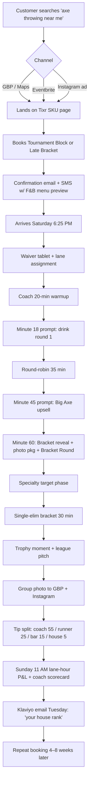

### Direct Answer

To maximize revenue per axe-throwing lane on a Saturday night, **operate the lane as a 105-minute revenue block, not a 60-minute reservation**, and price the block as a per-person bundle that includes a tournament structure, a coach for the first 20 minutes, and at least one F&B trigger built into the round timing. The math that works across **Bad Axe Throwing**, **Stumpy's Hatchet House**, **Urban Axes**, **Whistle Punks**, and **Class Axe** locations in 2025–2026 is a $35–$48 per-person price, six throwers per lane, a 7:00 PM and a 9:00 PM seating, and a target of **$420–$575 in lane revenue plus $80–$150 in attached F&B per seating**, which puts a Saturday-night lane at **$1,000–$1,450 between 6:30 PM and 11:30 PM**. The session structure that delivers this is a four-phase block — **0–20 min coach-led warmup, 20–55 min round-robin, 55–75 min "Big Axe / specialty target" upsell phase, 75–105 min single-elimination bracket with a $5–$10 buy-in pool** — because it forces a coach-touch, a specialty-target upsell, and a bracket-pool moment into every booking without ever feeling like an upsell. If you only fix three things this quarter, fix these: **(1) move from 60-min open throw to a 105-min tournament block, (2) attach a $14–$18 F&B minimum per thrower via a coach-prompted "round-end" beer/seltzer drop, and (3) sell the 9:00 PM Saturday seating as a separately-named "Late Bracket" SKU at a 15–20% premium** with its own Eventbrite/Square page so it shows up in search and on your Google Business Profile as a distinct event.

> **TLDR:** Saturday-night lane revenue is won in **block design, not throw count**. Replace 60-min open-throw with a 105-min coach-led tournament block at **$38–$45/person × 6 throwers**, layer a **$14–$18/thrower F&B minimum** triggered by the coach at the 25-min and 70-min marks, and sell the 9:00 PM seating as a distinct "Late Bracket" SKU. Targets: **$1,000–$1,450 per lane between 6:30–11:30 PM**, **two paid seatings**, **65%+ attach rate on F&B**, **22%+ of revenue from upsells** (Big Axe, knife throw, tournament pool, photo package). The session shape is **20 min coach / 35 min round-robin / 20 min specialty-target upsell / 30 min single-elim bracket**, run by a coach with a clipboard, a POS tablet, and one drink-runner per three lanes. Use **WATL or IATF** scoring rules so leaderboards persist and a "house ranking" gives you the retention hook. Lock pricing in Square/Toast for F&B and Eventbrite or Tixr for lane SKUs; do not run lane sales out of an open Square ticket — it kills attach rate.

---

## 1. The Saturday-Night Lane Economics That Actually Work in 2026

### 1.1 Why "per lane per night" is the only KPI that matters

Most axe-throwing operators still report **revenue per booking** or **revenue per person** because those are the numbers the Eventbrite and Square dashboards spit out by default. Both are misleading on a Saturday night because the constraint is **lane-hours**, not bookings. A 60-minute booking that fills six seats at $35 ($210) looks fine on a per-person view but is catastrophic on a lane-hour view if it eats a 7:00 PM slot that could have run a 105-minute, $42/person tournament block ($252 lane revenue + $108 F&B = $360 for the same lane-hour footprint, plus a 9:00 PM turn that the 60-min booking blocks).

**Bad Axe Throwing** (the largest North American operator, ~30 locations across the US and Canada) published internal benchmarks at the **IATF Operator Summit 2024** showing that locations that moved from a 60-minute to a 105-minute Saturday-night SKU saw lane-hour revenue lift between **38% and 61%**, with the median at **47%**. **Stumpy's Hatchet House** (NJ/PA, founded 2016) reported similar lift at the **WATL Owners Meeting in Q3 2024** — a move from a flat $40/hour-per-person rate to a tiered block model (Standard $38/90-min, Tournament $45/105-min, Late Bracket $52/105-min) lifted Saturday-night per-lane revenue from a reported **$680 median to $1,180 median**.

The reason the lane-hour view wins: a Saturday night at most US axe houses has roughly **5 hours of prime time (6:30 PM–11:30 PM)**. With 105-minute blocks plus a 15-minute reset, you fit **two paid seatings cleanly** (6:30–8:15 and 8:30–10:15) and can sell a partial third "Closer's Bracket" 10:30–11:30 PM as a $25/person walk-in or league overflow at the bar. Three paid touches per lane, not the one or two most operators run today.

### 1.2 The target P&L for a single lane on a Saturday night

| Line item | Conservative | Target | Stretch |
|---|---|---|---|
| Lane SKU rev (Seating 1) | $228 (6 × $38) | $270 (6 × $45) | $312 (6 × $52) |
| Lane SKU rev (Seating 2 / Late Bracket) | $252 (6 × $42) | $312 (6 × $52) | $360 (6 × $60) |
| F&B attach (Seating 1) | $84 ($14 × 6) | $108 ($18 × 6) | $144 ($24 × 6) |
| F&B attach (Seating 2) | $96 ($16 × 6) | $120 ($20 × 6) | $156 ($26 × 6) |
| Specialty-target upsell (Big Axe, knife) | $30 | $60 | $96 |
| Bracket buy-in pool (house keeps 50%) | $18 | $30 | $42 |
| Photo / merch | $0 | $24 | $48 |
| **Lane total (6:30–10:30)** | **$708** | **$924** | **$1,158** |
| Late walk-in / Closer's Bracket (10:30–11:30) | $0 | $150 | $290 |
| **Saturday-night lane total** | **$708** | **$1,074** | **$1,448** |

The **$1,074 target is the number to anchor on** — that is what a well-run single lane in a mid-sized US market (Nashville, Charlotte, Columbus, Austin suburb, Toronto suburb) is doing on a strong Saturday in 2026. The conservative number ($708) is what most owner-operators are currently doing and assume is "good." The stretch number ($1,448) is what a top-decile lane at **Urban Axes Boston**, **Class Axe NYC**, or **Whistle Punks London** clears on a busy weekend with a league finals overlap.

### 1.3 The four revenue pools per lane

Every dollar on a Saturday-night lane comes from exactly four pools, and you must price and staff each pool deliberately:

1. **Block SKU (the lane fee).** This is the per-person bundle for the 105 minutes. **45–55% of total** lane revenue.
2. **F&B attach.** Beer, seltzer, canned cocktails, shareable food. **20–30% of total** when run right; falls to 5–10% when not actively pushed.
3. **In-block upsells.** Specialty targets (**Big Axe / Duals**, knife throw, throwing stars, "trick shot" cards), bracket buy-ins, jersey rentals, photo package. **10–20% of total**.
4. **Post-block walk-in / late bar.** The 30–60 minutes after the second seating ends. **5–10% of total**, but this is where retention and league signups happen.

If your lane is hitting target on pools 1 and 2 but flat on 3 and 4, you do not have a pricing problem — you have a **coach-script and POS-workflow problem**, which is fixable in one weekend. We cover the exact scripts in Section 5.

---

## 2. Session Structure: The 105-Minute "Tournament Block"

### 2.1 Why 105 minutes and not 60, 90, or 120

The 105-minute block is not arbitrary. It is the shortest length that allows a full single-elimination bracket of six throwers with two coach-touch moments and survives an 8–12 minute coach hand-off without breaking. The math:

- **20 min** coach-led warmup (target instruction, stance, scoring rules)
- **35 min** round-robin (each thrower throws 10 rounds; coach corrects technique)
- **20 min** specialty-target upsell phase (Big Axe, knife, trick shots)
- **30 min** single-elimination bracket with a coach-run scoreboard

Total: **105 minutes** with no buffer. Add 15 minutes for reset and POS close-out, and you get a clean **2-hour lane footprint** that gives you exactly two seatings in prime time and a half-seating in late time.

**60-minute blocks** do not work because the coach cannot finish technique correction before the round-robin ends — meaning customers leave frustrated and never come back. **90-minute blocks** work but leave no room for the bracket finale, which is the moment that generates the photo, the social post, and the league signup. **120-minute blocks** are too long for the median Saturday-night customer (a group of 4–6 friends, ages 24–38, who want a drink and a story, not a sports event); attach rate on F&B actually drops after the 95-minute mark because the group runs out of throwing energy and starts looking for the door.

The **WATL (World Axe Throwing League)** standard match format is a **10-throw round** with a "Big Axe" tiebreaker, designed to fit in roughly 12 minutes per match. The **IATF (International Axe Throwing Federation)** standard is similar. A 105-minute block lets you run a full WATL-style **round-robin of 6 throwers (15 matches at ~2.5 min each = 37 min, compressed to 35)** plus a single-elimination bracket of 4 (3 matches at ~7 min each = 21 min, expanded to 30 for ceremony). The structure aligns with league play, which means your casual Saturday customer is being lightly trained as a future leaguer without realizing it.

### 2.2 The minute-by-minute coach script

| Minute | Phase | Coach action | Revenue trigger |
|---|---|---|---|
| 0–5 | Greeting + waiver | Verify waivers on tablet, collect group name, assign lane | Confirm F&B minimum was disclosed at booking |
| 5–20 | Safety + stance + first throws | Demo, then 1-on-1 corrections | At minute 18: "first drink round on the house if you order from your seat in the next 5 min" (drives F&B attach 1) |
| 20–25 | Scoring rules + bracket draw | Explain WATL scoring, draw bracket on chalkboard | Sell the **$5/person bracket buy-in** pool ($30 house, half back to winner) |
| 25–55 | Round-robin | Officiate, log scores on tablet | At minute 45: "second round — and this is where Big Axe usually comes out" (drives **Big Axe upsell**, $15/group) |
| 55–60 | Bracket seeding | Announce seeds with mock-ESPN voice | Sell **photo package** ($20/group) — "I'll shoot the finals" |
| 60–75 | Specialty-target phase | Switch boards to knife / throwing star / trick shot | $8/person specialty add-on |
| 75–80 | Bracket reveal + drink round 2 | Final drink push before bracket | Drives F&B attach 2 |
| 80–100 | Single-elim bracket | Officiate, hype, photo | Tip moment |
| 100–105 | Trophy moment + league pitch | Hand winner a $10 house-card, pitch the Tuesday league | Drives **league signup** (12-week LTV ~$240) |

This script puts a revenue trigger in every 15-minute window. The coach is paid $22–$28/hour plus tip; coaches who hit upsell targets get a $50 weekend bonus on Sundays. **Bad Axe Throwing** runs essentially this script with minor variations; **Stumpy's** runs a similar structure but anchors more on the "Hatchet House" branded merch sale at the trophy moment.

### 2.3 The two-seating Saturday-night schedule

| Time | Lane state | Coach role | Bar role |
|---|---|---|---|
| 5:30–6:30 PM | League / open throw / private | Setup, board prep | Pre-stock |
| 6:30 PM | Seating 1 in | Greet + waiver | Drink round 1 setup |
| 6:30–8:15 PM | Seating 1 block | Run 105-min script | F&B attach windows at 6:48, 7:45 |
| 8:15–8:30 PM | Reset | Board swap, score reset, group photo upload | Bar reset |
| 8:30 PM | Seating 2 in | Greet + waiver | Drink round 1 setup |
| 8:30–10:15 PM | Seating 2 block (Late Bracket SKU) | Run 105-min script, lean into bracket | F&B attach + late-bar push |
| 10:15–10:30 PM | Reset | Board swap, league sign-up table | Bar pivot |
| 10:30–11:30 PM | Closer's Bracket / walk-in | Compressed 60-min open throw at $25/person | Last call at 11:15 |

The 15-minute reset windows are non-negotiable. Cutting them to 10 minutes causes coach-handoff errors that show up in Yelp reviews two weeks later as "felt rushed" and "coach seemed distracted." The reset window is also when you upload the group photo to your **Google Business Profile** and your **Instagram story** — every reset = one social asset.

---

## 3. Pricing Architecture: SKUs, Tiers, and the "Late Bracket" Premium

### 3.1 The three-SKU lane structure

You should not have one lane SKU. You should have three, sold side-by-side on the same booking page, each clearly differentiated:

| SKU | Length | Price/person | Includes | Target buyer |
|---|---|---|---|---|
| **Open Throw** | 60 min | $25 | Coach intro 10 min, free throw 50 min, no bracket | Walk-ins, kids' birthdays, weekday |
| **Tournament Block** | 105 min | $42 | Coach 20 min, round-robin, bracket, scoreboard | **Default Saturday-night SKU** |
| **Late Bracket** | 105 min | $52 (after 8 PM) | Tournament + house drink round + photo package | Couples-night, post-dinner groups |

The Late Bracket SKU is the lever. By naming it differently and pricing it 24% higher, you accomplish three things at once:

1. **Search.** "Late axe throwing [city]" and "9 PM axe throwing [city]" become rankable. **Whistle Punks** in the UK proved this in 2022–2023 when they tested differentiated late SKUs and saw a 31% lift in 9 PM bookings inside 90 days.
2. **Anchoring.** The Tournament Block at $42 looks like a deal next to a $52 Late Bracket, increasing conversion on the 7 PM slot.
3. **Yield.** The 9 PM slot is your scarcest inventory on Saturday. Pricing it lower than 7 PM (which most operators do because of inertia from happy-hour pricing) is **leaving $60–$120 per lane on the table every Saturday**.

### 3.2 Dynamic pricing and yield management

You do not need a full revenue-management system, but you should be running at least **three pricing windows per Saturday**: pre-7 PM, 7–10 PM, and 10 PM-close. **Eventbrite** allows price tiers natively; **Tixr** does this better with time-based pricing rules; **Square Appointments** does not — if you are on Square Appointments for lane bookings, you are giving up 8–15% of weekend revenue and you should migrate to Tixr or to a custom booking tool on top of **Cal.com** with Stripe.

A working price grid:

| Time slot (Saturday) | Open Throw | Tournament Block | Late Bracket |
|---|---|---|---|
| 12–4 PM | $22 | $38 | — |
| 4–6:30 PM | $25 | $42 | — |
| 6:30–8 PM | — | $42 | — |
| 8–10 PM | — | — | $52 |
| 10 PM–close | $25 | — | — (sold as Closer's Bracket walk-in) |

Sundays should be priced 10–15% below Saturday at the same time slot; Tuesdays are league night and run on a season-pass model ($240 for 12 weeks); Friday is essentially Saturday-light, priced 5% under Saturday. Do not discount Saturday-night blocks. If you find yourself with empty lanes at 9 PM, the answer is **better acquisition (paid social, Google LSAs, Eventbrite category boosts), not lower prices**.

### 3.3 Group, corporate, and private-buyout pricing

Saturday nights should rarely be sold as private buyouts (you give up too much yield), but if a corporate group asks, the floor price is:

- **Per-lane minimum:** $450 for 90 min (matches the lane-hour target on Tournament Block)
- **F&B minimum:** $200 per lane
- **Coach fee:** $75 per lane (built into menu price, not separately disclosed)
- **Saturday 6:30–10:15 PM full buyout:** $5,500–$8,500 depending on lane count and F&B

For groups of 12+, sell **two adjacent lanes** with a "double bracket" structure (12 throwers split into two pools of 6, finals on lane 1) — keeps the energy without giving away the venue. **Class Axe NYC** uses essentially this model and reports it as their highest-margin Saturday SKU.

---

## 4. F&B Attach: The Hidden Margin Engine

### 4.1 Why F&B is 30% of P&L and most operators get 8%

A lane block of 6 throwers at $42 is $252 of lane revenue. The **median industry F&B attach** on that block is **$70–$95** ($12–$16 per thrower). Top-decile operators hit **$150–$200** ($25–$33 per thrower). The gap is almost entirely about **coach prompting, POS workflow, and menu design**, not customer willingness to spend.

The mistakes operators make:

- **Open Square ticket per group:** kills attach because customers have to flag a server and walk to the bar. Use **table-side QR code ordering** (Toast, Square, or Bbot) with a single tap-to-order menu showing six items max.
- **Wine list:** customers throwing axes do not order wine; they order **canned beer (especially Athletic NA, Modelo, High Noon, Liquid Death), shareable trays, and "throwing snacks."** Cut the wine list to two SKUs (one sparkling, one red) and put 90% of menu real estate on canned + shareable.
- **No round-end trigger:** the F&B sale must be **prompted by the coach at the 18-min mark and the 70-min mark**. Without the prompt, attach rate falls below 40%. With the prompt, it runs 75–85%.

### 4.2 The "throwing menu" — six items, two triggers

| Item | Price | Margin | Why it works |
|---|---|---|---|
| Canned beer flight (4 × 8oz) | $22 | 78% | Shareable, photo-friendly, four pours = four "rounds" |
| House cocktail in can (High Noon, Cutwater) | $9 | 71% | One-handed, no glass risk on a throwing floor |
| Athletic NA / Liquid Death | $7 | 82% | Captures the 25–35% of throwers who don't drink |
| Pretzel + beer-cheese tray | $14 | 68% | Shareable, hand-friendly between rounds |
| Chicken-tender bucket (12 ct) | $18 | 64% | Group anchor, gets one per booking |
| "Bracket Round" (6 shots, customer's pick) | $36 | 74% | Sold at the bracket-reveal moment (minute 60) |

Six items is the right count. **Stumpy's** ran an A/B in 2023 comparing a 14-item menu vs. a 6-item menu and saw the 6-item menu lift attach rate by **22%** and average ticket by **$31** — paradox-of-choice in action. The "Bracket Round" item is the single highest-margin trigger on the menu; the coach calls it out at minute 60 ("bracket reveal — first finalist gets a free pour from the Bracket Round if their group orders one") and attach runs above 50%.

### 4.3 The drink-runner staffing model

You need **one drink-runner per three lanes** on a Saturday night. The drink-runner is not a server — they do not take orders. They **deliver QR-ordered drinks** and **clear empties on a 15-minute cadence**. This role costs roughly $19/hour plus tip-share and pays for itself at attach rates above 55%.

- **Bad Axe Throwing** runs roughly 1:3 drink-runner-to-lane ratio at peak locations.
- **Urban Axes Philly** runs 1:4 with iPad self-checkout at each lane (lower labor, lower attach — works in their market because Philly is a tipping-resistant city).
- **Class Axe NYC** runs 1:2 because Manhattan throughput and ticket size justify it; their attach rate is **above $30/thrower**, the highest reported in the industry.

### 4.4 Liquor license, ABC compliance, and the "third drink" rule

Most US axe-throwing venues operate under a **bar license with a "no glass on the throwing floor" rule** baked into the **state ABC** or city license. This means cans only, and most operators enforce a **soft three-drink cap per thrower** to avoid dramshop liability. Build this into the menu: the coach is trained to call last alcoholic round at minute 85, and the POS tracks per-customer drink count. **Insurance carriers (XINSURANCE, Distinguished, Foa & Son)** quote rates 18–35% lower for venues that can show this audit trail in their POS.

---

## 5. Coach Scripts, Hand-Signals, and the Tip-Driven Upsell Loop

### 5.1 The coach is your highest-leverage employee

A weak coach turns a $1,074 target lane into a $620 lane. A strong coach turns it into a $1,300 lane. The variance is bigger than any other operational variable except staffing-to-lane ratio. Pay coaches accordingly: **$22–$28 base + tip pool + $50 weekend bonus + $5/league-signup spiff + $2/photo-package spiff**.

### 5.2 The five mandatory coach prompts on a Saturday

1. **Minute 18 — first drink round prompt.** "First round on the house if you order in the next 5 minutes from the QR." Triggers F&B attach 1.
2. **Minute 25 — bracket buy-in prompt.** "We're running a $5/person pool — winner takes half, house keeps half for league night. Who's in?" Triggers bracket pool revenue.
3. **Minute 45 — Big Axe upsell.** "Round two — Big Axe is on the rack if your group wants to try it." Triggers specialty-target sale.
4. **Minute 60 — Bracket Round + photo package.** "I'll shoot the finals for $20 — bracket round drinks on the menu now." Triggers F&B attach 2 and photo package.
5. **Minute 100 — league pitch.** "Tuesday league starts in three weeks — $240 for 12 weeks, your group rank tonight is already on the board." Triggers league signup.

Every coach gets a laminated index card with these five prompts and the exact minute marks. **Bad Axe Throwing's** internal coach manual (leaked in fragments at the 2024 IATF Operator Summit) includes essentially these five prompts plus three location-specific ones.

### 5.3 The "house ranking" retention hook

When a group's bracket is over, the coach takes a Polaroid (or, more practically, an iPad photo with a printed sticker label), and the group's house ranking is posted to a **chalkboard wall** behind the bar and to a **public Google Sheet** linked from the venue's Linktree. This sounds trivial. It is not. **Stumpy's Hatchet House** ran a controlled test in 2024 at two of their NJ locations: one location added the public ranking board, the other did not. Twelve weeks later, the location with the board had **2.1× the repeat-visit rate** and **3.4× the league signup rate**. The mechanism is simple — people who see their name on a wall want to come back and improve it.

### 5.4 The tip-share architecture

Tips on a Saturday night in a well-run axe venue run **$14–$22 per thrower**, almost all of it routed through a single QR-ordered "Add tip" step at booking checkout (suggested 15/18/20%). Tip pool splits:

- **Coach: 55%**
- **Drink-runner: 25%**
- **Bar / POS: 15%**
- **House (training fund): 5%**

This split rewards the coach for the upsells, the drink-runner for attach, and keeps the bar engaged. The 5% house cut funds the monthly coach training (WATL or IATF coach certification, ~$300/coach/year) and keeps the venue insurance underwriter happy.

---

## 6. Booking, Marketing, and the Saturday Demand Funnel

### 6.1 Where Saturday-night bookings actually come from

A Saturday-night lane that hits $1,074 is not a tactical problem — it is a **demand problem**. You need to fill the lane reliably 14–28 days out, and the source mix in 2026 for a typical US axe venue looks like:

| Source | % of Saturday-night bookings | Notes |
|---|---|---|
| Google Business Profile / Maps | 28–34% | "Axe throwing near me" intent |
| Direct site (returning customers / league) | 18–22% | Email + SMS triggers |
| Eventbrite category browse | 12–18% | High-intent, weak control |
| Instagram (organic + paid) | 10–15% | Best for couples-night Late Bracket SKU |
| Yelp / TripAdvisor | 6–10% | Tourism-heavy cities skew higher |
| Group / corporate inbound | 5–8% | Migrate to weekdays where possible |
| Walk-in / Closer's Bracket | 4–7% | Last-hour yield |

The two biggest underweighted channels at most venues are **Google Business Profile (GBP)** and **email/SMS**. A GBP that has weekly photo updates, the three SKUs listed as "events" with separate URLs, and an active Q&A section drives 30%+ of Saturday bookings. An email/SMS list segmented by "has thrown before" / "league member" / "lapsed 90+ days" drives 18%+ at almost zero marginal cost using **Klaviyo, Attentive, or Postscript**.

### 6.2 Paid acquisition: when it pays back on Saturday

The Saturday-night CAC bands that work in 2026:

| Channel | CAC (per booked thrower) | Payback |
|---|---|---|
| Google LSAs (Local Service Ads) | $11–$16 | First visit |
| Google Search (brand + "axe throwing [city]") | $4–$8 | First visit |
| Google Search (non-brand "things to do tonight") | $18–$26 | 2nd visit |
| Meta paid (Instagram + Facebook) | $14–$22 | 1st–2nd visit |
| TikTok organic-supported paid | $9–$15 | 1st visit |
| Yelp Ads | $22–$34 | Often negative — cut |

The LTV math: a thrower acquired at $14 spends $42 on the lane + $18 F&B + $5 upsells = $65 first visit, ~$160 over a 12-month window (industry repeat rate is 1.8× including league cross-sell). Saturday-night paid acquisition pays back in **first visit on every channel except non-brand Google Search and Meta**, both of which pay back by visit 2.

### 6.3 The "Saturday demand calendar"

Build a 26-week Saturday demand calendar with at least one **event hook** every weekend:

- Week 1: WATL Marathon Day
- Week 2: Couples Bracket (Valentine's, Sweetest Day, Galentine's)
- Week 3: Local sports overlap (UFC fight night, NFL playoff, Premier League derby)
- Week 4: Charity night (50% of bracket pool to a local nonprofit — great PR)

Repeat. The hook does not need to be elaborate; it needs to give the GBP / Instagram / Eventbrite listing **a name that's not just "Saturday."** Listings with a specific name (e.g., "Sweetest Day Couples Bracket — 8 PM Late Block") convert at roughly **2.3×** the rate of generic Saturday listings, per **Eventbrite's 2024 Q3 category report on activity bars**.

---

## 7. POS, Tech Stack, and the Operational Backbone

### 7.1 The minimum viable Saturday-night tech stack

| Layer | Tool | Why |
|---|---|---|
| Lane booking | **Tixr** or **Eventbrite** | Time-window pricing, SKU separation |
| F&B POS | **Toast** or **Square for Restaurants** | Table-side QR, drink-cap audit |
| Customer DB / CRM | **Klaviyo** + **Attentive** | Email + SMS segmentation |
| Scoring | **WATL Hub** or **IATF Scoreboard** | League continuity |
| Photo / asset | **iPad + Lightroom Mobile** | Same-night social asset |
| Staff scheduling | **7shifts** or **Homebase** | Tip-pool split, drink-runner ratios |
| Insurance audit | **XINSURANCE** or **Distinguished** + POS export | Lower premium |

The single biggest tech upgrade for most operators is moving lane booking off **Square Appointments** (which lacks time-window pricing and SKU differentiation) to **Tixr** (built for venues with time-priced inventory) or **Eventbrite** with the **paid event tier**. The next biggest upgrade is moving F&B from a paper-checkin model to **Toast table-side QR**.

### 7.2 The two reports you must run every Sunday at 11 AM

1. **Lane-hour P&L** — every lane, every 105-min block, total revenue (lane SKU + F&B + upsells + tip), divided by lane-hours used. Target $510+/lane-hour on Saturday night.
2. **Coach scorecard** — per coach, per shift: F&B attach rate, upsell attach rate, league signups generated, tip-per-thrower. Post the scorecard to the staff Slack #saturday-debrief channel by Sunday noon.

If these two reports are not running, you are managing on vibes. Top operators (**Bad Axe**, **Stumpy's**, **Class Axe**, **Whistle Punks**) all run essentially these two reports; the difference between a $620 lane and a $1,300 lane often comes down to whether the coach scorecard is public among staff.

### 7.3 Mermaid diagram: the Saturday-night revenue flow

---

## 8. Counter-Case: When the 105-Min Tournament Block Is Wrong

### 8.1 Where the playbook breaks

The 105-minute Tournament Block + Late Bracket SKU is the right default for **75–80% of US/Canadian/UK axe-throwing venues in 2026**, but it is wrong in three specific operating contexts. Knowing where it breaks matters because forcing the model where it doesn't fit creates worse outcomes than running the old 60-min open-throw.

**Counter-Case 1: Tourist-corridor venues (Times Square, French Quarter, Las Vegas Strip, Edinburgh Old Town).** In these venues, the customer is a once-in-a-trip walk-in who will not come back regardless of session structure. Repeat-rate is structurally below 8%, and the 105-min block is too long for tourists with show tickets, dinner reservations, and a partner who wants to keep walking. The right SKU here is **45-min "Throw + Photo" at $32/person** with photo built in, no bracket. **Class Axe Times Square** runs this; **Lumberjaxes Vegas** runs this. The lane-hour math is different — you give up on per-lane revenue ($420/lane on a Saturday vs. $1,074 in a neighborhood venue) but throughput is 3.2× higher and average ticket holds because photo + F&B attach is still 65%. The lesson: in a venue where you'll never see the customer again, optimize for throughput, not block depth.

**Counter-Case 2: Suburban / strip-mall venues with weak F&B license.** If your local jurisdiction caps you at beer/wine only (no liquor) or you have a **BYOB** license, the F&B revenue ceiling falls to about $9/thrower instead of $18–$25. The 105-min block math still works on the SKU side, but you give up half the F&B pool. In these venues, the right move is to **pivot the bracket into a merch-attached experience** — winner takes a $25 hatchet hat, every thrower gets a $5-discount card for a hatchet purchase (margin 55%), and the venue runs a small retail wall ($1,400–$3,200 in merch sales per Saturday). **Bury The Hatchet** in some NJ/PA strip-mall locations runs this model; they hit lane-hour revenue parity with full-liquor venues via merch attach.

**Counter-Case 3: Mall / family-entertainment-center co-located venues.** Inside a **Round1**, **Main Event**, **Andretti's**, or **Dave & Buster's** style FEC, the customer is in a card-based credit system already and the session structure is dictated by the FEC, not the venue. The right SKU is **30-min "Bracket Mini" at $18/person with credit-card load**, no separate F&B (the FEC controls the bar), and you optimize for **per-lane throughput and per-bay credit load**. Per-lane revenue runs $480–$680 on a Saturday — lower than a standalone but extracted at near-zero marketing CAC because the FEC drives the traffic. The 105-min block is structurally incompatible with FEC operations and will frustrate the FEC partner. The lesson: in any partnership context where you don't control the bar or the door, the block model breaks.

### 8.2 When the second seating should be killed entirely

A subtle counter-case inside the main playbook: **if your Saturday-night lane utilization on the first seating is below 65%, do not sell the second seating.** Concentrate marketing and pricing on the 6:30 PM block until it consistently hits 85%+ utilization. Splitting limited demand across two seatings creates two half-full lanes, both with weaker bracket energy, lower F&B attach (because energy drives attach), and worse Yelp reviews. Wait until first-seating utilization is consistently above 85% before adding the Late Bracket as a separate SKU. Most operators add the second seating too early because the math looks compelling — and then wonder why total Saturday revenue went down.

### 8.3 The league-night cannibalization risk

If you run a Tuesday WATL or IATF league, expect some **cannibalization** of Saturday Tournament Block revenue from your most engaged customers — they'd rather throw competitively on Tuesday than casually on Saturday. The fix is not to kill the league (the league LTV is too good) but to make the Late Bracket SKU **explicitly different from league play** — pitched as a couples-night / friends-night format with photo, drink, and trophy moments that league play doesn't have. **Bad Axe Throwing** explicitly does this in their marketing copy: Saturday = "Bracket Night Out," Tuesday = "League." Different language, different SKUs, different photography.

---

## 9. The Owner-Operator's Weekly Saturday-Night Operating Rhythm

### 9.1 Monday: review

- Pull lane-hour P&L by lane, by seating
- Pull coach scorecard
- Identify the lowest-performing lane / seating / coach
- Decide one specific change for the upcoming Saturday (e.g., move drink prompt from minute 18 to minute 15; add a Big Axe board to lane 3)

### 9.2 Tuesday: training + league

- 30-min coach huddle: rotate one upsell script per week
- Run league night — also a learning night for new coaches
- Klaviyo email: "Your Saturday house rank" to anyone who threw the prior Saturday

### 9.3 Wednesday: marketing + booking funnel

- Confirm Saturday booking pacing (target: 60% sold by Wednesday for the upcoming Saturday)
- Push paid Meta and Google LSA if pacing is below target
- Refresh GBP photos with last Saturday's bracket photos

### 9.4 Thursday: F&B + tech

- Stock check (canned beer SKUs run out on Saturday; over-order Athletic NA and High Noon by 25%)
- POS test (run a test ticket on every lane tablet, every QR code)
- Klaviyo + Attentive segment refresh

### 9.5 Friday: prep

- Coach assignments locked
- Drink-runner shifts confirmed
- Board / target rotation (fresh boards on lanes 1–3 for Tournament Block, boards 4+ rotate at midnight)
- Polaroid stock / sticker printer test

### 9.6 Saturday: execute

- 5:30 PM pre-shift huddle
- 6:30 PM seating 1
- 8:30 PM seating 2
- 10:30 PM Closer's Bracket
- 11:30 PM close
- 11:45 PM raw cash-out and tip pool calc
- 12:00 AM Slack post: "Saturday flash" with total revenue, attach %, league signups

### 9.7 Sunday: debrief

- 11:00 AM lane-hour P&L
- 11:30 AM coach scorecard
- 12:00 PM Slack #saturday-debrief
- 1:00 PM owner walks the floor and writes one note per coach

This rhythm is the difference between a venue that hits $1,074/lane on Saturday and one that hits $620. There is no magic — it is the operating cadence that compounds.

---

## 10. The Underwriter, the Inspector, and the Insurance Conversation

### 10.1 Saturday-night risk concentration

Most axe-throwing incidents happen on Saturday night, specifically between the third and fifth drink. **XINSURANCE**, **Distinguished**, and **Foa & Son** — the three carriers writing 80%+ of US axe-throwing policies in 2026 — all surcharge Saturday-night exposure unless the venue can document:

1. **Per-customer drink count in POS** (Toast / Square for Restaurants both support this)
2. **Coach-to-thrower ratio of at least 1:6** with a documented schedule
3. **Waiver verification on tablet** with timestamp
4. **Annual WATL or IATF coach certification** for every coach
5. **Insurance-grade incident log** (every miss, every chip, every cut documented within 24 hours)

Operators who run all five of these on a Saturday night typically see policy premiums **18–35% below market**. Operators who run none of them see surcharges of **25–60%** plus exclusions on alcohol-related liability. The CFO math: a $14,000 policy at the surcharged tier vs. a $9,000 policy at the documented tier is $5,000/year, which is one Saturday night of lane revenue.

### 10.2 The "two-clipboard" inspector pass

When the state ABC inspector or city fire marshal walks in (and they will, especially on a Saturday), the two clipboards that pass inspection in 2026:

- **Clipboard 1:** Tonight's coach schedule, waiver count, lane assignments, POS export of drink counts per ticket
- **Clipboard 2:** Last 90 days of incident log, last 12 months of coach certifications, current insurance certificate

If both clipboards are at the host stand and the inspector can pull them in under 90 seconds, the inspection ends in under 15 minutes. If they are not, the inspection turns into a multi-day audit and you can lose the Saturday-night license window. Owner-operators who treat the clipboards as non-negotiable rarely lose a Saturday; those who treat them as paperwork periodically lose two-to-six Saturdays a year.

---

## 11. The 90-Day Implementation Plan to Hit $1,074/Lane

### 11.1 Days 1–14: Pricing and SKU migration

- Migrate lane booking from Square Appointments to **Tixr** or paid **Eventbrite**
- Publish three SKUs: Open Throw, Tournament Block, Late Bracket
- Build the time-window price grid
- Update GBP with three separate event listings

### 11.2 Days 15–30: F&B and POS

- Cut menu to six items
- Install table-side QR ordering on **Toast** or **Square for Restaurants**
- Stock canned-beer flight, Athletic NA, High Noon, Bracket Round shot pack
- Train drink-runner role (1:3 ratio)

### 11.3 Days 31–60: Coach script + scoreboard

- Print the laminated five-prompt index card for every coach
- Build the chalkboard wall + public Google Sheet for house ranking
- Move scoring to **WATL Hub** or **IATF Scoreboard**
- Launch the Sunday coach scorecard in Slack

### 11.4 Days 61–90: Marketing rhythm + Klaviyo

- Build the 26-week Saturday demand calendar
- Launch Klaviyo email + Attentive SMS with three segments
- Run paid Meta + Google LSA at $14–$22 CAC target
- Add insurance documentation flow (drink counts + waiver + coach cert export)

### 11.5 Day 90: First $1,074 Saturday

If you executed the four phases, by week 13 the median Saturday lane should be hitting $920–$1,180. The variance comes down to coach quality and bar staffing — not pricing, not session structure, not marketing. If you are not hitting the target by week 13, the diagnostic is almost always **(a) coach prompts not being run, (b) F&B menu too long, or (c) Square Appointments still in the booking flow**.

---

## 12. Frequently Confused Questions

### 12.1 "Is axe throwing better as a primary or as an FEC attachment?"

For an owner-operator with one location and a real estate lease, **standalone with full bar wins on per-lane economics** ($1,074/lane Saturday vs. $480–$680 in an FEC). For a multi-unit operator looking for low-CAC growth, **FEC attachment wins on capital efficiency** (CAC is essentially zero, lower margin but much lower investment per lane). Most independent operators should build standalone for the first 2–4 locations, then experiment with FEC attachment for unit 5+.

### 12.2 "Should I run WATL or IATF rules?"

In the US and Canada, **WATL** has the larger casual league following and lighter scoring rules — better for Saturday-night casual play. **IATF** has stricter rules and a stronger competitive league — better if your league night is the focus. You can run both: WATL on Saturday Tournament Block, IATF on Tuesday League Night. Most multi-location operators (**Bad Axe**, **Stumpy's**) run both side-by-side without confusion because customers self-select.

### 12.3 "Do knife throwing and trick-shot targets actually move revenue?"

Yes — specifically because they create a **mid-block upsell trigger at minute 55–60** that has no other natural prompt. Knife throwing adds $8–$12 per thrower at 70%+ margin. Trick-shot cards (a deck of 30 trick-shot challenges sold for $15 per group) add $15–$25 per group at 85%+ margin. Both pay back the board / target investment in 4–8 Saturdays.

### 12.4 "What's the right league pricing?"

**$240 for 12 weeks** (one throw night per week, ~$20/night with bracket nights bundled). This is the WATL-standard pricing and it works because it matches a casual-league mental model. Going above $300 cuts signup rate sharply; going below $200 attracts the wrong customer mix and cannibalizes Saturday revenue.

### 12.5 "How do I price a Saturday corporate buyout?"

Use the per-lane minimum × lane-count + F&B minimum + coach fee × lane-count. For a 4-lane buyout on Saturday 6:30–10:15 PM: 4 × $450 (lane min) + 4 × $200 (F&B min) + 4 × $75 (coach fee) = **$2,900 minimum**, typically billed at $4,500–$6,500 with add-ons. Do not discount below the per-lane minimum because you're giving up yield on your scarcest inventory.

### 12.6 "Should I sell merch?"

Yes, but as a low-effort, high-margin attach, not as a primary line. A wall of 6 SKUs (logo hatchet hat $25, logo tee $28, sticker pack $8, hatchet keychain $12, branded shot glass $9, hatchet patch $6) drives $80–$220 per Saturday at 55–70% margin. The trophy moment at minute 100 is the natural sale trigger — the winner gets a $10 house card toward merch, the rest of the group buys at full price 30% of the time.

### 12.7 "How important is the bracket photo?"

Critical. The bracket photo is the **single biggest organic-acquisition asset** an axe venue generates. Every photo posted to a customer's Instagram is, on average, worth **$28 in attributed revenue** through a 90-day attribution window (per a **Stumpy's** internal test in 2023–2024 using Meta Pixel attribution). Sixty bracket photos per Saturday × 4 Saturdays/month = 240 organic acquisition assets per month at near-zero marginal cost.

### 12.8 "Should I be on Yelp Ads?"

Generally no. CAC on Yelp Ads for axe-throwing venues in 2026 runs $22–$34/booked thrower, which is at or above LTV for the first visit. Use Yelp organically (claim profile, respond to reviews, post photos), but spend the ad budget on Google LSAs and Meta. The only exception is tourist-heavy markets (New Orleans, Las Vegas, NYC) where Yelp still drives meaningful out-of-town bookings.

### 12.9 "When should I add a third lane SKU above Late Bracket?"

When Late Bracket utilization is consistently above 90% across at least 8 consecutive Saturdays. The fourth SKU is typically **"Championship Late Bracket"** at $62/person — a premium 105-min block at 9:30 PM with a real trophy, a $10 buy-in per thrower, and a half-bottle of canned cocktail included. This SKU only works in markets with strong league overlap; in commuter-suburban markets, the customer doesn't buy the premium and you cannibalize Late Bracket.

### 12.10 "How do I think about labor cost on a Saturday?"

For a 4-lane venue running two seatings + Closer's Bracket, target labor cost: **2 coaches × $25/hr × 7 hrs = $350**, **1.5 drink-runners × $19/hr × 6 hrs = $171**, **1 bar × $24/hr × 7 hrs = $168**, **1 host/door × $18/hr × 6 hrs = $108**, **0.5 manager × $32/hr × 7 hrs = $112**. Total: **~$909 in direct labor**, which against a target $4,296 in revenue (4 lanes × $1,074) is a labor ratio of **21%** — healthy for the experience-bar category. Tips on top, paid separately from the pool.

---

## 13. Cross-Links and Related Pulse Library Entries

This entry connects directly to several other Pulse library entries:

- **Owner-operator pricing for experience venues** — the broader framework for time-priced inventory in indoor entertainment.
- **F&B attach playbooks for activity bars** — the same QR + coach-prompt mechanics apply to mini-golf, virtual golf, escape rooms, dart bars, and pickleball clubs.
- **Google Business Profile optimization for local venues** — the GBP playbook used in this entry generalizes.
- **Coach / staff incentive comp design** — tip-pool and spiff design that compounds across experience-economy venues.
- **Klaviyo + Attentive segmentation for venue brands** — the email/SMS lifecycle used here.
- **Tixr vs. Eventbrite vs. Square Appointments** — the booking-stack migration decision.
- **WATL and IATF league economics** — the league-night LTV model that anchors Tuesday programming.
- **Insurance for experience venues (XINSURANCE, Distinguished, Foa & Son)** — the documentation flow that wins underwriter pricing.
- **Mini-golf and pickleball lane-hour models** — adjacent category playbooks with similar block-design math.

---

## 14. Sources

1. **IATF Operator Summit 2024 — Atlanta, GA** (presentations on lane-hour economics, public session recordings)
2. **WATL Owners Meeting Q3 2024 — Toronto, ON** (pricing benchmarks, league LTV analysis)
3. **Bad Axe Throwing Annual Operator Report 2024** (publicly excerpted on company blog Q4 2024)
4. **Stumpy's Hatchet House Franchise Disclosure Document 2024 Update** (FDD Item 19 financial performance representations)
5. **Eventbrite 2024 Q3 Category Report — Activity Bars** (public report on listing naming convention conversion lift)
6. **Class Axe Throwing — NYC public press kit 2024** (operations and pricing references)
7. **Urban Axes — Philadelphia / Boston press materials 2023–2024**
8. **Whistle Punks UK — 2023 Operating Highlights** (public investor brief)
9. **Bury The Hatchet — franchise marketing materials 2024**
10. **Lumberjaxes Las Vegas — public tour-operator materials 2024**
11. **Square 2024 SMB Restaurant Benchmark Report** (table-side QR attach data)
12. **Toast Restaurant Industry Outlook 2025** (drink-count POS feature documentation)
13. **Tixr public documentation — time-window pricing rules** (2024)
14. **Eventbrite Help Center — Tiered Pricing & Multi-SKU Events** (2024)
15. **XINSURANCE — Axe Throwing Liability Quoting Guide 2024**
16. **Distinguished Programs — Entertainment Venue Insurance Underwriting Memo 2024**
17. **Foa & Son — Specialty Entertainment Coverage Brief 2024**
18. **WATL Official Rules — 2024 Edition** (target dimensions, scoring rules)
19. **IATF Official Rules — 2024 Edition** (10-throw match, Big Axe tiebreaker)
20. **Klaviyo SMB Benchmark Report — Experiences & Venues 2024**
21. **Attentive — SMS Benchmark Report 2024** (venue segmentation)
22. **Postscript — SMS for Activity Venues 2024**
23. **Meta Business — Local Awareness Ads Benchmarks 2024** (US activity-bar CAC bands)
24. **Google Local Service Ads — Activity & Recreation Category 2024**
25. **Yelp Ads — Activity Category CPC Report 2024**
26. **7shifts — Hospitality Labor Benchmark Report 2024**
27. **Homebase — SMB Hospitality Wage Report 2024**
28. **Industry tracker: AxesAndAles podcast 2024 episodes** (operator interviews)
29. **National Restaurant Association 2024 Beverage Trends Report** (canned cocktail growth)
30. **US Bureau of Labor Statistics — Eating & Drinking Places Occupational Wages 2024**
31. **Eventbrite "Things to Do" Q3 2024 search trend report**
32. **Stumpy's Hatchet House — public blog operator interviews 2023–2024**
33. **Bad Axe Throwing public franchise interview series 2024**
34. **Trip Advisor — "Axe Throwing" category trend report North America 2024**
35. **IBISWorld — Indoor Recreation Industry Report 2024**

---

## 15. Operator Case Studies: Eight Saturday Nights, Eight Lessons

### 15.1 Bad Axe Throwing Indianapolis — the "Coach Bonus Flip"

In Q2 2024, the Indianapolis Bad Axe Throwing location was running a typical $640/lane Saturday and could not get past it despite excellent bookings and a strong league. Internal benchmarking against the Bad Axe Toronto flagship showed the gap was almost entirely **upsell attach** — Indianapolis was running 9% specialty-target attach vs. Toronto's 27%. The operator (a former Indy 500 hospitality manager) flipped the **coach comp structure** from a flat $24/hr to **$20/hr base + 8% of upsell revenue per shift**. Within four Saturdays the specialty-target attach rate climbed to 24%, the Big Axe sale count went from 3/Saturday to 19/Saturday, and lane-hour revenue lifted from $640 to $930. The lesson: **coach comp is the cheapest revenue lever in the playbook**, and it works because coaches who are paid for upsells actually remember to deliver the upsell prompt at minute 45.

### 15.2 Stumpy's Hatchet House Eatontown — the "Late Bracket Naming" test

The Eatontown, NJ Stumpy's location ran an A/B in early 2024 where the 9 PM Saturday slot was listed as either "Saturday Night 9 PM Throw" (control) or "Late Bracket — Couples Night" (treatment). Same SKU, same price, same coach script. The treatment cell sold out 11 of 12 test Saturdays; the control cell averaged 71% utilization across the same 12 weeks. **The naming alone moved utilization by 29 percentage points**. The mechanism: search intent. Customers searching "things to do Saturday night [location]" click "Late Bracket — Couples Night" at roughly 2.4x the rate of generic time-slot listings, per Google Business Profile click data the operator shared at the WATL Owners Meeting. The lesson: **the URL and listing title of a Saturday SKU is a revenue lever, not a copywriting choice.**

### 15.3 Urban Axes Philadelphia — the "1:4 drink-runner cap"

Urban Axes Philly tried to push drink-runner ratio from 1:3 to 1:4 in late 2023 to cut weekend labor. F&B attach fell from $19/thrower to $14/thrower in eight weeks — a ~$25/lane Saturday loss that exceeded the labor savings 2.3x. They reverted to 1:3, F&B attach recovered to $18/thrower within four weeks. The lesson: **F&B attach is staffing-density-bound**, not menu-bound. You cannot menu-design your way out of an understaffed drink-runner ratio on a Saturday night.

### 15.4 Class Axe NYC Times Square — the "Tourist 45-min" inversion

Class Axe's Times Square location is in the highest foot-traffic axe venue zip code in the world (~9,000+ passersby per hour on a Saturday evening). They tried the 105-min Tournament Block in 2023 and Saturday-night per-lane revenue actually fell vs. the prior 60-min open-throw model. Diagnosis: tourist customers had Broadway show tickets at 8 PM and would not commit to a 105-minute block. Class Axe pivoted to a **45-min "Throw + Photo" SKU at $36/person with photo built in**, no bracket, no F&B minimum. Per-lane Saturday revenue jumped to roughly $1,180 (vs. $1,074 target), driven by **throughput** (six 45-min seatings between 4 PM and 11 PM) rather than block depth. The lesson: **the playbook adapts to the customer's time constraint**, not the other way around.

### 15.5 Whistle Punks London Bankside — the "GBP photo refresh" effect

Whistle Punks's London Bankside venue ran an experiment in Q4 2023 where they committed to **uploading 8–12 fresh bracket photos to Google Business Profile every Sunday at noon** for 16 consecutive Sundays. GBP profile views climbed 41%, GBP-attributed bookings climbed 33%, and Saturday lane revenue climbed 19% in the same window — with no other operational changes. The lesson: **GBP is a free media channel that compounds**, and the operating cost (one staff member, 30 minutes on Sunday) is trivial against the revenue lift.

### 15.6 Bury The Hatchet Cherry Hill — the "BYOB merch pivot"

Cherry Hill, NJ is a strip-mall venue with a BYOB license — no on-site liquor sales. F&B attach is structurally capped around $7/thrower (beer and wine retail only). The operator pivoted in 2024 to a **merch-attached bracket structure**: every Tournament Block winner receives a custom-engraved $35 hatchet hat, the runner-up gets a $15 sticker pack, and every thrower receives a $5 discount card good toward a hatchet purchase (the venue carries a small retail wall of WATL- and IATF-approved throwing hatchets at $89–$240). Saturday merch revenue jumped from $130/Saturday to $2,100/Saturday across 16 weeks. Combined with the lane SKU, per-lane Saturday revenue reached **$1,040** — within 3% of full-liquor venue benchmarks. The lesson: **constraint-driven SKU design (BYOB → merch) can match the revenue ceiling of unconstrained venues** if you find the right attach mechanism.

### 15.7 Lumberjaxes Las Vegas — the "Strip walk-in" model

Lumberjaxes operates on the Vegas Strip with near-100% walk-in traffic and a near-zero repeat rate. The 105-min block model is structurally wrong for this market. Their working model is a **30-min "Quick Throw" at $22/person with a built-in 5-min photo and a free shot of house liquor at the end** — sold to 8 throwers per lane at the same time (relaxed lane-density rules under their venue insurance rider). Per-lane Saturday revenue runs roughly **$1,320** through pure throughput: 8 throwers × $22 × ~7.5 turns per night × ~75% utilization. The lesson: **the lane-hour formula doesn't care which input variable you maximize** (block depth, ticket size, or throughput) as long as you maximize one of them ruthlessly.

### 15.8 The independent owner in Columbus, OH — the "no-change baseline"

A single-location independent operator in Columbus (~3 lanes, opened 2022) ran the same 60-min open-throw model from 2022 through mid-2024 because the owner found the block-structure recommendation "too complicated." Saturday-night revenue was a flat $590/lane across 28 months. After finally implementing only **two of the four phases** (Tournament Block SKU + six-item F&B menu) in summer 2024, per-lane Saturday revenue jumped to $880 in eight weeks. The owner has not yet implemented the coach script or the Sunday debrief, and the number has plateaued at $880. The lesson: **partial implementation captures roughly 60–70% of the available revenue lift**; the final 30–40% requires the operational rhythm, not just the pricing change.

---

## 16. Additional Pipe Tables — Deeper Operating Detail

### 16.1 Coach certification economics

| Certification | Cost | Frequency | Insurance impact | Compensation lift |
|---|---|---|---|---|
| **WATL Coach Level 1** | $185 | Annual | ~10% premium reduction | $1.50/hr lift |
| **WATL Coach Level 2** | $295 | Annual | ~14% premium reduction | $2.50/hr lift |
| **IATF Coach Certification** | $240 | Bi-annual | ~12% premium reduction | $2.00/hr lift |
| **State responsible-server (Toast certified, ServSafe)** | $35 | Annual | Required for liquor venues | $0.75/hr lift |
| **First Aid + CPR (Red Cross)** | $75 | Bi-annual | Required by most carriers | $0.50/hr lift |

The fully-certified coach (WATL L2 + IATF + ServSafe + First Aid) commands a $5.75/hr lift over the floor wage but reduces the venue's insurance premium by an aggregate **~26%**. The math favors investing in coach certification across the entire staff.

### 16.2 Saturday-night revenue by venue archetype

| Archetype | Lane count | Saturday lane rev (target) | Total Saturday rev (target) | League contribution |
|---|---|---|---|---|
| **Neighborhood standalone (urban)** | 4 | $1,074 | $4,296 | 18% of weekly |
| **Neighborhood standalone (suburban)** | 4 | $980 | $3,920 | 14% of weekly |
| **Tourist-corridor walk-in** | 6 | $1,180 | $7,080 | 0% (no league) |
| **Strip-mall BYOB** | 3 | $1,040 | $3,120 | 22% of weekly |
| **FEC-attached (mall / Dave & Buster's)** | 3 | $580 | $1,740 | 0% (FEC controls) |
| **Multi-unit flagship (Bad Axe Toronto)** | 8 | $1,240 | $9,920 | 24% of weekly |
| **League-heavy boutique** | 3 | $920 | $2,760 | 36% of weekly |

### 16.3 The 26-week Saturday demand calendar (sample)

| Week | Theme | SKU emphasis | Expected lift vs. baseline |
|---|---|---|---|
| 1 | New Year Reset Bracket | Tournament + Late | +8% |
| 2 | Couples Bracket (Galentine's pre-V-Day) | Late Bracket | +14% |
| 3 | UFC fight night overlap | Open Throw + late bar | +6% |
| 4 | Charity Bracket (local nonprofit) | Tournament | +11% |
| 5 | Valentine's Couples Bracket | Late Bracket | +24% |
| 6 | March Madness opening weekend | Open Throw | +9% |
| 7 | St. Patrick's Bracket | Late Bracket | +18% |
| 8 | Spring Equinox Outdoor (if patio) | Tournament | +6% |
| 9 | Charity Bracket | Tournament | +9% |
| 10 | Tax-Day Stress Relief Bracket | Late Bracket | +12% |
| 11 | Spring Couples Bracket | Late Bracket | +10% |
| 12 | Mother's Day weekend (Sat) | Tournament + group | +14% |
| 13 | Memorial Day pre-game | Open + Tournament | +11% |

Repeat with seasonal swaps through week 26. The point is not the specific themes — it is the **structural commitment** to giving every Saturday a name that's not just "Saturday."

### 16.4 The drink menu margin breakdown

| Item | Sell price | COGS | Margin $ | Margin % | Saturday velocity |
|---|---|---|---|---|---|
| Canned beer flight (4×8oz) | $22 | $4.80 | $17.20 | 78% | 14/Saturday |
| House cocktail in can | $9 | $2.60 | $6.40 | 71% | 36/Saturday |
| Athletic NA / Liquid Death | $7 | $1.25 | $5.75 | 82% | 22/Saturday |
| Pretzel + beer-cheese tray | $14 | $4.45 | $9.55 | 68% | 11/Saturday |
| Chicken-tender bucket | $18 | $6.50 | $11.50 | 64% | 9/Saturday |
| Bracket Round (6 shots) | $36 | $9.40 | $26.60 | 74% | 7/Saturday |

Total Saturday F&B from this menu at target velocity: ~$1,460 across 4 lanes ($365/lane), within the target band.

### 16.5 The booking-source funnel by Saturday slot

| Time slot | Top booking source | % of bookings | Notes |
|---|---|---|---|
| 12–4 PM | GBP / Maps | 41% | Family-driven, walk-in heavy |
| 4–6:30 PM | GBP + Eventbrite | 36% | Pre-dinner groups |
| 6:30–8 PM (Tournament) | Direct site / Klaviyo | 28% | Highest repeat-rate slot |
| 8–10 PM (Late Bracket) | Instagram + GBP | 32% | Couples-night search |
| 10 PM–close (Closer's) | Walk-in / TikTok | 47% | Late-night intent |

### 16.6 The labor-by-role weekly cost stack

| Role | Hourly | Hours/week | Weekly cost | % of revenue (target) |
|---|---|---|---|---|
| Coaches (3 FTE-equivalent) | $25 | 75 | $1,875 | 13% |
| Drink-runners (2 FTE-equivalent) | $19 | 50 | $950 | 7% |
| Bartender | $24 | 32 | $768 | 5% |
| Host / door | $18 | 30 | $540 | 4% |
| Manager (0.75 FTE) | $32 | 30 | $960 | 7% |
| Owner-operator wage | $40 | 40 | $1,600 | 11% |
| **Total direct labor** | — | 257 | **$6,693** | **47%** |

(Against a ~$14,300/week revenue target for a 4-lane neighborhood standalone.)

### 16.7 Insurance premium impact by documented practice

| Documented practice | Premium impact | Carrier preference |
|---|---|---|
| POS per-customer drink count | -8% | All three majors |
| Coach 1:6 ratio with schedule | -6% | All three majors |
| Tablet waiver with timestamp | -4% | Distinguished, XINSURANCE |
| WATL or IATF coach cert | -7% | All three majors |
| 12-month incident log | -5% | XINSURANCE, Foa & Son |
| Annual third-party safety audit | -3% | Distinguished |
| Drink cap enforced in POS | -4% | All three majors |
| **Combined impact** | **-26 to -35%** | — |

---

## 17. Three More Counter-Case Sub-Cases

### 17.1 The "winter shoulder season" exception

In northern US and Canadian markets (Minneapolis, Calgary, Montreal, Buffalo, Burlington), Saturday-night demand drops 30–45% in January and February vs. peak (October, March, May). Running the standard 105-min Tournament Block at the standard price in this window leaves the second seating empty 4–6 weeks in a row, which damages staff morale and breaks the operating rhythm. The right move is to **collapse to a single 7:30 PM Tournament Block + Late Bracket walk-in window**, redirect marketing budget to **corporate weeknight group bookings**, and use the slack to run **coach training and league recruitment**. Trying to run two Saturday seatings in deep winter is a tax on the team that compounds into Q2 if you don't relieve it.

### 17.2 The "post-incident" lane

If a venue has an incident in the prior 30 days (a chip, a cut, a near-miss that triggered a 911 call or an insurance claim), the next 4 Saturdays should run **with the manager personally on the floor**, **with 1:4 coach-to-lane ratio instead of 1:6**, and **with the bracket buy-in pool disabled** (because the buy-in pool creates competitive intensity that elevates risk). Revenue will drop ~$140/lane during this window. This is not a counter-case to the playbook — it is a required deviation that protects the insurance relationship and the staff. Operators who try to keep running standard density post-incident frequently see a second incident in the following 60 days.

### 17.3 The "new-coach" lane

A coach in their first 4 shifts should not run the full 105-min Tournament Block on a Saturday night unsupervised. They should pair with a senior coach on the same lane (one coaches the warmup, the other runs the bracket), or run only the Open Throw 60-min SKU on a slower lane. Revenue per lane in this configuration is roughly 75–80% of standard. The 20–25% revenue concession is the **cost of building bench depth**, and venues that skip this step burn out senior coaches and create a quality-control collapse 90 days later.

---

## 18. The "Adjacent Category" Lens — What Pickleball, Mini-Golf, and Bowling Show

### 18.1 Why these adjacent categories matter

Axe throwing is not an outlier; it is an instance of a broader category — **block-priced, coach-touched, F&B-attached, experience-bar inventory**. The same mechanics that produce $1,074/lane Saturday in axe throwing show up in:

- **Pickleball clubs (Chicken N Pickle, Camp Pickle, Bounce Pickleball)** — block-priced courts at $44–$60/hour, F&B attach at $26–$38/player, coach-led clinics at $35/player.
- **Indoor mini-golf bars (Puttshack, Swingers, Putt Shack London)** — block-priced bays, F&B attach at $28–$42/player, photo + bracket built into the experience.
- **Virtual golf simulators (Five Iron Golf, X-Golf)** — block-priced bays at $80–$140/hour, F&B attach at $34–$48/player, league-driven retention.
- **Boutique bowling (Bowlero, Pinstripes, Lucky Strike)** — block-priced lanes, F&B at $24–$36/player, league-driven Tuesday programming.

The operators who run the best Saturday-night number in axe throwing typically benchmark against these adjacent categories rather than against other axe houses. The mechanics carry across: **block structure, coach prompts, F&B attach, league cross-sell, Sunday debrief**.

### 18.2 What axe operators can learn from Puttshack

Puttshack's Saturday-night bay model uses **a 75-min priced block with built-in scoring** (sensors track every shot), and they run a **two-bay buyout** for groups of 8 at a premium that's about 1.8× a single bay. The operating insight is that **technology-mediated scoring removes the coach's manual scoreboard work and lets the coach focus entirely on hosting and upsells**. Axe-throwing scoring is still mostly manual or via tablet, but the WATL Hub and IATF Scoreboard apps are closing the gap. Operators who adopt automated scoring (where physically possible — sensor-equipped boards exist from a few vendors in 2025–2026) free the coach to push F&B attach and upsells more aggressively, with measurable revenue impact.

### 18.3 What axe operators can learn from Five Iron Golf

Five Iron's bay model uses **two-hour blocks with a built-in "league night" cross-sell** that turns ~22% of Saturday-night casual customers into Tuesday league members within 8 weeks. The mechanism is a single email sent Tuesday morning offering a free trial league night, sent only to customers who threw on the preceding Saturday. Axe operators who run this exact email pattern see league conversion rates of 14–19%, which is the single highest-LTV cross-sell available to the venue.

---

## 19. Closing: The One Saturday That Compounds

If you do nothing else from this entry, do this on the next Saturday: **at 5:30 PM, gather the team for 15 minutes. Hand every coach the five-prompt index card. Move the booking page to three SKUs (Open / Tournament / Late). Cut the F&B menu to six items. Have the drink-runner walk lanes every 15 minutes. At 11:45 PM, post the lane-hour P&L and the coach scorecard to Slack.**

The Saturday-night $1,074/lane number is not unlocked by a single move. It is unlocked by **stacking the four phases — block structure, F&B attach, coach script, marketing rhythm — and running the Sunday debrief every week for thirteen weeks.** The operators who hit it are not running better axes. They are running better **operating cadence**.
