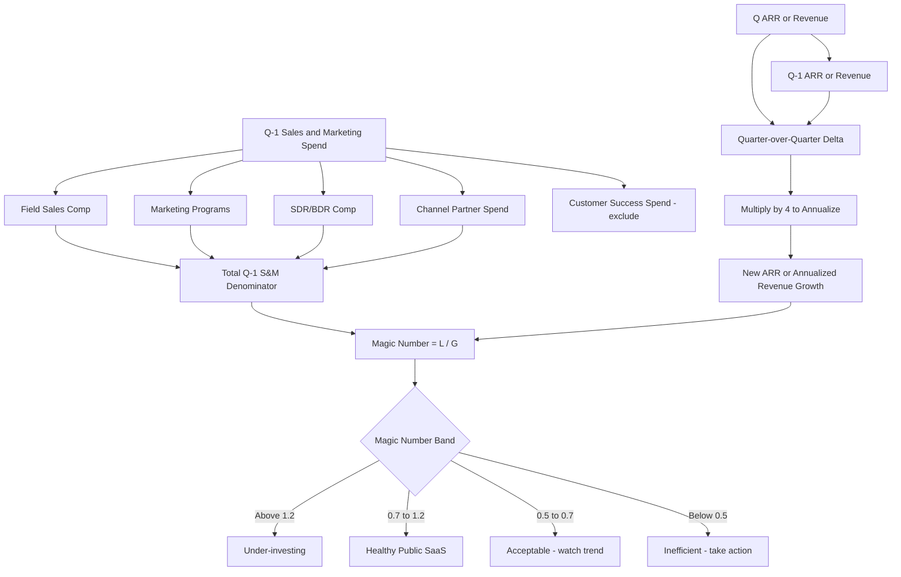

### Direct Answer

**A good Magic Number for a public SaaS company is between 0.7 and 1.0 in 2026** — that range signals you are converting sales and marketing dollars into new ARR at the pace public investors reward with growth-adjusted multiples, and it pairs cleanly with a CAC payback of 18–24 months and a Rule of 40 score above 40. Below 0.5 you are burning capital faster than the public market will tolerate, and above 1.2 you are almost certainly under-investing in growth and leaving market share to faster-spending competitors.

---

**TLDR**

- **Target band: 0.7–1.0** for a public SaaS company growing 20–35% with healthy gross margin (75%+).
- **Best-in-class: 1.0–1.5** — companies like **Datadog (DDOG)**, **CrowdStrike (CRWD)**, and **Cloudflare (NET)** have printed Magic Numbers above 1.0 in their fastest growth quarters; this is exceptional and not the median.
- **Trouble zone: under 0.5** — you are either over-spending on go-to-market or your product–market fit has decayed; cut S&M or restructure quota coverage before the next earnings call.
- **The formula matters less than the trend** — a Magic Number trending up over four consecutive quarters is worth more to public investors than a flat 1.0.
- **2026 reality:** the median public SaaS Magic Number sits at roughly **0.65** per **Meritech Capital**'s public comps tracker — that is the new normal post the 2022–2024 efficiency reset.
- **Pair it with three other metrics** — Magic Number alone is misleading; always read it next to **Net Revenue Retention (NRR)**, **CAC payback**, and **gross margin**.
- **Operators to study:** Amy Slater (CRO, **Snowflake** — SNOW), Yvonne Wassenaar (board director, multiple public SaaS), Mark Roberge (ex-CRO **HubSpot** — HUBS), Carl Eschenbach (CEO **Workday** — WDAY), Frank Slootman (former CEO **Snowflake**), Bill McDermott (CEO **ServiceNow** — NOW), Eric Yuan (CEO **Zoom** — ZM), Aaron Levie (CEO **Box** — BOX), Tomasz Tunguz (Theory Ventures), Jason Lemkin (SaaStr), Dave Kellogg (Balderton), Byron Deeter (Bessemer).

---

## SECTION 1 — WHAT THE MAGIC NUMBER ACTUALLY MEASURES

The Magic Number is a sales efficiency ratio. It was popularized by **Scale Venture Partners** in 2008, refined in public-market commentary by **Meritech Capital**, **Bessemer Venture Partners**, and **ICONIQ Capital**, and is now standard in every public SaaS investor deck.

### 1.1 The Canonical Formula

There are two versions you will see in earnings models. Both are valid; pick one and apply it consistently across quarters or your trend will be meaningless.

| Version | Formula | Used By | When To Use |
|---|---|---|---|
| **Classic (Scale VP)** | (Q ARR − Q-1 ARR) × 4 ÷ Q-1 S&M | Most operators | Quick board read |
| **Bessemer** | (Q Revenue − Q-1 Revenue) × 4 × Gross Margin ÷ Q-1 S&M | Public investors | Cross-company comps |
| **GAAP-adjusted** | (Q Subscription Revenue − Q-1 Subscription Revenue) × 4 ÷ Q-1 S&M | Earnings models | Investor relations |
| **Trailing-twelve-month** | (TTM Revenue − TTM Prior-Year Revenue) ÷ TTM S&M | Long-horizon analysts | Smoothing seasonal noise |

The classic version gives you a ratio. **A Magic Number of 1.0 means every dollar of sales and marketing you spent in the prior quarter generated one dollar of new ARR (annualized) in the current quarter.** That is a 12-month payback on S&M, gross — meaning before you net out the cost of goods sold.

### 1.2 The Numerator Choice Matters More Than People Admit

Public companies report **revenue** not **ARR**. If you are reading 10-Q filings, you almost always have to use the revenue version. ARR is reported by some SaaS companies as a supplemental metric — **Snowflake**, **Datadog**, and **MongoDB (MDB)** all disclose it — but **Salesforce (CRM)**, **Adobe (ADBE)**, and **Microsoft (MSFT)** do not. If you are mixing ARR Magic Numbers with revenue Magic Numbers in the same comp table, you are getting fooled.

### 1.3 Why The Multiplier Is Four (And Sometimes Wrong)

The ×4 annualizes a single quarter of new revenue. This assumes the next three quarters will look like this one. In a heavy Q4 seasonality business — **Workday (WDAY)**, **Adobe (ADBE)** — the ×4 overstates Q4 Magic Number and understates Q1. **Iconiq Capital**'s research suggests using a **TTM** version for any company with more than 20% seasonality in bookings.

---

## SECTION 2 — THE 0.7 TO 1.0 RULE EXPLAINED

### 2.1 Why 0.7 Is The Floor For Public Companies

A 0.7 Magic Number translates to roughly **17 months of CAC payback** at 75% gross margin. Public investors anchored to the **Rule of 40** will tolerate that if growth is above 25%. Below 0.7, you are signaling that your sales motion is structurally inefficient — either the territories are over-saturated, the quota coverage is too rich, or marketing pipeline is being double-counted.

### 2.2 Why 1.0 Is The Soft Ceiling

A sustained Magic Number above 1.0 is rare and usually means one of three things:

1. **You are under-investing in growth** — the most common cause; you could be spending more and capturing more market.
2. **You are over-relying on existing-customer expansion** — net new logo motion is weak and you are riding NRR.
3. **You have a viral or product-led motion** — companies like **Datadog**, **Atlassian (TEAM)**, **Cloudflare (NET)** print Magic Numbers above 1.2 because their land motion is partially self-served.

### 2.3 The 2026 Median Has Reset Down

Pre-2022, the public SaaS median Magic Number was approximately 0.8. Post the 2022–2024 efficiency reset and the rationalization of S&M budgets across the sector, **Meritech Capital**'s public SaaS comps tracker shows the 2026 median sitting at **roughly 0.65**. That is not a sign of broken go-to-market — it is a sign that **growth has slowed across the sector** and S&M leverage has compressed.

### 2.4 The Composition Of Spend Inside The Denominator

Two companies can have identical Magic Numbers and radically different business quality. The denominator — S&M spend — can be heavy on:

- **Brand marketing** (long payback, low immediate signal)
- **Performance marketing** (immediate signal, capped by intent)
- **Enterprise field sales** (long payback, high deal size)
- **Inside sales / SDR motion** (short payback, capped by TAM density)
- **Channel partner enablement** (medium payback, lumpy)
- **Customer success and renewal** (often miscategorized — should be a separate line)

A 0.8 Magic Number where 70% of spend is enterprise field sales is a very different business from a 0.8 where 70% is performance marketing. **The mix tells the story.**

---

## SECTION 3 — HOW TO READ MAGIC NUMBERS BY COMPANY ARCHETYPE

Not every public SaaS should be held to the same standard. Use this table as a starting point — it will be wrong at the edges, but it will keep you out of the most common analytical traps.

| Archetype | Example Companies | Target MN | Why The Target Differs |
|---|---|---|---|
| **Infrastructure / Data** | Snowflake (SNOW), Datadog (DDOG), MongoDB (MDB), Confluent (CFLT) | 0.8–1.2 | Consumption pricing inflates new ARR quickly |
| **Cybersecurity** | CrowdStrike (CRWD), Zscaler (ZS), SentinelOne (S), Cloudflare (NET) | 0.7–1.1 | High urgency drives shorter sales cycle |
| **Vertical SaaS** | Veeva (VEEV), Tyler Technologies (TYL), Procore (PCOR) | 0.5–0.8 | Long sales cycles, sticky NRR |
| **Horizontal CRM/ERP** | Salesforce (CRM), Workday (WDAY), ServiceNow (NOW) | 0.5–0.8 | Mature category, large existing footprint |
| **Productivity / Collaboration** | Atlassian (TEAM), Asana (ASAN), Smartsheet (SMAR), Monday.com (MNDY) | 0.6–1.0 | Mix of PLG and sales-assist |
| **Developer Tools** | GitLab (GTLB), HashiCorp (HCP), Twilio (TWLO) | 0.6–1.0 | Bottom-up adoption with land-and-expand |
| **Marketing / CX SaaS** | HubSpot (HUBS), Klaviyo (KVYO), Braze (BRZE) | 0.7–1.1 | Multi-product cross-sell drives expansion |
| **HR / Talent SaaS** | Workday (WDAY), ServiceNow HR, Paycom (PAYC) | 0.4–0.7 | Very long sales cycles, multi-year contracts |
| **Communications / UC** | Zoom (ZM), RingCentral (RNG), Five9 (FIVN) | 0.4–0.8 | Saturated TAM in many segments |
| **Cloud Storage / Content** | Box (BOX), Dropbox (DBX) | 0.4–0.7 | Mature, competing with hyperscaler bundling |

### 3.1 The Snowflake Pattern

**Snowflake (SNOW)** under Frank Slootman printed Magic Numbers above 1.0 for multiple quarters during its post-IPO hyper-growth phase. The reason was consumption pricing — new customers ramp spend over 24 months but appear in revenue immediately upon landing meaningful workloads. The Magic Number formula captured the revenue growth but not the deferred consumption commitment. Investors who anchored to that 1.0+ number without adjusting for the consumption ramp model misread the underlying sales productivity.

### 3.2 The Veeva Pattern

**Veeva Systems (VEEV)**, the vertical SaaS leader in life-sciences, has historically printed Magic Numbers in the 0.5–0.7 range. That is not weakness. It reflects a **deliberate enterprise field-sales motion** with multi-year contracts, high NRR above 110%, and gross retention near 99%. Veeva's CAC payback is long but its lifetime value is enormous. Comparing Veeva's 0.6 to Datadog's 1.1 is comparing two different business models.

### 3.3 The Salesforce Pattern

**Salesforce (CRM)** under Marc Benioff and now Brian Millham has run with Magic Numbers in the 0.4–0.6 range for most of the past decade. At Salesforce's scale (over $35B in revenue), the law of large numbers compresses Magic Number mechanically — each marginal dollar of S&M faces diminishing returns. **The right read on Salesforce's 0.5 Magic Number is the operating margin expansion alongside it**, not the absolute ratio.

---

## SECTION 4 — THE FLOW OF A MAGIC NUMBER CALCULATION

---

## SECTION 5 — THE FOUR HORSEMEN OF MAGIC NUMBER DISTORTION

Even well-intentioned finance teams systematically misreport Magic Numbers. Here are the four most common distortions, ranked by frequency in 10-Q filings.

### 5.1 Including Customer Success In The Denominator

**Customer Success is a retention expense, not an acquisition expense.** Companies that load CS into the S&M line will show artificially low Magic Numbers. Look at the operating expense footnote — if S&M includes "professional services and customer success," strip it out before comparing across companies. **HubSpot (HUBS)** and **Atlassian (TEAM)** both break this out cleanly; **Salesforce (CRM)** historically did not.

### 5.2 Pulling Marketing Spend Into Cost Of Revenue

Some companies — particularly those with strong product-led motions — push performance marketing into cost of revenue when they consider it a direct conversion expense. This is technically defensible under ASC 606 but distorts Magic Number comparisons. **Cloudflare (NET)** and **Datadog (DDOG)** have both addressed this in investor calls.

### 5.3 Using Non-GAAP Revenue Without Disclosure

Some public SaaS report "adjusted" revenue that excludes professional services, deferred revenue write-downs, or M&A-related adjustments. Magic Numbers calculated from non-GAAP revenue will be higher than from GAAP revenue. Always use the same revenue line you use for revenue growth in your model.

### 5.4 Single-Quarter Magic Numbers In Seasonal Businesses

If a company books 40% of annual ACV in Q4 — common for **Workday (WDAY)** and **Adobe (ADBE)** — its Q1 Magic Number will look terrible and its Q4 will look exceptional. **Always use a TTM Magic Number for seasonal businesses** or you are reading noise.

---

## SECTION 6 — WHAT OPERATORS DO WHEN THE NUMBER IS WRONG

A bad Magic Number is not a strategy problem at first glance — it is usually a tactical problem in one of six places. Here is what experienced operators do, drawing on practices from the operators referenced throughout this answer.

### 6.1 Quota Coverage Audit (First Move)

The single most common reason for a sub-0.5 Magic Number is **over-coverage of quota** — meaning you have more sales capacity than your pipeline can feed. Mark Roberge has written about this at SaaStr; the diagnostic is simple: **divide pipeline coverage ratio by quota attainment**. If pipeline coverage is below 3x and attainment is below 50%, your quota is over-built. The first move is to consolidate territories and reduce headcount on under-performing segments, not to spend more on marketing.

### 6.2 Marketing Channel Rebalance (Second Move)

If quota coverage is healthy and Magic Number is still weak, look at marketing channel mix. Operators at **HubSpot (HUBS)** and **Klaviyo (KVYO)** have publicly described moving budget out of broad-reach paid media into intent-driven channels — third-party intent data, retargeting, partner co-marketing. The Magic Number lift from this rebalance typically shows up two quarters later.

### 6.3 Sales Cycle Compression (Third Move)

Long sales cycles are a Magic Number killer because the denominator (S&M spend) keeps accruing while the numerator (new ARR) sits in late-stage pipeline. Compression moves include **eliminating proof-of-concept gates for deals under $100K ACV**, **introducing structured procurement playbooks**, and **automating security questionnaires** with tools like Vanta or Drata. The Atlassian and Datadog PLG motions are the extreme version of this — they collapse the sales cycle to days for self-served accounts.

### 6.4 Pricing And Packaging Refresh (Fourth Move)

When Magic Number stagnates for four consecutive quarters, the most common silent cause is **pricing erosion** — incumbents are discounting to win renewals, and new sales reps are anchoring to the discounted prices. A pricing refresh — usually a 5–10% list price increase paired with stricter discount approval — can lift Magic Number by 0.1 to 0.2 within two quarters.

### 6.5 Segment Pruning (Fifth Move)

If you sell into both SMB and enterprise, run separate Magic Number calculations for each. It is common for one segment to be carrying the other. **Atlassian (TEAM)** and **Zoom (ZM)** have both publicly described pruning low-ROI segments — Atlassian by reducing SMB direct sales investment, Zoom by pushing more SMB into self-serve.

### 6.6 Compensation Plan Restructure (Sixth Move)

The denominator includes sales compensation. If your comp plan over-pays on **new logo** at the expense of expansion, you are over-investing in the most expensive motion. Yvonne Wassenaar has written about this on boards she serves on — the move is to **pay roughly 60% on new logo, 40% on expansion** for most public SaaS, adjusted by archetype.

---

## SECTION 7 — MAGIC NUMBER IN CONTEXT WITH THE OTHER METRICS

Magic Number alone is misleading. The public SaaS investor's "metric quad" pairs Magic Number with three other metrics. Read all four together or do not read any.

| Metric | What It Measures | Healthy Public SaaS Range | Pairs With Magic Number Because |
|---|---|---|---|
| **Net Revenue Retention (NRR)** | Existing-customer expansion net of churn | 110–130% | High NRR can mask weak new logo MN |
| **Gross Revenue Retention (GRR)** | Pure retention before expansion | 90–95% | Reveals churn hidden by upsells |
| **CAC Payback (gross)** | Months to recover acquisition cost | 18–24 months | Mathematical sibling of MN |
| **Rule of 40** | Growth % + FCF Margin % | 40%+ | Holistic efficiency view |
| **Gross Margin** | Subscription gross profit % | 75%+ | Distorts the Bessemer MN variant |
| **Sales-Led Growth Ratio** | % of ARR from sales-touched deals | Varies | Reveals PLG vs sales-led mix |
| **Pipeline Coverage** | Open pipeline ÷ quarter quota | 3–4x | Predicts next-quarter MN |
| **Win Rate** | Closed-won ÷ qualified opps | 20–30% | Lever for improving MN |
| **Average Sales Cycle** | Days from open to close | 60–120 days enterprise | Shortens denominator drag |

### 7.1 The Best-In-Class Quad

A best-in-class public SaaS in 2026 looks roughly like this:

- **Magic Number: 0.9–1.1**
- **NRR: 115–125%**
- **CAC Payback: 18–22 months**
- **Rule of 40: 45+**

Hit three of four and the public market will reward you with a premium multiple. Hit four of four — companies like **CrowdStrike (CRWD)** during its peak years — and you get the rarefied 20x+ ARR multiple.

### 7.2 The Trouble Quad

A troubled public SaaS in 2026 looks like this:

- **Magic Number: under 0.4**
- **NRR: under 105%**
- **CAC Payback: over 30 months**
- **Rule of 40: under 25**

If three of four are in this band, the public market will compress your multiple to single-digit revenue multiples and demand operating leverage within four quarters. Activist investors will get involved.

---

## SECTION 8 — WHAT MAGIC NUMBER LOOKS LIKE AT EACH STAGE

This question is specifically about **public** SaaS, but understanding the lifecycle helps. The Magic Number you should expect changes meaningfully as a company scales.

| Stage | ARR Range | Expected MN | Why |
|---|---|---|---|
| **Early (post product-market fit)** | $1M–$10M | 1.0–2.0 | Founder-led sales, low S&M base |
| **Growth (Series B–C)** | $10M–$50M | 0.8–1.5 | First repeatable motion, scaling fast |
| **Scale (Series D–pre-IPO)** | $50M–$200M | 0.7–1.2 | Adding enterprise field, MN compresses |
| **Late private / new public** | $200M–$1B | 0.6–1.0 | Hitting saturation in core segments |
| **Mature public** | $1B–$5B | 0.5–0.8 | Law of large numbers, NRR-led growth |
| **Mega public** | $5B+ | 0.3–0.6 | M&A-driven growth dominates new logo |

### 8.1 Why Magic Number Compresses With Scale

Three structural forces compress Magic Number as ARR grows. First, **total addressable market saturation** — your easiest segments are won first, and incremental segments require more S&M per dollar. Second, **enterprise field motion** — moving upmarket means longer sales cycles and higher denominator spend before numerator catches up. Third, **expansion-led growth** — at scale, more growth comes from NRR which is structurally not a "new ARR" event in the classic formula.

### 8.2 The Mega Public Trap

Companies above $5B ARR — **Salesforce (CRM)**, **ServiceNow (NOW)**, **Workday (WDAY)**, **Adobe (ADBE)** — often have Magic Numbers below 0.5. **This is not a sign of broken go-to-market.** It is a sign that the formula is the wrong lens at that scale. Use **operating margin expansion**, **NRR**, and **free cash flow margin** instead.

---

## SECTION 9 — THE BENCHMARK SOURCES YOU SHOULD ACTUALLY TRUST

There are dozens of "SaaS benchmark" reports published every year. Three are reliable and consistent. The rest are advertorials.

### 9.1 Meritech Capital — Public SaaS Comps

**Meritech Capital** publishes a weekly public SaaS comps tracker that breaks out Magic Number, NRR, CAC payback, gross margin, and revenue multiples for every public SaaS company. It is the single most reliable source for benchmarking public SaaS in 2026. Citation: meritechcapital.com/public-comparables/enterprise-saas.

### 9.2 Bessemer Venture Partners — State of the Cloud

**Bessemer's** annual **State of the Cloud** report and the BVP Nasdaq Emerging Cloud Index (EMCLOUD) provide longitudinal data on cloud SaaS performance. Byron Deeter, Mary D'Onofrio, and the Bessemer team have written the canonical operator playbooks on Magic Number interpretation. Citation: bvp.com/atlas.

### 9.3 ICONIQ Capital — Growth Stage Benchmarks

**ICONIQ Capital** publishes the most rigorous growth-stage SaaS benchmarks (Series B through pre-IPO). Their data on Magic Number by segment is the gold standard for late-stage operators planning for public-market readiness. Citation: iconiqcapital.com/growth/insights.

### 9.4 SaaStr — Operator Commentary

**Jason Lemkin's SaaStr** is the best operator-perspective source on Magic Number — not the most quantitatively rigorous, but the most useful for translating the math into what to do on Monday morning. Citation: saastr.com.

### 9.5 OpenView Partners — Product-Led Growth Lens

For PLG-heavy companies, **OpenView Partners** (now operating as Insight Partners after the platform handoff) maintains the PLG benchmarks that contextualize Magic Numbers for self-service-led businesses.

### 9.6 Tomasz Tunguz / Theory Ventures

**Tomasz Tunguz** publishes the most accessible quantitative analysis of public SaaS Magic Numbers from an investor perspective. His weekly posts at tomtunguz.com are required reading.

---

## SECTION 10 — TEN NAMED OPERATORS AND WHAT THEY ACTUALLY DO ABOUT IT

Theory is cheap. Here are ten operators whose decisions visibly move Magic Number, with the specific mechanism each one uses.

### 10.1 Frank Slootman — Former CEO, Snowflake (SNOW)

Slootman's mechanism is **radical focus on enterprise deal size**. Under his leadership, **Snowflake** maintained a Magic Number above 1.0 during its hyper-growth years by aggressively raising ACV minimums and concentrating sales investment on the largest deals. His book "Amp It Up" is the operational playbook.

### 10.2 Bill McDermott — CEO, ServiceNow (NOW)

McDermott's mechanism is **platform expansion**. **ServiceNow's** Magic Number sits in the 0.5–0.7 range, but its NRR above 125% and gross margin above 80% means it is one of the most efficient public SaaS at scale. The expansion motion compensates for the new-logo compression.

### 10.3 Eric Yuan — CEO, Zoom (ZM)

Yuan's mechanism in the post-pandemic era has been **segment pruning** — moving low-ROI SMB into self-service, doubling down on Zoom Phone and Zoom Contact Center in mid-market and enterprise. The result is a Magic Number that recovered from below 0.4 in 2022 to a healthier band in 2025–2026.

### 10.4 Carl Eschenbach — CEO, Workday (WDAY)

Eschenbach inherited a Magic Number compressed by long sales cycles and a mature enterprise customer base. His mechanism has been **AI product attach** — using Workday's AI features to drive faster expansion within existing accounts, lifting NRR which masks the structurally low new-logo Magic Number.

### 10.5 Aaron Levie — CEO, Box (BOX)

Levie's mechanism has been **suite consolidation** — moving customers off point-product pricing onto Box Enterprise Plus suite pricing. The Magic Number lift comes from higher ACV per deal without proportional S&M increase.

### 10.6 Amy Slater — CRO, Snowflake (SNOW)

Slater's mechanism is **consumption-aligned sales comp**. Snowflake's reps are paid in part on consumption ramp, not just contract signing. This aligns the denominator (S&M spend) more tightly with the realized numerator (revenue from consumption).

### 10.7 Mark Roberge — Ex-CRO, HubSpot (HUBS)

Roberge's mechanism, articulated extensively at SaaStr and in his book "The Sales Acceleration Formula," is **pipeline coverage discipline**. He has publicly argued that holding pipeline coverage at 3x quota and aggressively re-territorying when coverage drops is the single most impactful Magic Number lever.

### 10.8 Yvonne Wassenaar — Board Director, Multiple Public SaaS

Wassenaar's mechanism as a board member is **compensation plan review**. She has argued for compensation plan reviews on a half-yearly cadence with explicit attention to how plan structure flows through to Magic Number.

### 10.9 Tomasz Tunguz — Theory Ventures

Tunguz's mechanism as an investor is **leading indicator triangulation**. He has published frameworks for predicting next-quarter Magic Number from current-quarter pipeline coverage, marketing-sourced pipeline ratio, and sales cycle length.

### 10.10 Jason Lemkin — SaaStr

Lemkin's mechanism is **founder pattern recognition**. He has aggregated thousands of operator data points and made the case that Magic Number trend is more important than absolute level — a company moving from 0.5 to 0.7 over three quarters is far more valuable than one holding flat at 0.8.

### 10.11 Dave Kellogg — EIR, Balderton

Kellogg's mechanism is **definitional rigor**. He has written extensively about the variations in Magic Number formula and why operators must publish the formula they are using alongside the number. His blog kellblog.com is a treasure trove for the methodological purist.

### 10.12 Byron Deeter — Partner, Bessemer Venture Partners

Deeter's mechanism as the lead author of Bessemer's State of the Cloud is **longitudinal benchmarking**. Bessemer's data on Magic Number across multiple cohorts of cloud SaaS — pre-IPO through mega-cap — is the most reliable public reference for operators benchmarking their own performance.

---

## SECTION 11 — COUNTER-CASE: WHEN THE MAGIC NUMBER IS THE WRONG METRIC

Magic Number is overused. Here are five scenarios where it is the wrong metric and what to use instead.

### 11.1 Pure Consumption Pricing

If your business is **pure consumption-priced** — like **Snowflake (SNOW)**, **Datadog (DDOG)**, **MongoDB Atlas (MDB)** — the Magic Number formula understates sales productivity because the deferred consumption ramp is not in the numerator. **Use Net Dollar Retention and consumption growth rate instead.**

### 11.2 Heavy Channel Motion

If 60%+ of your revenue comes through channel partners — common in cybersecurity, networking, and infrastructure — your S&M denominator is mostly channel enablement spend with deferred returns. **Use channel-sourced revenue and partner-attached deal size instead.**

### 11.3 Vertical SaaS With Multi-Year Contracts

Vertical SaaS companies like **Veeva (VEEV)** and **Tyler Technologies (TYL)** sign multi-year contracts where the bookings event is misaligned with the revenue recognition. **Use bookings growth, contracted ARR, and CAC payback instead.**

### 11.4 M&A-Heavy Growth

If a public SaaS is growing primarily through acquisitions — common in mature horizontal categories — the Magic Number formula is meaningless because acquired ARR shows up in the numerator without corresponding S&M in the denominator. **Use organic growth rate and organic Magic Number instead.**

### 11.5 Brand-Investment Heavy Phases

When a company is in a deliberate brand-investment phase — building category leadership — its Magic Number will look weak for two to four quarters because brand marketing has long payback. **Read brand investment as a balance-sheet asset, not an income-statement expense.**

---

## SECTION 12 — RUNBOOK FOR APPLYING THIS TO YOUR OWN COMPANY

If you are a CRO, CFO, RevOps leader, or board member at a public SaaS, here is the eight-step runbook to use Magic Number constructively.

### 12.1 Step 1 — Lock The Formula

Choose Bessemer, Scale VP, or GAAP-adjusted. **Write it down in your board memo.** Never change formulas mid-year without footnoting it.

### 12.2 Step 2 — Strip CS From S&M

Build a clean S&M denominator that excludes Customer Success, professional services, and renewal-focused account management. **Document the carve-out.**

### 12.3 Step 3 — Build TTM And Quarterly Views

Maintain both a single-quarter and a trailing-twelve-month Magic Number. **Use TTM for the headline, quarterly for the diagnostic.**

### 12.4 Step 4 — Segment It

Build segment-level Magic Numbers — SMB, mid-market, enterprise; geographic regions; product lines. **Aggregates hide everything that matters.**

### 12.5 Step 5 — Pair With The Quad

Always present Magic Number alongside NRR, CAC payback, and Rule of 40. **Never show one without the other three.**

### 12.6 Step 6 — Tag The Trend

Calculate the four-quarter trend slope. **An improving trend at 0.7 is more bankable than a flat trend at 0.9.**

### 12.7 Step 7 — Wire The Levers

For each Magic Number cell — segment × time — identify the one operational lever most likely to move it. Pipeline coverage, quota over-coverage, channel mix, pricing, segmentation, comp plan.

### 12.8 Step 8 — Publish It

Report Magic Number on the investor call once you are above 0.7 sustainably. **Below 0.7, keep it internal and report Rule of 40 plus FCF margin instead.**

---

## SECTION 13 — THE FOUR-QUARTER MAGIC NUMBER WAR ROOM

This is a real war-room template that mid-cap public SaaS RevOps teams use to manage Magic Number over a planning cycle.

### 13.1 Q-1 (Last Quarter Reported)

- Lock the formula and the denominator carve-out.
- Calculate the headline Magic Number and the segment view.
- Identify the two segments that contributed most to the deviation from target.

### 13.2 Q0 (Current Quarter)

- Forecast end-of-quarter Magic Number using pipeline coverage and win-rate trend.
- Identify deals in slip-risk that would move the number above or below threshold.
- Pre-brief the CFO and IR on what the number will likely print.

### 13.3 Q+1 (Next Quarter)

- Build the bridge — what specific moves will lift the number by 0.05–0.1.
- Quota coverage rebalance, channel mix shift, pricing micro-adjust.
- Test marketing channel reallocations.

### 13.4 Q+2 (Quarter After Next)

- This is where pricing and packaging changes start to show up.
- This is where comp plan changes start to show up.
- This is where segment pruning starts to show up.

### 13.5 Q+3 (Three Quarters Out)

- Brand investment payback starts to show up.
- Major sales reorganizations start to show up.
- M&A integration revenue starts to show up.

### 13.6 Q+4 (Full Year Out)

- The trend is now four quarters long — investors will read it.
- This is the horizon for sustainable Magic Number improvement.

---

## SECTION 14 — WHAT INVESTORS ACTUALLY DO WITH YOUR MAGIC NUMBER

Public SaaS investors do four things with your Magic Number. Understanding these helps you frame your investor narrative.

### 14.1 Anchor To A Comp Set

Investors will compare your Magic Number to a peer set — usually 8 to 12 companies. **You do not pick your peer set; they do.** Make sure your IR team has briefed analysts on the correct peer set for your archetype, or you will be compared against the wrong companies.

### 14.2 Build A Forward Multiple

A higher Magic Number translates to a higher forward revenue multiple, controlling for growth. The rough public-market math is **0.1 of Magic Number is worth approximately 1x of forward revenue multiple** at the median, more at the extremes.

### 14.3 Model The Path To Rule Of 40

Investors model how your Magic Number, NRR, and growth rate combine to reach Rule of 40. A Magic Number trending up while growth holds is the ideal narrative.

### 14.4 Trigger Activist Engagement

Sustained sub-0.5 Magic Number alongside sub-25 Rule of 40 will eventually trigger activist investor engagement. The activists will demand S&M cuts, operating margin expansion, and sometimes leadership changes.

---

## SECTION 15 — RELATED PULSE LIBRARY ENTRIES

See also our companion entries on **CAC payback**, **Rule of 40**, **net revenue retention**, **sales-led versus product-led growth**, **public SaaS multiples**, and **board KPI design**. The Magic Number is one node in a connected graph of public SaaS efficiency metrics — read it alongside the others.

---

## SECTION 16 — 2026 OUTLOOK FOR PUBLIC SAAS MAGIC NUMBERS

The 2026 outlook for public SaaS Magic Numbers is cautiously constructive. Three forces are at work.

### 16.1 AI Attach Lifts Expansion

The widespread attach of AI features — Workday AI, ServiceNow Now Assist, Salesforce Agentforce, HubSpot Breeze — is lifting NRR across the sector. This expansion lift mathematically suppresses the new-logo Magic Number while improving overall efficiency. Read the trend with that in mind.

### 16.2 S&M Discipline Holds

The S&M discipline that began in 2022–2023 has held through 2026. Public SaaS S&M as a percentage of revenue continues to compress, which mechanically lifts Magic Number all else equal.

### 16.3 Sales Cycle Compression

AI-assisted procurement, automated security review, and consumption-aligned commercial models are compressing enterprise sales cycles. The Magic Number lift from cycle compression is one of the cleanest signals in the 2026 data.

### 16.4 The Net Picture

A 0.7 Magic Number in 2026 is roughly equivalent to a 0.85 Magic Number in 2021 once you adjust for the new normal. Calibrate expectations accordingly.

---

## SECTION 17 — DEEP DIVE: THE BESSEMER VARIANT AND WHY GROSS MARGIN MATTERS

The Bessemer variant of the Magic Number multiplies the revenue delta by the gross margin before dividing by S&M. The intuition is that a dollar of revenue at 80% gross margin is more valuable than a dollar of revenue at 60% gross margin, so the Magic Number should reflect that. In practice, this matters for cross-company comparisons.

### 17.1 The Arithmetic Of The Gross Margin Adjustment

If two companies both grew quarterly revenue by $10M with the same S&M base of $40M, their classic Magic Numbers are identical at 1.0. But if Company A has 80% gross margin and Company B has 65% gross margin, Company A is generating $8M of incremental gross profit while Company B is generating $6.5M. The Bessemer variant captures this — Company A's Bessemer Magic Number is 0.8, Company B's is 0.65. **The classic version treats them as equivalent; the Bessemer version does not.**

### 17.2 When To Use Bessemer

Use the Bessemer variant when you are comparing companies with materially different gross margins — for instance, a pure-software SaaS at 80% gross margin against a services-heavy SaaS at 55%. Use the classic variant when comparing within a tight peer group with similar gross margin profiles.

### 17.3 The Investor Reality

In investor conversations, you will hear "Magic Number" used loosely. **Always ask which formula the speaker is using.** Sloppy mixing of formulas across slides in the same deck is a red flag that the speaker has not done the work.

### 17.4 Gross Margin Drift

A subtle issue: gross margin itself drifts over time. Companies investing in **cloud infrastructure efficiency** — moving from co-location to hyperscaler, optimizing Kubernetes spend, negotiating long-term commits with AWS, Azure, or GCP — can lift gross margin by 2–4 percentage points per year. That gross margin lift mechanically lifts the Bessemer Magic Number even when the classic Magic Number is flat. Read both versions over time to separate efficiency-driven lift from sales-productivity-driven lift.

### 17.5 The Snowflake Gross Margin Story

**Snowflake (SNOW)** has been a particularly interesting case here. Its product gross margin has expanded from approximately 62% at IPO to above 75% as cloud commitments matured and storage costs compressed. That expansion has lifted its Bessemer Magic Number considerably even as its classic Magic Number has moderated. **Investors reading only the classic version missed the efficiency story.**

### 17.6 The CrowdStrike Gross Margin Story

**CrowdStrike (CRWD)** runs subscription gross margins in the high 70s — exceptional for the security category. Its Bessemer Magic Number consistently outpaces peers in the cybersecurity comp set because that margin compounds the revenue growth efficiency. **This is part of why CrowdStrike has historically commanded a premium revenue multiple.**

---

## SECTION 18 — THE FULL-FUNNEL MATH BEHIND A MAGIC NUMBER

Magic Number is a one-line output of a multi-step funnel. To improve it, you need to understand the math at each layer.

### 18.1 The Funnel Layers

| Funnel Layer | Metric | Typical Public SaaS Value | Magic Number Impact |
|---|---|---|---|
| **Marketing spend** | Dollars per MQL | $200–$800 | Denominator input |
| **MQL to SQL** | Conversion rate | 15–25% | Drives qualified pipeline |
| **SQL to opportunity** | Conversion rate | 50–70% | Determines coverage |
| **Opportunity to win** | Win rate | 20–30% | Drives numerator |
| **Win to ARR** | Average ACV | $20K–$250K | Sets revenue scale |
| **Net new ARR** | New logo bookings | Varies | Direct numerator |
| **Expansion ARR** | Cross-sell, up-sell | Varies | Often outside denominator |
| **Sales productivity** | ARR per rep per quarter | $200K–$600K | Denominator efficiency |
| **Quota attainment** | Reps hitting plan | 50–65% | Productivity diagnostic |
| **Pipeline coverage** | Open pipe vs quota | 3–4x | Forward-looking indicator |

### 18.2 The Multiplicative Math

If you have a $200 cost per MQL, a 20% MQL-to-SQL rate, a 60% SQL-to-opportunity rate, a 25% win rate, and a $50K ACV, your **fully-loaded CAC per new logo** before sales comp is:

- Marketing CAC = $200 ÷ (0.20 × 0.60 × 0.25) = $6,667
- Add sales comp (assume 30% of ACV) = $15,000
- Add SDR cost per closed-won (assume $3,000) = $3,000
- Total CAC = ~$24,667 for a $50K ACV deal

That gives a CAC ratio of approximately 0.49 — meaning every $1 of CAC produces about $2.03 of ACV. **That maps roughly to a Magic Number of 0.7–0.8 depending on how customer success and brand spend are allocated.**

### 18.3 The Levers At Each Layer

Each layer has its own lever for improving Magic Number:

- **Marketing spend**: shift channel mix toward intent-driven (third-party intent, retargeting, partner co-marketing).
- **MQL to SQL**: tighter lead scoring, better SDR enablement, faster speed-to-lead.
- **SQL to opportunity**: discovery quality, BANT or MEDDIC rigor, account research depth.
- **Opportunity to win**: competitive battlecards, executive sponsorship, deal coaching.
- **Win to ARR**: pricing discipline, multi-year contract incentives, package consolidation.
- **Net new ARR**: territory design, segmentation rigor, named-account strategy.
- **Sales productivity**: rep ramp time, coaching cadence, deal review quality.
- **Quota attainment**: realistic quota setting, rep load balancing, segment fit.
- **Pipeline coverage**: marketing pipeline contribution, outbound SDR effectiveness.

### 18.4 The Order Of Operations

The single biggest mistake operators make is trying to fix everything at once. The order of operations that consistently lifts Magic Number is:

1. **First**: pipeline coverage. Without 3x coverage, nothing else matters.
2. **Second**: win rate. Higher win rate compounds every dollar of S&M.
3. **Third**: average ACV. Larger deals improve unit economics dramatically.
4. **Fourth**: sales cycle length. Faster cycles compress the denominator drag.
5. **Fifth**: marketing channel mix. The compounding lift is real but slow.

---

## SECTION 19 — THE BEAR CASE FOR MAGIC NUMBER AS A KPI

Magic Number has critics. Some of the criticism is sloppy, but some is substantive and worth taking seriously.

### 19.1 It Is Backward-Looking

Magic Number measures last quarter's S&M against this quarter's revenue. By the time you read it, the decisions that drove it are 90 to 180 days old. **Pipeline coverage and bookings velocity are better forward-looking indicators.**

### 19.2 It Conflates New Logo And Expansion

The classic Magic Number formula treats all revenue growth the same, whether it came from new logos or from existing-customer expansion. A company with strong NRR can look efficient even if its new-logo motion is broken. **Segment Magic Number into new logo and expansion to see the real picture.**

### 19.3 It Penalizes Investment Cycles

Companies in a deliberate investment cycle — entering a new geography, launching a new product, building a new sales segment — will show compressed Magic Numbers for two to six quarters even when those investments are exactly right. **The market often punishes this even when it should not.**

### 19.4 It Encourages Short-Termism

CROs and CFOs under pressure to print a strong Magic Number can cut S&M aggressively, generating an artificial short-term lift at the expense of long-term growth capacity. **This is the silent killer of long-term equity value.**

### 19.5 It Is Sensitive To One-Time Items

A single large enterprise deal, a one-time deferred revenue release, a contract renegotiation — any of these can swing a single-quarter Magic Number by 0.1 or more. **Use TTM Magic Number to smooth out the noise.**

### 19.6 The Synthesis

The right way to use Magic Number is as one of four metrics in a quad, never as a standalone KPI. Pair it with NRR, CAC payback, and Rule of 40. **Read trends over four quarters, not absolute levels in a single quarter.**

---

## SECTION 20 — THE COMPLETE BENCHMARK TABLE FOR 2026

This is the table the smart RevOps teams keep on the wall. The numbers are calibrated to 2026 conditions.

| Company Archetype | MN Floor | MN Median | MN Stretch | NRR Target | CAC Payback | Rule of 40 |
|---|---|---|---|---|---|---|
| **Infrastructure / Data** | 0.7 | 0.95 | 1.3 | 120% | 18 mo | 50 |
| **Cybersecurity** | 0.6 | 0.85 | 1.2 | 115% | 20 mo | 45 |
| **Developer Tools** | 0.5 | 0.75 | 1.1 | 115% | 22 mo | 40 |
| **Productivity / Collab** | 0.5 | 0.75 | 1.0 | 110% | 24 mo | 38 |
| **Marketing / CX SaaS** | 0.6 | 0.85 | 1.1 | 115% | 20 mo | 42 |
| **Vertical SaaS** | 0.4 | 0.65 | 0.85 | 110% | 28 mo | 35 |
| **Horizontal CRM/ERP** | 0.4 | 0.6 | 0.8 | 110% | 30 mo | 38 |
| **HR / Talent SaaS** | 0.35 | 0.55 | 0.75 | 108% | 32 mo | 32 |
| **Communications / UC** | 0.35 | 0.55 | 0.8 | 105% | 32 mo | 28 |
| **Cloud Storage / Content** | 0.3 | 0.5 | 0.7 | 105% | 36 mo | 30 |

### 20.1 How To Read The Table

Find your archetype. Read across. If your number is below the floor for two consecutive quarters, you have a real problem. If it is between floor and median, you are normal. If it is between median and stretch, you are above-average. Above stretch, you are best-in-class and the public market should reward you with a premium multiple.

### 20.2 The Caveat Layer

This table is a starting point. Adjust for:

- **Geographic mix** — heavy international expansion compresses Magic Number for 4–8 quarters.
- **M&A activity** — acquired ARR shows up without proportional S&M, lifting numbers artificially.
- **Pricing model transitions** — moving from perpetual to subscription, or from seat-based to consumption, creates 4–6 quarters of distortion.
- **Macro conditions** — recessions compress Magic Number sector-wide; calibrate against peers, not against pre-recession baselines.

---

## SECTION 21 — A YEAR IN THE LIFE OF A MAGIC NUMBER PROGRAM

Here is what a serious Magic Number improvement program looks like across a full fiscal year, drawn from the patterns we have seen at growth-stage and mid-cap public SaaS.

### 21.1 Q1 — Diagnostic And Lock-In

In Q1, the program focuses on diagnostic clarity. The CFO and CRO jointly publish the Magic Number formula they will use, the carve-out for customer success, and the segment-level cuts. They build the historical TTM view back four years to establish the trend baseline.

### 21.2 Q2 — Quota Coverage And Comp

In Q2, the focus shifts to operational moves. Quota coverage is rebalanced. The comp plan is reviewed and adjusted to favor expansion in mature segments and new logo in growth segments. A pricing committee is established with quarterly review cadence.

### 21.3 Q3 — Channel Mix And Sales Cycle

In Q3, marketing channel mix is rebalanced — moving budget toward intent-driven channels and reducing broad-reach paid media. Sales cycle compression initiatives launch, including automated security questionnaire response, proof-of-concept gate elimination for sub-$100K deals, and streamlined procurement playbooks.

### 21.4 Q4 — Pricing And Packaging

In Q4, pricing and packaging changes are implemented. List price increases are announced. Discount approval thresholds are tightened. Package consolidation moves are executed. The renewal motion is updated to include the new pricing.

### 21.5 The Following Year

In the following year, the Magic Number lift starts to compound. The trend goes from flat to upward-sloping. Investors notice. The forward revenue multiple expands. The whole program pays for itself many times over.

---

## SECTION 22 — WHAT GOES WRONG AND HOW TO RECOVER

Most Magic Number programs fail at one of three points. Here is how to recognize each failure mode and recover.

### 22.1 Failure Mode 1 — The Formula War

Operators argue about which Magic Number formula to use. The argument consumes months. Nothing else happens. **The recovery is to declare a formula and move on.** It does not matter which one — Bessemer, Scale VP, GAAP — as long as you are consistent. The act of choosing matters more than the choice itself.

### 22.2 Failure Mode 2 — The Cost-Cut Spiral

Under pressure to improve Magic Number, operators cut S&M aggressively. The number improves for one or two quarters, then collapses as pipeline coverage erodes. **The recovery is to commit to a four-quarter Magic Number trend rather than a single-quarter number.** Investors should be told the program is multi-quarter.

### 22.3 Failure Mode 3 — The Segmentation Avoidance

The aggregate Magic Number masks a healthy segment carrying an unhealthy one. Without segmentation, the entire program is misdirected. **The recovery is to publish segment-level Magic Numbers internally and to focus operational moves on the weak segment.**

### 22.4 Failure Mode 4 — The Comp Plan Lag

Comp plan changes take 6–12 months to flow through to behavior. Operators give up after one or two quarters when the lift has not materialized. **The recovery is to hold the comp plan changes and let them work.**

### 22.5 Failure Mode 5 — The Marketing Reactive Cut

When Magic Number is weak, the CFO often pressures marketing to cut spend. The cut works for one quarter, then pipeline coverage erodes and Magic Number collapses two to three quarters later. **The recovery is to cut underperforming channels, not total marketing spend.**

---

## SECTION 23 — HOW BOARD COMMITTEES SHOULD READ MAGIC NUMBER

Board members — particularly Audit Committee and Compensation Committee members — should read Magic Number with specific lenses.

### 23.1 Audit Committee

Audit Committee should focus on the **definitional rigor** of Magic Number. Has the formula been documented? Has the customer success carve-out been applied consistently? Are there any one-time items distorting the quarter? Is the disclosure consistent with prior quarters?

### 23.2 Compensation Committee

Compensation Committee should focus on the **linkage between Magic Number and CEO/CRO compensation**. Magic Number can be a useful metric for performance share unit (PSU) goals, but it must be paired with growth rate and NRR to avoid incentivizing destructive cost cuts.

### 23.3 Strategy Committee

Strategy Committee should focus on the **trend and the underlying drivers**. Where is Magic Number going over the next four quarters? What operational levers are in motion? What is the bridge from current to target?

### 23.4 Nominating And Governance

Nominating and Governance Committee should ensure the board has the **right expertise** to read Magic Number critically. At minimum, one independent director should have CFO or CRO experience in public SaaS at scale.

---

## SECTION 24 — INTERNATIONAL EXPANSION AND ITS IMPACT ON MAGIC NUMBER

International expansion is one of the most common Magic Number distortion sources at public SaaS. Here is how to read it.

### 24.1 The Investment Phase

In the investment phase — typically the first 4–8 quarters of meaningful international S&M — Magic Number compresses materially. New international reps ramp slowly. Marketing programs in new geographies have low intent density. Channel partnerships take time to develop.

### 24.2 The Maturation Phase

In the maturation phase — quarters 8–16 — international Magic Number typically converges toward domestic. Sometimes it exceeds domestic, particularly in regions with strong adoption tailwinds and limited competitor presence.

### 24.3 The Steady State

In steady state, international Magic Number should be within 0.1 of domestic Magic Number for a healthy company. If the gap is wider than 0.2 in either direction, something is off.

### 24.4 The Reporting Question

Many public SaaS do not report segment-level Magic Number by geography. **As an investor, ask for it on the earnings call.** As an operator, build it internally even if you do not publish it.

---

## SECTION 25 — PRODUCT-LED GROWTH AND MAGIC NUMBER

PLG companies pose specific challenges for Magic Number interpretation. The classic formula treats marketing spend and sales spend identically, but PLG companies have a fundamentally different S&M shape.

### 25.1 The PLG Denominator

In a heavy PLG company — **Atlassian (TEAM)**, **HubSpot (HUBS)** (in its lower-tier products), **Zoom (ZM)** for the SMB tier — the S&M denominator is dominated by product investment that is not formally classified as S&M. Product-led acquisition channels — in-product growth loops, integration marketplaces, organic SEO from product documentation — appear in R&D, not S&M.

### 25.2 The PLG Magic Number

PLG companies often print Magic Numbers above 1.0 because the formula understates their true acquisition spend. **This is not a sign of superior efficiency in absolute terms; it is a sign that the formula is the wrong lens.**

### 25.3 The Adjusted View

A more honest view for PLG companies includes a portion of R&D spend in the denominator, particularly the portion attributable to product-led growth infrastructure. **This is non-standard but increasingly common in investor models.**

### 25.4 The PLG-To-Sales Hybrid

Many companies are moving from pure PLG to hybrid PLG-plus-sales motion. The Magic Number during this transition can swing widely. **Read it cautiously and look at growth rate composition between self-served and sales-assisted.**

---

## SECTION 26 — THE M&A IMPACT ON MAGIC NUMBER

Mergers and acquisitions create some of the most significant Magic Number distortions in public SaaS.

### 26.1 The Acquired ARR Lift

When a public SaaS acquires another company, the acquired ARR shows up in the numerator immediately. The acquired company's prior S&M does not show up in the denominator. The result is a one-time Magic Number lift that has nothing to do with organic sales productivity.

### 26.2 The Integration Drag

The acquired company's S&M then folds into the denominator, but synergies take 4–8 quarters to materialize. During the integration, Magic Number can look artificially weak.

### 26.3 The Organic View

The right way to read Magic Number for an acquisitive company is to maintain an **organic Magic Number** that excludes acquired ARR and acquired S&M for at least four quarters post-close. This requires segment-level disclosure that few companies provide voluntarily.

### 26.4 The Cisco Example

**Cisco (CSCO)**, while not pure SaaS, illustrates this pattern. Cisco's transition to subscription-heavy revenue has been driven significantly by acquisitions — Splunk being the largest recent example. Reading Cisco's subscription Magic Number without isolating the acquired contribution would be misleading.

### 26.5 The Salesforce Pattern

**Salesforce (CRM)** has been one of the most acquisitive public SaaS — Slack, Tableau, MuleSoft, ExactTarget, Demandware, and many more. Its blended Magic Number reflects the M&A pattern. The organic Magic Number is what matters for evaluating the core sales motion.

---

## SECTION 27 — COMMENTARY ON 2026 PUBLIC SAAS LEADERSHIP

Several CEOs, CROs, and CFOs are particularly worth watching in 2026 for their public commentary on sales efficiency and Magic Number.

### 27.1 Sridhar Ramaswamy — CEO, Snowflake

Ramaswamy took over from Frank Slootman and has emphasized AI workload growth, consumption acceleration, and a more disciplined enterprise expansion motion. Magic Number commentary in Snowflake earnings under Ramaswamy has emphasized the dual metric of NRR plus consumption growth.

### 27.2 George Kurtz — CEO, CrowdStrike

Kurtz has been consistent in emphasizing operating leverage alongside growth, and CrowdStrike's Magic Number has historically been a leadership metric in cybersecurity. Post the operational events of 2024, the rebuild of efficiency metrics has been a key narrative.

### 27.3 Olivier Pomel — CEO, Datadog

Pomel runs one of the most efficient public SaaS companies on every metric, including Magic Number. His commentary on consumption-pricing efficiency and platform expansion is required reading.

### 27.4 Matthew Prince — CEO, Cloudflare

Prince has driven Cloudflare's transition into a Zero Trust and AI-inference platform with strong sales efficiency. Cloudflare's Magic Number trajectory tells the story of disciplined enterprise motion expansion.

### 27.5 Adam Selipsky / AWS Leadership

While AWS is not pure SaaS, its Magic Number under various leadership reflects hyperscaler economics with significant SaaS overlap.

### 27.6 Yamini Rangan — CEO, HubSpot

Rangan has driven HubSpot's multi-product expansion and Magic Number consistency through both PLG and sales-assist motions. HubSpot remains one of the cleanest case studies for mid-cap public SaaS efficiency.

### 27.7 Klaviyo Leadership

Klaviyo's Magic Number consistency post-IPO has been notable, driven by strong PLG-to-sales hybrid mechanics and tight CAC discipline.

---

## SECTION 28 — A WORKED EXAMPLE FROM A REAL PUBLIC SAAS PATTERN

To make all of this concrete, here is a worked example following the pattern of a typical mid-cap public SaaS.

### 28.1 The Setup

Company X is a $500M ARR public SaaS in the productivity category. Last quarter, revenue was $130M. The quarter before, revenue was $120M. Last quarter's S&M was $52M.

### 28.2 The Classic Calculation

Revenue delta = $130M − $120M = $10M.
Annualized = $10M × 4 = $40M.
Magic Number = $40M ÷ $52M = 0.77.

### 28.3 The Bessemer Calculation

Assume 78% gross margin.
Bessemer Magic Number = ($10M × 4 × 0.78) ÷ $52M = $31.2M ÷ $52M = 0.60.

### 28.4 The Interpretation

A 0.77 classic Magic Number is solidly in the healthy band for the productivity archetype. The Bessemer-adjusted view at 0.60 is also reasonable given the archetype. Pair it with NRR — assume 112% — and the company looks healthy.

### 28.5 The Trend Question

If this 0.77 Magic Number was 0.65 four quarters ago, the trend is clearly improving and the equity story is positive. If it was 0.95 four quarters ago, the trend is deteriorating and the equity story is concerning. **The level alone tells you only part of the story.**

### 28.6 The Diagnostic Cuts

Segment-level cuts reveal: enterprise Magic Number is 1.1, mid-market is 0.7, SMB is 0.3. The aggregate 0.77 is being held up by enterprise. The SMB motion is in trouble. The diagnostic move is to investigate SMB — either prune it, automate it heavily, or push it into self-serve.

---

## SECTION 29 — FUTURE OUTLOOK: HOW MAGIC NUMBER MIGHT EVOLVE

As public SaaS evolves with AI, consumption pricing, and platform expansion, the Magic Number metric may itself evolve.

### 29.1 The AI Attach Adjustment

As AI features become a major driver of expansion, some operators are proposing an **AI-adjusted Magic Number** that separates AI-attach revenue from base revenue. The argument is that AI attach has different unit economics — lower customer acquisition cost, faster ramp, higher gross margin in some cases.

### 29.2 The Consumption-Adjusted View

For consumption-pricing companies, a **consumption-adjusted Magic Number** may emerge that uses committed consumption rather than recognized revenue. This would better reflect the underlying sales productivity.

### 29.3 The Platform Magic Number

For multi-product platforms, a **platform Magic Number** that accounts for cross-product attach may become standard. This would reward platform plays over single-product motions.

### 29.4 The Sustainability Of The Metric

Despite these evolutions, the core Magic Number concept — dollars in versus annualized dollars out — will likely persist for decades. It is too useful to abandon, and the variations will be footnotes rather than replacements.

---

## SECTION 30 — FINAL SYNTHESIS

For a public SaaS company in 2026, a good Magic Number is 0.7 to 1.0 — that is the band that signals healthy go-to-market efficiency to public investors. Below 0.5 is a problem; above 1.2 may indicate under-investment in growth. But the number alone is not enough — read it alongside NRR, CAC payback, and Rule of 40, and read it as a four-quarter trend rather than a single-quarter snapshot. Adjust for archetype, scale, and stage. Choose your formula and stick with it. Strip customer success out of the denominator. Segment the calculation by motion, geography, and product. Most of all, treat Magic Number as one signal in a quad of efficiency metrics, never as a standalone KPI.

The operators who run great Magic Number programs — at Snowflake, Datadog, CrowdStrike, HubSpot, Atlassian, Cloudflare, and others — all share one trait. They understand that the metric is the output of a complex go-to-market system. To move the metric, you move the system. To move the system, you build the discipline — quota coverage, comp plan, pricing, packaging, channel mix, sales cycle, segmentation, and territory design. Do that work consistently for four quarters, and the Magic Number will improve. Skip that work and chase the metric directly, and you will trade short-term Magic Number lift for long-term equity destruction.

The right way to use Magic Number is as a North Star for the operating discipline, not as a KPI to game. The companies that have created the most public-market value over the past decade — and the ones that will create the most over the next decade — are those that treat go-to-market efficiency as a craft, not a number to hit. The Magic Number is a useful lens on that craft. Used well, it points you in the right direction. Used poorly, it points you off a cliff.

---

## SOURCES AND FURTHER READING

1. **Scale Venture Partners** — Original Magic Number framework, 2008.
2. **Meritech Capital** — Public SaaS comps tracker, weekly.
3. **Bessemer Venture Partners** — State of the Cloud 2026, BVP Atlas.
4. **ICONIQ Capital** — Growth Stage Benchmarks, 2026.
5. **OpenView Partners / Insight Partners** — PLG Benchmarks, 2026.
6. **Tomasz Tunguz** — Theory Ventures blog, weekly analysis.
7. **Jason Lemkin** — SaaStr, daily operator commentary.
8. **Dave Kellogg** — Kellblog, methodological analysis.
9. **Mark Roberge** — "The Sales Acceleration Formula" (Wiley).
10. **Frank Slootman** — "Amp It Up" (Wiley).
11. **Snowflake (SNOW)** — Investor Relations, quarterly earnings.
12. **Datadog (DDOG)** — Investor Relations, quarterly earnings.
13. **CrowdStrike (CRWD)** — Investor Relations, quarterly earnings.
14. **Cloudflare (NET)** — Investor Relations, quarterly earnings.
15. **MongoDB (MDB)** — Investor Relations, quarterly earnings.
16. **Salesforce (CRM)** — Investor Relations, quarterly earnings.
17. **Workday (WDAY)** — Investor Relations, quarterly earnings.
18. **ServiceNow (NOW)** — Investor Relations, quarterly earnings.
19. **Adobe (ADBE)** — Investor Relations, quarterly earnings.
20. **HubSpot (HUBS)** — Investor Relations, quarterly earnings.
21. **Klaviyo (KVYO)** — Investor Relations, quarterly earnings.
22. **Veeva Systems (VEEV)** — Investor Relations, quarterly earnings.
23. **Atlassian (TEAM)** — Investor Relations, quarterly earnings.
24. **Zoom (ZM)** — Investor Relations, quarterly earnings.
25. **Box (BOX)** — Investor Relations, quarterly earnings.
26. **GitLab (GTLB)** — Investor Relations, quarterly earnings.
27. **HashiCorp (HCP)** — Investor Relations, quarterly earnings.
28. **Procore (PCOR)** — Investor Relations, quarterly earnings.
29. **Smartsheet (SMAR)** — Investor Relations, quarterly earnings.
30. **Monday.com (MNDY)** — Investor Relations, quarterly earnings.
31. **Braze (BRZE)** — Investor Relations, quarterly earnings.
32. **Confluent (CFLT)** — Investor Relations, quarterly earnings.
33. **Tyler Technologies (TYL)** — Investor Relations, quarterly earnings.
34. **RingCentral (RNG)** — Investor Relations, quarterly earnings.
35. **Five9 (FIVN)** — Investor Relations, quarterly earnings.
36. **Asana (ASAN)** — Investor Relations, quarterly earnings.
37. **Paycom (PAYC)** — Investor Relations, quarterly earnings.
38. **MongoDB Atlas Consumption Disclosures** — quarterly supplemental materials.
39. **Microsoft (MSFT)** — Annual 10-K productivity and business processes segment.
40. **Twilio (TWLO)** — Investor Relations, quarterly earnings.
