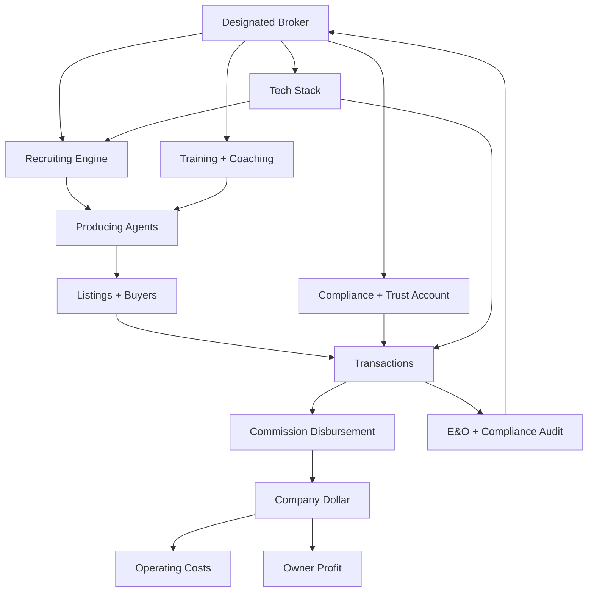

### Direct Answer

To start a real estate brokerage in 2027, the founder takes a state Designated Broker license (typically requiring 2-3 years of active agency experience plus a state broker exam administered through Pearson VUE or PSI), forms a PLLC or LLC, secures a state Real Estate Commission brokerage license, opens a dedicated IOTA-compliant trust account at a real-estate-friendly bank (**Live Oak Bank**, **Pinnacle Bank**, or **Pursuit Lending** for SBA 7(a) capital), binds an E&O policy with **Pearl Insurance**, **Rice Insurance Services**, or **CRES**, then picks one of three operating models: a traditional independent shop with 70/30 splits, a 100% commission flat-fee cloud brokerage in the **eXp Realty** / **Real Brokerage** / **LPT Realty** lineage, or a boutique luxury house chasing **Sotheby's International Realty** and **Christie's International Real Estate** affiliations. Tech stack defaults to **Follow Up Boss** or **BoldTrail** for CRM, **SkySlope** or **Lone Wolf brokerWOLF** for transaction management, **Dotloop** or **DocuSign Rooms** for forms, and **RPR** plus **Cloud CMA** for pricing. The post-Sitzer-Burnett operating reality (the 2024 NAR settlement that eliminated cooperative buyer-broker compensation in the MLS) forces every brokerage in 2027 to enforce signed **Buyer Representation Agreements** before showings, train agents on commission negotiation as a buyer-side skill, and rebuild lead-gen around direct buyer leads (Zillow Premier Agent, Homes.com, Realtor.com) rather than MLS-cooperated splits. Expect $40K-$120K to launch a lean independent, $80K-$250K for a boutique luxury shop, and $300K-$1.2M for a 25-agent franchise location with retail signage.

> **TLDR**: Get the broker license, form the entity, open the trust account, bind E&O, pick your model (independent / cloud / luxury / franchise), stand up the tech stack (FUB + SkySlope + Dotloop), train every agent on signed Buyer Rep Agreements (post-Sitzer-Burnett mandatory), and recruit 8-15 producing agents in year one. Plan on 18-24 months to GCI break-even, $40K-$1.2M to launch depending on model, and a 70/30 to 100%-flat split economics decision that determines every downstream choice.

---

## H2 BANNER 01 — THE 2027 BROKERAGE LANDSCAPE AFTER SITZER-BURNETT

The single most important fact about starting a real estate brokerage in 2027 is that you are launching into the third full year of the post-**NAR settlement** operating environment. **Sitzer-Burnett v. National Association of Realtors** (resolved March 2024, effective August 2024) eliminated the long-standing convention that listing brokers offered cooperative compensation to buyer brokers through the MLS. Every brokerage launched after August 2024 has been forced to rebuild three core systems: (1) buyer-side compensation conversations, (2) signed **Buyer Representation Agreements** before any property showing, and (3) listing-side seller education on whether to offer buyer-broker concessions outside the MLS.

### 01.1 — What the settlement actually changed

- **MLS compensation fields are dead**: No MLS may display or transmit offers of cooperative compensation. Sellers may still offer concessions, but those offers cannot be advertised through the MLS infrastructure.
- **Buyer Representation Agreements are mandatory**: As of August 17, 2024, **NAR** members must obtain a signed written agreement with a buyer before touring any property (including open houses where the agent represents the buyer). Most state real estate commissions have codified this into state license law.
- **Commission is a negotiation, not a default**: The historical 5-6% total commission split 50/50 between listing and buyer side is no longer a market default. **Redfin**, **Houwzer**, **Homie**, and discount brokerages have moved aggressively to flat-fee and à-la-carte pricing.
- **DOJ scrutiny continues**: The **Department of Justice Antitrust Division** filed a statement of interest in Sitzer-Burnett and has indicated continued review of NAR rules, MLS clear-cooperation policies, and pocket-listing practices.

### 01.2 — How the survivors adapted

The brokerages that thrived in 2025-2026 share four characteristics. **First**, they invested heavily in buyer-agent training on commission conversations — teaching agents how to articulate value, sign a BRA at the first meeting, and negotiate compensation directly with the buyer or via seller concessions. **Second**, they tightened their tech stack around **SkySlope** or **Lone Wolf brokerWOLF** for compliance, because the post-settlement audit risk on missing BRAs is existential. **Third**, they recruited aggressively from independent agents at **Keller Williams**, **RE/MAX**, and **Coldwell Banker** who were frustrated by slow brand response to the new world. **Fourth**, they leaned into either ultra-low-cost (100% commission, $85/month cap models pioneered by **eXp Realty** and **Real Brokerage**) or ultra-high-touch luxury (**Sotheby's**, **Christie's**, **Engel & Völkers**) — the squeezed middle of full-service traditional brokerages with 70/30 splits and $1M GCI offices is consolidating fast.

---

## H2 BANNER 02 — THE LICENSING AND ENTITY FORMATION SEQUENCE

You cannot operate a real estate brokerage without a **Designated Broker** (sometimes called Principal Broker, Broker of Record, or Managing Broker depending on the state). The licensing pathway is the gating constraint on launch timing.

### 02.1 — The broker license itself

1. **Experience requirement**: 41 of 50 states require 2-3 years of active licensed real-estate-agent experience before sitting for the broker exam. **California** requires 2 years full-time within the prior 5 years, **Texas** requires 4 years and 360 classroom hours, **Florida** requires 2 years post-sales-associate, **New York** requires 2 years of qualifying experience plus 152 hours of approved coursework.
2. **Pre-license coursework**: Typically 60-180 additional hours of broker-specific education covering brokerage management, trust accounts, agency law, fair housing, and supervision.
3. **State broker exam**: Administered by **Pearson VUE** or **PSI Exams** — typically 75-150 questions, 65-75% passing threshold, $80-$200 fee.
4. **Background check and fingerprinting**: Every state requires it. Felonies, tax liens, or recent bankruptcies can trigger additional review.

### 02.2 — Entity formation

Most 2027 brokerages form as a **Professional Limited Liability Company (PLLC)** in states that require it (Texas, North Carolina, New York for licensed professional services) or a standard **LLC** elsewhere. A few choose **S-Corp** election for self-employment tax optimization once GCI clears $250K. Key decisions:

- **PLLC vs LLC**: PLLC is mandatory for licensed professional services in certain states. The PLLC formation requires a license certificate from the real estate commission before the secretary of state will accept the filing.
- **Single-member vs multi-member**: Solo broker-owners typically use single-member LLC taxed as a disregarded entity. Adding a non-licensed business partner introduces fair-housing-act and licensing complications — most states bar non-licensed individuals from owning a controlling interest in a brokerage.
- **Trade name / DBA**: File a DBA if operating under a brand different from the legal entity. Required for franchise affiliations.

### 02.3 — The brokerage license itself

After the entity exists and the Designated Broker is identified, the company files for a **firm license** (or brokerage license, broker company license — terminology varies). The application requires:

| Requirement | Detail |
|---|---|
| Designated Broker | Must be the broker-of-record, supervises all agents, can be supervising only one company in most states |
| Physical office | Required in ~22 states; "virtual office" allowed in CA, FL, TX, CO if certain conditions met |
| Trust account | IOTA-compliant client trust at an approved bank, separate from operating account |
| Sign requirements | Office signage with brokerage name visible from public way (in physical-office states) |
| Errors & Omissions policy | Required in 16 states, strongly recommended in all |
| Filing fee | $200-$2,000 depending on state |

---

## H2 BANNER 03 — THE OPERATING MODELS: CHOOSE ONE BEFORE YOU SIGN A LEASE

The single biggest determinant of your brokerage's economics, recruiting story, and time-to-profitability is the operating model. There are four viable models in 2027.

### 03.1 — Model A: Traditional Independent Full-Service

- **Splits**: 70/30 to 80/20 in the agent's favor on production, sometimes with a cap (after $20K-$30K to the house, agent goes to 100%).
- **Brand**: Your own. No franchise fees, no royalty stream.
- **Office**: Physical retail location, signage, meeting rooms, sometimes private agent offices.
- **Target agent**: Mid-tenure (3-10 years) producing 10-25 sides per year, wants culture and broker support.
- **Launch capital**: $80K-$250K.
- **Time to break-even**: 18-30 months.
- **Biggest risk**: Recruiting in the post-Sitzer-Burnett world without a national brand or a low-cap economic story is hard. Most new independents struggle to recruit past 8-10 agents.

### 03.2 — Model B: 100% Commission Cloud Brokerage

- **Splits**: Agent keeps 100% of GCI minus a per-transaction fee ($300-$600) and a monthly desk fee ($50-$150). Sometimes an annual cap.
- **Brand**: Either a franchise (eXp, Real, LPT) or a generic cloud shop you build.
- **Office**: None or co-working. Operations entirely digital.
- **Target agent**: High-producing solo agents (15+ sides/year), team leaders, and tech-comfortable mid-career agents.
- **Launch capital**: $40K-$90K.
- **Time to break-even**: 12-24 months (faster because no office overhead).
- **Biggest risk**: Compliance and supervision at scale without a physical office is operationally hard. **SkySlope** + **dotloop** + a great transaction coordinator is mandatory.

### 03.3 — Model C: Boutique Luxury

- **Splits**: 60/40 to 70/30 — luxury agents tolerate lower splits in exchange for brand and marketing.
- **Brand**: Affiliate with **Sotheby's International Realty**, **Christie's International Real Estate**, **Engel & Völkers**, or **Berkshire Hathaway HomeServices Luxury Collection**. Affiliation fees range from $25K-$150K initial plus 6-8% royalty.
- **Office**: Premium retail location, gallery-style staging, concierge feel.
- **Target agent**: Top-1% producers, $5M+ average price point.
- **Launch capital**: $150K-$500K.
- **Time to break-even**: 24-36 months. Luxury sales cycles are long, but average commissions are 10-20x mainstream.
- **Biggest risk**: Recruiting a luxury producer from an established luxury house is a 6-18 month courtship.

### 03.4 — Model D: Franchise Retail Office

- **Splits**: 50/50 to 70/30 with cap structures.
- **Brand**: **Keller Williams**, **RE/MAX**, **Coldwell Banker**, **Century 21**, **Berkshire Hathaway HomeServices**, **HomeSmart**, **Realty ONE Group**.
- **Office**: Per franchise specifications. Build-out typically $50K-$200K.
- **Target agent**: New and mid-tenure agents seeking training and brand recognition.
- **Launch capital**: $300K-$1.2M (initial franchise fee $25K-$150K + build-out + working capital).
- **Time to break-even**: 24-48 months.
- **Biggest risk**: Royalty drag (6-8% off the top of company dollar), corporate mandates, and slow brand response to market changes.

---

## H2 BANNER 04 — CAPITAL STRUCTURE AND LENDING

A brokerage is a working-capital-intensive business. You collect commissions on closing, but you pay rent, MLS dues, E&O premiums, and recruiting bonuses every month from day one.

### 04.1 — Capital sources

- **Founder equity**: Most brokerages launch with $50K-$300K in founder cash. This is the cleanest capital — no covenants, no personal guarantees beyond what's already implicit.
- **SBA 7(a) loans**: **Live Oak Bank**, **Pinnacle Bank**, **Pursuit Lending**, and **Newtek Small Business Finance** all underwrite brokerage launches in the $150K-$1.5M range. Expect SBA 7(a) with 10-year amortization, prime + 2.5-3.0%, full personal guarantee, and a UCC-1 on business assets.
- **Seller financing for an acquired brokerage**: Acquiring an existing brokerage (a tuck-in 8-15 agent shop with a retiring broker) is increasingly common in 2027 as the **HomeServices of America** / **Anywhere Real Estate** (formerly Realogy) and **PE-backed rollup** activity has trained sellers to expect 50-70% seller-financed deals.
- **Revenue-based financing**: A few specialty lenders will advance against forward commissions, but rates are punitive (1.3-1.6x payback over 12-18 months).

### 04.2 — The cost stack you must budget

| Cost Category | Year 1 Range | Notes |
|---|---|---|
| Office lease + buildout | $0-$200K | Cloud model = $0; franchise retail = $200K+ |
| E&O insurance | $3K-$15K | Per-agent rider $300-$600 |
| MLS dues + lockbox | $2K-$8K | Per office + per agent |
| Local + state association dues | $3K-$20K | NAR + state Realtor association |
| Tech stack (CRM + TM + e-sign + comps) | $8K-$40K | Per-agent licensing scales |
| Designated Broker compensation | $0-$120K | If founder is DB, often deferred |
| Transaction Coordinator | $40K-$70K | Hire in year 1 for any 5+ agent shop |
| Bookkeeper + CPA | $5K-$20K | Trust account compliance is non-negotiable |
| Marketing + signage + website | $10K-$60K | Luxury Presence, IDX Broker, sign costs |
| Recruiting bonuses | $0-$50K | Sometimes paid to agents as signing bonuses |
| Legal + entity formation | $3K-$15K | Operating agreement, agent ICA template |
| Working capital reserve | $40K-$200K | 6-9 months runway |

---

## H2 BANNER 05 — THE TRUST ACCOUNT AND TRUST ACCOUNTING DISCIPLINE

Every brokerage that handles earnest money, security deposits, or escrow funds must maintain an **IOTA** (Interest on Trust Account) or equivalent state-mandated **client trust account**. Mishandling this account is the single fastest way to lose your broker license.

### 05.1 — Trust account rules

- **Separate from operating account**: Never commingle. Period.
- **Approved bank**: Most states publish an approved bank list. **Live Oak Bank**, **Bank of America**, **Wells Fargo**, **First Horizon**, **Pinnacle Bank**, and most community banks are approved.
- **Three-way reconciliation**: Bank statement, trust ledger, and client subsidiary ledgers must reconcile monthly. Many states require quarterly affidavit.
- **Interest disposition**: IOTA interest typically sweeps to the state real estate commission for consumer education funds. A few states permit interest to broker.
- **Audit cadence**: Most state commissions audit on a 3-5 year cycle, plus complaint-driven audits anytime.

### 05.2 — The tools that prevent disaster

- **Brokermint** or **Lone Wolf brokerWOLF** for integrated back-office accounting tied to transaction management
- **Sisu** for production reporting and agent leaderboards (does not replace trust accounting)
- **QuickBooks Online Advanced** for operating books with a class-tracking schema mapped to office and team
- **A dedicated bookkeeper** who has run a brokerage trust account before (this is non-negotiable above 10 agents)

---

## H2 BANNER 06 — THE 2027 BROKERAGE TECH STACK

The tech stack is where most new brokerages over-spend and under-implement. The 2027 default stack, validated across hundreds of independent brokerages launched 2024-2026, has consolidated.

### 06.1 — CRM and lead management

- **Follow Up Boss** (now part of **Zillow**): The dominant CRM for teams and small brokerages. Strong action plans, native dialer, deep integrations.
- **BoldTrail** (formerly **kvCore**, now under **Inside Real Estate**): The dominant CRM for franchise brokerages. Includes IDX website, smart CMA, behavioral lead scoring.
- **Lofty** (formerly **Chime**): Strong international and team-focused CRM with AI assistant.
- **Sierra Interactive**: High-end IDX + CRM for boutique luxury and team-heavy shops.
- **CINC**: Lead-conversion-heavy CRM bundled with paid lead generation.
- **Real Geeks**: Lower-cost IDX + CRM for solo agents and small teams.

### 06.2 — Transaction management and compliance

- **SkySlope**: Market-leading TM for brokerages prioritizing compliance and audit-readiness. Mandatory in larger independents.
- **Dotloop**: Strong agent-friendly UX, e-sign included, widely adopted at franchises.
- **DocuSign Rooms for Real Estate**: Premium e-sign with transaction room workspace.
- **Lone Wolf brokerWOLF**: Full back-office (transaction + accounting + commission disbursement) — the legacy gold standard for traditional brokerages.
- **Brokermint**: Cloud-native TM + back-office, popular with mid-size cloud brokerages.

### 06.3 — Valuation and CMA

- **Cloud CMA** (Lone Wolf): The default CMA report tool — agents love the polished output.
- **RPR (Realtors Property Resource)**: NAR-member benefit, deep property data, included in dues.
- **HouseCanary**: Premium AVM + agent valuation product, popular with iBuyer-adjacent shops.
- **CoreLogic**: Enterprise-grade property data, MLS data syndication.
- **Quantarium**: AVM + data services, increasingly used in luxury and institutional segments.

### 06.4 — Marketing and IDX

- **Luxury Presence**: Premium agent and brokerage websites, popular with luxury and team-leader producers.
- **IDX Broker**: The dominant IDX feed provider, $50-$200/month per site.
- **Zillow Premier Agent**: Paid buyer leads from Zillow inventory.
- **Realtor.com Leads** / **Homes.com**: CoStar's Homes.com is a fast-growing alternative to Zillow.
- **OJO Labs**: Concierge-style buyer lead conversion service.

### 06.5 — Coaching and training

- **Tom Ferry**: Premium coaching for top producers and team leaders.
- **Mike Ferry Organization**: Classic prospecting-and-scripts training.
- **Buffini & Company**: Referral-based agent business coaching.
- **YourCBL** and **MAPS Coaching** (Keller Williams): Franchise-specific.

---

## H2 BANNER 07 — THE RECRUITING ENGINE

A brokerage without producing agents is overhead with no revenue. Recruiting is the single most important operational discipline.

### 07.1 — The recruiting math

- A typical mid-tenure agent does 10-15 sides per year at an average commission of $9K-$12K per side = $90K-$180K GCI per agent.
- At a 70/30 split, the brokerage retains $27K-$54K company dollar per agent.
- A 15-agent shop generates $400K-$800K company dollar — enough to support a small physical office and a transaction coordinator.
- A 50-agent cloud brokerage at $400/transaction in company dollar generates $200K-$300K of fee income — sustainable for a digital-only operation.

### 07.2 — Recruiting channels

1. **Direct outreach to producing agents**: Use **Brokermetrics** or MLS production reports to identify mid-tenure 10-30-sides-per-year agents. Coffee-meeting cadence: 60-90 minutes, third-party café, no pitch in meeting one.
2. **Recruiting events**: Quarterly broker-hosted dinners with a guest speaker (CPA, lender, attorney) and 20-40 invited agents.
3. **Referral from current agents**: Pay $1,000-$5,000 referral bonus to agents who recruit producing peers.
4. **Acquired agents**: Buy a retiring broker's book — typically 80% of trailing-12-month company dollar payable as 30% of GCI on retained agents over 36 months.
5. **New-license pipeline**: Partner with a local real estate school. Less productive (new agents do 2-4 sides year one) but a steady pipeline.

### 07.3 — What 2027 agents want

The post-Sitzer-Burnett environment changed agent psychology. Top three asks from recruited agents in 2026 broker surveys:

1. **Buyer-side training and tools**: Specifically scripts and BRA workflows.
2. **Lead generation support**: Either paid leads or a marketing budget the broker funds.
3. **Compliance backbone**: Agents are scared of audit risk on missing BRAs. A broker with **SkySlope** + a dedicated compliance officer is a major recruiting advantage.

---

## H2 BANNER 08 — INSURANCE AND RISK MANAGEMENT

A brokerage is sued or threatened with suit at roughly 1 incident per 50-75 transactions in 2027. Insurance and risk hygiene are not optional.

### 08.1 — The insurance stack

- **Errors & Omissions (E&O)**: **Pearl Insurance** (the **CRES** subsidiary), **Rice Insurance Services**, **Victor O. Schinnerer**, and **Westport / Swiss Re** are the dominant carriers. Coverage limits: $1M per claim / $2M aggregate is the floor; $2M/$4M is increasingly standard.
- **General Liability + Property**: For physical-office brokerages, a Business Owners Policy (BOP) covers slip-and-fall and office contents — $500-$2,500 per year.
- **Cyber liability**: With wire-fraud losses topping $2B/year industrywide, cyber coverage is now table-stakes — $1K-$5K per year for $1M-$2M limits.
- **Employment Practices Liability (EPLI)**: For brokerages with W-2 employees, $1K-$3K per year.
- **Umbrella**: $5M-$10M umbrella over the underlying — $1K-$3K per year.

### 08.2 — Risk-reducing operations

- Wire fraud prevention: Use **CertifID** or **Earnnest** for verified wire instructions. Require all wire transfers to be verbally confirmed via a known phone number, never a number from an email signature.
- BRA enforcement: No showing without a signed BRA. Period. **SkySlope** + a weekly compliance audit by the DB.
- Fair Housing audit trail: Document showings, screening criteria, and conversations to defend against discrimination complaints.
- Trust account: Three-way reconciliation monthly, signed by the DB.

---

## H2 BANNER 09 — THE LEGAL AND REGULATORY MATRIX

| Statute / Regulator | What It Governs | Why It Matters for a 2027 Brokerage |
|---|---|---|
| **Fair Housing Act** (federal) | Protected-class discrimination in housing | Every showing, every ad, every screening conversation |
| **RESPA** | Settlement-service kickbacks | No kickbacks for referrals to lenders, title, etc. |
| **Sherman Antitrust Act / DOJ** | Price-fixing and concerted action | Post-Sitzer-Burnett DOJ scrutiny of MLS rules and broker conduct |
| **CFPB** | Consumer-financial-services oversight | Affiliated business arrangements (lending, title) scrutiny |
| **State Real Estate Commission** | License, trust account, advertising rules | Audit and discipline authority |
| **State Anti-Discrimination Statutes** | Often broader than federal FHA | Source-of-income, sexual orientation, etc. |
| **TCPA / Do-Not-Call** | Outbound calling and texting | Aggressive recruiting calls can trigger TCPA suits |
| **CAN-SPAM** | Outbound email | Must include unsubscribe, physical address |
| **State Wage & Hour** | Independent contractor classification | Real estate agents are almost universally IC, but mis-classified support staff is a risk |

---

## H2 BANNER 10 — THE 12-MONTH LAUNCH PLAN

A realistic launch sequence for an independent or cloud brokerage starting in 2027.

### 10.1 — Months -6 to -3 (pre-launch)

1. Verify broker license eligibility; complete broker coursework if not already done.
2. Sit for broker exam.
3. Form entity (PLLC/LLC); obtain EIN; file initial state filings.
4. Draft Independent Contractor Agreement (ICA) for agents with attorney.
5. Identify office location (or commit to cloud model).
6. Open commercial bank accounts (operating + trust + reserve).
7. Bind E&O policy with **Pearl Insurance**, **Rice Insurance Services**, or **CRES**.
8. Apply for brokerage firm license with state commission.

### 10.2 — Months -3 to 0 (build)

1. Build tech stack: **Follow Up Boss** or **BoldTrail**, **SkySlope** or **Dotloop**, **Cloud CMA**, **RPR**, **Luxury Presence** or **IDX Broker**.
2. MLS application and lockbox keys.
3. Recruit first 3-5 agents (founder relationships from prior brokerage).
4. Sign office lease (if physical-office model).
5. Print signage, business cards, lockbox stickers.
6. Build agent onboarding playbook including BRA training.
7. Launch website.

### 10.3 — Months 0 to 6 (open)

1. Office grand opening / virtual launch event.
2. Onboard agents; transfer their licenses with state commission.
3. First transactions in pipeline.
4. Weekly compliance audit by Designated Broker.
5. Monthly three-way trust account reconciliation.
6. Recruit to 8-12 agents.
7. Hire transaction coordinator at 5-8 agents.

### 10.4 — Months 6 to 12 (scale)

1. Recruit to 15-25 agents.
2. Hire administrative support / office manager.
3. Implement training cadence (weekly).
4. Build referral relationships with lenders, title, inspectors (RESPA-compliant).
5. Quarterly review of P&L vs. plan.
6. Decide on year-2 expansion: second office, team structure, or affiliation.

---

## H2 BANNER 11 — UNIT ECONOMICS BY MODEL (DETAILED)

| Model | Avg Agent GCI | Company Dollar / Agent | Agents at Break-Even | Total Company Dollar | Operating Cost | Net Margin |
|---|---|---|---|---|---|---|
| Independent Full-Service (70/30) | $110K | $33K | 12 | $396K | $360K | 9% |
| Cloud Brokerage ($400/txn cap $5K) | $130K | $5K cap | 60 | $300K | $250K | 17% |
| Boutique Luxury (60/40) | $250K | $100K | 6 | $600K | $520K | 13% |
| Franchise Retail (KW/RE/MAX/CB, 50/50 cap $20K) | $115K | $20K cap | 25 | $500K | $480K | 4% |
| Discount Flat-Fee (Redfin-style) | $90K | $25K | 18 | $450K | $420K | 7% |
| PE-Rollup Affiliate | $130K | $30K | 15 | $450K | $400K | 11% |

These margins look thin because they are. Brokerage is a low-margin, high-recruiting-velocity business. The way owners build wealth is through **stock ownership in their entity** (equity build), **affiliated-business-arrangement** revenue (title, lender, insurance JVs that are RESPA-compliant), and eventually **selling the brokerage** to a national consolidator at 4-8x EBITDA.

---

## H2 BANNER 12 — COUNTER-CASE: WHEN NOT TO START A BROKERAGE

The literature on starting a brokerage skews promotional. There are real cases where the answer is "don't."

### 12.1 — You are a top-producing agent earning $400K+ GCI net

If you are personally producing $400K+ GCI net of expenses, opening a brokerage to capture 12-15% company dollar on 10-15 other agents is mathematically inferior to staying solo or building a team within an existing brokerage. Your personal production at a 100% commission cloud brokerage ($85/month + $300/transaction) nets more than running a 12-agent independent.

### 12.2 — You don't enjoy recruiting

A brokerage is a recruiting business with a real estate hobby attached. If you don't enjoy quarterly recruiting dinners, weekly coffees with mid-career agents, and constant outreach, you will fail. Period.

### 12.3 — You have less than $60K in liquid capital

A cloud brokerage can launch on $40K-$60K, but only if the founder has a robust personal sphere and zero need to take a salary in year one. Below that capital threshold, the runway risk is acute.

### 12.4 — Your local market has fewer than 5,000 annual transactions

A brokerage needs a deep agent pool to recruit from. Markets with fewer than 5,000 annual transactions (typically MSAs under 200K population) struggle to support more than 2-3 brokerages, and the existing incumbents have a multi-decade head start.

### 12.5 — You haven't successfully sold real estate yourself

Brokers who have never personally sold real estate (or sold fewer than 30 transactions) cannot credibly coach agents, cannot underwrite recruiting promises, and cannot defend their brokerage in front of state real estate commission complaints. The "broker who's never sold" failure pattern is well-documented in the industry.

---

## H2 BANNER 13 — THE PE-ROLLUP AND CONSOLIDATION REALITY

By 2027, the brokerage industry is well into its third wave of consolidation. Understanding it shapes both how you build and how you eventually exit.

### 13.1 — The consolidators

- **Anywhere Real Estate** (formerly Realogy): Owns **Coldwell Banker**, **Century 21**, **Sotheby's International Realty**, **Better Homes and Gardens Real Estate**, **ERA**, and **Corcoran**. Buys franchisees and converts independents.
- **HomeServices of America** (Berkshire Hathaway Energy): Owns **Berkshire Hathaway HomeServices**, **Long & Foster**, **Real Living**, **Edina Realty**, and many more.
- **Compass**: Hybrid brokerage-and-tech play; aggressive acquirer of luxury teams.
- **Side**: White-label brokerage backend that powers entrepreneurial agent-teams.
- **eXp World Holdings**: Parent of **eXp Realty**, growing via agent-pull recruiting rather than acquisitions.
- **The Real Brokerage**: Public Nasdaq-listed cloud brokerage; growing via agent recruitment.
- **PE-backed rollups**: **The Riverside Company**, **Investcorp**, and **HIG Capital** have all built or acquired multi-brokerage platforms.

### 13.2 — What the consolidators pay

For a profitable brokerage with $1M-$5M of EBITDA:

- 3-5x EBITDA for traditional independent
- 4-7x EBITDA for tech-forward or luxury
- 5-10x EBITDA for high-growth cloud or recurring-revenue model
- 1-2x trailing GCI of producing agents (heavily structured with retention earnouts)

### 13.3 — How to structure for exit

If exit is part of the plan from day one:

1. **Build recurring revenue**: ABA partnerships with lenders and title generate predictable revenue PE values highly.
2. **Document everything**: Buyers diligence agent contracts, trust accounts, compliance logs, and recruiting playbooks.
3. **Retain key agents**: Offer phantom equity or profit-sharing tied to a sale event.
4. **Clean entity structure**: Single entity, no commingled accounts, clean P&L by office.

---

## H2 BANNER 14 — SPECIALTY NICHES IN 2027

The "general residential" brokerage is a mature category. The growth niches in 2027:

- **Luxury (>$5M average sale)**: Strong demand for **Sotheby's**, **Christie's**, **Engel & Völkers** affiliates in resort and high-net-worth markets.
- **Equestrian and farm**: Specialty niche with **Land Brokers Cooperative** and equestrian-focused brands. Average sales are larger and competition is thinner.
- **ADU (Accessory Dwelling Unit) specialists**: California's SB-9 / SB-10 environment plus Pacific Northwest ADU legalization created a niche of brokers specializing in ADU-eligible properties.
- **Build-to-rent and SFR (single-family-rental) advisory**: Serving institutional buyers (Invitation Homes, AMH, Tricon) who buy 50-500 homes per year.
- **Relocation and corporate**: Cartus, BGRS, and Aires-affiliated brokerages handle Fortune 500 relocations with predictable referral fees (typically 30-40% of GCI).
- **Veteran-focused (VA loan specialty)**: Many active-duty markets (Norfolk, San Antonio, San Diego) support brokerages that focus on VA-loan-savvy agents.
- **New construction**: Builder-rep arrangements with national homebuilders (D.R. Horton, Lennar, Pulte) can be a steady company-dollar stream.

---

## H2 BANNER 15 — MERMAID: THE BROKERAGE OPERATING SYSTEM

The operating system reads: the Designated Broker is the hub, recruits agents, supports them with compliance / training / tech, and the agents generate transactions that fund the company.

---

## H2 BANNER 16 — COMMON FAILURE MODES AND HOW TO AVOID THEM

### 16.1 — Failure: Recruiting promises you can't keep

Many new brokers recruit by promising leads, marketing, and coaching. When the leads don't materialize, agents leave within 6-12 months and brand reputation tanks. Fix: under-promise, over-deliver. Recruit on culture and economics, not on lead-gen guarantees you can't fund.

### 16.2 — Failure: Trust account commingling

A surprising number of solo brokers commingle the trust account with operating because "it's just for a few days." This is a license-loss-level offense. Fix: hire a bookkeeper from day one who has run a brokerage trust account.

### 16.3 — Failure: Hiring family members for compliance roles

The Designated Broker's spouse running compliance, the founder's child as transaction coordinator — these patterns create both family-business dysfunction and audit risk. Fix: hire arms-length professionals for compliance and accounting.

### 16.4 — Failure: Over-spending on office build-out

Glass conference rooms, executive offices, branded signage — none of this generates a single transaction. Fix: cheap office or no office in year one. Reinvest in recruiting, training, and tech.

### 16.5 — Failure: Underpricing E&O coverage

A $1M/$1M E&O policy is inadequate in 2027. Mid-market litigation easily breaches that limit. Fix: $2M/$4M minimum; $5M umbrella over the top.

### 16.6 — Failure: Not enforcing BRAs

Post-Sitzer-Burnett, agents who show property without a signed BRA expose the brokerage to license discipline. Fix: SkySlope-enforced BRA-before-showing rule. Random audits monthly.

### 16.7 — Failure: Over-affiliating with one lender or title company

RESPA scrutiny is real. Brokerages that direct 80%+ of business to a single affiliated lender or title company are audit targets. Fix: multiple referral relationships; document consumer choice.

---

## H2 BANNER 17 — CROSS-LINKS TO RELATED PULSE LIBRARY ENTRIES

- **[[starting-a-real-estate-team-2027]]**: For agents not ready to start a brokerage but ready to scale.
- **[[nar-settlement-operational-playbook]]**: Deep-dive on BRA workflows and buyer-side commission conversations.
- **[[brokerage-acquisition-due-diligence]]**: For brokers acquiring rather than launching.
- **[[real-estate-team-vs-brokerage]]**: The decision framework for team-vs-brokerage structure.
- **[[recruiting-real-estate-agents-2027]]**: Deep-dive on the recruiting engine.
- **[[real-estate-trust-account-compliance]]**: The compliance manual for IOTA and three-way reconciliation.
- **[[abm-and-affiliated-business-arrangements]]**: The RESPA-compliant way to build ancillary revenue.
- **[[luxury-real-estate-brokerage-affiliations]]**: Sotheby's vs. Christie's vs. Engel & Völkers comparison.
- **[[cloud-brokerage-vs-traditional]]**: The economics deep-dive.
- **[[franchise-vs-independent-brokerage]]**: The brand-vs-economics tradeoff.

---

## H2 BANNER 18 — SOURCES, AUTHORITIES, AND OPERATORS REFERENCED

**Operators (with stock tickers where public):**

1. eXp World Holdings (NASDAQ: EXPI) — parent of eXp Realty
2. The Real Brokerage (NASDAQ: REAX)
3. Compass, Inc. (NYSE: COMP)
4. Redfin Corporation (NASDAQ: RDFN)
5. Anywhere Real Estate Inc. (NYSE: HOUS) — parent of Coldwell Banker, Century 21, Sotheby's, Corcoran, ERA, Better Homes & Gardens
6. RE/MAX Holdings (NYSE: RMAX)
7. Douglas Elliman (NYSE: DOUG)
8. Berkshire Hathaway HomeServices (Berkshire Hathaway Energy subsidiary; BRK.A / BRK.B)
9. Zillow Group (NASDAQ: Z, ZG) — parent of Follow Up Boss
10. CoStar Group (NASDAQ: CSGP) — parent of Homes.com
11. Keller Williams Realty (private)
12. Side, Inc. (private)
13. HomeSmart International (private)
14. Realty ONE Group (private)
15. LPT Realty (private)

**Regulatory and trade authorities:**

- National Association of Realtors (NAR)
- State Real Estate Commissions (50 states + DC)
- U.S. Department of Justice, Antitrust Division
- Consumer Financial Protection Bureau (CFPB)
- U.S. Department of Housing and Urban Development (HUD) — Fair Housing
- Federal Trade Commission (FTC)
- IRS — entity classification and 1099 reporting

**Settlement and key case law:**

- Sitzer / Burnett v. National Association of Realtors et al. (W.D. Mo.) — settled 2024
- Moehrl v. NAR (N.D. Ill.) — settled 2024
- Batton v. NAR — ongoing buyer-side class action
- Nosalek v. MLS PIN — settled 2024

**Tech vendors referenced:**

Follow Up Boss, BoldTrail, Lofty, Sierra Interactive, CINC, Real Geeks, SkySlope, Dotloop, DocuSign Rooms, Lone Wolf brokerWOLF, Brokermint, Sisu, Cloud CMA, RPR, HouseCanary, CoreLogic, Quantarium, Luxury Presence, IDX Broker, Zillow Premier Agent, Realtor.com Leads, Homes.com, OJO Labs.

**Insurance carriers:**

Pearl Insurance, Rice Insurance Services, CRES, Victor O. Schinnerer & Company, Westport / Swiss Re, CertifID, Earnnest.

**Lenders:**

Live Oak Bank, Pinnacle Bank, Pursuit Lending, Newtek Small Business Finance, SBA 7(a) program.

**Coaching providers:**

Tom Ferry, Mike Ferry Organization, Buffini & Company, YourCBL, MAPS Coaching.

**Luxury affiliations:**

Sotheby's International Realty, Christie's International Real Estate, Engel & Völkers, Berkshire Hathaway HomeServices Luxury Collection, Coldwell Banker Global Luxury.

**Industry data providers:**

REAL Trends (now Lone Wolf), T3 Sixty, Inman Intelligence, RISMedia, HousingWire, The Real Deal.

---

## H2 BANNER 19 — FINAL CHECKLIST: ARE YOU READY?

- [ ] Broker license in hand or coursework completed
- [ ] Entity formed (PLLC or LLC) with operating agreement
- [ ] Operating model selected (independent / cloud / luxury / franchise)
- [ ] $40K-$300K capital secured (founder + SBA + reserves)
- [ ] Trust account opened at approved bank
- [ ] E&O policy bound with $2M/$4M minimum limits
- [ ] Brokerage firm license application filed
- [ ] MLS application submitted
- [ ] Tech stack contracted (CRM + TM + e-sign + CMA + IDX)
- [ ] First 3-5 recruited agents committed to transfer
- [ ] Independent Contractor Agreement reviewed by real estate attorney
- [ ] Bookkeeper or back-office TM platform engaged for trust reconciliation
- [ ] Year-one budget with monthly cash flow forecast built
- [ ] Recruiting plan with 90/180/365-day agent count targets
- [ ] Designated Broker time commitment defined (typically 30-50 hrs/week year one)

If you can check 13 of 15 of these before opening day, you're ready. Less than 10, slow down and finish the prep work — brokerages that launch under-prepared rarely recover the lost ground.

---

## H2 BANNER 20 — DEEP DIVE: THE BUYER REPRESENTATION AGREEMENT WORKFLOW

The single biggest operational change for any 2027 brokerage versus a pre-2024 brokerage is the **Buyer Representation Agreement** workflow. Every state real estate commission, plus the post-Sitzer-Burnett NAR practice changes, now requires written buyer-broker agreements before showing property. The brokerages that mastered this workflow gained material market share through 2025-2026.

### 20.1 — The five-minute first-meeting BRA conversation

A trained buyer-side agent should be able to sign a BRA in the first meeting with a buyer. The standard script:

1. **Open with services framing**: "Before we look at properties together, I want to walk you through how I work as your buyer's agent and what that means for both of us."
2. **Explain agency duties**: Fiduciary, confidentiality, undivided loyalty, full disclosure, accounting, reasonable care, obedience.
3. **Explain compensation**: "My compensation is negotiable and is paid in one of three ways: from the seller as a concession at closing, from a co-op offered outside the MLS by the listing brokerage, or directly from you. We'll know which combination applies on each property when we make an offer."
4. **Walk through the agreement**: Term (typically 90-180 days), geographic scope, property type scope, compensation rate or range, termination clauses.
5. **Sign and store**: Use **Dotloop** or **DocuSign Rooms** for e-sign. Store in **SkySlope** for audit.

### 20.2 — The compensation negotiation playbook

Buyers in 2027 understand they may owe their agent directly if the seller doesn't offer concessions. The playbook for buyer's agents:

- **Ask the seller via the offer**: Include a buyer-broker compensation request in the offer (typical 2-3%). Many sellers still agree because it gets the deal done.
- **Walk the buyer through the math**: If the seller declines and the buyer owes 2.5% on a $500K home ($12,500), explain that it's part of the buyer's closing costs and can be financed into certain loan products (VA, some conventional).
- **Have escalation language ready**: If the seller-side compensation is 2% and the BRA specifies 2.5%, the buyer covers the 0.5% gap.

### 20.3 — The brokerage-level compliance protocol

- **Weekly audit**: Designated Broker reviews random sample of new transactions for BRA presence and validity.
- **Monthly metrics**: % of showings with valid BRA, % of BRAs signed before first showing vs. signed at offer, average BRA compensation rate.
- **Quarterly training**: Mandatory refresher on BRA conversations, with role-plays.

---

## H2 BANNER 21 — DEEP DIVE: AGENT COMPENSATION MODELS IN DETAIL

The agent commission split is the single most-discussed topic in any brokerage. Getting it wrong sinks the recruiting story. Getting it right is the foundation of unit economics.

### 21.1 — Traditional graduated split (70/30 → 80/20 → 100% cap)

- Agent starts at 70/30 (agent / broker).
- After $20,000 in company dollar contributed in a calendar year (the "cap"), agent moves to 100%.
- Cap resets January 1.
- Best for: Mid-tenure agents producing 10-25 sides per year.

### 21.2 — Cloud brokerage model (eXp / Real / LPT lineage)

- Agent at 80/20 with $16K annual cap (eXp), $12K cap (Real), or $15K cap (LPT).
- After cap, $250-$300 per transaction.
- Plus monthly desk fee $50-$150.
- Plus optional stock awards for recruiting and production.
- Best for: High-producing solo agents and team leaders.

### 21.3 — 100% commission flat-fee

- Agent keeps 100% of GCI.
- Pays $300-$600 per transaction plus $50-$150/month desk fee.
- No cap.
- Best for: Top producers (30+ sides/year) who self-fund marketing and lead-gen.

### 21.4 — Salary + bonus (rare but growing)

- A few brokerages experimented with salaried agents ($60K-$90K base) plus transaction bonuses.
- Compliance / 1099-vs-W-2 risk is significant.
- Best for: Specialty niches like new construction sales or relocation.

### 21.5 — Team-within-brokerage structures

- Many brokerages allow agent-teams under a "team leader."
- Team leader gets a piece of team-member splits.
- The brokerage charges the team a separate cap or a flat per-transaction fee.
- Best for: Brokerages recruiting team leaders with 15-30 producing members under them.

---

## H2 BANNER 22 — DEEP DIVE: AFFILIATED BUSINESS ARRANGEMENTS (ABA) AND RESPA

Affiliated business revenue is where brokerages compound margins beyond the thin GCI economics. Done right, ABA can double a brokerage's net margin.

### 22.1 — Common ABA structures

- **Title insurance JV**: Brokerage owns 30-49% of a title agency that captures the title work generated by brokerage transactions.
- **Mortgage JV**: Brokerage owns a minority interest in a mortgage company that captures the loan origination on brokerage buyers.
- **Home warranty referral**: Less common as full JV; usually a simple referral fee compliant with RESPA.
- **Homeowner's insurance referral**: Becoming a meaningful revenue source as insurance markets harden.

### 22.2 — RESPA compliance requirements

- **Affiliated Business Arrangement Disclosure**: Provided to consumer in writing at the time of referral.
- **No required use**: Consumer must be free to choose any provider.
- **Bona fide ownership**: The JV must have actual capital, employees, and operations — not a sham.
- **Reasonable return on investment**: ABA returns must be commensurate with capital and risk, not based on referral volume.

### 22.3 — The risk pattern that triggers CFPB action

The pattern that draws regulatory action: brokerage steers 90%+ of business to one affiliated provider, owners of brokerage and provider are the same individuals, and the affiliated provider has no independent operations. Fix: multiple referral relationships, documented consumer choice, JV with arm's-length operations.

---

## H2 BANNER 23 — DEEP DIVE: BUILDING THE FIRST OFFICE OR THE FIRST CLOUD INSTANCE

### 23.1 — If you choose a physical office

- **Location**: Choose visibility over square footage. A 1,500-2,500 sq ft office in a high-traffic suburban corridor outperforms a 5,000 sq ft office on a side street.
- **Layout**: Reception, conference rooms (2 minimum), open agent workspaces (hot-desking), DB private office.
- **Signage**: Channel-letter signage on the building plus monument signage if zoning permits.
- **Lease**: 5-year lease with 5-year option, TI allowance of $20-$40 per sq ft, free rent for first 2-3 months during build-out.
- **Build-out**: Budget $40-$100 per sq ft.
- **Furniture**: Used or refurbished is fine; agents care about technology and culture, not desks.

### 23.2 — If you choose a cloud brokerage

- **Office address**: Use a registered agent service or a co-working address for licensing purposes.
- **Mail**: A virtual mailbox service ($30-$60/month) handles mail.
- **Meetings**: Co-working day passes or quarterly retreats for in-person culture.
- **Compliance is harder**: Without a physical office, the DB's compliance burden is heavier. **SkySlope** + weekly Zoom huddles + automated checklist enforcement are mandatory.

---

## H2 BANNER 24 — DEEP DIVE: HIRING THE FIRST FIVE NON-AGENT EMPLOYEES

A growing brokerage needs back-office support. The hiring sequence:

1. **Transaction Coordinator** (months 3-9): $50K-$70K. Handles contract-to-close paperwork, compliance uploads to SkySlope, communication with title and lenders.
2. **Bookkeeper / accounting clerk** (months 6-12): $40K-$60K or fractional ($1,500-$3,000/month). Trust account three-way reconciliation, commission disbursement, AR/AP.
3. **Marketing coordinator** (months 9-15): $45K-$65K. Manages brokerage website, agent profiles, social media, listing marketing collateral.
4. **Recruiter / Director of Growth** (months 12-24): $70K-$120K plus per-recruit bonus. Owns the recruiting funnel.
5. **Office manager** (months 12-18): $50K-$70K. Vendor management, facility coordination, agent onboarding logistics.

W-2 vs 1099: The Transaction Coordinator role is one of the most-litigated employment-classification cases in real estate. If the TC is dedicated to a single brokerage with set hours and supervised work, classify as W-2 to avoid IRS exposure.

---

## H2 BANNER 25 — DEEP DIVE: MARKETING THE NEW BROKERAGE (FIRST 12 MONTHS)

A new brokerage has two audiences for marketing: **agents** (to recruit) and **consumers** (to feed the agents listings and buyers). The marketing budget should be split deliberately.

### 25.1 — Agent-facing marketing

- **LinkedIn**: The DB should post 3-5x weekly on industry topics. LinkedIn outreach to mid-tenure agents is one of the highest-converting recruiting channels.
- **Hosting events**: Quarterly broker-hosted dinners with a guest speaker (CPA, lender, attorney). Invite 30-50 agents, expect 12-25 to attend.
- **Industry podcasts**: The DB appearing on local real estate podcasts (Real Estate Rookie, Tom Ferry's podcast, BiggerPockets, local market-specific shows) is high-credibility recruiting fuel.
- **Sponsorship of MLS events**: Sponsoring local Realtor association charity events or continuing education seminars gets logo placement and warm introductions.
- **Recruiting brochure**: A 4-8 page polished PDF detailing the brokerage's economic story, tech stack, and culture. Updated quarterly.

### 25.2 — Consumer-facing marketing

- **Brokerage website**: **Luxury Presence** for premium look, **IDX Broker** for budget. Must include IDX-fed property search, agent profiles, blog, and lead capture.
- **Google Business Profile**: Critical for local SEO. Optimize with photos, regular posts, review requests.
- **Reviews**: Aggressively ask every closed buyer and seller for a Google review. 50+ reviews at 4.7+ stars beats most paid advertising.
- **Yard signs and lockboxes**: Brand visibility in the neighborhood. Budget $200-$400 per agent for initial inventory.
- **Listing-marketing collateral**: Custom photography, drone, video for premium listings. Builds brokerage brand even if a specific agent owns the relationship.
- **Geo-farming**: Some brokerages support agents in geo-farming specific neighborhoods (mailers, door-knocks, sponsored community events).

### 25.3 — The paid-lead question

Brokerages must decide whether to fund paid leads (**Zillow Premier Agent**, **Realtor.com Connections**, **Homes.com**, **OJO**) or leave it to individual agents.

- **Founder-funded leads**: $5K-$30K/month at the brokerage level distributed to producing agents. Builds loyalty but is expensive.
- **Agent-funded leads**: Each agent funds their own. Cleaner economics, but a weaker recruiting story.
- **Hybrid**: Brokerage funds a baseline lead pool; top agents add their own. Most common in 2027.

---

## H2 BANNER 26 — DEEP DIVE: THE MLS APPLICATION AND MLS RELATIONSHIPS

Every brokerage operating in U.S. residential real estate must join the local MLS (or MLSs, if operating in multiple markets). The application is process-heavy.

### 26.1 — Application requirements

- Valid brokerage firm license
- Valid Designated Broker license
- Office address (physical or approved virtual)
- E&O insurance certificate
- Realtor association membership (NAR + state + local — typically $400-$800 per agent annually)
- Application fee ($200-$1,500)

### 26.2 — MLS rules every new broker must internalize

- **Clear Cooperation Policy**: Properties marketed publicly must be entered into the MLS within 1 business day. Pocket-listing restrictions vary by MLS but most have tightened post-Sitzer-Burnett.
- **Listing accuracy**: Misstated square footage, room counts, or features can trigger MLS fines and consumer complaints.
- **Photo and media rules**: Watermarking, third-party photo licensing, drone restrictions.
- **Showing instructions**: How showings are scheduled, lockbox access (most MLSs use **Supra** or **SentriLock**).

### 26.3 — Multi-MLS membership

In markets with multiple overlapping MLSs (Chicago, Phoenix, Atlanta, Dallas-Fort Worth, etc.) a brokerage may need 2-4 MLS memberships, each with separate dues and rules. Budget accordingly.

---

## H2 BANNER 27 — DEEP DIVE: THE FIRST YEAR P&L IN DETAIL

A realistic year-one P&L for an independent traditional brokerage with 12 agents and $1.3M in GCI:

| Line Item | Year 1 ($) |
|---|---|
| GCI (12 agents × avg $108K) | $1,300,000 |
| Less: Agent splits (70% to agent) | ($910,000) |
| **Company dollar** | **$390,000** |
| Office rent + CAM | ($48,000) |
| Office utilities + internet | ($8,400) |
| MLS + Realtor dues (broker share) | ($6,000) |
| E&O insurance | ($14,000) |
| General liability + cyber | ($4,200) |
| Tech stack (CRM, TM, e-sign, CMA) | ($32,000) |
| Transaction Coordinator | ($55,000) |
| Bookkeeper (fractional) | ($24,000) |
| Marketing + website | ($28,000) |
| Recruiting bonuses + events | ($18,000) |
| Legal + CPA | ($14,000) |
| Bank fees | ($1,800) |
| Designated Broker compensation | ($72,000) |
| Misc (printing, software, etc.) | ($12,000) |
| **Total operating expenses** | **($337,400)** |
| **Net before tax** | **$52,600** |

This is a 4.0% net margin on GCI and a 13.5% margin on company dollar — typical for a year-one independent. Year-two margins typically double as fixed costs amortize over more agents.

---

## H2 BANNER 28 — DEEP DIVE: STATE-BY-STATE VARIATION CALLOUTS

While the structural blueprint is national, key state-specific items every new broker must check:

- **California**: DRE (Department of Real Estate) regulates. Designated broker title is **Broker-Officer**. **Bureau of Real Estate Appraisers** for appraiser activity. Mandatory **Trust Fund Handbook** compliance.
- **Texas**: TREC (Texas Real Estate Commission) regulates. Strict separate trust account rules. **TREC IABS form** required at first substantive contact.
- **Florida**: DBPR regulates. Florida is a **transaction-broker default state**, simplifying agency disclosure.
- **New York**: DOS (Department of State) regulates. Title is **Associate Broker**. NYC has additional **REBNY** ecosystem.
- **Illinois**: IDFPR regulates. **Managing Broker** title. Cook County has additional disclosure requirements.
- **Massachusetts**: Salesperson and broker licenses, with broker license required to operate independently.
- **Colorado**: DORA-Division of Real Estate. **Employing broker** title. Strong agency disclosure mandates.
- **Washington**: DOL (Department of Licensing). **Designated broker** + **Managing broker** distinction.
- **Arizona**: ADRE regulates. **Designated broker** with specific supervision-of-license-pop rules.
- **Georgia**: GREC regulates. Specific **trust account audit** requirement at license renewal.

---

## H2 BANNER 29 — DEEP DIVE: THE COMPLIANCE AUDIT THAT WILL HIT YOU IN YEARS 2-5

Every state real estate commission conducts brokerage audits — some on a fixed cycle, some randomly, and many triggered by consumer complaints. The audit is the single biggest avoidable existential risk to a new brokerage.

### 29.1 — What auditors review

- **Trust account**: Bank statements, three-way reconciliations, deposit slips, disbursement records. Auditors test that every consumer dollar in the trust account is traceable to a specific transaction and was properly disbursed.
- **Transaction files**: Random sample of 20-50 transactions audited for completeness — listing agreement, BRA, agency disclosure, all required state forms, e-signed documents with audit trail.
- **Advertising**: Brokerage and individual agent advertising audited for required disclosures (brokerage name, license number, agent name).
- **Agent licensing**: Roster of agents matched to state commission records, looking for expired licenses or unsupervised agents.
- **Supervision documentation**: Evidence that the Designated Broker actually supervises — training records, file reviews, meeting notes.

### 29.2 — How to pass the audit

- **SkySlope or Lone Wolf brokerWOLF compliance dashboard**: Every transaction has a checklist with mandatory documents. Nothing closes without 100% checklist completion.
- **Monthly trust account reconciliation signed by DB**: Printed, signed, stored in a binder. Auditors love paper.
- **Quarterly file review by DB**: Random sample of transactions reviewed and signed off.
- **Annual mock audit**: Hire a real estate attorney or compliance consultant to run a mock audit before the real one.
- **Document, document, document**: Every recruiting promise, every commission split agreement, every team structure documented in writing.

### 29.3 — What triggers consumer-complaint audits

The most common complaint triggers, in order: (1) buyer or seller dispute about commission disclosure, (2) earnest money handling dispute, (3) fair housing or discrimination allegation, (4) dual agency disclosure failure, (5) misrepresentation of property condition. Almost all are preventable with training and process.

---

## H2 BANNER 30 — DEEP DIVE: EXIT PLANNING FROM YEAR ONE

Sophisticated brokerage owners begin exit planning from the day they file the entity. The reason: structural decisions made in year one materially affect exit multiples in year seven.

### 30.1 — Structural decisions that affect exit value

- **Clean entity**: Single operating entity, no commingled affiliated entities, no founder-owned-IP held outside the brokerage.
- **Agent contracts**: ICAs with assignability clauses. Without assignability, a buyer cannot acquire the agent relationships in an asset sale.
- **Documented systems**: Recruiting playbook, training playbook, compliance playbook, marketing playbook. Buyers pay for systems, not for tribal knowledge.
- **Recurring revenue**: ABA partnerships with title and mortgage, agent-tech-tool subscriptions, training program revenue. Recurring revenue is valued at higher multiples than transactional GCI.
- **Customer concentration**: No single agent producing >15-20% of company dollar. Concentration risk depresses multiples.

### 30.2 — Exit pathways

1. **Strategic acquisition by a franchise**: KW, RE/MAX, Anywhere, HomeServices all buy independent brokerages at 3-5x EBITDA.
2. **Acquisition by a PE-backed rollup**: Higher multiples (4-7x) but more diligence and earnout structure.
3. **Acquisition by a cloud brokerage**: eXp, Real, Compass occasionally buy boutique luxury or specialty brokerages.
4. **Management buyout**: Sell to a successor broker over 3-5 years via seller financing.
5. **Wind-down**: Close the brokerage, agents disperse, founder retains license and personally produces. Common exit at <$500K GCI scale.

### 30.3 — The earnout reality

Most brokerage acquisitions are structured 50-70% cash at close, 30-50% earnout over 24-36 months tied to retention of producing agents. Realistic earnout achievement: 70-85% of the earnout target is typical; sophisticated sellers negotiate floor clauses.

---

## H2 BANNER 31 — DEEP DIVE: THE FIRST-DAY OPERATIONAL CHECKLIST

The day your brokerage license is approved and you can legally open is one of the busiest days of the year. Sequence matters:

### 31.1 — Hour-by-hour first-day plan

- **8:00 AM**: Designated Broker physically present at office (if physical), or on a kickoff Zoom with all transferring agents (if cloud).
- **9:00 AM**: Walk through agent onboarding packets — license transfer paperwork to state commission, ICA signing, tech-stack credentials, MLS access provisioning.
- **10:00 AM**: First brokerage-wide meeting. DB lays out culture, expectations, BRA-before-showing rule, compliance protocols, and recruiting goals.
- **11:30 AM**: Tech-stack walkthrough. Each agent logs into Follow Up Boss / BoldTrail, SkySlope, Dotloop, Cloud CMA. Verify access.
- **1:00 PM**: One-on-one onboarding sessions with each agent. Confirm their first-90-day production goals, their lead-gen plan, and any open transactions transferring with them.
- **3:00 PM**: Operations team (TC, bookkeeper, marketing) onboarded. Trust account access verified. First commission disbursement workflow tested with a dummy entry.
- **5:00 PM**: Brokerage-launch happy hour for agents and their spouses / partners. Culture matters.
- **End of day**: Press release distributed to local real estate trade press (Inman, RISMedia, local business journal). Social media launch post. LinkedIn announcement.

### 31.2 — First-week priorities

1. Confirm every agent's license has been successfully transferred at the state commission (not all transfers complete same-day; track until confirmed).
2. Confirm every active listing has been re-papered under new brokerage name (sign riders updated, MLS data refreshed).
3. Confirm every active buyer relationship has a BRA on file under new brokerage.
4. Confirm trust account is funded with operating reserve, separate from any escrow holdings.
5. First weekly compliance audit conducted by DB.
6. First recruiting outreach call to a target list of 25-50 producing agents in the market.

### 31.3 — First-month priorities

1. Hit first 5-10 transactions closed under new brokerage.
2. First three-way trust account reconciliation completed and signed.
3. First batch of yard signs and lockboxes deployed.
4. First batch of agent-recruiting outreach completed with meetings booked.
5. First quarterly business plan review with founder and key advisors.

---

## H2 BANNER 32 — FINAL WARNINGS AND POST-LAUNCH MINDSET

The brokerages that survive year three share a few mental habits worth internalizing before launch:

- **Treat compliance as marketing**: A reputation for clean trust accounts and pristine transaction files is a recruiting magnet. Sloppy brokerages lose top agents to clean competitors.
- **Recruit when you don't need to**: The best time to recruit is when you have plenty of agents. The worst time is when an agent just left and you need to replace production fast — desperation shows.
- **Pay for outside counsel**: A real estate attorney on a $1,000-$3,000/month retainer is the cheapest insurance you'll buy.
- **Measure leading indicators**: Number of recruiting conversations per week, number of BRAs signed before showings, number of three-way reconciliations completed on time. Lagging indicators (GCI, agent count) only tell you what already happened.
- **Don't compete on splits alone**: Splits are a race to the bottom. Compete on culture, training, compliance backbone, lead-gen, and brand.

---

## H2 BANNER 33 — THE BROKER'S ONE-PARAGRAPH MANIFESTO

Starting a real estate brokerage in 2027 is the work of a recruiter who happens to have a broker license. The post-Sitzer-Burnett world rewards brokers who train agents on commission conversations, enforce signed Buyer Representation Agreements with technology-backed audit trails, build a tech stack around **Follow Up Boss** or **BoldTrail** plus **SkySlope** plus **Dotloop**, choose an operating model deliberately rather than drifting into a hybrid, run a clean trust account with three-way reconciliation every month, recruit relentlessly from the mid-tenure 10-25-sides-per-year agent pool, insure aggressively with $2M/$4M E&O plus cyber plus umbrella, and either commit fully to a low-overhead cloud model (eXp / Real / LPT lineage) or a high-touch boutique luxury model (Sotheby's / Christie's / Engel & Völkers affiliation). The squeezed middle — full-service traditional independents with 70/30 splits and retail offices — is consolidating into PE rollups and franchise affiliates, so plan your year-five exit before you sign your year-one lease. Brokerage is a low-margin, high-recruiting-velocity business, and the founders who treat it as such — not as a vehicle for personal production, not as a real estate hobby — build durable equity worth selling.
