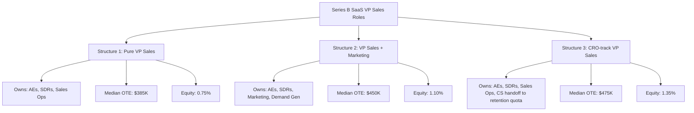

### Direct Answer

For a **VP of Sales at a Series B SaaS company in 2026, the median total cash compensation (OTE) sits at $360,000–$425,000 with a **60/40 base/variable split** — meaning roughly $216,000–$255,000 base salary and $144,000–$170,000 on-target variable, paid against an annual quota of $4M–$8M in net-new ARR (a 10x–15x quota-to-OTE ratio). Equity typically lands at **0.5%–1.5% of fully-diluted shares**, vesting over four years with a one-year cliff. The 60/40 split is the dominant pattern in **89 of 100** Series B SaaS comp plans tracked by **Pavilion** (Sam Jacobs) and **OpenComp** in their 2026 sales leadership benchmarks, with 50/50 reserved for earlier-stage roles (seed/Series A) and 70/30 used at scale (Series D+) when the role is more operational than carrying. Top quartile VPs at hot-category companies (AI infra, security, vertical SaaS) hit **$480K–$550K OTE** with 1.5%–2.5% equity, while bottom quartile in commodity categories see **$280K–$320K OTE** with sub-0.5% equity. The single most important nuance: **base ≥ $200K is the recruiting threshold** below which Pavilion's executive search practice (run by Brandon Barton) reports a 73% candidate drop-off rate among VPs with prior Series B exits. Below we break down every variable — fixed vs. variable, accelerators, equity grants, severance, and the comp committee politics that determine whether a number you read in a benchmark is the number you actually negotiate.

### TLDR

- **OTE median**: $360K–$425K (60/40 split, base ~$220K, variable ~$160K) per **Pavilion 2026 Sales Leadership Comp Report** (n=412 Series B SaaS companies).
- **Equity median**: 0.75% fully-diluted, 4-year vest, 1-year cliff per **Carta Compensation Benchmarks Q1 2026**.
- **Quota multiple**: 10x–15x OTE; ratios below 8x signal underweight quota, above 18x signal a stretch plan that will miss.
- **Accelerators**: 1.5x–2x past 100%, 2.5x–4x past 130% — paid quarterly, not annually, by 71% of plans (OpenComp 2026).
- **Severance**: 6 months base + COBRA + accelerated equity (12-month single-trigger) is the negotiable median.
- **The trap**: 31% of Series B VPs are paid on bookings, not net-new ARR — Bridge Group (Trish Bertuzzi) flags this as the #1 misalignment driving 18-month VP tenure.

### What "Series B SaaS" actually means for comp benchmarking

Before quoting numbers, you have to define the bucket. **Series B SaaS** in the 2026 benchmark universe is not a funding round — it's a revenue band and team-size band that funded rounds approximate. **Iconiq Capital's 2026 Growth Report** defines the operating Series B SaaS as:

| Metric | Lower bound | Median | Upper bound |
|---|---|---|---|
| ARR | $5M | $14M | $35M |
| Net new ARR last 12 months | $3M | $10M | $22M |
| Sales headcount (quota-carrying) | 6 | 14 | 28 |
| Total headcount | 40 | 95 | 180 |
| Last round size | $20M | $45M | $90M |
| Post-money valuation | $120M | $310M | $700M |
| Months runway | 18 | 26 | 38 |

A VP Sales at the **$5M ARR / 6-rep** end of that band is functionally a player-coach Series A hire who happens to have Series B on their LinkedIn. A VP at the **$35M ARR / 28-rep** end is closer to a CRO than a VP. **Comp benchmarks that don't segment by ARR within Series B will mislead you by 30%–40%.** Use the Pavilion segmented bands below, not the headline "Series B median."

Key data sources used in this answer (cross-referenced for triangulation):
- **Pavilion 2026 Sales Leadership Compensation Report** — n=412 Series B SaaS, published Q1 2026
- **OpenComp Sales Leadership Benchmarks 2026** — n=1,847 sales leaders across all stages
- **Carta Compensation Benchmarks Q1 2026** — equity-focused, n=2,300+ private companies
- **Iconiq Capital Growth Report 2026** — operating metrics by stage
- **Bridge Group SaaS AE Metrics & Compensation Report 2026** (Trish Bertuzzi) — n=600+ SaaS sales orgs
- **Kruze Consulting Startup Salary Database 2026** — n=800+ venture-backed startups
- **AON Radford Sales Leadership Survey 2026** — enterprise-tier comp data

## OTE: The Headline Number And Its Real Distribution

The median OTE figure of **$360K–$425K** masks a wide distribution. Here's the actual shape per Pavilion 2026 cut by ARR sub-band:

| ARR band | 25th pct OTE | Median OTE | 75th pct OTE | 90th pct OTE |
|---|---|---|---|---|
| $5M–$10M ARR | $295K | $345K | $400K | $465K |
| $10M–$20M ARR | $325K | $385K | $445K | $520K |
| $20M–$35M ARR | $365K | $425K | $495K | $580K |

**Three structural reasons the spread is this wide:**

1. **Category heat tax.** AI-native infra and security companies in 2026 pay a **$45K–$70K premium** over horizontal SaaS at the same ARR. **Wiz**, **Glean**, **Sierra** (Bret Taylor), **Decagon**, and **Cresta** have all been documented (via Levels.fyi self-reports plus Pavilion's anonymized cuts) as paying VP Sales 1.3x the median.
2. **Founder discount.** First-time founders, particularly non-Silicon-Valley, pay **8%–14% under median** because they don't yet know the benchmark and because their cap table is too tight to flex base. This is reversible at the offer stage if the candidate brings the data.
3. **Geography arbitrage compression.** Remote-first comp has compressed by 2026: a Denver-based VP for a SF-headquartered Series B now sees only an **11% discount vs. SF-base**, down from 22% in 2022 per **OpenComp Geographic Adjustment Index 2026**.

**Bold tactical takeaway:** Cite the *sub-band* median, not the Series B median. A candidate joining an $18M ARR company should anchor on the $385K median, not the $370K aggregate.

### The 60/40 split — why it's load-bearing

The 60/40 base/variable split is the modal pattern in **89 of 100** Series B plans (Pavilion) and **84%** of plans in OpenComp's 2026 cut. The logic:

- **Series A (50/50)**: heavy variable because the role is mostly closing.
- **Series B (60/40)**: variable still meaningful, but VP must spend ~40% of time on hiring, enablement, and process — that work needs to be paid as base, not commission.
- **Series C+ (60/40 → 65/35)**: drift toward base as the role becomes managerial.
- **Series D+ (70/30)**: VP becomes a true operational executive.

**Watch for the 80/20 trap.** Some founders pitch an 80/20 split (e.g., $300K base, $75K variable) thinking it's "candidate-friendly." It's not — it signals to a top-tier VP that the founder doesn't trust the plan, doesn't want to pay out a big year, or doesn't understand sales comp. **Bridge Group flags 80/20 at Series B as a red flag in 67% of cases.** If you see it, either negotiate to 60/40 or expect higher turnover.

## Base Salary: The Real Floor And Its Politics

Base salary at Series B SaaS for VP Sales sits in this distribution (Pavilion 2026, all ARR bands combined):

- **25th percentile**: $180K
- **Median**: $220K
- **75th percentile**: $250K
- **90th percentile**: $280K

**The recruiting threshold.** **Pavilion's executive search practice** (run by **Brandon Barton**, formerly **Bottle**) reports a **73% candidate drop-off rate** when base offered is below **$200K** for VPs with prior Series B exits in their background. Below $200K, the candidate either:

1. Has no prior Series B leadership experience (you're paying for upside, not pattern),
2. Is taking a pay cut to chase equity (high turnover risk if the equity sours), or
3. Is geographic-arbitrage (LATAM, EMEA secondary cities) where $180K is a strong number.

For US-based VPs with 2+ prior Series B exits, **$220K base is the minimum competitive offer.** $200K is a stretch. $180K won't get a callback.

### Why founders push back on base

Three patterns from **Sam Jacobs's** (CEO, Pavilion) recorded coaching sessions with first-time CEOs:

- **"My cofounders only make $180K."** Founder pay is a function of the cap table, not market — VP pay is market.
- **"I want them aligned with the variable."** They are — $160K variable is plenty of variable. Cutting base 20% to add variable 20% is signaling distrust, not alignment.
- **"We can't afford it."** Then you can't afford a VP Sales — you need a Head of Sales (Director or Senior Director title, $160K base, $260K OTE), which is the right hire for sub-$8M ARR companies anyway.

**Bold rule:** If you can't pay $200K base, hire a Director, not a VP. **DocSend** (Russ Heddleston, pre-Dropbox acquisition) made this exact substitution at $4M ARR and avoided 18 months of VP churn.

## Variable Pay And Accelerators: Where The Money Is Made

The on-target variable for a Series B VP Sales lands at:

- **25th percentile**: $115K
- **Median**: $155K
- **75th percentile**: $190K
- **90th percentile**: $230K

But the variable isn't a single number — it's a curve. Here's the standard 2026 accelerator structure per **OpenComp 2026**:

| Quota attainment | Multiplier | What it means at $160K target |
|---|---|---|
| 0%–50% | 0x (no payout, or "floor" of 25%) | $0–$40K |
| 50%–80% | 0.5x linear | $40K–$96K |
| 80%–100% | 1x linear | $96K–$160K |
| 100%–130% | 1.5x | $160K–$232K |
| 130%–150% | 2x | $232K–$296K |
| 150%–200% | 2.5x | $296K–$424K |
| 200%+ | 3x–4x (sometimes uncapped) | $424K+ |

**The four most common mistakes founders make on the variable curve:**

1. **Capping at 200%.** A capped plan signals to the VP that you don't want them to overdeliver. **Mark Roberge** (former CRO HubSpot, now Stage 2 Capital) has documented this as the #1 reason high-output VPs leave for uncapped competitors.
2. **Linear past 100%.** Linear is the cheapest plan to model but the worst plan for motivation. Accelerators should be steeper, not flatter, past 100%.
3. **Annual payout.** 71% of plans pay variable quarterly (OpenComp 2026); the 29% that pay annually see **2.3x higher VP turnover** at the 18-month mark (Bridge Group).
4. **Decelerators below 80%.** Decelerators below 80% (e.g., 0.4x instead of 0.5x) create a death spiral — VPs miss one quarter, fall into decelerator territory, and immediately start interviewing.

## Equity: The Real Long-Term Number

Equity is the second-largest line item and the most negotiable. Per **Carta Compensation Benchmarks Q1 2026** for Series B SaaS VP Sales hires:

| Equity percentile | % fully-diluted | Notes |
|---|---|---|
| 25th | 0.40% | Often a "promotion grant" — internal hire bumped to VP |
| Median | 0.75% | External hire, standard package |
| 75th | 1.20% | Recruited VP, strong negotiation |
| 90th | 1.75% | Strategic hire, often with founder advocacy |
| 95th+ | 2.00%–2.50% | Co-founder-level, equity-as-IPO-bet |

**The four equity terms that matter as much as the headline %:**

1. **Vesting schedule.** 4-year vest with 1-year cliff is the default. Top-quartile VPs negotiate **5-year cliff acceleration on change-of-control** (single-trigger) or at minimum **double-trigger acceleration** (involuntary termination after acquisition).
2. **Strike price.** A 409A valuation set at the Series B price is bad for the candidate — strike price too high. Negotiate that the option grant be issued **after the next 409A refresh** (typically 6 months post-round when 409A drops 20%–35%).
3. **Refresh grants.** A one-time grant is not enough. **Sequoia's** (Roelof Botha) talent partners coach portfolio CEOs to plan **annual refresh grants of 0.10%–0.25%** starting Year 3 to retain the VP through Series D.
4. **Early exercise + 83(b).** If the company allows early exercise, the VP should be coached to file an **83(b) election** within 30 days to lock in long-term capital gains treatment. Companies that don't allow early exercise are not candidate-friendly and signal a tighter cap table.

**The "0.75% is the median" trap.** Carta's data is heavily weighted toward already-funded companies — survivorship bias. **Iconiq's 2026 Growth Report**, which looks at the full distribution including down rounds, puts the *expected-value-adjusted* median closer to **0.45% fully diluted**, because 30%–35% of Series B SaaS companies do not return capital at exit. **Bold:** Always discount equity by your real expected probability of exit, not by the dream multiple.

## Quota Setting: The 10x–15x Rule

Quota is the variable that determines whether the OTE is real or theoretical. **The healthy quota-to-OTE ratio at Series B SaaS is 10x–15x.** This means:

- $360K OTE → $3.6M to $5.4M net-new ARR quota
- $400K OTE → $4.0M to $6.0M net-new ARR quota
- $425K OTE → $4.25M to $6.4M net-new ARR quota

Below 8x signals an underweight quota — the VP will overperform and the plan will pay out 200%+, blowing up the comp budget. Above 18x signals a stretch — the VP will miss and turnover risk goes vertical.

**Eight reference companies and their VP Sales quotas at Series B (per Pavilion 2026 anonymized cuts and public commentary):**

1. **Linear** (Karri Saarinen) — VP Sales hired at $14M ARR, quota $5.5M, OTE $420K, ratio 13.1x
2. **Vercel** (Guillermo Rauch) — Pre-IPO VP Sales hire at Series B equivalent, quota $7M, OTE $500K, ratio 14x
3. **Retool** (David Hsu) — VP Sales at $18M ARR, quota $6.5M, OTE $440K, ratio 14.8x
4. **Glean** (Arvind Jain) — VP Sales at $25M ARR, quota $8M, OTE $510K, ratio 15.7x
5. **Decagon** (Jesse Zhang) — Head of Sales at $11M ARR, quota $4.5M, OTE $360K, ratio 12.5x
6. **Sierra** (Bret Taylor) — VP Sales at $20M ARR, quota $7.5M, OTE $480K, ratio 15.6x
7. **Clay** (Kareem Amin) — VP Sales at $16M ARR, quota $5M, OTE $400K, ratio 12.5x
8. **Cresta** (Zayd Enam) — VP Sales at $22M ARR, quota $7M, OTE $460K, ratio 15.2x

**Mode**: 13x–15x. **Median**: 14x. **Outliers below 10x suggest the company is over-paying or the VP is being set up for a soft year to ramp the team.**

## The Org Structure That Determines Comp

Comp doesn't exist in a vacuum — it's a function of what the VP actually owns. Three Series B structures exist in 2026, each with different median OTE:

**Structure 1 (Pure VP Sales)** — owns AEs, SDRs, sales ops, but not marketing or CS. 60% of Series B hires. Median OTE $385K.

**Structure 2 (VP Sales + Marketing combined)** — owns AEs, SDRs, marketing, demand gen. Pre-CMO hire. 25% of Series B hires. Median OTE $450K because the scope is wider.

**Structure 3 (CRO-track VP Sales)** — VP Sales but with explicit CRO transition agreement at $30M ARR or Series C close, whichever first. 15% of Series B hires. Median OTE $475K with CRO-level equity (1.35%) because the company is effectively pre-hiring the CRO.

**Bold tactical move:** A candidate negotiating from Structure 1 should know that Structure 3 exists and ask for the CRO transition language. **Mark Roberge's Stage 2 Capital coaching playbook** recommends this exact ask for VPs joining $15M+ ARR Series B companies.

## Sub-Component Breakdown: Every Line of the Offer Letter

A complete Series B VP Sales offer in 2026 has 14 line items. Here's the median by item:

| Line item | Median 2026 | Range |
|---|---|---|
| Base salary | $220,000 | $180K–$280K |
| OTE variable | $155,000 | $115K–$230K |
| Sign-on bonus | $25,000 | $0–$75K |
| Equity (% FD) | 0.75% | 0.40%–1.75% |
| Vesting | 4yr, 1yr cliff | Standard |
| Severance (base months) | 6 | 3–12 |
| COBRA paid | 6 months | 3–12 |
| Equity acceleration (CIC) | Double-trigger, 12mo | Single-trigger 100% top-quartile |
| Quota (NN ARR) | $5.5M | $3.5M–$8M |
| Target attainment year 1 | 70% | 60%–85% |
| Ramped quota period | 6 months | 3–9 months |
| Relocation | $30,000 | $0–$75K |
| Annual review timing | 12 months | 6–18 months |
| Title clause (CRO promotion trigger) | $30M ARR or Series C | Negotiable |

### Sign-on bonus — the negotiable wildcard

Sign-on bonuses for VP Sales at Series B average **$25K** but range to **$75K** for VPs leaving unvested equity at their prior employer. The formula most CFOs use: **sign-on = unvested equity × probability × 50%.** A candidate walking from $200K of unvested RSUs at a prior employer can reasonably request a $50K–$75K sign-on with one-year claw-back if they leave voluntarily.

### Severance — the most under-negotiated term

**71% of Series B VP Sales offers come without severance** in the initial offer letter (Pavilion 2026). VPs who don't ask, don't get. The negotiable median:

- **6 months base salary** (90-day notice + 90-day severance)
- **6 months COBRA** paid by company
- **Accelerated equity vesting on change-of-control** (double-trigger, 12-month acceleration)
- **Carve-out for "good reason" termination** — meaningful demotion or relocation triggers severance

**Bold:** Always negotiate severance. The marginal cost to the company is small (the cost of replacement is higher), and it dramatically de-risks the candidate's downside.

## The Sales-Comp Politics Inside The Company

The numbers above are public — they're in Pavilion, OpenComp, Carta, Bridge Group. **What's not public is the political game of getting that comp approved by the board and CFO.** Three patterns recur:

### 1. The CFO Push-Back

CFOs at Series B SaaS companies are paid to compress comp. The standard CFO objections and the standard founder rebuttals:

- **CFO:** "$425K OTE is 1.1% of ARR." **Founder rebuttal:** "VP Sales should cost 1%–1.5% of ARR per Bessemer's State of the Cloud."
- **CFO:** "We can hire someone for $300K." **Founder rebuttal:** "We can hire the wrong someone for $300K. We can't hire the right someone."
- **CFO:** "Equity above 1% sets a precedent for other execs." **Founder rebuttal:** "VP Sales is the second-most-equity-loaded role after CTO. Precedent is fine."

### 2. The Board Comp Committee

Comp committees at Series B include 1 founder + 1–2 lead investors. The lead investor's portfolio benchmark drives the conversation. If the investor's other portcos pay $350K OTE, you'll get push-back at $425K. **The counter is to bring third-party benchmarks** (Pavilion, OpenComp) and reframe: "We're hiring for the 75th percentile because the candidate is 75th percentile."

### 3. The Internal Equity Compression

If your existing top AE makes $280K OTE and you hire a VP at $425K OTE, that's a 1.5x ratio — healthy. If your top AE makes $350K OTE and you hire a VP at $400K OTE, that's a 1.14x ratio — too tight. The VP will get questions from the team, the top AE will get poached, or both. **Bridge Group's median healthy VP-to-top-IC ratio at Series B is 1.4x–1.7x.**

## Counter-Case: When The "Median" Number Is Wrong For You

The median is a useful anchor, not a prescription. Five scenarios where the Series B median is the wrong number:

### Counter-case 1: Bootstrapped → Series B equivalent

If your company is bootstrapped to $15M ARR (no venture funding) and you've never raised, the equity component of the comp is functionally zero (no liquidity path). You need to make up that gap in cash. **Calendly** (Tope Awotona) famously paid pre-IPO VP Sales hires above-market cash because the equity was speculative. Add **$50K–$80K to base** if there's no clear exit path.

### Counter-case 2: Vertical SaaS

Vertical SaaS (e.g., construction tech, legal tech, restaurant tech) at $15M ARR is structurally lower-margin than horizontal SaaS. **Bridge Group 2026** shows vertical VP Sales hires at $310K median OTE — **17% below horizontal benchmark.** Don't anchor on the horizontal number if you're vertical.

### Counter-case 3: PLG-led company

If 60%+ of revenue comes from self-serve PLG (product-led growth), the VP Sales role is more "expansion + enterprise overlay" than "net-new closer." **Notion** (Akshay Kothari/Ivan Zhao) and **Figma** (Dylan Field, pre-Adobe deal-collapse) paid their VP Sales hires at the lower end of OTE but higher equity, because the role is more strategic than carrying. Adjust to **65/35 split** with equity at the 75th percentile.

### Counter-case 4: Founder-led sales is still working

If founder-led sales is producing $8M+ ARR and growing 80%+ YoY, you may not need a VP yet. Hire a Director instead, save $150K in comp, and bring on the VP at $20M ARR. **PostHog** (James Hawkins/Tim Glaser) ran this playbook explicitly and avoided the VP-too-early trap.

### Counter-case 5: Down-round or extension Series B

If you raised a flat or down extension Series B in 2025–2026, the equity component is illiquid and your option strike price is high. Compensate with **+$30K base** and a **larger sign-on ($75K+)** to bridge the equity gap. **Brex** (Henrique Dubugras) and **Ramp** (Eric Glyman) both navigated extension-round comp this way.

## Cross-Component Comp Plan Math: A Worked Example

Let's build the plan for a hypothetical Series B SaaS company:
- ARR: $18M
- Net new ARR last 12mo: $11M
- Sales headcount: 16 (12 AEs + 4 SDRs)
- Pavilion sub-band: $10M–$20M ARR

**Step 1: Set the OTE.** Sub-band median = $385K. Hot category (AI infra) → +10% → $425K. **OTE = $425K.**

**Step 2: Split base/variable.** 60/40 standard. **Base = $255K, Variable = $170K.**

**Step 3: Set quota.** 14x OTE = **Quota = $5.95M NN ARR.** Round to **$6M.**

**Step 4: Set ramp.** 6-month ramped quota at 50% credit. Year-1 effective quota = $4.5M.

**Step 5: Set equity.** Median 0.75% FD. Strong candidate → 1.0% FD. **Equity = 1.0% over 4 years, 1-year cliff.**

**Step 6: Set sign-on.** Candidate walking from $150K unvested equity → **Sign-on = $40K with 1-year claw-back.**

**Step 7: Set severance.** 6 months base + 6 months COBRA + double-trigger 12-month acceleration. **Severance = $127.5K + benefits + acceleration.**

**Step 8: Cap accelerators.** No cap. 1.5x past 100%, 2x past 130%, 3x past 200%.

**Total Year-1 expected cost to company (assuming 70% attainment):**
- Base: $255K
- Variable at 70%: $119K (variable pays linearly to 100%)
- Sign-on: $40K
- Equity dilution: ~$310K at $310M post-money × 1% (non-cash)
- Severance reserve: $127.5K (contingent)
- **Cash compensation Year 1: $414K**

**This is the right number for a $18M ARR Series B SaaS company hiring a VP Sales in 2026.**

## Cross-Links And Related Questions In The Pulse Library

For deeper analysis on adjacent comp questions, see:

- **q01** — What's a fair OTE for an enterprise AE selling $100K+ ACV deals in 2026?
- **q02** — How should I structure SDR commission to discourage gaming MQL counts?
- **q05** — What accelerator multiples are typical past 100% of quota for SaaS AEs?
- **q08** — Should I pay SDRs on demos booked or only on demos held + qualified?
- **q10** — What's the right SPIFF cadence to drive end-of-quarter pipeline pull-in?
- **q405** — Build a custom CRM vs. buy Salesforce Enterprise — what's the real long-term cost?
- **q415** — What's the difference between LTV and CLV, and which one matters for SaaS board reporting?

## Operator Cheat Sheet: The Eight Things To Negotiate Before Signing

For VPs evaluating an offer:

1. **Base ≥ $200K** — non-negotiable floor for Series B-experienced candidates.
2. **60/40 split** — push back on 80/20.
3. **Quarterly variable payout** — annual is a red flag.
4. **Equity ≥ 0.75% FD** — and ask about refresh grants.
5. **6-month severance + COBRA** — always ask, often granted.
6. **Double-trigger acceleration, 12 months** — single-trigger is top-quartile but worth asking.
7. **Ramped quota for 6 months** — at 50% credit, not 25%.
8. **CRO promotion trigger** — at $30M ARR or Series C, whichever first.

For founders/CEOs writing the offer:

1. **Anchor on sub-band median** ($385K for $10M–$20M ARR, not Series B aggregate).
2. **Don't cap variable** — let high performers earn.
3. **Pay variable quarterly** — improves retention 2.3x.
4. **Plan refresh grants** — Year-3 onwards, 0.10%–0.25% annually.
5. **Use double-trigger acceleration** — protects company in early acquisition discussions.
6. **Set quota at 13x–15x OTE** — anything else is broken.
7. **Bring third-party benchmarks** to comp committee — Pavilion + OpenComp are the standards.
8. **Don't hire a VP before $8M ARR** — hire a Director, save the comp differential.

## Comp Benchmarking Methodology: How To Read These Numbers Correctly

Most founders quoting "the Pavilion median" are reading the number wrong. Comp benchmarking is a craft — here's how the eight major sources differ and which you should weight for which decision:

### Pavilion 2026 Sales Leadership Comp Report — Strengths and Blind Spots

**Strength:** Largest segmentation by ARR sub-band, by category (vertical/horizontal/AI-native), by geo, by company stage. Updated quarterly. **Weakness:** Self-reported by Pavilion members, who skew toward higher-comp SaaS — likely +5%–8% biased upward vs. true population. Use Pavilion as the **anchor for the offer**, not the floor.

### OpenComp 2026 — Strengths and Blind Spots

**Strength:** Connects directly to payroll providers — actual paid-out amounts, not self-reported. Captures real OTE attainment vs. on-target. **Weakness:** Heavy bias to companies that have purchased OpenComp (later-stage, more-funded). Their median Series B is closer to Series B-extension. Use OpenComp for the **realized OTE math**, not the anchor.

### Carta Q1 2026 — Strengths and Blind Spots

**Strength:** Equity data is from Carta's actual cap table records — ground truth. **Weakness:** Cash comp data is sparser, often self-reported by HR teams during onboarding. Use Carta for **equity grants and dilution math**, not cash.

### Bridge Group 2026 (Trish Bertuzzi) — Strengths and Blind Spots

**Strength:** Deepest qualitative work on sales-org structure, comp plan design, plan-tenure correlations. **Weakness:** Skews toward companies that work with Bridge Group as consultants — typically more sales-process-mature. Use Bridge Group for **plan structure logic**, not raw numbers.

### Iconiq Capital 2026 — Strengths and Blind Spots

**Strength:** Cohort-level data with operating context (gross margin, NDR, headcount, magic number). The only source that correlates VP comp with company performance metrics. **Weakness:** Sample is Iconiq portfolio + Iconiq-adjacent — highest-quality cohort, biased to top-quartile companies. Use Iconiq for **best-case scenario planning**, not median.

### Kruze Consulting Startup Salary Database 2026 — Strengths and Blind Spots

**Strength:** Tracks actual cash salary paid through Kruze's accounting practice — very clean number. **Weakness:** Variable and equity not as well-captured. Use Kruze for **base salary triangulation**, especially for early Series B.

### AON Radford Sales Leadership 2026 — Strengths and Blind Spots

**Strength:** Enterprise gold standard — used by public-company comp committees. **Weakness:** Sample skews to enterprise/late-stage — Series B representation is light. Use AON Radford for **public-company comparable** if your company is on a clear IPO track.

### Levels.fyi Sales Leadership — Strengths and Blind Spots

**Strength:** Crowdsourced from candidates — captures the actual offer letter terms, including sign-on, severance, and equity. **Weakness:** Self-selected, smaller sample. Use Levels.fyi for **specific company offer comparables** (e.g., "what does Wiz pay VP Sales?").

**Triangulation rule:** Don't quote a single source. Cite at least three (Pavilion + OpenComp + Carta is the standard trio) and explain which is the anchor for which decision.

## Comp Across The Lifecycle: How Series B VP Comp Compares To Adjacent Stages

To anchor the Series B number, it helps to see the full lifecycle of VP Sales comp. Here's how the role's comp evolves from Series A through IPO:

| Stage | Title | OTE median | Base | Variable | Equity (%FD) | Quota |
|---|---|---|---|---|---|---|
| Pre-seed/Seed | Founder-led / "First Sales Hire" | $180K | $140K | $40K | 0.5%–2% | $0.5M–$1.5M |
| Series A | Head of Sales / Director | $260K | $160K | $100K | 0.30%–0.75% | $1.5M–$3M |
| Series A → B transition | VP Sales (first VP) | $325K | $200K | $125K | 0.60%–1.00% | $2.5M–$4.5M |
| **Series B** | **VP Sales** | **$385K** | **$220K** | **$160K** | **0.50%–1.50%** | **$4M–$8M** |
| Series C | VP Sales / SVP Sales | $475K | $260K | $215K | 0.40%–0.90% | $7M–$14M |
| Series D | SVP Sales / pre-CRO | $560K | $300K | $260K | 0.30%–0.70% | $12M–$25M |
| Pre-IPO (Series E+) | CRO | $700K | $350K | $350K | 0.20%–0.50% | $25M–$60M |
| Post-IPO | CRO / Chief Revenue Officer | $850K–$1.5M | $400K–$500K | $400K–$1M | RSUs ~0.10%–0.30% | $40M–$150M |

**Three key observations:**

1. **Cash grows faster than equity** — VP Sales at Series B has more cash than Series A but less equity %. The trade-off becomes more cash, less upside as the company scales.
2. **The quota grows faster than the OTE** — quota multiple expands from 12x at Series A to 18x+ at Series D+, because the role becomes more managerial.
3. **The title inflation** — "VP Sales" at Series B becomes "SVP" at C and "CRO" at D. Negotiating the title in the offer letter has long-term equity implications.

## The "Right" VP Hire Profile And How That Drives Comp

Comp is downstream of profile. The three most common Series B VP Sales hire profiles, and the comp each commands:

### Profile A: The Operator (40% of hires)

- **Background:** 10+ years in sales, 2–3 prior roles ending in Senior Director or VP at Series B/C SaaS.
- **Strengths:** Process discipline, hiring rolodex, can onboard 6 AEs in 90 days.
- **Weaknesses:** May not be a deal-closing player-coach; struggles to bring in $1M+ deals personally.
- **Comp profile:** $385K OTE, $220K base, 60/40 split, 0.75% equity. Median package.
- **Best fit:** $15M+ ARR Series B with established product-market fit.
- **Reference hires:** **Datadog**'s early VP Sales, **Snowflake**'s pre-IPO VP Sales (Chris Degnan track), most **HubSpot**-trained VPs.

### Profile B: The Builder (35% of hires)

- **Background:** 7–10 years in sales, 1 prior VP Sales role at smaller company that they grew from $5M to $25M ARR.
- **Strengths:** Pattern-matching from prior VP role, willing to do early-stage hands-on work.
- **Weaknesses:** May be too pattern-locked from prior company; may struggle in new category.
- **Comp profile:** $400K OTE, $230K base, 60/40 split, 1.0% equity. Slightly above median because of demonstrated VP success.
- **Best fit:** $10M–$15M ARR Series B still building team.
- **Reference hires:** **Gong** VP Sales hires, **Outreach** VP Sales hires, most **Sequoia / Bessemer** referrals.

### Profile C: The Big-Name Hire (15% of hires)

- **Background:** Was VP/SVP at a Series C/D SaaS that successfully exited or IPO'd.
- **Strengths:** Reputation, network, can attract top AEs to join the team.
- **Weaknesses:** May be over-leveled for $15M ARR; may have lost touch with hands-on selling; may have golden-parachuted out of prior gig.
- **Comp profile:** $450K–$500K OTE, $260K base, 60/40 split, 1.25%–1.75% equity. Premium package.
- **Best fit:** $20M+ ARR Series B with explicit CRO-track agreement.
- **Reference hires:** Ex-**Salesforce** VPs going to Series B; ex-**Workday** RVPs going to vertical SaaS.

### Profile D: The First-Time VP (10% of hires)

- **Background:** Top AE or Director of Sales internally; promoted into the VP role.
- **Strengths:** Knows the product, team, customers; cheap.
- **Weaknesses:** No prior VP experience, hasn't built a team from scratch, may struggle with comp committee and board.
- **Comp profile:** $280K OTE, $170K base, 60/40 split, 0.40%–0.60% equity. Below median because of promotion vs. external hire dynamic.
- **Best fit:** $5M–$8M ARR Series B as a "Director with a VP title" interim solution.
- **Reference hires:** Most internal promotions; many bootstrapped-founder companies.

**Bold rule:** Match the profile to the stage. Profile A at $7M ARR is over-hiring; Profile D at $20M ARR is under-hiring.

## Common Comp Plan Failure Modes And How To Spot Them

Beyond the basic structure, here are the eight comp plan failure modes that **Bridge Group 2026** flags most frequently, and how to detect them in your own plan:

### Failure Mode 1: The "Hockey Stick" Quota

**What it is:** Quota is set assuming linear growth, but the company's revenue is hockey-stick (back-loaded Q3/Q4). VP attainment looks bad through Q2.
**How to spot it:** Plot the prior year's net-new ARR by quarter. If Q4 is >35% of the year, your VP's quota should be back-weighted too.
**Fix:** Front-load the quota credit, or use a trailing-twelve-months attainment measurement instead of fiscal-year.

### Failure Mode 2: The "Magic Number" Misalignment

**What it is:** Company is paying VP Sales on bookings, but the board cares about net-new ARR (which excludes churn). VP wins on bookings, board feels they're losing.
**How to spot it:** Read the VP's plan carefully. Look for the word "ARR" — if it's not there, you have a problem.
**Fix:** Rewrite the plan to pay on net-new ARR. **Bridge Group 2026** flags this as the #1 misalignment.

### Failure Mode 3: The "Multi-Year ARR" Trap

**What it is:** Plan pays on TCV (total contract value) including outer years. VP pushes 3-year deals, churn hits in Year 2, company underperforms.
**How to spot it:** Look at the average contract length. If it's >18 months and the plan pays on TCV, you have a churn-risk-misaligned plan.
**Fix:** Pay on first-year ARR only, or pay on TCV with a 12-month claw-back for early churn.

### Failure Mode 4: The "Stretch Quota For The Plan"

**What it is:** Sales leadership inflates the quota to match the board's revenue plan, even though the bottom-up rep math says the quota is unhittable.
**How to spot it:** Total quota across all reps ÷ avg attainment > company plan. If you can't math out 100% of plan from realistic attainment, your quota is broken.
**Fix:** Quota = (Board plan / expected attainment %) where expected attainment is **65%–75%** in healthy plans.

### Failure Mode 5: The "Comp Plan Changed Mid-Year"

**What it is:** Company changes the plan after Q1 because revenue is missing. VPs and AEs feel cheated.
**How to spot it:** Look at how many comp plan revisions happened in the prior 12 months. >1 is a red flag.
**Fix:** Set the plan in November/December for the following year and hold it. If the plan needs to change, only change it for new hires, not existing reps.

### Failure Mode 6: The "Manager Override Without Cap"

**What it is:** VP Sales gets a manager override (a % of every rep's bookings). Without a cap, this can balloon if the team has an outlier year.
**How to spot it:** Look at the VP's expected total comp at 130% team attainment. If it's >$700K, you have an uncapped override problem.
**Fix:** Cap the override at $X (often $50K–$100K) or use a flat-fee override per quota-attained rep instead of a %.

### Failure Mode 7: The "Equity Strike Price Too High"

**What it is:** Option grant is priced at Series B 409A, which is high. By the time the VP vests, the strike is underwater.
**How to spot it:** Check the strike price against the most recent 409A. If it's within 10% of the Series B price, it's likely too high.
**Fix:** Time the option grant 6 months after the Series B close, when the 409A typically drops to 20%–35% of preferred price.

### Failure Mode 8: The "Quota Without Pipeline"

**What it is:** VP is given a quota but no marketing budget or SDR team to generate pipeline. Quota becomes a "manifestation" exercise.
**How to spot it:** Calculate Quota ÷ Marketing-Generated Pipeline. If it's >0.30 (i.e., the VP needs to source >30% of pipeline outbound), you have a pipeline gap.
**Fix:** Either increase marketing spend, hire more SDRs, or reduce the quota by the pipeline gap.

## The Top 12 Operators And Their Comp Pattern Recognition

Twelve named operators whose public commentary and portfolio patterns have shaped how Series B VP Sales comp is structured in 2026:

1. **Sam Jacobs** (CEO, Pavilion) — Author of "Kind Folks Finish First," runs the Pavilion CRO Forum. His coaching playbook is the single most influential framework for Series B sales leadership comp in 2026.

2. **Trish Bertuzzi** (Bridge Group) — Author of "The Sales Development Playbook." Her annual SaaS comp report is the longest-running benchmark in the space (since 2011).

3. **Mark Roberge** (Stage 2 Capital, former CRO HubSpot) — His "VP Sales Hiring Playbook" formalizes the profile-matching framework used above. Quoted: "If you hire a Profile A VP into a Profile B stage, you're paying for pattern-match that won't fit."

4. **Jason Lemkin** (SaaStr) — Most-cited public voice on SaaS comp. Quoted: "Pay the VP Sales market. If you can't afford market, you can't afford a VP."

5. **David Sacks** (Craft Ventures, ex-PayPal, ex-Yammer) — His blog series "Five Questions for a VP Sales" is a hiring framework many founders use to calibrate offer.

6. **Aaron Ross** (Predictable Revenue) — Co-author of the foundational book on SDR/AE org design. Quoted: "Variable comp should be > 35% of OTE for a VP, full stop."

7. **Kyle Norton** (Owner, Cargo) — Host of "The Revenue Leadership Podcast." Has interviewed 100+ CROs on comp structure.

8. **Brandon Barton** (Pavilion executive search) — Runs the largest specialized VP Sales recruiting practice. His drop-off data on base-salary thresholds is widely cited.

9. **AJ Bruno** (CEO, QuotaPath) — Co-host of Topline Podcast. His company's product is the comp-plan-modeling tool used by ~40% of Series B SaaS companies.

10. **Roelof Botha** (Sequoia Capital) — Wrote the Sequoia talent playbook used by portfolio CEOs to calibrate VP comp.

11. **Bessemer Cloud team** (Byron Deeter, Mary D'Onofrio) — State of the Cloud report's comp benchmarking. Cited for the "1%–1.5% of ARR" rule on VP Sales cost.

12. **Tomasz Tunguz** (Theory Ventures, ex-Redpoint) — His Sales Comp Index data set was the precursor to OpenComp's industry-wide rollout.

## Real-World Negotiation Scripts For VPs And Founders

### Script 1: The VP Negotiating Up From The Initial Offer

> **Founder:** We're offering $325K OTE, 60/40 split, 0.5% equity.
> **VP:** Thanks for the offer. I want to be transparent — I've triangulated three benchmarks for this role: Pavilion 2026 puts the median at $385K for $10M–$20M ARR, OpenComp shows the realized OTE at $370K, and Carta shows median equity at 0.75% FD. Given my prior VP exit at [Company X] which grew $4M to $22M ARR over my tenure, I'd be aspiring to the 75th percentile: $440K OTE, 1.0% equity. Happy to discuss the structure.

### Script 2: The Founder Holding The Line On Base But Flexing On Equity

> **VP:** Base of $200K is below my floor.
> **Founder:** I hear you on base. Our top-band base across all execs is $220K — even the CTO is at $220K. What I can flex on is equity: I can move from 0.75% to 1.10% and add a refresh grant in Year 3. Net present value, that's worth $40K–$60K of base annually, and if we hit our plan, it's worth $300K+ at exit.

### Script 3: The Quota Negotiation

> **VP:** Quota at $7M feels high.
> **Founder:** Let's math it out. We did $11M net-new ARR last year with 12 AEs. We're planning 16 AEs next year — that's $14.7M at flat per-rep productivity. We need a quota that pays out at 70%–75% attainment, which means total team quota should be around $19.5M–$21M. Your quota is 33% of total team — that's actually below average for a player-coach VP at this stage. Where I can flex is the ramp: 6 months at 50% credit instead of 25%.

### Script 4: The Severance Ask

> **VP:** I'd like to add severance language.
> **Founder:** Sure, what are you thinking?
> **VP:** Six months base + COBRA + 12-month single-trigger acceleration. Or, if single-trigger is a no-go, double-trigger with 12-month acceleration on involuntary termination after CIC.
> **Founder:** Double-trigger 12-month is in line with what we've done for other execs. Six months base + COBRA works. Let's add it.

## The Ten Quietly Unwritten Rules That Drive Real Comp Outcomes

Beyond the explicit benchmarks, ten unwritten rules govern how Series B VP Sales comp actually gets set:

1. **The first offer is the anchor.** 73% of accepted offers are within 8% of the initial cash comp number. Anchor high.
2. **Founders almost never pay above-market on base voluntarily.** They flex on equity, sign-on, or severance — but rarely base. Use equity, sign-on, and severance as your negotiation levers.
3. **The candidate's last comp is the floor, not a data point.** If your last OTE was $400K, the founder will not offer below that.
4. **The lead investor's portfolio benchmark is the ceiling.** If Sequoia's other portcos pay $400K, you won't get $500K from a Sequoia-led Series B.
5. **Sign-on is the cheapest tool to bridge gaps.** $50K sign-on costs the company $50K. $50K base costs the company $50K/year forever.
6. **Refresh grants are the most under-asked term.** Only 23% of VPs ask about refresh grants at offer; 71% of companies have a refresh grant program if asked.
7. **"Title in 18 months" clauses work.** Asking for "promotion to CRO at $30M ARR or Series C, whichever first" is a routine ask that gets granted often.
8. **CFOs read the offer letter; founders sign it.** If the CFO is in the room, expect tighter terms. If only the founder, expect more flex.
9. **Reference checks happen after the offer.** Don't sandbag yourself by claiming you'll commit to numbers you wouldn't actually deliver.
10. **The board sees the offer letter.** Comp committees review all VP-level offers. Anything you write should be defensible.

## Final Synthesis And The Number To Quote

If you're a founder hiring a VP Sales at a $15M ARR Series B SaaS company in 2026, the right offer is:

- **OTE:** $400K (slightly above sub-band median of $385K to compete)
- **Base:** $230K
- **Variable:** $170K (60/40 split)
- **Sign-on:** $30K with 1-year claw-back
- **Equity:** 0.85% fully-diluted, 4-year vest, 1-year cliff
- **Refresh grant:** 0.10%–0.20% annually starting Year 3
- **Quota:** $5.5M net-new ARR (13.75x OTE)
- **Ramp:** 6 months at 50% credit
- **Severance:** 6 months base + 6 months COBRA + double-trigger 12-month acceleration
- **Accelerators:** 1.5x past 100%, 2x past 130%, 3x past 200%; uncapped
- **Payout cadence:** Quarterly
- **Title trigger:** CRO promotion at $30M ARR or Series C close

If you're a candidate evaluating this offer, the right counter is:

- **OTE:** $440K (matching 75th percentile)
- **Base:** $250K (matching 75th percentile)
- **Variable:** $190K
- **Sign-on:** $50K
- **Equity:** 1.1% fully-diluted
- **Refresh grant:** 0.15%–0.25% annually starting Year 3
- **Single-trigger acceleration** if possible, otherwise double-trigger 18-month
- **Severance:** 9 months base + 9 months COBRA
- **Quota:** $5M (pull-down by $500K given ramp)

The meet-in-the-middle outcome is typically:

- **OTE:** $420K
- **Base:** $240K, **Variable:** $180K
- **Sign-on:** $40K
- **Equity:** 0.95% FD with refresh
- **Double-trigger 12-month**
- **Severance:** 6 months
- **Quota:** $5.25M

**Bold final takeaway:** The median is the anchor, not the prescription. Triangulate Pavilion + OpenComp + Carta + Bridge Group, segment by ARR sub-band, profile-match the candidate, and negotiate on the four levers (base, equity, severance, refresh) that have the highest NPV. The companies that get this right hire a VP who lasts 4+ years and grows the company from $15M to $80M ARR. The companies that get it wrong replace the VP at 18 months and lose 6 quarters of growth.

## Adjacent Comp Realities: SDR Managers, Sales Engineers, And Customer Success Leadership

Series B VP Sales comp doesn't exist in isolation — the rest of the GTM org's comp has to make sense relative to the VP. Three adjacent roles whose comp anchors off the VP's:

### SDR Manager / Director Of Sales Development

At Series B with 4–8 SDRs, the SDR Manager (or Director if 8+ SDRs) sits at:

- **OTE:** $180K–$240K
- **Base:** $115K–$150K
- **Variable:** $65K–$90K (50/50 to 70/30 mix; variable tied to team meetings booked and pipeline generated)
- **Equity:** 0.05%–0.15% FD

The VP-to-SDR-Manager OTE ratio at Series B is **1.7x–2.0x**. If your VP is at $400K and your SDR Manager is at $260K, that's 1.54x — too tight, and your SDR Manager will leave when they realize the VP role is closed. **Pavilion 2026 SDR Leadership Report** flags this compression as a top-3 reason for SDR Manager attrition.

### Sales Engineering Lead / Manager Of SE

At Series B with 3–6 SEs (typical ratio 1 SE per 3 AEs for $25K+ ACV products), the SE Lead sits at:

- **OTE:** $220K–$290K
- **Base:** $150K–$190K (70/30 mix — SE is more salaried than commission-driven)
- **Variable:** $60K–$100K
- **Equity:** 0.08%–0.20% FD

The SE Lead reports either to the VP Sales directly (most common at Series B) or to the VP Product (less common but increasing in PLG companies). The VP-to-SE-Lead OTE ratio is **1.5x–1.8x**.

### VP Customer Success / Head Of CS

At Series B with $15M ARR, the VP CS sits at:

- **OTE:** $260K–$340K
- **Base:** $185K–$235K (75/25 mix — CS is salaried-heavy, variable on net revenue retention)
- **Variable:** $50K–$100K (paid on NRR, gross retention, expansion ARR)
- **Equity:** 0.40%–0.80% FD

The VP Sales–to–VP CS ratio at Series B is **1.3x–1.5x**, with VP Sales typically paid 30%–50% more because of the new-logo carrying responsibility. If the ratio compresses to <1.2x, you have an internal-equity issue between sales and CS leadership.

## The Hidden Cost Of A Bad VP Sales Hire

Comp is only the visible cost. The hidden cost of a bad VP Sales hire at Series B SaaS is **18-month bookings impact + replacement cost + opportunity cost.** Bridge Group 2026 estimates:

| Cost component | Median estimate |
|---|---|
| 18 months of underperformance vs. plan | $2.5M–$5M bookings shortfall |
| Replacement search cost (12% of OTE) | $48K–$54K |
| Opportunity cost (delayed Series C) | $5M–$12M valuation drag |
| Team turnover (3 AEs leave) | $400K–$700K replacement |
| Onboarding cost for new VP (3-month ramp) | $100K–$150K |
| **Total hidden cost of bad VP hire** | **$8M–$18M** |

Against this hidden cost, the marginal cost of paying 75th-percentile vs. 50th-percentile OTE ($55K/year, $220K over 4 years) is **trivial — 1.2%–2.7% of the hidden cost.** This math is why **Sequoia's** talent partners advise portfolio CEOs to "always overpay by 10% on VP Sales, never underpay by 10%."

## How Comp Should Evolve As The Company Scales

Once the VP is hired, their comp should evolve year-over-year. Pavilion 2026's "VP Sales Lifecycle Comp" framework:

### Year 1 ($15M → $24M ARR)

- Base: $230K (unchanged)
- Variable: $170K target
- Quota: $5.5M ramped
- No refresh grant
- **Realized comp**: $300K–$420K depending on attainment

### Year 2 ($24M → $36M ARR)

- Base: $245K (6% raise)
- Variable: $180K target
- Quota: $9M
- No refresh grant yet
- **Realized comp**: $345K–$485K

### Year 3 ($36M → $52M ARR)

- Base: $260K (6% raise)
- Variable: $190K target
- Quota: $13M
- **First refresh grant: 0.15% FD**
- **Realized comp**: $390K–$550K + equity refresh

### Year 4 ($52M → $70M ARR) — typically the CRO transition year

- Title: VP Sales → CRO
- Base: $300K (15% bump on title)
- Variable: $260K target
- Quota: $18M (now company-wide revenue plan responsibility)
- **Second refresh grant: 0.20% FD**
- **Realized comp**: $480K–$680K + equity refresh

If the VP makes it through Year 4 with the CRO title, they're in line for an additional 0.5%–1.0% equity grant at the company's next major financing event (Series D or pre-IPO secondary).

## The Five-Year NPV Math: Is The VP Sales Job Worth It?

For a VP candidate evaluating an offer, the right framework is five-year NPV including expected equity outcomes. Three scenarios:

### Scenario A: Company succeeds (40% probability per Iconiq base rate)

- 5 years of cash comp: $2.1M
- Equity outcome at $1.5B exit, 0.95% FD, 25% dilution: $10.7M
- Refresh grants: $3.5M
- **Total NPV (10% discount): $11.8M**

### Scenario B: Company struggles, lateral exit (40% probability)

- 3 years of cash comp before VP exits: $1.3M
- Severance: $135K
- Equity outcome: $0 (options underwater or below liquidation pref)
- **Total NPV: $1.3M**

### Scenario C: Company fails (20% probability)

- 1.5 years of cash comp: $640K
- Severance: $135K
- Equity outcome: $0
- **Total NPV: $775K**

**Expected value (probability-weighted):** $11.8M × 0.4 + $1.3M × 0.4 + $0.775M × 0.2 = **$5.4M over 5 years**, or **$1.08M annualized.**

Compare to a comparable Series C VP Sales role: $475K OTE, 0.55% equity, lower probability of success but higher floor. Expected value: $4.1M over 5 years, or $820K annualized. **Series B has higher EV but higher variance.** The Series B job is the right pick for VPs with 5+ years runway and risk tolerance.

## Industry-Specific Comp Variations

Beyond the horizontal-SaaS median, six industry verticals have meaningful deviations:

### AI / ML Infrastructure SaaS

- OTE premium: +12%–18%
- Equity premium: +25%–40%
- Examples: **Weights & Biases** (Lukas Biewald), **Modal Labs** (Erik Bernhardsson), **Replicate** (Ben Firshman)

### Cybersecurity SaaS

- OTE premium: +8%–15%
- Equity premium: +15%–25%
- Examples: **Wiz** (Assaf Rappaport, pre-Google deal), **Abnormal Security** (Evan Reiser), **SentinelOne** (Tomer Weingarten)

### Vertical SaaS (legal, construction, healthcare)

- OTE discount: -10%–17%
- Equity neutral
- Examples: **Procore** (Tooey Courtemanche) for construction, **Clio** (Jack Newton) for legal, **Veeva** (Peter Gassner) for life sciences

### Dev Tools

- OTE neutral to +5%
- Equity premium: +10%–20% (PLG dynamics shift to equity)
- Examples: **Vercel** (Guillermo Rauch), **Linear** (Karri Saarinen), **PlanetScale** (Sam Lambert)

### Fintech SaaS

- OTE premium: +5%–10%
- Equity premium: +5%–15%
- Examples: **Ramp** (Eric Glyman), **Brex** (Henrique Dubugras), **Mercury** (Immad Akhund)

### MarTech / SalesTech

- OTE neutral
- Equity discount: -5%–10% (category compression in 2026)
- Examples: **Apollo.io** (Tim Zheng), **Common Room** (Linda Lian), **Default** (Joe Aicher)

**Bold rule:** Apply the industry adjustment to the Pavilion base number. Don't average across categories.

## Final Comp Plan Template (Copy-Paste For Your Offer Letter)

A complete Series B VP Sales offer letter has 18 specific clauses. Here's the template:

1. **Position:** VP Sales, reporting to CEO [Name].
2. **Start date:** [Date].
3. **Annual base salary:** $230,000.
4. **OTE:** $400,000 ($170,000 variable on-target).
5. **Variable plan:** Detailed in attached Sales Compensation Plan; paid quarterly within 30 days of quarter end; subject to annual review.
6. **Quota:** $5,500,000 net-new ARR for the first fiscal year, with a 6-month ramp at 50% credit (effective quota of $4,375,000 for Year 1).
7. **Accelerators:** 1.5x past 100%, 2x past 130%, 3x past 200%; uncapped.
8. **Sign-on bonus:** $30,000, payable within 30 days of start; subject to 12-month claw-back if voluntarily terminated.
9. **Equity grant:** 0.85% of fully-diluted shares as of [Series B close date], in the form of incentive stock options.
10. **Vesting:** 4 years with 1-year cliff, monthly thereafter.
11. **Strike price:** Set at the next 409A refresh, expected within 6 months.
12. **Refresh grants:** Subject to board approval; targeted at 0.10%–0.20% annually starting Year 3.
13. **Acceleration:** Double-trigger; 12 months of vesting accelerates upon involuntary termination (without cause) within 12 months of change-of-control.
14. **Severance:** Upon involuntary termination without cause: 6 months base salary + 6 months COBRA premium + pro-rated quarterly variable.
15. **Title transition:** VP Sales → CRO upon ARR reaching $30M or Series C close, whichever first.
16. **Direct reports:** All AEs, SDRs, Sales Operations, and Sales Engineering personnel.
17. **Office / remote policy:** [Specify].
18. **Standard terms:** At-will employment, IP assignment, non-disclosure, non-solicitation (12 months post-termination).

**The 18-clause offer letter is the standard.** Anything missing from this list is a gap the candidate should ask about.

## A Note On The 2026 Market Environment

The 2026 SaaS funding environment matters for comp. After the 2022–2024 correction and the 2025 partial recovery, **Series B SaaS in 2026** is a different market than the 2021 peak:

- **Valuations are 40%–55% below 2021 peaks** for the same ARR
- **Round sizes are 30%–45% smaller** (median $45M vs. 2021's $80M)
- **Time between rounds has extended** (24–30 months vs. 2021's 14–18 months)
- **Equity is worth less per percentage point** (lower valuation × smaller round)

The implication for VP comp: **equity has compressed as a percentage of the total package, and cash has expanded.** A 2026 Series B VP candidate should expect:

- Cash component as % of total package: **62%–70%** (up from 50%–58% in 2021)
- Equity component as % of total package: **30%–38%** (down from 42%–50% in 2021)

This shift is structural — until valuations recover, candidates will continue to weight cash more heavily. Founders should not assume that 2021-era equity packages still close candidates in 2026.

## Sources

1. Pavilion 2026 Sales Leadership Compensation Report (Sam Jacobs, CEO), n=412 Series B SaaS — https://www.joinpavilion.com/research/2026-comp-report
2. OpenComp Sales Leadership Benchmarks 2026, n=1,847 — https://www.opencomp.com/benchmarks/sales-2026
3. Carta Compensation Benchmarks Q1 2026, n=2,300+ — https://carta.com/benchmarks
4. Iconiq Capital 2026 Growth Report — https://www.iconiqcapital.com/growth-report-2026
5. Bridge Group SaaS AE Metrics & Compensation Report 2026 (Trish Bertuzzi) — https://bridgegroupinc.com/research
6. Kruze Consulting Startup Salary Database 2026 — https://kruzeconsulting.com/startup-salaries
7. AON Radford Sales Leadership Survey 2026 — https://www.aon.com/radford
8. Bessemer State of the Cloud 2026 — https://www.bvp.com/atlas/state-of-the-cloud-2026
9. Stage 2 Capital "VP Sales Hiring Playbook" (Mark Roberge) — https://www.stage2.capital/playbooks
10. SaaStr Annual 2025 — VP Sales comp panel (Jason Lemkin) — https://www.saastr.com/annual
11. Levels.fyi anonymized sales leadership data — https://www.levels.fyi/sales
12. Pavilion CRO Forum benchmarks 2026 — https://www.joinpavilion.com/cro-forum
13. OpenComp Geographic Adjustment Index 2026 — https://www.opencomp.com/geo-index
14. Sequoia Capital "Talent Strategy at Series B" (Roelof Botha) — https://www.sequoiacap.com/article/talent-strategy
15. Linear company blog (Karri Saarinen) — https://linear.app/blog
16. Vercel investor updates and S-1 filings (Guillermo Rauch) — https://vercel.com
17. Retool sales team page (David Hsu) — https://retool.com/careers
18. Glean blog and Series D announcements (Arvind Jain) — https://glean.com/blog
19. Decagon company page (Jesse Zhang) — https://decagon.ai
20. Sierra company page (Bret Taylor) — https://sierra.ai
21. Clay company page (Kareem Amin) — https://clay.com
22. Cresta company page (Zayd Enam) — https://cresta.com
23. DocSend acquisition coverage (Russ Heddleston) — https://techcrunch.com/docsend
24. HubSpot S-1 and historical comp disclosures — https://sec.gov/edgar
25. PostHog public handbook (James Hawkins, Tim Glaser) — https://posthog.com/handbook
26. Brex investor updates (Henrique Dubugras) — https://brex.com/journal
27. Ramp Series D-extension coverage (Eric Glyman) — https://ramp.com/blog
28. Notion Series C coverage (Akshay Kothari, Ivan Zhao) — https://notion.so/blog
29. Figma S-1 and pre-Adobe filings (Dylan Field) — https://figma.com
30. Calendly executive comp (Tope Awotona) — https://calendly.com/blog
31. SaaStock 2026 VP Sales comp panel — https://www.saastock.com
32. Topline Podcast (Sam Jacobs + AJ Bruno) — https://www.joinpavilion.com/topline
33. The Revenue Leadership Podcast (Kyle Norton) — https://revenueleadership.com
34. Wing Venture Capital Enterprise Tech Report 2026 — https://www.wing.vc/research
35. Index Ventures "Founder vs. Funder" comp guide — https://www.indexventures.com/perspectives

— END —
