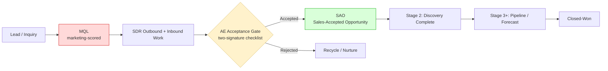
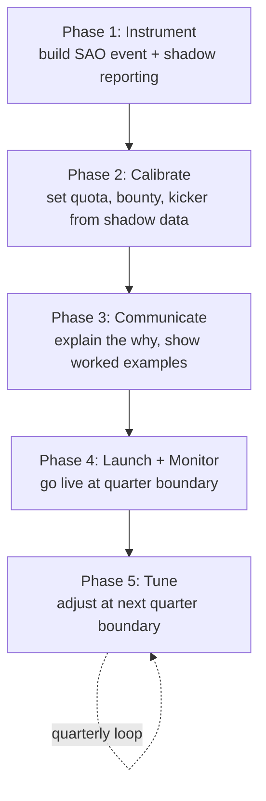

### Direct Answer

**Stop paying SDRs on MQL volume. Pay them on Sales-Accepted Opportunities (SAOs) that survive an AE acceptance gate, then claw back any opportunity that an AE disqualifies within a defined window.** MQL count is an *activity proxy*, and the moment money is attached to a proxy, the proxy stops measuring what you care about. This is Goodhart's Law operating on your pipeline: "When a measure becomes a target, it ceases to be a good measure." The fix is not a better MQL definition or a stricter scoring model. The fix is to **move the paid unit one stage downstream**, to a point where a second party with opposing incentives (the AE) has to agree the work was real. Concretely, in 2026 a defensible SDR plan pays roughly **60-65% base / 35-40% variable**, with the variable split into a **per-SAO bounty (about 70% of variable)** and a **quarterly quality/conversion kicker (about 30%)**, governed by a 10-15 business-day clawback window and an AE-acceptance SLA. That structure makes gaming mathematically unprofitable for the rep: a junk lead earns a small bounty now and erases it 12 days later, while costing the rep the relationship capital they need from the AE on the *next* handoff.

---

### TL;DR

- **Never attach commission to MQL count.** MQLs are a marketing-controlled, rep-influenceable proxy. Paying on them guarantees inflation. This is the single most common comp design error in B2B sales development.
- **Pay on SAOs (Sales-Accepted Opportunities)**, defined by a written, two-signature acceptance gate where the AE must affirmatively accept the opportunity against explicit criteria (budget signal, authority, identified pain, plausible timeline, ICP fit).
- **Use a clawback window of 10-15 business days.** If the AE disqualifies the opportunity inside the window for a quality reason, the SDR's bounty reverses. This converts "spray and pray" from a winning strategy into a losing one.
- **Add a quarterly quality kicker** worth ~30% of variable, gated on **SAO-to-Stage-2 conversion rate** (or SAO-to-pipeline-dollars), so reps are rewarded for opportunities that actually advance, not just opportunities that are accepted.
- **Hold the AE accountable too.** Asymmetric accountability (SDR punished, AE not) is the second-most-common failure. AEs get an acceptance SLA and a "frivolous rejection" audit so they cannot reject good leads to dodge activity.
- **Benchmark structure: ~62/38 base/variable**, $70k-$95k OTE for a mid-market SDR in a US metro in 2026, with accelerators above 100% of SAO quota and a capacity-based quota of 12-22 SAOs/month depending on motion.
- **Govern the definition centrally.** RevOps owns the SAO criteria, the dispute process, and the monthly Goodhart audit. Marketing and sales do not get to quietly redefine the unit mid-quarter.
- **Counter-case:** in a brand-new motion with no AE bench and no conversion data, a short-term meeting-held bounty can be acceptable for one or two quarters as a bootstrapping measure, provided you instrument the downstream funnel from day one and migrate off it on a published date.

---

## 1. Why Paying On MQL Counts Always Fails: The Goodhart Mechanism

The question "how should I structure SDR commission to discourage gaming MQL counts" contains a hidden assumption worth surfacing: that gaming is a discipline problem you can police. It is not. It is a **design problem you have already created** by attaching money to the wrong unit. Once you see that clearly, the solution stops being "catch the cheaters" and becomes "stop paying for the thing that is trivially fakeable."

**Goodhart's Law**, in its sharpest formulation by anthropologist Marilyn Strathern, states: *"When a measure becomes a target, it ceases to be a good measure."* The MQL was invented as a *diagnostic* — a way for marketing to estimate how many leads were warm enough to merit human follow-up. As a diagnostic it is fine. The catastrophe begins the instant you write a comp plan that says "the SDR earns $X per MQL generated" or, slightly more subtly, "per meeting that converts to MQL." You have now told a rational, financially-motivated human being that their income is a direct function of a number they can heavily influence and that no opposing party has to validate.

Here is the mechanism in concrete steps:

1. **The proxy is rep-influenceable.** An SDR can book a "meeting" with a low-intent contact, mark a discovery call as a qualified hand-off, or push a lead over a lead-score threshold by logging a few activities. None of this requires fraud — it requires only optimism, and optimism is free.
2. **There is no opposing signature at the MQL stage.** Marketing scores the lead. The SDR works the lead. Both parties *benefit* from the MQL count going up. Nobody at the MQL stage has an incentive to say "no."
3. **The cost of a bad MQL is borne by someone else.** The AE inherits the junk, the customer's calendar gets cluttered, and the company's CAC quietly inflates. The SDR who created it has already been paid.
4. **Rational reps optimize the paid unit, not the business outcome.** This is not a moral failing. A comp plan is a contract. If the contract pays for MQL count, the rep who maximizes MQL count is *doing their job correctly as defined.* The defect is in the definition.

The result is textbook **proxy inflation**: MQL volume rises, MQL-to-opportunity conversion falls, AEs start ignoring SDR-sourced leads on principle, and the marketing and sales orgs enter a cold war over "lead quality" that no amount of dashboards will resolve — because the dashboard is measuring a corrupted unit.

> **The core reframe:** You do not have a lead-quality problem. You have a *unit-of-payment* problem. Fix the unit, and the quality problem mostly evaporates on its own.

It is worth dwelling on why this reframe is hard to accept. Leaders instinctively treat gaming as a *character* issue — "we need better reps," "we need to coach integrity," "we need tighter management." All of that is comfortable because it locates the problem in the rep, not in the leader's own plan design. But consider the experiment: take your single most honest, most diligent SDR and put them on a pure pay-per-MQL plan. Within two quarters, watching less scrupulous peers out-earn them on padded numbers, even that rep will start rounding up. Not because they became a worse person, but because the plan made honesty financially irrational. If your *best* rep games under a given plan, the plan — not the rep — is the variable to change. This is the uncomfortable but liberating truth at the center of comp design: **you cannot hire or coach your way out of a structurally broken incentive.** You can only redesign it. The rest of this answer is that redesign, in full operational detail.

Steven Kerr captured this decades ago in his classic management paper "On the Folly of Rewarding A, While Hoping for B." Organizations routinely *hope for* high-quality pipeline while *rewarding* raw lead volume, then express surprise and disappointment when they get exactly what they paid for. The MQL-commission trap is Kerr's folly in its purest, most expensive modern form. The cure is not more hoping. The cure is to reward B — the gated, quality-validated opportunity — directly.

### 1.1 The Three Things Reps Actually Game (And Why)

When practitioners say "SDRs are gaming MQLs," they usually mean one of three distinct behaviors. Naming them precisely matters, because each has a slightly different design countermeasure.

- **Volume gaming — sandbagging the threshold.** The rep pushes marginal contacts over whatever line defines an MQL: logging touches, sending one templated email to trip an engagement score, or marking a half-hearted call as "qualified." The countermeasure is the **AE acceptance gate** — a second signature.
- **Definition gaming — exploiting ambiguity.** Where the MQL/SAO criteria are vague ("shows interest," "good fit"), reps interpret generously and consistently in their own favor. The countermeasure is a **written, objective, checklist-based definition** with as few subjective fields as possible.
- **Timing gaming — stuffing the window.** Reps batch low-quality hand-offs at quarter-end to hit accelerators, or hold good leads to smooth future quarters. The countermeasures are the **clawback window** (which makes quarter-end stuffing dangerous because the reversal lands next quarter) and **rolling quota credit**.

A well-built plan neutralizes all three. A plan that only tightens the MQL score addresses none of them — it just moves the threshold the rep games against.

---

## 2. The Core Principle: Move The Paid Unit Downstream To Where Incentives Oppose

The single most important design move is this: **pay the SDR on the first unit that a counterparty with an opposing incentive must affirmatively approve.** In almost every B2B org, that unit is the **Sales-Accepted Opportunity (SAO)**, sometimes called a Sales-Qualified Opportunity (SQO) or simply an "accepted opp."

Why does an opposing incentive change everything? Because the AE who must accept the opportunity is **carrying a quota and a finite calendar.** An AE who accepts garbage pays for it directly: wasted discovery calls, a polluted pipeline that makes their forecast look dishonest, and time stolen from real deals. So the AE is naturally motivated to reject weak hand-offs. When the SDR's pay depends on the AE's "yes," the SDR can no longer profit from optimism. The two roles now **check each other**, which is exactly the property MQL-based pay lacks.

This is the same logic that underpins double-entry bookkeeping, code review, and the separation of the person who requests a payment from the person who approves it. You are installing a **control**: a second set of eyes with a reason to care.

### 2.1 The Pipeline Stages, And Where Money Should Attach

**Do not pay here:** Lead, MQL. These are upstream of any opposing signature.
**Pay the bounty here:** SAO — the first gated unit.
**Gate the quality kicker on this:** SAO-to-Stage-2 conversion, or SAO-sourced pipeline dollars.

The further downstream you push the *primary* paid unit, the harder it is to game — but also the longer the feedback loop and the more the SDR's pay depends on factors outside their control (AE skill, product, market). The SAO is the **Goldilocks point**: late enough that gaming is unprofitable, early enough that the SDR still feels ownership and a fast feedback loop. Paying SDRs primarily on *closed-won* is a known anti-pattern — it makes SDR income hostage to AE close rates and 60-120 day sales cycles, destroys the fast dopamine loop that keeps SDRs motivated, and is brutally unfair to a strong prospector paired with a weak AE.

---

## 3. The Recommended SDR Commission Architecture (2026)

Below is a complete, defensible structure. Treat the percentages as a well-supported default, not a law of physics — tune them to your motion, deal size, and ramp.

### 3.1 Base / Variable Split

For a quota-carrying SDR in 2026, the market-standard pay mix sits at roughly **60-65% base, 35-40% variable.** SDR is an earlier-career, higher-base-weighted role than AE precisely because so much of an SDR's output depends on lead flow, territory, and product-market fit — factors outside their control. A 50/50 split, common for AEs, is too aggressive for SDRs and drives exactly the desperation-gaming you are trying to kill.

| Plan Element | % of Variable | Paid On | Cadence | Purpose |
|---|---|---|---|---|
| **SAO Bounty** | ~70% | Each AE-accepted opportunity | Monthly | Core volume incentive, gated by AE signature |
| **Quality / Conversion Kicker** | ~30% | SAO-to-Stage-2 conversion rate (or SAO-sourced pipeline $) | Quarterly | Rewards opportunities that *advance*, not just get accepted |
| **(Optional) Closed-Won Overlay** | small flat $ | Won deals the SDR sourced | On close | Connects SDR to revenue without making it their primary unit |

### 3.2 Worked Example — Mid-Market SDR, US Metro, 2026

| Parameter | Value |
|---|---|
| On-Target Earnings (OTE) | $82,000 |
| Base salary (62%) | $51,000 |
| Variable at target (38%) | $31,000 |
| SAO quota | 16 SAOs / month (192 / year) |
| SAO bounty (70% of variable ÷ annual quota) | $21,700 ÷ 192 ≈ **$113 per SAO** |
| Quality kicker (30% of variable) | $9,300 / year, paid quarterly at $2,325 if conversion target met |
| Conversion target for full kicker | SAO-to-Stage-2 ≥ 45% |
| Accelerator above 100% | 1.25x bounty on SAOs 17-20; 1.5x on 21+ |
| Clawback window | 12 business days post-acceptance |

Under this plan, an SDR who hits exactly target earns the full $82k. An SDR who books 20 SAOs in a month, all of which survive the clawback window and convert well, earns the base bounty on 16, a 1.25x bounty on 4, plus eligibility for the full quarterly kicker — a meaningful and *clean* overperformance reward. An SDR who books 24 "SAOs" by stuffing the gate with marginal leads will watch a chunk of them reverse 12 days later and will miss the conversion kicker entirely, netting *less* than a disciplined rep who booked 16 real ones.

### 3.3 The Math That Makes Gaming Unprofitable

This is the heart of the design. Walk the numbers from the rep's point of view.

- A **junk SAO** earns ~$113 today. If the AE disqualifies it within 12 days (highly likely for a genuinely junk lead), the rep loses the $113. Net comp impact: **$0**, plus the rep has now spent calendar time and AE goodwill for nothing.
- A junk SAO also **dilutes the rep's conversion rate**, the denominator of the quarterly kicker. Each piece of garbage in the SAO count makes the 45% conversion gate harder to clear. A rep who books 16 real SAOs at 50% conversion clears the kicker; the same rep who pads to 22 SAOs at 33% conversion misses a $2,325 quarterly payment to chase ~$113 bounties that mostly claw back.
- Therefore the **expected value of gaming is negative.** That is the whole game. You are not relying on honesty, monitoring, or culture. You have made the dishonest path the *lower-paying* path. Honesty becomes the dominant strategy because it is the dominant strategy *financially.*

> **Design test:** If you cannot draw, on a napkin, the arithmetic showing that the gaming strategy earns the rep *less* than the honest strategy, your plan is not finished. Keep tightening the clawback and the quality gate until the napkin math works.

---

## 4. Defining The SAO Acceptance Gate (The Load-Bearing Wall)

The entire structure rests on a crisp, objective, two-signature definition of an SAO. If the definition is mushy, reps will game the definition instead of the count, and AEs will reject good leads to dodge work. Spend real time here.

### 4.1 Write The Criteria As An Objective Checklist

An opportunity should only be accepted as an SAO when it meets explicit, mostly-objective criteria. A practical 2026 checklist, adapted from the classic BANT/MEDDICC families but trimmed to what an SDR can realistically establish:

- **ICP fit (objective):** Company size, industry, and geography match a documented Ideal Customer Profile segment. This is a near-binary check.
- **Authority or path to authority (semi-objective):** The contact is either a decision-maker for the relevant budget or has explicitly named who is and agreed to a path to them.
- **Identified, articulated pain (semi-objective):** The prospect has stated a specific problem in their words — not "we might be interested," but a concrete pain that maps to your solution. The SDR logs the verbatim quote.
- **Plausible timeline (objective-ish):** The prospect has indicated a buying or evaluation window, even loosely ("this half," "before renewal in Q3").
- **Meeting actually occurred (binary):** A scheduled discovery meeting was *held*, not merely booked. Booked-but-no-show does not count. This kills "no-show stuffing."

Require that the SDR populate a structured set of fields (verbatim pain quote, named budget owner, stated timeline) and that the AE confirm them at acceptance. The fewer free-text "vibes" fields, the less room to game the definition.

### 4.2 Two Signatures, Logged, Auditable

The SAO is only created when **both** the SDR (submitting) and the AE (accepting) have signed off in the CRM, with timestamps. This produces an audit trail RevOps can review. The acceptance is an *event*, not an inference from a stage field — so it cannot be silently backdated or flipped.

### 4.3 The AE Acceptance SLA — Closing The Loophole In The Other Direction

A gate that only the AE controls creates a new gaming surface: **the AE can reject good leads to keep their own workload light or to make SDR-sourced pipeline look weak in a turf war.** You must close this loophole or you will simply move the dysfunction. Three controls:

1. **Acceptance SLA.** The AE must accept or reject within a fixed window (commonly 2 business days). Silence past the SLA defaults to *accepted* — the AE cannot kill an SAO through inaction.
2. **Reason codes on rejection.** Every rejection requires a structured reason ("out of ICP," "no pain identified," "duplicate," "no decision authority and no path"). Free-text-only rejections are not allowed.
3. **Frivolous-rejection audit.** RevOps samples rejected opportunities monthly. If an AE rejects a lead that another rep then accepts and converts, or that clearly met criteria, that AE's rejections get scrutinized — and persistent abuse becomes a performance conversation. AEs should also carry a *pipeline-coverage* expectation, so starving themselves of SAOs hurts their own forecast.

This is the principle of **symmetric accountability**: every gate that can punish the SDR must also have a control that punishes the counterparty for abusing the gate. Asymmetric accountability — SDR clawed back, AE untouched — is the second-most-common reason these plans fail in practice.

---

## 5. The Clawback Window: Mechanics, Fairness, And Edge Cases

The clawback is what gives the SAO bounty its teeth. Done crudely it breeds resentment and disputes; done well it is barely noticed by good reps and quietly lethal to gamers.

### 5.1 Window Length

**10-15 business days** is the standard range. Long enough that an AE has genuinely run a first discovery call and can judge whether the opportunity was real; short enough that the SDR's pay is not held hostage for months. Tie the window to a *triggering event* — "12 business days after the AE acceptance" or "after first discovery call, whichever is sooner" — not to a flat calendar date, so a slow AE calendar does not punish the SDR.

### 5.2 What Triggers A Clawback (And What Must Not)

A clawback should fire **only** when an opportunity is disqualified for a **quality reason attributable to the SDR's qualification work**:

| Clawback fires (SDR-attributable) | Clawback does NOT fire (not SDR's fault) |
|---|---|
| Contact was never a real decision-maker and there was no path | Prospect's budget was frozen by an event after the meeting |
| No genuine pain — prospect "took the call to be polite" | A competitor was selected after a fair, full evaluation |
| Out of ICP and SDR misrepresented fit | Deal stalls due to AE follow-up failure or product gap |
| Duplicate of an existing opportunity | Normal loss in a competitive cycle |
| Fabricated or materially inflated qualification notes | Prospect deprioritized for macro reasons unrelated to fit |

The governing principle: **the SDR is accountable for qualification, not for the outcome.** An SAO that was genuinely well-qualified and still lost is a *good* SAO — the SDR keeps the bounty. Punishing SDRs for losses they could not influence pushes them straight back into gaming, because if you are going to be clawed back either way, you might as well book volume. Be ruthless about this distinction.

### 5.3 Disputes And Governance

- **A defined dispute path.** When an SDR contests a clawback, a neutral party — the SDR manager and AE manager jointly, or RevOps — reviews the logged criteria and meeting notes and rules. Decisions and rationale are recorded.
- **A statute of limitations.** Once the clawback window closes, the bounty is *permanently* earned. No retroactive reversals months later. Reps must be able to trust that paid money is paid.
- **Manager headroom.** A small monthly pool of manager-discretion adjustments handles legitimate edge cases the rules did not anticipate, so the system has a pressure-release valve.

### 5.4 The Net Effect

For a disciplined rep, clawbacks are rare and the system feels stable and fair. For a gamer, the clawback converts every junk hand-off from "free $113" into "$113 that vanishes plus a hit to my conversion kicker plus an AE who trusts me less." The behavior change is fast, and it is driven by arithmetic rather than by managers playing referee.

---

## 6. The Quality Kicker: Rewarding Opportunities That Actually Advance

The SAO bounty plus clawback already removes the *downside* of gaming. The quality kicker adds an *upside* for genuine quality, which is what turns a defensive plan into a generative one.

### 6.1 What To Gate It On

Tie roughly **30% of variable comp** to a quarterly quality metric. Best options, in rough order of preference:

1. **SAO-to-Stage-2 conversion rate.** Of the SDR's accepted SAOs, what share advanced past discovery into a real, qualified sales stage? This rewards opportunities with genuine substance. Threshold gate (e.g., ≥45% pays full, sliding scale below) or a continuous payout curve.
2. **SAO-sourced pipeline dollars.** Total qualified pipeline value created from the SDR's SAOs. Connects SDR work to revenue magnitude, not just count — useful when deal sizes vary widely.
3. **SAO-to-Closed-Won rate (lagging).** Most aligned to revenue, but a long, noisy feedback loop and heavily AE-dependent. Use as a smaller overlay, not the primary kicker.

### 6.2 Why Quarterly, Not Monthly

Conversion is a **lagging, low-sample metric.** A single SDR might generate only 35-50 SAOs in a month — too small a sample for a stable monthly conversion rate; one or two coin-flip deals swing the number wildly. A **rolling quarterly** measurement gives a large enough sample that the metric reflects skill rather than luck, and it discourages quarter-end behavior because the kicker spans the boundary.

### 6.3 The Combined Behavioral Signal

With both components live, the SDR faces a clean, legible optimization: **"Book as many *real* opportunities as I can, because volume drives the bounty, but never book a fake one, because fakes claw back AND drag down the conversion rate that pays my kicker."** That is precisely the behavior you want. The comp plan is now *telling the truth* about what the business values.

---

## 7. Anti-Gaming Controls Beyond Comp Structure

Comp design does ~80% of the work. The remaining 20% is operational governance — guardrails that catch drift early.

### 7.1 The Monthly Goodhart Audit

RevOps runs a standing monthly review explicitly hunting for proxy inflation:

- **Conversion-trend monitoring.** If SAO volume rises while SAO-to-Stage-2 conversion falls, the unit is being inflated. This is the canary; treat a sustained divergence as a fire, not a curiosity.
- **Rejection-pattern analysis.** Which SDRs get rejected most? Which AEs reject most? Outliers in either direction get a closer look.
- **Per-rep cohort curves.** Track each SDR's SAO-to-pipeline conversion over time. A rep whose volume is high but conversion is consistently bottom-decile is gaming or genuinely under-qualifying — either way it is a coaching trigger.
- **Definition drift.** Confirm nobody has quietly loosened the SAO criteria or the lead score mid-quarter.

### 7.2 Definition Governance Belongs To RevOps

The SAO definition, the acceptance criteria, the clawback rules, and the dispute process are **owned by a neutral function — RevOps — not by Marketing and not by Sales.** Marketing left alone will loosen the definition to make lead numbers look good; Sales left alone will tighten it to dodge work. A neutral owner with a documented change-control process (criteria changes are versioned, announced, and effective at quarter boundaries) keeps the unit stable. Changing the definition of a paid unit mid-quarter is a comp-fairness violation and should be treated as one.

### 7.3 Plan Stability And Trust

Reps must believe the rules are stable. If management reflexively re-cuts the plan every time someone earns "too much," reps learn the real game is *predicting management*, not serving customers — and they will hedge, sandbag, and game accordingly. Publish the plan, commit to it for the fiscal year barring genuine emergencies, and change it only through the governed process. Trust in the plan is itself an anti-gaming control.

### 7.4 Hire And Coach For The Right Behavior

- **Hiring:** Screen for prospectors who take pride in handing AEs *clean* pipeline. In interviews, ask how a candidate decided a lead was *not* ready — listen for genuine disqualification judgment. A candidate who cannot describe a time they *walked away* from a marginal opportunity is a candidate who will pad your SAO count under pressure.
- **Coaching:** Make "quality of hand-off" a core 1:1 topic. Have AEs give structured feedback on SDR-sourced SAOs. Celebrate the rep with the best conversion rate as loudly as the rep with the most SAOs. Run call-review sessions where SDRs listen to their own discovery handoffs and self-assess against the SAO criteria — disqualification is a *skill*, and skills improve with reps.
- **Culture:** Run joint SDR-AE pipeline reviews so the two roles see each other as partners in a shared funnel, not adversaries trading blame. The fastest cultural signal you can send is leadership publicly thanking an SDR for a *good disqualification* — for the lead they correctly chose not to push through. Reward the discipline, not just the output.

### 7.5 The Lead-Score Threshold Is Not Your Defense

A common but mistaken instinct, when SDRs game MQLs, is to "fix the MQL" — add more behavioral signals to the lead score, raise the threshold, tighten the model. This does not work, and understanding *why* is important. Tightening the score simply moves the line the rep games against; it does not change the fact that the rep is paid on an un-gated unit. A more elaborate lead-scoring model is a more elaborate proxy, and Goodhart's Law applies to elaborate proxies exactly as it applies to simple ones. Worse, sophisticated scoring creates a false sense of safety — leadership believes the "smart" model has solved quality, while reps quietly learn which signals to trip. Lead scoring is a fine *prioritization* tool for deciding which leads an SDR works first. It is a worthless *payment* tool. Keep the score for routing and triage; never let it touch a commission line.

---

## 8. Implementation Roadmap: From MQL-Based To SAO-Based Comp

Migrating an existing org off MQL-based pay is a change-management project, not a spreadsheet edit. Sequence it.

### 8.1 Phase 1 — Instrument (Weeks 1-3)

Before changing a dollar of pay, make sure you can *measure* the new unit. Implement the two-signature SAO event in the CRM. Confirm you can report SAO volume per rep, AE acceptance/rejection with reason codes, the clawback window, and SAO-to-Stage-2 conversion. **Run the new model in shadow mode** alongside the live MQL-based plan for at least one full month so you can calibrate quotas and bounty rates against real data.

### 8.2 Phase 2 — Calibrate (Weeks 3-6)

Use the shadow data to set the SAO quota at a realistic capacity level (see Section 9), back into the per-SAO bounty from the target variable, and set the conversion threshold for the kicker at roughly the historical median so about half the team clears it at launch. Pressure-test with the napkin math from Section 3.3: confirm the gaming strategy nets *less* than the honest strategy.

### 8.3 Phase 3 — Communicate (Weeks 5-7)

Over-communicate. Explain the *why* — Goodhart's Law, fairness, the AE partnership — not just the mechanics. Walk every rep through a personalized worked example showing their likely earnings. Make explicit that quotas and bounty rates were set so a *good rep earns at least as much as before.* If reps believe the change is a stealth pay cut, they will resist and game harder. Many orgs run a **one-quarter hold-harmless or transition floor** guaranteeing no rep earns less than their trailing average while everyone adapts.

### 8.4 Phase 4 — Launch And Monitor (Quarter 1 Live)

Go live at a quarter boundary. Stand up the monthly Goodhart audit immediately. Watch disputes closely in the first 6 weeks — early disputes usually reveal genuine ambiguity in the SAO criteria, so treat them as free QA and tighten the definition. Hold weekly SDR-manager and AE-manager syncs through the first quarter.

### 8.5 Phase 5 — Tune (Quarter 2+)

After one full quarter, review: Are quotas attainable? Is conversion stable or rising? Are clawback rates reasonable (a few percent, not double digits)? Adjust at the next quarter boundary through the governed change process — never mid-quarter.

---

## 9. Quota Setting And Capacity Math

A clean comp structure on top of an unrealistic quota still produces gaming — a rep who literally cannot hit an honest number will manufacture a dishonest one. Quota must be grounded in **capacity**, not ambition.

### 9.1 Capacity-Based Quota

Work bottom-up from how many real SAOs an SDR can plausibly generate:

- Working days per month (~21) × productive prospecting hours/day
- Realistic dials/emails/social touches per hour and per day
- Connect rate → conversation rate → meeting-booked rate → meeting-held rate → AE-accepted (SAO) rate

For a typical 2026 B2B SaaS motion this lands in the range of **12-22 SAOs per SDR per month**. Outbound-heavy motions with larger deals sit lower (10-15); inbound-assisted motions with strong marketing air cover sit higher (18-25). Set quota near the **median achievable**, so roughly half the team can exceed it — a quota only the top 10% can reach is itself a gaming incentive.

### 9.2 Accelerators And Decelerators

| Attainment Band | Bounty Multiplier | Rationale |
|---|---|---|
| 0-69% of SAO quota | 0.8x (decelerator, optional) | Signals serious underperformance; use cautiously |
| 70-99% | 1.0x | Standard rate |
| 100-124% | 1.25x | Reward genuine overperformance |
| 125%+ | 1.5x | Reward exceptional performance |

Accelerators above 100% are healthy *because* the SAO unit is gated and clawback-protected — overperformance now means more *real* opportunities, which is exactly what you want to pay more for. Without the gate, accelerators would just turbocharge gaming. The gate is what makes generous accelerators safe.

### 9.3 Ramp For New Hires

New SDRs should sit on a **ramped quota** (commonly 25% / 50% / 75% / 100% over the first four months) with a partial guaranteed commission during ramp. A new rep held to full quota on day one is the single most predictable source of gaming in the whole system, because they are simply not yet capable of the honest number. A rep who cannot earn a living wage honestly will find a dishonest way to earn one — not from bad character, but from rent and groceries. The ramp guarantee is not a generosity; it is a gaming control. It removes the desperation that turns an otherwise honest new hire into a gate-stuffer in week three.

### 9.4 Territory And Lead-Flow Equity

Quota fairness has a second dimension beyond capacity: **territory and lead-flow equity.** Two SDRs on identical quotas but with unequal territories — one handed a rich vertical with strong marketing air cover, the other handed a thin patch — do not face the same plan, even if the spreadsheet says they do. The under-resourced rep faces a higher *effective* quota and therefore a stronger gaming incentive. Before launch, RevOps should size each territory's realistic SAO capacity and either equalize territories or adjust quotas to reflect them. Reps notice territory inequity faster than almost anything else, and the rep who believes the game is rigged against them is the rep most likely to rig it back. Equity in inputs is a precondition for honesty in outputs.

### 9.5 Multi-Year Quota Drift

A subtler trap: quotas tend to drift upward year over year because last year's top performer becomes this year's baseline. If quota inflation outpaces genuine capacity growth (better tooling, better enablement, better lead flow), you are slowly recreating the desperation problem. Anchor each year's quota to a fresh bottom-up capacity model, not to a percentage bump on last year's number. Capacity-based quota is a discipline you re-run annually, not a calculation you do once.

---

## 10. Adjacent Roles And Motions: Adapting The Framework

The "pay on the first gated unit" principle generalizes, but the specifics shift by motion.

### 10.1 Inbound SDRs (BDR/MDR)

Inbound reps work marketing-generated demand, so connect and acceptance rates run higher and quotas are higher. The gaming risk is sharper — there is a fat pile of marketing MQLs sitting right there, tempting to push through. The SAO gate and clawback matter *more*, not less, for inbound. Speed-to-lead can be a small modifier, but never let speed substitute for the quality gate.

### 10.2 Outbound SDRs

Outbound reps source their own opportunities; volume is lower, each SAO is worth more, and quotas are lower. Outbound reps have *more* room to game (they control the whole top of funnel) but also more pride in pipeline quality if hired well. The clawback and conversion kicker carry the load here.

### 10.3 Account Executives — Where The Analogous Risk Lives

For AEs, the analogous "MQL gaming" risk is **sandbagging and pipeline inflation** — stuffing the CRM with low-probability deals to look busy, or pulling deals into a quarter to hit an accelerator. The analogous fix is to attach the meaningful money to **closed-won revenue** (the genuinely gated unit for an AE, since the customer's signature is the ultimate opposing party) and to govern *forecast accuracy* as a tracked competency. For a full treatment of AE pay design, see the companion library entries on enterprise AE OTE benchmarks and on accelerator multiples past 100% of quota.

### 10.4 The Universal Pattern

Across every revenue role the recipe is the same: **identify the first unit a counterparty with an opposing incentive must approve, pay primarily on that unit, protect it with a clawback or accuracy gate, and add a quality kicker for the downstream outcome.** Goodhart's Law is undefeated; you do not beat it by finding an un-gameable metric, you beat it by attaching pay to a *gated* metric and installing controls that catch drift.

---

## 11. Counter-Case: When A Short-Term Meeting/MQL Bounty Is Defensible

Intellectual honesty requires naming the exception. There is a narrow situation where paying SDRs on a leading metric — even meetings held, the closest thing to an MQL you should ever pay on — is *temporarily* defensible.

**The scenario:** a brand-new sales motion. No AE bench yet, or AEs themselves still ramping. No historical conversion data, so you literally cannot calibrate a conversion kicker. A first cohort of SDRs needs a functioning comp plan *now* and the downstream funnel does not yet exist.

In that bootstrapping window, a **meetings-held bounty** (never raw MQL count — at minimum require a held meeting) can be acceptable for **one or two quarters**, provided you:

1. **Pay on meetings held, not booked or scored** — the weakest acceptable gate, but still a gate against no-show stuffing.
2. **Instrument the full downstream funnel from day one**, even though you are not yet paying on it, so you are accumulating the conversion data you will need.
3. **Publish a hard migration date** — reps know from the start that the plan moves to SAO-based pay on a specific date. No surprise.
4. **Keep variable comp modest during the window** so the bounty cannot fund a serious gaming spree before you migrate.

Outside that narrow bootstrapping case, paying SDRs on MQL count is a mistake, and paying on raw MQLs (versus held meetings) is a mistake even *inside* it. The exception is a scaffold you remove on schedule, not a permanent structure. If you find yourself two years into a "temporary" meetings-based plan, you have quietly rebuilt the exact problem you set out to solve.

A second, lesser caveat: in very small teams (one or two SDRs, one or two AEs) the *formal* clawback and dispute machinery can be heavier than the problem warrants. The *principle* — pay on the AE-accepted unit — still holds; you simply run it with lightweight manager judgment instead of a documented process. Add the formal machinery as the team scales past roughly five SDRs, when manager judgment stops scaling and consistency starts to matter.

---

## 12. Common Failure Modes And How To Avoid Them

| Failure Mode | What It Looks Like | Fix |
|---|---|---|
| **Paying on MQL count** | SAOs flat or up, conversion collapsing, AEs ignoring SDR leads | Move paid unit to the AE-gated SAO |
| **Vague SAO definition** | Constant SDR-AE disputes over what "qualified" means | Objective checklist, structured CRM fields, minimal free-text |
| **Asymmetric accountability** | SDRs clawed back; AEs reject freely with no consequence | AE acceptance SLA, rejection reason codes, frivolous-rejection audit |
| **Clawback on losses, not quality** | SDRs punished for competitive losses they could not influence | Clawback fires only for SDR-attributable qualification defects |
| **Unrealistic quota** | Even honest top reps cannot hit the number | Capacity-based quota set near the median achievable |
| **Paying SDRs mainly on closed-won** | SDR income hostage to AE skill and 90-day cycles; motivation craters | SAO is the primary unit; closed-won at most a small overlay |
| **Mid-quarter plan changes** | Reps stop trusting the plan, hedge and sandbag | Versioned definition, changes only at quarter boundaries |
| **No quality kicker** | Gaming downside removed, but no upside for genuine quality | 30%-of-variable quarterly conversion kicker |
| **No Goodhart audit** | Drift goes unnoticed for two or three quarters | Standing monthly RevOps proxy-inflation review |
| **Permanent "temporary" MQL bounty** | Bootstrapping exception never sunset | Publish a hard migration date; hold to it |

---

## 13. The Operating-Model Detail: People, Process, And System

A comp plan does not run itself. The SAO-based model demands a small but real operating apparatus. Skip it and the structure decays into the same MQL-style mess within two quarters, because the gate erodes the moment nobody is watching it.

### 13.1 The RACI For The SAO Comp System

| Activity | Responsible | Accountable | Consulted | Informed |
|---|---|---|---|---|
| SAO definition + criteria | RevOps analyst | VP RevOps | Sales mgmt, Marketing | Whole GTM org |
| Acceptance-gate config in CRM | RevOps / SalesOps | VP RevOps | SDR + AE managers | Reps |
| Monthly Goodhart audit | RevOps analyst | VP RevOps | Finance | CRO, CMO |
| Clawback adjudication | SDR + AE managers jointly | VP Sales | RevOps | Affected rep |
| Quota + bounty calibration | RevOps + Finance | CRO | Sales mgmt | Reps |
| Plan communication | Sales enablement | VP Sales | RevOps | All SDRs |
| Dispute resolution | Neutral panel | VP RevOps | Managers | Affected rep |

The load-bearing idea: **a neutral function (RevOps) is accountable for the integrity of the unit**, while sales management owns day-to-day adjudication. Splitting these prevents the two classic failure modes — Marketing loosening the definition for vanity numbers, and Sales tightening it to dodge work.

### 13.2 The Data Model You Must Build

The SAO event is not a CRM stage field; it is a discrete, timestamped, two-signature record. Minimum fields:

- **SAO ID, source SDR, accepting AE** — identity and attribution.
- **Submitted-at and accepted-at timestamps** — these drive the SLA and clawback clocks.
- **Criteria snapshot** — the verbatim pain quote, named budget owner, stated timeline, ICP segment, captured *at acceptance* so later edits cannot rewrite history.
- **Clawback status** — open / cleared / reversed, with reversal reason code.
- **Downstream linkage** — pointer to the opportunity record so SAO-to-Stage-2 conversion is computable per rep.
- **Rejection record** (for declined submissions) — reason code, rejecting AE, timestamp, feeding the frivolous-rejection audit.

Build this as an immutable event log, not a mutable field. If a junior admin can overwrite the acceptance timestamp, the entire clawback mechanism is compromised. Treat the SAO event with the same integrity discipline you would treat a financial transaction — because, via the bounty, it *is* one.

### 13.3 Reporting Cadence

| Report | Cadence | Audience | Triggers |
|---|---|---|---|
| Per-rep SAO volume vs. quota | Weekly | SDR managers, reps | Coaching conversations |
| AE acceptance/rejection rates | Weekly | SDR + AE managers | SLA breaches, frivolous-rejection flags |
| SAO-to-Stage-2 conversion by rep | Monthly | RevOps, managers | Goodhart audit, kicker forecast |
| Clawback rate + reasons | Monthly | RevOps, VP Sales | Definition-drift investigation |
| Volume-vs-conversion divergence | Monthly | VP RevOps, CRO, CMO | Proxy-inflation alarm |
| Full plan-health review | Quarterly | CRO, Finance, RevOps | Quota/bounty re-calibration |

The single most important line on any of these reports is the **volume-versus-conversion divergence**: SAO volume on one axis, SAO-to-Stage-2 conversion on the other, plotted over time. When the lines cross — volume up, conversion down — the unit is being inflated and you intervene immediately. That one chart is your Goodhart smoke detector.

---

## 14. A Tale Of Two Quarters: An Illustrative Walkthrough

Abstract principles land harder with a concrete narrative. Consider two SDRs at the same fictional Series B SaaS company — call them Rep A and Rep B — both on the $82k plan from Section 3.2, both with a 16-SAO monthly quota and a 45% SAO-to-Stage-2 conversion gate on the quarterly kicker.

### 14.1 The Old World (MQL-Based Pay)

Under the company's *previous* plan, both reps were paid $40 per MQL with a 120-MQL monthly quota. Rep A was a disciplined prospector who handed off ~110 genuinely warm MQLs a month and missed quota slightly. Rep B discovered that logging three templated emails to any contact in the database tripped the lead score, and reliably produced 175 "MQLs" a month, smashing quota and accelerators.

The scoreboard rewarded Rep B. Rep B earned ~40% more than Rep A. Rep A, watching this, faced a brutal choice: keep handing off clean leads and earn less, or start padding. Within two quarters Rep A was padding too — not from dishonesty, but because the contract *paid* for padding. MQL volume across the team rose 60% year over year; MQL-to-opportunity conversion fell from 18% to 7%; AEs began openly ignoring SDR-sourced leads; and the CMO and CRO were locked in a quarterly "lead quality" argument that no dashboard could settle. **The plan manufactured the dysfunction.**

### 14.2 The New World (SAO-Based Pay), Quarter 1

The company migrates to the SAO model. Quarter 1, transition floor in effect.

- **Rep A** books 17, 16, and 18 SAOs across the three months — 51 total, slightly above the 48 quarterly quota. Acceptance rate from AEs is 88%. Clawback rate is 4% (two opportunities reversed: one a duplicate, one where pain turned out to be vague). SAO-to-Stage-2 conversion lands at 52% — comfortably above the 45% gate. Rep A earns the full bounty (with a small accelerator on the over-quota SAOs) **and** the full quarterly kicker. For the first time, Rep A's discipline is the *winning* strategy.
- **Rep B** instinctively reverts to old habits and stuffs the AE gate, submitting 71 "SAOs" over the quarter. But now there is an opposing signature: AEs accept only 41 of them (a 58% acceptance rate — far below team norm, which flags Rep B in the weekly report). Of those 41, the clawback window reverses 9 within 12 business days. Net SAOs: 32 — *below* the 48 quota. Worse, the 32 surviving SAOs convert to Stage 2 at just 31%, well under the 45% gate, so Rep B earns **zero** quarterly kicker. Rep B's total comp lands meaningfully *below* Rep A's, and below Rep B's own trailing average (the transition floor cushions the quarter, but the message is unmistakable).

### 14.3 Quarter 2: Behavior Converges On Honest

Rep B is not stupid — Rep B is rational. Having watched the arithmetic, Rep B changes strategy in Quarter 2: fewer submissions, more genuine qualification, more time per prospect. Rep B's acceptance rate climbs to 84%, clawbacks fall to 6%, conversion rises to 47%, and Rep B clears the kicker. Rep B's comp recovers — by *doing the right thing.*

Nobody fired Rep B. Nobody ran a fraud investigation. No manager played referee in a shouting match. The **comp plan re-educated Rep B through Rep B's own paycheck.** That is the entire thesis of this design: you do not police gaming, you make gaming the lower-paying strategy and let rational self-interest do the rest.

### 14.4 The Org-Level Result

One year post-migration, the illustrative company sees SAO volume *lower* than the old MQL volume (because the junk is gone) but SAO-to-opportunity conversion three to four times higher, AE trust in SDR-sourced pipeline restored, the CMO-CRO lead-quality war ended (there is now one agreed unit, centrally governed), and SDR attrition *down* because good reps no longer feel cheated by gamers on the leaderboard. The comp plan stopped lying, and the organization started telling itself the truth.

---

## 15. Comp Plan Design Principles: A Reusable Checklist

Stepping back from SDRs specifically, the SAO solution is one instance of a small set of durable incentive-design principles. Use this as a checklist whenever you design *any* revenue-role comp plan.

- **Pay on a gated unit.** The paid unit should require approval from a counterparty with an opposing incentive. Un-gated units (MQLs, raw activity, self-reported pipeline) will be inflated. This is non-negotiable.
- **Protect the unit with a clawback or accuracy gate.** A gate alone is not enough if it can be rubber-stamped under pressure; the clawback gives the gate teeth and extends the rep's accountability past the moment of payment.
- **Separate volume reward from quality reward.** Pay a bounty for volume of the gated unit; pay a separate kicker for the downstream quality outcome. One metric cannot serve both jobs.
- **Make the napkin math anti-game.** You must be able to demonstrate, arithmetically, that the gaming strategy earns the rep *less* than the honest strategy. If you cannot, the plan is unfinished.
- **Set quota on capacity, not ambition.** A quota no honest rep can hit is itself a gaming incentive. Anchor quota to bottom-up capacity math near the team median.
- **Make accountability symmetric.** Every gate that can punish one role must have a control that punishes the counterparty for abusing the gate. Asymmetric accountability just relocates the dysfunction.
- **Govern the definition centrally and neutrally.** A neutral function owns the unit's definition and changes it only through versioned, quarter-boundary change control.
- **Keep the plan stable and legible.** Reps must trust the plan enough to optimize *within* it rather than gaming *against* it. Mid-quarter re-cuts destroy that trust.
- **Reward quality as loudly as volume.** Culturally celebrate the best conversion rate alongside the highest volume, or reps will infer that only volume truly counts.
- **Audit for Goodhart drift continuously.** Stand up a recurring review whose explicit job is to detect proxy inflation. The volume-vs-conversion divergence chart is the core instrument.

Every one of these principles is visible in the SDR SAO plan. They are equally applicable to AE plans, customer-success comp, channel-partner incentives, and even internal OKRs. Goodhart's Law is a law; you do not repeal it, you engineer around it.

### 15.1 What This Costs, Honestly

The SAO model is not free. It demands CRM engineering for the two-signature event, RevOps headcount for the monthly audit, manager time for clawback adjudication, and a genuine change-management effort to migrate. A very small startup may reasonably run a lightweight version (manager judgment instead of formal machinery, per Section 11). But for any sales-development org past roughly five SDRs, the cost of the apparatus is trivially smaller than the cost it eliminates: inflated CAC, AE time wasted on garbage, a poisoned marketing-sales relationship, attrition of good reps, and a pipeline number leadership cannot trust. The MQL-based plan *feels* cheaper only because its costs are diffuse and hidden. The SAO plan concentrates a modest, visible cost and removes a large, invisible one. That is a good trade.

---

## 16. Frequently Asked Implementation Questions

**"Won't SDRs just complain that their pay now depends on the AE?"** Partly, and that is the point — but it is a *fair* dependence because it is bidirectional and SLA-protected. The AE must accept within the SLA, must give reason codes, and is audited for frivolous rejection. The SDR depends on the AE; the AE is held to a standard. That is partnership, not hostage-taking. Communicate it that way.

**"What if marketing's MQL volume genuinely drops — won't SDRs starve?"** The SAO plan exposes that problem instead of hiding it; under MQL-based pay, thin lead flow was disguised by inflation. If SDRs cannot source enough SAOs, you have a real demand-generation problem to fix at the source. That is a feature: the comp plan now tells you the truth.

**"How big should the clawback rate run in a healthy system?"** Low single-digit percent of SAOs. If it is routinely above ~10%, either the SAO definition is too loose (reps accept marginal leads in good faith) or AEs are over-rejecting — investigate which. A near-zero clawback rate can also be a warning sign that the gate is rubber-stamping.

**"Monthly or quarterly bounty payout?"** Pay the SAO bounty **monthly** for a fast feedback loop, but only on SAOs that have already cleared the clawback window — so a late-month SAO pays the following month. Pay the conversion kicker **quarterly** for sample-size stability.

**"Should we cap SDR earnings?"** No. With a gated, clawback-protected unit, an SDR earning well above OTE is generating a lot of *real* pipeline — exactly what you want. Caps signal distrust and push your best reps to sandbag or leave. Accelerators, not caps.

---

## Counter-Case Summary

The honest exception is narrow: a **brand-new motion with no AE bench and no conversion data** may run a short-term **meetings-held** bounty (never raw MQL count) for one to two quarters, *if* the downstream funnel is instrumented from day one and a hard migration date to SAO-based pay is published up front. Very small teams may also run the SAO principle with lightweight manager judgment instead of formal clawback machinery. In every other case, paying SDRs on MQL volume is a self-inflicted Goodhart wound, and the SAO-bounty-plus-clawback-plus-quality-kicker structure is the durable answer.

---

### Related Reading

- **What's a fair OTE for an enterprise AE selling $100k+ ACV deals in 2026?** — companion benchmark for AE pay mix and OTE.
- **What accelerator multiples are typical past 100% of quota for SaaS AEs?** — accelerator design that pairs with gated quota units.
- **What's the right SDR-to-AE ratio for a Series C SaaS?** — capacity planning context for SDR quotas.
- **How do you separate NRR, GRR, and logo retention when board auditors ask which is real?** — the same proxy-integrity discipline applied to retention metrics.

---

### Sources

1. Strathern, M. — origin of the modern phrasing of Goodhart's Law ("When a measure becomes a target, it ceases to be a good measure").
2. Goodhart, C. — original monetary-policy formulation of Goodhart's Law.
3. The Bridge Group — annual SDR/BDR Metrics and Compensation research reports.
4. The Bridge Group — Sales Development Metrics benchmark studies (quota, ramp, tenure).
5. SiriusDecisions / Forrester — Demand Waterfall and the MQL-to-SAL-to-SAO/SQO funnel model.
6. Forrester — Revenue Waterfall (updated demand-funnel framework).
7. RevOps Co-op — community guidance on SDR comp design and SAO definitions.
8. Pavilion (formerly Revenue Collective) — sales compensation benchmarking and peer guidance.
9. Sales Hacker — articles on SDR compensation and meeting-quality incentives.
10. CFR Capital / OpenView — SaaS benchmarks reports on go-to-market efficiency.
11. OpenView Partners — SaaS Benchmarks (sales-capacity and SDR ratio data).
12. Gartner — research on sales-development productivity and lead-management.
13. Xactly — Sales Compensation benchmarks and plan-design guidance.
14. CaptivateIQ — commission-plan design resources for SDR/BDR roles.
15. Spiff (Salesforce) — commission structure and clawback design material.
16. QuotaPath — SDR commission plan templates and accelerator guidance.
17. Salesforce — State of Sales reports (sales-development trends).
18. HubSpot — Sales Enablement and lead-handoff (SLA) research.
19. Gong — research on opportunity quality and discovery-call outcomes.
20. Winning by Design — bowtie funnel / SaaS revenue-architecture frameworks.
21. SaaStr — practitioner essays on SDR comp and the SDR-to-AE handoff.
22. CSO Insights — sales-performance and lead-management benchmark studies.
23. MEDDIC Academy — MEDDIC/MEDDICC qualification framework reference.
24. BANT — IBM-origin qualification framework (Budget, Authority, Need, Timeline).
25. Harvard Business Review — research on incentive design and unintended consequences of metrics.
26. Steven Kerr, "On the Folly of Rewarding A, While Hoping for B" — foundational incentive-design paper.
27. Aaron Ross, "Predictable Revenue" — SDR-role specialization and outbound model.
28. Trish Bertuzzi, "The Sales Development Playbook" — SDR org design, comp, and quota.
29. WorldatWork — sales compensation governance and plan-administration standards.
30. Alexander Group — sales-compensation consulting research on pay mix and quota.
31. Korn Ferry — sales-compensation and OTE benchmarking data.
32. RepVue — crowdsourced SDR/BDR OTE and quota-attainment data.
33. Glassdoor / Levels.fyi — market reference for SDR base and OTE ranges.
34. CommissionSplit / Varicent — incentive-compensation-management platform design guidance.
