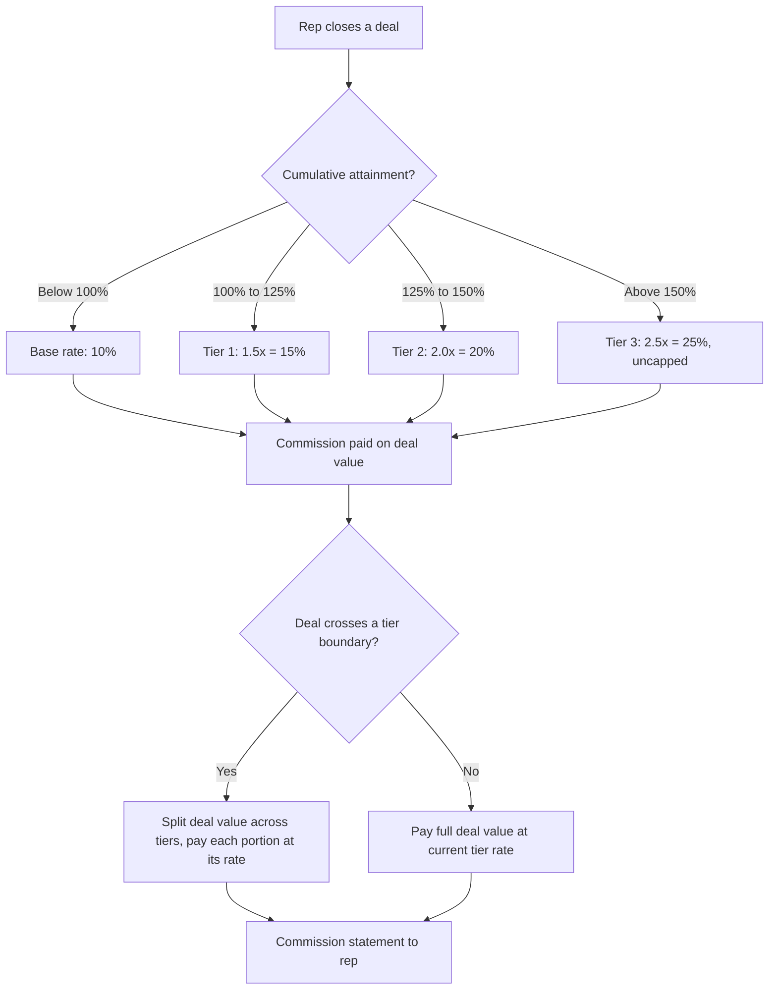

### Direct Answer

**For SaaS account executives, the standard accelerator past 100% of quota is a 1.5x to 2.5x multiplier on the base commission rate, applied to every incremental dollar of bookings above plan.** A rep on a 10% commission rate who clears quota should earn 15% to 25% on the dollars that follow. The exact figure depends on segment, deal complexity, and how aggressively the company sets quota: SMB and velocity reps cluster near 1.5x because their pipeline is plentiful and quotas are calibrated tight; enterprise and strategic reps cluster near 2.0x to 2.5x because their deals are scarce, lumpy, and a single logo can swing a quarter. The accelerator usually engages in tiers — a first step at roughly 1.5x from 100% to 125% of quota, a second step at 2.0x from 125% to 150%, and an uncapped 2.5x beyond 150% — and the entire structure is built on one non-negotiable principle: **commission plans must never be capped on the upside.** A cap tells your best reps to stop selling, and they will.

> **TL;DR** — Accelerators reward overperformance by paying a higher rate on bookings past 100% of quota. The market-standard range is **1.5x–2.5x** the base rate. Velocity and SMB segments sit at the low end (1.5x), enterprise and strategic segments at the high end (2.0x–2.5x). Tier the accelerator (100–125%, 125–150%, 150%+), never cap it, and budget so 60–70% of reps hit quota with a long-tail of overperformers earning 200–300% of OTE. The cost of an uncapped plan is real but small — typically 1–3 points of incremental commission expense — and it is the cheapest growth lever a RevOps team controls.

---

## Why Accelerators Exist: The Economics of the Marginal Deal

To understand why accelerator multiples land where they do, you have to understand what a deal past quota is actually worth to the company. This is the single concept that most compensation arguments get wrong, and getting it right reframes every conversation with finance.

A SaaS company carries a large fixed cost base: engineering, product, G&A, marketing infrastructure, the platform itself. These costs are committed before a single rep sells anything. Once quota is set and the plan is budgeted, the company has already underwritten the cost of attainment up to 100%. The reason this matters is that **the contribution margin on a deal sold past quota is dramatically higher than the contribution margin on a deal sold to reach quota.** The incremental deal does not carry incremental fixed cost. It carries only the variable cost of selling it — and the accelerator commission is that variable cost.

Consider the math from the company's side. If a $120,000 annual contract carries a 75% gross margin, it generates $90,000 of gross profit. Paying a rep a 20% accelerated commission on that deal costs $24,000. The company keeps $66,000 of gross profit it would not otherwise have, on a deal that required no new headcount, no new quota-bearing capacity, and no new ramp time. **The accelerator is the cheapest customer acquisition the company will ever do.** Every deal a tenured rep closes past quota is a deal the company did not have to hire, onboard, and ramp a new rep for — a process that costs six figures and 6–9 months of lost productivity.

This is why the instinct to cap commissions is so destructive. A cap saves the company a few thousand dollars in commission expense and costs it tens of thousands in forgone gross profit, plus the far larger long-term cost of teaching its highest-performing reps that effort past a threshold is unpaid. The accelerator is not a giveaway. It is a rational price the company pays for its most profitable revenue.

### The Marginal-Deal Principle in One Table

| Scenario | Deal ACV | Gross margin | Gross profit | Commission paid | Net contribution |
|---|---|---|---|---|---|
| Deal to reach quota | $120,000 | 75% | $90,000 | $12,000 (10% base) | $78,000 |
| Deal past quota (1.5x) | $120,000 | 75% | $90,000 | $18,000 (15%) | $72,000 |
| Deal past quota (2.0x) | $120,000 | 75% | $90,000 | $24,000 (20%) | $66,000 |
| Deal past quota (2.5x) | $120,000 | 75% | $90,000 | $30,000 (25%) | $60,000 |

The key insight: even at the most generous 2.5x accelerator, the company nets $60,000 of gross profit on a deal that cost it nothing in fixed expense. The accelerator never makes the marginal deal unprofitable. It simply shares the upside with the person who created it.

---

## The Standard Accelerator Range, Segment by Segment

The 1.5x–2.5x band is not arbitrary. It reflects a structural truth about how different SaaS sales motions generate revenue, and a RevOps leader should be able to explain exactly why a velocity rep and a strategic rep sit at opposite ends of it.

### Velocity and SMB: 1.25x–1.5x

In a high-velocity motion — think a sub-$25,000 ACV product sold in a 14–30 day cycle — reps close many deals per quarter. Quota attainment is statistical: with enough at-bats, a good rep will reliably land near plan, and a great rep will land above it through volume and conversion-rate discipline rather than through a few heroic wins. Because the pipeline is abundant and the law of large numbers smooths out variance, companies can set quotas tightly and the accelerator can be modest. A 1.25x–1.5x multiplier is sufficient to motivate the extra dials, the tighter follow-up, the refusal to let a deal slip. Pushing the accelerator higher in this segment mostly transfers margin without changing behavior, because the constraint on a velocity rep is hours in the day, not motivation.

### Mid-Market: 1.5x–2.0x

Mid-market reps — roughly $25,000–$100,000 ACV, 30–90 day cycles — sit in the middle for a reason. Their deals are large enough that any single loss stings and any single win matters, but plentiful enough that a quarter is not made or broken by one logo. The accelerator here needs to be meaningful enough to make a rep fight for the deal that would otherwise slip to next quarter, which is why 1.5x is the floor and 2.0x is common for the better-paying mid-market plans. This is also the segment where tiered accelerators do their most useful work, because mid-market reps have genuine control over whether they finish at 110% or 160%.

### Enterprise and Strategic: 2.0x–2.5x+

Enterprise reps — $100,000+ ACV, 6–12+ month cycles, multi-stakeholder buying committees — operate in a scarcity environment. They may close only 4–10 deals a year. Quota attainment is lumpy and high-variance: one deal slipping a quarter can drop a rep from 130% to 70%, and one deal pulled forward can do the reverse. Because the outcome distribution is so wide and the effort to land a single strategic logo is so enormous, the accelerator must be large enough to make overperformance genuinely life-changing. This is why enterprise plans run 2.0x–2.5x and why strategic and "named account" reps sometimes see the accelerator climb past 3.0x in the top tier. The company is, in effect, paying a volatility premium: the rep accepts a high-variance outcome, and the accelerator is the compensation for that risk.

### Accelerator Range Reference Table

| Segment | Typical ACV | Sales cycle | Deals/year | Base commission rate | Accelerator multiple | Effective rate past quota |
|---|---|---|---|---|---|---|
| Velocity / inside | <$15,000 | 7–21 days | 40–100+ | 8–10% | 1.25x–1.5x | 10–15% |
| SMB | $15,000–$40,000 | 21–45 days | 25–50 | 9–11% | 1.5x | 13.5–16.5% |
| Mid-market | $40,000–$100,000 | 45–90 days | 12–25 | 10–12% | 1.5x–2.0x | 15–24% |
| Enterprise | $100,000–$400,000 | 4–9 months | 6–12 | 10–12% | 2.0x–2.5x | 20–30% |
| Strategic / named | $400,000+ | 9–18 months | 3–8 | 8–12% | 2.5x–3.0x+ | 20–36% |

Note that the *base* commission rate often trends slightly lower as deal size grows, because enterprise OTEs are larger in absolute dollars and the base rate is set so that on-target attainment produces the target variable pay. The accelerator multiple, by contrast, trends *higher* with deal size. The two move in opposite directions for the structural reasons described above.

---

## Tiered Accelerators: How to Build the Steps

A flat accelerator — "everything past 100% pays 1.5x" — is simple, but it leaves motivation on the table. The reason is that a single flat rate treats the rep at 105% identically to the rep at 165% on a per-dollar basis. A tiered structure escalates the reward as attainment climbs, which keeps the marginal incentive strong precisely when a rep is deciding whether overperformance is worth the additional grind.

### A Standard Three-Tier Enterprise Structure

- **Tier 0 — 0% to 100% of quota:** Base commission rate, e.g. **10%**. This is the budgeted, expected zone.
- **Tier 1 — 100% to 125% of quota:** **1.5x** the base rate, i.e. **15%**. This is the "you beat the plan" zone — meaningful but not yet extraordinary.
- **Tier 2 — 125% to 150% of quota:** **2.0x** the base rate, i.e. **20%**. This is the "you are a top performer" zone, and the step-up signals it.
- **Tier 3 — 150%+ of quota:** **2.5x** the base rate, i.e. **25%**, **uncapped**. This is the "you are exceptional and the company wants more of exactly this" zone.

The escalating steps do three things. First, they create a visible ladder a rep can see and climb, which is motivationally powerful — a rep at 122% can see that crossing 125% changes their per-dollar economics. Second, they concentrate the company's most generous dollars on its rarest and most valuable outcomes. Third, they make the plan self-documenting: any rep can look at the tiers and immediately understand what overperformance is worth.

### Tiered vs. Flat: A Worked Comparison

Take a rep with a $1,000,000 annual quota, a 10% base rate, and final bookings of $1,400,000 (140% attainment).

| Component | Flat 1.5x plan | Tiered plan (1.5x / 2.0x / 2.5x) |
|---|---|---|
| Commission on first $1.0M (to quota) | $100,000 (10%) | $100,000 (10%) |
| Commission on $1.0M–$1.25M | $37,500 (15%) | $37,500 (15%, Tier 1) |
| Commission on $1.25M–$1.4M | $22,500 (15%) | $30,000 (20%, Tier 2) |
| **Total commission** | **$160,000** | **$167,500** |
| Effective blended rate | 11.4% | 12.0% |

The tiered plan costs the company an extra $7,500 on this rep — and in exchange it sends a far sharper signal about the value of pushing from 125% to 150%. Across a team, that signal is what produces the long tail of overperformers that funds outsized growth quarters.

### Mermaid: The Accelerator Decision Flow

The boundary-crossing logic in the diagram is important and frequently mishandled. When a single deal straddles a tier line — say a rep is at 120% before the deal and 135% after — the correct treatment is to split the deal: the portion that takes attainment from 120% to 125% pays at Tier 1, and the portion from 125% to 135% pays at Tier 2. Paying the whole deal at the higher tier overpays; paying it all at the lower tier underpays and demotivates. Modern commission platforms handle this automatically, but RevOps teams running plans in spreadsheets get it wrong constantly.

---

## A Full Worked Example: Northwind Data's Enterprise Plan

Abstract percentages are unconvincing. Here is a complete, realistic build for a hypothetical mid-stage SaaS company so you can see every number.

**Northwind Data** is a Series C data-observability platform selling to enterprise data teams. Its enterprise segment has these parameters:

- **OTE:** $320,000, split **50/50** — $160,000 base, $160,000 variable at target.
- **Annual quota:** $1,600,000 in net-new ARR. This produces a 10x quota-to-OTE-variable ratio ($1.6M quota / $160K variable), which is a healthy mid-market-to-enterprise norm.
- **Base commission rate:** $160,000 variable / $1,600,000 quota = **10%**.
- **Accelerator tiers:** 100–125% at 1.5x (15%), 125–150% at 2.0x (20%), 150%+ at 2.5x (25%), uncapped.

Now walk three reps through a year.

### Rep One — "Solid," finishes at 95% attainment

Bookings: $1,520,000. She never reaches the accelerator. Her commission is a straight 10% of bookings: **$152,000**. Combined with her $160,000 base, her total cash is **$312,000**, or 97.5% of OTE. This is exactly what a 95%-attainment plan should produce — slightly under OTE, no penalty beyond the missing variable dollars.

### Rep Two — "Strong," finishes at 130% attainment

Bookings: $2,080,000.

| Tranche | Bookings in tranche | Rate | Commission |
|---|---|---|---|
| 0–100% ($0–$1.6M) | $1,600,000 | 10% | $160,000 |
| 100–125% ($1.6M–$2.0M) | $400,000 | 15% | $60,000 |
| 125–130% ($2.0M–$2.08M) | $80,000 | 20% | $16,000 |
| **Total variable** | | | **$236,000** |

Total cash: $160,000 base + $236,000 variable = **$396,000**, or **124% of OTE**. He earned $236,000 of variable against a $160,000 target — a 1.475x variable multiplier for 1.30x attainment. That slight super-linearity is the accelerator working exactly as designed: overperformance is rewarded faster than it accrues.

### Rep Three — "Exceptional," finishes at 175% attainment

Bookings: $2,800,000.

| Tranche | Bookings in tranche | Rate | Commission |
|---|---|---|---|
| 0–100% ($0–$1.6M) | $1,600,000 | 10% | $160,000 |
| 100–125% ($1.6M–$2.0M) | $400,000 | 15% | $60,000 |
| 125–150% ($2.0M–$2.4M) | $400,000 | 20% | $80,000 |
| 150–175% ($2.4M–$2.8M) | $400,000 | 25% | $100,000 |
| **Total variable** | | | **$400,000** |

Total cash: $160,000 base + $400,000 variable = **$560,000**, or **175% of OTE**. Note the elegant symmetry: at exactly 175% attainment, this rep earns exactly 175% of OTE, because the base ($160K) and the on-target variable ($160K) are equal and the accelerators have lifted the variable to 250% of its target. A rep can model this on the back of a napkin, which is the mark of a well-designed plan.

### What This Costs Northwind

Suppose Northwind's enterprise team is 20 reps and attainment follows a realistic distribution. The company budgeted $160,000 of variable per rep, or **$3,200,000** of total variable expense at 100% across the team.

| Attainment band | # of reps | Avg variable per rep | Total variable |
|---|---|---|---|
| Below 80% | 4 | $108,000 | $432,000 |
| 80–100% | 6 | $144,000 | $864,000 |
| 100–125% | 6 | $214,000 | $1,284,000 |
| 125–150% | 3 | $300,000 | $900,000 |
| 150%+ | 1 | $400,000 | $400,000 |
| **Team total** | **20** | | **$3,880,000** |

Northwind spent **$3,880,000** against a $3,200,000 budget — **$680,000 of overage, about 21% above plan on the variable line**. But look at what it bought: the team booked roughly $38,400,000 against a $32,000,000 aggregate quota, or **$6,400,000 of net-new ARR above plan**. At a 75% gross margin, that incremental ARR is worth $4,800,000 of gross profit. The company spent $680,000 of incremental commission to capture $4,800,000 of incremental gross profit — a **7:1 return on the accelerator dollar**. This is the calculation to put in front of any CFO who flinches at the overage line. The accelerator did not blow the budget. It generated a 7x return.

---

## Never Cap the Plan: The Single Most Important Rule

If a RevOps leader takes one rule from this entire discussion, it should be this: **do not cap commissions.** A cap is a ceiling on what a rep can earn no matter how much they sell. It is the most common and most damaging mistake in SaaS compensation, and the reasoning against it is airtight.

A cap exists because someone in finance looked at a rep who earned $700,000 on a $300,000 OTE and decided that number was "too high." But that rep earned $700,000 by selling far past quota — which means the company captured a multiple of its planned gross profit from that rep's territory. The rep being "overpaid" is mathematically identical to the company being over-delivered. You cannot have one without the other.

When you cap the plan, here is what actually happens, every time:

- **Your best reps stop selling once they hit the cap.** A rep who has earned their maximum payout in November has zero financial incentive to close the December deals. They will park those deals in January to start the next year strong — which means the company books revenue a quarter late, and Q4 looks artificially weak.
- **Your best reps leave.** The single most mobile, most recruitable people in your company are your top quota-crushers. A capped plan is a billboard advertising that your competitor's uncapped plan will pay them more. RepVue and Pavilion compensation data make caps visible to every rep considering a move; a cap is a recruiting liability you are publishing voluntarily.
- **You invert your own incentives.** A cap rewards mediocrity relative to excellence: the rep at 100% and the rep at 200% may take home similar variable pay. You have told your team that the marginal effort of going from good to great is unpaid. They will hear that message clearly.
- **You distort forecasting.** Reps approaching a cap sandbag — they hide pipeline, slow-roll deals, and become opaque to their managers. The forecast degrades precisely because the comp plan is fighting the rep's interest.

The objection from finance is always "but uncapped plans create unbudgeted expense." This is true and it is also the entire point. The "unbudgeted expense" of an uncapped plan is **commission on revenue you did not budget for and would not have without the accelerator.** It is self-funding by construction. The correct response to a rep earning enormous commissions is not to cap the plan — it is to celebrate publicly, pay every dollar promptly and visibly, and then **raise that rep's quota next year** to recalibrate. Quota is the lever for managing comp expense over time. The cap is not a lever; it is a foot-gun.

### The One Legitimate Constraint: Windfall Clauses, Not Caps

There is exactly one defensible way to limit a single payout, and it is not a cap. A **windfall clause** (sometimes called a "mega-deal" or "non-recurring event" clause) addresses the genuine edge case where a rep closes a deal so large and so unrepresentative of normal effort — often inbound, often the result of a corporate event the rep did not create — that paying full accelerated commission would be absurd. A windfall clause says, in advance and in writing, that deals above a stated threshold (say, 3x the average deal size or some absolute dollar figure) move to a manager-and-finance review where the commission may be adjusted.

The critical differences between a windfall clause and a cap:

- A windfall clause is **deal-specific and exceptional**; a cap applies to **all bookings** and is the rule.
- A windfall clause is **disclosed in the plan document before the year starts**; caps are often discovered by reps mid-year, which destroys trust.
- A windfall clause should still pay the rep **generously** — it adjusts a genuinely anomalous payout, it does not zero it out.
- A windfall clause triggers maybe once or twice a year across an entire org; a cap fires on every overperformer.

Use a windfall clause. Never use a cap.

---

## Clawbacks, Draws, and the Mechanics That Surround Accelerators

Accelerators do not live alone in a comp plan. Three adjacent mechanics shape how they actually function, and a complete answer has to address them.

### Clawback Provisions

A clawback recovers commission already paid when a deal does not stick — most commonly when a customer churns within a defined window or fails to pay. Clawbacks interact with accelerators in a way that creates real risk for reps and real opportunity for gaming if designed poorly.

Sensible clawback design for an accelerator-heavy plan:

- **Window:** 90–180 days is standard. Beyond ~6 months, churn is far more likely a product or customer-success failure than a rep over-promising, and clawing back commission for it is unfair and demoralizing.
- **Scope:** Clawback the *commission paid on that deal*, including the accelerated portion if the deal was credited in the accelerator zone. The rep's attainment is also reduced, which may pull them back below a tier boundary — handle this cleanly so the rep's statement is not whiplashed.
- **Carve-outs:** Do not claw back when churn is caused by factors outside the rep's control — a customer acquisition, a budget freeze, a product gap the rep had no hand in. Tie clawbacks to *first-payment default* and *very-early churn*, the cases that actually correlate with rep behavior.
- **Transparency:** Every rep must know the clawback terms before they sign the plan. Surprise clawbacks are a trust catastrophe.

### Draws Against Commission

A **draw** is guaranteed minimum variable pay, advanced to a rep so they have predictable income during ramp or seasonal lulls. A *recoverable* draw is repaid out of future commissions; a *non-recoverable* draw is a true guarantee. Draws matter for accelerator plans because they protect a rep's downside while the accelerator rewards the upside — together they define the full risk profile of the seat. The norm is a non-recoverable draw for the first 2–4 months of ramp, transitioning to either no draw or a recoverable draw thereafter. A heavily accelerated plan paired with a punishing recoverable draw produces a brutal cash-flow rollercoaster; pair an aggressive accelerator with a humane draw.

### Quota Relief and Mid-Year Changes

If a rep's territory is split mid-year, a major account is reassigned, or a product is sunset, the company owes **quota relief** — a downward quota adjustment proportional to the disruption. This matters for accelerators because attainment is the denominator that triggers every tier. Failing to grant relief means a rep who lost half their territory is now judged against an unreachable bar, and the accelerator becomes a cruel joke rather than a motivator.

### Accelerator-Adjacent Mechanics Reference

| Mechanic | Purpose | Standard practice | Accelerator interaction |
|---|---|---|---|
| Clawback | Recover commission on churned/unpaid deals | 90–180 day window, first-payment default trigger | Recovers accelerated portion; can drop rep below a tier |
| Recoverable draw | Smooth cash flow, repaid from commission | First 2–6 months of ramp | Protects downside while accelerator handles upside |
| Non-recoverable draw | True guaranteed minimum | New-hire ramp, new-territory launch | Same; never repaid |
| Quota relief | Adjust quota for territory disruption | Proportional to lost capacity | Restores fair attainment denominator for tiers |
| SPIFFs | Short-term incentive for specific behavior | Layered on top, time-boxed | Should not distort the core accelerator |
| Windfall clause | Manage genuinely anomalous mega-deals | Disclosed threshold + finance review | Adjusts, never zeroes, the accelerated payout |

---

## How the Industry Benchmarks Accelerators: The Data Sources

A RevOps leader designing a plan should triangulate across multiple compensation data sources rather than trusting any single one. Each has a known bias.

- **RepVue** aggregates self-reported, employer-rated data from hundreds of thousands of sales professionals. Its strength is breadth and the ability to see how a specific company's plan is rated by its own reps; its bias is self-selection, since unhappy reps are more motivated to post. RepVue is the source most likely to be open in a candidate's browser tab during a comp negotiation, which is itself a reason to keep your plan competitive.
- **Pavilion** (formerly Revenue Collective) surveys its membership of revenue operators and publishes compensation benchmarks segmented by stage, segment, and geography. Its bias is toward higher-growth, venture-backed companies — useful if that is your peer set, less so for a bootstrapped or PE-owned business.
- **The Bridge Group** publishes the long-running and widely cited *SaaS AE Metrics* report, with deep historical data on quota, OTE, ramp, and attainment by segment. Its strength is methodological consistency over many years, which makes trend analysis reliable.
- **OpenComp** and similar compensation-management platforms publish benchmarks drawn from the actual plan data of their customer base — arguably the cleanest signal, since it reflects real plans rather than self-reports, though it is skewed toward companies modern enough to buy a comp tool.

The practical move is to pull the accelerator and OTE ranges from at least two of these, see where your intended plan lands relative to the median and the 75th percentile for your segment, and decide deliberately where you want to sit. A company competing for scarce enterprise talent should plan to land at or above the 75th percentile on the accelerator; a company with a strong inbound brand and abundant pipeline can sit at the median and still hire well.

### Where Real Companies Sit: Public-Company Context

You can infer a great deal about accelerator philosophy from how public SaaS companies discuss sales efficiency and the long tail of rep performance. The pattern across the most successful go-to-market organizations is consistent: uncapped plans, aggressive accelerators, and a deliberate culture of celebrating overperformers.

| Company | Ticker | GTM signal relevant to accelerator design |
|---|---|---|
| Salesforce | CRM | Sets the template — large enterprise field org, famously uncapped, public "President's Club" culture rewarding the long tail |
| ServiceNow | NOW | Enterprise-only motion, very large ACVs, accelerator philosophy tuned for scarce strategic logos |
| Snowflake | SNOW | Consumption model complicates "bookings"; accelerators tied to consumption growth, not just signature |
| Datadog | DDOG | Land-and-expand at scale; accelerators reward net-new logo and expansion alike |
| Workday | WDAY | Long enterprise cycles, very high ACV; strong accelerators for scarce, lumpy deals |
| HubSpot | HUBS | Mid-market and SMB scale; tighter quotas, lower-multiple accelerators, high deal volume |
| MongoDB | MDB | Developer-led plus enterprise sales; consumption-and-seats hybrid shapes accelerator base |
| CrowdStrike | CRWD | Module-based expansion; accelerators reward multi-module enterprise wins |
| Atlassian | TEAM | Historically low-touch; as it moves upmarket, it has had to build a real accelerated field comp plan |
| Okta | OKTA | Enterprise security sales; standard tiered accelerators tuned for 6–9 month cycles |
| Zscaler | ZS | Large enterprise security ACVs; accelerator philosophy mirrors ServiceNow's scarcity model |
| Monday.com | MNDY | Mid-market scale motion; accelerators sit closer to the HubSpot end of the spectrum |

The reason this matters for a private-company RevOps leader is competitive: your reps are recruited by these companies, and they benchmark their plans against them. If the public-company peer set runs uncapped 2.0x–2.5x enterprise accelerators and your plan is capped at 1.2x, you are not competing for the same talent.

---

## How Accelerators Evolve as a Company Scales

Accelerator design is not set once. It moves through predictable stages as a company grows, and matching the stage is part of getting the answer right.

### Seed and Series A: Generous and Simple

Early-stage companies have unproven quotas, tiny sample sizes, and a desperate need to attract the few great reps who will join a risky company. The right move is a **simple, very generous, uncapped accelerator** — often a flat 2.0x or higher with no complex tiering — because the company cannot yet calibrate tiers accurately and because the recruiting premium is worth more than the marginal comp expense. At this stage, comp is a recruiting tool first and a precision instrument second.

### Series B and C: Tiering and Calibration

Once a company has a few quarters of attainment data, it can build real tiers. This is the stage at which the 1.5x / 2.0x / 2.5x structure described above gets formalized, quota-setting becomes data-driven, and the company starts segmenting accelerators by sales motion. Plan documents get longer and more precise. The Northwind example above is a textbook Series B/C plan.

### Growth Stage and Pre-IPO: Discipline and Governance

At scale, comp expense is a material P&L line and finance scrutiny intensifies. The accelerator stays uncapped — abandoning that principle at scale would be self-destructive — but governance tightens: windfall clauses get formalized, clawback provisions get audited, plan changes go through a compensation committee, and quota-setting becomes a rigorous annual process. The accelerator multiples themselves typically stabilize in the standard 1.5x–2.5x band; what changes is the precision and the governance around them.

### Stage Evolution Reference

| Stage | Accelerator philosophy | Structure | Primary goal |
|---|---|---|---|
| Seed / Series A | Generous, simple, uncapped | Flat 2.0x+ | Recruit scarce great reps |
| Series B / C | Calibrated, tiered | 1.5x / 2.0x / 2.5x tiers | Reward overperformance precisely |
| Growth / pre-IPO | Disciplined, governed | Tiered + windfall + clawback governance | Balance growth with P&L control |
| Public | Mature, audited | Stable tiers, compensation committee | Sustain the long tail at scale |

---

## Common Mistakes RevOps Teams Make With Accelerators

Even teams that understand the theory get the execution wrong. The recurring errors:

1. **Setting quota so high that the accelerator never fires.** If only 30% of reps reach quota, the accelerator is decorative — it motivates no one because no one believes they will reach it. A healthy plan has **60–70% of reps at or above quota**, which means the accelerator is a live, believable target for the majority of the team. Quota that is too aggressive does not save money; it just relocates the demotivation from "capped upside" to "unreachable threshold."

2. **Confusing the accelerator with the cap by setting an implicit ceiling.** Some plans technically have no cap but set the top tier so high (200%+ of quota) that it functions like one. Make sure the top, uncapped tier is reachable by your actual best reps.

3. **Resetting attainment monthly instead of cumulatively.** If attainment resets every month, a rep who has a huge January and a slow February never benefits from the accelerator because each month is judged alone. Most enterprise plans should measure attainment **cumulatively across the year** (or at least the quarter), so a rep's strong periods carry their weak ones into the accelerator zone.

4. **Mishandling tier-boundary deals.** As covered above, a deal that straddles a tier line must be split. Paying the whole deal at one rate is a persistent spreadsheet-era error.

5. **Changing the plan mid-year without warning.** Nothing destroys trust faster than a rep discovering the accelerator was quietly trimmed in Q3. If the plan must change, change it at the year boundary, communicate it early, and grandfather in-flight deals.

6. **Ignoring the interaction between accelerators and SPIFFs.** Stacking a generous accelerator with frequent SPIFFs can produce comp expense the company genuinely did not model, and worse, can pull rep behavior toward whatever the SPIFF rewards and away from the strategic priorities the accelerator is supposed to encode. Keep SPIFFs rare, small, and time-boxed.

7. **Failing to model the cost distribution.** Finance partners need the attainment-distribution table (like Northwind's) *before* the plan launches, so the "overage" is expected, explained, and pre-approved rather than a Q4 surprise.

---

## Counter-Case: When a Lower or Flatter Accelerator Is Actually Correct

The 1.5x–2.5x tiered, uncapped recommendation is the right default for the large majority of SaaS sales organizations. But a complete answer has to acknowledge the genuine exceptions, because applying the default blindly can be wrong.

**Pure consumption-revenue models.** When revenue is driven by usage rather than signature — a Snowflake-style consumption model — "bookings past quota" is a fuzzier concept, because the rep's influence on a customer's consumption ramp is partial. In these models the accelerator often attaches to *consumption growth* or *committed-spend expansion* rather than net-new signature, and the multiples may be flatter because the attribution is genuinely murkier. Forcing a signature-based 2.5x accelerator onto a consumption motion can overpay reps for usage growth they did not drive.

**Extremely high-velocity, low-ACV motions.** In a transactional motion where a rep closes a hundred-plus deals a year, attainment is almost purely statistical and the rep's marginal effort past quota produces diminishing returns — they are already working at capacity. A flat, modest 1.25x accelerator can be entirely appropriate; a steep tiered structure mostly transfers margin without changing behavior.

**Heavily team-sold strategic deals.** When a "deal" is the product of an account team — a named-account AE, a solution engineer, an executive sponsor, a customer-success partner — a steep individual accelerator can create destructive politics over credit. In these motions, a flatter individual accelerator paired with a team or pooled component is often healthier than a winner-take-all individual ramp.

**Severe cash constraints at the earliest stage.** A pre-revenue company genuinely unable to fund a large accelerator overage may rationally run a flatter plan and compensate with equity. This is a real constraint, not a preference — but it should be a conscious, communicated trade-off, and the plan should move toward a proper accelerator as soon as cash allows.

**Renewals and pure account management.** A renewal-focused AM whose job is retention, not net-new, should be measured and accelerated against GRR/NRR, not net-new bookings, and the accelerator curve looks different — flatter, with a strong floor — because the behavior being rewarded is different.

The unifying principle of every exception: the accelerator should reward the *specific behavior the company most wants*, measured in the *unit that behavior actually moves*. The 1.5x–2.5x net-new-bookings tiered structure is the right answer when the rep is the primary driver of discrete, signature-based, net-new deals — which describes most SaaS AE roles, but not all of them. Diagnose the motion before copying the default.

---

## A Practical Checklist for Designing the Accelerator

For a RevOps leader sitting down to build or audit an accelerator, work this list in order:

1. **Classify the sales motion** — velocity, SMB, mid-market, enterprise, or strategic — because that determines the multiple band.
2. **Confirm OTE and the base/variable split** are competitive for the segment; the accelerator cannot fix an uncompetitive OTE.
3. **Derive the base commission rate** from the variable target divided by quota; do not pick the rate first.
4. **Set the accelerator tiers** — a 100–125% / 125–150% / 150%+ structure at roughly 1.5x / 2.0x / 2.5x is the safe enterprise default; flatten for velocity, steepen for strategic.
5. **Confirm the plan is uncapped** and that the top tier is genuinely reachable by your actual best reps.
6. **Add a windfall clause** with a disclosed threshold to handle anomalous mega-deals — and nothing else as a constraint.
7. **Define cumulative (annual or quarterly) attainment measurement**, not monthly resets.
8. **Specify tier-boundary deal-splitting logic** explicitly in the plan document.
9. **Design humane clawback and draw provisions** that pair downside protection with the accelerator's upside.
10. **Model the attainment distribution and total cost** with finance *before* launch, so the overage is pre-approved.
11. **Benchmark against at least two external sources** (RepVue, Pavilion, Bridge Group, OpenComp) and decide deliberately where to sit relative to the median.
12. **Communicate the plan clearly, in writing, before the year starts**, and commit not to change it mid-year.

Work that list and the accelerator will do what it is supposed to do: turn your best reps loose, fund your overperformance quarters, and make your compensation plan a recruiting asset instead of a liability.

---

## Decelerators and the Below-Quota Zone

An accelerator describes what happens above 100%. A complete plan also has to define what happens below it, and that lower zone shapes rep behavior just as powerfully. Many SaaS plans use the term "decelerator" — a *reduced* commission rate applied to bookings in a low-attainment band — and whether to use one is a real design decision with strong arguments on both sides.

A decelerator works like the accelerator in reverse. Where the accelerator pays 1.5x past 100%, a decelerator might pay 0.5x or 0.6x of the base rate on the first tranche of bookings, with the rate stepping up to the full base rate as the rep approaches quota. The theory is that the company concentrates its commission dollars on reps who are actually producing and protects the variable budget against low performers. A typical below-quota structure:

- **0% to 40% of quota:** 0.5x base rate. This is the "you are well behind plan" zone.
- **40% to 70% of quota:** 0.75x base rate. Improving but still below expectation.
- **70% to 100% of quota:** Full base rate. On track.
- **100%+:** Accelerator tiers as described above.

The argument *for* a decelerator is budget discipline: it ensures the variable line is not consumed by reps far below plan, and it sharpens the financial message that on-target performance is the expectation. The argument *against* it is severe and, in most cases, decisive. A decelerator punishes precisely the reps who most need cash stability — new hires still ramping, reps recovering from a bad quarter, reps in a disrupted territory. It can push a struggling rep into a financial death spiral where reduced pay produces stress, stress produces worse performance, and worse performance produces still-lower pay. It is also a recruiting liability: a candidate comparing two offers will heavily discount a plan that pays half-rate on early bookings.

The pragmatic resolution most well-run SaaS companies reach: **use a draw, not a decelerator.** A draw protects the rep's cash floor during the periods when a decelerator would punish them, while still tying long-run pay to performance through recoverability. The decelerator solves the company's budget concern by hurting the rep; the draw solves it by smoothing timing without inflicting the same damage. Reserve decelerators, if you use them at all, for tenured reps well past ramp who are persistently and inexplicably below plan — and even then, a performance-management conversation is usually the better instrument than a comp-plan penalty.

### Below-Quota Design Comparison

| Approach | What it does to a struggling rep | Budget effect | Recruiting effect | Recommended? |
|---|---|---|---|---|
| Decelerator | Cuts pay rate, can trigger death spiral | Protects variable line | Negative — candidates discount it | Rarely, tenured reps only |
| Recoverable draw | Smooths cash, repaid later | Neutral over time | Mildly positive | Yes, common |
| Non-recoverable draw | Guarantees cash floor | Costs the company during ramp | Positive | Yes, for ramp/new territory |
| Flat base rate to quota | No penalty, no smoothing | Variable budget at full risk | Neutral | Acceptable, simplest |

The accelerator and the below-quota structure together define the full risk-reward shape of the seat. Designing a steep accelerator while ignoring the below-quota zone produces a plan that feels like a lottery; designing both deliberately produces a plan reps trust.

## Multi-Year Accelerator Effects: The Ratchet Problem

A subtle and underdiscussed issue with accelerators is what happens across consecutive years. When a rep finishes at 160% of quota and earns a large accelerated payout, the natural and correct response is to raise that rep's quota for the following year. But raise it by how much, and what does that do to the rep's perception of the accelerator?

This is the **ratchet problem.** If a company responds to overperformance by raising quota one-for-one — taking a rep who booked $2.4M against a $1.5M quota and setting next year's quota at $2.4M — the rep learns a painful lesson: overperformance is not rewarded, it is *taxed*, because the only durable result of a great year is a harder bar next year. A rep who learns this will sandbag. They will deliberately under-deliver, parking deals across the year boundary, to keep their quota from ratcheting. The accelerator, designed to unleash overperformance, instead trains reps to hide it.

The fix is to make quota increases **predictable, moderate, and decoupled from any single rep's individual overperformance.** Good practice:

- **Set quota increases at the segment or cohort level**, driven by company growth targets and territory potential, not by reverse-engineering an individual rep's prior-year bookings. A rep should not feel that selling more *this* year directly sets *their* bar next year.
- **Cap year-over-year quota growth at a reasonable rate** — often 10–25% depending on company growth stage — so the increase is anticipated and survivable.
- **Communicate the quota-setting methodology transparently**, so reps understand that quota reflects territory potential and company plan, not punishment for a good year.
- **Let the accelerator do its job within the year and the quota do its job across years**, but keep the two mechanically separate in the rep's mind.

When quota-setting is opaque and reactive, the accelerator's motivational power decays year over year as reps learn to game the ratchet. When quota-setting is transparent and rule-based, the accelerator stays a live, trusted incentive across a rep's entire tenure. This is one of the most important and least appreciated aspects of accelerator design: the accelerator is an annual mechanism, but its credibility is a multi-year asset that careless quota-setting can quietly destroy.

### The Ratchet Problem Illustrated

| Year | Quota | Bookings | Attainment | Rep's lesson if quota = prior bookings | Rep's lesson if quota = +20% rule |
|---|---|---|---|---|---|
| Year 1 | $1.5M | $2.4M | 160% | "Great year" | "Great year" |
| Year 2 | $2.4M (ratcheted) vs $1.8M (rule) | ? | ? | "Overperformance is taxed — sandbag" | "Quota grew predictably — keep pushing" |
| Year 3 | Spiral continues | Declining | Declining | Sandbagging entrenched | Accelerator still trusted |

The right-hand path keeps the accelerator alive; the left-hand path kills it within two years.

## Accelerators for Hybrid and Specialized Roles

The standard AE accelerator assumes a rep whose job is closing net-new bookings. SaaS organizations contain many roles for which that assumption breaks, and each needs an adapted accelerator.

**Account managers and renewal reps.** An AM measured on retention should be accelerated on **gross revenue retention (GRR) or net revenue retention (NRR)**, not net-new bookings. The accelerator curve is flatter and front-loaded with a strong floor, because the behavior being rewarded — keeping and expanding existing customers — is steadier and less binary than net-new hunting. Paying an AM a steep net-new-style accelerator can pull them toward chasing expansion deals while neglecting at-risk renewals.

**Sales engineers and solution consultants.** SEs are typically on a team-attainment or pooled accelerator tied to the bookings of the AEs they support, often at a lower variable percentage of OTE (a 75/25 or 80/20 split rather than 50/50). The accelerator should reward the SE for the *team's* overperformance, since pitting an SE against an individual-attainment accelerator creates conflict over which deals get SE attention.

**Channel and partner managers.** A partner manager's accelerator attaches to **partner-sourced or partner-influenced bookings**, with attribution rules that are notoriously contentious. The accelerator multiple is often modest because attribution is fuzzy, and the plan leans on clear sourcing definitions to keep the accelerator honest.

**Sales development representatives.** SDRs are usually on a different instrument entirely — a per-meeting or per-qualified-opportunity bonus rather than a bookings accelerator — because their output is leading-indicator activity, not closed revenue. Where SDRs do receive a bookings-linked component, the accelerator is small and the structure emphasizes the activity metrics they actually control.

**Hybrid hunter-farmer roles.** Some reps carry both a net-new quota and an expansion quota. The cleanest design gives each component its own accelerator calibrated to its motion — a steeper one on net-new, a flatter one on expansion — rather than a single blended accelerator that lets the rep optimize toward whichever component is easier that quarter.

### Role-Adapted Accelerator Reference

| Role | Accelerator attaches to | Typical OTE split | Accelerator shape |
|---|---|---|---|
| Net-new AE | Net-new bookings | 50/50 | Steep, tiered 1.5x–2.5x |
| Account manager | GRR / NRR | 70/30–80/20 | Flat, front-loaded, strong floor |
| Sales engineer | Team/pooled bookings | 75/25–80/20 | Tied to team attainment |
| Partner manager | Partner-sourced bookings | 60/40–70/30 | Modest, attribution-gated |
| SDR | Meetings / qualified opps | 60/40 | Activity-based, small bookings component |
| Hybrid hunter-farmer | Separate net-new + expansion | 50/50–60/40 | Two distinct accelerator curves |

The principle from the counter-case section applies here too: the accelerator should reward the specific behavior the role exists to produce, measured in the unit that behavior moves. Copying the net-new AE accelerator onto every revenue role is a frequent and expensive mistake.

## The Behavioral Science Behind Accelerator Design

Compensation plans are, at bottom, behavioral instruments, and a few findings from motivation research explain why the standard accelerator structure works.

**Marginal incentive must stay visible.** Research on sales-force motivation consistently finds that what drives the *next* unit of effort is the *marginal* reward for that unit, not the average reward across all units. This is the entire case for accelerators and against caps: a flat plan with a cap means the marginal reward for effort past a point is zero, and effort collapses to match. A tiered accelerator keeps the marginal reward not just positive but *rising*, which is why a rep at 130% still pushes hard for 140%.

**Reference points and goal gradients.** People accelerate effort as they approach a salient goal — the "goal gradient" effect. Quota itself is a powerful reference point: reps visibly intensify effort in the stretch before hitting 100%. A well-designed accelerator places additional reference points (the 125% and 150% tier lines) further up the curve, extending the goal-gradient effect well past quota. A rep at 122% experiences the 125% line the way they experienced the 100% line — as a near, motivating target.

**Loss aversion and clawbacks.** People feel a loss roughly twice as intensely as an equivalent gain. This is why clawbacks must be designed carefully: a clawback is experienced as a loss and therefore lands far harder than the original commission landed as a gain. A clawback that is fair on a spreadsheet can still be demoralizing in a rep's gut. The mitigations — tight windows, clear carve-outs, advance transparency — exist precisely to keep loss aversion from poisoning the plan.

**Predictability and trust.** Reps make real-life financial decisions — mortgages, childcare, relocation — against their expected comp. A plan that changes unpredictably, ratchets quota reactively, or springs surprise clawbacks does not just annoy reps; it makes the entire incentive structure non-credible, and a non-credible incentive does not motivate at all. The behavioral return on a *boring, stable, well-communicated* plan is enormous and almost always underweighted by finance teams focused on the cost line.

### Behavioral Principle to Design Choice

| Behavioral principle | Design implication for accelerators |
|---|---|
| Marginal incentive drives marginal effort | Tier the accelerator; never cap |
| Goal gradient — effort rises near a goal | Place tier lines as visible mid-curve targets |
| Loss aversion — losses hurt 2x | Design clawbacks tight, transparent, carved out |
| Predictability builds credibility | Stable plan, rule-based quota, no mid-year surprises |
| Salience — visible rewards motivate most | Clear statements, public recognition of overperformers |

A RevOps leader who frames the accelerator conversation in these behavioral terms — rather than purely as a cost line — tends to win the internal argument, because the behavioral framing makes plain that a well-designed accelerator is not an expense to minimize but a behavior-shaping asset to optimize.

## Quarterly Cadence, Caps Within Periods, and True-Ups

A final operational layer that interacts heavily with accelerators: how attainment is measured across the periods of the year.

Most enterprise SaaS plans pay commission **monthly or per-deal**, but measure *accelerator attainment* on a **cumulative annual or quarterly** basis. The reconciliation between those two cadences is handled through a **true-up**. Suppose a rep crosses from Tier 1 into Tier 2 in the third month of a quarter; the deals booked earlier in that period, which were paid at Tier 1 rates, were actually — in cumulative terms — Tier 2 dollars. The true-up is the corrective payment that brings the rep whole to their cumulative-attainment entitlement.

Getting the cadence right matters because the wrong cadence silently nullifies the accelerator:

- **Pure monthly resets** mean a rep with a $400K January and a $50K February never reaches the accelerator, because each month is judged alone — even though cumulatively they are far past quota. Monthly resets suit only the highest-velocity transactional motions where every month genuinely is a fresh, independent statistical sample.
- **Quarterly cumulative measurement** is the common enterprise standard: it smooths the lumpiness of long sales cycles within a quarter while still giving the company four checkpoints a year.
- **Annual cumulative measurement** maximizes smoothing and is most generous to reps with long, lumpy cycles, but it can delay the accelerator's motivational kick — a rep may not reach the accelerator zone until late in the year.
- A common compromise is **quarterly measurement with an annual true-up**, capturing the within-year smoothing benefit while paying reps on a quarterly rhythm they can plan their lives around.

The operational warning: true-ups must be timely and transparent. A rep who is owed an accelerator true-up and waits two quarters to see it experiences the same trust erosion as a surprise clawback. Modern commission platforms compute true-ups automatically; spreadsheet-run plans routinely get them wrong or late, which is one more reason a scaling company should graduate off spreadsheets before the accelerator structure gets complex.

### Measurement Cadence Reference

| Cadence | Smoothing of lumpy cycles | Motivational immediacy | Best fit |
|---|---|---|---|
| Monthly reset | None | High within month | Pure transactional / velocity |
| Quarterly cumulative | Moderate | Good | Mid-market and most enterprise |
| Annual cumulative | Maximum | Delayed | Very long-cycle strategic |
| Quarterly + annual true-up | High | Good | Enterprise wanting both benefits |

## Communicating the Accelerator: The Rollout That Makes or Breaks the Plan

A technically perfect accelerator structure can still fail if it is rolled out poorly. The plan document and the launch conversation are not paperwork — they are the moment the accelerator either becomes a believed, motivating force or a source of confusion and suspicion. A few rollout disciplines separate plans that work from plans that merely exist on paper.

**Lead with the rep's-eye-view, not the finance-view.** When a RevOps leader presents the plan, the first thing every rep wants to know is a single concrete question: "If I have a great year, what do I actually take home?" Answer that question first, with a worked example like the Northwind Rep Three calculation above, before walking through tier mechanics. A rep who can see that 175% attainment produces 175% of OTE will trust the plan; a rep handed a tier table with no worked example will assume the complexity is hiding something.

**Make the plan document a teaching tool.** A good accelerator plan document includes the tier table, the base-rate derivation, at least two fully worked attainment examples, an explicit statement that the plan is uncapped, the tier-boundary deal-splitting rule, the clawback terms, the draw terms, the measurement cadence, and the windfall-clause threshold. Every one of these should be stated plainly enough that a rep can self-serve answers without escalating to RevOps. Ambiguity in a comp document is always read by reps in the least generous interpretation.

**Pair the plan with a commission calculator.** The single highest-leverage rollout tool is a simple calculator — a spreadsheet or an in-platform tool — where a rep can input a hypothetical bookings number and see their resulting commission. This converts the accelerator from an abstraction into something a rep can touch and explore. Reps who play with a calculator internalize the accelerator's shape and start setting personal stretch goals around the tier lines, which is exactly the behavior the plan is designed to produce.

**Communicate changes at the year boundary and explain the why.** When the plan must change year over year — and it usually does, as quotas grow and tiers recalibrate — communicate the change before the new year starts and explain the reasoning. Reps tolerate change they understand and resent change that appears arbitrary. A plan change framed as "here is how the company grew, here is how territories evolved, here is the resulting quota and accelerator" preserves trust; a plan change that simply arrives preserves nothing.

**Train front-line managers first.** Every rep's first comp question goes to their direct manager, not to RevOps. If managers do not deeply understand the accelerator, they will give reps wrong or vague answers, and the plan's credibility erodes from the first week. Brief managers thoroughly and equip them with the same worked examples and calculator the reps receive.

### Rollout Checklist

| Step | Action | Failure mode if skipped |
|---|---|---|
| 1 | Lead with a worked take-home example | Reps assume complexity hides a catch |
| 2 | Make the plan document fully self-serve | Ambiguity read uncharitably |
| 3 | Ship a commission calculator | Accelerator stays abstract, unmotivating |
| 4 | Communicate changes at year boundary with rationale | Change feels arbitrary, erodes trust |
| 5 | Train managers before reps | Wrong answers from managers kill credibility |
| 6 | Confirm uncapped status in writing, prominently | Reps suspect a hidden ceiling |

The throughline of every rollout discipline is the same as the throughline of the whole accelerator design: **trust is the asset.** An accelerator only changes behavior if reps believe it. The mechanics determine whether the plan is fair; the rollout determines whether reps know it is fair. Both have to be right.

---

## Related Questions in the Pulse Library

- *What's a fair OTE for an enterprise AE selling $100k+ ACV deals?* — the OTE sizing that the accelerator base rate is derived from.
- *How do you set SaaS sales quotas so 60–70% of reps attain?* — quota calibration is the precondition for a working accelerator.
- *How should clawback provisions be structured in a SaaS commission plan?* — the deeper treatment of the clawback mechanics summarized here.
- *Recoverable vs. non-recoverable draws: which should a SaaS company use?* — the downside-protection counterpart to the accelerator's upside.
- *How do you design a commission plan for a consumption-revenue model?* — the leading counter-case to the default accelerator structure.

---

## Sources

1. The Bridge Group — *SaaS AE Metrics & Compensation Report* (annual series), bridgegroupinc.com
2. RepVue — Sales Compensation Benchmarks and company-rating database, repvue.com
3. Pavilion — Member Compensation Benchmark Reports, joinpavilion.com
4. OpenComp — SaaS Sales Compensation Benchmarks, opencomp.com
5. Xactly — *Sales Compensation Best Practices* and accelerator-design guidance, xactlycorp.com
6. CaptivateIQ — Commission Plan Design Library: accelerators and tiers, captivateiq.com
7. QuotaPath — *Guide to Sales Commission Accelerators*, quotapath.com
8. Spiff (Salesforce) — Commission Accelerator and Tier Documentation, spiff.com
9. Performio — *Sales Commission Accelerators Explained*, performio.co
10. Forma.ai — Sales Compensation Plan Design research, forma.ai
11. Alexander Group — Revenue Growth and Sales Compensation Advisory, alexandergroup.com
12. WorldatWork — Sales Compensation Survey and standards, worldatwork.org
13. SiriusDecisions / Forrester — Sales Compensation Benchmark research, forrester.com
14. Gartner — Sales Compensation and Quota-Setting research, gartner.com
15. SaaStr — *Everything About SaaS Sales Compensation* essay collection, saastr.com
16. David Sacks — *The Cadence* and SaaS go-to-market essays, sacks.substack.com
17. Tomasz Tunguz — SaaS sales efficiency and comp analysis, tomtunguz.com
18. OpenView Partners — SaaS Benchmarks Report, openviewpartners.com
19. KeyBanc Capital Markets — Annual SaaS Survey, key.com
20. Bessemer Venture Partners — *State of the Cloud* and Cloud Index, bvp.com
21. ICONIQ Growth — *Growth & Efficiency* go-to-market reports, iconiqcapital.com
22. Salesforce Investor Relations — annual reports and GTM commentary (NYSE: CRM)
23. ServiceNow Investor Relations — annual reports (NYSE: NOW)
24. Snowflake Investor Relations — consumption-model GTM commentary (NYSE: SNOW)
25. Datadog Investor Relations — land-and-expand GTM disclosures (NASDAQ: DDOG)
26. Workday Investor Relations — enterprise GTM disclosures (NASDAQ: WDAY)
27. HubSpot Investor Relations — mid-market/SMB GTM commentary (NYSE: HUBS)
28. MongoDB Investor Relations — developer-plus-enterprise GTM (NASDAQ: MDB)
29. CrowdStrike Investor Relations — module-expansion GTM (NASDAQ: CRWD)
30. Atlassian Investor Relations — upmarket GTM transition commentary (NASDAQ: TEAM)
31. Harvard Business Review — *Motivating Salespeople: What Really Works* and related research, hbr.org
32. SBI (Sales Benchmark Index) — Sales Compensation and Quota research, sbigrowth.com
33. CSO Insights / Miller Heiman — Sales Performance and Compensation studies
