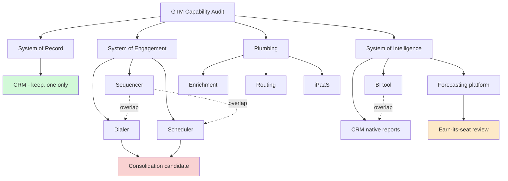

### Direct Answer

The minimal tech stack that actually moves the needle is **a system of record (CRM), a system of engagement (sequencer/dialer), a system of intelligence (analytics + a single source of pipeline truth), and a thin layer of plumbing (enrichment, routing, and an iPaaS or reverse-ETL connector)**. Everything else — conversation intelligence, AI SDR agents, advanced CPQ, dedicated attribution platforms, gamification, and the third "intent" vendor — is a nice-to-have that should earn its seat through a measurable, time-boxed business case. The needle a tool moves is always one of three numbers: **revenue won, sales cycle time, or fully loaded cost per dollar of pipeline.** If a line item on your software bill cannot be traced to one of those three within two quarters, it is bloat, and bloat is the single most common reason RevOps budgets balloon 30-40% faster than headcount while win rates stay flat.

### TLDR

- **The needle is three numbers.** Revenue won, cycle time, cost per pipeline dollar. Every tool gets scored against those or it gets cut.
- **Four layers, not forty tools.** Record (CRM), Engagement (sequencer + dialer), Intelligence (BI + pipeline truth), Plumbing (enrichment, routing, integration). A company under $50M ARR rarely needs more than 8-12 paid SaaS tools in the GTM stack.
- **Bloat has a fingerprint.** Overlapping capabilities, sub-40% seat utilization, shelfware renewals, "strategic" tools nobody can attribute to a metric, and shadow stacks bought on a manager's card.
- **The order of operations matters.** Fix the CRM first. A clean system of record makes every downstream tool 2-3x more valuable; a dirty one makes them actively harmful.
- **TCO is 3-5x the sticker price.** License is roughly a third of true cost. Implementation, admin headcount, integration maintenance, training, and the opportunity cost of a bad rollout are the rest.
- **Run a kill-list ritual every renewal.** Default to "cancel" and make each tool re-justify. Zero-based budgeting beats incremental approval every cycle.
- **Counter-case exists.** Enterprise, regulated, PLG-heavy, and M&A-heavy companies legitimately need more surface area. Minimalism is a discipline, not a dogma.

---

## BANNER 1 — What "Moving the Needle" Actually Means

### 1.1 The three needles, defined precisely

Before you can separate signal from bloat, you have to agree on what the needle is. In RevOps the word gets thrown around as if "impact" were self-evident, but a tool that makes a rep *feel* productive is not the same as a tool that changes a board-level number. There are exactly three needles that a GTM software purchase can legitimately move, and a disciplined operator forces every vendor conversation back to one of them.

The first needle is **revenue won** — incremental closed-won dollars that would not have closed without the tool, expressed as a win-rate lift or an average-deal-size lift. The second is **sales cycle time** — the number of days from opportunity creation to closed-won, where compression frees up capacity without adding headcount. The third is **fully loaded cost per dollar of pipeline** — the all-in cost of generating and progressing a dollar of qualified pipeline, which includes the software itself.

Notice that "rep happiness," "data visibility," "executive dashboards," and "AI-powered insights" are not on the list. They can be *inputs* to one of the three needles, but they are never the needle itself. The most expensive mistake in stack design is buying an input and reporting it as an outcome.

### 1.2 The attribution test every tool must pass

A tool earns its seat when you can write a single sentence in this form and defend it with data: *"Removing this tool would reduce [needle] by [quantity] within [timeframe], because [mechanism]."* If the best you can do is "removing it would make people unhappy" or "we'd lose visibility," you are describing a preference, not a need.

| Test question | Bloat answer | Needle answer |
|---|---|---|
| What number does it move? | "Productivity" / "visibility" | "Win rate, +3.1 pts in pilot cohort" |
| How fast? | "Eventually" / "hard to say" | "Within 2 quarters, measured monthly" |
| What is the mechanism? | "It's AI / it's modern" | "Auto-logs activity so reps spend 40 min/day selling instead of typing" |
| Who would scream if it left? | "Everyone" | "The 12 AEs in segment B, by name" |
| What is the counterfactual? | "We'd be blind" | "We'd revert to manual routing, ~6 hr/week of ops time" |

### 1.3 Why "needle" beats "best-in-class"

The seductive failure mode is buying the best-in-class tool in every category. Best-in-class is a category-relative judgment; the needle is an absolute, company-specific one. A best-in-class conversation-intelligence platform is genuinely excellent — and still bloat for a 15-person sales team where the VP can listen to calls directly. The question is never "is this a good tool?" It is "does this tool move one of my three needles more than the next-best use of the same money and the same change-management budget?"

### 1.4 The opportunity-cost frame

Every tool you adopt consumes three scarce resources: cash, admin attention, and organizational change capacity. The last one is the bottleneck. A team can only absorb so much workflow change per quarter before adoption collapses. If you spend that change budget rolling out a marginal tool, you have no change budget left for the one that would actually move a needle. Minimalism is not cheapness — it is the deliberate conservation of change capacity for the purchases that matter. This is the same logic explored in the sibling entry on **sequencing a RevOps tooling roadmap**, and it is why "what to buy next" is always downstream of "what can we actually absorb next."

### 1.5 The needle-versus-input distinction in practice

The most common confusion in stack debates is conflating an input with an outcome. "More visibility," "better data," "faster reporting," "AI insights" — these are all *inputs* that may or may not propagate to a needle. The disciplined operator draws an explicit causal chain from the tool to the needle and inspects every link. A conversation-intelligence platform produces call recordings (input); recordings enable manager coaching (input); coaching changes rep behavior (input); changed behavior lifts win rate (needle). If any link in that chain is broken — managers do not actually review the recordings, or the coaching does not change behavior — the tool produces inputs that never reach the needle, and it is bloat no matter how good the recordings are.

| Input commonly sold as outcome | The needle it must reach | Link most likely to break |
|---|---|---|
| "Better pipeline visibility" | Forecast accuracy → planning quality | Visibility never changes a decision |
| "AI-generated insights" | Win rate or cycle time | Insights are read but not acted on |
| "Rep productivity gains" | Cycle time or pipeline cost | Freed time is not redeployed to selling |
| "Single source of truth" | All three needles | The "truth" is still dirty data |
| "Automated activity capture" | Cycle time → freed selling hours | Hours freed are absorbed by other admin |

The exercise of drawing the chain is itself the value: it forces the vendor and the buyer to be honest about where the mechanism actually breaks.

### 1.6 Why the needle frame survives contact with politics

Stack decisions are political because tools have champions and champions have status invested in them. The needle frame is the only thing that survives that politics, because it replaces "whose tool is better" with "which number moved." A debate about preferences has no resolution mechanism and gets decided by seniority. A debate anchored to revenue won, cycle time, or pipeline cost has a resolution mechanism — the data — and seniority becomes irrelevant. Adopting the needle frame is therefore not just an analytical choice; it is a governance choice that depoliticizes the entire stack conversation.

---

## BANNER 2 — The Four-Layer Minimal Stack

### 2.1 Layer one: the system of record

The system of record is the CRM, and it is the only layer that is genuinely non-negotiable. It is the canonical home of accounts, contacts, opportunities, and the activity timeline. Salesforce (CRM) dominates the mid-market and enterprise; HubSpot (HUBS) owns a large share of SMB and lower mid-market; Microsoft Dynamics 365 (MSFT) holds enterprises already standardized on the Microsoft estate. The choice matters less than the discipline: one system, one definition of a stage, one owner of the schema.

The system of record is where minimalism pays its highest dividend. A clean CRM with well-governed fields, enforced required-field logic, and a single opportunity object makes every other tool cheaper and more accurate. A dirty CRM — duplicate accounts, free-text stage names, abandoned custom objects — makes every downstream tool a megaphone for bad data. **Fix the record before you buy anything else.** This is covered in depth in the sibling entry on **CRM data hygiene as a precondition for automation**.

### 2.2 Layer two: the system of engagement

The system of engagement is where reps actually do outbound and follow-up work: the sequencer, the dialer, and email tooling. Outreach and Salesloft (the two long-standing category leaders, now both private-equity backed) are the canonical mid-market choices; HubSpot's Sales Hub covers engagement natively for HubSpot-CRM shops; Apollo bundles engagement with a contact database for cost-sensitive teams.

The engagement layer is the second-most-defensible purchase because it directly compresses cycle time and lifts activity-to-meeting conversion. But it is also where the first wave of bloat appears: teams buy a sequencer, a separate dialer, a separate "AI email writer," and a separate meeting scheduler when the sequencer already does three of the four. **Buy the platform, not the point tools, when the platform's version is good enough.** "Good enough and integrated" beats "best-in-class and bolted on" almost every time at sub-$100M ARR.

### 2.3 Layer three: the system of intelligence

The system of intelligence answers "what is true about our pipeline and why." It has two parts: a BI/analytics layer (the dashboards and the warehouse-backed reporting) and a single source of pipeline truth (forecasting and pipeline inspection). Many teams run intelligence entirely inside the CRM's native reporting plus a spreadsheet; that is a legitimate minimal answer until reporting complexity genuinely outgrows it.

The upgrade path is a warehouse-native analytics setup — typically a cloud data warehouse such as Snowflake (SNOW), Google BigQuery, or Databricks, fed by an ELT tool, with a BI front end. Dedicated forecasting and pipeline-inspection platforms (Clari, Gong's forecasting module, BoostUp) are the premium tier and should be bought only when the forecast error is large enough that the platform's accuracy gain pays for itself.

### 2.4 Layer four: the plumbing

Plumbing is the unglamorous connective tissue that the other three layers depend on: contact and account enrichment, lead-to-account matching and routing, and the integration layer (iPaaS or reverse-ETL) that moves data between systems. ZoomInfo (ZI), Clearbit (now part of HubSpot), and Apollo cover enrichment; LeanData and the CRM's native assignment rules cover routing; Workato, Tray, Zapier, and reverse-ETL tools such as Census and Hightouch cover integration.

Plumbing is where minimalists are most tempted to over-invest because integration problems are real and painful. But plumbing should be sized to the actual number of cross-system data flows you maintain, not bought as insurance. A company with four systems and six data flows does not need an enterprise iPaaS; it needs six well-documented, well-monitored connections.

### 2.5 The reference minimal stack by company stage

| Stage / ARR | Record | Engagement | Intelligence | Plumbing | Paid GTM tools (typical) |
|---|---|---|---|---|---|
| Pre-$5M | HubSpot or Salesforce Essentials | HubSpot Sales / Apollo | CRM native reports | Native + Zapier | 3-5 |
| $5-20M | Salesforce or HubSpot Pro | Outreach / Salesloft / Apollo | CRM reports + spreadsheet | Enrichment + native routing | 5-8 |
| $20-50M | Salesforce Enterprise | Outreach / Salesloft + dialer | BI tool + warehouse | iPaaS + routing + enrichment | 8-12 |
| $50-150M | Salesforce Enterprise + CPQ | Full engagement platform | Warehouse + forecasting platform | iPaaS + reverse-ETL + routing | 12-20 |
| $150M+ | Salesforce / Dynamics + custom | Engagement + conversation intel | Warehouse + forecasting + attribution | Enterprise iPaaS + MDM | 20-35 |

The headline number is the last column. A company under $50M ARR that is running 25+ paid GTM tools is almost certainly carrying bloat. The reference stack is a ceiling, not a shopping list — most teams should run below it.

---

## BANNER 3 — The Anatomy of Bloat

### 3.1 The five fingerprints of bloat

Bloat is not random; it has recognizable patterns. Learn the five fingerprints and you can audit a stack in an afternoon.

- **Capability overlap.** Two or more tools that do the same job. A sequencer with a built-in dialer plus a standalone dialer. A CRM with native forecasting plus a forecasting platform plus a forecasting spreadsheet. Overlap is the most common and most expensive form of bloat because each overlapping tool also carries its own admin and integration cost.
- **Low seat utilization.** A tool licensed for 80 seats and actively used by 28. Sub-40% 30-day active utilization is a hard red flag. The license is being paid for the org chart, not for the work.
- **Shelfware renewals.** A contract that auto-renewed because nobody owned the cancel decision. The classic tell is a renewal that no current employee can explain — the champion left, and the tool outlived its sponsor.
- **Unattributable "strategic" tools.** A tool that everyone agrees is important but nobody can tie to a needle. "Strategic" is frequently the word used to protect a purchase from the attribution test.
- **Shadow stack.** Tools bought on a manager's corporate card, expensed under $X so they never hit procurement. Shadow stacks are invisible to the CFO and to RevOps until a security or data-privacy review surfaces them.

### 3.2 Why bloat accumulates faster than it gets removed

Bloat is an asymmetry problem. Adding a tool is a small, fast, locally rational decision made by one motivated buyer with a budget. Removing a tool is a slow, contested, organizationally expensive decision that requires someone to absorb the migration pain and the political cost of telling a champion their tool is gone. Addition is frictionless; subtraction has friction. Absent a deliberate ritual, stacks only grow.

| Force | Pushes toward addition | Pushes toward removal |
|---|---|---|
| Decision speed | Fast — one buyer, one quarter | Slow — committee, migration plan |
| Political cost | Low — "I'm investing in the team" | High — "I'm taking away your tool" |
| Visibility | High — new tool gets a launch | Low — quiet cancellations |
| Vendor incentive | Strong — sales motion, expansion reps | None — vendor fights the churn |
| Default at renewal | Auto-renew (addition by inertia) | Requires active cancel decision |

The lesson: if your process treats addition and removal symmetrically, removal will always lose. You have to *engineer* asymmetry in the other direction — make removal the default and addition the thing that must be justified.

### 3.3 The overlap map

The single most useful artifact in a stack audit is an overlap map: a grid of capabilities (rows) against tools (columns), with a mark where a tool delivers a capability. Any row with two or more marks is a candidate for consolidation.

The dotted "overlap" lines are where money leaks. The minimalist's job is to walk every overlap line and decide which single tool owns that capability.

### 3.4 The "nice-to-have" categories that masquerade as essential

Some categories produce real value in the right context and pure bloat in the wrong one. The honest move is to name them and require an explicit business case rather than letting them default into the stack.

| Category | Real value when... | Bloat when... |
|---|---|---|
| Conversation intelligence | Team is large enough that managers cannot coach by listening directly; call patterns drive measurable win-rate change | Small team; bought as a status symbol; recordings never reviewed |
| AI SDR / autonomous agents | Outbound volume is genuinely capacity-constrained and the agent's meetings convert | Replacing a working human motion with an unproven one to chase a headline |
| Dedicated attribution platform | Multi-touch B2B journeys with real budget-allocation decisions riding on the model | Used to settle marketing-vs-sales credit arguments, not to reallocate spend |
| Advanced CPQ | Genuinely complex pricing, bundles, approvals, or channel | Simple, stable price list that a templated quote handles |
| Gamification / spiff tools | Specific, time-boxed behavior change campaigns | Permanent fixture nobody looks at after week three |
| Sales content / enablement platform | Large library, real version-control and analytics needs | A shared drive would do |

None of these is *always* bloat. The point is that each one must clear the attribution test, not ride in on category enthusiasm.

---

## BANNER 4 — The True Cost of a Tool (TCO)

### 4.1 Why the sticker price is a third of the truth

The license fee is the most visible cost and the smallest one. Fully loaded total cost of ownership for a GTM tool is typically **three to five times** the annual license. If you budget on sticker price, you will be wrong by 200-400% and your stack will quietly consume far more than the CFO believes.

| TCO component | Typical share of 3-year TCO | Notes |
|---|---|---|
| Software license | 25-35% | The visible number |
| Implementation / onboarding | 10-20% | Vendor services, consultants, internal project time |
| Admin & maintenance headcount | 20-30% | The single most underestimated line |
| Integration build & upkeep | 10-15% | Connectors break; APIs change |
| Training & change management | 8-15% | Ramp time, lost selling hours, retraining on turnover |
| Opportunity cost of bad rollout | 5-15% | Hard to quantify, very real |

### 4.2 The admin-headcount tax

Every non-trivial tool needs an owner who configures it, fixes it, fields questions, and manages the renewal. At small scale this is a fraction of one RevOps person; at scale, popular platforms each consume a meaningful slice of an admin's week. A stack of 25 tools can quietly require two to three full-time-equivalent administrators whose cost never appears on the software line item. **Every tool you add is a recurring claim on human attention, not just on cash.** This is the hidden reason minimalism compounds: fewer tools means fewer things to administer, which means RevOps headcount can focus on analysis instead of upkeep.

### 4.3 A worked TCO example

Consider a conversation-intelligence platform with a $48,000 annual license for 60 seats.

| Line | Year 1 | Year 2 | Year 3 | 3-yr total |
|---|---|---|---|---|
| License | $48,000 | $50,400 | $52,900 | $151,300 |
| Implementation | $22,000 | $0 | $0 | $22,000 |
| Admin (0.3 FTE @ $130k loaded) | $39,000 | $39,000 | $39,000 | $117,000 |
| Integration upkeep | $9,000 | $6,000 | $6,000 | $21,000 |
| Training / ramp | $14,000 | $5,000 | $7,000 | $26,000 |
| **Total** | **$132,000** | **$100,400** | **$104,900** | **$337,300** |

The $48,000 sticker is 14% of Year 1 true cost and 36% of the steady-state run rate. A purchase justified against the sticker price is being justified against the wrong number. Run this math *before* signing, not at the first renewal.

### 4.4 The consolidation dividend

The corollary of high TCO is that consolidation pays a dividend far larger than the license savings. Cutting one redundant tool saves the license *plus* its implementation amortization *plus* its share of admin time *plus* its integration surface area. A team that cuts five redundant tools each carrying a $30,000 license is not saving $150,000 — it is saving the license, roughly 1.5 FTE of admin capacity, and a measurable reduction in integration fragility. This is why the kill-list ritual in Banner 6 is the highest-ROI activity in stack management.

### 4.5 TCO over the contract lifecycle

TCO is not flat over time; it has a characteristic shape. Year one is the most expensive because implementation, data migration, integration build, and initial training all land at once and adoption is still ramping. Years two and three should be cheaper per unit of value as the tool reaches steady state. But there are two cost humps that catch teams off guard: the renewal hump, where the vendor pushes a price increase and an upsell precisely when switching cost makes you least able to walk away; and the turnover hump, where employee churn forces re-training and sometimes re-implementation. A realistic TCO model accounts for all three phases — ramp, steady state, and the periodic humps.

| Lifecycle phase | Dominant costs | Minimalist action |
|---|---|---|
| Ramp (year 1) | Implementation, migration, integration build, training | Budget realistically; resist scope creep |
| Steady state (years 2-3) | License, admin, integration upkeep | Track utilization; this is where shelfware hides |
| Renewal hump | Price increase, upsell pressure | Re-run the attribution test; negotiate from the kill list |
| Turnover hump | Re-training, knowledge re-build | Document configuration; reduce bus-factor risk |

### 4.6 The hidden cost of integration fragility

Integration upkeep appears as a modest line in the TCO table, but its real cost is volatility, not average spend. A connector that breaks silently can corrupt the system of record for days before anyone notices, and the cost of that incident — bad routing, bad forecasts, reps acting on stale data — dwarfs the maintenance hours. Every tool you add multiplies the number of connections that can fail, and failures compound non-linearly because one corrupted feed pollutes everything downstream of it. This is the quantitative core of the minimalist argument: tool count drives integration surface area, integration surface area drives fragility, and fragility is a tax on the reliability of the entire revenue operation. Minimalism buys reliability, and reliability is worth real money even when it never shows up as a line item.

---

## BANNER 5 — The Order of Operations

### 5.1 Why sequencing beats shopping

The most common stack failure is buying tools in the wrong order. A team buys a forecasting platform before its CRM stages are clean, then spends a year fighting the platform because it is faithfully forecasting garbage. Sequencing is not a nice-to-have; it is the difference between a stack that compounds and a stack that fights itself.

### 5.2 The dependency ladder

Each layer depends on the one below it being solid. Buying up the ladder before the lower rung is stable is how money gets burned.

| Rung | Prerequisite | Buy this | Do not buy until... |
|---|---|---|---|
| 1 | A defined sales process | CRM, configured to the process | — (this is the foundation) |
| 2 | CRM data hygiene > 90% field completeness | Engagement layer | Stages and required fields are governed |
| 3 | Clean activity data flowing | Enrichment + routing | Reps log activity reliably |
| 4 | Stable engagement + plumbing | BI / warehouse analytics | Reporting genuinely outgrows CRM native |
| 5 | Trusted analytics + forecast baseline | Forecasting / conversation intel | Forecast error is quantified and material |
| 6 | Mature, scaled motion | AI agents, attribution, CPQ depth | The needle case is explicit and pilot-proven |

### 5.3 The CRM-first principle in practice

"Fix the CRM first" is concrete advice, not a slogan. It means: one opportunity object, a governed and documented stage definition, required-field enforcement at stage transitions, a deduplication process, and a named owner of the schema. A team that does this before buying anything else will find that its engagement and intelligence tools are 2-3x more valuable, because they are operating on trustworthy data. A team that skips it will find every downstream purchase underperforms and will — wrongly — blame the tools.

### 5.4 Time-boxed pilots, not open-ended adoption

Every tool above rung 3 should enter through a time-boxed pilot with a pre-registered success metric. Decide *before* the pilot what number must move, by how much, by when. At the end of the box, the tool either clears the bar and gets adopted org-wide, or it does not and gets cut — no extensions, no "give it another quarter." Pre-registration prevents the universal failure mode where a champion retroactively redefines success to protect the tool. This pilot discipline is covered further in the sibling entry on **running a structured tooling pilot**.

---

## BANNER 6 — The Kill-List Ritual and Zero-Based Budgeting

### 6.1 Default to cancel

The kill-list ritual inverts the renewal default. Instead of "the tool renews unless someone cancels it," the rule becomes "the tool is cancelled unless someone actively re-justifies it." This single inversion does more for stack discipline than any audit, because it puts the friction on addition-by-inertia instead of on removal.

### 6.2 The quarterly stack review

Once a quarter, RevOps runs a stack review with one row per tool and a forced decision in each row.

| Tool | Annual TCO | Needle moved | 30-day utilization | Overlaps with | Decision |
|---|---|---|---|---|---|
| CRM | (foundation) | All three | 96% | — | Keep |
| Sequencer | $X | Cycle time | 81% | Dialer (native) | Keep, retire standalone dialer |
| Standalone dialer | $X | Cycle time | 34% | Sequencer | Cut |
| BI tool | $X | Cost per pipeline $ | 62% | CRM reports | Keep |
| Conversation intel | $X | Win rate (unproven) | 41% | — | Pilot extension, hard bar |
| Gamification tool | $X | None attributable | 12% | — | Cut |
| Intent vendor #3 | $X | None attributable | 19% | Intent #1, #2 | Cut |

The "Decision" column has only three legal values: Keep, Cut, or Pilot-with-a-hard-bar. "Discuss later" is not allowed; deferral is how bloat survives.

### 6.3 Zero-based budgeting for the stack

Incremental budgeting asks "what did we spend last year, plus or minus a bit?" Zero-based budgeting asks "if we were building the stack from scratch today, which tools would we buy?" The second question is far more honest. Run it annually: build the ideal stack on a blank sheet, then compare it to the actual stack. Everything in the actual stack but not in the ideal stack is a kill candidate that must re-earn its place.

| Approach | Starting point | Result |
|---|---|---|
| Incremental | Last year's bill | Bloat compounds; cuts are rare |
| Zero-based | Blank sheet | Every tool re-justified; bloat surfaces |

### 6.4 Procurement guardrails

Three lightweight guardrails stop most new bloat before it enters:

- **Single intake.** Every new-tool request goes through one RevOps intake form that asks for the needle, the mechanism, the TCO estimate, and the overlap check. No intake, no purchase.
- **Overlap veto.** RevOps can veto any purchase that duplicates an existing capability until the requester explains why consolidation is not the better path.
- **Sunset clause.** Every new contract includes a defined review date and a named owner of the cancel decision, so nothing ever auto-renews into shelfware.

### 6.5 The shadow-stack sweep

Once or twice a year, pull the full corporate-card and expense report and look for recurring SaaS charges under the procurement threshold. The shadow stack is almost always larger than RevOps expects, and it is where security risk, data-privacy exposure, and silent overlap accumulate. Surfacing it is uncomfortable but it is one of the highest-leverage hours in the calendar.

### 6.6 Negotiating from the kill list

The kill list is not only a cleanup tool; it is a negotiating asset. When a vendor pushes a renewal price increase, a team that has already run the attribution test and knows the tool's true ranking can negotiate from strength: "this tool is on our review list, here is the utilization data, here is the consolidation alternative — justify the increase or we consolidate." Vendors discount aggressively against credible churn risk. A team that renews on autopilot leaves that leverage on the table every cycle. The discipline of the quarterly review therefore pays twice — once in the cuts it forces and once in the better terms it wins on the tools that survive.

### 6.7 The "earn it back" rule for cut tools

Occasionally a cut turns out to be wrong — a tool was load-bearing in a way the audit missed. The kill-list ritual handles this gracefully with an "earn it back" rule: a cut tool can be re-adopted, but only by passing the full single-intake process, including a fresh attribution test and TCO estimate. This removes the fear that makes teams reluctant to cut ("what if we need it?") while preventing reflexive re-adoption. A genuinely needed tool will clear the bar again easily; a tool that cannot clear the bar a second time was correctly cut.

| Renewal scenario | Default outcome | Required to override |
|---|---|---|
| Tool used, attributable, fair price | Keep | Nothing |
| Tool used, attributable, price hike | Negotiate | Utilization data + consolidation alternative |
| Tool low utilization, no attribution | Cut | Full re-justification via single intake |
| Tool cut last quarter, now requested back | Stays cut | Fresh attribution test + TCO + overlap check |
| Tool's champion left, no current owner | Review | Explicit ownership reassignment |

---

## BANNER 7 — Vendor and Buyer Dynamics

### 7.1 Why vendors push you up-market

Every SaaS vendor has a net-revenue-retention target, and the cheapest way to hit it is to expand existing accounts. That means your account executive at every vendor in your stack is professionally incentivized to sell you more seats, more modules, and the new AI add-on. None of this is sinister — it is the business model — but it means the pressure on your stack is permanently asymmetric toward addition. The minimalist treats every "expansion" conversation as a purchase decision subject to the full attribution test, not as a renewal formality.

### 7.2 The named-operator playbook

Operators who run disciplined stacks tend to share a few habits, and several have spoken publicly about them. Frank Slootman, as CEO of Snowflake (SNOW), built a reputation for ruthless prioritization and "amping it up" by cutting anything that did not serve the core mission — a philosophy that maps directly onto stack minimalism. Brian Halligan and Dharmesh Shah at HubSpot (HUBS) built a product whose entire pitch is consolidation: one platform instead of a dozen point tools. Aaron Levie at Box (BOX) has been vocal that the AI era rewards consolidated, well-integrated systems over sprawling best-of-breed collections. Marc Benioff built Salesforce (CRM) on the premise that a system of record should be the gravitational center of the stack. Jensen Huang at NVIDIA (NVDA) has spoken about concentrating resources on the few bets that matter rather than spreading them thin. The common thread across all of them is the same minimalist instinct: concentrate spend and attention on the few things that move the needle, and be ruthless about the rest.

### 7.3 Build versus buy at the margin

Occasionally the minimalist answer is to build rather than buy — a small internal automation that replaces a $40,000 point tool. This is the right call only when the capability is narrow, stable, and core, and when you have the engineering capacity to maintain it. More often, build-versus-buy is a trap: the build looks cheap until you price the maintenance, the on-call burden, and the bus-factor risk. The sibling entry on **build-versus-buy decision framework** treats this in full; the short version is that "buy the platform, build only the thin glue" is correct far more often than engineering pride suggests.

### 7.4 The integration-tax discount

When comparing two tools of similar capability, the one that integrates natively with your system of record is worth a meaningful premium over the one that needs custom connectors. The integration tax — build cost plus perpetual maintenance plus fragility — is real money and real risk. A slightly weaker tool that lives inside your CRM's ecosystem frequently beats a slightly stronger tool that needs a brittle bridge. Factor the integration tax into every comparison.

### 7.5 Reading the vendor's incentives honestly

A disciplined buyer reads every vendor interaction through the lens of the vendor's own incentives, without cynicism. The vendor's account executive is measured on expansion; the vendor's customer-success function is measured on retention and adoption; the vendor's product roadmap is shaped by the largest accounts. None of this is hostile, but all of it pushes you toward more surface area than you need. The practical countermeasure is to treat the vendor as a knowledgeable but interested party — useful for understanding the product, never the source of truth on whether you should buy it. The needle case must come from your data, not the vendor's deck.

### 7.6 Multi-year contracts and lock-in

Vendors offer discounts for multi-year commitments, and the discount is real — but so is the lock-in. A three-year contract removes the renewal as a decision point for three years, which is three years during which the kill-list ritual cannot touch that tool. For a foundational, stable layer like the CRM, the multi-year discount is usually worth it. For a newer, less-proven category, a multi-year commitment forfeits exactly the optionality the minimalist most wants to preserve. Match contract length to the maturity of the category: long contracts for the foundation, annual or shorter for anything still earning its seat.

| Layer | Category maturity | Sensible contract length |
|---|---|---|
| System of record | Mature, foundational | Multi-year acceptable for the discount |
| System of engagement | Mature | 1-2 years |
| Intelligence (BI) | Mature | 1-2 years |
| Forecasting / conversation intel | Evaluating | Annual until needle proven |
| AI agents / emerging categories | Unproven | Annual or shorter; preserve optionality |

---

## BANNER 8 — Implementation: Running the Audit and the Cuts

### 8.1 The 30-day stack audit

A full minimal-stack reset can be run as a structured 30-day project.

| Week | Activity | Output |
|---|---|---|
| 1 | Inventory every tool (incl. shadow stack); pull TCO for each | Master tool list with true cost |
| 2 | Build the capability overlap map; mark every overlap | Overlap map; consolidation candidates |
| 3 | Run the attribution test on every tool; classify Keep/Cut/Pilot | Decision matrix |
| 4 | Sequence the cuts; build migration plans; communicate | Kill list with dates and owners |

### 8.2 Cutting without breaking things

The risk in any cut is that a tool was quietly load-bearing. Mitigate it: before cancelling, map the tool's data flows and dependencies, identify any process that relies on it, and run a short "dark period" where the tool is disabled but not yet cancelled so you can catch surprises. Cut the obvious bloat first (shadow stack, sub-20% utilization, unattributable tools), then the harder consolidations.

### 8.3 The change-management half of the work

Cutting a tool that a team uses is a change-management exercise, not just a procurement one. Communicate the why (the needle, the TCO), give a clear migration path, over-invest in training on the surviving tool, and name a single point of contact for the transition. A cut that is technically correct but socially botched will get reversed at the next renewal when the champion lobbies it back.

### 8.4 Measuring the result

Close the loop. After a stack reset, track three things for two quarters: total GTM software TCO (should drop), the three needles (should hold or improve — if they degrade, you cut something load-bearing), and admin-time allocation (should shift from upkeep to analysis). A successful minimal-stack project lowers cost while holding or improving the needles. If cost drops but a needle drops with it, you cut too deep; if cost is flat, you did not cut at all.

### 8.5 Keeping it minimal

Minimalism is not a one-time project; it is a standing discipline. The quarterly review, the single intake, the overlap veto, the sunset clause, and the annual zero-based rebuild are the maintenance routine. Run them and the stack stays lean. Skip them and it re-bloats within 18 months, because the asymmetry never went away. The sibling entry on **RevOps operating cadence** places these rituals in the broader quarterly rhythm.

---

## BANNER 9 — Layer-by-Layer Buying Criteria

### 9.1 Choosing the system of record

The CRM decision is the most consequential and the hardest to reverse, so it deserves the most rigor. The criteria that actually matter, in order: fit to your *current* sales process (not an aspirational one), governance tooling (required fields, validation rules, deduplication, role-based field-level security), the strength and stability of the native integration ecosystem, the cost and availability of administrators in your hiring market, and the realistic migration cost if you ever outgrow it.

| CRM consideration | Why it matters | Minimalist guidance |
|---|---|---|
| Process fit | A CRM that fights your motion creates daily friction | Map your stages first; pick the CRM that models them naturally |
| Governance depth | Bad data poisons every downstream tool | Demand validation rules and dedup before activity tracking |
| Admin market | A CRM you cannot staff is a CRM you cannot maintain | Check local hiring pool before committing |
| Integration ecosystem | The CRM is the hub; spokes must connect cleanly | Favor the platform with native connectors to your other layers |
| Switching cost | Re-platforming a CRM is a 6-12 month project | Choose deliberately; do not "try one out" |

The classic mistake is choosing the CRM on feature breadth. Feature breadth is almost never the binding constraint; governance and process fit are. A CRM with fewer features but stronger governance produces cleaner data, and clean data is worth more than any feature.

### 9.2 Choosing the system of engagement

Engagement-layer selection turns on a single question: how much of the engagement job does the platform do natively, and is that good enough? A modern sales-engagement platform handles sequencing, email, dialing, scheduling, and basic analytics. If its native dialer is adequate for your motion, you do not need a standalone dialer — and buying one creates exactly the capability overlap that Banner 3 flagged as the most expensive form of bloat.

The criteria: depth of CRM sync (engagement data must flow back to the record cleanly and bidirectionally), native coverage of the four jobs, rep-experience quality (a tool reps hate will not get used regardless of features), and analytics that tie activity to the cycle-time needle. Cost-sensitive teams should seriously evaluate the bundled engagement-plus-database options, which collapse two line items into one.

### 9.3 Choosing the system of intelligence

Intelligence is the layer where minimalists most often *over*-buy, because dashboards feel like progress. The honest sequence is: exhaust CRM-native reporting first, add a spreadsheet layer for the analyses the CRM cannot do, and only move to a warehouse-backed BI stack when reporting complexity genuinely exceeds what those two can deliver. Signs you have genuinely outgrown CRM-native reporting include needing to blend CRM data with finance or product data, needing historical snapshots the CRM does not retain, and report run-times or row limits that block the work.

The forecasting-platform decision is separate and stricter. Buy a dedicated forecasting or pipeline-inspection platform only when you can state your current forecast error as a number and show that the platform's accuracy improvement pays for its TCO. "Better visibility into the forecast" is not a needle; "reduce forecast error from 22% to 9%, which lets finance plan hiring more aggressively" is.

### 9.4 Choosing the plumbing

Plumbing selection is sizing, not feature comparison. Count your actual cross-system data flows. If you have a handful, native connectors plus a lightweight automation tool will serve. If you have dozens, spanning many systems with complex transformation logic, an iPaaS or reverse-ETL platform earns its place. The trap is buying enterprise plumbing as insurance against future complexity that may never arrive — pay for the complexity you have, not the complexity you imagine.

| Plumbing scale | Data flows | Right tool |
|---|---|---|
| Minimal | 1-6 | Native connectors + Zapier-class automation |
| Moderate | 7-20 | Mid-market iPaaS or reverse-ETL |
| Heavy | 20+ across many systems | Enterprise iPaaS + master data management |

### 9.5 The "one of each, prove the rest" rule

The compact summary of all layer-by-layer buying criteria is this: buy exactly one tool per layer to start — one CRM, one engagement platform, one intelligence approach, one plumbing solution — and make every additional tool, including every second tool within a layer, pass the attribution test before it enters. "One of each, prove the rest" is the entire minimal-stack philosophy in five words.

---

## BANNER 10 — Common Failure Modes and How to Avoid Them

### 10.1 The shiny-object cascade

A leader sees a competitor or a conference talk tout a new tool category, and the organization scrambles to adopt it. The cascade is recognizable: enthusiasm, fast purchase, rushed rollout, weak adoption, quiet abandonment, renewal-by-inertia. The cure is the single-intake guardrail — every request, however senior the requester, passes through the same form asking for the needle, the mechanism, and the TCO. The form does not block good ideas; it slows bad ones just enough for rigor to catch them.

### 10.2 The best-of-breed sprawl

A team commits, philosophically, to "best-of-breed everywhere" — the best CRM, the best sequencer, the best dialer, the best scheduler, the best analytics, the best forecasting tool. Each individual choice is defensible; the aggregate is a sprawling, poorly integrated, expensive stack with enormous integration tax. Best-of-breed is a legitimate strategy only at a scale where you have the integration engineering to make it cohere. Below that scale, "good-enough and integrated" wins.

### 10.3 The orphaned tool

A tool's champion leaves the company. Nobody inherits ownership. The tool keeps running, keeps renewing, keeps consuming admin time, and slowly drifts out of alignment with the process it was bought to serve. The sunset clause prevents this: every contract names a current owner of the renewal decision, and when that person leaves, ownership must be explicitly reassigned or the tool is reviewed for the kill list.

### 10.4 The premature platform

A 20-person company buys the enterprise edition of everything because it is "investing for scale." The result is a stack far heavier than the team can absorb, consuming change capacity and cash that an early-stage company cannot spare. Buy for the company you are, with a clear upgrade path for the company you are becoming — not for a hypothetical future at three times your size.

### 10.5 The metrics-theater dashboard

A team builds elaborate dashboards that everyone admires and nobody acts on. The dashboard is a deliverable, not an outcome; it moves no needle. The test for any analytics investment is decision-coupling: name the specific decision the dashboard changes and the person who makes it. A dashboard with no coupled decision is bloat regardless of how good it looks.

### 10.6 The integration debt spiral

Each new tool adds connectors; connectors break when APIs change; the team adds monitoring and fixes; the fixes accumulate as fragile custom code; eventually a meaningful share of RevOps time goes to keeping the plumbing alive. The spiral is a direct consequence of tool count — every tool you avoid is integration debt you never take on. This is one of the strongest arguments for minimalism that has nothing to do with the license fee.

| Failure mode | Early warning sign | Structural fix |
|---|---|---|
| Shiny-object cascade | "We need to look at [hot category]" with no needle | Single-intake form |
| Best-of-breed sprawl | A point tool in every sub-category | Platform-first default below $100M ARR |
| Orphaned tool | Renewal nobody can explain | Sunset clause + named owner |
| Premature platform | Enterprise editions at small headcount | Buy for current stage + upgrade path |
| Metrics theater | Dashboards admired, not acted on | Decision-coupling test |
| Integration debt spiral | RevOps time drifting to plumbing upkeep | Minimize tool count; document every flow |

### 10.7 The recovery sequence

A team that recognizes itself in several of these failure modes should not panic-cut. The recovery sequence is: run the 30-day audit from Banner 8, cut the unambiguous bloat first (shadow stack, sub-20% utilization, zero-attribution tools), stabilize for a quarter and measure the needles, then tackle the harder consolidations one layer at a time. Recovery from bloat is itself a change-managed project, and rushing it reproduces the original mistake in reverse.

---

## BANNER 11 — Metrics, Governance, and the Annual Rhythm

### 11.1 The stack scorecard

A minimal stack stays minimal because it is measured. The stack scorecard is a small set of metrics, reviewed quarterly, that make bloat visible before it compounds.

| Metric | Definition | Healthy range |
|---|---|---|
| GTM software TCO as % of revenue | Fully loaded stack cost / ARR | Benchmarked to stage; trend matters more than level |
| Tools per GTM headcount | Paid GTM tools / GTM employees | Lower is generally healthier |
| Average seat utilization | 30-day active users / licensed seats across stack | Above 65% portfolio-wide |
| Unattributable spend | Share of TCO not tied to a needle | Trending to zero |
| Admin time on upkeep | RevOps hours on tool maintenance vs analysis | Falling over time |
| Shadow-stack discovery | New tools found per expense sweep | Falling toward zero |

No single number is a verdict; the discipline is watching the trends and forcing a conversation when one moves the wrong way.

### 11.2 Governance roles

Minimalism needs an owner. In most organizations the head of RevOps owns the stack: the intake, the overlap veto, the quarterly review, and the annual zero-based rebuild. Finance partners on TCO and on the budget. IT or security partners on the shadow-stack sweep and on data-privacy review. Sales and marketing leadership own the needle definitions and adjudicate genuine disputes. The point is not bureaucracy — it is a single, named accountable owner so the rituals actually happen.

### 11.3 The annual rhythm

| Cadence | Activity | Owner |
|---|---|---|
| Per request | Single-intake review of any new-tool ask | RevOps |
| Monthly | Utilization and TCO trend check | RevOps |
| Quarterly | Full stack review with Keep/Cut/Pilot decisions | RevOps + Finance |
| Twice yearly | Shadow-stack expense sweep | RevOps + Finance/IT |
| Annually | Zero-based rebuild from a blank sheet | RevOps + GTM leadership |
| Per renewal | Re-justify against the attribution test | Named tool owner |

### 11.4 Making minimalism cultural

Rituals decay if they are only RevOps's job. The durable version makes minimalism a shared value: leadership publicly celebrates cuts as wins, not just additions; the zero-based rebuild is a leadership-team exercise, not a back-office one; and "what needle does it move?" becomes the reflexive first question anyone asks about any tool. When the culture treats a clean stack as a sign of operational excellence — which it is — the rituals sustain themselves.

### 11.5 The compounding payoff

A team that holds the line gets a compounding return. Lower TCO frees budget for the few tools that genuinely move needles. Fewer tools mean less integration debt and less admin overhead, which frees RevOps to do analysis instead of upkeep. Better analysis surfaces the next real needle case faster. The minimal stack is not just cheaper — it is a flywheel that makes the whole revenue operation more capable over time. That is the real argument for minimalism: not austerity, but focus.

---

## Counter-Case — When Minimalism Is the Wrong Answer

Minimalism is a discipline, not a religion, and there are legitimate situations where a larger, more specialized stack is the correct call. Naming them honestly is what separates a disciplined operator from a dogmatic one.

**Enterprise scale and complexity.** A company above roughly $250M ARR with multiple product lines, several go-to-market motions, and thousands of users genuinely needs more surface area. The coordination problems that one well-chosen tool solves at $30M ARR require several specialized tools at $1B. The four-layer model still holds, but each layer legitimately contains more tools.

**Regulated industries.** Financial services, healthcare, and government contractors face compliance, audit, data-residency, and security requirements that mandate specialized tooling — dedicated archiving, consent management, audit-trail platforms — that a minimalist would otherwise skip. Here the "needle" includes regulatory risk avoidance, which is a fourth legitimate needle in regulated contexts.

**Product-led growth at scale.** A heavy PLG motion generates product-usage telemetry that a traditional sales stack cannot handle. Product analytics, a customer data platform, and product-qualified-lead scoring become essential rather than nice-to-have, because the needle (self-serve conversion) literally cannot be moved without them.

**Post-merger integration.** A company that has acquired several businesses is temporarily running redundant stacks by necessity. Forcing premature consolidation during an integration can break revenue operations for the acquired teams. Here, deliberate temporary "bloat" is the prudent choice, with consolidation sequenced carefully over 12-24 months.

**Genuine best-in-class needle cases.** Occasionally a specialized tool moves a needle so decisively that it justifies the overlap and the TCO — a conversation-intelligence platform at a 400-rep org where coaching at scale is impossible without it. The counter-case is not "buy everything"; it is "when the attribution test is passed convincingly, buy it even if it adds surface area."

**Early-stage experimentation.** A pre-product-market-fit company is still discovering its motion and may legitimately trial more tools than its size suggests, because the cost of a wrong tool is low and the value of fast learning is high. Minimalism tightens as the motion stabilizes.

The thread through every counter-case: minimalism is the *default*, and the burden of proof is on the additional tool — but that burden *can* be met. The failure mode the main answer guards against is bloat-by-inertia, not the deliberate, attribution-tested decision to run a larger stack.

---

## Cross-Links — Sibling Library Entries

- **Sequencing a RevOps tooling roadmap** — what to buy next and why order matters.
- **CRM data hygiene as a precondition for automation** — why the system of record comes first.
- **Running a structured tooling pilot** — time-boxed pilots with pre-registered success metrics.
- **Build-versus-buy decision framework** — when the minimalist answer is to build the thin glue.
- **RevOps operating cadence** — placing stack rituals in the quarterly rhythm.
- **Total cost of ownership for GTM software** — the full TCO model behind Banner 4.
- **Zero-based budgeting for revenue operations** — rebuilding the budget from a blank sheet.
- **Procurement guardrails for SaaS sprawl** — single intake, overlap veto, sunset clauses.

---

## Sources

1. Salesforce — State of Sales report, GTM tooling trends.
2. HubSpot — Annual Sales and CRM benchmark research.
3. Gartner — Magic Quadrant for Sales Force Automation Platforms.
4. Gartner — research on SaaS spend management and software sprawl.
5. Forrester — Total Economic Impact studies on CRM platforms.
6. Forrester — B2B revenue operations and tooling research.
7. SiriusDecisions (Forrester) — RevOps maturity model.
8. McKinsey & Company — B2B sales technology and productivity research.
9. Bain & Company — commercial excellence and go-to-market efficiency studies.
10. Boston Consulting Group — sales technology ROI research.
11. OpenView Partners — SaaS Benchmarks report.
12. KeyBanc Capital Markets — annual SaaS survey.
13. Bessemer Venture Partners — State of the Cloud report.
14. ICONIQ Growth — Topline Growth and Operational Efficiency report.
15. SaaStr — content on RevOps tooling and stack design.
16. Pavilion — RevOps community benchmarks and operator surveys.
17. RevOps Co-op — community surveys on stack composition.
18. Snowflake (SNOW) — investor materials and operator commentary from Frank Slootman.
19. "Amp It Up" — Frank Slootman, on prioritization and cutting non-essential work.
20. HubSpot (HUBS) — investor relations materials on platform consolidation strategy.
21. Salesforce (CRM) — investor relations and Dreamforce keynote materials.
22. Microsoft (MSFT) — Dynamics 365 product and platform documentation.
23. ZoomInfo (ZI) — investor materials on data and enrichment.
24. Box (BOX) — Aaron Levie commentary on consolidation in the AI era.
25. NVIDIA (NVDA) — Jensen Huang commentary on resource concentration.
26. Clari — pipeline and forecasting platform research and benchmarks.
27. Gong — revenue intelligence research and call-analytics benchmarks.
28. Outreach — sales engagement productivity research.
29. Salesloft — sales engagement benchmark data.
30. LeanData — lead routing and lead-to-account matching research.
31. G2 — software category reviews and seat-utilization data.
32. Vendr — SaaS pricing and procurement benchmark data.
33. Zylo — SaaS management and shadow-IT spend research.
34. Productiv — SaaS application usage and shelfware studies.
35. Flexera — State of IT Asset Management / SaaS spend reports.
36. Harvard Business Review — research on sales force technology adoption.
37. MIT Sloan Management Review — on technology ROI and digital tooling.
38. Census / Hightouch — reverse-ETL and data-activation documentation.
39. Snowflake (SNOW), Google BigQuery, Databricks — cloud data warehouse documentation.
40. The RevOps Show and related operator podcasts — practitioner interviews on stack design.
