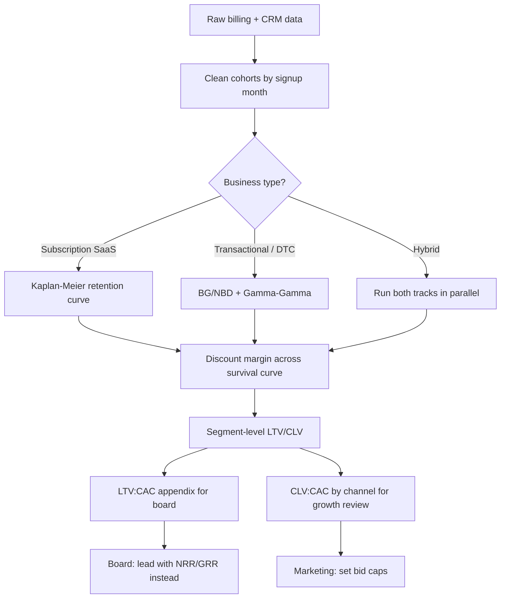

### Direct Answer

LTV (lifetime value) and CLV (customer lifetime value) describe the same underlying idea — the total gross-margin dollars a customer generates before they churn — but in practice they have diverged into two distinct calculation traditions, and confusing them is one of the most common ways SaaS founders lose credibility in a board meeting. **LTV** is the SaaS-finance shorthand: a single blended ratio, almost always paired with CAC, computed as average gross-margin-adjusted ARR per account divided by a churn-derived lifetime, used for one job — proving the LTV:CAC unit-economics story. **CLV** is the marketing-science and DTC tradition: a per-customer, cohort-aware, probabilistically modeled forecast (BG/NBD, Gamma-Gamma, Kaplan-Meier survival curves) that predicts what a *specific* customer or segment is worth so you can decide how much to spend acquiring them. For SaaS board reporting, neither belongs on the primary scorecard as a headline number — boards in 2026 anchor on **net revenue retention (NRR)**, **gross revenue retention (GRR)**, **CAC payback months**, and the **Rule of 40**, because those are auditable and harder to game. LTV:CAC belongs in the appendix as a *directional cohort efficiency check*; CLV belongs in the marketing and growth operating reviews where acquisition-spend decisions actually get made.

### TLDR

- **Same concept, two dialects.** LTV is the finance/SaaS ratio dialect (blended, churn-derived, paired with CAC). CLV is the marketing-science/DTC dialect (per-customer, probabilistic, cohort-aware). The acronym you use signals which room you grew up in.
- **The headline number is a trap.** A single company-wide LTV figure hides churn-rate fragility, cohort decay, and survivorship bias. Sophisticated boards (ICONIQ, Bessemer, Insight) distrust it on sight.
- **Boards anchor on retention, not lifetime value.** NRR and GRR are the audited truth; LTV:CAC is a derived, assumption-heavy ratio. Lead the board deck with retention; relegate LTV:CAC to the appendix.
- **The "LTV:CAC should be 3:1" rule is folklore.** It has no analytical basis. What matters is CAC payback under ~18 months, NRR above 110% for enterprise, and whether your LTV model uses a defensible churn assumption.
- **For hybrid SaaS + transactional businesses, you must disclose both.** A usage-based or marketplace-flavored SaaS company needs CLV-style cohort modeling for the transactional layer and LTV:CAC for the subscription layer — and ASC 606 governs how you recognize each.
- **Build CLV with survival analysis or BTYD models, not a naive 1/churn formula.** Kaplan-Meier curves and BG/NBD + Gamma-Gamma stop you from over-crediting lifetime in your first 12 months of data.

## Section 1: The Core Distinction — Why Two Acronyms Exist For One Idea

### 1.1 The shared definition both camps agree on

Strip away the tribal vocabulary and LTV and CLV point at the identical economic object: **the sum of gross-margin dollars a customer will generate across the entire relationship, discounted to present value, before they churn.** Every serious practitioner — whether they came up through a CFO's office or through a performance-marketing team — agrees on that sentence. The disagreement is never about *what* lifetime value is. It is about *how you compute it*, *at what grain*, and *what decision it feeds*.

That is why arguing "LTV vs CLV" as if they are rival metrics is a category error. They are two **calculation traditions** that evolved in two different rooms to answer two different questions. Understanding which tradition a number came from tells you how much to trust it and what you are allowed to do with it.

| Dimension | LTV (SaaS-finance tradition) | CLV (marketing-science / DTC tradition) |
|---|---|---|
| Grain | Blended, company-wide or segment-wide average | Per-customer or per-cohort, often per-individual |
| Primary pairing | Always paired with CAC as a ratio | Paired with acquisition cost per channel/campaign |
| Time horizon | Implied infinite or capped (e.g., 5-year) | Explicit forecast window (12, 24, 36 months) |
| Math style | Deterministic formula: ARR x margin / churn | Probabilistic models (BG/NBD, Gamma-Gamma, KM) |
| Churn handling | Single average churn rate | Survival curve; churn probability varies over time |
| Primary consumer | CFO, board, investors | CMO, growth lead, performance marketing |
| Core decision it feeds | "Are our unit economics sound?" | "How much can I bid to acquire this segment?" |
| Failure mode | Survivorship bias, churn over-optimism | Overfitting, model fragility on thin data |

### 1.2 Where LTV came from

The LTV:CAC ratio entered SaaS orthodoxy through the venture community in the early 2010s. **David Skok** of Matrix Partners popularized it through his "For Entrepreneurs" essays, and it was picked up and codified by **Bessemer Venture Partners** in its early "State of the Cloud" reports and by **Tomasz Tunguz** at Redpoint. The appeal was simplicity: a single ratio that, if it cleared a threshold, supposedly proved a SaaS business was "fundable." The folklore number — **3:1** — attached itself to the metric almost immediately and has been nearly impossible to dislodge since, despite having no rigorous derivation.

LTV in this tradition is deliberately blunt. It exists to be put next to CAC and produce one number a partner meeting can react to in thirty seconds. Its blindness to cohort variance and churn-curve shape is not an accident — it is the price of being a single number.

### 1.3 Where CLV came from

CLV has older and more academic roots. It comes out of **direct marketing**, **database marketing**, and ultimately the work of marketing scientists like **Peter Fader** at Wharton, whose buy-till-you-die (BTYD) modeling — BG/NBD for purchase frequency, Gamma-Gamma for monetary value — became the rigorous backbone of customer-base analysis. The DTC and e-commerce world adopted CLV because those businesses are *transactional*: customers do not sit on a tidy monthly subscription, they buy irregularly, and you genuinely need a probabilistic forecast of whether a given buyer will ever come back.

Tools like **Klaviyo (KVYO)**, **ChartMogul**, and the analytics layers inside **Shopify (SHOP)** institutionalized CLV for that audience. When a DTC operator says "CLV," they mean a modeled, per-customer forecast — and they are usually right to, because their business genuinely demands it.

### 1.4 The practical translation table

When you walk into a room, decode the acronym by who is using it:

| If the speaker is... | And says "LTV/CLV"... | They probably mean... | Trust it for... |
|---|---|---|---|
| A SaaS CFO | "LTV" | Blended ARR x margin / churn | Directional unit-economics check |
| A VC partner | "LTV:CAC" | The 3:1 folklore ratio | A screening heuristic, nothing more |
| A growth/performance marketer | "CLV" | Per-channel modeled value | Bid caps and channel allocation |
| A DTC operator | "CLV" or "LTV" interchangeably | BG/NBD per-customer forecast | Acquisition spend decisions |
| A data scientist | "CLV" | A survival or BTYD model output | Cohort-level forecasting |
| A board auditor | Neither — they ask for NRR/GRR | Audited retention | The actual scorecard |

Cross-link: see **q416** on separating NRR, GRR, and logo retention, and **q414** on calculating true CAC payback — both are the metrics that should outrank LTV on a board deck.

## Section 2: The Two Calculation Methods — Formulas, Worked Examples, And Where They Break

### 2.1 The naive SaaS LTV formula and its three lies

The textbook SaaS LTV formula is:

`LTV = (ARPA x Gross Margin %) / Customer Churn Rate`

Worked example: a company with **$12,000 ARPA**, **80% gross margin**, and **10% annual churn**:

`LTV = ($12,000 x 0.80) / 0.10 = $96,000`

This number is seductive and almost always wrong in three specific ways.

**Lie one — the single churn rate.** Dividing by a single churn rate assumes churn is constant forever. It is not. Early-tenure customers churn far faster than seasoned ones; a blended 10% might be 25% in months 1–6 and 4% after year two. Using the blended figure over-credits lifetime dramatically.

**Lie two — no discounting.** $96,000 spread over an implied ten-year life is worth far less than $96,000 today. A defensible model discounts future cash at a real cost of capital (often 10–15% for venture-stage SaaS in 2026's rate environment).

**Lie three — survivorship optimism.** If you compute churn only on customers who have been around long enough to churn, you systematically exclude the fast-churning recent cohorts that have not yet had time to leave. This biases churn *down* and LTV *up*.

| Formula variant | LTV output | Why it differs |
|---|---|---|
| Naive: ARPA x margin / churn | $96,000 | Ignores discounting and churn-curve shape |
| Discounted (12% WACC) | ~$57,000 | Present-values future margin |
| Cohort-adjusted churn curve | ~$41,000 | Uses real early-tenure churn |
| Capped 5-year horizon | ~$33,000 | Conservative; what auditors prefer |

The spread — $96K down to $33K — is the entire problem. Same business, four "correct" formulas, a 3x range. This is why a single headline LTV is meaningless without disclosing the method.

### 2.2 The defensible SaaS LTV: survival-based

The correct SaaS LTV uses a **retention curve**, not a churn rate. You take each cohort's observed retention by month, fit or extrapolate a survival function, and sum discounted gross margin across the survival-weighted life:

`LTV = Σ (t=1..N) [ ARPA_t x GM% x S(t) ] / (1 + r)^t`

where `S(t)` is the probability of survival to month `t` and `r` is the monthly discount rate. `S(t)` is best estimated with **Kaplan-Meier** survival analysis, which handles censored data (customers still active) correctly.

### 2.3 The CLV method: BTYD and Gamma-Gamma

For transactional or usage-based businesses, the gold standard is the **BG/NBD + Gamma-Gamma** stack:

- **BG/NBD** models how many future transactions a customer will make, given their recency and frequency, and the probability they have silently "died."
- **Gamma-Gamma** models the average monetary value per transaction, conditioned on observed spend.
- Multiply the two, discount, and you get a per-customer CLV forecast.

| Model | What it predicts | Best for | Key inputs |
|---|---|---|---|
| Naive 1/churn | Blended lifetime | Quick SaaS gut-check | ARPA, margin, churn |
| Kaplan-Meier survival | Retention curve S(t) | Subscription SaaS LTV | Cohort retention by month |
| BG/NBD | Future transaction count | Transactional / DTC | Recency, frequency, tenure |
| Gamma-Gamma | Spend per transaction | Transactional / DTC | Monetary value per order |
| Pareto/NBD | Future transactions (continuous) | Contractual-lite | Recency, frequency |
| Markov / ML uplift | Per-customer CLV with covariates | Mature data teams | Full feature set |

### 2.35 Why BG/NBD beats a spreadsheet guess

The instinct of a finance team facing a transactional business is to compute "average revenue per customer times average number of repeat purchases." This fails for a specific, well-understood reason: it treats every customer as average, when transactional customer bases are violently heterogeneous. A small fraction of customers buy constantly; a large fraction buy once and vanish. The average sits in a valley where almost no real customer lives.

BG/NBD fixes this by modeling two distributions explicitly. First, it assumes each customer has their own latent purchase rate, drawn from a Gamma distribution across the population — some customers are simply more active than others, and the model learns the *spread*, not just the mean. Second, it assumes that after any purchase a customer has a fixed probability of becoming permanently inactive ("dropping out"), and that this dropout probability also varies across the population via a Beta distribution. Given a customer's observed recency (how long since their last purchase) and frequency (how many purchases), the model produces a *probability they are still alive* and an *expected future transaction count*. A customer who bought ten times but not in six months is flagged as probably dead; a customer who bought twice but last week is flagged as probably alive. A spreadsheet average cannot make that distinction; BG/NBD makes it the centerpiece.

Gamma-Gamma then handles the money. It models each customer's average spend per transaction as itself a draw from a Gamma distribution, conditioned on observed spend, so a customer with three large orders is credited a higher per-transaction value than one with three small orders. Multiply the expected transaction count by the modeled spend, discount, and you have a per-customer CLV that respects how different your customers actually are.

| Approach | Treats customers as | Handles "is this customer dead?" | Output |
|---|---|---|---|
| Spreadsheet average | Identical | No | One number for everyone |
| RFM segmentation | A few tiers | Crudely (recency tier) | Tier rankings |
| BG/NBD + Gamma-Gamma | Fully heterogeneous | Yes — explicit probability | Per-customer forecast |
| Markov / ML | Heterogeneous + covariates | Implicitly | Per-customer with drivers |

### 2.4 A worked CLV cohort example

Consider a usage-based SaaS product with a $200 average monthly invoice, 70% gross margin, and the following observed cohort retention:

| Month | Customers active | Retention S(t) | Margin generated | Discounted @1%/mo |
|---|---|---|---|---|
| 0 | 1,000 | 100% | $140,000 | $140,000 |
| 6 | 720 | 72% | $100,800 | $94,900 |
| 12 | 560 | 56% | $78,400 | $69,600 |
| 24 | 410 | 41% | $57,400 | $45,200 |
| 36 | 330 | 33% | $46,200 | $32,200 |

Summing discounted margin across all 36 months (not just the rows shown) yields a cohort CLV near **$2,050 per acquired customer** — versus a naive `1/churn` estimate that would have printed closer to **$3,400**. The 40% gap is exactly the over-optimism a board's auditors will catch.

Cross-link: **q407** covers whether your Salesforce config is leaving cohort data on the table — clean cohort data is the precondition for any of this modeling.

## Section 3: Why Boards Do Not Want LTV As A Headline Metric

### 3.1 The auditability problem

A board metric must survive an auditor and a skeptical lead director. **NRR and GRR are auditable** — they tie directly to recognized revenue under ASC 606 and can be reconciled to the general ledger. **LTV is not auditable** — it is the product of assumptions (churn projection, discount rate, horizon, margin allocation) that the company itself chooses. Two honest CFOs at the same company can produce LTV figures 2x apart and both be defensible. No auditor will sign that.

This is the single most important reason LTV does not belong on the primary board scorecard. It is a *derived, assumption-laden* number in a room that runs on *measured, reconciled* numbers.

### 3.2 What sophisticated boards anchor on instead

Investors like **ICONIQ Growth**, **Bessemer Venture Partners**, and **Insight Partners** publish benchmark frameworks every year, and none of them lead with LTV. The 2026 board-grade scorecard looks like this:

| Metric | Why boards trust it | Healthy range (2026) | Auditable? |
|---|---|---|---|
| Net Revenue Retention (NRR) | Measures expansion vs. churn on existing base | 110–130% (enterprise) | Yes |
| Gross Revenue Retention (GRR) | Pure leak rate; cannot be masked by upsell | 85–95% (enterprise) | Yes |
| CAC Payback (months) | Cash-recovery speed; ties to runway | 12–18 months | Mostly |
| Rule of 40 | Growth + FCF margin balance | >=40 | Yes |
| Magic Number | Sales efficiency on incremental ARR | 0.75–1.5 | Mostly |
| Burn Multiple | Net burn per net new ARR | <1.5x | Yes |
| LTV:CAC | Directional efficiency check | 3–5x | No — appendix only |

Notice LTV:CAC is at the bottom and flagged "appendix only." That placement is deliberate and is what a credible founder signals fluency by doing themselves.

### 3.3 The gaming problem

Any metric a CEO is compensated against gets gamed; the question is how *easily*. LTV is trivially gamed because its inputs are discretionary:

- **Lower the assumed churn rate** by a single point and LTV swings 10–20%.
- **Extend the horizon** from 5 years to 7 and LTV jumps again.
- **Allocate margin generously** to the subscription line and LTV climbs.

NRR and GRR resist this because they are computed from *what already happened* to a *named cohort* over a *closed period*. There is far less room to flatter them. A board that has been burned before — and most have — instinctively down-weights metrics with discretionary inputs.

### 3.4 The "3:1" folklore

The single most damaging artifact in SaaS metrics culture is the belief that **LTV:CAC should be 3:1**. There is no analytical basis for 3:1. It was a rule of thumb that hardened into dogma. Worse, it is easy to *hit* 3:1 with a bad business (just over-credit LTV) and easy to *miss* it with a great business (early-stage companies with heavy CAC and immature cohorts will look like 1.5:1 even when they are excellent).

| Claim about LTV:CAC | Reality |
|---|---|
| "3:1 is the target" | No derivation; folklore. Payback months matter more. |
| "Higher is always better" | Very high LTV:CAC often means *underinvesting* in growth |
| "It proves the business works" | It proves nothing without the underlying churn assumption |
| "Boards want to see it" | Sophisticated boards want NRR/GRR; LTV:CAC is appendix |
| "It is comparable across companies" | Almost never — methods differ too much |

A LTV:CAC of 8:1 is frequently a *red flag*, not a trophy: it usually means the company is starving its acquisition engine and leaving growth on the table. Cross-link: **q417** explains the Rule of 40, the metric that actually balances growth against efficiency.

## Section 4: When CLV/LTV Genuinely Matters — And Who Should Own It

### 4.1 The decision LTV is actually for

LTV is not useless — it is *misplaced* when treated as a board headline. Its legitimate home is the **marketing and growth operating review**, where the question is concrete: "Given what a customer in segment X is worth, how much can we afford to spend acquiring them?" That is a real, recurring, money-moving decision, and a per-segment LTV (or CLV) estimate is exactly the right input.

| Question | Right metric | Right owner | Right forum |
|---|---|---|---|
| "Are our unit economics sound?" | CAC payback, NRR | CFO | Board |
| "How much can we bid for segment X?" | Segment CLV | Growth lead | Growth review |
| "Which channel is most efficient?" | CLV / CAC by channel | Performance marketing | Marketing review |
| "Should we raise prices?" | NRR, GRR, churn curve | CFO + CRO | Pricing committee |
| "Is this cohort decaying?" | Cohort retention curve | RevOps / data | RevOps review |

### 4.2 Segment-level CLV is the useful grain

A blended company LTV averages enterprise and SMB, annual and monthly, expansion-heavy and flat — and the average describes no real customer. Segment-level CLV is where the metric earns its keep:

| Segment | CLV (modeled) | Blended CAC | CLV:CAC | Action |
|---|---|---|---|---|
| Enterprise, annual | $310,000 | $54,000 | 5.7x | Invest aggressively |
| Mid-market, annual | $88,000 | $19,000 | 4.6x | Invest |
| SMB, monthly | $14,500 | $7,200 | 2.0x | Hold / optimize CAC |
| Self-serve / PLG | $3,100 | $480 | 6.5x | Scale channel |
| Partner-sourced | $42,000 | $3,900 | 10.8x | Lean in hard |

This table makes decisions. The blended average of all five would tell a marketer nothing.

### 4.3 CLV for DTC and hybrid businesses

For DTC and transactional businesses, CLV is not optional appendix material — it is the central operating metric, because there is no subscription contract to anchor on. Operators here lean on **Klaviyo (KVYO)** for predicted CLV scores and **ChartMogul** for subscription-flavored cohorts. Investors specializing in consumer brands — **L Catterton** in premium DTC — explicitly underwrite on cohort CLV curves, because in a transactional business the cohort decay curve *is* the business model.

A hybrid SaaS company (subscription core plus a usage-based or marketplace layer) must run *both* traditions in parallel: LTV:CAC for the subscription book, BG/NBD-style CLV for the transactional layer. Cross-link: **q416** on the retention metrics that sit above both.

### 4.4 The RFM bridge

Before you have enough data for full BTYD modeling, **RFM** (Recency, Frequency, Monetary) segmentation is the practical bridge. It is not a forecast — it is a ranking — but it lets you act on customer value early and is the on-ramp most teams use before graduating to BG/NBD.

| RFM tier | Recency | Frequency | Monetary | CLV implication |
|---|---|---|---|---|
| Champions | Very recent | High | High | Highest CLV — protect |
| Loyal | Recent | Medium-high | Medium | Strong CLV — expand |
| At-risk | Stale | Was high | High | CLV decaying — win-back |
| Hibernating | Very stale | Low | Low | Near-zero forward CLV |
| New | Very recent | Low (1) | Unknown | CLV unmodeled — observe |

## Section 5: Building A Defensible LTV/CLV Model — The Operating Playbook

### 5.1 The build sequence

### 5.2 The data foundation

You cannot model lifetime value on dirty data. The precondition checklist:

- **Clean cohort assignment.** Every customer tagged to a signup/first-invoice month, immutably.
- **Reconciled billing.** Modeled revenue must tie to the GL — see ASC 606 treatment in 5.4.
- **Margin allocation.** A defensible, documented method for splitting COGS to revenue lines.
- **Censoring flags.** Active customers marked as censored, not treated as "survived forever."
- **Channel attribution.** CAC must be allocable by channel to make CLV:CAC actionable.

### 5.3 The disclosure standard

When you put any LTV/CLV figure in front of a board or investor, disclose the method *in the same slide*. The minimum disclosure block:

| Disclosure item | Why it matters |
|---|---|
| Churn / retention method | Single-rate vs. survival curve changes output 2x |
| Discount rate used | Undiscounted LTV is overstated |
| Time horizon | Infinite vs. 5-year capped is a big swing |
| Margin definition | Gross margin vs. contribution margin |
| Segment vs. blended | Blended hides everything |
| Data window | Thin data = fragile model |

### 5.4 ASC 606 and revenue recognition

**ASC 606** governs *when* and *how much* revenue you recognize, and it interacts directly with LTV modeling. Subscription revenue is recognized ratably over the contract term; usage-based revenue is recognized as consumed; setup and onboarding fees may be separate performance obligations. Your LTV model must use **recognized** revenue, not bookings or invoiced amounts, or it will diverge from the audited financials the board sees — and that divergence is exactly what destroys credibility. For hybrid businesses this is acute: the subscription and transactional layers recognize revenue on different schedules, so a single blended LTV silently mixes two recognition regimes.

### 5.45 Common modeling mistakes and how to catch them

Even teams that know to use survival analysis make recurring errors. A pre-flight checklist before any LTV/CLV figure leaves the building:

**Mistake — treating active customers as churned.** If your retention query computes "customers active at month 12 divided by customers in cohort," but the cohort includes customers who only signed up eight months ago, those eight-month customers are counted as *not* reaching month 12 — even though they simply have not had the chance yet. This is left-censoring done wrong, and it crushes apparent retention. The fix: only include customers in a month-N retention figure if they have *had the opportunity* to reach month N.

**Mistake — extrapolating a flat tail too optimistically.** Beyond your observed data, you must assume *something* about retention. A flat assumption ("retention holds at 94% forever") is common and usually too generous. A modest continued decay is safer. Always disclose where observed data ends and extrapolation begins.

**Mistake — mixing pricing eras.** If you raised prices 18 months ago, cohorts before and after the change have different ARPA and possibly different churn. Blending them produces a number that describes no current customer. Model post-change cohorts separately for any forward-looking figure.

**Mistake — using bookings instead of recognized revenue.** A three-year prepaid deal books $300K today but recognizes $100K/year. An LTV model fed bookings front-loads value that ASC 606 spreads out, and the result will not reconcile to the audited P&L.

**Mistake — ignoring contraction.** Customers who downgrade but do not cancel are not churned, but they reduce cohort value. A model that only tracks logo survival misses contraction entirely and overstates per-survivor value.

| Mistake | Symptom | Fix |
|---|---|---|
| Active treated as churned | Retention looks too low | Opportunity-window filter |
| Optimistic flat tail | LTV looks too high | Modest continued decay |
| Mixed pricing eras | Number describes no real customer | Segment by pricing cohort |
| Bookings not recognized revenue | Diverges from audited P&L | Use ASC 606 recognized revenue |
| Ignoring contraction | Per-survivor value overstated | Track revenue, not just logos |

### 5.5 Tooling

| Tool | Best at | Tradition |
|---|---|---|
| ChartMogul | SaaS cohort retention, NRR/GRR | LTV / subscription |
| Klaviyo (KVYO) | Predicted CLV scores, DTC | CLV / transactional |
| Snowflake (SNOW) + dbt | Custom survival / BTYD modeling | Both |
| Lifetimes / PyMC (open source) | BG/NBD, Gamma-Gamma in Python | CLV |
| Maxio / Recurly | Billing-grade cohort revenue | LTV / subscription |
| Tableau / Looker | Board-ready cohort visualization | Both |

## Section 6: Deep Dive On Churn — The Single Assumption That Breaks Every LTV Model

### 6.1 Why churn is the load-bearing wall

If you change one input in an LTV model and watch the output, churn is the one that moves it most violently. ARPA is observed and stable. Gross margin moves slowly. The discount rate is a judgment call but bounded. Churn, by contrast, is *projected* — you are guessing how customers who have not yet churned will behave — and a one-percentage-point error compounds across the entire implied lifetime. At 10% churn, lifetime is 10 years; at 8% churn, lifetime is 12.5 years; at 12% churn, lifetime is 8.3 years. The same business, plus or minus two points of a number nobody can measure precisely, swings implied lifetime by 50%. That is why every serious critique of LTV is really a critique of the churn assumption inside it.

### 6.2 The many faces of churn

"Churn" is not one number. A board-grade LTV model must specify *which* churn it used:

| Churn type | What it measures | Effect on LTV |
|---|---|---|
| Logo / customer churn | % of accounts lost | The classic LTV denominator |
| Gross revenue churn | % of recurring revenue lost | More conservative; ignores upsell |
| Net revenue churn | Revenue lost minus expansion | Can be negative for great SaaS |
| Early-tenure churn | Churn in months 1–6 | Usually 2–3x the blended rate |
| Voluntary churn | Customer chose to leave | Addressable by product/CS |
| Involuntary churn | Failed payments, card expiry | Addressable by billing ops |
| Seasonal churn | Cyclical leave/return | Distorts blended averages |

A model that divides ARPA by "10% churn" without saying *which* of these seven it means is not a model — it is a guess wearing a formula.

### 6.3 The negative-churn temptation

A celebrated feature of great SaaS businesses is **negative net revenue churn** — expansion from the existing base exceeds the revenue lost to cancellations, so the cohort grows in value even as logos leave. This is real and worth celebrating. But it creates a dangerous LTV temptation: if net revenue churn is negative, the naive `1/churn` formula divides by a negative number and produces an *infinite or negative LTV*. Founders sometimes present this as "our LTV is effectively infinite." It is not. Negative churn is a property of *surviving* cohorts; the logos that left still left. A correct model uses logo or gross churn for the survival curve and treats expansion as a separate per-survivor revenue ramp. Conflating the two produces fantasy numbers that a sharp board member will dismantle in one question.

### 6.4 Churn-curve shape: the decay you cannot ignore

Real retention curves are not exponential — they are **convex and flattening**. Customers churn fast early, then the survivors stabilize. A KM curve typically shows a steep first-six-month drop and a long, shallow tail. The naive single-rate model assumes a *constant hazard* (pure exponential decay), which is wrong in both directions: it over-predicts churn for the loyal tail and under-predicts it for the fragile early months. The fix is to model the hazard as time-varying — a Weibull survival fit, or simply using observed cohort retention for the months you have data and a conservative flat extrapolation thereafter.

| Cohort age | Naive constant 10% | Real observed curve |
|---|---|---|
| Month 0–6 | 95% retained | 78% retained |
| Month 7–12 | 90% retained | 70% retained |
| Month 13–24 | 81% retained | 62% retained |
| Month 25–36 | 73% retained | 57% retained |
| Month 37–48 | 66% retained | 54% retained |

The naive model and the real curve disagree most in the early months — exactly the months that dominate a discounted LTV calculation. This is why early-tenure churn deserves its own line in any disclosure.

### 6.5 The cohort-maturity trap

A subtle and common error: computing LTV on a customer base that is *young on average*. If most of your customers signed up in the last 18 months, you have no observed data on what year-four retention looks like — you are extrapolating the entire tail. Fast-growing companies are *especially* exposed here because rapid growth means the customer base skews young: the more successfully you are adding logos, the less mature your average cohort, the more of your LTV is extrapolation. A disciplined model discloses **what fraction of the LTV figure is observed versus extrapolated** and refuses to present a confident number when, say, 70% of the lifetime value sits in months you have never actually observed.

Cross-link: **q416** breaks down NRR versus GRR versus logo retention — the three churn lenses every board scorecard should show side by side rather than collapsing into one LTV denominator.

## Section 7: Industry Benchmarks And How To Read Them Honestly

### 7.1 The benchmark landscape

Every SaaS investor and several independent shops publish annual benchmark reports, and founders reflexively compare their numbers to them. Used carefully, benchmarks are useful sanity checks; used carelessly, they invite exactly the metric-gaming the rest of this answer warns against. The major sources:

| Publisher | Report | Strength | Watch-out |
|---|---|---|---|
| ICONIQ Growth | Topline Growth & Efficiency | Late-stage, large sample | Skews to scaled companies |
| Bessemer (BVP) | State of the Cloud | Public-market context | Public-co data, not private |
| KeyBanc | Annual SaaS Survey | Broad private-co sample | Self-reported |
| OpenView | SaaS Benchmarks | PLG-heavy coverage | PLG bias |
| SaaS Capital | Retention Benchmarks | Private-co retention focus | Smaller companies |
| Battery Ventures | OpenCloud | Operating metrics depth | Late-stage skew |
| Carta | SaaS Benchmarks | Cap-table-linked data | Early-stage skew |

### 7.2 Reading retention benchmarks without fooling yourself

The headline benchmark numbers — "good NRR is 110–120%," "good GRR is 90%+" — are *medians across a sample that is not your company*. Before comparing, you must segment-match: NRR for a $1M-ARR seed company and a $200M-ARR growth company are not the same metric in practice. The honest comparison procedure:

| Step | Action |
|---|---|
| 1 | Match the benchmark cohort to your ARR band |
| 2 | Match the go-to-market motion (PLG vs. sales-led) |
| 3 | Match the customer segment (SMB vs. enterprise) |
| 4 | Confirm the benchmark's churn definition matches yours |
| 5 | Compare *trend*, not just level — direction matters more |

### 7.3 LTV:CAC benchmarks specifically

Because LTV:CAC is the least standardized metric in the stack, its benchmarks are the least trustworthy. When a report says "median LTV:CAC is 4x," it is averaging companies that used a dozen incompatible LTV methods. The only honest use of an LTV:CAC benchmark is *within your own company over time*, using a *fixed method* — is our cohort efficiency improving or degrading? Cross-company LTV:CAC comparison is essentially meaningless and any board member who anchors hard on it is revealing they have not thought about it carefully.

| Benchmark metric | Cross-company comparable? | Best use |
|---|---|---|
| NRR | Reasonably — definitions converged | Level + trend |
| GRR | Reasonably | Level + trend |
| CAC payback | Somewhat | Level + trend |
| Rule of 40 | Yes — well standardized | Level |
| LTV:CAC | No — methods diverge wildly | Internal trend only |
| Magic number | Somewhat | Trend |

### 7.4 The growth-stage adjustment

Benchmarks shift dramatically by stage, and a seed-stage founder comparing to a growth-stage benchmark will needlessly panic — or, worse, game their numbers to "hit" a benchmark that was never meant for them.

| Stage | NRR (typical) | GRR (typical) | CAC payback | LTV:CAC posture |
|---|---|---|---|---|
| Seed / pre-PMF | Highly variable | 70–85% | Often unmeasurable | Do not present |
| Series A | 100–110% | 80–88% | 18–24 months | Directional only |
| Series B/C | 110–120% | 85–92% | 14–18 months | Appendix |
| Growth / pre-IPO | 115–130% | 88–94% | 12–15 months | Appendix |
| Public | 105–120% | 90–95% | 12–18 months | Disclosed cautiously |

### 7.5 The macro-environment adjustment

Benchmarks also drift with the macro cycle, and a 2026-era founder must read them through that lens. In the zero-interest-rate era, growth was rewarded almost regardless of efficiency, CAC payback periods of 24-plus months were tolerated, and a high LTV:CAC built on optimistic churn went unchallenged. The repricing that followed flipped the priority order: efficiency metrics — CAC payback, burn multiple, the Rule of 40 — moved to the front of the board deck, and the discount rate inside any LTV model rose with the cost of capital. A lifetime value computed at a 6% discount rate in 2021 and the same business computed at 12% in 2026 will print materially different numbers with no change in the underlying business. This is yet another reason a headline LTV is fragile: it silently embeds a macro assumption. When you present lifetime value, state the discount rate and acknowledge that it tracks the cost of capital. A board that lived through the repricing will respect that you said it out loud.

Cross-link: **q417** on the Rule of 40 — the one metric in this table that *is* genuinely standardized and cross-comparable.

## Section 8: The Investor Lens — How Diligence Teams Actually Use LTV And CLV

### 8.1 What happens to your LTV number in a data room

When you raise a growth round, your LTV:CAC slide does not get accepted at face value — it gets *rebuilt*. A diligence team at **Insight Partners**, **ICONIQ Growth**, or a PE firm like **Vista Equity Partners** will request raw cohort data, billing exports, and the CAC ledger, and they will reconstruct lifetime value themselves using their own house method. They do this precisely because they know LTV is method-dependent. If your number and their reconstruction diverge by more than a modest margin, the conversation shifts from "how big is this opportunity" to "why is the founder's model optimistic" — and that is a conversation no founder wants. The defensive move is to build your model the way a diligence team would, disclose the method, and present a number you would not have to walk back.

### 8.2 The metrics diligence weights, in order

Diligence teams have a rough priority order, and LTV is not near the top:

| Priority | What diligence examines | Why it ranks here |
|---|---|---|
| 1 | GRR by cohort | Pure leak rate; cannot be hidden |
| 2 | NRR by cohort and segment | Expansion durability |
| 3 | CAC payback trend | Cash efficiency and runway |
| 4 | Logo retention curve | Survival shape, early-tenure churn |
| 5 | Rule of 40 trajectory | Growth/profit balance |
| 6 | Magic number / burn multiple | Sales and capital efficiency |
| 7 | Gross margin trend | Scalability of the model |
| 8 | LTV:CAC (reconstructed) | Directional cohort check |
| 9 | Pipeline coverage | Forward growth confidence |

LTV:CAC sits at position eight, and it is *reconstructed*, not accepted. That ranking is the single clearest evidence that LTV should not headline a board deck — the most sophisticated buyers of equity in the market treat it as a secondary, derived check.

### 8.3 The "quality of revenue" frame

Modern diligence has largely shifted from "how much revenue" to "**what quality of revenue**" — and quality is a retention-and-margin question, not a lifetime-value question. High-quality revenue is recurring, contracted, multi-year, expanding, and high-margin. Low-quality revenue is one-time, services-heavy, month-to-month, and concentrated. An LTV number cannot tell you which you have; a cohort retention table and a revenue-mix breakdown can. Diligence teams build a revenue-quality scorecard:

| Revenue-quality factor | High quality | Low quality |
|---|---|---|
| Contract length | Multi-year | Month-to-month |
| Recurrence | Subscription / committed usage | One-time / project |
| Margin | 75%+ software margin | Services-blended sub-50% |
| Concentration | No customer >10% | One customer >30% |
| Expansion | Positive net revenue retention | Flat or contracting |
| Predictability | Low forecast variance | Lumpy, hard to call |

### 8.4 LTV in PE versus VC contexts

The two investor traditions use lifetime value differently. **Venture investors** care about LTV mostly as a *growth-efficiency* signal — can this company turn capital into durable revenue faster than it burns? **Private-equity investors** underwriting a buyout care about LTV as a *cash-flow durability* signal — how predictable is the cash this asset throws off, and how defensible is the renewal base against a leverage model? The PE lens is more conservative: it favors GRR over NRR (because a buyout model cannot bank on expansion it has not yet seen), prefers capped horizons, and stress-tests the churn assumption hard. A founder talking to PE should pre-empt this by leading with GRR and a conservative, capped LTV.

| Lens | Primary LTV use | Preferred churn metric | Horizon posture |
|---|---|---|---|
| Venture (growth) | Capital-to-revenue efficiency | NRR-aware | Longer, optimistic-but-bounded |
| Private equity (buyout) | Cash-flow durability | GRR | Short, capped, conservative |
| Crossover / public | Forward revenue visibility | NRR + GRR both | Disclosed, cautious |

Cross-link: **q405** on build-versus-buy CRM economics — the long-term-cost reasoning there mirrors how diligence stress-tests any multi-year assumption.

## Section 9: Counter-Case — When This Advice Does Not Apply

Everything above assumes a venture-backed or PE-backed SaaS company reporting to a sophisticated board. That assumption does not always hold, and in several situations the guidance flips.

### 9.1 Pure DTC / e-commerce companies

If you are a pure transactional DTC brand with no subscription, the entire "relegate LTV to the appendix" advice is wrong for you. **CLV is your headline metric** — there is no NRR because there is no contractual base. A consumer-brand board backed by **L Catterton** will lead with cohort CLV curves, payback by cohort, and contribution margin after shipping. For you, CLV belongs on slide one.

### 9.2 Very early-stage companies (pre-product-market-fit)

With under ~12 months of data and a few hundred customers, *any* LTV or CLV model is statistically fragile — the survival curve is mostly extrapolation and the BTYD model is overfit. At this stage the honest move is to **not present a lifetime-value number at all**. Report raw cohort retention tables and let the board read the curve themselves. A confident LTV figure on thin data is a credibility liability, not an asset.

### 9.3 Bootstrapped / profitability-focused companies

If you are not raising venture capital and your board is yourself plus an advisor, the LTV:CAC apparatus is largely ceremony. What matters is **cash payback and current profitability**. A bootstrapped founder should track CAC payback months and monthly contribution margin and can safely ignore the modeled-lifetime machinery entirely.

### 9.4 Single-customer-concentration businesses

If 60% of revenue is one logo, *average* anything is meaningless. LTV, CLV, and blended NRR all mislead. The right disclosure is **named-account-level economics** — what each major account is worth, contracted term, renewal probability — not a statistical aggregate.

### 9.5 Infrastructure / consumption businesses with no churn signal

For pure consumption infrastructure (think a database or compute product billed on usage), a customer may never formally "churn" — they just ramp usage up or down. Survival analysis assumes a death event; here there often is not one. **Net revenue retention and net usage retention** are the right lens, and a CLV survival model can actively mislead.

The clearest public examples are the consumption-led data and compute companies. **Snowflake (SNOW)** built its entire investor narrative around net revenue retention precisely because its consumption model has no clean cancellation event — a customer can dial spend down to near zero and back up again, and a binary "alive/dead" survival model would mislabel both the dip and the recovery. **Datadog (DDOG)** and **MongoDB (MDB)** report the same way for the same reason. If you operate a consumption business and someone asks for your LTV, the honest answer is to redirect: "We do not model lifetime value with a survival curve because we have no discrete churn event; we track net revenue retention by cohort, which captures both contraction and expansion." That redirection is itself a mark of metric sophistication.

### 9.6 Professional services and project-based businesses

A business whose revenue is mostly implementation, consulting, or project work — not recurring software — should not present LTV at all. Project revenue does not recur by default; each engagement is won fresh. The relevant metrics are utilization, project margin, and repeat-engagement rate. Dressing project revenue up in a SaaS LTV frame is one of the fastest ways to lose a sophisticated investor's trust, because they will immediately see that the "lifetime" is a sequence of separately-won deals, not a durable subscription.

| Counter-case | Standard advice that fails | Honest alternative |
|---|---|---|
| Consumption infra | Survival-based LTV | Net revenue / usage retention |
| Professional services | Any recurring LTV frame | Utilization, project margin, repeat rate |

| Counter-case | Why standard advice fails | Use instead |
|---|---|---|
| Pure DTC | No subscription / NRR base | Cohort CLV as headline |
| Pre-PMF | Data too thin for any model | Raw retention tables |
| Bootstrapped | No VC board to satisfy | Cash payback, profit |
| Customer concentration | Averages are meaningless | Named-account economics |
| Consumption infra | No discrete churn event | NRR / net usage retention |

## Section 10: The Board Meeting — Scripts, Anti-Patterns, And Putting It Together

### 10.1 How to present it

When LTV/CLV comes up in a board meeting, the credible script is short:

> "Our board scorecard leads with NRR at 118% and GRR at 91%, and CAC payback at 14 months. We also track LTV:CAC, which is in the appendix at 4.2x — but I want to flag that it is a directional cohort check using a Kaplan-Meier survival curve and a 12% discount rate, not an audited figure. The metric I would actually watch is the month-6 retention on our last three cohorts, which is on slide 14."

That paragraph signals total fluency: you know which metrics are audited, you know LTV's limitations, you disclosed your method unprompted, and you redirected attention to the cohort curve that actually predicts the future.

### 10.2 Anti-patterns that destroy credibility

| Anti-pattern | Why it fails | The fix |
|---|---|---|
| Headline LTV with no method disclosed | Auditor cannot sign it | Disclose churn method, discount rate, horizon |
| Citing "3:1" as a target | Folklore; signals naivety | Talk payback months and NRR instead |
| Blended LTV across all segments | Describes no real customer | Show segment-level CLV table |
| Naive 1/churn formula | Over-credits lifetime 30–40% | Use survival curve |
| LTV from bookings, not recognized revenue | Diverges from audited financials | Use ASC 606 recognized revenue |
| Bragging about 8:1 LTV:CAC | Often means underinvesting in growth | Frame Rule of 40 balance |
| Changing the churn assumption between meetings | Looks like gaming | Lock the method, document it |

### 10.3 The 90-day implementation plan

| Phase | Weeks | Deliverable |
|---|---|---|
| Foundation | 1–3 | Clean cohort data, billing reconciled to GL |
| Model | 4–7 | KM survival (SaaS) and/or BG/NBD (transactional) |
| Segment | 8–9 | Segment-level LTV/CLV tables |
| Board integration | 10–11 | NRR/GRR scorecard; LTV:CAC moved to appendix |
| Growth integration | 12–13 | CLV:CAC by channel feeding bid caps |

### 10.4 Common questions, answered directly

A few recurring questions land in board prep and operating reviews, and crisp answers signal fluency.

**"Should we report LTV or CLV?"** Report neither as a headline. If you must include lifetime value, use the term your audience uses — "LTV:CAC" for a VC board, "CLV" for a growth review — and disclose the method. Consistency of method matters far more than which acronym you pick.

**"What is a good LTV:CAC?"** There is no universal answer, and saying "3:1" out loud signals you have not thought about it. The honest answer is: CAC payback under ~18 months, NRR appropriate to your segment, and an LTV computed on a defensible churn curve. A ratio in the 3–5x band computed with a *conservative* method is healthier than an 8x computed with an optimistic one.

**"Our LTV:CAC is 9:1 — is that great?"** Probably not. A very high ratio usually means you are underinvesting in acquisition and leaving growth on the table. Reframe around the Rule of 40: are you balancing growth and efficiency, or starving growth to flatter a ratio?

**"How far out should the LTV horizon go?"** For board and diligence purposes, cap it — five years is a common conservative choice — and disclose the cap. An uncapped or implied-infinite horizon overstates value and invites a credibility challenge.

**"Can we present negative churn as infinite LTV?"** No. Negative net revenue churn is a real and excellent property, but it describes surviving cohorts; the logos that left still left. Model the survival curve on logo or gross churn and present expansion as a separate per-survivor ramp.

**"We are pre-Series-A — what should we show?"** Show raw cohort retention tables and let the board read the curve. A confident LTV figure on under-12-months of data is a liability. Lead with the honest data, not a modeled number.

**"How often should we rebuild the model?"** Quarterly is typical, aligned to board cadence, but the *method* should be locked between rebuilds. Changing the churn assumption or horizon between meetings looks like gaming even when it is innocent.

| Question | One-line answer |
|---|---|
| LTV or CLV to report? | Neither as headline; match audience vocabulary |
| Good LTV:CAC? | Payback < 18mo matters more than any ratio |
| Is 9:1 great? | Usually underinvestment, not a trophy |
| Horizon length? | Cap it (e.g., 5yr) and disclose the cap |
| Negative churn = infinite LTV? | No — survivors only; logos still left |
| Pre-Series-A? | Show raw retention tables, not modeled LTV |
| Rebuild cadence? | Quarterly; lock method between rebuilds |

### 10.5 The metrics hierarchy, one last time

To make the priority order unmistakable, here is the full hierarchy of how a 2026 board should rank the metrics discussed across this answer:

| Tier | Metric | Role |
|---|---|---|
| Headline (slide 1–3) | NRR, GRR | Audited retention truth |
| Headline | CAC payback months | Cash-recovery speed |
| Headline | Rule of 40 | Growth/efficiency balance |
| Supporting | Magic number, burn multiple | Sales and capital efficiency |
| Supporting | Logo retention curve | Survival shape, early churn |
| Appendix | LTV:CAC (method disclosed) | Directional cohort check |
| Operating review only | Segment CLV | Acquisition spend decisions |
| Operating review only | CLV:CAC by channel | Bid caps and allocation |

Lifetime value — under either acronym — never appears above the appendix line for a subscription SaaS board. That single placement decision is the practical takeaway of this entire answer.

### 10.55 The credibility test, distilled

There is a simple test for whether you are handling LTV and CLV like a sophisticated operator. Imagine the most skeptical person on your cap table reads your board deck. Do they reach for a question you cannot answer cleanly? The four questions that separate fluent founders from naive ones:

**"What churn rate is inside that LTV, and where did it come from?"** A fluent founder names the method instantly — "a Kaplan-Meier survival curve on cohorts with at least 18 months of observed data, extrapolated conservatively beyond that." A naive founder hesitates, because the number came out of a spreadsheet they did not build.

**"How much of that lifetime is observed versus extrapolated?"** A fluent founder has the split ready — "about 60% observed, 40% extrapolated, and here is the curve." A naive founder has never asked themselves the question.

**"Why is this in the appendix and not on slide one?"** A fluent founder explains that LTV:CAC is a derived, assumption-laden directional check while NRR and GRR are audited — and that they lead with the audited metrics on purpose. A naive founder put it on slide one and now looks like they do not understand auditability.

**"What would change this number, and by how much?"** A fluent founder can sensitivity-test live — "drop two points of churn and it falls 15%, cap the horizon at three years and it falls another 20%." A naive founder presents LTV as a single hard number, which is the tell that they do not understand it is a model output.

Pass those four and the board trusts your numbers. Fail them and every figure you present for the rest of the meeting is discounted. The metric itself matters far less than demonstrating that you know exactly what it is, what it hides, and where it belongs.

### 10.6 Final synthesis

LTV and CLV are the same idea wearing two uniforms. **LTV** is the finance uniform — blunt, blended, paired with CAC, built for a thirty-second board reaction. **CLV** is the marketing-science uniform — granular, probabilistic, cohort-aware, built to decide acquisition spend. The mistake is not using one or the other; the mistake is putting *either* on the front page of a board deck as a headline. Boards in 2026 run on audited retention — NRR, GRR — and on cash-speed metrics like CAC payback and the Rule of 40. LTV:CAC is a useful *directional* check that belongs in the appendix with its method disclosed. CLV is a powerful *operating* tool that belongs in the growth review where bid caps get set. Know which room you are in, decode the acronym by who said it, disclose your method every time, and never, ever cite 3:1 as if it were a law of nature.

### Sources

1. David Skok, "SaaS Metrics 2.0," For Entrepreneurs (Matrix Partners).
2. Bessemer Venture Partners, "State of the Cloud 2026."
3. Bessemer Venture Partners, "The BVP Nasdaq Emerging Cloud Index."
4. ICONIQ Growth, "Topline Growth and Operational Efficiency 2026."
5. Insight Partners, "ScaleUp: SaaS Metrics Benchmarks."
6. Tomasz Tunguz, "The LTV:CAC Ratio Is Misleading," Redpoint.
7. Peter Fader & Bruce Hardie, "Counting Your Customers the Easy Way: An Alternative to the Pareto/NBD Model" (BG/NBD).
8. Peter Fader, Bruce Hardie & Ka Lok Lee, "RFM and CLV: Using Iso-Value Curves for Customer Base Analysis."
9. Fader & Hardie, "The Gamma-Gamma Model of Monetary Value."
10. Kaplan & Meier, "Nonparametric Estimation from Incomplete Observations," Journal of the American Statistical Association.
11. FASB, ASC 606: "Revenue from Contracts with Customers."
12. ChartMogul, "SaaS Retention Benchmarks Report."
13. KeyBanc Capital Markets, "Annual SaaS Survey."
14. OpenView Partners, "SaaS Benchmarks Report."
15. SaaS Capital, "Retention Benchmarks for Private SaaS Companies."
16. Klaviyo (KVYO) Investor Relations, predicted CLV methodology documentation.
17. Shopify (SHOP) merchant analytics documentation, cohort and LTV reporting.
18. Snowflake (SNOW) Investor Relations, net revenue retention disclosures.
19. L Catterton, consumer-brand underwriting frameworks (public commentary).
20. a16z, "16 Startup Metrics" and "16 More Startup Metrics."
21. Wharton Customer Analytics, BTYD modeling course materials.
22. "lifetimes" Python library documentation (BG/NBD and Gamma-Gamma implementation).
23. PyMC-Marketing documentation, CLV modeling module.
24. Maxio (formerly SaaSOptics + Chargify), SaaS metrics methodology guide.
25. Recurly, "Subscription Billing Metrics" guide.
26. McKinsey, "The economics of customer lifetime value."
27. Bain & Company, "The Value of Online Customer Loyalty" (Reichheld & Schefter).
28. HubSpot Research, "Customer Acquisition Cost and LTV benchmarks."
29. Profitwell / Paddle, "The State of Subscription Retention."
30. Battery Ventures, "OpenCloud" SaaS metrics report.
31. Mosaic, "The CFO's Guide to SaaS Metrics."
32. Carta, "SaaS Benchmarks and Cap Table Data."
33. Pulse RevOps internal library, q414 (CAC payback period).
34. Pulse RevOps internal library, q416 (NRR, GRR, logo retention).
35. Pulse RevOps internal library, q417 (Rule of 40).
36. Pulse RevOps internal library, q407 (Salesforce config and cohort data).
37. Pulse RevOps internal library, q405 (build vs. buy CRM long-term cost).
