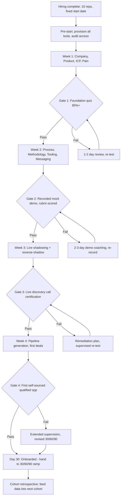

### Direct Answer

The right way to onboard 10 reps in 30 days is to treat the cohort as a manufacturing line, not a series of one-off hires: standardize a daily-gated 30-day curriculum (Week 1 product and ICP, Week 2 process and tooling, Week 3 live reps and certification, Week 4 pipeline generation and first deals), assign a dedicated onboarding owner and a 4:1 buddy ratio, and gate progression on observable competency checks rather than calendar time. Done well, a 10-rep cohort hits first-meeting-booked by Day 10, first-qualified-opportunity by Day 21, and reaches 70 to 80 percent of full ramp productivity by Day 90 — with cohort-to-cohort variance under 15 percent. The single biggest failure mode is confusing "onboarding completed" (a date) with "rep is competent" (an observed behavior); the fix is to make every week end in a pass/fail certification that a real human scores against a rubric.

> **TLDR**
> - **Onboard in cohorts, not trickles.** Ten reps starting together get a repeatable, gated 30-day program; ten reps starting on ten different days get ten improvised, low-quality experiences.
> - **Sequence the 30 days by dependency, not by topic comfort.** Week 1 = product + ICP + pain; Week 2 = process + tooling + messaging; Week 3 = live reps + certification; Week 4 = real pipeline + first deals.
> - **Gate every week with a pass/fail certification.** Calendar time is not competency. A rep who cannot pass the Week 2 demo certification does not advance to live calls.
> - **Staff it like a project.** One dedicated onboarding owner, a 4:1 buddy ratio, manager 1:1s three times per week, and an enablement budget that is planned before the reps sign offers.
> - **Instrument leading indicators.** Track activity (calls, emails, meetings booked) in Weeks 1 to 2, then pipeline-created and conversion in Weeks 3 to 4. Lagging revenue tells you nothing useful inside 30 days.
> - **The 30-day program does not finish ramp — it finishes onboarding.** Full productivity for a B2B SaaS AE is a 90-to-180-day curve; the 30-day program de-risks the first 90.
> - **Counter-case:** if you are hiring fewer than three reps, have no documented sales process, or are pre-product-market-fit, a rigid 30-day cohort program is the wrong tool — fix the prerequisites first.

---

## 1. Why the 30-Day Cohort Is the Unit of Work

### 1.1 The trickle-hire trap

Most sales organizations under 50 reps onboard the way they hire: one person at a time, whenever a req closes. This feels efficient — you avoid the "overhead" of building a program — but it is the single most expensive habit in early go-to-market scaling. Every trickle hire gets a bespoke, improvised onboarding: the manager dusts off a half-stale deck, the new rep shadows whoever is free that week, and "training" becomes a euphemism for absorption-by-osmosis.

The cohort model inverts this. You batch hires into groups of 5 to 12, set a fixed start date, and run all of them through one standardized, instrumented 30-day program. The economics are decisive. The fixed cost of building the curriculum, recording the certification rubrics, and assigning an owner is amortized across the whole cohort and every future cohort. The variable cost per rep collapses. And — critically — the quality of the experience becomes measurable, because you can compare rep-to-rep and cohort-to-cohort against the same yardstick.

This is not a theoretical preference. When **Snowflake** under **Frank Slootman** and CRO **Chris Degnan** scaled from roughly 1,500 to over 5,000 employees through its 2020 IPO window, the sales org ran cohort onboarding precisely because trickle onboarding does not survive contact with hypergrowth. **HubSpot** (HUBS), under long-time CRO Hunter Madeley and his predecessors, built one of the most-copied cohort onboarding "bootcamps" in SaaS — a structured, multi-week classroom-plus-floor program that runs on a fixed calendar. **Datadog** (DDOG) and **CrowdStrike** (CRWD) both run cohort-based new-hire academies for the same reason: at their hiring velocity, improvisation is not an option.

### 1.2 The cohort produces a flywheel, the trickle produces entropy

A cohort program improves every time it runs. Each cohort generates data — which certification gates have the highest failure rate, which week's content is weakest, which buddy pairings worked — and that data feeds the next cohort's curriculum. The trickle model has no such loop: each improvised onboarding is a sample size of one, scored by nobody, and forgotten by the next req.

| Dimension | Trickle hiring (1 at a time) | Cohort hiring (10 together) |
|---|---|---|
| Curriculum | Improvised per hire | Standardized, versioned, reused |
| Cost per rep onboarded | High (full fixed cost each time) | Low (fixed cost amortized) |
| Quality variance | Extreme — depends on who is free | Low — same program, same rubric |
| Manager time | Death by a thousand cuts | Concentrated, plannable |
| Peer learning | None | High — cohort studies together |
| Measurability | Sample of one, unscored | Cohort comparison, scored |
| Improvement loop | None | Every cohort feeds the next |
| Time-to-first-deal predictability | Wildly variable | Tight, forecastable |

### 1.3 When 10 reps in 30 days is the right ambition

Ten reps in 30 days is an aggressive but achievable target for a company that already has the prerequisites in place. It is the natural shape of onboarding when a Series B or C SaaS company has just closed a funding round and needs to convert capital into pipeline capacity quickly. It is also the right shape when you are opening a new segment or geography and want a critical mass of reps live at once so the territory does not feel under-covered.

What the 30-day window does **not** do is produce 10 fully-ramped reps. It produces 10 reps who have been onboarded — who know the product, can run the process, have passed certification, and have started generating pipeline. Full ramp is a separate, longer curve. Conflating the two is the root cause of most "our onboarding failed" post-mortems, and Section 9's counter-case treats the conflation directly.

It is worth being precise about what "the right way" means in the original question, because the phrase invites two different readings. One reading is operational: what is the correct sequence, staffing, and gating to run a 10-rep, 30-day onboarding? That is the subject of Sections 2 through 7. The other reading is strategic: under what conditions is a 10-rep, 30-day cohort even the right thing to attempt? That is the subject of Sections 1.3 and 9. A genuinely complete answer addresses both. An organization can execute a flawless 30-day program and still fail, if the underlying decision to run a 10-rep cohort was wrong for its stage — and conversely, an organization with the right prerequisites can recover from a mediocre program because the fundamentals were sound. The strategic question gates the operational one.

The companies that do this best treat onboarding as a repeatable capability, not an event. **Datadog** (DDOG) ran its sales academy on a fixed calendar precisely so that hiring could be planned against a known onboarding throughput. **CrowdStrike** (CRWD) built a structured new-hire program because its security-software motion required reps to be genuinely competent before touching enterprise accounts. **Snowflake** (SNOW), under **Frank Slootman** and CRO **Chris Degnan**, scaled its field organization through cohort onboarding because the pace of hiring left no room for improvisation. The common thread is that onboarding became a system with an owner, a curriculum, and metrics — not a favor the hiring manager did between deals.

---

## 2. The 30-Day Architecture: Sequence by Dependency

### 2.1 The four-week spine

The 30-day program is not a topic list; it is a dependency graph. Each week unlocks the next. You cannot teach a rep to handle objections before they understand the product. You cannot certify a demo before the rep can articulate the buyer's pain. You cannot send a rep into live pipeline generation before they have a working tooling stack and a certified pitch. The sequence below is ordered so that every week's content is usable only because the previous week's content is already installed.

| Week | Theme | Primary outcome | Exit gate |
|---|---|---|---|
| Week 1 (Days 1-5) | Company, product, market, ICP, buyer pain | Rep can explain what you sell, to whom, and why it matters | Product knowledge + ICP quiz, 85% pass |
| Week 2 (Days 6-12) | Sales process, methodology, tooling, messaging | Rep can run the process and operate the stack | Recorded mock demo, rubric-scored pass |
| Week 3 (Days 13-21) | Live reps, call shadowing, certification | Rep can run a real discovery call and pitch | Live discovery call certification, manager-scored |
| Week 4 (Days 22-30) | Pipeline generation, first real deals | Rep is generating pipeline and working live opps | First self-sourced qualified opportunity created |

### 2.2 Week 1 — Foundation: company, product, ICP, and pain

Week 1 answers four questions in strict order: *What does this company exist to do? What exactly do we sell? Who buys it? Why do they buy it?* The mistake almost every program makes is front-loading product feature training and back-loading buyer understanding. Reverse it. A rep who deeply understands the buyer's pain can sell a product they only half-understand; a rep who deeply understands the product but not the buyer becomes a walking feature brochure.

Day 1 is logistics, culture, and the company narrative — mission, the origin story, why the company wins. Day 2 and 3 are product: not every feature, but the three to five capabilities that map directly to buyer pain. Day 4 is the Ideal Customer Profile — firmographics, the buying committee, the trigger events that create urgency. Day 5 is buyer pain and the competitive landscape: what breaks for the customer today, what they try instead, and why those alternatives fall short.

The single highest-leverage exercise in Week 1 is the capability-to-pain matrix built on Day 3. Rather than memorizing a feature list, each rep is required to construct a two-column map: in the left column, every meaningful product capability; in the right column, the specific, named buyer pain that capability resolves. A capability with no pain in the right column is a capability the rep should not lead with. A pain with no capability is a gap the rep needs to know about before a prospect surfaces it. This single artifact does more to prevent feature-dumping than any amount of "remember to sell value" coaching, because it forces the translation from product language into buyer language while the rep is still in the classroom.

Equally important is the Day 4 requirement to rewrite the ICP one-pager in the rep's own words. Marketing's ICP document is necessary but not sufficient — a rep who can recite it has not internalized it. A rep who can re-author it, in their own phrasing, with their own examples of trigger events, has. The same logic applies to the buying committee: the rep should be able to name the typical economic buyer, the typical champion, the typical technical evaluator, and the typical blocker for the company's deals, and describe what each of them cares about. A rep who walks out of Week 1 able to describe the buying committee from memory will run far better discovery in Week 3 than one who only knows the product.

Week 1 also sets the cultural tone for the whole cohort. The reps are forming first impressions — of the company, of each other, of how seriously the organization takes their success. A Week 1 that is well-organized, where access works, where sessions start on time and the content is sharp, signals "this is a place that executes." A chaotic Week 1 signals the opposite, and that signal is expensive to reverse. The onboarding owner should treat Week 1 as a product launch: rehearsed, instrumented, and polished.

| Day | Focus | Key deliverable | Owner |
|---|---|---|---|
| Day 1 | Onboarding kickoff, culture, company narrative | Signed onboarding plan, systems access verified | Onboarding owner |
| Day 2 | Product deep-dive part 1 (core capabilities) | Product notes, sandbox login | Product enablement |
| Day 3 | Product deep-dive part 2 (capability-to-pain map) | Capability-to-pain matrix completed | Product enablement |
| Day 4 | ICP, buying committee, trigger events | ICP one-pager rewritten in rep's words | Sales enablement |
| Day 5 | Buyer pain, competitive landscape, Week 1 quiz | 85%+ on knowledge quiz | Onboarding owner |

### 2.3 Week 2 — Process, methodology, tooling, and messaging

Week 2 converts knowledge into a repeatable motion. The rep learns the documented sales process stage by stage — what defines each stage, what the entry and exit criteria are, and what a healthy opportunity looks like. They learn the sales methodology the company runs (MEDDICC, MEDDPICC, Command of the Message, the Challenger model, or a documented homegrown framework) and how it maps onto the CRM. They get hands-on with the full tooling stack: CRM, sales engagement platform, conversation intelligence, prospecting data tools.

The hard rule for Week 2 is that messaging is taught as a script first and a riff later. New reps need a tightly-defined talk track — a certified discovery framework and a certified demo flow — before they are allowed to improvise. Improvisation without a foundation is just inconsistency. The week ends with a recorded mock demo, scored against a rubric. This is the first true gate.

The "script first, riff later" principle is widely misunderstood as rigidity. It is the opposite. A jazz musician improvises brilliantly *because* they have internalized scales, chord changes, and standards — the structure is what makes the freedom productive. The same is true in sales. A new rep who is handed a blank canvas and told to "be authentic" produces ten different, mostly-mediocre pitches; the cohort's collective quality is a coin flip. A new rep who masters a certified discovery framework and demo flow has a known-good baseline, and once that baseline is automatic, the rep can begin to riff on it intelligently — adapting to the buyer in front of them without losing the structural elements that make the conversation work. The certified script is the floor, not the ceiling. **Mark Roberge**, the former CRO of **HubSpot** (HUBS) and author of *The Sales Acceleration Formula*, built much of HubSpot's early sales success on exactly this principle: standardize the process, certify against it, then let proven reps adapt within it.

Week 2 is also where tooling fluency is built, and tooling fluency is non-negotiable for a modern rep. A rep who fumbles the CRM creates dirty data that corrupts forecasting for everyone downstream. A rep who cannot build a sequence in **Outreach** or **Salesloft** cannot generate pipeline in Week 4. A rep who does not know how to pull a target list from **ZoomInfo** (ZI) or **Apollo** is dependent on someone else for their own prospecting. The Week 2 tooling sessions should be hands-on and exercise-based — build a real sequence, enter a real opportunity, pull a real list — not slide-driven walkthroughs. Watching a tool demo teaches recognition; doing the task teaches competence, and only competence survives Week 4.

The recorded mock demo on Day 12 deserves special attention because it is the program's first hard gate and therefore sets the tone for whether gates are taken seriously. If Gate 2 is rubber-stamped — if every rep "passes" regardless of quality — the cohort learns immediately that the gates are theater, and the remaining gates lose their force. If Gate 2 is scored honestly, with a real rubric and real consequences, the cohort learns that competency is the currency of the program. The onboarding owner should be willing to fail a rep at Gate 2 and put them through demo coaching. That willingness, demonstrated once, makes the rest of the program credible.

| Day | Focus | Tool/asset | Certification touchpoint |
|---|---|---|---|
| Day 6 | Sales process stages, entry/exit criteria | CRM, process playbook | Stage-criteria quiz |
| Day 7 | Sales methodology (MEDDICC/Challenger/etc.) | Methodology playbook | Methodology application exercise |
| Day 8 | CRM hygiene, opportunity management | CRM (Salesforce/HubSpot) | CRM data-entry walkthrough |
| Day 9 | Sales engagement + prospecting stack | Outreach/Salesloft, ZoomInfo/Apollo | Sequence build exercise |
| Day 10 | Discovery framework and call structure | Discovery playbook | Mock discovery role-play |
| Day 11 | Demo flow, storytelling, objection handling | Demo environment | Demo dry run |
| Day 12 | Recorded mock demo — Week 2 gate | Conversation intelligence (Gong/Chorus) | Rubric-scored demo certification |

### 2.4 Week 3 — Live reps and certification

Week 3 is where the rep meets reality. They shadow live calls (recorded, then debriefed), then run reverse-shadow calls where they lead and a senior rep observes. They begin handling small portions of real conversations under supervision. The week climaxes in the central certification of the program: a live discovery call, run by the new rep on a real or highly realistic prospect, scored by the manager against a published rubric.

The certification is genuinely pass/fail. A rep who does not pass does not advance to unsupervised pipeline generation; they get a focused remediation plan and a re-test. This is not punitive — it is the mechanism that keeps cohort quality variance low. The cost of letting an under-prepared rep loose on real pipeline is far higher than the cost of a few extra remediation days.

The progression within Week 3 itself matters. Days 13 and 14 are pure observation: the rep listens to live calls run by top performers, then sits in a structured debrief where the senior rep explains *why* they made each move — why they paused there, why they reframed that objection, why they did not pitch. Observation without debrief is just background noise; the debrief is where the learning lives. Days 15 to 17 flip the roles: the new rep runs the call while a senior rep observes silently and takes notes against the certification rubric, then debriefs afterward. This "reverse-shadow" is psychologically important — it lets the rep fail safely, in front of a colleague rather than a real buyer's hard pass. Days 18 to 20 introduce supervised live segments, where the new rep handles defined portions of real conversations — opening the call, running the discovery block, delivering one section of the demo — while a senior rep owns the rest. By Day 21, the rep has accumulated enough real reps that the certification call is an assessment of a known quantity, not a coin flip.

A subtle but important point: Week 3 is where most program failures become visible, and that is a feature, not a bug. A rep who sailed through the Week 1 quiz and the Week 2 mock demo may still freeze on a live call, mishandle a curveball question, or talk past a buying signal. The cohort model surfaces this with a manager watching and a rubric in hand — far better than discovering it three months later in a lost deal post-mortem. The reps who need remediation should be identified here, by design.

### 2.5 Week 4 — Pipeline generation and first deals

Week 4 turns the rep loose. They build and launch their own prospecting sequences, book their own meetings, run their own discovery calls, and create their first self-sourced qualified opportunities. The onboarding owner steps back; the line manager steps fully in. By Day 30, the success criterion is not a closed deal — it is a self-sourced, properly-qualified opportunity in the pipeline, plus a clear, manager-owned 30/60/90 plan for the remainder of ramp.

The temptation in Week 4 is to over-script it. Resist that. The whole point of the first three weeks of gating was to earn the rep the right to operate independently; Week 4 is where they exercise that right. The manager's job shifts from instruction to coaching — reviewing recorded calls, inspecting CRM hygiene on the new opportunities, pressure-testing qualification against the methodology, and removing blockers. The reps should feel the difference: in Weeks 1 to 3 they were told what to do next; in Week 4 they decide, and the manager helps them decide better.

One concrete deliverable closes the program: a self-sourced qualified opportunity that survives a qualification review. "Qualified" must mean something specific — it must clear the methodology's bar (a real economic buyer identified, a defined pain, a sense of the decision process and timeline), not merely "a meeting happened." A program that counts any booked meeting as success teaches reps to optimize for activity theater. A program that requires a genuinely qualified opportunity teaches reps to optimize for pipeline that actually converts. That distinction, set at Day 30, shapes how the rep behaves for the rest of their tenure.

---

## 3. Staffing the Program: Owner, Buddies, and Cadence

### 3.1 The dedicated onboarding owner

Every successful 10-rep cohort program has one named owner whose job, for those 30 days, is the cohort. In a company with a real enablement function, this is an enablement leader or program manager. In a smaller company, it is a senior sales leader who has explicitly carved out the capacity. What does not work is "the hiring managers will split it" — diffuse ownership produces a diffuse program. The owner builds the curriculum, runs the calendar, scores or coordinates the certifications, and is accountable for the cohort's leading-indicator metrics.

The word "dedicated" is doing real work in that sentence. An owner who is running the cohort *on top of* a full-time quota-carrying or management job is not a dedicated owner — they are a part-time owner, and the cohort will get part-time attention. The realistic capacity ask is 50 to 80 percent of the owner's time for the 30-day window, front-loaded into Weeks 1 and 2. Leadership should decide, before the cohort starts, who is willing and able to make that commitment, and protect that person's calendar accordingly. The most common silent failure of a cohort program is an owner who was nominated but never actually freed up — the program then runs on improvisation despite the org believing it has a real program. Naming an owner and resourcing an owner are two different acts; both are required.

The owner's accountability should be explicit and metric-bound. They are not accountable for whether reps eventually hit quota — that is the manager's domain over 90-plus days. They are accountable for the leading indicators inside the 30-day window: certification pass rates, time-to-first-meeting-booked, time-to-first-qualified-opportunity, and cohort-to-cohort variance. Tying the owner to these specific, observable metrics keeps the role from drifting into vague "facilitator" territory and gives leadership a clean way to evaluate whether the program is working.

### 3.2 The 4:1 buddy ratio

Each new rep is paired with an experienced rep as a buddy. The buddy is not the manager and not the trainer; the buddy is the person a new rep can ask the "stupid" questions without fear. The recommended ceiling is 4 new reps per buddy — beyond that, the buddy's day job collapses. For a 10-rep cohort, plan on three buddies. Buddies should be compensated or recognized for the role; unrecognized buddy duty quietly degrades into neglect.

The buddy role solves a specific problem: the cost of asking a question. A new rep has dozens of small uncertainties every day — which Slack channel to post in, whether a particular discount needs deal-desk approval, how to interpret an opportunity stage, whether a prospect's title means they are a decision-maker. Asked of a manager, these questions feel like exposure: "Will my manager think I should already know this?" Asked of a buddy, they feel safe. The buddy lowers the cost of asking to near zero, and a new rep who asks freely learns far faster than one who guesses to avoid looking uninformed. This is the entire mechanism, and it only works if the buddy is genuinely a peer rather than an evaluator.

Buddy selection matters as much as the ratio. The best buddy is not always the top performer — it is the experienced rep who is generous, patient, and a good explainer, and who is solid enough at the job to model good habits. A top performer who is impatient or who works in idiosyncratic ways can actually be a poor buddy. And the role must be recognized: a public acknowledgment, a spot bonus, a line in the buddy's own performance review, or protected time. Buddy duty that is invisible to the organization will be the first thing a busy rep quietly drops, and a cohort with absentee buddies loses one of its three load-bearing supports.

| Role | Who | Responsibility | Time commitment (per cohort) |
|---|---|---|---|
| Onboarding owner | Enablement leader / senior sales leader | Curriculum, calendar, certification, metrics | 50-80% for 30 days |
| Line manager(s) | The reps' direct managers | 1:1s, coaching, Week 3-4 ownership, 30/60/90 plan | 30-40% during weeks 3-4 |
| Buddy (x3) | Experienced reps, 4:1 max ratio | Day-to-day questions, shadowing, cultural integration | 20-25% for 30 days |
| Product enablement | Product marketing / SE | Week 1 product training, demo environment | Heavy in week 1, light after |
| Subject experts | Top reps, RevOps, deal desk | Guest sessions, process and tooling depth | A few hours each |

### 3.3 The meeting cadence

A 10-rep cohort needs a published, predictable cadence so reps always know what comes next. The owner runs a daily cohort standup in Weeks 1 and 2 (15 minutes — what we cover today, what is due). Managers run individual 1:1s three times per week throughout. The owner runs a weekly cohort retrospective every Friday. And there is one cross-functional check-in per week with the hiring manager and the buddy to surface anyone at risk early.

The cadence should be published as a calendar artifact on Day 1 — every rep receives the full 30-day schedule with every session, gate, and 1:1 already on it. Predictability is a performance input, not a nicety. A rep who knows exactly what Day 14 holds can prepare for it; a rep who finds out each morning what the day contains spends cognitive energy on logistics that should go to learning. The published calendar also makes the owner accountable: if a session slips or is cancelled, it is visible against the plan rather than quietly disappearing.

The three-times-weekly manager 1:1 is deliberately frequent — far more frequent than the weekly or biweekly cadence a tenured rep gets. New reps need tight feedback loops because they are forming habits, and a habit corrected on Day 8 is cheap while the same habit corrected on Day 80 is expensive. The 1:1 is also the manager's early-warning system: a rep who is struggling will usually show it in conversation before it shows in metrics. As the rep progresses through the program, the 1:1 cadence can relax — but inside the 30 days, three per week is the right intensity. The Friday cohort retrospective serves a different purpose: it is the program's own feedback loop, where the owner asks the cohort what worked, what was confusing, and what was missing, and uses those answers to improve both the current cohort's remaining weeks and the next cohort's curriculum.

| Cadence element | Frequency | Owner | Purpose |
|---|---|---|---|
| Cohort standup | Daily, Weeks 1-2 | Onboarding owner | Set the day, surface blockers |
| Manager 1:1 | 3x per week, all 4 weeks | Line manager | Coaching, early-warning, habit formation |
| Cohort retrospective | Weekly (Friday) | Onboarding owner | Program feedback loop |
| At-risk check-in | Weekly | Owner + manager + buddy | Catch struggling reps early |
| Buddy sync | Informal, daily | Buddy + new rep | Low-cost question channel |

---

## 4. Certification: How to Gate Without Slowing Down

### 4.1 Competency, not calendar

The defining principle of a good 30-day program is that progression is gated on observed competency, not elapsed time. "Day 12 has arrived" is not a reason to advance a rep to live calls; "the rep passed the Day 12 demo certification at 82 out of 100 on the rubric" is. This sounds slower. It is actually faster, because it prevents the far more expensive failure of an under-prepared rep burning real pipeline.

The economic logic is worth making explicit. An under-prepared rep who advances to live pipeline does not just underperform — they consume scarce, expensive inputs while doing so. They burn through marketing-sourced leads with weak discovery. They create opportunities that look real in the forecast but are not, distorting the manager's planning. They leave bad impressions with real prospects who may not return for another buying cycle. And they often need *more* remediation later, after bad habits have set, than they would have needed if held back for two or three days at the gate. The "cost" of a competency gate is a few extra days of training time. The cost of skipping it is wasted pipeline, distorted forecasts, damaged accounts, and harder remediation. The gate is the cheaper option by a wide margin.

There is also a fairness dimension. Calendar-gated programs are quietly unfair: two reps who started on the same day "complete" onboarding on the same day regardless of whether one is ready and the other is not. Competency gating treats each rep as an individual — most pass on schedule, a few need an extra few days, and that is fine. The cohort start date is fixed; the cohort *finish* date can flex slightly per rep. A program that insists every rep finish on the literal same day, ready or not, has chosen administrative tidiness over rep success.

### 4.2 The four gates

| Gate | When | Format | Pass bar | Failure path |
|---|---|---|---|---|
| Gate 1 — Foundation | End of Week 1 | Written quiz + verbal ICP/pain articulation | 85% on quiz; clear pain articulation | 1-2 day focused review, re-test |
| Gate 2 — Demo | End of Week 2 | Recorded mock demo, rubric-scored | Rubric threshold (e.g., 75/100) | 2-3 day demo coaching, re-record |
| Gate 3 — Live certification | End of Week 3 | Live discovery call, manager-scored | Rubric threshold across discovery competencies | Remediation plan, supervised re-test |
| Gate 4 — Pipeline | End of Week 4 | First self-sourced qualified opportunity | 1+ properly-qualified opp created | Extended supervision, revised 30/60/90 |

### 4.3 Build the rubric before the cohort starts

A certification is only as good as its rubric. Each gate needs a published, specific scoring sheet — for the demo gate, that might be discovery-question quality, pain identification, capability-to-pain linkage, objection handling, and clear next-step. Reps should see the rubric on Day 1. Transparency about the bar is not coddling; it is the difference between a fair test and an arbitrary one, and it lets reps self-assess and prepare.

A rubric should score behaviors, not impressions. "The rep was confident" is an impression and a poor rubric line — confidence is subjective, varies with the scorer's mood, and is gameable by charisma. "The rep asked at least three open-ended discovery questions and linked at least one identified pain to a specific product capability" is a behavior — it is observable, countable, and consistent across scorers. The discipline of writing the rubric in behavioral terms forces the program designers to articulate what good actually looks like, which is itself a valuable exercise; many organizations discover, while writing the rubric, that their own definition of a good discovery call was fuzzier than they assumed.

The example below shows the shape of a behavioral demo-gate rubric. The exact weights and items should be tailored to the company's product and methodology, but the structure — specific behavior, observable, weighted, summed to a pass threshold — generalizes.

| Rubric dimension | Behavioral criterion | Weight | Notes |
|---|---|---|---|
| Discovery quality | 3+ open-ended questions; surfaces real pain | 25% | Counted from the recording |
| Pain articulation | States buyer pain in buyer's language, not feature terms | 20% | Tests Week 1 internalization |
| Capability-to-pain linkage | Each demoed capability tied to a named pain | 20% | Tests the Day 3 matrix |
| Objection handling | Addresses 1+ objection without defensiveness | 15% | Tests composure under pressure |
| Clear next step | Ends with a specific, mutually-agreed next action | 10% | Tests deal-progression instinct |
| Process and CRM | Opportunity correctly staged and logged | 10% | Tests tooling fluency |

Scoring should ideally involve two scorers for the high-stakes Gate 3 — the line manager plus the onboarding owner or a senior rep — with a quick reconciliation if their scores diverge. Two-scorer review reduces the chance that a single scorer's bias, good or bad, decides a rep's progression, and it builds a shared organizational definition of "certified."

---

## 5. Tooling and the Onboarding Stack

### 5.1 What must be ready on Day 1

Nothing erodes a cohort's momentum faster than reps who spend Day 1 chasing logins. Every system must be provisioned before the start date: email and SSO, CRM, the sales engagement platform, conversation intelligence, prospecting data tools, the LMS, the demo environment, and chat. The onboarding owner audits this the week before the cohort starts.

| Tool category | Representative vendors | Onboarding role |
|---|---|---|
| CRM | Salesforce (CRM), HubSpot (HUBS) | System of record; CRM hygiene training in Week 2 |
| Sales engagement | Outreach, Salesloft | Sequence building; live in Week 2-4 |
| Conversation intelligence | Gong, Chorus by ZoomInfo (ZI) | Call review, certification scoring, self-coaching |
| Prospecting data | ZoomInfo (ZI), Apollo, Cognism, Clay | Account and contact sourcing for Week 4 |
| Learning management | Lessonly/Seismic, Mindtickle, WorkRamp | Hosts curriculum, quizzes, certification tracking |
| Sales content / enablement | Highspot, Seismic (SEIS), Showpad | Pitch decks, one-pagers, battlecards |
| Scheduling and meetings | Calendly/Chili Piper, Zoom (ZM) | Meeting booking; demo delivery |

### 5.2 Conversation intelligence is the onboarding multiplier

Of all the tools above, conversation intelligence — **Gong** or **Chorus** — is the one that most changes onboarding quality. It lets the cohort study a curated library of real top-rep calls instead of an abstract script. It records every mock and live certification so scoring is evidence-based and reviewable, not memory-based. And it lets the new rep self-coach by re-watching their own calls. A program with conversation intelligence and a program without it are not the same program.

Consider the difference concretely. Without conversation intelligence, a new rep learns discovery by reading a playbook and watching a manager describe what a good call sounds like. With it, the rep watches three real calls from the company's own top performers, hears how those reps actually phrase a pain question, notices the pause after a hard objection, and observes how a confident next-step gets locked in. Abstract instruction becomes concrete pattern recognition. And because the platform timestamps and transcribes everything, the onboarding owner can build a curated "best of" library — the canonical great discovery call, the canonical demo, the canonical objection handle — that every cohort studies. That library is a compounding asset; it gets richer with every cohort.

The certification benefit is just as large. When Gate 2 and Gate 3 are recorded, scoring stops being a memory exercise and becomes an evidence exercise. The scorer can pause, rewind, and count behaviors against the rubric. A rep who disputes a score can review the recording with the manager rather than argue from competing recollections. And the rep can self-coach: re-watching one's own call is one of the fastest-known ways to improve, because it collapses the gap between what the rep thinks they did and what they actually did. For a 10-rep cohort, the marginal cost of conversation intelligence is small and the marginal benefit to onboarding quality is large; it should be considered core infrastructure, not a nice-to-have.

### 5.3 The provisioning audit

The unglamorous but decisive tooling task is the pre-start provisioning audit. The onboarding owner, working with IT and RevOps, should confirm — the week before the cohort starts — that every rep has working access to every system on the stack: email and SSO, CRM, sales engagement, conversation intelligence, prospecting data, the LMS, the demo environment, and chat. Each item gets checked off against each rep's name. The audit takes a few hours and prevents the single most demoralizing Day 1 experience: ten new reps, energized and ready, spending their first day filing IT tickets instead of learning. First impressions are expensive to reverse, and "this place cannot even get my logins ready" is a bad first impression to hand a cohort the org just spent months recruiting.

---

## 6. Metrics: Instrument the Cohort From Day 1

### 6.1 Leading indicators inside the 30 days

You cannot measure onboarding success with revenue inside 30 days — the sales cycle is longer than the program. You measure leading indicators: activity in Weeks 1 and 2, pipeline creation and conversion in Weeks 3 and 4. The cohort lets you benchmark every rep against the cohort median and flag outliers early.

| Metric | Measurement window | Healthy signal | Why it matters |
|---|---|---|---|
| Certification pass rate (Gate 1-3) | Weeks 1-3 | 80%+ pass on first attempt | Tests curriculum quality and hiring bar |
| Time-to-first-call shadowed | Week 1 | By Day 5 | Confirms reps are getting real exposure early |
| Time-to-first-meeting-booked | Week 2-3 | By Day 10-15 | First real-world output signal |
| Activity volume (calls/emails) | Weeks 2-4 | Tracking toward role benchmark | Confirms reps can operate the stack |
| Time-to-first-qualified-opportunity | Week 4 | By Day 21-30 | The core 30-day success metric |
| Cohort-to-cohort variance | Across cohorts | <15% on key gates | Tests program repeatability |
| 90-day attrition | Day 90 | Low and stable | Tests both hiring and onboarding fit |

### 6.2 The 30/60/90 ramp curve

The 30-day program is the first third of a ramp curve, not the whole thing. A reasonable B2B SaaS AE ramp targets roughly: Day 30 — onboarded and certified, generating pipeline; Day 60 — running a full pipeline, first deals advancing; Day 90 — reaching 60 to 80 percent of full quota productivity; Day 120 to 180 — fully ramped. The 30-day cohort program de-risks this curve; it does not replace it.

The exact ramp length is a function of average sales cycle and deal complexity. A transactional, short-cycle SMB motion may see reps near full productivity by Day 90; a complex enterprise motion with six-month cycles and large buying committees may not see a rep fully ramped until Day 180 or beyond, simply because the rep needs to live through a complete deal cycle to be tested. The onboarding program should be sized accordingly: the 30-day cohort is roughly constant across motions, but the ramp expectations that follow it must be calibrated to the company's actual sales cycle. Setting a 90-day full-productivity expectation on a business with a 150-day sales cycle guarantees that every rep "fails" ramp on paper while doing nothing wrong.

Ramp credit — the practice of giving new reps a reduced or graduated quota during the ramp period — is the financial expression of this reality. A rep who is given full quota on Day 1 is being asked to produce at a level the ramp curve says is impossible, which demoralizes good reps and inflates churn. A sensible ramp-credit schedule mirrors the productivity curve: little or no quota in month one, a fraction in month two, a larger fraction in month three, full quota once the rep is genuinely ramped. The cohort program and the ramp-credit schedule should be designed together, so that the operational program and the compensation plan tell the rep the same story about what success looks like and when.

| Milestone | Day 30 | Day 60 | Day 90 | Day 120-180 |
|---|---|---|---|---|
| Pipeline | First self-sourced qualified opp | Full early-stage pipeline | Healthy multi-stage pipeline | Steady-state pipeline coverage |
| Deals | None expected | First deals advancing | First closed-won deals | Consistent close rate |
| Productivity vs. quota | N/A (ramp credit) | 25-40% | 60-80% | 90-100%+ |
| Coaching intensity | Very high | High | Moderate | Normal cadence |

---

## 7. The Cohort Onboarding Flow

---

## 8. Common Failure Modes and How to Prevent Them

### 8.1 The diagnostic table

| Failure mode | Symptom | Root cause | Fix |
|---|---|---|---|
| "Onboarding = a date" | Reps "graduate" unprepared | Calendar-gated, not competency-gated | Add hard pass/fail certification gates |
| Trickle disguised as cohort | Reps drift in over weeks | No fixed cohort start date | Hold a real start date; batch the reqs |
| Login chaos | Day 1 lost to IT tickets | No pre-start provisioning audit | Owner audits all access the prior week |
| Buddy neglect | New reps isolated | Buddy duty unrecognized, ratio too high | 4:1 cap, recognize/compensate buddies |
| Feature-dump Week 1 | Reps know features, not buyers | Product front-loaded, pain back-loaded | Lead with pain and ICP, map features to it |
| No improvement loop | Same problems every cohort | No retrospective, no data captured | Friday retros + cohort metrics feed next run |
| Manager checked out | Owner does everything, manager absent | Unclear handoff in Weeks 3-4 | Explicit manager ownership from Week 3 |
| Revenue panic at Day 30 | Leadership expects closed deals | Onboarding conflated with full ramp | Communicate the 30/60/90 curve upfront |

### 8.2 The most expensive mistake: hiring faster than you can train

The deepest failure mode is not a flaw in the program — it is hiring 10 reps when the organization can only properly onboard 5. When hiring velocity outruns onboarding capacity, the program degrades silently: buddies get overloaded, certifications get rubber-stamped, managers triage instead of coach. The cohort still "graduates," but the quality collapses. The fix is a capacity constraint: never start a cohort larger than your owner, buddies, and managers can genuinely serve. It is better to run two well-served cohorts of 5 than one starved cohort of 10.

This is why onboarding capacity should be planned as a first-class input to the hiring plan. RevOps and sales leadership should model it the same way they model quota and territory: how many reps can we onboard well per quarter, given our owner bandwidth, buddy pool, and manager span of control? That number — not the funding runway — is the real ceiling on hiring velocity.

A simple capacity model makes this concrete. Suppose the org has one onboarding owner who can run one cohort at a time, a buddy pool of six experienced reps willing to take on buddy duty at a 4:1 ratio, and a manager layer that can absorb new direct reports without exceeding a healthy span of control. The buddy pool alone caps a single cohort at 24 reps — but the owner and manager constraints will almost always bind first. If the owner can run one 30-day cohort per month and the org wants to maintain quality, the realistic throughput is one cohort of 8 to 12 per month, or roughly 100 to 140 well-onboarded reps per year. If the hiring plan calls for 200 reps in a year, the org has a choice: add onboarding capacity (a second owner, a deeper buddy pool, more managers), accept a slower hiring pace, or accept degraded onboarding quality. Pretending the choice does not exist is how programs silently fail.

| Capacity input | Example constraint | Implied cohort ceiling |
|---|---|---|
| Onboarding owner bandwidth | 1 owner, 1 cohort at a time | ~1 cohort per month |
| Buddy pool | 6 buddies at 4:1 | 24 reps per cohort |
| Manager span of control | Healthy span not exceeded | Depends on existing team size |
| Live-call shadowing capacity | Senior reps available for Week 3 | Limits Week 3 cohort size |
| Realistic blended ceiling | The binding constraint above | ~8-12 reps per monthly cohort |

---

## 9. Counter-Case: When a Rigid 30-Day Cohort Is the Wrong Tool

The cohort program is powerful, but it is not universal. There are clear situations where forcing a rigid 10-rep, 30-day program is actively harmful.

### 9.1 You are hiring fewer than three reps

A formal cohort program has real fixed costs — curriculum, owner time, certification design. Below roughly three simultaneous hires, that overhead is not amortized and a lighter, structured-but-flexible onboarding (a documented checklist, a buddy, manager-led milestones) is more appropriate. The cohort model earns its keep at scale; do not impose it on a trickle.

### 9.2 You have no documented, repeatable sales process

A 30-day program teaches the company's sales process. If that process does not yet exist — if every rep sells differently and there is no defined methodology, stage criteria, or qualification framework — there is nothing to standardize. Building the cohort program on top of an undocumented process just industrializes inconsistency. Fix the process first; then build the program around it.

### 9.3 You are pre-product-market-fit

Before product-market-fit, the ICP, the pitch, and even the product are still moving. A rigid curriculum certified against today's pitch will be obsolete in six weeks. Pre-PMF, sales is a founder-led learning exercise, not a scalable motion; the right move is a small number of high-judgment reps onboarded loosely and close to the founders, not a cohort program.

### 9.4 The roles are highly specialized or senior

A standardized cohort works best for reps doing substantially the same job — for example, 10 mid-market AEs. If you are hiring a mixed group (an enterprise AE, two SEs, a strategic-accounts hire), their onboarding needs diverge so much that a one-size cohort dilutes everyone. Senior enterprise reps in particular often need a relationship-and-context onboarding, not a classroom one. Segment the cohort or run bespoke tracks.

### 9.5 Severe organizational instability

If the company is mid-reorg, mid-pivot, between sales leaders, or in a cash crisis, launching a 10-rep cohort is the wrong bet. The program needs a stable owner, a stable process, and a stable manager layer for 30-plus days. Without that stability, even a well-designed program will fracture. Stabilize first.

| Counter-case condition | Why the cohort fails here | Better alternative |
|---|---|---|
| Fewer than 3 hires | Fixed cost not amortized | Structured checklist + buddy + manager milestones |
| No documented sales process | Nothing to standardize | Document the process first, then build the program |
| Pre-product-market-fit | Curriculum obsolete in weeks | Founder-led, loose onboarding for a few reps |
| Highly mixed/senior roles | One-size dilutes everyone | Segmented cohorts or bespoke tracks |
| Org instability / reorg / cash crisis | No stable owner/process/manager | Stabilize the org first |

---

## 10. A Worked 30-Day Calendar for a 10-Rep Cohort

### 10.1 The day-by-day plan

| Day | Activity | Gate / deliverable |
|---|---|---|
| Pre-start | Provision all tooling, audit access, confirm buddies | Access checklist 100% green |
| Day 1 | Kickoff, culture, company narrative, logistics | Signed onboarding plan |
| Day 2 | Product deep-dive part 1 | Sandbox access confirmed |
| Day 3 | Product deep-dive part 2, capability-to-pain map | Capability-to-pain matrix |
| Day 4 | ICP, buying committee, trigger events | ICP one-pager in rep's words |
| Day 5 | Buyer pain, competition, Week 1 quiz | Gate 1: 85%+ |
| Day 6 | Sales process stages, entry/exit criteria | Stage-criteria quiz |
| Day 7 | Sales methodology training | Methodology exercise |
| Day 8 | CRM hygiene and opportunity management | CRM walkthrough |
| Day 9 | Sales engagement and prospecting stack | Sequence build |
| Day 10 | Discovery framework and call structure | Mock discovery role-play |
| Day 11 | Demo flow, storytelling, objection handling | Demo dry run |
| Day 12 | Recorded mock demo | Gate 2: rubric pass |
| Day 13-14 | Live call shadowing (recorded + debriefed) | Shadow notes |
| Day 15-17 | Reverse-shadow calls (rep leads, senior observes) | Reverse-shadow feedback |
| Day 18-20 | Supervised live conversation segments | Coaching log |
| Day 21 | Live discovery call certification | Gate 3: manager-scored |
| Day 22-24 | Build and launch own prospecting sequences | Sequences live |
| Day 25-27 | Run own discovery calls, book meetings | Meetings on calendar |
| Day 28-29 | Work first opportunities, qualify | Opps in CRM |
| Day 30 | First self-sourced qualified opp, cohort retro, 30/60/90 plan | Gate 4 + signed 30/60/90 |

### 10.2 The handoff at Day 30

Day 30 is a handoff, not a finish line. Ownership transfers cleanly from the onboarding owner to the line manager, who now owns the 30/60/90 ramp plan. The cohort runs a retrospective: which gates had the highest failure rate, which week was weakest, which buddy pairings worked. That data is the single most valuable output of the program — it is what makes the next cohort better than this one. A cohort program with no retrospective is a cohort program that never improves.

The handoff should be explicit and documented, not implicit. For each rep, the onboarding owner produces a short handoff brief: gate results, observed strengths, observed development areas, and a recommended focus for the first 30 days of ramp. The line manager receives this brief and uses it to author the rep's 30/60/90 plan. Without a documented handoff, the institutional knowledge built up over 30 intense days — exactly the knowledge that should shape coaching — evaporates, and the manager effectively starts from scratch. The brief is cheap to produce and prevents a real loss of continuity at the most important transition in the rep's early tenure.

### 10.3 Improving the program cohort over cohort

The deepest value of the cohort model is that it makes the program itself improvable. Each cohort is an experiment that produces data: gate-level pass rates reveal which week's content is weakest; time-to-first-meeting and time-to-first-opportunity reveal whether the program is producing real-world output on schedule; cohort-to-cohort variance reveals whether the program is genuinely repeatable or still depends on luck; 90-day attrition reveals whether the program is selecting and developing the right people. The onboarding owner should treat the curriculum as a versioned product — labeled, dated, and revised after every cohort based on this data and the Friday retrospectives.

This is the flywheel the trickle model can never have. Cohort 1 might land 60 percent of reps at full certification on the first attempt; if the program designers act on the data, Cohort 4 might land 85 percent, with tighter variance and faster time-to-opportunity. The program compounds. Ten cohorts in, the organization owns a genuinely refined onboarding capability — a real competitive asset, because the speed and reliability with which a company can convert headcount into productive pipeline capacity is one of the hardest things in go-to-market to do well. The 30-day program for 10 reps is, in the end, not just a way to onboard a cohort; it is the mechanism by which an organization learns how to onboard at all.

---

## 11. Cross-Links to Related Library Entries

- **q168 — "What breaks first when you hire reps faster than you can train them?"** The capacity-constraint argument in Section 8.2 is treated in depth here; read it before sizing a cohort.
- **q164 — "How do I scale from 5 reps to 25 without losing culture?"** Cohort onboarding is a primary mechanism for preserving culture through rapid scaling.
- **q171 — "When should I introduce specialized roles (SDR / AE / CSM / SE)?"** Role specialization changes what each cohort's curriculum must contain.
- **q172 — "What do I do when the board wants 200% growth but my team is at 40%?"** Onboarding capacity is the real ceiling on the hiring velocity a board can demand.
- **q167 — "How do I split a single sales team into segment-based teams?"** Segmented teams imply segmented cohorts, per the counter-case in Section 9.4.
- **q165 — "What's the right way to transition from inbound-only to outbound?"** Outbound transitions add prospecting-heavy content to Week 2 and Week 4.
- **q9633 — "What does the weekly operating cadence of a world-class CRO look like in 2027?"** The cohort cadence in Section 3.3 is a subset of the broader operating rhythm.

---

## 12. Sources and Further Reading

1. Slootman, Frank. *Amp It Up.* Wiley, 2022.
2. Slootman, Frank, with Hamri, Steve. *Tape Sucks: Inside Data Domain.* 2011.
3. Roberge, Mark. *The Sales Acceleration Formula.* Wiley, 2015.
4. Ross, Aaron, and Tyler, Marylou. *Predictable Revenue.* PebbleStorm, 2011.
5. Ross, Aaron, and Lemkin, Jason. *From Impossible to Inevitable.* Wiley, 2016.
6. Weinberg, Mike. *Sales Management. Simplified.* AMACOM, 2015.
7. Konrath, Jill. *Agile Selling.* Portfolio, 2014.
8. Dixon, Matthew, and Adamson, Brent. *The Challenger Sale.* Portfolio, 2011.
9. McMahon, John. *The Qualified Sales Leader.* 2021.
10. Bosworth, Michael. *Solution Selling.* McGraw-Hill, 1994.
11. HubSpot Research — annual State of Sales reports, hubspot.com/sales.
12. Gong Labs — sales conversation research, gong.io/blog.
13. Salesforce — "State of Sales" report series, salesforce.com.
14. SiriusDecisions / Forrester — sales onboarding and ramp benchmarks.
15. The Bridge Group — annual SaaS AE Metrics and Compensation reports.
16. CSO Insights / Korn Ferry — sales enablement and onboarding studies.
17. Sales Enablement Society — onboarding program frameworks, sesociety.org.
18. RevOps Co-op community — cohort onboarding playbooks, revopscoop.com.
19. Pavilion (formerly Revenue Collective) — sales leadership onboarding resources.
20. SaaStr — sales hiring and ramp content, saastr.com.
21. First Round Review — "How to onboard new sales reps" articles, firstround.com.
22. a16z — go-to-market scaling content, a16z.com.
23. OpenView Partners — SaaS benchmarks and expansion content.
24. Bessemer Venture Partners — State of the Cloud and GTM efficiency reports.
25. ICONIQ Growth — Topline Growth and Operational Efficiency reports.
26. Snowflake (SNOW) investor relations — scaling and headcount disclosures.
27. HubSpot (HUBS) investor relations — sales productivity disclosures.
28. Datadog (DDOG) investor relations — sales hiring and ramp commentary.
29. CrowdStrike (CRWD) investor relations — go-to-market scaling commentary.
30. Gartner — sales onboarding and enablement research notes.
31. Mindtickle — sales readiness and certification research, mindtickle.com.
32. Seismic (SEIS) — enablement and onboarding benchmark content.
33. Highspot — "State of Sales Enablement" reports, highspot.com.
34. Outreach — sales engagement and onboarding best-practice content.
35. Sales Hacker (now part of GTMnow) — onboarding and ramp articles.

---

*Gold-format rewrite — format_v 2026-05. This entry is part of the Pulse RevOps content library and is maintained as a Machine Certified reference answer.*
